# Opinion Poll by Norstat, 24–30 September 2019

<a href="#voting-intentions">Voting Intentions</a> | <a href="#seats">Seats</a> | <a href="#coalitions">Coalitions</a> | <a href="#technical-information">Technical Information</a>

## Voting Intentions

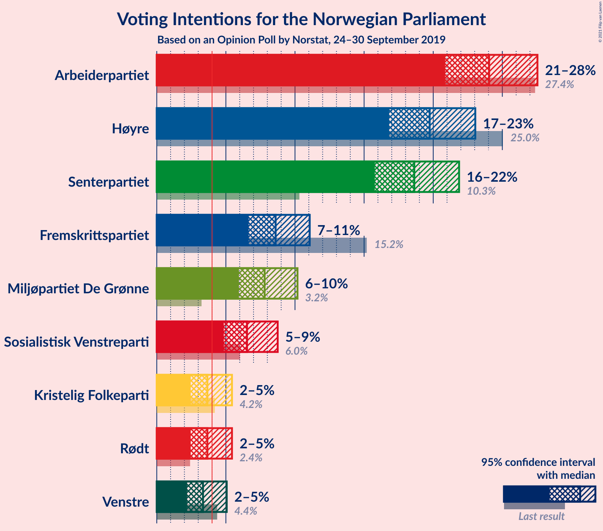

### Confidence Intervals

| Party | Last Result | Poll Result | 80% Confidence Interval | 90% Confidence Interval | 95% Confidence Interval | 99% Confidence Interval |
|:-----:|:-----------:|:-----------:|:-----------------------:|:-----------------------:|:-----------------------:|:-----------------------:|
| Arbeiderpartiet | 27.4% | 24.0% | 21.9–26.3% |21.4–27.0% |20.9–27.5% |19.9–28.7% |
| Høyre | 25.0% | 19.7% | 17.8–21.9% |17.3–22.5% |16.8–23.0% |15.9–24.1% |
| Senterpartiet | 10.3% | 18.6% | 16.8–20.7% |16.2–21.4% |15.8–21.9% |14.9–22.9% |
| Fremskrittspartiet | 15.2% | 8.6% | 7.3–10.2% |7.0–10.7% |6.6–11.1% |6.1–11.9% |
| Miljøpartiet De Grønne | 3.2% | 7.8% | 6.6–9.3% |6.2–9.8% |5.9–10.2% |5.4–11.0% |
| Sosialistisk Venstreparti | 6.0% | 6.5% | 5.4–8.0% |5.1–8.4% |4.8–8.7% |4.4–9.5% |
| Rødt | 2.4% | 3.7% | 2.9–4.8% |2.6–5.2% |2.5–5.4% |2.1–6.1% |
| Kristelig Folkeparti | 4.2% | 3.7% | 2.9–4.8% |2.6–5.2% |2.5–5.4% |2.1–6.1% |
| Venstre | 4.4% | 3.3% | 2.6–4.5% |2.4–4.8% |2.2–5.1% |1.9–5.7% |

*Note:* The poll result column reflects the actual value used in the calculations. Published results may vary slightly, and in addition be rounded to fewer digits.

## Seats

### Confidence Intervals

| Party | Last Result | Median | 80% Confidence Interval | 90% Confidence Interval | 95% Confidence Interval | 99% Confidence Interval |
|:-----:|:-----------:|:------:|:-----------------------:|:-----------------------:|:-----------------------:|:-----------------------:|
| <a href="#arbeiderpartiet">Arbeiderpartiet</a> | 49 | 44 | 42–46 |41–48 |40–49 |38–52 |
| <a href="#høyre">Høyre</a> | 45 | 35 | 33–39 |31–40 |30–41 |27–43 |
| <a href="#senterpartiet">Senterpartiet</a> | 19 | 36 | 33–38 |32–39 |31–41 |28–43 |
| <a href="#fremskrittspartiet">Fremskrittspartiet</a> | 27 | 14 | 12–17 |11–18 |11–19 |9–21 |
| <a href="#miljøpartiet-de-grønne">Miljøpartiet De Grønne</a> | 1 | 13 | 11–16 |10–17 |9–18 |8–19 |
| <a href="#sosialistisk-venstreparti">Sosialistisk Venstreparti</a> | 11 | 11 | 9–14 |8–14 |8–15 |7–16 |
| <a href="#rødt">Rødt</a> | 1 | 2 | 1–8 |1–8 |1–9 |1–10 |
| <a href="#kristelig-folkeparti">Kristelig Folkeparti</a> | 8 | 3 | 1–8 |1–8 |1–9 |0–10 |
| <a href="#venstre">Venstre</a> | 8 | 2 | 2–7 |2–8 |1–8 |1–9 |

### Arbeiderpartiet

*For a full overview of the results for this party, see the [Arbeiderpartiet](party-arbeiderpartiet.html) page.*

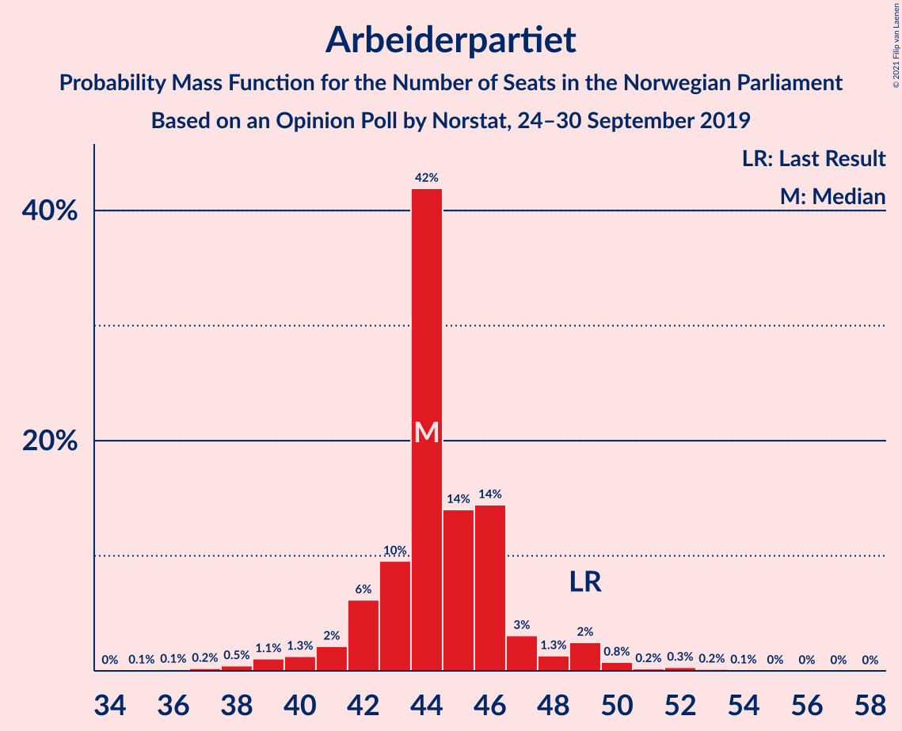

| Number of Seats | Probability | Accumulated | Special Marks |
|:---------------:|:-----------:|:-----------:|:-------------:|
| 34 | 0% | 100% |  |
| 35 | 0.1% | 99.9% |  |
| 36 | 0.1% | 99.9% |  |
| 37 | 0.2% | 99.7% |  |
| 38 | 0.5% | 99.5% |  |
| 39 | 1.1% | 99.1% |  |
| 40 | 1.3% | 98% |  |
| 41 | 2% | 97% |  |
| 42 | 6% | 95% |  |
| 43 | 10% | 88% |  |
| 44 | 42% | 79% | Median |
| 45 | 14% | 37% |  |
| 46 | 14% | 23% |  |
| 47 | 3% | 8% |  |
| 48 | 1.3% | 5% |  |
| 49 | 2% | 4% | Last Result |
| 50 | 0.8% | 2% |  |
| 51 | 0.2% | 0.8% |  |
| 52 | 0.3% | 0.7% |  |
| 53 | 0.2% | 0.3% |  |
| 54 | 0.1% | 0.2% |  |
| 55 | 0% | 0.1% |  |
| 56 | 0% | 0.1% |  |
| 57 | 0% | 0% |  |

### Høyre

*For a full overview of the results for this party, see the [Høyre](party-høyre.html) page.*

| Number of Seats | Probability | Accumulated | Special Marks |
|:---------------:|:-----------:|:-----------:|:-------------:|
| 25 | 0% | 100% |  |
| 26 | 0.2% | 99.9% |  |
| 27 | 0.5% | 99.8% |  |
| 28 | 0.8% | 99.3% |  |
| 29 | 1.0% | 98.5% |  |
| 30 | 2% | 98% |  |
| 31 | 2% | 96% |  |
| 32 | 4% | 94% |  |
| 33 | 12% | 90% |  |
| 34 | 19% | 78% |  |
| 35 | 18% | 59% | Median |
| 36 | 9% | 41% |  |
| 37 | 12% | 32% |  |
| 38 | 6% | 19% |  |
| 39 | 5% | 14% |  |
| 40 | 4% | 8% |  |
| 41 | 1.5% | 4% |  |
| 42 | 2% | 2% |  |
| 43 | 0.4% | 0.6% |  |
| 44 | 0.1% | 0.2% |  |
| 45 | 0.1% | 0.1% | Last Result |
| 46 | 0% | 0% |  |

### Senterpartiet

*For a full overview of the results for this party, see the [Senterpartiet](party-senterpartiet.html) page.*

| Number of Seats | Probability | Accumulated | Special Marks |
|:---------------:|:-----------:|:-----------:|:-------------:|
| 19 | 0% | 100% | Last Result |
| 20 | 0% | 100% |  |
| 21 | 0% | 100% |  |
| 22 | 0% | 100% |  |
| 23 | 0% | 100% |  |
| 24 | 0% | 100% |  |
| 25 | 0.1% | 100% |  |
| 26 | 0.1% | 99.9% |  |
| 27 | 0.1% | 99.8% |  |
| 28 | 0.4% | 99.7% |  |
| 29 | 0.4% | 99.4% |  |
| 30 | 0.6% | 98.9% |  |
| 31 | 2% | 98% |  |
| 32 | 3% | 96% |  |
| 33 | 7% | 94% |  |
| 34 | 11% | 87% |  |
| 35 | 14% | 76% |  |
| 36 | 44% | 62% | Median |
| 37 | 7% | 18% |  |
| 38 | 3% | 11% |  |
| 39 | 3% | 8% |  |
| 40 | 2% | 5% |  |
| 41 | 1.1% | 3% |  |
| 42 | 1.0% | 2% |  |
| 43 | 0.5% | 0.6% |  |
| 44 | 0.1% | 0.2% |  |
| 45 | 0% | 0% |  |

### Fremskrittspartiet

*For a full overview of the results for this party, see the [Fremskrittspartiet](party-fremskrittspartiet.html) page.*

| Number of Seats | Probability | Accumulated | Special Marks |
|:---------------:|:-----------:|:-----------:|:-------------:|
| 8 | 0.1% | 100% |  |
| 9 | 0.6% | 99.9% |  |
| 10 | 1.4% | 99.2% |  |
| 11 | 4% | 98% |  |
| 12 | 11% | 94% |  |
| 13 | 16% | 83% |  |
| 14 | 24% | 68% | Median |
| 15 | 13% | 43% |  |
| 16 | 14% | 31% |  |
| 17 | 8% | 16% |  |
| 18 | 4% | 9% |  |
| 19 | 2% | 5% |  |
| 20 | 1.3% | 2% |  |
| 21 | 0.9% | 1.0% |  |
| 22 | 0.1% | 0.1% |  |
| 23 | 0% | 0% |  |
| 24 | 0% | 0% |  |
| 25 | 0% | 0% |  |
| 26 | 0% | 0% |  |
| 27 | 0% | 0% | Last Result |

### Miljøpartiet De Grønne

*For a full overview of the results for this party, see the [Miljøpartiet De Grønne](party-miljøpartietdegrønne.html) page.*

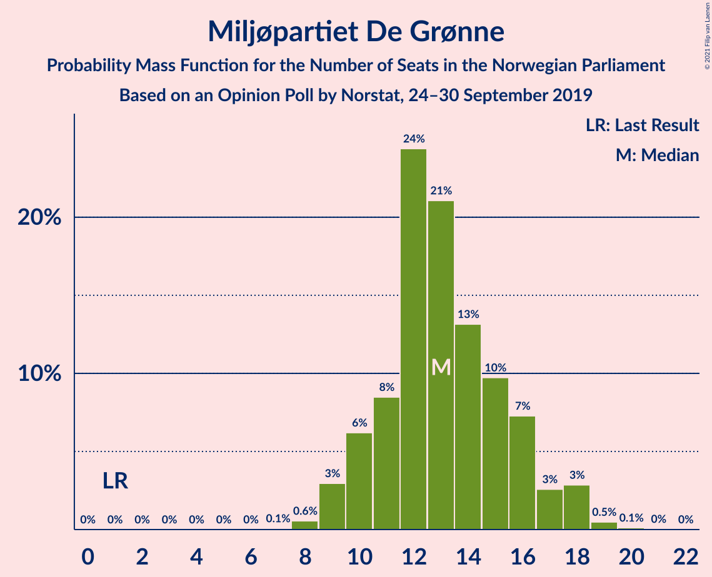

| Number of Seats | Probability | Accumulated | Special Marks |
|:---------------:|:-----------:|:-----------:|:-------------:|
| 1 | 0% | 100% | Last Result |
| 2 | 0% | 100% |  |
| 3 | 0% | 100% |  |
| 4 | 0% | 100% |  |
| 5 | 0% | 100% |  |
| 6 | 0% | 100% |  |
| 7 | 0.1% | 100% |  |
| 8 | 0.6% | 99.9% |  |
| 9 | 3% | 99.4% |  |
| 10 | 6% | 96% |  |
| 11 | 8% | 90% |  |
| 12 | 24% | 82% |  |
| 13 | 21% | 57% | Median |
| 14 | 13% | 36% |  |
| 15 | 10% | 23% |  |
| 16 | 7% | 13% |  |
| 17 | 3% | 6% |  |
| 18 | 3% | 4% |  |
| 19 | 0.5% | 0.6% |  |
| 20 | 0.1% | 0.2% |  |
| 21 | 0% | 0% |  |

### Sosialistisk Venstreparti

*For a full overview of the results for this party, see the [Sosialistisk Venstreparti](party-sosialistiskvenstreparti.html) page.*

| Number of Seats | Probability | Accumulated | Special Marks |
|:---------------:|:-----------:|:-----------:|:-------------:|
| 2 | 0.1% | 100% |  |
| 3 | 0.1% | 99.9% |  |
| 4 | 0% | 99.9% |  |
| 5 | 0% | 99.9% |  |
| 6 | 0.2% | 99.9% |  |
| 7 | 1.2% | 99.7% |  |
| 8 | 5% | 98% |  |
| 9 | 8% | 93% |  |
| 10 | 20% | 85% |  |
| 11 | 24% | 65% | Last Result, Median |
| 12 | 13% | 41% |  |
| 13 | 14% | 28% |  |
| 14 | 9% | 13% |  |
| 15 | 2% | 4% |  |
| 16 | 2% | 2% |  |
| 17 | 0.3% | 0.4% |  |
| 18 | 0.1% | 0.2% |  |
| 19 | 0% | 0% |  |

### Rødt

*For a full overview of the results for this party, see the [Rødt](party-rødt.html) page.*

| Number of Seats | Probability | Accumulated | Special Marks |
|:---------------:|:-----------:|:-----------:|:-------------:|
| 1 | 11% | 100% | Last Result |
| 2 | 58% | 89% | Median |
| 3 | 0.2% | 31% |  |
| 4 | 0% | 31% |  |
| 5 | 0% | 31% |  |
| 6 | 6% | 31% |  |
| 7 | 8% | 24% |  |
| 8 | 12% | 16% |  |
| 9 | 4% | 4% |  |
| 10 | 0.6% | 0.8% |  |
| 11 | 0.2% | 0.2% |  |
| 12 | 0% | 0% |  |

### Kristelig Folkeparti

*For a full overview of the results for this party, see the [Kristelig Folkeparti](party-kristeligfolkeparti.html) page.*

| Number of Seats | Probability | Accumulated | Special Marks |
|:---------------:|:-----------:|:-----------:|:-------------:|
| 0 | 0.5% | 100% |  |
| 1 | 15% | 99.5% |  |
| 2 | 9% | 84% |  |
| 3 | 31% | 75% | Median |
| 4 | 0% | 44% |  |
| 5 | 0% | 44% |  |
| 6 | 8% | 44% |  |
| 7 | 23% | 36% |  |
| 8 | 9% | 13% | Last Result |
| 9 | 4% | 4% |  |
| 10 | 0.7% | 0.8% |  |
| 11 | 0.1% | 0.1% |  |
| 12 | 0% | 0% |  |

### Venstre

*For a full overview of the results for this party, see the [Venstre](party-venstre.html) page.*

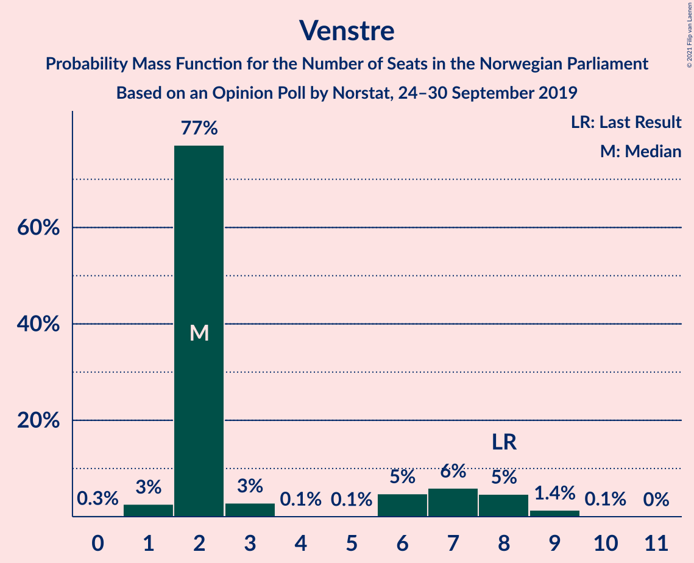

| Number of Seats | Probability | Accumulated | Special Marks |
|:---------------:|:-----------:|:-----------:|:-------------:|
| 0 | 0.3% | 100% |  |
| 1 | 3% | 99.7% |  |
| 2 | 77% | 97% | Median |
| 3 | 3% | 20% |  |
| 4 | 0.1% | 17% |  |
| 5 | 0.1% | 17% |  |
| 6 | 5% | 17% |  |
| 7 | 6% | 12% |  |
| 8 | 5% | 6% | Last Result |
| 9 | 1.4% | 2% |  |
| 10 | 0.1% | 0.2% |  |
| 11 | 0% | 0% |  |

## Coalitions

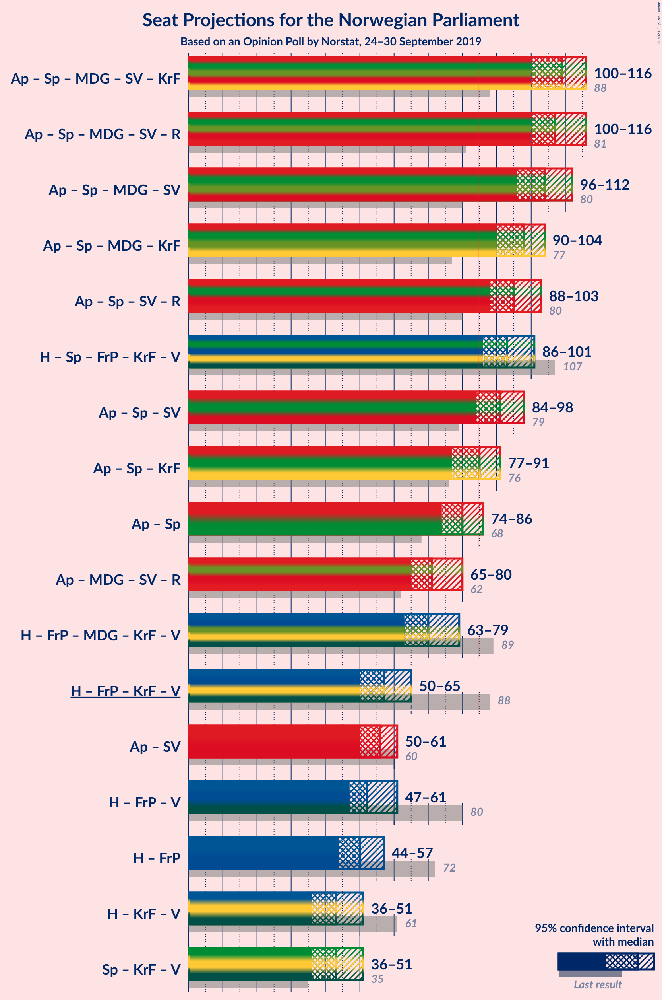

### Confidence Intervals

| Coalition | Last Result | Median | Majority? | 80% Confidence Interval | 90% Confidence Interval | 95% Confidence Interval | 99% Confidence Interval |
|:---------:|:-----------:|:------:|:---------:|:-----------------------:|:-----------------------:|:-----------------------:|:-----------------------:|
| Arbeiderpartiet – Senterpartiet – Miljøpartiet De Grønne – Sosialistisk Venstreparti – Kristelig Folkeparti | 88 | 109 | 100% | 103–114 | 101–115 | 100–116 | 97–119 |
| Arbeiderpartiet – Senterpartiet – Miljøpartiet De Grønne – Sosialistisk Venstreparti – Rødt | 81 | 107 | 100% | 103–114 | 101–116 | 100–116 | 98–118 |
| Arbeiderpartiet – Senterpartiet – Miljøpartiet De Grønne – Sosialistisk Venstreparti | 80 | 104 | 100% | 99–109 | 98–111 | 96–112 | 94–114 |
| Arbeiderpartiet – Senterpartiet – Miljøpartiet De Grønne – Kristelig Folkeparti | 77 | 98 | 99.9% | 92–102 | 91–103 | 90–104 | 87–108 |
| Arbeiderpartiet – Senterpartiet – Sosialistisk Venstreparti – Rødt | 80 | 95 | 99.6% | 90–100 | 89–102 | 88–103 | 85–105 |
| Høyre – Senterpartiet – Fremskrittspartiet – Kristelig Folkeparti – Venstre | 107 | 93 | 98.8% | 88–98 | 87–99 | 86–101 | 83–104 |
| Arbeiderpartiet – Senterpartiet – Sosialistisk Venstreparti | 79 | 91 | 97% | 87–95 | 86–96 | 84–98 | 82–100 |
| Arbeiderpartiet – Senterpartiet – Kristelig Folkeparti | 76 | 85 | 51% | 79–88 | 78–90 | 77–91 | 74–95 |
| Arbeiderpartiet – Senterpartiet | 68 | 80 | 6% | 77–83 | 75–85 | 74–86 | 71–89 |
| Arbeiderpartiet – Miljøpartiet De Grønne – Sosialistisk Venstreparti – Rødt | 62 | 71 | 0.1% | 68–79 | 66–80 | 65–80 | 62–83 |
| Høyre – Fremskrittspartiet – Miljøpartiet De Grønne – Kristelig Folkeparti – Venstre | 89 | 70 | 0.1% | 65–76 | 63–77 | 63–79 | 60–82 |
| Høyre – Fremskrittspartiet – Kristelig Folkeparti – Venstre | 88 | 57 | 0% | 52–62 | 51–64 | 50–65 | 48–69 |
| Arbeiderpartiet – Sosialistisk Venstreparti | 60 | 56 | 0% | 52–59 | 52–59 | 50–61 | 47–63 |
| Høyre – Fremskrittspartiet – Venstre | 80 | 52 | 0% | 48–58 | 48–59 | 47–61 | 44–65 |
| Høyre – Fremskrittspartiet | 72 | 50 | 0% | 46–54 | 45–56 | 44–57 | 41–61 |
| Høyre – Kristelig Folkeparti – Venstre | 61 | 43 | 0% | 38–47 | 37–49 | 36–51 | 33–53 |
| Senterpartiet – Kristelig Folkeparti – Venstre | 35 | 43 | 0% | 38–47 | 37–49 | 36–51 | 34–54 |

### Arbeiderpartiet – Senterpartiet – Miljøpartiet De Grønne – Sosialistisk Venstreparti – Kristelig Folkeparti

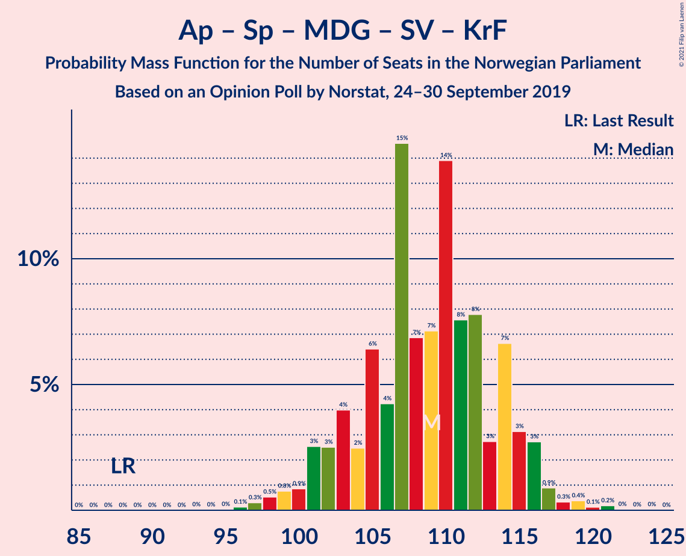

| Number of Seats | Probability | Accumulated | Special Marks |
|:---------------:|:-----------:|:-----------:|:-------------:|
| 88 | 0% | 100% | Last Result |
| 89 | 0% | 100% |  |
| 90 | 0% | 100% |  |
| 91 | 0% | 100% |  |
| 92 | 0% | 100% |  |
| 93 | 0% | 100% |  |
| 94 | 0% | 100% |  |
| 95 | 0% | 99.9% |  |
| 96 | 0.1% | 99.9% |  |
| 97 | 0.3% | 99.8% |  |
| 98 | 0.5% | 99.5% |  |
| 99 | 0.8% | 98.9% |  |
| 100 | 0.9% | 98% |  |
| 101 | 3% | 97% |  |
| 102 | 3% | 95% |  |
| 103 | 4% | 92% |  |
| 104 | 2% | 88% |  |
| 105 | 6% | 86% |  |
| 106 | 4% | 79% |  |
| 107 | 15% | 75% | Median |
| 108 | 7% | 61% |  |
| 109 | 7% | 54% |  |
| 110 | 14% | 47% |  |
| 111 | 8% | 33% |  |
| 112 | 8% | 25% |  |
| 113 | 3% | 17% |  |
| 114 | 7% | 15% |  |
| 115 | 3% | 8% |  |
| 116 | 3% | 5% |  |
| 117 | 0.9% | 2% |  |
| 118 | 0.3% | 1.1% |  |
| 119 | 0.4% | 0.8% |  |
| 120 | 0.1% | 0.4% |  |
| 121 | 0.2% | 0.3% |  |
| 122 | 0% | 0.1% |  |
| 123 | 0% | 0.1% |  |
| 124 | 0% | 0% |  |

### Arbeiderpartiet – Senterpartiet – Miljøpartiet De Grønne – Sosialistisk Venstreparti – Rødt

| Number of Seats | Probability | Accumulated | Special Marks |
|:---------------:|:-----------:|:-----------:|:-------------:|
| 81 | 0% | 100% | Last Result |
| 82 | 0% | 100% |  |
| 83 | 0% | 100% |  |
| 84 | 0% | 100% |  |
| 85 | 0% | 100% | Majority |
| 86 | 0% | 100% |  |
| 87 | 0% | 100% |  |
| 88 | 0% | 100% |  |
| 89 | 0% | 100% |  |
| 90 | 0% | 100% |  |
| 91 | 0% | 100% |  |
| 92 | 0% | 100% |  |
| 93 | 0% | 100% |  |
| 94 | 0.1% | 100% |  |
| 95 | 0.1% | 99.9% |  |
| 96 | 0.1% | 99.8% |  |
| 97 | 0.1% | 99.7% |  |
| 98 | 0.5% | 99.6% |  |
| 99 | 0.6% | 99.1% |  |
| 100 | 1.4% | 98% |  |
| 101 | 3% | 97% |  |
| 102 | 2% | 94% |  |
| 103 | 7% | 92% |  |
| 104 | 5% | 85% |  |
| 105 | 12% | 81% |  |
| 106 | 8% | 68% | Median |
| 107 | 12% | 60% |  |
| 108 | 5% | 49% |  |
| 109 | 12% | 44% |  |
| 110 | 6% | 31% |  |
| 111 | 7% | 26% |  |
| 112 | 3% | 18% |  |
| 113 | 2% | 16% |  |
| 114 | 3% | 13% |  |
| 115 | 4% | 10% |  |
| 116 | 5% | 6% |  |
| 117 | 0.6% | 1.3% |  |
| 118 | 0.4% | 0.6% |  |
| 119 | 0.1% | 0.3% |  |
| 120 | 0.1% | 0.2% |  |
| 121 | 0% | 0.1% |  |
| 122 | 0% | 0.1% |  |
| 123 | 0% | 0% |  |

### Arbeiderpartiet – Senterpartiet – Miljøpartiet De Grønne – Sosialistisk Venstreparti

| Number of Seats | Probability | Accumulated | Special Marks |
|:---------------:|:-----------:|:-----------:|:-------------:|
| 80 | 0% | 100% | Last Result |
| 81 | 0% | 100% |  |
| 82 | 0% | 100% |  |
| 83 | 0% | 100% |  |
| 84 | 0% | 100% |  |
| 85 | 0% | 100% | Majority |
| 86 | 0% | 100% |  |
| 87 | 0% | 100% |  |
| 88 | 0% | 100% |  |
| 89 | 0% | 100% |  |
| 90 | 0% | 100% |  |
| 91 | 0% | 99.9% |  |
| 92 | 0.1% | 99.9% |  |
| 93 | 0.2% | 99.8% |  |
| 94 | 0.3% | 99.6% |  |
| 95 | 0.4% | 99.2% |  |
| 96 | 2% | 98.8% |  |
| 97 | 1.3% | 97% |  |
| 98 | 2% | 96% |  |
| 99 | 4% | 94% |  |
| 100 | 6% | 90% |  |
| 101 | 9% | 84% |  |
| 102 | 7% | 76% |  |
| 103 | 12% | 68% |  |
| 104 | 10% | 56% | Median |
| 105 | 9% | 46% |  |
| 106 | 4% | 37% |  |
| 107 | 14% | 33% |  |
| 108 | 7% | 20% |  |
| 109 | 4% | 13% |  |
| 110 | 2% | 8% |  |
| 111 | 2% | 6% |  |
| 112 | 2% | 4% |  |
| 113 | 0.8% | 2% |  |
| 114 | 1.0% | 1.5% |  |
| 115 | 0.1% | 0.5% |  |
| 116 | 0.2% | 0.3% |  |
| 117 | 0.1% | 0.1% |  |
| 118 | 0% | 0% |  |

### Arbeiderpartiet – Senterpartiet – Miljøpartiet De Grønne – Kristelig Folkeparti

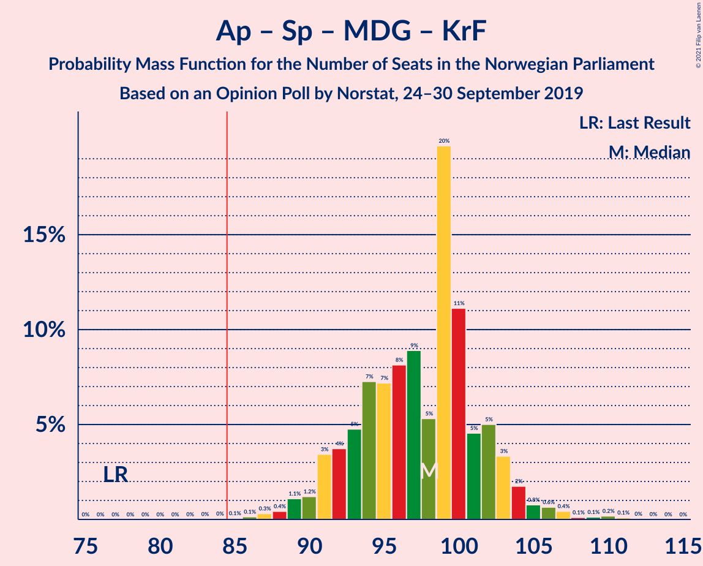

| Number of Seats | Probability | Accumulated | Special Marks |
|:---------------:|:-----------:|:-----------:|:-------------:|
| 77 | 0% | 100% | Last Result |
| 78 | 0% | 100% |  |
| 79 | 0% | 100% |  |
| 80 | 0% | 100% |  |
| 81 | 0% | 100% |  |
| 82 | 0% | 100% |  |
| 83 | 0% | 100% |  |
| 84 | 0% | 100% |  |
| 85 | 0.1% | 99.9% | Majority |
| 86 | 0.1% | 99.9% |  |
| 87 | 0.3% | 99.7% |  |
| 88 | 0.4% | 99.4% |  |
| 89 | 1.1% | 99.0% |  |
| 90 | 1.2% | 98% |  |
| 91 | 3% | 97% |  |
| 92 | 4% | 93% |  |
| 93 | 5% | 89% |  |
| 94 | 7% | 85% |  |
| 95 | 7% | 77% |  |
| 96 | 8% | 70% | Median |
| 97 | 9% | 62% |  |
| 98 | 5% | 53% |  |
| 99 | 20% | 48% |  |
| 100 | 11% | 28% |  |
| 101 | 5% | 17% |  |
| 102 | 5% | 13% |  |
| 103 | 3% | 8% |  |
| 104 | 2% | 4% |  |
| 105 | 0.8% | 2% |  |
| 106 | 0.6% | 2% |  |
| 107 | 0.4% | 1.0% |  |
| 108 | 0.1% | 0.6% |  |
| 109 | 0.1% | 0.5% |  |
| 110 | 0.2% | 0.3% |  |
| 111 | 0.1% | 0.2% |  |
| 112 | 0% | 0.1% |  |
| 113 | 0% | 0% |  |

### Arbeiderpartiet – Senterpartiet – Sosialistisk Venstreparti – Rødt

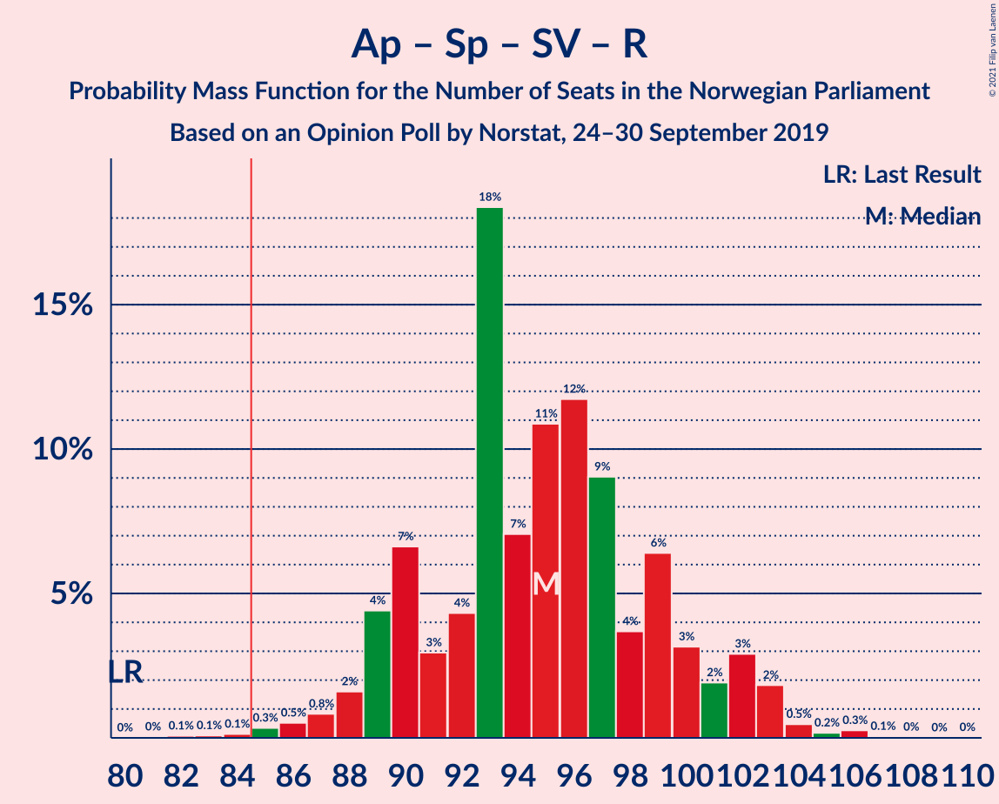

| Number of Seats | Probability | Accumulated | Special Marks |
|:---------------:|:-----------:|:-----------:|:-------------:|
| 80 | 0% | 100% | Last Result |
| 81 | 0% | 100% |  |
| 82 | 0.1% | 99.9% |  |
| 83 | 0.1% | 99.9% |  |
| 84 | 0.1% | 99.8% |  |
| 85 | 0.3% | 99.6% | Majority |
| 86 | 0.5% | 99.3% |  |
| 87 | 0.8% | 98.8% |  |
| 88 | 2% | 98% |  |
| 89 | 4% | 96% |  |
| 90 | 7% | 92% |  |
| 91 | 3% | 85% |  |
| 92 | 4% | 82% |  |
| 93 | 18% | 78% | Median |
| 94 | 7% | 60% |  |
| 95 | 11% | 53% |  |
| 96 | 12% | 42% |  |
| 97 | 9% | 30% |  |
| 98 | 4% | 21% |  |
| 99 | 6% | 17% |  |
| 100 | 3% | 11% |  |
| 101 | 2% | 8% |  |
| 102 | 3% | 6% |  |
| 103 | 2% | 3% |  |
| 104 | 0.5% | 1.0% |  |
| 105 | 0.2% | 0.6% |  |
| 106 | 0.3% | 0.4% |  |
| 107 | 0.1% | 0.1% |  |
| 108 | 0% | 0.1% |  |
| 109 | 0% | 0% |  |

### Høyre – Senterpartiet – Fremskrittspartiet – Kristelig Folkeparti – Venstre

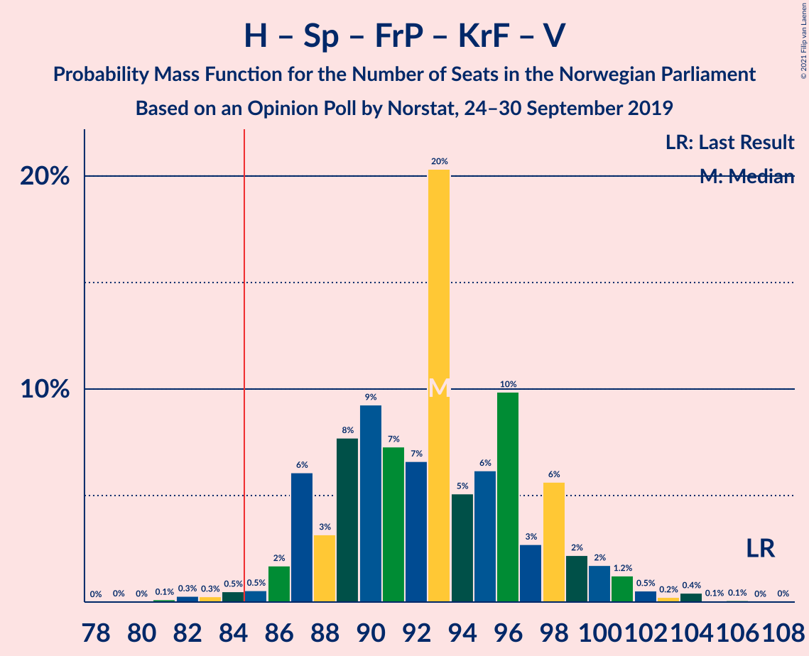

| Number of Seats | Probability | Accumulated | Special Marks |
|:---------------:|:-----------:|:-----------:|:-------------:|
| 79 | 0% | 100% |  |
| 80 | 0% | 99.9% |  |
| 81 | 0.1% | 99.9% |  |
| 82 | 0.3% | 99.8% |  |
| 83 | 0.3% | 99.5% |  |
| 84 | 0.5% | 99.2% |  |
| 85 | 0.5% | 98.8% | Majority |
| 86 | 2% | 98% |  |
| 87 | 6% | 96% |  |
| 88 | 3% | 90% |  |
| 89 | 8% | 87% |  |
| 90 | 9% | 80% | Median |
| 91 | 7% | 70% |  |
| 92 | 7% | 63% |  |
| 93 | 20% | 56% |  |
| 94 | 5% | 36% |  |
| 95 | 6% | 31% |  |
| 96 | 10% | 25% |  |
| 97 | 3% | 15% |  |
| 98 | 6% | 12% |  |
| 99 | 2% | 7% |  |
| 100 | 2% | 4% |  |
| 101 | 1.2% | 3% |  |
| 102 | 0.5% | 1.4% |  |
| 103 | 0.2% | 0.9% |  |
| 104 | 0.4% | 0.6% |  |
| 105 | 0.1% | 0.2% |  |
| 106 | 0.1% | 0.1% |  |
| 107 | 0% | 0.1% | Last Result |
| 108 | 0% | 0% |  |

### Arbeiderpartiet – Senterpartiet – Sosialistisk Venstreparti

| Number of Seats | Probability | Accumulated | Special Marks |
|:---------------:|:-----------:|:-----------:|:-------------:|
| 79 | 0.1% | 100% | Last Result |
| 80 | 0.1% | 99.9% |  |
| 81 | 0.2% | 99.8% |  |
| 82 | 0.2% | 99.6% |  |
| 83 | 0.7% | 99.4% |  |
| 84 | 1.3% | 98.6% |  |
| 85 | 2% | 97% | Majority |
| 86 | 3% | 95% |  |
| 87 | 6% | 92% |  |
| 88 | 8% | 86% |  |
| 89 | 7% | 79% |  |
| 90 | 4% | 72% |  |
| 91 | 20% | 68% | Median |
| 92 | 12% | 47% |  |
| 93 | 11% | 36% |  |
| 94 | 12% | 25% |  |
| 95 | 6% | 13% |  |
| 96 | 2% | 7% |  |
| 97 | 1.4% | 4% |  |
| 98 | 1.4% | 3% |  |
| 99 | 0.6% | 1.4% |  |
| 100 | 0.2% | 0.7% |  |
| 101 | 0.2% | 0.5% |  |
| 102 | 0.2% | 0.3% |  |
| 103 | 0% | 0.1% |  |
| 104 | 0% | 0% |  |

### Arbeiderpartiet – Senterpartiet – Kristelig Folkeparti

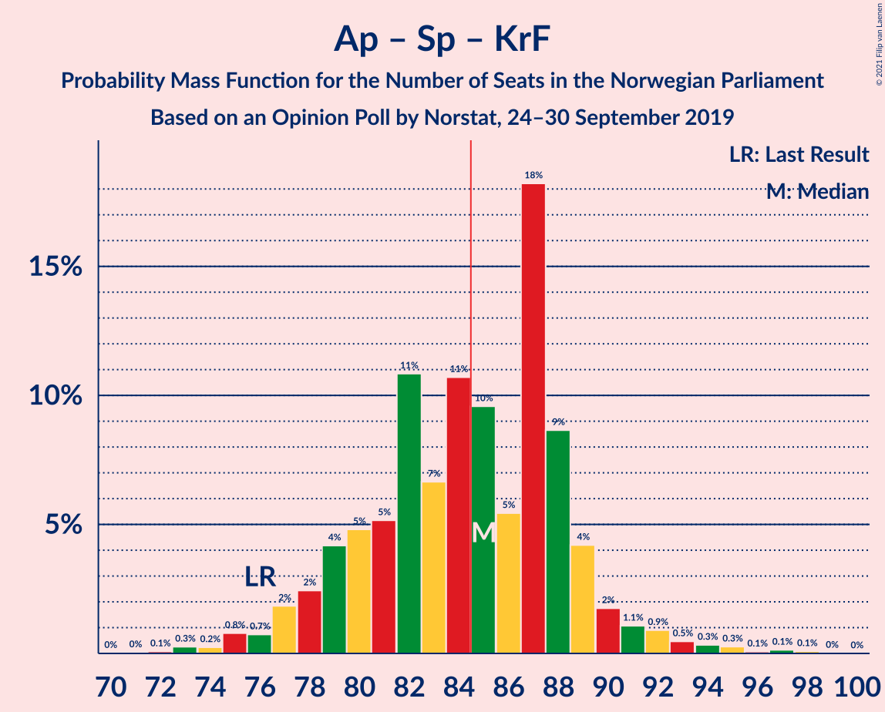

| Number of Seats | Probability | Accumulated | Special Marks |
|:---------------:|:-----------:|:-----------:|:-------------:|
| 71 | 0% | 100% |  |
| 72 | 0.1% | 99.9% |  |
| 73 | 0.3% | 99.9% |  |
| 74 | 0.2% | 99.6% |  |
| 75 | 0.8% | 99.4% |  |
| 76 | 0.7% | 98.6% | Last Result |
| 77 | 2% | 98% |  |
| 78 | 2% | 96% |  |
| 79 | 4% | 94% |  |
| 80 | 5% | 89% |  |
| 81 | 5% | 85% |  |
| 82 | 11% | 79% |  |
| 83 | 7% | 69% | Median |
| 84 | 11% | 62% |  |
| 85 | 10% | 51% | Majority |
| 86 | 5% | 42% |  |
| 87 | 18% | 36% |  |
| 88 | 9% | 18% |  |
| 89 | 4% | 9% |  |
| 90 | 2% | 5% |  |
| 91 | 1.1% | 3% |  |
| 92 | 0.9% | 2% |  |
| 93 | 0.5% | 1.4% |  |
| 94 | 0.3% | 0.9% |  |
| 95 | 0.3% | 0.6% |  |
| 96 | 0.1% | 0.3% |  |
| 97 | 0.1% | 0.2% |  |
| 98 | 0.1% | 0.1% |  |
| 99 | 0% | 0% |  |

### Arbeiderpartiet – Senterpartiet

| Number of Seats | Probability | Accumulated | Special Marks |
|:---------------:|:-----------:|:-----------:|:-------------:|
| 68 | 0% | 100% | Last Result |
| 69 | 0% | 99.9% |  |
| 70 | 0.2% | 99.9% |  |
| 71 | 0.2% | 99.7% |  |
| 72 | 0.6% | 99.5% |  |
| 73 | 0.7% | 98.9% |  |
| 74 | 2% | 98% |  |
| 75 | 2% | 96% |  |
| 76 | 3% | 94% |  |
| 77 | 8% | 91% |  |
| 78 | 9% | 83% |  |
| 79 | 7% | 74% |  |
| 80 | 31% | 67% | Median |
| 81 | 12% | 35% |  |
| 82 | 10% | 23% |  |
| 83 | 5% | 13% |  |
| 84 | 2% | 8% |  |
| 85 | 3% | 6% | Majority |
| 86 | 1.1% | 3% |  |
| 87 | 0.7% | 2% |  |
| 88 | 0.5% | 1.3% |  |
| 89 | 0.4% | 0.8% |  |
| 90 | 0.2% | 0.5% |  |
| 91 | 0.2% | 0.2% |  |
| 92 | 0% | 0% |  |

### Arbeiderpartiet – Miljøpartiet De Grønne – Sosialistisk Venstreparti – Rødt

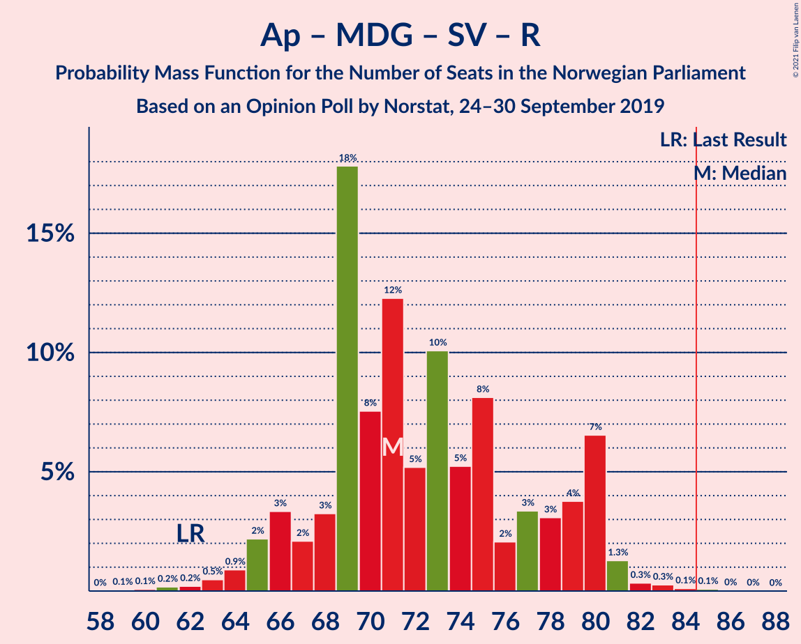

| Number of Seats | Probability | Accumulated | Special Marks |
|:---------------:|:-----------:|:-----------:|:-------------:|
| 59 | 0.1% | 100% |  |
| 60 | 0.1% | 99.9% |  |
| 61 | 0.2% | 99.9% |  |
| 62 | 0.2% | 99.7% | Last Result |
| 63 | 0.5% | 99.5% |  |
| 64 | 0.9% | 99.0% |  |
| 65 | 2% | 98% |  |
| 66 | 3% | 96% |  |
| 67 | 2% | 93% |  |
| 68 | 3% | 90% |  |
| 69 | 18% | 87% |  |
| 70 | 8% | 69% | Median |
| 71 | 12% | 62% |  |
| 72 | 5% | 50% |  |
| 73 | 10% | 44% |  |
| 74 | 5% | 34% |  |
| 75 | 8% | 29% |  |
| 76 | 2% | 21% |  |
| 77 | 3% | 19% |  |
| 78 | 3% | 16% |  |
| 79 | 4% | 12% |  |
| 80 | 7% | 9% |  |
| 81 | 1.3% | 2% |  |
| 82 | 0.3% | 0.9% |  |
| 83 | 0.3% | 0.5% |  |
| 84 | 0.1% | 0.3% |  |
| 85 | 0.1% | 0.1% | Majority |
| 86 | 0% | 0.1% |  |
| 87 | 0% | 0% |  |

### Høyre – Fremskrittspartiet – Miljøpartiet De Grønne – Kristelig Folkeparti – Venstre

| Number of Seats | Probability | Accumulated | Special Marks |
|:---------------:|:-----------:|:-----------:|:-------------:|
| 57 | 0% | 100% |  |
| 58 | 0.1% | 99.9% |  |
| 59 | 0.1% | 99.8% |  |
| 60 | 0.3% | 99.7% |  |
| 61 | 0.5% | 99.4% |  |
| 62 | 1.3% | 98.9% |  |
| 63 | 3% | 98% |  |
| 64 | 2% | 94% |  |
| 65 | 5% | 92% |  |
| 66 | 9% | 87% |  |
| 67 | 6% | 79% | Median |
| 68 | 4% | 72% |  |
| 69 | 14% | 68% |  |
| 70 | 8% | 54% |  |
| 71 | 4% | 46% |  |
| 72 | 11% | 42% |  |
| 73 | 11% | 31% |  |
| 74 | 6% | 20% |  |
| 75 | 4% | 15% |  |
| 76 | 5% | 11% |  |
| 77 | 2% | 6% |  |
| 78 | 1.3% | 5% |  |
| 79 | 1.3% | 3% |  |
| 80 | 0.6% | 2% |  |
| 81 | 0.7% | 1.3% |  |
| 82 | 0.2% | 0.7% |  |
| 83 | 0.2% | 0.4% |  |
| 84 | 0.1% | 0.2% |  |
| 85 | 0% | 0.1% | Majority |
| 86 | 0% | 0.1% |  |
| 87 | 0% | 0% |  |
| 88 | 0% | 0% |  |
| 89 | 0% | 0% | Last Result |

### Høyre – Fremskrittspartiet – Kristelig Folkeparti – Venstre

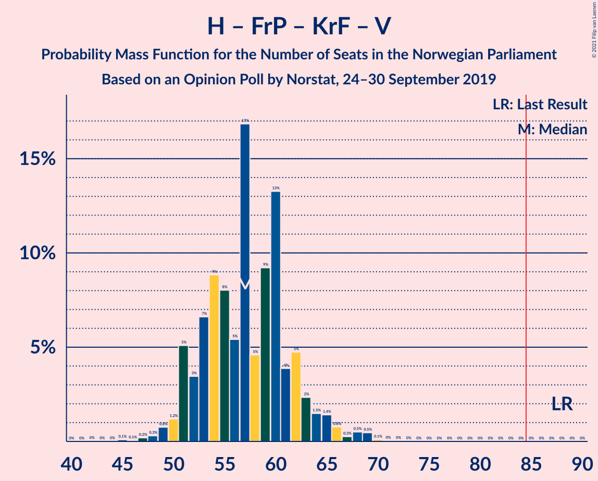

| Number of Seats | Probability | Accumulated | Special Marks |
|:---------------:|:-----------:|:-----------:|:-------------:|
| 44 | 0% | 100% |  |
| 45 | 0.1% | 99.9% |  |
| 46 | 0.1% | 99.9% |  |
| 47 | 0.2% | 99.8% |  |
| 48 | 0.3% | 99.6% |  |
| 49 | 0.8% | 99.3% |  |
| 50 | 1.2% | 98.6% |  |
| 51 | 5% | 97% |  |
| 52 | 3% | 92% |  |
| 53 | 7% | 89% |  |
| 54 | 9% | 82% | Median |
| 55 | 8% | 73% |  |
| 56 | 5% | 65% |  |
| 57 | 17% | 60% |  |
| 58 | 5% | 43% |  |
| 59 | 9% | 38% |  |
| 60 | 13% | 29% |  |
| 61 | 4% | 16% |  |
| 62 | 5% | 12% |  |
| 63 | 2% | 7% |  |
| 64 | 1.5% | 5% |  |
| 65 | 1.4% | 4% |  |
| 66 | 0.8% | 2% |  |
| 67 | 0.3% | 1.4% |  |
| 68 | 0.5% | 1.1% |  |
| 69 | 0.5% | 0.6% |  |
| 70 | 0.1% | 0.2% |  |
| 71 | 0% | 0.1% |  |
| 72 | 0% | 0% |  |
| 73 | 0% | 0% |  |
| 74 | 0% | 0% |  |
| 75 | 0% | 0% |  |
| 76 | 0% | 0% |  |
| 77 | 0% | 0% |  |
| 78 | 0% | 0% |  |
| 79 | 0% | 0% |  |
| 80 | 0% | 0% |  |
| 81 | 0% | 0% |  |
| 82 | 0% | 0% |  |
| 83 | 0% | 0% |  |
| 84 | 0% | 0% |  |
| 85 | 0% | 0% | Majority |
| 86 | 0% | 0% |  |
| 87 | 0% | 0% |  |
| 88 | 0% | 0% | Last Result |

### Arbeiderpartiet – Sosialistisk Venstreparti

| Number of Seats | Probability | Accumulated | Special Marks |
|:---------------:|:-----------:|:-----------:|:-------------:|
| 44 | 0% | 100% |  |
| 45 | 0.1% | 99.9% |  |
| 46 | 0.2% | 99.8% |  |
| 47 | 0.2% | 99.7% |  |
| 48 | 0.4% | 99.5% |  |
| 49 | 0.6% | 99.0% |  |
| 50 | 2% | 98% |  |
| 51 | 2% | 97% |  |
| 52 | 7% | 95% |  |
| 53 | 7% | 88% |  |
| 54 | 10% | 81% |  |
| 55 | 20% | 71% | Median |
| 56 | 13% | 51% |  |
| 57 | 12% | 38% |  |
| 58 | 14% | 25% |  |
| 59 | 7% | 11% |  |
| 60 | 1.4% | 5% | Last Result |
| 61 | 2% | 3% |  |
| 62 | 0.5% | 1.3% |  |
| 63 | 0.3% | 0.7% |  |
| 64 | 0.2% | 0.4% |  |
| 65 | 0.2% | 0.3% |  |
| 66 | 0% | 0.1% |  |
| 67 | 0% | 0.1% |  |
| 68 | 0% | 0.1% |  |
| 69 | 0% | 0% |  |

### Høyre – Fremskrittspartiet – Venstre

| Number of Seats | Probability | Accumulated | Special Marks |
|:---------------:|:-----------:|:-----------:|:-------------:|
| 40 | 0% | 100% |  |
| 41 | 0% | 99.9% |  |
| 42 | 0.2% | 99.9% |  |
| 43 | 0.2% | 99.8% |  |
| 44 | 0.2% | 99.6% |  |
| 45 | 0.6% | 99.4% |  |
| 46 | 0.9% | 98.8% |  |
| 47 | 1.0% | 98% |  |
| 48 | 7% | 97% |  |
| 49 | 7% | 90% |  |
| 50 | 16% | 83% |  |
| 51 | 8% | 67% | Median |
| 52 | 9% | 58% |  |
| 53 | 15% | 49% |  |
| 54 | 7% | 34% |  |
| 55 | 5% | 27% |  |
| 56 | 4% | 22% |  |
| 57 | 6% | 18% |  |
| 58 | 5% | 12% |  |
| 59 | 4% | 7% |  |
| 60 | 0.7% | 4% |  |
| 61 | 1.0% | 3% |  |
| 62 | 1.0% | 2% |  |
| 63 | 0.3% | 1.2% |  |
| 64 | 0.3% | 0.8% |  |
| 65 | 0.4% | 0.6% |  |
| 66 | 0.1% | 0.1% |  |
| 67 | 0% | 0.1% |  |
| 68 | 0% | 0% |  |
| 69 | 0% | 0% |  |
| 70 | 0% | 0% |  |
| 71 | 0% | 0% |  |
| 72 | 0% | 0% |  |
| 73 | 0% | 0% |  |
| 74 | 0% | 0% |  |
| 75 | 0% | 0% |  |
| 76 | 0% | 0% |  |
| 77 | 0% | 0% |  |
| 78 | 0% | 0% |  |
| 79 | 0% | 0% |  |
| 80 | 0% | 0% | Last Result |

### Høyre – Fremskrittspartiet

| Number of Seats | Probability | Accumulated | Special Marks |
|:---------------:|:-----------:|:-----------:|:-------------:|
| 38 | 0% | 100% |  |
| 39 | 0.1% | 99.9% |  |
| 40 | 0.2% | 99.9% |  |
| 41 | 0.4% | 99.6% |  |
| 42 | 0.6% | 99.2% |  |
| 43 | 0.9% | 98.6% |  |
| 44 | 1.4% | 98% |  |
| 45 | 2% | 96% |  |
| 46 | 9% | 95% |  |
| 47 | 8% | 86% |  |
| 48 | 17% | 78% |  |
| 49 | 10% | 61% | Median |
| 50 | 10% | 51% |  |
| 51 | 15% | 41% |  |
| 52 | 9% | 26% |  |
| 53 | 4% | 17% |  |
| 54 | 4% | 13% |  |
| 55 | 4% | 9% |  |
| 56 | 1.4% | 5% |  |
| 57 | 2% | 4% |  |
| 58 | 0.4% | 2% |  |
| 59 | 0.5% | 1.1% |  |
| 60 | 0.1% | 0.6% |  |
| 61 | 0.1% | 0.5% |  |
| 62 | 0.1% | 0.5% |  |
| 63 | 0.2% | 0.3% |  |
| 64 | 0.1% | 0.1% |  |
| 65 | 0% | 0% |  |
| 66 | 0% | 0% |  |
| 67 | 0% | 0% |  |
| 68 | 0% | 0% |  |
| 69 | 0% | 0% |  |
| 70 | 0% | 0% |  |
| 71 | 0% | 0% |  |
| 72 | 0% | 0% | Last Result |

### Høyre – Kristelig Folkeparti – Venstre

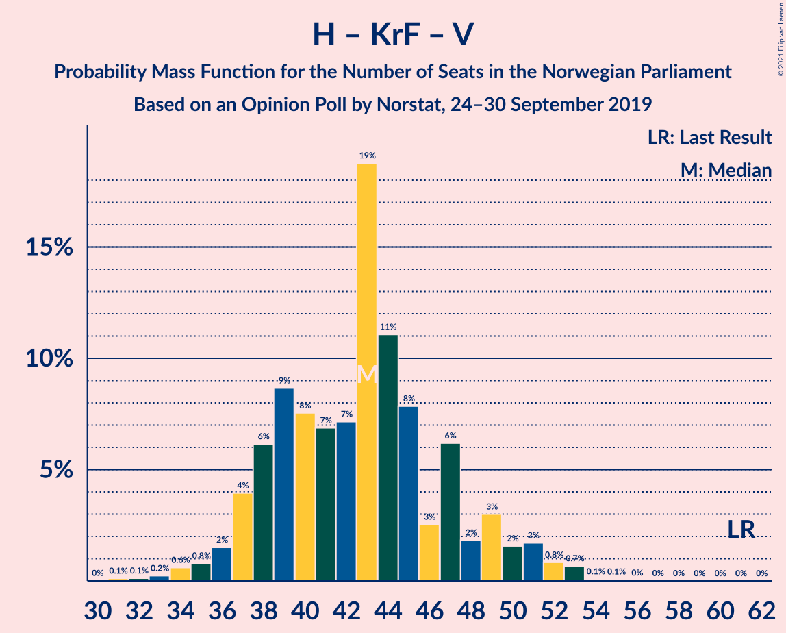

| Number of Seats | Probability | Accumulated | Special Marks |
|:---------------:|:-----------:|:-----------:|:-------------:|
| 31 | 0.1% | 100% |  |
| 32 | 0.1% | 99.9% |  |
| 33 | 0.2% | 99.7% |  |
| 34 | 0.6% | 99.5% |  |
| 35 | 0.8% | 98.9% |  |
| 36 | 2% | 98% |  |
| 37 | 4% | 97% |  |
| 38 | 6% | 93% |  |
| 39 | 9% | 86% |  |
| 40 | 8% | 78% | Median |
| 41 | 7% | 70% |  |
| 42 | 7% | 63% |  |
| 43 | 19% | 56% |  |
| 44 | 11% | 37% |  |
| 45 | 8% | 26% |  |
| 46 | 3% | 19% |  |
| 47 | 6% | 16% |  |
| 48 | 2% | 10% |  |
| 49 | 3% | 8% |  |
| 50 | 2% | 5% |  |
| 51 | 2% | 3% |  |
| 52 | 0.8% | 2% |  |
| 53 | 0.7% | 0.9% |  |
| 54 | 0.1% | 0.2% |  |
| 55 | 0.1% | 0.1% |  |
| 56 | 0% | 0% |  |
| 57 | 0% | 0% |  |
| 58 | 0% | 0% |  |
| 59 | 0% | 0% |  |
| 60 | 0% | 0% |  |
| 61 | 0% | 0% | Last Result |

### Senterpartiet – Kristelig Folkeparti – Venstre

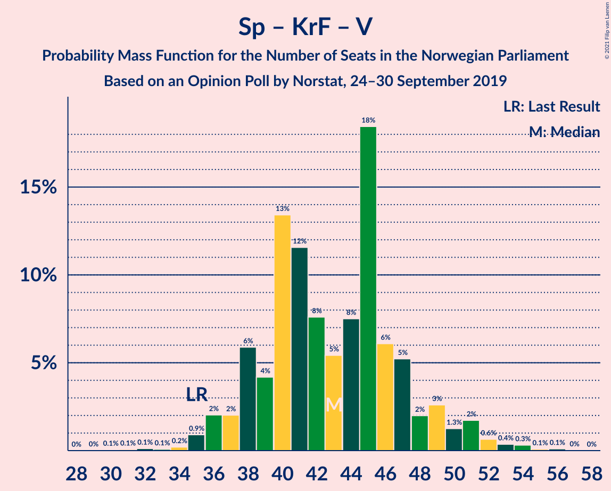

| Number of Seats | Probability | Accumulated | Special Marks |
|:---------------:|:-----------:|:-----------:|:-------------:|
| 30 | 0.1% | 100% |  |
| 31 | 0.1% | 99.9% |  |
| 32 | 0.1% | 99.9% |  |
| 33 | 0.1% | 99.7% |  |
| 34 | 0.2% | 99.7% |  |
| 35 | 0.9% | 99.4% | Last Result |
| 36 | 2% | 98.5% |  |
| 37 | 2% | 97% |  |
| 38 | 6% | 94% |  |
| 39 | 4% | 89% |  |
| 40 | 13% | 84% |  |
| 41 | 12% | 71% | Median |
| 42 | 8% | 59% |  |
| 43 | 5% | 52% |  |
| 44 | 8% | 46% |  |
| 45 | 18% | 39% |  |
| 46 | 6% | 20% |  |
| 47 | 5% | 14% |  |
| 48 | 2% | 9% |  |
| 49 | 3% | 7% |  |
| 50 | 1.3% | 5% |  |
| 51 | 2% | 3% |  |
| 52 | 0.6% | 2% |  |
| 53 | 0.4% | 0.9% |  |
| 54 | 0.3% | 0.5% |  |
| 55 | 0.1% | 0.2% |  |
| 56 | 0.1% | 0.1% |  |
| 57 | 0% | 0% |  |

## Technical Information

### Opinion Poll

+ **Polling firm:** Norstat
+ **Commissioner(s):** —
+ **Fieldwork period:** 24–30 September 2019

### Calculations

+ **Sample size:** 628
+ **Simulations done:** 1,048,576
+ **Error estimate:** 0.94%

