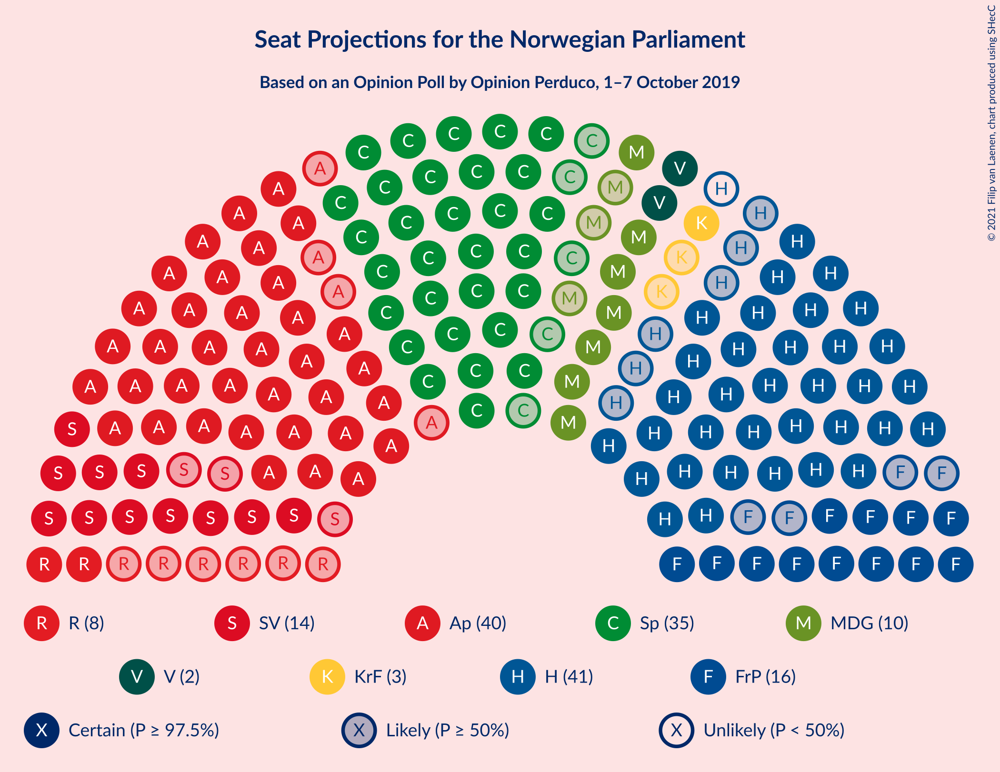
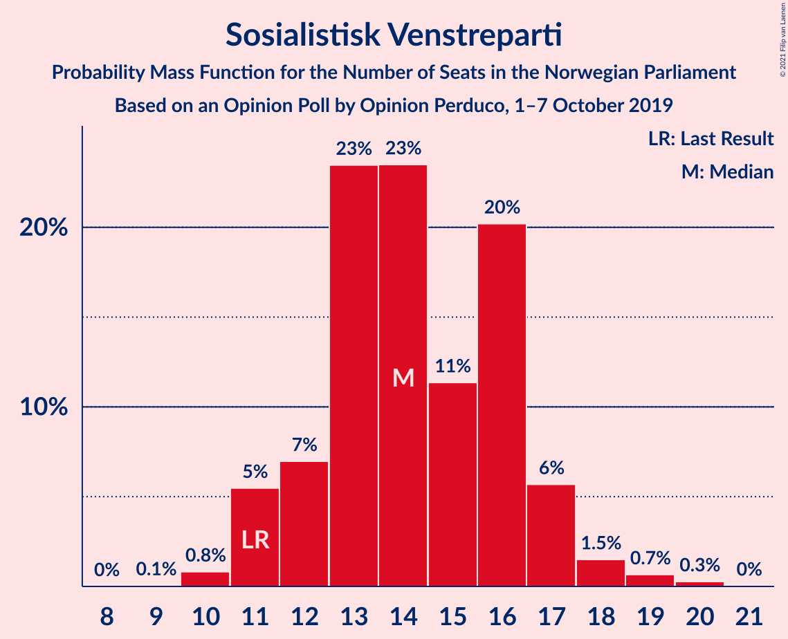
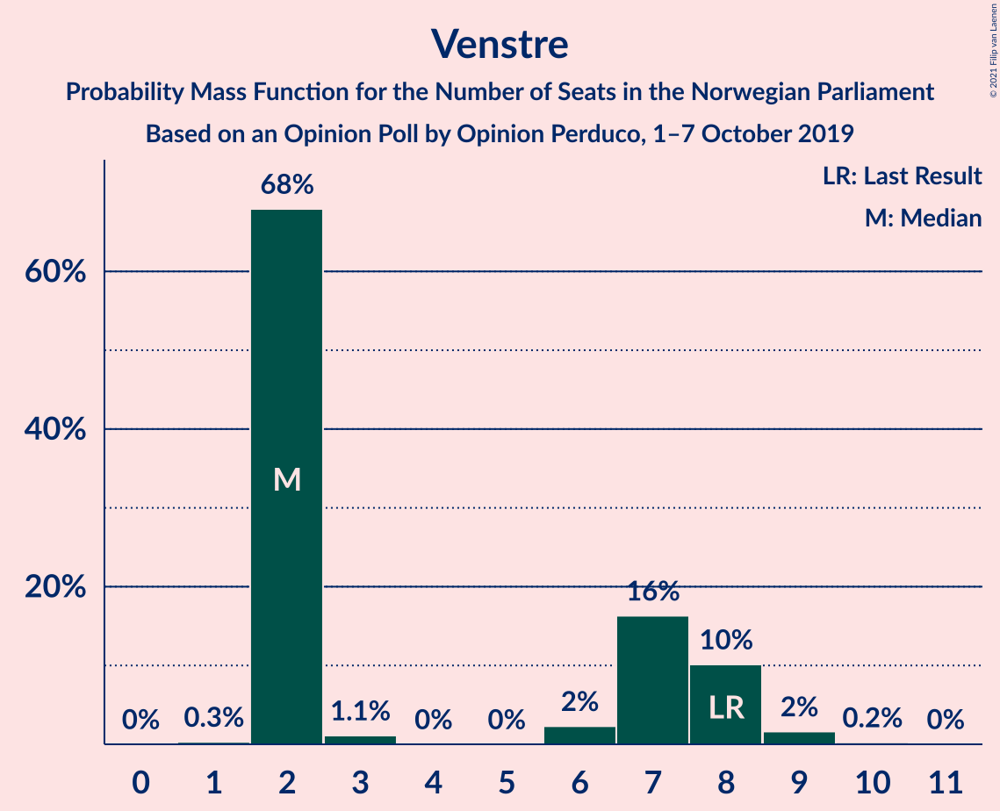
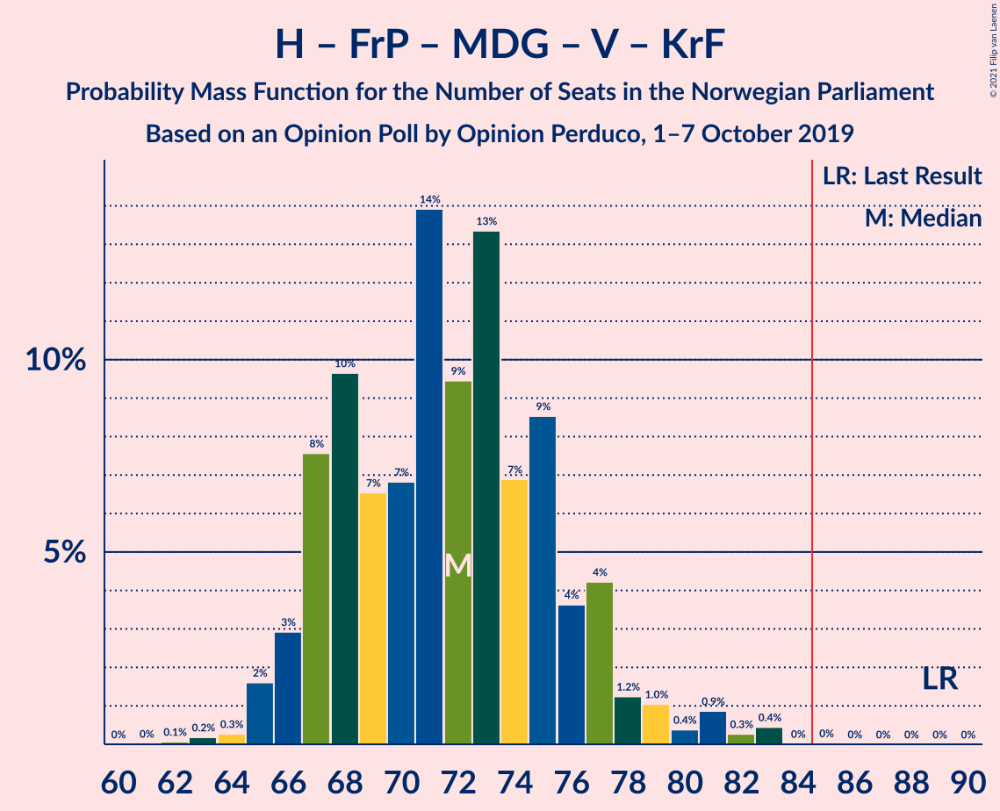
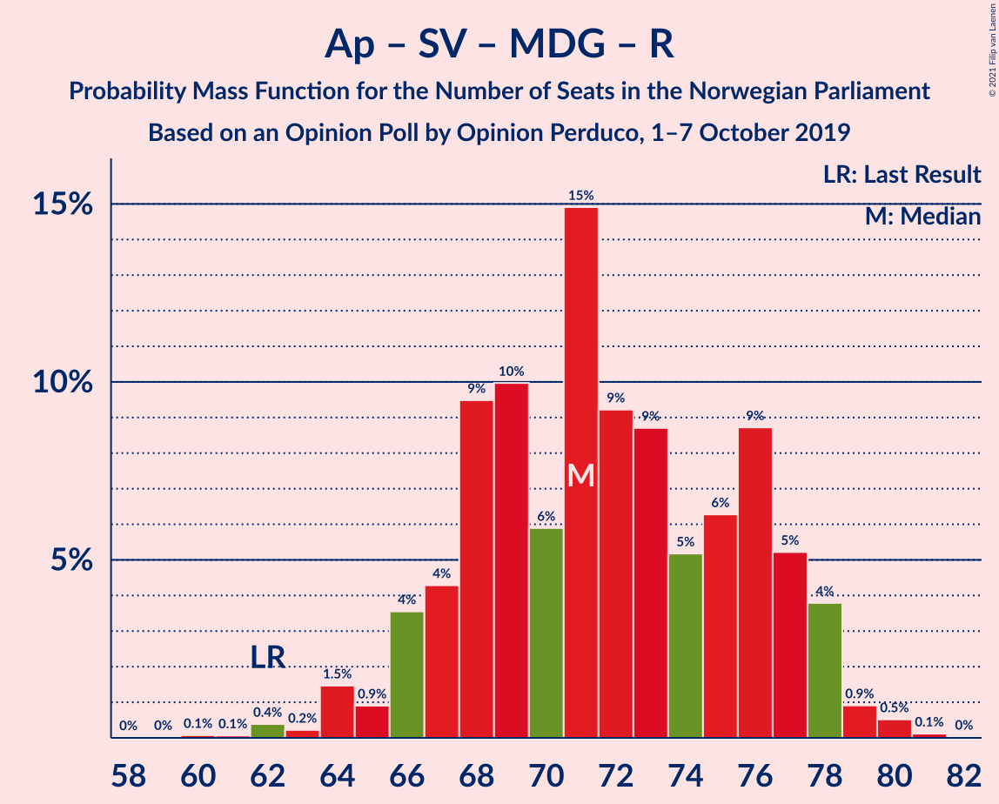
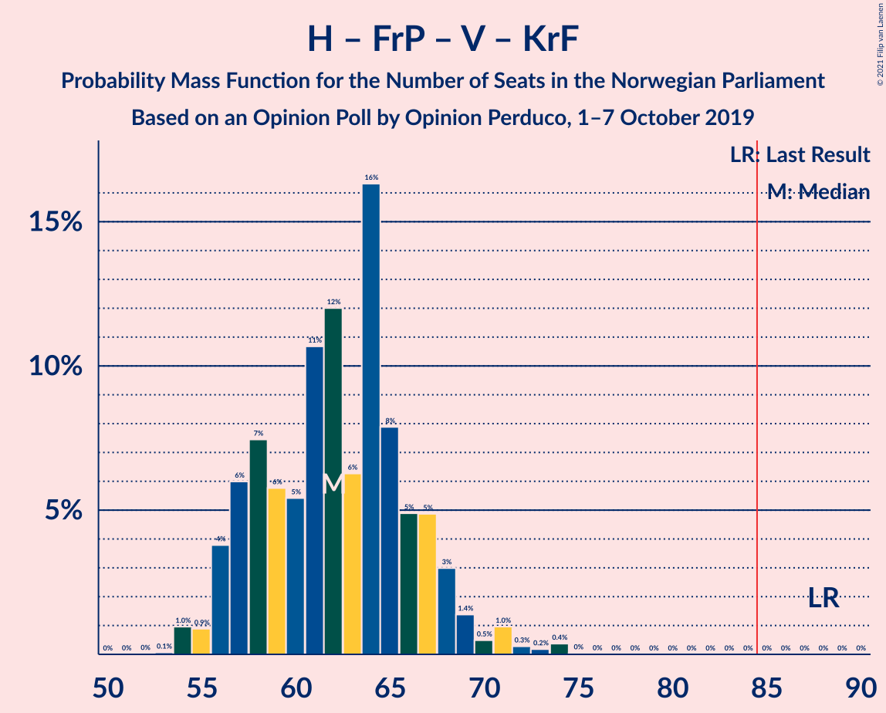
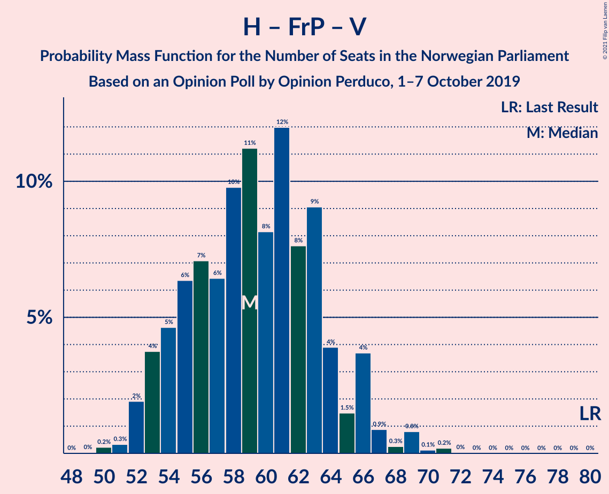

# Opinion Poll by Opinion Perduco, 1–7 October 2019

<a href="#voting-intentions">Voting Intentions</a> | <a href="#seats">Seats</a> | <a href="#coalitions">Coalitions</a> | <a href="#technical-information">Technical Information</a>

## Voting Intentions

### Confidence Intervals

| Party | Last Result | Poll Result | 80% Confidence Interval | 90% Confidence Interval | 95% Confidence Interval | 99% Confidence Interval |
|:-----:|:-----------:|:-----------:|:-----------------------:|:-----------------------:|:-----------------------:|:-----------------------:|
| Høyre | 25.0% | 22.8% | 21.1–24.6% |20.7–25.1% |20.3–25.6% |19.5–26.5% |
| Arbeiderpartiet | 27.4% | 22.2% | 20.5–24.0% |20.1–24.5% |19.7–25.0% |18.9–25.8% |
| Senterpartiet | 10.3% | 18.7% | 17.2–20.4% |16.7–20.9% |16.4–21.3% |15.6–22.2% |
| Fremskrittspartiet | 15.2% | 9.0% | 7.9–10.3% |7.6–10.7% |7.4–11.1% |6.9–11.7% |
| Sosialistisk Venstreparti | 6.0% | 8.2% | 7.2–9.5% |6.9–9.8% |6.6–10.1% |6.1–10.8% |
| Miljøpartiet De Grønne | 3.2% | 5.5% | 4.6–6.5% |4.4–6.8% |4.2–7.1% |3.8–7.7% |
| Rødt | 2.4% | 4.6% | 3.9–5.6% |3.6–5.9% |3.5–6.2% |3.1–6.7% |
| Venstre | 4.4% | 3.7% | 3.0–4.6% |2.8–4.8% |2.7–5.1% |2.4–5.5% |
| Kristelig Folkeparti | 4.2% | 3.4% | 2.7–4.3% |2.5–4.5% |2.4–4.7% |2.1–5.2% |

*Note:* The poll result column reflects the actual value used in the calculations. Published results may vary slightly, and in addition be rounded to fewer digits.

## Seats

### Confidence Intervals

| Party | Last Result | Median | 80% Confidence Interval | 90% Confidence Interval | 95% Confidence Interval | 99% Confidence Interval |
|:-----:|:-----------:|:------:|:-----------------------:|:-----------------------:|:-----------------------:|:-----------------------:|
| <a href="#høyre">Høyre</a> | 45 | 40 | 36–44 |35–44 |34–45 |34–47 |
| <a href="#arbeiderpartiet">Arbeiderpartiet</a> | 49 | 40 | 38–44 |37–44 |36–45 |33–46 |
| <a href="#senterpartiet">Senterpartiet</a> | 19 | 35 | 32–37 |31–38 |30–40 |28–41 |
| <a href="#fremskrittspartiet">Fremskrittspartiet</a> | 27 | 16 | 13–18 |13–19 |12–20 |11–21 |
| <a href="#sosialistisk-venstreparti">Sosialistisk Venstreparti</a> | 11 | 14 | 12–16 |11–17 |11–17 |10–19 |
| <a href="#miljøpartiet-de-grønne">Miljøpartiet De Grønne</a> | 1 | 10 | 8–11 |7–12 |7–12 |2–13 |
| <a href="#rødt">Rødt</a> | 1 | 8 | 2–10 |2–10 |2–11 |2–11 |
| <a href="#venstre">Venstre</a> | 8 | 2 | 2–8 |2–8 |2–8 |2–9 |
| <a href="#kristelig-folkeparti">Kristelig Folkeparti</a> | 8 | 3 | 1–7 |1–7 |1–8 |0–9 |

### Høyre

*For a full overview of the results for this party, see the [Høyre](party-høyre.html) page.*

| Number of Seats | Probability | Accumulated | Special Marks |
|:---------------:|:-----------:|:-----------:|:-------------:|
| 32 | 0% | 100% |  |
| 33 | 0.4% | 99.9% |  |
| 34 | 3% | 99.5% |  |
| 35 | 4% | 97% |  |
| 36 | 6% | 93% |  |
| 37 | 9% | 87% |  |
| 38 | 11% | 78% |  |
| 39 | 9% | 67% |  |
| 40 | 8% | 58% | Median |
| 41 | 15% | 49% |  |
| 42 | 12% | 34% |  |
| 43 | 12% | 22% |  |
| 44 | 6% | 10% |  |
| 45 | 3% | 5% | Last Result |
| 46 | 0.7% | 1.5% |  |
| 47 | 0.5% | 0.8% |  |
| 48 | 0.1% | 0.2% |  |
| 49 | 0.1% | 0.1% |  |
| 50 | 0% | 0% |  |

### Arbeiderpartiet

*For a full overview of the results for this party, see the [Arbeiderpartiet](party-arbeiderpartiet.html) page.*

| Number of Seats | Probability | Accumulated | Special Marks |
|:---------------:|:-----------:|:-----------:|:-------------:|
| 31 | 0.1% | 100% |  |
| 32 | 0.1% | 99.9% |  |
| 33 | 0.4% | 99.8% |  |
| 34 | 0.4% | 99.4% |  |
| 35 | 0.8% | 99.0% |  |
| 36 | 2% | 98% |  |
| 37 | 2% | 97% |  |
| 38 | 5% | 94% |  |
| 39 | 10% | 89% |  |
| 40 | 32% | 79% | Median |
| 41 | 9% | 46% |  |
| 42 | 11% | 37% |  |
| 43 | 10% | 26% |  |
| 44 | 12% | 16% |  |
| 45 | 3% | 4% |  |
| 46 | 0.6% | 1.0% |  |
| 47 | 0.3% | 0.4% |  |
| 48 | 0.1% | 0.1% |  |
| 49 | 0% | 0% | Last Result |

### Senterpartiet

*For a full overview of the results for this party, see the [Senterpartiet](party-senterpartiet.html) page.*

| Number of Seats | Probability | Accumulated | Special Marks |
|:---------------:|:-----------:|:-----------:|:-------------:|
| 19 | 0% | 100% | Last Result |
| 20 | 0% | 100% |  |
| 21 | 0% | 100% |  |
| 22 | 0% | 100% |  |
| 23 | 0% | 100% |  |
| 24 | 0% | 100% |  |
| 25 | 0% | 100% |  |
| 26 | 0% | 100% |  |
| 27 | 0.1% | 100% |  |
| 28 | 0.4% | 99.9% |  |
| 29 | 0.9% | 99.4% |  |
| 30 | 2% | 98.5% |  |
| 31 | 4% | 97% |  |
| 32 | 4% | 92% |  |
| 33 | 5% | 88% |  |
| 34 | 14% | 83% |  |
| 35 | 22% | 69% | Median |
| 36 | 29% | 47% |  |
| 37 | 10% | 18% |  |
| 38 | 3% | 8% |  |
| 39 | 2% | 5% |  |
| 40 | 2% | 3% |  |
| 41 | 0.8% | 1.0% |  |
| 42 | 0.1% | 0.2% |  |
| 43 | 0.1% | 0.1% |  |
| 44 | 0% | 0% |  |

### Fremskrittspartiet

*For a full overview of the results for this party, see the [Fremskrittspartiet](party-fremskrittspartiet.html) page.*

| Number of Seats | Probability | Accumulated | Special Marks |
|:---------------:|:-----------:|:-----------:|:-------------:|
| 10 | 0.1% | 100% |  |
| 11 | 1.1% | 99.9% |  |
| 12 | 2% | 98.8% |  |
| 13 | 8% | 97% |  |
| 14 | 22% | 89% |  |
| 15 | 16% | 67% |  |
| 16 | 19% | 51% | Median |
| 17 | 15% | 32% |  |
| 18 | 9% | 17% |  |
| 19 | 3% | 8% |  |
| 20 | 4% | 5% |  |
| 21 | 0.4% | 0.5% |  |
| 22 | 0.1% | 0.1% |  |
| 23 | 0% | 0% |  |
| 24 | 0% | 0% |  |
| 25 | 0% | 0% |  |
| 26 | 0% | 0% |  |
| 27 | 0% | 0% | Last Result |

### Sosialistisk Venstreparti

*For a full overview of the results for this party, see the [Sosialistisk Venstreparti](party-sosialistiskvenstreparti.html) page.*

| Number of Seats | Probability | Accumulated | Special Marks |
|:---------------:|:-----------:|:-----------:|:-------------:|
| 9 | 0.1% | 100% |  |
| 10 | 0.8% | 99.9% |  |
| 11 | 5% | 99.1% | Last Result |
| 12 | 7% | 94% |  |
| 13 | 23% | 87% |  |
| 14 | 23% | 63% | Median |
| 15 | 11% | 40% |  |
| 16 | 20% | 28% |  |
| 17 | 6% | 8% |  |
| 18 | 1.5% | 2% |  |
| 19 | 0.7% | 1.0% |  |
| 20 | 0.3% | 0.3% |  |
| 21 | 0% | 0% |  |

### Miljøpartiet De Grønne

*For a full overview of the results for this party, see the [Miljøpartiet De Grønne](party-miljøpartietdegrønne.html) page.*

| Number of Seats | Probability | Accumulated | Special Marks |
|:---------------:|:-----------:|:-----------:|:-------------:|
| 1 | 0% | 100% | Last Result |
| 2 | 0.8% | 100% |  |
| 3 | 0.9% | 99.2% |  |
| 4 | 0% | 98% |  |
| 5 | 0% | 98% |  |
| 6 | 0% | 98% |  |
| 7 | 7% | 98% |  |
| 8 | 16% | 92% |  |
| 9 | 24% | 76% |  |
| 10 | 28% | 52% | Median |
| 11 | 18% | 24% |  |
| 12 | 4% | 6% |  |
| 13 | 1.3% | 2% |  |
| 14 | 0.3% | 0.4% |  |
| 15 | 0.1% | 0.1% |  |
| 16 | 0% | 0% |  |

### Rødt

*For a full overview of the results for this party, see the [Rødt](party-rødt.html) page.*

| Number of Seats | Probability | Accumulated | Special Marks |
|:---------------:|:-----------:|:-----------:|:-------------:|
| 1 | 0.2% | 100% | Last Result |
| 2 | 18% | 99.8% |  |
| 3 | 0% | 82% |  |
| 4 | 0% | 82% |  |
| 5 | 0% | 82% |  |
| 6 | 0.7% | 82% |  |
| 7 | 17% | 81% |  |
| 8 | 36% | 65% | Median |
| 9 | 16% | 29% |  |
| 10 | 10% | 12% |  |
| 11 | 2% | 3% |  |
| 12 | 0.3% | 0.3% |  |
| 13 | 0% | 0% |  |

### Venstre

*For a full overview of the results for this party, see the [Venstre](party-venstre.html) page.*

| Number of Seats | Probability | Accumulated | Special Marks |
|:---------------:|:-----------:|:-----------:|:-------------:|
| 1 | 0.3% | 100% |  |
| 2 | 68% | 99.7% | Median |
| 3 | 1.1% | 32% |  |
| 4 | 0% | 31% |  |
| 5 | 0% | 31% |  |
| 6 | 2% | 31% |  |
| 7 | 16% | 28% |  |
| 8 | 10% | 12% | Last Result |
| 9 | 2% | 2% |  |
| 10 | 0.2% | 0.3% |  |
| 11 | 0% | 0% |  |

### Kristelig Folkeparti

*For a full overview of the results for this party, see the [Kristelig Folkeparti](party-kristeligfolkeparti.html) page.*

| Number of Seats | Probability | Accumulated | Special Marks |
|:---------------:|:-----------:|:-----------:|:-------------:|
| 0 | 2% | 100% |  |
| 1 | 30% | 98% |  |
| 2 | 15% | 69% |  |
| 3 | 37% | 54% | Median |
| 4 | 0% | 16% |  |
| 5 | 0% | 16% |  |
| 6 | 3% | 16% |  |
| 7 | 10% | 13% |  |
| 8 | 3% | 4% | Last Result |
| 9 | 0.6% | 0.7% |  |
| 10 | 0.1% | 0.1% |  |
| 11 | 0% | 0% |  |

## Coalitions

### Confidence Intervals

| Coalition | Last Result | Median | Majority? | 80% Confidence Interval | 90% Confidence Interval | 95% Confidence Interval | 99% Confidence Interval |
|:---------:|:-----------:|:------:|:---------:|:-----------------------:|:-----------------------:|:-----------------------:|:-----------------------:|
| Arbeiderpartiet – Senterpartiet – Sosialistisk Venstreparti – Miljøpartiet De Grønne – Rødt | 81 | 107 | 100% | 102–112 | 101–113 | 100–113 | 96–115 |
| Arbeiderpartiet – Senterpartiet – Sosialistisk Venstreparti – Miljøpartiet De Grønne – Kristelig Folkeparti | 88 | 102 | 100% | 98–107 | 97–108 | 95–109 | 93–111 |
| Arbeiderpartiet – Senterpartiet – Sosialistisk Venstreparti – Miljøpartiet De Grønne | 80 | 100 | 100% | 96–104 | 94–105 | 93–106 | 91–108 |
| Høyre – Senterpartiet – Fremskrittspartiet – Venstre – Kristelig Folkeparti | 107 | 98 | 100% | 92–102 | 91–103 | 91–104 | 89–107 |
| Arbeiderpartiet – Senterpartiet – Sosialistisk Venstreparti – Rødt | 80 | 97 | 100% | 93–102 | 92–103 | 90–103 | 86–105 |
| Arbeiderpartiet – Senterpartiet – Sosialistisk Venstreparti | 79 | 90 | 96% | 87–94 | 85–95 | 84–96 | 81–98 |
| Arbeiderpartiet – Senterpartiet – Miljøpartiet De Grønne – Kristelig Folkeparti | 77 | 88 | 84% | 84–92 | 83–94 | 81–95 | 79–97 |
| Arbeiderpartiet – Senterpartiet – Kristelig Folkeparti | 76 | 79 | 5% | 75–83 | 73–85 | 71–86 | 69–87 |
| Arbeiderpartiet – Senterpartiet | 68 | 76 | 0% | 72–80 | 71–80 | 70–81 | 67–83 |
| Høyre – Fremskrittspartiet – Miljøpartiet De Grønne – Venstre – Kristelig Folkeparti | 89 | 72 | 0% | 67–76 | 66–77 | 66–79 | 64–83 |
| Arbeiderpartiet – Sosialistisk Venstreparti – Miljøpartiet De Grønne – Rødt | 62 | 71 | 0% | 67–77 | 66–78 | 65–78 | 62–80 |
| Høyre – Fremskrittspartiet – Venstre – Kristelig Folkeparti | 88 | 62 | 0% | 57–67 | 56–68 | 56–69 | 54–73 |
| Høyre – Fremskrittspartiet – Venstre | 80 | 59 | 0% | 54–64 | 53–66 | 52–66 | 51–69 |
| Høyre – Fremskrittspartiet | 72 | 56 | 0% | 51–61 | 50–62 | 49–64 | 48–64 |
| Arbeiderpartiet – Sosialistisk Venstreparti | 60 | 55 | 0% | 51–59 | 51–59 | 50–60 | 47–62 |
| Høyre – Venstre – Kristelig Folkeparti | 61 | 47 | 0% | 42–51 | 41–53 | 40–54 | 38–56 |
| Senterpartiet – Venstre – Kristelig Folkeparti | 35 | 41 | 0% | 37–48 | 36–49 | 35–50 | 33–52 |

### Arbeiderpartiet – Senterpartiet – Sosialistisk Venstreparti – Miljøpartiet De Grønne – Rødt

| Number of Seats | Probability | Accumulated | Special Marks |
|:---------------:|:-----------:|:-----------:|:-------------:|
| 81 | 0% | 100% | Last Result |
| 82 | 0% | 100% |  |
| 83 | 0% | 100% |  |
| 84 | 0% | 100% |  |
| 85 | 0% | 100% | Majority |
| 86 | 0% | 100% |  |
| 87 | 0% | 100% |  |
| 88 | 0% | 100% |  |
| 89 | 0% | 100% |  |
| 90 | 0% | 100% |  |
| 91 | 0% | 100% |  |
| 92 | 0% | 100% |  |
| 93 | 0% | 100% |  |
| 94 | 0% | 100% |  |
| 95 | 0.4% | 99.9% |  |
| 96 | 0.2% | 99.6% |  |
| 97 | 0.3% | 99.4% |  |
| 98 | 1.0% | 99.1% |  |
| 99 | 0.5% | 98% |  |
| 100 | 1.4% | 98% |  |
| 101 | 3% | 96% |  |
| 102 | 5% | 93% |  |
| 103 | 5% | 88% |  |
| 104 | 8% | 84% |  |
| 105 | 16% | 76% |  |
| 106 | 6% | 59% |  |
| 107 | 12% | 53% | Median |
| 108 | 11% | 41% |  |
| 109 | 5% | 30% |  |
| 110 | 6% | 25% |  |
| 111 | 7% | 19% |  |
| 112 | 6% | 12% |  |
| 113 | 4% | 6% |  |
| 114 | 0.9% | 2% |  |
| 115 | 1.0% | 1.0% |  |
| 116 | 0.1% | 0.1% |  |
| 117 | 0% | 0% |  |

### Arbeiderpartiet – Senterpartiet – Sosialistisk Venstreparti – Miljøpartiet De Grønne – Kristelig Folkeparti

| Number of Seats | Probability | Accumulated | Special Marks |
|:---------------:|:-----------:|:-----------:|:-------------:|
| 88 | 0% | 100% | Last Result |
| 89 | 0% | 100% |  |
| 90 | 0% | 100% |  |
| 91 | 0.1% | 100% |  |
| 92 | 0.1% | 99.9% |  |
| 93 | 0.9% | 99.8% |  |
| 94 | 0.4% | 98.9% |  |
| 95 | 1.3% | 98.5% |  |
| 96 | 1.3% | 97% |  |
| 97 | 3% | 96% |  |
| 98 | 6% | 92% |  |
| 99 | 7% | 87% |  |
| 100 | 11% | 79% |  |
| 101 | 9% | 68% |  |
| 102 | 11% | 60% | Median |
| 103 | 9% | 49% |  |
| 104 | 10% | 40% |  |
| 105 | 9% | 30% |  |
| 106 | 7% | 22% |  |
| 107 | 5% | 14% |  |
| 108 | 6% | 10% |  |
| 109 | 2% | 4% |  |
| 110 | 0.9% | 2% |  |
| 111 | 0.7% | 1.0% |  |
| 112 | 0.1% | 0.2% |  |
| 113 | 0% | 0.1% |  |
| 114 | 0% | 0.1% |  |
| 115 | 0% | 0% |  |

### Arbeiderpartiet – Senterpartiet – Sosialistisk Venstreparti – Miljøpartiet De Grønne

| Number of Seats | Probability | Accumulated | Special Marks |
|:---------------:|:-----------:|:-----------:|:-------------:|
| 80 | 0% | 100% | Last Result |
| 81 | 0% | 100% |  |
| 82 | 0% | 100% |  |
| 83 | 0% | 100% |  |
| 84 | 0% | 100% |  |
| 85 | 0% | 100% | Majority |
| 86 | 0% | 100% |  |
| 87 | 0% | 100% |  |
| 88 | 0.1% | 100% |  |
| 89 | 0.1% | 99.9% |  |
| 90 | 0.1% | 99.8% |  |
| 91 | 1.0% | 99.7% |  |
| 92 | 0.9% | 98.6% |  |
| 93 | 3% | 98% |  |
| 94 | 2% | 95% |  |
| 95 | 2% | 93% |  |
| 96 | 6% | 90% |  |
| 97 | 10% | 84% |  |
| 98 | 10% | 74% |  |
| 99 | 12% | 64% | Median |
| 100 | 11% | 51% |  |
| 101 | 11% | 40% |  |
| 102 | 10% | 30% |  |
| 103 | 8% | 20% |  |
| 104 | 5% | 12% |  |
| 105 | 4% | 7% |  |
| 106 | 2% | 3% |  |
| 107 | 0.5% | 1.2% |  |
| 108 | 0.4% | 0.7% |  |
| 109 | 0.3% | 0.3% |  |
| 110 | 0.1% | 0.1% |  |
| 111 | 0% | 0% |  |

### Høyre – Senterpartiet – Fremskrittspartiet – Venstre – Kristelig Folkeparti

| Number of Seats | Probability | Accumulated | Special Marks |
|:---------------:|:-----------:|:-----------:|:-------------:|
| 88 | 0.1% | 100% |  |
| 89 | 0.5% | 99.8% |  |
| 90 | 0.9% | 99.3% |  |
| 91 | 4% | 98% |  |
| 92 | 5% | 95% |  |
| 93 | 9% | 89% |  |
| 94 | 6% | 81% |  |
| 95 | 5% | 74% |  |
| 96 | 9% | 69% | Median |
| 97 | 9% | 60% |  |
| 98 | 15% | 51% |  |
| 99 | 6% | 36% |  |
| 100 | 10% | 30% |  |
| 101 | 9% | 21% |  |
| 102 | 4% | 11% |  |
| 103 | 4% | 7% |  |
| 104 | 0.9% | 3% |  |
| 105 | 1.5% | 2% |  |
| 106 | 0.2% | 0.8% |  |
| 107 | 0.4% | 0.6% | Last Result |
| 108 | 0.1% | 0.2% |  |
| 109 | 0.1% | 0.1% |  |
| 110 | 0% | 0% |  |

### Arbeiderpartiet – Senterpartiet – Sosialistisk Venstreparti – Rødt

| Number of Seats | Probability | Accumulated | Special Marks |
|:---------------:|:-----------:|:-----------:|:-------------:|
| 80 | 0% | 100% | Last Result |
| 81 | 0% | 100% |  |
| 82 | 0% | 100% |  |
| 83 | 0% | 100% |  |
| 84 | 0% | 100% |  |
| 85 | 0% | 100% | Majority |
| 86 | 0.4% | 99.9% |  |
| 87 | 0.3% | 99.5% |  |
| 88 | 0.9% | 99.2% |  |
| 89 | 0.4% | 98% |  |
| 90 | 1.0% | 98% |  |
| 91 | 1.2% | 97% |  |
| 92 | 4% | 96% |  |
| 93 | 4% | 91% |  |
| 94 | 9% | 88% |  |
| 95 | 7% | 79% |  |
| 96 | 13% | 72% |  |
| 97 | 9% | 59% | Median |
| 98 | 14% | 50% |  |
| 99 | 7% | 36% |  |
| 100 | 7% | 29% |  |
| 101 | 10% | 22% |  |
| 102 | 8% | 13% |  |
| 103 | 3% | 5% |  |
| 104 | 2% | 2% |  |
| 105 | 0.3% | 0.5% |  |
| 106 | 0.2% | 0.3% |  |
| 107 | 0.1% | 0.1% |  |
| 108 | 0% | 0% |  |

### Arbeiderpartiet – Senterpartiet – Sosialistisk Venstreparti

| Number of Seats | Probability | Accumulated | Special Marks |
|:---------------:|:-----------:|:-----------:|:-------------:|
| 79 | 0% | 100% | Last Result |
| 80 | 0.1% | 99.9% |  |
| 81 | 0.8% | 99.9% |  |
| 82 | 0.4% | 99.0% |  |
| 83 | 0.6% | 98.6% |  |
| 84 | 2% | 98% |  |
| 85 | 1.1% | 96% | Majority |
| 86 | 4% | 94% |  |
| 87 | 7% | 90% |  |
| 88 | 12% | 83% |  |
| 89 | 10% | 71% | Median |
| 90 | 14% | 61% |  |
| 91 | 13% | 47% |  |
| 92 | 15% | 34% |  |
| 93 | 7% | 20% |  |
| 94 | 7% | 13% |  |
| 95 | 3% | 6% |  |
| 96 | 1.2% | 3% |  |
| 97 | 0.9% | 2% |  |
| 98 | 0.6% | 0.7% |  |
| 99 | 0.1% | 0.2% |  |
| 100 | 0% | 0.1% |  |
| 101 | 0% | 0% |  |

### Arbeiderpartiet – Senterpartiet – Miljøpartiet De Grønne – Kristelig Folkeparti

| Number of Seats | Probability | Accumulated | Special Marks |
|:---------------:|:-----------:|:-----------:|:-------------:|
| 76 | 0% | 100% |  |
| 77 | 0.1% | 99.9% | Last Result |
| 78 | 0.3% | 99.8% |  |
| 79 | 1.0% | 99.6% |  |
| 80 | 0.7% | 98.6% |  |
| 81 | 1.0% | 98% |  |
| 82 | 2% | 97% |  |
| 83 | 4% | 95% |  |
| 84 | 8% | 91% |  |
| 85 | 6% | 84% | Majority |
| 86 | 10% | 78% |  |
| 87 | 9% | 68% |  |
| 88 | 10% | 59% | Median |
| 89 | 9% | 49% |  |
| 90 | 12% | 39% |  |
| 91 | 6% | 27% |  |
| 92 | 11% | 21% |  |
| 93 | 3% | 10% |  |
| 94 | 4% | 7% |  |
| 95 | 2% | 3% |  |
| 96 | 1.0% | 2% |  |
| 97 | 0.3% | 0.7% |  |
| 98 | 0.2% | 0.4% |  |
| 99 | 0.1% | 0.2% |  |
| 100 | 0% | 0% |  |

### Arbeiderpartiet – Senterpartiet – Kristelig Folkeparti

| Number of Seats | Probability | Accumulated | Special Marks |
|:---------------:|:-----------:|:-----------:|:-------------:|
| 67 | 0.1% | 100% |  |
| 68 | 0.1% | 99.9% |  |
| 69 | 1.0% | 99.8% |  |
| 70 | 0.3% | 98.8% |  |
| 71 | 1.0% | 98% |  |
| 72 | 1.5% | 97% |  |
| 73 | 3% | 96% |  |
| 74 | 2% | 93% |  |
| 75 | 11% | 91% |  |
| 76 | 5% | 81% | Last Result |
| 77 | 8% | 76% |  |
| 78 | 12% | 67% | Median |
| 79 | 13% | 56% |  |
| 80 | 11% | 43% |  |
| 81 | 10% | 32% |  |
| 82 | 10% | 22% |  |
| 83 | 4% | 12% |  |
| 84 | 3% | 9% |  |
| 85 | 3% | 5% | Majority |
| 86 | 1.0% | 3% |  |
| 87 | 1.1% | 2% |  |
| 88 | 0.3% | 0.5% |  |
| 89 | 0.1% | 0.2% |  |
| 90 | 0.1% | 0.1% |  |
| 91 | 0% | 0% |  |

### Arbeiderpartiet – Senterpartiet

| Number of Seats | Probability | Accumulated | Special Marks |
|:---------------:|:-----------:|:-----------:|:-------------:|
| 64 | 0.1% | 100% |  |
| 65 | 0% | 99.9% |  |
| 66 | 0.1% | 99.9% |  |
| 67 | 0.9% | 99.8% |  |
| 68 | 0.6% | 98.8% | Last Result |
| 69 | 0.5% | 98% |  |
| 70 | 2% | 98% |  |
| 71 | 3% | 96% |  |
| 72 | 4% | 93% |  |
| 73 | 4% | 89% |  |
| 74 | 12% | 85% |  |
| 75 | 14% | 73% | Median |
| 76 | 18% | 59% |  |
| 77 | 12% | 41% |  |
| 78 | 12% | 30% |  |
| 79 | 8% | 18% |  |
| 80 | 6% | 10% |  |
| 81 | 3% | 4% |  |
| 82 | 0.4% | 1.0% |  |
| 83 | 0.4% | 0.6% |  |
| 84 | 0.1% | 0.1% |  |
| 85 | 0% | 0% | Majority |

### Høyre – Fremskrittspartiet – Miljøpartiet De Grønne – Venstre – Kristelig Folkeparti

| Number of Seats | Probability | Accumulated | Special Marks |
|:---------------:|:-----------:|:-----------:|:-------------:|
| 62 | 0.1% | 100% |  |
| 63 | 0.2% | 99.9% |  |
| 64 | 0.3% | 99.7% |  |
| 65 | 2% | 99.5% |  |
| 66 | 3% | 98% |  |
| 67 | 8% | 95% |  |
| 68 | 10% | 87% |  |
| 69 | 7% | 78% |  |
| 70 | 7% | 71% |  |
| 71 | 14% | 64% | Median |
| 72 | 9% | 50% |  |
| 73 | 13% | 41% |  |
| 74 | 7% | 28% |  |
| 75 | 9% | 21% |  |
| 76 | 4% | 12% |  |
| 77 | 4% | 9% |  |
| 78 | 1.2% | 4% |  |
| 79 | 1.0% | 3% |  |
| 80 | 0.4% | 2% |  |
| 81 | 0.9% | 2% |  |
| 82 | 0.3% | 0.8% |  |
| 83 | 0.4% | 0.5% |  |
| 84 | 0% | 0.1% |  |
| 85 | 0% | 0% | Majority |
| 86 | 0% | 0% |  |
| 87 | 0% | 0% |  |
| 88 | 0% | 0% |  |
| 89 | 0% | 0% | Last Result |

### Arbeiderpartiet – Sosialistisk Venstreparti – Miljøpartiet De Grønne – Rødt

| Number of Seats | Probability | Accumulated | Special Marks |
|:---------------:|:-----------:|:-----------:|:-------------:|
| 60 | 0.1% | 100% |  |
| 61 | 0.1% | 99.9% |  |
| 62 | 0.4% | 99.8% | Last Result |
| 63 | 0.2% | 99.4% |  |
| 64 | 1.5% | 99.2% |  |
| 65 | 0.9% | 98% |  |
| 66 | 4% | 97% |  |
| 67 | 4% | 93% |  |
| 68 | 9% | 89% |  |
| 69 | 10% | 79% |  |
| 70 | 6% | 70% |  |
| 71 | 15% | 64% |  |
| 72 | 9% | 49% | Median |
| 73 | 9% | 39% |  |
| 74 | 5% | 31% |  |
| 75 | 6% | 26% |  |
| 76 | 9% | 19% |  |
| 77 | 5% | 11% |  |
| 78 | 4% | 5% |  |
| 79 | 0.9% | 2% |  |
| 80 | 0.5% | 0.7% |  |
| 81 | 0.1% | 0.2% |  |
| 82 | 0% | 0% |  |

### Høyre – Fremskrittspartiet – Venstre – Kristelig Folkeparti

| Number of Seats | Probability | Accumulated | Special Marks |
|:---------------:|:-----------:|:-----------:|:-------------:|
| 53 | 0.1% | 100% |  |
| 54 | 1.0% | 99.9% |  |
| 55 | 0.9% | 98.9% |  |
| 56 | 4% | 98% |  |
| 57 | 6% | 94% |  |
| 58 | 7% | 88% |  |
| 59 | 6% | 81% |  |
| 60 | 5% | 75% |  |
| 61 | 11% | 70% | Median |
| 62 | 12% | 59% |  |
| 63 | 6% | 47% |  |
| 64 | 16% | 41% |  |
| 65 | 8% | 24% |  |
| 66 | 5% | 16% |  |
| 67 | 5% | 12% |  |
| 68 | 3% | 7% |  |
| 69 | 1.4% | 4% |  |
| 70 | 0.5% | 2% |  |
| 71 | 1.0% | 2% |  |
| 72 | 0.3% | 0.9% |  |
| 73 | 0.2% | 0.6% |  |
| 74 | 0.4% | 0.4% |  |
| 75 | 0% | 0.1% |  |
| 76 | 0% | 0% |  |
| 77 | 0% | 0% |  |
| 78 | 0% | 0% |  |
| 79 | 0% | 0% |  |
| 80 | 0% | 0% |  |
| 81 | 0% | 0% |  |
| 82 | 0% | 0% |  |
| 83 | 0% | 0% |  |
| 84 | 0% | 0% |  |
| 85 | 0% | 0% | Majority |
| 86 | 0% | 0% |  |
| 87 | 0% | 0% |  |
| 88 | 0% | 0% | Last Result |

### Høyre – Fremskrittspartiet – Venstre

| Number of Seats | Probability | Accumulated | Special Marks |
|:---------------:|:-----------:|:-----------:|:-------------:|
| 50 | 0.2% | 100% |  |
| 51 | 0.3% | 99.7% |  |
| 52 | 2% | 99.4% |  |
| 53 | 4% | 97% |  |
| 54 | 5% | 94% |  |
| 55 | 6% | 89% |  |
| 56 | 7% | 83% |  |
| 57 | 6% | 76% |  |
| 58 | 10% | 69% | Median |
| 59 | 11% | 59% |  |
| 60 | 8% | 48% |  |
| 61 | 12% | 40% |  |
| 62 | 8% | 28% |  |
| 63 | 9% | 20% |  |
| 64 | 4% | 11% |  |
| 65 | 1.5% | 7% |  |
| 66 | 4% | 6% |  |
| 67 | 0.9% | 2% |  |
| 68 | 0.3% | 1.4% |  |
| 69 | 0.8% | 1.2% |  |
| 70 | 0.1% | 0.4% |  |
| 71 | 0.2% | 0.2% |  |
| 72 | 0% | 0.1% |  |
| 73 | 0% | 0% |  |
| 74 | 0% | 0% |  |
| 75 | 0% | 0% |  |
| 76 | 0% | 0% |  |
| 77 | 0% | 0% |  |
| 78 | 0% | 0% |  |
| 79 | 0% | 0% |  |
| 80 | 0% | 0% | Last Result |

### Høyre – Fremskrittspartiet

| Number of Seats | Probability | Accumulated | Special Marks |
|:---------------:|:-----------:|:-----------:|:-------------:|
| 47 | 0.3% | 100% |  |
| 48 | 1.0% | 99.7% |  |
| 49 | 3% | 98.6% |  |
| 50 | 4% | 95% |  |
| 51 | 6% | 92% |  |
| 52 | 9% | 86% |  |
| 53 | 8% | 77% |  |
| 54 | 7% | 69% |  |
| 55 | 9% | 62% |  |
| 56 | 11% | 52% | Median |
| 57 | 9% | 41% |  |
| 58 | 7% | 32% |  |
| 59 | 10% | 25% |  |
| 60 | 4% | 14% |  |
| 61 | 3% | 10% |  |
| 62 | 3% | 7% |  |
| 63 | 0.9% | 4% |  |
| 64 | 3% | 3% |  |
| 65 | 0.3% | 0.4% |  |
| 66 | 0.1% | 0.1% |  |
| 67 | 0% | 0.1% |  |
| 68 | 0% | 0% |  |
| 69 | 0% | 0% |  |
| 70 | 0% | 0% |  |
| 71 | 0% | 0% |  |
| 72 | 0% | 0% | Last Result |

### Arbeiderpartiet – Sosialistisk Venstreparti

| Number of Seats | Probability | Accumulated | Special Marks |
|:---------------:|:-----------:|:-----------:|:-------------:|
| 45 | 0.1% | 100% |  |
| 46 | 0.2% | 99.9% |  |
| 47 | 0.2% | 99.7% |  |
| 48 | 0.4% | 99.5% |  |
| 49 | 0.9% | 99.0% |  |
| 50 | 2% | 98% |  |
| 51 | 7% | 96% |  |
| 52 | 7% | 89% |  |
| 53 | 9% | 81% |  |
| 54 | 12% | 73% | Median |
| 55 | 13% | 61% |  |
| 56 | 21% | 48% |  |
| 57 | 9% | 27% |  |
| 58 | 7% | 18% |  |
| 59 | 6% | 11% |  |
| 60 | 3% | 5% | Last Result |
| 61 | 0.6% | 1.5% |  |
| 62 | 0.6% | 0.9% |  |
| 63 | 0.3% | 0.4% |  |
| 64 | 0% | 0.1% |  |
| 65 | 0% | 0% |  |

### Høyre – Venstre – Kristelig Folkeparti

| Number of Seats | Probability | Accumulated | Special Marks |
|:---------------:|:-----------:|:-----------:|:-------------:|
| 38 | 0.6% | 100% |  |
| 39 | 1.4% | 99.3% |  |
| 40 | 2% | 98% |  |
| 41 | 4% | 96% |  |
| 42 | 6% | 92% |  |
| 43 | 9% | 86% |  |
| 44 | 9% | 78% |  |
| 45 | 6% | 68% | Median |
| 46 | 9% | 62% |  |
| 47 | 12% | 54% |  |
| 48 | 17% | 42% |  |
| 49 | 6% | 25% |  |
| 50 | 6% | 20% |  |
| 51 | 4% | 13% |  |
| 52 | 3% | 9% |  |
| 53 | 3% | 6% |  |
| 54 | 2% | 4% |  |
| 55 | 0.5% | 2% |  |
| 56 | 0.7% | 1.0% |  |
| 57 | 0.1% | 0.2% |  |
| 58 | 0.1% | 0.1% |  |
| 59 | 0% | 0% |  |
| 60 | 0% | 0% |  |
| 61 | 0% | 0% | Last Result |

### Senterpartiet – Venstre – Kristelig Folkeparti

| Number of Seats | Probability | Accumulated | Special Marks |
|:---------------:|:-----------:|:-----------:|:-------------:|
| 32 | 0.4% | 100% |  |
| 33 | 0.8% | 99.5% |  |
| 34 | 0.7% | 98.7% |  |
| 35 | 2% | 98% | Last Result |
| 36 | 2% | 97% |  |
| 37 | 7% | 94% |  |
| 38 | 8% | 88% |  |
| 39 | 12% | 80% |  |
| 40 | 11% | 69% | Median |
| 41 | 17% | 57% |  |
| 42 | 5% | 40% |  |
| 43 | 4% | 35% |  |
| 44 | 5% | 30% |  |
| 45 | 7% | 25% |  |
| 46 | 5% | 18% |  |
| 47 | 2% | 13% |  |
| 48 | 5% | 10% |  |
| 49 | 3% | 5% |  |
| 50 | 2% | 3% |  |
| 51 | 0.4% | 1.0% |  |
| 52 | 0.4% | 0.5% |  |
| 53 | 0.1% | 0.2% |  |
| 54 | 0% | 0.1% |  |
| 55 | 0% | 0.1% |  |
| 56 | 0% | 0% |  |

## Technical Information

### Opinion Poll

+ **Polling firm:** Opinion Perduco
+ **Commissioner(s):** —
+ **Fieldwork period:** 1–7 October 2019

### Calculations

+ **Sample size:** 951
+ **Simulations done:** 1,048,576
+ **Error estimate:** 1.94%

