# Opinion Poll by Sentio, 8–14 October 2019

<a href="#voting-intentions">Voting Intentions</a> | <a href="#seats">Seats</a> | <a href="#coalitions">Coalitions</a> | <a href="#technical-information">Technical Information</a>

## Voting Intentions

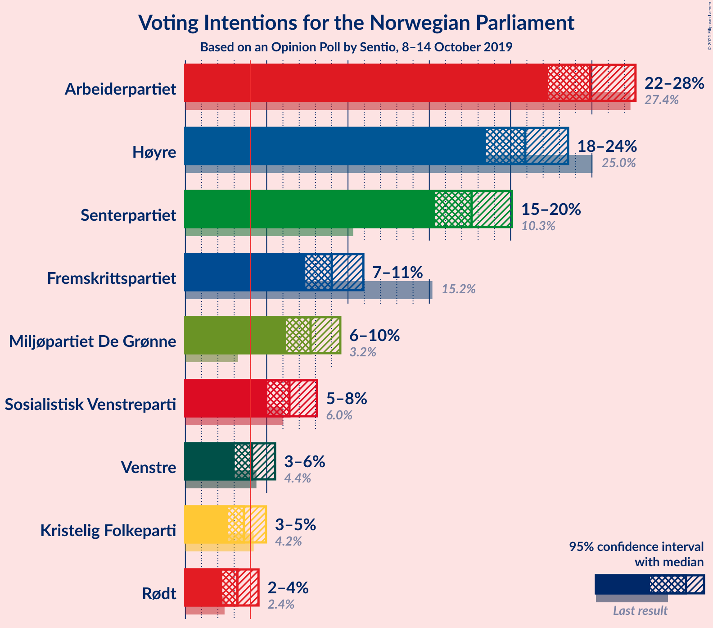

### Confidence Intervals

| Party | Last Result | Poll Result | 80% Confidence Interval | 90% Confidence Interval | 95% Confidence Interval | 99% Confidence Interval |
|:-----:|:-----------:|:-----------:|:-----------------------:|:-----------------------:|:-----------------------:|:-----------------------:|
| Arbeiderpartiet | 27.4% | 24.9% | 23.2–26.7% |22.7–27.2% |22.3–27.7% |21.5–28.6% |
| Høyre | 25.0% | 20.9% | 19.3–22.6% |18.9–23.1% |18.5–23.5% |17.8–24.4% |
| Senterpartiet | 10.3% | 17.6% | 16.1–19.2% |15.7–19.7% |15.4–20.1% |14.7–20.9% |
| Fremskrittspartiet | 15.2% | 9.0% | 7.9–10.3% |7.6–10.6% |7.4–10.9% |6.9–11.6% |
| Miljøpartiet De Grønne | 3.2% | 7.7% | 6.7–8.9% |6.4–9.2% |6.2–9.5% |5.8–10.1% |
| Sosialistisk Venstreparti | 6.0% | 6.4% | 5.5–7.5% |5.3–7.8% |5.0–8.1% |4.6–8.7% |
| Venstre | 4.4% | 4.1% | 3.4–5.0% |3.2–5.3% |3.0–5.5% |2.7–6.0% |
| Kristelig Folkeparti | 4.2% | 3.6% | 2.9–4.5% |2.8–4.7% |2.6–5.0% |2.3–5.4% |
| Rødt | 2.4% | 3.2% | 2.6–4.0% |2.4–4.3% |2.3–4.5% |2.0–4.9% |

*Note:* The poll result column reflects the actual value used in the calculations. Published results may vary slightly, and in addition be rounded to fewer digits.

## Seats

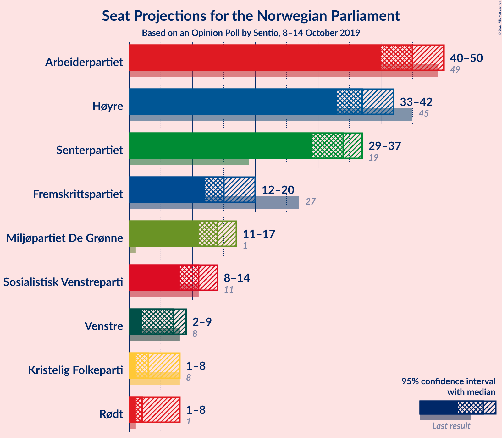

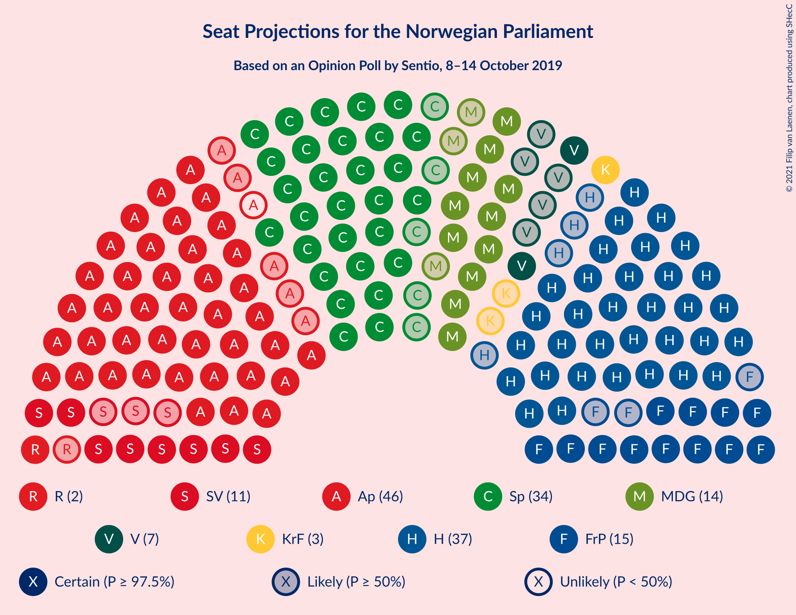

### Confidence Intervals

| Party | Last Result | Median | 80% Confidence Interval | 90% Confidence Interval | 95% Confidence Interval | 99% Confidence Interval |
|:-----:|:-----------:|:------:|:-----------------------:|:-----------------------:|:-----------------------:|:-----------------------:|
| <a href="#arbeiderpartiet">Arbeiderpartiet</a> | 49 | 45 | 43–49 |42–50 |40–50 |39–52 |
| <a href="#høyre">Høyre</a> | 45 | 37 | 34–40 |33–41 |33–42 |31–44 |
| <a href="#senterpartiet">Senterpartiet</a> | 19 | 34 | 31–36 |30–36 |29–37 |27–39 |
| <a href="#fremskrittspartiet">Fremskrittspartiet</a> | 27 | 15 | 14–18 |13–19 |12–20 |12–21 |
| <a href="#miljøpartiet-de-grønne">Miljøpartiet De Grønne</a> | 1 | 14 | 12–16 |11–16 |11–17 |10–18 |
| <a href="#sosialistisk-venstreparti">Sosialistisk Venstreparti</a> | 11 | 11 | 9–14 |9–14 |8–14 |8–16 |
| <a href="#venstre">Venstre</a> | 8 | 7 | 2–9 |2–9 |2–9 |2–10 |
| <a href="#kristelig-folkeparti">Kristelig Folkeparti</a> | 8 | 3 | 1–8 |1–8 |1–8 |1–9 |
| <a href="#rødt">Rødt</a> | 1 | 2 | 1–2 |1–7 |1–8 |1–8 |

### Arbeiderpartiet

*For a full overview of the results for this party, see the [Arbeiderpartiet](party-arbeiderpartiet.html) page.*

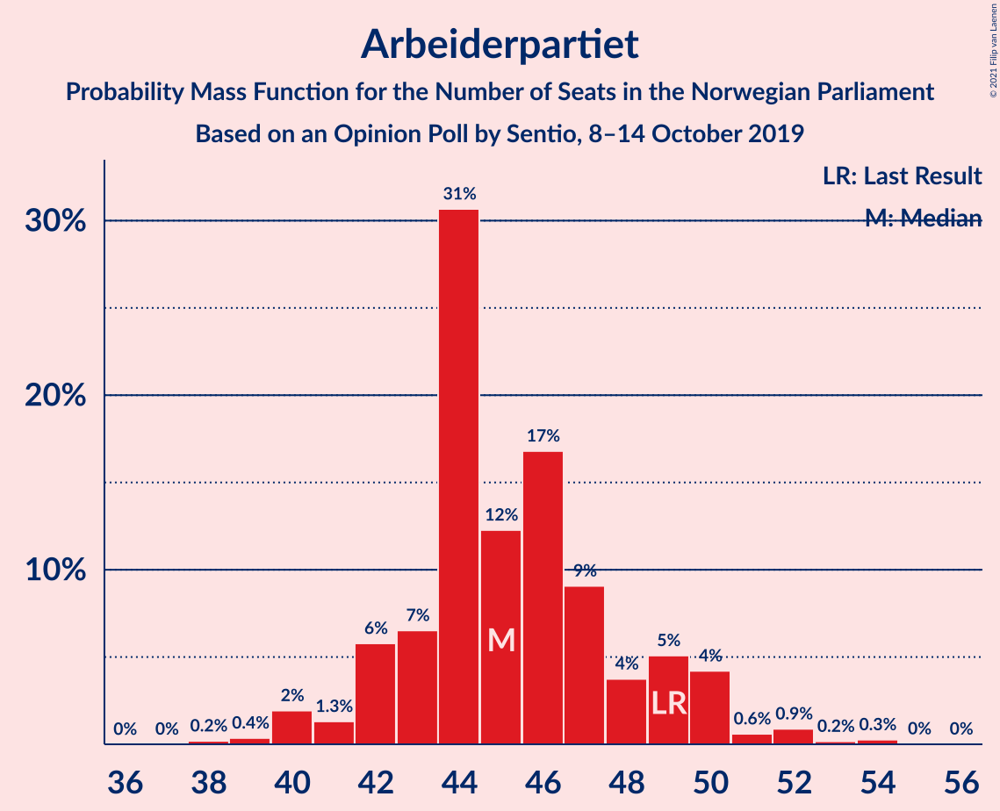

| Number of Seats | Probability | Accumulated | Special Marks |
|:---------------:|:-----------:|:-----------:|:-------------:|
| 38 | 0.2% | 100% |  |
| 39 | 0.4% | 99.8% |  |
| 40 | 2% | 99.4% |  |
| 41 | 1.3% | 97% |  |
| 42 | 6% | 96% |  |
| 43 | 7% | 90% |  |
| 44 | 31% | 84% |  |
| 45 | 12% | 53% | Median |
| 46 | 17% | 41% |  |
| 47 | 9% | 24% |  |
| 48 | 4% | 15% |  |
| 49 | 5% | 11% | Last Result |
| 50 | 4% | 6% |  |
| 51 | 0.6% | 2% |  |
| 52 | 0.9% | 1.4% |  |
| 53 | 0.2% | 0.5% |  |
| 54 | 0.3% | 0.3% |  |
| 55 | 0% | 0.1% |  |
| 56 | 0% | 0% |  |

### Høyre

*For a full overview of the results for this party, see the [Høyre](party-høyre.html) page.*

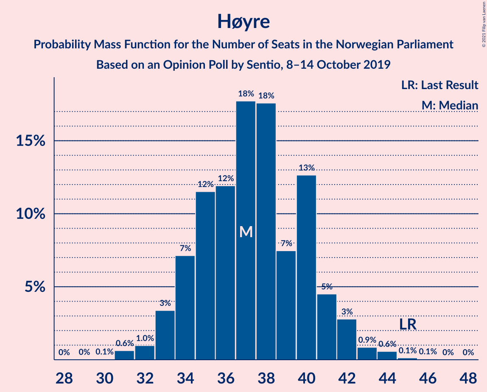

| Number of Seats | Probability | Accumulated | Special Marks |
|:---------------:|:-----------:|:-----------:|:-------------:|
| 30 | 0.1% | 100% |  |
| 31 | 0.6% | 99.9% |  |
| 32 | 1.0% | 99.3% |  |
| 33 | 3% | 98% |  |
| 34 | 7% | 95% |  |
| 35 | 12% | 88% |  |
| 36 | 12% | 76% |  |
| 37 | 18% | 64% | Median |
| 38 | 18% | 47% |  |
| 39 | 7% | 29% |  |
| 40 | 13% | 22% |  |
| 41 | 5% | 9% |  |
| 42 | 3% | 4% |  |
| 43 | 0.9% | 2% |  |
| 44 | 0.6% | 0.8% |  |
| 45 | 0.1% | 0.2% | Last Result |
| 46 | 0.1% | 0.1% |  |
| 47 | 0% | 0% |  |

### Senterpartiet

*For a full overview of the results for this party, see the [Senterpartiet](party-senterpartiet.html) page.*

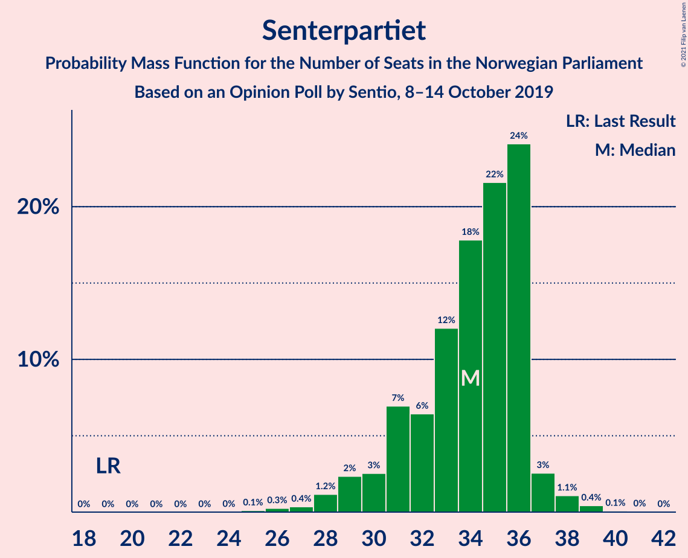

| Number of Seats | Probability | Accumulated | Special Marks |
|:---------------:|:-----------:|:-----------:|:-------------:|
| 19 | 0% | 100% | Last Result |
| 20 | 0% | 100% |  |
| 21 | 0% | 100% |  |
| 22 | 0% | 100% |  |
| 23 | 0% | 100% |  |
| 24 | 0% | 100% |  |
| 25 | 0.1% | 100% |  |
| 26 | 0.3% | 99.9% |  |
| 27 | 0.4% | 99.6% |  |
| 28 | 1.2% | 99.3% |  |
| 29 | 2% | 98% |  |
| 30 | 3% | 96% |  |
| 31 | 7% | 93% |  |
| 32 | 6% | 86% |  |
| 33 | 12% | 80% |  |
| 34 | 18% | 68% | Median |
| 35 | 22% | 50% |  |
| 36 | 24% | 28% |  |
| 37 | 3% | 4% |  |
| 38 | 1.1% | 2% |  |
| 39 | 0.4% | 0.6% |  |
| 40 | 0.1% | 0.1% |  |
| 41 | 0% | 0.1% |  |
| 42 | 0% | 0% |  |

### Fremskrittspartiet

*For a full overview of the results for this party, see the [Fremskrittspartiet](party-fremskrittspartiet.html) page.*

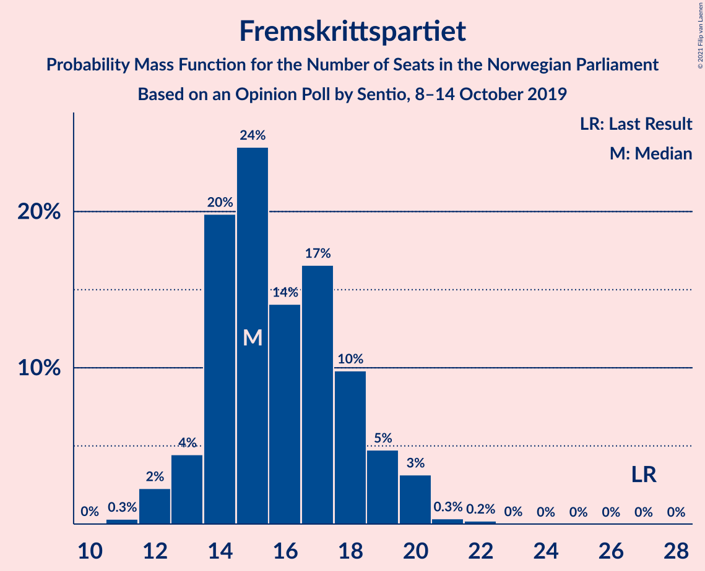

| Number of Seats | Probability | Accumulated | Special Marks |
|:---------------:|:-----------:|:-----------:|:-------------:|
| 10 | 0% | 100% |  |
| 11 | 0.3% | 99.9% |  |
| 12 | 2% | 99.6% |  |
| 13 | 4% | 97% |  |
| 14 | 20% | 93% |  |
| 15 | 24% | 73% | Median |
| 16 | 14% | 49% |  |
| 17 | 17% | 35% |  |
| 18 | 10% | 18% |  |
| 19 | 5% | 8% |  |
| 20 | 3% | 4% |  |
| 21 | 0.3% | 0.6% |  |
| 22 | 0.2% | 0.2% |  |
| 23 | 0% | 0% |  |
| 24 | 0% | 0% |  |
| 25 | 0% | 0% |  |
| 26 | 0% | 0% |  |
| 27 | 0% | 0% | Last Result |

### Miljøpartiet De Grønne

*For a full overview of the results for this party, see the [Miljøpartiet De Grønne](party-miljøpartietdegrønne.html) page.*

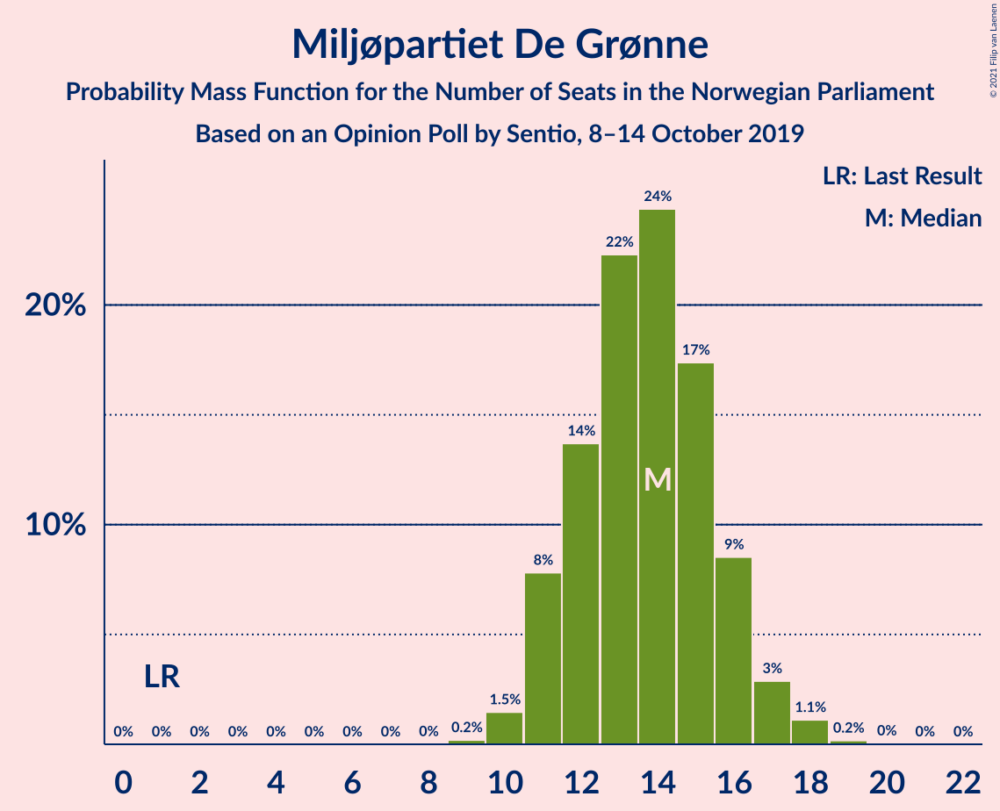

| Number of Seats | Probability | Accumulated | Special Marks |
|:---------------:|:-----------:|:-----------:|:-------------:|
| 1 | 0% | 100% | Last Result |
| 2 | 0% | 100% |  |
| 3 | 0% | 100% |  |
| 4 | 0% | 100% |  |
| 5 | 0% | 100% |  |
| 6 | 0% | 100% |  |
| 7 | 0% | 100% |  |
| 8 | 0% | 100% |  |
| 9 | 0.2% | 100% |  |
| 10 | 1.5% | 99.8% |  |
| 11 | 8% | 98% |  |
| 12 | 14% | 91% |  |
| 13 | 22% | 77% |  |
| 14 | 24% | 55% | Median |
| 15 | 17% | 30% |  |
| 16 | 9% | 13% |  |
| 17 | 3% | 4% |  |
| 18 | 1.1% | 1.3% |  |
| 19 | 0.2% | 0.2% |  |
| 20 | 0% | 0.1% |  |
| 21 | 0% | 0% |  |

### Sosialistisk Venstreparti

*For a full overview of the results for this party, see the [Sosialistisk Venstreparti](party-sosialistiskvenstreparti.html) page.*

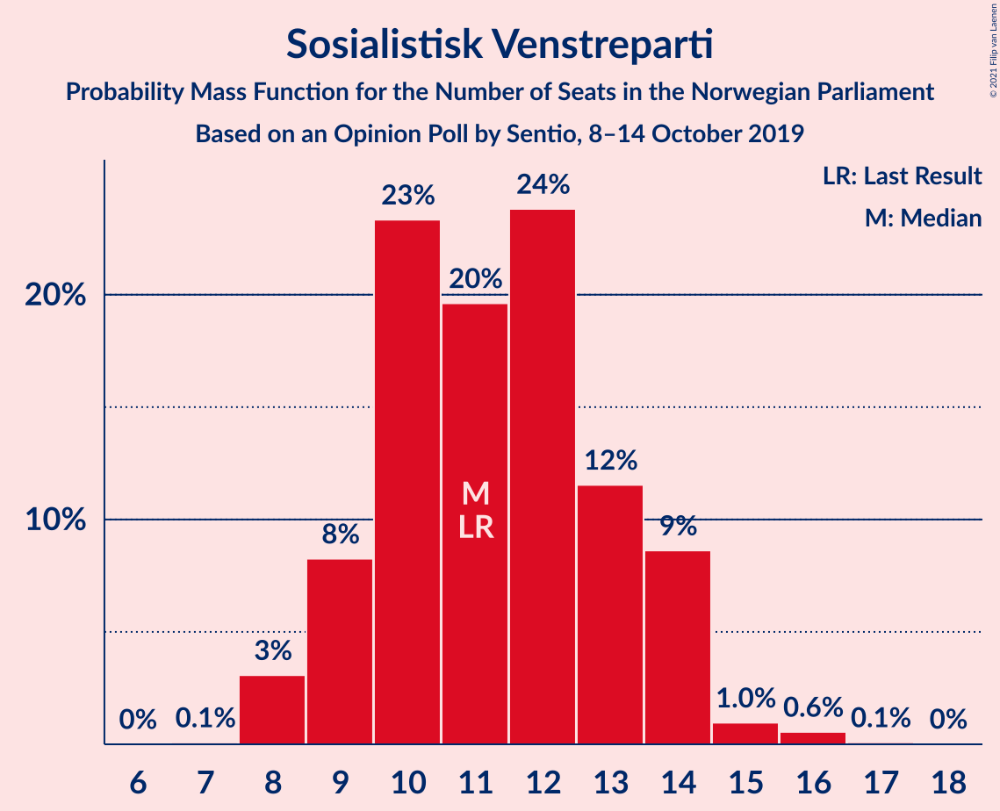

| Number of Seats | Probability | Accumulated | Special Marks |
|:---------------:|:-----------:|:-----------:|:-------------:|
| 7 | 0.1% | 100% |  |
| 8 | 3% | 99.9% |  |
| 9 | 8% | 97% |  |
| 10 | 23% | 89% |  |
| 11 | 20% | 65% | Last Result, Median |
| 12 | 24% | 46% |  |
| 13 | 12% | 22% |  |
| 14 | 9% | 10% |  |
| 15 | 1.0% | 2% |  |
| 16 | 0.6% | 0.7% |  |
| 17 | 0.1% | 0.1% |  |
| 18 | 0% | 0% |  |

### Venstre

*For a full overview of the results for this party, see the [Venstre](party-venstre.html) page.*

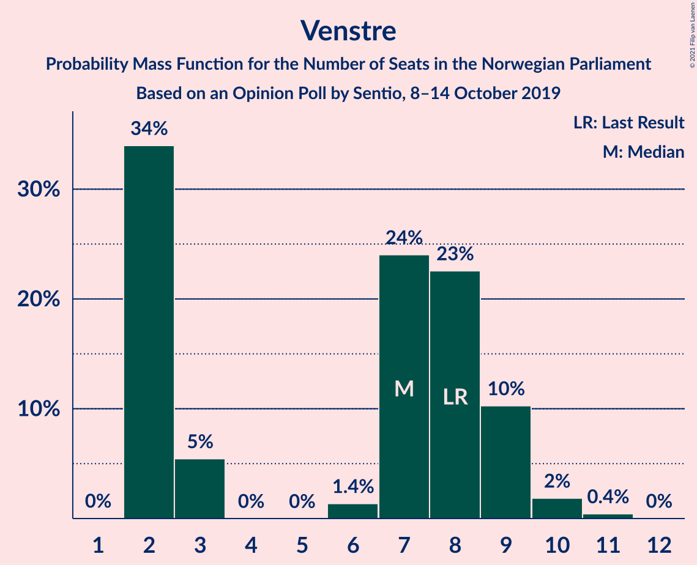

| Number of Seats | Probability | Accumulated | Special Marks |
|:---------------:|:-----------:|:-----------:|:-------------:|
| 2 | 34% | 100% |  |
| 3 | 5% | 66% |  |
| 4 | 0% | 61% |  |
| 5 | 0% | 61% |  |
| 6 | 1.4% | 61% |  |
| 7 | 24% | 59% | Median |
| 8 | 23% | 35% | Last Result |
| 9 | 10% | 13% |  |
| 10 | 2% | 2% |  |
| 11 | 0.4% | 0.5% |  |
| 12 | 0% | 0% |  |

### Kristelig Folkeparti

*For a full overview of the results for this party, see the [Kristelig Folkeparti](party-kristeligfolkeparti.html) page.*

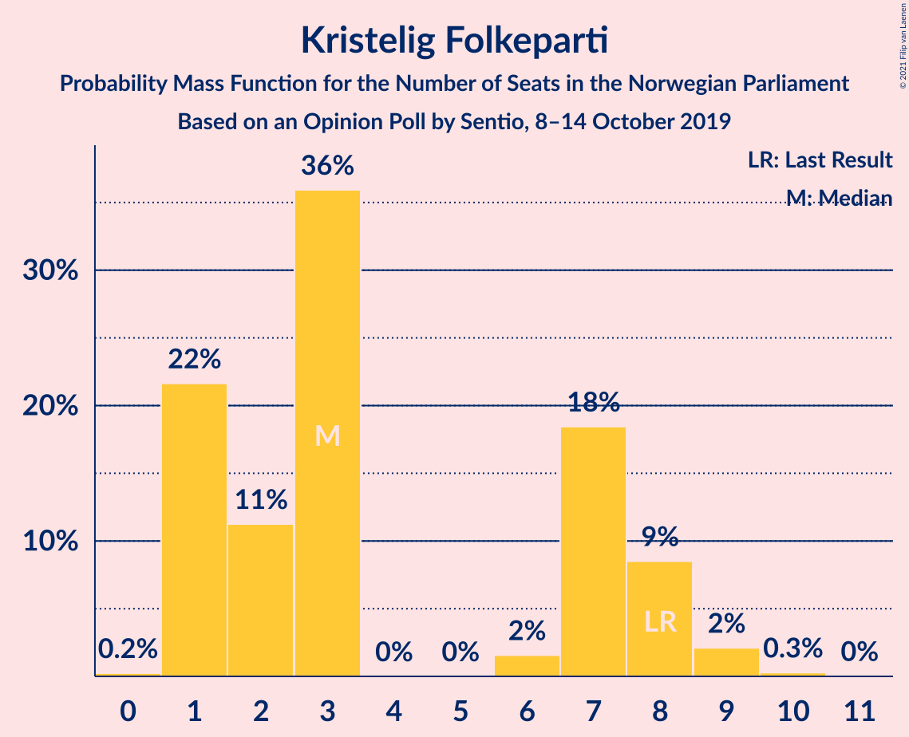

| Number of Seats | Probability | Accumulated | Special Marks |
|:---------------:|:-----------:|:-----------:|:-------------:|
| 0 | 0.2% | 100% |  |
| 1 | 22% | 99.8% |  |
| 2 | 11% | 78% |  |
| 3 | 36% | 67% | Median |
| 4 | 0% | 31% |  |
| 5 | 0% | 31% |  |
| 6 | 2% | 31% |  |
| 7 | 18% | 29% |  |
| 8 | 9% | 11% | Last Result |
| 9 | 2% | 2% |  |
| 10 | 0.3% | 0.3% |  |
| 11 | 0% | 0% |  |

### Rødt

*For a full overview of the results for this party, see the [Rødt](party-rødt.html) page.*

| Number of Seats | Probability | Accumulated | Special Marks |
|:---------------:|:-----------:|:-----------:|:-------------:|
| 1 | 27% | 100% | Last Result |
| 2 | 65% | 73% | Median |
| 3 | 0% | 8% |  |
| 4 | 0% | 8% |  |
| 5 | 0% | 8% |  |
| 6 | 2% | 8% |  |
| 7 | 4% | 7% |  |
| 8 | 3% | 3% |  |
| 9 | 0.4% | 0.4% |  |
| 10 | 0% | 0% |  |

## Coalitions

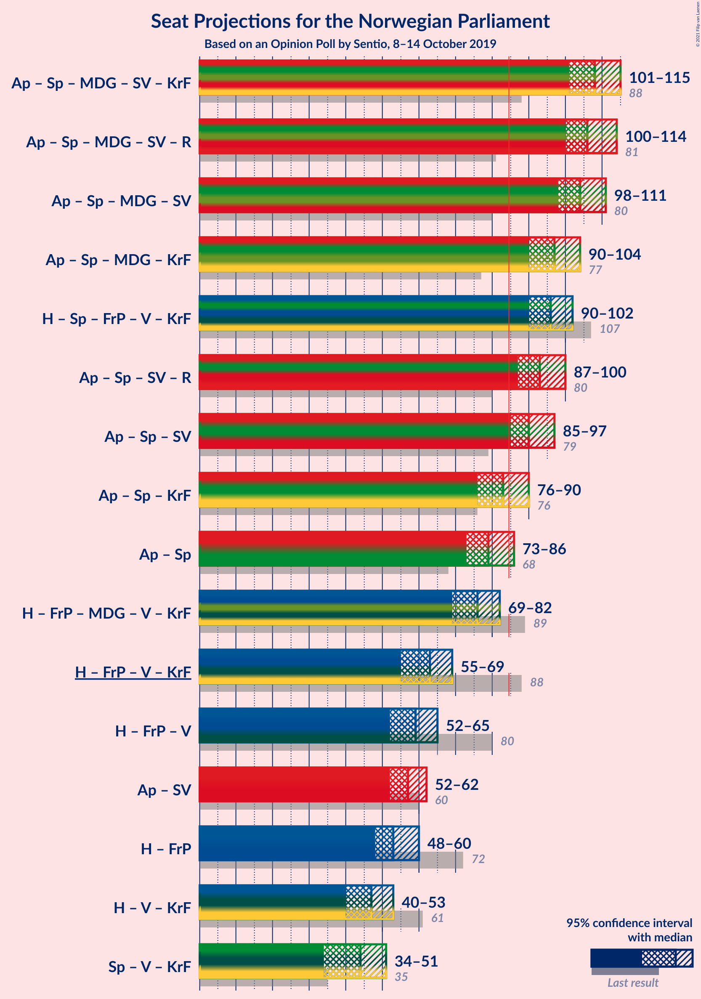

### Confidence Intervals

| Coalition | Last Result | Median | Majority? | 80% Confidence Interval | 90% Confidence Interval | 95% Confidence Interval | 99% Confidence Interval |
|:---------:|:-----------:|:------:|:---------:|:-----------------------:|:-----------------------:|:-----------------------:|:-----------------------:|
| Arbeiderpartiet – Senterpartiet – Miljøpartiet De Grønne – Sosialistisk Venstreparti – Kristelig Folkeparti | 88 | 108 | 100% | 104–113 | 102–114 | 101–115 | 100–116 |
| Arbeiderpartiet – Senterpartiet – Miljøpartiet De Grønne – Sosialistisk Venstreparti – Rødt | 81 | 106 | 100% | 102–111 | 101–112 | 100–114 | 98–115 |
| Arbeiderpartiet – Senterpartiet – Miljøpartiet De Grønne – Sosialistisk Venstreparti | 80 | 104 | 100% | 100–108 | 99–111 | 98–111 | 96–113 |
| Arbeiderpartiet – Senterpartiet – Miljøpartiet De Grønne – Kristelig Folkeparti | 77 | 97 | 100% | 92–102 | 91–103 | 90–104 | 88–105 |
| Høyre – Senterpartiet – Fremskrittspartiet – Venstre – Kristelig Folkeparti | 107 | 96 | 99.9% | 92–101 | 91–102 | 90–102 | 87–104 |
| Arbeiderpartiet – Senterpartiet – Sosialistisk Venstreparti – Rødt | 80 | 93 | 99.7% | 89–97 | 87–98 | 87–100 | 85–101 |
| Arbeiderpartiet – Senterpartiet – Sosialistisk Venstreparti | 79 | 90 | 98% | 87–95 | 86–96 | 85–97 | 83–98 |
| Arbeiderpartiet – Senterpartiet – Kristelig Folkeparti | 76 | 83 | 32% | 78–88 | 77–89 | 76–90 | 74–92 |
| Arbeiderpartiet – Senterpartiet | 68 | 79 | 4% | 75–83 | 75–84 | 73–86 | 72–86 |
| Høyre – Fremskrittspartiet – Miljøpartiet De Grønne – Venstre – Kristelig Folkeparti | 89 | 76 | 0.3% | 72–80 | 71–82 | 69–82 | 67–84 |
| Høyre – Fremskrittspartiet – Venstre – Kristelig Folkeparti | 88 | 63 | 0% | 58–67 | 56–68 | 55–69 | 54–71 |
| Høyre – Fremskrittspartiet – Venstre | 80 | 59 | 0% | 54–63 | 53–64 | 52–65 | 50–67 |
| Arbeiderpartiet – Sosialistisk Venstreparti | 60 | 57 | 0% | 53–60 | 53–61 | 52–62 | 50–65 |
| Høyre – Fremskrittspartiet | 72 | 53 | 0% | 49–57 | 49–58 | 48–60 | 46–62 |
| Høyre – Venstre – Kristelig Folkeparti | 61 | 47 | 0% | 42–51 | 41–52 | 40–53 | 38–55 |
| Senterpartiet – Venstre – Kristelig Folkeparti | 35 | 44 | 0% | 38–49 | 37–50 | 34–51 | 32–52 |

### Arbeiderpartiet – Senterpartiet – Miljøpartiet De Grønne – Sosialistisk Venstreparti – Kristelig Folkeparti

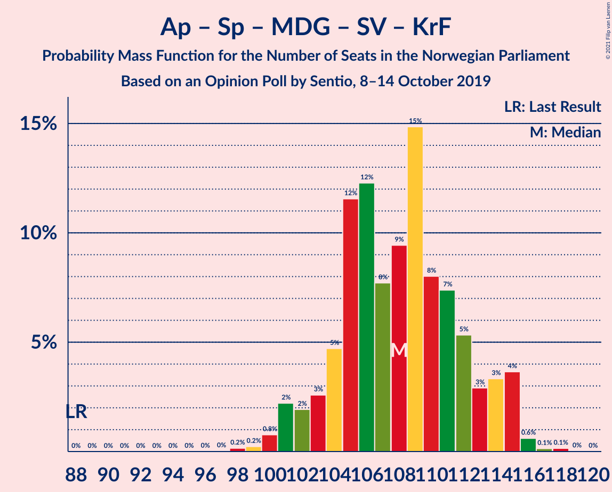

| Number of Seats | Probability | Accumulated | Special Marks |
|:---------------:|:-----------:|:-----------:|:-------------:|
| 88 | 0% | 100% | Last Result |
| 89 | 0% | 100% |  |
| 90 | 0% | 100% |  |
| 91 | 0% | 100% |  |
| 92 | 0% | 100% |  |
| 93 | 0% | 100% |  |
| 94 | 0% | 100% |  |
| 95 | 0% | 100% |  |
| 96 | 0% | 100% |  |
| 97 | 0% | 100% |  |
| 98 | 0.2% | 100% |  |
| 99 | 0.2% | 99.8% |  |
| 100 | 0.8% | 99.6% |  |
| 101 | 2% | 98.8% |  |
| 102 | 2% | 97% |  |
| 103 | 3% | 95% |  |
| 104 | 5% | 92% |  |
| 105 | 12% | 87% |  |
| 106 | 12% | 76% |  |
| 107 | 8% | 64% | Median |
| 108 | 9% | 56% |  |
| 109 | 15% | 46% |  |
| 110 | 8% | 32% |  |
| 111 | 7% | 24% |  |
| 112 | 5% | 16% |  |
| 113 | 3% | 11% |  |
| 114 | 3% | 8% |  |
| 115 | 4% | 5% |  |
| 116 | 0.6% | 0.9% |  |
| 117 | 0.1% | 0.3% |  |
| 118 | 0.1% | 0.2% |  |
| 119 | 0% | 0% |  |

### Arbeiderpartiet – Senterpartiet – Miljøpartiet De Grønne – Sosialistisk Venstreparti – Rødt

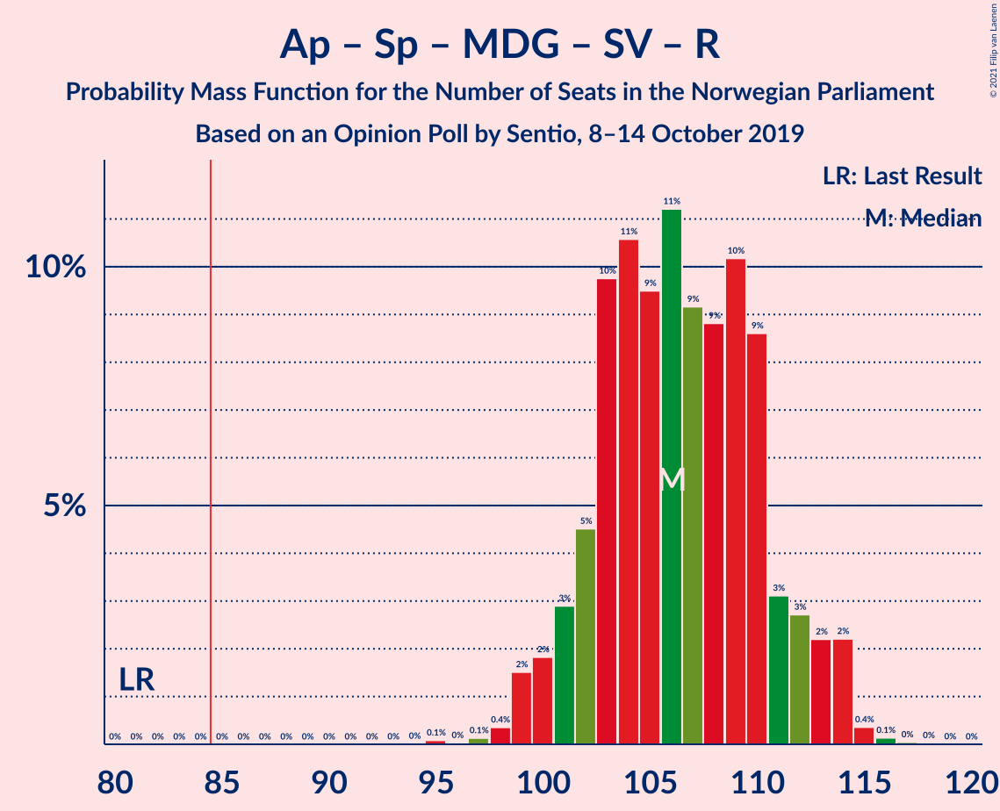

| Number of Seats | Probability | Accumulated | Special Marks |
|:---------------:|:-----------:|:-----------:|:-------------:|
| 81 | 0% | 100% | Last Result |
| 82 | 0% | 100% |  |
| 83 | 0% | 100% |  |
| 84 | 0% | 100% |  |
| 85 | 0% | 100% | Majority |
| 86 | 0% | 100% |  |
| 87 | 0% | 100% |  |
| 88 | 0% | 100% |  |
| 89 | 0% | 100% |  |
| 90 | 0% | 100% |  |
| 91 | 0% | 100% |  |
| 92 | 0% | 100% |  |
| 93 | 0% | 100% |  |
| 94 | 0% | 100% |  |
| 95 | 0.1% | 100% |  |
| 96 | 0% | 99.9% |  |
| 97 | 0.1% | 99.9% |  |
| 98 | 0.4% | 99.7% |  |
| 99 | 2% | 99.4% |  |
| 100 | 2% | 98% |  |
| 101 | 3% | 96% |  |
| 102 | 5% | 93% |  |
| 103 | 10% | 89% |  |
| 104 | 11% | 79% |  |
| 105 | 9% | 68% |  |
| 106 | 11% | 59% | Median |
| 107 | 9% | 48% |  |
| 108 | 9% | 38% |  |
| 109 | 10% | 30% |  |
| 110 | 9% | 19% |  |
| 111 | 3% | 11% |  |
| 112 | 3% | 8% |  |
| 113 | 2% | 5% |  |
| 114 | 2% | 3% |  |
| 115 | 0.4% | 0.6% |  |
| 116 | 0.1% | 0.2% |  |
| 117 | 0% | 0.1% |  |
| 118 | 0% | 0% |  |

### Arbeiderpartiet – Senterpartiet – Miljøpartiet De Grønne – Sosialistisk Venstreparti

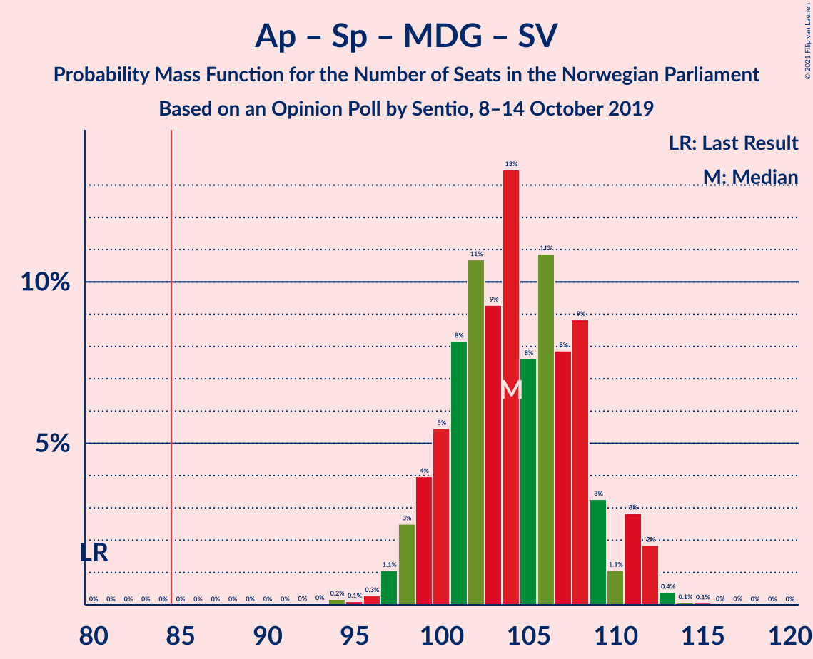

| Number of Seats | Probability | Accumulated | Special Marks |
|:---------------:|:-----------:|:-----------:|:-------------:|
| 80 | 0% | 100% | Last Result |
| 81 | 0% | 100% |  |
| 82 | 0% | 100% |  |
| 83 | 0% | 100% |  |
| 84 | 0% | 100% |  |
| 85 | 0% | 100% | Majority |
| 86 | 0% | 100% |  |
| 87 | 0% | 100% |  |
| 88 | 0% | 100% |  |
| 89 | 0% | 100% |  |
| 90 | 0% | 100% |  |
| 91 | 0% | 100% |  |
| 92 | 0% | 100% |  |
| 93 | 0% | 100% |  |
| 94 | 0.2% | 99.9% |  |
| 95 | 0.1% | 99.8% |  |
| 96 | 0.3% | 99.7% |  |
| 97 | 1.1% | 99.4% |  |
| 98 | 3% | 98% |  |
| 99 | 4% | 96% |  |
| 100 | 5% | 92% |  |
| 101 | 8% | 86% |  |
| 102 | 11% | 78% |  |
| 103 | 9% | 68% |  |
| 104 | 13% | 58% | Median |
| 105 | 8% | 45% |  |
| 106 | 11% | 37% |  |
| 107 | 8% | 26% |  |
| 108 | 9% | 18% |  |
| 109 | 3% | 10% |  |
| 110 | 1.1% | 6% |  |
| 111 | 3% | 5% |  |
| 112 | 2% | 2% |  |
| 113 | 0.4% | 0.5% |  |
| 114 | 0.1% | 0.1% |  |
| 115 | 0.1% | 0.1% |  |
| 116 | 0% | 0% |  |

### Arbeiderpartiet – Senterpartiet – Miljøpartiet De Grønne – Kristelig Folkeparti

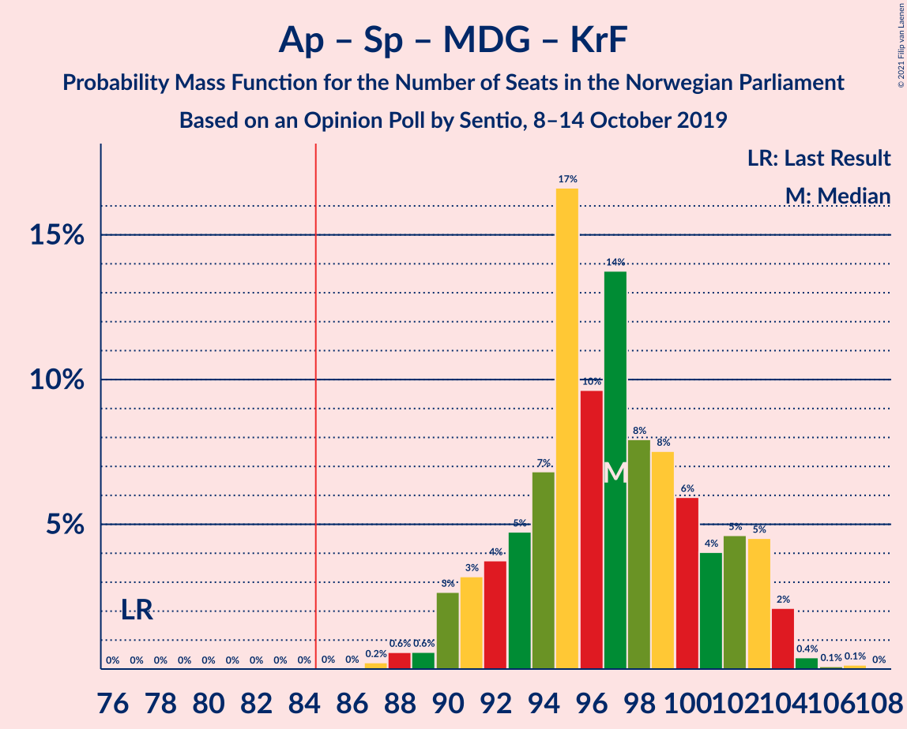

| Number of Seats | Probability | Accumulated | Special Marks |
|:---------------:|:-----------:|:-----------:|:-------------:|
| 77 | 0% | 100% | Last Result |
| 78 | 0% | 100% |  |
| 79 | 0% | 100% |  |
| 80 | 0% | 100% |  |
| 81 | 0% | 100% |  |
| 82 | 0% | 100% |  |
| 83 | 0% | 100% |  |
| 84 | 0% | 100% |  |
| 85 | 0% | 100% | Majority |
| 86 | 0% | 100% |  |
| 87 | 0.2% | 99.9% |  |
| 88 | 0.6% | 99.7% |  |
| 89 | 0.6% | 99.1% |  |
| 90 | 3% | 98.5% |  |
| 91 | 3% | 96% |  |
| 92 | 4% | 93% |  |
| 93 | 5% | 89% |  |
| 94 | 7% | 84% |  |
| 95 | 17% | 77% |  |
| 96 | 10% | 61% | Median |
| 97 | 14% | 51% |  |
| 98 | 8% | 37% |  |
| 99 | 8% | 29% |  |
| 100 | 6% | 22% |  |
| 101 | 4% | 16% |  |
| 102 | 5% | 12% |  |
| 103 | 5% | 7% |  |
| 104 | 2% | 3% |  |
| 105 | 0.4% | 0.7% |  |
| 106 | 0.1% | 0.3% |  |
| 107 | 0.1% | 0.2% |  |
| 108 | 0% | 0% |  |

### Høyre – Senterpartiet – Fremskrittspartiet – Venstre – Kristelig Folkeparti

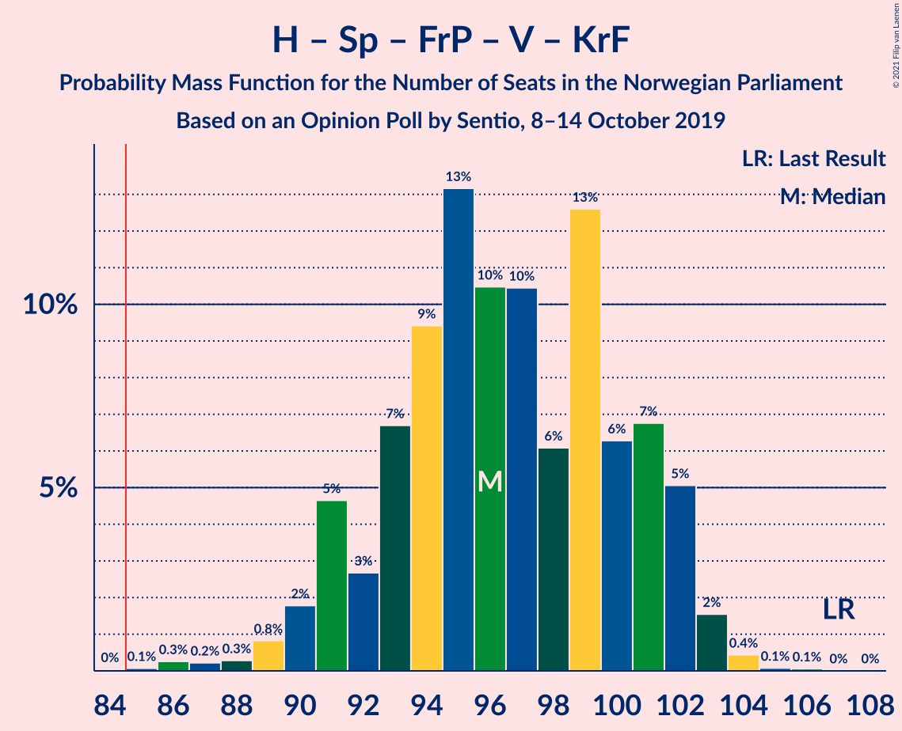

| Number of Seats | Probability | Accumulated | Special Marks |
|:---------------:|:-----------:|:-----------:|:-------------:|
| 84 | 0% | 100% |  |
| 85 | 0.1% | 99.9% | Majority |
| 86 | 0.3% | 99.9% |  |
| 87 | 0.2% | 99.6% |  |
| 88 | 0.3% | 99.4% |  |
| 89 | 0.8% | 99.1% |  |
| 90 | 2% | 98% |  |
| 91 | 5% | 96% |  |
| 92 | 3% | 92% |  |
| 93 | 7% | 89% |  |
| 94 | 9% | 82% |  |
| 95 | 13% | 73% |  |
| 96 | 10% | 60% | Median |
| 97 | 10% | 49% |  |
| 98 | 6% | 39% |  |
| 99 | 13% | 33% |  |
| 100 | 6% | 20% |  |
| 101 | 7% | 14% |  |
| 102 | 5% | 7% |  |
| 103 | 2% | 2% |  |
| 104 | 0.4% | 0.6% |  |
| 105 | 0.1% | 0.2% |  |
| 106 | 0.1% | 0.1% |  |
| 107 | 0% | 0% | Last Result |

### Arbeiderpartiet – Senterpartiet – Sosialistisk Venstreparti – Rødt

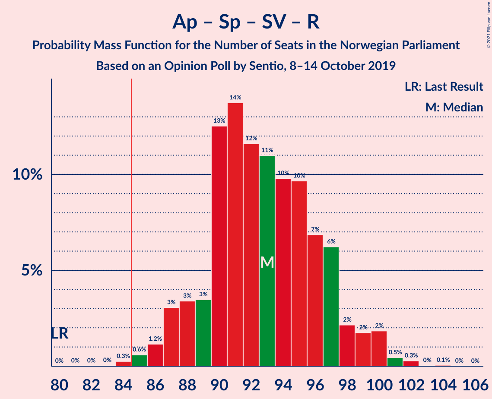

| Number of Seats | Probability | Accumulated | Special Marks |
|:---------------:|:-----------:|:-----------:|:-------------:|
| 80 | 0% | 100% | Last Result |
| 81 | 0% | 100% |  |
| 82 | 0% | 100% |  |
| 83 | 0% | 100% |  |
| 84 | 0.3% | 99.9% |  |
| 85 | 0.6% | 99.7% | Majority |
| 86 | 1.2% | 99.1% |  |
| 87 | 3% | 98% |  |
| 88 | 3% | 95% |  |
| 89 | 3% | 91% |  |
| 90 | 13% | 88% |  |
| 91 | 14% | 75% |  |
| 92 | 12% | 62% | Median |
| 93 | 11% | 50% |  |
| 94 | 10% | 39% |  |
| 95 | 10% | 29% |  |
| 96 | 7% | 20% |  |
| 97 | 6% | 13% |  |
| 98 | 2% | 7% |  |
| 99 | 2% | 4% |  |
| 100 | 2% | 3% |  |
| 101 | 0.5% | 0.8% |  |
| 102 | 0.3% | 0.4% |  |
| 103 | 0% | 0.1% |  |
| 104 | 0.1% | 0.1% |  |
| 105 | 0% | 0% |  |

### Arbeiderpartiet – Senterpartiet – Sosialistisk Venstreparti

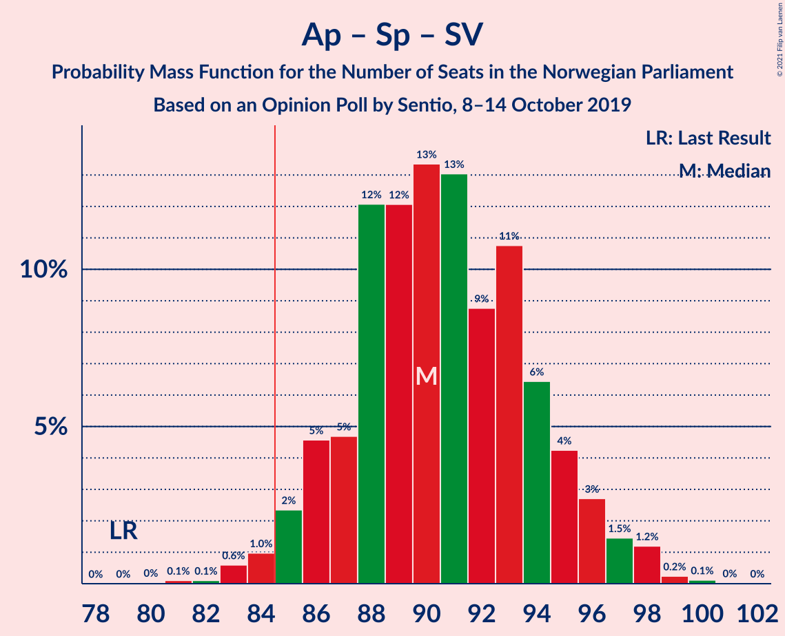

| Number of Seats | Probability | Accumulated | Special Marks |
|:---------------:|:-----------:|:-----------:|:-------------:|
| 79 | 0% | 100% | Last Result |
| 80 | 0% | 100% |  |
| 81 | 0.1% | 99.9% |  |
| 82 | 0.1% | 99.8% |  |
| 83 | 0.6% | 99.7% |  |
| 84 | 1.0% | 99.1% |  |
| 85 | 2% | 98% | Majority |
| 86 | 5% | 96% |  |
| 87 | 5% | 91% |  |
| 88 | 12% | 87% |  |
| 89 | 12% | 74% |  |
| 90 | 13% | 62% | Median |
| 91 | 13% | 49% |  |
| 92 | 9% | 36% |  |
| 93 | 11% | 27% |  |
| 94 | 6% | 16% |  |
| 95 | 4% | 10% |  |
| 96 | 3% | 6% |  |
| 97 | 1.5% | 3% |  |
| 98 | 1.2% | 2% |  |
| 99 | 0.2% | 0.4% |  |
| 100 | 0.1% | 0.2% |  |
| 101 | 0% | 0% |  |

### Arbeiderpartiet – Senterpartiet – Kristelig Folkeparti

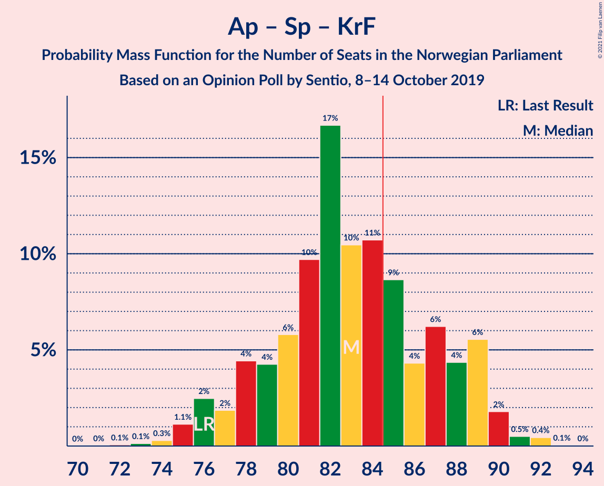

| Number of Seats | Probability | Accumulated | Special Marks |
|:---------------:|:-----------:|:-----------:|:-------------:|
| 72 | 0.1% | 100% |  |
| 73 | 0.1% | 99.9% |  |
| 74 | 0.3% | 99.8% |  |
| 75 | 1.1% | 99.5% |  |
| 76 | 2% | 98% | Last Result |
| 77 | 2% | 96% |  |
| 78 | 4% | 94% |  |
| 79 | 4% | 90% |  |
| 80 | 6% | 85% |  |
| 81 | 10% | 80% |  |
| 82 | 17% | 70% | Median |
| 83 | 10% | 53% |  |
| 84 | 11% | 43% |  |
| 85 | 9% | 32% | Majority |
| 86 | 4% | 23% |  |
| 87 | 6% | 19% |  |
| 88 | 4% | 13% |  |
| 89 | 6% | 8% |  |
| 90 | 2% | 3% |  |
| 91 | 0.5% | 1.0% |  |
| 92 | 0.4% | 0.5% |  |
| 93 | 0.1% | 0.1% |  |
| 94 | 0% | 0% |  |

### Arbeiderpartiet – Senterpartiet

| Number of Seats | Probability | Accumulated | Special Marks |
|:---------------:|:-----------:|:-----------:|:-------------:|
| 68 | 0% | 100% | Last Result |
| 69 | 0% | 100% |  |
| 70 | 0.1% | 99.9% |  |
| 71 | 0.2% | 99.8% |  |
| 72 | 0.8% | 99.6% |  |
| 73 | 1.4% | 98.8% |  |
| 74 | 2% | 97% |  |
| 75 | 6% | 95% |  |
| 76 | 6% | 89% |  |
| 77 | 7% | 83% |  |
| 78 | 15% | 75% |  |
| 79 | 12% | 61% | Median |
| 80 | 16% | 49% |  |
| 81 | 13% | 33% |  |
| 82 | 8% | 20% |  |
| 83 | 5% | 12% |  |
| 84 | 3% | 7% |  |
| 85 | 1.5% | 4% | Majority |
| 86 | 3% | 3% |  |
| 87 | 0.1% | 0.3% |  |
| 88 | 0.1% | 0.2% |  |
| 89 | 0.1% | 0.1% |  |
| 90 | 0% | 0% |  |

### Høyre – Fremskrittspartiet – Miljøpartiet De Grønne – Venstre – Kristelig Folkeparti

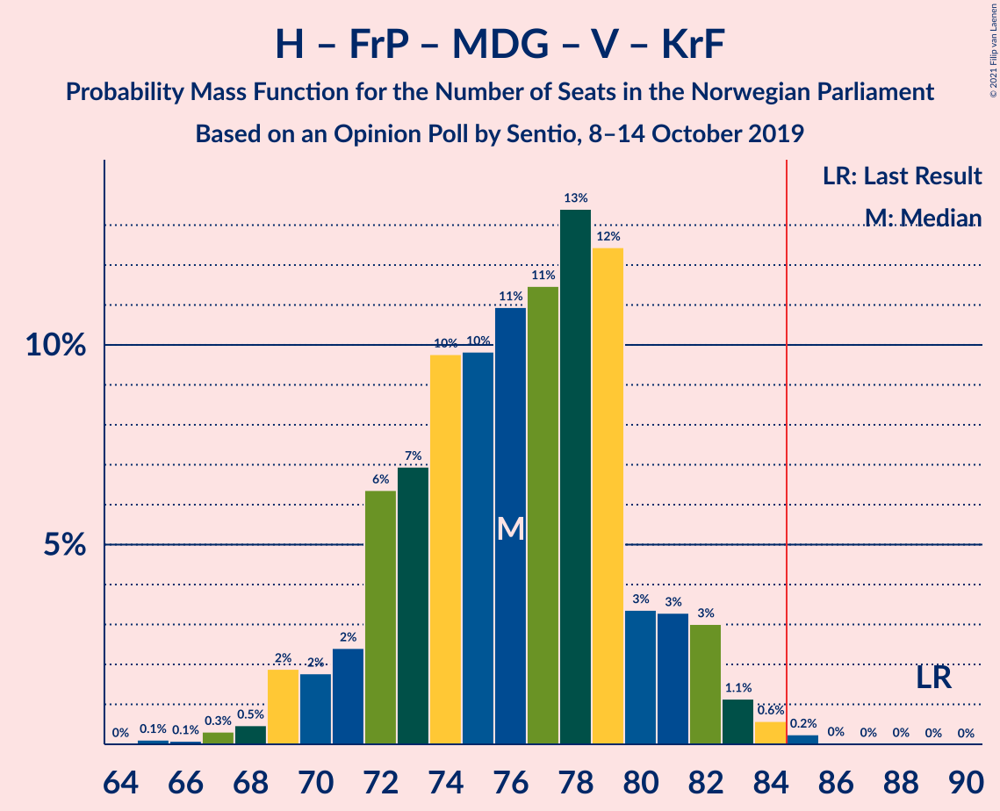

| Number of Seats | Probability | Accumulated | Special Marks |
|:---------------:|:-----------:|:-----------:|:-------------:|
| 65 | 0.1% | 100% |  |
| 66 | 0.1% | 99.9% |  |
| 67 | 0.3% | 99.8% |  |
| 68 | 0.5% | 99.5% |  |
| 69 | 2% | 99.0% |  |
| 70 | 2% | 97% |  |
| 71 | 2% | 95% |  |
| 72 | 6% | 93% |  |
| 73 | 7% | 87% |  |
| 74 | 10% | 80% |  |
| 75 | 10% | 70% |  |
| 76 | 11% | 60% | Median |
| 77 | 11% | 49% |  |
| 78 | 13% | 38% |  |
| 79 | 12% | 24% |  |
| 80 | 3% | 12% |  |
| 81 | 3% | 8% |  |
| 82 | 3% | 5% |  |
| 83 | 1.1% | 2% |  |
| 84 | 0.6% | 0.9% |  |
| 85 | 0.2% | 0.3% | Majority |
| 86 | 0% | 0.1% |  |
| 87 | 0% | 0% |  |
| 88 | 0% | 0% |  |
| 89 | 0% | 0% | Last Result |

### Høyre – Fremskrittspartiet – Venstre – Kristelig Folkeparti

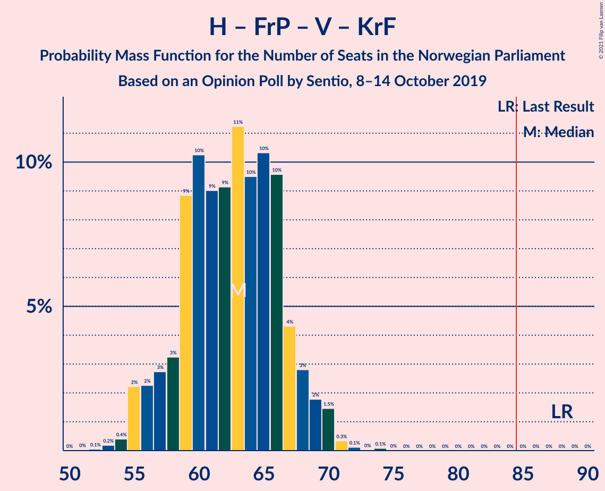

| Number of Seats | Probability | Accumulated | Special Marks |
|:---------------:|:-----------:|:-----------:|:-------------:|
| 52 | 0.1% | 100% |  |
| 53 | 0.2% | 99.9% |  |
| 54 | 0.4% | 99.7% |  |
| 55 | 2% | 99.3% |  |
| 56 | 2% | 97% |  |
| 57 | 3% | 95% |  |
| 58 | 3% | 92% |  |
| 59 | 9% | 89% |  |
| 60 | 10% | 80% |  |
| 61 | 9% | 70% |  |
| 62 | 9% | 61% | Median |
| 63 | 11% | 52% |  |
| 64 | 10% | 40% |  |
| 65 | 10% | 31% |  |
| 66 | 10% | 21% |  |
| 67 | 4% | 11% |  |
| 68 | 3% | 7% |  |
| 69 | 2% | 4% |  |
| 70 | 1.5% | 2% |  |
| 71 | 0.3% | 0.6% |  |
| 72 | 0.1% | 0.2% |  |
| 73 | 0% | 0.1% |  |
| 74 | 0.1% | 0.1% |  |
| 75 | 0% | 0% |  |
| 76 | 0% | 0% |  |
| 77 | 0% | 0% |  |
| 78 | 0% | 0% |  |
| 79 | 0% | 0% |  |
| 80 | 0% | 0% |  |
| 81 | 0% | 0% |  |
| 82 | 0% | 0% |  |
| 83 | 0% | 0% |  |
| 84 | 0% | 0% |  |
| 85 | 0% | 0% | Majority |
| 86 | 0% | 0% |  |
| 87 | 0% | 0% |  |
| 88 | 0% | 0% | Last Result |

### Høyre – Fremskrittspartiet – Venstre

| Number of Seats | Probability | Accumulated | Special Marks |
|:---------------:|:-----------:|:-----------:|:-------------:|
| 48 | 0% | 100% |  |
| 49 | 0.2% | 99.9% |  |
| 50 | 0.4% | 99.7% |  |
| 51 | 0.5% | 99.3% |  |
| 52 | 3% | 98.7% |  |
| 53 | 5% | 96% |  |
| 54 | 3% | 91% |  |
| 55 | 5% | 88% |  |
| 56 | 10% | 83% |  |
| 57 | 9% | 74% |  |
| 58 | 12% | 64% |  |
| 59 | 12% | 52% | Median |
| 60 | 6% | 40% |  |
| 61 | 10% | 33% |  |
| 62 | 11% | 23% |  |
| 63 | 5% | 12% |  |
| 64 | 2% | 6% |  |
| 65 | 2% | 4% |  |
| 66 | 0.8% | 2% |  |
| 67 | 1.0% | 1.4% |  |
| 68 | 0.2% | 0.4% |  |
| 69 | 0.1% | 0.1% |  |
| 70 | 0% | 0.1% |  |
| 71 | 0% | 0% |  |
| 72 | 0% | 0% |  |
| 73 | 0% | 0% |  |
| 74 | 0% | 0% |  |
| 75 | 0% | 0% |  |
| 76 | 0% | 0% |  |
| 77 | 0% | 0% |  |
| 78 | 0% | 0% |  |
| 79 | 0% | 0% |  |
| 80 | 0% | 0% | Last Result |

### Arbeiderpartiet – Sosialistisk Venstreparti

| Number of Seats | Probability | Accumulated | Special Marks |
|:---------------:|:-----------:|:-----------:|:-------------:|
| 48 | 0.1% | 100% |  |
| 49 | 0.2% | 99.9% |  |
| 50 | 0.3% | 99.7% |  |
| 51 | 1.2% | 99.4% |  |
| 52 | 2% | 98% |  |
| 53 | 8% | 96% |  |
| 54 | 19% | 88% |  |
| 55 | 8% | 69% |  |
| 56 | 10% | 61% | Median |
| 57 | 10% | 51% |  |
| 58 | 20% | 41% |  |
| 59 | 9% | 21% |  |
| 60 | 5% | 12% | Last Result |
| 61 | 3% | 7% |  |
| 62 | 2% | 4% |  |
| 63 | 1.1% | 2% |  |
| 64 | 0.2% | 0.8% |  |
| 65 | 0.2% | 0.5% |  |
| 66 | 0.1% | 0.3% |  |
| 67 | 0.2% | 0.2% |  |
| 68 | 0% | 0% |  |

### Høyre – Fremskrittspartiet

| Number of Seats | Probability | Accumulated | Special Marks |
|:---------------:|:-----------:|:-----------:|:-------------:|
| 44 | 0.1% | 100% |  |
| 45 | 0.1% | 99.9% |  |
| 46 | 0.6% | 99.8% |  |
| 47 | 2% | 99.3% |  |
| 48 | 2% | 98% |  |
| 49 | 6% | 96% |  |
| 50 | 11% | 89% |  |
| 51 | 12% | 79% |  |
| 52 | 8% | 66% | Median |
| 53 | 13% | 59% |  |
| 54 | 14% | 46% |  |
| 55 | 13% | 32% |  |
| 56 | 7% | 19% |  |
| 57 | 6% | 13% |  |
| 58 | 3% | 7% |  |
| 59 | 2% | 4% |  |
| 60 | 2% | 3% |  |
| 61 | 0.6% | 1.2% |  |
| 62 | 0.5% | 0.6% |  |
| 63 | 0.1% | 0.2% |  |
| 64 | 0% | 0% |  |
| 65 | 0% | 0% |  |
| 66 | 0% | 0% |  |
| 67 | 0% | 0% |  |
| 68 | 0% | 0% |  |
| 69 | 0% | 0% |  |
| 70 | 0% | 0% |  |
| 71 | 0% | 0% |  |
| 72 | 0% | 0% | Last Result |

### Høyre – Venstre – Kristelig Folkeparti

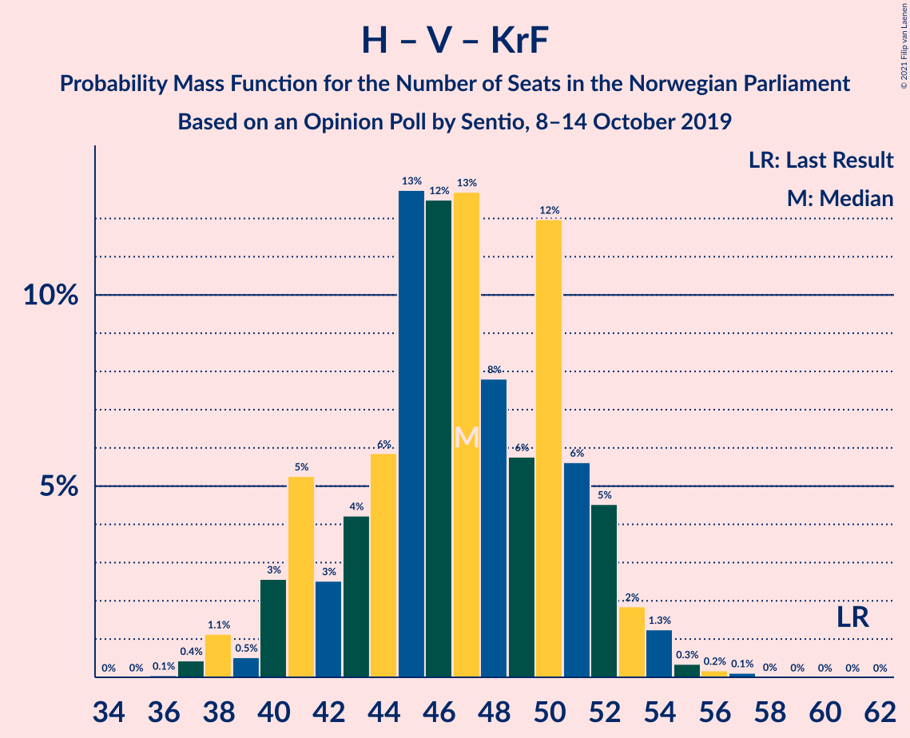

| Number of Seats | Probability | Accumulated | Special Marks |
|:---------------:|:-----------:|:-----------:|:-------------:|
| 36 | 0.1% | 100% |  |
| 37 | 0.4% | 99.9% |  |
| 38 | 1.1% | 99.5% |  |
| 39 | 0.5% | 98% |  |
| 40 | 3% | 98% |  |
| 41 | 5% | 95% |  |
| 42 | 3% | 90% |  |
| 43 | 4% | 87% |  |
| 44 | 6% | 83% |  |
| 45 | 13% | 77% |  |
| 46 | 12% | 65% |  |
| 47 | 13% | 52% | Median |
| 48 | 8% | 39% |  |
| 49 | 6% | 32% |  |
| 50 | 12% | 26% |  |
| 51 | 6% | 14% |  |
| 52 | 5% | 8% |  |
| 53 | 2% | 4% |  |
| 54 | 1.3% | 2% |  |
| 55 | 0.3% | 0.7% |  |
| 56 | 0.2% | 0.3% |  |
| 57 | 0.1% | 0.1% |  |
| 58 | 0% | 0% |  |
| 59 | 0% | 0% |  |
| 60 | 0% | 0% |  |
| 61 | 0% | 0% | Last Result |

### Senterpartiet – Venstre – Kristelig Folkeparti

| Number of Seats | Probability | Accumulated | Special Marks |
|:---------------:|:-----------:|:-----------:|:-------------:|
| 31 | 0.1% | 100% |  |
| 32 | 0.5% | 99.9% |  |
| 33 | 0.5% | 99.4% |  |
| 34 | 1.4% | 98.9% |  |
| 35 | 0.7% | 97% | Last Result |
| 36 | 2% | 97% |  |
| 37 | 1.5% | 95% |  |
| 38 | 5% | 94% |  |
| 39 | 7% | 89% |  |
| 40 | 7% | 82% |  |
| 41 | 7% | 75% |  |
| 42 | 6% | 68% |  |
| 43 | 9% | 61% |  |
| 44 | 11% | 52% | Median |
| 45 | 9% | 41% |  |
| 46 | 10% | 32% |  |
| 47 | 7% | 22% |  |
| 48 | 3% | 15% |  |
| 49 | 6% | 12% |  |
| 50 | 3% | 6% |  |
| 51 | 1.3% | 3% |  |
| 52 | 2% | 2% |  |
| 53 | 0.3% | 0.4% |  |
| 54 | 0.1% | 0.1% |  |
| 55 | 0% | 0% |  |

## Technical Information

### Opinion Poll

+ **Polling firm:** Sentio
+ **Commissioner(s):** —
+ **Fieldwork period:** 8–14 October 2019

### Calculations

+ **Sample size:** 1000
+ **Simulations done:** 1,048,576
+ **Error estimate:** 2.67%

