# Opinion Poll by Norstat, 15–21 October 2019

<a href="#voting-intentions">Voting Intentions</a> | <a href="#seats">Seats</a> | <a href="#coalitions">Coalitions</a> | <a href="#technical-information">Technical Information</a>

## Voting Intentions

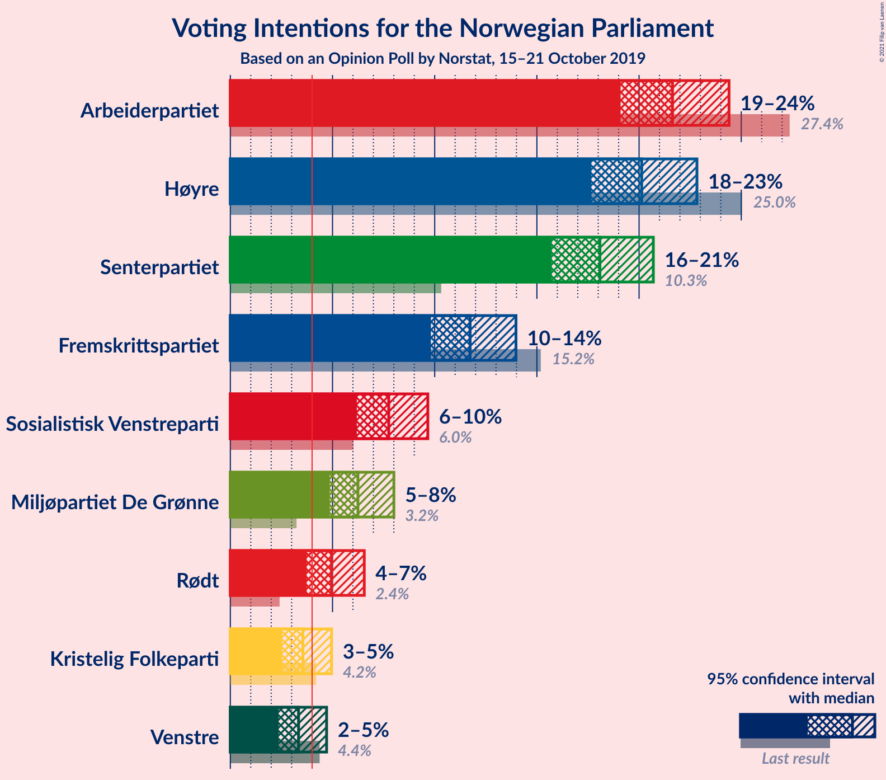

### Confidence Intervals

| Party | Last Result | Poll Result | 80% Confidence Interval | 90% Confidence Interval | 95% Confidence Interval | 99% Confidence Interval |
|:-----:|:-----------:|:-----------:|:-----------------------:|:-----------------------:|:-----------------------:|:-----------------------:|
| Arbeiderpartiet | 27.4% | 21.6% | 20.0–23.4% |19.5–24.0% |19.1–24.4% |18.3–25.3% |
| Høyre | 25.0% | 20.1% | 18.5–21.9% |18.1–22.4% |17.7–22.8% |16.9–23.7% |
| Senterpartiet | 10.3% | 18.1% | 16.5–19.8% |16.1–20.3% |15.7–20.7% |15.0–21.5% |
| Fremskrittspartiet | 15.2% | 11.7% | 10.5–13.2% |10.1–13.6% |9.8–14.0% |9.2–14.7% |
| Sosialistisk Venstreparti | 6.0% | 7.8% | 6.7–9.0% |6.4–9.3% |6.2–9.7% |5.7–10.3% |
| Miljøpartiet De Grønne | 3.2% | 6.2% | 5.3–7.4% |5.1–7.7% |4.9–8.0% |4.5–8.6% |
| Rødt | 2.4% | 5.0% | 4.1–6.0% |3.9–6.3% |3.7–6.6% |3.4–7.1% |
| Kristelig Folkeparti | 4.2% | 3.6% | 2.9–4.5% |2.7–4.7% |2.5–5.0% |2.3–5.4% |
| Venstre | 4.4% | 3.3% | 2.7–4.2% |2.5–4.5% |2.4–4.7% |2.1–5.2% |

*Note:* The poll result column reflects the actual value used in the calculations. Published results may vary slightly, and in addition be rounded to fewer digits.

## Seats

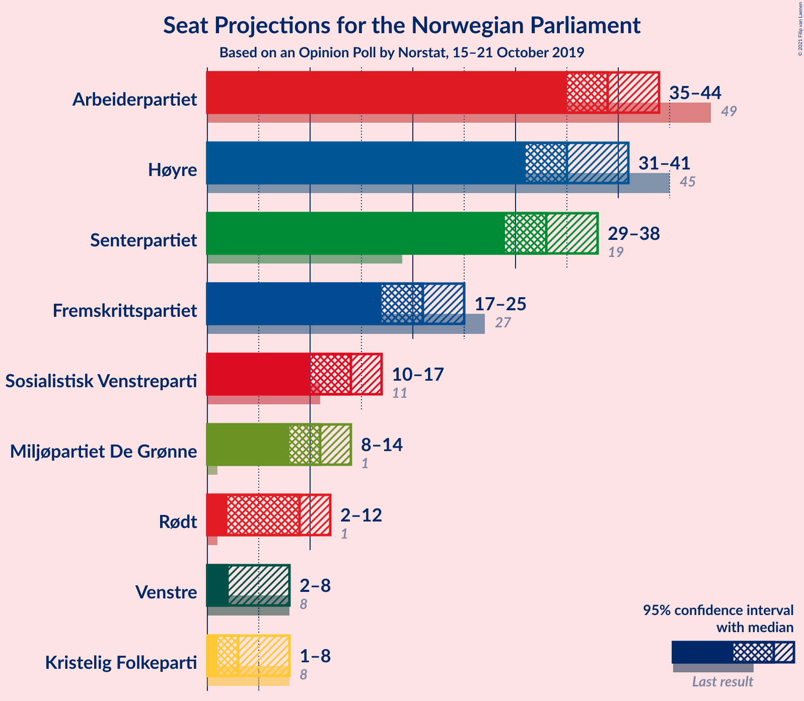

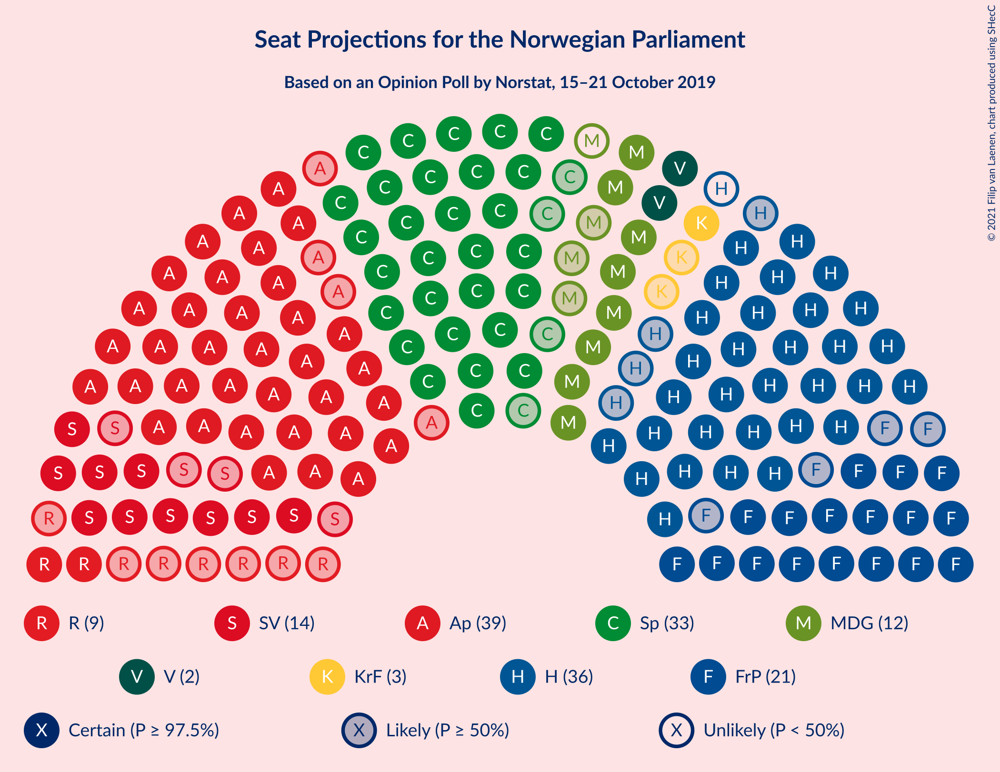

### Confidence Intervals

| Party | Last Result | Median | 80% Confidence Interval | 90% Confidence Interval | 95% Confidence Interval | 99% Confidence Interval |
|:-----:|:-----------:|:------:|:-----------------------:|:-----------------------:|:-----------------------:|:-----------------------:|
| <a href="#arbeiderpartiet">Arbeiderpartiet</a> | 49 | 39 | 37–44 |36–44 |35–44 |33–45 |
| <a href="#høyre">Høyre</a> | 45 | 35 | 33–39 |32–40 |31–41 |29–42 |
| <a href="#senterpartiet">Senterpartiet</a> | 19 | 33 | 30–37 |29–37 |29–38 |27–40 |
| <a href="#fremskrittspartiet">Fremskrittspartiet</a> | 27 | 21 | 18–24 |17–24 |17–25 |15–26 |
| <a href="#sosialistisk-venstreparti">Sosialistisk Venstreparti</a> | 11 | 14 | 12–16 |11–17 |10–17 |9–18 |
| <a href="#miljøpartiet-de-grønne">Miljøpartiet De Grønne</a> | 1 | 11 | 9–13 |9–13 |8–14 |8–15 |
| <a href="#rødt">Rødt</a> | 1 | 9 | 7–10 |2–11 |2–12 |2–12 |
| <a href="#kristelig-folkeparti">Kristelig Folkeparti</a> | 8 | 3 | 1–8 |1–8 |1–8 |0–9 |
| <a href="#venstre">Venstre</a> | 8 | 2 | 2–7 |2–8 |2–8 |1–9 |

### Arbeiderpartiet

*For a full overview of the results for this party, see the [Arbeiderpartiet](party-arbeiderpartiet.html) page.*

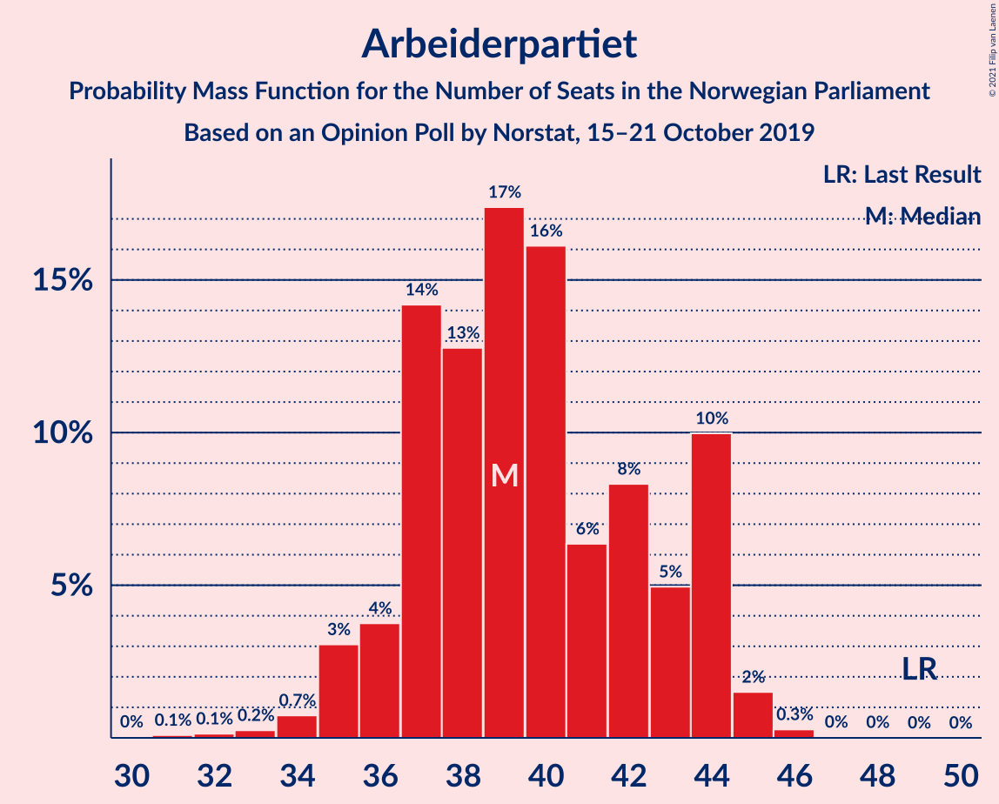

| Number of Seats | Probability | Accumulated | Special Marks |
|:---------------:|:-----------:|:-----------:|:-------------:|
| 31 | 0.1% | 100% |  |
| 32 | 0.1% | 99.9% |  |
| 33 | 0.2% | 99.7% |  |
| 34 | 0.7% | 99.5% |  |
| 35 | 3% | 98.7% |  |
| 36 | 4% | 96% |  |
| 37 | 14% | 92% |  |
| 38 | 13% | 78% |  |
| 39 | 17% | 65% | Median |
| 40 | 16% | 48% |  |
| 41 | 6% | 31% |  |
| 42 | 8% | 25% |  |
| 43 | 5% | 17% |  |
| 44 | 10% | 12% |  |
| 45 | 2% | 2% |  |
| 46 | 0.3% | 0.3% |  |
| 47 | 0% | 0.1% |  |
| 48 | 0% | 0% |  |
| 49 | 0% | 0% | Last Result |

### Høyre

*For a full overview of the results for this party, see the [Høyre](party-høyre.html) page.*

| Number of Seats | Probability | Accumulated | Special Marks |
|:---------------:|:-----------:|:-----------:|:-------------:|
| 27 | 0.1% | 100% |  |
| 28 | 0.1% | 99.9% |  |
| 29 | 0.6% | 99.8% |  |
| 30 | 1.2% | 99.2% |  |
| 31 | 2% | 98% |  |
| 32 | 4% | 96% |  |
| 33 | 15% | 91% |  |
| 34 | 13% | 76% |  |
| 35 | 15% | 63% | Median |
| 36 | 18% | 49% |  |
| 37 | 14% | 30% |  |
| 38 | 6% | 17% |  |
| 39 | 3% | 11% |  |
| 40 | 5% | 8% |  |
| 41 | 2% | 3% |  |
| 42 | 0.4% | 0.8% |  |
| 43 | 0.4% | 0.5% |  |
| 44 | 0% | 0.1% |  |
| 45 | 0% | 0% | Last Result |

### Senterpartiet

*For a full overview of the results for this party, see the [Senterpartiet](party-senterpartiet.html) page.*

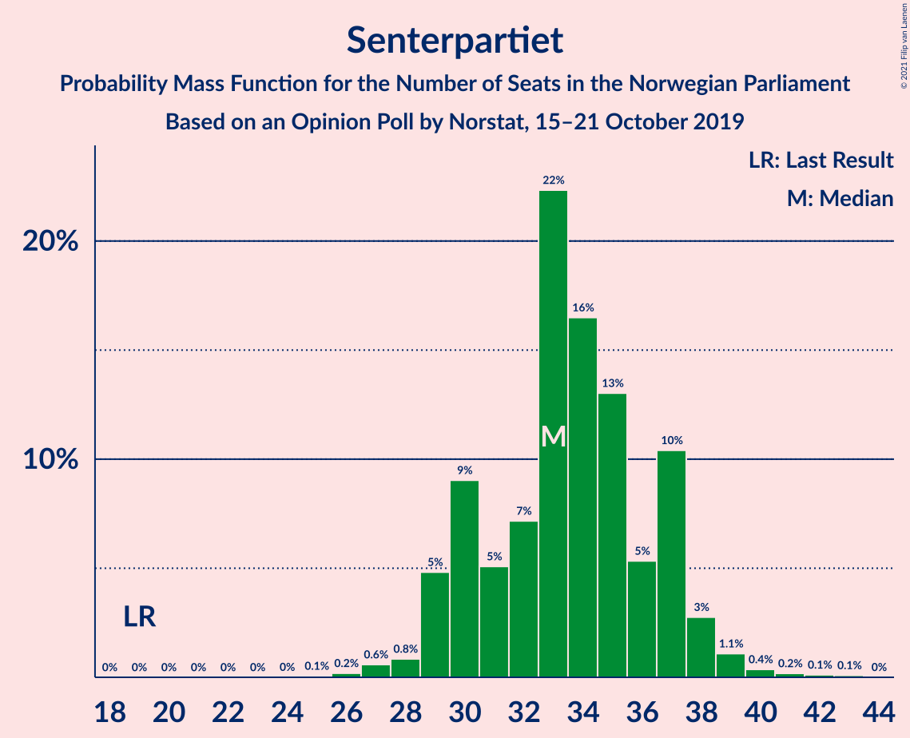

| Number of Seats | Probability | Accumulated | Special Marks |
|:---------------:|:-----------:|:-----------:|:-------------:|
| 19 | 0% | 100% | Last Result |
| 20 | 0% | 100% |  |
| 21 | 0% | 100% |  |
| 22 | 0% | 100% |  |
| 23 | 0% | 100% |  |
| 24 | 0% | 100% |  |
| 25 | 0.1% | 100% |  |
| 26 | 0.2% | 99.9% |  |
| 27 | 0.6% | 99.7% |  |
| 28 | 0.8% | 99.2% |  |
| 29 | 5% | 98% |  |
| 30 | 9% | 93% |  |
| 31 | 5% | 84% |  |
| 32 | 7% | 79% |  |
| 33 | 22% | 72% | Median |
| 34 | 16% | 50% |  |
| 35 | 13% | 33% |  |
| 36 | 5% | 20% |  |
| 37 | 10% | 15% |  |
| 38 | 3% | 5% |  |
| 39 | 1.1% | 2% |  |
| 40 | 0.4% | 0.8% |  |
| 41 | 0.2% | 0.4% |  |
| 42 | 0.1% | 0.2% |  |
| 43 | 0.1% | 0.1% |  |
| 44 | 0% | 0% |  |

### Fremskrittspartiet

*For a full overview of the results for this party, see the [Fremskrittspartiet](party-fremskrittspartiet.html) page.*

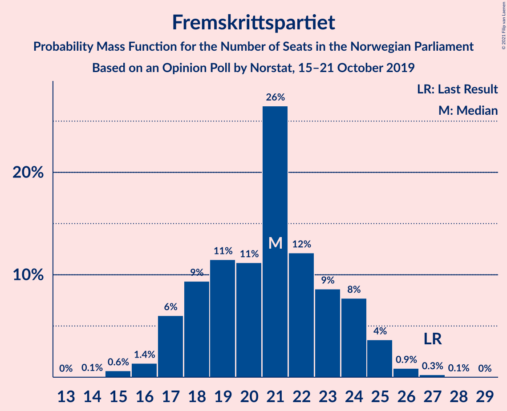

| Number of Seats | Probability | Accumulated | Special Marks |
|:---------------:|:-----------:|:-----------:|:-------------:|
| 14 | 0.1% | 100% |  |
| 15 | 0.6% | 99.9% |  |
| 16 | 1.4% | 99.3% |  |
| 17 | 6% | 98% |  |
| 18 | 9% | 92% |  |
| 19 | 11% | 83% |  |
| 20 | 11% | 71% |  |
| 21 | 26% | 60% | Median |
| 22 | 12% | 33% |  |
| 23 | 9% | 21% |  |
| 24 | 8% | 13% |  |
| 25 | 4% | 5% |  |
| 26 | 0.9% | 1.2% |  |
| 27 | 0.3% | 0.3% | Last Result |
| 28 | 0.1% | 0.1% |  |
| 29 | 0% | 0% |  |

### Sosialistisk Venstreparti

*For a full overview of the results for this party, see the [Sosialistisk Venstreparti](party-sosialistiskvenstreparti.html) page.*

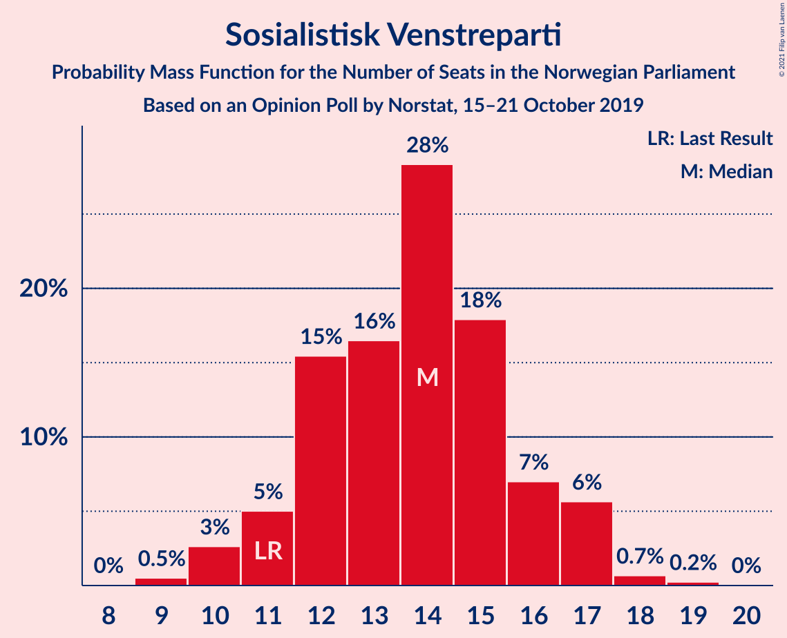

| Number of Seats | Probability | Accumulated | Special Marks |
|:---------------:|:-----------:|:-----------:|:-------------:|
| 9 | 0.5% | 100% |  |
| 10 | 3% | 99.4% |  |
| 11 | 5% | 97% | Last Result |
| 12 | 15% | 92% |  |
| 13 | 16% | 76% |  |
| 14 | 28% | 60% | Median |
| 15 | 18% | 32% |  |
| 16 | 7% | 14% |  |
| 17 | 6% | 7% |  |
| 18 | 0.7% | 1.0% |  |
| 19 | 0.2% | 0.3% |  |
| 20 | 0% | 0% |  |

### Miljøpartiet De Grønne

*For a full overview of the results for this party, see the [Miljøpartiet De Grønne](party-miljøpartietdegrønne.html) page.*

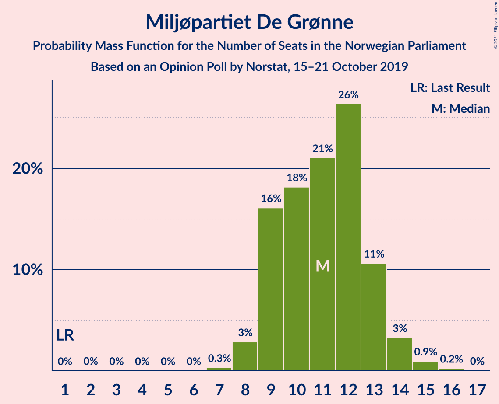

| Number of Seats | Probability | Accumulated | Special Marks |
|:---------------:|:-----------:|:-----------:|:-------------:|
| 1 | 0% | 100% | Last Result |
| 2 | 0% | 100% |  |
| 3 | 0% | 100% |  |
| 4 | 0% | 100% |  |
| 5 | 0% | 100% |  |
| 6 | 0% | 100% |  |
| 7 | 0.3% | 100% |  |
| 8 | 3% | 99.7% |  |
| 9 | 16% | 97% |  |
| 10 | 18% | 81% |  |
| 11 | 21% | 63% | Median |
| 12 | 26% | 41% |  |
| 13 | 11% | 15% |  |
| 14 | 3% | 4% |  |
| 15 | 0.9% | 1.2% |  |
| 16 | 0.2% | 0.3% |  |
| 17 | 0% | 0% |  |

### Rødt

*For a full overview of the results for this party, see the [Rødt](party-rødt.html) page.*

| Number of Seats | Probability | Accumulated | Special Marks |
|:---------------:|:-----------:|:-----------:|:-------------:|
| 1 | 0% | 100% | Last Result |
| 2 | 6% | 100% |  |
| 3 | 0% | 94% |  |
| 4 | 0% | 94% |  |
| 5 | 0% | 94% |  |
| 6 | 0.3% | 94% |  |
| 7 | 12% | 93% |  |
| 8 | 24% | 82% |  |
| 9 | 25% | 58% | Median |
| 10 | 25% | 33% |  |
| 11 | 5% | 7% |  |
| 12 | 2% | 3% |  |
| 13 | 0.3% | 0.4% |  |
| 14 | 0% | 0% |  |

### Kristelig Folkeparti

*For a full overview of the results for this party, see the [Kristelig Folkeparti](party-kristeligfolkeparti.html) page.*

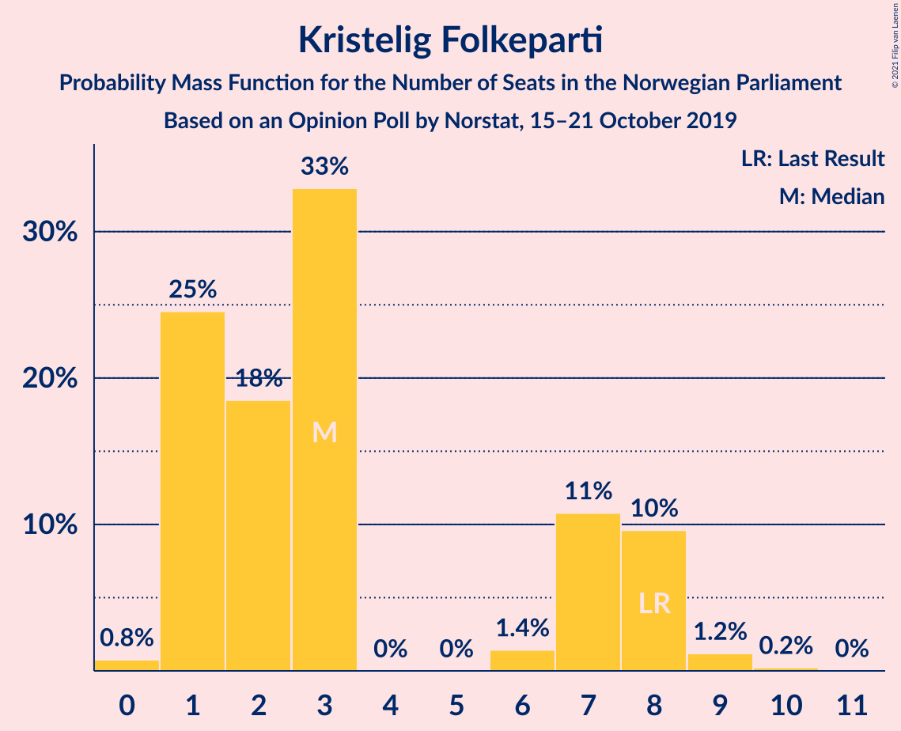

| Number of Seats | Probability | Accumulated | Special Marks |
|:---------------:|:-----------:|:-----------:|:-------------:|
| 0 | 0.8% | 100% |  |
| 1 | 25% | 99.2% |  |
| 2 | 18% | 75% |  |
| 3 | 33% | 56% | Median |
| 4 | 0% | 23% |  |
| 5 | 0% | 23% |  |
| 6 | 1.4% | 23% |  |
| 7 | 11% | 22% |  |
| 8 | 10% | 11% | Last Result |
| 9 | 1.2% | 1.4% |  |
| 10 | 0.2% | 0.2% |  |
| 11 | 0% | 0% |  |

### Venstre

*For a full overview of the results for this party, see the [Venstre](party-venstre.html) page.*

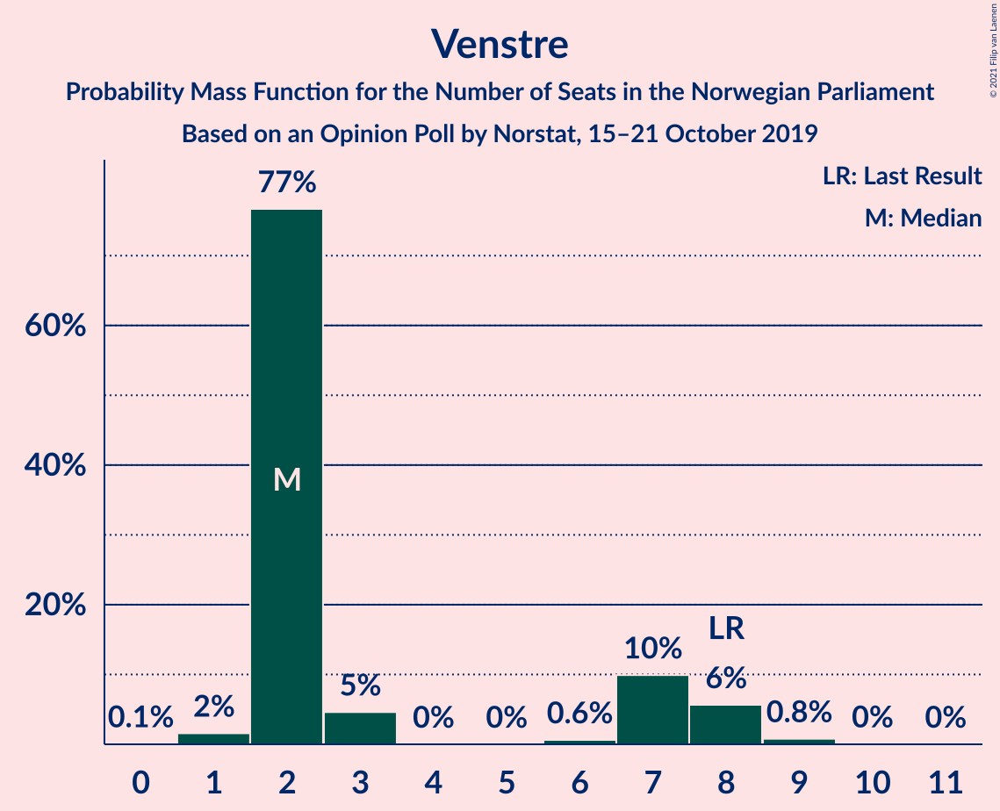

| Number of Seats | Probability | Accumulated | Special Marks |
|:---------------:|:-----------:|:-----------:|:-------------:|
| 0 | 0.1% | 100% |  |
| 1 | 2% | 99.9% |  |
| 2 | 77% | 98% | Median |
| 3 | 5% | 22% |  |
| 4 | 0% | 17% |  |
| 5 | 0% | 17% |  |
| 6 | 0.6% | 17% |  |
| 7 | 10% | 16% |  |
| 8 | 6% | 7% | Last Result |
| 9 | 0.8% | 0.8% |  |
| 10 | 0% | 0.1% |  |
| 11 | 0% | 0% |  |

## Coalitions

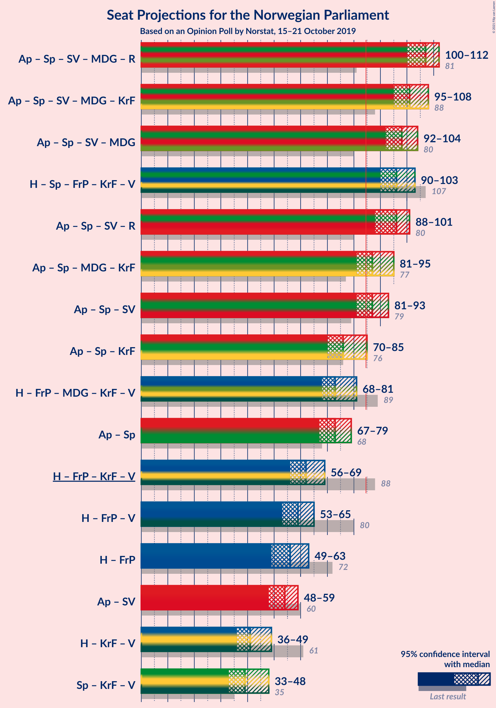

### Confidence Intervals

| Coalition | Last Result | Median | Majority? | 80% Confidence Interval | 90% Confidence Interval | 95% Confidence Interval | 99% Confidence Interval |
|:---------:|:-----------:|:------:|:---------:|:-----------------------:|:-----------------------:|:-----------------------:|:-----------------------:|
| Arbeiderpartiet – Senterpartiet – Sosialistisk Venstreparti – Miljøpartiet De Grønne – Rødt | 81 | 107 | 100% | 102–110 | 101–112 | 100–112 | 97–114 |
| Arbeiderpartiet – Senterpartiet – Sosialistisk Venstreparti – Miljøpartiet De Grønne – Kristelig Folkeparti | 88 | 101 | 100% | 97–106 | 96–107 | 95–108 | 92–110 |
| Arbeiderpartiet – Senterpartiet – Sosialistisk Venstreparti – Miljøpartiet De Grønne | 80 | 98 | 100% | 94–102 | 93–103 | 92–104 | 89–106 |
| Høyre – Senterpartiet – Fremskrittspartiet – Kristelig Folkeparti – Venstre | 107 | 96 | 100% | 92–100 | 90–101 | 90–103 | 88–106 |
| Arbeiderpartiet – Senterpartiet – Sosialistisk Venstreparti – Rødt | 80 | 96 | 99.8% | 91–99 | 89–100 | 88–101 | 86–103 |
| Arbeiderpartiet – Senterpartiet – Miljøpartiet De Grønne – Kristelig Folkeparti | 77 | 87 | 80% | 83–92 | 82–94 | 81–95 | 78–97 |
| Arbeiderpartiet – Senterpartiet – Sosialistisk Venstreparti | 79 | 87 | 79% | 83–91 | 82–92 | 81–93 | 78–95 |
| Arbeiderpartiet – Senterpartiet – Kristelig Folkeparti | 76 | 76 | 3% | 72–81 | 70–83 | 70–85 | 68–87 |
| Høyre – Fremskrittspartiet – Miljøpartiet De Grønne – Kristelig Folkeparti – Venstre | 89 | 73 | 0.2% | 69–78 | 69–80 | 68–81 | 66–83 |
| Arbeiderpartiet – Senterpartiet | 68 | 73 | 0% | 69–77 | 68–78 | 67–79 | 65–81 |
| Høyre – Fremskrittspartiet – Kristelig Folkeparti – Venstre | 88 | 62 | 0% | 59–67 | 57–68 | 56–69 | 55–72 |
| Høyre – Fremskrittspartiet – Venstre | 80 | 59 | 0% | 55–64 | 53–65 | 53–65 | 51–68 |
| Høyre – Fremskrittspartiet | 72 | 56 | 0% | 52–61 | 50–62 | 49–63 | 48–64 |
| Arbeiderpartiet – Sosialistisk Venstreparti | 60 | 54 | 0% | 50–58 | 49–58 | 48–59 | 46–61 |
| Høyre – Kristelig Folkeparti – Venstre | 61 | 41 | 0% | 38–46 | 37–47 | 36–49 | 35–51 |
| Senterpartiet – Kristelig Folkeparti – Venstre | 35 | 39 | 0% | 36–45 | 34–47 | 33–48 | 32–50 |

### Arbeiderpartiet – Senterpartiet – Sosialistisk Venstreparti – Miljøpartiet De Grønne – Rødt

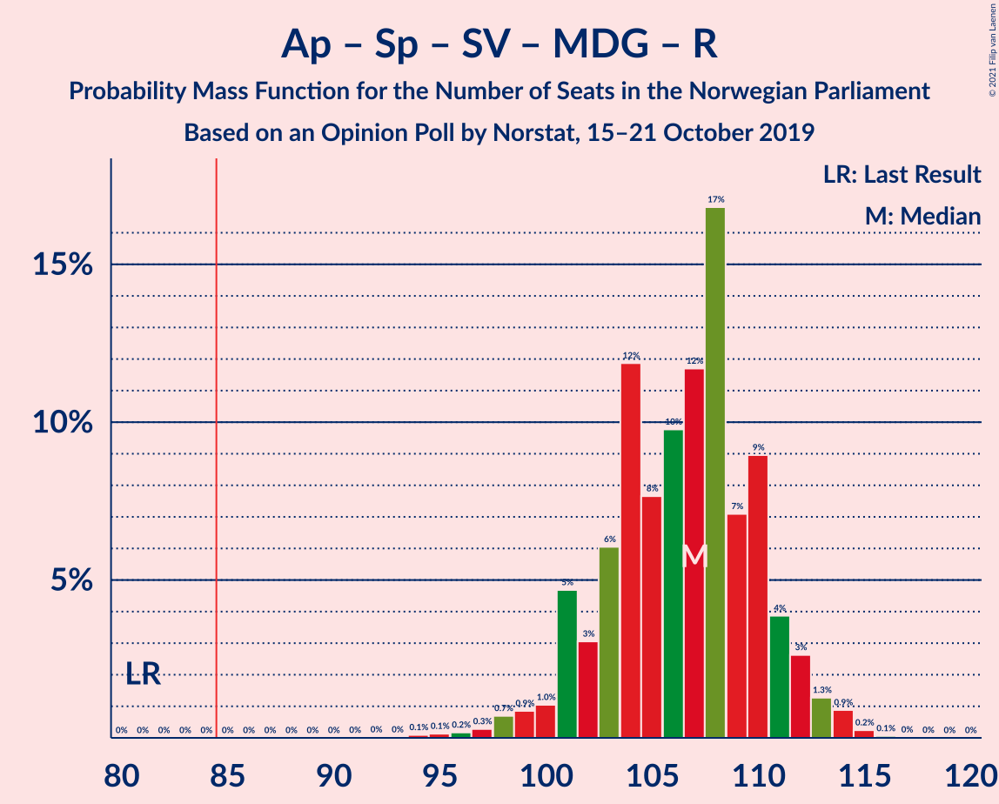

| Number of Seats | Probability | Accumulated | Special Marks |
|:---------------:|:-----------:|:-----------:|:-------------:|
| 81 | 0% | 100% | Last Result |
| 82 | 0% | 100% |  |
| 83 | 0% | 100% |  |
| 84 | 0% | 100% |  |
| 85 | 0% | 100% | Majority |
| 86 | 0% | 100% |  |
| 87 | 0% | 100% |  |
| 88 | 0% | 100% |  |
| 89 | 0% | 100% |  |
| 90 | 0% | 100% |  |
| 91 | 0% | 100% |  |
| 92 | 0% | 100% |  |
| 93 | 0% | 100% |  |
| 94 | 0.1% | 99.9% |  |
| 95 | 0.1% | 99.8% |  |
| 96 | 0.2% | 99.7% |  |
| 97 | 0.3% | 99.5% |  |
| 98 | 0.7% | 99.3% |  |
| 99 | 0.9% | 98.6% |  |
| 100 | 1.0% | 98% |  |
| 101 | 5% | 97% |  |
| 102 | 3% | 92% |  |
| 103 | 6% | 89% |  |
| 104 | 12% | 83% |  |
| 105 | 8% | 71% |  |
| 106 | 10% | 63% | Median |
| 107 | 12% | 54% |  |
| 108 | 17% | 42% |  |
| 109 | 7% | 25% |  |
| 110 | 9% | 18% |  |
| 111 | 4% | 9% |  |
| 112 | 3% | 5% |  |
| 113 | 1.3% | 2% |  |
| 114 | 0.9% | 1.2% |  |
| 115 | 0.2% | 0.3% |  |
| 116 | 0.1% | 0.1% |  |
| 117 | 0% | 0% |  |

### Arbeiderpartiet – Senterpartiet – Sosialistisk Venstreparti – Miljøpartiet De Grønne – Kristelig Folkeparti

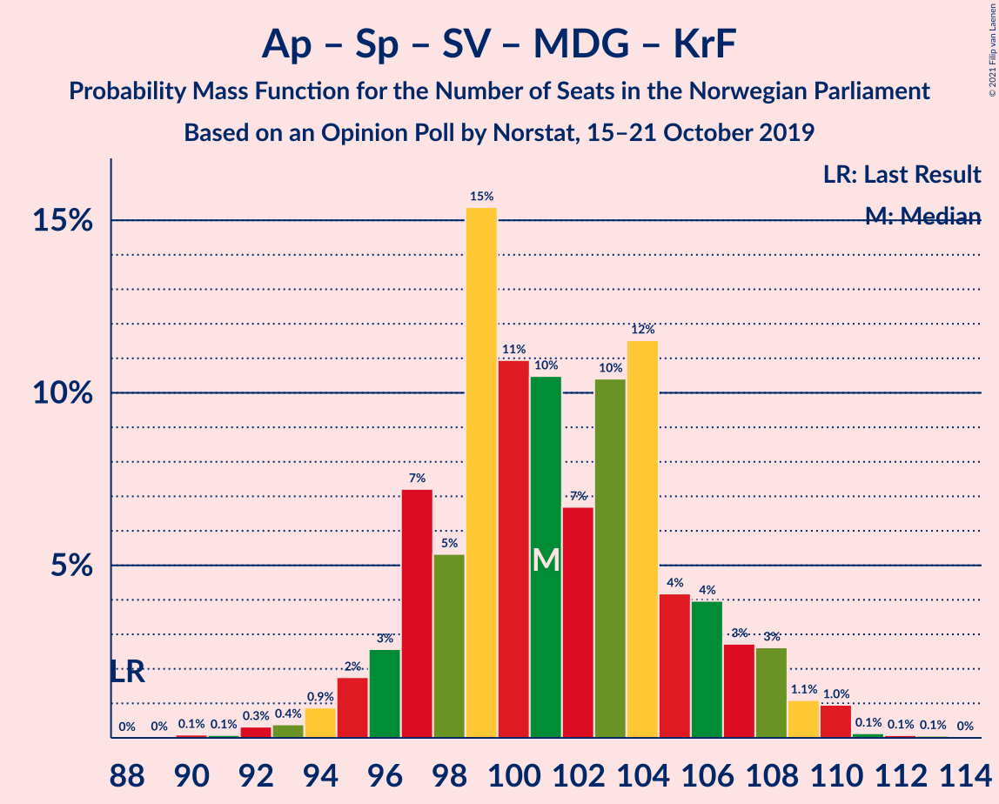

| Number of Seats | Probability | Accumulated | Special Marks |
|:---------------:|:-----------:|:-----------:|:-------------:|
| 88 | 0% | 100% | Last Result |
| 89 | 0% | 100% |  |
| 90 | 0.1% | 100% |  |
| 91 | 0.1% | 99.9% |  |
| 92 | 0.3% | 99.8% |  |
| 93 | 0.4% | 99.5% |  |
| 94 | 0.9% | 99.1% |  |
| 95 | 2% | 98% |  |
| 96 | 3% | 96% |  |
| 97 | 7% | 94% |  |
| 98 | 5% | 87% |  |
| 99 | 15% | 81% |  |
| 100 | 11% | 66% | Median |
| 101 | 10% | 55% |  |
| 102 | 7% | 45% |  |
| 103 | 10% | 38% |  |
| 104 | 12% | 27% |  |
| 105 | 4% | 16% |  |
| 106 | 4% | 12% |  |
| 107 | 3% | 8% |  |
| 108 | 3% | 5% |  |
| 109 | 1.1% | 2% |  |
| 110 | 1.0% | 1.3% |  |
| 111 | 0.1% | 0.3% |  |
| 112 | 0.1% | 0.2% |  |
| 113 | 0.1% | 0.1% |  |
| 114 | 0% | 0% |  |

### Arbeiderpartiet – Senterpartiet – Sosialistisk Venstreparti – Miljøpartiet De Grønne

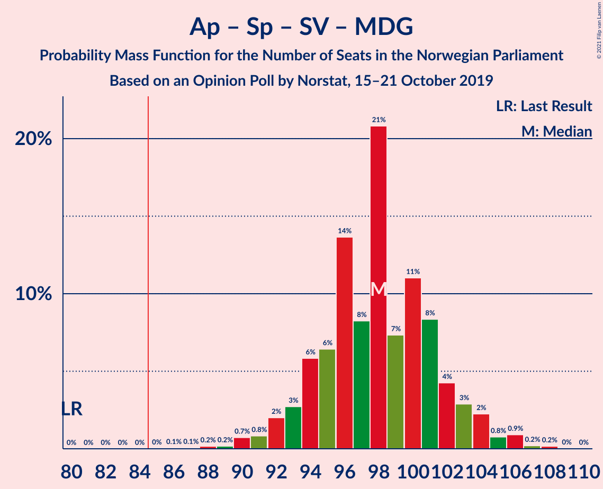

| Number of Seats | Probability | Accumulated | Special Marks |
|:---------------:|:-----------:|:-----------:|:-------------:|
| 80 | 0% | 100% | Last Result |
| 81 | 0% | 100% |  |
| 82 | 0% | 100% |  |
| 83 | 0% | 100% |  |
| 84 | 0% | 100% |  |
| 85 | 0% | 100% | Majority |
| 86 | 0.1% | 100% |  |
| 87 | 0.1% | 99.9% |  |
| 88 | 0.2% | 99.8% |  |
| 89 | 0.2% | 99.7% |  |
| 90 | 0.7% | 99.5% |  |
| 91 | 0.8% | 98.8% |  |
| 92 | 2% | 98% |  |
| 93 | 3% | 96% |  |
| 94 | 6% | 93% |  |
| 95 | 6% | 87% |  |
| 96 | 14% | 81% |  |
| 97 | 8% | 67% | Median |
| 98 | 21% | 59% |  |
| 99 | 7% | 38% |  |
| 100 | 11% | 31% |  |
| 101 | 8% | 20% |  |
| 102 | 4% | 11% |  |
| 103 | 3% | 7% |  |
| 104 | 2% | 4% |  |
| 105 | 0.8% | 2% |  |
| 106 | 0.9% | 1.3% |  |
| 107 | 0.2% | 0.4% |  |
| 108 | 0.2% | 0.2% |  |
| 109 | 0% | 0.1% |  |
| 110 | 0% | 0% |  |

### Høyre – Senterpartiet – Fremskrittspartiet – Kristelig Folkeparti – Venstre

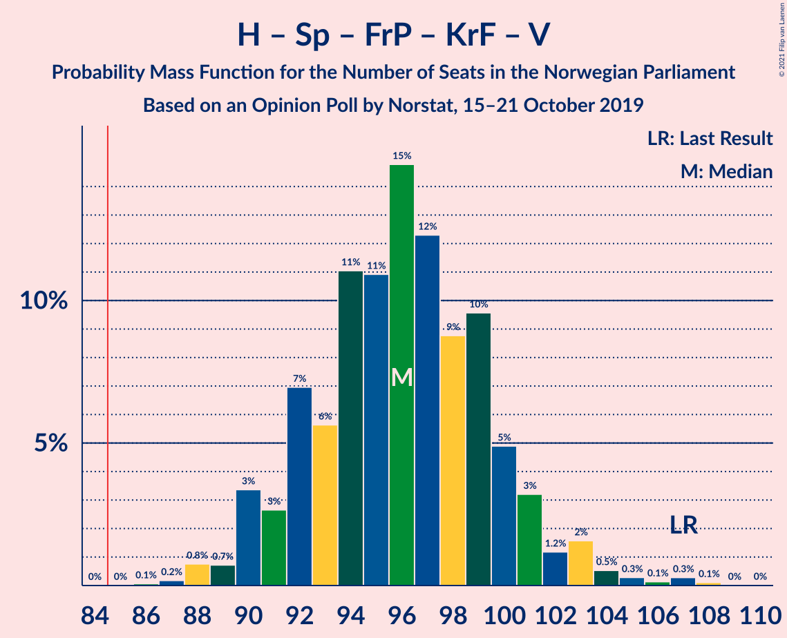

| Number of Seats | Probability | Accumulated | Special Marks |
|:---------------:|:-----------:|:-----------:|:-------------:|
| 86 | 0.1% | 100% |  |
| 87 | 0.2% | 99.9% |  |
| 88 | 0.8% | 99.7% |  |
| 89 | 0.7% | 99.0% |  |
| 90 | 3% | 98% |  |
| 91 | 3% | 95% |  |
| 92 | 7% | 92% |  |
| 93 | 6% | 85% |  |
| 94 | 11% | 80% | Median |
| 95 | 11% | 69% |  |
| 96 | 15% | 58% |  |
| 97 | 12% | 43% |  |
| 98 | 9% | 31% |  |
| 99 | 10% | 22% |  |
| 100 | 5% | 12% |  |
| 101 | 3% | 7% |  |
| 102 | 1.2% | 4% |  |
| 103 | 2% | 3% |  |
| 104 | 0.5% | 1.4% |  |
| 105 | 0.3% | 0.8% |  |
| 106 | 0.1% | 0.6% |  |
| 107 | 0.3% | 0.4% | Last Result |
| 108 | 0.1% | 0.1% |  |
| 109 | 0% | 0% |  |

### Arbeiderpartiet – Senterpartiet – Sosialistisk Venstreparti – Rødt

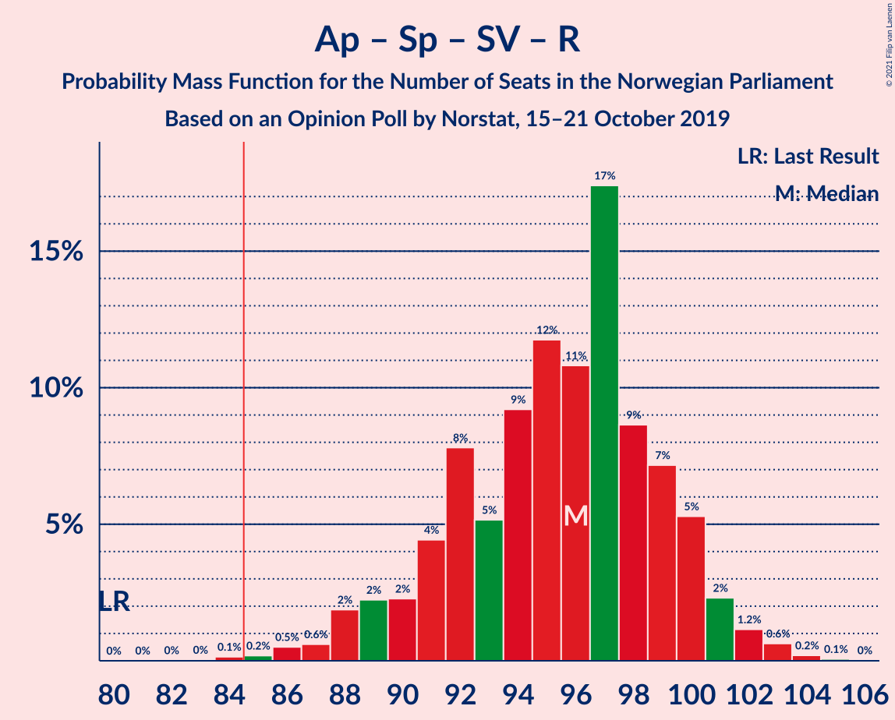

| Number of Seats | Probability | Accumulated | Special Marks |
|:---------------:|:-----------:|:-----------:|:-------------:|
| 80 | 0% | 100% | Last Result |
| 81 | 0% | 100% |  |
| 82 | 0% | 100% |  |
| 83 | 0% | 100% |  |
| 84 | 0.1% | 99.9% |  |
| 85 | 0.2% | 99.8% | Majority |
| 86 | 0.5% | 99.6% |  |
| 87 | 0.6% | 99.1% |  |
| 88 | 2% | 98% |  |
| 89 | 2% | 97% |  |
| 90 | 2% | 94% |  |
| 91 | 4% | 92% |  |
| 92 | 8% | 88% |  |
| 93 | 5% | 80% |  |
| 94 | 9% | 75% |  |
| 95 | 12% | 65% | Median |
| 96 | 11% | 54% |  |
| 97 | 17% | 43% |  |
| 98 | 9% | 25% |  |
| 99 | 7% | 17% |  |
| 100 | 5% | 10% |  |
| 101 | 2% | 4% |  |
| 102 | 1.2% | 2% |  |
| 103 | 0.6% | 0.9% |  |
| 104 | 0.2% | 0.3% |  |
| 105 | 0.1% | 0.1% |  |
| 106 | 0% | 0% |  |

### Arbeiderpartiet – Senterpartiet – Miljøpartiet De Grønne – Kristelig Folkeparti

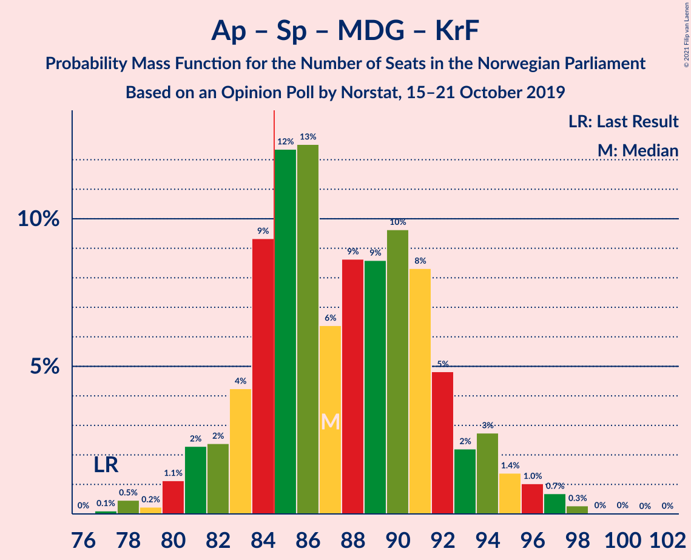

| Number of Seats | Probability | Accumulated | Special Marks |
|:---------------:|:-----------:|:-----------:|:-------------:|
| 76 | 0% | 100% |  |
| 77 | 0.1% | 99.9% | Last Result |
| 78 | 0.5% | 99.8% |  |
| 79 | 0.2% | 99.4% |  |
| 80 | 1.1% | 99.1% |  |
| 81 | 2% | 98% |  |
| 82 | 2% | 96% |  |
| 83 | 4% | 93% |  |
| 84 | 9% | 89% |  |
| 85 | 12% | 80% | Majority |
| 86 | 13% | 67% | Median |
| 87 | 6% | 55% |  |
| 88 | 9% | 48% |  |
| 89 | 9% | 40% |  |
| 90 | 10% | 31% |  |
| 91 | 8% | 22% |  |
| 92 | 5% | 13% |  |
| 93 | 2% | 8% |  |
| 94 | 3% | 6% |  |
| 95 | 1.4% | 3% |  |
| 96 | 1.0% | 2% |  |
| 97 | 0.7% | 1.1% |  |
| 98 | 0.3% | 0.4% |  |
| 99 | 0% | 0.1% |  |
| 100 | 0% | 0.1% |  |
| 101 | 0% | 0% |  |

### Arbeiderpartiet – Senterpartiet – Sosialistisk Venstreparti

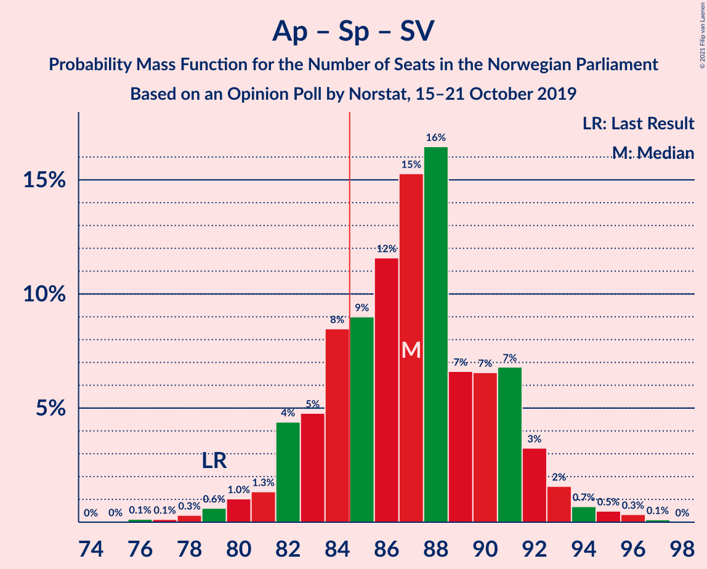

| Number of Seats | Probability | Accumulated | Special Marks |
|:---------------:|:-----------:|:-----------:|:-------------:|
| 76 | 0.1% | 100% |  |
| 77 | 0.1% | 99.8% |  |
| 78 | 0.3% | 99.7% |  |
| 79 | 0.6% | 99.4% | Last Result |
| 80 | 1.0% | 98.8% |  |
| 81 | 1.3% | 98% |  |
| 82 | 4% | 96% |  |
| 83 | 5% | 92% |  |
| 84 | 8% | 87% |  |
| 85 | 9% | 79% | Majority |
| 86 | 12% | 70% | Median |
| 87 | 15% | 58% |  |
| 88 | 16% | 43% |  |
| 89 | 7% | 26% |  |
| 90 | 7% | 20% |  |
| 91 | 7% | 13% |  |
| 92 | 3% | 6% |  |
| 93 | 2% | 3% |  |
| 94 | 0.7% | 2% |  |
| 95 | 0.5% | 1.0% |  |
| 96 | 0.3% | 0.5% |  |
| 97 | 0.1% | 0.1% |  |
| 98 | 0% | 0% |  |

### Arbeiderpartiet – Senterpartiet – Kristelig Folkeparti

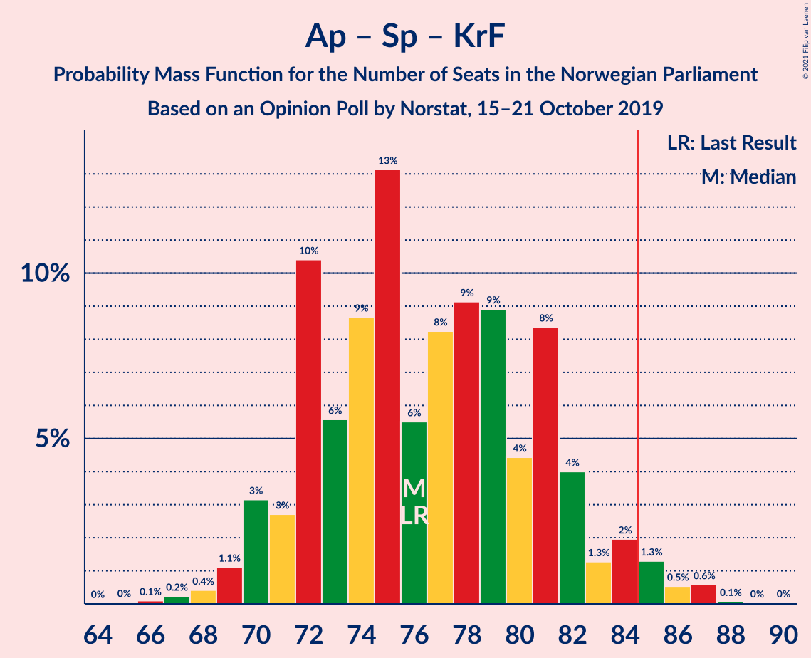

| Number of Seats | Probability | Accumulated | Special Marks |
|:---------------:|:-----------:|:-----------:|:-------------:|
| 65 | 0% | 100% |  |
| 66 | 0.1% | 99.9% |  |
| 67 | 0.2% | 99.8% |  |
| 68 | 0.4% | 99.6% |  |
| 69 | 1.1% | 99.2% |  |
| 70 | 3% | 98% |  |
| 71 | 3% | 95% |  |
| 72 | 10% | 92% |  |
| 73 | 6% | 82% |  |
| 74 | 9% | 76% |  |
| 75 | 13% | 68% | Median |
| 76 | 6% | 54% | Last Result |
| 77 | 8% | 49% |  |
| 78 | 9% | 41% |  |
| 79 | 9% | 32% |  |
| 80 | 4% | 23% |  |
| 81 | 8% | 18% |  |
| 82 | 4% | 10% |  |
| 83 | 1.3% | 6% |  |
| 84 | 2% | 5% |  |
| 85 | 1.3% | 3% | Majority |
| 86 | 0.5% | 1.3% |  |
| 87 | 0.6% | 0.7% |  |
| 88 | 0.1% | 0.1% |  |
| 89 | 0% | 0.1% |  |
| 90 | 0% | 0% |  |

### Høyre – Fremskrittspartiet – Miljøpartiet De Grønne – Kristelig Folkeparti – Venstre

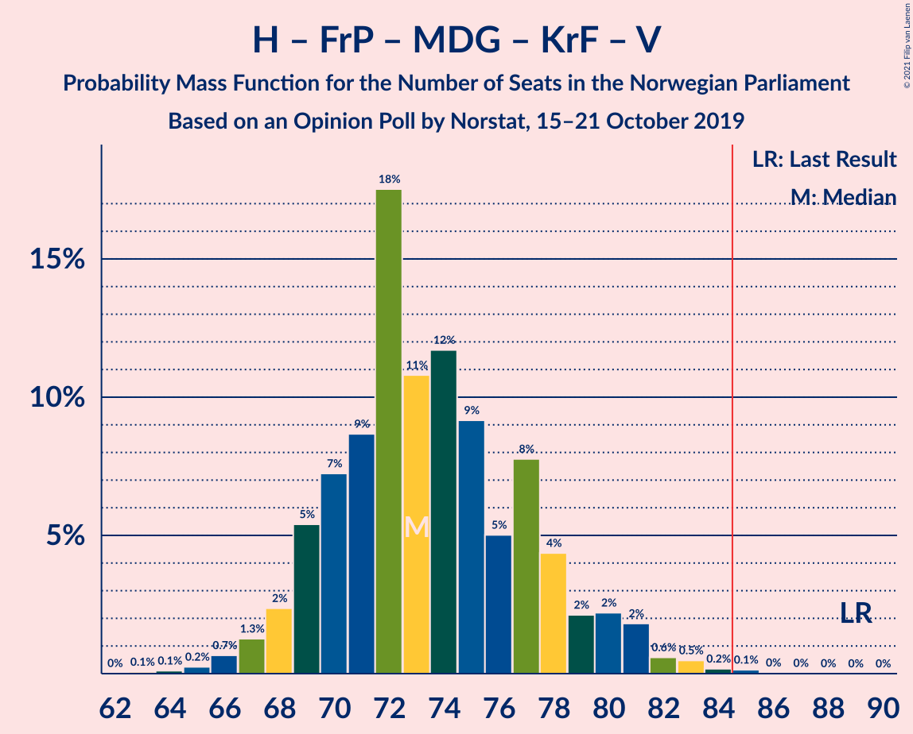

| Number of Seats | Probability | Accumulated | Special Marks |
|:---------------:|:-----------:|:-----------:|:-------------:|
| 63 | 0.1% | 100% |  |
| 64 | 0.1% | 99.9% |  |
| 65 | 0.2% | 99.8% |  |
| 66 | 0.7% | 99.6% |  |
| 67 | 1.3% | 98.9% |  |
| 68 | 2% | 98% |  |
| 69 | 5% | 95% |  |
| 70 | 7% | 90% |  |
| 71 | 9% | 83% |  |
| 72 | 18% | 74% | Median |
| 73 | 11% | 56% |  |
| 74 | 12% | 46% |  |
| 75 | 9% | 34% |  |
| 76 | 5% | 25% |  |
| 77 | 8% | 20% |  |
| 78 | 4% | 12% |  |
| 79 | 2% | 8% |  |
| 80 | 2% | 5% |  |
| 81 | 2% | 3% |  |
| 82 | 0.6% | 1.5% |  |
| 83 | 0.5% | 0.9% |  |
| 84 | 0.2% | 0.4% |  |
| 85 | 0.1% | 0.2% | Majority |
| 86 | 0% | 0.1% |  |
| 87 | 0% | 0% |  |
| 88 | 0% | 0% |  |
| 89 | 0% | 0% | Last Result |

### Arbeiderpartiet – Senterpartiet

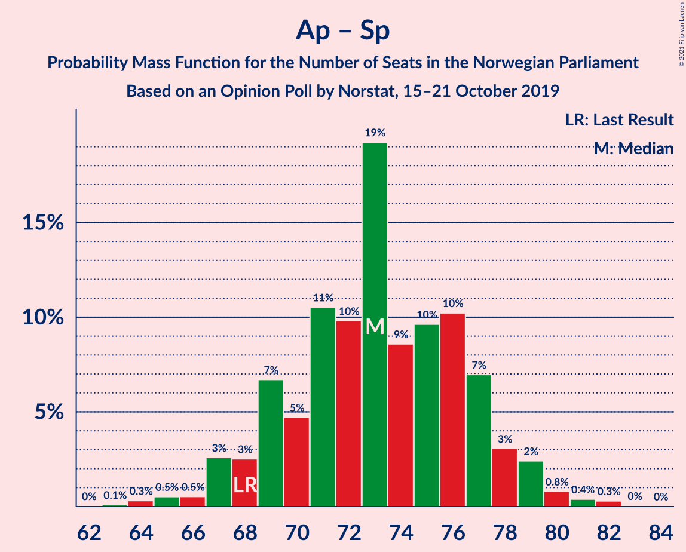

| Number of Seats | Probability | Accumulated | Special Marks |
|:---------------:|:-----------:|:-----------:|:-------------:|
| 63 | 0.1% | 100% |  |
| 64 | 0.3% | 99.9% |  |
| 65 | 0.5% | 99.6% |  |
| 66 | 0.5% | 99.0% |  |
| 67 | 3% | 98.5% |  |
| 68 | 3% | 96% | Last Result |
| 69 | 7% | 93% |  |
| 70 | 5% | 87% |  |
| 71 | 11% | 82% |  |
| 72 | 10% | 71% | Median |
| 73 | 19% | 62% |  |
| 74 | 9% | 42% |  |
| 75 | 10% | 34% |  |
| 76 | 10% | 24% |  |
| 77 | 7% | 14% |  |
| 78 | 3% | 7% |  |
| 79 | 2% | 4% |  |
| 80 | 0.8% | 2% |  |
| 81 | 0.4% | 0.7% |  |
| 82 | 0.3% | 0.4% |  |
| 83 | 0% | 0.1% |  |
| 84 | 0% | 0% |  |

### Høyre – Fremskrittspartiet – Kristelig Folkeparti – Venstre

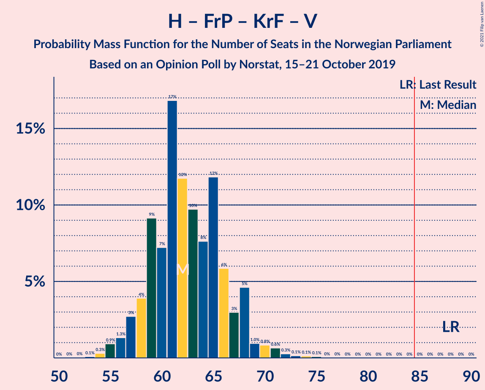

| Number of Seats | Probability | Accumulated | Special Marks |
|:---------------:|:-----------:|:-----------:|:-------------:|
| 53 | 0.1% | 100% |  |
| 54 | 0.3% | 99.9% |  |
| 55 | 0.9% | 99.6% |  |
| 56 | 1.3% | 98.6% |  |
| 57 | 3% | 97% |  |
| 58 | 4% | 95% |  |
| 59 | 9% | 91% |  |
| 60 | 7% | 82% |  |
| 61 | 17% | 74% | Median |
| 62 | 12% | 57% |  |
| 63 | 10% | 46% |  |
| 64 | 8% | 36% |  |
| 65 | 12% | 28% |  |
| 66 | 6% | 17% |  |
| 67 | 3% | 11% |  |
| 68 | 5% | 8% |  |
| 69 | 1.0% | 3% |  |
| 70 | 0.8% | 2% |  |
| 71 | 0.6% | 1.3% |  |
| 72 | 0.3% | 0.7% |  |
| 73 | 0.1% | 0.4% |  |
| 74 | 0.1% | 0.3% |  |
| 75 | 0.1% | 0.1% |  |
| 76 | 0% | 0% |  |
| 77 | 0% | 0% |  |
| 78 | 0% | 0% |  |
| 79 | 0% | 0% |  |
| 80 | 0% | 0% |  |
| 81 | 0% | 0% |  |
| 82 | 0% | 0% |  |
| 83 | 0% | 0% |  |
| 84 | 0% | 0% |  |
| 85 | 0% | 0% | Majority |
| 86 | 0% | 0% |  |
| 87 | 0% | 0% |  |
| 88 | 0% | 0% | Last Result |

### Høyre – Fremskrittspartiet – Venstre

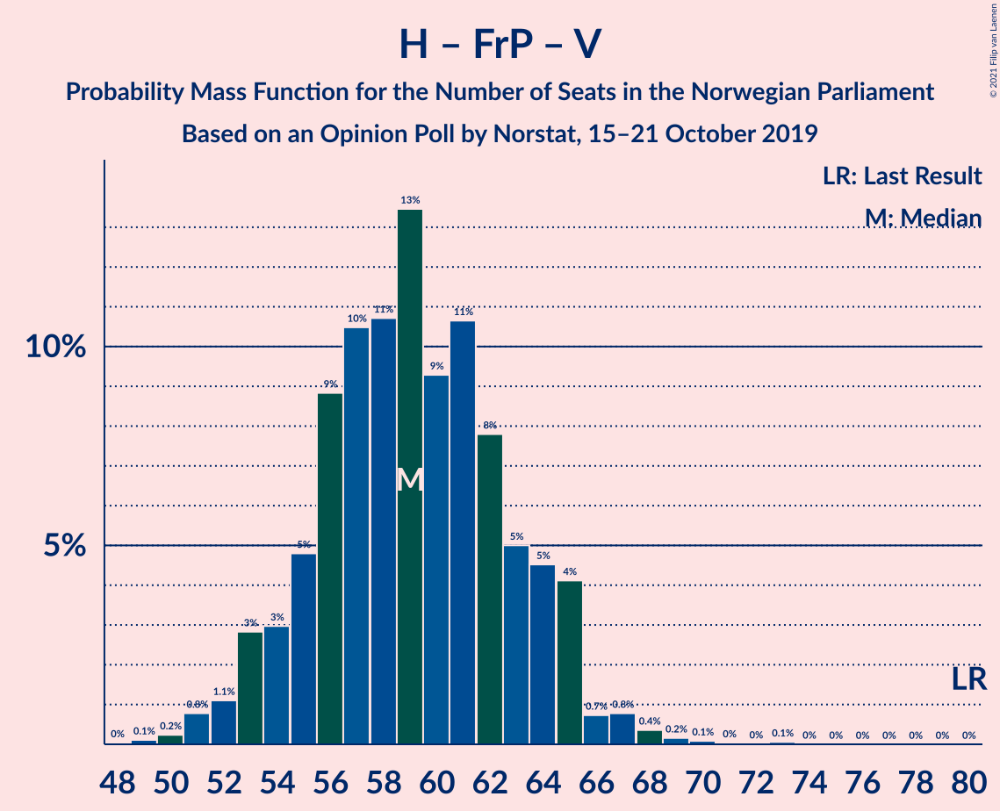

| Number of Seats | Probability | Accumulated | Special Marks |
|:---------------:|:-----------:|:-----------:|:-------------:|
| 48 | 0% | 100% |  |
| 49 | 0.1% | 99.9% |  |
| 50 | 0.2% | 99.8% |  |
| 51 | 0.8% | 99.6% |  |
| 52 | 1.1% | 98.8% |  |
| 53 | 3% | 98% |  |
| 54 | 3% | 95% |  |
| 55 | 5% | 92% |  |
| 56 | 9% | 87% |  |
| 57 | 10% | 78% |  |
| 58 | 11% | 68% | Median |
| 59 | 13% | 57% |  |
| 60 | 9% | 44% |  |
| 61 | 11% | 34% |  |
| 62 | 8% | 24% |  |
| 63 | 5% | 16% |  |
| 64 | 5% | 11% |  |
| 65 | 4% | 6% |  |
| 66 | 0.7% | 2% |  |
| 67 | 0.8% | 1.5% |  |
| 68 | 0.4% | 0.7% |  |
| 69 | 0.2% | 0.4% |  |
| 70 | 0.1% | 0.2% |  |
| 71 | 0% | 0.1% |  |
| 72 | 0% | 0.1% |  |
| 73 | 0.1% | 0.1% |  |
| 74 | 0% | 0% |  |
| 75 | 0% | 0% |  |
| 76 | 0% | 0% |  |
| 77 | 0% | 0% |  |
| 78 | 0% | 0% |  |
| 79 | 0% | 0% |  |
| 80 | 0% | 0% | Last Result |

### Høyre – Fremskrittspartiet

| Number of Seats | Probability | Accumulated | Special Marks |
|:---------------:|:-----------:|:-----------:|:-------------:|
| 46 | 0.1% | 100% |  |
| 47 | 0.2% | 99.9% |  |
| 48 | 0.5% | 99.7% |  |
| 49 | 2% | 99.2% |  |
| 50 | 3% | 97% |  |
| 51 | 4% | 94% |  |
| 52 | 4% | 91% |  |
| 53 | 7% | 86% |  |
| 54 | 11% | 79% |  |
| 55 | 10% | 68% |  |
| 56 | 10% | 58% | Median |
| 57 | 13% | 47% |  |
| 58 | 9% | 35% |  |
| 59 | 10% | 25% |  |
| 60 | 4% | 15% |  |
| 61 | 4% | 11% |  |
| 62 | 4% | 8% |  |
| 63 | 3% | 3% |  |
| 64 | 0.3% | 0.8% |  |
| 65 | 0.3% | 0.5% |  |
| 66 | 0.1% | 0.2% |  |
| 67 | 0.1% | 0.1% |  |
| 68 | 0% | 0% |  |
| 69 | 0% | 0% |  |
| 70 | 0% | 0% |  |
| 71 | 0% | 0% |  |
| 72 | 0% | 0% | Last Result |

### Arbeiderpartiet – Sosialistisk Venstreparti

| Number of Seats | Probability | Accumulated | Special Marks |
|:---------------:|:-----------:|:-----------:|:-------------:|
| 43 | 0% | 100% |  |
| 44 | 0.1% | 99.9% |  |
| 45 | 0.1% | 99.8% |  |
| 46 | 0.3% | 99.7% |  |
| 47 | 0.6% | 99.4% |  |
| 48 | 2% | 98.8% |  |
| 49 | 3% | 97% |  |
| 50 | 8% | 94% |  |
| 51 | 18% | 86% |  |
| 52 | 6% | 68% |  |
| 53 | 10% | 62% | Median |
| 54 | 21% | 52% |  |
| 55 | 9% | 31% |  |
| 56 | 6% | 21% |  |
| 57 | 5% | 15% |  |
| 58 | 6% | 10% |  |
| 59 | 2% | 4% |  |
| 60 | 0.9% | 1.5% | Last Result |
| 61 | 0.4% | 0.5% |  |
| 62 | 0.1% | 0.2% |  |
| 63 | 0% | 0% |  |

### Høyre – Kristelig Folkeparti – Venstre

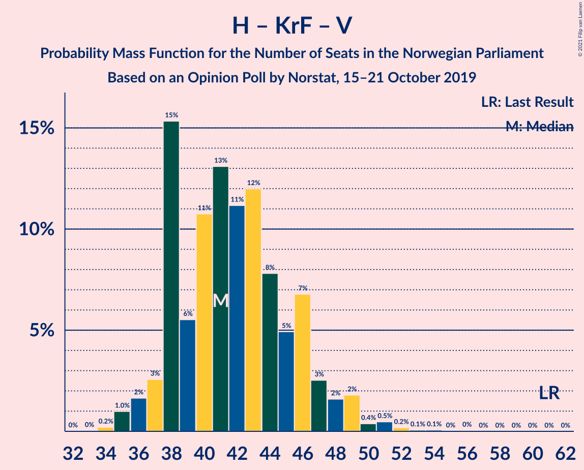

| Number of Seats | Probability | Accumulated | Special Marks |
|:---------------:|:-----------:|:-----------:|:-------------:|
| 33 | 0% | 100% |  |
| 34 | 0.2% | 99.9% |  |
| 35 | 1.0% | 99.7% |  |
| 36 | 2% | 98.8% |  |
| 37 | 3% | 97% |  |
| 38 | 15% | 95% |  |
| 39 | 6% | 79% |  |
| 40 | 11% | 74% | Median |
| 41 | 13% | 63% |  |
| 42 | 11% | 50% |  |
| 43 | 12% | 39% |  |
| 44 | 8% | 27% |  |
| 45 | 5% | 19% |  |
| 46 | 7% | 14% |  |
| 47 | 3% | 7% |  |
| 48 | 2% | 5% |  |
| 49 | 2% | 3% |  |
| 50 | 0.4% | 1.2% |  |
| 51 | 0.5% | 0.8% |  |
| 52 | 0.2% | 0.4% |  |
| 53 | 0.1% | 0.2% |  |
| 54 | 0.1% | 0.1% |  |
| 55 | 0% | 0.1% |  |
| 56 | 0% | 0.1% |  |
| 57 | 0% | 0% |  |
| 58 | 0% | 0% |  |
| 59 | 0% | 0% |  |
| 60 | 0% | 0% |  |
| 61 | 0% | 0% | Last Result |

### Senterpartiet – Kristelig Folkeparti – Venstre

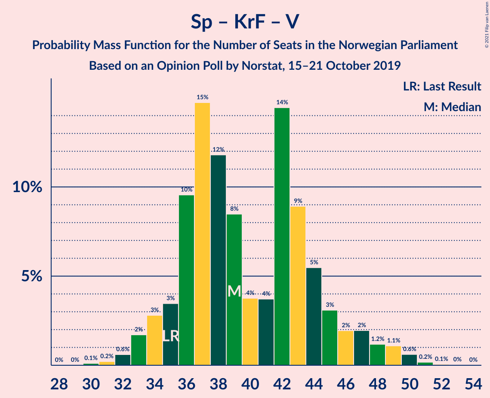

| Number of Seats | Probability | Accumulated | Special Marks |
|:---------------:|:-----------:|:-----------:|:-------------:|
| 30 | 0.1% | 100% |  |
| 31 | 0.2% | 99.9% |  |
| 32 | 0.6% | 99.7% |  |
| 33 | 2% | 99.1% |  |
| 34 | 3% | 97% |  |
| 35 | 3% | 95% | Last Result |
| 36 | 10% | 91% |  |
| 37 | 15% | 82% |  |
| 38 | 12% | 67% | Median |
| 39 | 8% | 55% |  |
| 40 | 4% | 47% |  |
| 41 | 4% | 43% |  |
| 42 | 14% | 39% |  |
| 43 | 9% | 25% |  |
| 44 | 5% | 16% |  |
| 45 | 3% | 10% |  |
| 46 | 2% | 7% |  |
| 47 | 2% | 5% |  |
| 48 | 1.2% | 3% |  |
| 49 | 1.1% | 2% |  |
| 50 | 0.6% | 0.9% |  |
| 51 | 0.2% | 0.3% |  |
| 52 | 0.1% | 0.1% |  |
| 53 | 0% | 0.1% |  |
| 54 | 0% | 0% |  |

## Technical Information

### Opinion Poll

+ **Polling firm:** Norstat
+ **Commissioner(s):** —
+ **Fieldwork period:** 15–21 October 2019

### Calculations

+ **Sample size:** 929
+ **Simulations done:** 1,048,576
+ **Error estimate:** 1.22%

