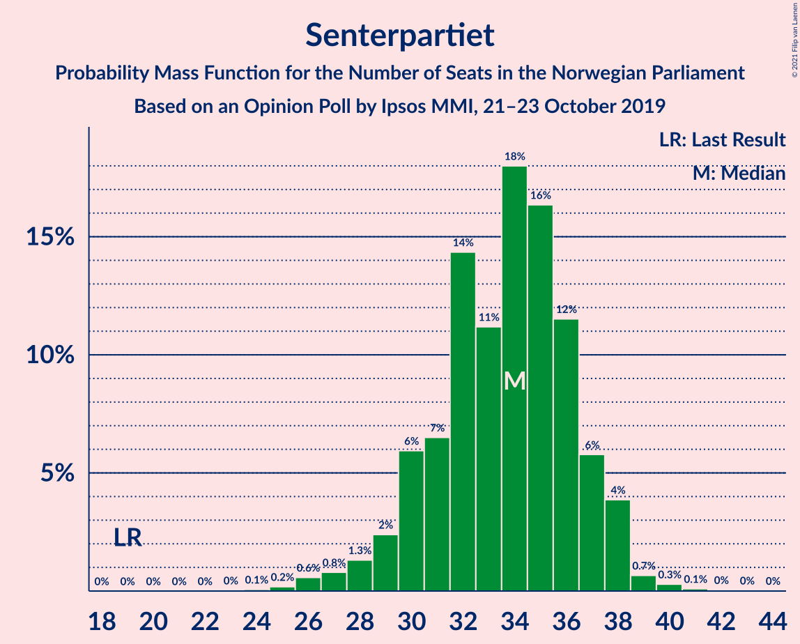

# Opinion Poll by Ipsos MMI, 21–23 October 2019

<a href="#voting-intentions">Voting Intentions</a> | <a href="#seats">Seats</a> | <a href="#coalitions">Coalitions</a> | <a href="#technical-information">Technical Information</a>

## Voting Intentions

### Confidence Intervals

| Party | Last Result | Poll Result | 80% Confidence Interval | 90% Confidence Interval | 95% Confidence Interval | 99% Confidence Interval |
|:-----:|:-----------:|:-----------:|:-----------------------:|:-----------------------:|:-----------------------:|:-----------------------:|
| Arbeiderpartiet | 27.4% | 22.6% | 20.8–24.7% |20.3–25.3% |19.8–25.8% |18.9–26.7% |
| Høyre | 25.0% | 21.1% | 19.3–23.1% |18.8–23.6% |18.3–24.1% |17.5–25.1% |
| Senterpartiet | 10.3% | 17.7% | 16.0–19.6% |15.5–20.1% |15.1–20.5% |14.4–21.5% |
| Fremskrittspartiet | 15.2% | 10.3% | 9.0–11.9% |8.7–12.3% |8.4–12.7% |7.8–13.5% |
| Miljøpartiet De Grønne | 3.2% | 7.1% | 6.0–8.4% |5.7–8.8% |5.5–9.1% |5.0–9.8% |
| Sosialistisk Venstreparti | 6.0% | 6.4% | 5.4–7.7% |5.1–8.1% |4.9–8.4% |4.4–9.0% |
| Rødt | 2.4% | 6.2% | 5.2–7.4% |4.9–7.8% |4.6–8.1% |4.2–8.7% |
| Venstre | 4.4% | 3.7% | 2.9–4.7% |2.7–5.0% |2.5–5.3% |2.2–5.8% |
| Kristelig Folkeparti | 4.2% | 2.7% | 2.1–3.7% |2.0–3.9% |1.8–4.2% |1.5–4.7% |

*Note:* The poll result column reflects the actual value used in the calculations. Published results may vary slightly, and in addition be rounded to fewer digits.

## Seats

### Confidence Intervals

| Party | Last Result | Median | 80% Confidence Interval | 90% Confidence Interval | 95% Confidence Interval | 99% Confidence Interval |
|:-----:|:-----------:|:------:|:-----------------------:|:-----------------------:|:-----------------------:|:-----------------------:|
| <a href="#arbeiderpartiet">Arbeiderpartiet</a> | 49 | 42 | 38–44 |37–45 |37–45 |34–47 |
| <a href="#høyre">Høyre</a> | 45 | 36 | 34–40 |33–41 |32–42 |30–43 |
| <a href="#senterpartiet">Senterpartiet</a> | 19 | 34 | 30–37 |29–38 |28–38 |26–39 |
| <a href="#fremskrittspartiet">Fremskrittspartiet</a> | 27 | 18 | 15–21 |15–22 |14–22 |13–24 |
| <a href="#miljøpartiet-de-grønne">Miljøpartiet De Grønne</a> | 1 | 12 | 10–15 |10–15 |9–16 |8–17 |
| <a href="#sosialistisk-venstreparti">Sosialistisk Venstreparti</a> | 11 | 11 | 9–13 |9–14 |8–14 |7–16 |
| <a href="#rødt">Rødt</a> | 1 | 11 | 9–13 |8–13 |8–14 |7–15 |
| <a href="#venstre">Venstre</a> | 8 | 2 | 2–8 |2–8 |2–9 |1–10 |
| <a href="#kristelig-folkeparti">Kristelig Folkeparti</a> | 8 | 1 | 0–3 |0–3 |0–7 |0–8 |

### Arbeiderpartiet

*For a full overview of the results for this party, see the [Arbeiderpartiet](party-arbeiderpartiet.html) page.*

| Number of Seats | Probability | Accumulated | Special Marks |
|:---------------:|:-----------:|:-----------:|:-------------:|
| 31 | 0.1% | 100% |  |
| 32 | 0.1% | 99.9% |  |
| 33 | 0.2% | 99.8% |  |
| 34 | 0.2% | 99.6% |  |
| 35 | 0.4% | 99.4% |  |
| 36 | 0.7% | 99.0% |  |
| 37 | 4% | 98% |  |
| 38 | 6% | 94% |  |
| 39 | 10% | 88% |  |
| 40 | 17% | 77% |  |
| 41 | 7% | 60% |  |
| 42 | 10% | 53% | Median |
| 43 | 24% | 43% |  |
| 44 | 9% | 19% |  |
| 45 | 8% | 10% |  |
| 46 | 1.3% | 2% |  |
| 47 | 0.6% | 1.0% |  |
| 48 | 0.2% | 0.4% |  |
| 49 | 0.1% | 0.3% | Last Result |
| 50 | 0.1% | 0.1% |  |
| 51 | 0% | 0.1% |  |
| 52 | 0% | 0% |  |

### Høyre

*For a full overview of the results for this party, see the [Høyre](party-høyre.html) page.*

| Number of Seats | Probability | Accumulated | Special Marks |
|:---------------:|:-----------:|:-----------:|:-------------:|
| 29 | 0.2% | 100% |  |
| 30 | 0.5% | 99.8% |  |
| 31 | 1.2% | 99.3% |  |
| 32 | 1.2% | 98% |  |
| 33 | 6% | 97% |  |
| 34 | 8% | 91% |  |
| 35 | 15% | 83% |  |
| 36 | 21% | 67% | Median |
| 37 | 17% | 47% |  |
| 38 | 8% | 29% |  |
| 39 | 8% | 22% |  |
| 40 | 5% | 14% |  |
| 41 | 5% | 9% |  |
| 42 | 3% | 4% |  |
| 43 | 1.1% | 2% |  |
| 44 | 0.3% | 0.5% |  |
| 45 | 0.1% | 0.2% | Last Result |
| 46 | 0% | 0.1% |  |
| 47 | 0% | 0.1% |  |
| 48 | 0% | 0% |  |

### Senterpartiet

*For a full overview of the results for this party, see the [Senterpartiet](party-senterpartiet.html) page.*

| Number of Seats | Probability | Accumulated | Special Marks |
|:---------------:|:-----------:|:-----------:|:-------------:|
| 19 | 0% | 100% | Last Result |
| 20 | 0% | 100% |  |
| 21 | 0% | 100% |  |
| 22 | 0% | 100% |  |
| 23 | 0% | 100% |  |
| 24 | 0.1% | 100% |  |
| 25 | 0.2% | 99.9% |  |
| 26 | 0.6% | 99.7% |  |
| 27 | 0.8% | 99.1% |  |
| 28 | 1.3% | 98% |  |
| 29 | 2% | 97% |  |
| 30 | 6% | 95% |  |
| 31 | 7% | 89% |  |
| 32 | 14% | 82% |  |
| 33 | 11% | 68% |  |
| 34 | 18% | 57% | Median |
| 35 | 16% | 39% |  |
| 36 | 12% | 22% |  |
| 37 | 6% | 11% |  |
| 38 | 4% | 5% |  |
| 39 | 0.7% | 1.1% |  |
| 40 | 0.3% | 0.5% |  |
| 41 | 0.1% | 0.2% |  |
| 42 | 0% | 0.1% |  |
| 43 | 0% | 0% |  |

### Fremskrittspartiet

*For a full overview of the results for this party, see the [Fremskrittspartiet](party-fremskrittspartiet.html) page.*

| Number of Seats | Probability | Accumulated | Special Marks |
|:---------------:|:-----------:|:-----------:|:-------------:|
| 12 | 0.2% | 100% |  |
| 13 | 1.0% | 99.7% |  |
| 14 | 3% | 98.7% |  |
| 15 | 9% | 95% |  |
| 16 | 14% | 87% |  |
| 17 | 15% | 73% |  |
| 18 | 17% | 58% | Median |
| 19 | 22% | 41% |  |
| 20 | 9% | 20% |  |
| 21 | 5% | 10% |  |
| 22 | 3% | 6% |  |
| 23 | 2% | 2% |  |
| 24 | 0.7% | 0.9% |  |
| 25 | 0.1% | 0.2% |  |
| 26 | 0.1% | 0.1% |  |
| 27 | 0% | 0% | Last Result |

### Miljøpartiet De Grønne

*For a full overview of the results for this party, see the [Miljøpartiet De Grønne](party-miljøpartietdegrønne.html) page.*

| Number of Seats | Probability | Accumulated | Special Marks |
|:---------------:|:-----------:|:-----------:|:-------------:|
| 1 | 0% | 100% | Last Result |
| 2 | 0% | 100% |  |
| 3 | 0% | 100% |  |
| 4 | 0% | 100% |  |
| 5 | 0% | 100% |  |
| 6 | 0% | 100% |  |
| 7 | 0% | 100% |  |
| 8 | 0.5% | 100% |  |
| 9 | 4% | 99.5% |  |
| 10 | 12% | 95% |  |
| 11 | 20% | 83% |  |
| 12 | 25% | 64% | Median |
| 13 | 19% | 38% |  |
| 14 | 9% | 19% |  |
| 15 | 7% | 10% |  |
| 16 | 2% | 3% |  |
| 17 | 1.0% | 1.3% |  |
| 18 | 0.2% | 0.3% |  |
| 19 | 0% | 0% |  |

### Sosialistisk Venstreparti

*For a full overview of the results for this party, see the [Sosialistisk Venstreparti](party-sosialistiskvenstreparti.html) page.*

| Number of Seats | Probability | Accumulated | Special Marks |
|:---------------:|:-----------:|:-----------:|:-------------:|
| 2 | 0% | 100% |  |
| 3 | 0% | 99.9% |  |
| 4 | 0% | 99.9% |  |
| 5 | 0% | 99.9% |  |
| 6 | 0% | 99.9% |  |
| 7 | 0.5% | 99.9% |  |
| 8 | 2% | 99.4% |  |
| 9 | 10% | 97% |  |
| 10 | 16% | 87% |  |
| 11 | 30% | 70% | Last Result, Median |
| 12 | 18% | 40% |  |
| 13 | 14% | 22% |  |
| 14 | 6% | 8% |  |
| 15 | 2% | 2% |  |
| 16 | 0.5% | 0.7% |  |
| 17 | 0.1% | 0.2% |  |
| 18 | 0% | 0% |  |

### Rødt

*For a full overview of the results for this party, see the [Rødt](party-rødt.html) page.*

| Number of Seats | Probability | Accumulated | Special Marks |
|:---------------:|:-----------:|:-----------:|:-------------:|
| 1 | 0% | 100% | Last Result |
| 2 | 0.2% | 100% |  |
| 3 | 0% | 99.8% |  |
| 4 | 0% | 99.8% |  |
| 5 | 0% | 99.8% |  |
| 6 | 0% | 99.8% |  |
| 7 | 1.1% | 99.8% |  |
| 8 | 7% | 98.7% |  |
| 9 | 23% | 92% |  |
| 10 | 19% | 69% |  |
| 11 | 21% | 50% | Median |
| 12 | 18% | 29% |  |
| 13 | 7% | 11% |  |
| 14 | 3% | 4% |  |
| 15 | 0.7% | 0.9% |  |
| 16 | 0.1% | 0.2% |  |
| 17 | 0% | 0.1% |  |
| 18 | 0% | 0% |  |

### Venstre

*For a full overview of the results for this party, see the [Venstre](party-venstre.html) page.*

| Number of Seats | Probability | Accumulated | Special Marks |
|:---------------:|:-----------:|:-----------:|:-------------:|
| 1 | 1.2% | 100% |  |
| 2 | 62% | 98.8% | Median |
| 3 | 1.2% | 37% |  |
| 4 | 0% | 36% |  |
| 5 | 0% | 36% |  |
| 6 | 0.6% | 36% |  |
| 7 | 23% | 35% |  |
| 8 | 8% | 12% | Last Result |
| 9 | 3% | 4% |  |
| 10 | 0.4% | 0.5% |  |
| 11 | 0.1% | 0.1% |  |
| 12 | 0% | 0% |  |

### Kristelig Folkeparti

*For a full overview of the results for this party, see the [Kristelig Folkeparti](party-kristeligfolkeparti.html) page.*

| Number of Seats | Probability | Accumulated | Special Marks |
|:---------------:|:-----------:|:-----------:|:-------------:|
| 0 | 12% | 100% |  |
| 1 | 56% | 88% | Median |
| 2 | 17% | 33% |  |
| 3 | 12% | 16% |  |
| 4 | 0% | 4% |  |
| 5 | 0% | 4% |  |
| 6 | 0.7% | 4% |  |
| 7 | 3% | 3% |  |
| 8 | 0.6% | 0.6% | Last Result |
| 9 | 0.1% | 0.1% |  |
| 10 | 0% | 0% |  |

## Coalitions

### Confidence Intervals

| Coalition | Last Result | Median | Majority? | 80% Confidence Interval | 90% Confidence Interval | 95% Confidence Interval | 99% Confidence Interval |
|:---------:|:-----------:|:------:|:---------:|:-----------------------:|:-----------------------:|:-----------------------:|:-----------------------:|
| Arbeiderpartiet – Senterpartiet – Miljøpartiet De Grønne – Sosialistisk Venstreparti – Rødt | 81 | 109 | 100% | 105–113 | 103–114 | 102–115 | 99–117 |
| Arbeiderpartiet – Senterpartiet – Miljøpartiet De Grønne – Sosialistisk Venstreparti – Kristelig Folkeparti | 88 | 101 | 100% | 95–103 | 94–105 | 93–106 | 91–108 |
| Arbeiderpartiet – Senterpartiet – Miljøpartiet De Grønne – Sosialistisk Venstreparti | 80 | 99 | 100% | 94–102 | 93–103 | 92–104 | 89–106 |
| Arbeiderpartiet – Senterpartiet – Sosialistisk Venstreparti – Rødt | 80 | 97 | 99.9% | 92–101 | 91–102 | 90–103 | 88–106 |
| Høyre – Senterpartiet – Fremskrittspartiet – Venstre – Kristelig Folkeparti | 107 | 94 | 99.6% | 89–98 | 88–99 | 87–100 | 85–103 |
| Arbeiderpartiet – Senterpartiet – Miljøpartiet De Grønne – Kristelig Folkeparti | 77 | 89 | 90% | 85–93 | 83–94 | 81–95 | 79–97 |
| Arbeiderpartiet – Senterpartiet – Sosialistisk Venstreparti | 79 | 87 | 70% | 82–90 | 81–91 | 79–92 | 77–94 |
| Arbeiderpartiet – Senterpartiet – Kristelig Folkeparti | 76 | 77 | 0.7% | 72–80 | 70–82 | 69–83 | 67–85 |
| Arbeiderpartiet – Miljøpartiet De Grønne – Sosialistisk Venstreparti – Rødt | 62 | 75 | 0.4% | 71–80 | 70–81 | 69–82 | 66–84 |
| Arbeiderpartiet – Senterpartiet | 68 | 76 | 0% | 71–79 | 69–80 | 68–81 | 66–82 |
| Høyre – Fremskrittspartiet – Miljøpartiet De Grønne – Venstre – Kristelig Folkeparti | 89 | 72 | 0% | 68–77 | 66–78 | 66–79 | 63–81 |
| Høyre – Fremskrittspartiet – Venstre – Kristelig Folkeparti | 88 | 60 | 0% | 56–64 | 55–66 | 54–67 | 52–70 |
| Høyre – Fremskrittspartiet – Venstre | 80 | 58 | 0% | 55–63 | 53–64 | 52–65 | 50–67 |
| Høyre – Fremskrittspartiet | 72 | 54 | 0% | 50–59 | 50–60 | 49–61 | 47–63 |
| Arbeiderpartiet – Sosialistisk Venstreparti | 60 | 53 | 0% | 49–56 | 48–56 | 47–58 | 45–60 |
| Høyre – Venstre – Kristelig Folkeparti | 61 | 42 | 0% | 38–47 | 38–48 | 37–50 | 35–52 |
| Senterpartiet – Venstre – Kristelig Folkeparti | 35 | 39 | 0% | 34–44 | 33–45 | 32–46 | 30–48 |

### Arbeiderpartiet – Senterpartiet – Miljøpartiet De Grønne – Sosialistisk Venstreparti – Rødt

| Number of Seats | Probability | Accumulated | Special Marks |
|:---------------:|:-----------:|:-----------:|:-------------:|
| 81 | 0% | 100% | Last Result |
| 82 | 0% | 100% |  |
| 83 | 0% | 100% |  |
| 84 | 0% | 100% |  |
| 85 | 0% | 100% | Majority |
| 86 | 0% | 100% |  |
| 87 | 0% | 100% |  |
| 88 | 0% | 100% |  |
| 89 | 0% | 100% |  |
| 90 | 0% | 100% |  |
| 91 | 0% | 100% |  |
| 92 | 0% | 100% |  |
| 93 | 0% | 100% |  |
| 94 | 0% | 100% |  |
| 95 | 0% | 100% |  |
| 96 | 0.1% | 100% |  |
| 97 | 0.1% | 99.9% |  |
| 98 | 0.1% | 99.8% |  |
| 99 | 0.4% | 99.7% |  |
| 100 | 0.4% | 99.3% |  |
| 101 | 0.7% | 98.9% |  |
| 102 | 1.5% | 98% |  |
| 103 | 2% | 97% |  |
| 104 | 3% | 94% |  |
| 105 | 7% | 92% |  |
| 106 | 9% | 85% |  |
| 107 | 5% | 76% |  |
| 108 | 8% | 71% |  |
| 109 | 20% | 63% |  |
| 110 | 13% | 44% | Median |
| 111 | 8% | 31% |  |
| 112 | 6% | 22% |  |
| 113 | 10% | 16% |  |
| 114 | 3% | 6% |  |
| 115 | 0.9% | 3% |  |
| 116 | 0.8% | 2% |  |
| 117 | 0.9% | 1.1% |  |
| 118 | 0.1% | 0.2% |  |
| 119 | 0% | 0.1% |  |
| 120 | 0% | 0% |  |

### Arbeiderpartiet – Senterpartiet – Miljøpartiet De Grønne – Sosialistisk Venstreparti – Kristelig Folkeparti

| Number of Seats | Probability | Accumulated | Special Marks |
|:---------------:|:-----------:|:-----------:|:-------------:|
| 87 | 0% | 100% |  |
| 88 | 0% | 99.9% | Last Result |
| 89 | 0.1% | 99.9% |  |
| 90 | 0.2% | 99.8% |  |
| 91 | 0.3% | 99.6% |  |
| 92 | 0.7% | 99.4% |  |
| 93 | 2% | 98.7% |  |
| 94 | 2% | 97% |  |
| 95 | 6% | 94% |  |
| 96 | 4% | 88% |  |
| 97 | 9% | 84% |  |
| 98 | 5% | 76% |  |
| 99 | 12% | 71% |  |
| 100 | 7% | 59% | Median |
| 101 | 14% | 52% |  |
| 102 | 16% | 38% |  |
| 103 | 13% | 22% |  |
| 104 | 3% | 9% |  |
| 105 | 2% | 6% |  |
| 106 | 2% | 3% |  |
| 107 | 0.5% | 1.4% |  |
| 108 | 0.5% | 0.9% |  |
| 109 | 0.3% | 0.4% |  |
| 110 | 0.1% | 0.1% |  |
| 111 | 0% | 0% |  |

### Arbeiderpartiet – Senterpartiet – Miljøpartiet De Grønne – Sosialistisk Venstreparti

| Number of Seats | Probability | Accumulated | Special Marks |
|:---------------:|:-----------:|:-----------:|:-------------:|
| 80 | 0% | 100% | Last Result |
| 81 | 0% | 100% |  |
| 82 | 0% | 100% |  |
| 83 | 0% | 100% |  |
| 84 | 0% | 100% |  |
| 85 | 0% | 100% | Majority |
| 86 | 0.1% | 100% |  |
| 87 | 0.1% | 99.9% |  |
| 88 | 0.1% | 99.8% |  |
| 89 | 0.3% | 99.7% |  |
| 90 | 0.8% | 99.4% |  |
| 91 | 0.8% | 98.6% |  |
| 92 | 2% | 98% |  |
| 93 | 4% | 95% |  |
| 94 | 5% | 92% |  |
| 95 | 5% | 87% |  |
| 96 | 9% | 82% |  |
| 97 | 7% | 73% |  |
| 98 | 12% | 66% |  |
| 99 | 9% | 54% | Median |
| 100 | 16% | 44% |  |
| 101 | 11% | 28% |  |
| 102 | 12% | 17% |  |
| 103 | 2% | 5% |  |
| 104 | 1.3% | 3% |  |
| 105 | 1.4% | 2% |  |
| 106 | 0.3% | 0.7% |  |
| 107 | 0.2% | 0.4% |  |
| 108 | 0.1% | 0.2% |  |
| 109 | 0% | 0% |  |

### Arbeiderpartiet – Senterpartiet – Sosialistisk Venstreparti – Rødt

| Number of Seats | Probability | Accumulated | Special Marks |
|:---------------:|:-----------:|:-----------:|:-------------:|
| 80 | 0% | 100% | Last Result |
| 81 | 0% | 100% |  |
| 82 | 0% | 100% |  |
| 83 | 0% | 100% |  |
| 84 | 0% | 100% |  |
| 85 | 0.1% | 99.9% | Majority |
| 86 | 0.1% | 99.9% |  |
| 87 | 0.2% | 99.7% |  |
| 88 | 0.5% | 99.5% |  |
| 89 | 2% | 99.1% |  |
| 90 | 1.1% | 98% |  |
| 91 | 3% | 96% |  |
| 92 | 5% | 94% |  |
| 93 | 5% | 89% |  |
| 94 | 6% | 84% |  |
| 95 | 9% | 78% |  |
| 96 | 10% | 69% |  |
| 97 | 14% | 59% |  |
| 98 | 19% | 46% | Median |
| 99 | 7% | 27% |  |
| 100 | 9% | 21% |  |
| 101 | 5% | 11% |  |
| 102 | 1.3% | 6% |  |
| 103 | 3% | 5% |  |
| 104 | 1.2% | 2% |  |
| 105 | 0.3% | 0.9% |  |
| 106 | 0.5% | 0.6% |  |
| 107 | 0% | 0% |  |

### Høyre – Senterpartiet – Fremskrittspartiet – Venstre – Kristelig Folkeparti

| Number of Seats | Probability | Accumulated | Special Marks |
|:---------------:|:-----------:|:-----------:|:-------------:|
| 82 | 0% | 100% |  |
| 83 | 0% | 99.9% |  |
| 84 | 0.3% | 99.9% |  |
| 85 | 0.3% | 99.6% | Majority |
| 86 | 0.9% | 99.3% |  |
| 87 | 1.2% | 98% |  |
| 88 | 2% | 97% |  |
| 89 | 5% | 95% |  |
| 90 | 6% | 89% |  |
| 91 | 8% | 83% | Median |
| 92 | 6% | 75% |  |
| 93 | 17% | 69% |  |
| 94 | 19% | 53% |  |
| 95 | 8% | 34% |  |
| 96 | 9% | 26% |  |
| 97 | 5% | 17% |  |
| 98 | 5% | 11% |  |
| 99 | 3% | 6% |  |
| 100 | 1.5% | 4% |  |
| 101 | 1.0% | 2% |  |
| 102 | 0.3% | 1.1% |  |
| 103 | 0.6% | 0.8% |  |
| 104 | 0.1% | 0.2% |  |
| 105 | 0.1% | 0.1% |  |
| 106 | 0% | 0% |  |
| 107 | 0% | 0% | Last Result |

### Arbeiderpartiet – Senterpartiet – Miljøpartiet De Grønne – Kristelig Folkeparti

| Number of Seats | Probability | Accumulated | Special Marks |
|:---------------:|:-----------:|:-----------:|:-------------:|
| 76 | 0% | 100% |  |
| 77 | 0% | 99.9% | Last Result |
| 78 | 0.1% | 99.9% |  |
| 79 | 0.3% | 99.8% |  |
| 80 | 1.0% | 99.5% |  |
| 81 | 1.2% | 98% |  |
| 82 | 1.4% | 97% |  |
| 83 | 2% | 96% |  |
| 84 | 4% | 94% |  |
| 85 | 6% | 90% | Majority |
| 86 | 8% | 84% |  |
| 87 | 9% | 75% |  |
| 88 | 8% | 66% |  |
| 89 | 10% | 58% | Median |
| 90 | 18% | 48% |  |
| 91 | 16% | 31% |  |
| 92 | 4% | 14% |  |
| 93 | 5% | 10% |  |
| 94 | 3% | 6% |  |
| 95 | 2% | 3% |  |
| 96 | 0.5% | 1.2% |  |
| 97 | 0.3% | 0.7% |  |
| 98 | 0.2% | 0.4% |  |
| 99 | 0.2% | 0.2% |  |
| 100 | 0% | 0% |  |

### Arbeiderpartiet – Senterpartiet – Sosialistisk Venstreparti

| Number of Seats | Probability | Accumulated | Special Marks |
|:---------------:|:-----------:|:-----------:|:-------------:|
| 74 | 0% | 100% |  |
| 75 | 0.1% | 99.9% |  |
| 76 | 0.1% | 99.8% |  |
| 77 | 0.4% | 99.7% |  |
| 78 | 0.9% | 99.3% |  |
| 79 | 1.2% | 98% | Last Result |
| 80 | 2% | 97% |  |
| 81 | 4% | 95% |  |
| 82 | 5% | 91% |  |
| 83 | 8% | 86% |  |
| 84 | 8% | 78% |  |
| 85 | 7% | 70% | Majority |
| 86 | 10% | 63% |  |
| 87 | 13% | 53% | Median |
| 88 | 15% | 40% |  |
| 89 | 7% | 25% |  |
| 90 | 9% | 19% |  |
| 91 | 5% | 10% |  |
| 92 | 3% | 4% |  |
| 93 | 0.7% | 2% |  |
| 94 | 0.7% | 0.8% |  |
| 95 | 0.1% | 0.1% |  |
| 96 | 0% | 0% |  |

### Arbeiderpartiet – Senterpartiet – Kristelig Folkeparti

| Number of Seats | Probability | Accumulated | Special Marks |
|:---------------:|:-----------:|:-----------:|:-------------:|
| 64 | 0% | 100% |  |
| 65 | 0.1% | 99.9% |  |
| 66 | 0.1% | 99.9% |  |
| 67 | 0.6% | 99.7% |  |
| 68 | 0.8% | 99.2% |  |
| 69 | 1.3% | 98% |  |
| 70 | 2% | 97% |  |
| 71 | 3% | 95% |  |
| 72 | 6% | 92% |  |
| 73 | 5% | 86% |  |
| 74 | 5% | 81% |  |
| 75 | 10% | 76% |  |
| 76 | 6% | 66% | Last Result |
| 77 | 17% | 59% | Median |
| 78 | 11% | 42% |  |
| 79 | 16% | 31% |  |
| 80 | 5% | 15% |  |
| 81 | 3% | 10% |  |
| 82 | 3% | 7% |  |
| 83 | 2% | 3% |  |
| 84 | 1.1% | 2% |  |
| 85 | 0.4% | 0.7% | Majority |
| 86 | 0.1% | 0.3% |  |
| 87 | 0.1% | 0.2% |  |
| 88 | 0% | 0.1% |  |
| 89 | 0% | 0% |  |

### Arbeiderpartiet – Miljøpartiet De Grønne – Sosialistisk Venstreparti – Rødt

| Number of Seats | Probability | Accumulated | Special Marks |
|:---------------:|:-----------:|:-----------:|:-------------:|
| 62 | 0% | 100% | Last Result |
| 63 | 0% | 100% |  |
| 64 | 0.1% | 100% |  |
| 65 | 0.1% | 99.9% |  |
| 66 | 0.6% | 99.8% |  |
| 67 | 0.3% | 99.2% |  |
| 68 | 1.0% | 98.9% |  |
| 69 | 2% | 98% |  |
| 70 | 3% | 96% |  |
| 71 | 5% | 94% |  |
| 72 | 5% | 88% |  |
| 73 | 9% | 83% |  |
| 74 | 8% | 74% |  |
| 75 | 19% | 66% |  |
| 76 | 17% | 47% | Median |
| 77 | 6% | 31% |  |
| 78 | 8% | 25% |  |
| 79 | 6% | 16% |  |
| 80 | 5% | 10% |  |
| 81 | 2% | 5% |  |
| 82 | 1.1% | 3% |  |
| 83 | 0.9% | 2% |  |
| 84 | 0.3% | 0.7% |  |
| 85 | 0.3% | 0.4% | Majority |
| 86 | 0% | 0.1% |  |
| 87 | 0% | 0.1% |  |
| 88 | 0% | 0% |  |

### Arbeiderpartiet – Senterpartiet

| Number of Seats | Probability | Accumulated | Special Marks |
|:---------------:|:-----------:|:-----------:|:-------------:|
| 63 | 0% | 100% |  |
| 64 | 0.1% | 99.9% |  |
| 65 | 0.3% | 99.8% |  |
| 66 | 0.6% | 99.5% |  |
| 67 | 0.7% | 98.9% |  |
| 68 | 2% | 98% | Last Result |
| 69 | 2% | 96% |  |
| 70 | 4% | 94% |  |
| 71 | 5% | 91% |  |
| 72 | 8% | 86% |  |
| 73 | 5% | 77% |  |
| 74 | 11% | 72% |  |
| 75 | 10% | 61% |  |
| 76 | 12% | 51% | Median |
| 77 | 18% | 39% |  |
| 78 | 9% | 20% |  |
| 79 | 6% | 12% |  |
| 80 | 2% | 6% |  |
| 81 | 2% | 3% |  |
| 82 | 0.9% | 1.1% |  |
| 83 | 0.1% | 0.2% |  |
| 84 | 0.1% | 0.1% |  |
| 85 | 0% | 0% | Majority |

### Høyre – Fremskrittspartiet – Miljøpartiet De Grønne – Venstre – Kristelig Folkeparti

| Number of Seats | Probability | Accumulated | Special Marks |
|:---------------:|:-----------:|:-----------:|:-------------:|
| 62 | 0% | 100% |  |
| 63 | 0.5% | 99.9% |  |
| 64 | 0.4% | 99.4% |  |
| 65 | 1.2% | 99.1% |  |
| 66 | 3% | 98% |  |
| 67 | 1.3% | 95% |  |
| 68 | 5% | 94% |  |
| 69 | 9% | 89% | Median |
| 70 | 7% | 79% |  |
| 71 | 19% | 73% |  |
| 72 | 14% | 54% |  |
| 73 | 10% | 41% |  |
| 74 | 9% | 31% |  |
| 75 | 6% | 22% |  |
| 76 | 5% | 16% |  |
| 77 | 5% | 11% |  |
| 78 | 3% | 6% |  |
| 79 | 1.0% | 3% |  |
| 80 | 2% | 2% |  |
| 81 | 0.5% | 0.9% |  |
| 82 | 0.2% | 0.5% |  |
| 83 | 0.1% | 0.3% |  |
| 84 | 0.1% | 0.1% |  |
| 85 | 0% | 0% | Majority |
| 86 | 0% | 0% |  |
| 87 | 0% | 0% |  |
| 88 | 0% | 0% |  |
| 89 | 0% | 0% | Last Result |

### Høyre – Fremskrittspartiet – Venstre – Kristelig Folkeparti

| Number of Seats | Probability | Accumulated | Special Marks |
|:---------------:|:-----------:|:-----------:|:-------------:|
| 50 | 0% | 100% |  |
| 51 | 0.1% | 99.9% |  |
| 52 | 0.9% | 99.8% |  |
| 53 | 0.8% | 98.9% |  |
| 54 | 0.9% | 98% |  |
| 55 | 3% | 97% |  |
| 56 | 10% | 94% |  |
| 57 | 6% | 83% | Median |
| 58 | 8% | 77% |  |
| 59 | 13% | 69% |  |
| 60 | 20% | 56% |  |
| 61 | 8% | 37% |  |
| 62 | 5% | 29% |  |
| 63 | 9% | 24% |  |
| 64 | 7% | 15% |  |
| 65 | 3% | 8% |  |
| 66 | 2% | 5% |  |
| 67 | 1.4% | 3% |  |
| 68 | 0.7% | 2% |  |
| 69 | 0.4% | 1.1% |  |
| 70 | 0.4% | 0.7% |  |
| 71 | 0.1% | 0.3% |  |
| 72 | 0.1% | 0.2% |  |
| 73 | 0.1% | 0.1% |  |
| 74 | 0% | 0% |  |
| 75 | 0% | 0% |  |
| 76 | 0% | 0% |  |
| 77 | 0% | 0% |  |
| 78 | 0% | 0% |  |
| 79 | 0% | 0% |  |
| 80 | 0% | 0% |  |
| 81 | 0% | 0% |  |
| 82 | 0% | 0% |  |
| 83 | 0% | 0% |  |
| 84 | 0% | 0% |  |
| 85 | 0% | 0% | Majority |
| 86 | 0% | 0% |  |
| 87 | 0% | 0% |  |
| 88 | 0% | 0% | Last Result |

### Høyre – Fremskrittspartiet – Venstre

| Number of Seats | Probability | Accumulated | Special Marks |
|:---------------:|:-----------:|:-----------:|:-------------:|
| 48 | 0% | 100% |  |
| 49 | 0.1% | 99.9% |  |
| 50 | 0.4% | 99.8% |  |
| 51 | 0.8% | 99.4% |  |
| 52 | 1.3% | 98.6% |  |
| 53 | 3% | 97% |  |
| 54 | 3% | 94% |  |
| 55 | 9% | 91% |  |
| 56 | 8% | 82% | Median |
| 57 | 14% | 73% |  |
| 58 | 13% | 60% |  |
| 59 | 12% | 47% |  |
| 60 | 10% | 35% |  |
| 61 | 6% | 25% |  |
| 62 | 7% | 19% |  |
| 63 | 5% | 12% |  |
| 64 | 3% | 6% |  |
| 65 | 2% | 4% |  |
| 66 | 1.2% | 2% |  |
| 67 | 0.5% | 1.0% |  |
| 68 | 0.2% | 0.5% |  |
| 69 | 0.2% | 0.3% |  |
| 70 | 0.1% | 0.2% |  |
| 71 | 0% | 0.1% |  |
| 72 | 0% | 0% |  |
| 73 | 0% | 0% |  |
| 74 | 0% | 0% |  |
| 75 | 0% | 0% |  |
| 76 | 0% | 0% |  |
| 77 | 0% | 0% |  |
| 78 | 0% | 0% |  |
| 79 | 0% | 0% |  |
| 80 | 0% | 0% | Last Result |

### Høyre – Fremskrittspartiet

| Number of Seats | Probability | Accumulated | Special Marks |
|:---------------:|:-----------:|:-----------:|:-------------:|
| 44 | 0% | 100% |  |
| 45 | 0% | 99.9% |  |
| 46 | 0.2% | 99.9% |  |
| 47 | 0.4% | 99.7% |  |
| 48 | 1.0% | 99.3% |  |
| 49 | 2% | 98% |  |
| 50 | 6% | 96% |  |
| 51 | 7% | 90% |  |
| 52 | 12% | 83% |  |
| 53 | 12% | 71% |  |
| 54 | 10% | 59% | Median |
| 55 | 13% | 49% |  |
| 56 | 13% | 36% |  |
| 57 | 4% | 23% |  |
| 58 | 8% | 19% |  |
| 59 | 3% | 12% |  |
| 60 | 4% | 8% |  |
| 61 | 3% | 5% |  |
| 62 | 0.7% | 2% |  |
| 63 | 0.9% | 1.3% |  |
| 64 | 0.2% | 0.4% |  |
| 65 | 0.1% | 0.2% |  |
| 66 | 0% | 0.1% |  |
| 67 | 0% | 0% |  |
| 68 | 0% | 0% |  |
| 69 | 0% | 0% |  |
| 70 | 0% | 0% |  |
| 71 | 0% | 0% |  |
| 72 | 0% | 0% | Last Result |

### Arbeiderpartiet – Sosialistisk Venstreparti

| Number of Seats | Probability | Accumulated | Special Marks |
|:---------------:|:-----------:|:-----------:|:-------------:|
| 42 | 0% | 100% |  |
| 43 | 0.1% | 99.9% |  |
| 44 | 0.2% | 99.8% |  |
| 45 | 0.4% | 99.7% |  |
| 46 | 0.6% | 99.2% |  |
| 47 | 2% | 98.6% |  |
| 48 | 5% | 97% |  |
| 49 | 5% | 92% |  |
| 50 | 9% | 87% |  |
| 51 | 8% | 78% |  |
| 52 | 16% | 70% |  |
| 53 | 12% | 53% | Median |
| 54 | 15% | 42% |  |
| 55 | 9% | 26% |  |
| 56 | 13% | 17% |  |
| 57 | 2% | 5% |  |
| 58 | 2% | 3% |  |
| 59 | 0.4% | 1.2% |  |
| 60 | 0.6% | 0.8% | Last Result |
| 61 | 0.1% | 0.2% |  |
| 62 | 0% | 0.1% |  |
| 63 | 0% | 0.1% |  |
| 64 | 0% | 0% |  |

### Høyre – Venstre – Kristelig Folkeparti

| Number of Seats | Probability | Accumulated | Special Marks |
|:---------------:|:-----------:|:-----------:|:-------------:|
| 33 | 0.1% | 100% |  |
| 34 | 0.3% | 99.9% |  |
| 35 | 0.4% | 99.6% |  |
| 36 | 1.0% | 99.2% |  |
| 37 | 3% | 98% |  |
| 38 | 10% | 95% |  |
| 39 | 10% | 85% | Median |
| 40 | 8% | 75% |  |
| 41 | 17% | 67% |  |
| 42 | 10% | 50% |  |
| 43 | 7% | 40% |  |
| 44 | 10% | 33% |  |
| 45 | 8% | 23% |  |
| 46 | 4% | 15% |  |
| 47 | 3% | 11% |  |
| 48 | 4% | 8% |  |
| 49 | 2% | 4% |  |
| 50 | 2% | 3% |  |
| 51 | 0.3% | 0.9% |  |
| 52 | 0.5% | 0.7% |  |
| 53 | 0.1% | 0.2% |  |
| 54 | 0% | 0.1% |  |
| 55 | 0% | 0% |  |
| 56 | 0% | 0% |  |
| 57 | 0% | 0% |  |
| 58 | 0% | 0% |  |
| 59 | 0% | 0% |  |
| 60 | 0% | 0% |  |
| 61 | 0% | 0% | Last Result |

### Senterpartiet – Venstre – Kristelig Folkeparti

| Number of Seats | Probability | Accumulated | Special Marks |
|:---------------:|:-----------:|:-----------:|:-------------:|
| 27 | 0% | 100% |  |
| 28 | 0.1% | 99.9% |  |
| 29 | 0.2% | 99.9% |  |
| 30 | 0.4% | 99.7% |  |
| 31 | 0.7% | 99.3% |  |
| 32 | 2% | 98.5% |  |
| 33 | 3% | 97% |  |
| 34 | 4% | 93% |  |
| 35 | 8% | 89% | Last Result |
| 36 | 6% | 81% |  |
| 37 | 7% | 75% | Median |
| 38 | 13% | 68% |  |
| 39 | 10% | 55% |  |
| 40 | 9% | 45% |  |
| 41 | 10% | 36% |  |
| 42 | 7% | 26% |  |
| 43 | 6% | 19% |  |
| 44 | 6% | 13% |  |
| 45 | 3% | 7% |  |
| 46 | 2% | 4% |  |
| 47 | 0.6% | 1.4% |  |
| 48 | 0.3% | 0.8% |  |
| 49 | 0.1% | 0.5% |  |
| 50 | 0.2% | 0.3% |  |
| 51 | 0% | 0.1% |  |
| 52 | 0% | 0.1% |  |
| 53 | 0% | 0% |  |

## Technical Information

### Opinion Poll

+ **Polling firm:** Ipsos MMI
+ **Commissioner(s):** —
+ **Fieldwork period:** 21–23 October 2019

### Calculations

+ **Sample size:** 764
+ **Simulations done:** 1,048,576
+ **Error estimate:** 1.28%

