# Opinion Poll by Norstat, 22–28 October 2019

<a href="#voting-intentions">Voting Intentions</a> | <a href="#seats">Seats</a> | <a href="#coalitions">Coalitions</a> | <a href="#technical-information">Technical Information</a>

## Voting Intentions

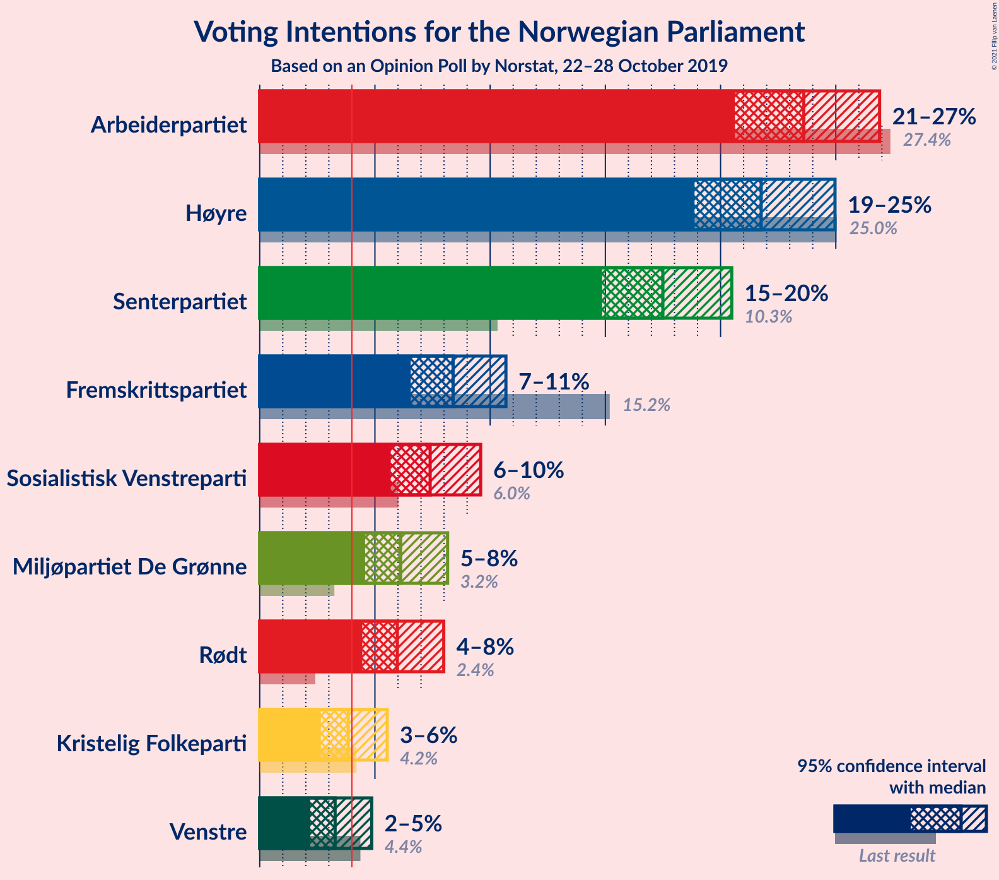

### Confidence Intervals

| Party | Last Result | Poll Result | 80% Confidence Interval | 90% Confidence Interval | 95% Confidence Interval | 99% Confidence Interval |
|:-----:|:-----------:|:-----------:|:-----------------------:|:-----------------------:|:-----------------------:|:-----------------------:|
| Arbeiderpartiet | 27.4% | 23.6% | 21.6–25.8% |21.1–26.4% |20.6–26.9% |19.7–28.0% |
| Høyre | 25.0% | 21.8% | 19.9–23.9% |19.3–24.4% |18.9–25.0% |18.0–26.0% |
| Senterpartiet | 10.3% | 17.5% | 15.8–19.4% |15.3–20.0% |14.9–20.5% |14.1–21.5% |
| Fremskrittspartiet | 15.2% | 8.4% | 7.2–9.9% |6.8–10.3% |6.6–10.7% |6.0–11.4% |
| Sosialistisk Venstreparti | 6.0% | 7.4% | 6.3–8.8% |5.9–9.2% |5.7–9.6% |5.2–10.3% |
| Miljøpartiet De Grønne | 3.2% | 6.1% | 5.1–7.4% |4.8–7.8% |4.6–8.2% |4.1–8.8% |
| Rødt | 2.4% | 6.0% | 5.0–7.3% |4.7–7.7% |4.5–8.0% |4.0–8.7% |
| Kristelig Folkeparti | 4.2% | 3.8% | 3.0–4.9% |2.8–5.3% |2.7–5.5% |2.3–6.1% |
| Venstre | 4.4% | 3.3% | 2.6–4.3% |2.3–4.6% |2.2–4.9% |1.9–5.4% |

*Note:* The poll result column reflects the actual value used in the calculations. Published results may vary slightly, and in addition be rounded to fewer digits.

## Seats

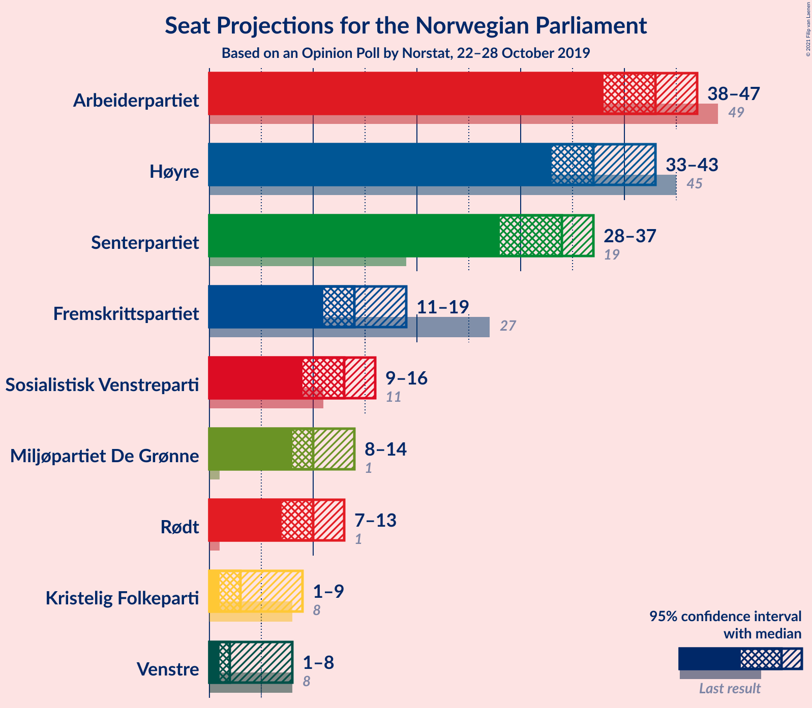

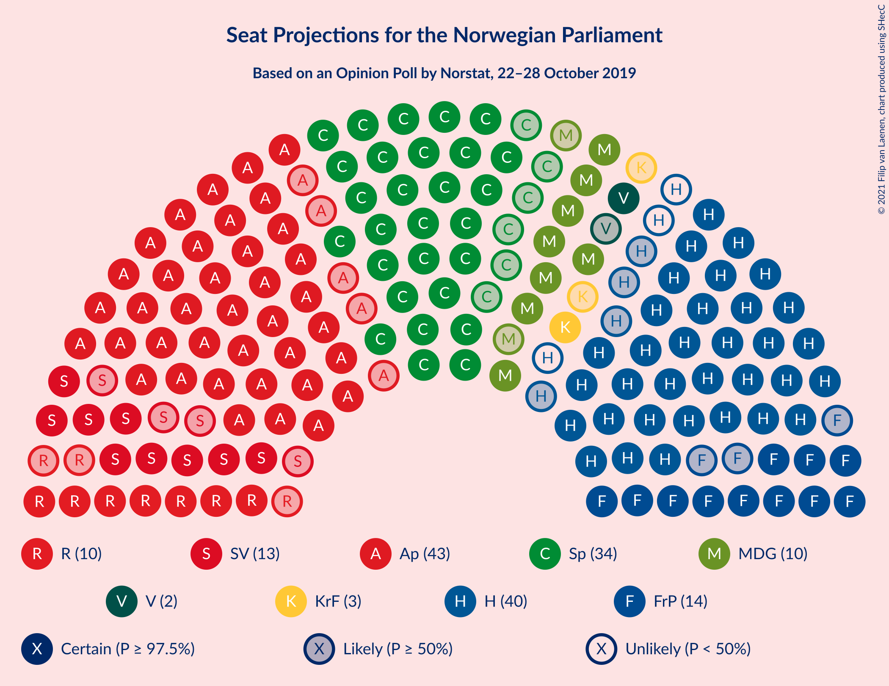

### Confidence Intervals

| Party | Last Result | Median | 80% Confidence Interval | 90% Confidence Interval | 95% Confidence Interval | 99% Confidence Interval |
|:-----:|:-----------:|:------:|:-----------------------:|:-----------------------:|:-----------------------:|:-----------------------:|
| <a href="#arbeiderpartiet">Arbeiderpartiet</a> | 49 | 43 | 40–46 |39–47 |38–47 |36–51 |
| <a href="#høyre">Høyre</a> | 45 | 37 | 34–41 |34–42 |33–43 |31–45 |
| <a href="#senterpartiet">Senterpartiet</a> | 19 | 34 | 30–36 |29–37 |28–37 |25–39 |
| <a href="#fremskrittspartiet">Fremskrittspartiet</a> | 27 | 14 | 12–18 |11–18 |11–19 |10–20 |
| <a href="#sosialistisk-venstreparti">Sosialistisk Venstreparti</a> | 11 | 13 | 10–15 |10–16 |9–16 |8–18 |
| <a href="#miljøpartiet-de-grønne">Miljøpartiet De Grønne</a> | 1 | 10 | 8–12 |8–13 |8–14 |3–15 |
| <a href="#rødt">Rødt</a> | 1 | 10 | 8–12 |8–13 |7–13 |6–15 |
| <a href="#kristelig-folkeparti">Kristelig Folkeparti</a> | 8 | 3 | 1–8 |1–8 |1–9 |1–10 |
| <a href="#venstre">Venstre</a> | 8 | 2 | 2–7 |2–8 |1–8 |0–9 |

### Arbeiderpartiet

*For a full overview of the results for this party, see the [Arbeiderpartiet](party-arbeiderpartiet.html) page.*

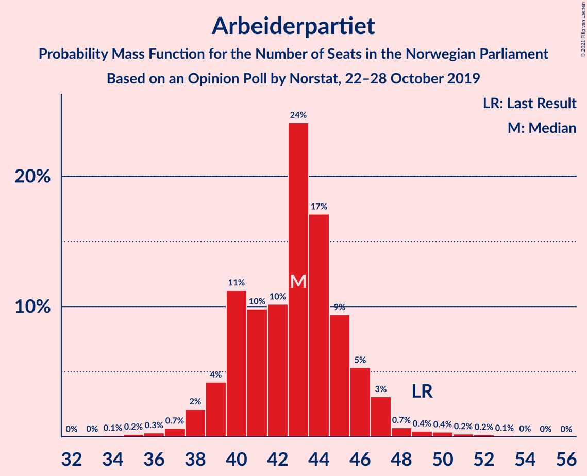

| Number of Seats | Probability | Accumulated | Special Marks |
|:---------------:|:-----------:|:-----------:|:-------------:|
| 33 | 0% | 100% |  |
| 34 | 0.1% | 99.9% |  |
| 35 | 0.2% | 99.8% |  |
| 36 | 0.3% | 99.7% |  |
| 37 | 0.7% | 99.3% |  |
| 38 | 2% | 98.7% |  |
| 39 | 4% | 97% |  |
| 40 | 11% | 92% |  |
| 41 | 10% | 81% |  |
| 42 | 10% | 71% |  |
| 43 | 24% | 61% | Median |
| 44 | 17% | 37% |  |
| 45 | 9% | 20% |  |
| 46 | 5% | 10% |  |
| 47 | 3% | 5% |  |
| 48 | 0.7% | 2% |  |
| 49 | 0.4% | 1.4% | Last Result |
| 50 | 0.4% | 0.9% |  |
| 51 | 0.2% | 0.6% |  |
| 52 | 0.2% | 0.3% |  |
| 53 | 0.1% | 0.2% |  |
| 54 | 0% | 0.1% |  |
| 55 | 0% | 0% |  |

### Høyre

*For a full overview of the results for this party, see the [Høyre](party-høyre.html) page.*

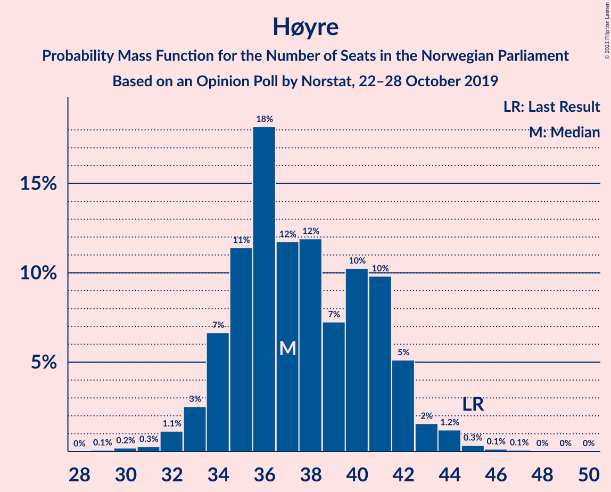

| Number of Seats | Probability | Accumulated | Special Marks |
|:---------------:|:-----------:|:-----------:|:-------------:|
| 29 | 0.1% | 100% |  |
| 30 | 0.2% | 99.9% |  |
| 31 | 0.3% | 99.7% |  |
| 32 | 1.1% | 99.4% |  |
| 33 | 3% | 98% |  |
| 34 | 7% | 96% |  |
| 35 | 11% | 89% |  |
| 36 | 18% | 78% |  |
| 37 | 12% | 60% | Median |
| 38 | 12% | 48% |  |
| 39 | 7% | 36% |  |
| 40 | 10% | 29% |  |
| 41 | 10% | 18% |  |
| 42 | 5% | 9% |  |
| 43 | 2% | 3% |  |
| 44 | 1.2% | 2% |  |
| 45 | 0.3% | 0.7% | Last Result |
| 46 | 0.1% | 0.3% |  |
| 47 | 0.1% | 0.2% |  |
| 48 | 0% | 0.1% |  |
| 49 | 0% | 0.1% |  |
| 50 | 0% | 0% |  |

### Senterpartiet

*For a full overview of the results for this party, see the [Senterpartiet](party-senterpartiet.html) page.*

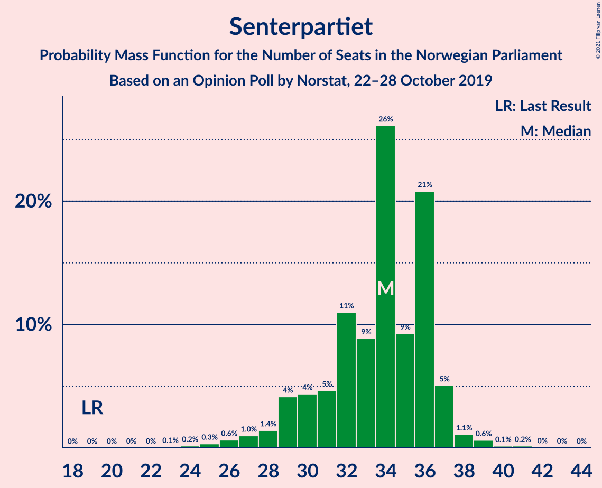

| Number of Seats | Probability | Accumulated | Special Marks |
|:---------------:|:-----------:|:-----------:|:-------------:|
| 19 | 0% | 100% | Last Result |
| 20 | 0% | 100% |  |
| 21 | 0% | 100% |  |
| 22 | 0% | 100% |  |
| 23 | 0.1% | 100% |  |
| 24 | 0.2% | 99.9% |  |
| 25 | 0.3% | 99.7% |  |
| 26 | 0.6% | 99.4% |  |
| 27 | 1.0% | 98.8% |  |
| 28 | 1.4% | 98% |  |
| 29 | 4% | 96% |  |
| 30 | 4% | 92% |  |
| 31 | 5% | 88% |  |
| 32 | 11% | 83% |  |
| 33 | 9% | 72% |  |
| 34 | 26% | 63% | Median |
| 35 | 9% | 37% |  |
| 36 | 21% | 28% |  |
| 37 | 5% | 7% |  |
| 38 | 1.1% | 2% |  |
| 39 | 0.6% | 1.0% |  |
| 40 | 0.1% | 0.4% |  |
| 41 | 0.2% | 0.2% |  |
| 42 | 0% | 0.1% |  |
| 43 | 0% | 0% |  |

### Fremskrittspartiet

*For a full overview of the results for this party, see the [Fremskrittspartiet](party-fremskrittspartiet.html) page.*

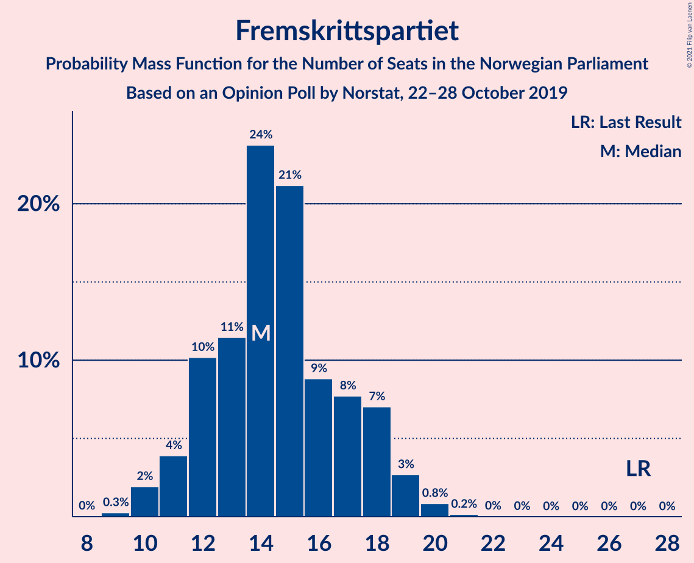

| Number of Seats | Probability | Accumulated | Special Marks |
|:---------------:|:-----------:|:-----------:|:-------------:|
| 9 | 0.3% | 100% |  |
| 10 | 2% | 99.7% |  |
| 11 | 4% | 98% |  |
| 12 | 10% | 94% |  |
| 13 | 11% | 84% |  |
| 14 | 24% | 72% | Median |
| 15 | 21% | 48% |  |
| 16 | 9% | 27% |  |
| 17 | 8% | 18% |  |
| 18 | 7% | 11% |  |
| 19 | 3% | 4% |  |
| 20 | 0.8% | 1.1% |  |
| 21 | 0.2% | 0.2% |  |
| 22 | 0% | 0.1% |  |
| 23 | 0% | 0% |  |
| 24 | 0% | 0% |  |
| 25 | 0% | 0% |  |
| 26 | 0% | 0% |  |
| 27 | 0% | 0% | Last Result |

### Sosialistisk Venstreparti

*For a full overview of the results for this party, see the [Sosialistisk Venstreparti](party-sosialistiskvenstreparti.html) page.*

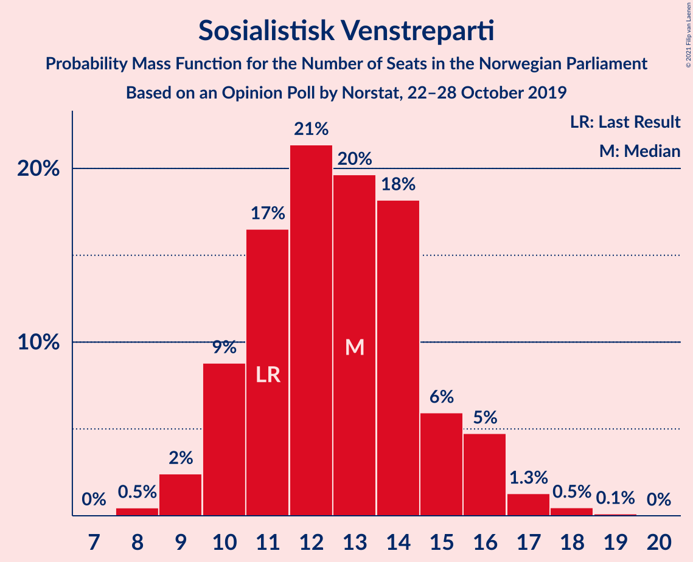

| Number of Seats | Probability | Accumulated | Special Marks |
|:---------------:|:-----------:|:-----------:|:-------------:|
| 8 | 0.5% | 100% |  |
| 9 | 2% | 99.5% |  |
| 10 | 9% | 97% |  |
| 11 | 17% | 88% | Last Result |
| 12 | 21% | 72% |  |
| 13 | 20% | 50% | Median |
| 14 | 18% | 31% |  |
| 15 | 6% | 13% |  |
| 16 | 5% | 7% |  |
| 17 | 1.3% | 2% |  |
| 18 | 0.5% | 0.6% |  |
| 19 | 0.1% | 0.1% |  |
| 20 | 0% | 0% |  |

### Miljøpartiet De Grønne

*For a full overview of the results for this party, see the [Miljøpartiet De Grønne](party-miljøpartietdegrønne.html) page.*

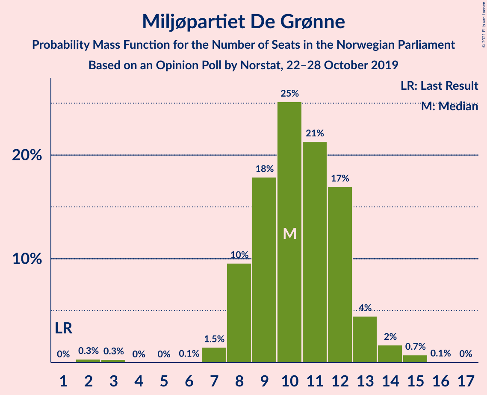

| Number of Seats | Probability | Accumulated | Special Marks |
|:---------------:|:-----------:|:-----------:|:-------------:|
| 1 | 0% | 100% | Last Result |
| 2 | 0.3% | 100% |  |
| 3 | 0.3% | 99.7% |  |
| 4 | 0% | 99.4% |  |
| 5 | 0% | 99.4% |  |
| 6 | 0.1% | 99.4% |  |
| 7 | 1.5% | 99.3% |  |
| 8 | 10% | 98% |  |
| 9 | 18% | 88% |  |
| 10 | 25% | 70% | Median |
| 11 | 21% | 45% |  |
| 12 | 17% | 24% |  |
| 13 | 4% | 7% |  |
| 14 | 2% | 3% |  |
| 15 | 0.7% | 0.9% |  |
| 16 | 0.1% | 0.1% |  |
| 17 | 0% | 0% |  |

### Rødt

*For a full overview of the results for this party, see the [Rødt](party-rødt.html) page.*

| Number of Seats | Probability | Accumulated | Special Marks |
|:---------------:|:-----------:|:-----------:|:-------------:|
| 1 | 0% | 100% | Last Result |
| 2 | 0.3% | 100% |  |
| 3 | 0% | 99.7% |  |
| 4 | 0% | 99.7% |  |
| 5 | 0% | 99.7% |  |
| 6 | 0.3% | 99.7% |  |
| 7 | 2% | 99.4% |  |
| 8 | 9% | 97% |  |
| 9 | 20% | 88% |  |
| 10 | 23% | 68% | Median |
| 11 | 20% | 45% |  |
| 12 | 17% | 25% |  |
| 13 | 5% | 8% |  |
| 14 | 2% | 2% |  |
| 15 | 0.5% | 0.6% |  |
| 16 | 0.1% | 0.1% |  |
| 17 | 0% | 0% |  |

### Kristelig Folkeparti

*For a full overview of the results for this party, see the [Kristelig Folkeparti](party-kristeligfolkeparti.html) page.*

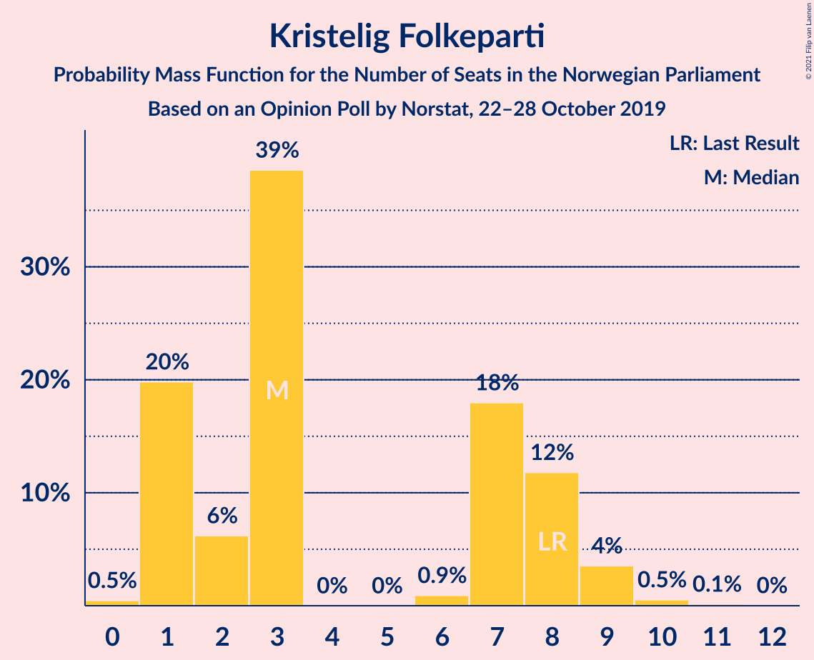

| Number of Seats | Probability | Accumulated | Special Marks |
|:---------------:|:-----------:|:-----------:|:-------------:|
| 0 | 0.5% | 100% |  |
| 1 | 20% | 99.5% |  |
| 2 | 6% | 80% |  |
| 3 | 39% | 74% | Median |
| 4 | 0% | 35% |  |
| 5 | 0% | 35% |  |
| 6 | 0.9% | 35% |  |
| 7 | 18% | 34% |  |
| 8 | 12% | 16% | Last Result |
| 9 | 4% | 4% |  |
| 10 | 0.5% | 0.7% |  |
| 11 | 0.1% | 0.2% |  |
| 12 | 0% | 0% |  |

### Venstre

*For a full overview of the results for this party, see the [Venstre](party-venstre.html) page.*

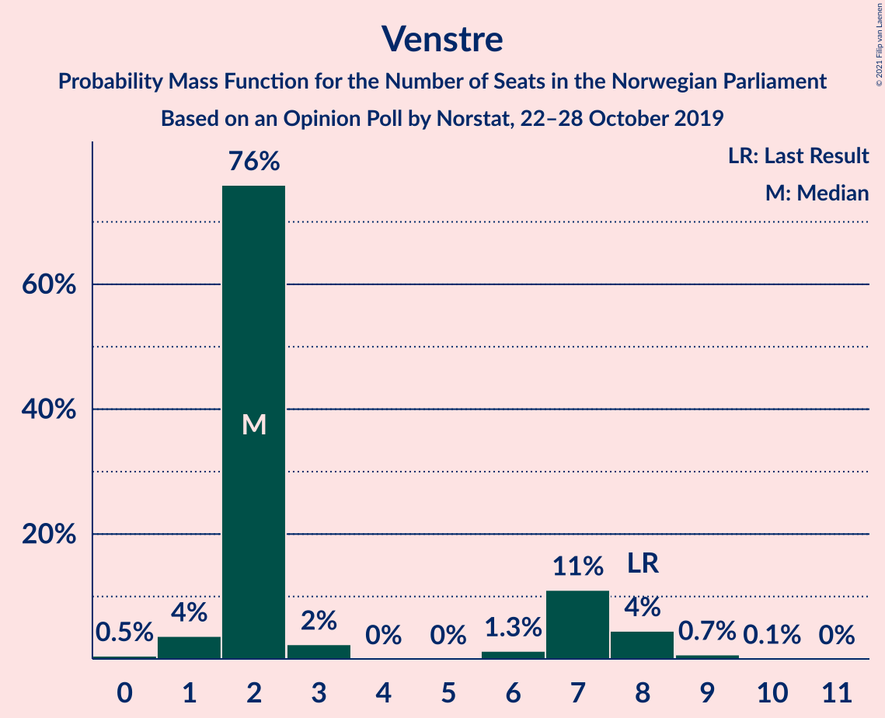

| Number of Seats | Probability | Accumulated | Special Marks |
|:---------------:|:-----------:|:-----------:|:-------------:|
| 0 | 0.5% | 100% |  |
| 1 | 4% | 99.5% |  |
| 2 | 76% | 96% | Median |
| 3 | 2% | 20% |  |
| 4 | 0% | 18% |  |
| 5 | 0% | 18% |  |
| 6 | 1.3% | 18% |  |
| 7 | 11% | 16% |  |
| 8 | 4% | 5% | Last Result |
| 9 | 0.7% | 0.8% |  |
| 10 | 0.1% | 0.1% |  |
| 11 | 0% | 0% |  |

## Coalitions

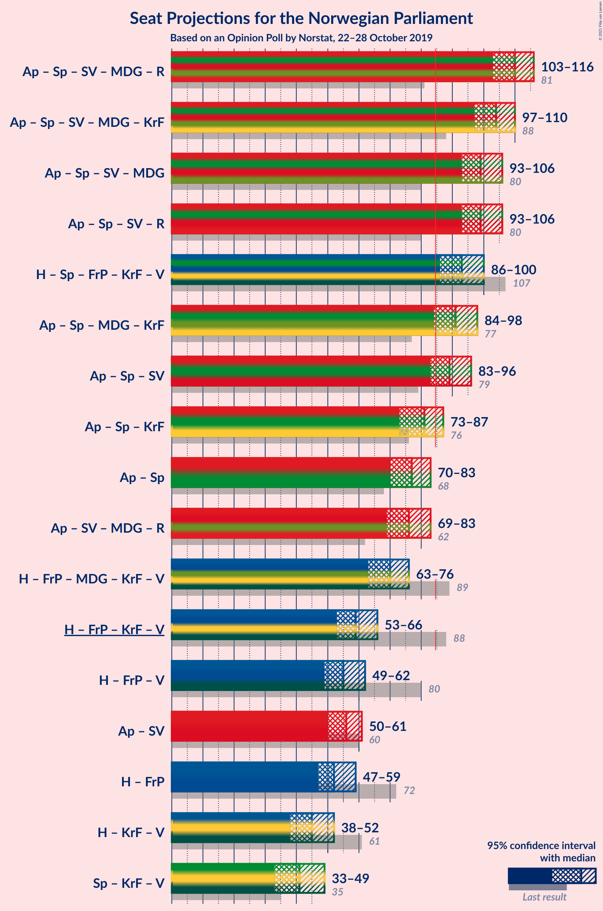

### Confidence Intervals

| Coalition | Last Result | Median | Majority? | 80% Confidence Interval | 90% Confidence Interval | 95% Confidence Interval | 99% Confidence Interval |
|:---------:|:-----------:|:------:|:---------:|:-----------------------:|:-----------------------:|:-----------------------:|:-----------------------:|
| Arbeiderpartiet – Senterpartiet – Sosialistisk Venstreparti – Miljøpartiet De Grønne – Rødt | 81 | 110 | 100% | 105–114 | 104–115 | 103–116 | 100–118 |
| Arbeiderpartiet – Senterpartiet – Sosialistisk Venstreparti – Miljøpartiet De Grønne – Kristelig Folkeparti | 88 | 104 | 100% | 99–109 | 97–109 | 97–110 | 95–112 |
| Arbeiderpartiet – Senterpartiet – Sosialistisk Venstreparti – Miljøpartiet De Grønne | 80 | 99 | 100% | 95–104 | 94–105 | 93–106 | 90–107 |
| Arbeiderpartiet – Senterpartiet – Sosialistisk Venstreparti – Rødt | 80 | 99 | 100% | 95–104 | 94–105 | 93–106 | 90–108 |
| Høyre – Senterpartiet – Fremskrittspartiet – Kristelig Folkeparti – Venstre | 107 | 93 | 99.2% | 89–97 | 87–99 | 86–100 | 84–102 |
| Arbeiderpartiet – Senterpartiet – Miljøpartiet De Grønne – Kristelig Folkeparti | 77 | 91 | 94% | 86–96 | 84–97 | 84–98 | 81–100 |
| Arbeiderpartiet – Senterpartiet – Sosialistisk Venstreparti | 79 | 89 | 94% | 85–93 | 84–94 | 83–96 | 80–97 |
| Arbeiderpartiet – Senterpartiet – Kristelig Folkeparti | 76 | 81 | 17% | 75–86 | 74–87 | 73–87 | 71–90 |
| Arbeiderpartiet – Senterpartiet | 68 | 77 | 0.3% | 72–80 | 71–81 | 70–83 | 67–84 |
| Arbeiderpartiet – Sosialistisk Venstreparti – Miljøpartiet De Grønne – Rødt | 62 | 76 | 0.8% | 72–80 | 70–82 | 69–83 | 67–85 |
| Høyre – Fremskrittspartiet – Miljøpartiet De Grønne – Kristelig Folkeparti – Venstre | 89 | 70 | 0% | 65–74 | 64–75 | 63–76 | 61–79 |
| Høyre – Fremskrittspartiet – Kristelig Folkeparti – Venstre | 88 | 59 | 0% | 55–64 | 54–65 | 53–66 | 51–69 |
| Høyre – Fremskrittspartiet – Venstre | 80 | 55 | 0% | 51–60 | 50–61 | 49–62 | 47–64 |
| Arbeiderpartiet – Sosialistisk Venstreparti | 60 | 56 | 0% | 52–59 | 51–60 | 50–61 | 48–64 |
| Høyre – Fremskrittspartiet | 72 | 52 | 0% | 48–56 | 47–58 | 47–59 | 45–61 |
| Høyre – Kristelig Folkeparti – Venstre | 61 | 45 | 0% | 40–50 | 39–51 | 38–52 | 36–55 |
| Senterpartiet – Kristelig Folkeparti – Venstre | 35 | 41 | 0% | 35–46 | 34–47 | 33–49 | 31–51 |

### Arbeiderpartiet – Senterpartiet – Sosialistisk Venstreparti – Miljøpartiet De Grønne – Rødt

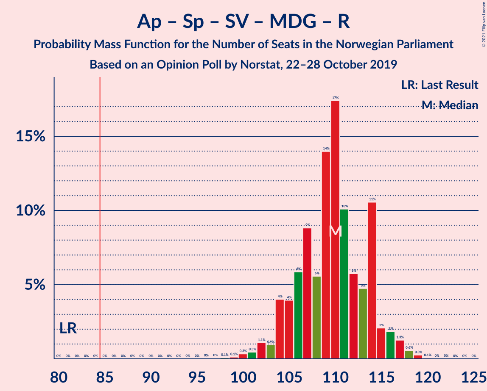

| Number of Seats | Probability | Accumulated | Special Marks |
|:---------------:|:-----------:|:-----------:|:-------------:|
| 81 | 0% | 100% | Last Result |
| 82 | 0% | 100% |  |
| 83 | 0% | 100% |  |
| 84 | 0% | 100% |  |
| 85 | 0% | 100% | Majority |
| 86 | 0% | 100% |  |
| 87 | 0% | 100% |  |
| 88 | 0% | 100% |  |
| 89 | 0% | 100% |  |
| 90 | 0% | 100% |  |
| 91 | 0% | 100% |  |
| 92 | 0% | 100% |  |
| 93 | 0% | 100% |  |
| 94 | 0% | 100% |  |
| 95 | 0% | 100% |  |
| 96 | 0% | 100% |  |
| 97 | 0% | 99.9% |  |
| 98 | 0.1% | 99.9% |  |
| 99 | 0.1% | 99.8% |  |
| 100 | 0.3% | 99.7% |  |
| 101 | 0.5% | 99.4% |  |
| 102 | 1.1% | 98.9% |  |
| 103 | 0.9% | 98% |  |
| 104 | 4% | 97% |  |
| 105 | 4% | 93% |  |
| 106 | 6% | 89% |  |
| 107 | 9% | 83% |  |
| 108 | 6% | 74% |  |
| 109 | 14% | 69% |  |
| 110 | 17% | 55% | Median |
| 111 | 10% | 37% |  |
| 112 | 6% | 27% |  |
| 113 | 5% | 21% |  |
| 114 | 11% | 17% |  |
| 115 | 2% | 6% |  |
| 116 | 2% | 4% |  |
| 117 | 1.3% | 2% |  |
| 118 | 0.6% | 0.9% |  |
| 119 | 0.3% | 0.4% |  |
| 120 | 0.1% | 0.1% |  |
| 121 | 0% | 0% |  |

### Arbeiderpartiet – Senterpartiet – Sosialistisk Venstreparti – Miljøpartiet De Grønne – Kristelig Folkeparti

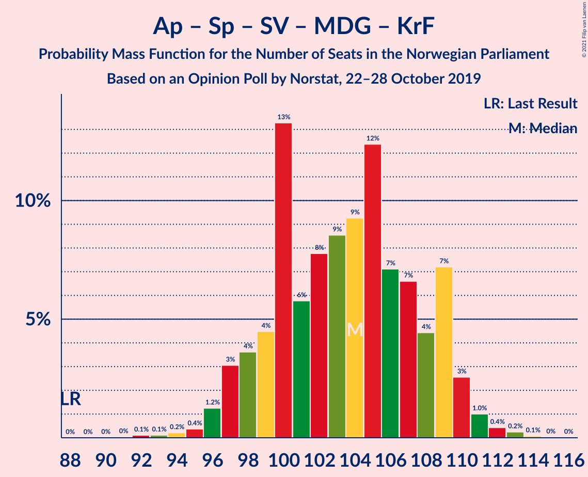

| Number of Seats | Probability | Accumulated | Special Marks |
|:---------------:|:-----------:|:-----------:|:-------------:|
| 88 | 0% | 100% | Last Result |
| 89 | 0% | 100% |  |
| 90 | 0% | 100% |  |
| 91 | 0% | 100% |  |
| 92 | 0.1% | 99.9% |  |
| 93 | 0.1% | 99.8% |  |
| 94 | 0.2% | 99.7% |  |
| 95 | 0.4% | 99.5% |  |
| 96 | 1.2% | 99.1% |  |
| 97 | 3% | 98% |  |
| 98 | 4% | 95% |  |
| 99 | 4% | 91% |  |
| 100 | 13% | 87% |  |
| 101 | 6% | 73% |  |
| 102 | 8% | 68% |  |
| 103 | 9% | 60% | Median |
| 104 | 9% | 51% |  |
| 105 | 12% | 42% |  |
| 106 | 7% | 30% |  |
| 107 | 7% | 23% |  |
| 108 | 4% | 16% |  |
| 109 | 7% | 12% |  |
| 110 | 3% | 4% |  |
| 111 | 1.0% | 2% |  |
| 112 | 0.4% | 0.8% |  |
| 113 | 0.2% | 0.4% |  |
| 114 | 0.1% | 0.1% |  |
| 115 | 0% | 0.1% |  |
| 116 | 0% | 0% |  |

### Arbeiderpartiet – Senterpartiet – Sosialistisk Venstreparti – Miljøpartiet De Grønne

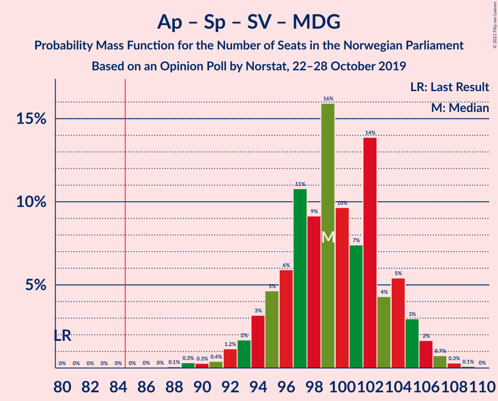

| Number of Seats | Probability | Accumulated | Special Marks |
|:---------------:|:-----------:|:-----------:|:-------------:|
| 80 | 0% | 100% | Last Result |
| 81 | 0% | 100% |  |
| 82 | 0% | 100% |  |
| 83 | 0% | 100% |  |
| 84 | 0% | 100% |  |
| 85 | 0% | 100% | Majority |
| 86 | 0% | 100% |  |
| 87 | 0% | 100% |  |
| 88 | 0.1% | 99.9% |  |
| 89 | 0.3% | 99.8% |  |
| 90 | 0.3% | 99.5% |  |
| 91 | 0.4% | 99.2% |  |
| 92 | 1.2% | 98.9% |  |
| 93 | 2% | 98% |  |
| 94 | 3% | 96% |  |
| 95 | 5% | 93% |  |
| 96 | 6% | 88% |  |
| 97 | 11% | 82% |  |
| 98 | 9% | 72% |  |
| 99 | 16% | 62% |  |
| 100 | 10% | 46% | Median |
| 101 | 7% | 37% |  |
| 102 | 14% | 29% |  |
| 103 | 4% | 16% |  |
| 104 | 5% | 11% |  |
| 105 | 3% | 6% |  |
| 106 | 2% | 3% |  |
| 107 | 0.7% | 1.2% |  |
| 108 | 0.3% | 0.4% |  |
| 109 | 0.1% | 0.1% |  |
| 110 | 0% | 0% |  |

### Arbeiderpartiet – Senterpartiet – Sosialistisk Venstreparti – Rødt

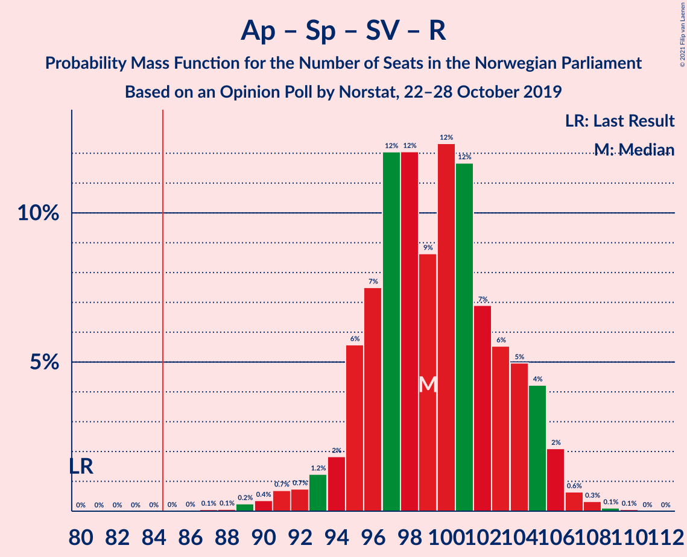

| Number of Seats | Probability | Accumulated | Special Marks |
|:---------------:|:-----------:|:-----------:|:-------------:|
| 80 | 0% | 100% | Last Result |
| 81 | 0% | 100% |  |
| 82 | 0% | 100% |  |
| 83 | 0% | 100% |  |
| 84 | 0% | 100% |  |
| 85 | 0% | 100% | Majority |
| 86 | 0% | 100% |  |
| 87 | 0.1% | 99.9% |  |
| 88 | 0.1% | 99.9% |  |
| 89 | 0.2% | 99.8% |  |
| 90 | 0.4% | 99.6% |  |
| 91 | 0.7% | 99.2% |  |
| 92 | 0.7% | 98.5% |  |
| 93 | 1.2% | 98% |  |
| 94 | 2% | 97% |  |
| 95 | 6% | 95% |  |
| 96 | 7% | 89% |  |
| 97 | 12% | 82% |  |
| 98 | 12% | 70% |  |
| 99 | 9% | 58% |  |
| 100 | 12% | 49% | Median |
| 101 | 12% | 37% |  |
| 102 | 7% | 25% |  |
| 103 | 6% | 18% |  |
| 104 | 5% | 12% |  |
| 105 | 4% | 7% |  |
| 106 | 2% | 3% |  |
| 107 | 0.6% | 1.2% |  |
| 108 | 0.3% | 0.5% |  |
| 109 | 0.1% | 0.2% |  |
| 110 | 0.1% | 0.1% |  |
| 111 | 0% | 0% |  |

### Høyre – Senterpartiet – Fremskrittspartiet – Kristelig Folkeparti – Venstre

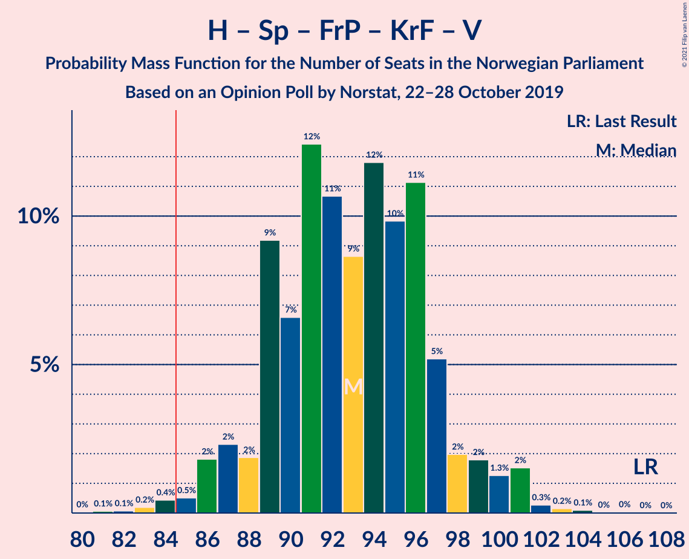

| Number of Seats | Probability | Accumulated | Special Marks |
|:---------------:|:-----------:|:-----------:|:-------------:|
| 80 | 0% | 100% |  |
| 81 | 0.1% | 99.9% |  |
| 82 | 0.1% | 99.9% |  |
| 83 | 0.2% | 99.8% |  |
| 84 | 0.4% | 99.6% |  |
| 85 | 0.5% | 99.2% | Majority |
| 86 | 2% | 98.7% |  |
| 87 | 2% | 97% |  |
| 88 | 2% | 95% |  |
| 89 | 9% | 93% |  |
| 90 | 7% | 83% | Median |
| 91 | 12% | 77% |  |
| 92 | 11% | 64% |  |
| 93 | 9% | 54% |  |
| 94 | 12% | 45% |  |
| 95 | 10% | 33% |  |
| 96 | 11% | 23% |  |
| 97 | 5% | 12% |  |
| 98 | 2% | 7% |  |
| 99 | 2% | 5% |  |
| 100 | 1.3% | 3% |  |
| 101 | 2% | 2% |  |
| 102 | 0.3% | 0.6% |  |
| 103 | 0.2% | 0.3% |  |
| 104 | 0.1% | 0.2% |  |
| 105 | 0% | 0.1% |  |
| 106 | 0% | 0% |  |
| 107 | 0% | 0% | Last Result |

### Arbeiderpartiet – Senterpartiet – Miljøpartiet De Grønne – Kristelig Folkeparti

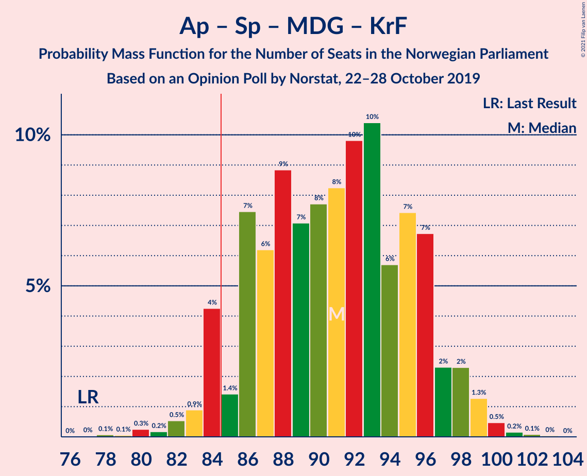

| Number of Seats | Probability | Accumulated | Special Marks |
|:---------------:|:-----------:|:-----------:|:-------------:|
| 77 | 0% | 100% | Last Result |
| 78 | 0.1% | 100% |  |
| 79 | 0.1% | 99.9% |  |
| 80 | 0.3% | 99.8% |  |
| 81 | 0.2% | 99.6% |  |
| 82 | 0.5% | 99.4% |  |
| 83 | 0.9% | 98.9% |  |
| 84 | 4% | 98% |  |
| 85 | 1.4% | 94% | Majority |
| 86 | 7% | 92% |  |
| 87 | 6% | 85% |  |
| 88 | 9% | 79% |  |
| 89 | 7% | 70% |  |
| 90 | 8% | 63% | Median |
| 91 | 8% | 55% |  |
| 92 | 10% | 47% |  |
| 93 | 10% | 37% |  |
| 94 | 6% | 27% |  |
| 95 | 7% | 21% |  |
| 96 | 7% | 13% |  |
| 97 | 2% | 7% |  |
| 98 | 2% | 4% |  |
| 99 | 1.3% | 2% |  |
| 100 | 0.5% | 0.8% |  |
| 101 | 0.2% | 0.3% |  |
| 102 | 0.1% | 0.1% |  |
| 103 | 0% | 0.1% |  |
| 104 | 0% | 0% |  |

### Arbeiderpartiet – Senterpartiet – Sosialistisk Venstreparti

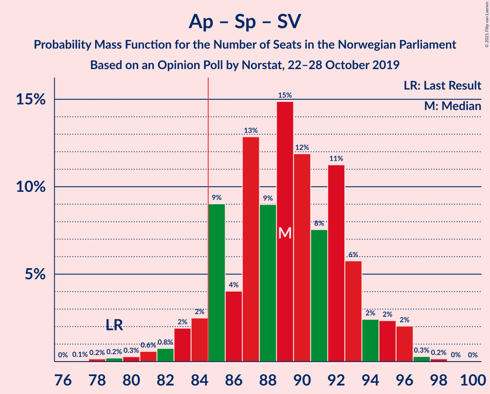

| Number of Seats | Probability | Accumulated | Special Marks |
|:---------------:|:-----------:|:-----------:|:-------------:|
| 77 | 0.1% | 100% |  |
| 78 | 0.2% | 99.9% |  |
| 79 | 0.2% | 99.8% | Last Result |
| 80 | 0.3% | 99.6% |  |
| 81 | 0.6% | 99.3% |  |
| 82 | 0.8% | 98.7% |  |
| 83 | 2% | 98% |  |
| 84 | 2% | 96% |  |
| 85 | 9% | 94% | Majority |
| 86 | 4% | 85% |  |
| 87 | 13% | 80% |  |
| 88 | 9% | 68% |  |
| 89 | 15% | 59% |  |
| 90 | 12% | 44% | Median |
| 91 | 8% | 32% |  |
| 92 | 11% | 24% |  |
| 93 | 6% | 13% |  |
| 94 | 2% | 7% |  |
| 95 | 2% | 5% |  |
| 96 | 2% | 3% |  |
| 97 | 0.3% | 0.5% |  |
| 98 | 0.2% | 0.2% |  |
| 99 | 0% | 0.1% |  |
| 100 | 0% | 0% |  |

### Arbeiderpartiet – Senterpartiet – Kristelig Folkeparti

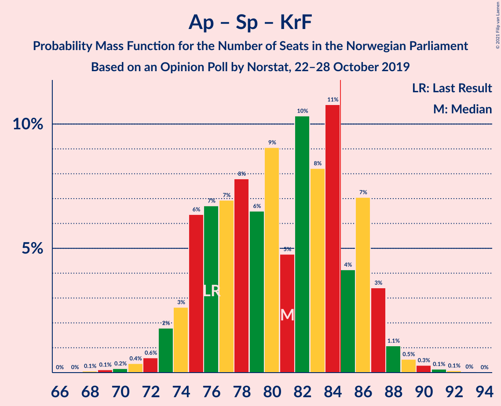

| Number of Seats | Probability | Accumulated | Special Marks |
|:---------------:|:-----------:|:-----------:|:-------------:|
| 68 | 0.1% | 100% |  |
| 69 | 0.1% | 99.9% |  |
| 70 | 0.2% | 99.8% |  |
| 71 | 0.4% | 99.6% |  |
| 72 | 0.6% | 99.3% |  |
| 73 | 2% | 98.7% |  |
| 74 | 3% | 97% |  |
| 75 | 6% | 94% |  |
| 76 | 7% | 88% | Last Result |
| 77 | 7% | 81% |  |
| 78 | 8% | 74% |  |
| 79 | 6% | 66% |  |
| 80 | 9% | 60% | Median |
| 81 | 5% | 51% |  |
| 82 | 10% | 46% |  |
| 83 | 8% | 36% |  |
| 84 | 11% | 28% |  |
| 85 | 4% | 17% | Majority |
| 86 | 7% | 13% |  |
| 87 | 3% | 6% |  |
| 88 | 1.1% | 2% |  |
| 89 | 0.5% | 1.1% |  |
| 90 | 0.3% | 0.6% |  |
| 91 | 0.1% | 0.3% |  |
| 92 | 0.1% | 0.1% |  |
| 93 | 0% | 0.1% |  |
| 94 | 0% | 0% |  |

### Arbeiderpartiet – Senterpartiet

| Number of Seats | Probability | Accumulated | Special Marks |
|:---------------:|:-----------:|:-----------:|:-------------:|
| 64 | 0% | 100% |  |
| 65 | 0.1% | 99.9% |  |
| 66 | 0.1% | 99.8% |  |
| 67 | 0.3% | 99.6% |  |
| 68 | 0.5% | 99.3% | Last Result |
| 69 | 0.6% | 98.8% |  |
| 70 | 2% | 98% |  |
| 71 | 2% | 97% |  |
| 72 | 6% | 95% |  |
| 73 | 5% | 88% |  |
| 74 | 7% | 83% |  |
| 75 | 13% | 76% |  |
| 76 | 12% | 63% |  |
| 77 | 15% | 51% | Median |
| 78 | 9% | 37% |  |
| 79 | 11% | 28% |  |
| 80 | 10% | 17% |  |
| 81 | 3% | 7% |  |
| 82 | 1.3% | 4% |  |
| 83 | 2% | 3% |  |
| 84 | 0.3% | 0.5% |  |
| 85 | 0.2% | 0.3% | Majority |
| 86 | 0% | 0.1% |  |
| 87 | 0% | 0.1% |  |
| 88 | 0% | 0% |  |

### Arbeiderpartiet – Sosialistisk Venstreparti – Miljøpartiet De Grønne – Rødt

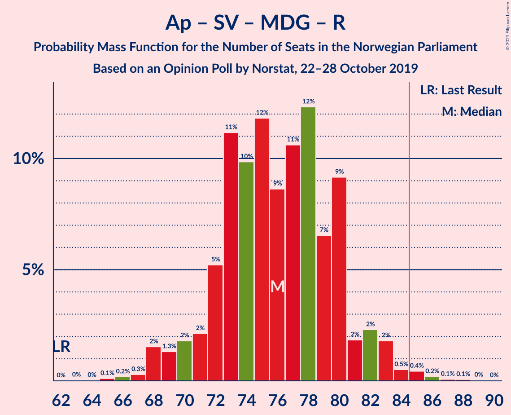

| Number of Seats | Probability | Accumulated | Special Marks |
|:---------------:|:-----------:|:-----------:|:-------------:|
| 62 | 0% | 100% | Last Result |
| 63 | 0% | 100% |  |
| 64 | 0% | 100% |  |
| 65 | 0.1% | 99.9% |  |
| 66 | 0.2% | 99.8% |  |
| 67 | 0.3% | 99.6% |  |
| 68 | 2% | 99.4% |  |
| 69 | 1.3% | 98% |  |
| 70 | 2% | 97% |  |
| 71 | 2% | 95% |  |
| 72 | 5% | 93% |  |
| 73 | 11% | 87% |  |
| 74 | 10% | 76% |  |
| 75 | 12% | 66% |  |
| 76 | 9% | 55% | Median |
| 77 | 11% | 46% |  |
| 78 | 12% | 35% |  |
| 79 | 7% | 23% |  |
| 80 | 9% | 16% |  |
| 81 | 2% | 7% |  |
| 82 | 2% | 5% |  |
| 83 | 2% | 3% |  |
| 84 | 0.5% | 1.3% |  |
| 85 | 0.4% | 0.8% | Majority |
| 86 | 0.2% | 0.4% |  |
| 87 | 0.1% | 0.2% |  |
| 88 | 0.1% | 0.1% |  |
| 89 | 0% | 0.1% |  |
| 90 | 0% | 0% |  |

### Høyre – Fremskrittspartiet – Miljøpartiet De Grønne – Kristelig Folkeparti – Venstre

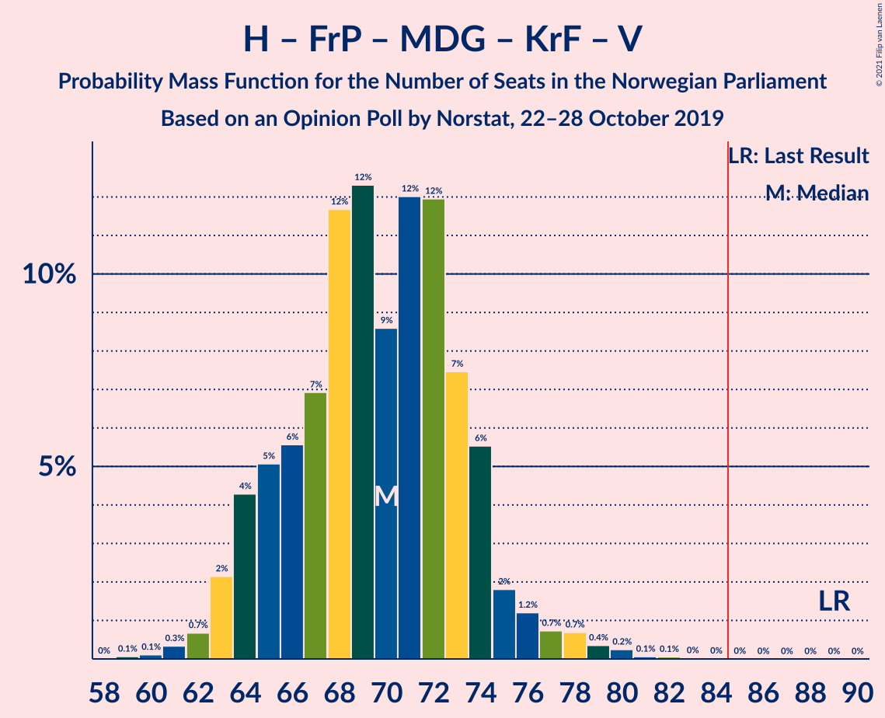

| Number of Seats | Probability | Accumulated | Special Marks |
|:---------------:|:-----------:|:-----------:|:-------------:|
| 59 | 0.1% | 100% |  |
| 60 | 0.1% | 99.9% |  |
| 61 | 0.3% | 99.8% |  |
| 62 | 0.7% | 99.5% |  |
| 63 | 2% | 98.8% |  |
| 64 | 4% | 97% |  |
| 65 | 5% | 92% |  |
| 66 | 6% | 87% | Median |
| 67 | 7% | 82% |  |
| 68 | 12% | 75% |  |
| 69 | 12% | 63% |  |
| 70 | 9% | 51% |  |
| 71 | 12% | 42% |  |
| 72 | 12% | 30% |  |
| 73 | 7% | 18% |  |
| 74 | 6% | 11% |  |
| 75 | 2% | 5% |  |
| 76 | 1.2% | 3% |  |
| 77 | 0.7% | 2% |  |
| 78 | 0.7% | 1.5% |  |
| 79 | 0.4% | 0.8% |  |
| 80 | 0.2% | 0.4% |  |
| 81 | 0.1% | 0.2% |  |
| 82 | 0.1% | 0.1% |  |
| 83 | 0% | 0.1% |  |
| 84 | 0% | 0% |  |
| 85 | 0% | 0% | Majority |
| 86 | 0% | 0% |  |
| 87 | 0% | 0% |  |
| 88 | 0% | 0% |  |
| 89 | 0% | 0% | Last Result |

### Høyre – Fremskrittspartiet – Kristelig Folkeparti – Venstre

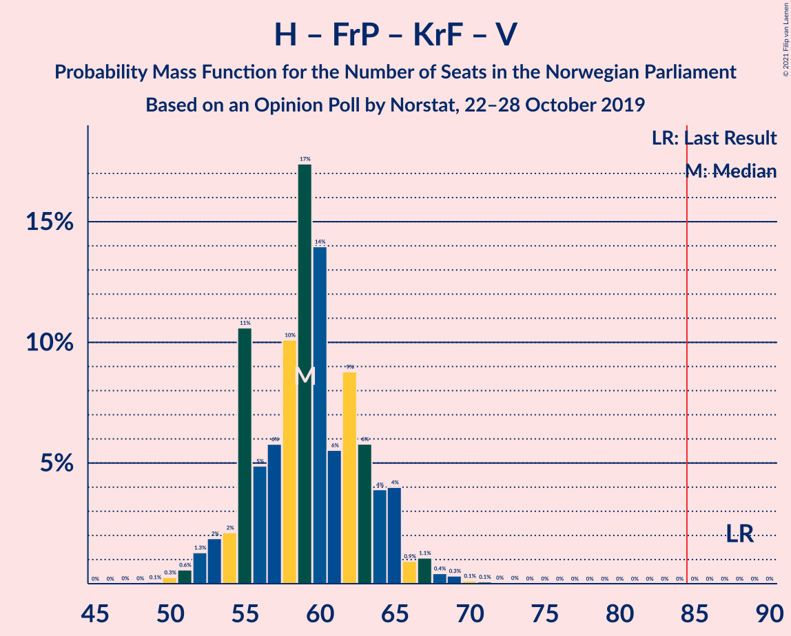

| Number of Seats | Probability | Accumulated | Special Marks |
|:---------------:|:-----------:|:-----------:|:-------------:|
| 49 | 0.1% | 100% |  |
| 50 | 0.3% | 99.9% |  |
| 51 | 0.6% | 99.6% |  |
| 52 | 1.3% | 99.1% |  |
| 53 | 2% | 98% |  |
| 54 | 2% | 96% |  |
| 55 | 11% | 94% |  |
| 56 | 5% | 83% | Median |
| 57 | 6% | 78% |  |
| 58 | 10% | 73% |  |
| 59 | 17% | 62% |  |
| 60 | 14% | 45% |  |
| 61 | 6% | 31% |  |
| 62 | 9% | 26% |  |
| 63 | 6% | 17% |  |
| 64 | 4% | 11% |  |
| 65 | 4% | 7% |  |
| 66 | 0.9% | 3% |  |
| 67 | 1.1% | 2% |  |
| 68 | 0.4% | 1.0% |  |
| 69 | 0.3% | 0.6% |  |
| 70 | 0.1% | 0.3% |  |
| 71 | 0.1% | 0.2% |  |
| 72 | 0% | 0.1% |  |
| 73 | 0% | 0.1% |  |
| 74 | 0% | 0% |  |
| 75 | 0% | 0% |  |
| 76 | 0% | 0% |  |
| 77 | 0% | 0% |  |
| 78 | 0% | 0% |  |
| 79 | 0% | 0% |  |
| 80 | 0% | 0% |  |
| 81 | 0% | 0% |  |
| 82 | 0% | 0% |  |
| 83 | 0% | 0% |  |
| 84 | 0% | 0% |  |
| 85 | 0% | 0% | Majority |
| 86 | 0% | 0% |  |
| 87 | 0% | 0% |  |
| 88 | 0% | 0% | Last Result |

### Høyre – Fremskrittspartiet – Venstre

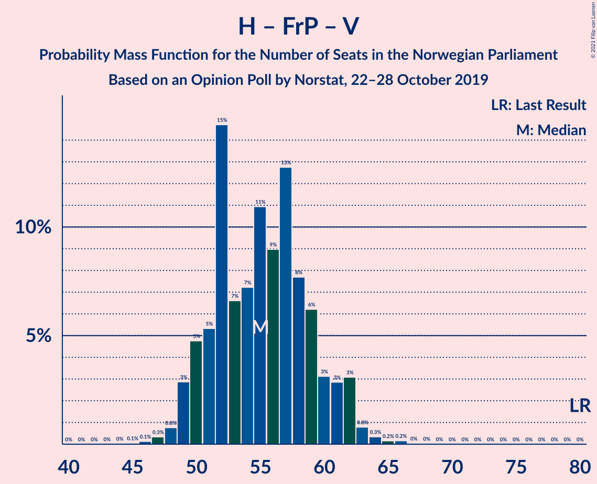

| Number of Seats | Probability | Accumulated | Special Marks |
|:---------------:|:-----------:|:-----------:|:-------------:|
| 45 | 0.1% | 100% |  |
| 46 | 0.1% | 99.9% |  |
| 47 | 0.3% | 99.8% |  |
| 48 | 0.8% | 99.4% |  |
| 49 | 3% | 98.7% |  |
| 50 | 5% | 96% |  |
| 51 | 5% | 91% |  |
| 52 | 15% | 86% |  |
| 53 | 7% | 71% | Median |
| 54 | 7% | 64% |  |
| 55 | 11% | 57% |  |
| 56 | 9% | 46% |  |
| 57 | 13% | 37% |  |
| 58 | 8% | 25% |  |
| 59 | 6% | 17% |  |
| 60 | 3% | 11% |  |
| 61 | 3% | 7% |  |
| 62 | 3% | 5% |  |
| 63 | 0.8% | 2% |  |
| 64 | 0.3% | 0.7% |  |
| 65 | 0.2% | 0.4% |  |
| 66 | 0.2% | 0.2% |  |
| 67 | 0% | 0.1% |  |
| 68 | 0% | 0% |  |
| 69 | 0% | 0% |  |
| 70 | 0% | 0% |  |
| 71 | 0% | 0% |  |
| 72 | 0% | 0% |  |
| 73 | 0% | 0% |  |
| 74 | 0% | 0% |  |
| 75 | 0% | 0% |  |
| 76 | 0% | 0% |  |
| 77 | 0% | 0% |  |
| 78 | 0% | 0% |  |
| 79 | 0% | 0% |  |
| 80 | 0% | 0% | Last Result |

### Arbeiderpartiet – Sosialistisk Venstreparti

| Number of Seats | Probability | Accumulated | Special Marks |
|:---------------:|:-----------:|:-----------:|:-------------:|
| 45 | 0% | 100% |  |
| 46 | 0.1% | 99.9% |  |
| 47 | 0.2% | 99.9% |  |
| 48 | 0.4% | 99.6% |  |
| 49 | 0.8% | 99.2% |  |
| 50 | 2% | 98% |  |
| 51 | 6% | 96% |  |
| 52 | 6% | 90% |  |
| 53 | 9% | 85% |  |
| 54 | 12% | 75% |  |
| 55 | 13% | 63% |  |
| 56 | 19% | 50% | Median |
| 57 | 10% | 31% |  |
| 58 | 9% | 21% |  |
| 59 | 5% | 12% |  |
| 60 | 3% | 8% | Last Result |
| 61 | 3% | 4% |  |
| 62 | 0.8% | 2% |  |
| 63 | 0.3% | 0.9% |  |
| 64 | 0.3% | 0.6% |  |
| 65 | 0.1% | 0.3% |  |
| 66 | 0.1% | 0.2% |  |
| 67 | 0% | 0.1% |  |
| 68 | 0% | 0% |  |

### Høyre – Fremskrittspartiet

| Number of Seats | Probability | Accumulated | Special Marks |
|:---------------:|:-----------:|:-----------:|:-------------:|
| 42 | 0.1% | 100% |  |
| 43 | 0.1% | 99.9% |  |
| 44 | 0.2% | 99.8% |  |
| 45 | 0.6% | 99.6% |  |
| 46 | 1.4% | 99.0% |  |
| 47 | 4% | 98% |  |
| 48 | 6% | 93% |  |
| 49 | 7% | 87% |  |
| 50 | 18% | 80% |  |
| 51 | 6% | 63% | Median |
| 52 | 10% | 57% |  |
| 53 | 12% | 47% |  |
| 54 | 7% | 35% |  |
| 55 | 12% | 27% |  |
| 56 | 7% | 15% |  |
| 57 | 3% | 9% |  |
| 58 | 2% | 6% |  |
| 59 | 2% | 4% |  |
| 60 | 1.4% | 2% |  |
| 61 | 0.5% | 0.9% |  |
| 62 | 0.2% | 0.3% |  |
| 63 | 0.1% | 0.1% |  |
| 64 | 0% | 0.1% |  |
| 65 | 0% | 0% |  |
| 66 | 0% | 0% |  |
| 67 | 0% | 0% |  |
| 68 | 0% | 0% |  |
| 69 | 0% | 0% |  |
| 70 | 0% | 0% |  |
| 71 | 0% | 0% |  |
| 72 | 0% | 0% | Last Result |

### Høyre – Kristelig Folkeparti – Venstre

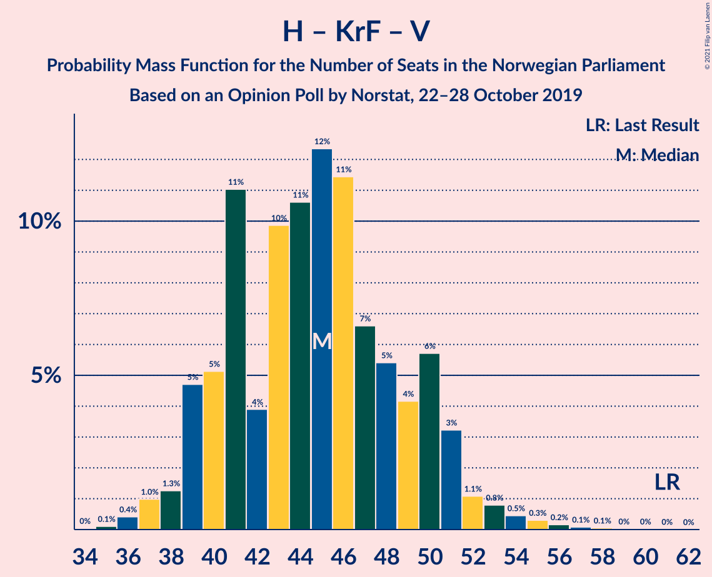

| Number of Seats | Probability | Accumulated | Special Marks |
|:---------------:|:-----------:|:-----------:|:-------------:|
| 35 | 0.1% | 100% |  |
| 36 | 0.4% | 99.8% |  |
| 37 | 1.0% | 99.4% |  |
| 38 | 1.3% | 98% |  |
| 39 | 5% | 97% |  |
| 40 | 5% | 92% |  |
| 41 | 11% | 87% |  |
| 42 | 4% | 76% | Median |
| 43 | 10% | 72% |  |
| 44 | 11% | 63% |  |
| 45 | 12% | 52% |  |
| 46 | 11% | 40% |  |
| 47 | 7% | 28% |  |
| 48 | 5% | 22% |  |
| 49 | 4% | 16% |  |
| 50 | 6% | 12% |  |
| 51 | 3% | 6% |  |
| 52 | 1.1% | 3% |  |
| 53 | 0.8% | 2% |  |
| 54 | 0.5% | 1.1% |  |
| 55 | 0.3% | 0.7% |  |
| 56 | 0.2% | 0.4% |  |
| 57 | 0.1% | 0.2% |  |
| 58 | 0.1% | 0.1% |  |
| 59 | 0% | 0.1% |  |
| 60 | 0% | 0% |  |
| 61 | 0% | 0% | Last Result |

### Senterpartiet – Kristelig Folkeparti – Venstre

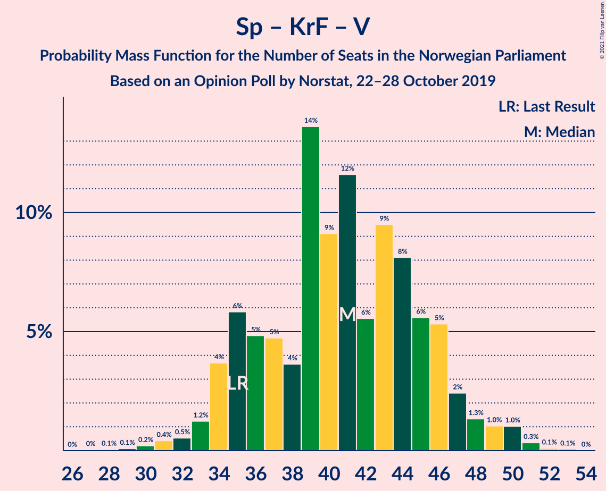

| Number of Seats | Probability | Accumulated | Special Marks |
|:---------------:|:-----------:|:-----------:|:-------------:|
| 28 | 0.1% | 100% |  |
| 29 | 0.1% | 99.9% |  |
| 30 | 0.2% | 99.8% |  |
| 31 | 0.4% | 99.6% |  |
| 32 | 0.5% | 99.2% |  |
| 33 | 1.2% | 98.7% |  |
| 34 | 4% | 97% |  |
| 35 | 6% | 94% | Last Result |
| 36 | 5% | 88% |  |
| 37 | 5% | 83% |  |
| 38 | 4% | 78% |  |
| 39 | 14% | 75% | Median |
| 40 | 9% | 61% |  |
| 41 | 12% | 52% |  |
| 42 | 6% | 40% |  |
| 43 | 9% | 35% |  |
| 44 | 8% | 25% |  |
| 45 | 6% | 17% |  |
| 46 | 5% | 12% |  |
| 47 | 2% | 6% |  |
| 48 | 1.3% | 4% |  |
| 49 | 1.0% | 3% |  |
| 50 | 1.0% | 2% |  |
| 51 | 0.3% | 0.5% |  |
| 52 | 0.1% | 0.2% |  |
| 53 | 0.1% | 0.1% |  |
| 54 | 0% | 0% |  |

## Technical Information

### Opinion Poll

+ **Polling firm:** Norstat
+ **Commissioner(s):** —
+ **Fieldwork period:** 22–28 October 2019

### Calculations

+ **Sample size:** 703
+ **Simulations done:** 1,048,576
+ **Error estimate:** 2.65%

