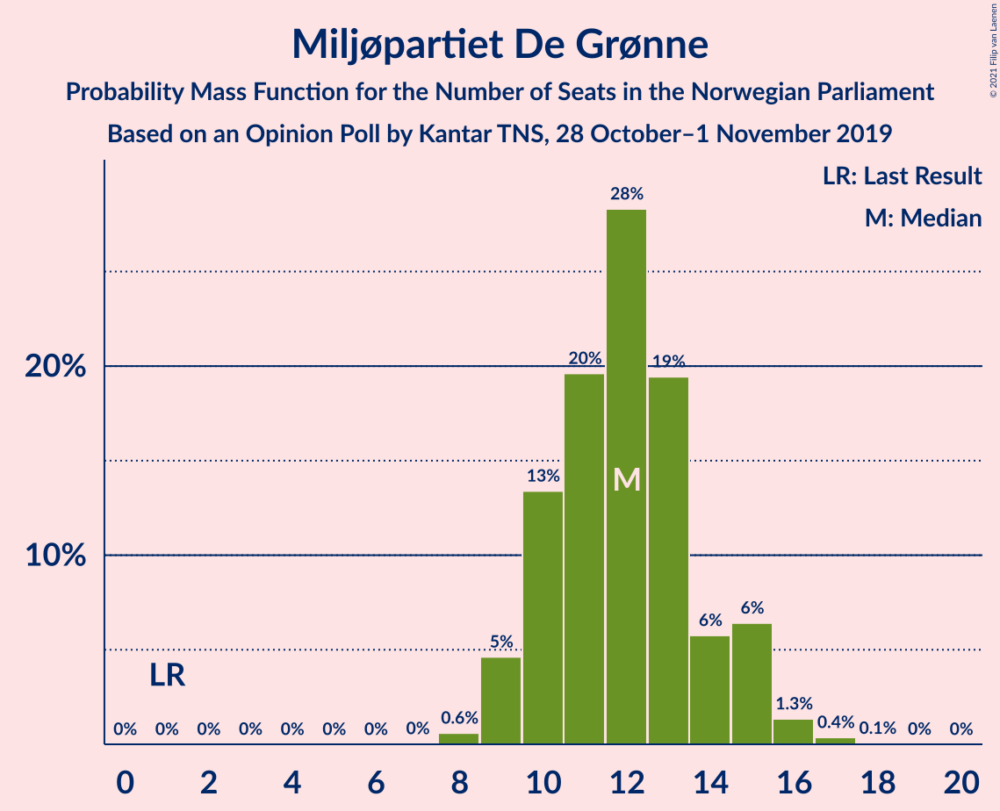
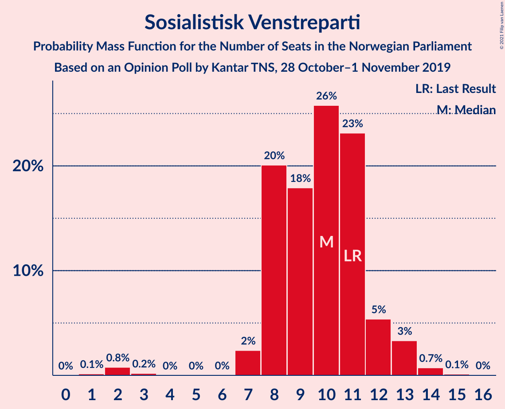
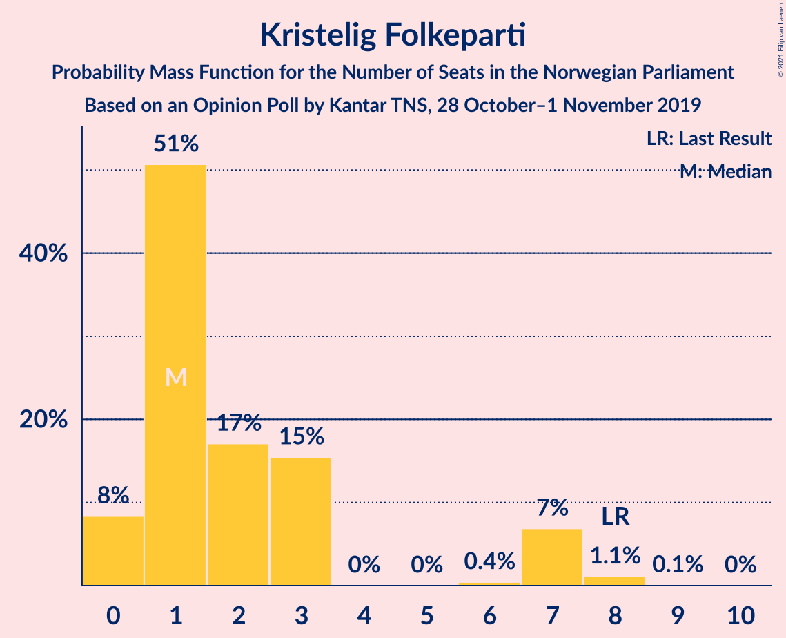
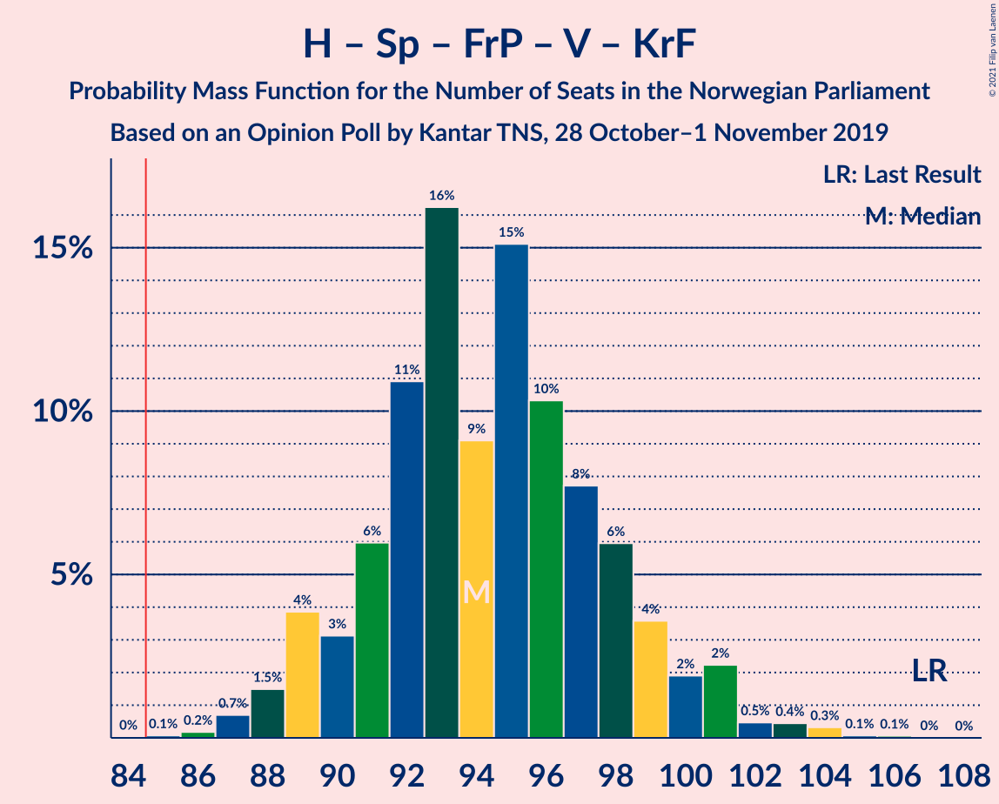
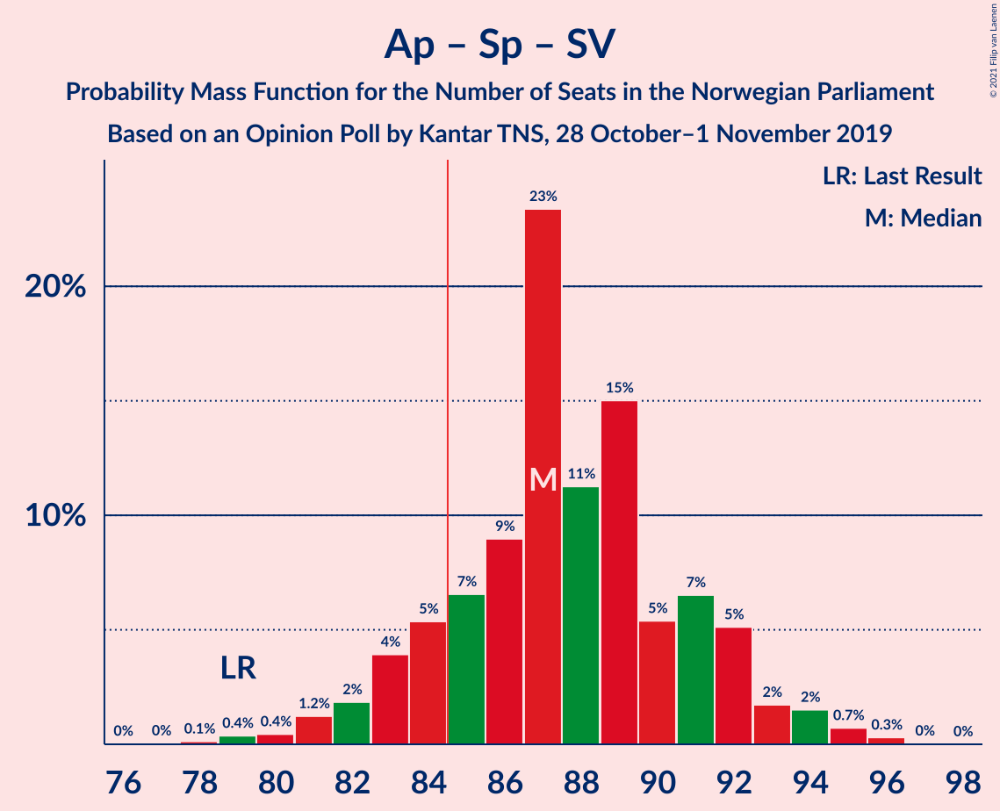
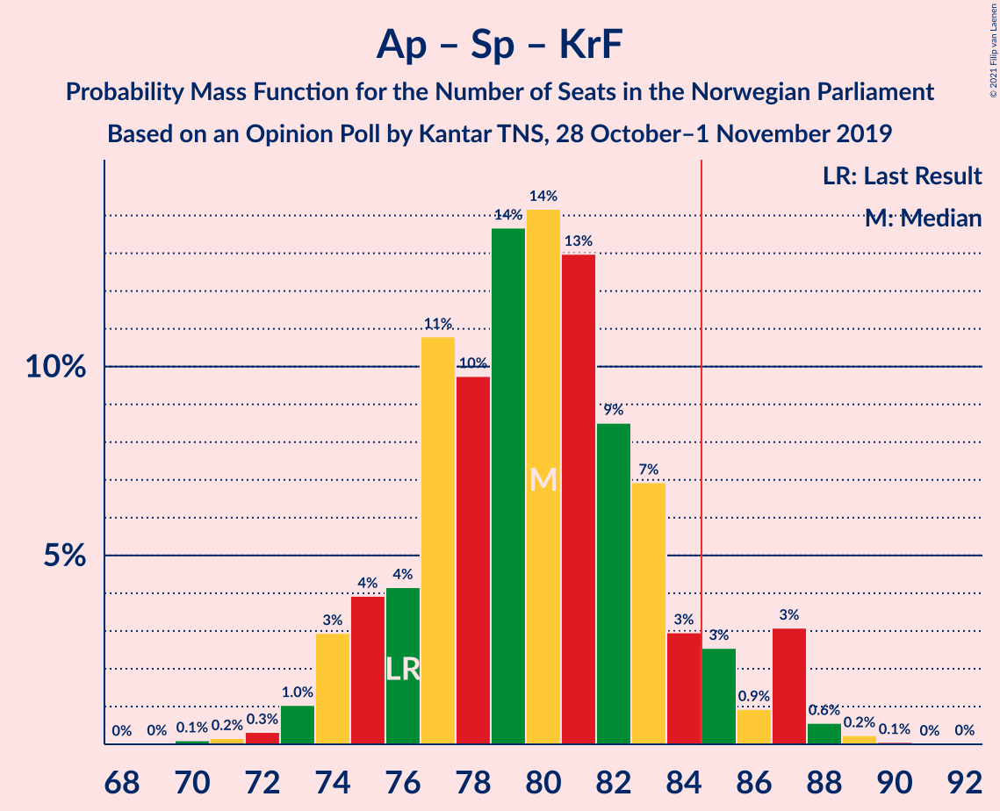
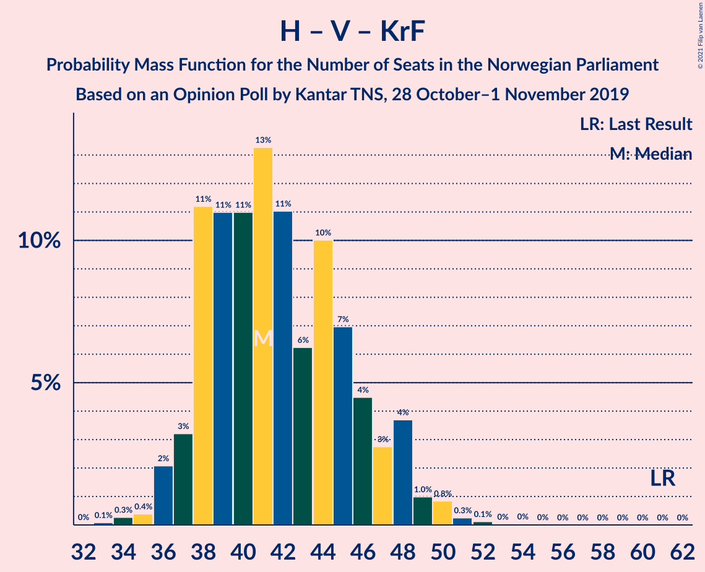

# Opinion Poll by Kantar TNS, 28 October–1 November 2019

<a href="#voting-intentions">Voting Intentions</a> | <a href="#seats">Seats</a> | <a href="#coalitions">Coalitions</a> | <a href="#technical-information">Technical Information</a>

## Voting Intentions

### Confidence Intervals

| Party | Last Result | Poll Result | 80% Confidence Interval | 90% Confidence Interval | 95% Confidence Interval | 99% Confidence Interval |
|:-----:|:-----------:|:-----------:|:-----------------------:|:-----------------------:|:-----------------------:|:-----------------------:|
| Arbeiderpartiet | 27.4% | 22.6% | 20.8–24.6% |20.3–25.2% |19.9–25.7% |19.0–26.6% |
| Høyre | 25.0% | 21.1% | 19.4–23.1% |18.9–23.6% |18.5–24.1% |17.6–25.1% |
| Senterpartiet | 10.3% | 19.5% | 17.8–21.4% |17.3–21.9% |16.9–22.4% |16.1–23.4% |
| Fremskrittspartiet | 15.2% | 9.2% | 8.0–10.6% |7.7–11.1% |7.4–11.4% |6.9–12.1% |
| Miljøpartiet De Grønne | 3.2% | 6.8% | 5.8–8.1% |5.5–8.5% |5.3–8.8% |4.8–9.5% |
| Rødt | 2.4% | 6.6% | 5.6–7.8% |5.3–8.2% |5.1–8.5% |4.6–9.2% |
| Sosialistisk Venstreparti | 6.0% | 5.6% | 4.7–6.8% |4.4–7.1% |4.2–7.4% |3.8–8.0% |
| Venstre | 4.4% | 3.4% | 2.7–4.3% |2.5–4.6% |2.3–4.8% |2.0–5.3% |
| Kristelig Folkeparti | 4.2% | 2.9% | 2.2–3.8% |2.1–4.0% |1.9–4.3% |1.6–4.7% |

*Note:* The poll result column reflects the actual value used in the calculations. Published results may vary slightly, and in addition be rounded to fewer digits.

## Seats

### Confidence Intervals

| Party | Last Result | Median | 80% Confidence Interval | 90% Confidence Interval | 95% Confidence Interval | 99% Confidence Interval |
|:-----:|:-----------:|:------:|:-----------------------:|:-----------------------:|:-----------------------:|:-----------------------:|
| <a href="#arbeiderpartiet">Arbeiderpartiet</a> | 49 | 41 | 39–45 |37–45 |36–46 |34–48 |
| <a href="#høyre">Høyre</a> | 45 | 36 | 34–40 |34–41 |33–42 |31–44 |
| <a href="#senterpartiet">Senterpartiet</a> | 19 | 36 | 34–39 |33–40 |32–41 |31–43 |
| <a href="#fremskrittspartiet">Fremskrittspartiet</a> | 27 | 16 | 14–19 |13–19 |13–20 |11–21 |
| <a href="#miljøpartiet-de-grønne">Miljøpartiet De Grønne</a> | 1 | 12 | 10–14 |9–15 |9–15 |8–16 |
| <a href="#rødt">Rødt</a> | 1 | 11 | 10–13 |9–14 |9–15 |8–16 |
| <a href="#sosialistisk-venstreparti">Sosialistisk Venstreparti</a> | 11 | 10 | 8–11 |8–12 |7–13 |2–14 |
| <a href="#venstre">Venstre</a> | 8 | 2 | 2–7 |2–7 |1–8 |1–9 |
| <a href="#kristelig-folkeparti">Kristelig Folkeparti</a> | 8 | 1 | 1–3 |0–7 |0–7 |0–8 |

### Arbeiderpartiet

*For a full overview of the results for this party, see the [Arbeiderpartiet](party-arbeiderpartiet.html) page.*

| Number of Seats | Probability | Accumulated | Special Marks |
|:---------------:|:-----------:|:-----------:|:-------------:|
| 31 | 0% | 100% |  |
| 32 | 0% | 99.9% |  |
| 33 | 0.2% | 99.9% |  |
| 34 | 0.3% | 99.7% |  |
| 35 | 0.4% | 99.4% |  |
| 36 | 2% | 99.0% |  |
| 37 | 3% | 97% |  |
| 38 | 4% | 94% |  |
| 39 | 16% | 91% |  |
| 40 | 15% | 75% |  |
| 41 | 13% | 60% | Median |
| 42 | 7% | 47% |  |
| 43 | 15% | 39% |  |
| 44 | 14% | 24% |  |
| 45 | 7% | 10% |  |
| 46 | 2% | 3% |  |
| 47 | 0.9% | 1.4% |  |
| 48 | 0.4% | 0.5% |  |
| 49 | 0% | 0.1% | Last Result |
| 50 | 0% | 0.1% |  |
| 51 | 0% | 0% |  |

### Høyre

*For a full overview of the results for this party, see the [Høyre](party-høyre.html) page.*

| Number of Seats | Probability | Accumulated | Special Marks |
|:---------------:|:-----------:|:-----------:|:-------------:|
| 29 | 0.1% | 100% |  |
| 30 | 0.2% | 99.8% |  |
| 31 | 0.5% | 99.6% |  |
| 32 | 0.9% | 99.1% |  |
| 33 | 3% | 98% |  |
| 34 | 11% | 95% |  |
| 35 | 16% | 84% |  |
| 36 | 21% | 68% | Median |
| 37 | 18% | 47% |  |
| 38 | 10% | 29% |  |
| 39 | 8% | 20% |  |
| 40 | 5% | 12% |  |
| 41 | 2% | 7% |  |
| 42 | 2% | 5% |  |
| 43 | 2% | 2% |  |
| 44 | 0.3% | 0.6% |  |
| 45 | 0.2% | 0.3% | Last Result |
| 46 | 0.1% | 0.1% |  |
| 47 | 0% | 0% |  |

### Senterpartiet

*For a full overview of the results for this party, see the [Senterpartiet](party-senterpartiet.html) page.*

| Number of Seats | Probability | Accumulated | Special Marks |
|:---------------:|:-----------:|:-----------:|:-------------:|
| 19 | 0% | 100% | Last Result |
| 20 | 0% | 100% |  |
| 21 | 0% | 100% |  |
| 22 | 0% | 100% |  |
| 23 | 0% | 100% |  |
| 24 | 0% | 100% |  |
| 25 | 0% | 100% |  |
| 26 | 0% | 100% |  |
| 27 | 0% | 100% |  |
| 28 | 0% | 100% |  |
| 29 | 0.1% | 100% |  |
| 30 | 0.2% | 99.9% |  |
| 31 | 0.5% | 99.7% |  |
| 32 | 2% | 99.2% |  |
| 33 | 3% | 97% |  |
| 34 | 9% | 93% |  |
| 35 | 13% | 84% |  |
| 36 | 24% | 71% | Median |
| 37 | 19% | 47% |  |
| 38 | 17% | 28% |  |
| 39 | 4% | 12% |  |
| 40 | 3% | 7% |  |
| 41 | 3% | 5% |  |
| 42 | 1.0% | 2% |  |
| 43 | 0.6% | 1.0% |  |
| 44 | 0.3% | 0.4% |  |
| 45 | 0% | 0.1% |  |
| 46 | 0% | 0% |  |

### Fremskrittspartiet

*For a full overview of the results for this party, see the [Fremskrittspartiet](party-fremskrittspartiet.html) page.*

| Number of Seats | Probability | Accumulated | Special Marks |
|:---------------:|:-----------:|:-----------:|:-------------:|
| 10 | 0.1% | 100% |  |
| 11 | 0.8% | 99.9% |  |
| 12 | 2% | 99.2% |  |
| 13 | 5% | 98% |  |
| 14 | 11% | 93% |  |
| 15 | 21% | 82% |  |
| 16 | 20% | 61% | Median |
| 17 | 15% | 41% |  |
| 18 | 12% | 25% |  |
| 19 | 9% | 13% |  |
| 20 | 3% | 4% |  |
| 21 | 1.2% | 1.5% |  |
| 22 | 0.2% | 0.3% |  |
| 23 | 0.1% | 0.1% |  |
| 24 | 0% | 0% |  |
| 25 | 0% | 0% |  |
| 26 | 0% | 0% |  |
| 27 | 0% | 0% | Last Result |

### Miljøpartiet De Grønne

*For a full overview of the results for this party, see the [Miljøpartiet De Grønne](party-miljøpartietdegrønne.html) page.*

| Number of Seats | Probability | Accumulated | Special Marks |
|:---------------:|:-----------:|:-----------:|:-------------:|
| 1 | 0% | 100% | Last Result |
| 2 | 0% | 100% |  |
| 3 | 0% | 100% |  |
| 4 | 0% | 100% |  |
| 5 | 0% | 100% |  |
| 6 | 0% | 100% |  |
| 7 | 0% | 100% |  |
| 8 | 0.6% | 99.9% |  |
| 9 | 5% | 99.4% |  |
| 10 | 13% | 95% |  |
| 11 | 20% | 81% |  |
| 12 | 28% | 62% | Median |
| 13 | 19% | 33% |  |
| 14 | 6% | 14% |  |
| 15 | 6% | 8% |  |
| 16 | 1.3% | 2% |  |
| 17 | 0.4% | 0.4% |  |
| 18 | 0.1% | 0.1% |  |
| 19 | 0% | 0% |  |

### Rødt

*For a full overview of the results for this party, see the [Rødt](party-rødt.html) page.*

| Number of Seats | Probability | Accumulated | Special Marks |
|:---------------:|:-----------:|:-----------:|:-------------:|
| 1 | 0% | 100% | Last Result |
| 2 | 0% | 100% |  |
| 3 | 0% | 100% |  |
| 4 | 0% | 100% |  |
| 5 | 0% | 100% |  |
| 6 | 0% | 100% |  |
| 7 | 0.2% | 100% |  |
| 8 | 2% | 99.8% |  |
| 9 | 6% | 98% |  |
| 10 | 15% | 92% |  |
| 11 | 30% | 77% | Median |
| 12 | 19% | 46% |  |
| 13 | 19% | 28% |  |
| 14 | 6% | 9% |  |
| 15 | 2% | 3% |  |
| 16 | 0.5% | 0.7% |  |
| 17 | 0.2% | 0.2% |  |
| 18 | 0% | 0% |  |

### Sosialistisk Venstreparti

*For a full overview of the results for this party, see the [Sosialistisk Venstreparti](party-sosialistiskvenstreparti.html) page.*

| Number of Seats | Probability | Accumulated | Special Marks |
|:---------------:|:-----------:|:-----------:|:-------------:|
| 1 | 0.1% | 100% |  |
| 2 | 0.8% | 99.9% |  |
| 3 | 0.2% | 99.1% |  |
| 4 | 0% | 98.9% |  |
| 5 | 0% | 98.9% |  |
| 6 | 0% | 98.9% |  |
| 7 | 2% | 98.9% |  |
| 8 | 20% | 96% |  |
| 9 | 18% | 76% |  |
| 10 | 26% | 58% | Median |
| 11 | 23% | 33% | Last Result |
| 12 | 5% | 10% |  |
| 13 | 3% | 4% |  |
| 14 | 0.7% | 0.9% |  |
| 15 | 0.1% | 0.2% |  |
| 16 | 0% | 0% |  |

### Venstre

*For a full overview of the results for this party, see the [Venstre](party-venstre.html) page.*

| Number of Seats | Probability | Accumulated | Special Marks |
|:---------------:|:-----------:|:-----------:|:-------------:|
| 0 | 0.4% | 100% |  |
| 1 | 2% | 99.6% |  |
| 2 | 74% | 97% | Median |
| 3 | 0.5% | 24% |  |
| 4 | 0% | 23% |  |
| 5 | 0% | 23% |  |
| 6 | 3% | 23% |  |
| 7 | 15% | 20% |  |
| 8 | 4% | 4% | Last Result |
| 9 | 0.5% | 0.7% |  |
| 10 | 0.1% | 0.1% |  |
| 11 | 0% | 0% |  |

### Kristelig Folkeparti

*For a full overview of the results for this party, see the [Kristelig Folkeparti](party-kristeligfolkeparti.html) page.*

| Number of Seats | Probability | Accumulated | Special Marks |
|:---------------:|:-----------:|:-----------:|:-------------:|
| 0 | 8% | 100% |  |
| 1 | 51% | 92% | Median |
| 2 | 17% | 41% |  |
| 3 | 15% | 24% |  |
| 4 | 0% | 8% |  |
| 5 | 0% | 8% |  |
| 6 | 0.4% | 8% |  |
| 7 | 7% | 8% |  |
| 8 | 1.1% | 1.2% | Last Result |
| 9 | 0.1% | 0.1% |  |
| 10 | 0% | 0% |  |

## Coalitions

### Confidence Intervals

| Coalition | Last Result | Median | Majority? | 80% Confidence Interval | 90% Confidence Interval | 95% Confidence Interval | 99% Confidence Interval |
|:---------:|:-----------:|:------:|:---------:|:-----------------------:|:-----------------------:|:-----------------------:|:-----------------------:|
| Arbeiderpartiet – Senterpartiet – Miljøpartiet De Grønne – Rødt – Sosialistisk Venstreparti | 81 | 111 | 100% | 107–115 | 106–116 | 105–117 | 102–119 |
| Arbeiderpartiet – Senterpartiet – Miljøpartiet De Grønne – Sosialistisk Venstreparti – Kristelig Folkeparti | 88 | 101 | 100% | 98–105 | 96–106 | 95–107 | 93–109 |
| Arbeiderpartiet – Senterpartiet – Miljøpartiet De Grønne – Sosialistisk Venstreparti | 80 | 99 | 100% | 96–103 | 94–104 | 93–105 | 91–107 |
| Arbeiderpartiet – Senterpartiet – Rødt – Sosialistisk Venstreparti | 80 | 99 | 100% | 95–103 | 94–104 | 93–105 | 91–107 |
| Høyre – Senterpartiet – Fremskrittspartiet – Venstre – Kristelig Folkeparti | 107 | 94 | 99.9% | 91–98 | 89–100 | 88–101 | 87–103 |
| Arbeiderpartiet – Senterpartiet – Miljøpartiet De Grønne – Kristelig Folkeparti | 77 | 92 | 98.9% | 88–96 | 87–97 | 85–97 | 84–100 |
| Arbeiderpartiet – Senterpartiet – Sosialistisk Venstreparti | 79 | 87 | 87% | 84–91 | 83–92 | 82–94 | 79–95 |
| Arbeiderpartiet – Senterpartiet – Kristelig Folkeparti | 76 | 80 | 7% | 76–84 | 75–85 | 74–87 | 72–88 |
| Arbeiderpartiet – Senterpartiet | 68 | 78 | 0.8% | 74–81 | 73–82 | 73–83 | 71–85 |
| Arbeiderpartiet – Miljøpartiet De Grønne – Rødt – Sosialistisk Venstreparti | 62 | 75 | 0.1% | 71–78 | 69–80 | 68–80 | 65–82 |
| Høyre – Fremskrittspartiet – Miljøpartiet De Grønne – Venstre – Kristelig Folkeparti | 89 | 70 | 0% | 66–74 | 65–75 | 64–76 | 62–78 |
| Høyre – Fremskrittspartiet – Venstre – Kristelig Folkeparti | 88 | 58 | 0% | 54–62 | 53–63 | 52–64 | 50–66 |
| Høyre – Fremskrittspartiet – Venstre | 80 | 56 | 0% | 52–60 | 51–62 | 51–62 | 48–64 |
| Høyre – Fremskrittspartiet | 72 | 53 | 0% | 49–57 | 48–58 | 48–60 | 46–61 |
| Arbeiderpartiet – Sosialistisk Venstreparti | 60 | 51 | 0% | 48–55 | 47–55 | 45–56 | 42–58 |
| Høyre – Venstre – Kristelig Folkeparti | 61 | 41 | 0% | 38–46 | 37–48 | 36–48 | 35–50 |
| Senterpartiet – Venstre – Kristelig Folkeparti | 35 | 41 | 0% | 38–46 | 37–47 | 36–48 | 34–51 |

### Arbeiderpartiet – Senterpartiet – Miljøpartiet De Grønne – Rødt – Sosialistisk Venstreparti

| Number of Seats | Probability | Accumulated | Special Marks |
|:---------------:|:-----------:|:-----------:|:-------------:|
| 81 | 0% | 100% | Last Result |
| 82 | 0% | 100% |  |
| 83 | 0% | 100% |  |
| 84 | 0% | 100% |  |
| 85 | 0% | 100% | Majority |
| 86 | 0% | 100% |  |
| 87 | 0% | 100% |  |
| 88 | 0% | 100% |  |
| 89 | 0% | 100% |  |
| 90 | 0% | 100% |  |
| 91 | 0% | 100% |  |
| 92 | 0% | 100% |  |
| 93 | 0% | 100% |  |
| 94 | 0% | 100% |  |
| 95 | 0% | 100% |  |
| 96 | 0% | 100% |  |
| 97 | 0% | 100% |  |
| 98 | 0% | 100% |  |
| 99 | 0% | 100% |  |
| 100 | 0% | 100% |  |
| 101 | 0.2% | 99.9% |  |
| 102 | 0.3% | 99.7% |  |
| 103 | 0.7% | 99.5% |  |
| 104 | 0.7% | 98.8% |  |
| 105 | 3% | 98% |  |
| 106 | 5% | 95% |  |
| 107 | 4% | 91% |  |
| 108 | 5% | 87% |  |
| 109 | 9% | 82% |  |
| 110 | 15% | 73% | Median |
| 111 | 12% | 59% |  |
| 112 | 15% | 47% |  |
| 113 | 9% | 32% |  |
| 114 | 12% | 23% |  |
| 115 | 5% | 11% |  |
| 116 | 4% | 7% |  |
| 117 | 1.4% | 3% |  |
| 118 | 1.0% | 2% |  |
| 119 | 0.4% | 0.6% |  |
| 120 | 0.2% | 0.3% |  |
| 121 | 0% | 0.1% |  |
| 122 | 0% | 0% |  |

### Arbeiderpartiet – Senterpartiet – Miljøpartiet De Grønne – Sosialistisk Venstreparti – Kristelig Folkeparti

| Number of Seats | Probability | Accumulated | Special Marks |
|:---------------:|:-----------:|:-----------:|:-------------:|
| 88 | 0% | 100% | Last Result |
| 89 | 0% | 100% |  |
| 90 | 0.1% | 100% |  |
| 91 | 0.1% | 99.9% |  |
| 92 | 0.3% | 99.8% |  |
| 93 | 0.4% | 99.5% |  |
| 94 | 1.5% | 99.1% |  |
| 95 | 2% | 98% |  |
| 96 | 2% | 96% |  |
| 97 | 3% | 94% |  |
| 98 | 7% | 91% |  |
| 99 | 7% | 84% |  |
| 100 | 9% | 77% | Median |
| 101 | 19% | 68% |  |
| 102 | 12% | 50% |  |
| 103 | 13% | 38% |  |
| 104 | 10% | 25% |  |
| 105 | 7% | 15% |  |
| 106 | 4% | 7% |  |
| 107 | 2% | 3% |  |
| 108 | 0.7% | 2% |  |
| 109 | 0.5% | 0.9% |  |
| 110 | 0.2% | 0.4% |  |
| 111 | 0.1% | 0.2% |  |
| 112 | 0% | 0.1% |  |
| 113 | 0% | 0% |  |

### Arbeiderpartiet – Senterpartiet – Miljøpartiet De Grønne – Sosialistisk Venstreparti

| Number of Seats | Probability | Accumulated | Special Marks |
|:---------------:|:-----------:|:-----------:|:-------------:|
| 80 | 0% | 100% | Last Result |
| 81 | 0% | 100% |  |
| 82 | 0% | 100% |  |
| 83 | 0% | 100% |  |
| 84 | 0% | 100% |  |
| 85 | 0% | 100% | Majority |
| 86 | 0% | 100% |  |
| 87 | 0% | 100% |  |
| 88 | 0% | 100% |  |
| 89 | 0.1% | 100% |  |
| 90 | 0.1% | 99.9% |  |
| 91 | 0.4% | 99.7% |  |
| 92 | 1.0% | 99.4% |  |
| 93 | 2% | 98% |  |
| 94 | 3% | 97% |  |
| 95 | 4% | 94% |  |
| 96 | 5% | 90% |  |
| 97 | 7% | 85% |  |
| 98 | 10% | 78% |  |
| 99 | 20% | 69% | Median |
| 100 | 12% | 49% |  |
| 101 | 11% | 37% |  |
| 102 | 10% | 26% |  |
| 103 | 7% | 16% |  |
| 104 | 5% | 9% |  |
| 105 | 2% | 4% |  |
| 106 | 2% | 2% |  |
| 107 | 0.5% | 0.8% |  |
| 108 | 0.2% | 0.3% |  |
| 109 | 0.1% | 0.1% |  |
| 110 | 0% | 0.1% |  |
| 111 | 0% | 0% |  |

### Arbeiderpartiet – Senterpartiet – Rødt – Sosialistisk Venstreparti

| Number of Seats | Probability | Accumulated | Special Marks |
|:---------------:|:-----------:|:-----------:|:-------------:|
| 80 | 0% | 100% | Last Result |
| 81 | 0% | 100% |  |
| 82 | 0% | 100% |  |
| 83 | 0% | 100% |  |
| 84 | 0% | 100% |  |
| 85 | 0% | 100% | Majority |
| 86 | 0% | 100% |  |
| 87 | 0% | 100% |  |
| 88 | 0.1% | 100% |  |
| 89 | 0.1% | 99.9% |  |
| 90 | 0.3% | 99.8% |  |
| 91 | 0.5% | 99.5% |  |
| 92 | 0.8% | 99.1% |  |
| 93 | 2% | 98% |  |
| 94 | 3% | 96% |  |
| 95 | 6% | 93% |  |
| 96 | 4% | 87% |  |
| 97 | 10% | 83% |  |
| 98 | 14% | 73% | Median |
| 99 | 11% | 60% |  |
| 100 | 16% | 48% |  |
| 101 | 12% | 32% |  |
| 102 | 8% | 20% |  |
| 103 | 6% | 12% |  |
| 104 | 2% | 5% |  |
| 105 | 2% | 4% |  |
| 106 | 0.7% | 2% |  |
| 107 | 0.7% | 0.9% |  |
| 108 | 0.1% | 0.1% |  |
| 109 | 0% | 0.1% |  |
| 110 | 0% | 0% |  |

### Høyre – Senterpartiet – Fremskrittspartiet – Venstre – Kristelig Folkeparti

| Number of Seats | Probability | Accumulated | Special Marks |
|:---------------:|:-----------:|:-----------:|:-------------:|
| 84 | 0% | 100% |  |
| 85 | 0.1% | 99.9% | Majority |
| 86 | 0.2% | 99.8% |  |
| 87 | 0.7% | 99.7% |  |
| 88 | 1.5% | 99.0% |  |
| 89 | 4% | 97% |  |
| 90 | 3% | 94% |  |
| 91 | 6% | 90% | Median |
| 92 | 11% | 85% |  |
| 93 | 16% | 74% |  |
| 94 | 9% | 57% |  |
| 95 | 15% | 48% |  |
| 96 | 10% | 33% |  |
| 97 | 8% | 23% |  |
| 98 | 6% | 15% |  |
| 99 | 4% | 9% |  |
| 100 | 2% | 6% |  |
| 101 | 2% | 4% |  |
| 102 | 0.5% | 1.4% |  |
| 103 | 0.4% | 0.9% |  |
| 104 | 0.3% | 0.5% |  |
| 105 | 0.1% | 0.2% |  |
| 106 | 0.1% | 0.1% |  |
| 107 | 0% | 0% | Last Result |

### Arbeiderpartiet – Senterpartiet – Miljøpartiet De Grønne – Kristelig Folkeparti

| Number of Seats | Probability | Accumulated | Special Marks |
|:---------------:|:-----------:|:-----------:|:-------------:|
| 77 | 0% | 100% | Last Result |
| 78 | 0% | 100% |  |
| 79 | 0% | 100% |  |
| 80 | 0% | 100% |  |
| 81 | 0.1% | 100% |  |
| 82 | 0.1% | 99.9% |  |
| 83 | 0.2% | 99.8% |  |
| 84 | 0.7% | 99.7% |  |
| 85 | 2% | 98.9% | Majority |
| 86 | 2% | 97% |  |
| 87 | 4% | 95% |  |
| 88 | 6% | 92% |  |
| 89 | 7% | 86% |  |
| 90 | 11% | 79% | Median |
| 91 | 11% | 67% |  |
| 92 | 17% | 56% |  |
| 93 | 14% | 39% |  |
| 94 | 8% | 25% |  |
| 95 | 7% | 17% |  |
| 96 | 4% | 10% |  |
| 97 | 4% | 6% |  |
| 98 | 0.9% | 2% |  |
| 99 | 0.6% | 1.2% |  |
| 100 | 0.3% | 0.6% |  |
| 101 | 0.2% | 0.3% |  |
| 102 | 0.1% | 0.1% |  |
| 103 | 0% | 0% |  |

### Arbeiderpartiet – Senterpartiet – Sosialistisk Venstreparti

| Number of Seats | Probability | Accumulated | Special Marks |
|:---------------:|:-----------:|:-----------:|:-------------:|
| 76 | 0% | 100% |  |
| 77 | 0% | 99.9% |  |
| 78 | 0.1% | 99.9% |  |
| 79 | 0.4% | 99.8% | Last Result |
| 80 | 0.4% | 99.4% |  |
| 81 | 1.2% | 98.9% |  |
| 82 | 2% | 98% |  |
| 83 | 4% | 96% |  |
| 84 | 5% | 92% |  |
| 85 | 7% | 87% | Majority |
| 86 | 9% | 80% |  |
| 87 | 23% | 71% | Median |
| 88 | 11% | 48% |  |
| 89 | 15% | 36% |  |
| 90 | 5% | 21% |  |
| 91 | 7% | 16% |  |
| 92 | 5% | 9% |  |
| 93 | 2% | 4% |  |
| 94 | 2% | 3% |  |
| 95 | 0.7% | 1.1% |  |
| 96 | 0.3% | 0.4% |  |
| 97 | 0% | 0.1% |  |
| 98 | 0% | 0% |  |

### Arbeiderpartiet – Senterpartiet – Kristelig Folkeparti

| Number of Seats | Probability | Accumulated | Special Marks |
|:---------------:|:-----------:|:-----------:|:-------------:|
| 69 | 0% | 100% |  |
| 70 | 0.1% | 99.9% |  |
| 71 | 0.2% | 99.8% |  |
| 72 | 0.3% | 99.7% |  |
| 73 | 1.0% | 99.4% |  |
| 74 | 3% | 98% |  |
| 75 | 4% | 95% |  |
| 76 | 4% | 91% | Last Result |
| 77 | 11% | 87% |  |
| 78 | 10% | 76% | Median |
| 79 | 14% | 67% |  |
| 80 | 14% | 53% |  |
| 81 | 13% | 39% |  |
| 82 | 9% | 26% |  |
| 83 | 7% | 17% |  |
| 84 | 3% | 10% |  |
| 85 | 3% | 7% | Majority |
| 86 | 0.9% | 5% |  |
| 87 | 3% | 4% |  |
| 88 | 0.6% | 0.9% |  |
| 89 | 0.2% | 0.4% |  |
| 90 | 0.1% | 0.1% |  |
| 91 | 0% | 0.1% |  |
| 92 | 0% | 0% |  |

### Arbeiderpartiet – Senterpartiet

| Number of Seats | Probability | Accumulated | Special Marks |
|:---------------:|:-----------:|:-----------:|:-------------:|
| 68 | 0% | 100% | Last Result |
| 69 | 0.1% | 99.9% |  |
| 70 | 0.2% | 99.8% |  |
| 71 | 0.4% | 99.6% |  |
| 72 | 2% | 99.2% |  |
| 73 | 3% | 98% |  |
| 74 | 6% | 94% |  |
| 75 | 6% | 89% |  |
| 76 | 15% | 83% |  |
| 77 | 9% | 67% | Median |
| 78 | 14% | 58% |  |
| 79 | 20% | 44% |  |
| 80 | 8% | 24% |  |
| 81 | 7% | 16% |  |
| 82 | 5% | 9% |  |
| 83 | 2% | 4% |  |
| 84 | 0.7% | 2% |  |
| 85 | 0.6% | 0.8% | Majority |
| 86 | 0.2% | 0.3% |  |
| 87 | 0.1% | 0.1% |  |
| 88 | 0% | 0.1% |  |
| 89 | 0% | 0% |  |

### Arbeiderpartiet – Miljøpartiet De Grønne – Rødt – Sosialistisk Venstreparti

| Number of Seats | Probability | Accumulated | Special Marks |
|:---------------:|:-----------:|:-----------:|:-------------:|
| 62 | 0% | 100% | Last Result |
| 63 | 0.1% | 100% |  |
| 64 | 0.1% | 99.9% |  |
| 65 | 0.3% | 99.8% |  |
| 66 | 0.5% | 99.5% |  |
| 67 | 0.5% | 99.0% |  |
| 68 | 2% | 98.5% |  |
| 69 | 2% | 96% |  |
| 70 | 4% | 94% |  |
| 71 | 6% | 91% |  |
| 72 | 8% | 85% |  |
| 73 | 10% | 77% |  |
| 74 | 15% | 67% | Median |
| 75 | 9% | 51% |  |
| 76 | 16% | 42% |  |
| 77 | 11% | 26% |  |
| 78 | 6% | 15% |  |
| 79 | 3% | 9% |  |
| 80 | 4% | 6% |  |
| 81 | 1.5% | 2% |  |
| 82 | 0.7% | 1.0% |  |
| 83 | 0.2% | 0.3% |  |
| 84 | 0.1% | 0.2% |  |
| 85 | 0% | 0.1% | Majority |
| 86 | 0% | 0% |  |

### Høyre – Fremskrittspartiet – Miljøpartiet De Grønne – Venstre – Kristelig Folkeparti

| Number of Seats | Probability | Accumulated | Special Marks |
|:---------------:|:-----------:|:-----------:|:-------------:|
| 60 | 0.1% | 100% |  |
| 61 | 0.1% | 99.9% |  |
| 62 | 0.7% | 99.8% |  |
| 63 | 0.7% | 99.1% |  |
| 64 | 2% | 98% |  |
| 65 | 2% | 96% |  |
| 66 | 6% | 94% |  |
| 67 | 8% | 88% | Median |
| 68 | 12% | 80% |  |
| 69 | 16% | 67% |  |
| 70 | 11% | 51% |  |
| 71 | 14% | 40% |  |
| 72 | 9% | 27% |  |
| 73 | 4% | 17% |  |
| 74 | 6% | 13% |  |
| 75 | 3% | 7% |  |
| 76 | 2% | 4% |  |
| 77 | 0.8% | 2% |  |
| 78 | 0.4% | 0.9% |  |
| 79 | 0.3% | 0.5% |  |
| 80 | 0.1% | 0.2% |  |
| 81 | 0.1% | 0.1% |  |
| 82 | 0% | 0% |  |
| 83 | 0% | 0% |  |
| 84 | 0% | 0% |  |
| 85 | 0% | 0% | Majority |
| 86 | 0% | 0% |  |
| 87 | 0% | 0% |  |
| 88 | 0% | 0% |  |
| 89 | 0% | 0% | Last Result |

### Høyre – Fremskrittspartiet – Venstre – Kristelig Folkeparti

| Number of Seats | Probability | Accumulated | Special Marks |
|:---------------:|:-----------:|:-----------:|:-------------:|
| 48 | 0% | 100% |  |
| 49 | 0.2% | 99.9% |  |
| 50 | 0.4% | 99.7% |  |
| 51 | 1.0% | 99.3% |  |
| 52 | 1.4% | 98% |  |
| 53 | 4% | 97% |  |
| 54 | 5% | 93% |  |
| 55 | 12% | 88% | Median |
| 56 | 9% | 76% |  |
| 57 | 15% | 68% |  |
| 58 | 12% | 53% |  |
| 59 | 15% | 41% |  |
| 60 | 9% | 27% |  |
| 61 | 5% | 18% |  |
| 62 | 4% | 13% |  |
| 63 | 4% | 9% |  |
| 64 | 3% | 5% |  |
| 65 | 0.7% | 2% |  |
| 66 | 0.7% | 1.2% |  |
| 67 | 0.2% | 0.5% |  |
| 68 | 0.2% | 0.3% |  |
| 69 | 0% | 0.1% |  |
| 70 | 0% | 0% |  |
| 71 | 0% | 0% |  |
| 72 | 0% | 0% |  |
| 73 | 0% | 0% |  |
| 74 | 0% | 0% |  |
| 75 | 0% | 0% |  |
| 76 | 0% | 0% |  |
| 77 | 0% | 0% |  |
| 78 | 0% | 0% |  |
| 79 | 0% | 0% |  |
| 80 | 0% | 0% |  |
| 81 | 0% | 0% |  |
| 82 | 0% | 0% |  |
| 83 | 0% | 0% |  |
| 84 | 0% | 0% |  |
| 85 | 0% | 0% | Majority |
| 86 | 0% | 0% |  |
| 87 | 0% | 0% |  |
| 88 | 0% | 0% | Last Result |

### Høyre – Fremskrittspartiet – Venstre

| Number of Seats | Probability | Accumulated | Special Marks |
|:---------------:|:-----------:|:-----------:|:-------------:|
| 46 | 0% | 100% |  |
| 47 | 0.1% | 99.9% |  |
| 48 | 0.4% | 99.8% |  |
| 49 | 0.3% | 99.4% |  |
| 50 | 2% | 99.0% |  |
| 51 | 3% | 98% |  |
| 52 | 6% | 94% |  |
| 53 | 6% | 89% |  |
| 54 | 14% | 83% | Median |
| 55 | 16% | 68% |  |
| 56 | 10% | 53% |  |
| 57 | 18% | 43% |  |
| 58 | 8% | 25% |  |
| 59 | 5% | 17% |  |
| 60 | 4% | 12% |  |
| 61 | 2% | 8% |  |
| 62 | 3% | 6% |  |
| 63 | 0.9% | 2% |  |
| 64 | 0.9% | 1.3% |  |
| 65 | 0.2% | 0.4% |  |
| 66 | 0.1% | 0.3% |  |
| 67 | 0.1% | 0.2% |  |
| 68 | 0% | 0% |  |
| 69 | 0% | 0% |  |
| 70 | 0% | 0% |  |
| 71 | 0% | 0% |  |
| 72 | 0% | 0% |  |
| 73 | 0% | 0% |  |
| 74 | 0% | 0% |  |
| 75 | 0% | 0% |  |
| 76 | 0% | 0% |  |
| 77 | 0% | 0% |  |
| 78 | 0% | 0% |  |
| 79 | 0% | 0% |  |
| 80 | 0% | 0% | Last Result |

### Høyre – Fremskrittspartiet

| Number of Seats | Probability | Accumulated | Special Marks |
|:---------------:|:-----------:|:-----------:|:-------------:|
| 43 | 0% | 100% |  |
| 44 | 0.2% | 99.9% |  |
| 45 | 0.2% | 99.8% |  |
| 46 | 0.6% | 99.6% |  |
| 47 | 0.6% | 99.0% |  |
| 48 | 4% | 98% |  |
| 49 | 5% | 95% |  |
| 50 | 14% | 90% |  |
| 51 | 7% | 75% |  |
| 52 | 17% | 68% | Median |
| 53 | 15% | 51% |  |
| 54 | 7% | 36% |  |
| 55 | 14% | 29% |  |
| 56 | 5% | 16% |  |
| 57 | 4% | 11% |  |
| 58 | 3% | 7% |  |
| 59 | 2% | 5% |  |
| 60 | 2% | 3% |  |
| 61 | 0.3% | 0.6% |  |
| 62 | 0.1% | 0.3% |  |
| 63 | 0.1% | 0.2% |  |
| 64 | 0% | 0.1% |  |
| 65 | 0% | 0% |  |
| 66 | 0% | 0% |  |
| 67 | 0% | 0% |  |
| 68 | 0% | 0% |  |
| 69 | 0% | 0% |  |
| 70 | 0% | 0% |  |
| 71 | 0% | 0% |  |
| 72 | 0% | 0% | Last Result |

### Arbeiderpartiet – Sosialistisk Venstreparti

| Number of Seats | Probability | Accumulated | Special Marks |
|:---------------:|:-----------:|:-----------:|:-------------:|
| 40 | 0% | 100% |  |
| 41 | 0.1% | 99.9% |  |
| 42 | 0.3% | 99.8% |  |
| 43 | 0.3% | 99.5% |  |
| 44 | 0.6% | 99.2% |  |
| 45 | 2% | 98.6% |  |
| 46 | 1.3% | 97% |  |
| 47 | 3% | 96% |  |
| 48 | 9% | 93% |  |
| 49 | 9% | 84% |  |
| 50 | 13% | 74% |  |
| 51 | 19% | 62% | Median |
| 52 | 15% | 42% |  |
| 53 | 7% | 28% |  |
| 54 | 9% | 21% |  |
| 55 | 8% | 12% |  |
| 56 | 2% | 4% |  |
| 57 | 1.0% | 2% |  |
| 58 | 0.8% | 1.1% |  |
| 59 | 0.2% | 0.2% |  |
| 60 | 0% | 0% | Last Result |

### Høyre – Venstre – Kristelig Folkeparti

| Number of Seats | Probability | Accumulated | Special Marks |
|:---------------:|:-----------:|:-----------:|:-------------:|
| 33 | 0.1% | 100% |  |
| 34 | 0.3% | 99.9% |  |
| 35 | 0.4% | 99.6% |  |
| 36 | 2% | 99.2% |  |
| 37 | 3% | 97% |  |
| 38 | 11% | 94% |  |
| 39 | 11% | 83% | Median |
| 40 | 11% | 72% |  |
| 41 | 13% | 61% |  |
| 42 | 11% | 47% |  |
| 43 | 6% | 36% |  |
| 44 | 10% | 30% |  |
| 45 | 7% | 20% |  |
| 46 | 4% | 13% |  |
| 47 | 3% | 9% |  |
| 48 | 4% | 6% |  |
| 49 | 1.0% | 2% |  |
| 50 | 0.8% | 1.3% |  |
| 51 | 0.3% | 0.4% |  |
| 52 | 0.1% | 0.2% |  |
| 53 | 0% | 0.1% |  |
| 54 | 0% | 0% |  |
| 55 | 0% | 0% |  |
| 56 | 0% | 0% |  |
| 57 | 0% | 0% |  |
| 58 | 0% | 0% |  |
| 59 | 0% | 0% |  |
| 60 | 0% | 0% |  |
| 61 | 0% | 0% | Last Result |

### Senterpartiet – Venstre – Kristelig Folkeparti

| Number of Seats | Probability | Accumulated | Special Marks |
|:---------------:|:-----------:|:-----------:|:-------------:|
| 32 | 0.1% | 100% |  |
| 33 | 0.1% | 99.9% |  |
| 34 | 0.5% | 99.8% |  |
| 35 | 2% | 99.3% | Last Result |
| 36 | 2% | 98% |  |
| 37 | 3% | 95% |  |
| 38 | 12% | 92% |  |
| 39 | 8% | 80% | Median |
| 40 | 13% | 72% |  |
| 41 | 16% | 58% |  |
| 42 | 7% | 43% |  |
| 43 | 8% | 36% |  |
| 44 | 5% | 28% |  |
| 45 | 12% | 24% |  |
| 46 | 6% | 12% |  |
| 47 | 2% | 6% |  |
| 48 | 2% | 4% |  |
| 49 | 0.8% | 2% |  |
| 50 | 0.6% | 1.3% |  |
| 51 | 0.3% | 0.7% |  |
| 52 | 0.3% | 0.5% |  |
| 53 | 0.1% | 0.2% |  |
| 54 | 0.1% | 0.1% |  |
| 55 | 0% | 0% |  |

## Technical Information

### Opinion Poll

+ **Polling firm:** Kantar TNS
+ **Commissioner(s):** —
+ **Fieldwork period:** 28 October–1 November 2019

### Calculations

+ **Sample size:** 804
+ **Simulations done:** 1,048,576
+ **Error estimate:** 1.37%

