# Opinion Poll by Sentio, 29 October–2 November 2019

<a href="#voting-intentions">Voting Intentions</a> | <a href="#seats">Seats</a> | <a href="#coalitions">Coalitions</a> | <a href="#technical-information">Technical Information</a>

## Voting Intentions

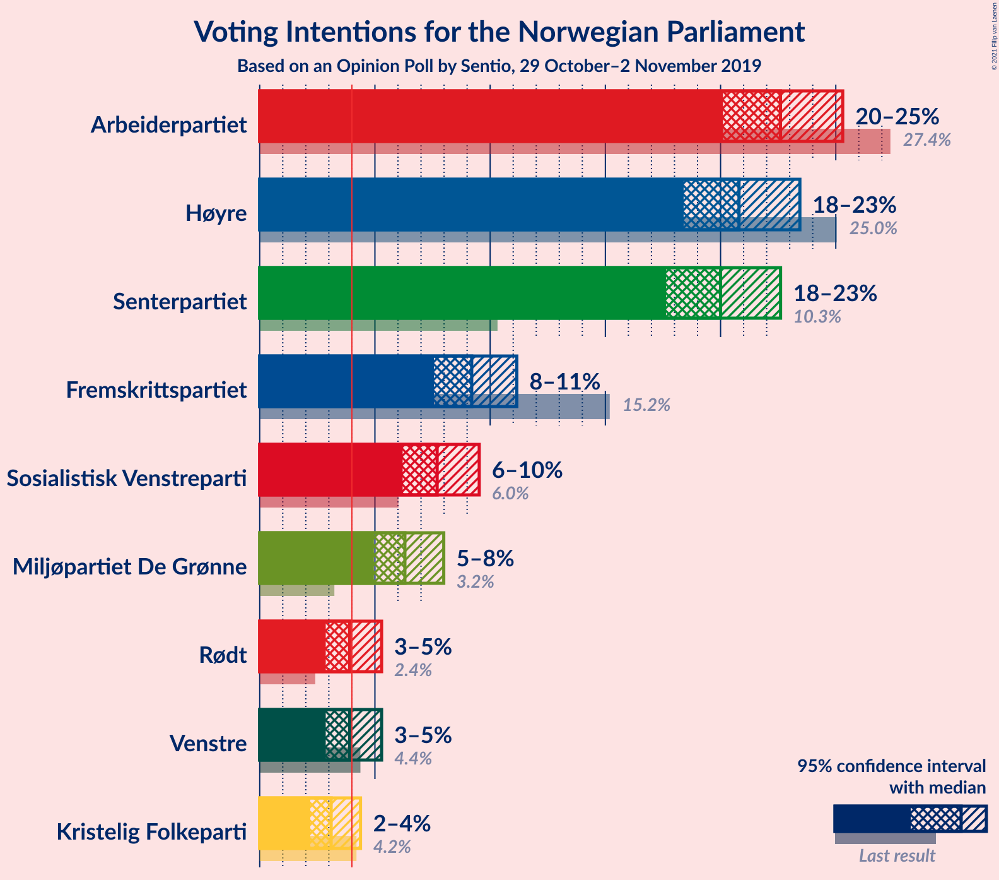

### Confidence Intervals

| Party | Last Result | Poll Result | 80% Confidence Interval | 90% Confidence Interval | 95% Confidence Interval | 99% Confidence Interval |
|:-----:|:-----------:|:-----------:|:-----------------------:|:-----------------------:|:-----------------------:|:-----------------------:|
| Arbeiderpartiet | 27.4% | 22.6% | 21.0–24.4% |20.5–24.9% |20.1–25.3% |19.3–26.2% |
| Høyre | 25.0% | 20.8% | 19.2–22.5% |18.8–23.0% |18.4–23.4% |17.7–24.3% |
| Senterpartiet | 10.3% | 20.0% | 18.4–21.7% |18.0–22.2% |17.6–22.6% |16.9–23.4% |
| Fremskrittspartiet | 15.2% | 9.2% | 8.1–10.5% |7.8–10.8% |7.6–11.2% |7.1–11.8% |
| Sosialistisk Venstreparti | 6.0% | 7.7% | 6.7–8.9% |6.4–9.2% |6.2–9.5% |5.8–10.1% |
| Miljøpartiet De Grønne | 3.2% | 6.3% | 5.4–7.4% |5.2–7.7% |5.0–8.0% |4.6–8.6% |
| Rødt | 2.4% | 3.9% | 3.2–4.8% |3.0–5.1% |2.9–5.3% |2.6–5.8% |
| Venstre | 4.4% | 3.9% | 3.2–4.8% |3.0–5.1% |2.9–5.3% |2.6–5.8% |
| Kristelig Folkeparti | 4.2% | 3.1% | 2.5–3.9% |2.3–4.2% |2.2–4.4% |1.9–4.8% |

*Note:* The poll result column reflects the actual value used in the calculations. Published results may vary slightly, and in addition be rounded to fewer digits.

## Seats

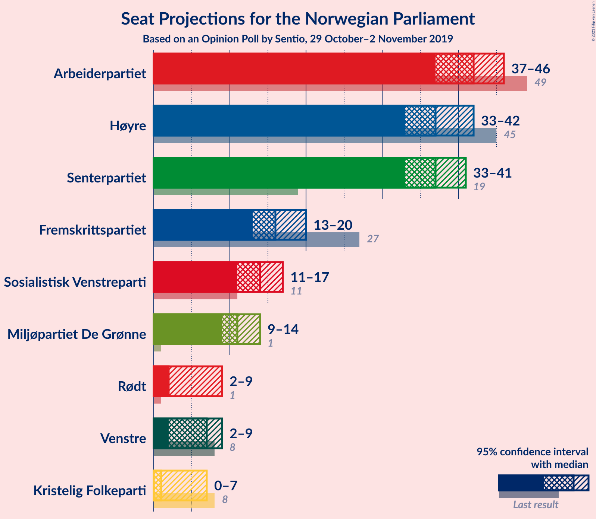

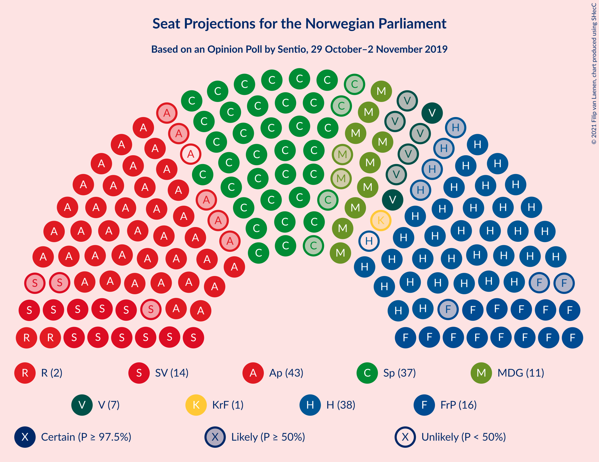

### Confidence Intervals

| Party | Last Result | Median | 80% Confidence Interval | 90% Confidence Interval | 95% Confidence Interval | 99% Confidence Interval |
|:-----:|:-----------:|:------:|:-----------------------:|:-----------------------:|:-----------------------:|:-----------------------:|
| <a href="#arbeiderpartiet">Arbeiderpartiet</a> | 49 | 42 | 39–44 |38–45 |37–46 |35–48 |
| <a href="#høyre">Høyre</a> | 45 | 37 | 34–41 |34–42 |33–42 |32–44 |
| <a href="#senterpartiet">Senterpartiet</a> | 19 | 37 | 35–40 |35–41 |33–41 |32–43 |
| <a href="#fremskrittspartiet">Fremskrittspartiet</a> | 27 | 16 | 14–19 |14–19 |13–20 |12–21 |
| <a href="#sosialistisk-venstreparti">Sosialistisk Venstreparti</a> | 11 | 14 | 12–16 |11–16 |11–17 |10–18 |
| <a href="#miljøpartiet-de-grønne">Miljøpartiet De Grønne</a> | 1 | 11 | 10–13 |9–14 |9–14 |8–15 |
| <a href="#rødt">Rødt</a> | 1 | 2 | 2–8 |2–9 |2–9 |1–10 |
| <a href="#venstre">Venstre</a> | 8 | 7 | 2–8 |2–9 |2–9 |2–10 |
| <a href="#kristelig-folkeparti">Kristelig Folkeparti</a> | 8 | 1 | 1–3 |1–7 |0–7 |0–8 |

### Arbeiderpartiet

*For a full overview of the results for this party, see the [Arbeiderpartiet](party-arbeiderpartiet.html) page.*

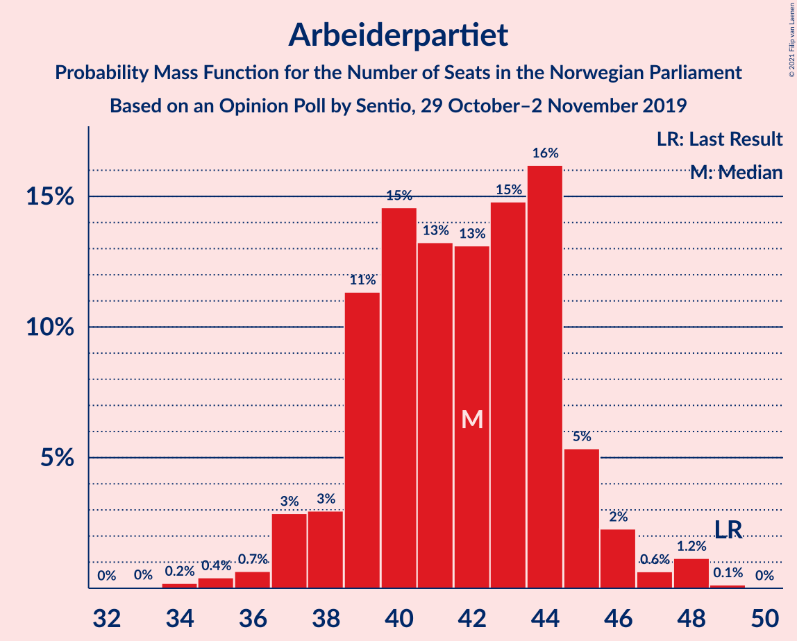

| Number of Seats | Probability | Accumulated | Special Marks |
|:---------------:|:-----------:|:-----------:|:-------------:|
| 33 | 0% | 100% |  |
| 34 | 0.2% | 99.9% |  |
| 35 | 0.4% | 99.7% |  |
| 36 | 0.7% | 99.3% |  |
| 37 | 3% | 98.7% |  |
| 38 | 3% | 96% |  |
| 39 | 11% | 93% |  |
| 40 | 15% | 81% |  |
| 41 | 13% | 67% |  |
| 42 | 13% | 54% | Median |
| 43 | 15% | 41% |  |
| 44 | 16% | 26% |  |
| 45 | 5% | 10% |  |
| 46 | 2% | 4% |  |
| 47 | 0.6% | 2% |  |
| 48 | 1.2% | 1.3% |  |
| 49 | 0.1% | 0.2% | Last Result |
| 50 | 0% | 0% |  |

### Høyre

*For a full overview of the results for this party, see the [Høyre](party-høyre.html) page.*

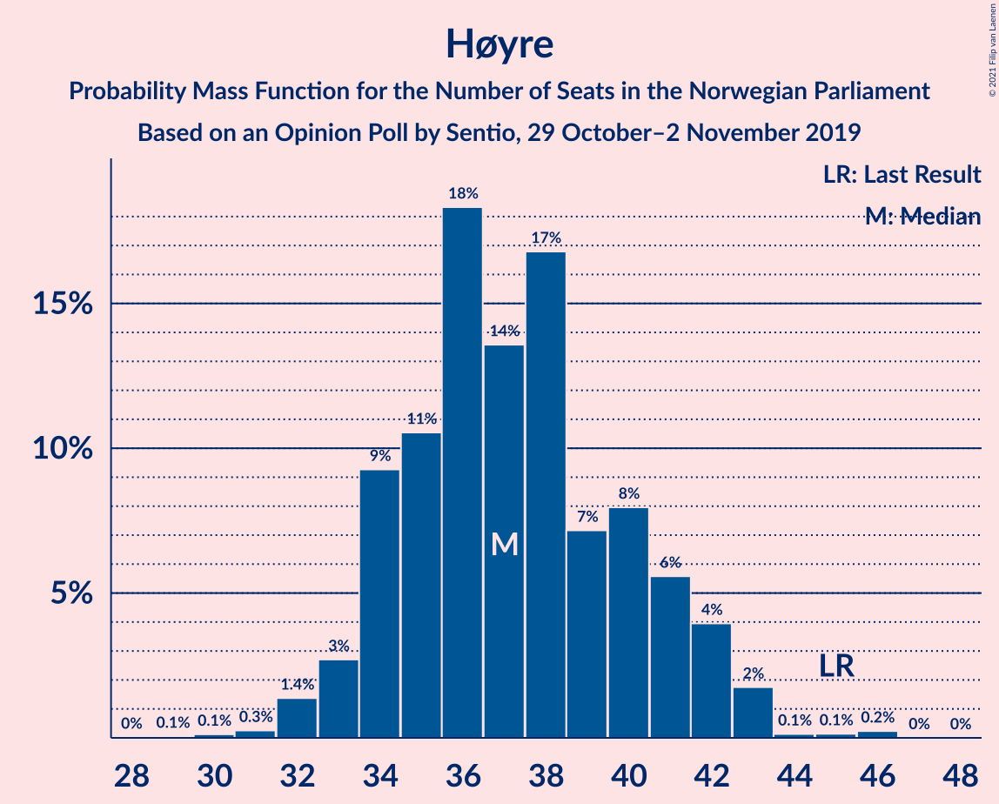

| Number of Seats | Probability | Accumulated | Special Marks |
|:---------------:|:-----------:|:-----------:|:-------------:|
| 29 | 0.1% | 100% |  |
| 30 | 0.1% | 99.9% |  |
| 31 | 0.3% | 99.8% |  |
| 32 | 1.4% | 99.5% |  |
| 33 | 3% | 98% |  |
| 34 | 9% | 95% |  |
| 35 | 11% | 86% |  |
| 36 | 18% | 76% |  |
| 37 | 14% | 57% | Median |
| 38 | 17% | 44% |  |
| 39 | 7% | 27% |  |
| 40 | 8% | 20% |  |
| 41 | 6% | 12% |  |
| 42 | 4% | 6% |  |
| 43 | 2% | 2% |  |
| 44 | 0.1% | 0.5% |  |
| 45 | 0.1% | 0.4% | Last Result |
| 46 | 0.2% | 0.2% |  |
| 47 | 0% | 0% |  |

### Senterpartiet

*For a full overview of the results for this party, see the [Senterpartiet](party-senterpartiet.html) page.*

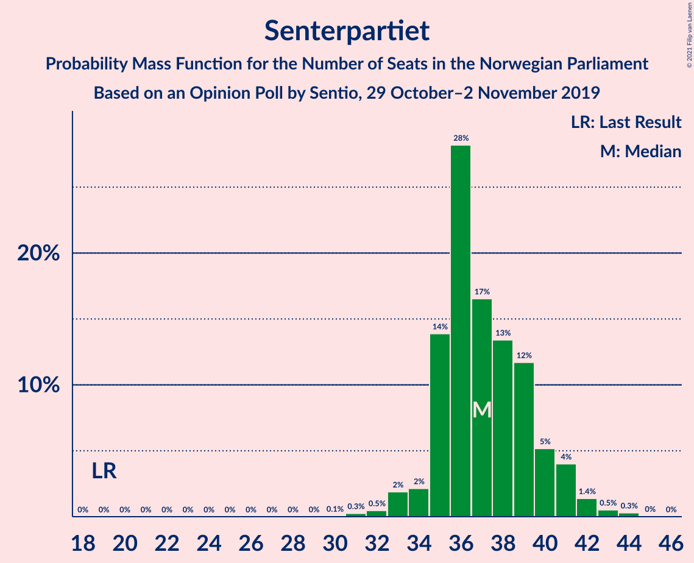

| Number of Seats | Probability | Accumulated | Special Marks |
|:---------------:|:-----------:|:-----------:|:-------------:|
| 19 | 0% | 100% | Last Result |
| 20 | 0% | 100% |  |
| 21 | 0% | 100% |  |
| 22 | 0% | 100% |  |
| 23 | 0% | 100% |  |
| 24 | 0% | 100% |  |
| 25 | 0% | 100% |  |
| 26 | 0% | 100% |  |
| 27 | 0% | 100% |  |
| 28 | 0% | 100% |  |
| 29 | 0% | 100% |  |
| 30 | 0.1% | 100% |  |
| 31 | 0.3% | 99.9% |  |
| 32 | 0.5% | 99.7% |  |
| 33 | 2% | 99.2% |  |
| 34 | 2% | 97% |  |
| 35 | 14% | 95% |  |
| 36 | 28% | 81% |  |
| 37 | 17% | 53% | Median |
| 38 | 13% | 37% |  |
| 39 | 12% | 23% |  |
| 40 | 5% | 11% |  |
| 41 | 4% | 6% |  |
| 42 | 1.4% | 2% |  |
| 43 | 0.5% | 0.9% |  |
| 44 | 0.3% | 0.4% |  |
| 45 | 0% | 0.1% |  |
| 46 | 0% | 0% |  |

### Fremskrittspartiet

*For a full overview of the results for this party, see the [Fremskrittspartiet](party-fremskrittspartiet.html) page.*

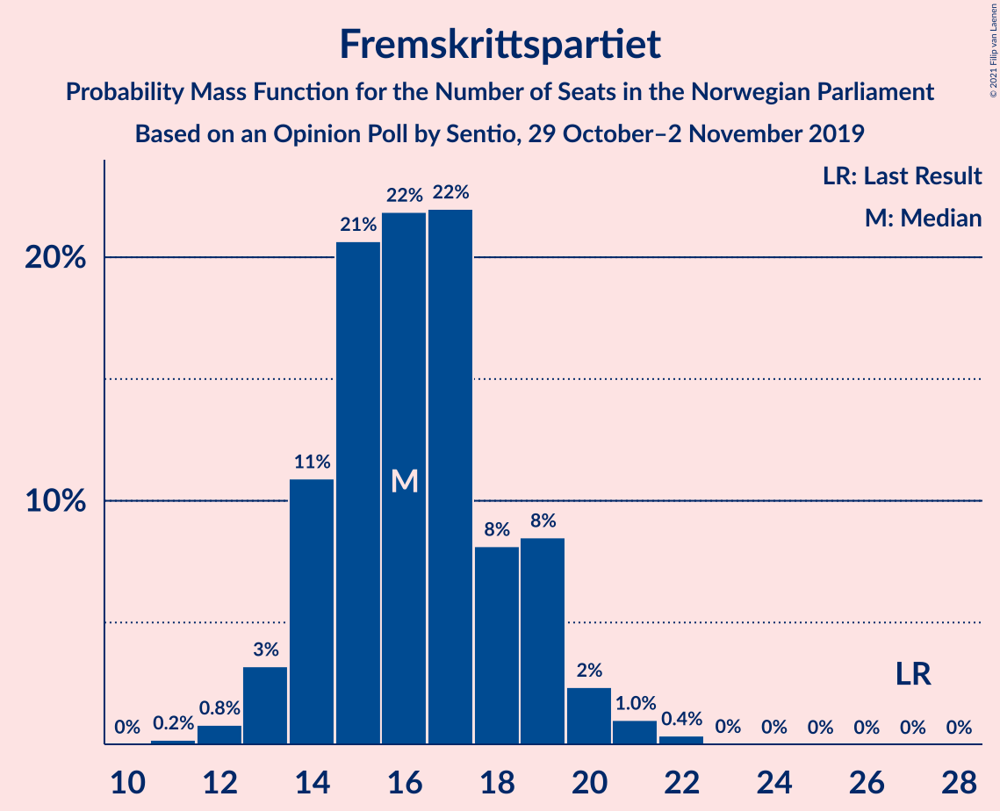

| Number of Seats | Probability | Accumulated | Special Marks |
|:---------------:|:-----------:|:-----------:|:-------------:|
| 11 | 0.2% | 100% |  |
| 12 | 0.8% | 99.8% |  |
| 13 | 3% | 99.0% |  |
| 14 | 11% | 96% |  |
| 15 | 21% | 85% |  |
| 16 | 22% | 64% | Median |
| 17 | 22% | 42% |  |
| 18 | 8% | 20% |  |
| 19 | 8% | 12% |  |
| 20 | 2% | 4% |  |
| 21 | 1.0% | 1.4% |  |
| 22 | 0.4% | 0.4% |  |
| 23 | 0% | 0.1% |  |
| 24 | 0% | 0% |  |
| 25 | 0% | 0% |  |
| 26 | 0% | 0% |  |
| 27 | 0% | 0% | Last Result |

### Sosialistisk Venstreparti

*For a full overview of the results for this party, see the [Sosialistisk Venstreparti](party-sosialistiskvenstreparti.html) page.*

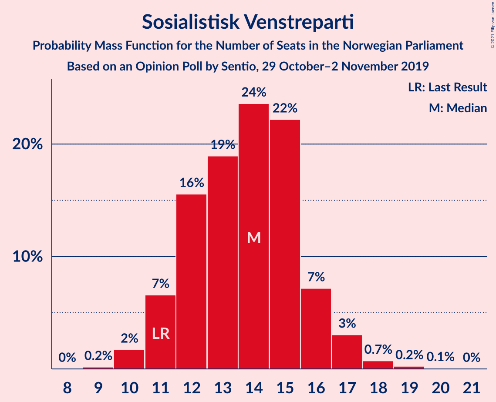

| Number of Seats | Probability | Accumulated | Special Marks |
|:---------------:|:-----------:|:-----------:|:-------------:|
| 9 | 0.2% | 100% |  |
| 10 | 2% | 99.8% |  |
| 11 | 7% | 98% | Last Result |
| 12 | 16% | 92% |  |
| 13 | 19% | 76% |  |
| 14 | 24% | 57% | Median |
| 15 | 22% | 33% |  |
| 16 | 7% | 11% |  |
| 17 | 3% | 4% |  |
| 18 | 0.7% | 1.0% |  |
| 19 | 0.2% | 0.3% |  |
| 20 | 0.1% | 0.1% |  |
| 21 | 0% | 0% |  |

### Miljøpartiet De Grønne

*For a full overview of the results for this party, see the [Miljøpartiet De Grønne](party-miljøpartietdegrønne.html) page.*

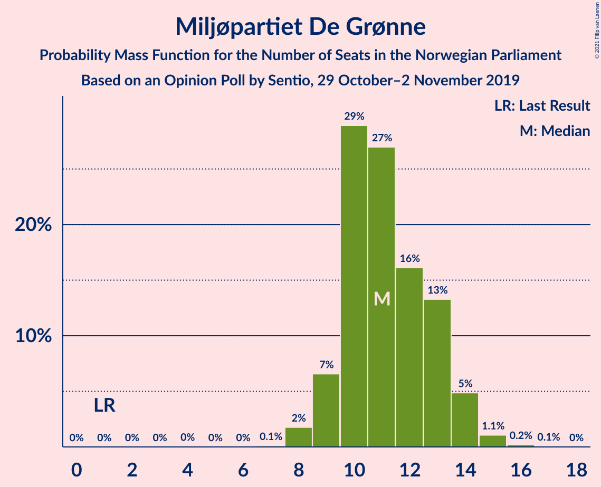

| Number of Seats | Probability | Accumulated | Special Marks |
|:---------------:|:-----------:|:-----------:|:-------------:|
| 1 | 0% | 100% | Last Result |
| 2 | 0% | 100% |  |
| 3 | 0% | 100% |  |
| 4 | 0% | 100% |  |
| 5 | 0% | 99.9% |  |
| 6 | 0% | 99.9% |  |
| 7 | 0.1% | 99.9% |  |
| 8 | 2% | 99.8% |  |
| 9 | 7% | 98% |  |
| 10 | 29% | 91% |  |
| 11 | 27% | 63% | Median |
| 12 | 16% | 36% |  |
| 13 | 13% | 19% |  |
| 14 | 5% | 6% |  |
| 15 | 1.1% | 1.3% |  |
| 16 | 0.2% | 0.3% |  |
| 17 | 0.1% | 0.1% |  |
| 18 | 0% | 0% |  |

### Rødt

*For a full overview of the results for this party, see the [Rødt](party-rødt.html) page.*

| Number of Seats | Probability | Accumulated | Special Marks |
|:---------------:|:-----------:|:-----------:|:-------------:|
| 1 | 2% | 100% | Last Result |
| 2 | 51% | 98% | Median |
| 3 | 0.1% | 48% |  |
| 4 | 0% | 48% |  |
| 5 | 0% | 48% |  |
| 6 | 2% | 48% |  |
| 7 | 21% | 46% |  |
| 8 | 18% | 25% |  |
| 9 | 7% | 8% |  |
| 10 | 0.5% | 0.6% |  |
| 11 | 0.1% | 0.1% |  |
| 12 | 0% | 0% |  |

### Venstre

*For a full overview of the results for this party, see the [Venstre](party-venstre.html) page.*

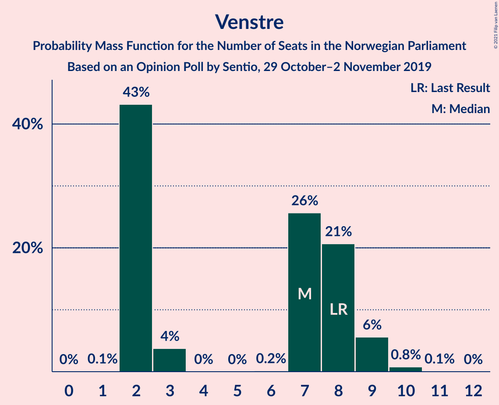

| Number of Seats | Probability | Accumulated | Special Marks |
|:---------------:|:-----------:|:-----------:|:-------------:|
| 1 | 0.1% | 100% |  |
| 2 | 43% | 99.9% |  |
| 3 | 4% | 57% |  |
| 4 | 0% | 53% |  |
| 5 | 0% | 53% |  |
| 6 | 0.2% | 53% |  |
| 7 | 26% | 53% | Median |
| 8 | 21% | 27% | Last Result |
| 9 | 6% | 6% |  |
| 10 | 0.8% | 0.9% |  |
| 11 | 0.1% | 0.1% |  |
| 12 | 0% | 0% |  |

### Kristelig Folkeparti

*For a full overview of the results for this party, see the [Kristelig Folkeparti](party-kristeligfolkeparti.html) page.*

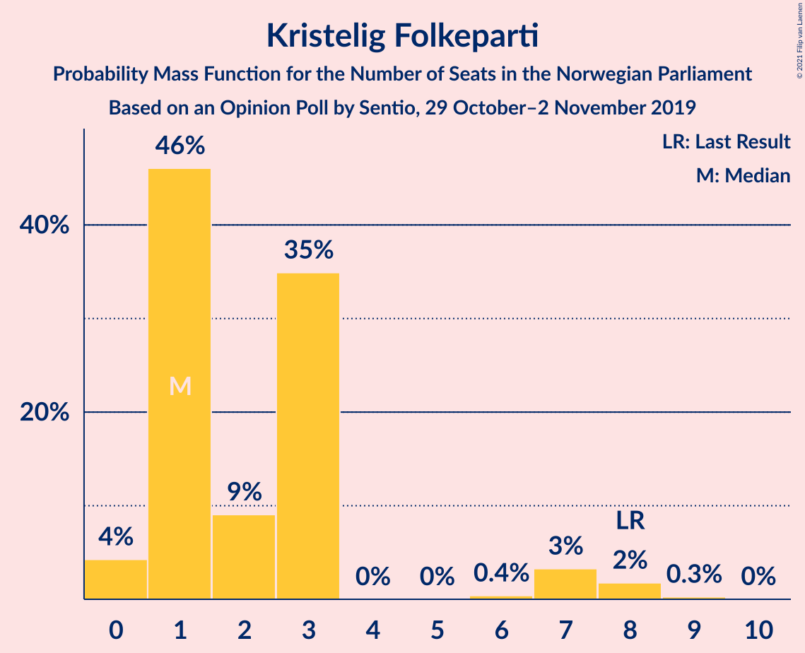

| Number of Seats | Probability | Accumulated | Special Marks |
|:---------------:|:-----------:|:-----------:|:-------------:|
| 0 | 4% | 100% |  |
| 1 | 46% | 96% | Median |
| 2 | 9% | 50% |  |
| 3 | 35% | 41% |  |
| 4 | 0% | 6% |  |
| 5 | 0% | 6% |  |
| 6 | 0.4% | 6% |  |
| 7 | 3% | 5% |  |
| 8 | 2% | 2% | Last Result |
| 9 | 0.3% | 0.3% |  |
| 10 | 0% | 0% |  |

## Coalitions

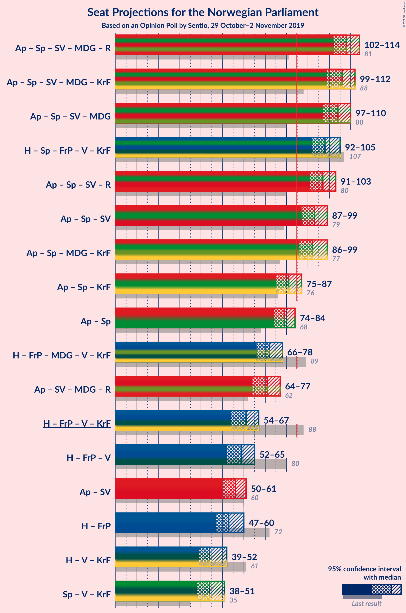

### Confidence Intervals

| Coalition | Last Result | Median | Majority? | 80% Confidence Interval | 90% Confidence Interval | 95% Confidence Interval | 99% Confidence Interval |
|:---------:|:-----------:|:------:|:---------:|:-----------------------:|:-----------------------:|:-----------------------:|:-----------------------:|
| Arbeiderpartiet – Senterpartiet – Sosialistisk Venstreparti – Miljøpartiet De Grønne – Rødt | 81 | 108 | 100% | 104–113 | 103–114 | 102–114 | 100–117 |
| Arbeiderpartiet – Senterpartiet – Sosialistisk Venstreparti – Miljøpartiet De Grønne – Kristelig Folkeparti | 88 | 106 | 100% | 102–110 | 100–111 | 99–112 | 97–114 |
| Arbeiderpartiet – Senterpartiet – Sosialistisk Venstreparti – Miljøpartiet De Grønne | 80 | 104 | 100% | 99–107 | 98–109 | 97–110 | 96–112 |
| Høyre – Senterpartiet – Fremskrittspartiet – Venstre – Kristelig Folkeparti | 107 | 98 | 100% | 94–102 | 92–103 | 92–105 | 89–107 |
| Arbeiderpartiet – Senterpartiet – Sosialistisk Venstreparti – Rødt | 80 | 97 | 100% | 93–101 | 92–102 | 91–103 | 88–105 |
| Arbeiderpartiet – Senterpartiet – Sosialistisk Venstreparti | 79 | 93 | 99.7% | 89–96 | 88–98 | 87–99 | 85–100 |
| Arbeiderpartiet – Senterpartiet – Miljøpartiet De Grønne – Kristelig Folkeparti | 77 | 92 | 99.3% | 88–96 | 87–98 | 86–99 | 84–100 |
| Arbeiderpartiet – Senterpartiet – Kristelig Folkeparti | 76 | 81 | 10% | 77–85 | 76–86 | 75–87 | 73–90 |
| Arbeiderpartiet – Senterpartiet | 68 | 79 | 0.9% | 76–82 | 75–83 | 74–84 | 72–85 |
| Høyre – Fremskrittspartiet – Miljøpartiet De Grønne – Venstre – Kristelig Folkeparti | 89 | 72 | 0% | 68–76 | 67–77 | 66–78 | 64–81 |
| Arbeiderpartiet – Sosialistisk Venstreparti – Miljøpartiet De Grønne – Rødt | 62 | 71 | 0% | 67–75 | 66–77 | 64–77 | 62–80 |
| Høyre – Fremskrittspartiet – Venstre – Kristelig Folkeparti | 88 | 61 | 0% | 56–65 | 55–66 | 54–67 | 52–69 |
| Høyre – Fremskrittspartiet – Venstre | 80 | 59 | 0% | 54–63 | 53–64 | 52–65 | 50–67 |
| Arbeiderpartiet – Sosialistisk Venstreparti | 60 | 56 | 0% | 51–59 | 51–60 | 50–61 | 48–63 |
| Høyre – Fremskrittspartiet | 72 | 53 | 0% | 50–58 | 49–59 | 47–60 | 46–62 |
| Høyre – Venstre – Kristelig Folkeparti | 61 | 44 | 0% | 40–49 | 39–50 | 39–52 | 37–52 |
| Senterpartiet – Venstre – Kristelig Folkeparti | 35 | 44 | 0% | 39–49 | 38–50 | 38–51 | 36–54 |

### Arbeiderpartiet – Senterpartiet – Sosialistisk Venstreparti – Miljøpartiet De Grønne – Rødt

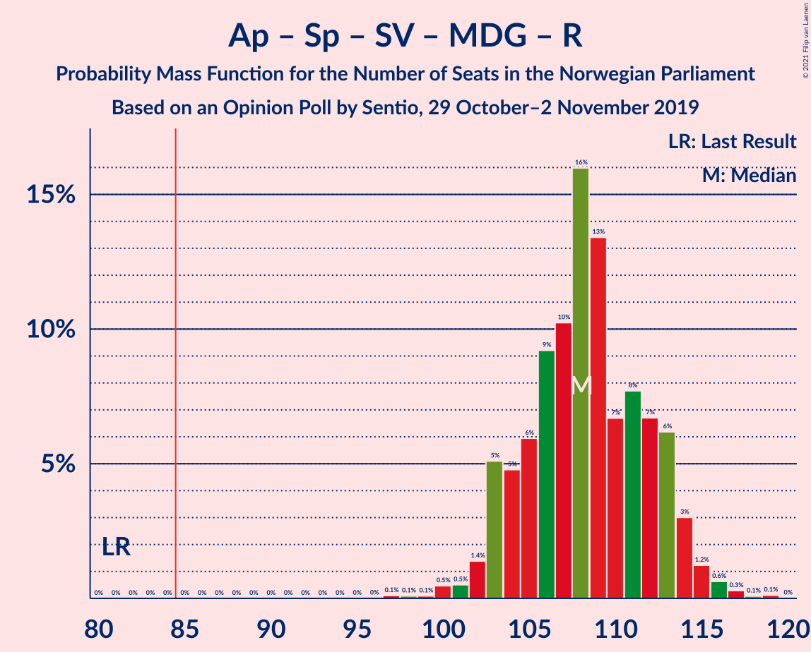

| Number of Seats | Probability | Accumulated | Special Marks |
|:---------------:|:-----------:|:-----------:|:-------------:|
| 81 | 0% | 100% | Last Result |
| 82 | 0% | 100% |  |
| 83 | 0% | 100% |  |
| 84 | 0% | 100% |  |
| 85 | 0% | 100% | Majority |
| 86 | 0% | 100% |  |
| 87 | 0% | 100% |  |
| 88 | 0% | 100% |  |
| 89 | 0% | 100% |  |
| 90 | 0% | 100% |  |
| 91 | 0% | 100% |  |
| 92 | 0% | 100% |  |
| 93 | 0% | 100% |  |
| 94 | 0% | 100% |  |
| 95 | 0% | 100% |  |
| 96 | 0% | 100% |  |
| 97 | 0.1% | 100% |  |
| 98 | 0.1% | 99.9% |  |
| 99 | 0.1% | 99.8% |  |
| 100 | 0.5% | 99.7% |  |
| 101 | 0.5% | 99.2% |  |
| 102 | 1.4% | 98.7% |  |
| 103 | 5% | 97% |  |
| 104 | 5% | 92% |  |
| 105 | 6% | 87% |  |
| 106 | 9% | 82% | Median |
| 107 | 10% | 72% |  |
| 108 | 16% | 62% |  |
| 109 | 13% | 46% |  |
| 110 | 7% | 33% |  |
| 111 | 8% | 26% |  |
| 112 | 7% | 18% |  |
| 113 | 6% | 12% |  |
| 114 | 3% | 5% |  |
| 115 | 1.2% | 2% |  |
| 116 | 0.6% | 1.1% |  |
| 117 | 0.3% | 0.5% |  |
| 118 | 0.1% | 0.2% |  |
| 119 | 0.1% | 0.1% |  |
| 120 | 0% | 0% |  |

### Arbeiderpartiet – Senterpartiet – Sosialistisk Venstreparti – Miljøpartiet De Grønne – Kristelig Folkeparti

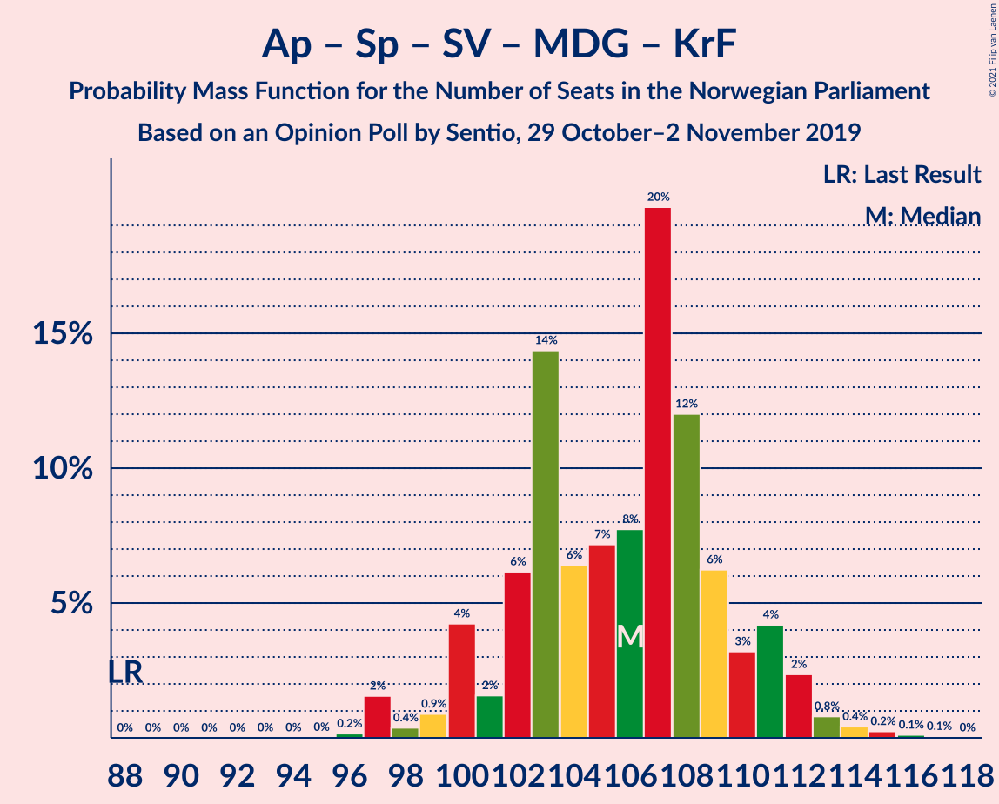

| Number of Seats | Probability | Accumulated | Special Marks |
|:---------------:|:-----------:|:-----------:|:-------------:|
| 88 | 0% | 100% | Last Result |
| 89 | 0% | 100% |  |
| 90 | 0% | 100% |  |
| 91 | 0% | 100% |  |
| 92 | 0% | 100% |  |
| 93 | 0% | 100% |  |
| 94 | 0% | 100% |  |
| 95 | 0% | 100% |  |
| 96 | 0.2% | 100% |  |
| 97 | 2% | 99.8% |  |
| 98 | 0.4% | 98% |  |
| 99 | 0.9% | 98% |  |
| 100 | 4% | 97% |  |
| 101 | 2% | 93% |  |
| 102 | 6% | 91% |  |
| 103 | 14% | 85% |  |
| 104 | 6% | 71% |  |
| 105 | 7% | 64% | Median |
| 106 | 8% | 57% |  |
| 107 | 20% | 49% |  |
| 108 | 12% | 30% |  |
| 109 | 6% | 18% |  |
| 110 | 3% | 11% |  |
| 111 | 4% | 8% |  |
| 112 | 2% | 4% |  |
| 113 | 0.8% | 2% |  |
| 114 | 0.4% | 0.8% |  |
| 115 | 0.2% | 0.4% |  |
| 116 | 0.1% | 0.2% |  |
| 117 | 0.1% | 0.1% |  |
| 118 | 0% | 0% |  |

### Arbeiderpartiet – Senterpartiet – Sosialistisk Venstreparti – Miljøpartiet De Grønne

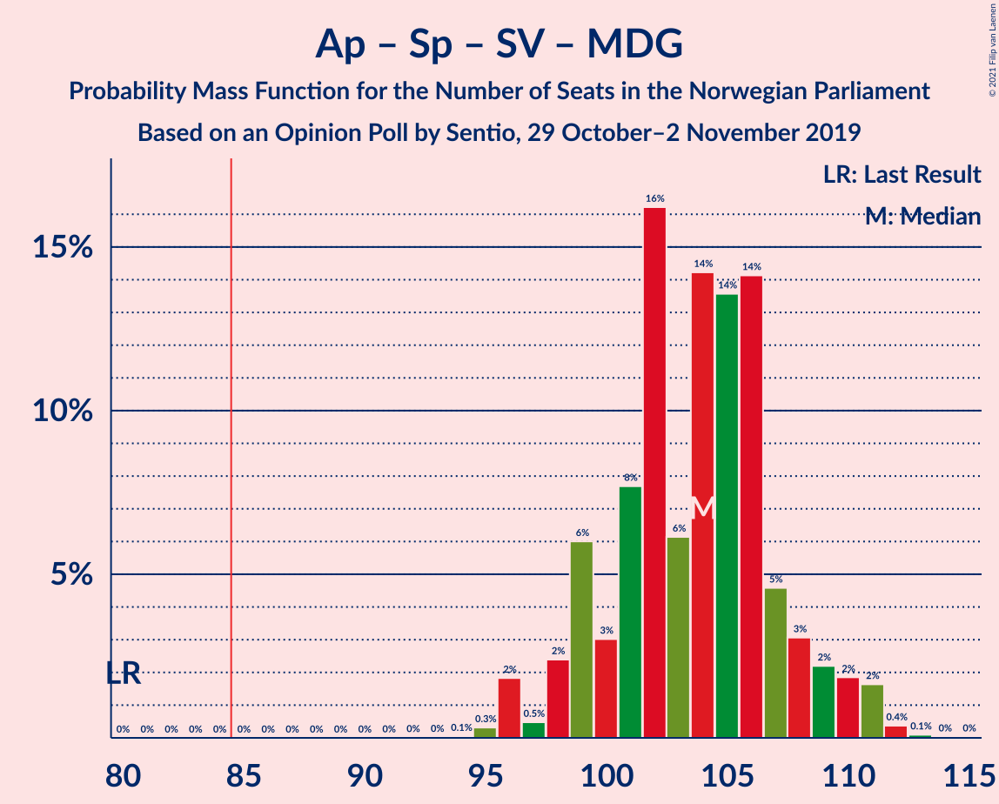

| Number of Seats | Probability | Accumulated | Special Marks |
|:---------------:|:-----------:|:-----------:|:-------------:|
| 80 | 0% | 100% | Last Result |
| 81 | 0% | 100% |  |
| 82 | 0% | 100% |  |
| 83 | 0% | 100% |  |
| 84 | 0% | 100% |  |
| 85 | 0% | 100% | Majority |
| 86 | 0% | 100% |  |
| 87 | 0% | 100% |  |
| 88 | 0% | 100% |  |
| 89 | 0% | 100% |  |
| 90 | 0% | 100% |  |
| 91 | 0% | 100% |  |
| 92 | 0% | 100% |  |
| 93 | 0% | 100% |  |
| 94 | 0.1% | 100% |  |
| 95 | 0.3% | 99.9% |  |
| 96 | 2% | 99.6% |  |
| 97 | 0.5% | 98% |  |
| 98 | 2% | 97% |  |
| 99 | 6% | 95% |  |
| 100 | 3% | 89% |  |
| 101 | 8% | 86% |  |
| 102 | 16% | 78% |  |
| 103 | 6% | 62% |  |
| 104 | 14% | 56% | Median |
| 105 | 14% | 42% |  |
| 106 | 14% | 28% |  |
| 107 | 5% | 14% |  |
| 108 | 3% | 9% |  |
| 109 | 2% | 6% |  |
| 110 | 2% | 4% |  |
| 111 | 2% | 2% |  |
| 112 | 0.4% | 0.5% |  |
| 113 | 0.1% | 0.2% |  |
| 114 | 0% | 0.1% |  |
| 115 | 0% | 0% |  |

### Høyre – Senterpartiet – Fremskrittspartiet – Venstre – Kristelig Folkeparti

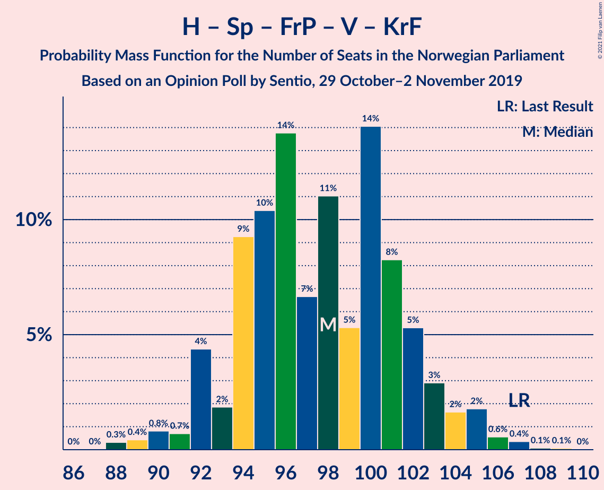

| Number of Seats | Probability | Accumulated | Special Marks |
|:---------------:|:-----------:|:-----------:|:-------------:|
| 88 | 0.3% | 100% |  |
| 89 | 0.4% | 99.6% |  |
| 90 | 0.8% | 99.2% |  |
| 91 | 0.7% | 98% |  |
| 92 | 4% | 98% |  |
| 93 | 2% | 93% |  |
| 94 | 9% | 91% |  |
| 95 | 10% | 82% |  |
| 96 | 14% | 72% |  |
| 97 | 7% | 58% |  |
| 98 | 11% | 51% | Median |
| 99 | 5% | 40% |  |
| 100 | 14% | 35% |  |
| 101 | 8% | 21% |  |
| 102 | 5% | 13% |  |
| 103 | 3% | 7% |  |
| 104 | 2% | 4% |  |
| 105 | 2% | 3% |  |
| 106 | 0.6% | 1.1% |  |
| 107 | 0.4% | 0.5% | Last Result |
| 108 | 0.1% | 0.2% |  |
| 109 | 0.1% | 0.1% |  |
| 110 | 0% | 0% |  |

### Arbeiderpartiet – Senterpartiet – Sosialistisk Venstreparti – Rødt

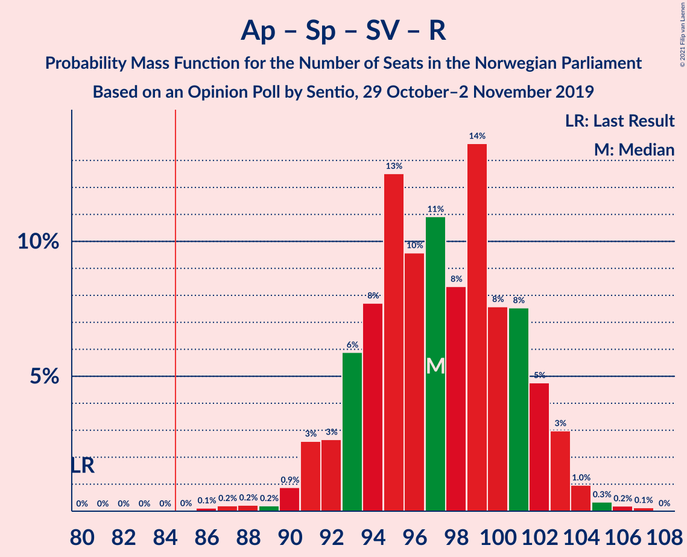

| Number of Seats | Probability | Accumulated | Special Marks |
|:---------------:|:-----------:|:-----------:|:-------------:|
| 80 | 0% | 100% | Last Result |
| 81 | 0% | 100% |  |
| 82 | 0% | 100% |  |
| 83 | 0% | 100% |  |
| 84 | 0% | 100% |  |
| 85 | 0% | 100% | Majority |
| 86 | 0.1% | 100% |  |
| 87 | 0.2% | 99.9% |  |
| 88 | 0.2% | 99.7% |  |
| 89 | 0.2% | 99.4% |  |
| 90 | 0.9% | 99.2% |  |
| 91 | 3% | 98% |  |
| 92 | 3% | 96% |  |
| 93 | 6% | 93% |  |
| 94 | 8% | 87% |  |
| 95 | 13% | 80% | Median |
| 96 | 10% | 67% |  |
| 97 | 11% | 57% |  |
| 98 | 8% | 46% |  |
| 99 | 14% | 38% |  |
| 100 | 8% | 25% |  |
| 101 | 8% | 17% |  |
| 102 | 5% | 9% |  |
| 103 | 3% | 5% |  |
| 104 | 1.0% | 2% |  |
| 105 | 0.3% | 0.7% |  |
| 106 | 0.2% | 0.4% |  |
| 107 | 0.1% | 0.2% |  |
| 108 | 0% | 0% |  |

### Arbeiderpartiet – Senterpartiet – Sosialistisk Venstreparti

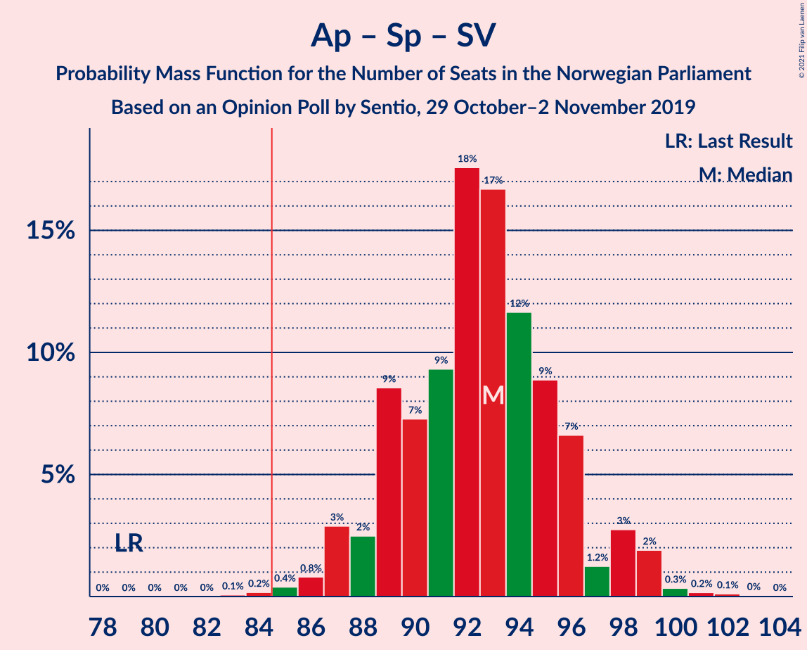

| Number of Seats | Probability | Accumulated | Special Marks |
|:---------------:|:-----------:|:-----------:|:-------------:|
| 79 | 0% | 100% | Last Result |
| 80 | 0% | 100% |  |
| 81 | 0% | 100% |  |
| 82 | 0% | 100% |  |
| 83 | 0.1% | 100% |  |
| 84 | 0.2% | 99.9% |  |
| 85 | 0.4% | 99.7% | Majority |
| 86 | 0.8% | 99.3% |  |
| 87 | 3% | 98.5% |  |
| 88 | 2% | 96% |  |
| 89 | 9% | 93% |  |
| 90 | 7% | 85% |  |
| 91 | 9% | 77% |  |
| 92 | 18% | 68% |  |
| 93 | 17% | 50% | Median |
| 94 | 12% | 34% |  |
| 95 | 9% | 22% |  |
| 96 | 7% | 13% |  |
| 97 | 1.2% | 7% |  |
| 98 | 3% | 5% |  |
| 99 | 2% | 3% |  |
| 100 | 0.3% | 0.7% |  |
| 101 | 0.2% | 0.3% |  |
| 102 | 0.1% | 0.2% |  |
| 103 | 0% | 0.1% |  |
| 104 | 0% | 0% |  |

### Arbeiderpartiet – Senterpartiet – Miljøpartiet De Grønne – Kristelig Folkeparti

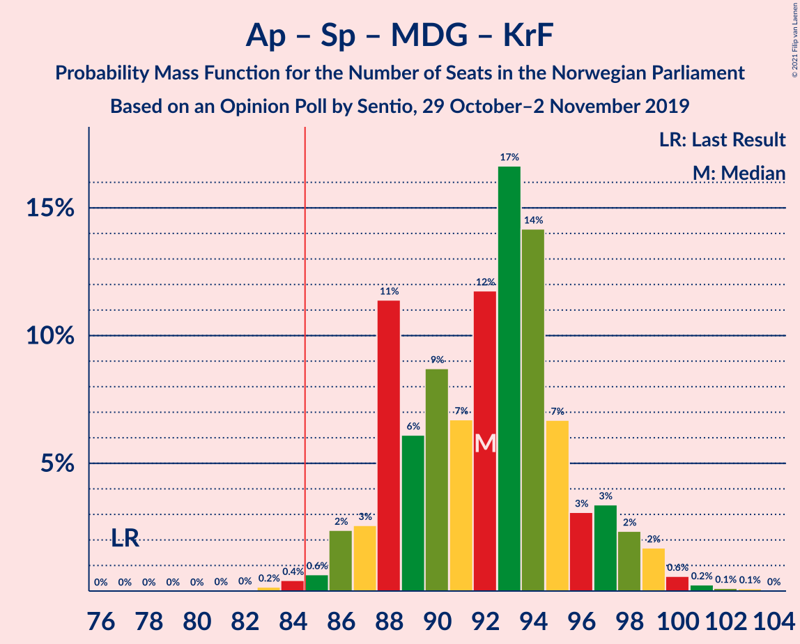

| Number of Seats | Probability | Accumulated | Special Marks |
|:---------------:|:-----------:|:-----------:|:-------------:|
| 77 | 0% | 100% | Last Result |
| 78 | 0% | 100% |  |
| 79 | 0% | 100% |  |
| 80 | 0% | 100% |  |
| 81 | 0% | 100% |  |
| 82 | 0% | 100% |  |
| 83 | 0.2% | 99.9% |  |
| 84 | 0.4% | 99.8% |  |
| 85 | 0.6% | 99.3% | Majority |
| 86 | 2% | 98.7% |  |
| 87 | 3% | 96% |  |
| 88 | 11% | 94% |  |
| 89 | 6% | 82% |  |
| 90 | 9% | 76% |  |
| 91 | 7% | 68% | Median |
| 92 | 12% | 61% |  |
| 93 | 17% | 49% |  |
| 94 | 14% | 32% |  |
| 95 | 7% | 18% |  |
| 96 | 3% | 12% |  |
| 97 | 3% | 8% |  |
| 98 | 2% | 5% |  |
| 99 | 2% | 3% |  |
| 100 | 0.6% | 1.1% |  |
| 101 | 0.2% | 0.5% |  |
| 102 | 0.1% | 0.2% |  |
| 103 | 0.1% | 0.1% |  |
| 104 | 0% | 0% |  |

### Arbeiderpartiet – Senterpartiet – Kristelig Folkeparti

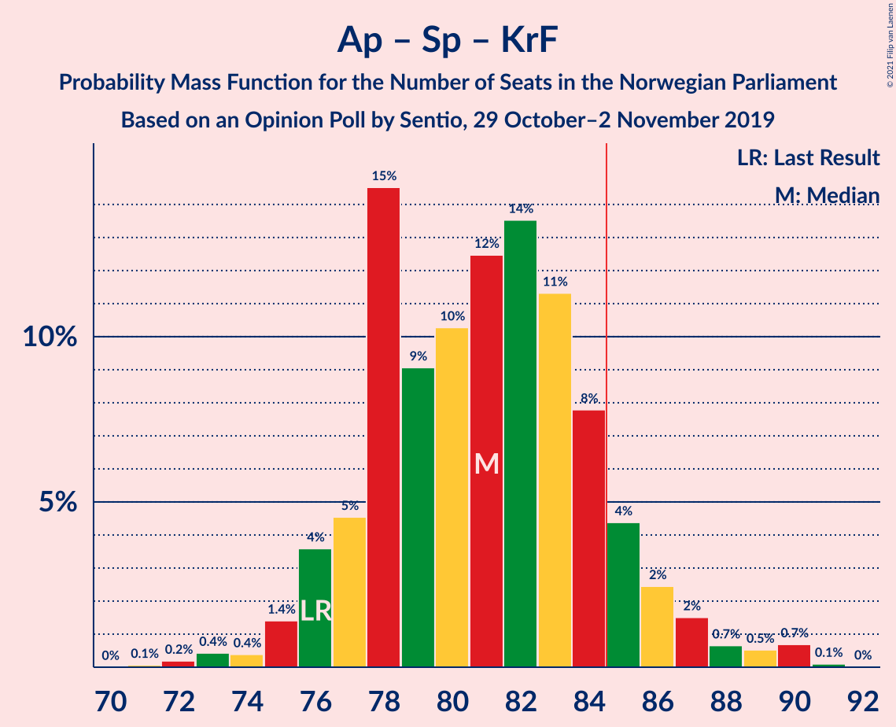

| Number of Seats | Probability | Accumulated | Special Marks |
|:---------------:|:-----------:|:-----------:|:-------------:|
| 71 | 0.1% | 100% |  |
| 72 | 0.2% | 99.9% |  |
| 73 | 0.4% | 99.7% |  |
| 74 | 0.4% | 99.3% |  |
| 75 | 1.4% | 98.9% |  |
| 76 | 4% | 97% | Last Result |
| 77 | 5% | 94% |  |
| 78 | 15% | 89% |  |
| 79 | 9% | 75% |  |
| 80 | 10% | 66% | Median |
| 81 | 12% | 55% |  |
| 82 | 14% | 43% |  |
| 83 | 11% | 29% |  |
| 84 | 8% | 18% |  |
| 85 | 4% | 10% | Majority |
| 86 | 2% | 6% |  |
| 87 | 2% | 4% |  |
| 88 | 0.7% | 2% |  |
| 89 | 0.5% | 1.4% |  |
| 90 | 0.7% | 0.8% |  |
| 91 | 0.1% | 0.1% |  |
| 92 | 0% | 0% |  |

### Arbeiderpartiet – Senterpartiet

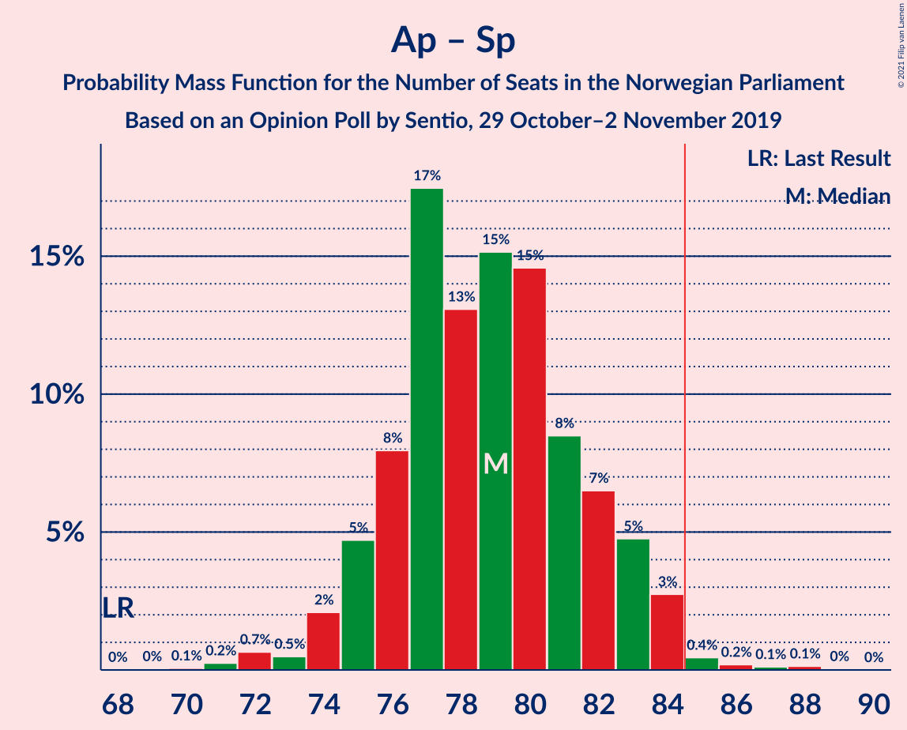

| Number of Seats | Probability | Accumulated | Special Marks |
|:---------------:|:-----------:|:-----------:|:-------------:|
| 68 | 0% | 100% | Last Result |
| 69 | 0% | 100% |  |
| 70 | 0.1% | 99.9% |  |
| 71 | 0.2% | 99.9% |  |
| 72 | 0.7% | 99.6% |  |
| 73 | 0.5% | 99.0% |  |
| 74 | 2% | 98% |  |
| 75 | 5% | 96% |  |
| 76 | 8% | 92% |  |
| 77 | 17% | 84% |  |
| 78 | 13% | 66% |  |
| 79 | 15% | 53% | Median |
| 80 | 15% | 38% |  |
| 81 | 8% | 23% |  |
| 82 | 7% | 15% |  |
| 83 | 5% | 8% |  |
| 84 | 3% | 4% |  |
| 85 | 0.4% | 0.9% | Majority |
| 86 | 0.2% | 0.5% |  |
| 87 | 0.1% | 0.3% |  |
| 88 | 0.1% | 0.2% |  |
| 89 | 0% | 0% |  |

### Høyre – Fremskrittspartiet – Miljøpartiet De Grønne – Venstre – Kristelig Folkeparti

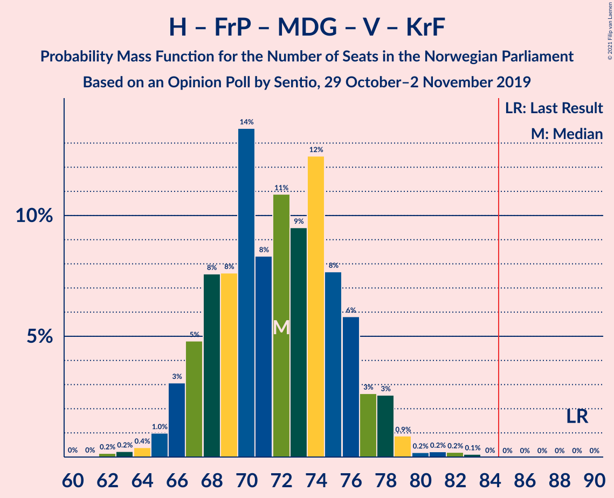

| Number of Seats | Probability | Accumulated | Special Marks |
|:---------------:|:-----------:|:-----------:|:-------------:|
| 62 | 0.2% | 100% |  |
| 63 | 0.2% | 99.8% |  |
| 64 | 0.4% | 99.6% |  |
| 65 | 1.0% | 99.2% |  |
| 66 | 3% | 98% |  |
| 67 | 5% | 95% |  |
| 68 | 8% | 90% |  |
| 69 | 8% | 83% |  |
| 70 | 14% | 75% |  |
| 71 | 8% | 61% |  |
| 72 | 11% | 53% | Median |
| 73 | 9% | 42% |  |
| 74 | 12% | 33% |  |
| 75 | 8% | 20% |  |
| 76 | 6% | 13% |  |
| 77 | 3% | 7% |  |
| 78 | 3% | 4% |  |
| 79 | 0.9% | 2% |  |
| 80 | 0.2% | 0.7% |  |
| 81 | 0.2% | 0.6% |  |
| 82 | 0.2% | 0.3% |  |
| 83 | 0.1% | 0.1% |  |
| 84 | 0% | 0% |  |
| 85 | 0% | 0% | Majority |
| 86 | 0% | 0% |  |
| 87 | 0% | 0% |  |
| 88 | 0% | 0% |  |
| 89 | 0% | 0% | Last Result |

### Arbeiderpartiet – Sosialistisk Venstreparti – Miljøpartiet De Grønne – Rødt

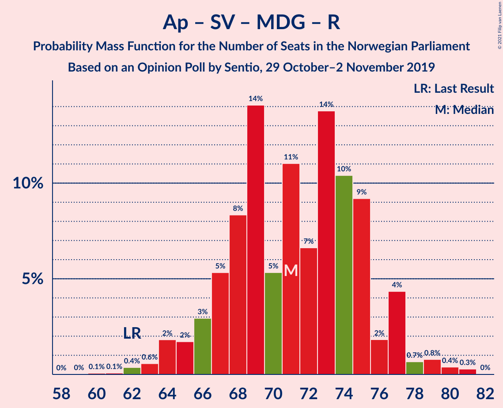

| Number of Seats | Probability | Accumulated | Special Marks |
|:---------------:|:-----------:|:-----------:|:-------------:|
| 60 | 0.1% | 100% |  |
| 61 | 0.1% | 99.9% |  |
| 62 | 0.4% | 99.8% | Last Result |
| 63 | 0.6% | 99.5% |  |
| 64 | 2% | 98.9% |  |
| 65 | 2% | 97% |  |
| 66 | 3% | 95% |  |
| 67 | 5% | 92% |  |
| 68 | 8% | 87% |  |
| 69 | 14% | 79% | Median |
| 70 | 5% | 65% |  |
| 71 | 11% | 59% |  |
| 72 | 7% | 48% |  |
| 73 | 14% | 42% |  |
| 74 | 10% | 28% |  |
| 75 | 9% | 18% |  |
| 76 | 2% | 8% |  |
| 77 | 4% | 7% |  |
| 78 | 0.7% | 2% |  |
| 79 | 0.8% | 1.5% |  |
| 80 | 0.4% | 0.7% |  |
| 81 | 0.3% | 0.3% |  |
| 82 | 0% | 0% |  |

### Høyre – Fremskrittspartiet – Venstre – Kristelig Folkeparti

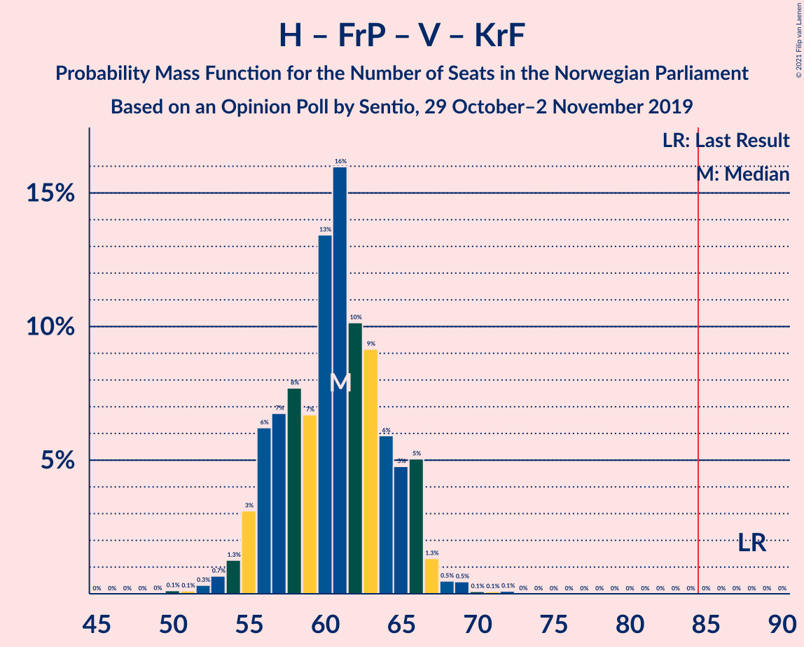

| Number of Seats | Probability | Accumulated | Special Marks |
|:---------------:|:-----------:|:-----------:|:-------------:|
| 50 | 0.1% | 100% |  |
| 51 | 0.1% | 99.9% |  |
| 52 | 0.3% | 99.8% |  |
| 53 | 0.7% | 99.4% |  |
| 54 | 1.3% | 98.8% |  |
| 55 | 3% | 97% |  |
| 56 | 6% | 94% |  |
| 57 | 7% | 88% |  |
| 58 | 8% | 81% |  |
| 59 | 7% | 74% |  |
| 60 | 13% | 67% |  |
| 61 | 16% | 54% | Median |
| 62 | 10% | 38% |  |
| 63 | 9% | 27% |  |
| 64 | 6% | 18% |  |
| 65 | 5% | 12% |  |
| 66 | 5% | 8% |  |
| 67 | 1.3% | 3% |  |
| 68 | 0.5% | 1.2% |  |
| 69 | 0.5% | 0.7% |  |
| 70 | 0.1% | 0.3% |  |
| 71 | 0.1% | 0.2% |  |
| 72 | 0.1% | 0.1% |  |
| 73 | 0% | 0% |  |
| 74 | 0% | 0% |  |
| 75 | 0% | 0% |  |
| 76 | 0% | 0% |  |
| 77 | 0% | 0% |  |
| 78 | 0% | 0% |  |
| 79 | 0% | 0% |  |
| 80 | 0% | 0% |  |
| 81 | 0% | 0% |  |
| 82 | 0% | 0% |  |
| 83 | 0% | 0% |  |
| 84 | 0% | 0% |  |
| 85 | 0% | 0% | Majority |
| 86 | 0% | 0% |  |
| 87 | 0% | 0% |  |
| 88 | 0% | 0% | Last Result |

### Høyre – Fremskrittspartiet – Venstre

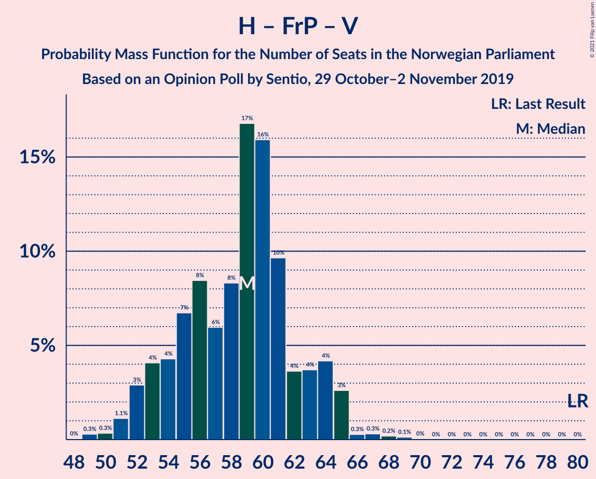

| Number of Seats | Probability | Accumulated | Special Marks |
|:---------------:|:-----------:|:-----------:|:-------------:|
| 48 | 0% | 100% |  |
| 49 | 0.3% | 99.9% |  |
| 50 | 0.3% | 99.7% |  |
| 51 | 1.1% | 99.3% |  |
| 52 | 3% | 98% |  |
| 53 | 4% | 95% |  |
| 54 | 4% | 91% |  |
| 55 | 7% | 87% |  |
| 56 | 8% | 80% |  |
| 57 | 6% | 72% |  |
| 58 | 8% | 66% |  |
| 59 | 17% | 57% |  |
| 60 | 16% | 41% | Median |
| 61 | 10% | 25% |  |
| 62 | 4% | 15% |  |
| 63 | 4% | 11% |  |
| 64 | 4% | 8% |  |
| 65 | 3% | 4% |  |
| 66 | 0.3% | 1.0% |  |
| 67 | 0.3% | 0.7% |  |
| 68 | 0.2% | 0.4% |  |
| 69 | 0.1% | 0.2% |  |
| 70 | 0% | 0.1% |  |
| 71 | 0% | 0% |  |
| 72 | 0% | 0% |  |
| 73 | 0% | 0% |  |
| 74 | 0% | 0% |  |
| 75 | 0% | 0% |  |
| 76 | 0% | 0% |  |
| 77 | 0% | 0% |  |
| 78 | 0% | 0% |  |
| 79 | 0% | 0% |  |
| 80 | 0% | 0% | Last Result |

### Arbeiderpartiet – Sosialistisk Venstreparti

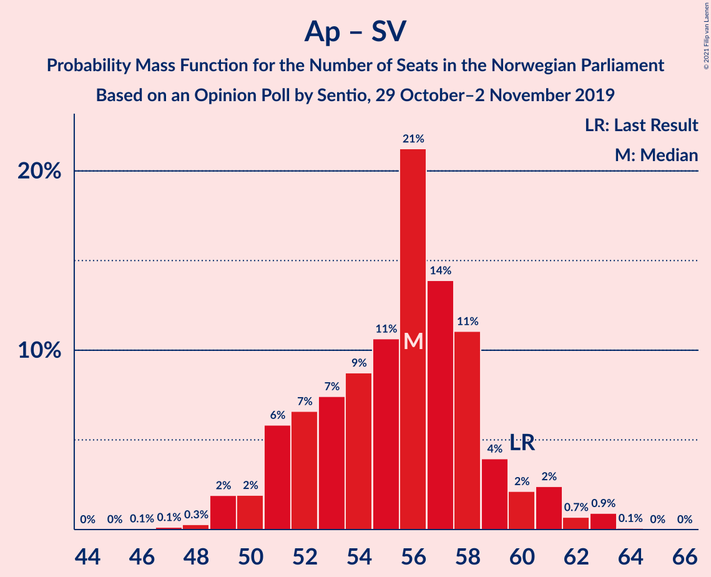

| Number of Seats | Probability | Accumulated | Special Marks |
|:---------------:|:-----------:|:-----------:|:-------------:|
| 46 | 0.1% | 100% |  |
| 47 | 0.1% | 99.9% |  |
| 48 | 0.3% | 99.8% |  |
| 49 | 2% | 99.5% |  |
| 50 | 2% | 98% |  |
| 51 | 6% | 96% |  |
| 52 | 7% | 90% |  |
| 53 | 7% | 83% |  |
| 54 | 9% | 76% |  |
| 55 | 11% | 67% |  |
| 56 | 21% | 56% | Median |
| 57 | 14% | 35% |  |
| 58 | 11% | 21% |  |
| 59 | 4% | 10% |  |
| 60 | 2% | 6% | Last Result |
| 61 | 2% | 4% |  |
| 62 | 0.7% | 2% |  |
| 63 | 0.9% | 1.0% |  |
| 64 | 0.1% | 0.1% |  |
| 65 | 0% | 0% |  |

### Høyre – Fremskrittspartiet

| Number of Seats | Probability | Accumulated | Special Marks |
|:---------------:|:-----------:|:-----------:|:-------------:|
| 45 | 0.1% | 100% |  |
| 46 | 0.4% | 99.9% |  |
| 47 | 2% | 99.5% |  |
| 48 | 2% | 97% |  |
| 49 | 3% | 95% |  |
| 50 | 7% | 92% |  |
| 51 | 15% | 85% |  |
| 52 | 8% | 71% |  |
| 53 | 18% | 63% | Median |
| 54 | 11% | 44% |  |
| 55 | 6% | 33% |  |
| 56 | 9% | 27% |  |
| 57 | 7% | 18% |  |
| 58 | 5% | 11% |  |
| 59 | 3% | 6% |  |
| 60 | 2% | 3% |  |
| 61 | 0.6% | 1.1% |  |
| 62 | 0.2% | 0.5% |  |
| 63 | 0.3% | 0.4% |  |
| 64 | 0% | 0% |  |
| 65 | 0% | 0% |  |
| 66 | 0% | 0% |  |
| 67 | 0% | 0% |  |
| 68 | 0% | 0% |  |
| 69 | 0% | 0% |  |
| 70 | 0% | 0% |  |
| 71 | 0% | 0% |  |
| 72 | 0% | 0% | Last Result |

### Høyre – Venstre – Kristelig Folkeparti

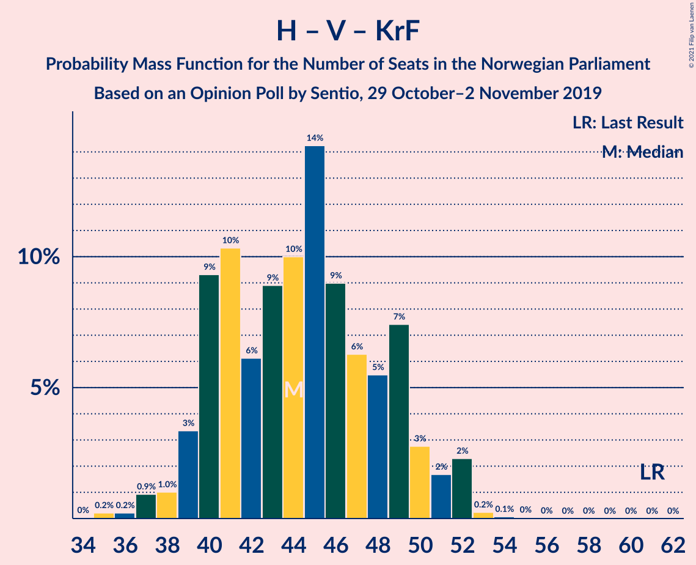

| Number of Seats | Probability | Accumulated | Special Marks |
|:---------------:|:-----------:|:-----------:|:-------------:|
| 35 | 0.2% | 100% |  |
| 36 | 0.2% | 99.7% |  |
| 37 | 0.9% | 99.5% |  |
| 38 | 1.0% | 98.6% |  |
| 39 | 3% | 98% |  |
| 40 | 9% | 94% |  |
| 41 | 10% | 85% |  |
| 42 | 6% | 75% |  |
| 43 | 9% | 68% |  |
| 44 | 10% | 60% |  |
| 45 | 14% | 50% | Median |
| 46 | 9% | 35% |  |
| 47 | 6% | 26% |  |
| 48 | 5% | 20% |  |
| 49 | 7% | 15% |  |
| 50 | 3% | 7% |  |
| 51 | 2% | 4% |  |
| 52 | 2% | 3% |  |
| 53 | 0.2% | 0.4% |  |
| 54 | 0.1% | 0.1% |  |
| 55 | 0% | 0.1% |  |
| 56 | 0% | 0% |  |
| 57 | 0% | 0% |  |
| 58 | 0% | 0% |  |
| 59 | 0% | 0% |  |
| 60 | 0% | 0% |  |
| 61 | 0% | 0% | Last Result |

### Senterpartiet – Venstre – Kristelig Folkeparti

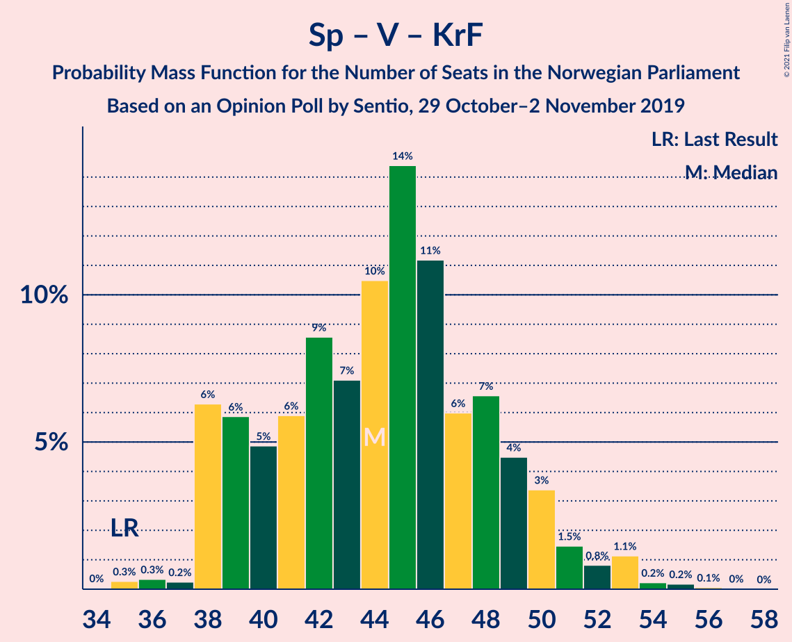

| Number of Seats | Probability | Accumulated | Special Marks |
|:---------------:|:-----------:|:-----------:|:-------------:|
| 34 | 0% | 100% |  |
| 35 | 0.3% | 99.9% | Last Result |
| 36 | 0.3% | 99.7% |  |
| 37 | 0.2% | 99.3% |  |
| 38 | 6% | 99.1% |  |
| 39 | 6% | 93% |  |
| 40 | 5% | 87% |  |
| 41 | 6% | 82% |  |
| 42 | 9% | 76% |  |
| 43 | 7% | 68% |  |
| 44 | 10% | 60% |  |
| 45 | 14% | 50% | Median |
| 46 | 11% | 36% |  |
| 47 | 6% | 24% |  |
| 48 | 7% | 18% |  |
| 49 | 4% | 12% |  |
| 50 | 3% | 7% |  |
| 51 | 1.5% | 4% |  |
| 52 | 0.8% | 2% |  |
| 53 | 1.1% | 2% |  |
| 54 | 0.2% | 0.5% |  |
| 55 | 0.2% | 0.3% |  |
| 56 | 0.1% | 0.1% |  |
| 57 | 0% | 0% |  |

## Technical Information

### Opinion Poll

+ **Polling firm:** Sentio
+ **Commissioner(s):** —
+ **Fieldwork period:** 29 October–2 November 2019

### Calculations

+ **Sample size:** 1000
+ **Simulations done:** 1,048,576
+ **Error estimate:** 1.02%

