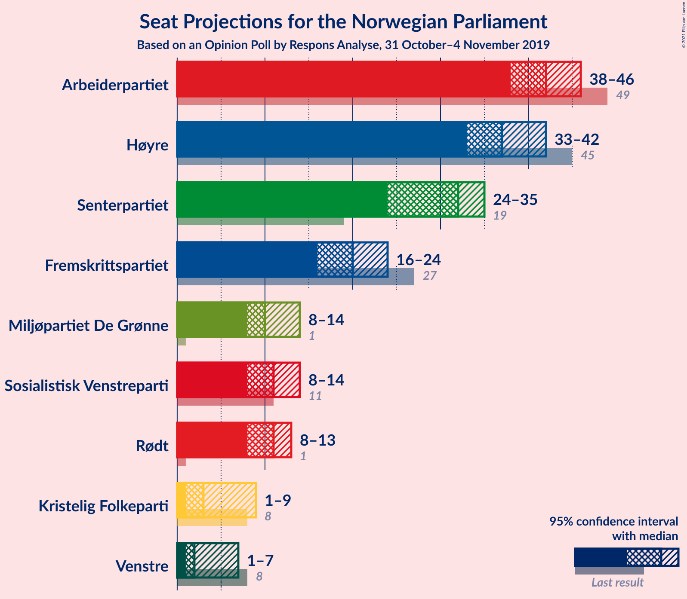
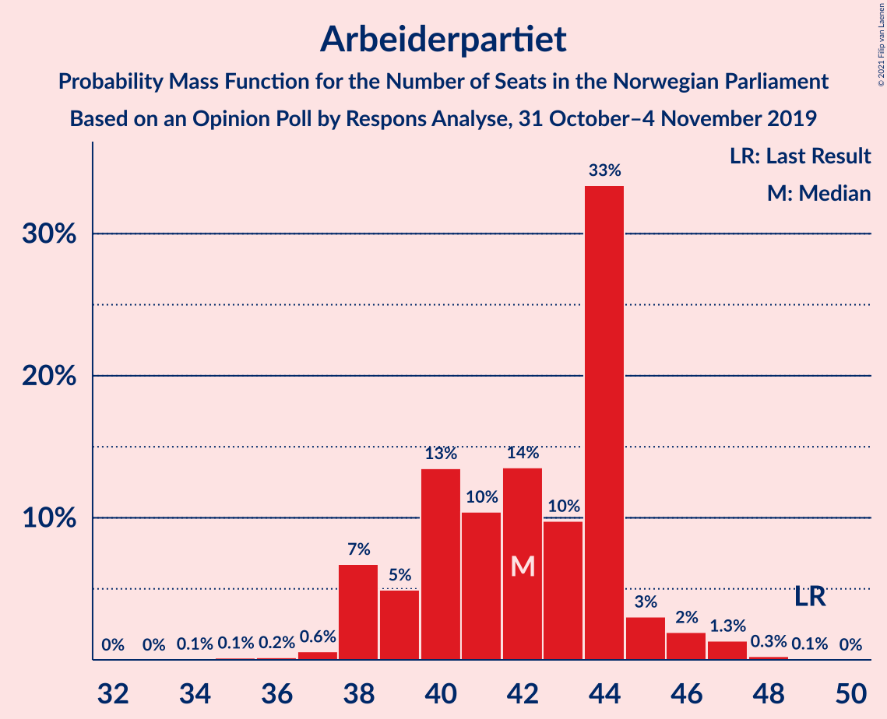
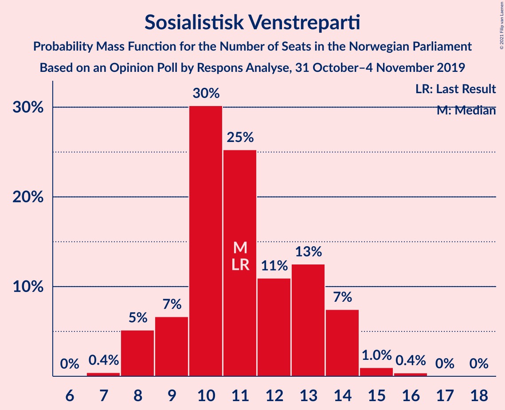
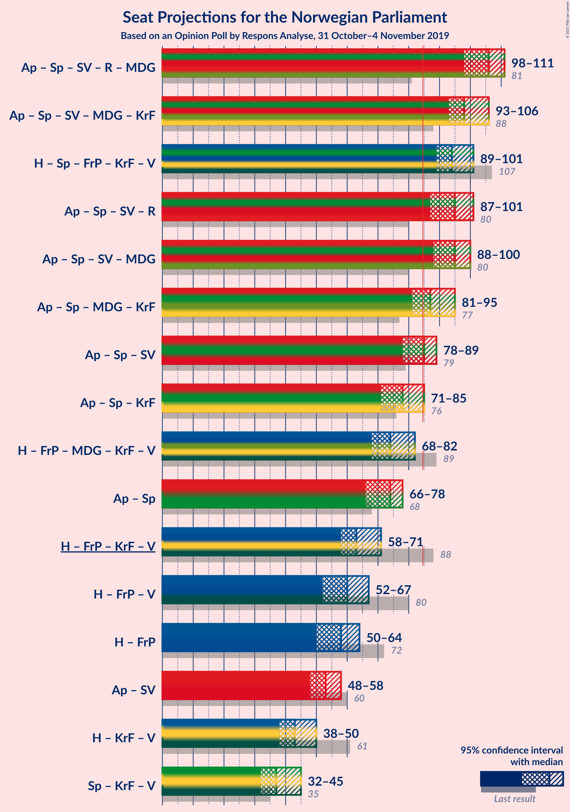
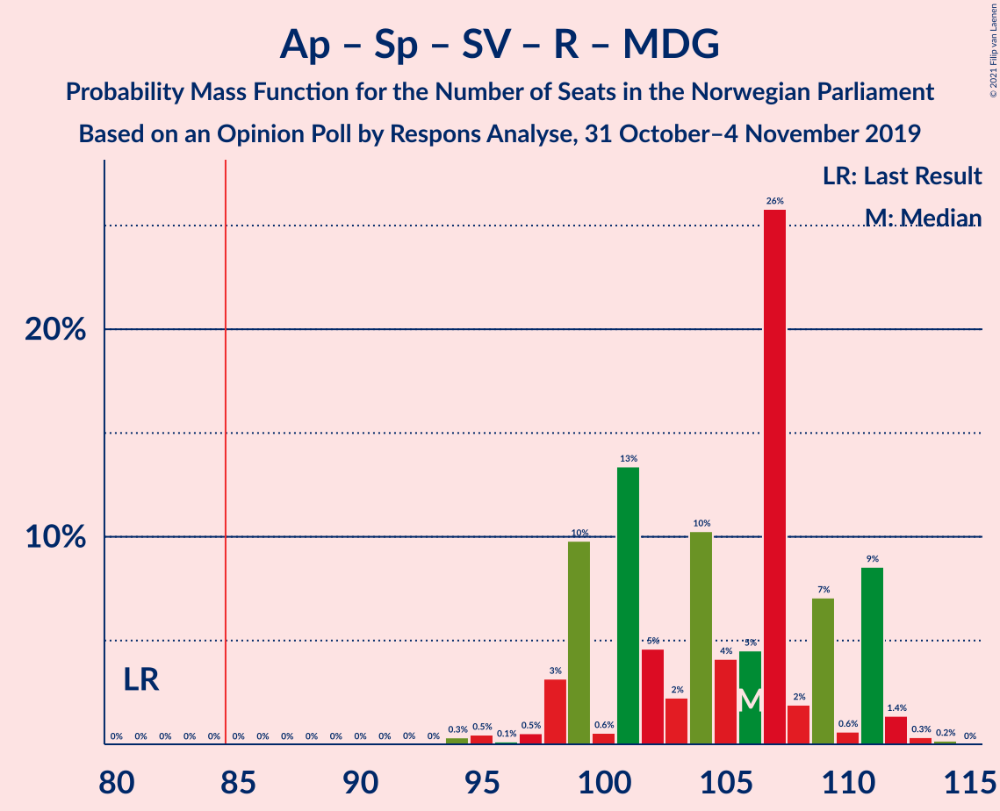
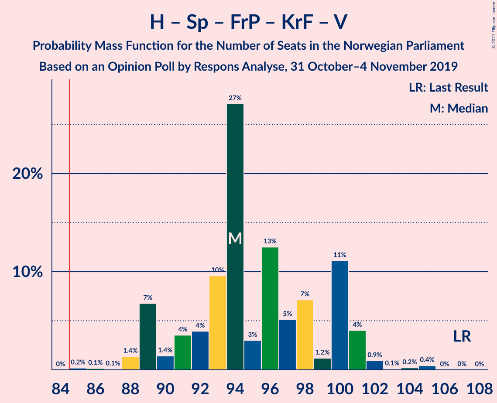
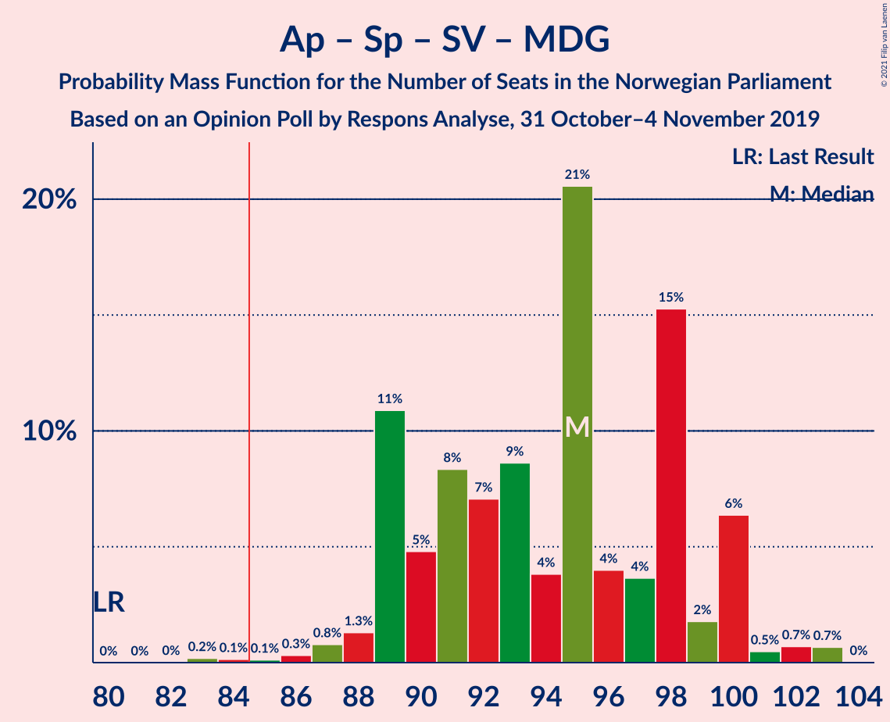
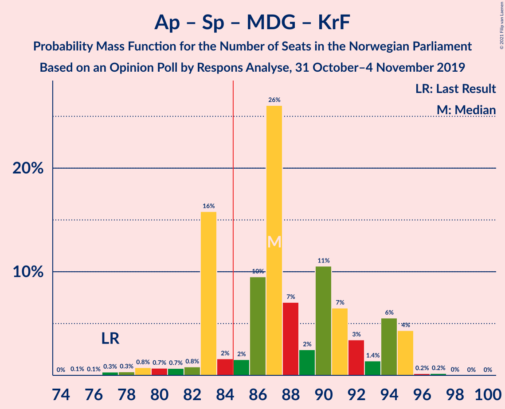
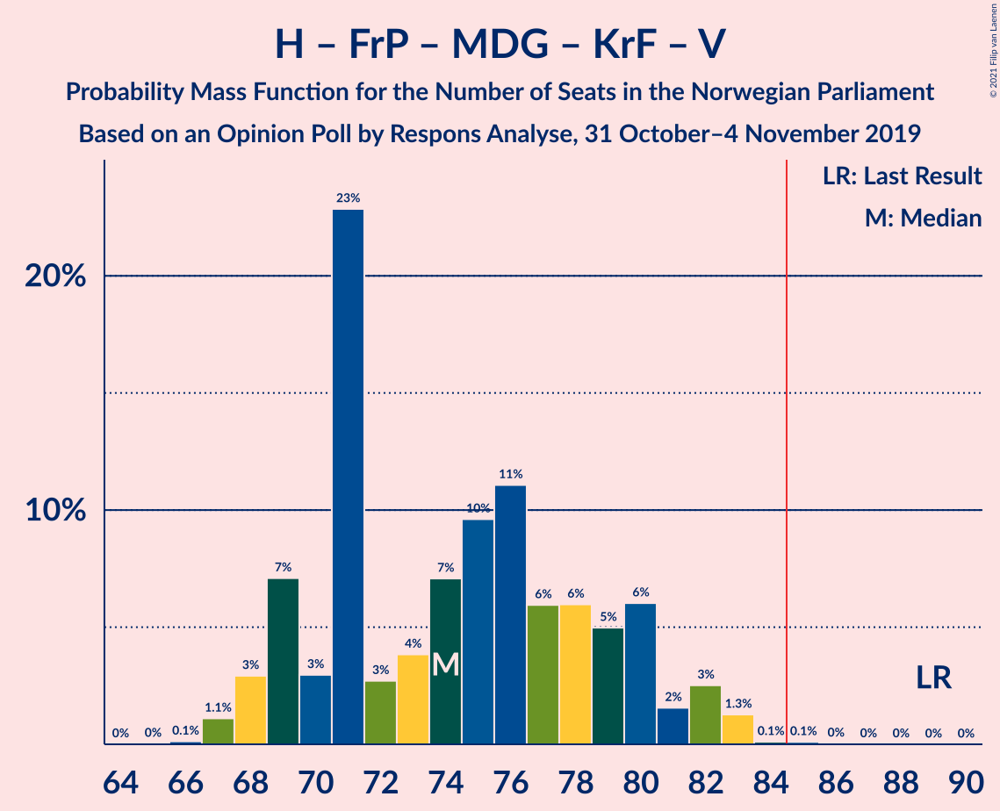
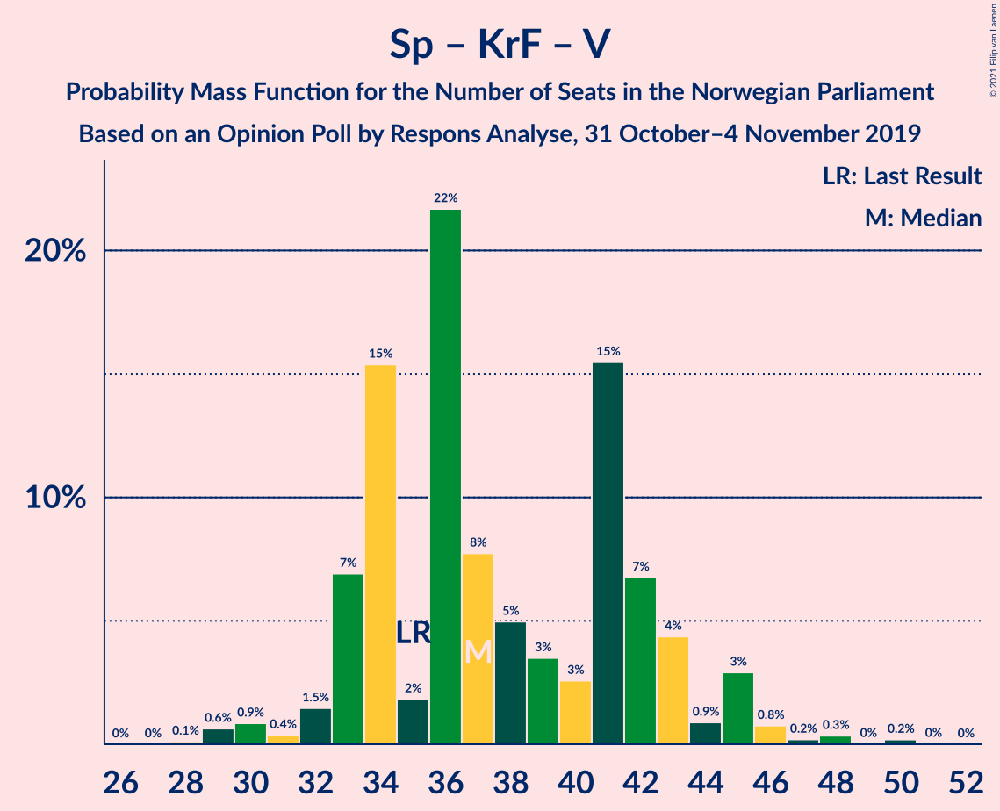

# Opinion Poll by Respons Analyse, 31 October–4 November 2019

<a href="#voting-intentions">Voting Intentions</a> | <a href="#seats">Seats</a> | <a href="#coalitions">Coalitions</a> | <a href="#technical-information">Technical Information</a>

## Voting Intentions

### Confidence Intervals

| Party | Last Result | Poll Result | 80% Confidence Interval | 90% Confidence Interval | 95% Confidence Interval | 99% Confidence Interval |
|:-----:|:-----------:|:-----------:|:-----------------------:|:-----------------------:|:-----------------------:|:-----------------------:|
| Arbeiderpartiet | 27.4% | 23.0% | 21.4–24.8% |20.9–25.3% |20.5–25.7% |19.8–26.6% |
| Høyre | 25.0% | 21.3% | 19.7–23.1% |19.3–23.6% |18.9–24.0% |18.2–24.8% |
| Senterpartiet | 10.3% | 16.5% | 15.0–18.0% |14.6–18.5% |14.3–18.9% |13.6–19.7% |
| Fremskrittspartiet | 15.2% | 11.4% | 10.2–12.8% |9.8–13.1% |9.5–13.5% |9.0–14.2% |
| Sosialistisk Venstreparti | 6.0% | 6.5% | 5.6–7.6% |5.3–7.9% |5.1–8.2% |4.7–8.7% |
| Rødt | 2.4% | 6.0% | 5.1–7.1% |4.9–7.4% |4.7–7.6% |4.3–8.2% |
| Miljøpartiet De Grønne | 3.2% | 5.9% | 5.0–7.0% |4.8–7.3% |4.6–7.5% |4.2–8.1% |
| Kristelig Folkeparti | 4.2% | 3.9% | 3.2–4.8% |3.0–5.0% |2.9–5.3% |2.6–5.7% |
| Venstre | 4.4% | 3.2% | 2.6–4.0% |2.4–4.3% |2.3–4.5% |2.0–4.9% |

*Note:* The poll result column reflects the actual value used in the calculations. Published results may vary slightly, and in addition be rounded to fewer digits.

## Seats

### Confidence Intervals

| Party | Last Result | Median | 80% Confidence Interval | 90% Confidence Interval | 95% Confidence Interval | 99% Confidence Interval |
|:-----:|:-----------:|:------:|:-----------------------:|:-----------------------:|:-----------------------:|:-----------------------:|
| <a href="#arbeiderpartiet">Arbeiderpartiet</a> | 49 | 42 | 39–44 |38–45 |38–46 |37–47 |
| <a href="#høyre">Høyre</a> | 45 | 37 | 34–40 |33–41 |33–42 |31–44 |
| <a href="#senterpartiet">Senterpartiet</a> | 19 | 32 | 26–34 |24–34 |24–35 |24–36 |
| <a href="#fremskrittspartiet">Fremskrittspartiet</a> | 27 | 20 | 17–23 |16–23 |16–24 |15–25 |
| <a href="#sosialistisk-venstreparti">Sosialistisk Venstreparti</a> | 11 | 11 | 9–13 |8–14 |8–14 |8–15 |
| <a href="#rødt">Rødt</a> | 1 | 11 | 9–12 |8–13 |8–13 |7–14 |
| <a href="#miljøpartiet-de-grønne">Miljøpartiet De Grønne</a> | 1 | 10 | 8–12 |8–13 |8–14 |7–14 |
| <a href="#kristelig-folkeparti">Kristelig Folkeparti</a> | 8 | 3 | 1–8 |1–8 |1–9 |1–9 |
| <a href="#venstre">Venstre</a> | 8 | 2 | 2 |2–7 |1–7 |1–8 |

### Arbeiderpartiet

*For a full overview of the results for this party, see the [Arbeiderpartiet](party-arbeiderpartiet.html) page.*

| Number of Seats | Probability | Accumulated | Special Marks |
|:---------------:|:-----------:|:-----------:|:-------------:|
| 34 | 0.1% | 100% |  |
| 35 | 0.1% | 99.9% |  |
| 36 | 0.2% | 99.8% |  |
| 37 | 0.6% | 99.6% |  |
| 38 | 7% | 99.0% |  |
| 39 | 5% | 92% |  |
| 40 | 13% | 87% |  |
| 41 | 10% | 74% |  |
| 42 | 14% | 63% | Median |
| 43 | 10% | 50% |  |
| 44 | 33% | 40% |  |
| 45 | 3% | 7% |  |
| 46 | 2% | 4% |  |
| 47 | 1.3% | 2% |  |
| 48 | 0.3% | 0.4% |  |
| 49 | 0.1% | 0.1% | Last Result |
| 50 | 0% | 0% |  |

### Høyre

*For a full overview of the results for this party, see the [Høyre](party-høyre.html) page.*

| Number of Seats | Probability | Accumulated | Special Marks |
|:---------------:|:-----------:|:-----------:|:-------------:|
| 30 | 0.2% | 100% |  |
| 31 | 0.5% | 99.8% |  |
| 32 | 1.4% | 99.3% |  |
| 33 | 5% | 98% |  |
| 34 | 4% | 93% |  |
| 35 | 5% | 89% |  |
| 36 | 23% | 85% |  |
| 37 | 12% | 61% | Median |
| 38 | 11% | 50% |  |
| 39 | 11% | 38% |  |
| 40 | 20% | 27% |  |
| 41 | 5% | 8% |  |
| 42 | 1.0% | 3% |  |
| 43 | 1.1% | 2% |  |
| 44 | 0.5% | 0.6% |  |
| 45 | 0.1% | 0.2% | Last Result |
| 46 | 0% | 0.1% |  |
| 47 | 0% | 0% |  |

### Senterpartiet

*For a full overview of the results for this party, see the [Senterpartiet](party-senterpartiet.html) page.*

| Number of Seats | Probability | Accumulated | Special Marks |
|:---------------:|:-----------:|:-----------:|:-------------:|
| 19 | 0% | 100% | Last Result |
| 20 | 0% | 100% |  |
| 21 | 0% | 100% |  |
| 22 | 0% | 100% |  |
| 23 | 0.3% | 100% |  |
| 24 | 6% | 99.6% |  |
| 25 | 2% | 93% |  |
| 26 | 4% | 91% |  |
| 27 | 2% | 88% |  |
| 28 | 1.3% | 85% |  |
| 29 | 4% | 84% |  |
| 30 | 5% | 80% |  |
| 31 | 21% | 75% |  |
| 32 | 33% | 54% | Median |
| 33 | 8% | 21% |  |
| 34 | 8% | 12% |  |
| 35 | 2% | 4% |  |
| 36 | 2% | 2% |  |
| 37 | 0.1% | 0.1% |  |
| 38 | 0% | 0% |  |

### Fremskrittspartiet

*For a full overview of the results for this party, see the [Fremskrittspartiet](party-fremskrittspartiet.html) page.*

| Number of Seats | Probability | Accumulated | Special Marks |
|:---------------:|:-----------:|:-----------:|:-------------:|
| 14 | 0.4% | 100% |  |
| 15 | 2% | 99.6% |  |
| 16 | 7% | 98% |  |
| 17 | 12% | 91% |  |
| 18 | 13% | 79% |  |
| 19 | 9% | 66% |  |
| 20 | 14% | 57% | Median |
| 21 | 8% | 43% |  |
| 22 | 22% | 35% |  |
| 23 | 9% | 13% |  |
| 24 | 2% | 5% |  |
| 25 | 2% | 2% |  |
| 26 | 0.4% | 0.4% |  |
| 27 | 0% | 0.1% | Last Result |
| 28 | 0% | 0% |  |

### Sosialistisk Venstreparti

*For a full overview of the results for this party, see the [Sosialistisk Venstreparti](party-sosialistiskvenstreparti.html) page.*

| Number of Seats | Probability | Accumulated | Special Marks |
|:---------------:|:-----------:|:-----------:|:-------------:|
| 7 | 0.4% | 100% |  |
| 8 | 5% | 99.6% |  |
| 9 | 7% | 94% |  |
| 10 | 30% | 88% |  |
| 11 | 25% | 58% | Last Result, Median |
| 12 | 11% | 32% |  |
| 13 | 13% | 21% |  |
| 14 | 7% | 9% |  |
| 15 | 1.0% | 1.4% |  |
| 16 | 0.4% | 0.4% |  |
| 17 | 0% | 0.1% |  |
| 18 | 0% | 0% |  |

### Rødt

*For a full overview of the results for this party, see the [Rødt](party-rødt.html) page.*

| Number of Seats | Probability | Accumulated | Special Marks |
|:---------------:|:-----------:|:-----------:|:-------------:|
| 1 | 0% | 100% | Last Result |
| 2 | 0.1% | 100% |  |
| 3 | 0% | 99.9% |  |
| 4 | 0% | 99.9% |  |
| 5 | 0% | 99.9% |  |
| 6 | 0% | 99.9% |  |
| 7 | 0.9% | 99.9% |  |
| 8 | 6% | 99.0% |  |
| 9 | 16% | 93% |  |
| 10 | 24% | 77% |  |
| 11 | 24% | 53% | Median |
| 12 | 22% | 29% |  |
| 13 | 6% | 7% |  |
| 14 | 0.5% | 0.7% |  |
| 15 | 0.2% | 0.2% |  |
| 16 | 0% | 0% |  |

### Miljøpartiet De Grønne

*For a full overview of the results for this party, see the [Miljøpartiet De Grønne](party-miljøpartietdegrønne.html) page.*

| Number of Seats | Probability | Accumulated | Special Marks |
|:---------------:|:-----------:|:-----------:|:-------------:|
| 1 | 0% | 100% | Last Result |
| 2 | 0.1% | 100% |  |
| 3 | 0.1% | 99.9% |  |
| 4 | 0% | 99.8% |  |
| 5 | 0% | 99.8% |  |
| 6 | 0% | 99.8% |  |
| 7 | 0.8% | 99.8% |  |
| 8 | 12% | 99.1% |  |
| 9 | 32% | 87% |  |
| 10 | 16% | 56% | Median |
| 11 | 23% | 39% |  |
| 12 | 8% | 17% |  |
| 13 | 6% | 9% |  |
| 14 | 3% | 3% |  |
| 15 | 0.1% | 0.2% |  |
| 16 | 0% | 0% |  |

### Kristelig Folkeparti

*For a full overview of the results for this party, see the [Kristelig Folkeparti](party-kristeligfolkeparti.html) page.*

| Number of Seats | Probability | Accumulated | Special Marks |
|:---------------:|:-----------:|:-----------:|:-------------:|
| 0 | 0.1% | 100% |  |
| 1 | 16% | 99.9% |  |
| 2 | 24% | 84% |  |
| 3 | 15% | 59% | Median |
| 4 | 0% | 44% |  |
| 5 | 0% | 44% |  |
| 6 | 0.3% | 44% |  |
| 7 | 21% | 44% |  |
| 8 | 20% | 23% | Last Result |
| 9 | 3% | 4% |  |
| 10 | 0.2% | 0.3% |  |
| 11 | 0% | 0% |  |

### Venstre

*For a full overview of the results for this party, see the [Venstre](party-venstre.html) page.*

| Number of Seats | Probability | Accumulated | Special Marks |
|:---------------:|:-----------:|:-----------:|:-------------:|
| 0 | 0.1% | 100% |  |
| 1 | 5% | 99.9% |  |
| 2 | 89% | 95% | Median |
| 3 | 0.4% | 7% |  |
| 4 | 0.1% | 6% |  |
| 5 | 0% | 6% |  |
| 6 | 0.3% | 6% |  |
| 7 | 4% | 6% |  |
| 8 | 1.3% | 2% | Last Result |
| 9 | 0.2% | 0.2% |  |
| 10 | 0% | 0% |  |

## Coalitions

### Confidence Intervals

| Coalition | Last Result | Median | Majority? | 80% Confidence Interval | 90% Confidence Interval | 95% Confidence Interval | 99% Confidence Interval |
|:---------:|:-----------:|:------:|:---------:|:-----------------------:|:-----------------------:|:-----------------------:|:-----------------------:|
| Arbeiderpartiet – Senterpartiet – Sosialistisk Venstreparti – Rødt – Miljøpartiet De Grønne | 81 | 106 | 100% | 99–111 | 99–111 | 98–111 | 95–113 |
| Arbeiderpartiet – Senterpartiet – Sosialistisk Venstreparti – Miljøpartiet De Grønne – Kristelig Folkeparti | 88 | 98 | 100% | 94–104 | 94–105 | 93–106 | 89–107 |
| Høyre – Senterpartiet – Fremskrittspartiet – Kristelig Folkeparti – Venstre | 107 | 94 | 100% | 91–100 | 89–101 | 89–101 | 88–104 |
| Arbeiderpartiet – Senterpartiet – Sosialistisk Venstreparti – Rødt | 80 | 95 | 99.8% | 89–100 | 88–100 | 87–101 | 86–102 |
| Arbeiderpartiet – Senterpartiet – Sosialistisk Venstreparti – Miljøpartiet De Grønne | 80 | 95 | 99.6% | 89–99 | 89–100 | 88–100 | 86–103 |
| Arbeiderpartiet – Senterpartiet – Miljøpartiet De Grønne – Kristelig Folkeparti | 77 | 87 | 79% | 83–94 | 83–94 | 81–95 | 78–95 |
| Arbeiderpartiet – Senterpartiet – Sosialistisk Venstreparti | 79 | 85 | 52% | 79–89 | 79–89 | 78–89 | 75–92 |
| Arbeiderpartiet – Senterpartiet – Kristelig Folkeparti | 76 | 78 | 3% | 72–83 | 72–84 | 71–85 | 67–87 |
| Høyre – Fremskrittspartiet – Miljøpartiet De Grønne – Kristelig Folkeparti – Venstre | 89 | 74 | 0.2% | 69–80 | 69–81 | 68–82 | 67–83 |
| Arbeiderpartiet – Senterpartiet | 68 | 74 | 0% | 68–76 | 66–78 | 66–78 | 64–80 |
| Høyre – Fremskrittspartiet – Kristelig Folkeparti – Venstre | 88 | 63 | 0% | 58–70 | 58–70 | 58–71 | 56–74 |
| Høyre – Fremskrittspartiet – Venstre | 80 | 60 | 0% | 55–64 | 54–65 | 52–67 | 52–69 |
| Høyre – Fremskrittspartiet | 72 | 58 | 0% | 53–62 | 51–62 | 50–64 | 50–66 |
| Arbeiderpartiet – Sosialistisk Venstreparti | 60 | 53 | 0% | 49–57 | 49–58 | 48–58 | 47–60 |
| Høyre – Kristelig Folkeparti – Venstre | 61 | 43 | 0% | 40–50 | 40–50 | 38–50 | 36–55 |
| Senterpartiet – Kristelig Folkeparti – Venstre | 35 | 37 | 0% | 33–42 | 33–44 | 32–45 | 29–48 |

### Arbeiderpartiet – Senterpartiet – Sosialistisk Venstreparti – Rødt – Miljøpartiet De Grønne

| Number of Seats | Probability | Accumulated | Special Marks |
|:---------------:|:-----------:|:-----------:|:-------------:|
| 81 | 0% | 100% | Last Result |
| 82 | 0% | 100% |  |
| 83 | 0% | 100% |  |
| 84 | 0% | 100% |  |
| 85 | 0% | 100% | Majority |
| 86 | 0% | 100% |  |
| 87 | 0% | 100% |  |
| 88 | 0% | 100% |  |
| 89 | 0% | 100% |  |
| 90 | 0% | 100% |  |
| 91 | 0% | 100% |  |
| 92 | 0% | 100% |  |
| 93 | 0% | 100% |  |
| 94 | 0.3% | 100% |  |
| 95 | 0.5% | 99.6% |  |
| 96 | 0.1% | 99.2% |  |
| 97 | 0.5% | 99.0% |  |
| 98 | 3% | 98.5% |  |
| 99 | 10% | 95% |  |
| 100 | 0.6% | 86% |  |
| 101 | 13% | 85% |  |
| 102 | 5% | 72% |  |
| 103 | 2% | 67% |  |
| 104 | 10% | 65% |  |
| 105 | 4% | 54% |  |
| 106 | 5% | 50% | Median |
| 107 | 26% | 46% |  |
| 108 | 2% | 20% |  |
| 109 | 7% | 18% |  |
| 110 | 0.6% | 11% |  |
| 111 | 9% | 10% |  |
| 112 | 1.4% | 2% |  |
| 113 | 0.3% | 0.5% |  |
| 114 | 0.2% | 0.2% |  |
| 115 | 0% | 0% |  |

### Arbeiderpartiet – Senterpartiet – Sosialistisk Venstreparti – Miljøpartiet De Grønne – Kristelig Folkeparti

| Number of Seats | Probability | Accumulated | Special Marks |
|:---------------:|:-----------:|:-----------:|:-------------:|
| 86 | 0.1% | 100% |  |
| 87 | 0% | 99.9% |  |
| 88 | 0% | 99.9% | Last Result |
| 89 | 0.4% | 99.9% |  |
| 90 | 0.5% | 99.5% |  |
| 91 | 0.3% | 99.0% |  |
| 92 | 0.6% | 98.7% |  |
| 93 | 2% | 98% |  |
| 94 | 9% | 96% |  |
| 95 | 1.4% | 87% |  |
| 96 | 9% | 86% |  |
| 97 | 21% | 76% |  |
| 98 | 10% | 55% | Median |
| 99 | 5% | 45% |  |
| 100 | 10% | 40% |  |
| 101 | 13% | 30% |  |
| 102 | 3% | 17% |  |
| 103 | 2% | 14% |  |
| 104 | 4% | 13% |  |
| 105 | 5% | 9% |  |
| 106 | 3% | 3% |  |
| 107 | 0.5% | 0.7% |  |
| 108 | 0.1% | 0.2% |  |
| 109 | 0% | 0.1% |  |
| 110 | 0% | 0% |  |

### Høyre – Senterpartiet – Fremskrittspartiet – Kristelig Folkeparti – Venstre

| Number of Seats | Probability | Accumulated | Special Marks |
|:---------------:|:-----------:|:-----------:|:-------------:|
| 85 | 0.2% | 100% | Majority |
| 86 | 0.1% | 99.8% |  |
| 87 | 0.1% | 99.7% |  |
| 88 | 1.4% | 99.6% |  |
| 89 | 7% | 98% |  |
| 90 | 1.4% | 91% |  |
| 91 | 4% | 90% |  |
| 92 | 4% | 86% |  |
| 93 | 10% | 83% |  |
| 94 | 27% | 73% | Median |
| 95 | 3% | 46% |  |
| 96 | 13% | 43% |  |
| 97 | 5% | 30% |  |
| 98 | 7% | 25% |  |
| 99 | 1.2% | 18% |  |
| 100 | 11% | 17% |  |
| 101 | 4% | 6% |  |
| 102 | 0.9% | 2% |  |
| 103 | 0.1% | 0.8% |  |
| 104 | 0.2% | 0.7% |  |
| 105 | 0.4% | 0.5% |  |
| 106 | 0% | 0% |  |
| 107 | 0% | 0% | Last Result |

### Arbeiderpartiet – Senterpartiet – Sosialistisk Venstreparti – Rødt

| Number of Seats | Probability | Accumulated | Special Marks |
|:---------------:|:-----------:|:-----------:|:-------------:|
| 80 | 0% | 100% | Last Result |
| 81 | 0% | 100% |  |
| 82 | 0% | 100% |  |
| 83 | 0% | 100% |  |
| 84 | 0.1% | 99.9% |  |
| 85 | 0.1% | 99.8% | Majority |
| 86 | 1.3% | 99.7% |  |
| 87 | 3% | 98% |  |
| 88 | 2% | 96% |  |
| 89 | 6% | 94% |  |
| 90 | 5% | 88% |  |
| 91 | 6% | 83% |  |
| 92 | 6% | 77% |  |
| 93 | 11% | 71% |  |
| 94 | 10% | 60% |  |
| 95 | 7% | 51% |  |
| 96 | 4% | 43% | Median |
| 97 | 3% | 40% |  |
| 98 | 23% | 37% |  |
| 99 | 3% | 14% |  |
| 100 | 7% | 11% |  |
| 101 | 3% | 4% |  |
| 102 | 1.0% | 1.1% |  |
| 103 | 0.1% | 0.1% |  |
| 104 | 0% | 0% |  |

### Arbeiderpartiet – Senterpartiet – Sosialistisk Venstreparti – Miljøpartiet De Grønne

| Number of Seats | Probability | Accumulated | Special Marks |
|:---------------:|:-----------:|:-----------:|:-------------:|
| 80 | 0% | 100% | Last Result |
| 81 | 0% | 100% |  |
| 82 | 0% | 100% |  |
| 83 | 0.2% | 100% |  |
| 84 | 0.1% | 99.8% |  |
| 85 | 0.1% | 99.6% | Majority |
| 86 | 0.3% | 99.5% |  |
| 87 | 0.8% | 99.2% |  |
| 88 | 1.3% | 98% |  |
| 89 | 11% | 97% |  |
| 90 | 5% | 86% |  |
| 91 | 8% | 81% |  |
| 92 | 7% | 73% |  |
| 93 | 9% | 66% |  |
| 94 | 4% | 57% |  |
| 95 | 21% | 54% | Median |
| 96 | 4% | 33% |  |
| 97 | 4% | 29% |  |
| 98 | 15% | 25% |  |
| 99 | 2% | 10% |  |
| 100 | 6% | 8% |  |
| 101 | 0.5% | 2% |  |
| 102 | 0.7% | 1.4% |  |
| 103 | 0.7% | 0.7% |  |
| 104 | 0% | 0% |  |

### Arbeiderpartiet – Senterpartiet – Miljøpartiet De Grønne – Kristelig Folkeparti

| Number of Seats | Probability | Accumulated | Special Marks |
|:---------------:|:-----------:|:-----------:|:-------------:|
| 75 | 0.1% | 100% |  |
| 76 | 0.1% | 99.9% |  |
| 77 | 0.3% | 99.8% | Last Result |
| 78 | 0.3% | 99.5% |  |
| 79 | 0.8% | 99.2% |  |
| 80 | 0.7% | 98% |  |
| 81 | 0.7% | 98% |  |
| 82 | 0.8% | 97% |  |
| 83 | 16% | 96% |  |
| 84 | 2% | 80% |  |
| 85 | 2% | 79% | Majority |
| 86 | 10% | 77% |  |
| 87 | 26% | 68% | Median |
| 88 | 7% | 42% |  |
| 89 | 2% | 35% |  |
| 90 | 11% | 32% |  |
| 91 | 7% | 22% |  |
| 92 | 3% | 15% |  |
| 93 | 1.4% | 12% |  |
| 94 | 6% | 10% |  |
| 95 | 4% | 5% |  |
| 96 | 0.2% | 0.4% |  |
| 97 | 0.2% | 0.2% |  |
| 98 | 0% | 0.1% |  |
| 99 | 0% | 0% |  |

### Arbeiderpartiet – Senterpartiet – Sosialistisk Venstreparti

| Number of Seats | Probability | Accumulated | Special Marks |
|:---------------:|:-----------:|:-----------:|:-------------:|
| 74 | 0.3% | 100% |  |
| 75 | 0.2% | 99.7% |  |
| 76 | 0.8% | 99.5% |  |
| 77 | 0.8% | 98.6% |  |
| 78 | 2% | 98% |  |
| 79 | 9% | 96% | Last Result |
| 80 | 5% | 87% |  |
| 81 | 5% | 82% |  |
| 82 | 11% | 77% |  |
| 83 | 11% | 66% |  |
| 84 | 3% | 55% |  |
| 85 | 7% | 52% | Median, Majority |
| 86 | 20% | 45% |  |
| 87 | 10% | 24% |  |
| 88 | 3% | 15% |  |
| 89 | 9% | 11% |  |
| 90 | 0.6% | 2% |  |
| 91 | 0.6% | 1.4% |  |
| 92 | 0.7% | 0.8% |  |
| 93 | 0.1% | 0.1% |  |
| 94 | 0% | 0% |  |

### Arbeiderpartiet – Senterpartiet – Kristelig Folkeparti

| Number of Seats | Probability | Accumulated | Special Marks |
|:---------------:|:-----------:|:-----------:|:-------------:|
| 65 | 0.1% | 100% |  |
| 66 | 0.2% | 99.9% |  |
| 67 | 0.4% | 99.7% |  |
| 68 | 0.2% | 99.3% |  |
| 69 | 0.5% | 99.1% |  |
| 70 | 0.4% | 98.7% |  |
| 71 | 1.0% | 98% |  |
| 72 | 9% | 97% |  |
| 73 | 6% | 88% |  |
| 74 | 3% | 82% |  |
| 75 | 5% | 79% |  |
| 76 | 9% | 74% | Last Result |
| 77 | 9% | 65% | Median |
| 78 | 22% | 56% |  |
| 79 | 6% | 34% |  |
| 80 | 7% | 28% |  |
| 81 | 10% | 21% |  |
| 82 | 0.7% | 11% |  |
| 83 | 4% | 11% |  |
| 84 | 4% | 7% |  |
| 85 | 0.7% | 3% | Majority |
| 86 | 0.3% | 2% |  |
| 87 | 2% | 2% |  |
| 88 | 0.1% | 0.2% |  |
| 89 | 0% | 0% |  |

### Høyre – Fremskrittspartiet – Miljøpartiet De Grønne – Kristelig Folkeparti – Venstre

| Number of Seats | Probability | Accumulated | Special Marks |
|:---------------:|:-----------:|:-----------:|:-------------:|
| 66 | 0.1% | 100% |  |
| 67 | 1.1% | 99.8% |  |
| 68 | 3% | 98.7% |  |
| 69 | 7% | 96% |  |
| 70 | 3% | 89% |  |
| 71 | 23% | 86% |  |
| 72 | 3% | 63% | Median |
| 73 | 4% | 60% |  |
| 74 | 7% | 56% |  |
| 75 | 10% | 49% |  |
| 76 | 11% | 40% |  |
| 77 | 6% | 29% |  |
| 78 | 6% | 23% |  |
| 79 | 5% | 17% |  |
| 80 | 6% | 12% |  |
| 81 | 2% | 6% |  |
| 82 | 3% | 4% |  |
| 83 | 1.3% | 2% |  |
| 84 | 0.1% | 0.3% |  |
| 85 | 0.1% | 0.2% | Majority |
| 86 | 0% | 0.1% |  |
| 87 | 0% | 0% |  |
| 88 | 0% | 0% |  |
| 89 | 0% | 0% | Last Result |

### Arbeiderpartiet – Senterpartiet

| Number of Seats | Probability | Accumulated | Special Marks |
|:---------------:|:-----------:|:-----------:|:-------------:|
| 63 | 0.3% | 100% |  |
| 64 | 0.4% | 99.7% |  |
| 65 | 0.4% | 99.3% |  |
| 66 | 7% | 98.9% |  |
| 67 | 0.4% | 92% |  |
| 68 | 2% | 92% | Last Result |
| 69 | 8% | 89% |  |
| 70 | 4% | 81% |  |
| 71 | 9% | 78% |  |
| 72 | 6% | 69% |  |
| 73 | 12% | 63% |  |
| 74 | 9% | 51% | Median |
| 75 | 9% | 42% |  |
| 76 | 25% | 34% |  |
| 77 | 3% | 9% |  |
| 78 | 3% | 6% |  |
| 79 | 1.0% | 2% |  |
| 80 | 1.4% | 1.5% |  |
| 81 | 0% | 0.1% |  |
| 82 | 0% | 0% |  |

### Høyre – Fremskrittspartiet – Kristelig Folkeparti – Venstre

| Number of Seats | Probability | Accumulated | Special Marks |
|:---------------:|:-----------:|:-----------:|:-------------:|
| 55 | 0.2% | 100% |  |
| 56 | 0.4% | 99.8% |  |
| 57 | 1.5% | 99.4% |  |
| 58 | 9% | 98% |  |
| 59 | 0.6% | 89% |  |
| 60 | 7% | 89% |  |
| 61 | 2% | 82% |  |
| 62 | 26% | 80% | Median |
| 63 | 4% | 54% |  |
| 64 | 4% | 49% |  |
| 65 | 10% | 45% |  |
| 66 | 2% | 35% |  |
| 67 | 5% | 33% |  |
| 68 | 13% | 28% |  |
| 69 | 0.5% | 15% |  |
| 70 | 10% | 14% |  |
| 71 | 3% | 5% |  |
| 72 | 0.4% | 1.4% |  |
| 73 | 0.1% | 1.0% |  |
| 74 | 0.5% | 0.8% |  |
| 75 | 0.3% | 0.4% |  |
| 76 | 0% | 0% |  |
| 77 | 0% | 0% |  |
| 78 | 0% | 0% |  |
| 79 | 0% | 0% |  |
| 80 | 0% | 0% |  |
| 81 | 0% | 0% |  |
| 82 | 0% | 0% |  |
| 83 | 0% | 0% |  |
| 84 | 0% | 0% |  |
| 85 | 0% | 0% | Majority |
| 86 | 0% | 0% |  |
| 87 | 0% | 0% |  |
| 88 | 0% | 0% | Last Result |

### Høyre – Fremskrittspartiet – Venstre

| Number of Seats | Probability | Accumulated | Special Marks |
|:---------------:|:-----------:|:-----------:|:-------------:|
| 51 | 0.1% | 100% |  |
| 52 | 3% | 99.9% |  |
| 53 | 2% | 97% |  |
| 54 | 2% | 95% |  |
| 55 | 9% | 94% |  |
| 56 | 3% | 84% |  |
| 57 | 10% | 81% |  |
| 58 | 2% | 71% |  |
| 59 | 6% | 69% | Median |
| 60 | 25% | 63% |  |
| 61 | 9% | 38% |  |
| 62 | 6% | 28% |  |
| 63 | 9% | 22% |  |
| 64 | 7% | 13% |  |
| 65 | 2% | 6% |  |
| 66 | 1.0% | 4% |  |
| 67 | 0.7% | 3% |  |
| 68 | 2% | 2% |  |
| 69 | 0.3% | 0.5% |  |
| 70 | 0.1% | 0.2% |  |
| 71 | 0% | 0.1% |  |
| 72 | 0% | 0.1% |  |
| 73 | 0.1% | 0.1% |  |
| 74 | 0% | 0% |  |
| 75 | 0% | 0% |  |
| 76 | 0% | 0% |  |
| 77 | 0% | 0% |  |
| 78 | 0% | 0% |  |
| 79 | 0% | 0% |  |
| 80 | 0% | 0% | Last Result |

### Høyre – Fremskrittspartiet

| Number of Seats | Probability | Accumulated | Special Marks |
|:---------------:|:-----------:|:-----------:|:-------------:|
| 47 | 0% | 100% |  |
| 48 | 0% | 99.9% |  |
| 49 | 0.4% | 99.9% |  |
| 50 | 3% | 99.6% |  |
| 51 | 2% | 97% |  |
| 52 | 2% | 95% |  |
| 53 | 10% | 92% |  |
| 54 | 4% | 83% |  |
| 55 | 10% | 78% |  |
| 56 | 3% | 69% |  |
| 57 | 5% | 66% | Median |
| 58 | 25% | 60% |  |
| 59 | 9% | 36% |  |
| 60 | 6% | 26% |  |
| 61 | 8% | 20% |  |
| 62 | 8% | 12% |  |
| 63 | 1.2% | 4% |  |
| 64 | 0.6% | 3% |  |
| 65 | 0.3% | 2% |  |
| 66 | 1.5% | 2% |  |
| 67 | 0.3% | 0.3% |  |
| 68 | 0% | 0% |  |
| 69 | 0% | 0% |  |
| 70 | 0% | 0% |  |
| 71 | 0% | 0% |  |
| 72 | 0% | 0% | Last Result |

### Arbeiderpartiet – Sosialistisk Venstreparti

| Number of Seats | Probability | Accumulated | Special Marks |
|:---------------:|:-----------:|:-----------:|:-------------:|
| 45 | 0% | 100% |  |
| 46 | 0.2% | 99.9% |  |
| 47 | 0.6% | 99.7% |  |
| 48 | 2% | 99.1% |  |
| 49 | 9% | 97% |  |
| 50 | 4% | 89% |  |
| 51 | 16% | 84% |  |
| 52 | 3% | 68% |  |
| 53 | 16% | 65% | Median |
| 54 | 21% | 50% |  |
| 55 | 9% | 28% |  |
| 56 | 9% | 20% |  |
| 57 | 2% | 11% |  |
| 58 | 8% | 9% |  |
| 59 | 0.3% | 0.9% |  |
| 60 | 0.4% | 0.6% | Last Result |
| 61 | 0.2% | 0.3% |  |
| 62 | 0% | 0.1% |  |
| 63 | 0% | 0% |  |

### Høyre – Kristelig Folkeparti – Venstre

| Number of Seats | Probability | Accumulated | Special Marks |
|:---------------:|:-----------:|:-----------:|:-------------:|
| 35 | 0% | 100% |  |
| 36 | 0.6% | 99.9% |  |
| 37 | 0.4% | 99.4% |  |
| 38 | 2% | 99.0% |  |
| 39 | 2% | 97% |  |
| 40 | 18% | 95% |  |
| 41 | 9% | 77% |  |
| 42 | 11% | 68% | Median |
| 43 | 7% | 57% |  |
| 44 | 3% | 49% |  |
| 45 | 3% | 46% |  |
| 46 | 12% | 43% |  |
| 47 | 5% | 31% |  |
| 48 | 4% | 26% |  |
| 49 | 11% | 22% |  |
| 50 | 9% | 11% |  |
| 51 | 0.9% | 2% |  |
| 52 | 0.3% | 1.4% |  |
| 53 | 0.2% | 1.1% |  |
| 54 | 0.2% | 0.8% |  |
| 55 | 0.5% | 0.6% |  |
| 56 | 0.1% | 0.1% |  |
| 57 | 0% | 0% |  |
| 58 | 0% | 0% |  |
| 59 | 0% | 0% |  |
| 60 | 0% | 0% |  |
| 61 | 0% | 0% | Last Result |

### Senterpartiet – Kristelig Folkeparti – Venstre

| Number of Seats | Probability | Accumulated | Special Marks |
|:---------------:|:-----------:|:-----------:|:-------------:|
| 28 | 0.1% | 100% |  |
| 29 | 0.6% | 99.9% |  |
| 30 | 0.9% | 99.2% |  |
| 31 | 0.4% | 98% |  |
| 32 | 1.5% | 98% |  |
| 33 | 7% | 97% |  |
| 34 | 15% | 90% |  |
| 35 | 2% | 74% | Last Result |
| 36 | 22% | 72% |  |
| 37 | 8% | 51% | Median |
| 38 | 5% | 43% |  |
| 39 | 3% | 38% |  |
| 40 | 3% | 35% |  |
| 41 | 15% | 32% |  |
| 42 | 7% | 16% |  |
| 43 | 4% | 10% |  |
| 44 | 0.9% | 5% |  |
| 45 | 3% | 4% |  |
| 46 | 0.8% | 2% |  |
| 47 | 0.2% | 0.8% |  |
| 48 | 0.3% | 0.6% |  |
| 49 | 0% | 0.3% |  |
| 50 | 0.2% | 0.2% |  |
| 51 | 0% | 0% |  |

## Technical Information

### Opinion Poll

+ **Polling firm:** Respons Analyse
+ **Commissioner(s):** —
+ **Fieldwork period:** 31 October–4 November 2019

### Calculations

+ **Sample size:** 1003
+ **Simulations done:** 131,072
+ **Error estimate:** 1.19%

