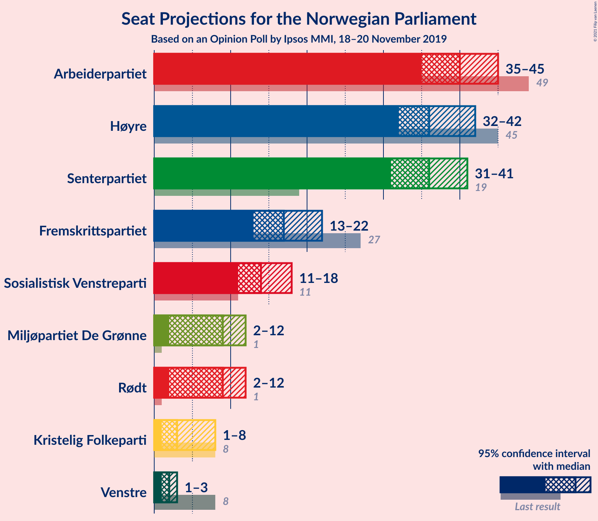
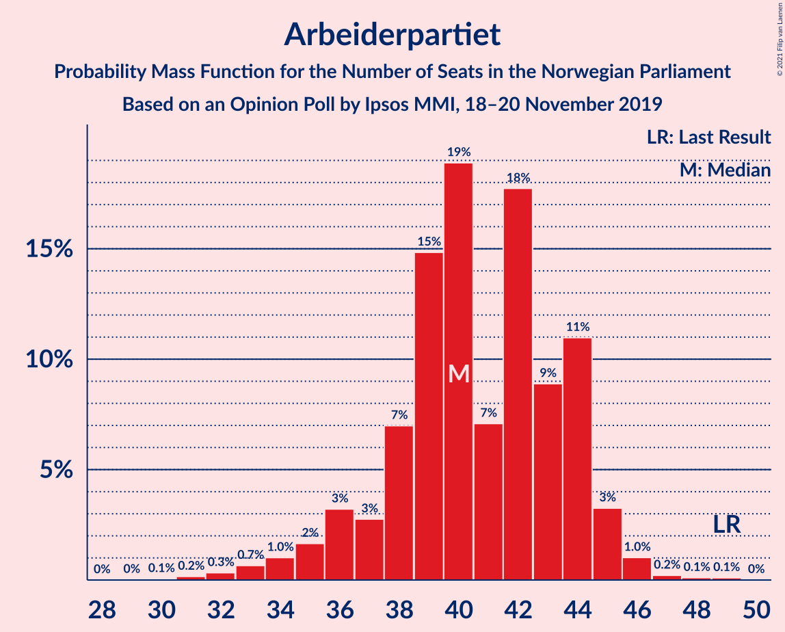
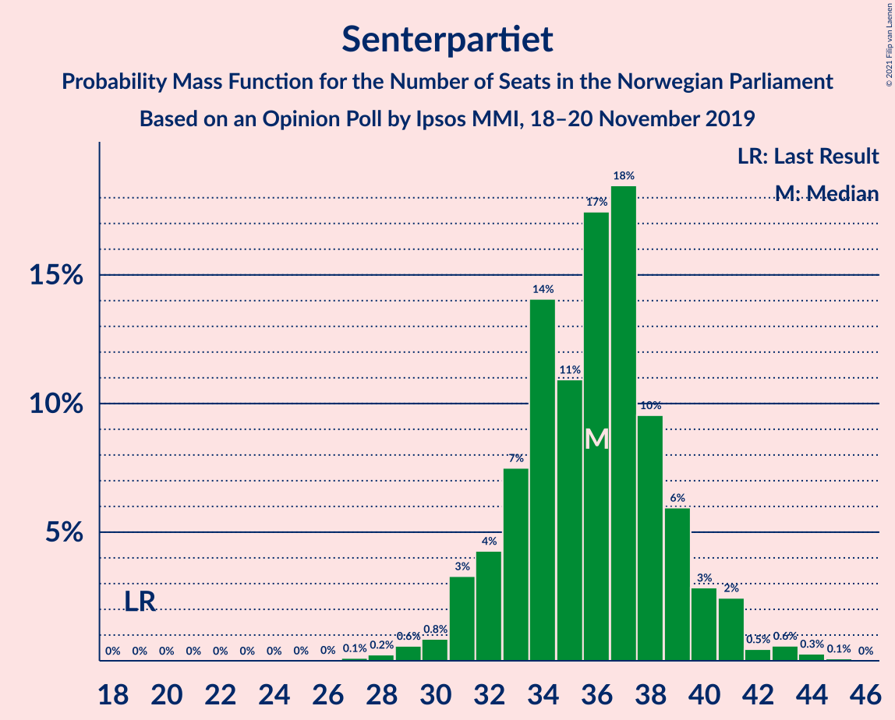
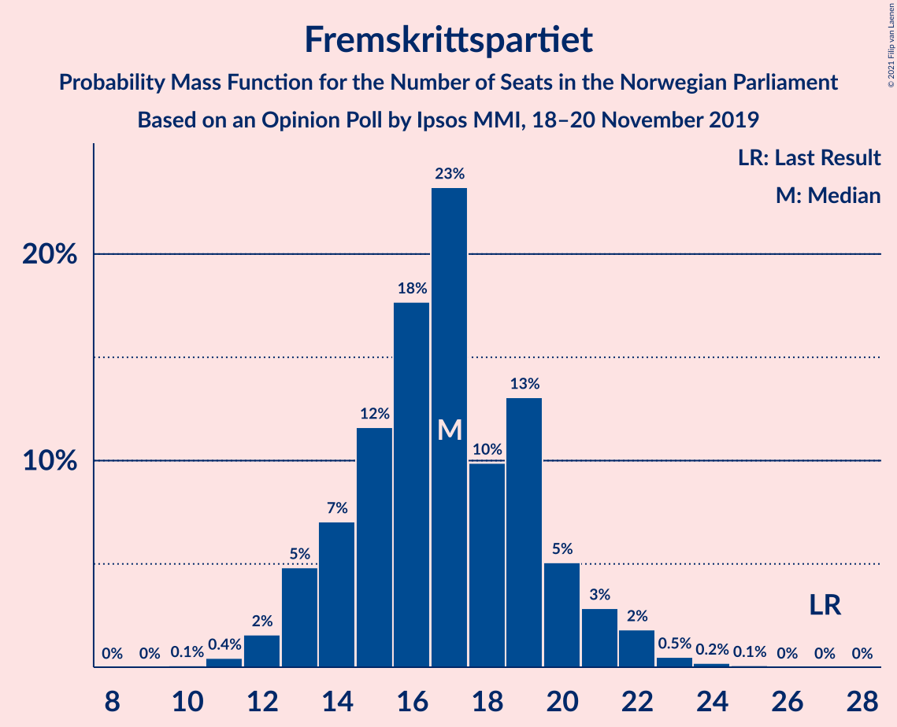
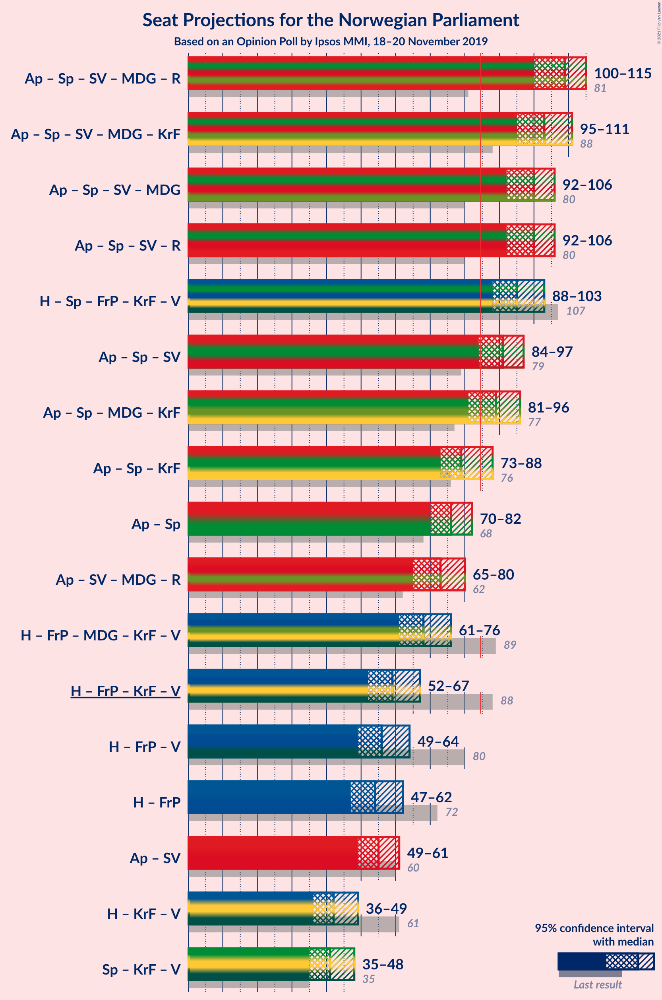
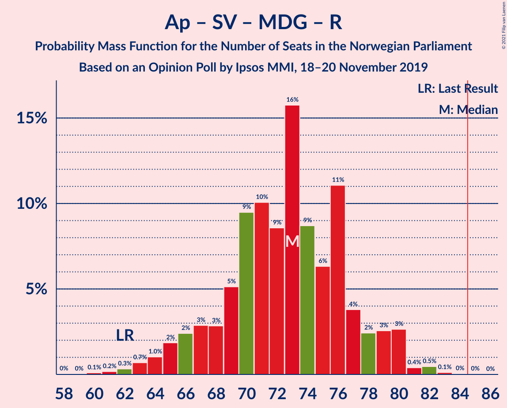
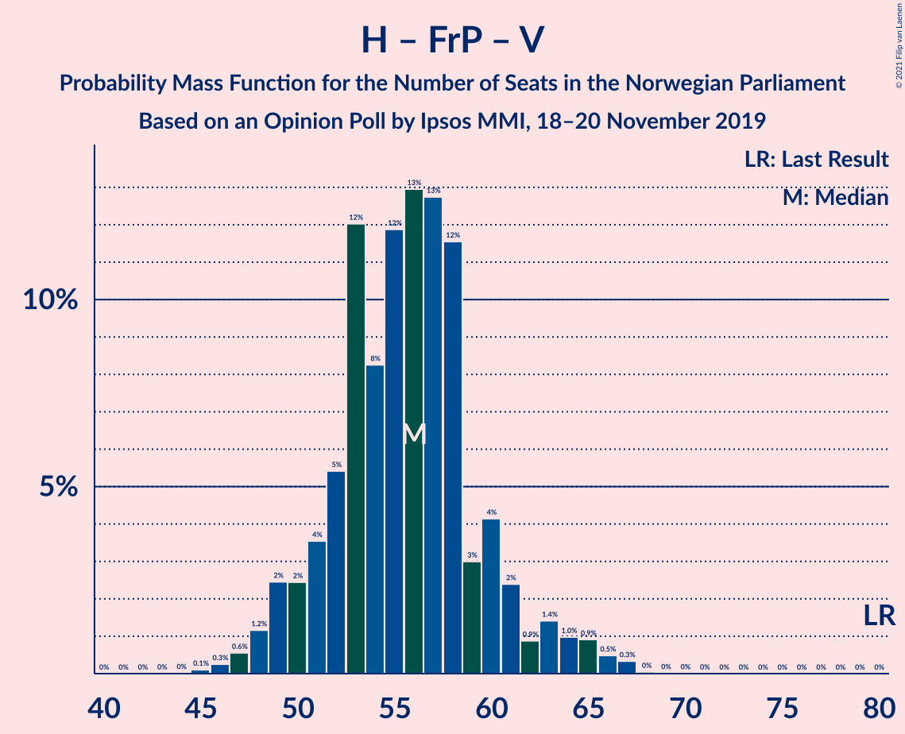
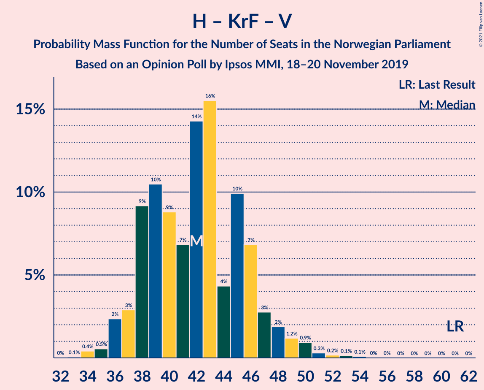
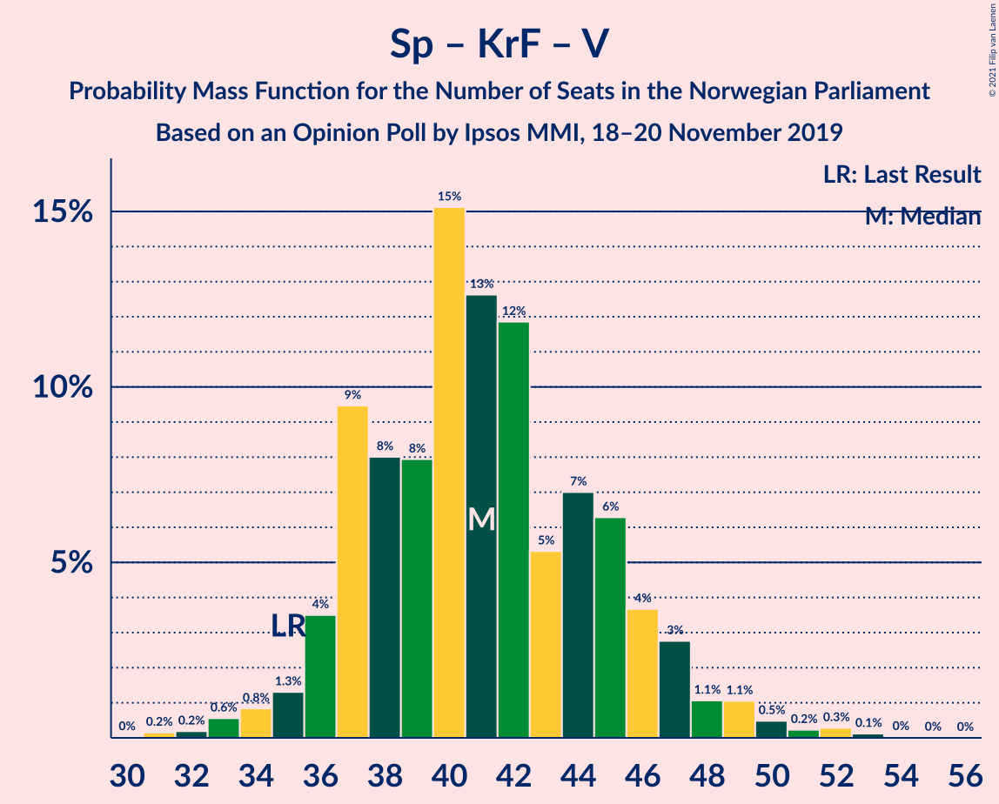

# Opinion Poll by Ipsos MMI, 18–20 November 2019

<a href="#voting-intentions">Voting Intentions</a> | <a href="#seats">Seats</a> | <a href="#coalitions">Coalitions</a> | <a href="#technical-information">Technical Information</a>

## Voting Intentions

### Confidence Intervals

| Party | Last Result | Poll Result | 80% Confidence Interval | 90% Confidence Interval | 95% Confidence Interval | 99% Confidence Interval |
|:-----:|:-----------:|:-----------:|:-----------------------:|:-----------------------:|:-----------------------:|:-----------------------:|
| Arbeiderpartiet | 27.4% | 22.0% | 20.1–24.1% |19.6–24.6% |19.1–25.1% |18.2–26.2% |
| Høyre | 25.0% | 20.9% | 19.0–22.9% |18.5–23.5% |18.0–24.0% |17.2–25.0% |
| Senterpartiet | 10.3% | 19.2% | 17.4–21.2% |16.9–21.7% |16.5–22.2% |15.7–23.2% |
| Fremskrittspartiet | 15.2% | 9.7% | 8.4–11.3% |8.1–11.7% |7.8–12.1% |7.2–12.9% |
| Sosialistisk Venstreparti | 6.0% | 8.3% | 7.1–9.8% |6.8–10.2% |6.5–10.6% |6.0–11.4% |
| Miljøpartiet De Grønne | 3.2% | 5.3% | 4.4–6.5% |4.1–6.9% |3.9–7.2% |3.5–7.8% |
| Rødt | 2.4% | 5.0% | 4.1–6.2% |3.8–6.6% |3.6–6.9% |3.2–7.5% |
| Kristelig Folkeparti | 4.2% | 3.5% | 2.7–4.5% |2.5–4.8% |2.4–5.1% |2.1–5.6% |
| Venstre | 4.4% | 2.6% | 2.0–3.6% |1.8–3.9% |1.7–4.1% |1.4–4.6% |

*Note:* The poll result column reflects the actual value used in the calculations. Published results may vary slightly, and in addition be rounded to fewer digits.

## Seats

### Confidence Intervals

| Party | Last Result | Median | 80% Confidence Interval | 90% Confidence Interval | 95% Confidence Interval | 99% Confidence Interval |
|:-----:|:-----------:|:------:|:-----------------------:|:-----------------------:|:-----------------------:|:-----------------------:|
| <a href="#arbeiderpartiet">Arbeiderpartiet</a> | 49 | 40 | 38–44 |36–44 |35–45 |32–46 |
| <a href="#høyre">Høyre</a> | 45 | 36 | 34–41 |33–41 |32–42 |30–44 |
| <a href="#senterpartiet">Senterpartiet</a> | 19 | 36 | 33–39 |31–40 |31–41 |29–43 |
| <a href="#fremskrittspartiet">Fremskrittspartiet</a> | 27 | 17 | 14–20 |13–21 |13–22 |11–23 |
| <a href="#sosialistisk-venstreparti">Sosialistisk Venstreparti</a> | 11 | 14 | 12–17 |11–18 |11–18 |10–20 |
| <a href="#miljøpartiet-de-grønne">Miljøpartiet De Grønne</a> | 1 | 9 | 8–11 |7–12 |2–12 |2–14 |
| <a href="#rødt">Rødt</a> | 1 | 9 | 7–11 |2–11 |2–12 |2–13 |
| <a href="#kristelig-folkeparti">Kristelig Folkeparti</a> | 8 | 3 | 1–7 |1–8 |1–8 |0–9 |
| <a href="#venstre">Venstre</a> | 8 | 2 | 1–2 |1–2 |1–3 |0–8 |

### Arbeiderpartiet

*For a full overview of the results for this party, see the [Arbeiderpartiet](party-arbeiderpartiet.html) page.*

| Number of Seats | Probability | Accumulated | Special Marks |
|:---------------:|:-----------:|:-----------:|:-------------:|
| 30 | 0.1% | 100% |  |
| 31 | 0.2% | 99.9% |  |
| 32 | 0.3% | 99.8% |  |
| 33 | 0.7% | 99.4% |  |
| 34 | 1.0% | 98.8% |  |
| 35 | 2% | 98% |  |
| 36 | 3% | 96% |  |
| 37 | 3% | 93% |  |
| 38 | 7% | 90% |  |
| 39 | 15% | 83% |  |
| 40 | 19% | 68% | Median |
| 41 | 7% | 49% |  |
| 42 | 18% | 42% |  |
| 43 | 9% | 25% |  |
| 44 | 11% | 16% |  |
| 45 | 3% | 5% |  |
| 46 | 1.0% | 1.5% |  |
| 47 | 0.2% | 0.4% |  |
| 48 | 0.1% | 0.2% |  |
| 49 | 0.1% | 0.1% | Last Result |
| 50 | 0% | 0% |  |

### Høyre

*For a full overview of the results for this party, see the [Høyre](party-høyre.html) page.*

| Number of Seats | Probability | Accumulated | Special Marks |
|:---------------:|:-----------:|:-----------:|:-------------:|
| 28 | 0.1% | 100% |  |
| 29 | 0.2% | 99.9% |  |
| 30 | 0.4% | 99.6% |  |
| 31 | 0.8% | 99.2% |  |
| 32 | 1.3% | 98% |  |
| 33 | 5% | 97% |  |
| 34 | 11% | 92% |  |
| 35 | 19% | 81% |  |
| 36 | 12% | 62% | Median |
| 37 | 8% | 49% |  |
| 38 | 15% | 41% |  |
| 39 | 9% | 27% |  |
| 40 | 6% | 17% |  |
| 41 | 7% | 11% |  |
| 42 | 2% | 4% |  |
| 43 | 1.2% | 2% |  |
| 44 | 0.8% | 1.3% |  |
| 45 | 0.3% | 0.4% | Last Result |
| 46 | 0.1% | 0.1% |  |
| 47 | 0% | 0.1% |  |
| 48 | 0% | 0% |  |

### Senterpartiet

*For a full overview of the results for this party, see the [Senterpartiet](party-senterpartiet.html) page.*

| Number of Seats | Probability | Accumulated | Special Marks |
|:---------------:|:-----------:|:-----------:|:-------------:|
| 19 | 0% | 100% | Last Result |
| 20 | 0% | 100% |  |
| 21 | 0% | 100% |  |
| 22 | 0% | 100% |  |
| 23 | 0% | 100% |  |
| 24 | 0% | 100% |  |
| 25 | 0% | 100% |  |
| 26 | 0% | 100% |  |
| 27 | 0.1% | 100% |  |
| 28 | 0.2% | 99.8% |  |
| 29 | 0.6% | 99.6% |  |
| 30 | 0.8% | 99.0% |  |
| 31 | 3% | 98% |  |
| 32 | 4% | 95% |  |
| 33 | 7% | 91% |  |
| 34 | 14% | 83% |  |
| 35 | 11% | 69% |  |
| 36 | 17% | 58% | Median |
| 37 | 18% | 41% |  |
| 38 | 10% | 22% |  |
| 39 | 6% | 13% |  |
| 40 | 3% | 7% |  |
| 41 | 2% | 4% |  |
| 42 | 0.5% | 1.4% |  |
| 43 | 0.6% | 0.9% |  |
| 44 | 0.3% | 0.4% |  |
| 45 | 0.1% | 0.1% |  |
| 46 | 0% | 0% |  |

### Fremskrittspartiet

*For a full overview of the results for this party, see the [Fremskrittspartiet](party-fremskrittspartiet.html) page.*

| Number of Seats | Probability | Accumulated | Special Marks |
|:---------------:|:-----------:|:-----------:|:-------------:|
| 10 | 0.1% | 100% |  |
| 11 | 0.4% | 99.9% |  |
| 12 | 2% | 99.5% |  |
| 13 | 5% | 98% |  |
| 14 | 7% | 93% |  |
| 15 | 12% | 86% |  |
| 16 | 18% | 74% |  |
| 17 | 23% | 57% | Median |
| 18 | 10% | 33% |  |
| 19 | 13% | 24% |  |
| 20 | 5% | 11% |  |
| 21 | 3% | 5% |  |
| 22 | 2% | 3% |  |
| 23 | 0.5% | 0.8% |  |
| 24 | 0.2% | 0.3% |  |
| 25 | 0.1% | 0.1% |  |
| 26 | 0% | 0% |  |
| 27 | 0% | 0% | Last Result |

### Sosialistisk Venstreparti

*For a full overview of the results for this party, see the [Sosialistisk Venstreparti](party-sosialistiskvenstreparti.html) page.*

| Number of Seats | Probability | Accumulated | Special Marks |
|:---------------:|:-----------:|:-----------:|:-------------:|
| 8 | 0.1% | 100% |  |
| 9 | 0.2% | 99.9% |  |
| 10 | 1.3% | 99.7% |  |
| 11 | 5% | 98% | Last Result |
| 12 | 8% | 94% |  |
| 13 | 11% | 85% |  |
| 14 | 29% | 74% | Median |
| 15 | 15% | 46% |  |
| 16 | 16% | 31% |  |
| 17 | 9% | 15% |  |
| 18 | 4% | 6% |  |
| 19 | 2% | 2% |  |
| 20 | 0.6% | 0.8% |  |
| 21 | 0.1% | 0.2% |  |
| 22 | 0% | 0.1% |  |
| 23 | 0% | 0% |  |

### Miljøpartiet De Grønne

*For a full overview of the results for this party, see the [Miljøpartiet De Grønne](party-miljøpartietdegrønne.html) page.*

| Number of Seats | Probability | Accumulated | Special Marks |
|:---------------:|:-----------:|:-----------:|:-------------:|
| 1 | 0% | 100% | Last Result |
| 2 | 3% | 100% |  |
| 3 | 0.6% | 97% |  |
| 4 | 0.4% | 97% |  |
| 5 | 0% | 96% |  |
| 6 | 0.2% | 96% |  |
| 7 | 5% | 96% |  |
| 8 | 28% | 91% |  |
| 9 | 24% | 63% | Median |
| 10 | 19% | 39% |  |
| 11 | 14% | 20% |  |
| 12 | 3% | 5% |  |
| 13 | 2% | 2% |  |
| 14 | 0.3% | 0.5% |  |
| 15 | 0.2% | 0.2% |  |
| 16 | 0% | 0% |  |

### Rødt

*For a full overview of the results for this party, see the [Rødt](party-rødt.html) page.*

| Number of Seats | Probability | Accumulated | Special Marks |
|:---------------:|:-----------:|:-----------:|:-------------:|
| 1 | 0% | 100% | Last Result |
| 2 | 8% | 100% |  |
| 3 | 0% | 92% |  |
| 4 | 0% | 92% |  |
| 5 | 0% | 92% |  |
| 6 | 1.1% | 92% |  |
| 7 | 12% | 91% |  |
| 8 | 25% | 79% |  |
| 9 | 26% | 55% | Median |
| 10 | 16% | 29% |  |
| 11 | 8% | 13% |  |
| 12 | 4% | 4% |  |
| 13 | 0.7% | 0.9% |  |
| 14 | 0.1% | 0.1% |  |
| 15 | 0% | 0% |  |

### Kristelig Folkeparti

*For a full overview of the results for this party, see the [Kristelig Folkeparti](party-kristeligfolkeparti.html) page.*

| Number of Seats | Probability | Accumulated | Special Marks |
|:---------------:|:-----------:|:-----------:|:-------------:|
| 0 | 1.3% | 100% |  |
| 1 | 33% | 98.7% |  |
| 2 | 11% | 66% |  |
| 3 | 30% | 55% | Median |
| 4 | 0% | 24% |  |
| 5 | 0% | 24% |  |
| 6 | 3% | 24% |  |
| 7 | 12% | 21% |  |
| 8 | 7% | 9% | Last Result |
| 9 | 1.4% | 2% |  |
| 10 | 0.3% | 0.4% |  |
| 11 | 0.1% | 0.1% |  |
| 12 | 0% | 0% |  |

### Venstre

*For a full overview of the results for this party, see the [Venstre](party-venstre.html) page.*

| Number of Seats | Probability | Accumulated | Special Marks |
|:---------------:|:-----------:|:-----------:|:-------------:|
| 0 | 2% | 100% |  |
| 1 | 15% | 98% |  |
| 2 | 79% | 82% | Median |
| 3 | 1.0% | 3% |  |
| 4 | 0% | 2% |  |
| 5 | 0% | 2% |  |
| 6 | 0.2% | 2% |  |
| 7 | 2% | 2% |  |
| 8 | 0.5% | 0.6% | Last Result |
| 9 | 0.1% | 0.1% |  |
| 10 | 0% | 0% |  |

## Coalitions

### Confidence Intervals

| Coalition | Last Result | Median | Majority? | 80% Confidence Interval | 90% Confidence Interval | 95% Confidence Interval | 99% Confidence Interval |
|:---------:|:-----------:|:------:|:---------:|:-----------------------:|:-----------------------:|:-----------------------:|:-----------------------:|
| Arbeiderpartiet – Senterpartiet – Sosialistisk Venstreparti – Miljøpartiet De Grønne – Rødt | 81 | 109 | 100% | 103–113 | 102–114 | 100–115 | 98–117 |
| Arbeiderpartiet – Senterpartiet – Sosialistisk Venstreparti – Miljøpartiet De Grønne – Kristelig Folkeparti | 88 | 103 | 100% | 99–108 | 97–110 | 95–111 | 93–113 |
| Arbeiderpartiet – Senterpartiet – Sosialistisk Venstreparti – Miljøpartiet De Grønne | 80 | 100 | 100% | 95–105 | 93–106 | 92–106 | 90–108 |
| Arbeiderpartiet – Senterpartiet – Sosialistisk Venstreparti – Rødt | 80 | 100 | 100% | 95–103 | 93–104 | 92–106 | 90–107 |
| Høyre – Senterpartiet – Fremskrittspartiet – Kristelig Folkeparti – Venstre | 107 | 95 | 99.7% | 90–99 | 89–101 | 88–103 | 85–106 |
| Arbeiderpartiet – Senterpartiet – Sosialistisk Venstreparti | 79 | 91 | 97% | 87–95 | 85–96 | 84–97 | 82–99 |
| Arbeiderpartiet – Senterpartiet – Miljøpartiet De Grønne – Kristelig Folkeparti | 77 | 89 | 90% | 84–94 | 83–95 | 81–96 | 78–99 |
| Arbeiderpartiet – Senterpartiet – Kristelig Folkeparti | 76 | 79 | 9% | 75–84 | 74–87 | 73–88 | 69–89 |
| Arbeiderpartiet – Senterpartiet | 68 | 76 | 0.2% | 73–80 | 71–81 | 70–82 | 67–84 |
| Arbeiderpartiet – Sosialistisk Venstreparti – Miljøpartiet De Grønne – Rødt | 62 | 73 | 0% | 68–77 | 66–79 | 65–80 | 62–82 |
| Høyre – Fremskrittspartiet – Miljøpartiet De Grønne – Kristelig Folkeparti – Venstre | 89 | 68 | 0% | 63–73 | 62–74 | 61–76 | 58–79 |
| Høyre – Fremskrittspartiet – Kristelig Folkeparti – Venstre | 88 | 59 | 0% | 54–63 | 54–65 | 52–67 | 50–69 |
| Høyre – Fremskrittspartiet – Venstre | 80 | 56 | 0% | 51–60 | 50–62 | 49–64 | 47–66 |
| Høyre – Fremskrittspartiet | 72 | 54 | 0% | 49–58 | 48–59 | 47–62 | 45–64 |
| Arbeiderpartiet – Sosialistisk Venstreparti | 60 | 55 | 0% | 51–59 | 50–60 | 49–61 | 46–64 |
| Høyre – Kristelig Folkeparti – Venstre | 61 | 42 | 0% | 38–46 | 37–47 | 36–49 | 34–51 |
| Senterpartiet – Kristelig Folkeparti – Venstre | 35 | 41 | 0% | 37–45 | 36–47 | 35–48 | 33–51 |

### Arbeiderpartiet – Senterpartiet – Sosialistisk Venstreparti – Miljøpartiet De Grønne – Rødt

| Number of Seats | Probability | Accumulated | Special Marks |
|:---------------:|:-----------:|:-----------:|:-------------:|
| 81 | 0% | 100% | Last Result |
| 82 | 0% | 100% |  |
| 83 | 0% | 100% |  |
| 84 | 0% | 100% |  |
| 85 | 0% | 100% | Majority |
| 86 | 0% | 100% |  |
| 87 | 0% | 100% |  |
| 88 | 0% | 100% |  |
| 89 | 0% | 100% |  |
| 90 | 0% | 100% |  |
| 91 | 0% | 100% |  |
| 92 | 0% | 100% |  |
| 93 | 0% | 100% |  |
| 94 | 0% | 100% |  |
| 95 | 0% | 99.9% |  |
| 96 | 0.1% | 99.9% |  |
| 97 | 0.2% | 99.8% |  |
| 98 | 0.2% | 99.6% |  |
| 99 | 0.5% | 99.4% |  |
| 100 | 1.5% | 98.9% |  |
| 101 | 2% | 97% |  |
| 102 | 3% | 95% |  |
| 103 | 3% | 92% |  |
| 104 | 4% | 89% |  |
| 105 | 4% | 85% |  |
| 106 | 6% | 80% |  |
| 107 | 9% | 74% |  |
| 108 | 14% | 65% | Median |
| 109 | 5% | 50% |  |
| 110 | 16% | 45% |  |
| 111 | 10% | 29% |  |
| 112 | 9% | 19% |  |
| 113 | 5% | 10% |  |
| 114 | 2% | 5% |  |
| 115 | 1.4% | 3% |  |
| 116 | 0.8% | 2% |  |
| 117 | 0.5% | 0.8% |  |
| 118 | 0.2% | 0.3% |  |
| 119 | 0.1% | 0.1% |  |
| 120 | 0% | 0% |  |

### Arbeiderpartiet – Senterpartiet – Sosialistisk Venstreparti – Miljøpartiet De Grønne – Kristelig Folkeparti

| Number of Seats | Probability | Accumulated | Special Marks |
|:---------------:|:-----------:|:-----------:|:-------------:|
| 88 | 0% | 100% | Last Result |
| 89 | 0% | 100% |  |
| 90 | 0.1% | 100% |  |
| 91 | 0.1% | 99.9% |  |
| 92 | 0.2% | 99.8% |  |
| 93 | 0.3% | 99.6% |  |
| 94 | 0.8% | 99.3% |  |
| 95 | 2% | 98.5% |  |
| 96 | 1.3% | 97% |  |
| 97 | 2% | 96% |  |
| 98 | 2% | 94% |  |
| 99 | 4% | 92% |  |
| 100 | 11% | 88% |  |
| 101 | 6% | 77% |  |
| 102 | 14% | 71% | Median |
| 103 | 13% | 57% |  |
| 104 | 8% | 44% |  |
| 105 | 9% | 37% |  |
| 106 | 9% | 28% |  |
| 107 | 8% | 19% |  |
| 108 | 4% | 11% |  |
| 109 | 2% | 7% |  |
| 110 | 2% | 5% |  |
| 111 | 1.5% | 3% |  |
| 112 | 1.0% | 2% |  |
| 113 | 0.4% | 0.8% |  |
| 114 | 0.2% | 0.4% |  |
| 115 | 0.1% | 0.1% |  |
| 116 | 0% | 0.1% |  |
| 117 | 0% | 0% |  |

### Arbeiderpartiet – Senterpartiet – Sosialistisk Venstreparti – Miljøpartiet De Grønne

| Number of Seats | Probability | Accumulated | Special Marks |
|:---------------:|:-----------:|:-----------:|:-------------:|
| 80 | 0% | 100% | Last Result |
| 81 | 0% | 100% |  |
| 82 | 0% | 100% |  |
| 83 | 0% | 100% |  |
| 84 | 0% | 100% |  |
| 85 | 0% | 100% | Majority |
| 86 | 0% | 100% |  |
| 87 | 0.1% | 100% |  |
| 88 | 0.1% | 99.9% |  |
| 89 | 0.2% | 99.8% |  |
| 90 | 0.3% | 99.6% |  |
| 91 | 0.4% | 99.3% |  |
| 92 | 1.5% | 98.9% |  |
| 93 | 2% | 97% |  |
| 94 | 3% | 95% |  |
| 95 | 2% | 92% |  |
| 96 | 5% | 90% |  |
| 97 | 4% | 84% |  |
| 98 | 7% | 80% |  |
| 99 | 14% | 73% | Median |
| 100 | 17% | 59% |  |
| 101 | 11% | 42% |  |
| 102 | 9% | 32% |  |
| 103 | 8% | 23% |  |
| 104 | 5% | 15% |  |
| 105 | 5% | 10% |  |
| 106 | 3% | 5% |  |
| 107 | 0.8% | 2% |  |
| 108 | 1.0% | 1.3% |  |
| 109 | 0.1% | 0.4% |  |
| 110 | 0.1% | 0.2% |  |
| 111 | 0.1% | 0.1% |  |
| 112 | 0% | 0% |  |

### Arbeiderpartiet – Senterpartiet – Sosialistisk Venstreparti – Rødt

| Number of Seats | Probability | Accumulated | Special Marks |
|:---------------:|:-----------:|:-----------:|:-------------:|
| 80 | 0% | 100% | Last Result |
| 81 | 0% | 100% |  |
| 82 | 0% | 100% |  |
| 83 | 0% | 100% |  |
| 84 | 0% | 100% |  |
| 85 | 0% | 100% | Majority |
| 86 | 0% | 100% |  |
| 87 | 0.1% | 99.9% |  |
| 88 | 0.1% | 99.9% |  |
| 89 | 0.2% | 99.8% |  |
| 90 | 0.8% | 99.5% |  |
| 91 | 1.1% | 98.7% |  |
| 92 | 1.3% | 98% |  |
| 93 | 2% | 96% |  |
| 94 | 2% | 94% |  |
| 95 | 4% | 91% |  |
| 96 | 7% | 87% |  |
| 97 | 6% | 80% |  |
| 98 | 7% | 74% |  |
| 99 | 12% | 67% | Median |
| 100 | 18% | 55% |  |
| 101 | 14% | 37% |  |
| 102 | 5% | 23% |  |
| 103 | 10% | 18% |  |
| 104 | 4% | 9% |  |
| 105 | 2% | 5% |  |
| 106 | 2% | 3% |  |
| 107 | 0.9% | 1.3% |  |
| 108 | 0.2% | 0.4% |  |
| 109 | 0.1% | 0.2% |  |
| 110 | 0.1% | 0.1% |  |
| 111 | 0% | 0.1% |  |
| 112 | 0% | 0% |  |

### Høyre – Senterpartiet – Fremskrittspartiet – Kristelig Folkeparti – Venstre

| Number of Seats | Probability | Accumulated | Special Marks |
|:---------------:|:-----------:|:-----------:|:-------------:|
| 83 | 0.1% | 100% |  |
| 84 | 0.2% | 99.9% |  |
| 85 | 0.3% | 99.7% | Majority |
| 86 | 0.4% | 99.4% |  |
| 87 | 1.1% | 99.0% |  |
| 88 | 1.2% | 98% |  |
| 89 | 4% | 97% |  |
| 90 | 4% | 93% |  |
| 91 | 8% | 89% |  |
| 92 | 8% | 81% |  |
| 93 | 13% | 73% |  |
| 94 | 8% | 60% | Median |
| 95 | 9% | 52% |  |
| 96 | 16% | 43% |  |
| 97 | 8% | 27% |  |
| 98 | 5% | 19% |  |
| 99 | 6% | 14% |  |
| 100 | 3% | 9% |  |
| 101 | 1.4% | 5% |  |
| 102 | 1.3% | 4% |  |
| 103 | 1.4% | 3% |  |
| 104 | 0.5% | 1.4% |  |
| 105 | 0.3% | 0.8% |  |
| 106 | 0.3% | 0.5% |  |
| 107 | 0.1% | 0.3% | Last Result |
| 108 | 0.1% | 0.2% |  |
| 109 | 0.1% | 0.1% |  |
| 110 | 0% | 0% |  |

### Arbeiderpartiet – Senterpartiet – Sosialistisk Venstreparti

| Number of Seats | Probability | Accumulated | Special Marks |
|:---------------:|:-----------:|:-----------:|:-------------:|
| 79 | 0.1% | 100% | Last Result |
| 80 | 0.2% | 99.9% |  |
| 81 | 0.2% | 99.7% |  |
| 82 | 0.6% | 99.5% |  |
| 83 | 0.7% | 98.9% |  |
| 84 | 1.0% | 98% |  |
| 85 | 3% | 97% | Majority |
| 86 | 3% | 94% |  |
| 87 | 3% | 91% |  |
| 88 | 9% | 89% |  |
| 89 | 7% | 80% |  |
| 90 | 14% | 73% | Median |
| 91 | 14% | 59% |  |
| 92 | 18% | 45% |  |
| 93 | 5% | 27% |  |
| 94 | 10% | 21% |  |
| 95 | 5% | 12% |  |
| 96 | 4% | 7% |  |
| 97 | 2% | 4% |  |
| 98 | 1.3% | 2% |  |
| 99 | 0.4% | 0.7% |  |
| 100 | 0.2% | 0.4% |  |
| 101 | 0.1% | 0.2% |  |
| 102 | 0% | 0.1% |  |
| 103 | 0% | 0% |  |

### Arbeiderpartiet – Senterpartiet – Miljøpartiet De Grønne – Kristelig Folkeparti

| Number of Seats | Probability | Accumulated | Special Marks |
|:---------------:|:-----------:|:-----------:|:-------------:|
| 75 | 0% | 100% |  |
| 76 | 0.1% | 99.9% |  |
| 77 | 0.1% | 99.9% | Last Result |
| 78 | 0.7% | 99.7% |  |
| 79 | 0.8% | 99.0% |  |
| 80 | 0.5% | 98% |  |
| 81 | 1.1% | 98% |  |
| 82 | 1.1% | 97% |  |
| 83 | 2% | 96% |  |
| 84 | 4% | 94% |  |
| 85 | 4% | 90% | Majority |
| 86 | 17% | 86% |  |
| 87 | 6% | 68% |  |
| 88 | 8% | 62% | Median |
| 89 | 16% | 54% |  |
| 90 | 9% | 38% |  |
| 91 | 7% | 28% |  |
| 92 | 5% | 22% |  |
| 93 | 5% | 16% |  |
| 94 | 3% | 12% |  |
| 95 | 5% | 9% |  |
| 96 | 2% | 4% |  |
| 97 | 1.2% | 2% |  |
| 98 | 0.3% | 1.1% |  |
| 99 | 0.5% | 0.8% |  |
| 100 | 0.2% | 0.3% |  |
| 101 | 0% | 0.1% |  |
| 102 | 0% | 0.1% |  |
| 103 | 0% | 0% |  |

### Arbeiderpartiet – Senterpartiet – Kristelig Folkeparti

| Number of Seats | Probability | Accumulated | Special Marks |
|:---------------:|:-----------:|:-----------:|:-------------:|
| 67 | 0% | 100% |  |
| 68 | 0.1% | 99.9% |  |
| 69 | 0.4% | 99.8% |  |
| 70 | 0.4% | 99.4% |  |
| 71 | 0.3% | 99.0% |  |
| 72 | 1.2% | 98.7% |  |
| 73 | 1.0% | 98% |  |
| 74 | 2% | 97% |  |
| 75 | 5% | 94% |  |
| 76 | 4% | 89% | Last Result |
| 77 | 11% | 85% |  |
| 78 | 14% | 74% |  |
| 79 | 13% | 61% | Median |
| 80 | 9% | 47% |  |
| 81 | 10% | 38% |  |
| 82 | 7% | 28% |  |
| 83 | 5% | 21% |  |
| 84 | 8% | 17% |  |
| 85 | 2% | 9% | Majority |
| 86 | 2% | 7% |  |
| 87 | 2% | 5% |  |
| 88 | 2% | 3% |  |
| 89 | 0.5% | 0.8% |  |
| 90 | 0.1% | 0.3% |  |
| 91 | 0.1% | 0.2% |  |
| 92 | 0.1% | 0.1% |  |
| 93 | 0% | 0% |  |

### Arbeiderpartiet – Senterpartiet

| Number of Seats | Probability | Accumulated | Special Marks |
|:---------------:|:-----------:|:-----------:|:-------------:|
| 64 | 0% | 100% |  |
| 65 | 0.1% | 99.9% |  |
| 66 | 0.2% | 99.9% |  |
| 67 | 0.5% | 99.7% |  |
| 68 | 0.5% | 99.2% | Last Result |
| 69 | 0.5% | 98.7% |  |
| 70 | 2% | 98% |  |
| 71 | 3% | 97% |  |
| 72 | 1.4% | 94% |  |
| 73 | 6% | 92% |  |
| 74 | 8% | 86% |  |
| 75 | 9% | 78% |  |
| 76 | 22% | 69% | Median |
| 77 | 15% | 48% |  |
| 78 | 9% | 32% |  |
| 79 | 8% | 24% |  |
| 80 | 7% | 16% |  |
| 81 | 6% | 9% |  |
| 82 | 2% | 3% |  |
| 83 | 0.6% | 1.3% |  |
| 84 | 0.5% | 0.7% |  |
| 85 | 0.1% | 0.2% | Majority |
| 86 | 0.1% | 0.1% |  |
| 87 | 0% | 0.1% |  |
| 88 | 0% | 0% |  |

### Arbeiderpartiet – Sosialistisk Venstreparti – Miljøpartiet De Grønne – Rødt

| Number of Seats | Probability | Accumulated | Special Marks |
|:---------------:|:-----------:|:-----------:|:-------------:|
| 58 | 0% | 100% |  |
| 59 | 0% | 99.9% |  |
| 60 | 0.1% | 99.9% |  |
| 61 | 0.2% | 99.8% |  |
| 62 | 0.3% | 99.6% | Last Result |
| 63 | 0.7% | 99.3% |  |
| 64 | 1.0% | 98.6% |  |
| 65 | 2% | 98% |  |
| 66 | 2% | 96% |  |
| 67 | 3% | 93% |  |
| 68 | 3% | 90% |  |
| 69 | 5% | 88% |  |
| 70 | 9% | 82% |  |
| 71 | 10% | 73% |  |
| 72 | 9% | 63% | Median |
| 73 | 16% | 54% |  |
| 74 | 9% | 39% |  |
| 75 | 6% | 30% |  |
| 76 | 11% | 24% |  |
| 77 | 4% | 12% |  |
| 78 | 2% | 9% |  |
| 79 | 3% | 6% |  |
| 80 | 3% | 4% |  |
| 81 | 0.4% | 1.1% |  |
| 82 | 0.5% | 0.7% |  |
| 83 | 0.1% | 0.2% |  |
| 84 | 0% | 0.1% |  |
| 85 | 0% | 0% | Majority |

### Høyre – Fremskrittspartiet – Miljøpartiet De Grønne – Kristelig Folkeparti – Venstre

| Number of Seats | Probability | Accumulated | Special Marks |
|:---------------:|:-----------:|:-----------:|:-------------:|
| 56 | 0% | 100% |  |
| 57 | 0.1% | 99.9% |  |
| 58 | 0.5% | 99.8% |  |
| 59 | 0.5% | 99.3% |  |
| 60 | 0.9% | 98.9% |  |
| 61 | 1.4% | 98% |  |
| 62 | 6% | 97% |  |
| 63 | 5% | 90% |  |
| 64 | 4% | 86% |  |
| 65 | 5% | 82% |  |
| 66 | 12% | 77% |  |
| 67 | 6% | 65% | Median |
| 68 | 15% | 59% |  |
| 69 | 13% | 44% |  |
| 70 | 11% | 31% |  |
| 71 | 4% | 20% |  |
| 72 | 5% | 15% |  |
| 73 | 4% | 10% |  |
| 74 | 2% | 6% |  |
| 75 | 1.2% | 4% |  |
| 76 | 0.7% | 3% |  |
| 77 | 0.7% | 2% |  |
| 78 | 0.9% | 1.4% |  |
| 79 | 0.3% | 0.5% |  |
| 80 | 0.1% | 0.2% |  |
| 81 | 0% | 0.1% |  |
| 82 | 0% | 0% |  |
| 83 | 0% | 0% |  |
| 84 | 0% | 0% |  |
| 85 | 0% | 0% | Majority |
| 86 | 0% | 0% |  |
| 87 | 0% | 0% |  |
| 88 | 0% | 0% |  |
| 89 | 0% | 0% | Last Result |

### Høyre – Fremskrittspartiet – Kristelig Folkeparti – Venstre

| Number of Seats | Probability | Accumulated | Special Marks |
|:---------------:|:-----------:|:-----------:|:-------------:|
| 48 | 0% | 100% |  |
| 49 | 0.3% | 99.9% |  |
| 50 | 0.2% | 99.6% |  |
| 51 | 0.7% | 99.4% |  |
| 52 | 1.2% | 98.7% |  |
| 53 | 2% | 97% |  |
| 54 | 8% | 96% |  |
| 55 | 4% | 88% |  |
| 56 | 7% | 83% |  |
| 57 | 10% | 76% |  |
| 58 | 12% | 66% | Median |
| 59 | 17% | 53% |  |
| 60 | 6% | 37% |  |
| 61 | 10% | 31% |  |
| 62 | 8% | 21% |  |
| 63 | 4% | 13% |  |
| 64 | 2% | 9% |  |
| 65 | 3% | 7% |  |
| 66 | 1.4% | 4% |  |
| 67 | 1.3% | 3% |  |
| 68 | 0.4% | 1.4% |  |
| 69 | 0.6% | 1.0% |  |
| 70 | 0.2% | 0.4% |  |
| 71 | 0.1% | 0.2% |  |
| 72 | 0.1% | 0.1% |  |
| 73 | 0% | 0% |  |
| 74 | 0% | 0% |  |
| 75 | 0% | 0% |  |
| 76 | 0% | 0% |  |
| 77 | 0% | 0% |  |
| 78 | 0% | 0% |  |
| 79 | 0% | 0% |  |
| 80 | 0% | 0% |  |
| 81 | 0% | 0% |  |
| 82 | 0% | 0% |  |
| 83 | 0% | 0% |  |
| 84 | 0% | 0% |  |
| 85 | 0% | 0% | Majority |
| 86 | 0% | 0% |  |
| 87 | 0% | 0% |  |
| 88 | 0% | 0% | Last Result |

### Høyre – Fremskrittspartiet – Venstre

| Number of Seats | Probability | Accumulated | Special Marks |
|:---------------:|:-----------:|:-----------:|:-------------:|
| 45 | 0.1% | 100% |  |
| 46 | 0.3% | 99.9% |  |
| 47 | 0.6% | 99.6% |  |
| 48 | 1.2% | 99.1% |  |
| 49 | 2% | 98% |  |
| 50 | 2% | 95% |  |
| 51 | 4% | 93% |  |
| 52 | 5% | 89% |  |
| 53 | 12% | 84% |  |
| 54 | 8% | 72% |  |
| 55 | 12% | 64% | Median |
| 56 | 13% | 52% |  |
| 57 | 13% | 39% |  |
| 58 | 12% | 26% |  |
| 59 | 3% | 15% |  |
| 60 | 4% | 12% |  |
| 61 | 2% | 7% |  |
| 62 | 0.9% | 5% |  |
| 63 | 1.4% | 4% |  |
| 64 | 1.0% | 3% |  |
| 65 | 0.9% | 2% |  |
| 66 | 0.5% | 0.9% |  |
| 67 | 0.3% | 0.4% |  |
| 68 | 0% | 0.1% |  |
| 69 | 0% | 0% |  |
| 70 | 0% | 0% |  |
| 71 | 0% | 0% |  |
| 72 | 0% | 0% |  |
| 73 | 0% | 0% |  |
| 74 | 0% | 0% |  |
| 75 | 0% | 0% |  |
| 76 | 0% | 0% |  |
| 77 | 0% | 0% |  |
| 78 | 0% | 0% |  |
| 79 | 0% | 0% |  |
| 80 | 0% | 0% | Last Result |

### Høyre – Fremskrittspartiet

| Number of Seats | Probability | Accumulated | Special Marks |
|:---------------:|:-----------:|:-----------:|:-------------:|
| 44 | 0.3% | 100% |  |
| 45 | 0.4% | 99.7% |  |
| 46 | 0.8% | 99.3% |  |
| 47 | 2% | 98% |  |
| 48 | 3% | 97% |  |
| 49 | 4% | 94% |  |
| 50 | 6% | 90% |  |
| 51 | 11% | 84% |  |
| 52 | 10% | 73% |  |
| 53 | 9% | 63% | Median |
| 54 | 15% | 54% |  |
| 55 | 11% | 39% |  |
| 56 | 13% | 28% |  |
| 57 | 3% | 15% |  |
| 58 | 5% | 12% |  |
| 59 | 2% | 7% |  |
| 60 | 0.7% | 5% |  |
| 61 | 1.3% | 4% |  |
| 62 | 0.8% | 3% |  |
| 63 | 1.0% | 2% |  |
| 64 | 0.4% | 0.8% |  |
| 65 | 0.3% | 0.4% |  |
| 66 | 0% | 0.1% |  |
| 67 | 0% | 0% |  |
| 68 | 0% | 0% |  |
| 69 | 0% | 0% |  |
| 70 | 0% | 0% |  |
| 71 | 0% | 0% |  |
| 72 | 0% | 0% | Last Result |

### Arbeiderpartiet – Sosialistisk Venstreparti

| Number of Seats | Probability | Accumulated | Special Marks |
|:---------------:|:-----------:|:-----------:|:-------------:|
| 43 | 0.1% | 100% |  |
| 44 | 0.1% | 99.9% |  |
| 45 | 0.1% | 99.8% |  |
| 46 | 0.5% | 99.7% |  |
| 47 | 0.6% | 99.3% |  |
| 48 | 0.9% | 98.7% |  |
| 49 | 2% | 98% |  |
| 50 | 3% | 96% |  |
| 51 | 4% | 93% |  |
| 52 | 5% | 89% |  |
| 53 | 10% | 83% |  |
| 54 | 17% | 74% | Median |
| 55 | 13% | 57% |  |
| 56 | 9% | 44% |  |
| 57 | 10% | 35% |  |
| 58 | 11% | 25% |  |
| 59 | 7% | 14% |  |
| 60 | 3% | 7% | Last Result |
| 61 | 2% | 4% |  |
| 62 | 1.0% | 2% |  |
| 63 | 0.2% | 0.7% |  |
| 64 | 0.4% | 0.6% |  |
| 65 | 0.1% | 0.2% |  |
| 66 | 0.1% | 0.1% |  |
| 67 | 0% | 0% |  |

### Høyre – Kristelig Folkeparti – Venstre

| Number of Seats | Probability | Accumulated | Special Marks |
|:---------------:|:-----------:|:-----------:|:-------------:|
| 33 | 0.1% | 100% |  |
| 34 | 0.4% | 99.9% |  |
| 35 | 0.5% | 99.5% |  |
| 36 | 2% | 98.9% |  |
| 37 | 3% | 97% |  |
| 38 | 9% | 94% |  |
| 39 | 10% | 85% |  |
| 40 | 9% | 74% |  |
| 41 | 7% | 65% | Median |
| 42 | 14% | 58% |  |
| 43 | 16% | 44% |  |
| 44 | 4% | 29% |  |
| 45 | 10% | 24% |  |
| 46 | 7% | 14% |  |
| 47 | 3% | 8% |  |
| 48 | 2% | 5% |  |
| 49 | 1.2% | 3% |  |
| 50 | 0.9% | 2% |  |
| 51 | 0.3% | 0.7% |  |
| 52 | 0.2% | 0.4% |  |
| 53 | 0.1% | 0.3% |  |
| 54 | 0.1% | 0.1% |  |
| 55 | 0% | 0% |  |
| 56 | 0% | 0% |  |
| 57 | 0% | 0% |  |
| 58 | 0% | 0% |  |
| 59 | 0% | 0% |  |
| 60 | 0% | 0% |  |
| 61 | 0% | 0% | Last Result |

### Senterpartiet – Kristelig Folkeparti – Venstre

| Number of Seats | Probability | Accumulated | Special Marks |
|:---------------:|:-----------:|:-----------:|:-------------:|
| 31 | 0.2% | 100% |  |
| 32 | 0.2% | 99.8% |  |
| 33 | 0.6% | 99.6% |  |
| 34 | 0.8% | 99.0% |  |
| 35 | 1.3% | 98% | Last Result |
| 36 | 4% | 97% |  |
| 37 | 9% | 93% |  |
| 38 | 8% | 84% |  |
| 39 | 8% | 76% |  |
| 40 | 15% | 68% |  |
| 41 | 13% | 53% | Median |
| 42 | 12% | 40% |  |
| 43 | 5% | 28% |  |
| 44 | 7% | 23% |  |
| 45 | 6% | 16% |  |
| 46 | 4% | 10% |  |
| 47 | 3% | 6% |  |
| 48 | 1.1% | 3% |  |
| 49 | 1.1% | 2% |  |
| 50 | 0.5% | 1.2% |  |
| 51 | 0.2% | 0.7% |  |
| 52 | 0.3% | 0.5% |  |
| 53 | 0.1% | 0.2% |  |
| 54 | 0% | 0.1% |  |
| 55 | 0% | 0% |  |

## Technical Information

### Opinion Poll

+ **Polling firm:** Ipsos MMI
+ **Commissioner(s):** —
+ **Fieldwork period:** 18–20 November 2019

### Calculations

+ **Sample size:** 719
+ **Simulations done:** 1,048,576
+ **Error estimate:** 1.80%

