# Opinion Poll by Norstat, 19–25 November 2019

<a href="#voting-intentions">Voting Intentions</a> | <a href="#seats">Seats</a> | <a href="#coalitions">Coalitions</a> | <a href="#technical-information">Technical Information</a>

## Voting Intentions

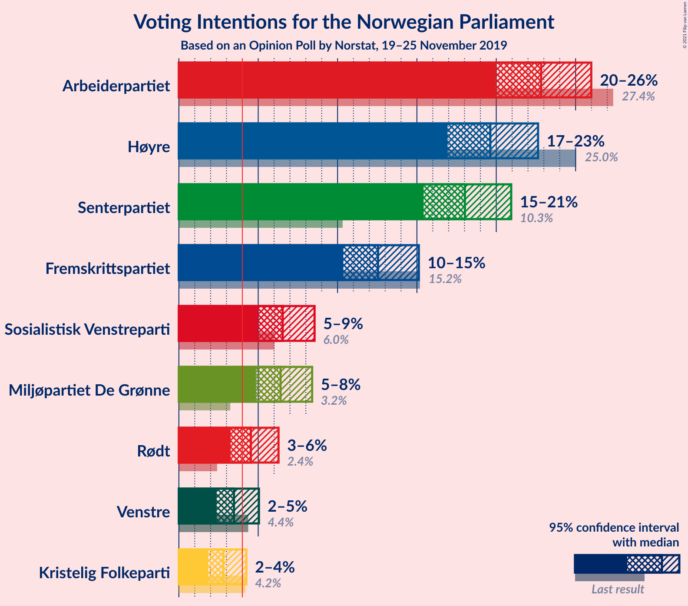

### Confidence Intervals

| Party | Last Result | Poll Result | 80% Confidence Interval | 90% Confidence Interval | 95% Confidence Interval | 99% Confidence Interval |
|:-----:|:-----------:|:-----------:|:-----------------------:|:-----------------------:|:-----------------------:|:-----------------------:|
| Arbeiderpartiet | 27.4% | 22.8% | 20.9–24.9% |20.4–25.5% |20.0–26.0% |19.1–27.0% |
| Høyre | 25.0% | 19.6% | 17.9–21.6% |17.4–22.1% |16.9–22.6% |16.1–23.6% |
| Senterpartiet | 10.3% | 18.0% | 16.3–19.9% |15.8–20.5% |15.4–20.9% |14.6–21.9% |
| Fremskrittspartiet | 15.2% | 12.6% | 11.1–14.2% |10.7–14.7% |10.4–15.1% |9.7–16.0% |
| Sosialistisk Venstreparti | 6.0% | 6.5% | 5.5–7.8% |5.2–8.2% |5.0–8.6% |4.5–9.2% |
| Miljøpartiet De Grønne | 3.2% | 6.4% | 5.4–7.7% |5.1–8.1% |4.9–8.4% |4.4–9.1% |
| Rødt | 2.4% | 4.5% | 3.7–5.7% |3.5–6.0% |3.3–6.3% |2.9–6.9% |
| Venstre | 4.4% | 3.5% | 2.7–4.5% |2.5–4.8% |2.4–5.0% |2.1–5.6% |
| Kristelig Folkeparti | 4.2% | 2.8% | 2.2–3.7% |2.0–4.0% |1.8–4.3% |1.6–4.8% |

*Note:* The poll result column reflects the actual value used in the calculations. Published results may vary slightly, and in addition be rounded to fewer digits.

## Seats

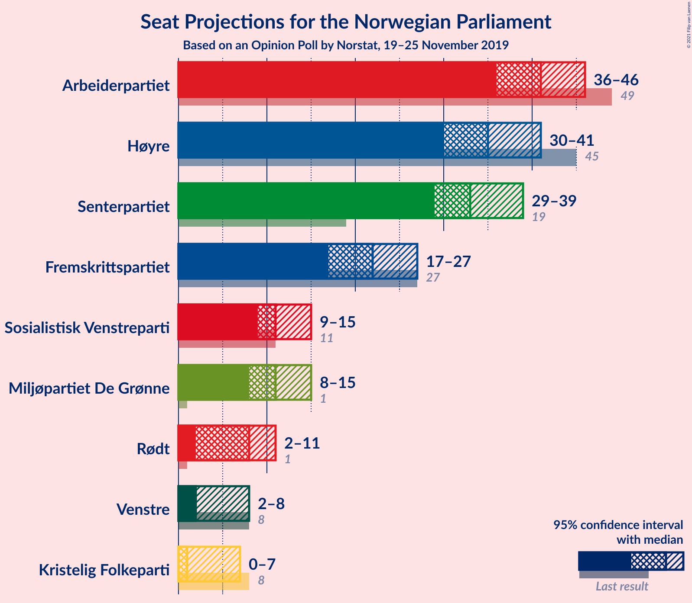

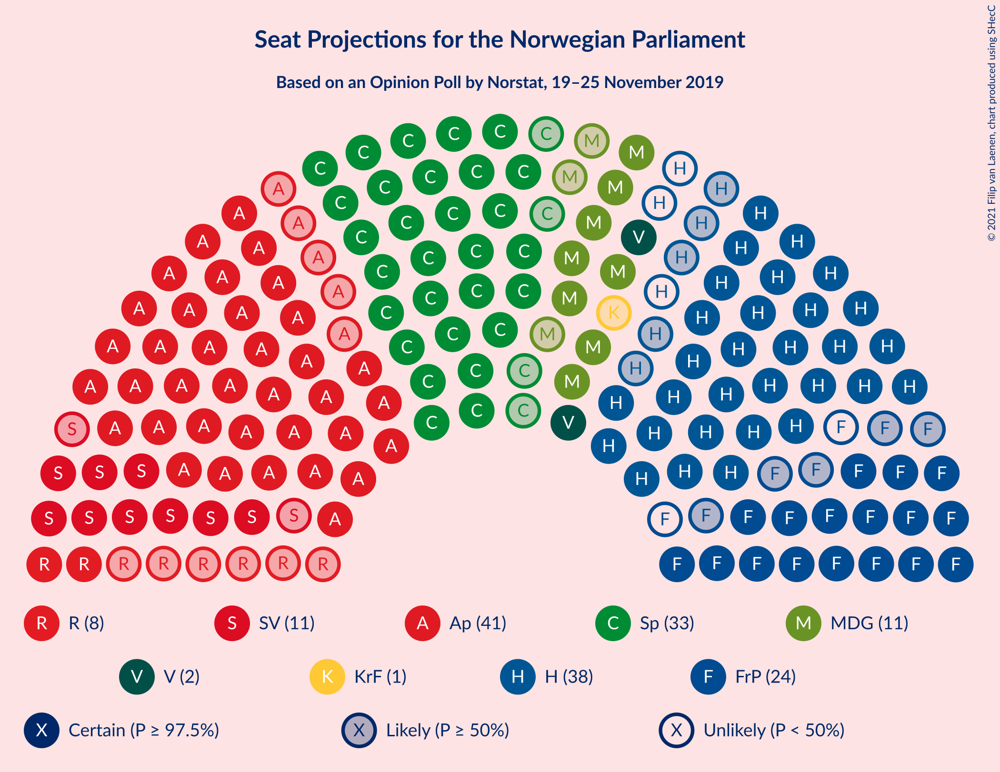

### Confidence Intervals

| Party | Last Result | Median | 80% Confidence Interval | 90% Confidence Interval | 95% Confidence Interval | 99% Confidence Interval |
|:-----:|:-----------:|:------:|:-----------------------:|:-----------------------:|:-----------------------:|:-----------------------:|
| <a href="#arbeiderpartiet">Arbeiderpartiet</a> | 49 | 41 | 38–45 |36–45 |36–46 |35–49 |
| <a href="#høyre">Høyre</a> | 45 | 35 | 32–38 |31–39 |30–41 |28–42 |
| <a href="#senterpartiet">Senterpartiet</a> | 19 | 33 | 30–37 |30–38 |29–39 |27–41 |
| <a href="#fremskrittspartiet">Fremskrittspartiet</a> | 27 | 22 | 19–25 |18–26 |17–27 |17–28 |
| <a href="#sosialistisk-venstreparti">Sosialistisk Venstreparti</a> | 11 | 11 | 10–14 |9–14 |9–15 |8–16 |
| <a href="#miljøpartiet-de-grønne">Miljøpartiet De Grønne</a> | 1 | 11 | 9–13 |9–14 |8–15 |8–16 |
| <a href="#rødt">Rødt</a> | 1 | 8 | 2–10 |2–10 |2–11 |2–12 |
| <a href="#venstre">Venstre</a> | 8 | 2 | 2–8 |2–8 |2–8 |1–9 |
| <a href="#kristelig-folkeparti">Kristelig Folkeparti</a> | 8 | 1 | 1–3 |0–3 |0–7 |0–8 |

### Arbeiderpartiet

*For a full overview of the results for this party, see the [Arbeiderpartiet](party-arbeiderpartiet.html) page.*

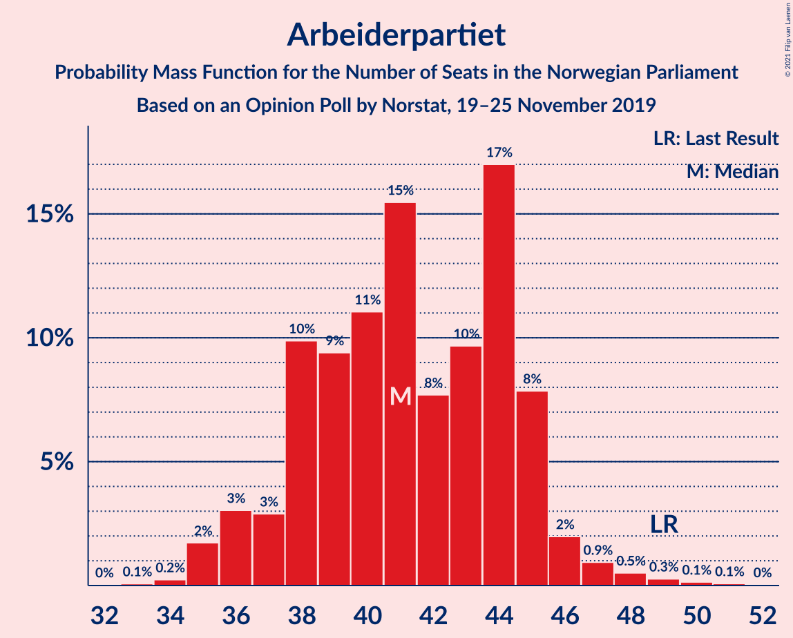

| Number of Seats | Probability | Accumulated | Special Marks |
|:---------------:|:-----------:|:-----------:|:-------------:|
| 33 | 0.1% | 100% |  |
| 34 | 0.2% | 99.9% |  |
| 35 | 2% | 99.6% |  |
| 36 | 3% | 98% |  |
| 37 | 3% | 95% |  |
| 38 | 10% | 92% |  |
| 39 | 9% | 82% |  |
| 40 | 11% | 73% |  |
| 41 | 15% | 62% | Median |
| 42 | 8% | 46% |  |
| 43 | 10% | 38% |  |
| 44 | 17% | 29% |  |
| 45 | 8% | 12% |  |
| 46 | 2% | 4% |  |
| 47 | 0.9% | 2% |  |
| 48 | 0.5% | 1.0% |  |
| 49 | 0.3% | 0.5% | Last Result |
| 50 | 0.1% | 0.3% |  |
| 51 | 0.1% | 0.1% |  |
| 52 | 0% | 0% |  |

### Høyre

*For a full overview of the results for this party, see the [Høyre](party-høyre.html) page.*

| Number of Seats | Probability | Accumulated | Special Marks |
|:---------------:|:-----------:|:-----------:|:-------------:|
| 26 | 0.1% | 100% |  |
| 27 | 0.1% | 99.9% |  |
| 28 | 0.4% | 99.8% |  |
| 29 | 1.5% | 99.4% |  |
| 30 | 2% | 98% |  |
| 31 | 2% | 96% |  |
| 32 | 4% | 94% |  |
| 33 | 14% | 90% |  |
| 34 | 8% | 75% |  |
| 35 | 18% | 67% | Median |
| 36 | 16% | 49% |  |
| 37 | 6% | 34% |  |
| 38 | 22% | 28% |  |
| 39 | 3% | 6% |  |
| 40 | 1.3% | 4% |  |
| 41 | 2% | 3% |  |
| 42 | 0.4% | 0.6% |  |
| 43 | 0.1% | 0.2% |  |
| 44 | 0.1% | 0.1% |  |
| 45 | 0% | 0% | Last Result |

### Senterpartiet

*For a full overview of the results for this party, see the [Senterpartiet](party-senterpartiet.html) page.*

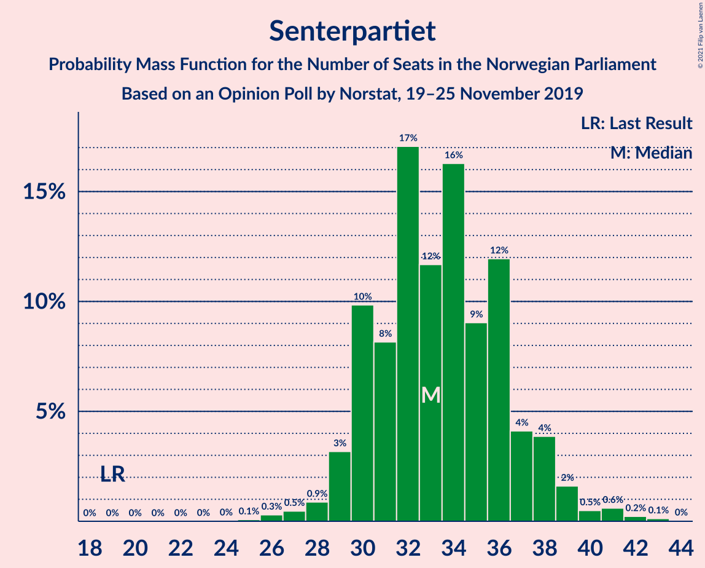

| Number of Seats | Probability | Accumulated | Special Marks |
|:---------------:|:-----------:|:-----------:|:-------------:|
| 19 | 0% | 100% | Last Result |
| 20 | 0% | 100% |  |
| 21 | 0% | 100% |  |
| 22 | 0% | 100% |  |
| 23 | 0% | 100% |  |
| 24 | 0% | 100% |  |
| 25 | 0.1% | 100% |  |
| 26 | 0.3% | 99.9% |  |
| 27 | 0.5% | 99.6% |  |
| 28 | 0.9% | 99.1% |  |
| 29 | 3% | 98% |  |
| 30 | 10% | 95% |  |
| 31 | 8% | 85% |  |
| 32 | 17% | 77% |  |
| 33 | 12% | 60% | Median |
| 34 | 16% | 48% |  |
| 35 | 9% | 32% |  |
| 36 | 12% | 23% |  |
| 37 | 4% | 11% |  |
| 38 | 4% | 7% |  |
| 39 | 2% | 3% |  |
| 40 | 0.5% | 1.5% |  |
| 41 | 0.6% | 1.0% |  |
| 42 | 0.2% | 0.4% |  |
| 43 | 0.1% | 0.2% |  |
| 44 | 0% | 0% |  |

### Fremskrittspartiet

*For a full overview of the results for this party, see the [Fremskrittspartiet](party-fremskrittspartiet.html) page.*

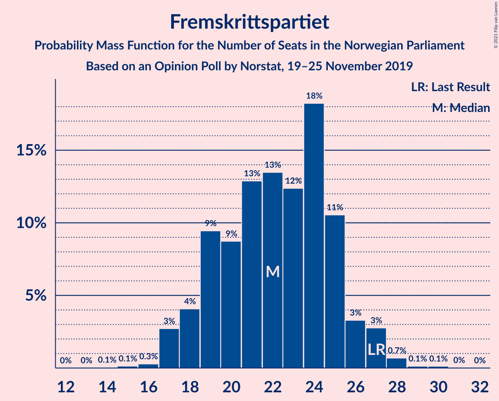

| Number of Seats | Probability | Accumulated | Special Marks |
|:---------------:|:-----------:|:-----------:|:-------------:|
| 14 | 0.1% | 100% |  |
| 15 | 0.1% | 99.9% |  |
| 16 | 0.3% | 99.8% |  |
| 17 | 3% | 99.5% |  |
| 18 | 4% | 97% |  |
| 19 | 9% | 93% |  |
| 20 | 9% | 83% |  |
| 21 | 13% | 75% |  |
| 22 | 13% | 62% | Median |
| 23 | 12% | 48% |  |
| 24 | 18% | 36% |  |
| 25 | 11% | 18% |  |
| 26 | 3% | 7% |  |
| 27 | 3% | 4% | Last Result |
| 28 | 0.7% | 1.0% |  |
| 29 | 0.1% | 0.3% |  |
| 30 | 0.1% | 0.2% |  |
| 31 | 0% | 0% |  |

### Sosialistisk Venstreparti

*For a full overview of the results for this party, see the [Sosialistisk Venstreparti](party-sosialistiskvenstreparti.html) page.*

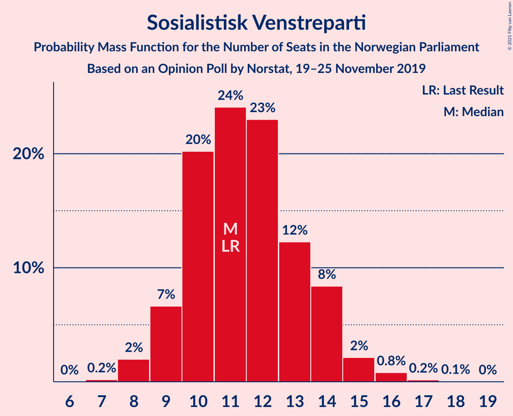

| Number of Seats | Probability | Accumulated | Special Marks |
|:---------------:|:-----------:|:-----------:|:-------------:|
| 7 | 0.2% | 100% |  |
| 8 | 2% | 99.8% |  |
| 9 | 7% | 98% |  |
| 10 | 20% | 91% |  |
| 11 | 24% | 71% | Last Result, Median |
| 12 | 23% | 47% |  |
| 13 | 12% | 24% |  |
| 14 | 8% | 12% |  |
| 15 | 2% | 3% |  |
| 16 | 0.8% | 1.1% |  |
| 17 | 0.2% | 0.2% |  |
| 18 | 0.1% | 0.1% |  |
| 19 | 0% | 0% |  |

### Miljøpartiet De Grønne

*For a full overview of the results for this party, see the [Miljøpartiet De Grønne](party-miljøpartietdegrønne.html) page.*

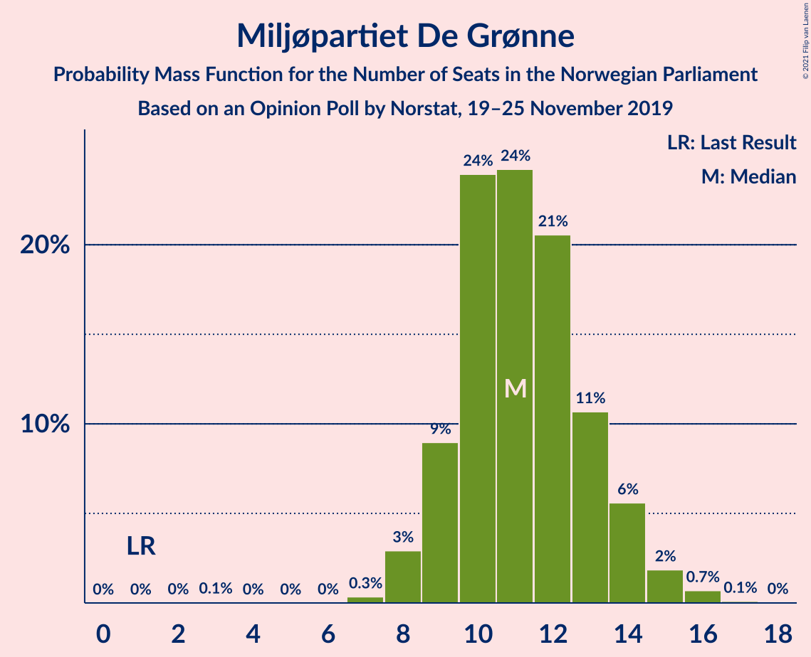

| Number of Seats | Probability | Accumulated | Special Marks |
|:---------------:|:-----------:|:-----------:|:-------------:|
| 1 | 0% | 100% | Last Result |
| 2 | 0% | 100% |  |
| 3 | 0.1% | 100% |  |
| 4 | 0% | 99.9% |  |
| 5 | 0% | 99.9% |  |
| 6 | 0% | 99.9% |  |
| 7 | 0.3% | 99.9% |  |
| 8 | 3% | 99.6% |  |
| 9 | 9% | 97% |  |
| 10 | 24% | 88% |  |
| 11 | 24% | 64% | Median |
| 12 | 21% | 40% |  |
| 13 | 11% | 19% |  |
| 14 | 6% | 8% |  |
| 15 | 2% | 3% |  |
| 16 | 0.7% | 0.8% |  |
| 17 | 0.1% | 0.1% |  |
| 18 | 0% | 0% |  |

### Rødt

*For a full overview of the results for this party, see the [Rødt](party-rødt.html) page.*

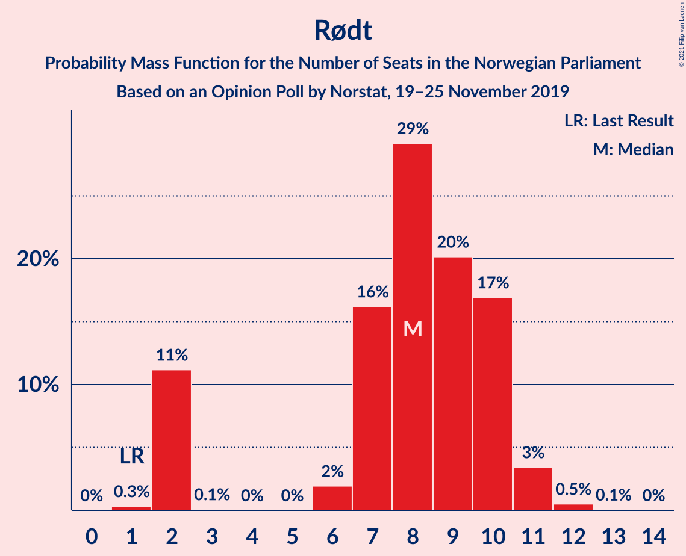

| Number of Seats | Probability | Accumulated | Special Marks |
|:---------------:|:-----------:|:-----------:|:-------------:|
| 1 | 0.3% | 100% | Last Result |
| 2 | 11% | 99.7% |  |
| 3 | 0.1% | 88% |  |
| 4 | 0% | 88% |  |
| 5 | 0% | 88% |  |
| 6 | 2% | 88% |  |
| 7 | 16% | 86% |  |
| 8 | 29% | 70% | Median |
| 9 | 20% | 41% |  |
| 10 | 17% | 21% |  |
| 11 | 3% | 4% |  |
| 12 | 0.5% | 0.6% |  |
| 13 | 0.1% | 0.1% |  |
| 14 | 0% | 0% |  |

### Venstre

*For a full overview of the results for this party, see the [Venstre](party-venstre.html) page.*

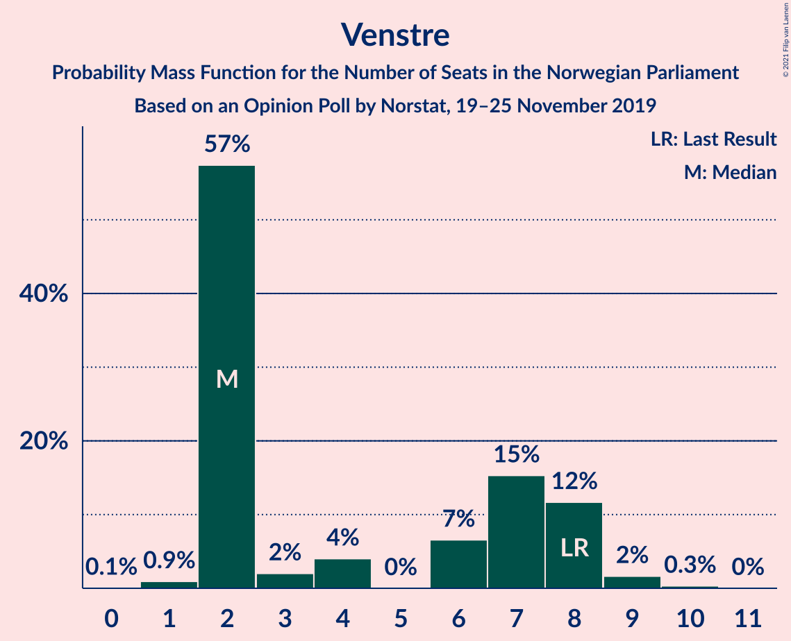

| Number of Seats | Probability | Accumulated | Special Marks |
|:---------------:|:-----------:|:-----------:|:-------------:|
| 0 | 0.1% | 100% |  |
| 1 | 0.9% | 99.9% |  |
| 2 | 57% | 99.0% | Median |
| 3 | 2% | 42% |  |
| 4 | 4% | 40% |  |
| 5 | 0% | 36% |  |
| 6 | 7% | 36% |  |
| 7 | 15% | 29% |  |
| 8 | 12% | 14% | Last Result |
| 9 | 2% | 2% |  |
| 10 | 0.3% | 0.4% |  |
| 11 | 0% | 0% |  |

### Kristelig Folkeparti

*For a full overview of the results for this party, see the [Kristelig Folkeparti](party-kristeligfolkeparti.html) page.*

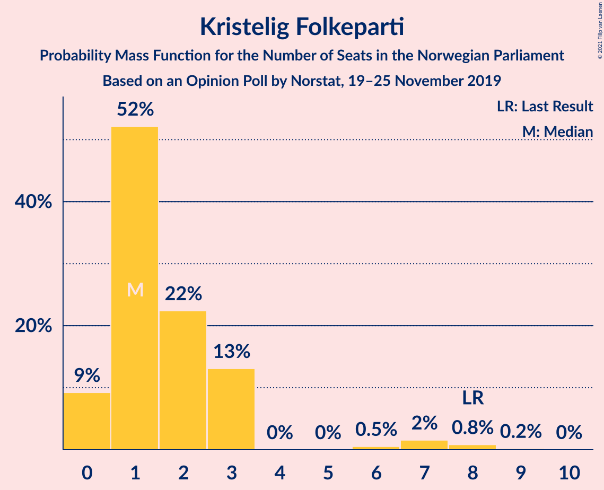

| Number of Seats | Probability | Accumulated | Special Marks |
|:---------------:|:-----------:|:-----------:|:-------------:|
| 0 | 9% | 100% |  |
| 1 | 52% | 91% | Median |
| 2 | 22% | 39% |  |
| 3 | 13% | 16% |  |
| 4 | 0% | 3% |  |
| 5 | 0% | 3% |  |
| 6 | 0.5% | 3% |  |
| 7 | 2% | 3% |  |
| 8 | 0.8% | 1.0% | Last Result |
| 9 | 0.2% | 0.2% |  |
| 10 | 0% | 0% |  |

## Coalitions

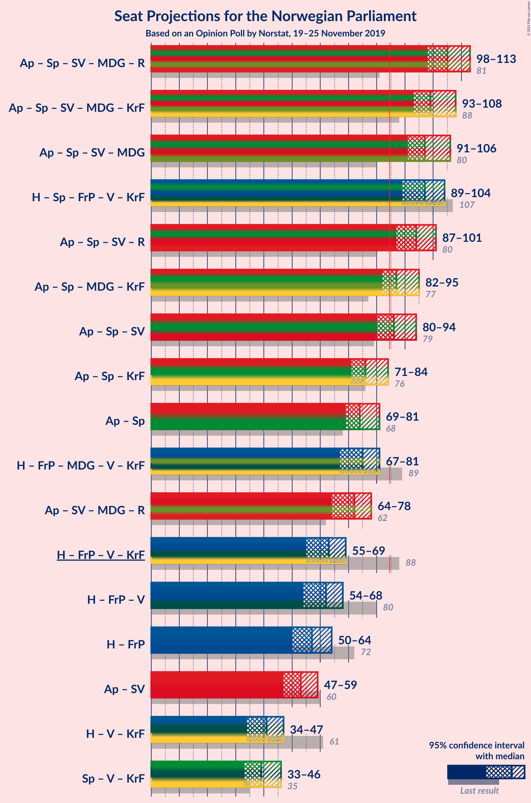

### Confidence Intervals

| Coalition | Last Result | Median | Majority? | 80% Confidence Interval | 90% Confidence Interval | 95% Confidence Interval | 99% Confidence Interval |
|:---------:|:-----------:|:------:|:---------:|:-----------------------:|:-----------------------:|:-----------------------:|:-----------------------:|
| Arbeiderpartiet – Senterpartiet – Sosialistisk Venstreparti – Miljøpartiet De Grønne – Rødt | 81 | 105 | 100% | 101–110 | 99–111 | 98–113 | 94–115 |
| Arbeiderpartiet – Senterpartiet – Sosialistisk Venstreparti – Miljøpartiet De Grønne – Kristelig Folkeparti | 88 | 99 | 100% | 95–104 | 94–106 | 93–108 | 89–110 |
| Arbeiderpartiet – Senterpartiet – Sosialistisk Venstreparti – Miljøpartiet De Grønne | 80 | 97 | 100% | 94–102 | 93–104 | 91–106 | 88–108 |
| Høyre – Senterpartiet – Fremskrittspartiet – Venstre – Kristelig Folkeparti | 107 | 97 | 100% | 93–101 | 91–103 | 89–104 | 87–107 |
| Arbeiderpartiet – Senterpartiet – Sosialistisk Venstreparti – Rødt | 80 | 94 | 99.1% | 90–98 | 88–100 | 87–101 | 84–103 |
| Arbeiderpartiet – Senterpartiet – Miljøpartiet De Grønne – Kristelig Folkeparti | 77 | 87 | 83% | 84–93 | 83–94 | 82–95 | 79–98 |
| Arbeiderpartiet – Senterpartiet – Sosialistisk Venstreparti | 79 | 86 | 69% | 82–90 | 81–92 | 80–94 | 78–96 |
| Arbeiderpartiet – Senterpartiet – Kristelig Folkeparti | 76 | 76 | 2% | 72–81 | 72–83 | 71–84 | 68–87 |
| Arbeiderpartiet – Senterpartiet | 68 | 74 | 0.1% | 71–79 | 71–80 | 69–81 | 66–83 |
| Høyre – Fremskrittspartiet – Miljøpartiet De Grønne – Venstre – Kristelig Folkeparti | 89 | 75 | 0.7% | 70–78 | 68–80 | 67–81 | 64–85 |
| Arbeiderpartiet – Sosialistisk Venstreparti – Miljøpartiet De Grønne – Rødt | 62 | 72 | 0% | 67–76 | 65–77 | 64–78 | 61–81 |
| Høyre – Fremskrittspartiet – Venstre – Kristelig Folkeparti | 88 | 63 | 0% | 59–67 | 57–68 | 55–69 | 53–73 |
| Høyre – Fremskrittspartiet – Venstre | 80 | 62 | 0% | 57–65 | 55–67 | 54–68 | 51–72 |
| Høyre – Fremskrittspartiet | 72 | 57 | 0% | 53–62 | 52–63 | 50–64 | 48–66 |
| Arbeiderpartiet – Sosialistisk Venstreparti | 60 | 53 | 0% | 49–56 | 48–57 | 47–59 | 45–62 |
| Høyre – Venstre – Kristelig Folkeparti | 61 | 41 | 0% | 37–44 | 36–45 | 34–47 | 33–50 |
| Senterpartiet – Venstre – Kristelig Folkeparti | 35 | 39 | 0% | 34–44 | 33–45 | 33–46 | 31–49 |

### Arbeiderpartiet – Senterpartiet – Sosialistisk Venstreparti – Miljøpartiet De Grønne – Rødt

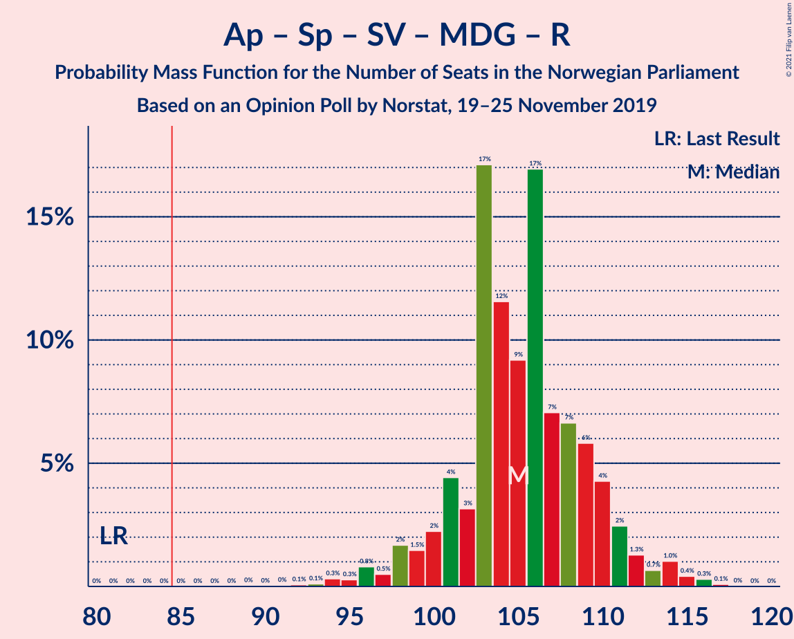

| Number of Seats | Probability | Accumulated | Special Marks |
|:---------------:|:-----------:|:-----------:|:-------------:|
| 81 | 0% | 100% | Last Result |
| 82 | 0% | 100% |  |
| 83 | 0% | 100% |  |
| 84 | 0% | 100% |  |
| 85 | 0% | 100% | Majority |
| 86 | 0% | 100% |  |
| 87 | 0% | 100% |  |
| 88 | 0% | 100% |  |
| 89 | 0% | 100% |  |
| 90 | 0% | 100% |  |
| 91 | 0% | 99.9% |  |
| 92 | 0.1% | 99.9% |  |
| 93 | 0.1% | 99.8% |  |
| 94 | 0.3% | 99.7% |  |
| 95 | 0.3% | 99.4% |  |
| 96 | 0.8% | 99.1% |  |
| 97 | 0.5% | 98% |  |
| 98 | 2% | 98% |  |
| 99 | 1.5% | 96% |  |
| 100 | 2% | 95% |  |
| 101 | 4% | 92% |  |
| 102 | 3% | 88% |  |
| 103 | 17% | 85% |  |
| 104 | 12% | 68% | Median |
| 105 | 9% | 56% |  |
| 106 | 17% | 47% |  |
| 107 | 7% | 30% |  |
| 108 | 7% | 23% |  |
| 109 | 6% | 16% |  |
| 110 | 4% | 11% |  |
| 111 | 2% | 6% |  |
| 112 | 1.3% | 4% |  |
| 113 | 0.7% | 3% |  |
| 114 | 1.0% | 2% |  |
| 115 | 0.4% | 0.8% |  |
| 116 | 0.3% | 0.4% |  |
| 117 | 0.1% | 0.1% |  |
| 118 | 0% | 0% |  |

### Arbeiderpartiet – Senterpartiet – Sosialistisk Venstreparti – Miljøpartiet De Grønne – Kristelig Folkeparti

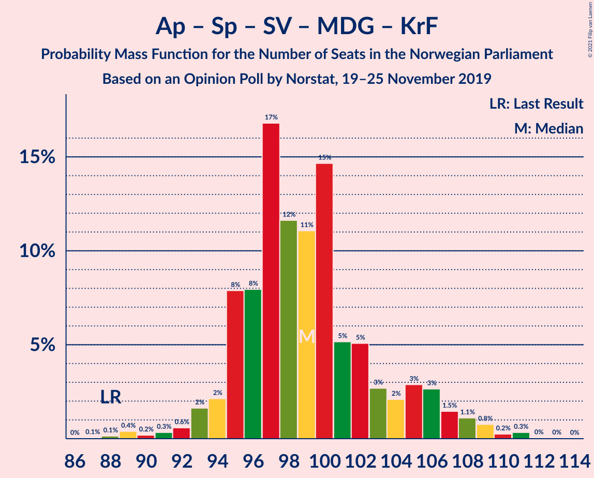

| Number of Seats | Probability | Accumulated | Special Marks |
|:---------------:|:-----------:|:-----------:|:-------------:|
| 87 | 0.1% | 100% |  |
| 88 | 0.1% | 99.9% | Last Result |
| 89 | 0.4% | 99.8% |  |
| 90 | 0.2% | 99.4% |  |
| 91 | 0.3% | 99.2% |  |
| 92 | 0.6% | 98.9% |  |
| 93 | 2% | 98% |  |
| 94 | 2% | 97% |  |
| 95 | 8% | 95% |  |
| 96 | 8% | 87% |  |
| 97 | 17% | 79% | Median |
| 98 | 12% | 62% |  |
| 99 | 11% | 50% |  |
| 100 | 15% | 39% |  |
| 101 | 5% | 25% |  |
| 102 | 5% | 19% |  |
| 103 | 3% | 14% |  |
| 104 | 2% | 12% |  |
| 105 | 3% | 10% |  |
| 106 | 3% | 7% |  |
| 107 | 1.5% | 4% |  |
| 108 | 1.1% | 3% |  |
| 109 | 0.8% | 1.4% |  |
| 110 | 0.2% | 0.7% |  |
| 111 | 0.3% | 0.4% |  |
| 112 | 0% | 0.1% |  |
| 113 | 0% | 0% |  |

### Arbeiderpartiet – Senterpartiet – Sosialistisk Venstreparti – Miljøpartiet De Grønne

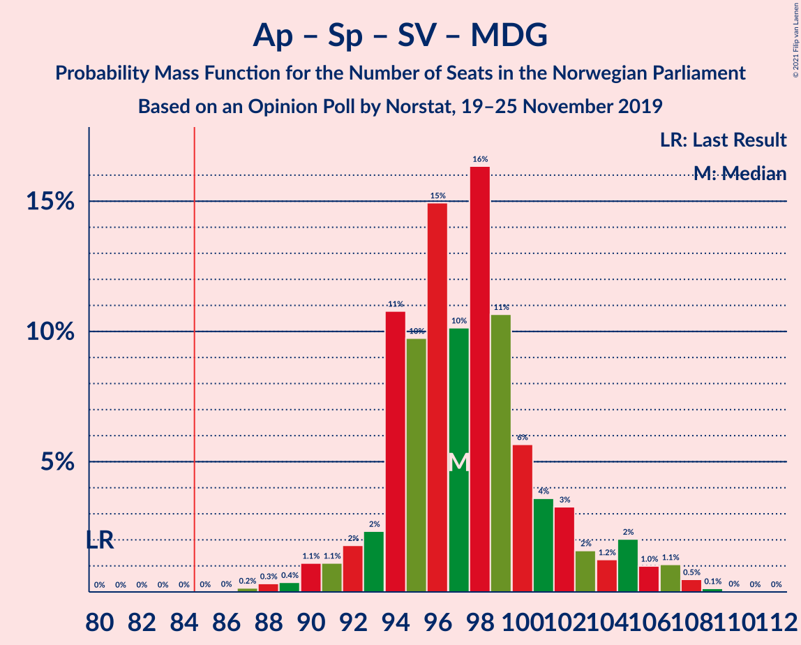

| Number of Seats | Probability | Accumulated | Special Marks |
|:---------------:|:-----------:|:-----------:|:-------------:|
| 80 | 0% | 100% | Last Result |
| 81 | 0% | 100% |  |
| 82 | 0% | 100% |  |
| 83 | 0% | 100% |  |
| 84 | 0% | 100% |  |
| 85 | 0% | 100% | Majority |
| 86 | 0% | 100% |  |
| 87 | 0.2% | 99.9% |  |
| 88 | 0.3% | 99.8% |  |
| 89 | 0.4% | 99.5% |  |
| 90 | 1.1% | 99.1% |  |
| 91 | 1.1% | 98% |  |
| 92 | 2% | 97% |  |
| 93 | 2% | 95% |  |
| 94 | 11% | 93% |  |
| 95 | 10% | 82% |  |
| 96 | 15% | 72% | Median |
| 97 | 10% | 57% |  |
| 98 | 16% | 47% |  |
| 99 | 11% | 31% |  |
| 100 | 6% | 20% |  |
| 101 | 4% | 14% |  |
| 102 | 3% | 11% |  |
| 103 | 2% | 8% |  |
| 104 | 1.2% | 6% |  |
| 105 | 2% | 5% |  |
| 106 | 1.0% | 3% |  |
| 107 | 1.1% | 2% |  |
| 108 | 0.5% | 0.7% |  |
| 109 | 0.1% | 0.2% |  |
| 110 | 0% | 0.1% |  |
| 111 | 0% | 0% |  |

### Høyre – Senterpartiet – Fremskrittspartiet – Venstre – Kristelig Folkeparti

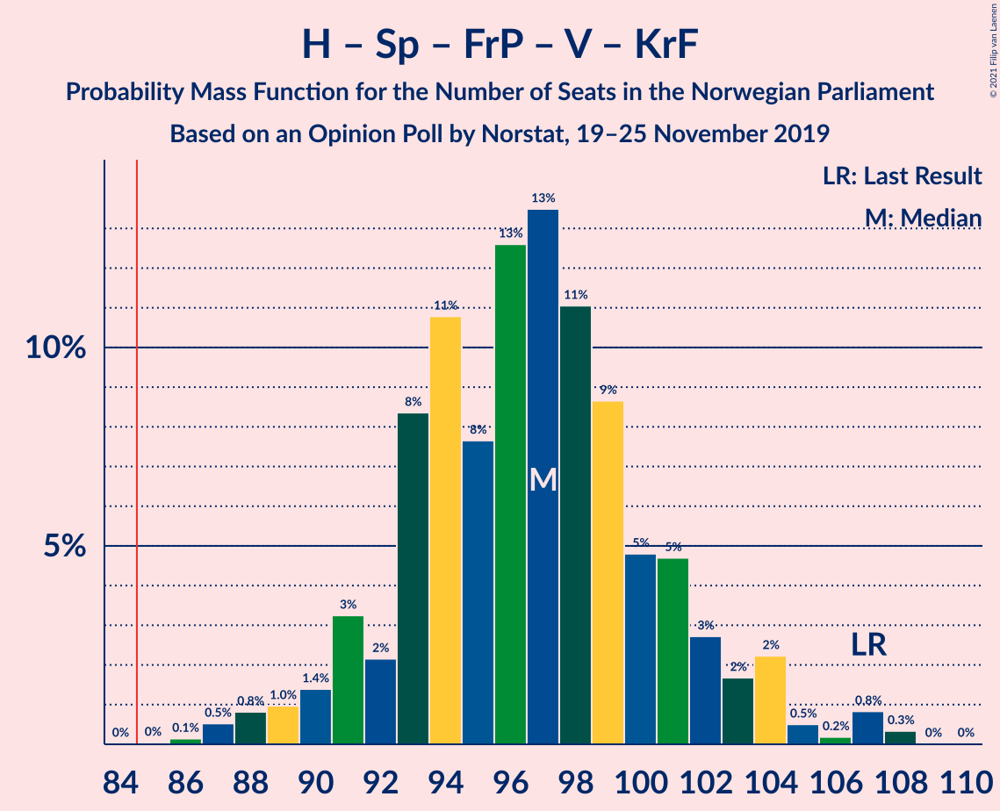

| Number of Seats | Probability | Accumulated | Special Marks |
|:---------------:|:-----------:|:-----------:|:-------------:|
| 85 | 0% | 100% | Majority |
| 86 | 0.1% | 99.9% |  |
| 87 | 0.5% | 99.8% |  |
| 88 | 0.8% | 99.2% |  |
| 89 | 1.0% | 98% |  |
| 90 | 1.4% | 97% |  |
| 91 | 3% | 96% |  |
| 92 | 2% | 93% |  |
| 93 | 8% | 91% | Median |
| 94 | 11% | 82% |  |
| 95 | 8% | 72% |  |
| 96 | 13% | 64% |  |
| 97 | 13% | 51% |  |
| 98 | 11% | 38% |  |
| 99 | 9% | 27% |  |
| 100 | 5% | 18% |  |
| 101 | 5% | 13% |  |
| 102 | 3% | 9% |  |
| 103 | 2% | 6% |  |
| 104 | 2% | 4% |  |
| 105 | 0.5% | 2% |  |
| 106 | 0.2% | 1.4% |  |
| 107 | 0.8% | 1.2% | Last Result |
| 108 | 0.3% | 0.4% |  |
| 109 | 0% | 0.1% |  |
| 110 | 0% | 0% |  |

### Arbeiderpartiet – Senterpartiet – Sosialistisk Venstreparti – Rødt

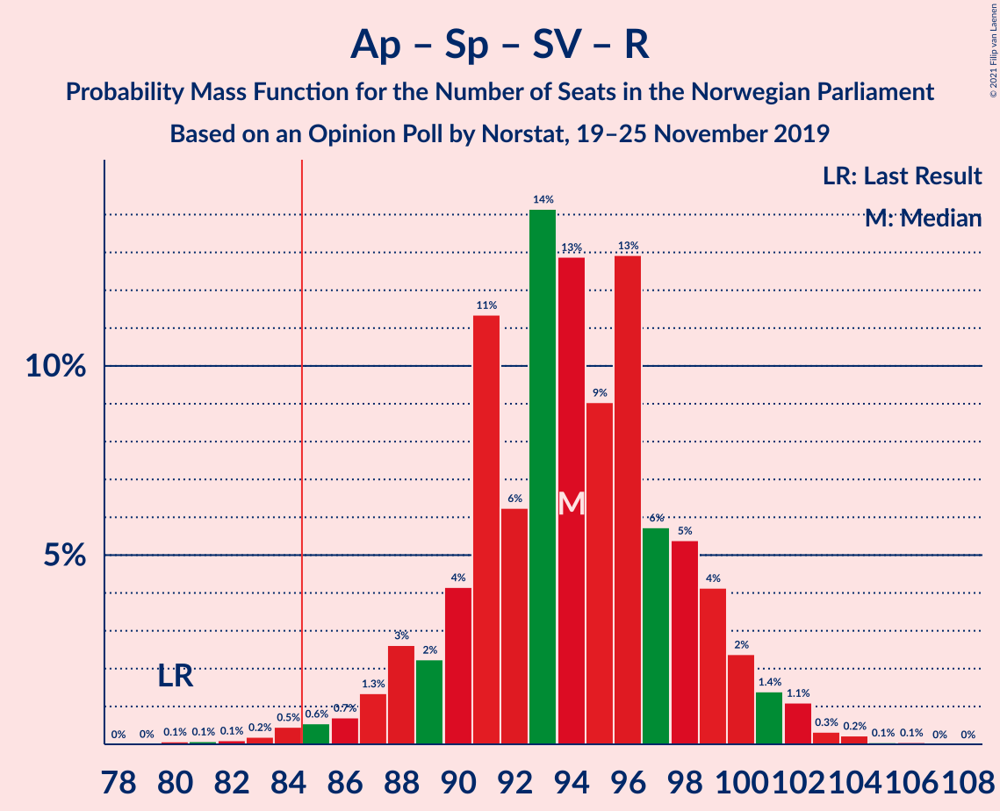

| Number of Seats | Probability | Accumulated | Special Marks |
|:---------------:|:-----------:|:-----------:|:-------------:|
| 80 | 0.1% | 100% | Last Result |
| 81 | 0.1% | 99.9% |  |
| 82 | 0.1% | 99.8% |  |
| 83 | 0.2% | 99.7% |  |
| 84 | 0.5% | 99.5% |  |
| 85 | 0.6% | 99.1% | Majority |
| 86 | 0.7% | 98.5% |  |
| 87 | 1.3% | 98% |  |
| 88 | 3% | 96% |  |
| 89 | 2% | 94% |  |
| 90 | 4% | 92% |  |
| 91 | 11% | 87% |  |
| 92 | 6% | 76% |  |
| 93 | 14% | 70% | Median |
| 94 | 13% | 56% |  |
| 95 | 9% | 43% |  |
| 96 | 13% | 34% |  |
| 97 | 6% | 21% |  |
| 98 | 5% | 15% |  |
| 99 | 4% | 10% |  |
| 100 | 2% | 6% |  |
| 101 | 1.4% | 3% |  |
| 102 | 1.1% | 2% |  |
| 103 | 0.3% | 0.7% |  |
| 104 | 0.2% | 0.3% |  |
| 105 | 0.1% | 0.1% |  |
| 106 | 0.1% | 0.1% |  |
| 107 | 0% | 0% |  |

### Arbeiderpartiet – Senterpartiet – Miljøpartiet De Grønne – Kristelig Folkeparti

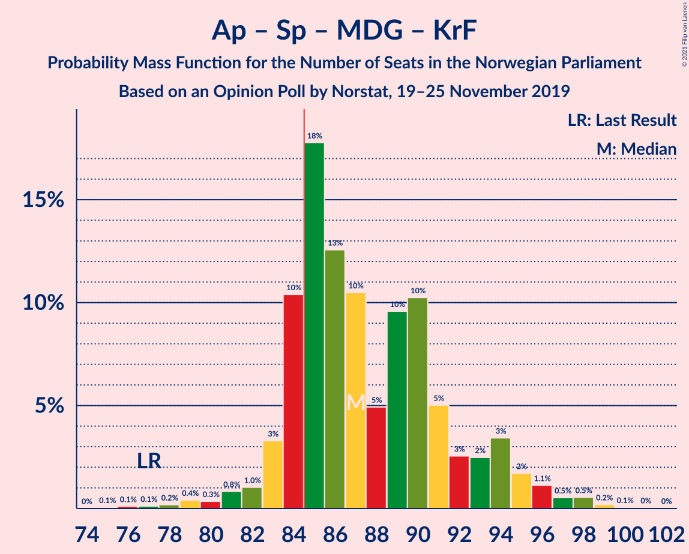

| Number of Seats | Probability | Accumulated | Special Marks |
|:---------------:|:-----------:|:-----------:|:-------------:|
| 75 | 0.1% | 100% |  |
| 76 | 0.1% | 99.9% |  |
| 77 | 0.1% | 99.8% | Last Result |
| 78 | 0.2% | 99.7% |  |
| 79 | 0.4% | 99.5% |  |
| 80 | 0.3% | 99.1% |  |
| 81 | 0.8% | 98.8% |  |
| 82 | 1.0% | 98% |  |
| 83 | 3% | 97% |  |
| 84 | 10% | 94% |  |
| 85 | 18% | 83% | Majority |
| 86 | 13% | 65% | Median |
| 87 | 10% | 53% |  |
| 88 | 5% | 42% |  |
| 89 | 10% | 37% |  |
| 90 | 10% | 28% |  |
| 91 | 5% | 18% |  |
| 92 | 3% | 13% |  |
| 93 | 2% | 10% |  |
| 94 | 3% | 8% |  |
| 95 | 2% | 4% |  |
| 96 | 1.1% | 2% |  |
| 97 | 0.5% | 1.4% |  |
| 98 | 0.5% | 0.8% |  |
| 99 | 0.2% | 0.3% |  |
| 100 | 0.1% | 0.1% |  |
| 101 | 0% | 0.1% |  |
| 102 | 0% | 0% |  |

### Arbeiderpartiet – Senterpartiet – Sosialistisk Venstreparti

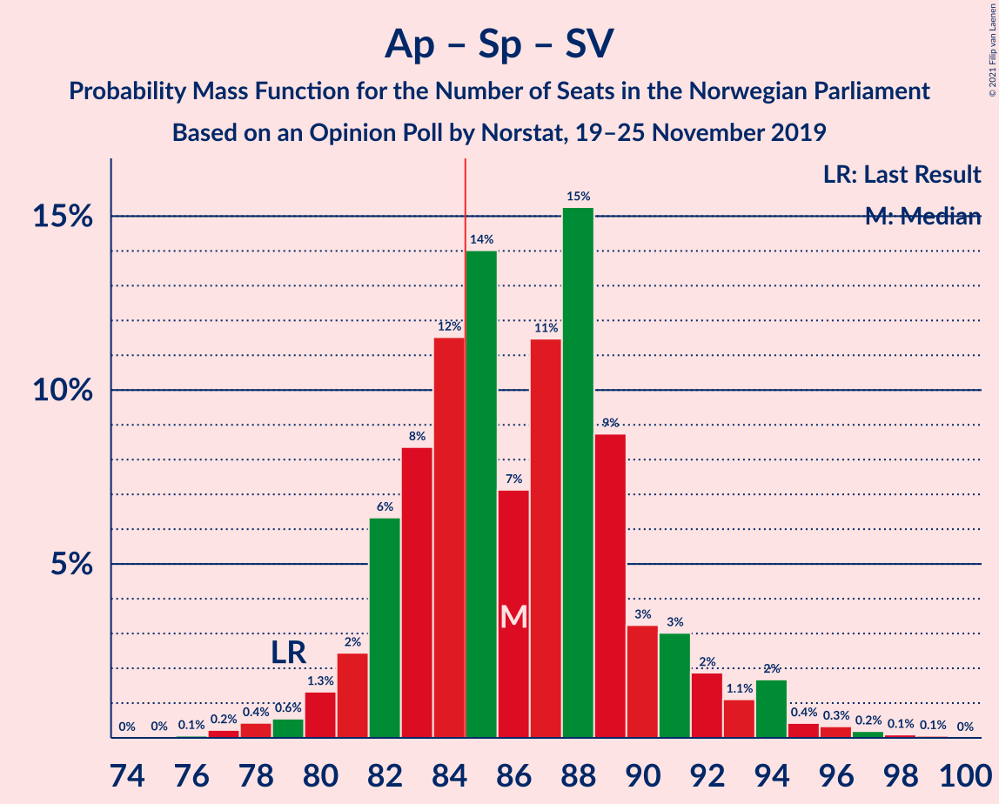

| Number of Seats | Probability | Accumulated | Special Marks |
|:---------------:|:-----------:|:-----------:|:-------------:|
| 76 | 0.1% | 100% |  |
| 77 | 0.2% | 99.9% |  |
| 78 | 0.4% | 99.7% |  |
| 79 | 0.6% | 99.2% | Last Result |
| 80 | 1.3% | 98.7% |  |
| 81 | 2% | 97% |  |
| 82 | 6% | 95% |  |
| 83 | 8% | 89% |  |
| 84 | 12% | 80% |  |
| 85 | 14% | 69% | Median, Majority |
| 86 | 7% | 55% |  |
| 87 | 11% | 48% |  |
| 88 | 15% | 36% |  |
| 89 | 9% | 21% |  |
| 90 | 3% | 12% |  |
| 91 | 3% | 9% |  |
| 92 | 2% | 6% |  |
| 93 | 1.1% | 4% |  |
| 94 | 2% | 3% |  |
| 95 | 0.4% | 1.1% |  |
| 96 | 0.3% | 0.7% |  |
| 97 | 0.2% | 0.4% |  |
| 98 | 0.1% | 0.2% |  |
| 99 | 0.1% | 0.1% |  |
| 100 | 0% | 0% |  |

### Arbeiderpartiet – Senterpartiet – Kristelig Folkeparti

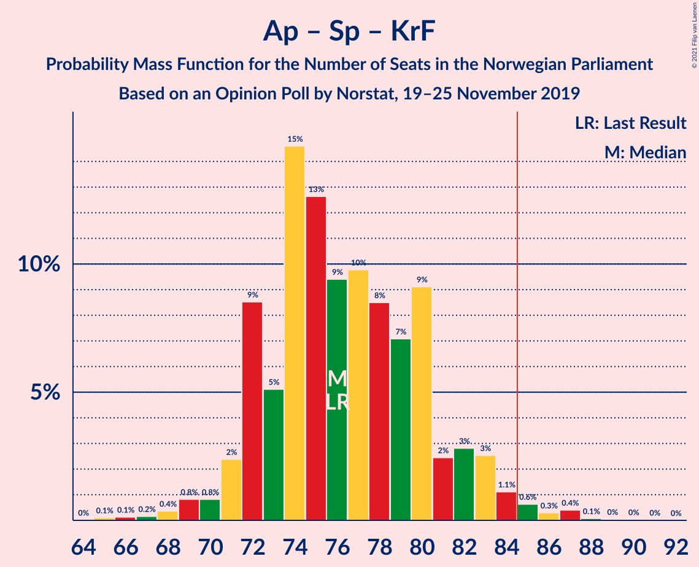

| Number of Seats | Probability | Accumulated | Special Marks |
|:---------------:|:-----------:|:-----------:|:-------------:|
| 65 | 0.1% | 100% |  |
| 66 | 0.1% | 99.9% |  |
| 67 | 0.2% | 99.7% |  |
| 68 | 0.4% | 99.6% |  |
| 69 | 0.8% | 99.2% |  |
| 70 | 0.8% | 98% |  |
| 71 | 2% | 98% |  |
| 72 | 9% | 95% |  |
| 73 | 5% | 87% |  |
| 74 | 15% | 82% |  |
| 75 | 13% | 67% | Median |
| 76 | 9% | 54% | Last Result |
| 77 | 10% | 45% |  |
| 78 | 8% | 35% |  |
| 79 | 7% | 27% |  |
| 80 | 9% | 20% |  |
| 81 | 2% | 10% |  |
| 82 | 3% | 8% |  |
| 83 | 3% | 5% |  |
| 84 | 1.1% | 3% |  |
| 85 | 0.6% | 2% | Majority |
| 86 | 0.3% | 0.9% |  |
| 87 | 0.4% | 0.6% |  |
| 88 | 0.1% | 0.2% |  |
| 89 | 0% | 0.1% |  |
| 90 | 0% | 0.1% |  |
| 91 | 0% | 0% |  |

### Arbeiderpartiet – Senterpartiet

| Number of Seats | Probability | Accumulated | Special Marks |
|:---------------:|:-----------:|:-----------:|:-------------:|
| 64 | 0.1% | 100% |  |
| 65 | 0.2% | 99.9% |  |
| 66 | 0.2% | 99.7% |  |
| 67 | 0.4% | 99.5% |  |
| 68 | 0.9% | 99.1% | Last Result |
| 69 | 1.0% | 98% |  |
| 70 | 2% | 97% |  |
| 71 | 11% | 96% |  |
| 72 | 6% | 84% |  |
| 73 | 16% | 78% |  |
| 74 | 13% | 61% | Median |
| 75 | 10% | 48% |  |
| 76 | 10% | 39% |  |
| 77 | 7% | 29% |  |
| 78 | 10% | 21% |  |
| 79 | 3% | 11% |  |
| 80 | 4% | 8% |  |
| 81 | 2% | 4% |  |
| 82 | 0.7% | 2% |  |
| 83 | 0.6% | 1.1% |  |
| 84 | 0.4% | 0.5% |  |
| 85 | 0% | 0.1% | Majority |
| 86 | 0% | 0.1% |  |
| 87 | 0% | 0% |  |

### Høyre – Fremskrittspartiet – Miljøpartiet De Grønne – Venstre – Kristelig Folkeparti

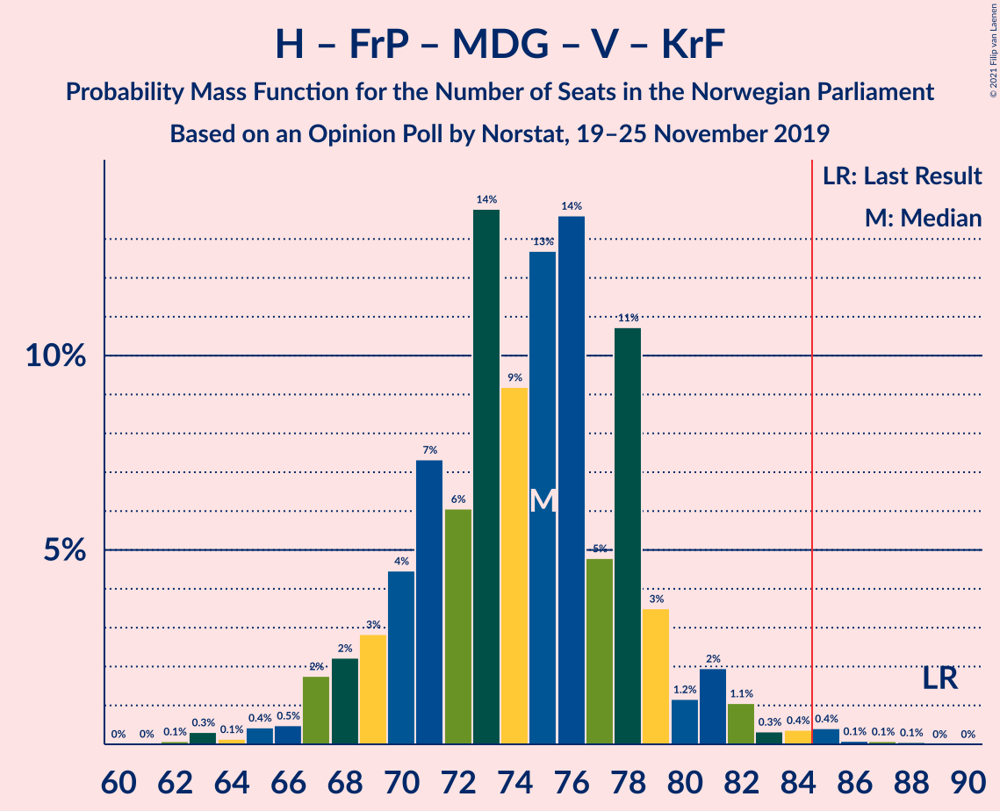

| Number of Seats | Probability | Accumulated | Special Marks |
|:---------------:|:-----------:|:-----------:|:-------------:|
| 62 | 0.1% | 100% |  |
| 63 | 0.3% | 99.9% |  |
| 64 | 0.1% | 99.6% |  |
| 65 | 0.4% | 99.4% |  |
| 66 | 0.5% | 99.0% |  |
| 67 | 2% | 98.5% |  |
| 68 | 2% | 97% |  |
| 69 | 3% | 95% |  |
| 70 | 4% | 92% |  |
| 71 | 7% | 87% | Median |
| 72 | 6% | 80% |  |
| 73 | 14% | 74% |  |
| 74 | 9% | 60% |  |
| 75 | 13% | 51% |  |
| 76 | 14% | 38% |  |
| 77 | 5% | 25% |  |
| 78 | 11% | 20% |  |
| 79 | 3% | 9% |  |
| 80 | 1.2% | 6% |  |
| 81 | 2% | 4% |  |
| 82 | 1.1% | 2% |  |
| 83 | 0.3% | 1.4% |  |
| 84 | 0.4% | 1.0% |  |
| 85 | 0.4% | 0.7% | Majority |
| 86 | 0.1% | 0.3% |  |
| 87 | 0.1% | 0.2% |  |
| 88 | 0.1% | 0.1% |  |
| 89 | 0% | 0% | Last Result |

### Arbeiderpartiet – Sosialistisk Venstreparti – Miljøpartiet De Grønne – Rødt

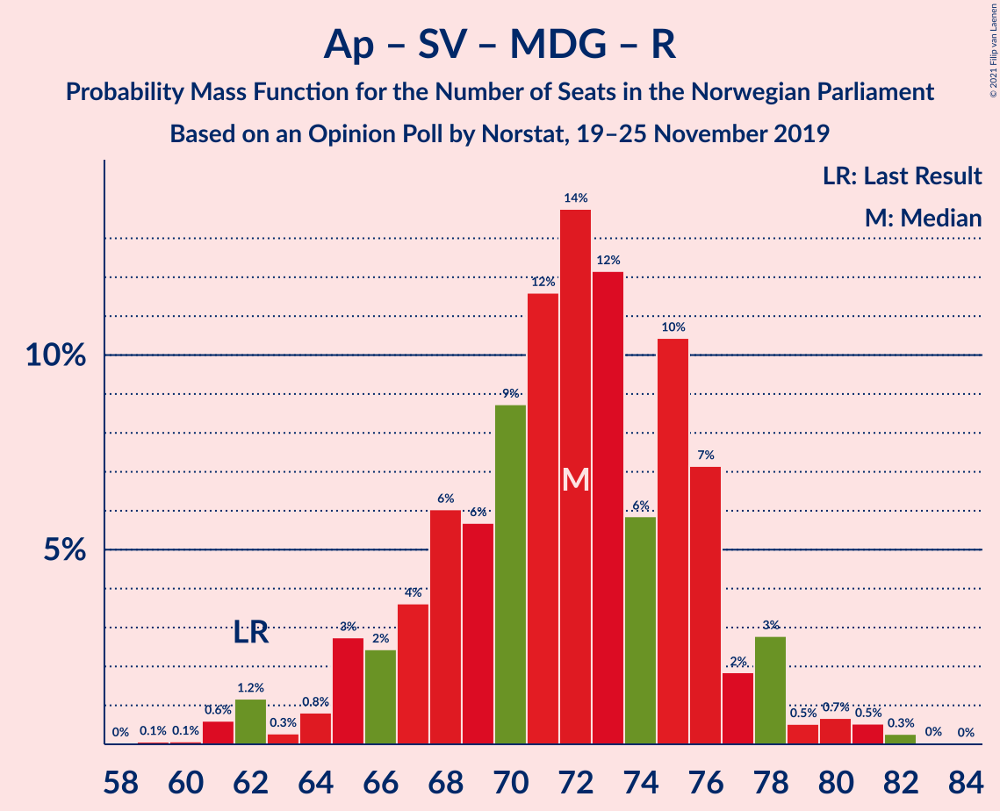

| Number of Seats | Probability | Accumulated | Special Marks |
|:---------------:|:-----------:|:-----------:|:-------------:|
| 58 | 0% | 100% |  |
| 59 | 0.1% | 99.9% |  |
| 60 | 0.1% | 99.9% |  |
| 61 | 0.6% | 99.8% |  |
| 62 | 1.2% | 99.2% | Last Result |
| 63 | 0.3% | 98% |  |
| 64 | 0.8% | 98% |  |
| 65 | 3% | 97% |  |
| 66 | 2% | 94% |  |
| 67 | 4% | 92% |  |
| 68 | 6% | 88% |  |
| 69 | 6% | 82% |  |
| 70 | 9% | 76% |  |
| 71 | 12% | 68% | Median |
| 72 | 14% | 56% |  |
| 73 | 12% | 42% |  |
| 74 | 6% | 30% |  |
| 75 | 10% | 24% |  |
| 76 | 7% | 14% |  |
| 77 | 2% | 7% |  |
| 78 | 3% | 5% |  |
| 79 | 0.5% | 2% |  |
| 80 | 0.7% | 2% |  |
| 81 | 0.5% | 0.9% |  |
| 82 | 0.3% | 0.4% |  |
| 83 | 0% | 0.1% |  |
| 84 | 0% | 0% |  |

### Høyre – Fremskrittspartiet – Venstre – Kristelig Folkeparti

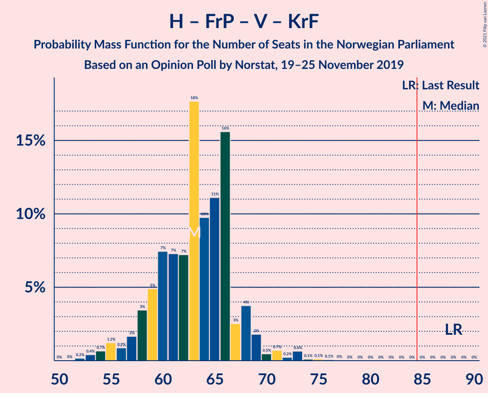

| Number of Seats | Probability | Accumulated | Special Marks |
|:---------------:|:-----------:|:-----------:|:-------------:|
| 51 | 0% | 100% |  |
| 52 | 0.2% | 99.9% |  |
| 53 | 0.4% | 99.8% |  |
| 54 | 0.7% | 99.4% |  |
| 55 | 1.2% | 98.7% |  |
| 56 | 0.9% | 97% |  |
| 57 | 2% | 97% |  |
| 58 | 3% | 95% |  |
| 59 | 5% | 91% |  |
| 60 | 7% | 87% | Median |
| 61 | 7% | 79% |  |
| 62 | 7% | 72% |  |
| 63 | 18% | 65% |  |
| 64 | 10% | 47% |  |
| 65 | 11% | 37% |  |
| 66 | 16% | 26% |  |
| 67 | 3% | 10% |  |
| 68 | 4% | 8% |  |
| 69 | 2% | 4% |  |
| 70 | 0.5% | 2% |  |
| 71 | 0.7% | 2% |  |
| 72 | 0.2% | 1.2% |  |
| 73 | 0.6% | 1.0% |  |
| 74 | 0.1% | 0.3% |  |
| 75 | 0.1% | 0.2% |  |
| 76 | 0.1% | 0.1% |  |
| 77 | 0% | 0.1% |  |
| 78 | 0% | 0% |  |
| 79 | 0% | 0% |  |
| 80 | 0% | 0% |  |
| 81 | 0% | 0% |  |
| 82 | 0% | 0% |  |
| 83 | 0% | 0% |  |
| 84 | 0% | 0% |  |
| 85 | 0% | 0% | Majority |
| 86 | 0% | 0% |  |
| 87 | 0% | 0% |  |
| 88 | 0% | 0% | Last Result |

### Høyre – Fremskrittspartiet – Venstre

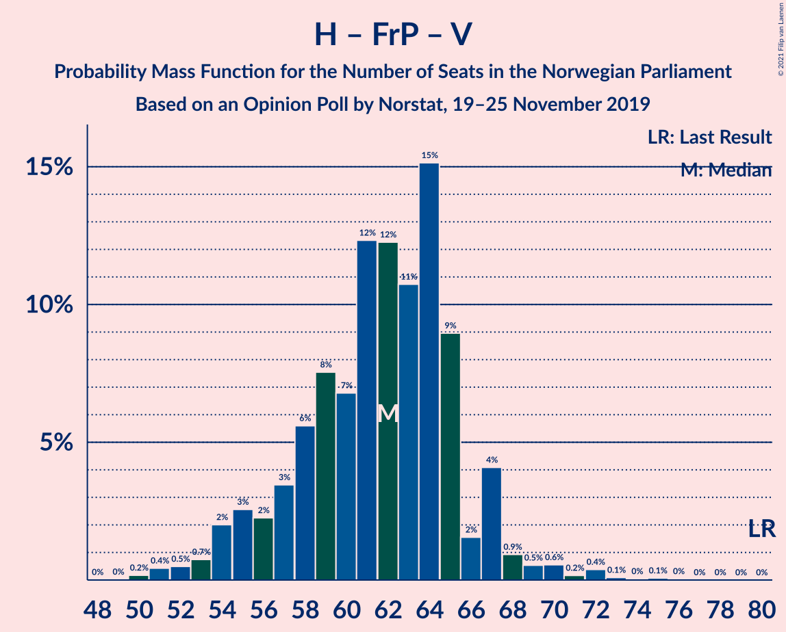

| Number of Seats | Probability | Accumulated | Special Marks |
|:---------------:|:-----------:|:-----------:|:-------------:|
| 50 | 0.2% | 100% |  |
| 51 | 0.4% | 99.8% |  |
| 52 | 0.5% | 99.4% |  |
| 53 | 0.7% | 98.9% |  |
| 54 | 2% | 98% |  |
| 55 | 3% | 96% |  |
| 56 | 2% | 94% |  |
| 57 | 3% | 91% |  |
| 58 | 6% | 88% |  |
| 59 | 8% | 82% | Median |
| 60 | 7% | 75% |  |
| 61 | 12% | 68% |  |
| 62 | 12% | 56% |  |
| 63 | 11% | 43% |  |
| 64 | 15% | 33% |  |
| 65 | 9% | 17% |  |
| 66 | 2% | 8% |  |
| 67 | 4% | 7% |  |
| 68 | 0.9% | 3% |  |
| 69 | 0.5% | 2% |  |
| 70 | 0.6% | 1.4% |  |
| 71 | 0.2% | 0.8% |  |
| 72 | 0.4% | 0.6% |  |
| 73 | 0.1% | 0.3% |  |
| 74 | 0% | 0.2% |  |
| 75 | 0.1% | 0.1% |  |
| 76 | 0% | 0.1% |  |
| 77 | 0% | 0% |  |
| 78 | 0% | 0% |  |
| 79 | 0% | 0% |  |
| 80 | 0% | 0% | Last Result |

### Høyre – Fremskrittspartiet

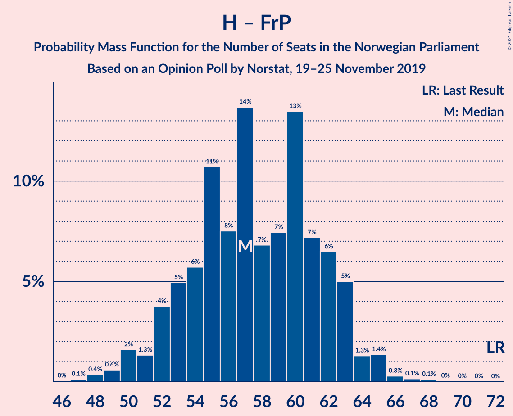

| Number of Seats | Probability | Accumulated | Special Marks |
|:---------------:|:-----------:|:-----------:|:-------------:|
| 46 | 0% | 100% |  |
| 47 | 0.1% | 99.9% |  |
| 48 | 0.4% | 99.8% |  |
| 49 | 0.6% | 99.5% |  |
| 50 | 2% | 98.9% |  |
| 51 | 1.3% | 97% |  |
| 52 | 4% | 96% |  |
| 53 | 5% | 92% |  |
| 54 | 6% | 87% |  |
| 55 | 11% | 82% |  |
| 56 | 8% | 71% |  |
| 57 | 14% | 63% | Median |
| 58 | 7% | 50% |  |
| 59 | 7% | 43% |  |
| 60 | 13% | 35% |  |
| 61 | 7% | 22% |  |
| 62 | 6% | 15% |  |
| 63 | 5% | 8% |  |
| 64 | 1.3% | 3% |  |
| 65 | 1.4% | 2% |  |
| 66 | 0.3% | 0.6% |  |
| 67 | 0.1% | 0.3% |  |
| 68 | 0.1% | 0.2% |  |
| 69 | 0% | 0.1% |  |
| 70 | 0% | 0% |  |
| 71 | 0% | 0% |  |
| 72 | 0% | 0% | Last Result |

### Arbeiderpartiet – Sosialistisk Venstreparti

| Number of Seats | Probability | Accumulated | Special Marks |
|:---------------:|:-----------:|:-----------:|:-------------:|
| 43 | 0% | 100% |  |
| 44 | 0.1% | 99.9% |  |
| 45 | 0.4% | 99.9% |  |
| 46 | 0.5% | 99.5% |  |
| 47 | 4% | 99.0% |  |
| 48 | 2% | 95% |  |
| 49 | 6% | 93% |  |
| 50 | 10% | 88% |  |
| 51 | 11% | 78% |  |
| 52 | 11% | 67% | Median |
| 53 | 14% | 56% |  |
| 54 | 16% | 42% |  |
| 55 | 11% | 26% |  |
| 56 | 6% | 15% |  |
| 57 | 4% | 9% |  |
| 58 | 1.4% | 5% |  |
| 59 | 1.3% | 3% |  |
| 60 | 1.1% | 2% | Last Result |
| 61 | 0.5% | 1.2% |  |
| 62 | 0.2% | 0.6% |  |
| 63 | 0.2% | 0.4% |  |
| 64 | 0.1% | 0.2% |  |
| 65 | 0% | 0.1% |  |
| 66 | 0% | 0% |  |

### Høyre – Venstre – Kristelig Folkeparti

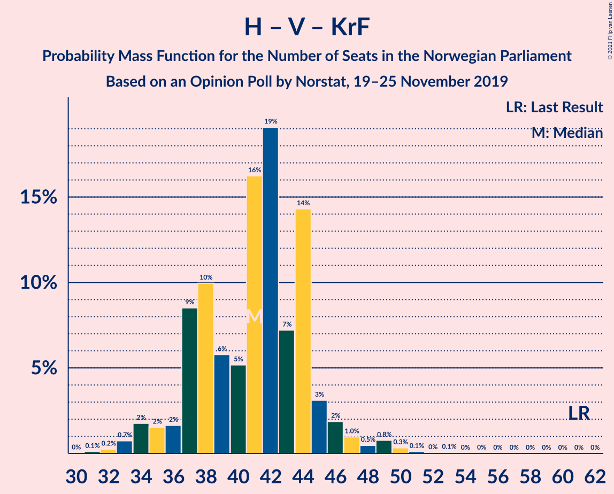

| Number of Seats | Probability | Accumulated | Special Marks |
|:---------------:|:-----------:|:-----------:|:-------------:|
| 31 | 0.1% | 100% |  |
| 32 | 0.2% | 99.9% |  |
| 33 | 0.7% | 99.6% |  |
| 34 | 2% | 98.9% |  |
| 35 | 2% | 97% |  |
| 36 | 2% | 96% |  |
| 37 | 9% | 94% |  |
| 38 | 10% | 85% | Median |
| 39 | 6% | 75% |  |
| 40 | 5% | 70% |  |
| 41 | 16% | 65% |  |
| 42 | 19% | 48% |  |
| 43 | 7% | 29% |  |
| 44 | 14% | 22% |  |
| 45 | 3% | 8% |  |
| 46 | 2% | 5% |  |
| 47 | 1.0% | 3% |  |
| 48 | 0.5% | 2% |  |
| 49 | 0.8% | 1.3% |  |
| 50 | 0.3% | 0.5% |  |
| 51 | 0.1% | 0.2% |  |
| 52 | 0% | 0.1% |  |
| 53 | 0.1% | 0.1% |  |
| 54 | 0% | 0% |  |
| 55 | 0% | 0% |  |
| 56 | 0% | 0% |  |
| 57 | 0% | 0% |  |
| 58 | 0% | 0% |  |
| 59 | 0% | 0% |  |
| 60 | 0% | 0% |  |
| 61 | 0% | 0% | Last Result |

### Senterpartiet – Venstre – Kristelig Folkeparti

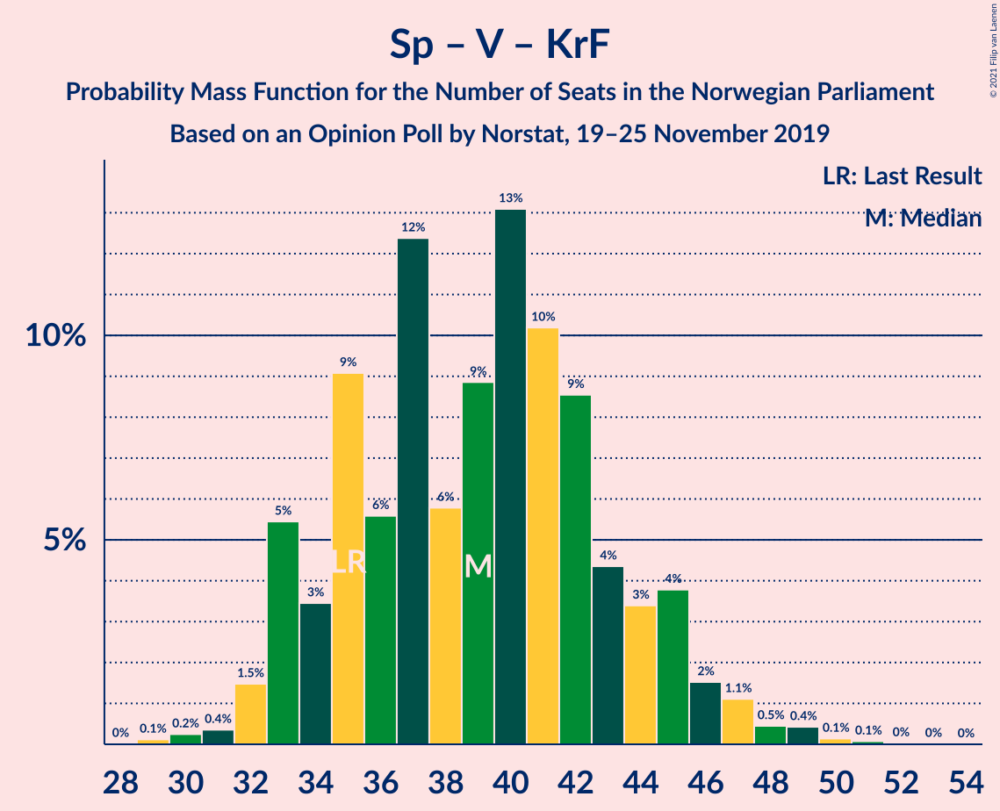

| Number of Seats | Probability | Accumulated | Special Marks |
|:---------------:|:-----------:|:-----------:|:-------------:|
| 29 | 0.1% | 100% |  |
| 30 | 0.2% | 99.8% |  |
| 31 | 0.4% | 99.6% |  |
| 32 | 1.5% | 99.2% |  |
| 33 | 5% | 98% |  |
| 34 | 3% | 92% |  |
| 35 | 9% | 89% | Last Result |
| 36 | 6% | 80% | Median |
| 37 | 12% | 74% |  |
| 38 | 6% | 62% |  |
| 39 | 9% | 56% |  |
| 40 | 13% | 47% |  |
| 41 | 10% | 34% |  |
| 42 | 9% | 24% |  |
| 43 | 4% | 15% |  |
| 44 | 3% | 11% |  |
| 45 | 4% | 8% |  |
| 46 | 2% | 4% |  |
| 47 | 1.1% | 2% |  |
| 48 | 0.5% | 1.2% |  |
| 49 | 0.4% | 0.7% |  |
| 50 | 0.1% | 0.3% |  |
| 51 | 0.1% | 0.1% |  |
| 52 | 0% | 0.1% |  |
| 53 | 0% | 0% |  |

## Technical Information

### Opinion Poll

+ **Polling firm:** Norstat
+ **Commissioner(s):** —
+ **Fieldwork period:** 19–25 November 2019

### Calculations

+ **Sample size:** 749
+ **Simulations done:** 1,048,576
+ **Error estimate:** 2.10%

