# Opinion Poll by Opinion Perduco, 3–8 December 2019

<a href="#voting-intentions">Voting Intentions</a> | <a href="#seats">Seats</a> | <a href="#coalitions">Coalitions</a> | <a href="#technical-information">Technical Information</a>

## Voting Intentions

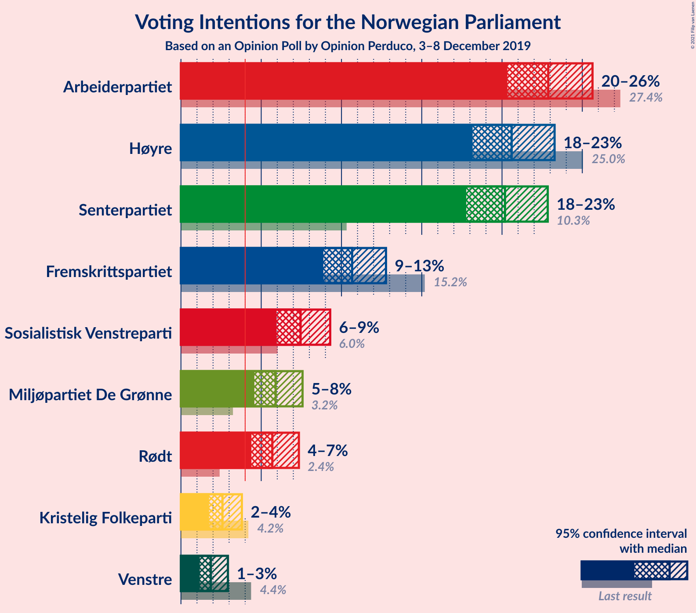

### Confidence Intervals

| Party | Last Result | Poll Result | 80% Confidence Interval | 90% Confidence Interval | 95% Confidence Interval | 99% Confidence Interval |
|:-----:|:-----------:|:-----------:|:-----------------------:|:-----------------------:|:-----------------------:|:-----------------------:|
| Arbeiderpartiet | 27.4% | 22.9% | 21.2–24.7% |20.7–25.2% |20.3–25.6% |19.6–26.5% |
| Høyre | 25.0% | 20.6% | 19.0–22.3% |18.5–22.8% |18.2–23.3% |17.4–24.1% |
| Senterpartiet | 10.3% | 20.2% | 18.6–21.9% |18.2–22.4% |17.8–22.8% |17.0–23.7% |
| Fremskrittspartiet | 15.2% | 10.7% | 9.5–12.0% |9.1–12.4% |8.9–12.8% |8.3–13.5% |
| Sosialistisk Venstreparti | 6.0% | 7.5% | 6.5–8.7% |6.2–9.0% |6.0–9.3% |5.5–9.9% |
| Miljøpartiet De Grønne | 3.2% | 5.9% | 5.0–7.0% |4.8–7.3% |4.6–7.6% |4.2–8.1% |
| Rødt | 2.4% | 5.7% | 4.8–6.8% |4.6–7.1% |4.4–7.3% |4.0–7.9% |
| Kristelig Folkeparti | 4.2% | 2.6% | 2.0–3.4% |1.9–3.6% |1.8–3.8% |1.5–4.2% |
| Venstre | 4.4% | 1.9% | 1.4–2.6% |1.3–2.8% |1.2–2.9% |1.0–3.3% |

*Note:* The poll result column reflects the actual value used in the calculations. Published results may vary slightly, and in addition be rounded to fewer digits.

## Seats

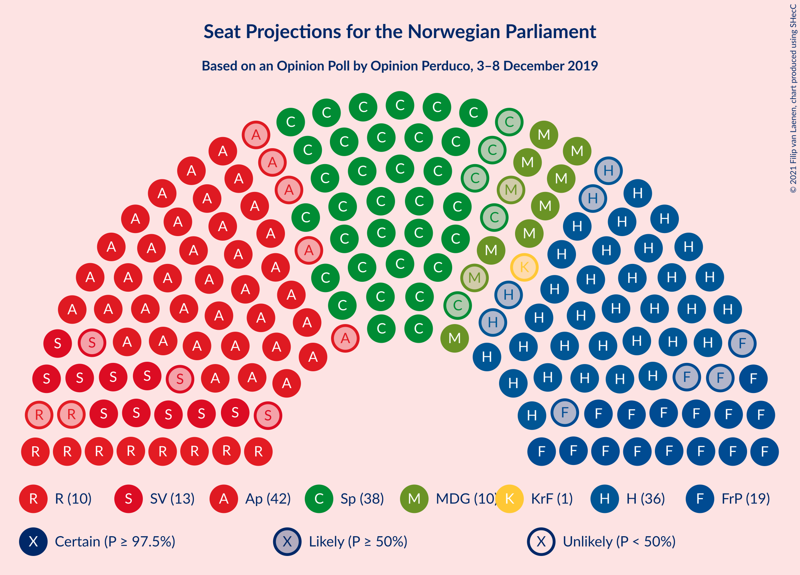

### Confidence Intervals

| Party | Last Result | Median | 80% Confidence Interval | 90% Confidence Interval | 95% Confidence Interval | 99% Confidence Interval |
|:-----:|:-----------:|:------:|:-----------------------:|:-----------------------:|:-----------------------:|:-----------------------:|
| <a href="#arbeiderpartiet">Arbeiderpartiet</a> | 49 | 42 | 39–44 |38–45 |37–46 |35–47 |
| <a href="#høyre">Høyre</a> | 45 | 36 | 33–39 |32–40 |32–41 |31–42 |
| <a href="#senterpartiet">Senterpartiet</a> | 19 | 38 | 35–41 |34–42 |33–42 |32–44 |
| <a href="#fremskrittspartiet">Fremskrittspartiet</a> | 27 | 19 | 16–21 |16–22 |15–22 |14–24 |
| <a href="#sosialistisk-venstreparti">Sosialistisk Venstreparti</a> | 11 | 13 | 11–15 |11–16 |10–16 |10–17 |
| <a href="#miljøpartiet-de-grønne">Miljøpartiet De Grønne</a> | 1 | 10 | 9–12 |8–13 |8–13 |7–14 |
| <a href="#rødt">Rødt</a> | 1 | 10 | 8–12 |8–12 |8–12 |2–14 |
| <a href="#kristelig-folkeparti">Kristelig Folkeparti</a> | 8 | 1 | 0–2 |0–3 |0–3 |0–7 |
| <a href="#venstre">Venstre</a> | 8 | 0 | 0–1 |0–2 |0–2 |0–2 |

### Arbeiderpartiet

*For a full overview of the results for this party, see the [Arbeiderpartiet](party-arbeiderpartiet.html) page.*

| Number of Seats | Probability | Accumulated | Special Marks |
|:---------------:|:-----------:|:-----------:|:-------------:|
| 33 | 0.1% | 100% |  |
| 34 | 0.1% | 99.9% |  |
| 35 | 0.6% | 99.8% |  |
| 36 | 0.7% | 99.2% |  |
| 37 | 2% | 98% |  |
| 38 | 7% | 97% |  |
| 39 | 17% | 90% |  |
| 40 | 8% | 73% |  |
| 41 | 7% | 65% |  |
| 42 | 12% | 57% | Median |
| 43 | 21% | 45% |  |
| 44 | 15% | 24% |  |
| 45 | 4% | 9% |  |
| 46 | 4% | 5% |  |
| 47 | 0.4% | 0.7% |  |
| 48 | 0.2% | 0.3% |  |
| 49 | 0% | 0% | Last Result |

### Høyre

*For a full overview of the results for this party, see the [Høyre](party-høyre.html) page.*

| Number of Seats | Probability | Accumulated | Special Marks |
|:---------------:|:-----------:|:-----------:|:-------------:|
| 29 | 0.1% | 100% |  |
| 30 | 0.2% | 99.9% |  |
| 31 | 1.2% | 99.6% |  |
| 32 | 4% | 98% |  |
| 33 | 9% | 94% |  |
| 34 | 17% | 85% |  |
| 35 | 13% | 68% |  |
| 36 | 19% | 55% | Median |
| 37 | 17% | 36% |  |
| 38 | 8% | 19% |  |
| 39 | 4% | 12% |  |
| 40 | 5% | 8% |  |
| 41 | 2% | 3% |  |
| 42 | 0.6% | 0.8% |  |
| 43 | 0.1% | 0.2% |  |
| 44 | 0.1% | 0.1% |  |
| 45 | 0% | 0% | Last Result |

### Senterpartiet

*For a full overview of the results for this party, see the [Senterpartiet](party-senterpartiet.html) page.*

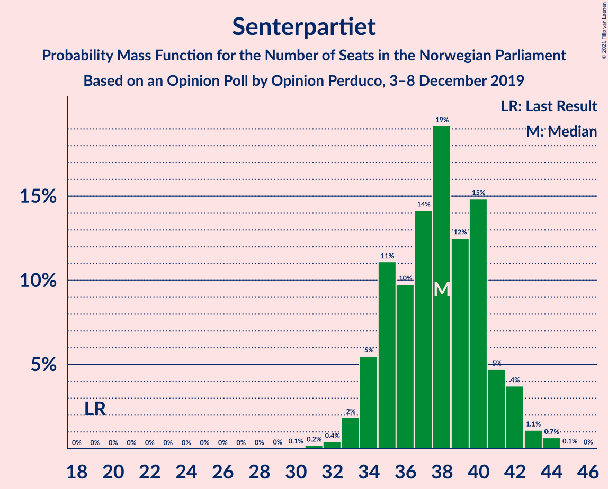

| Number of Seats | Probability | Accumulated | Special Marks |
|:---------------:|:-----------:|:-----------:|:-------------:|
| 19 | 0% | 100% | Last Result |
| 20 | 0% | 100% |  |
| 21 | 0% | 100% |  |
| 22 | 0% | 100% |  |
| 23 | 0% | 100% |  |
| 24 | 0% | 100% |  |
| 25 | 0% | 100% |  |
| 26 | 0% | 100% |  |
| 27 | 0% | 100% |  |
| 28 | 0% | 100% |  |
| 29 | 0% | 100% |  |
| 30 | 0.1% | 99.9% |  |
| 31 | 0.2% | 99.9% |  |
| 32 | 0.4% | 99.7% |  |
| 33 | 2% | 99.2% |  |
| 34 | 5% | 97% |  |
| 35 | 11% | 92% |  |
| 36 | 10% | 81% |  |
| 37 | 14% | 71% |  |
| 38 | 19% | 57% | Median |
| 39 | 12% | 38% |  |
| 40 | 15% | 25% |  |
| 41 | 5% | 10% |  |
| 42 | 4% | 6% |  |
| 43 | 1.1% | 2% |  |
| 44 | 0.7% | 0.8% |  |
| 45 | 0.1% | 0.1% |  |
| 46 | 0% | 0% |  |

### Fremskrittspartiet

*For a full overview of the results for this party, see the [Fremskrittspartiet](party-fremskrittspartiet.html) page.*

| Number of Seats | Probability | Accumulated | Special Marks |
|:---------------:|:-----------:|:-----------:|:-------------:|
| 13 | 0.1% | 100% |  |
| 14 | 0.6% | 99.9% |  |
| 15 | 3% | 99.3% |  |
| 16 | 7% | 96% |  |
| 17 | 13% | 89% |  |
| 18 | 18% | 76% |  |
| 19 | 23% | 58% | Median |
| 20 | 17% | 35% |  |
| 21 | 12% | 19% |  |
| 22 | 5% | 7% |  |
| 23 | 1.3% | 2% |  |
| 24 | 0.6% | 0.8% |  |
| 25 | 0.1% | 0.2% |  |
| 26 | 0% | 0% |  |
| 27 | 0% | 0% | Last Result |

### Sosialistisk Venstreparti

*For a full overview of the results for this party, see the [Sosialistisk Venstreparti](party-sosialistiskvenstreparti.html) page.*

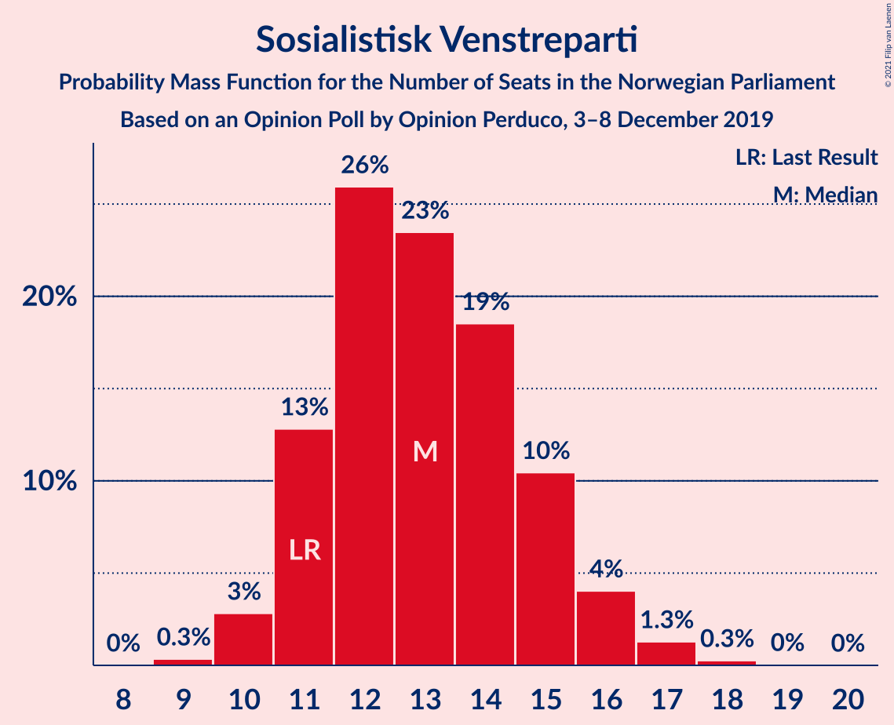

| Number of Seats | Probability | Accumulated | Special Marks |
|:---------------:|:-----------:|:-----------:|:-------------:|
| 9 | 0.3% | 100% |  |
| 10 | 3% | 99.6% |  |
| 11 | 13% | 97% | Last Result |
| 12 | 26% | 84% |  |
| 13 | 23% | 58% | Median |
| 14 | 19% | 35% |  |
| 15 | 10% | 16% |  |
| 16 | 4% | 6% |  |
| 17 | 1.3% | 2% |  |
| 18 | 0.3% | 0.3% |  |
| 19 | 0% | 0.1% |  |
| 20 | 0% | 0% |  |

### Miljøpartiet De Grønne

*For a full overview of the results for this party, see the [Miljøpartiet De Grønne](party-miljøpartietdegrønne.html) page.*

| Number of Seats | Probability | Accumulated | Special Marks |
|:---------------:|:-----------:|:-----------:|:-------------:|
| 1 | 0% | 100% | Last Result |
| 2 | 0.1% | 100% |  |
| 3 | 0.4% | 99.9% |  |
| 4 | 0% | 99.5% |  |
| 5 | 0% | 99.5% |  |
| 6 | 0% | 99.5% |  |
| 7 | 0.6% | 99.5% |  |
| 8 | 6% | 99.0% |  |
| 9 | 22% | 92% |  |
| 10 | 31% | 71% | Median |
| 11 | 22% | 40% |  |
| 12 | 12% | 18% |  |
| 13 | 5% | 7% |  |
| 14 | 1.0% | 1.4% |  |
| 15 | 0.4% | 0.4% |  |
| 16 | 0% | 0% |  |

### Rødt

*For a full overview of the results for this party, see the [Rødt](party-rødt.html) page.*

| Number of Seats | Probability | Accumulated | Special Marks |
|:---------------:|:-----------:|:-----------:|:-------------:|
| 1 | 0% | 100% | Last Result |
| 2 | 1.2% | 100% |  |
| 3 | 0% | 98.8% |  |
| 4 | 0% | 98.8% |  |
| 5 | 0% | 98.8% |  |
| 6 | 0% | 98.8% |  |
| 7 | 1.2% | 98.8% |  |
| 8 | 8% | 98% |  |
| 9 | 16% | 89% |  |
| 10 | 30% | 73% | Median |
| 11 | 30% | 43% |  |
| 12 | 11% | 13% |  |
| 13 | 1.3% | 2% |  |
| 14 | 0.5% | 0.6% |  |
| 15 | 0.1% | 0.1% |  |
| 16 | 0% | 0% |  |

### Kristelig Folkeparti

*For a full overview of the results for this party, see the [Kristelig Folkeparti](party-kristeligfolkeparti.html) page.*

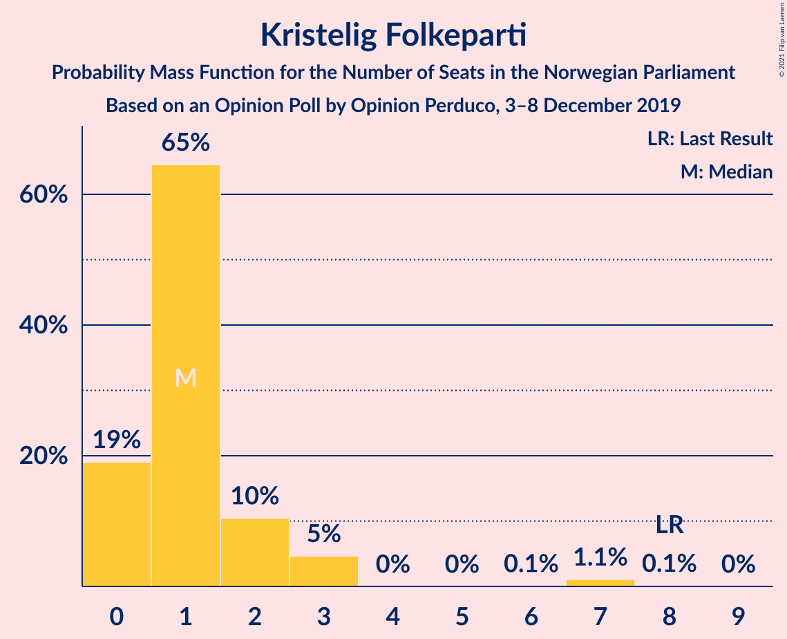

| Number of Seats | Probability | Accumulated | Special Marks |
|:---------------:|:-----------:|:-----------:|:-------------:|
| 0 | 19% | 100% |  |
| 1 | 65% | 81% | Median |
| 2 | 10% | 16% |  |
| 3 | 5% | 6% |  |
| 4 | 0% | 1.3% |  |
| 5 | 0% | 1.3% |  |
| 6 | 0.1% | 1.3% |  |
| 7 | 1.1% | 1.2% |  |
| 8 | 0.1% | 0.1% | Last Result |
| 9 | 0% | 0% |  |

### Venstre

*For a full overview of the results for this party, see the [Venstre](party-venstre.html) page.*

| Number of Seats | Probability | Accumulated | Special Marks |
|:---------------:|:-----------:|:-----------:|:-------------:|
| 0 | 56% | 100% | Median |
| 1 | 34% | 44% |  |
| 2 | 9% | 9% |  |
| 3 | 0% | 0% |  |
| 4 | 0% | 0% |  |
| 5 | 0% | 0% |  |
| 6 | 0% | 0% |  |
| 7 | 0% | 0% |  |
| 8 | 0% | 0% | Last Result |

## Coalitions

### Confidence Intervals

| Coalition | Last Result | Median | Majority? | 80% Confidence Interval | 90% Confidence Interval | 95% Confidence Interval | 99% Confidence Interval |
|:---------:|:-----------:|:------:|:---------:|:-----------------------:|:-----------------------:|:-----------------------:|:-----------------------:|
| Arbeiderpartiet – Senterpartiet – Sosialistisk Venstreparti – Miljøpartiet De Grønne – Rødt | 81 | 113 | 100% | 110–116 | 108–117 | 107–118 | 105–119 |
| Arbeiderpartiet – Senterpartiet – Sosialistisk Venstreparti – Miljøpartiet De Grønne – Kristelig Folkeparti | 88 | 104 | 100% | 100–107 | 99–108 | 98–109 | 95–111 |
| Arbeiderpartiet – Senterpartiet – Sosialistisk Venstreparti – Miljøpartiet De Grønne | 80 | 103 | 100% | 100–106 | 98–107 | 97–108 | 94–109 |
| Arbeiderpartiet – Senterpartiet – Sosialistisk Venstreparti – Rødt | 80 | 102 | 100% | 99–106 | 98–107 | 97–107 | 95–109 |
| Høyre – Senterpartiet – Fremskrittspartiet – Kristelig Folkeparti – Venstre | 107 | 94 | 100% | 90–98 | 89–99 | 89–100 | 88–102 |
| Arbeiderpartiet – Senterpartiet – Sosialistisk Venstreparti | 79 | 92 | 99.8% | 89–96 | 88–97 | 86–97 | 85–99 |
| Arbeiderpartiet – Senterpartiet – Miljøpartiet De Grønne – Kristelig Folkeparti | 77 | 91 | 98% | 87–94 | 86–96 | 85–96 | 83–98 |
| Arbeiderpartiet – Senterpartiet – Kristelig Folkeparti | 76 | 81 | 8% | 77–84 | 76–85 | 75–86 | 72–88 |
| Arbeiderpartiet – Senterpartiet | 68 | 80 | 2% | 76–83 | 75–84 | 74–84 | 72–85 |
| Høyre – Fremskrittspartiet – Miljøpartiet De Grønne – Kristelig Folkeparti – Venstre | 89 | 67 | 0% | 63–70 | 62–71 | 62–72 | 60–74 |
| Høyre – Fremskrittspartiet – Kristelig Folkeparti – Venstre | 88 | 56 | 0% | 53–59 | 52–61 | 51–62 | 50–64 |
| Høyre – Fremskrittspartiet – Venstre | 80 | 55 | 0% | 51–58 | 51–60 | 50–61 | 48–63 |
| Høyre – Fremskrittspartiet | 72 | 55 | 0% | 51–58 | 50–59 | 49–60 | 48–62 |
| Arbeiderpartiet – Sosialistisk Venstreparti | 60 | 55 | 0% | 51–58 | 50–58 | 50–59 | 48–61 |
| Senterpartiet – Kristelig Folkeparti – Venstre | 35 | 40 | 0% | 36–43 | 35–43 | 35–44 | 33–46 |
| Høyre – Kristelig Folkeparti – Venstre | 61 | 37 | 0% | 35–41 | 34–42 | 34–43 | 32–44 |

### Arbeiderpartiet – Senterpartiet – Sosialistisk Venstreparti – Miljøpartiet De Grønne – Rødt

| Number of Seats | Probability | Accumulated | Special Marks |
|:---------------:|:-----------:|:-----------:|:-------------:|
| 81 | 0% | 100% | Last Result |
| 82 | 0% | 100% |  |
| 83 | 0% | 100% |  |
| 84 | 0% | 100% |  |
| 85 | 0% | 100% | Majority |
| 86 | 0% | 100% |  |
| 87 | 0% | 100% |  |
| 88 | 0% | 100% |  |
| 89 | 0% | 100% |  |
| 90 | 0% | 100% |  |
| 91 | 0% | 100% |  |
| 92 | 0% | 100% |  |
| 93 | 0% | 100% |  |
| 94 | 0% | 100% |  |
| 95 | 0% | 100% |  |
| 96 | 0% | 100% |  |
| 97 | 0% | 100% |  |
| 98 | 0% | 100% |  |
| 99 | 0% | 100% |  |
| 100 | 0% | 100% |  |
| 101 | 0% | 100% |  |
| 102 | 0% | 100% |  |
| 103 | 0% | 100% |  |
| 104 | 0.2% | 99.9% |  |
| 105 | 0.4% | 99.7% |  |
| 106 | 1.2% | 99.3% |  |
| 107 | 2% | 98% |  |
| 108 | 2% | 96% |  |
| 109 | 3% | 94% |  |
| 110 | 12% | 91% |  |
| 111 | 13% | 79% |  |
| 112 | 14% | 65% |  |
| 113 | 8% | 51% | Median |
| 114 | 12% | 42% |  |
| 115 | 15% | 31% |  |
| 116 | 7% | 16% |  |
| 117 | 4% | 9% |  |
| 118 | 4% | 5% |  |
| 119 | 0.6% | 1.0% |  |
| 120 | 0.3% | 0.4% |  |
| 121 | 0.1% | 0.2% |  |
| 122 | 0% | 0% |  |

### Arbeiderpartiet – Senterpartiet – Sosialistisk Venstreparti – Miljøpartiet De Grønne – Kristelig Folkeparti

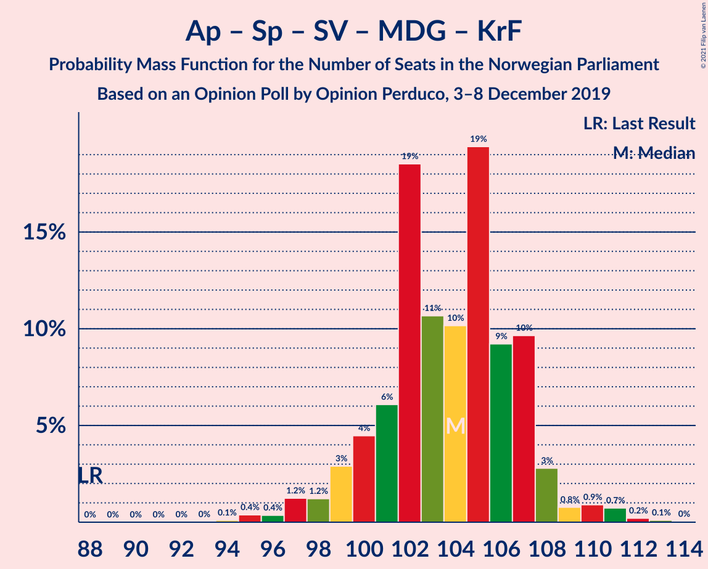

| Number of Seats | Probability | Accumulated | Special Marks |
|:---------------:|:-----------:|:-----------:|:-------------:|
| 88 | 0% | 100% | Last Result |
| 89 | 0% | 100% |  |
| 90 | 0% | 100% |  |
| 91 | 0% | 100% |  |
| 92 | 0% | 100% |  |
| 93 | 0% | 100% |  |
| 94 | 0.1% | 100% |  |
| 95 | 0.4% | 99.9% |  |
| 96 | 0.4% | 99.5% |  |
| 97 | 1.2% | 99.1% |  |
| 98 | 1.2% | 98% |  |
| 99 | 3% | 97% |  |
| 100 | 4% | 94% |  |
| 101 | 6% | 89% |  |
| 102 | 19% | 83% |  |
| 103 | 11% | 65% |  |
| 104 | 10% | 54% | Median |
| 105 | 19% | 44% |  |
| 106 | 9% | 24% |  |
| 107 | 10% | 15% |  |
| 108 | 3% | 6% |  |
| 109 | 0.8% | 3% |  |
| 110 | 0.9% | 2% |  |
| 111 | 0.7% | 1.1% |  |
| 112 | 0.2% | 0.4% |  |
| 113 | 0.1% | 0.2% |  |
| 114 | 0% | 0% |  |

### Arbeiderpartiet – Senterpartiet – Sosialistisk Venstreparti – Miljøpartiet De Grønne

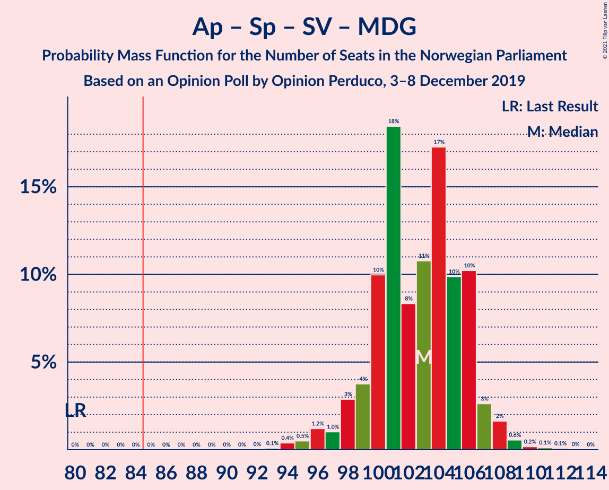

| Number of Seats | Probability | Accumulated | Special Marks |
|:---------------:|:-----------:|:-----------:|:-------------:|
| 80 | 0% | 100% | Last Result |
| 81 | 0% | 100% |  |
| 82 | 0% | 100% |  |
| 83 | 0% | 100% |  |
| 84 | 0% | 100% |  |
| 85 | 0% | 100% | Majority |
| 86 | 0% | 100% |  |
| 87 | 0% | 100% |  |
| 88 | 0% | 100% |  |
| 89 | 0% | 100% |  |
| 90 | 0% | 100% |  |
| 91 | 0% | 100% |  |
| 92 | 0% | 100% |  |
| 93 | 0.1% | 100% |  |
| 94 | 0.4% | 99.9% |  |
| 95 | 0.5% | 99.5% |  |
| 96 | 1.2% | 99.0% |  |
| 97 | 1.0% | 98% |  |
| 98 | 3% | 97% |  |
| 99 | 4% | 94% |  |
| 100 | 10% | 90% |  |
| 101 | 18% | 80% |  |
| 102 | 8% | 62% |  |
| 103 | 11% | 53% | Median |
| 104 | 17% | 43% |  |
| 105 | 10% | 25% |  |
| 106 | 10% | 15% |  |
| 107 | 3% | 5% |  |
| 108 | 2% | 3% |  |
| 109 | 0.6% | 1.0% |  |
| 110 | 0.2% | 0.4% |  |
| 111 | 0.1% | 0.2% |  |
| 112 | 0.1% | 0.1% |  |
| 113 | 0% | 0% |  |

### Arbeiderpartiet – Senterpartiet – Sosialistisk Venstreparti – Rødt

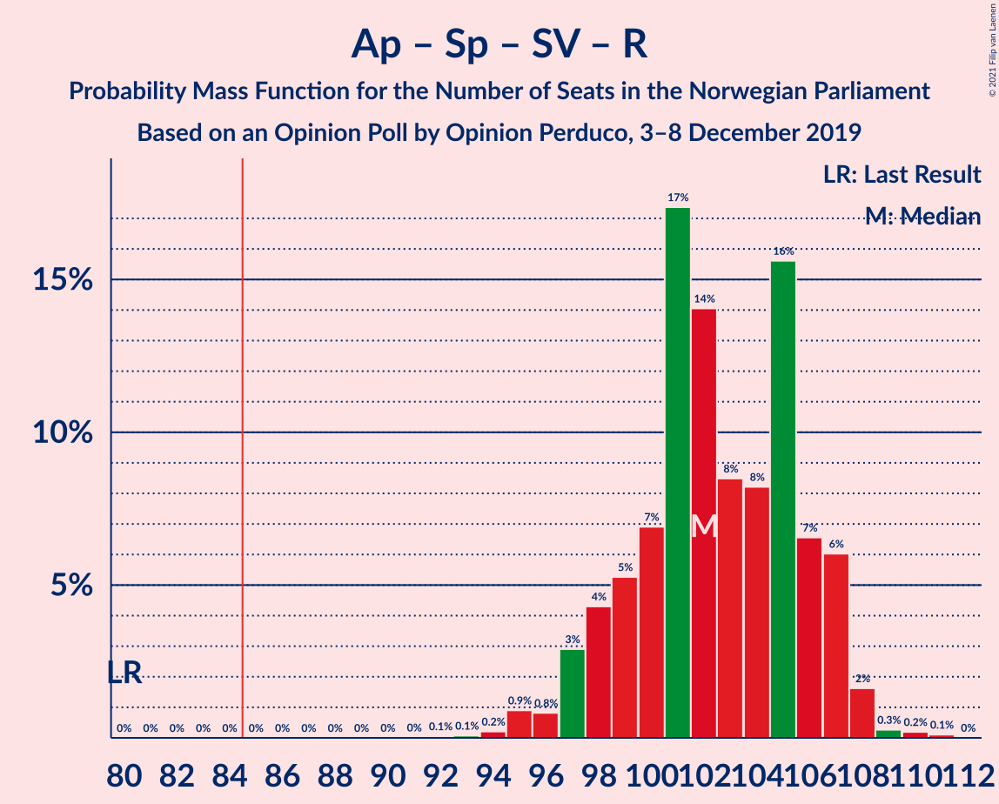

| Number of Seats | Probability | Accumulated | Special Marks |
|:---------------:|:-----------:|:-----------:|:-------------:|
| 80 | 0% | 100% | Last Result |
| 81 | 0% | 100% |  |
| 82 | 0% | 100% |  |
| 83 | 0% | 100% |  |
| 84 | 0% | 100% |  |
| 85 | 0% | 100% | Majority |
| 86 | 0% | 100% |  |
| 87 | 0% | 100% |  |
| 88 | 0% | 100% |  |
| 89 | 0% | 100% |  |
| 90 | 0% | 100% |  |
| 91 | 0% | 100% |  |
| 92 | 0.1% | 100% |  |
| 93 | 0.1% | 99.9% |  |
| 94 | 0.2% | 99.8% |  |
| 95 | 0.9% | 99.6% |  |
| 96 | 0.8% | 98.7% |  |
| 97 | 3% | 98% |  |
| 98 | 4% | 95% |  |
| 99 | 5% | 91% |  |
| 100 | 7% | 85% |  |
| 101 | 17% | 79% |  |
| 102 | 14% | 61% |  |
| 103 | 8% | 47% | Median |
| 104 | 8% | 39% |  |
| 105 | 16% | 30% |  |
| 106 | 7% | 15% |  |
| 107 | 6% | 8% |  |
| 108 | 2% | 2% |  |
| 109 | 0.3% | 0.6% |  |
| 110 | 0.2% | 0.3% |  |
| 111 | 0.1% | 0.1% |  |
| 112 | 0% | 0% |  |

### Høyre – Senterpartiet – Fremskrittspartiet – Kristelig Folkeparti – Venstre

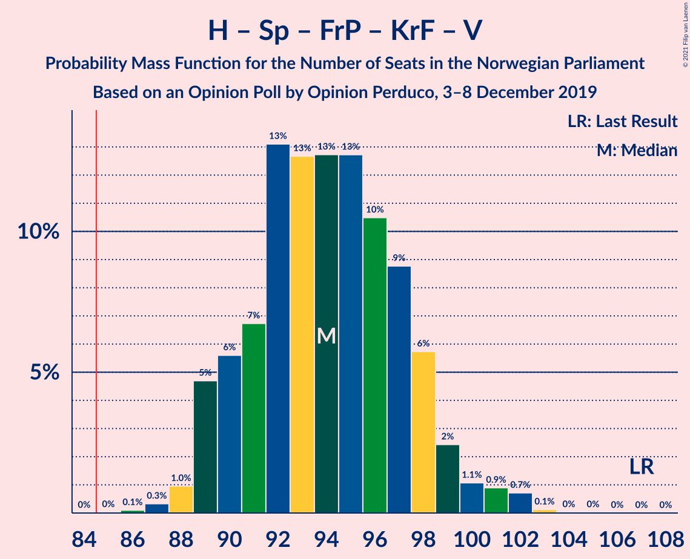

| Number of Seats | Probability | Accumulated | Special Marks |
|:---------------:|:-----------:|:-----------:|:-------------:|
| 86 | 0.1% | 100% |  |
| 87 | 0.3% | 99.9% |  |
| 88 | 1.0% | 99.5% |  |
| 89 | 5% | 98.6% |  |
| 90 | 6% | 94% |  |
| 91 | 7% | 88% |  |
| 92 | 13% | 82% |  |
| 93 | 13% | 68% |  |
| 94 | 13% | 56% | Median |
| 95 | 13% | 43% |  |
| 96 | 10% | 30% |  |
| 97 | 9% | 20% |  |
| 98 | 6% | 11% |  |
| 99 | 2% | 5% |  |
| 100 | 1.1% | 3% |  |
| 101 | 0.9% | 2% |  |
| 102 | 0.7% | 0.9% |  |
| 103 | 0.1% | 0.2% |  |
| 104 | 0% | 0.1% |  |
| 105 | 0% | 0% |  |
| 106 | 0% | 0% |  |
| 107 | 0% | 0% | Last Result |

### Arbeiderpartiet – Senterpartiet – Sosialistisk Venstreparti

| Number of Seats | Probability | Accumulated | Special Marks |
|:---------------:|:-----------:|:-----------:|:-------------:|
| 79 | 0% | 100% | Last Result |
| 80 | 0% | 100% |  |
| 81 | 0% | 100% |  |
| 82 | 0% | 100% |  |
| 83 | 0.1% | 100% |  |
| 84 | 0.1% | 99.9% |  |
| 85 | 0.4% | 99.8% | Majority |
| 86 | 2% | 99.4% |  |
| 87 | 2% | 97% |  |
| 88 | 4% | 96% |  |
| 89 | 5% | 92% |  |
| 90 | 7% | 86% |  |
| 91 | 17% | 79% |  |
| 92 | 14% | 62% |  |
| 93 | 12% | 48% | Median |
| 94 | 14% | 36% |  |
| 95 | 8% | 22% |  |
| 96 | 8% | 14% |  |
| 97 | 4% | 6% |  |
| 98 | 1.1% | 2% |  |
| 99 | 0.3% | 0.6% |  |
| 100 | 0.1% | 0.3% |  |
| 101 | 0.1% | 0.1% |  |
| 102 | 0% | 0% |  |

### Arbeiderpartiet – Senterpartiet – Miljøpartiet De Grønne – Kristelig Folkeparti

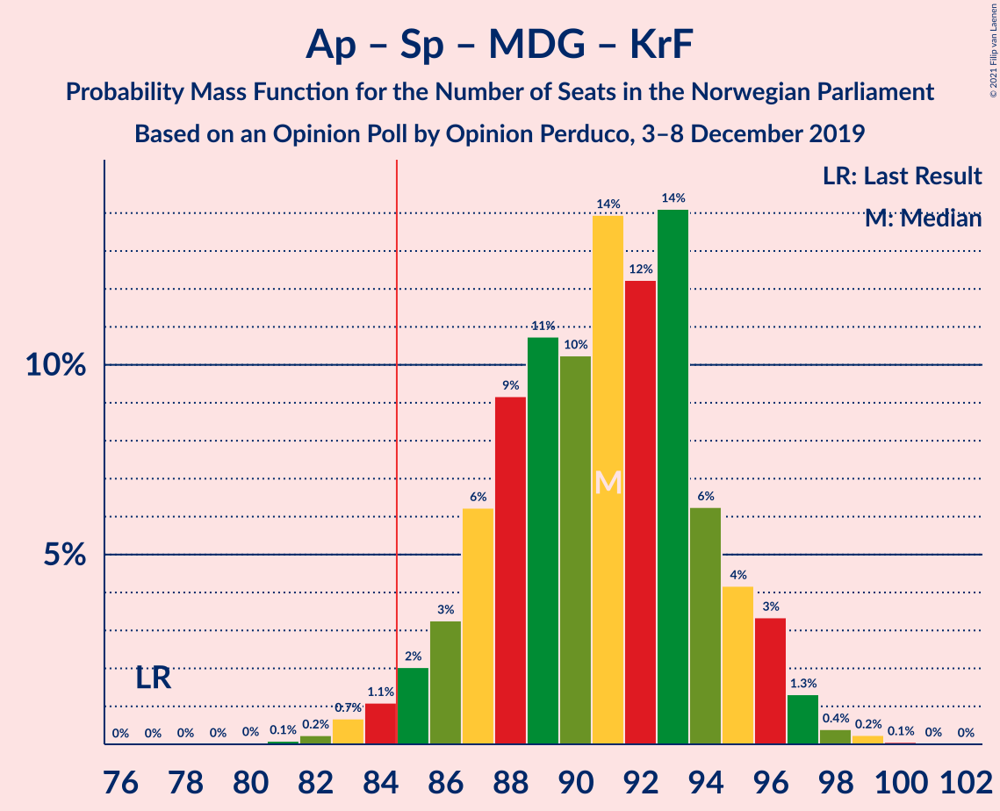

| Number of Seats | Probability | Accumulated | Special Marks |
|:---------------:|:-----------:|:-----------:|:-------------:|
| 77 | 0% | 100% | Last Result |
| 78 | 0% | 100% |  |
| 79 | 0% | 100% |  |
| 80 | 0% | 100% |  |
| 81 | 0.1% | 99.9% |  |
| 82 | 0.2% | 99.8% |  |
| 83 | 0.7% | 99.6% |  |
| 84 | 1.1% | 98.9% |  |
| 85 | 2% | 98% | Majority |
| 86 | 3% | 96% |  |
| 87 | 6% | 93% |  |
| 88 | 9% | 86% |  |
| 89 | 11% | 77% |  |
| 90 | 10% | 66% |  |
| 91 | 14% | 56% | Median |
| 92 | 12% | 42% |  |
| 93 | 14% | 30% |  |
| 94 | 6% | 16% |  |
| 95 | 4% | 10% |  |
| 96 | 3% | 5% |  |
| 97 | 1.3% | 2% |  |
| 98 | 0.4% | 0.8% |  |
| 99 | 0.2% | 0.4% |  |
| 100 | 0.1% | 0.1% |  |
| 101 | 0% | 0% |  |

### Arbeiderpartiet – Senterpartiet – Kristelig Folkeparti

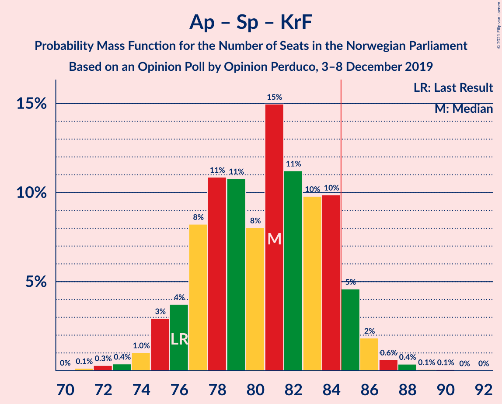

| Number of Seats | Probability | Accumulated | Special Marks |
|:---------------:|:-----------:|:-----------:|:-------------:|
| 70 | 0% | 100% |  |
| 71 | 0.1% | 99.9% |  |
| 72 | 0.3% | 99.8% |  |
| 73 | 0.4% | 99.5% |  |
| 74 | 1.0% | 99.1% |  |
| 75 | 3% | 98% |  |
| 76 | 4% | 95% | Last Result |
| 77 | 8% | 91% |  |
| 78 | 11% | 83% |  |
| 79 | 11% | 72% |  |
| 80 | 8% | 62% |  |
| 81 | 15% | 53% | Median |
| 82 | 11% | 39% |  |
| 83 | 10% | 27% |  |
| 84 | 10% | 17% |  |
| 85 | 5% | 8% | Majority |
| 86 | 2% | 3% |  |
| 87 | 0.6% | 1.2% |  |
| 88 | 0.4% | 0.6% |  |
| 89 | 0.1% | 0.2% |  |
| 90 | 0.1% | 0.1% |  |
| 91 | 0% | 0% |  |

### Arbeiderpartiet – Senterpartiet

| Number of Seats | Probability | Accumulated | Special Marks |
|:---------------:|:-----------:|:-----------:|:-------------:|
| 68 | 0% | 100% | Last Result |
| 69 | 0.1% | 100% |  |
| 70 | 0.1% | 99.9% |  |
| 71 | 0.3% | 99.9% |  |
| 72 | 0.5% | 99.6% |  |
| 73 | 0.9% | 99.1% |  |
| 74 | 3% | 98% |  |
| 75 | 4% | 96% |  |
| 76 | 7% | 92% |  |
| 77 | 12% | 85% |  |
| 78 | 12% | 72% |  |
| 79 | 9% | 60% |  |
| 80 | 16% | 51% | Median |
| 81 | 9% | 35% |  |
| 82 | 9% | 26% |  |
| 83 | 9% | 17% |  |
| 84 | 5% | 7% |  |
| 85 | 2% | 2% | Majority |
| 86 | 0.1% | 0.4% |  |
| 87 | 0.2% | 0.2% |  |
| 88 | 0% | 0% |  |

### Høyre – Fremskrittspartiet – Miljøpartiet De Grønne – Kristelig Folkeparti – Venstre

| Number of Seats | Probability | Accumulated | Special Marks |
|:---------------:|:-----------:|:-----------:|:-------------:|
| 58 | 0.1% | 100% |  |
| 59 | 0.2% | 99.9% |  |
| 60 | 0.3% | 99.7% |  |
| 61 | 2% | 99.4% |  |
| 62 | 6% | 98% |  |
| 63 | 7% | 92% |  |
| 64 | 16% | 85% |  |
| 65 | 8% | 70% |  |
| 66 | 8% | 61% | Median |
| 67 | 14% | 53% |  |
| 68 | 17% | 39% |  |
| 69 | 7% | 21% |  |
| 70 | 5% | 15% |  |
| 71 | 4% | 9% |  |
| 72 | 3% | 5% |  |
| 73 | 0.8% | 2% |  |
| 74 | 0.9% | 1.3% |  |
| 75 | 0.2% | 0.4% |  |
| 76 | 0.1% | 0.2% |  |
| 77 | 0.1% | 0.1% |  |
| 78 | 0% | 0% |  |
| 79 | 0% | 0% |  |
| 80 | 0% | 0% |  |
| 81 | 0% | 0% |  |
| 82 | 0% | 0% |  |
| 83 | 0% | 0% |  |
| 84 | 0% | 0% |  |
| 85 | 0% | 0% | Majority |
| 86 | 0% | 0% |  |
| 87 | 0% | 0% |  |
| 88 | 0% | 0% |  |
| 89 | 0% | 0% | Last Result |

### Høyre – Fremskrittspartiet – Kristelig Folkeparti – Venstre

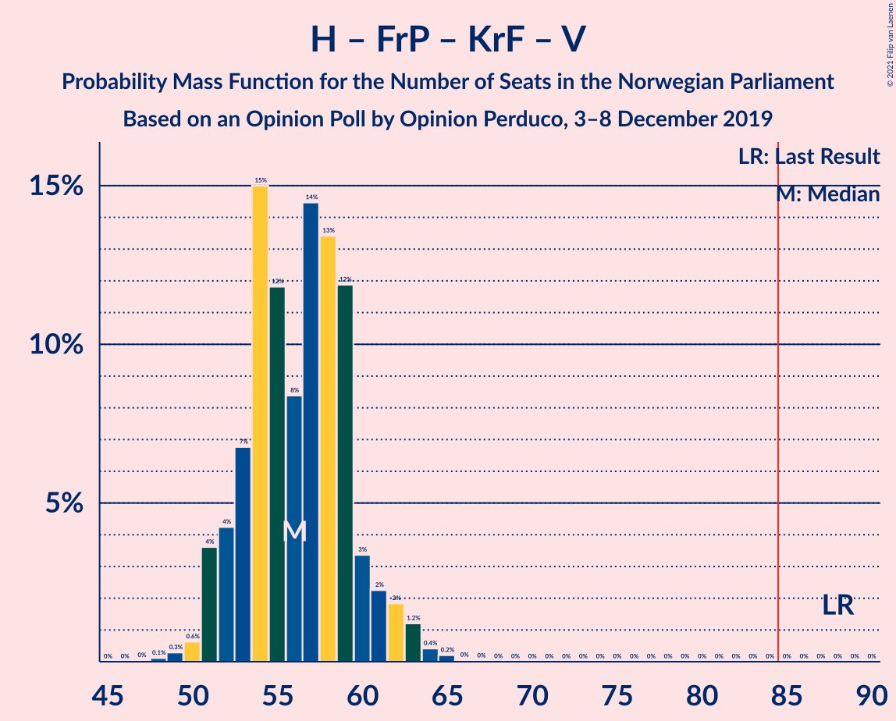

| Number of Seats | Probability | Accumulated | Special Marks |
|:---------------:|:-----------:|:-----------:|:-------------:|
| 48 | 0.1% | 100% |  |
| 49 | 0.3% | 99.8% |  |
| 50 | 0.6% | 99.6% |  |
| 51 | 4% | 98.9% |  |
| 52 | 4% | 95% |  |
| 53 | 7% | 91% |  |
| 54 | 15% | 84% |  |
| 55 | 12% | 69% |  |
| 56 | 8% | 58% | Median |
| 57 | 14% | 49% |  |
| 58 | 13% | 35% |  |
| 59 | 12% | 21% |  |
| 60 | 3% | 9% |  |
| 61 | 2% | 6% |  |
| 62 | 2% | 4% |  |
| 63 | 1.2% | 2% |  |
| 64 | 0.4% | 0.7% |  |
| 65 | 0.2% | 0.3% |  |
| 66 | 0% | 0.1% |  |
| 67 | 0% | 0% |  |
| 68 | 0% | 0% |  |
| 69 | 0% | 0% |  |
| 70 | 0% | 0% |  |
| 71 | 0% | 0% |  |
| 72 | 0% | 0% |  |
| 73 | 0% | 0% |  |
| 74 | 0% | 0% |  |
| 75 | 0% | 0% |  |
| 76 | 0% | 0% |  |
| 77 | 0% | 0% |  |
| 78 | 0% | 0% |  |
| 79 | 0% | 0% |  |
| 80 | 0% | 0% |  |
| 81 | 0% | 0% |  |
| 82 | 0% | 0% |  |
| 83 | 0% | 0% |  |
| 84 | 0% | 0% |  |
| 85 | 0% | 0% | Majority |
| 86 | 0% | 0% |  |
| 87 | 0% | 0% |  |
| 88 | 0% | 0% | Last Result |

### Høyre – Fremskrittspartiet – Venstre

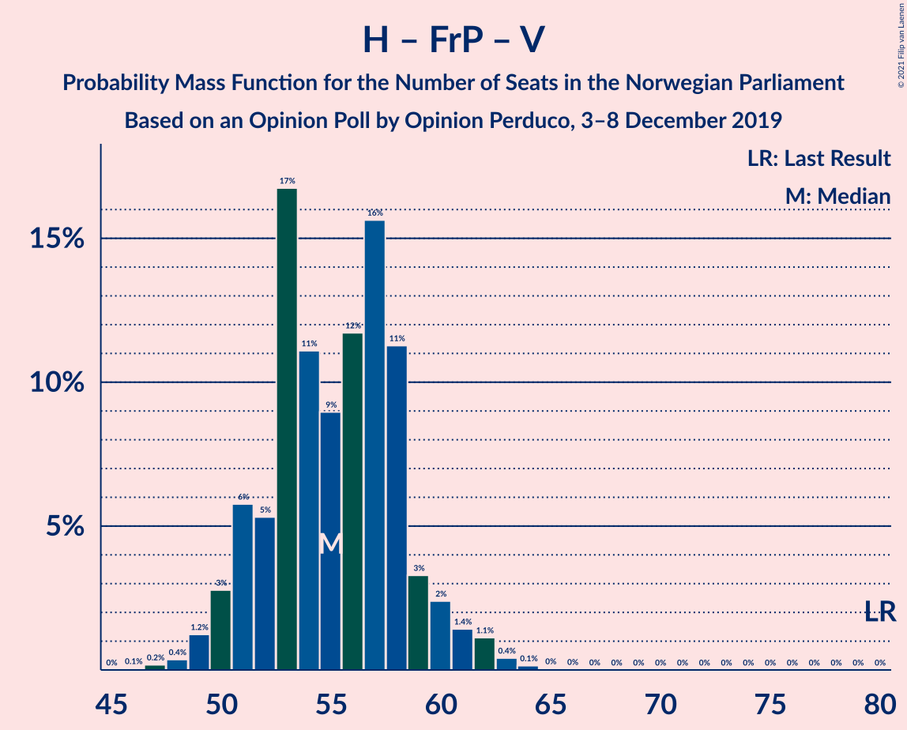

| Number of Seats | Probability | Accumulated | Special Marks |
|:---------------:|:-----------:|:-----------:|:-------------:|
| 46 | 0.1% | 100% |  |
| 47 | 0.2% | 99.9% |  |
| 48 | 0.4% | 99.8% |  |
| 49 | 1.2% | 99.4% |  |
| 50 | 3% | 98% |  |
| 51 | 6% | 95% |  |
| 52 | 5% | 90% |  |
| 53 | 17% | 84% |  |
| 54 | 11% | 68% |  |
| 55 | 9% | 56% | Median |
| 56 | 12% | 48% |  |
| 57 | 16% | 36% |  |
| 58 | 11% | 20% |  |
| 59 | 3% | 9% |  |
| 60 | 2% | 6% |  |
| 61 | 1.4% | 3% |  |
| 62 | 1.1% | 2% |  |
| 63 | 0.4% | 0.6% |  |
| 64 | 0.1% | 0.2% |  |
| 65 | 0% | 0.1% |  |
| 66 | 0% | 0% |  |
| 67 | 0% | 0% |  |
| 68 | 0% | 0% |  |
| 69 | 0% | 0% |  |
| 70 | 0% | 0% |  |
| 71 | 0% | 0% |  |
| 72 | 0% | 0% |  |
| 73 | 0% | 0% |  |
| 74 | 0% | 0% |  |
| 75 | 0% | 0% |  |
| 76 | 0% | 0% |  |
| 77 | 0% | 0% |  |
| 78 | 0% | 0% |  |
| 79 | 0% | 0% |  |
| 80 | 0% | 0% | Last Result |

### Høyre – Fremskrittspartiet

| Number of Seats | Probability | Accumulated | Special Marks |
|:---------------:|:-----------:|:-----------:|:-------------:|
| 46 | 0.2% | 100% |  |
| 47 | 0.3% | 99.8% |  |
| 48 | 0.7% | 99.5% |  |
| 49 | 3% | 98.8% |  |
| 50 | 3% | 96% |  |
| 51 | 7% | 92% |  |
| 52 | 8% | 85% |  |
| 53 | 14% | 78% |  |
| 54 | 12% | 64% |  |
| 55 | 14% | 52% | Median |
| 56 | 8% | 39% |  |
| 57 | 18% | 31% |  |
| 58 | 7% | 13% |  |
| 59 | 2% | 6% |  |
| 60 | 2% | 4% |  |
| 61 | 0.9% | 2% |  |
| 62 | 0.7% | 1.0% |  |
| 63 | 0.2% | 0.3% |  |
| 64 | 0.1% | 0.1% |  |
| 65 | 0% | 0% |  |
| 66 | 0% | 0% |  |
| 67 | 0% | 0% |  |
| 68 | 0% | 0% |  |
| 69 | 0% | 0% |  |
| 70 | 0% | 0% |  |
| 71 | 0% | 0% |  |
| 72 | 0% | 0% | Last Result |

### Arbeiderpartiet – Sosialistisk Venstreparti

| Number of Seats | Probability | Accumulated | Special Marks |
|:---------------:|:-----------:|:-----------:|:-------------:|
| 46 | 0.1% | 100% |  |
| 47 | 0.4% | 99.9% |  |
| 48 | 0.7% | 99.5% |  |
| 49 | 1.0% | 98.8% |  |
| 50 | 5% | 98% |  |
| 51 | 6% | 93% |  |
| 52 | 7% | 87% |  |
| 53 | 10% | 80% |  |
| 54 | 17% | 70% |  |
| 55 | 12% | 53% | Median |
| 56 | 20% | 41% |  |
| 57 | 9% | 21% |  |
| 58 | 7% | 12% |  |
| 59 | 3% | 5% |  |
| 60 | 2% | 2% | Last Result |
| 61 | 0.3% | 0.5% |  |
| 62 | 0.1% | 0.2% |  |
| 63 | 0.1% | 0.1% |  |
| 64 | 0% | 0% |  |

### Senterpartiet – Kristelig Folkeparti – Venstre

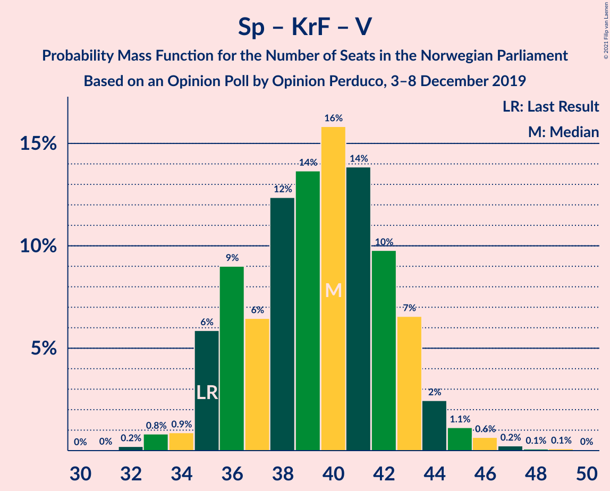

| Number of Seats | Probability | Accumulated | Special Marks |
|:---------------:|:-----------:|:-----------:|:-------------:|
| 31 | 0% | 100% |  |
| 32 | 0.2% | 99.9% |  |
| 33 | 0.8% | 99.7% |  |
| 34 | 0.9% | 98.9% |  |
| 35 | 6% | 98% | Last Result |
| 36 | 9% | 92% |  |
| 37 | 6% | 83% |  |
| 38 | 12% | 77% |  |
| 39 | 14% | 64% | Median |
| 40 | 16% | 51% |  |
| 41 | 14% | 35% |  |
| 42 | 10% | 21% |  |
| 43 | 7% | 11% |  |
| 44 | 2% | 5% |  |
| 45 | 1.1% | 2% |  |
| 46 | 0.6% | 1.1% |  |
| 47 | 0.2% | 0.4% |  |
| 48 | 0.1% | 0.2% |  |
| 49 | 0.1% | 0.1% |  |
| 50 | 0% | 0% |  |

### Høyre – Kristelig Folkeparti – Venstre

| Number of Seats | Probability | Accumulated | Special Marks |
|:---------------:|:-----------:|:-----------:|:-------------:|
| 31 | 0.1% | 100% |  |
| 32 | 0.8% | 99.9% |  |
| 33 | 1.2% | 99.1% |  |
| 34 | 6% | 98% |  |
| 35 | 16% | 91% |  |
| 36 | 10% | 76% |  |
| 37 | 22% | 66% | Median |
| 38 | 17% | 44% |  |
| 39 | 10% | 27% |  |
| 40 | 7% | 17% |  |
| 41 | 4% | 11% |  |
| 42 | 4% | 7% |  |
| 43 | 1.4% | 3% |  |
| 44 | 0.7% | 1.1% |  |
| 45 | 0.3% | 0.4% |  |
| 46 | 0.1% | 0.1% |  |
| 47 | 0.1% | 0.1% |  |
| 48 | 0% | 0% |  |
| 49 | 0% | 0% |  |
| 50 | 0% | 0% |  |
| 51 | 0% | 0% |  |
| 52 | 0% | 0% |  |
| 53 | 0% | 0% |  |
| 54 | 0% | 0% |  |
| 55 | 0% | 0% |  |
| 56 | 0% | 0% |  |
| 57 | 0% | 0% |  |
| 58 | 0% | 0% |  |
| 59 | 0% | 0% |  |
| 60 | 0% | 0% |  |
| 61 | 0% | 0% | Last Result |

## Technical Information

### Opinion Poll

+ **Polling firm:** Opinion Perduco
+ **Commissioner(s):** —
+ **Fieldwork period:** 3–8 December 2019

### Calculations

+ **Sample size:** 966
+ **Simulations done:** 1,048,576
+ **Error estimate:** 1.05%

