# Opinion Poll by Norstat, 9–15 December 2019

<a href="#voting-intentions">Voting Intentions</a> | <a href="#seats">Seats</a> | <a href="#coalitions">Coalitions</a> | <a href="#technical-information">Technical Information</a>

## Voting Intentions

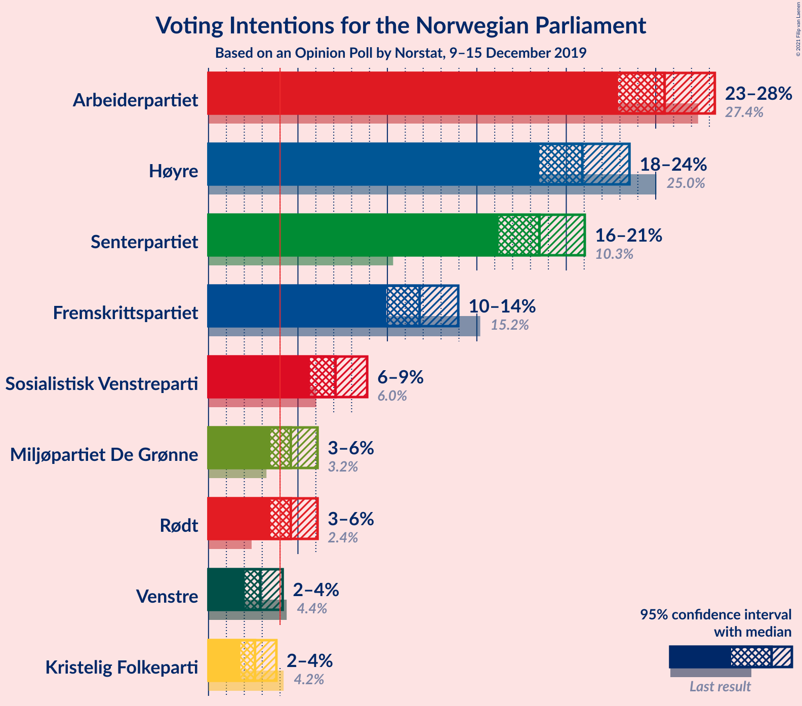

### Confidence Intervals

| Party | Last Result | Poll Result | 80% Confidence Interval | 90% Confidence Interval | 95% Confidence Interval | 99% Confidence Interval |
|:-----:|:-----------:|:-----------:|:-----------------------:|:-----------------------:|:-----------------------:|:-----------------------:|
| Arbeiderpartiet | 27.4% | 25.5% | 23.8–27.3% |23.3–27.8% |22.9–28.3% |22.1–29.2% |
| Høyre | 25.0% | 20.9% | 19.3–22.6% |18.9–23.1% |18.5–23.5% |17.8–24.4% |
| Senterpartiet | 10.3% | 18.5% | 17.0–20.1% |16.6–20.6% |16.2–21.0% |15.5–21.8% |
| Fremskrittspartiet | 15.2% | 11.8% | 10.6–13.2% |10.2–13.6% |9.9–14.0% |9.4–14.6% |
| Sosialistisk Venstreparti | 6.0% | 7.1% | 6.2–8.3% |5.9–8.6% |5.7–8.9% |5.2–9.4% |
| Rødt | 2.4% | 4.6% | 3.9–5.6% |3.6–5.9% |3.5–6.1% |3.1–6.6% |
| Miljøpartiet De Grønne | 3.2% | 4.6% | 3.9–5.6% |3.6–5.9% |3.5–6.1% |3.1–6.6% |
| Venstre | 4.4% | 2.9% | 2.3–3.7% |2.2–3.9% |2.0–4.1% |1.8–4.6% |
| Kristelig Folkeparti | 4.2% | 2.6% | 2.1–3.4% |1.9–3.6% |1.8–3.8% |1.6–4.2% |

*Note:* The poll result column reflects the actual value used in the calculations. Published results may vary slightly, and in addition be rounded to fewer digits.

## Seats

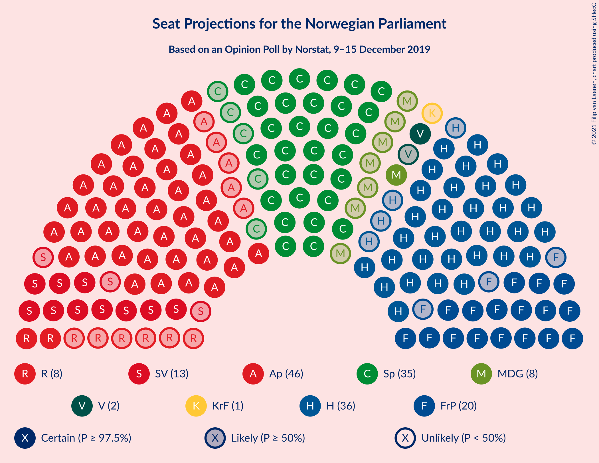

### Confidence Intervals

| Party | Last Result | Median | 80% Confidence Interval | 90% Confidence Interval | 95% Confidence Interval | 99% Confidence Interval |
|:-----:|:-----------:|:------:|:-----------------------:|:-----------------------:|:-----------------------:|:-----------------------:|
| <a href="#arbeiderpartiet">Arbeiderpartiet</a> | 49 | 46 | 43–49 |42–50 |41–51 |40–54 |
| <a href="#høyre">Høyre</a> | 45 | 37 | 33–40 |33–41 |32–42 |31–44 |
| <a href="#senterpartiet">Senterpartiet</a> | 19 | 35 | 31–37 |30–39 |30–39 |28–41 |
| <a href="#fremskrittspartiet">Fremskrittspartiet</a> | 27 | 21 | 18–24 |18–25 |17–25 |16–27 |
| <a href="#sosialistisk-venstreparti">Sosialistisk Venstreparti</a> | 11 | 13 | 11–15 |10–15 |10–16 |9–17 |
| <a href="#rødt">Rødt</a> | 1 | 8 | 2–10 |2–11 |2–11 |2–12 |
| <a href="#miljøpartiet-de-grønne">Miljøpartiet De Grønne</a> | 1 | 8 | 2–10 |2–11 |1–11 |1–12 |
| <a href="#venstre">Venstre</a> | 8 | 2 | 1–2 |1–2 |1–7 |0–8 |
| <a href="#kristelig-folkeparti">Kristelig Folkeparti</a> | 8 | 1 | 0–3 |0–3 |0–3 |0–7 |

### Arbeiderpartiet

*For a full overview of the results for this party, see the [Arbeiderpartiet](party-arbeiderpartiet.html) page.*

| Number of Seats | Probability | Accumulated | Special Marks |
|:---------------:|:-----------:|:-----------:|:-------------:|
| 38 | 0% | 100% |  |
| 39 | 0.2% | 99.9% |  |
| 40 | 1.2% | 99.8% |  |
| 41 | 2% | 98.5% |  |
| 42 | 5% | 96% |  |
| 43 | 5% | 91% |  |
| 44 | 13% | 86% |  |
| 45 | 18% | 73% |  |
| 46 | 18% | 54% | Median |
| 47 | 10% | 37% |  |
| 48 | 10% | 26% |  |
| 49 | 7% | 16% | Last Result |
| 50 | 5% | 10% |  |
| 51 | 3% | 5% |  |
| 52 | 0.8% | 2% |  |
| 53 | 0.4% | 1.4% |  |
| 54 | 0.9% | 1.1% |  |
| 55 | 0.1% | 0.1% |  |
| 56 | 0% | 0% |  |

### Høyre

*For a full overview of the results for this party, see the [Høyre](party-høyre.html) page.*

| Number of Seats | Probability | Accumulated | Special Marks |
|:---------------:|:-----------:|:-----------:|:-------------:|
| 30 | 0.1% | 100% |  |
| 31 | 1.1% | 99.9% |  |
| 32 | 2% | 98.8% |  |
| 33 | 7% | 97% |  |
| 34 | 6% | 90% |  |
| 35 | 11% | 84% |  |
| 36 | 19% | 72% |  |
| 37 | 13% | 53% | Median |
| 38 | 14% | 40% |  |
| 39 | 9% | 26% |  |
| 40 | 9% | 17% |  |
| 41 | 4% | 8% |  |
| 42 | 2% | 4% |  |
| 43 | 1.0% | 2% |  |
| 44 | 0.6% | 0.9% |  |
| 45 | 0.2% | 0.3% | Last Result |
| 46 | 0% | 0% |  |

### Senterpartiet

*For a full overview of the results for this party, see the [Senterpartiet](party-senterpartiet.html) page.*

| Number of Seats | Probability | Accumulated | Special Marks |
|:---------------:|:-----------:|:-----------:|:-------------:|
| 19 | 0% | 100% | Last Result |
| 20 | 0% | 100% |  |
| 21 | 0% | 100% |  |
| 22 | 0% | 100% |  |
| 23 | 0% | 100% |  |
| 24 | 0% | 100% |  |
| 25 | 0% | 100% |  |
| 26 | 0.1% | 100% |  |
| 27 | 0.1% | 99.9% |  |
| 28 | 0.6% | 99.8% |  |
| 29 | 1.1% | 99.2% |  |
| 30 | 3% | 98% |  |
| 31 | 5% | 95% |  |
| 32 | 6% | 90% |  |
| 33 | 8% | 84% |  |
| 34 | 20% | 76% |  |
| 35 | 30% | 56% | Median |
| 36 | 13% | 26% |  |
| 37 | 4% | 13% |  |
| 38 | 3% | 9% |  |
| 39 | 4% | 6% |  |
| 40 | 1.4% | 2% |  |
| 41 | 0.5% | 0.6% |  |
| 42 | 0.1% | 0.1% |  |
| 43 | 0% | 0% |  |

### Fremskrittspartiet

*For a full overview of the results for this party, see the [Fremskrittspartiet](party-fremskrittspartiet.html) page.*

| Number of Seats | Probability | Accumulated | Special Marks |
|:---------------:|:-----------:|:-----------:|:-------------:|
| 15 | 0.2% | 100% |  |
| 16 | 0.5% | 99.8% |  |
| 17 | 3% | 99.3% |  |
| 18 | 7% | 96% |  |
| 19 | 15% | 89% |  |
| 20 | 19% | 74% |  |
| 21 | 15% | 55% | Median |
| 22 | 13% | 40% |  |
| 23 | 13% | 27% |  |
| 24 | 9% | 14% |  |
| 25 | 3% | 5% |  |
| 26 | 2% | 2% |  |
| 27 | 0.4% | 0.6% | Last Result |
| 28 | 0.1% | 0.1% |  |
| 29 | 0% | 0% |  |

### Sosialistisk Venstreparti

*For a full overview of the results for this party, see the [Sosialistisk Venstreparti](party-sosialistiskvenstreparti.html) page.*

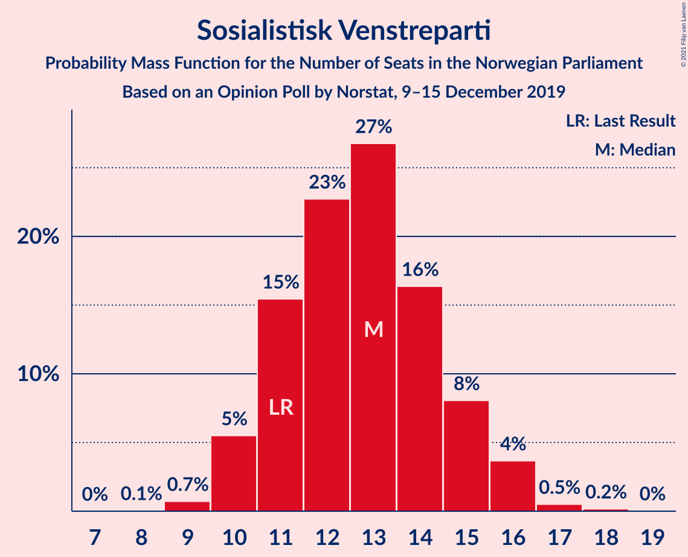

| Number of Seats | Probability | Accumulated | Special Marks |
|:---------------:|:-----------:|:-----------:|:-------------:|
| 8 | 0.1% | 100% |  |
| 9 | 0.7% | 99.9% |  |
| 10 | 5% | 99.2% |  |
| 11 | 15% | 94% | Last Result |
| 12 | 23% | 78% |  |
| 13 | 27% | 56% | Median |
| 14 | 16% | 29% |  |
| 15 | 8% | 12% |  |
| 16 | 4% | 4% |  |
| 17 | 0.5% | 0.7% |  |
| 18 | 0.2% | 0.2% |  |
| 19 | 0% | 0% |  |

### Rødt

*For a full overview of the results for this party, see the [Rødt](party-rødt.html) page.*

| Number of Seats | Probability | Accumulated | Special Marks |
|:---------------:|:-----------:|:-----------:|:-------------:|
| 1 | 0.2% | 100% | Last Result |
| 2 | 15% | 99.8% |  |
| 3 | 0% | 84% |  |
| 4 | 0% | 84% |  |
| 5 | 0% | 84% |  |
| 6 | 0% | 84% |  |
| 7 | 12% | 84% |  |
| 8 | 33% | 72% | Median |
| 9 | 21% | 40% |  |
| 10 | 13% | 19% |  |
| 11 | 5% | 6% |  |
| 12 | 0.5% | 0.7% |  |
| 13 | 0.1% | 0.1% |  |
| 14 | 0% | 0% |  |

### Miljøpartiet De Grønne

*For a full overview of the results for this party, see the [Miljøpartiet De Grønne](party-miljøpartietdegrønne.html) page.*

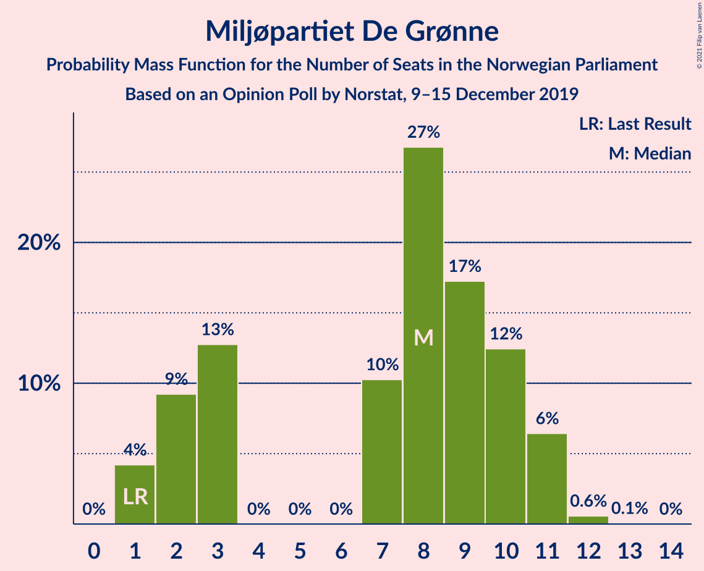

| Number of Seats | Probability | Accumulated | Special Marks |
|:---------------:|:-----------:|:-----------:|:-------------:|
| 1 | 4% | 100% | Last Result |
| 2 | 9% | 96% |  |
| 3 | 13% | 87% |  |
| 4 | 0% | 74% |  |
| 5 | 0% | 74% |  |
| 6 | 0% | 74% |  |
| 7 | 10% | 74% |  |
| 8 | 27% | 64% | Median |
| 9 | 17% | 37% |  |
| 10 | 12% | 20% |  |
| 11 | 6% | 7% |  |
| 12 | 0.6% | 0.6% |  |
| 13 | 0.1% | 0.1% |  |
| 14 | 0% | 0% |  |

### Venstre

*For a full overview of the results for this party, see the [Venstre](party-venstre.html) page.*

| Number of Seats | Probability | Accumulated | Special Marks |
|:---------------:|:-----------:|:-----------:|:-------------:|
| 0 | 1.1% | 100% |  |
| 1 | 28% | 98.9% |  |
| 2 | 66% | 71% | Median |
| 3 | 0.1% | 4% |  |
| 4 | 0% | 4% |  |
| 5 | 0% | 4% |  |
| 6 | 0% | 4% |  |
| 7 | 3% | 4% |  |
| 8 | 0.9% | 1.0% | Last Result |
| 9 | 0.1% | 0.1% |  |
| 10 | 0% | 0% |  |

### Kristelig Folkeparti

*For a full overview of the results for this party, see the [Kristelig Folkeparti](party-kristeligfolkeparti.html) page.*

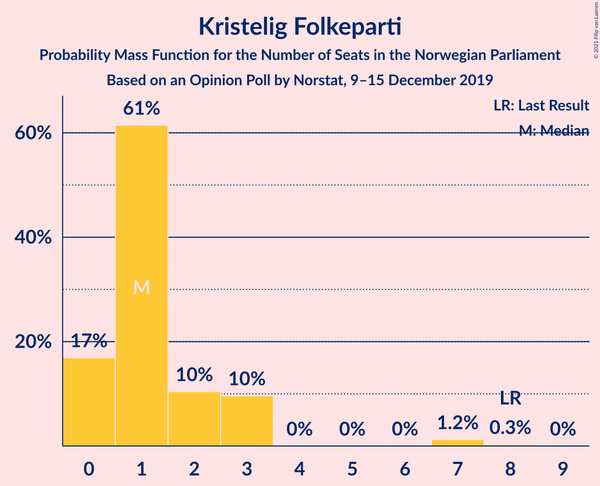

| Number of Seats | Probability | Accumulated | Special Marks |
|:---------------:|:-----------:|:-----------:|:-------------:|
| 0 | 17% | 100% |  |
| 1 | 61% | 83% | Median |
| 2 | 10% | 22% |  |
| 3 | 10% | 11% |  |
| 4 | 0% | 2% |  |
| 5 | 0% | 2% |  |
| 6 | 0% | 2% |  |
| 7 | 1.2% | 2% |  |
| 8 | 0.3% | 0.3% | Last Result |
| 9 | 0% | 0% |  |

## Coalitions

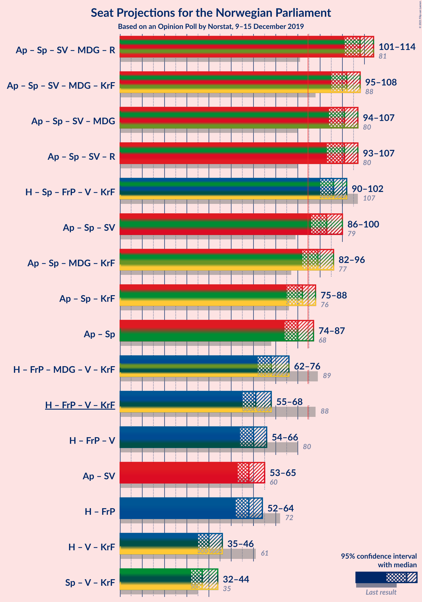

### Confidence Intervals

| Coalition | Last Result | Median | Majority? | 80% Confidence Interval | 90% Confidence Interval | 95% Confidence Interval | 99% Confidence Interval |
|:---------:|:-----------:|:------:|:---------:|:-----------------------:|:-----------------------:|:-----------------------:|:-----------------------:|
| Arbeiderpartiet – Senterpartiet – Sosialistisk Venstreparti – Miljøpartiet De Grønne – Rødt | 81 | 108 | 100% | 103–112 | 102–113 | 101–114 | 99–116 |
| Arbeiderpartiet – Senterpartiet – Sosialistisk Venstreparti – Miljøpartiet De Grønne – Kristelig Folkeparti | 88 | 102 | 100% | 97–106 | 96–107 | 95–108 | 93–111 |
| Arbeiderpartiet – Senterpartiet – Sosialistisk Venstreparti – Miljøpartiet De Grønne | 80 | 101 | 100% | 96–104 | 95–105 | 94–107 | 91–109 |
| Arbeiderpartiet – Senterpartiet – Sosialistisk Venstreparti – Rødt | 80 | 101 | 100% | 95–105 | 94–106 | 93–107 | 91–109 |
| Høyre – Senterpartiet – Fremskrittspartiet – Venstre – Kristelig Folkeparti | 107 | 96 | 100% | 91–100 | 90–101 | 90–102 | 87–105 |
| Arbeiderpartiet – Senterpartiet – Sosialistisk Venstreparti | 79 | 93 | 99.0% | 89–97 | 88–99 | 86–100 | 84–102 |
| Arbeiderpartiet – Senterpartiet – Miljøpartiet De Grønne – Kristelig Folkeparti | 77 | 89 | 87% | 84–93 | 83–94 | 82–96 | 80–98 |
| Arbeiderpartiet – Senterpartiet – Kristelig Folkeparti | 76 | 82 | 20% | 77–86 | 76–88 | 75–88 | 73–90 |
| Arbeiderpartiet – Senterpartiet | 68 | 80 | 11% | 76–85 | 75–86 | 74–87 | 71–89 |
| Høyre – Fremskrittspartiet – Miljøpartiet De Grønne – Venstre – Kristelig Folkeparti | 89 | 68 | 0% | 64–74 | 63–75 | 62–76 | 60–78 |
| Høyre – Fremskrittspartiet – Venstre – Kristelig Folkeparti | 88 | 61 | 0% | 57–66 | 56–67 | 55–68 | 53–70 |
| Høyre – Fremskrittspartiet – Venstre | 80 | 60 | 0% | 56–64 | 55–66 | 54–66 | 52–69 |
| Arbeiderpartiet – Sosialistisk Venstreparti | 60 | 58 | 0% | 55–63 | 54–64 | 53–65 | 52–68 |
| Høyre – Fremskrittspartiet | 72 | 58 | 0% | 54–62 | 53–64 | 52–64 | 50–67 |
| Høyre – Venstre – Kristelig Folkeparti | 61 | 40 | 0% | 36–43 | 36–45 | 35–46 | 34–48 |
| Senterpartiet – Venstre – Kristelig Folkeparti | 35 | 37 | 0% | 34–42 | 33–42 | 32–44 | 30–46 |

### Arbeiderpartiet – Senterpartiet – Sosialistisk Venstreparti – Miljøpartiet De Grønne – Rødt

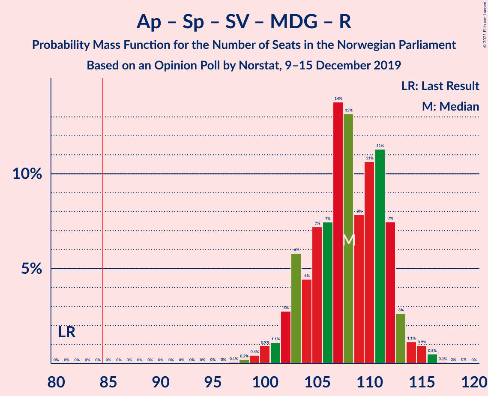

| Number of Seats | Probability | Accumulated | Special Marks |
|:---------------:|:-----------:|:-----------:|:-------------:|
| 81 | 0% | 100% | Last Result |
| 82 | 0% | 100% |  |
| 83 | 0% | 100% |  |
| 84 | 0% | 100% |  |
| 85 | 0% | 100% | Majority |
| 86 | 0% | 100% |  |
| 87 | 0% | 100% |  |
| 88 | 0% | 100% |  |
| 89 | 0% | 100% |  |
| 90 | 0% | 100% |  |
| 91 | 0% | 100% |  |
| 92 | 0% | 100% |  |
| 93 | 0% | 100% |  |
| 94 | 0% | 100% |  |
| 95 | 0% | 100% |  |
| 96 | 0% | 100% |  |
| 97 | 0.1% | 100% |  |
| 98 | 0.2% | 99.9% |  |
| 99 | 0.4% | 99.7% |  |
| 100 | 0.9% | 99.3% |  |
| 101 | 1.1% | 98% |  |
| 102 | 3% | 97% |  |
| 103 | 6% | 94% |  |
| 104 | 4% | 89% |  |
| 105 | 7% | 84% |  |
| 106 | 7% | 77% |  |
| 107 | 14% | 70% |  |
| 108 | 13% | 56% |  |
| 109 | 8% | 43% |  |
| 110 | 11% | 35% | Median |
| 111 | 11% | 24% |  |
| 112 | 7% | 13% |  |
| 113 | 3% | 5% |  |
| 114 | 1.1% | 3% |  |
| 115 | 0.9% | 2% |  |
| 116 | 0.5% | 0.6% |  |
| 117 | 0.1% | 0.1% |  |
| 118 | 0% | 0.1% |  |
| 119 | 0% | 0% |  |

### Arbeiderpartiet – Senterpartiet – Sosialistisk Venstreparti – Miljøpartiet De Grønne – Kristelig Folkeparti

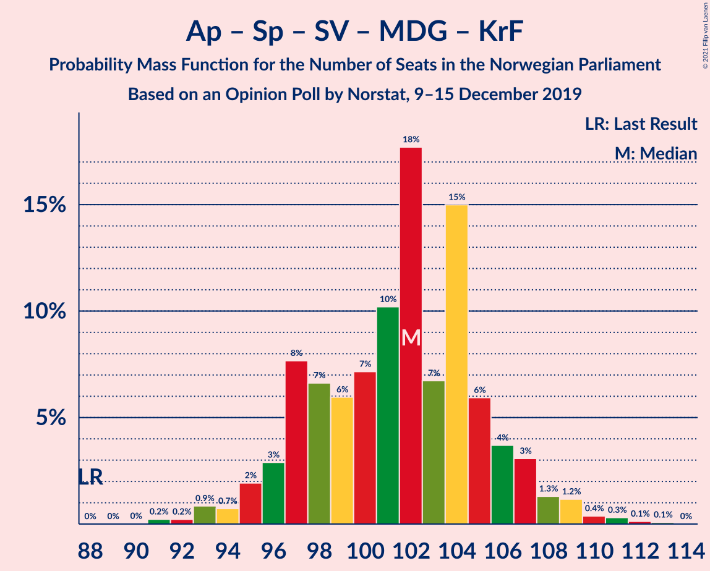

| Number of Seats | Probability | Accumulated | Special Marks |
|:---------------:|:-----------:|:-----------:|:-------------:|
| 88 | 0% | 100% | Last Result |
| 89 | 0% | 100% |  |
| 90 | 0% | 100% |  |
| 91 | 0.2% | 100% |  |
| 92 | 0.2% | 99.7% |  |
| 93 | 0.9% | 99.5% |  |
| 94 | 0.7% | 98.7% |  |
| 95 | 2% | 98% |  |
| 96 | 3% | 96% |  |
| 97 | 8% | 93% |  |
| 98 | 7% | 85% |  |
| 99 | 6% | 79% |  |
| 100 | 7% | 73% |  |
| 101 | 10% | 66% |  |
| 102 | 18% | 56% |  |
| 103 | 7% | 38% | Median |
| 104 | 15% | 31% |  |
| 105 | 6% | 16% |  |
| 106 | 4% | 10% |  |
| 107 | 3% | 6% |  |
| 108 | 1.3% | 3% |  |
| 109 | 1.2% | 2% |  |
| 110 | 0.4% | 0.9% |  |
| 111 | 0.3% | 0.5% |  |
| 112 | 0.1% | 0.2% |  |
| 113 | 0.1% | 0.1% |  |
| 114 | 0% | 0% |  |

### Arbeiderpartiet – Senterpartiet – Sosialistisk Venstreparti – Miljøpartiet De Grønne

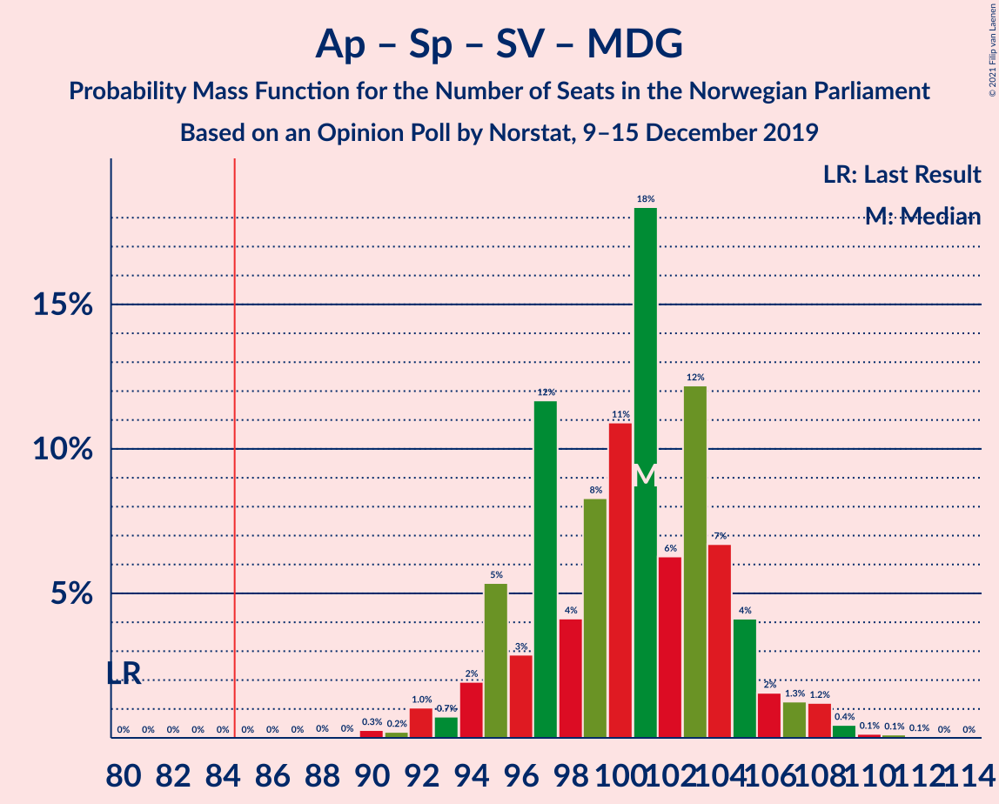

| Number of Seats | Probability | Accumulated | Special Marks |
|:---------------:|:-----------:|:-----------:|:-------------:|
| 80 | 0% | 100% | Last Result |
| 81 | 0% | 100% |  |
| 82 | 0% | 100% |  |
| 83 | 0% | 100% |  |
| 84 | 0% | 100% |  |
| 85 | 0% | 100% | Majority |
| 86 | 0% | 100% |  |
| 87 | 0% | 100% |  |
| 88 | 0% | 100% |  |
| 89 | 0% | 100% |  |
| 90 | 0.3% | 99.9% |  |
| 91 | 0.2% | 99.6% |  |
| 92 | 1.0% | 99.4% |  |
| 93 | 0.7% | 98% |  |
| 94 | 2% | 98% |  |
| 95 | 5% | 96% |  |
| 96 | 3% | 90% |  |
| 97 | 12% | 87% |  |
| 98 | 4% | 76% |  |
| 99 | 8% | 72% |  |
| 100 | 11% | 63% |  |
| 101 | 18% | 52% |  |
| 102 | 6% | 34% | Median |
| 103 | 12% | 28% |  |
| 104 | 7% | 16% |  |
| 105 | 4% | 9% |  |
| 106 | 2% | 5% |  |
| 107 | 1.3% | 3% |  |
| 108 | 1.2% | 2% |  |
| 109 | 0.4% | 0.8% |  |
| 110 | 0.1% | 0.3% |  |
| 111 | 0.1% | 0.2% |  |
| 112 | 0.1% | 0.1% |  |
| 113 | 0% | 0% |  |

### Arbeiderpartiet – Senterpartiet – Sosialistisk Venstreparti – Rødt

| Number of Seats | Probability | Accumulated | Special Marks |
|:---------------:|:-----------:|:-----------:|:-------------:|
| 80 | 0% | 100% | Last Result |
| 81 | 0% | 100% |  |
| 82 | 0% | 100% |  |
| 83 | 0% | 100% |  |
| 84 | 0% | 100% |  |
| 85 | 0% | 100% | Majority |
| 86 | 0% | 100% |  |
| 87 | 0% | 100% |  |
| 88 | 0% | 100% |  |
| 89 | 0% | 100% |  |
| 90 | 0.2% | 99.9% |  |
| 91 | 0.7% | 99.7% |  |
| 92 | 1.0% | 99.0% |  |
| 93 | 2% | 98% |  |
| 94 | 4% | 96% |  |
| 95 | 3% | 92% |  |
| 96 | 3% | 89% |  |
| 97 | 6% | 87% |  |
| 98 | 6% | 81% |  |
| 99 | 5% | 75% |  |
| 100 | 15% | 70% |  |
| 101 | 8% | 55% |  |
| 102 | 6% | 47% | Median |
| 103 | 13% | 40% |  |
| 104 | 13% | 27% |  |
| 105 | 7% | 14% |  |
| 106 | 3% | 7% |  |
| 107 | 3% | 5% |  |
| 108 | 0.8% | 2% |  |
| 109 | 1.0% | 1.1% |  |
| 110 | 0.1% | 0.1% |  |
| 111 | 0% | 0% |  |

### Høyre – Senterpartiet – Fremskrittspartiet – Venstre – Kristelig Folkeparti

| Number of Seats | Probability | Accumulated | Special Marks |
|:---------------:|:-----------:|:-----------:|:-------------:|
| 85 | 0.1% | 100% | Majority |
| 86 | 0.1% | 99.9% |  |
| 87 | 0.4% | 99.8% |  |
| 88 | 0.5% | 99.5% |  |
| 89 | 1.0% | 98.9% |  |
| 90 | 4% | 98% |  |
| 91 | 5% | 94% |  |
| 92 | 7% | 89% |  |
| 93 | 9% | 82% |  |
| 94 | 7% | 73% |  |
| 95 | 14% | 66% |  |
| 96 | 12% | 52% | Median |
| 97 | 13% | 40% |  |
| 98 | 9% | 27% |  |
| 99 | 8% | 18% |  |
| 100 | 3% | 10% |  |
| 101 | 3% | 7% |  |
| 102 | 2% | 4% |  |
| 103 | 1.1% | 2% |  |
| 104 | 0.6% | 1.3% |  |
| 105 | 0.6% | 0.7% |  |
| 106 | 0.1% | 0.2% |  |
| 107 | 0% | 0.1% | Last Result |
| 108 | 0% | 0% |  |

### Arbeiderpartiet – Senterpartiet – Sosialistisk Venstreparti

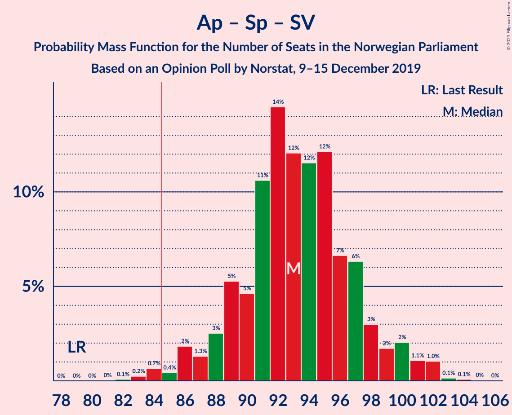

| Number of Seats | Probability | Accumulated | Special Marks |
|:---------------:|:-----------:|:-----------:|:-------------:|
| 79 | 0% | 100% | Last Result |
| 80 | 0% | 100% |  |
| 81 | 0% | 100% |  |
| 82 | 0.1% | 100% |  |
| 83 | 0.2% | 99.9% |  |
| 84 | 0.7% | 99.6% |  |
| 85 | 0.4% | 99.0% | Majority |
| 86 | 2% | 98.5% |  |
| 87 | 1.3% | 97% |  |
| 88 | 3% | 95% |  |
| 89 | 5% | 93% |  |
| 90 | 5% | 88% |  |
| 91 | 11% | 83% |  |
| 92 | 14% | 72% |  |
| 93 | 12% | 58% |  |
| 94 | 12% | 46% | Median |
| 95 | 12% | 34% |  |
| 96 | 7% | 22% |  |
| 97 | 6% | 15% |  |
| 98 | 3% | 9% |  |
| 99 | 2% | 6% |  |
| 100 | 2% | 4% |  |
| 101 | 1.1% | 2% |  |
| 102 | 1.0% | 1.3% |  |
| 103 | 0.1% | 0.3% |  |
| 104 | 0.1% | 0.1% |  |
| 105 | 0% | 0.1% |  |
| 106 | 0% | 0% |  |

### Arbeiderpartiet – Senterpartiet – Miljøpartiet De Grønne – Kristelig Folkeparti

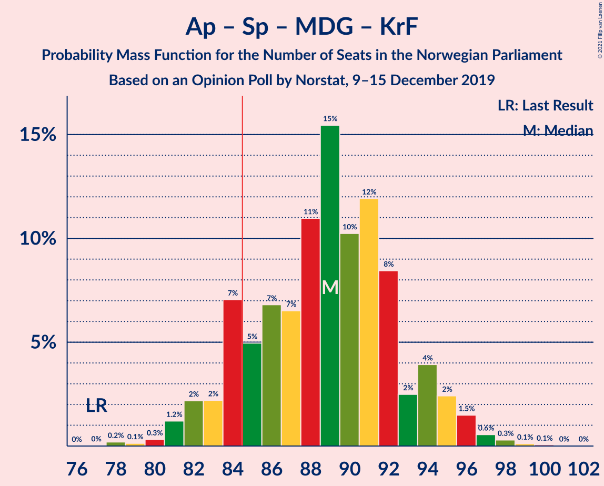

| Number of Seats | Probability | Accumulated | Special Marks |
|:---------------:|:-----------:|:-----------:|:-------------:|
| 77 | 0% | 100% | Last Result |
| 78 | 0.2% | 100% |  |
| 79 | 0.1% | 99.8% |  |
| 80 | 0.3% | 99.6% |  |
| 81 | 1.2% | 99.3% |  |
| 82 | 2% | 98% |  |
| 83 | 2% | 96% |  |
| 84 | 7% | 94% |  |
| 85 | 5% | 87% | Majority |
| 86 | 7% | 82% |  |
| 87 | 7% | 75% |  |
| 88 | 11% | 68% |  |
| 89 | 15% | 57% |  |
| 90 | 10% | 42% | Median |
| 91 | 12% | 32% |  |
| 92 | 8% | 20% |  |
| 93 | 2% | 11% |  |
| 94 | 4% | 9% |  |
| 95 | 2% | 5% |  |
| 96 | 1.5% | 3% |  |
| 97 | 0.6% | 1.1% |  |
| 98 | 0.3% | 0.5% |  |
| 99 | 0.1% | 0.2% |  |
| 100 | 0.1% | 0.1% |  |
| 101 | 0% | 0% |  |

### Arbeiderpartiet – Senterpartiet – Kristelig Folkeparti

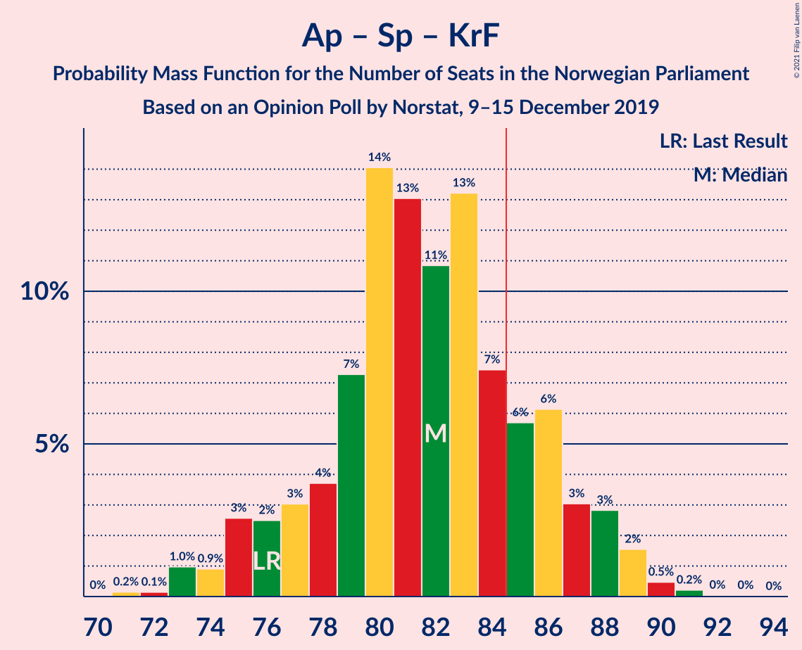

| Number of Seats | Probability | Accumulated | Special Marks |
|:---------------:|:-----------:|:-----------:|:-------------:|
| 70 | 0% | 100% |  |
| 71 | 0.2% | 99.9% |  |
| 72 | 0.1% | 99.8% |  |
| 73 | 1.0% | 99.6% |  |
| 74 | 0.9% | 98.7% |  |
| 75 | 3% | 98% |  |
| 76 | 2% | 95% | Last Result |
| 77 | 3% | 93% |  |
| 78 | 4% | 90% |  |
| 79 | 7% | 86% |  |
| 80 | 14% | 79% |  |
| 81 | 13% | 65% |  |
| 82 | 11% | 52% | Median |
| 83 | 13% | 41% |  |
| 84 | 7% | 27% |  |
| 85 | 6% | 20% | Majority |
| 86 | 6% | 14% |  |
| 87 | 3% | 8% |  |
| 88 | 3% | 5% |  |
| 89 | 2% | 2% |  |
| 90 | 0.5% | 0.8% |  |
| 91 | 0.2% | 0.3% |  |
| 92 | 0% | 0.1% |  |
| 93 | 0% | 0% |  |

### Arbeiderpartiet – Senterpartiet

| Number of Seats | Probability | Accumulated | Special Marks |
|:---------------:|:-----------:|:-----------:|:-------------:|
| 68 | 0% | 100% | Last Result |
| 69 | 0% | 100% |  |
| 70 | 0.1% | 99.9% |  |
| 71 | 0.4% | 99.8% |  |
| 72 | 0.7% | 99.5% |  |
| 73 | 0.5% | 98.8% |  |
| 74 | 3% | 98% |  |
| 75 | 2% | 96% |  |
| 76 | 4% | 94% |  |
| 77 | 3% | 90% |  |
| 78 | 9% | 86% |  |
| 79 | 15% | 77% |  |
| 80 | 15% | 62% |  |
| 81 | 12% | 46% | Median |
| 82 | 8% | 35% |  |
| 83 | 9% | 27% |  |
| 84 | 7% | 18% |  |
| 85 | 4% | 11% | Majority |
| 86 | 3% | 7% |  |
| 87 | 2% | 4% |  |
| 88 | 2% | 2% |  |
| 89 | 0.5% | 0.7% |  |
| 90 | 0.2% | 0.2% |  |
| 91 | 0% | 0.1% |  |
| 92 | 0% | 0% |  |

### Høyre – Fremskrittspartiet – Miljøpartiet De Grønne – Venstre – Kristelig Folkeparti

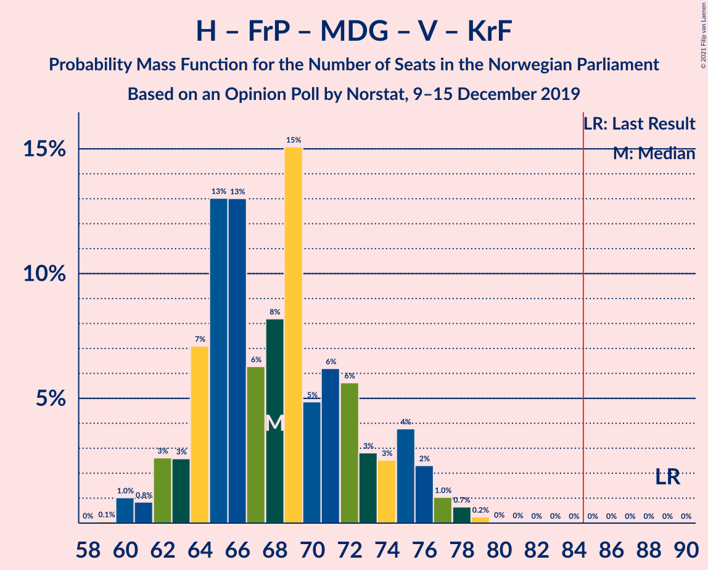

| Number of Seats | Probability | Accumulated | Special Marks |
|:---------------:|:-----------:|:-----------:|:-------------:|
| 59 | 0.1% | 100% |  |
| 60 | 1.0% | 99.9% |  |
| 61 | 0.8% | 98.9% |  |
| 62 | 3% | 98% |  |
| 63 | 3% | 95% |  |
| 64 | 7% | 93% |  |
| 65 | 13% | 86% |  |
| 66 | 13% | 73% |  |
| 67 | 6% | 60% |  |
| 68 | 8% | 53% |  |
| 69 | 15% | 45% | Median |
| 70 | 5% | 30% |  |
| 71 | 6% | 25% |  |
| 72 | 6% | 19% |  |
| 73 | 3% | 13% |  |
| 74 | 3% | 11% |  |
| 75 | 4% | 8% |  |
| 76 | 2% | 4% |  |
| 77 | 1.0% | 2% |  |
| 78 | 0.7% | 1.0% |  |
| 79 | 0.2% | 0.3% |  |
| 80 | 0% | 0.1% |  |
| 81 | 0% | 0% |  |
| 82 | 0% | 0% |  |
| 83 | 0% | 0% |  |
| 84 | 0% | 0% |  |
| 85 | 0% | 0% | Majority |
| 86 | 0% | 0% |  |
| 87 | 0% | 0% |  |
| 88 | 0% | 0% |  |
| 89 | 0% | 0% | Last Result |

### Høyre – Fremskrittspartiet – Venstre – Kristelig Folkeparti

| Number of Seats | Probability | Accumulated | Special Marks |
|:---------------:|:-----------:|:-----------:|:-------------:|
| 51 | 0% | 100% |  |
| 52 | 0.1% | 99.9% |  |
| 53 | 0.5% | 99.9% |  |
| 54 | 0.9% | 99.4% |  |
| 55 | 1.1% | 98% |  |
| 56 | 3% | 97% |  |
| 57 | 7% | 95% |  |
| 58 | 11% | 87% |  |
| 59 | 11% | 76% |  |
| 60 | 8% | 65% |  |
| 61 | 13% | 57% | Median |
| 62 | 14% | 44% |  |
| 63 | 7% | 30% |  |
| 64 | 7% | 23% |  |
| 65 | 4% | 16% |  |
| 66 | 6% | 11% |  |
| 67 | 3% | 6% |  |
| 68 | 1.1% | 3% |  |
| 69 | 0.9% | 2% |  |
| 70 | 0.4% | 0.7% |  |
| 71 | 0.2% | 0.3% |  |
| 72 | 0.1% | 0.1% |  |
| 73 | 0% | 0% |  |
| 74 | 0% | 0% |  |
| 75 | 0% | 0% |  |
| 76 | 0% | 0% |  |
| 77 | 0% | 0% |  |
| 78 | 0% | 0% |  |
| 79 | 0% | 0% |  |
| 80 | 0% | 0% |  |
| 81 | 0% | 0% |  |
| 82 | 0% | 0% |  |
| 83 | 0% | 0% |  |
| 84 | 0% | 0% |  |
| 85 | 0% | 0% | Majority |
| 86 | 0% | 0% |  |
| 87 | 0% | 0% |  |
| 88 | 0% | 0% | Last Result |

### Høyre – Fremskrittspartiet – Venstre

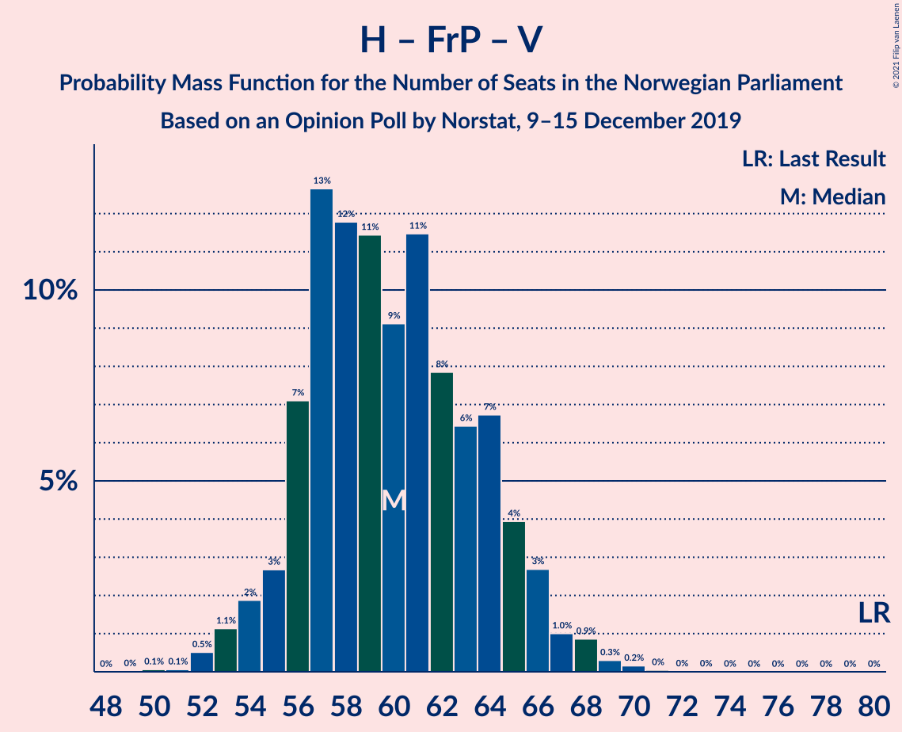

| Number of Seats | Probability | Accumulated | Special Marks |
|:---------------:|:-----------:|:-----------:|:-------------:|
| 50 | 0.1% | 100% |  |
| 51 | 0.1% | 99.9% |  |
| 52 | 0.5% | 99.9% |  |
| 53 | 1.1% | 99.3% |  |
| 54 | 2% | 98% |  |
| 55 | 3% | 96% |  |
| 56 | 7% | 94% |  |
| 57 | 13% | 87% |  |
| 58 | 12% | 74% |  |
| 59 | 11% | 62% |  |
| 60 | 9% | 51% | Median |
| 61 | 11% | 42% |  |
| 62 | 8% | 30% |  |
| 63 | 6% | 22% |  |
| 64 | 7% | 16% |  |
| 65 | 4% | 9% |  |
| 66 | 3% | 5% |  |
| 67 | 1.0% | 2% |  |
| 68 | 0.9% | 1.4% |  |
| 69 | 0.3% | 0.5% |  |
| 70 | 0.2% | 0.2% |  |
| 71 | 0% | 0.1% |  |
| 72 | 0% | 0% |  |
| 73 | 0% | 0% |  |
| 74 | 0% | 0% |  |
| 75 | 0% | 0% |  |
| 76 | 0% | 0% |  |
| 77 | 0% | 0% |  |
| 78 | 0% | 0% |  |
| 79 | 0% | 0% |  |
| 80 | 0% | 0% | Last Result |

### Arbeiderpartiet – Sosialistisk Venstreparti

| Number of Seats | Probability | Accumulated | Special Marks |
|:---------------:|:-----------:|:-----------:|:-------------:|
| 50 | 0.1% | 100% |  |
| 51 | 0.2% | 99.9% |  |
| 52 | 0.9% | 99.7% |  |
| 53 | 2% | 98.8% |  |
| 54 | 2% | 97% |  |
| 55 | 8% | 94% |  |
| 56 | 6% | 87% |  |
| 57 | 18% | 81% |  |
| 58 | 15% | 63% |  |
| 59 | 10% | 48% | Median |
| 60 | 14% | 38% | Last Result |
| 61 | 8% | 24% |  |
| 62 | 5% | 16% |  |
| 63 | 6% | 11% |  |
| 64 | 2% | 6% |  |
| 65 | 1.3% | 3% |  |
| 66 | 0.7% | 2% |  |
| 67 | 0.4% | 1.1% |  |
| 68 | 0.7% | 0.7% |  |
| 69 | 0% | 0.1% |  |
| 70 | 0% | 0% |  |

### Høyre – Fremskrittspartiet

| Number of Seats | Probability | Accumulated | Special Marks |
|:---------------:|:-----------:|:-----------:|:-------------:|
| 48 | 0% | 100% |  |
| 49 | 0.1% | 99.9% |  |
| 50 | 0.5% | 99.8% |  |
| 51 | 1.2% | 99.3% |  |
| 52 | 1.4% | 98% |  |
| 53 | 3% | 97% |  |
| 54 | 6% | 94% |  |
| 55 | 12% | 88% |  |
| 56 | 13% | 76% |  |
| 57 | 9% | 63% |  |
| 58 | 14% | 55% | Median |
| 59 | 12% | 41% |  |
| 60 | 7% | 29% |  |
| 61 | 6% | 22% |  |
| 62 | 6% | 15% |  |
| 63 | 3% | 9% |  |
| 64 | 4% | 6% |  |
| 65 | 1.1% | 2% |  |
| 66 | 0.7% | 1.3% |  |
| 67 | 0.4% | 0.6% |  |
| 68 | 0.1% | 0.2% |  |
| 69 | 0% | 0% |  |
| 70 | 0% | 0% |  |
| 71 | 0% | 0% |  |
| 72 | 0% | 0% | Last Result |

### Høyre – Venstre – Kristelig Folkeparti

| Number of Seats | Probability | Accumulated | Special Marks |
|:---------------:|:-----------:|:-----------:|:-------------:|
| 32 | 0.1% | 100% |  |
| 33 | 0.2% | 99.9% |  |
| 34 | 1.1% | 99.7% |  |
| 35 | 2% | 98.6% |  |
| 36 | 7% | 96% |  |
| 37 | 8% | 90% |  |
| 38 | 11% | 82% |  |
| 39 | 15% | 71% |  |
| 40 | 13% | 56% | Median |
| 41 | 14% | 43% |  |
| 42 | 9% | 29% |  |
| 43 | 10% | 20% |  |
| 44 | 3% | 10% |  |
| 45 | 3% | 7% |  |
| 46 | 2% | 3% |  |
| 47 | 1.1% | 2% |  |
| 48 | 0.4% | 0.7% |  |
| 49 | 0.1% | 0.3% |  |
| 50 | 0.1% | 0.1% |  |
| 51 | 0% | 0.1% |  |
| 52 | 0% | 0% |  |
| 53 | 0% | 0% |  |
| 54 | 0% | 0% |  |
| 55 | 0% | 0% |  |
| 56 | 0% | 0% |  |
| 57 | 0% | 0% |  |
| 58 | 0% | 0% |  |
| 59 | 0% | 0% |  |
| 60 | 0% | 0% |  |
| 61 | 0% | 0% | Last Result |

### Senterpartiet – Venstre – Kristelig Folkeparti

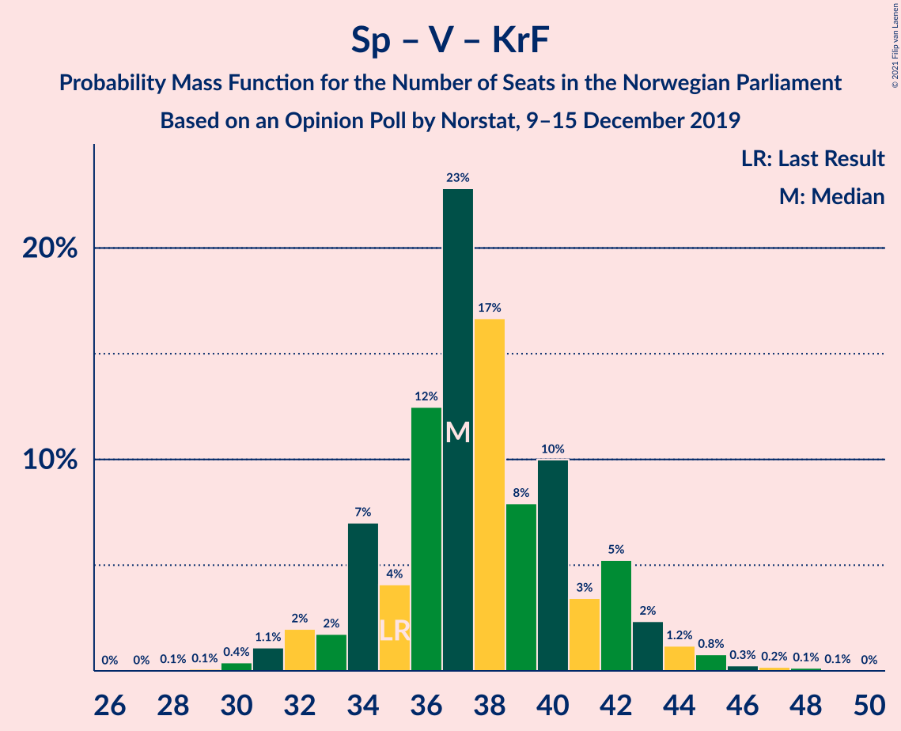

| Number of Seats | Probability | Accumulated | Special Marks |
|:---------------:|:-----------:|:-----------:|:-------------:|
| 28 | 0.1% | 100% |  |
| 29 | 0.1% | 99.9% |  |
| 30 | 0.4% | 99.8% |  |
| 31 | 1.1% | 99.4% |  |
| 32 | 2% | 98% |  |
| 33 | 2% | 96% |  |
| 34 | 7% | 95% |  |
| 35 | 4% | 88% | Last Result |
| 36 | 12% | 84% |  |
| 37 | 23% | 71% |  |
| 38 | 17% | 48% | Median |
| 39 | 8% | 32% |  |
| 40 | 10% | 24% |  |
| 41 | 3% | 14% |  |
| 42 | 5% | 10% |  |
| 43 | 2% | 5% |  |
| 44 | 1.2% | 3% |  |
| 45 | 0.8% | 1.4% |  |
| 46 | 0.3% | 0.7% |  |
| 47 | 0.2% | 0.4% |  |
| 48 | 0.1% | 0.2% |  |
| 49 | 0.1% | 0.1% |  |
| 50 | 0% | 0% |  |

## Technical Information

### Opinion Poll

+ **Polling firm:** Norstat
+ **Commissioner(s):** —
+ **Fieldwork period:** 9–15 December 2019

### Calculations

+ **Sample size:** 1000
+ **Simulations done:** 1,048,576
+ **Error estimate:** 2.10%

