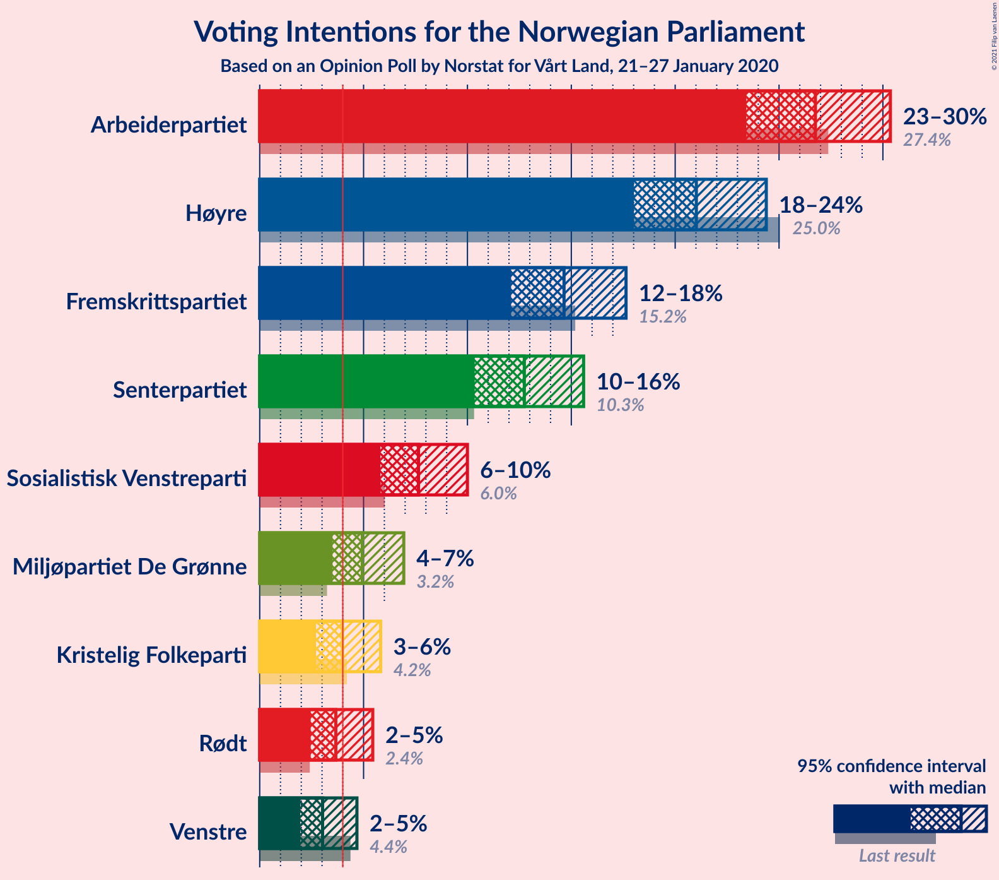
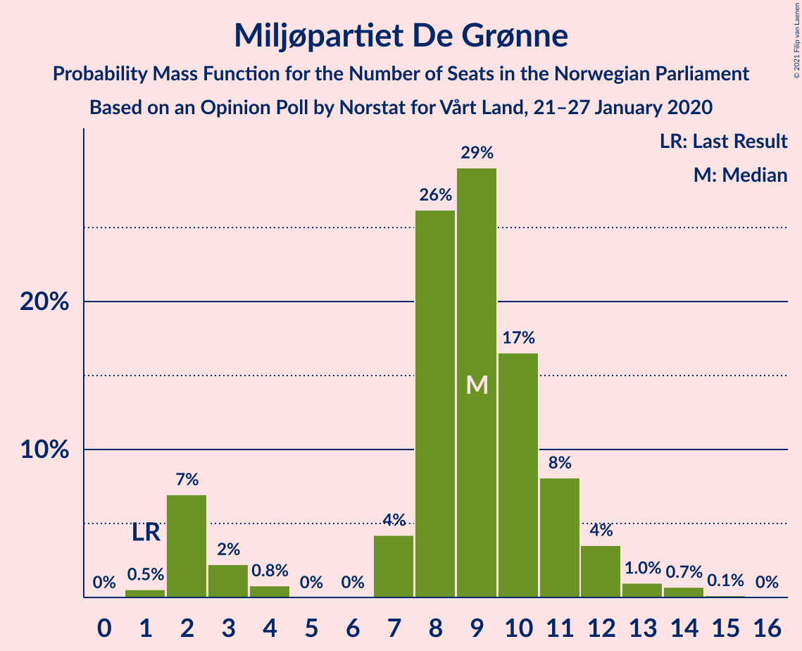
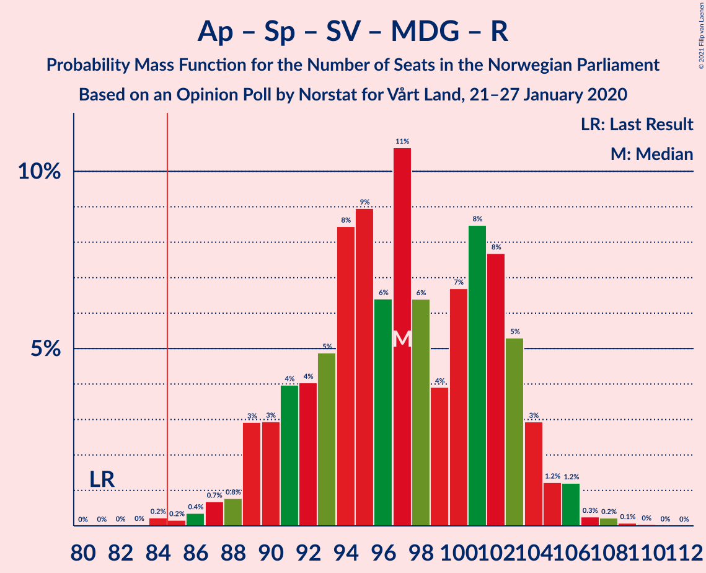
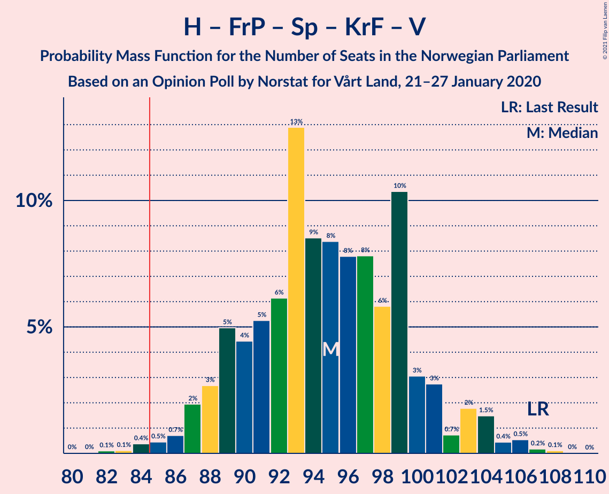
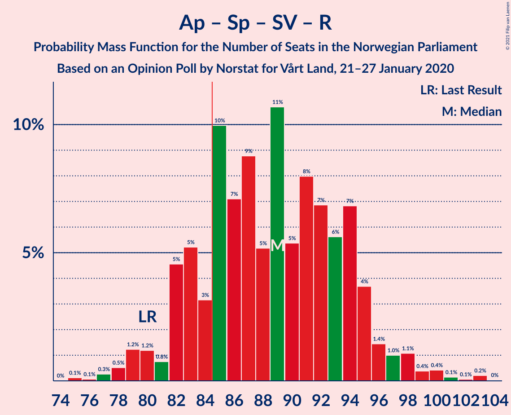
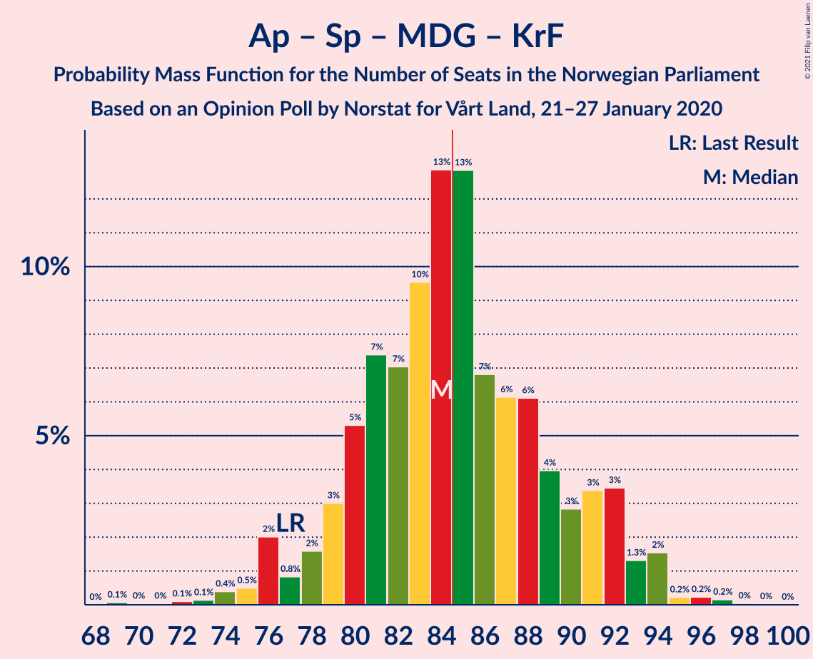
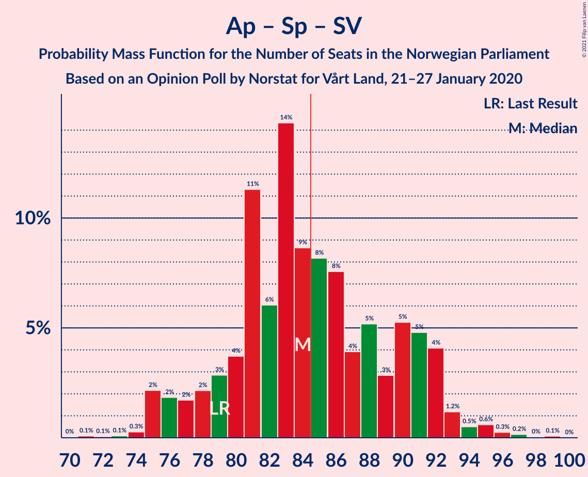
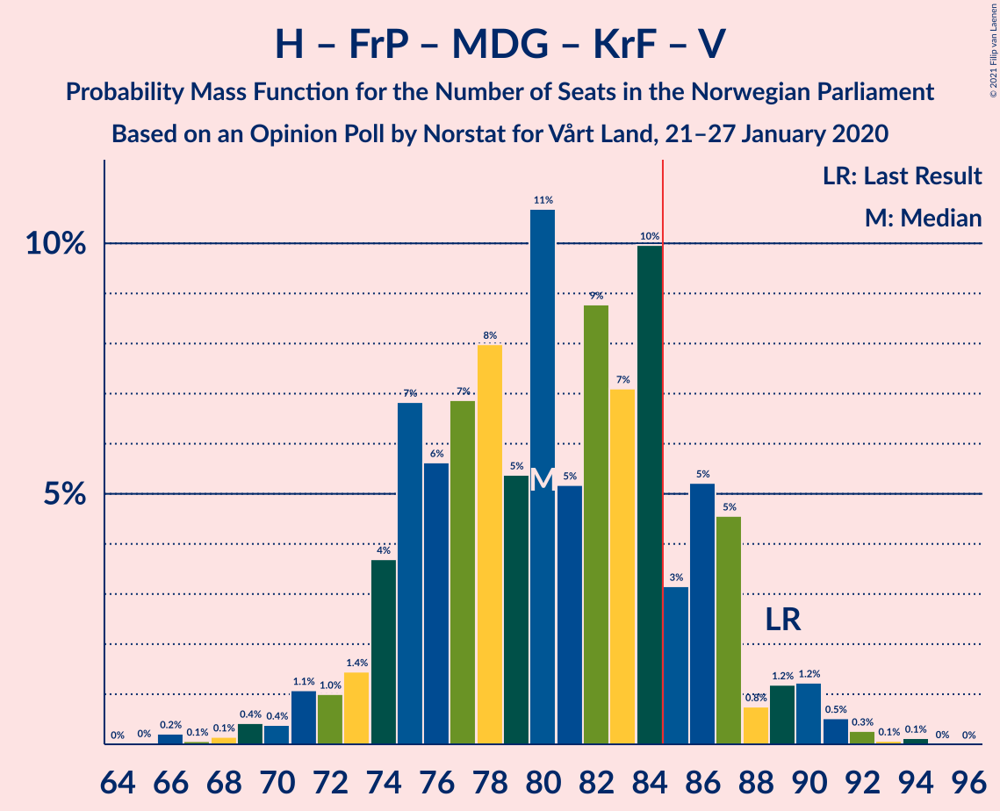
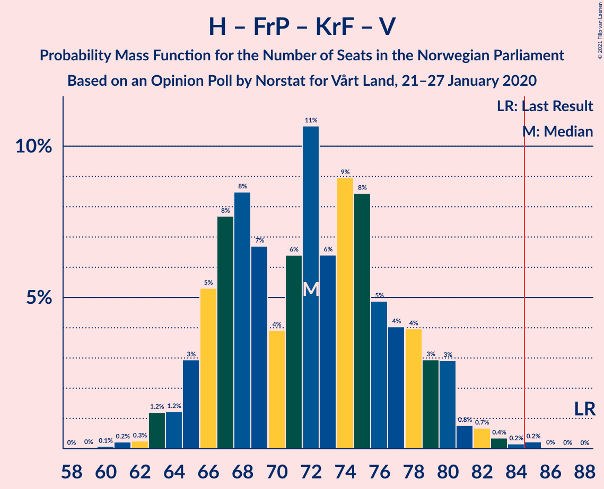

# Opinion Poll by Norstat for Vårt Land, 21–27 January 2020

<a href="#voting-intentions">Voting Intentions</a> | <a href="#seats">Seats</a> | <a href="#coalitions">Coalitions</a> | <a href="#technical-information">Technical Information</a>

## Voting Intentions

### Confidence Intervals

| Party | Last Result | Poll Result | 80% Confidence Interval | 90% Confidence Interval | 95% Confidence Interval | 99% Confidence Interval |
|:-----:|:-----------:|:-----------:|:-----------------------:|:-----------------------:|:-----------------------:|:-----------------------:|
| Arbeiderpartiet | 27.4% | 26.8% | 24.6–29.1% |24.0–29.8% |23.4–30.4% |22.4–31.5% |
| Høyre | 25.0% | 21.0% | 19.0–23.2% |18.5–23.8% |18.0–24.4% |17.1–25.5% |
| Fremskrittspartiet | 15.2% | 14.6% | 13.0–16.6% |12.5–17.1% |12.1–17.6% |11.3–18.6% |
| Senterpartiet | 10.3% | 12.7% | 11.2–14.6% |10.7–15.1% |10.3–15.6% |9.6–16.5% |
| Sosialistisk Venstreparti | 6.0% | 7.6% | 6.4–9.2% |6.1–9.6% |5.8–10.0% |5.3–10.8% |
| Miljøpartiet De Grønne | 3.2% | 4.9% | 4.0–6.2% |3.7–6.6% |3.5–6.9% |3.1–7.6% |
| Kristelig Folkeparti | 4.2% | 4.0% | 3.1–5.2% |2.9–5.5% |2.7–5.8% |2.4–6.4% |
| Rødt | 2.4% | 3.7% | 2.9–4.8% |2.6–5.2% |2.5–5.4% |2.1–6.1% |
| Venstre | 4.4% | 3.0% | 2.3–4.1% |2.1–4.4% |2.0–4.7% |1.6–5.3% |

*Note:* The poll result column reflects the actual value used in the calculations. Published results may vary slightly, and in addition be rounded to fewer digits.

## Seats

### Confidence Intervals

| Party | Last Result | Median | 80% Confidence Interval | 90% Confidence Interval | 95% Confidence Interval | 99% Confidence Interval |
|:-----:|:-----------:|:------:|:-----------------------:|:-----------------------:|:-----------------------:|:-----------------------:|
| <a href="#arbeiderpartiet">Arbeiderpartiet</a> | 49 | 47 | 44–52 |43–54 |42–55 |40–57 |
| <a href="#høyre">Høyre</a> | 45 | 37 | 34–42 |32–44 |31–45 |29–46 |
| <a href="#fremskrittspartiet">Fremskrittspartiet</a> | 27 | 26 | 24–31 |22–32 |21–32 |19–33 |
| <a href="#senterpartiet">Senterpartiet</a> | 19 | 23 | 20–26 |19–27 |18–28 |17–30 |
| <a href="#sosialistisk-venstreparti">Sosialistisk Venstreparti</a> | 11 | 14 | 11–16 |11–17 |10–17 |9–20 |
| <a href="#miljøpartiet-de-grønne">Miljøpartiet De Grønne</a> | 1 | 9 | 4–11 |2–12 |2–12 |1–14 |
| <a href="#kristelig-folkeparti">Kristelig Folkeparti</a> | 8 | 7 | 2–9 |1–10 |1–10 |1–11 |
| <a href="#rødt">Rødt</a> | 1 | 2 | 2–8 |1–9 |1–9 |1–10 |
| <a href="#venstre">Venstre</a> | 8 | 2 | 1–7 |1–8 |1–8 |0–9 |

### Arbeiderpartiet

*For a full overview of the results for this party, see the [Arbeiderpartiet](party-arbeiderpartiet.html) page.*

| Number of Seats | Probability | Accumulated | Special Marks |
|:---------------:|:-----------:|:-----------:|:-------------:|
| 39 | 0.3% | 100% |  |
| 40 | 0.4% | 99.7% |  |
| 41 | 0.5% | 99.3% |  |
| 42 | 2% | 98.7% |  |
| 43 | 4% | 96% |  |
| 44 | 9% | 92% |  |
| 45 | 13% | 83% |  |
| 46 | 10% | 71% |  |
| 47 | 15% | 61% | Median |
| 48 | 9% | 46% |  |
| 49 | 5% | 37% | Last Result |
| 50 | 9% | 32% |  |
| 51 | 6% | 22% |  |
| 52 | 6% | 16% |  |
| 53 | 3% | 10% |  |
| 54 | 3% | 7% |  |
| 55 | 1.1% | 3% |  |
| 56 | 1.5% | 2% |  |
| 57 | 0.5% | 0.9% |  |
| 58 | 0.2% | 0.3% |  |
| 59 | 0% | 0.1% |  |
| 60 | 0% | 0.1% |  |
| 61 | 0% | 0.1% |  |
| 62 | 0% | 0% |  |

### Høyre

*For a full overview of the results for this party, see the [Høyre](party-høyre.html) page.*

| Number of Seats | Probability | Accumulated | Special Marks |
|:---------------:|:-----------:|:-----------:|:-------------:|
| 27 | 0.1% | 100% |  |
| 28 | 0.2% | 99.9% |  |
| 29 | 0.3% | 99.7% |  |
| 30 | 0.5% | 99.5% |  |
| 31 | 2% | 98.9% |  |
| 32 | 2% | 97% |  |
| 33 | 2% | 95% |  |
| 34 | 12% | 93% |  |
| 35 | 9% | 81% |  |
| 36 | 16% | 72% |  |
| 37 | 14% | 57% | Median |
| 38 | 13% | 43% |  |
| 39 | 8% | 30% |  |
| 40 | 6% | 21% |  |
| 41 | 3% | 15% |  |
| 42 | 2% | 12% |  |
| 43 | 4% | 10% |  |
| 44 | 3% | 6% |  |
| 45 | 2% | 3% | Last Result |
| 46 | 0.2% | 0.6% |  |
| 47 | 0.3% | 0.3% |  |
| 48 | 0.1% | 0.1% |  |
| 49 | 0% | 0% |  |

### Fremskrittspartiet

*For a full overview of the results for this party, see the [Fremskrittspartiet](party-fremskrittspartiet.html) page.*

| Number of Seats | Probability | Accumulated | Special Marks |
|:---------------:|:-----------:|:-----------:|:-------------:|
| 18 | 0.1% | 100% |  |
| 19 | 0.6% | 99.9% |  |
| 20 | 1.5% | 99.3% |  |
| 21 | 2% | 98% |  |
| 22 | 2% | 96% |  |
| 23 | 0.5% | 93% |  |
| 24 | 10% | 93% |  |
| 25 | 14% | 83% |  |
| 26 | 32% | 70% | Median |
| 27 | 8% | 37% | Last Result |
| 28 | 13% | 29% |  |
| 29 | 2% | 17% |  |
| 30 | 4% | 14% |  |
| 31 | 4% | 11% |  |
| 32 | 6% | 7% |  |
| 33 | 1.0% | 1.2% |  |
| 34 | 0.1% | 0.2% |  |
| 35 | 0% | 0.1% |  |
| 36 | 0% | 0.1% |  |
| 37 | 0% | 0% |  |

### Senterpartiet

*For a full overview of the results for this party, see the [Senterpartiet](party-senterpartiet.html) page.*

| Number of Seats | Probability | Accumulated | Special Marks |
|:---------------:|:-----------:|:-----------:|:-------------:|
| 16 | 0.4% | 100% |  |
| 17 | 2% | 99.6% |  |
| 18 | 3% | 98% |  |
| 19 | 3% | 95% | Last Result |
| 20 | 8% | 92% |  |
| 21 | 19% | 84% |  |
| 22 | 10% | 65% |  |
| 23 | 15% | 55% | Median |
| 24 | 13% | 40% |  |
| 25 | 8% | 27% |  |
| 26 | 10% | 19% |  |
| 27 | 5% | 9% |  |
| 28 | 2% | 4% |  |
| 29 | 0.7% | 1.3% |  |
| 30 | 0.4% | 0.6% |  |
| 31 | 0.1% | 0.2% |  |
| 32 | 0% | 0.1% |  |
| 33 | 0% | 0% |  |

### Sosialistisk Venstreparti

*For a full overview of the results for this party, see the [Sosialistisk Venstreparti](party-sosialistiskvenstreparti.html) page.*

| Number of Seats | Probability | Accumulated | Special Marks |
|:---------------:|:-----------:|:-----------:|:-------------:|
| 8 | 0.2% | 100% |  |
| 9 | 0.9% | 99.8% |  |
| 10 | 4% | 98.9% |  |
| 11 | 8% | 95% | Last Result |
| 12 | 12% | 87% |  |
| 13 | 18% | 75% |  |
| 14 | 23% | 57% | Median |
| 15 | 15% | 33% |  |
| 16 | 12% | 19% |  |
| 17 | 4% | 7% |  |
| 18 | 1.1% | 2% |  |
| 19 | 0.6% | 1.2% |  |
| 20 | 0.4% | 0.6% |  |
| 21 | 0.2% | 0.2% |  |
| 22 | 0% | 0% |  |

### Miljøpartiet De Grønne

*For a full overview of the results for this party, see the [Miljøpartiet De Grønne](party-miljøpartietdegrønne.html) page.*

| Number of Seats | Probability | Accumulated | Special Marks |
|:---------------:|:-----------:|:-----------:|:-------------:|
| 1 | 0.5% | 100% | Last Result |
| 2 | 7% | 99.5% |  |
| 3 | 2% | 92% |  |
| 4 | 0.8% | 90% |  |
| 5 | 0% | 89% |  |
| 6 | 0% | 89% |  |
| 7 | 4% | 89% |  |
| 8 | 26% | 85% |  |
| 9 | 29% | 59% | Median |
| 10 | 17% | 30% |  |
| 11 | 8% | 13% |  |
| 12 | 4% | 5% |  |
| 13 | 1.0% | 2% |  |
| 14 | 0.7% | 0.9% |  |
| 15 | 0.1% | 0.2% |  |
| 16 | 0% | 0% |  |

### Kristelig Folkeparti

*For a full overview of the results for this party, see the [Kristelig Folkeparti](party-kristeligfolkeparti.html) page.*

| Number of Seats | Probability | Accumulated | Special Marks |
|:---------------:|:-----------:|:-----------:|:-------------:|
| 0 | 0.3% | 100% |  |
| 1 | 9% | 99.7% |  |
| 2 | 8% | 91% |  |
| 3 | 30% | 83% |  |
| 4 | 0% | 53% |  |
| 5 | 0% | 53% |  |
| 6 | 0% | 53% |  |
| 7 | 14% | 53% | Median |
| 8 | 20% | 39% | Last Result |
| 9 | 11% | 19% |  |
| 10 | 6% | 7% |  |
| 11 | 1.3% | 2% |  |
| 12 | 0.2% | 0.3% |  |
| 13 | 0.1% | 0.1% |  |
| 14 | 0% | 0% |  |

### Rødt

*For a full overview of the results for this party, see the [Rødt](party-rødt.html) page.*

| Number of Seats | Probability | Accumulated | Special Marks |
|:---------------:|:-----------:|:-----------:|:-------------:|
| 1 | 10% | 100% | Last Result |
| 2 | 53% | 90% | Median |
| 3 | 0% | 37% |  |
| 4 | 0% | 37% |  |
| 5 | 0% | 37% |  |
| 6 | 0% | 37% |  |
| 7 | 9% | 37% |  |
| 8 | 20% | 28% |  |
| 9 | 6% | 9% |  |
| 10 | 2% | 2% |  |
| 11 | 0.4% | 0.4% |  |
| 12 | 0.1% | 0.1% |  |
| 13 | 0% | 0% |  |

### Venstre

*For a full overview of the results for this party, see the [Venstre](party-venstre.html) page.*

| Number of Seats | Probability | Accumulated | Special Marks |
|:---------------:|:-----------:|:-----------:|:-------------:|
| 0 | 1.1% | 100% |  |
| 1 | 16% | 98.9% |  |
| 2 | 66% | 83% | Median |
| 3 | 5% | 18% |  |
| 4 | 0% | 13% |  |
| 5 | 0% | 13% |  |
| 6 | 0.1% | 13% |  |
| 7 | 6% | 13% |  |
| 8 | 6% | 7% | Last Result |
| 9 | 0.6% | 0.9% |  |
| 10 | 0.3% | 0.3% |  |
| 11 | 0.1% | 0.1% |  |
| 12 | 0% | 0% |  |

## Coalitions

### Confidence Intervals

| Coalition | Last Result | Median | Majority? | 80% Confidence Interval | 90% Confidence Interval | 95% Confidence Interval | 99% Confidence Interval |
|:---------:|:-----------:|:------:|:---------:|:-----------------------:|:-----------------------:|:-----------------------:|:-----------------------:|
| Arbeiderpartiet – Senterpartiet – Sosialistisk Venstreparti – Miljøpartiet De Grønne – Kristelig Folkeparti | 88 | 98 | 99.9% | 93–104 | 91–105 | 90–107 | 87–108 |
| Arbeiderpartiet – Senterpartiet – Sosialistisk Venstreparti – Miljøpartiet De Grønne – Rødt | 81 | 97 | 99.7% | 91–103 | 89–104 | 89–105 | 86–107 |
| Høyre – Fremskrittspartiet – Senterpartiet – Kristelig Folkeparti – Venstre | 107 | 95 | 99.3% | 89–100 | 88–102 | 87–104 | 84–106 |
| Arbeiderpartiet – Senterpartiet – Sosialistisk Venstreparti – Miljøpartiet De Grønne | 80 | 93 | 96% | 87–99 | 85–100 | 84–101 | 82–104 |
| Arbeiderpartiet – Senterpartiet – Sosialistisk Venstreparti – Rødt | 80 | 89 | 83% | 83–94 | 82–95 | 80–97 | 78–100 |
| Arbeiderpartiet – Senterpartiet – Miljøpartiet De Grønne – Kristelig Folkeparti | 77 | 84 | 49% | 80–91 | 78–92 | 76–93 | 74–95 |
| Arbeiderpartiet – Senterpartiet – Sosialistisk Venstreparti | 79 | 84 | 45% | 79–91 | 77–92 | 75–93 | 74–96 |
| Høyre – Fremskrittspartiet – Miljøpartiet De Grønne – Kristelig Folkeparti – Venstre | 89 | 80 | 17% | 75–86 | 74–87 | 72–89 | 69–91 |
| Arbeiderpartiet – Senterpartiet – Kristelig Folkeparti | 76 | 76 | 3% | 71–82 | 69–84 | 68–85 | 66–88 |
| Høyre – Fremskrittspartiet – Kristelig Folkeparti – Venstre | 88 | 72 | 0.3% | 66–78 | 65–80 | 64–80 | 62–83 |
| Arbeiderpartiet – Senterpartiet | 68 | 70 | 0.1% | 65–76 | 64–78 | 63–79 | 61–82 |
| Høyre – Fremskrittspartiet – Venstre | 80 | 66 | 0% | 62–72 | 59–73 | 58–75 | 56–77 |
| Høyre – Fremskrittspartiet | 72 | 63 | 0% | 59–69 | 57–70 | 56–71 | 54–74 |
| Arbeiderpartiet – Sosialistisk Venstreparti | 60 | 61 | 0% | 57–67 | 56–68 | 55–70 | 53–72 |
| Høyre – Kristelig Folkeparti – Venstre | 61 | 45 | 0% | 40–51 | 39–52 | 39–54 | 36–58 |
| Senterpartiet – Kristelig Folkeparti – Venstre | 35 | 31 | 0% | 26–36 | 25–37 | 24–39 | 22–41 |

### Arbeiderpartiet – Senterpartiet – Sosialistisk Venstreparti – Miljøpartiet De Grønne – Kristelig Folkeparti

| Number of Seats | Probability | Accumulated | Special Marks |
|:---------------:|:-----------:|:-----------:|:-------------:|
| 84 | 0.1% | 100% |  |
| 85 | 0% | 99.9% | Majority |
| 86 | 0.2% | 99.8% |  |
| 87 | 0.8% | 99.6% |  |
| 88 | 0.3% | 98.9% | Last Result |
| 89 | 0.5% | 98.5% |  |
| 90 | 1.0% | 98% |  |
| 91 | 4% | 97% |  |
| 92 | 2% | 93% |  |
| 93 | 3% | 91% |  |
| 94 | 4% | 88% |  |
| 95 | 7% | 84% |  |
| 96 | 9% | 77% |  |
| 97 | 14% | 68% |  |
| 98 | 6% | 54% |  |
| 99 | 8% | 48% |  |
| 100 | 4% | 40% | Median |
| 101 | 13% | 36% |  |
| 102 | 7% | 23% |  |
| 103 | 7% | 17% |  |
| 104 | 4% | 10% |  |
| 105 | 2% | 7% |  |
| 106 | 1.1% | 5% |  |
| 107 | 2% | 4% |  |
| 108 | 2% | 2% |  |
| 109 | 0.2% | 0.5% |  |
| 110 | 0.1% | 0.3% |  |
| 111 | 0.1% | 0.1% |  |
| 112 | 0% | 0% |  |

### Arbeiderpartiet – Senterpartiet – Sosialistisk Venstreparti – Miljøpartiet De Grønne – Rødt

| Number of Seats | Probability | Accumulated | Special Marks |
|:---------------:|:-----------:|:-----------:|:-------------:|
| 81 | 0% | 100% | Last Result |
| 82 | 0% | 100% |  |
| 83 | 0% | 100% |  |
| 84 | 0.2% | 99.9% |  |
| 85 | 0.2% | 99.7% | Majority |
| 86 | 0.4% | 99.5% |  |
| 87 | 0.7% | 99.2% |  |
| 88 | 0.8% | 98.5% |  |
| 89 | 3% | 98% |  |
| 90 | 3% | 95% |  |
| 91 | 4% | 92% |  |
| 92 | 4% | 88% |  |
| 93 | 5% | 84% |  |
| 94 | 8% | 79% |  |
| 95 | 9% | 71% | Median |
| 96 | 6% | 62% |  |
| 97 | 11% | 55% |  |
| 98 | 6% | 44% |  |
| 99 | 4% | 38% |  |
| 100 | 7% | 34% |  |
| 101 | 8% | 27% |  |
| 102 | 8% | 19% |  |
| 103 | 5% | 11% |  |
| 104 | 3% | 6% |  |
| 105 | 1.2% | 3% |  |
| 106 | 1.2% | 2% |  |
| 107 | 0.3% | 0.6% |  |
| 108 | 0.2% | 0.4% |  |
| 109 | 0.1% | 0.2% |  |
| 110 | 0% | 0.1% |  |
| 111 | 0% | 0% |  |

### Høyre – Fremskrittspartiet – Senterpartiet – Kristelig Folkeparti – Venstre

| Number of Seats | Probability | Accumulated | Special Marks |
|:---------------:|:-----------:|:-----------:|:-------------:|
| 81 | 0% | 100% |  |
| 82 | 0.1% | 99.9% |  |
| 83 | 0.1% | 99.8% |  |
| 84 | 0.4% | 99.7% |  |
| 85 | 0.5% | 99.3% | Majority |
| 86 | 0.7% | 98.9% |  |
| 87 | 2% | 98% |  |
| 88 | 3% | 96% |  |
| 89 | 5% | 94% |  |
| 90 | 4% | 89% |  |
| 91 | 5% | 84% |  |
| 92 | 6% | 79% |  |
| 93 | 13% | 73% |  |
| 94 | 9% | 60% |  |
| 95 | 8% | 51% | Median |
| 96 | 8% | 43% |  |
| 97 | 8% | 35% |  |
| 98 | 6% | 27% |  |
| 99 | 10% | 21% |  |
| 100 | 3% | 11% |  |
| 101 | 3% | 8% |  |
| 102 | 0.7% | 5% |  |
| 103 | 2% | 5% |  |
| 104 | 1.5% | 3% |  |
| 105 | 0.4% | 1.3% |  |
| 106 | 0.5% | 0.9% |  |
| 107 | 0.2% | 0.3% | Last Result |
| 108 | 0.1% | 0.2% |  |
| 109 | 0% | 0.1% |  |
| 110 | 0% | 0% |  |

### Arbeiderpartiet – Senterpartiet – Sosialistisk Venstreparti – Miljøpartiet De Grønne

| Number of Seats | Probability | Accumulated | Special Marks |
|:---------------:|:-----------:|:-----------:|:-------------:|
| 78 | 0% | 100% |  |
| 79 | 0.1% | 99.9% |  |
| 80 | 0.1% | 99.9% | Last Result |
| 81 | 0.2% | 99.8% |  |
| 82 | 0.4% | 99.6% |  |
| 83 | 0.9% | 99.2% |  |
| 84 | 3% | 98% |  |
| 85 | 1.2% | 96% | Majority |
| 86 | 2% | 94% |  |
| 87 | 4% | 92% |  |
| 88 | 3% | 88% |  |
| 89 | 10% | 85% |  |
| 90 | 4% | 75% |  |
| 91 | 6% | 71% |  |
| 92 | 13% | 64% |  |
| 93 | 10% | 51% | Median |
| 94 | 9% | 41% |  |
| 95 | 6% | 32% |  |
| 96 | 4% | 26% |  |
| 97 | 4% | 23% |  |
| 98 | 3% | 19% |  |
| 99 | 6% | 16% |  |
| 100 | 4% | 9% |  |
| 101 | 3% | 5% |  |
| 102 | 1.1% | 2% |  |
| 103 | 0.3% | 1.2% |  |
| 104 | 0.6% | 0.9% |  |
| 105 | 0.2% | 0.3% |  |
| 106 | 0.1% | 0.1% |  |
| 107 | 0% | 0.1% |  |
| 108 | 0% | 0% |  |

### Arbeiderpartiet – Senterpartiet – Sosialistisk Venstreparti – Rødt

| Number of Seats | Probability | Accumulated | Special Marks |
|:---------------:|:-----------:|:-----------:|:-------------:|
| 75 | 0.1% | 100% |  |
| 76 | 0.1% | 99.9% |  |
| 77 | 0.3% | 99.8% |  |
| 78 | 0.5% | 99.5% |  |
| 79 | 1.2% | 99.0% |  |
| 80 | 1.2% | 98% | Last Result |
| 81 | 0.8% | 97% |  |
| 82 | 5% | 96% |  |
| 83 | 5% | 91% |  |
| 84 | 3% | 86% |  |
| 85 | 10% | 83% | Majority |
| 86 | 7% | 73% | Median |
| 87 | 9% | 66% |  |
| 88 | 5% | 57% |  |
| 89 | 11% | 52% |  |
| 90 | 5% | 41% |  |
| 91 | 8% | 36% |  |
| 92 | 7% | 28% |  |
| 93 | 6% | 21% |  |
| 94 | 7% | 15% |  |
| 95 | 4% | 8% |  |
| 96 | 1.4% | 5% |  |
| 97 | 1.0% | 3% |  |
| 98 | 1.1% | 2% |  |
| 99 | 0.4% | 1.3% |  |
| 100 | 0.4% | 0.9% |  |
| 101 | 0.1% | 0.5% |  |
| 102 | 0.1% | 0.3% |  |
| 103 | 0.2% | 0.3% |  |
| 104 | 0% | 0% |  |

### Arbeiderpartiet – Senterpartiet – Miljøpartiet De Grønne – Kristelig Folkeparti

| Number of Seats | Probability | Accumulated | Special Marks |
|:---------------:|:-----------:|:-----------:|:-------------:|
| 69 | 0.1% | 100% |  |
| 70 | 0% | 99.9% |  |
| 71 | 0% | 99.9% |  |
| 72 | 0.1% | 99.8% |  |
| 73 | 0.1% | 99.7% |  |
| 74 | 0.4% | 99.6% |  |
| 75 | 0.5% | 99.2% |  |
| 76 | 2% | 98.7% |  |
| 77 | 0.8% | 97% | Last Result |
| 78 | 2% | 96% |  |
| 79 | 3% | 94% |  |
| 80 | 5% | 91% |  |
| 81 | 7% | 86% |  |
| 82 | 7% | 79% |  |
| 83 | 10% | 72% |  |
| 84 | 13% | 62% |  |
| 85 | 13% | 49% | Majority |
| 86 | 7% | 36% | Median |
| 87 | 6% | 29% |  |
| 88 | 6% | 23% |  |
| 89 | 4% | 17% |  |
| 90 | 3% | 13% |  |
| 91 | 3% | 10% |  |
| 92 | 3% | 7% |  |
| 93 | 1.3% | 4% |  |
| 94 | 2% | 2% |  |
| 95 | 0.2% | 0.7% |  |
| 96 | 0.2% | 0.5% |  |
| 97 | 0.2% | 0.2% |  |
| 98 | 0% | 0.1% |  |
| 99 | 0% | 0% |  |

### Arbeiderpartiet – Senterpartiet – Sosialistisk Venstreparti

| Number of Seats | Probability | Accumulated | Special Marks |
|:---------------:|:-----------:|:-----------:|:-------------:|
| 71 | 0.1% | 100% |  |
| 72 | 0.1% | 99.9% |  |
| 73 | 0.1% | 99.8% |  |
| 74 | 0.3% | 99.7% |  |
| 75 | 2% | 99.5% |  |
| 76 | 2% | 97% |  |
| 77 | 2% | 95% |  |
| 78 | 2% | 94% |  |
| 79 | 3% | 92% | Last Result |
| 80 | 4% | 89% |  |
| 81 | 11% | 85% |  |
| 82 | 6% | 74% |  |
| 83 | 14% | 68% |  |
| 84 | 9% | 53% | Median |
| 85 | 8% | 45% | Majority |
| 86 | 8% | 37% |  |
| 87 | 4% | 29% |  |
| 88 | 5% | 25% |  |
| 89 | 3% | 20% |  |
| 90 | 5% | 17% |  |
| 91 | 5% | 12% |  |
| 92 | 4% | 7% |  |
| 93 | 1.2% | 3% |  |
| 94 | 0.5% | 2% |  |
| 95 | 0.6% | 1.2% |  |
| 96 | 0.3% | 0.6% |  |
| 97 | 0.2% | 0.3% |  |
| 98 | 0% | 0.2% |  |
| 99 | 0.1% | 0.1% |  |
| 100 | 0% | 0% |  |

### Høyre – Fremskrittspartiet – Miljøpartiet De Grønne – Kristelig Folkeparti – Venstre

| Number of Seats | Probability | Accumulated | Special Marks |
|:---------------:|:-----------:|:-----------:|:-------------:|
| 66 | 0.2% | 100% |  |
| 67 | 0.1% | 99.7% |  |
| 68 | 0.1% | 99.7% |  |
| 69 | 0.4% | 99.5% |  |
| 70 | 0.4% | 99.1% |  |
| 71 | 1.1% | 98.7% |  |
| 72 | 1.0% | 98% |  |
| 73 | 1.4% | 97% |  |
| 74 | 4% | 95% |  |
| 75 | 7% | 91% |  |
| 76 | 6% | 85% |  |
| 77 | 7% | 79% |  |
| 78 | 8% | 72% |  |
| 79 | 5% | 64% |  |
| 80 | 11% | 59% |  |
| 81 | 5% | 48% | Median |
| 82 | 9% | 43% |  |
| 83 | 7% | 34% |  |
| 84 | 10% | 27% |  |
| 85 | 3% | 17% | Majority |
| 86 | 5% | 14% |  |
| 87 | 5% | 9% |  |
| 88 | 0.8% | 4% |  |
| 89 | 1.2% | 3% | Last Result |
| 90 | 1.2% | 2% |  |
| 91 | 0.5% | 1.0% |  |
| 92 | 0.3% | 0.5% |  |
| 93 | 0.1% | 0.2% |  |
| 94 | 0.1% | 0.1% |  |
| 95 | 0% | 0% |  |

### Arbeiderpartiet – Senterpartiet – Kristelig Folkeparti

| Number of Seats | Probability | Accumulated | Special Marks |
|:---------------:|:-----------:|:-----------:|:-------------:|
| 63 | 0% | 100% |  |
| 64 | 0.1% | 99.9% |  |
| 65 | 0.2% | 99.9% |  |
| 66 | 0.5% | 99.7% |  |
| 67 | 0.6% | 99.2% |  |
| 68 | 2% | 98.6% |  |
| 69 | 2% | 97% |  |
| 70 | 2% | 95% |  |
| 71 | 4% | 93% |  |
| 72 | 5% | 89% |  |
| 73 | 8% | 83% |  |
| 74 | 10% | 76% |  |
| 75 | 8% | 66% |  |
| 76 | 16% | 58% | Last Result |
| 77 | 9% | 42% | Median |
| 78 | 8% | 33% |  |
| 79 | 7% | 26% |  |
| 80 | 4% | 19% |  |
| 81 | 2% | 14% |  |
| 82 | 4% | 12% |  |
| 83 | 2% | 8% |  |
| 84 | 2% | 5% |  |
| 85 | 1.4% | 3% | Majority |
| 86 | 0.6% | 2% |  |
| 87 | 0.3% | 1.2% |  |
| 88 | 0.6% | 0.9% |  |
| 89 | 0.1% | 0.2% |  |
| 90 | 0.1% | 0.1% |  |
| 91 | 0% | 0% |  |

### Høyre – Fremskrittspartiet – Kristelig Folkeparti – Venstre

| Number of Seats | Probability | Accumulated | Special Marks |
|:---------------:|:-----------:|:-----------:|:-------------:|
| 59 | 0% | 100% |  |
| 60 | 0.1% | 99.9% |  |
| 61 | 0.2% | 99.8% |  |
| 62 | 0.3% | 99.6% |  |
| 63 | 1.2% | 99.4% |  |
| 64 | 1.2% | 98% |  |
| 65 | 3% | 97% |  |
| 66 | 5% | 94% |  |
| 67 | 8% | 89% |  |
| 68 | 8% | 81% |  |
| 69 | 7% | 73% |  |
| 70 | 4% | 66% |  |
| 71 | 6% | 62% |  |
| 72 | 11% | 55% | Median |
| 73 | 6% | 45% |  |
| 74 | 9% | 38% |  |
| 75 | 8% | 29% |  |
| 76 | 5% | 21% |  |
| 77 | 4% | 16% |  |
| 78 | 4% | 12% |  |
| 79 | 3% | 8% |  |
| 80 | 3% | 5% |  |
| 81 | 0.8% | 2% |  |
| 82 | 0.7% | 1.5% |  |
| 83 | 0.4% | 0.8% |  |
| 84 | 0.2% | 0.5% |  |
| 85 | 0.2% | 0.3% | Majority |
| 86 | 0% | 0.1% |  |
| 87 | 0% | 0% |  |
| 88 | 0% | 0% | Last Result |

### Arbeiderpartiet – Senterpartiet

| Number of Seats | Probability | Accumulated | Special Marks |
|:---------------:|:-----------:|:-----------:|:-------------:|
| 59 | 0.1% | 100% |  |
| 60 | 0.3% | 99.9% |  |
| 61 | 0.2% | 99.6% |  |
| 62 | 0.5% | 99.4% |  |
| 63 | 1.4% | 98.9% |  |
| 64 | 4% | 97% |  |
| 65 | 4% | 94% |  |
| 66 | 4% | 90% |  |
| 67 | 4% | 86% |  |
| 68 | 12% | 82% | Last Result |
| 69 | 12% | 70% |  |
| 70 | 11% | 58% | Median |
| 71 | 9% | 47% |  |
| 72 | 8% | 38% |  |
| 73 | 5% | 30% |  |
| 74 | 5% | 25% |  |
| 75 | 8% | 20% |  |
| 76 | 4% | 13% |  |
| 77 | 3% | 9% |  |
| 78 | 2% | 5% |  |
| 79 | 2% | 4% |  |
| 80 | 0.6% | 1.5% |  |
| 81 | 0.3% | 0.9% |  |
| 82 | 0.3% | 0.5% |  |
| 83 | 0.1% | 0.3% |  |
| 84 | 0.1% | 0.2% |  |
| 85 | 0% | 0.1% | Majority |
| 86 | 0% | 0.1% |  |
| 87 | 0% | 0% |  |

### Høyre – Fremskrittspartiet – Venstre

| Number of Seats | Probability | Accumulated | Special Marks |
|:---------------:|:-----------:|:-----------:|:-------------:|
| 53 | 0% | 100% |  |
| 54 | 0.1% | 99.9% |  |
| 55 | 0.1% | 99.9% |  |
| 56 | 0.3% | 99.8% |  |
| 57 | 0.3% | 99.5% |  |
| 58 | 2% | 99.1% |  |
| 59 | 2% | 97% |  |
| 60 | 3% | 95% |  |
| 61 | 2% | 92% |  |
| 62 | 6% | 90% |  |
| 63 | 4% | 84% |  |
| 64 | 16% | 80% |  |
| 65 | 9% | 65% | Median |
| 66 | 14% | 56% |  |
| 67 | 4% | 42% |  |
| 68 | 7% | 38% |  |
| 69 | 6% | 31% |  |
| 70 | 7% | 25% |  |
| 71 | 7% | 19% |  |
| 72 | 5% | 11% |  |
| 73 | 2% | 6% |  |
| 74 | 1.4% | 4% |  |
| 75 | 1.2% | 3% |  |
| 76 | 0.8% | 2% |  |
| 77 | 0.4% | 0.8% |  |
| 78 | 0.2% | 0.3% |  |
| 79 | 0.1% | 0.2% |  |
| 80 | 0% | 0.1% | Last Result |
| 81 | 0.1% | 0.1% |  |
| 82 | 0% | 0% |  |

### Høyre – Fremskrittspartiet

| Number of Seats | Probability | Accumulated | Special Marks |
|:---------------:|:-----------:|:-----------:|:-------------:|
| 51 | 0% | 100% |  |
| 52 | 0.1% | 99.9% |  |
| 53 | 0.2% | 99.8% |  |
| 54 | 0.3% | 99.7% |  |
| 55 | 0.4% | 99.3% |  |
| 56 | 2% | 98.9% |  |
| 57 | 3% | 97% |  |
| 58 | 3% | 94% |  |
| 59 | 3% | 92% |  |
| 60 | 4% | 89% |  |
| 61 | 10% | 85% |  |
| 62 | 15% | 75% |  |
| 63 | 11% | 60% | Median |
| 64 | 14% | 49% |  |
| 65 | 5% | 35% |  |
| 66 | 5% | 30% |  |
| 67 | 4% | 24% |  |
| 68 | 5% | 20% |  |
| 69 | 6% | 15% |  |
| 70 | 5% | 9% |  |
| 71 | 2% | 4% |  |
| 72 | 0.6% | 2% | Last Result |
| 73 | 0.5% | 1.4% |  |
| 74 | 0.5% | 1.0% |  |
| 75 | 0.3% | 0.5% |  |
| 76 | 0.1% | 0.2% |  |
| 77 | 0% | 0.1% |  |
| 78 | 0% | 0% |  |

### Arbeiderpartiet – Sosialistisk Venstreparti

| Number of Seats | Probability | Accumulated | Special Marks |
|:---------------:|:-----------:|:-----------:|:-------------:|
| 51 | 0.1% | 100% |  |
| 52 | 0.2% | 99.9% |  |
| 53 | 0.6% | 99.6% |  |
| 54 | 0.7% | 99.0% |  |
| 55 | 3% | 98% |  |
| 56 | 3% | 95% |  |
| 57 | 5% | 92% |  |
| 58 | 5% | 87% |  |
| 59 | 12% | 82% |  |
| 60 | 13% | 70% | Last Result |
| 61 | 13% | 57% | Median |
| 62 | 9% | 44% |  |
| 63 | 7% | 34% |  |
| 64 | 7% | 27% |  |
| 65 | 3% | 21% |  |
| 66 | 5% | 17% |  |
| 67 | 4% | 12% |  |
| 68 | 5% | 8% |  |
| 69 | 0.9% | 4% |  |
| 70 | 1.2% | 3% |  |
| 71 | 1.1% | 2% |  |
| 72 | 0.3% | 0.5% |  |
| 73 | 0.1% | 0.3% |  |
| 74 | 0.1% | 0.1% |  |
| 75 | 0.1% | 0.1% |  |
| 76 | 0% | 0% |  |

### Høyre – Kristelig Folkeparti – Venstre

| Number of Seats | Probability | Accumulated | Special Marks |
|:---------------:|:-----------:|:-----------:|:-------------:|
| 34 | 0.1% | 100% |  |
| 35 | 0.2% | 99.9% |  |
| 36 | 0.2% | 99.7% |  |
| 37 | 1.0% | 99.5% |  |
| 38 | 0.9% | 98.5% |  |
| 39 | 3% | 98% |  |
| 40 | 6% | 94% |  |
| 41 | 6% | 89% |  |
| 42 | 8% | 83% |  |
| 43 | 4% | 75% |  |
| 44 | 18% | 70% |  |
| 45 | 5% | 53% |  |
| 46 | 8% | 48% | Median |
| 47 | 13% | 40% |  |
| 48 | 3% | 27% |  |
| 49 | 7% | 24% |  |
| 50 | 6% | 17% |  |
| 51 | 3% | 11% |  |
| 52 | 3% | 8% |  |
| 53 | 2% | 5% |  |
| 54 | 1.3% | 3% |  |
| 55 | 0.3% | 2% |  |
| 56 | 0.6% | 1.3% |  |
| 57 | 0.2% | 0.7% |  |
| 58 | 0.4% | 0.6% |  |
| 59 | 0.2% | 0.2% |  |
| 60 | 0.1% | 0.1% |  |
| 61 | 0% | 0% | Last Result |

### Senterpartiet – Kristelig Folkeparti – Venstre

| Number of Seats | Probability | Accumulated | Special Marks |
|:---------------:|:-----------:|:-----------:|:-------------:|
| 20 | 0.1% | 100% |  |
| 21 | 0.2% | 99.9% |  |
| 22 | 0.6% | 99.8% |  |
| 23 | 1.0% | 99.2% |  |
| 24 | 2% | 98% |  |
| 25 | 3% | 96% |  |
| 26 | 5% | 94% |  |
| 27 | 8% | 88% |  |
| 28 | 8% | 81% |  |
| 29 | 5% | 72% |  |
| 30 | 8% | 67% |  |
| 31 | 17% | 59% |  |
| 32 | 12% | 43% | Median |
| 33 | 6% | 31% |  |
| 34 | 5% | 25% |  |
| 35 | 7% | 20% | Last Result |
| 36 | 6% | 12% |  |
| 37 | 2% | 7% |  |
| 38 | 1.3% | 5% |  |
| 39 | 2% | 3% |  |
| 40 | 0.5% | 1.4% |  |
| 41 | 0.6% | 0.9% |  |
| 42 | 0.1% | 0.3% |  |
| 43 | 0.1% | 0.2% |  |
| 44 | 0% | 0.1% |  |
| 45 | 0% | 0% |  |

## Technical Information

### Opinion Poll

+ **Polling firm:** Norstat
+ **Commissioner(s):** Vårt Land
+ **Fieldwork period:** 21–27 January 2020

### Calculations

+ **Sample size:** 628
+ **Simulations done:** 1,048,576
+ **Error estimate:** 1.17%

