# Opinion Poll by Norstat for Aftenposten and NRK, 27 January–2 February 2020

<a href="#voting-intentions">Voting Intentions</a> | <a href="#seats">Seats</a> | <a href="#coalitions">Coalitions</a> | <a href="#technical-information">Technical Information</a>

## Voting Intentions

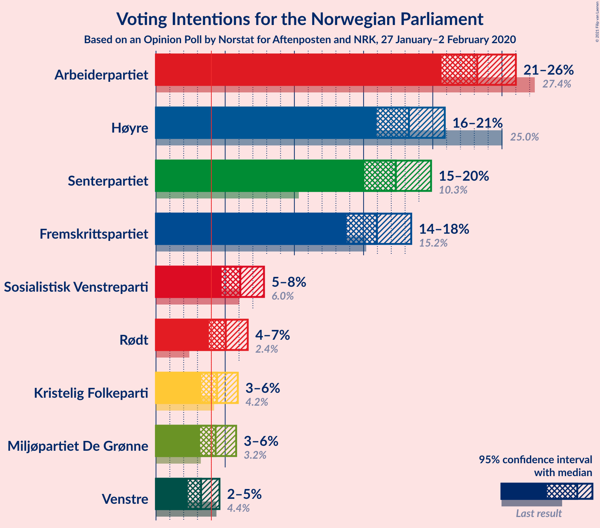

### Confidence Intervals

| Party | Last Result | Poll Result | 80% Confidence Interval | 90% Confidence Interval | 95% Confidence Interval | 99% Confidence Interval |
|:-----:|:-----------:|:-----------:|:-----------------------:|:-----------------------:|:-----------------------:|:-----------------------:|
| Arbeiderpartiet | 27.4% | 23.2% | 21.5–25.0% |21.0–25.6% |20.6–26.0% |19.8–26.9% |
| Høyre | 25.0% | 18.3% | 16.8–20.0% |16.3–20.5% |15.9–20.9% |15.2–21.7% |
| Senterpartiet | 10.3% | 17.3% | 15.8–19.0% |15.4–19.5% |15.1–19.9% |14.4–20.7% |
| Fremskrittspartiet | 15.2% | 16.0% | 14.5–17.6% |14.1–18.0% |13.8–18.4% |13.1–19.2% |
| Sosialistisk Venstreparti | 6.0% | 6.1% | 5.2–7.2% |5.0–7.5% |4.7–7.8% |4.3–8.4% |
| Rødt | 2.4% | 5.0% | 4.2–6.1% |4.0–6.4% |3.8–6.6% |3.5–7.2% |
| Kristelig Folkeparti | 4.2% | 4.4% | 3.7–5.4% |3.5–5.7% |3.3–5.9% |3.0–6.4% |
| Miljøpartiet De Grønne | 3.2% | 4.3% | 3.6–5.3% |3.4–5.5% |3.2–5.8% |2.9–6.3% |
| Venstre | 4.4% | 3.3% | 2.6–4.1% |2.5–4.4% |2.3–4.6% |2.0–5.0% |

*Note:* The poll result column reflects the actual value used in the calculations. Published results may vary slightly, and in addition be rounded to fewer digits.

## Seats

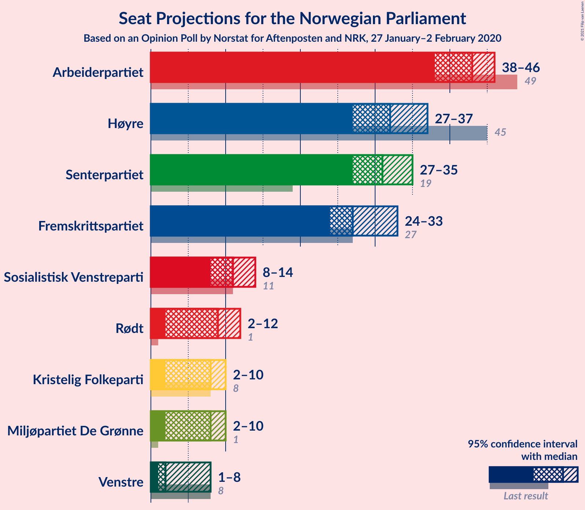

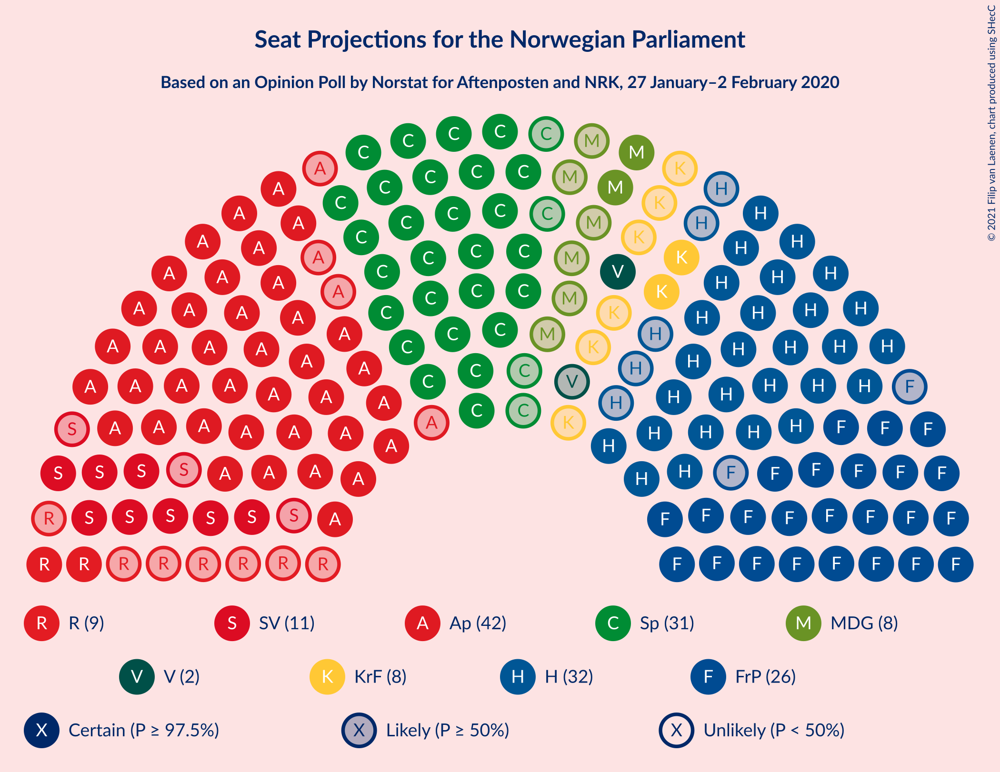

### Confidence Intervals

| Party | Last Result | Median | 80% Confidence Interval | 90% Confidence Interval | 95% Confidence Interval | 99% Confidence Interval |
|:-----:|:-----------:|:------:|:-----------------------:|:-----------------------:|:-----------------------:|:-----------------------:|
| <a href="#arbeiderpartiet">Arbeiderpartiet</a> | 49 | 43 | 40–45 |38–46 |38–46 |36–48 |
| <a href="#høyre">Høyre</a> | 45 | 32 | 28–35 |27–36 |27–37 |25–38 |
| <a href="#senterpartiet">Senterpartiet</a> | 19 | 31 | 28–34 |28–35 |27–35 |25–37 |
| <a href="#fremskrittspartiet">Fremskrittspartiet</a> | 27 | 27 | 25–31 |25–32 |24–33 |23–34 |
| <a href="#sosialistisk-venstreparti">Sosialistisk Venstreparti</a> | 11 | 11 | 9–13 |9–13 |8–14 |7–15 |
| <a href="#rødt">Rødt</a> | 1 | 9 | 7–10 |6–11 |2–12 |2–13 |
| <a href="#kristelig-folkeparti">Kristelig Folkeparti</a> | 8 | 8 | 3–9 |3–10 |2–10 |1–11 |
| <a href="#miljøpartiet-de-grønne">Miljøpartiet De Grønne</a> | 1 | 8 | 2–9 |2–10 |2–10 |1–11 |
| <a href="#venstre">Venstre</a> | 8 | 2 | 2–7 |2–7 |1–8 |1–8 |

### Arbeiderpartiet

*For a full overview of the results for this party, see the [Arbeiderpartiet](party-arbeiderpartiet.html) page.*

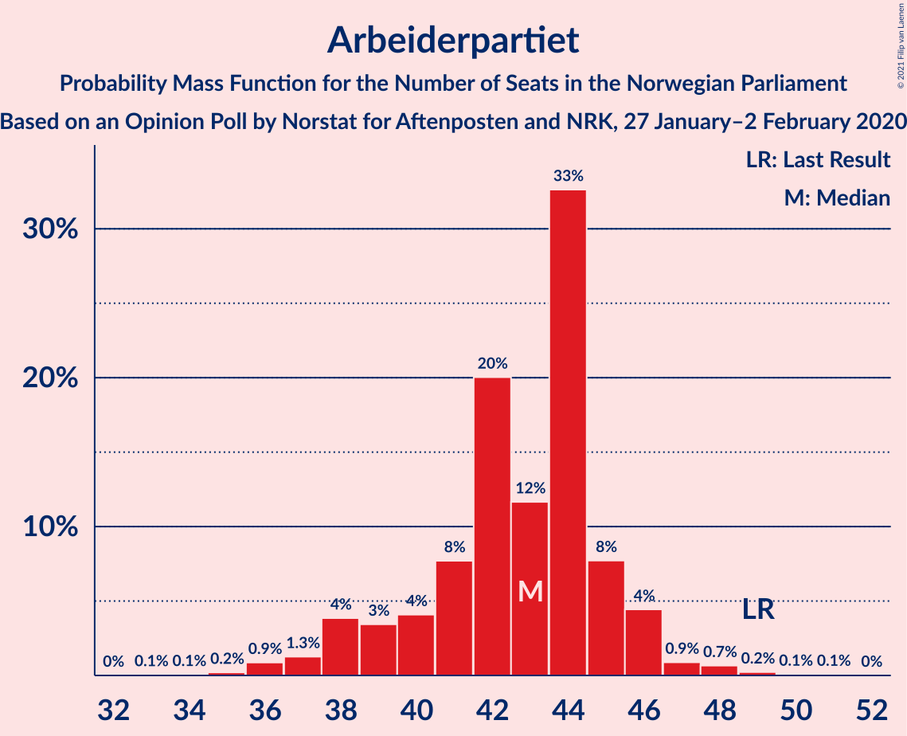

| Number of Seats | Probability | Accumulated | Special Marks |
|:---------------:|:-----------:|:-----------:|:-------------:|
| 33 | 0.1% | 100% |  |
| 34 | 0.1% | 99.9% |  |
| 35 | 0.2% | 99.9% |  |
| 36 | 0.9% | 99.7% |  |
| 37 | 1.3% | 98.8% |  |
| 38 | 4% | 98% |  |
| 39 | 3% | 94% |  |
| 40 | 4% | 90% |  |
| 41 | 8% | 86% |  |
| 42 | 20% | 78% |  |
| 43 | 12% | 58% | Median |
| 44 | 33% | 47% |  |
| 45 | 8% | 14% |  |
| 46 | 4% | 6% |  |
| 47 | 0.9% | 2% |  |
| 48 | 0.7% | 1.1% |  |
| 49 | 0.2% | 0.4% | Last Result |
| 50 | 0.1% | 0.2% |  |
| 51 | 0.1% | 0.1% |  |
| 52 | 0% | 0% |  |

### Høyre

*For a full overview of the results for this party, see the [Høyre](party-høyre.html) page.*

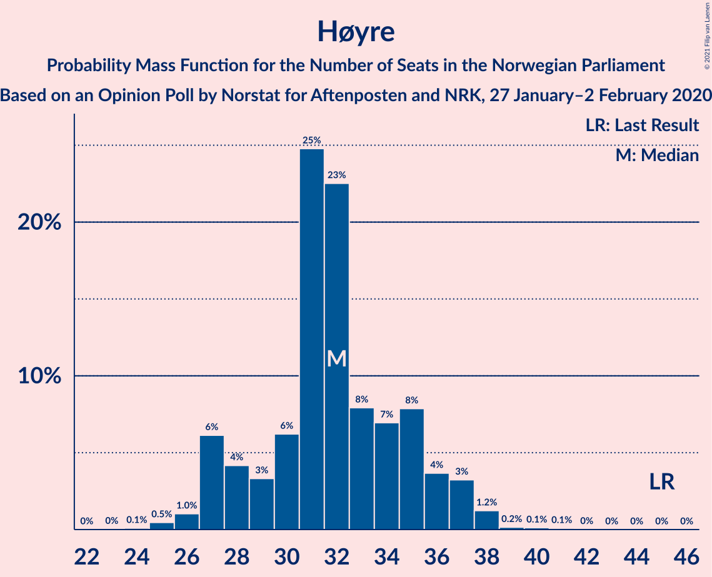

| Number of Seats | Probability | Accumulated | Special Marks |
|:---------------:|:-----------:|:-----------:|:-------------:|
| 24 | 0.1% | 100% |  |
| 25 | 0.5% | 99.9% |  |
| 26 | 1.0% | 99.4% |  |
| 27 | 6% | 98% |  |
| 28 | 4% | 92% |  |
| 29 | 3% | 88% |  |
| 30 | 6% | 85% |  |
| 31 | 25% | 79% |  |
| 32 | 23% | 54% | Median |
| 33 | 8% | 31% |  |
| 34 | 7% | 23% |  |
| 35 | 8% | 16% |  |
| 36 | 4% | 9% |  |
| 37 | 3% | 5% |  |
| 38 | 1.2% | 2% |  |
| 39 | 0.2% | 0.4% |  |
| 40 | 0.1% | 0.2% |  |
| 41 | 0.1% | 0.1% |  |
| 42 | 0% | 0% |  |
| 43 | 0% | 0% |  |
| 44 | 0% | 0% |  |
| 45 | 0% | 0% | Last Result |

### Senterpartiet

*For a full overview of the results for this party, see the [Senterpartiet](party-senterpartiet.html) page.*

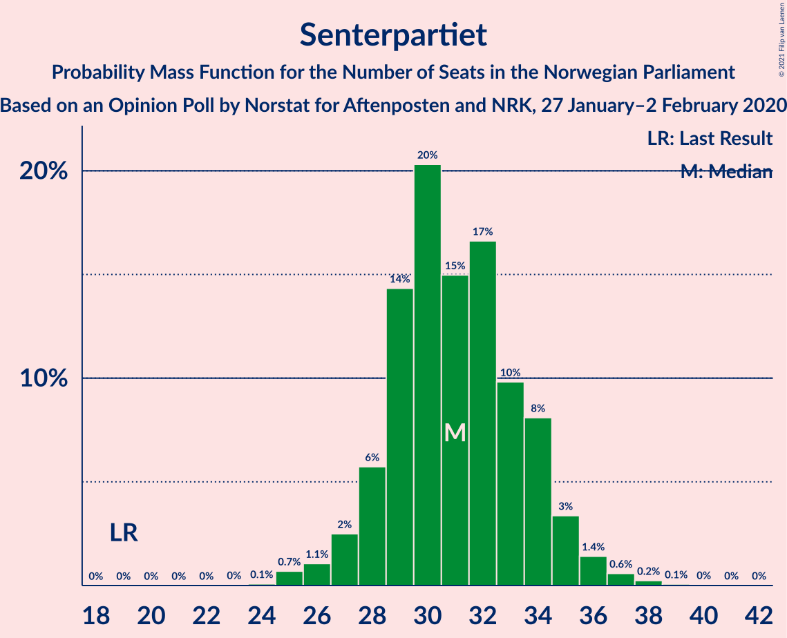

| Number of Seats | Probability | Accumulated | Special Marks |
|:---------------:|:-----------:|:-----------:|:-------------:|
| 19 | 0% | 100% | Last Result |
| 20 | 0% | 100% |  |
| 21 | 0% | 100% |  |
| 22 | 0% | 100% |  |
| 23 | 0% | 100% |  |
| 24 | 0.1% | 100% |  |
| 25 | 0.7% | 99.9% |  |
| 26 | 1.1% | 99.2% |  |
| 27 | 2% | 98% |  |
| 28 | 6% | 96% |  |
| 29 | 14% | 90% |  |
| 30 | 20% | 76% |  |
| 31 | 15% | 55% | Median |
| 32 | 17% | 40% |  |
| 33 | 10% | 24% |  |
| 34 | 8% | 14% |  |
| 35 | 3% | 6% |  |
| 36 | 1.4% | 2% |  |
| 37 | 0.6% | 1.0% |  |
| 38 | 0.2% | 0.4% |  |
| 39 | 0.1% | 0.1% |  |
| 40 | 0% | 0.1% |  |
| 41 | 0% | 0% |  |

### Fremskrittspartiet

*For a full overview of the results for this party, see the [Fremskrittspartiet](party-fremskrittspartiet.html) page.*

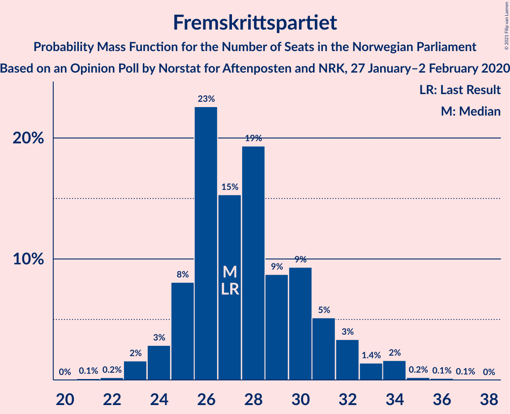

| Number of Seats | Probability | Accumulated | Special Marks |
|:---------------:|:-----------:|:-----------:|:-------------:|
| 21 | 0.1% | 100% |  |
| 22 | 0.2% | 99.9% |  |
| 23 | 2% | 99.7% |  |
| 24 | 3% | 98% |  |
| 25 | 8% | 95% |  |
| 26 | 23% | 87% |  |
| 27 | 15% | 65% | Last Result, Median |
| 28 | 19% | 49% |  |
| 29 | 9% | 30% |  |
| 30 | 9% | 21% |  |
| 31 | 5% | 12% |  |
| 32 | 3% | 7% |  |
| 33 | 1.4% | 3% |  |
| 34 | 2% | 2% |  |
| 35 | 0.2% | 0.4% |  |
| 36 | 0.1% | 0.2% |  |
| 37 | 0.1% | 0.1% |  |
| 38 | 0% | 0% |  |

### Sosialistisk Venstreparti

*For a full overview of the results for this party, see the [Sosialistisk Venstreparti](party-sosialistiskvenstreparti.html) page.*

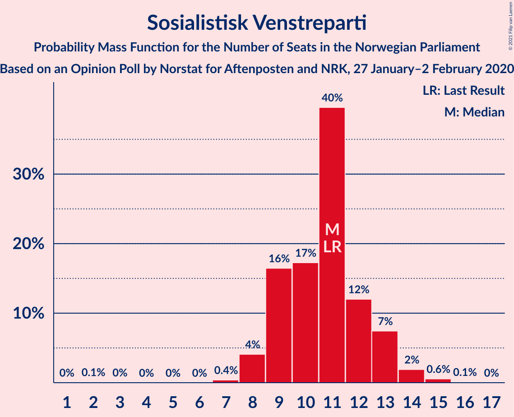

| Number of Seats | Probability | Accumulated | Special Marks |
|:---------------:|:-----------:|:-----------:|:-------------:|
| 2 | 0.1% | 100% |  |
| 3 | 0% | 99.9% |  |
| 4 | 0% | 99.8% |  |
| 5 | 0% | 99.8% |  |
| 6 | 0% | 99.8% |  |
| 7 | 0.4% | 99.8% |  |
| 8 | 4% | 99.4% |  |
| 9 | 16% | 95% |  |
| 10 | 17% | 79% |  |
| 11 | 40% | 62% | Last Result, Median |
| 12 | 12% | 22% |  |
| 13 | 7% | 10% |  |
| 14 | 2% | 3% |  |
| 15 | 0.6% | 0.7% |  |
| 16 | 0.1% | 0.1% |  |
| 17 | 0% | 0% |  |

### Rødt

*For a full overview of the results for this party, see the [Rødt](party-rødt.html) page.*

| Number of Seats | Probability | Accumulated | Special Marks |
|:---------------:|:-----------:|:-----------:|:-------------:|
| 1 | 0% | 100% | Last Result |
| 2 | 5% | 100% |  |
| 3 | 0% | 95% |  |
| 4 | 0% | 95% |  |
| 5 | 0% | 95% |  |
| 6 | 0.5% | 95% |  |
| 7 | 6% | 95% |  |
| 8 | 17% | 89% |  |
| 9 | 53% | 71% | Median |
| 10 | 9% | 19% |  |
| 11 | 5% | 10% |  |
| 12 | 4% | 4% |  |
| 13 | 0.6% | 0.6% |  |
| 14 | 0% | 0% |  |

### Kristelig Folkeparti

*For a full overview of the results for this party, see the [Kristelig Folkeparti](party-kristeligfolkeparti.html) page.*

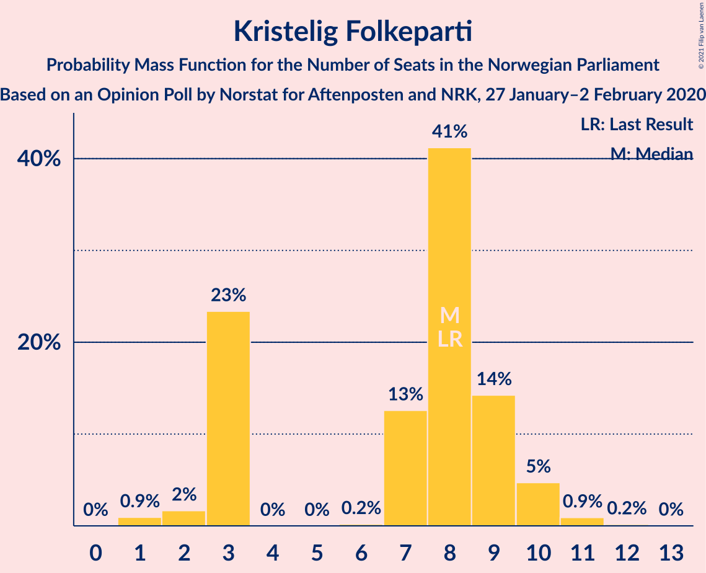

| Number of Seats | Probability | Accumulated | Special Marks |
|:---------------:|:-----------:|:-----------:|:-------------:|
| 1 | 0.9% | 100% |  |
| 2 | 2% | 99.1% |  |
| 3 | 23% | 97% |  |
| 4 | 0% | 74% |  |
| 5 | 0% | 74% |  |
| 6 | 0.2% | 74% |  |
| 7 | 13% | 74% |  |
| 8 | 41% | 61% | Last Result, Median |
| 9 | 14% | 20% |  |
| 10 | 5% | 6% |  |
| 11 | 0.9% | 1.1% |  |
| 12 | 0.2% | 0.2% |  |
| 13 | 0% | 0% |  |

### Miljøpartiet De Grønne

*For a full overview of the results for this party, see the [Miljøpartiet De Grønne](party-miljøpartietdegrønne.html) page.*

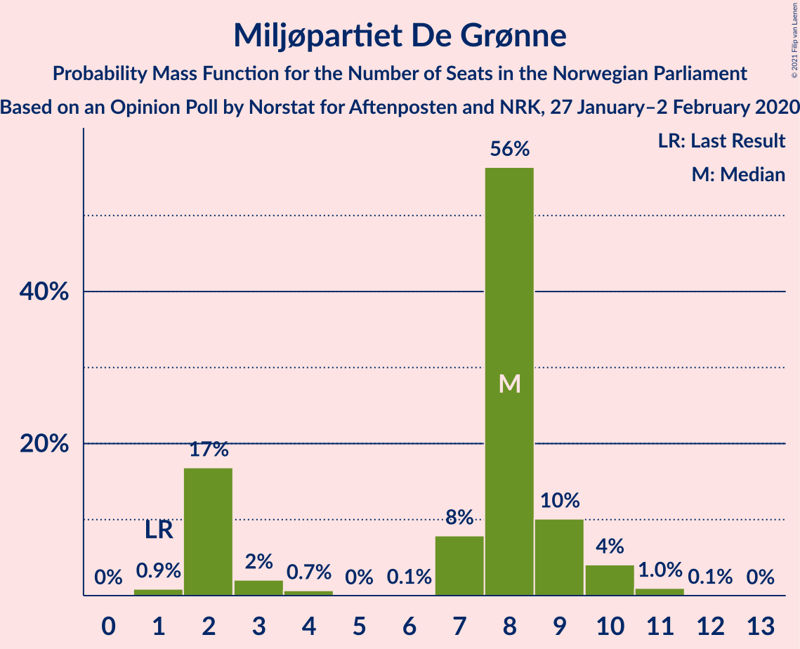

| Number of Seats | Probability | Accumulated | Special Marks |
|:---------------:|:-----------:|:-----------:|:-------------:|
| 1 | 0.9% | 100% | Last Result |
| 2 | 17% | 99.1% |  |
| 3 | 2% | 82% |  |
| 4 | 0.7% | 80% |  |
| 5 | 0% | 80% |  |
| 6 | 0.1% | 80% |  |
| 7 | 8% | 79% |  |
| 8 | 56% | 72% | Median |
| 9 | 10% | 15% |  |
| 10 | 4% | 5% |  |
| 11 | 1.0% | 1.1% |  |
| 12 | 0.1% | 0.1% |  |
| 13 | 0% | 0% |  |

### Venstre

*For a full overview of the results for this party, see the [Venstre](party-venstre.html) page.*

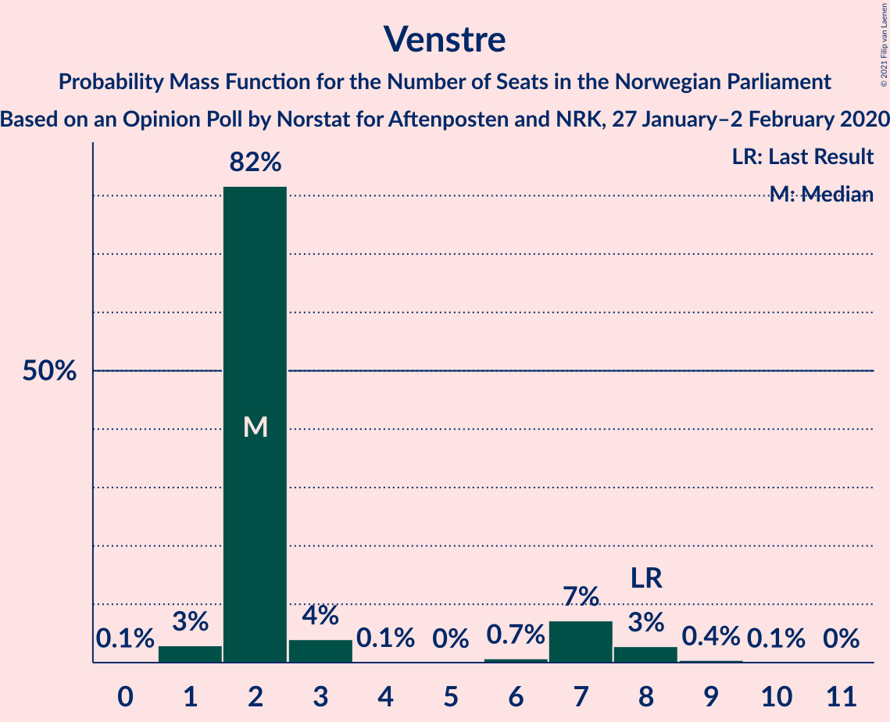

| Number of Seats | Probability | Accumulated | Special Marks |
|:---------------:|:-----------:|:-----------:|:-------------:|
| 0 | 0.1% | 100% |  |
| 1 | 3% | 99.9% |  |
| 2 | 82% | 97% | Median |
| 3 | 4% | 15% |  |
| 4 | 0.1% | 11% |  |
| 5 | 0% | 11% |  |
| 6 | 0.7% | 11% |  |
| 7 | 7% | 10% |  |
| 8 | 3% | 3% | Last Result |
| 9 | 0.4% | 0.5% |  |
| 10 | 0.1% | 0.1% |  |
| 11 | 0% | 0% |  |

## Coalitions

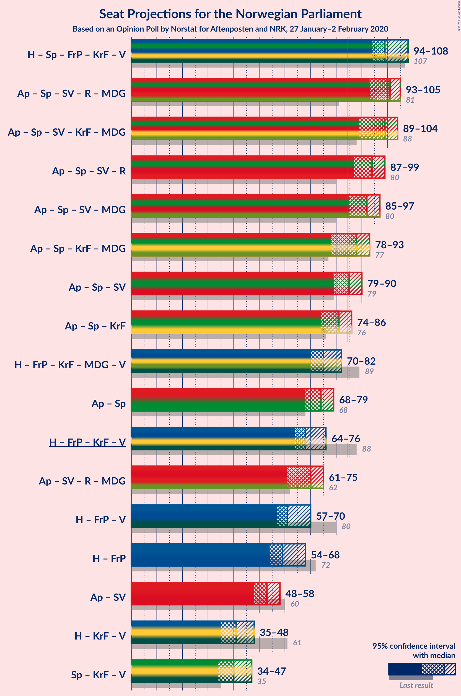

### Confidence Intervals

| Coalition | Last Result | Median | Majority? | 80% Confidence Interval | 90% Confidence Interval | 95% Confidence Interval | 99% Confidence Interval |
|:---------:|:-----------:|:------:|:---------:|:-----------------------:|:-----------------------:|:-----------------------:|:-----------------------:|
| Høyre – Senterpartiet – Fremskrittspartiet – Kristelig Folkeparti – Venstre | 107 | 99 | 100% | 96–104 | 95–106 | 94–108 | 93–112 |
| Arbeiderpartiet – Senterpartiet – Sosialistisk Venstreparti – Rødt – Miljøpartiet De Grønne | 81 | 101 | 100% | 96–104 | 94–104 | 93–105 | 90–107 |
| Arbeiderpartiet – Senterpartiet – Sosialistisk Venstreparti – Kristelig Folkeparti – Miljøpartiet De Grønne | 88 | 99 | 100% | 93–102 | 91–103 | 89–104 | 87–106 |
| Arbeiderpartiet – Senterpartiet – Sosialistisk Venstreparti – Rødt | 80 | 94 | 99.3% | 89–96 | 88–98 | 87–99 | 84–102 |
| Arbeiderpartiet – Senterpartiet – Sosialistisk Venstreparti – Miljøpartiet De Grønne | 80 | 92 | 98% | 87–95 | 86–96 | 85–97 | 81–98 |
| Arbeiderpartiet – Senterpartiet – Kristelig Folkeparti – Miljøpartiet De Grønne | 77 | 88 | 78% | 82–92 | 80–93 | 78–93 | 77–96 |
| Arbeiderpartiet – Senterpartiet – Sosialistisk Venstreparti | 79 | 85 | 55% | 81–87 | 80–89 | 79–90 | 76–93 |
| Arbeiderpartiet – Senterpartiet – Kristelig Folkeparti | 76 | 81 | 9% | 76–84 | 74–85 | 74–86 | 71–88 |
| Høyre – Fremskrittspartiet – Kristelig Folkeparti – Miljøpartiet De Grønne – Venstre | 89 | 75 | 0.7% | 73–80 | 71–81 | 70–82 | 67–85 |
| Arbeiderpartiet – Senterpartiet | 68 | 74 | 0% | 71–77 | 69–78 | 68–79 | 66–81 |
| Høyre – Fremskrittspartiet – Kristelig Folkeparti – Venstre | 88 | 68 | 0% | 65–73 | 65–75 | 64–76 | 62–79 |
| Arbeiderpartiet – Sosialistisk Venstreparti – Rødt – Miljøpartiet De Grønne | 62 | 70 | 0% | 65–73 | 63–74 | 61–75 | 57–76 |
| Høyre – Fremskrittspartiet – Venstre | 80 | 61 | 0% | 58–67 | 57–69 | 57–70 | 56–73 |
| Høyre – Fremskrittspartiet | 72 | 59 | 0% | 56–64 | 55–66 | 54–68 | 53–70 |
| Arbeiderpartiet – Sosialistisk Venstreparti | 60 | 53 | 0% | 50–57 | 49–57 | 48–58 | 46–60 |
| Høyre – Kristelig Folkeparti – Venstre | 61 | 41 | 0% | 37–45 | 37–47 | 35–48 | 33–50 |
| Senterpartiet – Kristelig Folkeparti – Venstre | 35 | 40 | 0% | 36–44 | 35–46 | 34–47 | 32–51 |

### Høyre – Senterpartiet – Fremskrittspartiet – Kristelig Folkeparti – Venstre

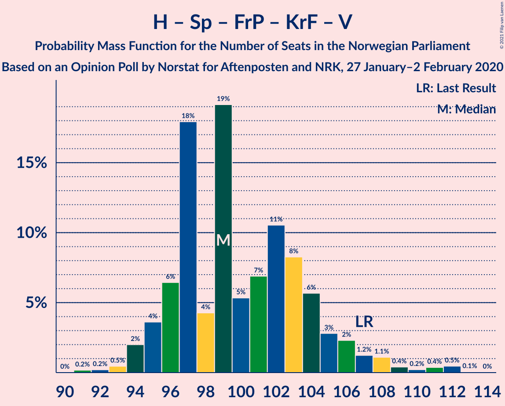

| Number of Seats | Probability | Accumulated | Special Marks |
|:---------------:|:-----------:|:-----------:|:-------------:|
| 91 | 0.2% | 100% |  |
| 92 | 0.2% | 99.8% |  |
| 93 | 0.5% | 99.6% |  |
| 94 | 2% | 99.1% |  |
| 95 | 4% | 97% |  |
| 96 | 6% | 94% |  |
| 97 | 18% | 87% |  |
| 98 | 4% | 69% |  |
| 99 | 19% | 65% |  |
| 100 | 5% | 46% | Median |
| 101 | 7% | 40% |  |
| 102 | 11% | 33% |  |
| 103 | 8% | 23% |  |
| 104 | 6% | 15% |  |
| 105 | 3% | 9% |  |
| 106 | 2% | 6% |  |
| 107 | 1.2% | 4% | Last Result |
| 108 | 1.1% | 3% |  |
| 109 | 0.4% | 2% |  |
| 110 | 0.2% | 1.2% |  |
| 111 | 0.4% | 0.9% |  |
| 112 | 0.5% | 0.6% |  |
| 113 | 0.1% | 0.1% |  |
| 114 | 0% | 0% |  |

### Arbeiderpartiet – Senterpartiet – Sosialistisk Venstreparti – Rødt – Miljøpartiet De Grønne

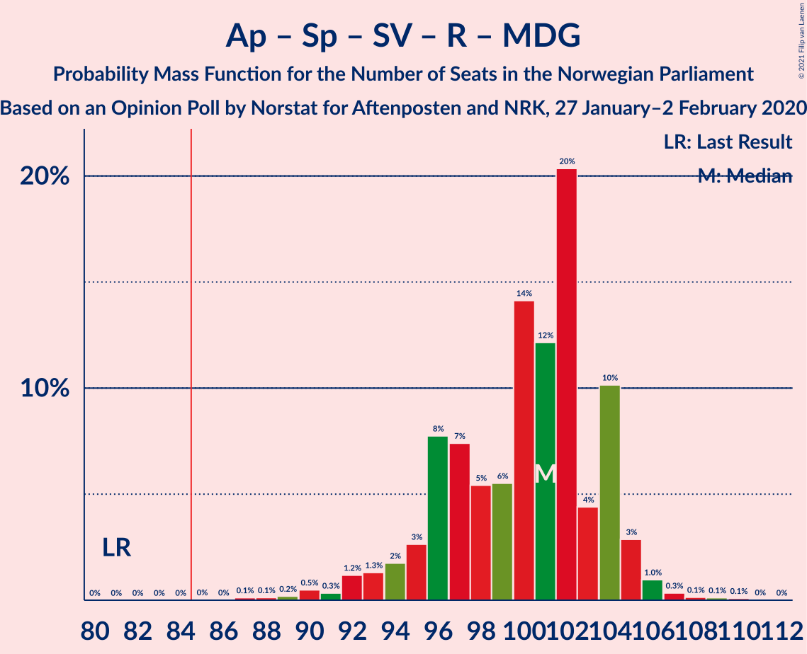

| Number of Seats | Probability | Accumulated | Special Marks |
|:---------------:|:-----------:|:-----------:|:-------------:|
| 81 | 0% | 100% | Last Result |
| 82 | 0% | 100% |  |
| 83 | 0% | 100% |  |
| 84 | 0% | 100% |  |
| 85 | 0% | 100% | Majority |
| 86 | 0% | 100% |  |
| 87 | 0.1% | 100% |  |
| 88 | 0.1% | 99.8% |  |
| 89 | 0.2% | 99.7% |  |
| 90 | 0.5% | 99.5% |  |
| 91 | 0.3% | 99.0% |  |
| 92 | 1.2% | 98.7% |  |
| 93 | 1.3% | 98% |  |
| 94 | 2% | 96% |  |
| 95 | 3% | 94% |  |
| 96 | 8% | 92% |  |
| 97 | 7% | 84% |  |
| 98 | 5% | 77% |  |
| 99 | 6% | 71% |  |
| 100 | 14% | 66% |  |
| 101 | 12% | 52% |  |
| 102 | 20% | 39% | Median |
| 103 | 4% | 19% |  |
| 104 | 10% | 15% |  |
| 105 | 3% | 5% |  |
| 106 | 1.0% | 2% |  |
| 107 | 0.3% | 0.7% |  |
| 108 | 0.1% | 0.4% |  |
| 109 | 0.1% | 0.2% |  |
| 110 | 0.1% | 0.1% |  |
| 111 | 0% | 0% |  |

### Arbeiderpartiet – Senterpartiet – Sosialistisk Venstreparti – Kristelig Folkeparti – Miljøpartiet De Grønne

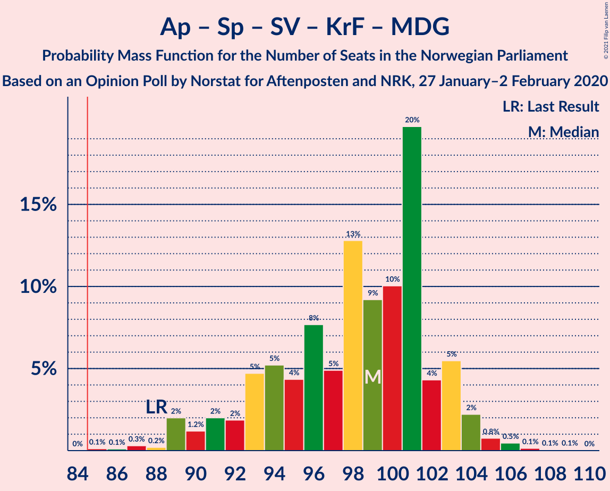

| Number of Seats | Probability | Accumulated | Special Marks |
|:---------------:|:-----------:|:-----------:|:-------------:|
| 85 | 0.1% | 100% | Majority |
| 86 | 0.1% | 99.8% |  |
| 87 | 0.3% | 99.7% |  |
| 88 | 0.2% | 99.4% | Last Result |
| 89 | 2% | 99.2% |  |
| 90 | 1.2% | 97% |  |
| 91 | 2% | 96% |  |
| 92 | 2% | 94% |  |
| 93 | 5% | 92% |  |
| 94 | 5% | 87% |  |
| 95 | 4% | 82% |  |
| 96 | 8% | 78% |  |
| 97 | 5% | 70% |  |
| 98 | 13% | 65% |  |
| 99 | 9% | 53% |  |
| 100 | 10% | 43% |  |
| 101 | 20% | 33% | Median |
| 102 | 4% | 14% |  |
| 103 | 5% | 9% |  |
| 104 | 2% | 4% |  |
| 105 | 0.8% | 2% |  |
| 106 | 0.5% | 0.7% |  |
| 107 | 0.1% | 0.3% |  |
| 108 | 0.1% | 0.1% |  |
| 109 | 0.1% | 0.1% |  |
| 110 | 0% | 0% |  |

### Arbeiderpartiet – Senterpartiet – Sosialistisk Venstreparti – Rødt

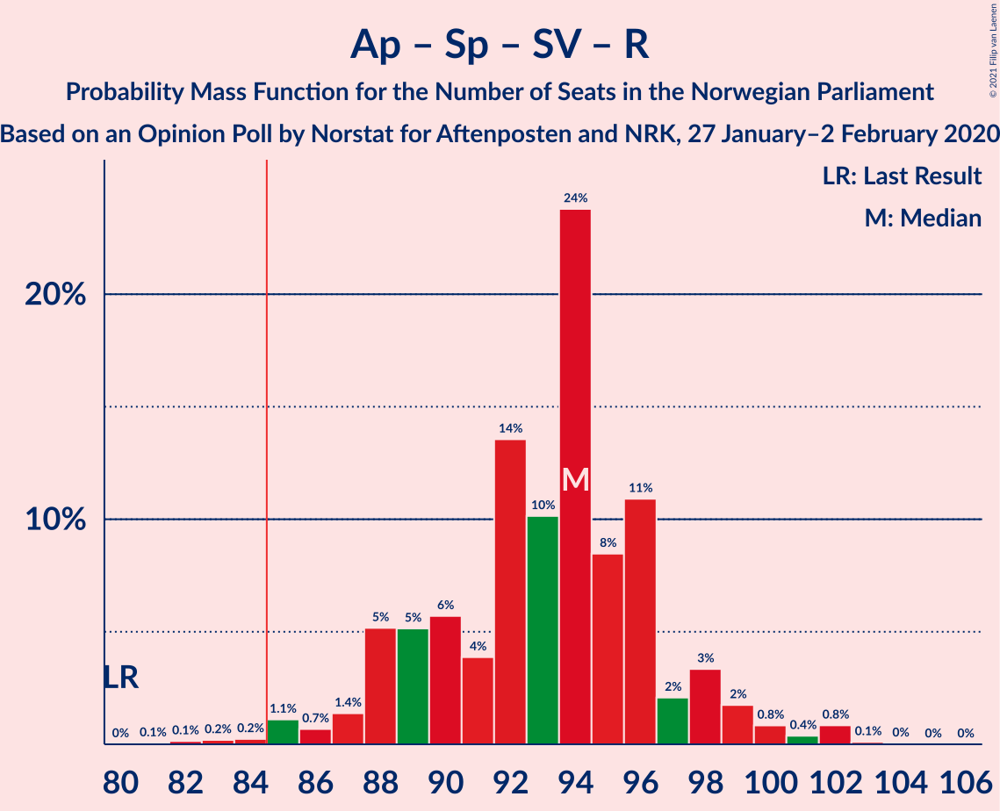

| Number of Seats | Probability | Accumulated | Special Marks |
|:---------------:|:-----------:|:-----------:|:-------------:|
| 80 | 0% | 100% | Last Result |
| 81 | 0.1% | 100% |  |
| 82 | 0.1% | 99.9% |  |
| 83 | 0.2% | 99.8% |  |
| 84 | 0.2% | 99.6% |  |
| 85 | 1.1% | 99.3% | Majority |
| 86 | 0.7% | 98% |  |
| 87 | 1.4% | 98% |  |
| 88 | 5% | 96% |  |
| 89 | 5% | 91% |  |
| 90 | 6% | 86% |  |
| 91 | 4% | 80% |  |
| 92 | 14% | 76% |  |
| 93 | 10% | 63% |  |
| 94 | 24% | 53% | Median |
| 95 | 8% | 29% |  |
| 96 | 11% | 20% |  |
| 97 | 2% | 9% |  |
| 98 | 3% | 7% |  |
| 99 | 2% | 4% |  |
| 100 | 0.8% | 2% |  |
| 101 | 0.4% | 1.4% |  |
| 102 | 0.8% | 1.0% |  |
| 103 | 0.1% | 0.2% |  |
| 104 | 0% | 0.1% |  |
| 105 | 0% | 0% |  |

### Arbeiderpartiet – Senterpartiet – Sosialistisk Venstreparti – Miljøpartiet De Grønne

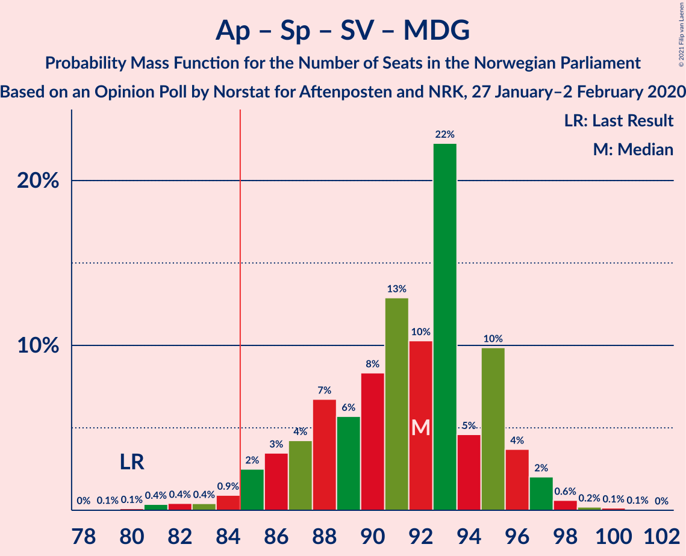

| Number of Seats | Probability | Accumulated | Special Marks |
|:---------------:|:-----------:|:-----------:|:-------------:|
| 79 | 0.1% | 100% |  |
| 80 | 0.1% | 99.9% | Last Result |
| 81 | 0.4% | 99.8% |  |
| 82 | 0.4% | 99.4% |  |
| 83 | 0.4% | 99.0% |  |
| 84 | 0.9% | 98.6% |  |
| 85 | 2% | 98% | Majority |
| 86 | 3% | 95% |  |
| 87 | 4% | 92% |  |
| 88 | 7% | 87% |  |
| 89 | 6% | 81% |  |
| 90 | 8% | 75% |  |
| 91 | 13% | 67% |  |
| 92 | 10% | 54% |  |
| 93 | 22% | 44% | Median |
| 94 | 5% | 21% |  |
| 95 | 10% | 17% |  |
| 96 | 4% | 7% |  |
| 97 | 2% | 3% |  |
| 98 | 0.6% | 1.1% |  |
| 99 | 0.2% | 0.4% |  |
| 100 | 0.1% | 0.2% |  |
| 101 | 0.1% | 0.1% |  |
| 102 | 0% | 0% |  |

### Arbeiderpartiet – Senterpartiet – Kristelig Folkeparti – Miljøpartiet De Grønne

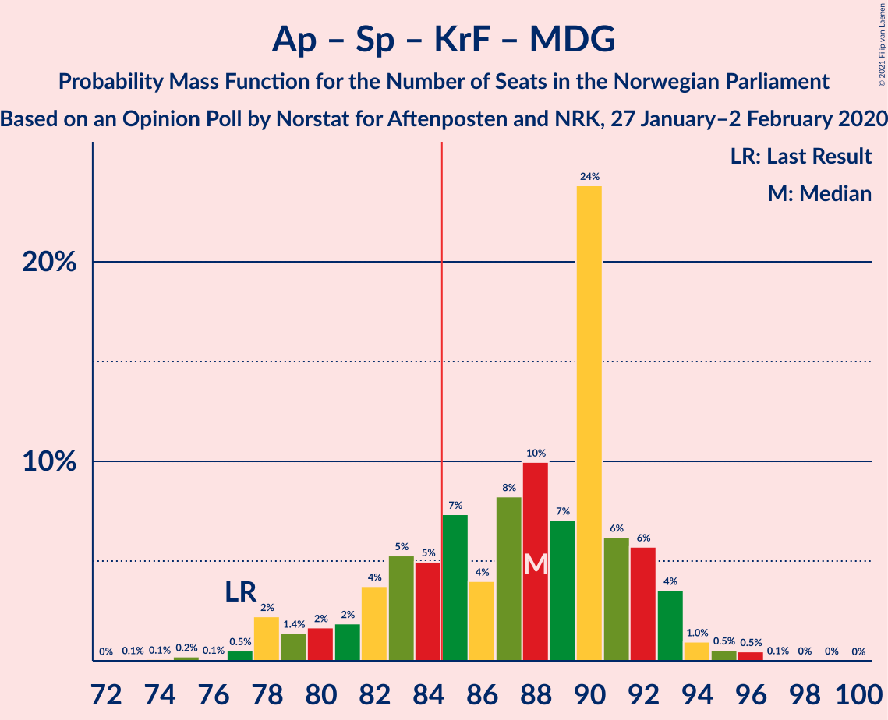

| Number of Seats | Probability | Accumulated | Special Marks |
|:---------------:|:-----------:|:-----------:|:-------------:|
| 73 | 0.1% | 100% |  |
| 74 | 0.1% | 99.9% |  |
| 75 | 0.2% | 99.8% |  |
| 76 | 0.1% | 99.6% |  |
| 77 | 0.5% | 99.6% | Last Result |
| 78 | 2% | 99.0% |  |
| 79 | 1.4% | 97% |  |
| 80 | 2% | 95% |  |
| 81 | 2% | 94% |  |
| 82 | 4% | 92% |  |
| 83 | 5% | 88% |  |
| 84 | 5% | 83% |  |
| 85 | 7% | 78% | Majority |
| 86 | 4% | 71% |  |
| 87 | 8% | 67% |  |
| 88 | 10% | 58% |  |
| 89 | 7% | 48% |  |
| 90 | 24% | 41% | Median |
| 91 | 6% | 18% |  |
| 92 | 6% | 11% |  |
| 93 | 4% | 6% |  |
| 94 | 1.0% | 2% |  |
| 95 | 0.5% | 1.1% |  |
| 96 | 0.5% | 0.6% |  |
| 97 | 0.1% | 0.1% |  |
| 98 | 0% | 0.1% |  |
| 99 | 0% | 0% |  |

### Arbeiderpartiet – Senterpartiet – Sosialistisk Venstreparti

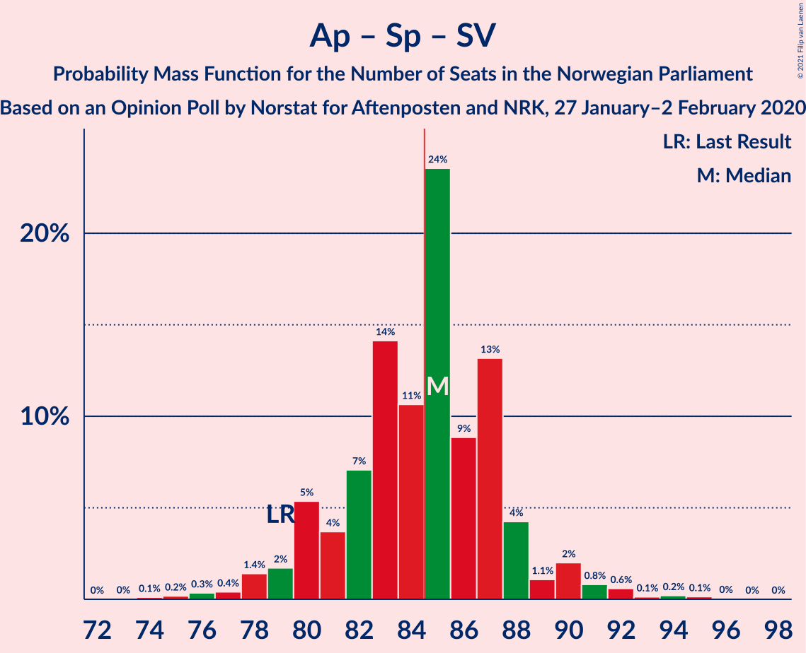

| Number of Seats | Probability | Accumulated | Special Marks |
|:---------------:|:-----------:|:-----------:|:-------------:|
| 74 | 0.1% | 100% |  |
| 75 | 0.2% | 99.8% |  |
| 76 | 0.3% | 99.7% |  |
| 77 | 0.4% | 99.3% |  |
| 78 | 1.4% | 98.9% |  |
| 79 | 2% | 98% | Last Result |
| 80 | 5% | 96% |  |
| 81 | 4% | 90% |  |
| 82 | 7% | 87% |  |
| 83 | 14% | 80% |  |
| 84 | 11% | 66% |  |
| 85 | 24% | 55% | Median, Majority |
| 86 | 9% | 31% |  |
| 87 | 13% | 22% |  |
| 88 | 4% | 9% |  |
| 89 | 1.1% | 5% |  |
| 90 | 2% | 4% |  |
| 91 | 0.8% | 2% |  |
| 92 | 0.6% | 1.1% |  |
| 93 | 0.1% | 0.6% |  |
| 94 | 0.2% | 0.4% |  |
| 95 | 0.1% | 0.2% |  |
| 96 | 0% | 0.1% |  |
| 97 | 0% | 0% |  |

### Arbeiderpartiet – Senterpartiet – Kristelig Folkeparti

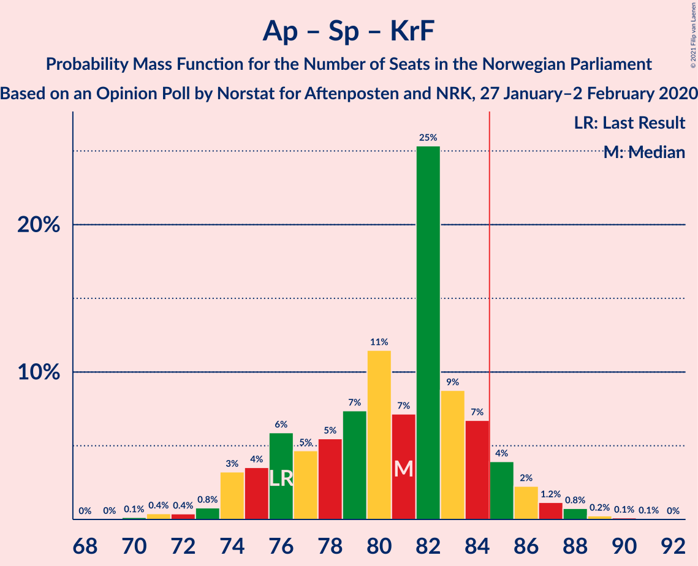

| Number of Seats | Probability | Accumulated | Special Marks |
|:---------------:|:-----------:|:-----------:|:-------------:|
| 69 | 0% | 100% |  |
| 70 | 0.1% | 99.9% |  |
| 71 | 0.4% | 99.8% |  |
| 72 | 0.4% | 99.4% |  |
| 73 | 0.8% | 99.0% |  |
| 74 | 3% | 98% |  |
| 75 | 4% | 95% |  |
| 76 | 6% | 91% | Last Result |
| 77 | 5% | 86% |  |
| 78 | 5% | 81% |  |
| 79 | 7% | 75% |  |
| 80 | 11% | 68% |  |
| 81 | 7% | 57% |  |
| 82 | 25% | 49% | Median |
| 83 | 9% | 24% |  |
| 84 | 7% | 15% |  |
| 85 | 4% | 9% | Majority |
| 86 | 2% | 5% |  |
| 87 | 1.2% | 2% |  |
| 88 | 0.8% | 1.2% |  |
| 89 | 0.2% | 0.5% |  |
| 90 | 0.1% | 0.2% |  |
| 91 | 0.1% | 0.1% |  |
| 92 | 0% | 0% |  |

### Høyre – Fremskrittspartiet – Kristelig Folkeparti – Miljøpartiet De Grønne – Venstre

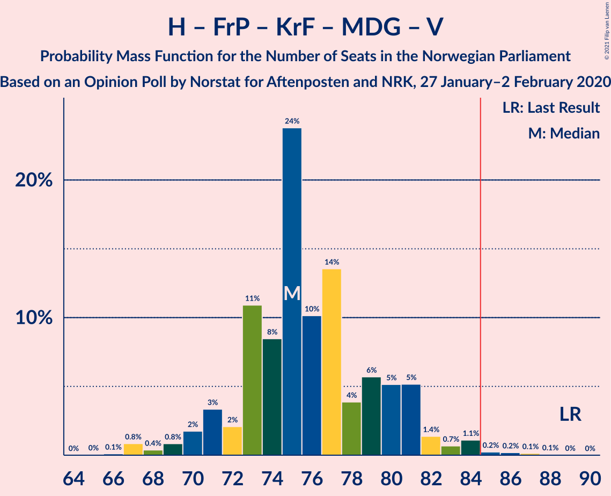

| Number of Seats | Probability | Accumulated | Special Marks |
|:---------------:|:-----------:|:-----------:|:-------------:|
| 65 | 0% | 100% |  |
| 66 | 0.1% | 99.9% |  |
| 67 | 0.8% | 99.8% |  |
| 68 | 0.4% | 99.0% |  |
| 69 | 0.8% | 98.6% |  |
| 70 | 2% | 98% |  |
| 71 | 3% | 96% |  |
| 72 | 2% | 93% |  |
| 73 | 11% | 91% |  |
| 74 | 8% | 80% |  |
| 75 | 24% | 71% |  |
| 76 | 10% | 47% |  |
| 77 | 14% | 37% | Median |
| 78 | 4% | 24% |  |
| 79 | 6% | 20% |  |
| 80 | 5% | 14% |  |
| 81 | 5% | 9% |  |
| 82 | 1.4% | 4% |  |
| 83 | 0.7% | 2% |  |
| 84 | 1.1% | 2% |  |
| 85 | 0.2% | 0.7% | Majority |
| 86 | 0.2% | 0.4% |  |
| 87 | 0.1% | 0.2% |  |
| 88 | 0.1% | 0.1% |  |
| 89 | 0% | 0% | Last Result |

### Arbeiderpartiet – Senterpartiet

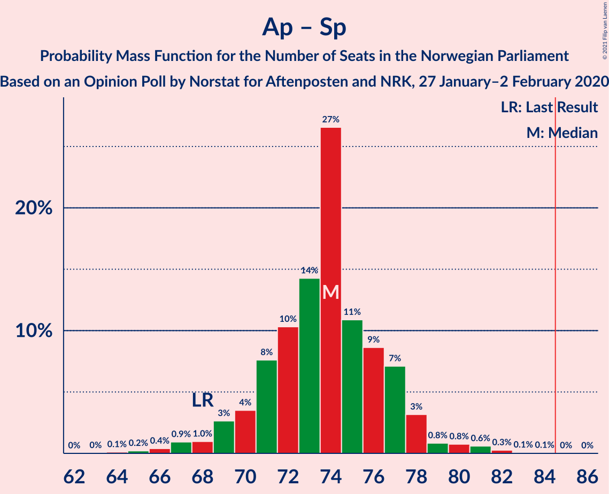

| Number of Seats | Probability | Accumulated | Special Marks |
|:---------------:|:-----------:|:-----------:|:-------------:|
| 63 | 0% | 100% |  |
| 64 | 0.1% | 99.9% |  |
| 65 | 0.2% | 99.8% |  |
| 66 | 0.4% | 99.6% |  |
| 67 | 0.9% | 99.2% |  |
| 68 | 1.0% | 98% | Last Result |
| 69 | 3% | 97% |  |
| 70 | 4% | 95% |  |
| 71 | 8% | 91% |  |
| 72 | 10% | 84% |  |
| 73 | 14% | 73% |  |
| 74 | 27% | 59% | Median |
| 75 | 11% | 32% |  |
| 76 | 9% | 22% |  |
| 77 | 7% | 13% |  |
| 78 | 3% | 6% |  |
| 79 | 0.8% | 3% |  |
| 80 | 0.8% | 2% |  |
| 81 | 0.6% | 1.0% |  |
| 82 | 0.3% | 0.4% |  |
| 83 | 0.1% | 0.2% |  |
| 84 | 0.1% | 0.1% |  |
| 85 | 0% | 0% | Majority |

### Høyre – Fremskrittspartiet – Kristelig Folkeparti – Venstre

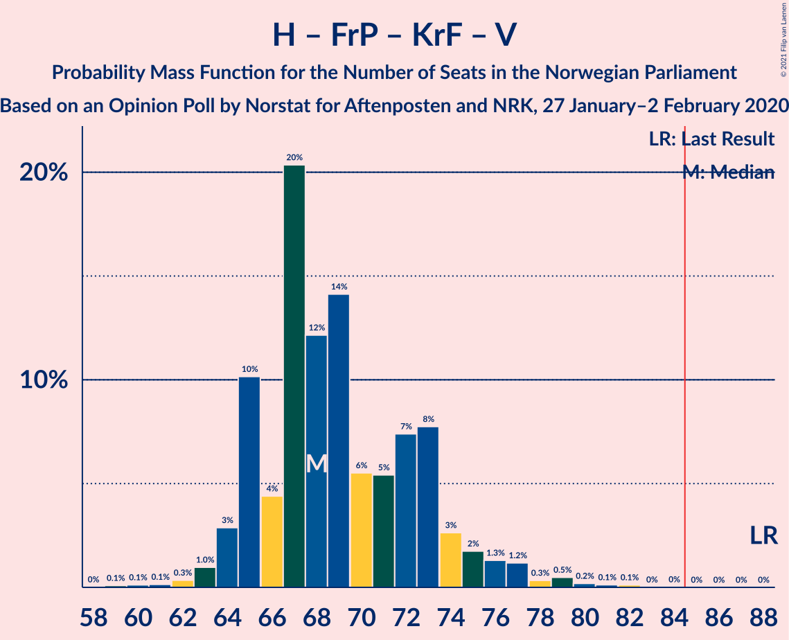

| Number of Seats | Probability | Accumulated | Special Marks |
|:---------------:|:-----------:|:-----------:|:-------------:|
| 59 | 0.1% | 100% |  |
| 60 | 0.1% | 99.9% |  |
| 61 | 0.1% | 99.8% |  |
| 62 | 0.3% | 99.6% |  |
| 63 | 1.0% | 99.3% |  |
| 64 | 3% | 98% |  |
| 65 | 10% | 95% |  |
| 66 | 4% | 85% |  |
| 67 | 20% | 81% |  |
| 68 | 12% | 61% |  |
| 69 | 14% | 48% | Median |
| 70 | 6% | 34% |  |
| 71 | 5% | 29% |  |
| 72 | 7% | 23% |  |
| 73 | 8% | 16% |  |
| 74 | 3% | 8% |  |
| 75 | 2% | 6% |  |
| 76 | 1.3% | 4% |  |
| 77 | 1.2% | 2% |  |
| 78 | 0.3% | 1.3% |  |
| 79 | 0.5% | 1.0% |  |
| 80 | 0.2% | 0.5% |  |
| 81 | 0.1% | 0.3% |  |
| 82 | 0.1% | 0.2% |  |
| 83 | 0% | 0% |  |
| 84 | 0% | 0% |  |
| 85 | 0% | 0% | Majority |
| 86 | 0% | 0% |  |
| 87 | 0% | 0% |  |
| 88 | 0% | 0% | Last Result |

### Arbeiderpartiet – Sosialistisk Venstreparti – Rødt – Miljøpartiet De Grønne

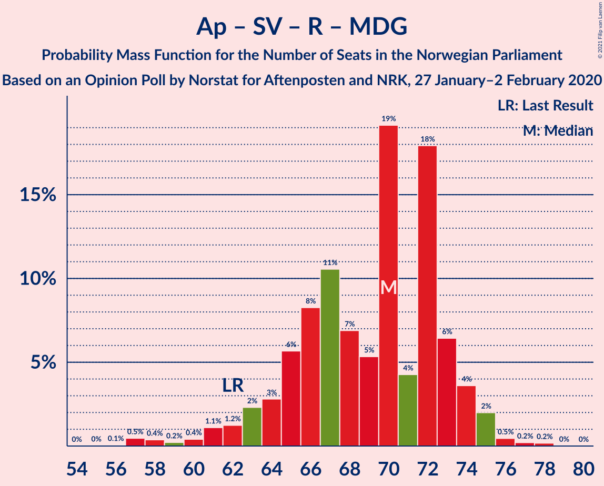

| Number of Seats | Probability | Accumulated | Special Marks |
|:---------------:|:-----------:|:-----------:|:-------------:|
| 56 | 0.1% | 100% |  |
| 57 | 0.5% | 99.9% |  |
| 58 | 0.4% | 99.4% |  |
| 59 | 0.2% | 99.1% |  |
| 60 | 0.4% | 98.8% |  |
| 61 | 1.1% | 98% |  |
| 62 | 1.2% | 97% | Last Result |
| 63 | 2% | 96% |  |
| 64 | 3% | 94% |  |
| 65 | 6% | 91% |  |
| 66 | 8% | 85% |  |
| 67 | 11% | 77% |  |
| 68 | 7% | 66% |  |
| 69 | 5% | 60% |  |
| 70 | 19% | 54% |  |
| 71 | 4% | 35% | Median |
| 72 | 18% | 31% |  |
| 73 | 6% | 13% |  |
| 74 | 4% | 6% |  |
| 75 | 2% | 3% |  |
| 76 | 0.5% | 0.9% |  |
| 77 | 0.2% | 0.4% |  |
| 78 | 0.2% | 0.2% |  |
| 79 | 0% | 0% |  |

### Høyre – Fremskrittspartiet – Venstre

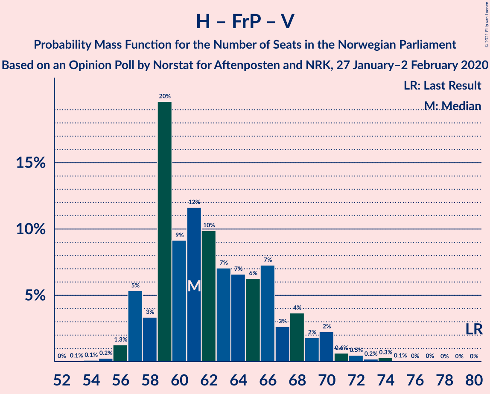

| Number of Seats | Probability | Accumulated | Special Marks |
|:---------------:|:-----------:|:-----------:|:-------------:|
| 52 | 0% | 100% |  |
| 53 | 0.1% | 99.9% |  |
| 54 | 0.1% | 99.9% |  |
| 55 | 0.2% | 99.8% |  |
| 56 | 1.3% | 99.5% |  |
| 57 | 5% | 98% |  |
| 58 | 3% | 93% |  |
| 59 | 20% | 90% |  |
| 60 | 9% | 70% |  |
| 61 | 12% | 61% | Median |
| 62 | 10% | 49% |  |
| 63 | 7% | 39% |  |
| 64 | 7% | 32% |  |
| 65 | 6% | 26% |  |
| 66 | 7% | 19% |  |
| 67 | 3% | 12% |  |
| 68 | 4% | 9% |  |
| 69 | 2% | 6% |  |
| 70 | 2% | 4% |  |
| 71 | 0.6% | 2% |  |
| 72 | 0.5% | 1.1% |  |
| 73 | 0.2% | 0.6% |  |
| 74 | 0.3% | 0.4% |  |
| 75 | 0.1% | 0.1% |  |
| 76 | 0% | 0.1% |  |
| 77 | 0% | 0% |  |
| 78 | 0% | 0% |  |
| 79 | 0% | 0% |  |
| 80 | 0% | 0% | Last Result |

### Høyre – Fremskrittspartiet

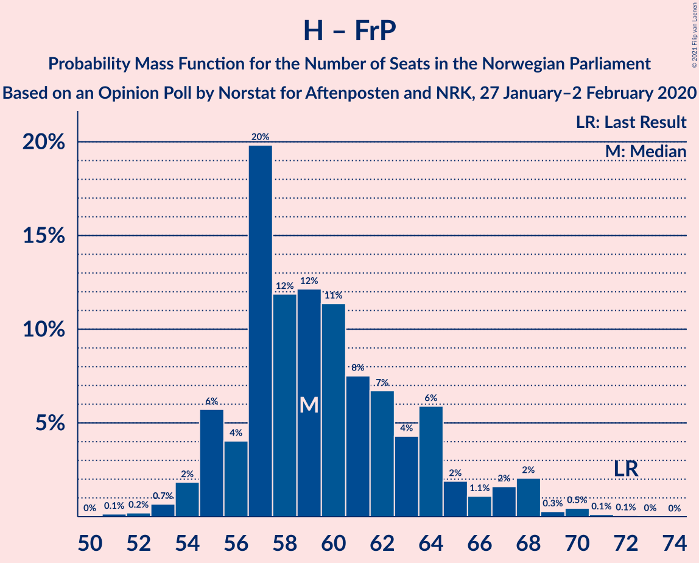

| Number of Seats | Probability | Accumulated | Special Marks |
|:---------------:|:-----------:|:-----------:|:-------------:|
| 50 | 0% | 100% |  |
| 51 | 0.1% | 99.9% |  |
| 52 | 0.2% | 99.8% |  |
| 53 | 0.7% | 99.6% |  |
| 54 | 2% | 98.9% |  |
| 55 | 6% | 97% |  |
| 56 | 4% | 91% |  |
| 57 | 20% | 87% |  |
| 58 | 12% | 67% |  |
| 59 | 12% | 56% | Median |
| 60 | 11% | 43% |  |
| 61 | 8% | 32% |  |
| 62 | 7% | 25% |  |
| 63 | 4% | 18% |  |
| 64 | 6% | 14% |  |
| 65 | 2% | 8% |  |
| 66 | 1.1% | 6% |  |
| 67 | 2% | 5% |  |
| 68 | 2% | 3% |  |
| 69 | 0.3% | 1.0% |  |
| 70 | 0.5% | 0.7% |  |
| 71 | 0.1% | 0.2% |  |
| 72 | 0.1% | 0.1% | Last Result |
| 73 | 0% | 0% |  |

### Arbeiderpartiet – Sosialistisk Venstreparti

| Number of Seats | Probability | Accumulated | Special Marks |
|:---------------:|:-----------:|:-----------:|:-------------:|
| 43 | 0% | 100% |  |
| 44 | 0.1% | 99.9% |  |
| 45 | 0.2% | 99.8% |  |
| 46 | 0.5% | 99.6% |  |
| 47 | 1.1% | 99.1% |  |
| 48 | 3% | 98% |  |
| 49 | 4% | 95% |  |
| 50 | 6% | 91% |  |
| 51 | 6% | 85% |  |
| 52 | 7% | 79% |  |
| 53 | 24% | 72% |  |
| 54 | 7% | 47% | Median |
| 55 | 19% | 40% |  |
| 56 | 11% | 21% |  |
| 57 | 7% | 10% |  |
| 58 | 2% | 3% |  |
| 59 | 0.7% | 2% |  |
| 60 | 0.6% | 1.0% | Last Result |
| 61 | 0.2% | 0.3% |  |
| 62 | 0.1% | 0.2% |  |
| 63 | 0.1% | 0.1% |  |
| 64 | 0% | 0% |  |

### Høyre – Kristelig Folkeparti – Venstre

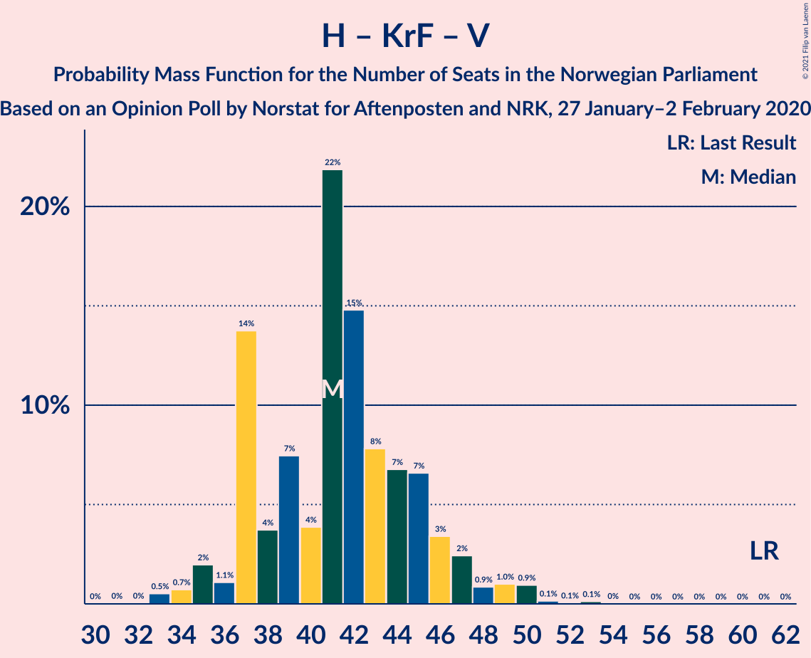

| Number of Seats | Probability | Accumulated | Special Marks |
|:---------------:|:-----------:|:-----------:|:-------------:|
| 31 | 0% | 100% |  |
| 32 | 0% | 99.9% |  |
| 33 | 0.5% | 99.9% |  |
| 34 | 0.7% | 99.4% |  |
| 35 | 2% | 98.7% |  |
| 36 | 1.1% | 97% |  |
| 37 | 14% | 96% |  |
| 38 | 4% | 82% |  |
| 39 | 7% | 78% |  |
| 40 | 4% | 71% |  |
| 41 | 22% | 67% |  |
| 42 | 15% | 45% | Median |
| 43 | 8% | 30% |  |
| 44 | 7% | 22% |  |
| 45 | 7% | 16% |  |
| 46 | 3% | 9% |  |
| 47 | 2% | 6% |  |
| 48 | 0.9% | 3% |  |
| 49 | 1.0% | 2% |  |
| 50 | 0.9% | 1.3% |  |
| 51 | 0.1% | 0.4% |  |
| 52 | 0.1% | 0.2% |  |
| 53 | 0.1% | 0.2% |  |
| 54 | 0% | 0% |  |
| 55 | 0% | 0% |  |
| 56 | 0% | 0% |  |
| 57 | 0% | 0% |  |
| 58 | 0% | 0% |  |
| 59 | 0% | 0% |  |
| 60 | 0% | 0% |  |
| 61 | 0% | 0% | Last Result |

### Senterpartiet – Kristelig Folkeparti – Venstre

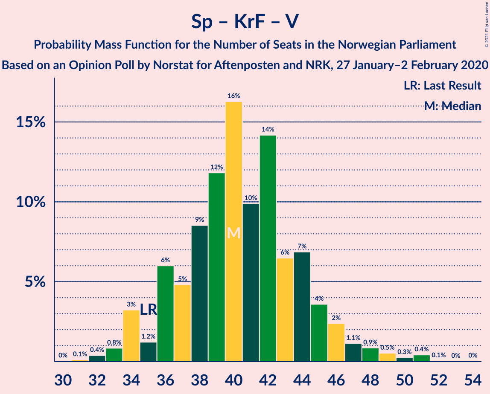

| Number of Seats | Probability | Accumulated | Special Marks |
|:---------------:|:-----------:|:-----------:|:-------------:|
| 30 | 0% | 100% |  |
| 31 | 0.1% | 99.9% |  |
| 32 | 0.4% | 99.8% |  |
| 33 | 0.8% | 99.4% |  |
| 34 | 3% | 98.6% |  |
| 35 | 1.2% | 95% | Last Result |
| 36 | 6% | 94% |  |
| 37 | 5% | 88% |  |
| 38 | 9% | 83% |  |
| 39 | 12% | 75% |  |
| 40 | 16% | 63% |  |
| 41 | 10% | 47% | Median |
| 42 | 14% | 37% |  |
| 43 | 6% | 23% |  |
| 44 | 7% | 16% |  |
| 45 | 4% | 9% |  |
| 46 | 2% | 6% |  |
| 47 | 1.1% | 3% |  |
| 48 | 0.9% | 2% |  |
| 49 | 0.5% | 1.3% |  |
| 50 | 0.3% | 0.8% |  |
| 51 | 0.4% | 0.5% |  |
| 52 | 0.1% | 0.1% |  |
| 53 | 0% | 0.1% |  |
| 54 | 0% | 0% |  |

## Technical Information

### Opinion Poll

+ **Polling firm:** Norstat
+ **Commissioner(s):** Aftenposten and NRK
+ **Fieldwork period:** 27 January–2 February 2020

### Calculations

+ **Sample size:** 952
+ **Simulations done:** 1,048,576
+ **Error estimate:** 0.94%

