# Opinion Poll by Sentio for Amedia and Nettavisen, 11–17 February 2020

<a href="#voting-intentions">Voting Intentions</a> | <a href="#seats">Seats</a> | <a href="#coalitions">Coalitions</a> | <a href="#technical-information">Technical Information</a>

## Voting Intentions

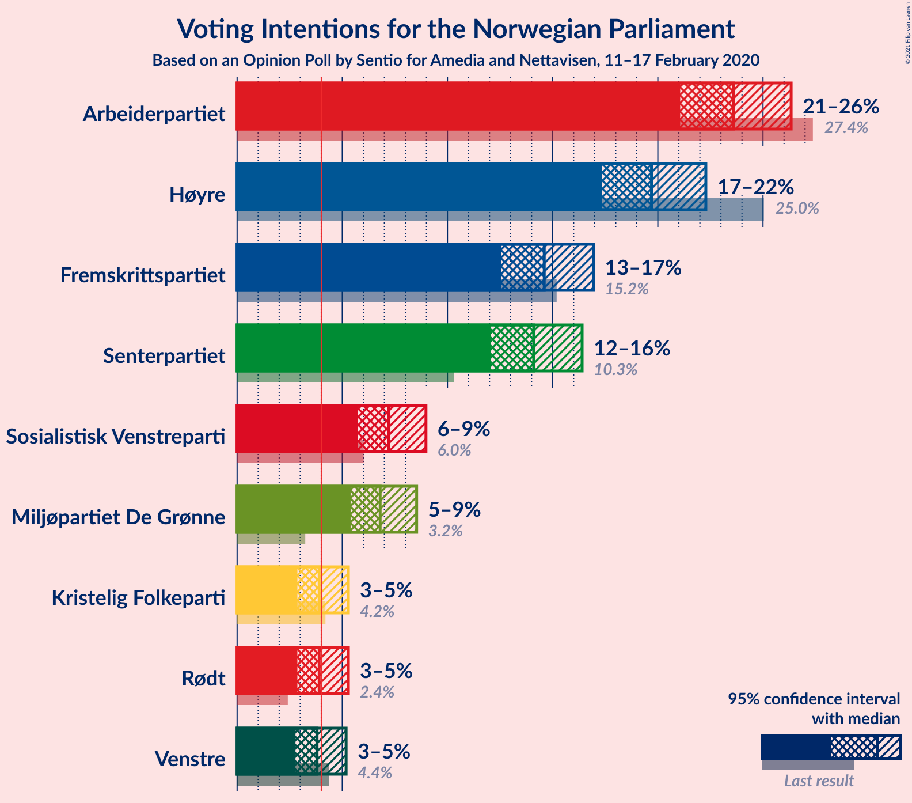

### Confidence Intervals

| Party | Last Result | Poll Result | 80% Confidence Interval | 90% Confidence Interval | 95% Confidence Interval | 99% Confidence Interval |
|:-----:|:-----------:|:-----------:|:-----------------------:|:-----------------------:|:-----------------------:|:-----------------------:|
| Arbeiderpartiet | 27.4% | 23.6% | 21.9–25.4% |21.5–25.9% |21.1–26.3% |20.3–27.2% |
| Høyre | 25.0% | 19.7% | 18.2–21.4% |17.7–21.9% |17.3–22.3% |16.6–23.1% |
| Fremskrittspartiet | 15.2% | 14.6% | 13.2–16.1% |12.9–16.6% |12.5–16.9% |11.9–17.7% |
| Senterpartiet | 10.3% | 14.1% | 12.8–15.6% |12.4–16.0% |12.1–16.4% |11.5–17.1% |
| Sosialistisk Venstreparti | 6.0% | 7.2% | 6.2–8.4% |6.0–8.7% |5.7–9.0% |5.3–9.6% |
| Miljøpartiet De Grønne | 3.2% | 6.8% | 5.9–7.9% |5.6–8.3% |5.4–8.5% |5.0–9.1% |
| Rødt | 2.4% | 3.9% | 3.2–4.8% |3.0–5.1% |2.9–5.3% |2.6–5.8% |
| Kristelig Folkeparti | 4.2% | 3.9% | 3.2–4.8% |3.0–5.1% |2.9–5.3% |2.6–5.8% |
| Venstre | 4.4% | 3.8% | 3.1–4.7% |2.9–5.0% |2.8–5.2% |2.5–5.6% |

*Note:* The poll result column reflects the actual value used in the calculations. Published results may vary slightly, and in addition be rounded to fewer digits.

## Seats

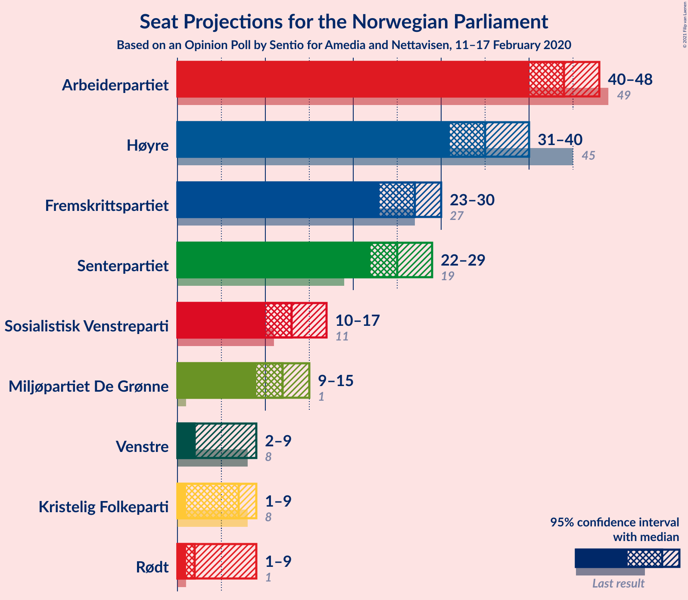

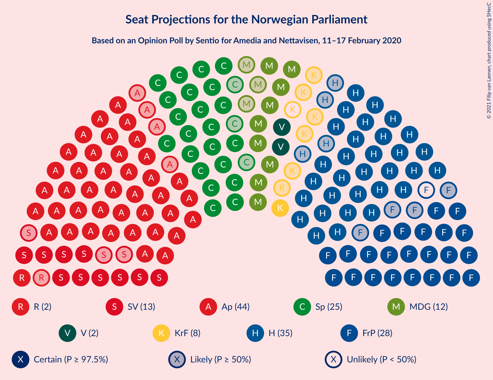

### Confidence Intervals

| Party | Last Result | Median | 80% Confidence Interval | 90% Confidence Interval | 95% Confidence Interval | 99% Confidence Interval |
|:-----:|:-----------:|:------:|:-----------------------:|:-----------------------:|:-----------------------:|:-----------------------:|
| <a href="#arbeiderpartiet">Arbeiderpartiet</a> | 49 | 44 | 42–46 |41–47 |40–48 |38–50 |
| <a href="#høyre">Høyre</a> | 45 | 35 | 33–39 |32–40 |31–40 |29–41 |
| <a href="#fremskrittspartiet">Fremskrittspartiet</a> | 27 | 27 | 24–29 |23–30 |23–30 |21–31 |
| <a href="#senterpartiet">Senterpartiet</a> | 19 | 25 | 23–28 |23–29 |22–29 |20–31 |
| <a href="#sosialistisk-venstreparti">Sosialistisk Venstreparti</a> | 11 | 13 | 11–15 |11–16 |10–17 |9–17 |
| <a href="#miljøpartiet-de-grønne">Miljøpartiet De Grønne</a> | 1 | 12 | 11–14 |10–15 |9–15 |9–16 |
| <a href="#rødt">Rødt</a> | 1 | 2 | 2–8 |1–9 |1–9 |1–10 |
| <a href="#kristelig-folkeparti">Kristelig Folkeparti</a> | 8 | 7 | 2–8 |1–8 |1–9 |1–10 |
| <a href="#venstre">Venstre</a> | 8 | 2 | 2–8 |2–8 |2–9 |2–9 |

### Arbeiderpartiet

*For a full overview of the results for this party, see the [Arbeiderpartiet](party-arbeiderpartiet.html) page.*

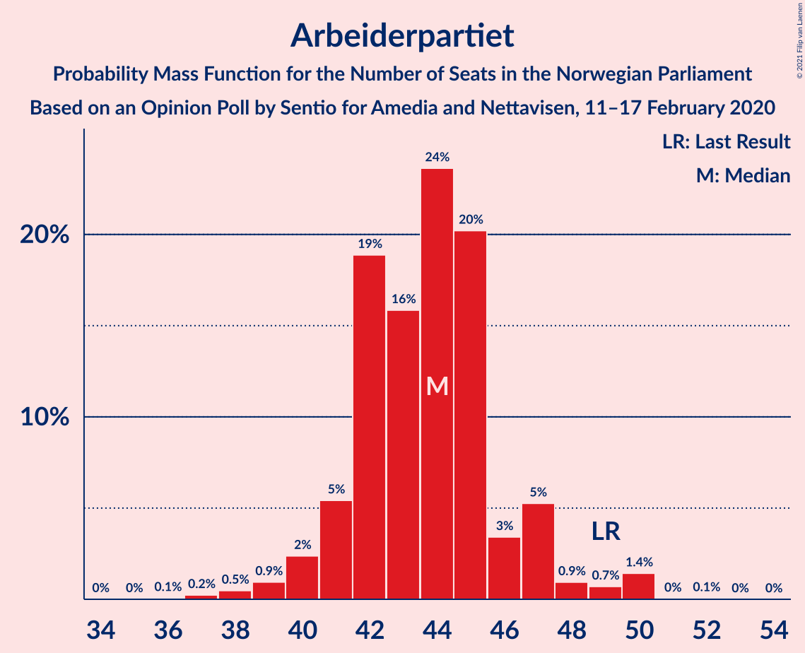

| Number of Seats | Probability | Accumulated | Special Marks |
|:---------------:|:-----------:|:-----------:|:-------------:|
| 36 | 0.1% | 100% |  |
| 37 | 0.2% | 99.9% |  |
| 38 | 0.5% | 99.7% |  |
| 39 | 0.9% | 99.2% |  |
| 40 | 2% | 98% |  |
| 41 | 5% | 96% |  |
| 42 | 19% | 90% |  |
| 43 | 16% | 72% |  |
| 44 | 24% | 56% | Median |
| 45 | 20% | 32% |  |
| 46 | 3% | 12% |  |
| 47 | 5% | 8% |  |
| 48 | 0.9% | 3% |  |
| 49 | 0.7% | 2% | Last Result |
| 50 | 1.4% | 2% |  |
| 51 | 0% | 0.1% |  |
| 52 | 0.1% | 0.1% |  |
| 53 | 0% | 0% |  |

### Høyre

*For a full overview of the results for this party, see the [Høyre](party-høyre.html) page.*

| Number of Seats | Probability | Accumulated | Special Marks |
|:---------------:|:-----------:|:-----------:|:-------------:|
| 28 | 0.1% | 100% |  |
| 29 | 0.5% | 99.9% |  |
| 30 | 1.1% | 99.4% |  |
| 31 | 1.2% | 98% |  |
| 32 | 6% | 97% |  |
| 33 | 9% | 91% |  |
| 34 | 14% | 82% |  |
| 35 | 24% | 69% | Median |
| 36 | 27% | 45% |  |
| 37 | 3% | 18% |  |
| 38 | 4% | 15% |  |
| 39 | 3% | 11% |  |
| 40 | 6% | 7% |  |
| 41 | 0.4% | 0.7% |  |
| 42 | 0.2% | 0.4% |  |
| 43 | 0.1% | 0.2% |  |
| 44 | 0% | 0% |  |
| 45 | 0% | 0% | Last Result |

### Fremskrittspartiet

*For a full overview of the results for this party, see the [Fremskrittspartiet](party-fremskrittspartiet.html) page.*

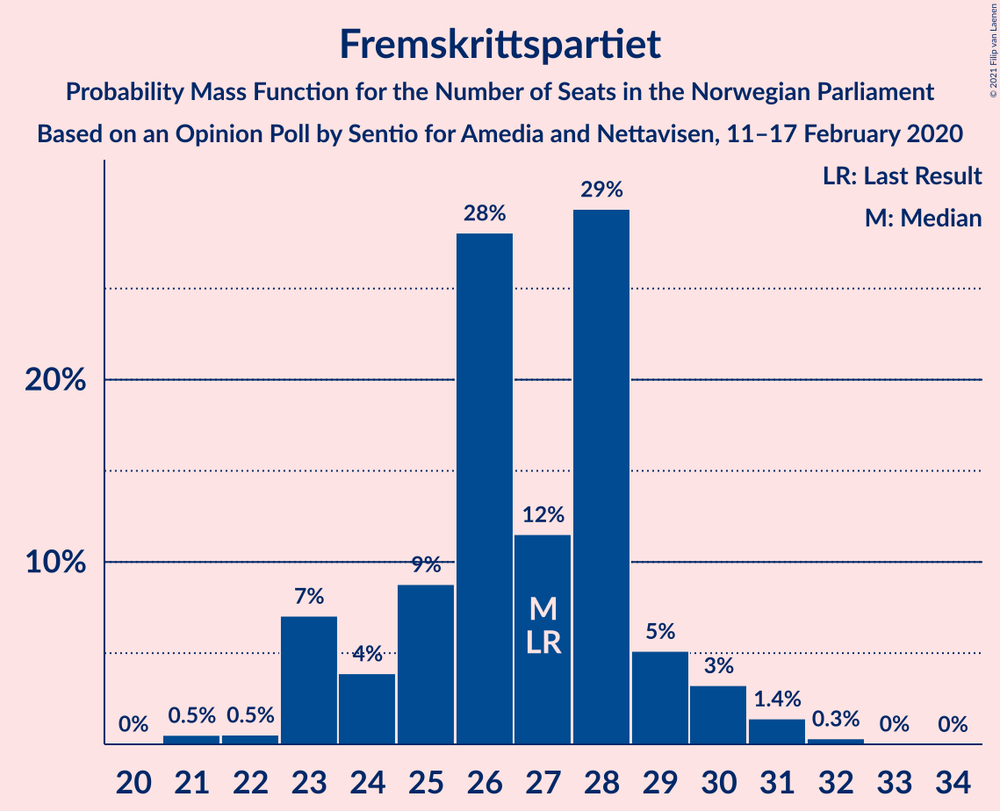

| Number of Seats | Probability | Accumulated | Special Marks |
|:---------------:|:-----------:|:-----------:|:-------------:|
| 20 | 0% | 100% |  |
| 21 | 0.5% | 99.9% |  |
| 22 | 0.5% | 99.4% |  |
| 23 | 7% | 98.9% |  |
| 24 | 4% | 92% |  |
| 25 | 9% | 88% |  |
| 26 | 28% | 79% |  |
| 27 | 12% | 51% | Last Result, Median |
| 28 | 29% | 40% |  |
| 29 | 5% | 10% |  |
| 30 | 3% | 5% |  |
| 31 | 1.4% | 2% |  |
| 32 | 0.3% | 0.4% |  |
| 33 | 0% | 0.1% |  |
| 34 | 0% | 0% |  |

### Senterpartiet

*For a full overview of the results for this party, see the [Senterpartiet](party-senterpartiet.html) page.*

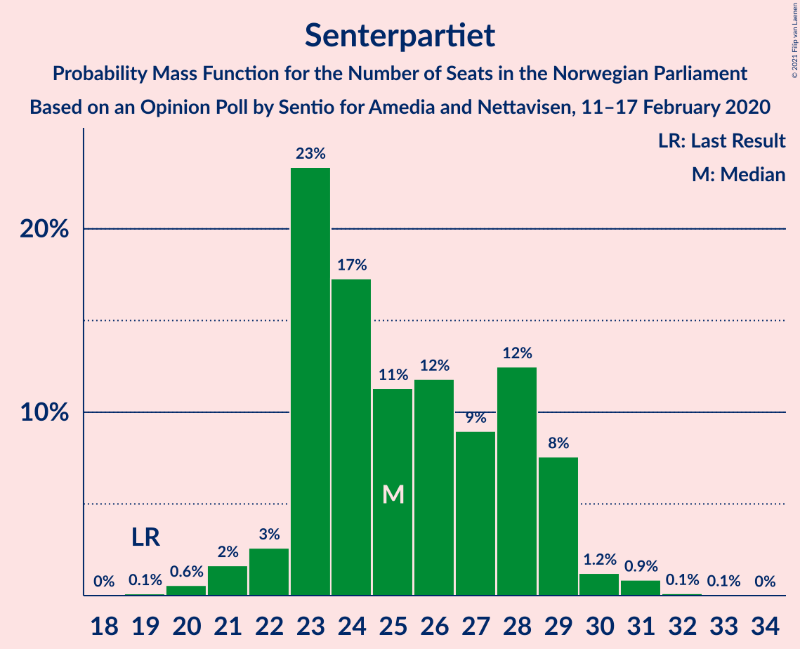

| Number of Seats | Probability | Accumulated | Special Marks |
|:---------------:|:-----------:|:-----------:|:-------------:|
| 19 | 0.1% | 100% | Last Result |
| 20 | 0.6% | 99.9% |  |
| 21 | 2% | 99.3% |  |
| 22 | 3% | 98% |  |
| 23 | 23% | 95% |  |
| 24 | 17% | 72% |  |
| 25 | 11% | 54% | Median |
| 26 | 12% | 43% |  |
| 27 | 9% | 31% |  |
| 28 | 12% | 22% |  |
| 29 | 8% | 10% |  |
| 30 | 1.2% | 2% |  |
| 31 | 0.9% | 1.1% |  |
| 32 | 0.1% | 0.2% |  |
| 33 | 0.1% | 0.1% |  |
| 34 | 0% | 0% |  |

### Sosialistisk Venstreparti

*For a full overview of the results for this party, see the [Sosialistisk Venstreparti](party-sosialistiskvenstreparti.html) page.*

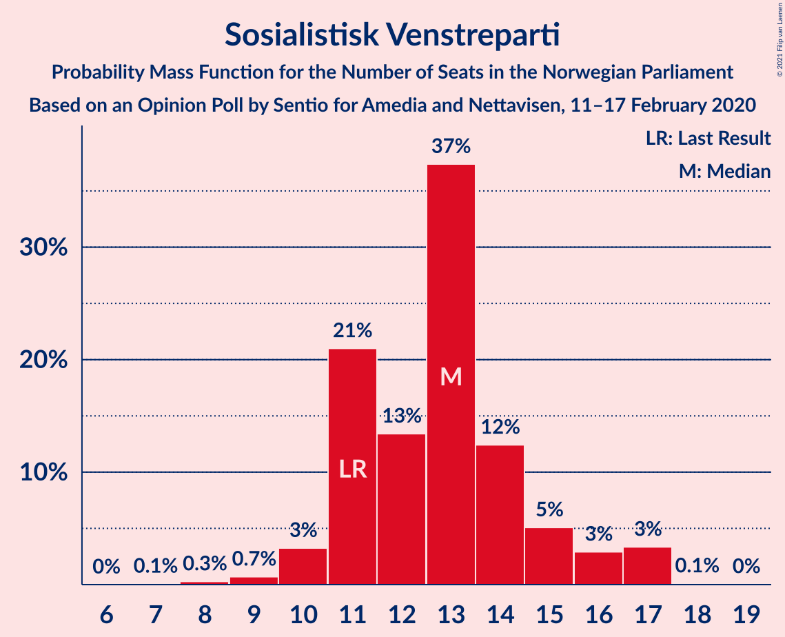

| Number of Seats | Probability | Accumulated | Special Marks |
|:---------------:|:-----------:|:-----------:|:-------------:|
| 7 | 0.1% | 100% |  |
| 8 | 0.3% | 99.9% |  |
| 9 | 0.7% | 99.7% |  |
| 10 | 3% | 99.0% |  |
| 11 | 21% | 96% | Last Result |
| 12 | 13% | 75% |  |
| 13 | 37% | 61% | Median |
| 14 | 12% | 24% |  |
| 15 | 5% | 11% |  |
| 16 | 3% | 6% |  |
| 17 | 3% | 3% |  |
| 18 | 0.1% | 0.1% |  |
| 19 | 0% | 0% |  |

### Miljøpartiet De Grønne

*For a full overview of the results for this party, see the [Miljøpartiet De Grønne](party-miljøpartietdegrønne.html) page.*

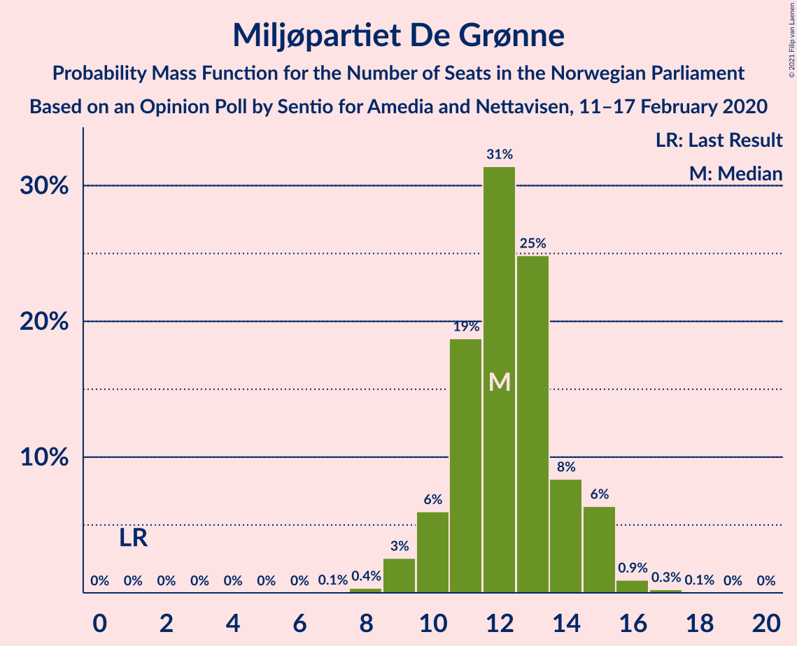

| Number of Seats | Probability | Accumulated | Special Marks |
|:---------------:|:-----------:|:-----------:|:-------------:|
| 1 | 0% | 100% | Last Result |
| 2 | 0% | 100% |  |
| 3 | 0% | 100% |  |
| 4 | 0% | 100% |  |
| 5 | 0% | 100% |  |
| 6 | 0% | 100% |  |
| 7 | 0.1% | 100% |  |
| 8 | 0.4% | 99.9% |  |
| 9 | 3% | 99.6% |  |
| 10 | 6% | 97% |  |
| 11 | 19% | 91% |  |
| 12 | 31% | 72% | Median |
| 13 | 25% | 41% |  |
| 14 | 8% | 16% |  |
| 15 | 6% | 8% |  |
| 16 | 0.9% | 1.3% |  |
| 17 | 0.3% | 0.3% |  |
| 18 | 0.1% | 0.1% |  |
| 19 | 0% | 0% |  |

### Rødt

*For a full overview of the results for this party, see the [Rødt](party-rødt.html) page.*

| Number of Seats | Probability | Accumulated | Special Marks |
|:---------------:|:-----------:|:-----------:|:-------------:|
| 1 | 7% | 100% | Last Result |
| 2 | 47% | 93% | Median |
| 3 | 0% | 47% |  |
| 4 | 0% | 47% |  |
| 5 | 0% | 47% |  |
| 6 | 0.9% | 47% |  |
| 7 | 27% | 46% |  |
| 8 | 11% | 19% |  |
| 9 | 7% | 8% |  |
| 10 | 1.2% | 1.3% |  |
| 11 | 0.1% | 0.1% |  |
| 12 | 0% | 0% |  |

### Kristelig Folkeparti

*For a full overview of the results for this party, see the [Kristelig Folkeparti](party-kristeligfolkeparti.html) page.*

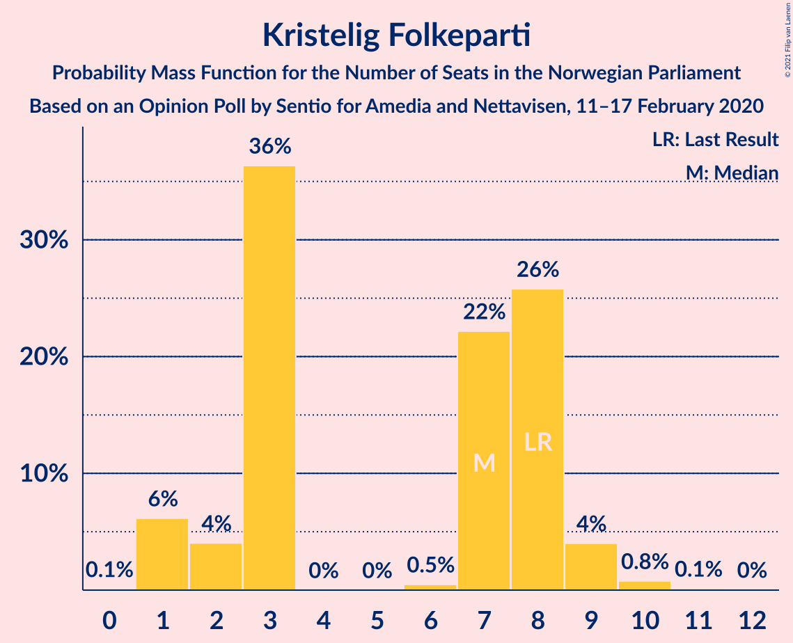

| Number of Seats | Probability | Accumulated | Special Marks |
|:---------------:|:-----------:|:-----------:|:-------------:|
| 0 | 0.1% | 100% |  |
| 1 | 6% | 99.9% |  |
| 2 | 4% | 94% |  |
| 3 | 36% | 90% |  |
| 4 | 0% | 53% |  |
| 5 | 0% | 53% |  |
| 6 | 0.5% | 53% |  |
| 7 | 22% | 53% | Median |
| 8 | 26% | 31% | Last Result |
| 9 | 4% | 5% |  |
| 10 | 0.8% | 0.9% |  |
| 11 | 0.1% | 0.1% |  |
| 12 | 0% | 0% |  |

### Venstre

*For a full overview of the results for this party, see the [Venstre](party-venstre.html) page.*

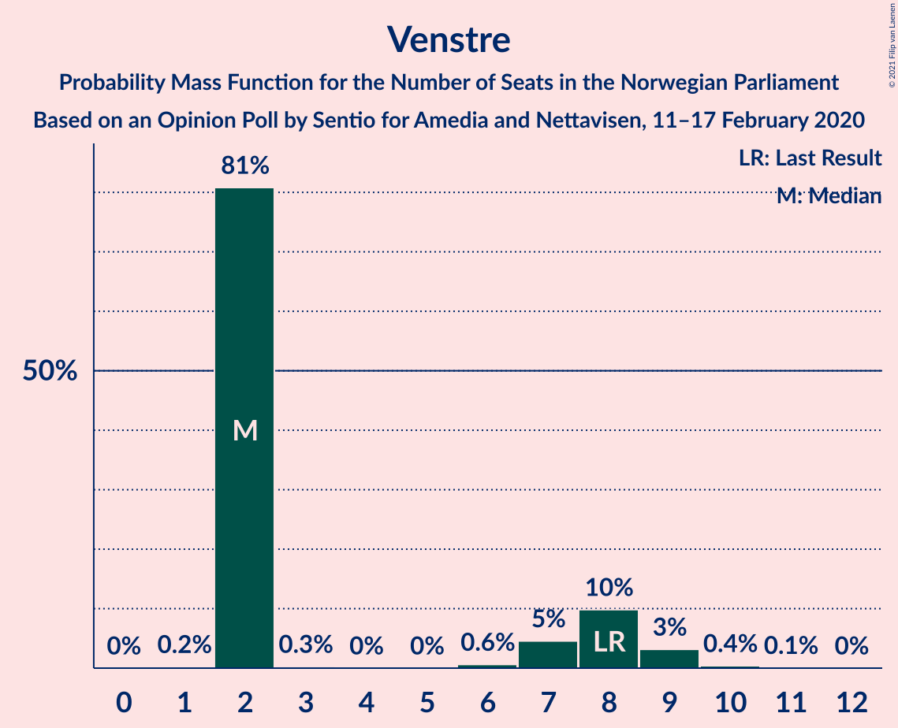

| Number of Seats | Probability | Accumulated | Special Marks |
|:---------------:|:-----------:|:-----------:|:-------------:|
| 1 | 0.2% | 100% |  |
| 2 | 81% | 99.8% | Median |
| 3 | 0.3% | 19% |  |
| 4 | 0% | 19% |  |
| 5 | 0% | 19% |  |
| 6 | 0.6% | 19% |  |
| 7 | 5% | 18% |  |
| 8 | 10% | 13% | Last Result |
| 9 | 3% | 4% |  |
| 10 | 0.4% | 0.5% |  |
| 11 | 0.1% | 0.1% |  |
| 12 | 0% | 0% |  |

## Coalitions

### Confidence Intervals

| Coalition | Last Result | Median | Majority? | 80% Confidence Interval | 90% Confidence Interval | 95% Confidence Interval | 99% Confidence Interval |
|:---------:|:-----------:|:------:|:---------:|:-----------------------:|:-----------------------:|:-----------------------:|:-----------------------:|
| Arbeiderpartiet – Senterpartiet – Sosialistisk Venstreparti – Miljøpartiet De Grønne – Kristelig Folkeparti | 88 | 99 | 100% | 95–104 | 93–105 | 92–105 | 90–107 |
| Arbeiderpartiet – Senterpartiet – Sosialistisk Venstreparti – Miljøpartiet De Grønne – Rødt | 81 | 98 | 100% | 95–104 | 93–104 | 91–105 | 89–107 |
| Høyre – Fremskrittspartiet – Senterpartiet – Kristelig Folkeparti – Venstre | 107 | 95 | 100% | 92–99 | 91–101 | 90–103 | 88–105 |
| Arbeiderpartiet – Senterpartiet – Sosialistisk Venstreparti – Miljøpartiet De Grønne | 80 | 95 | 99.7% | 90–99 | 89–100 | 88–101 | 85–102 |
| Arbeiderpartiet – Senterpartiet – Sosialistisk Venstreparti – Rødt | 80 | 85 | 73% | 84–91 | 81–92 | 80–93 | 77–95 |
| Arbeiderpartiet – Senterpartiet – Miljøpartiet De Grønne – Kristelig Folkeparti | 77 | 86 | 75% | 82–91 | 81–92 | 79–92 | 77–95 |
| Høyre – Fremskrittspartiet – Miljøpartiet De Grønne – Kristelig Folkeparti – Venstre | 89 | 84 | 27% | 78–85 | 77–88 | 76–89 | 74–91 |
| Arbeiderpartiet – Senterpartiet – Sosialistisk Venstreparti | 79 | 82 | 21% | 78–86 | 77–87 | 76–88 | 74–91 |
| Arbeiderpartiet – Senterpartiet – Kristelig Folkeparti | 76 | 74 | 0% | 70–79 | 69–80 | 68–81 | 66–82 |
| Høyre – Fremskrittspartiet – Kristelig Folkeparti – Venstre | 88 | 71 | 0% | 65–74 | 65–76 | 64–78 | 62–80 |
| Arbeiderpartiet – Senterpartiet | 68 | 69 | 0% | 66–73 | 65–73 | 64–75 | 62–77 |
| Høyre – Fremskrittspartiet – Venstre | 80 | 65 | 0% | 62–69 | 61–71 | 59–72 | 57–76 |
| Høyre – Fremskrittspartiet | 72 | 62 | 0% | 59–66 | 57–66 | 56–67 | 54–69 |
| Arbeiderpartiet – Sosialistisk Venstreparti | 60 | 56 | 0% | 54–60 | 53–60 | 52–62 | 50–64 |
| Høyre – Kristelig Folkeparti – Venstre | 61 | 44 | 0% | 39–47 | 38–49 | 37–50 | 36–53 |
| Senterpartiet – Kristelig Folkeparti – Venstre | 35 | 33 | 0% | 30–38 | 30–39 | 29–42 | 27–44 |

### Arbeiderpartiet – Senterpartiet – Sosialistisk Venstreparti – Miljøpartiet De Grønne – Kristelig Folkeparti

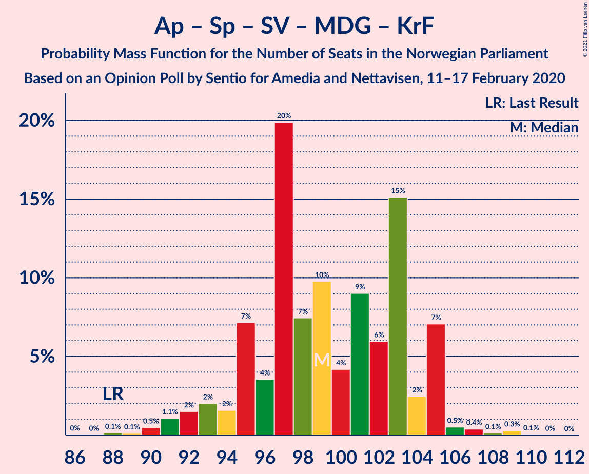

| Number of Seats | Probability | Accumulated | Special Marks |
|:---------------:|:-----------:|:-----------:|:-------------:|
| 86 | 0% | 100% |  |
| 87 | 0% | 99.9% |  |
| 88 | 0.1% | 99.9% | Last Result |
| 89 | 0.1% | 99.8% |  |
| 90 | 0.5% | 99.7% |  |
| 91 | 1.1% | 99.2% |  |
| 92 | 2% | 98% |  |
| 93 | 2% | 97% |  |
| 94 | 2% | 95% |  |
| 95 | 7% | 93% |  |
| 96 | 4% | 86% |  |
| 97 | 20% | 82% |  |
| 98 | 7% | 62% |  |
| 99 | 10% | 55% |  |
| 100 | 4% | 45% |  |
| 101 | 9% | 41% | Median |
| 102 | 6% | 32% |  |
| 103 | 15% | 26% |  |
| 104 | 2% | 11% |  |
| 105 | 7% | 8% |  |
| 106 | 0.5% | 1.4% |  |
| 107 | 0.4% | 0.9% |  |
| 108 | 0.1% | 0.5% |  |
| 109 | 0.3% | 0.4% |  |
| 110 | 0.1% | 0.1% |  |
| 111 | 0% | 0% |  |

### Arbeiderpartiet – Senterpartiet – Sosialistisk Venstreparti – Miljøpartiet De Grønne – Rødt

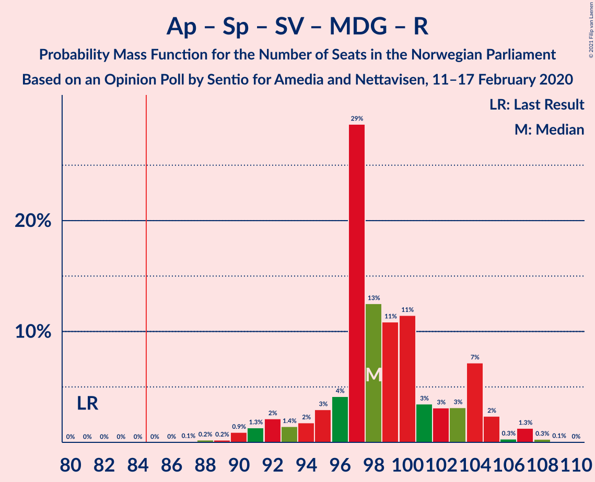

| Number of Seats | Probability | Accumulated | Special Marks |
|:---------------:|:-----------:|:-----------:|:-------------:|
| 81 | 0% | 100% | Last Result |
| 82 | 0% | 100% |  |
| 83 | 0% | 100% |  |
| 84 | 0% | 100% |  |
| 85 | 0% | 100% | Majority |
| 86 | 0% | 100% |  |
| 87 | 0.1% | 100% |  |
| 88 | 0.2% | 99.9% |  |
| 89 | 0.2% | 99.7% |  |
| 90 | 0.9% | 99.5% |  |
| 91 | 1.3% | 98.5% |  |
| 92 | 2% | 97% |  |
| 93 | 1.4% | 95% |  |
| 94 | 2% | 94% |  |
| 95 | 3% | 92% |  |
| 96 | 4% | 89% | Median |
| 97 | 29% | 85% |  |
| 98 | 13% | 56% |  |
| 99 | 11% | 44% |  |
| 100 | 11% | 33% |  |
| 101 | 3% | 21% |  |
| 102 | 3% | 18% |  |
| 103 | 3% | 15% |  |
| 104 | 7% | 12% |  |
| 105 | 2% | 4% |  |
| 106 | 0.3% | 2% |  |
| 107 | 1.3% | 2% |  |
| 108 | 0.3% | 0.4% |  |
| 109 | 0.1% | 0.1% |  |
| 110 | 0% | 0% |  |

### Høyre – Fremskrittspartiet – Senterpartiet – Kristelig Folkeparti – Venstre

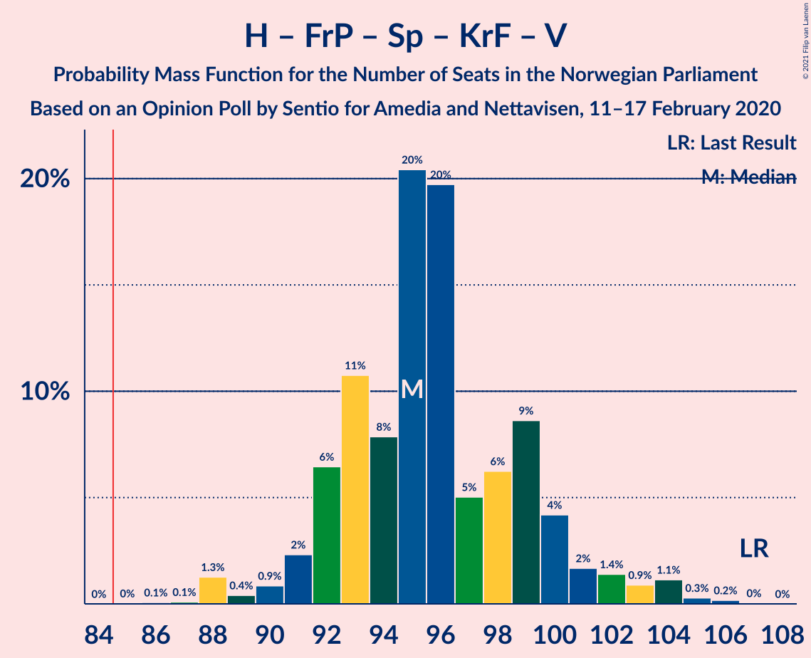

| Number of Seats | Probability | Accumulated | Special Marks |
|:---------------:|:-----------:|:-----------:|:-------------:|
| 86 | 0.1% | 100% |  |
| 87 | 0.1% | 99.9% |  |
| 88 | 1.3% | 99.8% |  |
| 89 | 0.4% | 98.5% |  |
| 90 | 0.9% | 98% |  |
| 91 | 2% | 97% |  |
| 92 | 6% | 95% |  |
| 93 | 11% | 88% |  |
| 94 | 8% | 78% |  |
| 95 | 20% | 70% |  |
| 96 | 20% | 49% | Median |
| 97 | 5% | 30% |  |
| 98 | 6% | 25% |  |
| 99 | 9% | 18% |  |
| 100 | 4% | 10% |  |
| 101 | 2% | 6% |  |
| 102 | 1.4% | 4% |  |
| 103 | 0.9% | 3% |  |
| 104 | 1.1% | 2% |  |
| 105 | 0.3% | 0.5% |  |
| 106 | 0.2% | 0.2% |  |
| 107 | 0% | 0% | Last Result |

### Arbeiderpartiet – Senterpartiet – Sosialistisk Venstreparti – Miljøpartiet De Grønne

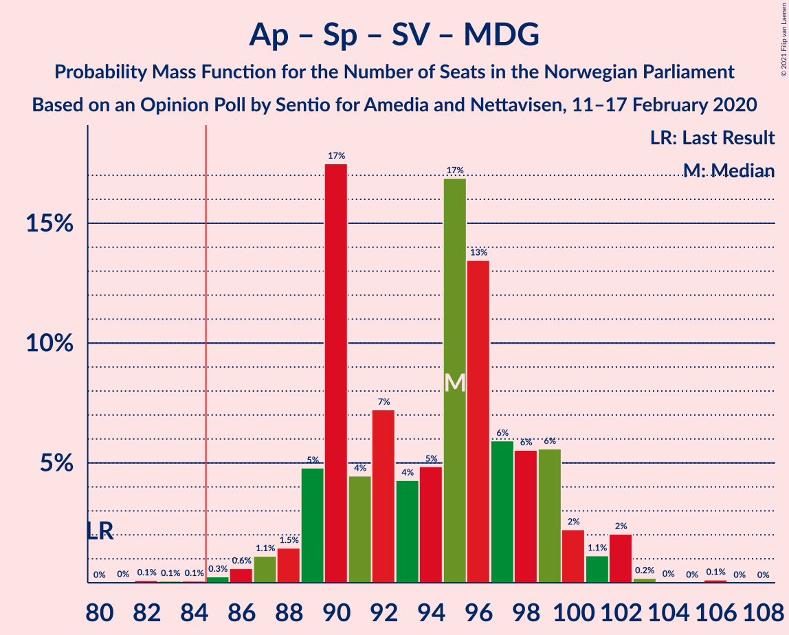

| Number of Seats | Probability | Accumulated | Special Marks |
|:---------------:|:-----------:|:-----------:|:-------------:|
| 80 | 0% | 100% | Last Result |
| 81 | 0% | 100% |  |
| 82 | 0.1% | 100% |  |
| 83 | 0.1% | 99.9% |  |
| 84 | 0.1% | 99.8% |  |
| 85 | 0.3% | 99.7% | Majority |
| 86 | 0.6% | 99.4% |  |
| 87 | 1.1% | 98.8% |  |
| 88 | 1.5% | 98% |  |
| 89 | 5% | 96% |  |
| 90 | 17% | 91% |  |
| 91 | 4% | 74% |  |
| 92 | 7% | 70% |  |
| 93 | 4% | 62% |  |
| 94 | 5% | 58% | Median |
| 95 | 17% | 53% |  |
| 96 | 13% | 36% |  |
| 97 | 6% | 23% |  |
| 98 | 6% | 17% |  |
| 99 | 6% | 11% |  |
| 100 | 2% | 6% |  |
| 101 | 1.1% | 4% |  |
| 102 | 2% | 2% |  |
| 103 | 0.2% | 0.4% |  |
| 104 | 0% | 0.2% |  |
| 105 | 0% | 0.1% |  |
| 106 | 0.1% | 0.1% |  |
| 107 | 0% | 0% |  |

### Arbeiderpartiet – Senterpartiet – Sosialistisk Venstreparti – Rødt

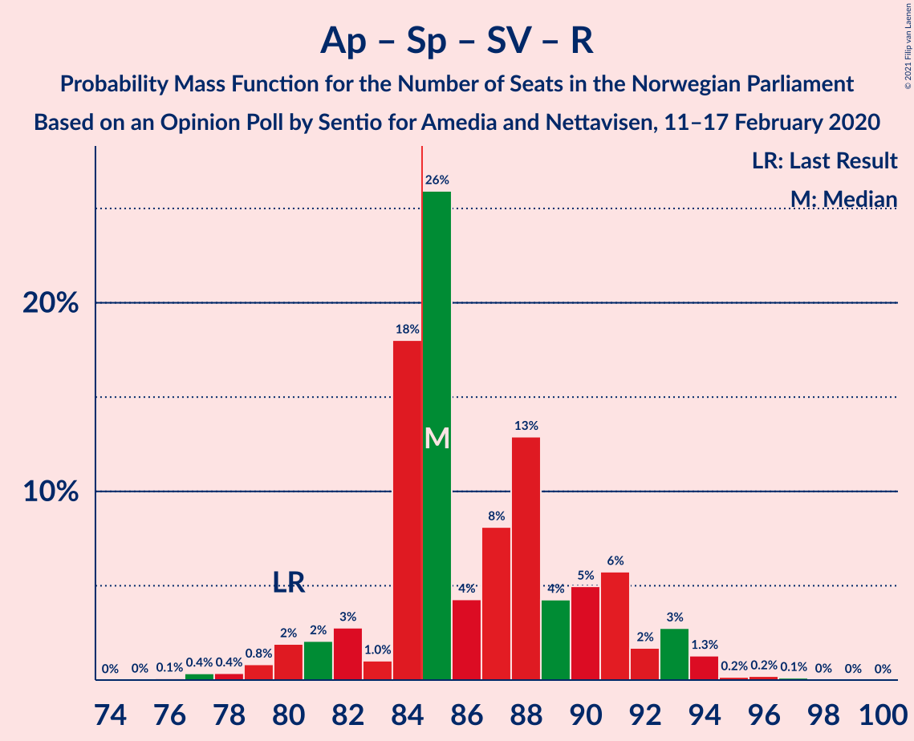

| Number of Seats | Probability | Accumulated | Special Marks |
|:---------------:|:-----------:|:-----------:|:-------------:|
| 75 | 0% | 100% |  |
| 76 | 0.1% | 99.9% |  |
| 77 | 0.4% | 99.9% |  |
| 78 | 0.4% | 99.5% |  |
| 79 | 0.8% | 99.1% |  |
| 80 | 2% | 98% | Last Result |
| 81 | 2% | 96% |  |
| 82 | 3% | 94% |  |
| 83 | 1.0% | 92% |  |
| 84 | 18% | 91% | Median |
| 85 | 26% | 73% | Majority |
| 86 | 4% | 47% |  |
| 87 | 8% | 42% |  |
| 88 | 13% | 34% |  |
| 89 | 4% | 21% |  |
| 90 | 5% | 17% |  |
| 91 | 6% | 12% |  |
| 92 | 2% | 6% |  |
| 93 | 3% | 5% |  |
| 94 | 1.3% | 2% |  |
| 95 | 0.2% | 0.6% |  |
| 96 | 0.2% | 0.4% |  |
| 97 | 0.1% | 0.2% |  |
| 98 | 0% | 0.1% |  |
| 99 | 0% | 0% |  |

### Arbeiderpartiet – Senterpartiet – Miljøpartiet De Grønne – Kristelig Folkeparti

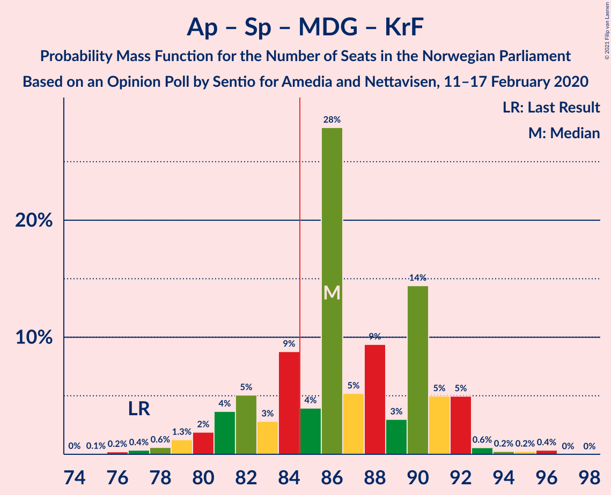

| Number of Seats | Probability | Accumulated | Special Marks |
|:---------------:|:-----------:|:-----------:|:-------------:|
| 75 | 0.1% | 100% |  |
| 76 | 0.2% | 99.9% |  |
| 77 | 0.4% | 99.7% | Last Result |
| 78 | 0.6% | 99.3% |  |
| 79 | 1.3% | 98.7% |  |
| 80 | 2% | 97% |  |
| 81 | 4% | 96% |  |
| 82 | 5% | 92% |  |
| 83 | 3% | 87% |  |
| 84 | 9% | 84% |  |
| 85 | 4% | 75% | Majority |
| 86 | 28% | 71% |  |
| 87 | 5% | 43% |  |
| 88 | 9% | 38% | Median |
| 89 | 3% | 29% |  |
| 90 | 14% | 26% |  |
| 91 | 5% | 11% |  |
| 92 | 5% | 6% |  |
| 93 | 0.6% | 1.5% |  |
| 94 | 0.2% | 0.9% |  |
| 95 | 0.2% | 0.6% |  |
| 96 | 0.4% | 0.4% |  |
| 97 | 0% | 0% |  |

### Høyre – Fremskrittspartiet – Miljøpartiet De Grønne – Kristelig Folkeparti – Venstre

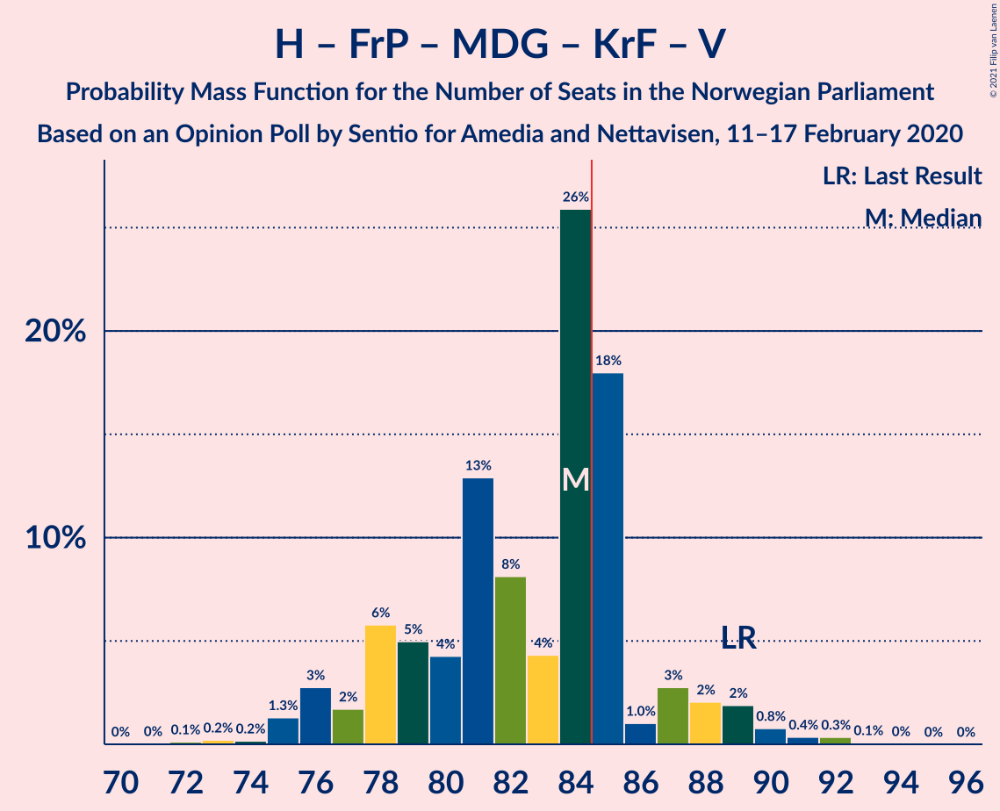

| Number of Seats | Probability | Accumulated | Special Marks |
|:---------------:|:-----------:|:-----------:|:-------------:|
| 71 | 0% | 100% |  |
| 72 | 0.1% | 99.9% |  |
| 73 | 0.2% | 99.8% |  |
| 74 | 0.2% | 99.6% |  |
| 75 | 1.3% | 99.4% |  |
| 76 | 3% | 98% |  |
| 77 | 2% | 95% |  |
| 78 | 6% | 94% |  |
| 79 | 5% | 88% |  |
| 80 | 4% | 83% |  |
| 81 | 13% | 79% |  |
| 82 | 8% | 66% |  |
| 83 | 4% | 58% | Median |
| 84 | 26% | 53% |  |
| 85 | 18% | 27% | Majority |
| 86 | 1.0% | 9% |  |
| 87 | 3% | 8% |  |
| 88 | 2% | 6% |  |
| 89 | 2% | 4% | Last Result |
| 90 | 0.8% | 2% |  |
| 91 | 0.4% | 0.8% |  |
| 92 | 0.3% | 0.5% |  |
| 93 | 0.1% | 0.1% |  |
| 94 | 0% | 0.1% |  |
| 95 | 0% | 0% |  |

### Arbeiderpartiet – Senterpartiet – Sosialistisk Venstreparti

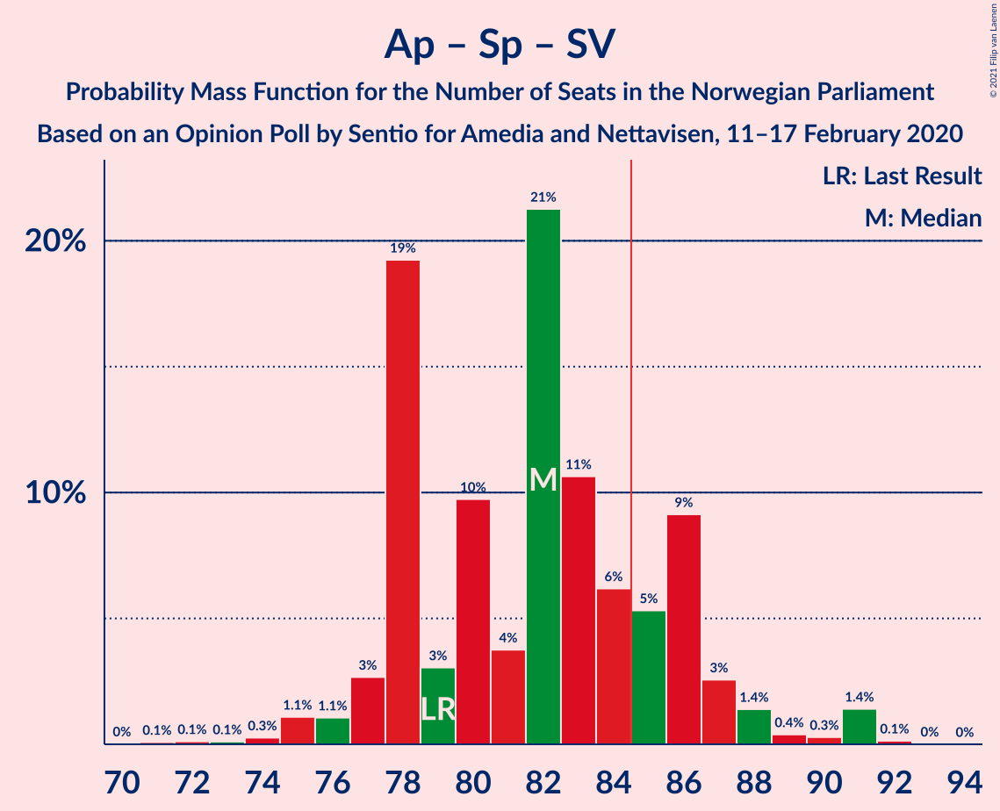

| Number of Seats | Probability | Accumulated | Special Marks |
|:---------------:|:-----------:|:-----------:|:-------------:|
| 71 | 0.1% | 100% |  |
| 72 | 0.1% | 99.9% |  |
| 73 | 0.1% | 99.8% |  |
| 74 | 0.3% | 99.7% |  |
| 75 | 1.1% | 99.4% |  |
| 76 | 1.1% | 98% |  |
| 77 | 3% | 97% |  |
| 78 | 19% | 95% |  |
| 79 | 3% | 75% | Last Result |
| 80 | 10% | 72% |  |
| 81 | 4% | 63% |  |
| 82 | 21% | 59% | Median |
| 83 | 11% | 38% |  |
| 84 | 6% | 27% |  |
| 85 | 5% | 21% | Majority |
| 86 | 9% | 15% |  |
| 87 | 3% | 6% |  |
| 88 | 1.4% | 4% |  |
| 89 | 0.4% | 2% |  |
| 90 | 0.3% | 2% |  |
| 91 | 1.4% | 2% |  |
| 92 | 0.1% | 0.2% |  |
| 93 | 0% | 0% |  |

### Arbeiderpartiet – Senterpartiet – Kristelig Folkeparti

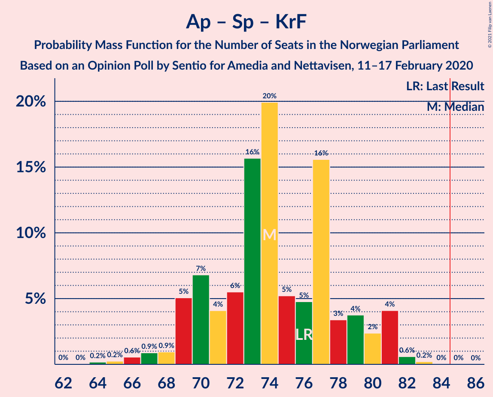

| Number of Seats | Probability | Accumulated | Special Marks |
|:---------------:|:-----------:|:-----------:|:-------------:|
| 63 | 0% | 100% |  |
| 64 | 0.2% | 99.9% |  |
| 65 | 0.2% | 99.7% |  |
| 66 | 0.6% | 99.5% |  |
| 67 | 0.9% | 98.9% |  |
| 68 | 0.9% | 98% |  |
| 69 | 5% | 97% |  |
| 70 | 7% | 92% |  |
| 71 | 4% | 85% |  |
| 72 | 6% | 81% |  |
| 73 | 16% | 76% |  |
| 74 | 20% | 60% |  |
| 75 | 5% | 40% |  |
| 76 | 5% | 35% | Last Result, Median |
| 77 | 16% | 30% |  |
| 78 | 3% | 14% |  |
| 79 | 4% | 11% |  |
| 80 | 2% | 7% |  |
| 81 | 4% | 5% |  |
| 82 | 0.6% | 0.9% |  |
| 83 | 0.2% | 0.3% |  |
| 84 | 0% | 0.1% |  |
| 85 | 0% | 0% | Majority |

### Høyre – Fremskrittspartiet – Kristelig Folkeparti – Venstre

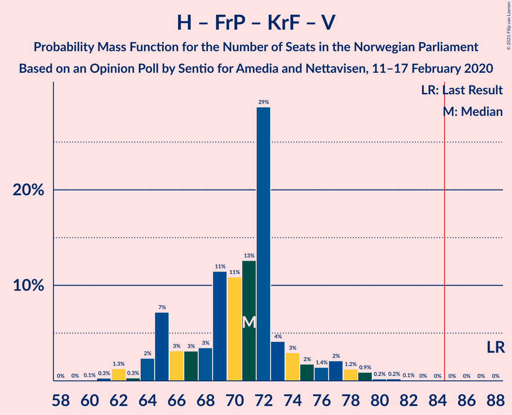

| Number of Seats | Probability | Accumulated | Special Marks |
|:---------------:|:-----------:|:-----------:|:-------------:|
| 60 | 0.1% | 100% |  |
| 61 | 0.3% | 99.9% |  |
| 62 | 1.3% | 99.6% |  |
| 63 | 0.3% | 98% |  |
| 64 | 2% | 98% |  |
| 65 | 7% | 96% |  |
| 66 | 3% | 88% |  |
| 67 | 3% | 85% |  |
| 68 | 3% | 82% |  |
| 69 | 11% | 79% |  |
| 70 | 11% | 67% |  |
| 71 | 13% | 56% | Median |
| 72 | 29% | 44% |  |
| 73 | 4% | 15% |  |
| 74 | 3% | 11% |  |
| 75 | 2% | 8% |  |
| 76 | 1.4% | 6% |  |
| 77 | 2% | 5% |  |
| 78 | 1.2% | 3% |  |
| 79 | 0.9% | 1.4% |  |
| 80 | 0.2% | 0.5% |  |
| 81 | 0.2% | 0.3% |  |
| 82 | 0.1% | 0.1% |  |
| 83 | 0% | 0% |  |
| 84 | 0% | 0% |  |
| 85 | 0% | 0% | Majority |
| 86 | 0% | 0% |  |
| 87 | 0% | 0% |  |
| 88 | 0% | 0% | Last Result |

### Arbeiderpartiet – Senterpartiet

| Number of Seats | Probability | Accumulated | Special Marks |
|:---------------:|:-----------:|:-----------:|:-------------:|
| 59 | 0.1% | 100% |  |
| 60 | 0.1% | 99.9% |  |
| 61 | 0.2% | 99.9% |  |
| 62 | 0.7% | 99.6% |  |
| 63 | 0.8% | 99.0% |  |
| 64 | 2% | 98% |  |
| 65 | 3% | 96% |  |
| 66 | 7% | 93% |  |
| 67 | 21% | 86% |  |
| 68 | 7% | 66% | Last Result |
| 69 | 20% | 58% | Median |
| 70 | 15% | 38% |  |
| 71 | 4% | 23% |  |
| 72 | 7% | 18% |  |
| 73 | 7% | 11% |  |
| 74 | 2% | 5% |  |
| 75 | 0.6% | 3% |  |
| 76 | 0.3% | 2% |  |
| 77 | 2% | 2% |  |
| 78 | 0.1% | 0.2% |  |
| 79 | 0.1% | 0.1% |  |
| 80 | 0% | 0% |  |

### Høyre – Fremskrittspartiet – Venstre

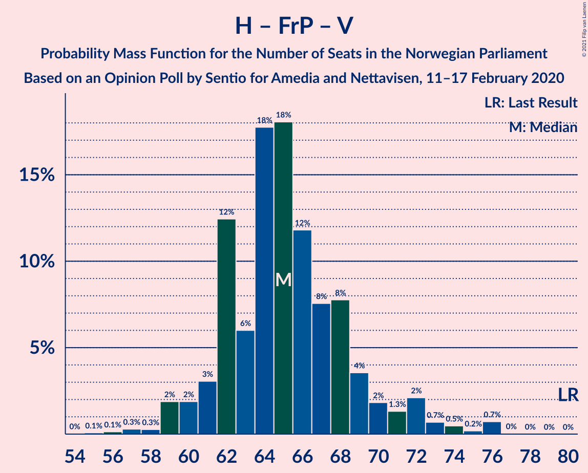

| Number of Seats | Probability | Accumulated | Special Marks |
|:---------------:|:-----------:|:-----------:|:-------------:|
| 55 | 0.1% | 100% |  |
| 56 | 0.1% | 99.9% |  |
| 57 | 0.3% | 99.7% |  |
| 58 | 0.3% | 99.5% |  |
| 59 | 2% | 99.2% |  |
| 60 | 2% | 97% |  |
| 61 | 3% | 95% |  |
| 62 | 12% | 92% |  |
| 63 | 6% | 80% |  |
| 64 | 18% | 74% | Median |
| 65 | 18% | 56% |  |
| 66 | 12% | 38% |  |
| 67 | 8% | 26% |  |
| 68 | 8% | 19% |  |
| 69 | 4% | 11% |  |
| 70 | 2% | 7% |  |
| 71 | 1.3% | 6% |  |
| 72 | 2% | 4% |  |
| 73 | 0.7% | 2% |  |
| 74 | 0.5% | 1.4% |  |
| 75 | 0.2% | 1.0% |  |
| 76 | 0.7% | 0.8% |  |
| 77 | 0% | 0.1% |  |
| 78 | 0% | 0% |  |
| 79 | 0% | 0% |  |
| 80 | 0% | 0% | Last Result |

### Høyre – Fremskrittspartiet

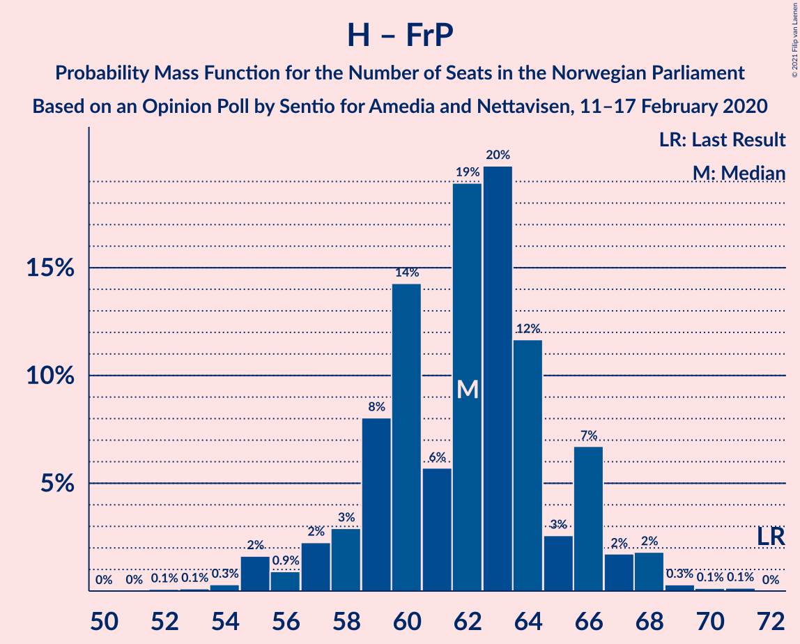

| Number of Seats | Probability | Accumulated | Special Marks |
|:---------------:|:-----------:|:-----------:|:-------------:|
| 52 | 0.1% | 100% |  |
| 53 | 0.1% | 99.9% |  |
| 54 | 0.3% | 99.8% |  |
| 55 | 2% | 99.5% |  |
| 56 | 0.9% | 98% |  |
| 57 | 2% | 97% |  |
| 58 | 3% | 95% |  |
| 59 | 8% | 92% |  |
| 60 | 14% | 84% |  |
| 61 | 6% | 69% |  |
| 62 | 19% | 64% | Median |
| 63 | 20% | 45% |  |
| 64 | 12% | 25% |  |
| 65 | 3% | 13% |  |
| 66 | 7% | 11% |  |
| 67 | 2% | 4% |  |
| 68 | 2% | 2% |  |
| 69 | 0.3% | 0.6% |  |
| 70 | 0.1% | 0.3% |  |
| 71 | 0.1% | 0.2% |  |
| 72 | 0% | 0% | Last Result |

### Arbeiderpartiet – Sosialistisk Venstreparti

| Number of Seats | Probability | Accumulated | Special Marks |
|:---------------:|:-----------:|:-----------:|:-------------:|
| 48 | 0.1% | 100% |  |
| 49 | 0.2% | 99.9% |  |
| 50 | 0.8% | 99.7% |  |
| 51 | 1.0% | 98.8% |  |
| 52 | 2% | 98% |  |
| 53 | 4% | 96% |  |
| 54 | 9% | 92% |  |
| 55 | 28% | 83% |  |
| 56 | 9% | 55% |  |
| 57 | 11% | 46% | Median |
| 58 | 15% | 34% |  |
| 59 | 6% | 20% |  |
| 60 | 9% | 13% | Last Result |
| 61 | 1.3% | 4% |  |
| 62 | 0.9% | 3% |  |
| 63 | 0.4% | 2% |  |
| 64 | 1.4% | 2% |  |
| 65 | 0.1% | 0.1% |  |
| 66 | 0% | 0% |  |

### Høyre – Kristelig Folkeparti – Venstre

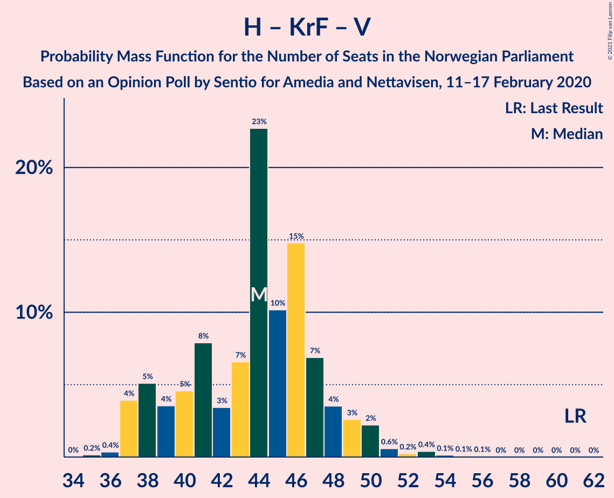

| Number of Seats | Probability | Accumulated | Special Marks |
|:---------------:|:-----------:|:-----------:|:-------------:|
| 35 | 0.2% | 100% |  |
| 36 | 0.4% | 99.8% |  |
| 37 | 4% | 99.5% |  |
| 38 | 5% | 96% |  |
| 39 | 4% | 90% |  |
| 40 | 5% | 87% |  |
| 41 | 8% | 82% |  |
| 42 | 3% | 74% |  |
| 43 | 7% | 71% |  |
| 44 | 23% | 64% | Median |
| 45 | 10% | 42% |  |
| 46 | 15% | 32% |  |
| 47 | 7% | 17% |  |
| 48 | 4% | 10% |  |
| 49 | 3% | 6% |  |
| 50 | 2% | 4% |  |
| 51 | 0.6% | 2% |  |
| 52 | 0.2% | 0.9% |  |
| 53 | 0.4% | 0.7% |  |
| 54 | 0.1% | 0.3% |  |
| 55 | 0.1% | 0.2% |  |
| 56 | 0.1% | 0.1% |  |
| 57 | 0% | 0% |  |
| 58 | 0% | 0% |  |
| 59 | 0% | 0% |  |
| 60 | 0% | 0% |  |
| 61 | 0% | 0% | Last Result |

### Senterpartiet – Kristelig Folkeparti – Venstre

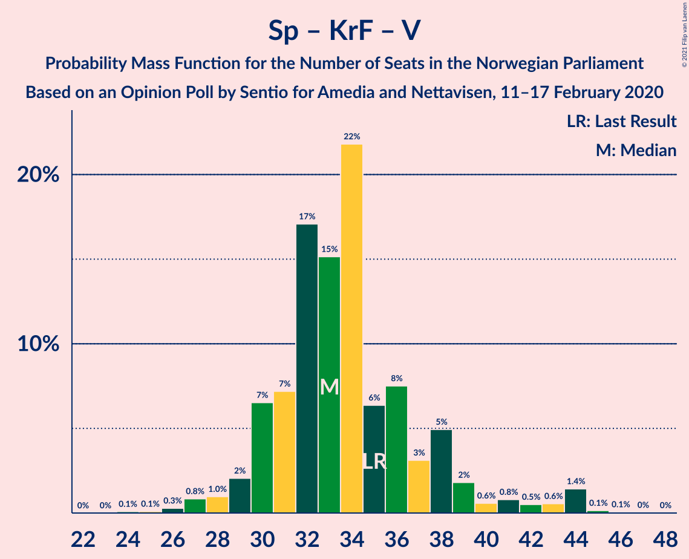

| Number of Seats | Probability | Accumulated | Special Marks |
|:---------------:|:-----------:|:-----------:|:-------------:|
| 24 | 0.1% | 100% |  |
| 25 | 0.1% | 99.9% |  |
| 26 | 0.3% | 99.8% |  |
| 27 | 0.8% | 99.5% |  |
| 28 | 1.0% | 98.7% |  |
| 29 | 2% | 98% |  |
| 30 | 7% | 96% |  |
| 31 | 7% | 89% |  |
| 32 | 17% | 82% |  |
| 33 | 15% | 65% |  |
| 34 | 22% | 50% | Median |
| 35 | 6% | 28% | Last Result |
| 36 | 8% | 22% |  |
| 37 | 3% | 14% |  |
| 38 | 5% | 11% |  |
| 39 | 2% | 6% |  |
| 40 | 0.6% | 4% |  |
| 41 | 0.8% | 4% |  |
| 42 | 0.5% | 3% |  |
| 43 | 0.6% | 2% |  |
| 44 | 1.4% | 2% |  |
| 45 | 0.1% | 0.3% |  |
| 46 | 0.1% | 0.1% |  |
| 47 | 0% | 0% |  |

## Technical Information

### Opinion Poll

+ **Polling firm:** Sentio
+ **Commissioner(s):** Amedia and Nettavisen
+ **Fieldwork period:** 11–17 February 2020

### Calculations

+ **Sample size:** 1000
+ **Simulations done:** 524,288
+ **Error estimate:** 2.29%

