# Opinion Poll by Ipsos MMI for Dagbladet, 17–19 February 2020

<a href="#voting-intentions">Voting Intentions</a> | <a href="#seats">Seats</a> | <a href="#coalitions">Coalitions</a> | <a href="#technical-information">Technical Information</a>

## Voting Intentions

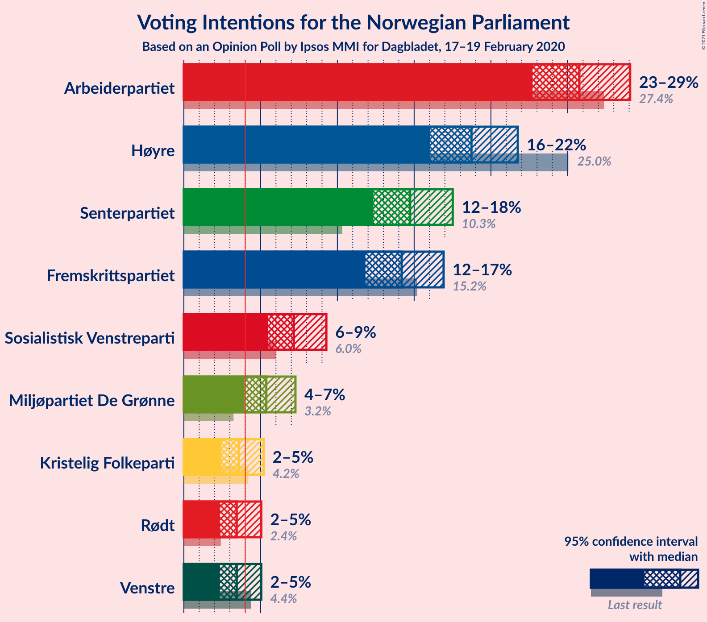

### Confidence Intervals

| Party | Last Result | Poll Result | 80% Confidence Interval | 90% Confidence Interval | 95% Confidence Interval | 99% Confidence Interval |
|:-----:|:-----------:|:-----------:|:-----------------------:|:-----------------------:|:-----------------------:|:-----------------------:|
| Arbeiderpartiet | 27.4% | 25.8% | 23.7–27.9% |23.2–28.5% |22.7–29.1% |21.8–30.1% |
| Høyre | 25.0% | 18.7% | 17.0–20.7% |16.5–21.3% |16.0–21.7% |15.2–22.7% |
| Senterpartiet | 10.3% | 14.7% | 13.2–16.6% |12.7–17.1% |12.3–17.5% |11.6–18.4% |
| Fremskrittspartiet | 15.2% | 14.2% | 12.6–16.0% |12.2–16.5% |11.8–16.9% |11.1–17.8% |
| Sosialistisk Venstreparti | 6.0% | 7.2% | 6.1–8.6% |5.8–8.9% |5.5–9.3% |5.0–10.0% |
| Miljøpartiet De Grønne | 3.2% | 5.4% | 4.4–6.6% |4.2–7.0% |3.9–7.3% |3.6–7.9% |
| Kristelig Folkeparti | 4.2% | 3.6% | 2.8–4.6% |2.6–4.9% |2.5–5.2% |2.1–5.8% |
| Rødt | 2.4% | 3.4% | 2.7–4.5% |2.5–4.8% |2.3–5.0% |2.0–5.6% |
| Venstre | 4.4% | 3.4% | 2.7–4.5% |2.5–4.8% |2.3–5.0% |2.0–5.6% |

*Note:* The poll result column reflects the actual value used in the calculations. Published results may vary slightly, and in addition be rounded to fewer digits.

## Seats

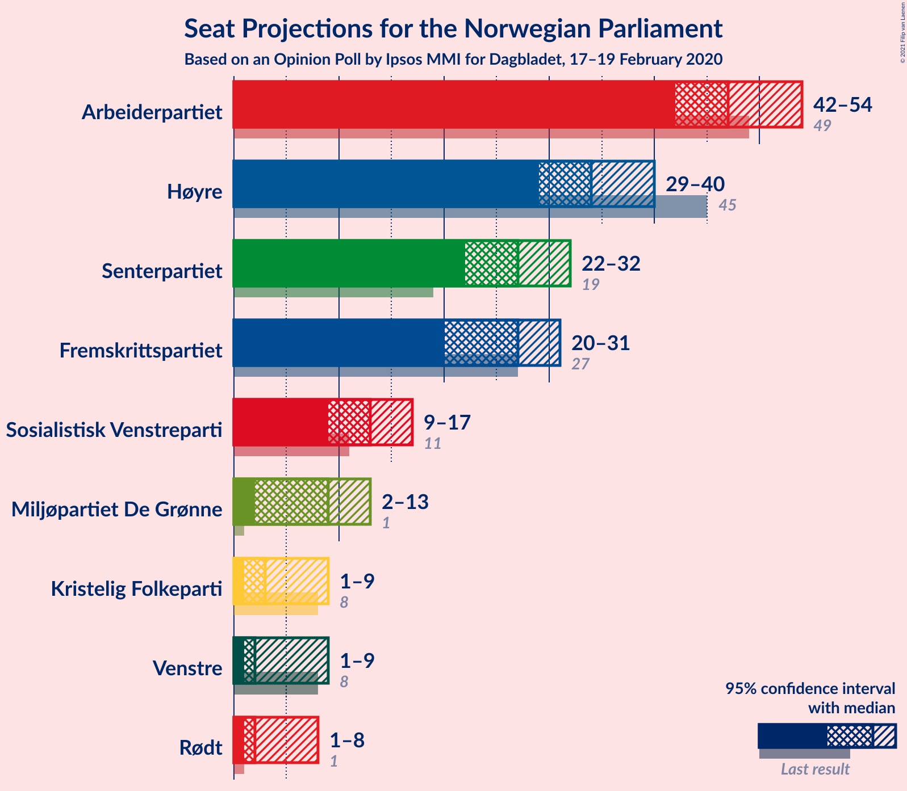

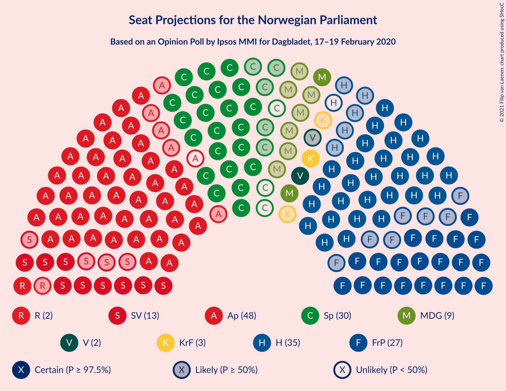

### Confidence Intervals

| Party | Last Result | Median | 80% Confidence Interval | 90% Confidence Interval | 95% Confidence Interval | 99% Confidence Interval |
|:-----:|:-----------:|:------:|:-----------------------:|:-----------------------:|:-----------------------:|:-----------------------:|
| <a href="#arbeiderpartiet">Arbeiderpartiet</a> | 49 | 47 | 43–52 |43–53 |42–54 |41–56 |
| <a href="#høyre">Høyre</a> | 45 | 34 | 30–38 |29–39 |29–40 |27–41 |
| <a href="#senterpartiet">Senterpartiet</a> | 19 | 27 | 24–30 |23–31 |22–32 |21–34 |
| <a href="#fremskrittspartiet">Fremskrittspartiet</a> | 27 | 27 | 23–29 |22–30 |20–31 |19–33 |
| <a href="#sosialistisk-venstreparti">Sosialistisk Venstreparti</a> | 11 | 13 | 10–16 |10–16 |9–17 |8–19 |
| <a href="#miljøpartiet-de-grønne">Miljøpartiet De Grønne</a> | 1 | 9 | 7–12 |7–13 |2–13 |2–14 |
| <a href="#kristelig-folkeparti">Kristelig Folkeparti</a> | 8 | 3 | 1–8 |1–9 |1–9 |0–10 |
| <a href="#rødt">Rødt</a> | 1 | 2 | 1–8 |1–8 |1–8 |1–10 |
| <a href="#venstre">Venstre</a> | 8 | 2 | 2–8 |1–8 |1–9 |1–10 |

### Arbeiderpartiet

*For a full overview of the results for this party, see the [Arbeiderpartiet](party-arbeiderpartiet.html) page.*

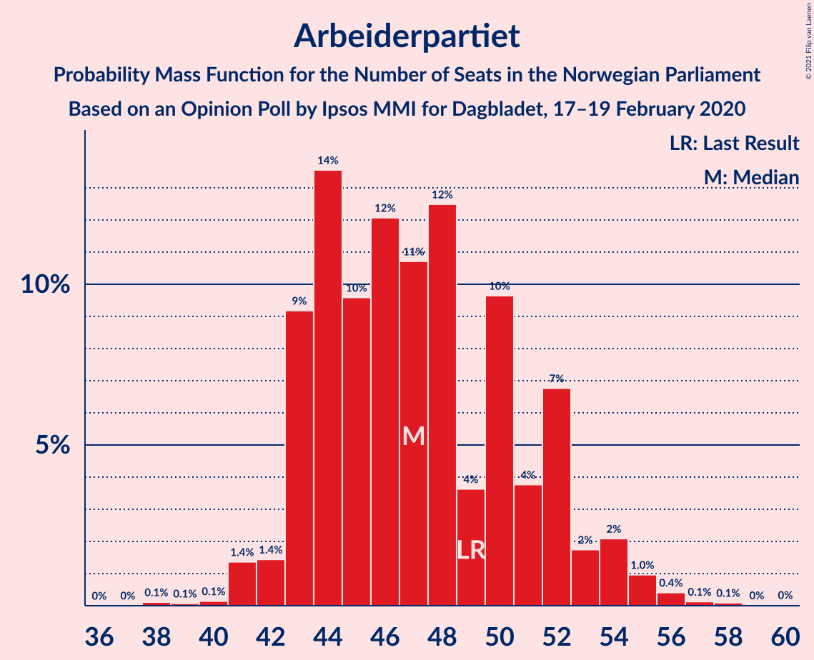

| Number of Seats | Probability | Accumulated | Special Marks |
|:---------------:|:-----------:|:-----------:|:-------------:|
| 38 | 0.1% | 100% |  |
| 39 | 0.1% | 99.9% |  |
| 40 | 0.1% | 99.8% |  |
| 41 | 1.4% | 99.7% |  |
| 42 | 1.4% | 98% |  |
| 43 | 9% | 97% |  |
| 44 | 14% | 88% |  |
| 45 | 10% | 74% |  |
| 46 | 12% | 65% |  |
| 47 | 11% | 52% | Median |
| 48 | 12% | 42% |  |
| 49 | 4% | 29% | Last Result |
| 50 | 10% | 26% |  |
| 51 | 4% | 16% |  |
| 52 | 7% | 12% |  |
| 53 | 2% | 5% |  |
| 54 | 2% | 4% |  |
| 55 | 1.0% | 2% |  |
| 56 | 0.4% | 0.7% |  |
| 57 | 0.1% | 0.3% |  |
| 58 | 0.1% | 0.1% |  |
| 59 | 0% | 0% |  |

### Høyre

*For a full overview of the results for this party, see the [Høyre](party-høyre.html) page.*

| Number of Seats | Probability | Accumulated | Special Marks |
|:---------------:|:-----------:|:-----------:|:-------------:|
| 24 | 0% | 100% |  |
| 25 | 0.1% | 99.9% |  |
| 26 | 0.1% | 99.9% |  |
| 27 | 0.6% | 99.8% |  |
| 28 | 1.4% | 99.2% |  |
| 29 | 4% | 98% |  |
| 30 | 5% | 93% |  |
| 31 | 10% | 88% |  |
| 32 | 8% | 78% |  |
| 33 | 18% | 71% |  |
| 34 | 15% | 53% | Median |
| 35 | 16% | 37% |  |
| 36 | 6% | 21% |  |
| 37 | 5% | 16% |  |
| 38 | 6% | 11% |  |
| 39 | 2% | 5% |  |
| 40 | 3% | 3% |  |
| 41 | 0.3% | 0.6% |  |
| 42 | 0.2% | 0.3% |  |
| 43 | 0% | 0.1% |  |
| 44 | 0.1% | 0.1% |  |
| 45 | 0% | 0% | Last Result |

### Senterpartiet

*For a full overview of the results for this party, see the [Senterpartiet](party-senterpartiet.html) page.*

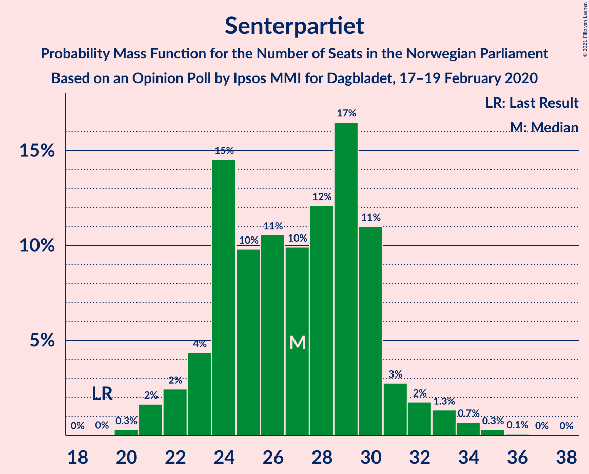

| Number of Seats | Probability | Accumulated | Special Marks |
|:---------------:|:-----------:|:-----------:|:-------------:|
| 19 | 0% | 100% | Last Result |
| 20 | 0.3% | 99.9% |  |
| 21 | 2% | 99.7% |  |
| 22 | 2% | 98% |  |
| 23 | 4% | 96% |  |
| 24 | 15% | 91% |  |
| 25 | 10% | 77% |  |
| 26 | 11% | 67% |  |
| 27 | 10% | 56% | Median |
| 28 | 12% | 46% |  |
| 29 | 17% | 34% |  |
| 30 | 11% | 18% |  |
| 31 | 3% | 7% |  |
| 32 | 2% | 4% |  |
| 33 | 1.3% | 2% |  |
| 34 | 0.7% | 1.0% |  |
| 35 | 0.3% | 0.4% |  |
| 36 | 0.1% | 0.1% |  |
| 37 | 0% | 0% |  |

### Fremskrittspartiet

*For a full overview of the results for this party, see the [Fremskrittspartiet](party-fremskrittspartiet.html) page.*

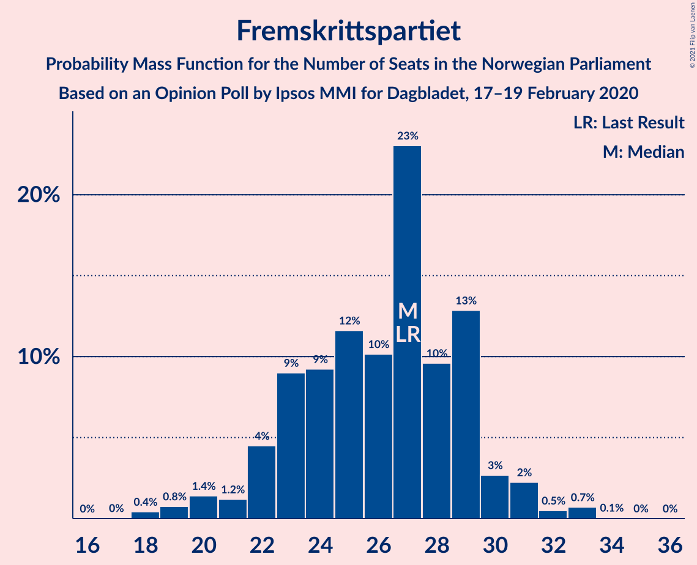

| Number of Seats | Probability | Accumulated | Special Marks |
|:---------------:|:-----------:|:-----------:|:-------------:|
| 18 | 0.4% | 100% |  |
| 19 | 0.8% | 99.5% |  |
| 20 | 1.4% | 98.8% |  |
| 21 | 1.2% | 97% |  |
| 22 | 4% | 96% |  |
| 23 | 9% | 92% |  |
| 24 | 9% | 83% |  |
| 25 | 12% | 73% |  |
| 26 | 10% | 62% |  |
| 27 | 23% | 52% | Last Result, Median |
| 28 | 10% | 29% |  |
| 29 | 13% | 19% |  |
| 30 | 3% | 6% |  |
| 31 | 2% | 4% |  |
| 32 | 0.5% | 1.3% |  |
| 33 | 0.7% | 0.8% |  |
| 34 | 0.1% | 0.1% |  |
| 35 | 0% | 0% |  |

### Sosialistisk Venstreparti

*For a full overview of the results for this party, see the [Sosialistisk Venstreparti](party-sosialistiskvenstreparti.html) page.*

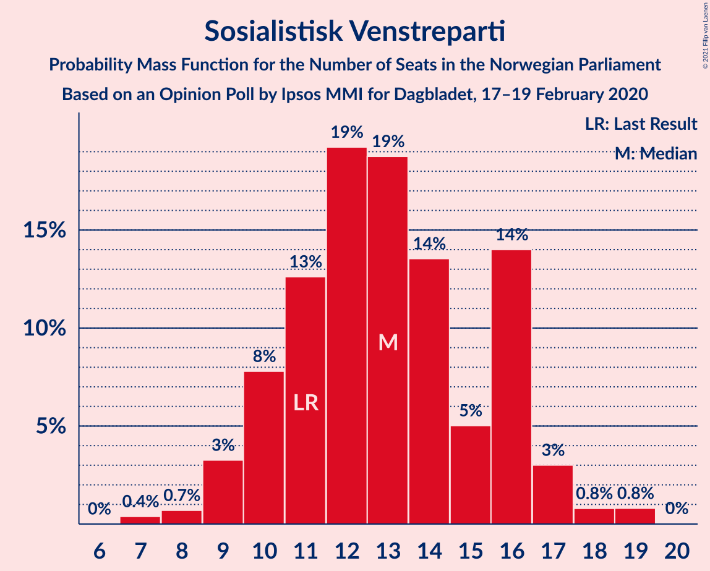

| Number of Seats | Probability | Accumulated | Special Marks |
|:---------------:|:-----------:|:-----------:|:-------------:|
| 7 | 0.4% | 100% |  |
| 8 | 0.7% | 99.6% |  |
| 9 | 3% | 98.9% |  |
| 10 | 8% | 96% |  |
| 11 | 13% | 88% | Last Result |
| 12 | 19% | 75% |  |
| 13 | 19% | 56% | Median |
| 14 | 14% | 37% |  |
| 15 | 5% | 24% |  |
| 16 | 14% | 19% |  |
| 17 | 3% | 5% |  |
| 18 | 0.8% | 2% |  |
| 19 | 0.8% | 0.9% |  |
| 20 | 0% | 0% |  |

### Miljøpartiet De Grønne

*For a full overview of the results for this party, see the [Miljøpartiet De Grønne](party-miljøpartietdegrønne.html) page.*

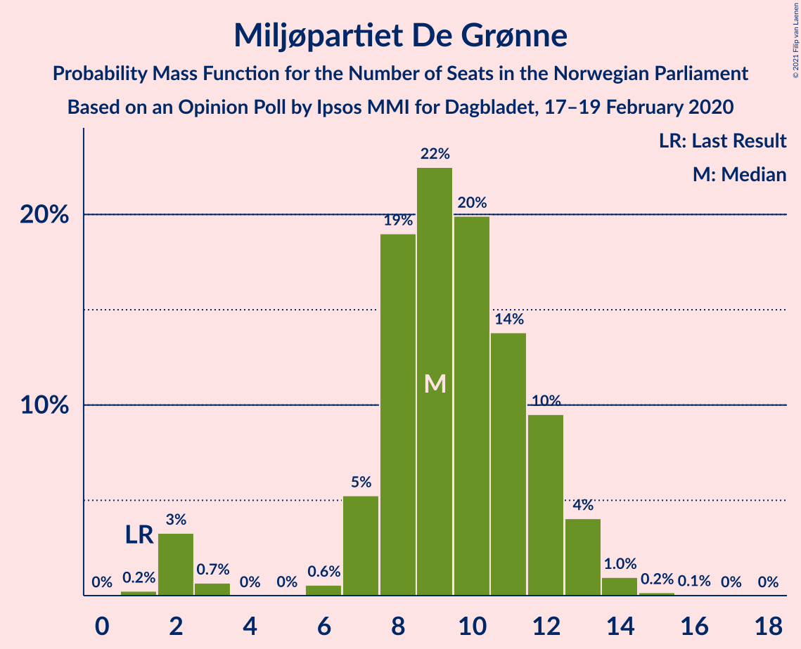

| Number of Seats | Probability | Accumulated | Special Marks |
|:---------------:|:-----------:|:-----------:|:-------------:|
| 1 | 0.2% | 100% | Last Result |
| 2 | 3% | 99.8% |  |
| 3 | 0.7% | 96% |  |
| 4 | 0% | 96% |  |
| 5 | 0% | 96% |  |
| 6 | 0.6% | 96% |  |
| 7 | 5% | 95% |  |
| 8 | 19% | 90% |  |
| 9 | 22% | 71% | Median |
| 10 | 20% | 48% |  |
| 11 | 14% | 29% |  |
| 12 | 10% | 15% |  |
| 13 | 4% | 5% |  |
| 14 | 1.0% | 1.2% |  |
| 15 | 0.2% | 0.2% |  |
| 16 | 0.1% | 0.1% |  |
| 17 | 0% | 0% |  |

### Kristelig Folkeparti

*For a full overview of the results for this party, see the [Kristelig Folkeparti](party-kristeligfolkeparti.html) page.*

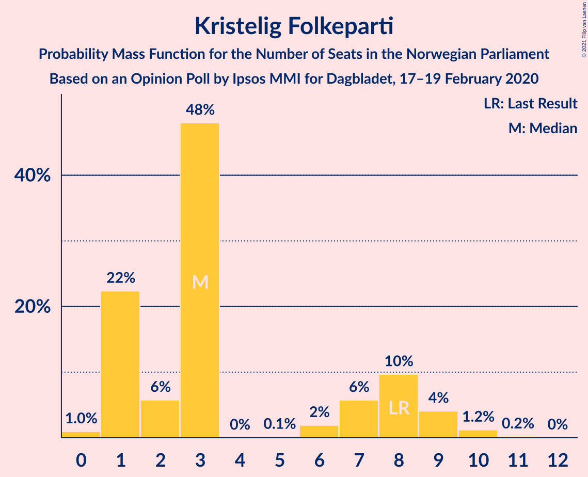

| Number of Seats | Probability | Accumulated | Special Marks |
|:---------------:|:-----------:|:-----------:|:-------------:|
| 0 | 1.0% | 100% |  |
| 1 | 22% | 99.0% |  |
| 2 | 6% | 77% |  |
| 3 | 48% | 71% | Median |
| 4 | 0% | 23% |  |
| 5 | 0.1% | 23% |  |
| 6 | 2% | 23% |  |
| 7 | 6% | 21% |  |
| 8 | 10% | 15% | Last Result |
| 9 | 4% | 5% |  |
| 10 | 1.2% | 1.4% |  |
| 11 | 0.2% | 0.2% |  |
| 12 | 0% | 0% |  |

### Rødt

*For a full overview of the results for this party, see the [Rødt](party-rødt.html) page.*

| Number of Seats | Probability | Accumulated | Special Marks |
|:---------------:|:-----------:|:-----------:|:-------------:|
| 1 | 17% | 100% | Last Result |
| 2 | 52% | 83% | Median |
| 3 | 0% | 31% |  |
| 4 | 0% | 31% |  |
| 5 | 0% | 31% |  |
| 6 | 4% | 31% |  |
| 7 | 11% | 27% |  |
| 8 | 14% | 16% |  |
| 9 | 1.3% | 2% |  |
| 10 | 1.1% | 1.2% |  |
| 11 | 0.1% | 0.1% |  |
| 12 | 0% | 0% |  |

### Venstre

*For a full overview of the results for this party, see the [Venstre](party-venstre.html) page.*

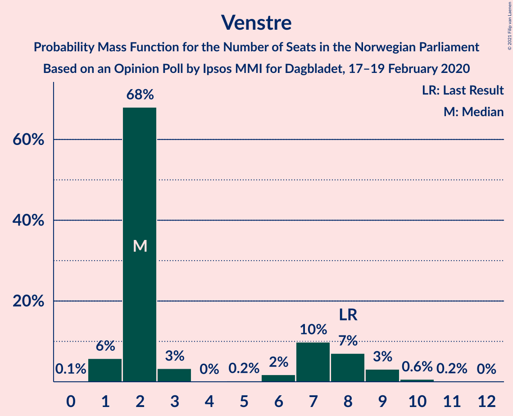

| Number of Seats | Probability | Accumulated | Special Marks |
|:---------------:|:-----------:|:-----------:|:-------------:|
| 0 | 0.1% | 100% |  |
| 1 | 6% | 99.9% |  |
| 2 | 68% | 94% | Median |
| 3 | 3% | 26% |  |
| 4 | 0% | 23% |  |
| 5 | 0.2% | 23% |  |
| 6 | 2% | 23% |  |
| 7 | 10% | 21% |  |
| 8 | 7% | 11% | Last Result |
| 9 | 3% | 4% |  |
| 10 | 0.6% | 0.8% |  |
| 11 | 0.2% | 0.2% |  |
| 12 | 0% | 0% |  |

## Coalitions

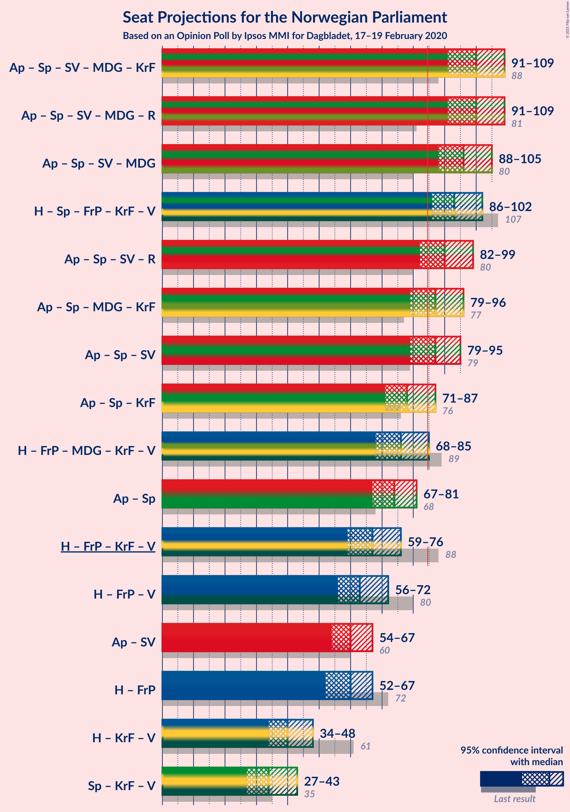

### Confidence Intervals

| Coalition | Last Result | Median | Majority? | 80% Confidence Interval | 90% Confidence Interval | 95% Confidence Interval | 99% Confidence Interval |
|:---------:|:-----------:|:------:|:---------:|:-----------------------:|:-----------------------:|:-----------------------:|:-----------------------:|
| Arbeiderpartiet – Senterpartiet – Sosialistisk Venstreparti – Miljøpartiet De Grønne – Kristelig Folkeparti | 88 | 100 | 100% | 94–106 | 92–108 | 91–109 | 89–111 |
| Arbeiderpartiet – Senterpartiet – Sosialistisk Venstreparti – Miljøpartiet De Grønne – Rødt | 81 | 100 | 100% | 94–106 | 92–108 | 91–109 | 89–111 |
| Arbeiderpartiet – Senterpartiet – Sosialistisk Venstreparti – Miljøpartiet De Grønne | 80 | 96 | 99.8% | 90–102 | 89–104 | 88–105 | 85–107 |
| Høyre – Senterpartiet – Fremskrittspartiet – Kristelig Folkeparti – Venstre | 107 | 93 | 99.2% | 88–100 | 86–101 | 86–102 | 83–104 |
| Arbeiderpartiet – Senterpartiet – Sosialistisk Venstreparti – Rødt | 80 | 90 | 93% | 85–96 | 84–99 | 82–99 | 80–101 |
| Arbeiderpartiet – Senterpartiet – Miljøpartiet De Grønne – Kristelig Folkeparti | 77 | 87 | 74% | 81–93 | 81–94 | 79–96 | 77–98 |
| Arbeiderpartiet – Senterpartiet – Sosialistisk Venstreparti | 79 | 87 | 72% | 81–93 | 80–94 | 79–95 | 77–97 |
| Arbeiderpartiet – Senterpartiet – Kristelig Folkeparti | 76 | 78 | 5% | 72–83 | 71–85 | 71–87 | 69–89 |
| Høyre – Fremskrittspartiet – Miljøpartiet De Grønne – Kristelig Folkeparti – Venstre | 89 | 76 | 3% | 70–83 | 69–84 | 68–85 | 65–88 |
| Arbeiderpartiet – Senterpartiet | 68 | 74 | 0.5% | 68–79 | 68–80 | 67–81 | 65–84 |
| Høyre – Fremskrittspartiet – Kristelig Folkeparti – Venstre | 88 | 67 | 0% | 61–72 | 60–74 | 59–76 | 57–78 |
| Høyre – Fremskrittspartiet – Venstre | 80 | 63 | 0% | 58–69 | 57–70 | 56–72 | 53–74 |
| Arbeiderpartiet – Sosialistisk Venstreparti | 60 | 60 | 0% | 56–65 | 55–66 | 54–67 | 52–71 |
| Høyre – Fremskrittspartiet | 72 | 60 | 0% | 55–65 | 54–67 | 52–67 | 50–70 |
| Høyre – Kristelig Folkeparti – Venstre | 61 | 40 | 0% | 36–46 | 35–48 | 34–48 | 32–51 |
| Senterpartiet – Kristelig Folkeparti – Venstre | 35 | 34 | 0% | 29–39 | 28–41 | 27–43 | 26–46 |

### Arbeiderpartiet – Senterpartiet – Sosialistisk Venstreparti – Miljøpartiet De Grønne – Kristelig Folkeparti

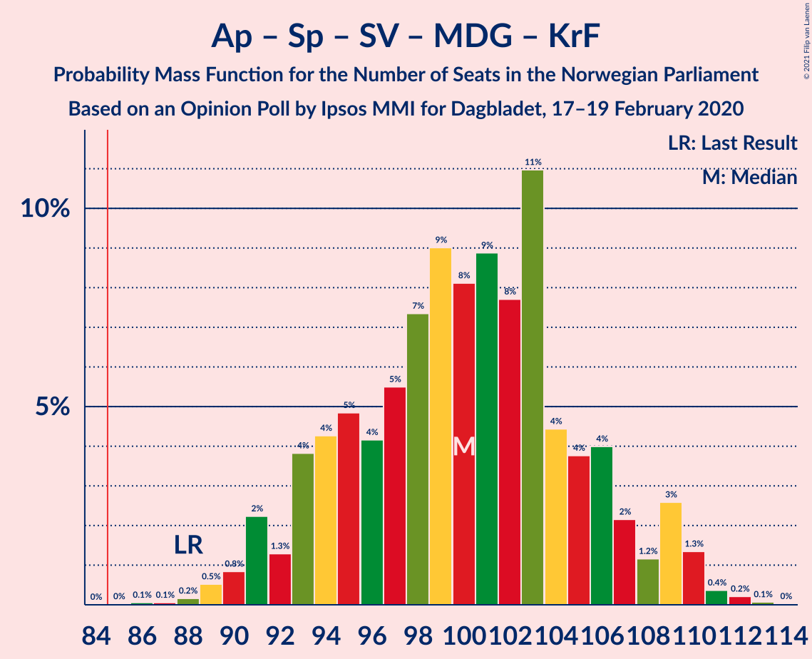

| Number of Seats | Probability | Accumulated | Special Marks |
|:---------------:|:-----------:|:-----------:|:-------------:|
| 86 | 0.1% | 100% |  |
| 87 | 0.1% | 99.9% |  |
| 88 | 0.2% | 99.8% | Last Result |
| 89 | 0.5% | 99.7% |  |
| 90 | 0.8% | 99.2% |  |
| 91 | 2% | 98% |  |
| 92 | 1.3% | 96% |  |
| 93 | 4% | 95% |  |
| 94 | 4% | 91% |  |
| 95 | 5% | 87% |  |
| 96 | 4% | 82% |  |
| 97 | 5% | 78% |  |
| 98 | 7% | 72% |  |
| 99 | 9% | 65% | Median |
| 100 | 8% | 56% |  |
| 101 | 9% | 48% |  |
| 102 | 8% | 39% |  |
| 103 | 11% | 31% |  |
| 104 | 4% | 20% |  |
| 105 | 4% | 16% |  |
| 106 | 4% | 12% |  |
| 107 | 2% | 8% |  |
| 108 | 1.2% | 6% |  |
| 109 | 3% | 5% |  |
| 110 | 1.3% | 2% |  |
| 111 | 0.4% | 0.7% |  |
| 112 | 0.2% | 0.3% |  |
| 113 | 0.1% | 0.1% |  |
| 114 | 0% | 0% |  |

### Arbeiderpartiet – Senterpartiet – Sosialistisk Venstreparti – Miljøpartiet De Grønne – Rødt

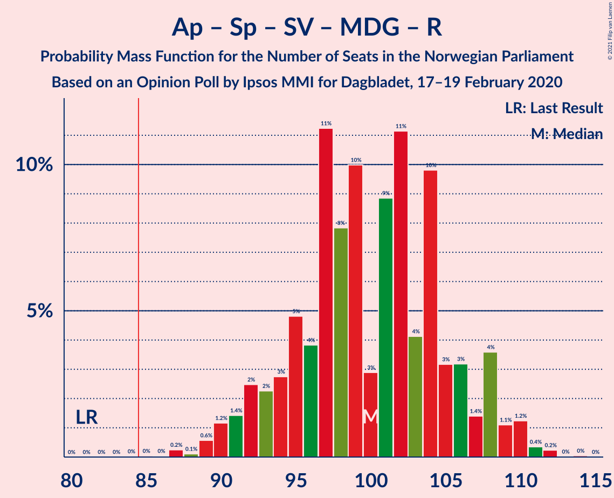

| Number of Seats | Probability | Accumulated | Special Marks |
|:---------------:|:-----------:|:-----------:|:-------------:|
| 81 | 0% | 100% | Last Result |
| 82 | 0% | 100% |  |
| 83 | 0% | 100% |  |
| 84 | 0% | 100% |  |
| 85 | 0% | 100% | Majority |
| 86 | 0% | 99.9% |  |
| 87 | 0.2% | 99.9% |  |
| 88 | 0.1% | 99.6% |  |
| 89 | 0.6% | 99.5% |  |
| 90 | 1.2% | 99.0% |  |
| 91 | 1.4% | 98% |  |
| 92 | 2% | 96% |  |
| 93 | 2% | 94% |  |
| 94 | 3% | 92% |  |
| 95 | 5% | 89% |  |
| 96 | 4% | 84% |  |
| 97 | 11% | 80% |  |
| 98 | 8% | 69% | Median |
| 99 | 10% | 61% |  |
| 100 | 3% | 51% |  |
| 101 | 9% | 48% |  |
| 102 | 11% | 39% |  |
| 103 | 4% | 28% |  |
| 104 | 10% | 24% |  |
| 105 | 3% | 14% |  |
| 106 | 3% | 11% |  |
| 107 | 1.4% | 8% |  |
| 108 | 4% | 7% |  |
| 109 | 1.1% | 3% |  |
| 110 | 1.2% | 2% |  |
| 111 | 0.4% | 0.7% |  |
| 112 | 0.2% | 0.3% |  |
| 113 | 0% | 0.1% |  |
| 114 | 0% | 0.1% |  |
| 115 | 0% | 0% |  |

### Arbeiderpartiet – Senterpartiet – Sosialistisk Venstreparti – Miljøpartiet De Grønne

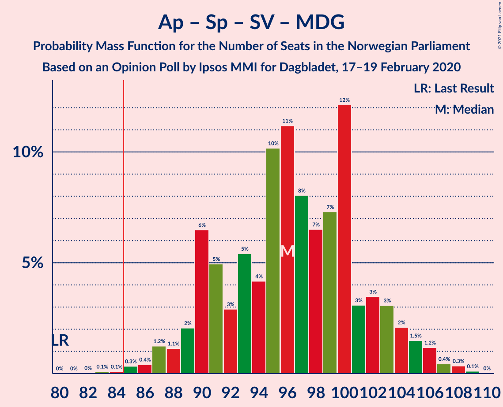

| Number of Seats | Probability | Accumulated | Special Marks |
|:---------------:|:-----------:|:-----------:|:-------------:|
| 80 | 0% | 100% | Last Result |
| 81 | 0% | 100% |  |
| 82 | 0% | 100% |  |
| 83 | 0.1% | 99.9% |  |
| 84 | 0.1% | 99.8% |  |
| 85 | 0.3% | 99.8% | Majority |
| 86 | 0.4% | 99.4% |  |
| 87 | 1.2% | 99.0% |  |
| 88 | 1.1% | 98% |  |
| 89 | 2% | 97% |  |
| 90 | 6% | 95% |  |
| 91 | 5% | 88% |  |
| 92 | 3% | 83% |  |
| 93 | 5% | 80% |  |
| 94 | 4% | 75% |  |
| 95 | 10% | 71% |  |
| 96 | 11% | 60% | Median |
| 97 | 8% | 49% |  |
| 98 | 7% | 41% |  |
| 99 | 7% | 35% |  |
| 100 | 12% | 27% |  |
| 101 | 3% | 15% |  |
| 102 | 3% | 12% |  |
| 103 | 3% | 9% |  |
| 104 | 2% | 6% |  |
| 105 | 1.5% | 4% |  |
| 106 | 1.2% | 2% |  |
| 107 | 0.4% | 0.9% |  |
| 108 | 0.3% | 0.5% |  |
| 109 | 0.1% | 0.2% |  |
| 110 | 0% | 0% |  |

### Høyre – Senterpartiet – Fremskrittspartiet – Kristelig Folkeparti – Venstre

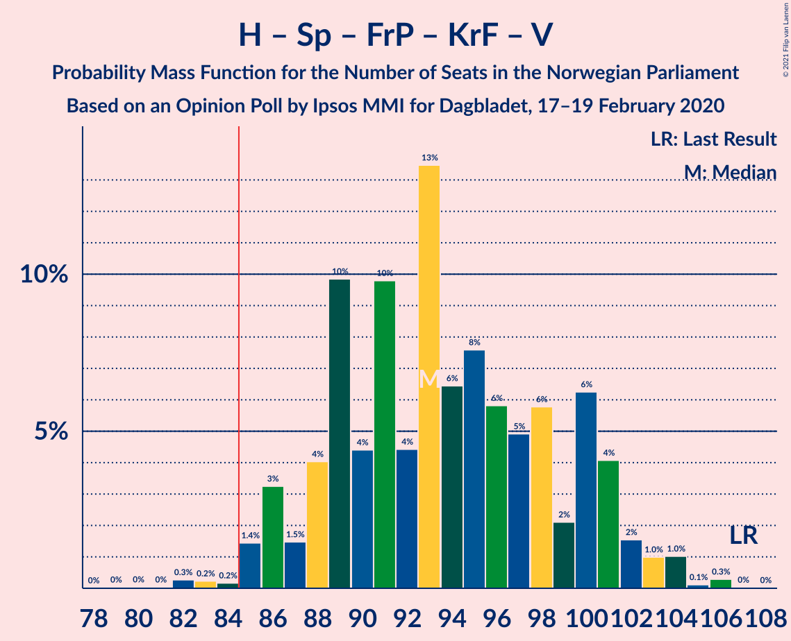

| Number of Seats | Probability | Accumulated | Special Marks |
|:---------------:|:-----------:|:-----------:|:-------------:|
| 79 | 0% | 100% |  |
| 80 | 0% | 99.9% |  |
| 81 | 0% | 99.9% |  |
| 82 | 0.3% | 99.9% |  |
| 83 | 0.2% | 99.6% |  |
| 84 | 0.2% | 99.4% |  |
| 85 | 1.4% | 99.2% | Majority |
| 86 | 3% | 98% |  |
| 87 | 1.5% | 95% |  |
| 88 | 4% | 93% |  |
| 89 | 10% | 89% |  |
| 90 | 4% | 79% |  |
| 91 | 10% | 75% |  |
| 92 | 4% | 65% |  |
| 93 | 13% | 61% | Median |
| 94 | 6% | 47% |  |
| 95 | 8% | 41% |  |
| 96 | 6% | 33% |  |
| 97 | 5% | 27% |  |
| 98 | 6% | 22% |  |
| 99 | 2% | 16% |  |
| 100 | 6% | 14% |  |
| 101 | 4% | 8% |  |
| 102 | 2% | 4% |  |
| 103 | 1.0% | 2% |  |
| 104 | 1.0% | 1.5% |  |
| 105 | 0.1% | 0.5% |  |
| 106 | 0.3% | 0.4% |  |
| 107 | 0% | 0.1% | Last Result |
| 108 | 0% | 0% |  |

### Arbeiderpartiet – Senterpartiet – Sosialistisk Venstreparti – Rødt

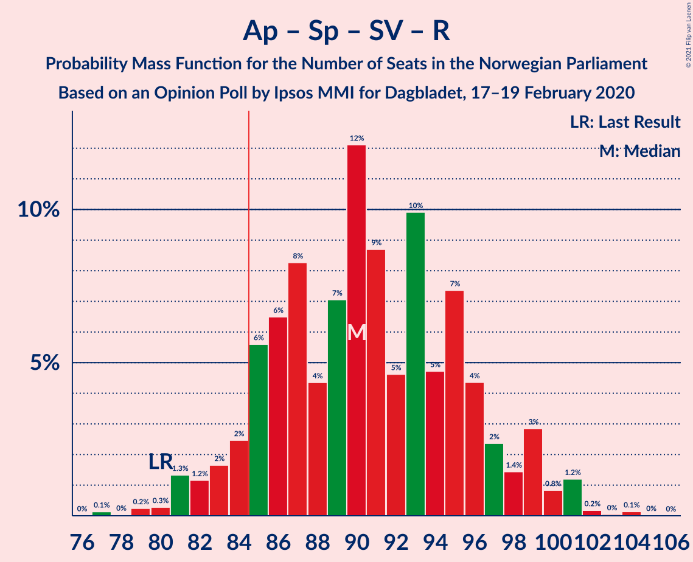

| Number of Seats | Probability | Accumulated | Special Marks |
|:---------------:|:-----------:|:-----------:|:-------------:|
| 77 | 0.1% | 100% |  |
| 78 | 0% | 99.8% |  |
| 79 | 0.2% | 99.8% |  |
| 80 | 0.3% | 99.6% | Last Result |
| 81 | 1.3% | 99.3% |  |
| 82 | 1.2% | 98% |  |
| 83 | 2% | 97% |  |
| 84 | 2% | 95% |  |
| 85 | 6% | 93% | Majority |
| 86 | 6% | 87% |  |
| 87 | 8% | 81% |  |
| 88 | 4% | 72% |  |
| 89 | 7% | 68% | Median |
| 90 | 12% | 61% |  |
| 91 | 9% | 49% |  |
| 92 | 5% | 40% |  |
| 93 | 10% | 35% |  |
| 94 | 5% | 26% |  |
| 95 | 7% | 21% |  |
| 96 | 4% | 13% |  |
| 97 | 2% | 9% |  |
| 98 | 1.4% | 7% |  |
| 99 | 3% | 5% |  |
| 100 | 0.8% | 2% |  |
| 101 | 1.2% | 2% |  |
| 102 | 0.2% | 0.4% |  |
| 103 | 0% | 0.2% |  |
| 104 | 0.1% | 0.2% |  |
| 105 | 0% | 0% |  |

### Arbeiderpartiet – Senterpartiet – Miljøpartiet De Grønne – Kristelig Folkeparti

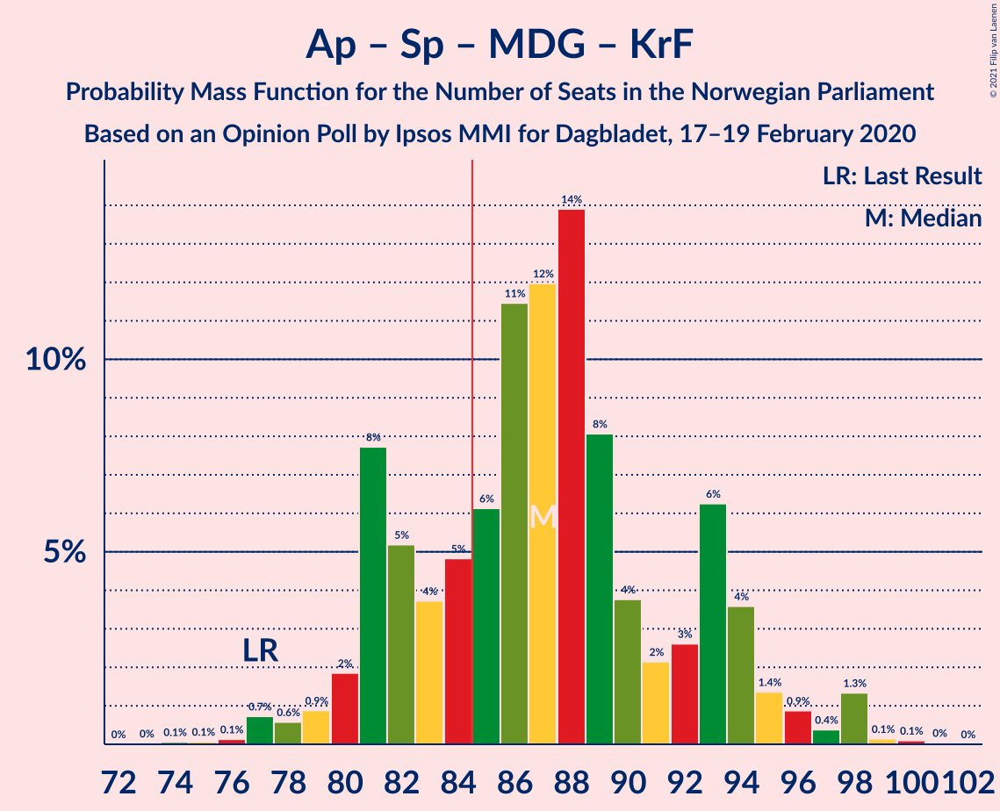

| Number of Seats | Probability | Accumulated | Special Marks |
|:---------------:|:-----------:|:-----------:|:-------------:|
| 74 | 0.1% | 100% |  |
| 75 | 0.1% | 99.9% |  |
| 76 | 0.1% | 99.8% |  |
| 77 | 0.7% | 99.7% | Last Result |
| 78 | 0.6% | 99.0% |  |
| 79 | 0.9% | 98% |  |
| 80 | 2% | 97% |  |
| 81 | 8% | 96% |  |
| 82 | 5% | 88% |  |
| 83 | 4% | 83% |  |
| 84 | 5% | 79% |  |
| 85 | 6% | 74% | Majority |
| 86 | 11% | 68% | Median |
| 87 | 12% | 57% |  |
| 88 | 14% | 45% |  |
| 89 | 8% | 31% |  |
| 90 | 4% | 23% |  |
| 91 | 2% | 19% |  |
| 92 | 3% | 17% |  |
| 93 | 6% | 14% |  |
| 94 | 4% | 8% |  |
| 95 | 1.4% | 4% |  |
| 96 | 0.9% | 3% |  |
| 97 | 0.4% | 2% |  |
| 98 | 1.3% | 2% |  |
| 99 | 0.1% | 0.3% |  |
| 100 | 0.1% | 0.2% |  |
| 101 | 0% | 0.1% |  |
| 102 | 0% | 0% |  |

### Arbeiderpartiet – Senterpartiet – Sosialistisk Venstreparti

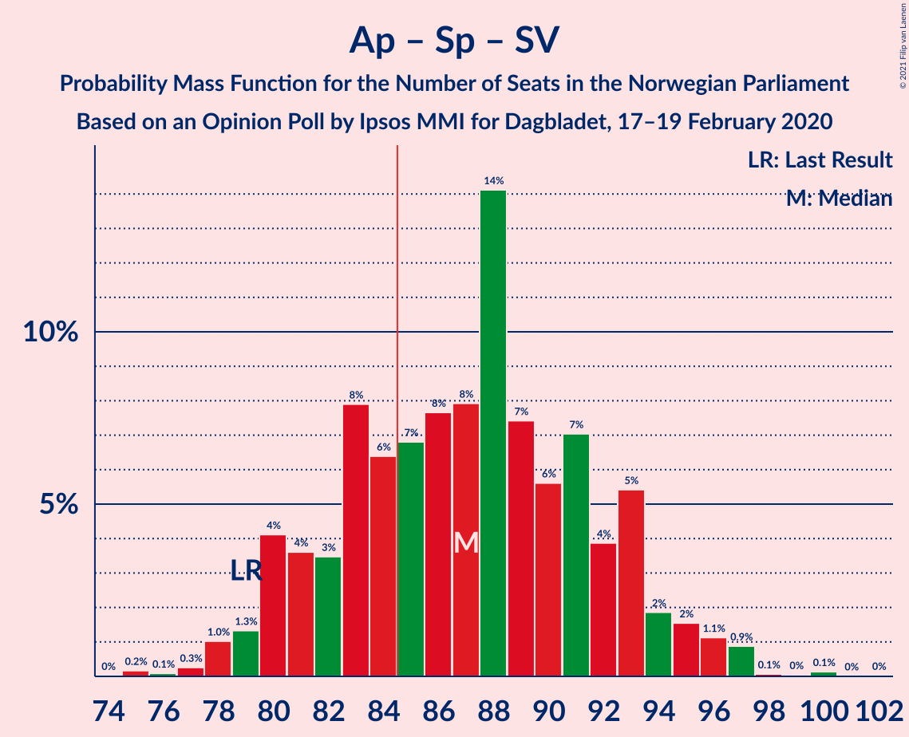

| Number of Seats | Probability | Accumulated | Special Marks |
|:---------------:|:-----------:|:-----------:|:-------------:|
| 75 | 0.2% | 100% |  |
| 76 | 0.1% | 99.8% |  |
| 77 | 0.3% | 99.7% |  |
| 78 | 1.0% | 99.4% |  |
| 79 | 1.3% | 98% | Last Result |
| 80 | 4% | 97% |  |
| 81 | 4% | 93% |  |
| 82 | 3% | 89% |  |
| 83 | 8% | 86% |  |
| 84 | 6% | 78% |  |
| 85 | 7% | 72% | Majority |
| 86 | 8% | 65% |  |
| 87 | 8% | 57% | Median |
| 88 | 14% | 49% |  |
| 89 | 7% | 35% |  |
| 90 | 6% | 28% |  |
| 91 | 7% | 22% |  |
| 92 | 4% | 15% |  |
| 93 | 5% | 11% |  |
| 94 | 2% | 6% |  |
| 95 | 2% | 4% |  |
| 96 | 1.1% | 2% |  |
| 97 | 0.9% | 1.2% |  |
| 98 | 0.1% | 0.3% |  |
| 99 | 0% | 0.2% |  |
| 100 | 0.1% | 0.2% |  |
| 101 | 0% | 0% |  |

### Arbeiderpartiet – Senterpartiet – Kristelig Folkeparti

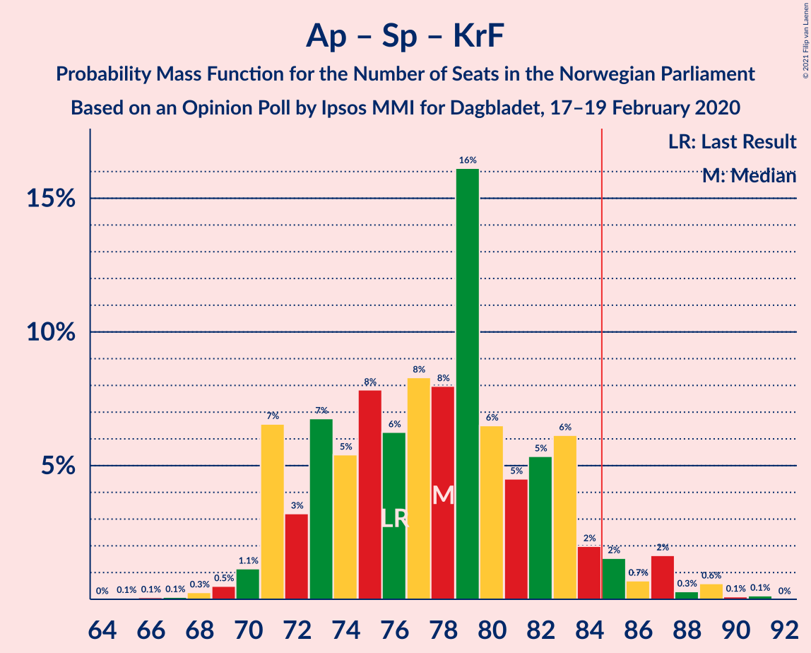

| Number of Seats | Probability | Accumulated | Special Marks |
|:---------------:|:-----------:|:-----------:|:-------------:|
| 65 | 0.1% | 100% |  |
| 66 | 0.1% | 99.9% |  |
| 67 | 0.1% | 99.9% |  |
| 68 | 0.3% | 99.8% |  |
| 69 | 0.5% | 99.5% |  |
| 70 | 1.1% | 99.0% |  |
| 71 | 7% | 98% |  |
| 72 | 3% | 91% |  |
| 73 | 7% | 88% |  |
| 74 | 5% | 81% |  |
| 75 | 8% | 76% |  |
| 76 | 6% | 68% | Last Result |
| 77 | 8% | 62% | Median |
| 78 | 8% | 54% |  |
| 79 | 16% | 46% |  |
| 80 | 6% | 29% |  |
| 81 | 5% | 23% |  |
| 82 | 5% | 18% |  |
| 83 | 6% | 13% |  |
| 84 | 2% | 7% |  |
| 85 | 2% | 5% | Majority |
| 86 | 0.7% | 3% |  |
| 87 | 2% | 3% |  |
| 88 | 0.3% | 1.1% |  |
| 89 | 0.6% | 0.8% |  |
| 90 | 0.1% | 0.3% |  |
| 91 | 0.1% | 0.2% |  |
| 92 | 0% | 0% |  |

### Høyre – Fremskrittspartiet – Miljøpartiet De Grønne – Kristelig Folkeparti – Venstre

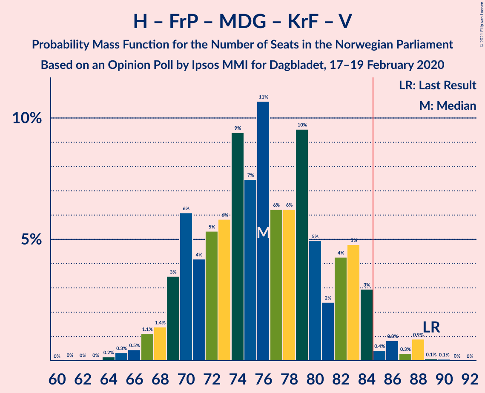

| Number of Seats | Probability | Accumulated | Special Marks |
|:---------------:|:-----------:|:-----------:|:-------------:|
| 61 | 0% | 100% |  |
| 62 | 0% | 99.9% |  |
| 63 | 0% | 99.9% |  |
| 64 | 0.2% | 99.9% |  |
| 65 | 0.3% | 99.7% |  |
| 66 | 0.5% | 99.4% |  |
| 67 | 1.1% | 98.9% |  |
| 68 | 1.4% | 98% |  |
| 69 | 3% | 96% |  |
| 70 | 6% | 93% |  |
| 71 | 4% | 87% |  |
| 72 | 5% | 83% |  |
| 73 | 6% | 77% |  |
| 74 | 9% | 72% |  |
| 75 | 7% | 62% | Median |
| 76 | 11% | 55% |  |
| 77 | 6% | 44% |  |
| 78 | 6% | 38% |  |
| 79 | 10% | 31% |  |
| 80 | 5% | 22% |  |
| 81 | 2% | 17% |  |
| 82 | 4% | 15% |  |
| 83 | 5% | 10% |  |
| 84 | 3% | 6% |  |
| 85 | 0.4% | 3% | Majority |
| 86 | 0.8% | 2% |  |
| 87 | 0.3% | 1.3% |  |
| 88 | 0.9% | 1.0% |  |
| 89 | 0.1% | 0.2% | Last Result |
| 90 | 0.1% | 0.1% |  |
| 91 | 0% | 0% |  |

### Arbeiderpartiet – Senterpartiet

| Number of Seats | Probability | Accumulated | Special Marks |
|:---------------:|:-----------:|:-----------:|:-------------:|
| 63 | 0.1% | 100% |  |
| 64 | 0.1% | 99.9% |  |
| 65 | 0.3% | 99.7% |  |
| 66 | 0.7% | 99.4% |  |
| 67 | 2% | 98.6% |  |
| 68 | 7% | 97% | Last Result |
| 69 | 4% | 90% |  |
| 70 | 6% | 86% |  |
| 71 | 6% | 80% |  |
| 72 | 10% | 75% |  |
| 73 | 10% | 65% |  |
| 74 | 9% | 55% | Median |
| 75 | 8% | 46% |  |
| 76 | 10% | 39% |  |
| 77 | 7% | 28% |  |
| 78 | 10% | 21% |  |
| 79 | 5% | 12% |  |
| 80 | 2% | 6% |  |
| 81 | 2% | 4% |  |
| 82 | 0.3% | 2% |  |
| 83 | 0.8% | 2% |  |
| 84 | 0.6% | 1.0% |  |
| 85 | 0.4% | 0.5% | Majority |
| 86 | 0.1% | 0.1% |  |
| 87 | 0% | 0% |  |

### Høyre – Fremskrittspartiet – Kristelig Folkeparti – Venstre

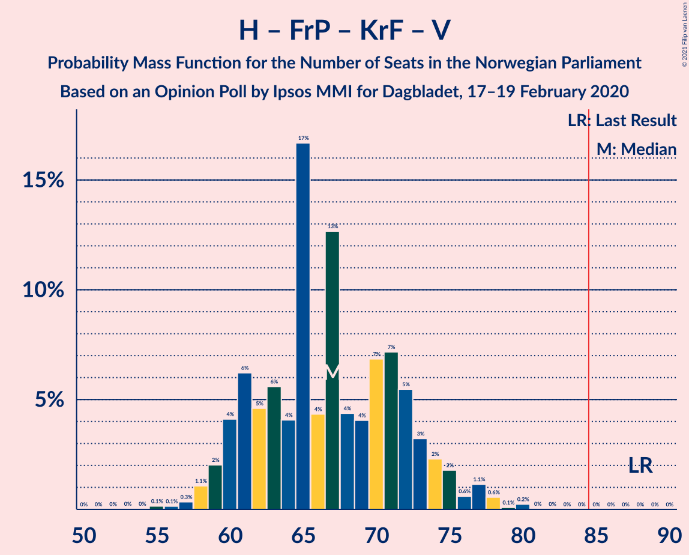

| Number of Seats | Probability | Accumulated | Special Marks |
|:---------------:|:-----------:|:-----------:|:-------------:|
| 53 | 0% | 100% |  |
| 54 | 0% | 99.9% |  |
| 55 | 0.1% | 99.9% |  |
| 56 | 0.1% | 99.8% |  |
| 57 | 0.3% | 99.6% |  |
| 58 | 1.1% | 99.3% |  |
| 59 | 2% | 98% |  |
| 60 | 4% | 96% |  |
| 61 | 6% | 92% |  |
| 62 | 5% | 86% |  |
| 63 | 6% | 81% |  |
| 64 | 4% | 76% |  |
| 65 | 17% | 72% |  |
| 66 | 4% | 55% | Median |
| 67 | 13% | 51% |  |
| 68 | 4% | 38% |  |
| 69 | 4% | 34% |  |
| 70 | 7% | 29% |  |
| 71 | 7% | 23% |  |
| 72 | 5% | 15% |  |
| 73 | 3% | 10% |  |
| 74 | 2% | 7% |  |
| 75 | 2% | 4% |  |
| 76 | 0.6% | 3% |  |
| 77 | 1.1% | 2% |  |
| 78 | 0.6% | 0.9% |  |
| 79 | 0.1% | 0.4% |  |
| 80 | 0.2% | 0.3% |  |
| 81 | 0% | 0.1% |  |
| 82 | 0% | 0% |  |
| 83 | 0% | 0% |  |
| 84 | 0% | 0% |  |
| 85 | 0% | 0% | Majority |
| 86 | 0% | 0% |  |
| 87 | 0% | 0% |  |
| 88 | 0% | 0% | Last Result |

### Høyre – Fremskrittspartiet – Venstre

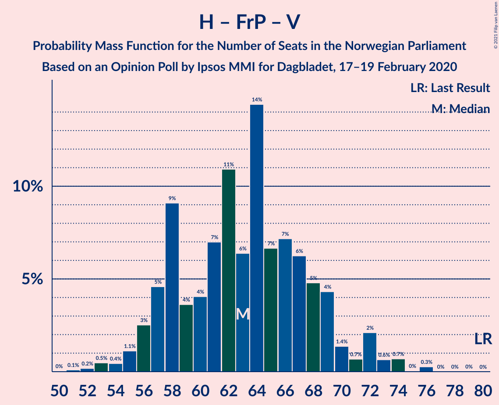

| Number of Seats | Probability | Accumulated | Special Marks |
|:---------------:|:-----------:|:-----------:|:-------------:|
| 50 | 0% | 100% |  |
| 51 | 0.1% | 99.9% |  |
| 52 | 0.2% | 99.8% |  |
| 53 | 0.5% | 99.7% |  |
| 54 | 0.4% | 99.2% |  |
| 55 | 1.1% | 98.7% |  |
| 56 | 3% | 98% |  |
| 57 | 5% | 95% |  |
| 58 | 9% | 91% |  |
| 59 | 4% | 81% |  |
| 60 | 4% | 78% |  |
| 61 | 7% | 74% |  |
| 62 | 11% | 67% |  |
| 63 | 6% | 56% | Median |
| 64 | 14% | 49% |  |
| 65 | 7% | 35% |  |
| 66 | 7% | 28% |  |
| 67 | 6% | 21% |  |
| 68 | 5% | 15% |  |
| 69 | 4% | 10% |  |
| 70 | 1.4% | 6% |  |
| 71 | 0.7% | 4% |  |
| 72 | 2% | 4% |  |
| 73 | 0.6% | 2% |  |
| 74 | 0.7% | 1.0% |  |
| 75 | 0% | 0.3% |  |
| 76 | 0.3% | 0.3% |  |
| 77 | 0% | 0% |  |
| 78 | 0% | 0% |  |
| 79 | 0% | 0% |  |
| 80 | 0% | 0% | Last Result |

### Arbeiderpartiet – Sosialistisk Venstreparti

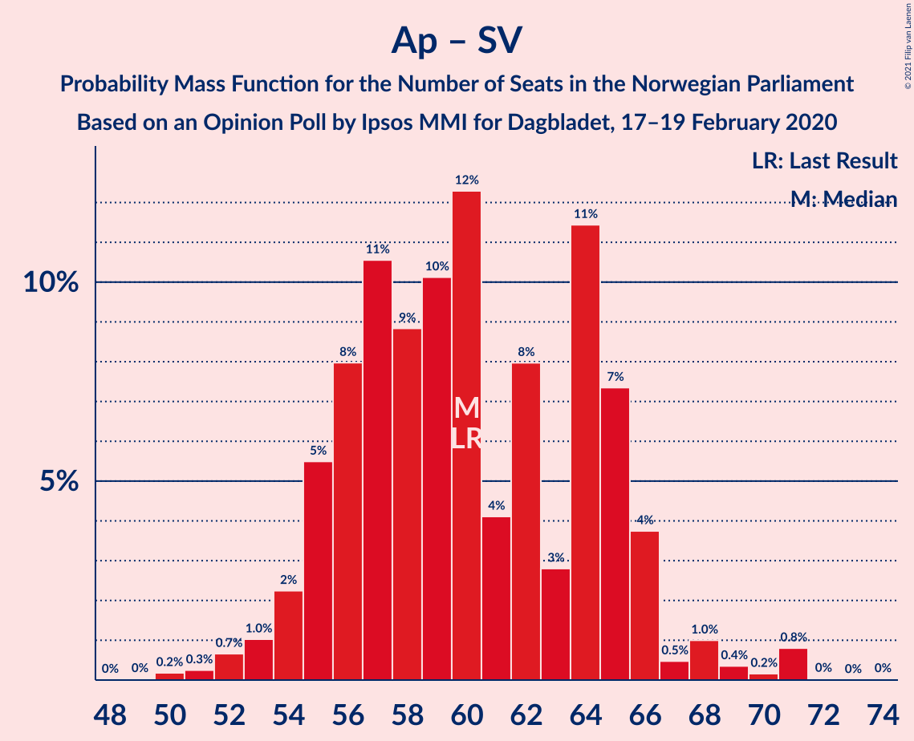

| Number of Seats | Probability | Accumulated | Special Marks |
|:---------------:|:-----------:|:-----------:|:-------------:|
| 50 | 0.2% | 100% |  |
| 51 | 0.3% | 99.8% |  |
| 52 | 0.7% | 99.5% |  |
| 53 | 1.0% | 98.9% |  |
| 54 | 2% | 98% |  |
| 55 | 5% | 96% |  |
| 56 | 8% | 90% |  |
| 57 | 11% | 82% |  |
| 58 | 9% | 72% |  |
| 59 | 10% | 63% |  |
| 60 | 12% | 53% | Last Result, Median |
| 61 | 4% | 40% |  |
| 62 | 8% | 36% |  |
| 63 | 3% | 28% |  |
| 64 | 11% | 25% |  |
| 65 | 7% | 14% |  |
| 66 | 4% | 7% |  |
| 67 | 0.5% | 3% |  |
| 68 | 1.0% | 2% |  |
| 69 | 0.4% | 1.4% |  |
| 70 | 0.2% | 1.0% |  |
| 71 | 0.8% | 0.9% |  |
| 72 | 0% | 0.1% |  |
| 73 | 0% | 0% |  |

### Høyre – Fremskrittspartiet

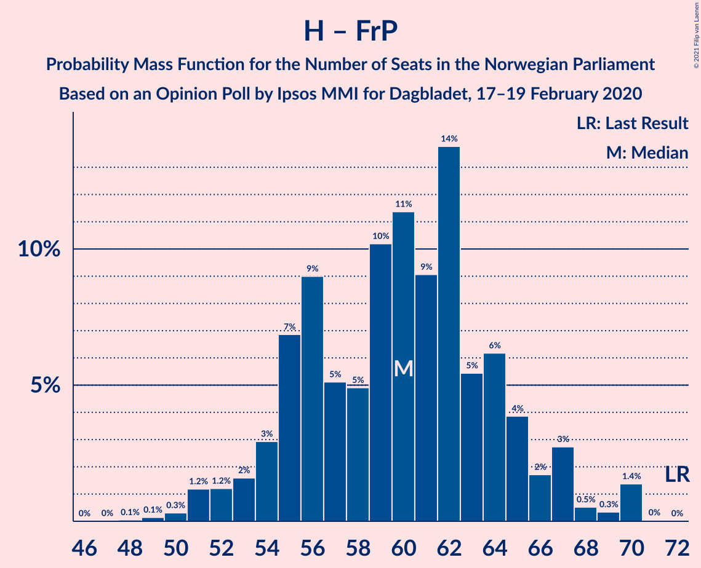

| Number of Seats | Probability | Accumulated | Special Marks |
|:---------------:|:-----------:|:-----------:|:-------------:|
| 48 | 0.1% | 100% |  |
| 49 | 0.1% | 99.9% |  |
| 50 | 0.3% | 99.8% |  |
| 51 | 1.2% | 99.5% |  |
| 52 | 1.2% | 98% |  |
| 53 | 2% | 97% |  |
| 54 | 3% | 95% |  |
| 55 | 7% | 93% |  |
| 56 | 9% | 86% |  |
| 57 | 5% | 77% |  |
| 58 | 5% | 72% |  |
| 59 | 10% | 67% |  |
| 60 | 11% | 56% |  |
| 61 | 9% | 45% | Median |
| 62 | 14% | 36% |  |
| 63 | 5% | 22% |  |
| 64 | 6% | 17% |  |
| 65 | 4% | 11% |  |
| 66 | 2% | 7% |  |
| 67 | 3% | 5% |  |
| 68 | 0.5% | 2% |  |
| 69 | 0.3% | 2% |  |
| 70 | 1.4% | 1.4% |  |
| 71 | 0% | 0.1% |  |
| 72 | 0% | 0% | Last Result |

### Høyre – Kristelig Folkeparti – Venstre

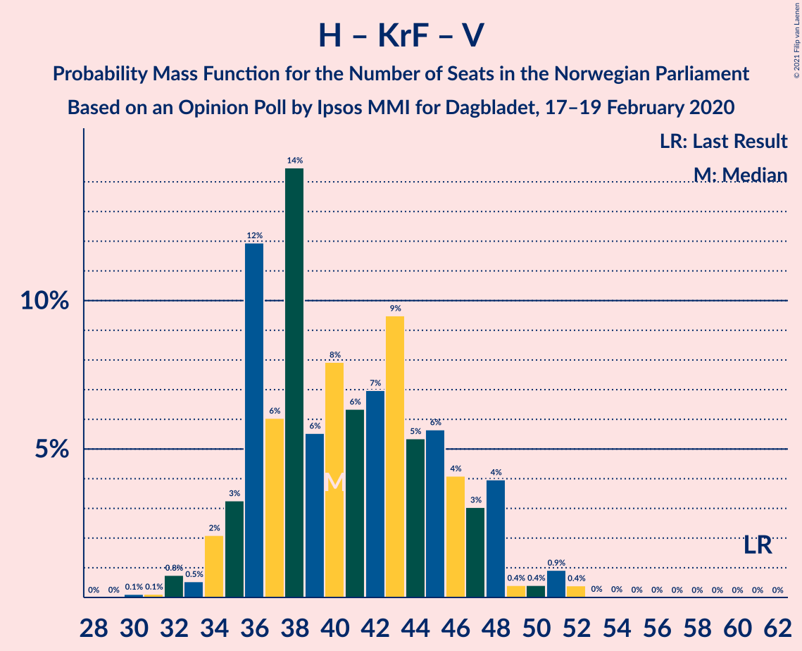

| Number of Seats | Probability | Accumulated | Special Marks |
|:---------------:|:-----------:|:-----------:|:-------------:|
| 30 | 0.1% | 100% |  |
| 31 | 0.1% | 99.9% |  |
| 32 | 0.8% | 99.7% |  |
| 33 | 0.5% | 99.0% |  |
| 34 | 2% | 98% |  |
| 35 | 3% | 96% |  |
| 36 | 12% | 93% |  |
| 37 | 6% | 81% |  |
| 38 | 14% | 75% |  |
| 39 | 6% | 61% | Median |
| 40 | 8% | 55% |  |
| 41 | 6% | 47% |  |
| 42 | 7% | 41% |  |
| 43 | 9% | 34% |  |
| 44 | 5% | 24% |  |
| 45 | 6% | 19% |  |
| 46 | 4% | 13% |  |
| 47 | 3% | 9% |  |
| 48 | 4% | 6% |  |
| 49 | 0.4% | 2% |  |
| 50 | 0.4% | 2% |  |
| 51 | 0.9% | 1.4% |  |
| 52 | 0.4% | 0.5% |  |
| 53 | 0% | 0.1% |  |
| 54 | 0% | 0.1% |  |
| 55 | 0% | 0% |  |
| 56 | 0% | 0% |  |
| 57 | 0% | 0% |  |
| 58 | 0% | 0% |  |
| 59 | 0% | 0% |  |
| 60 | 0% | 0% |  |
| 61 | 0% | 0% | Last Result |

### Senterpartiet – Kristelig Folkeparti – Venstre

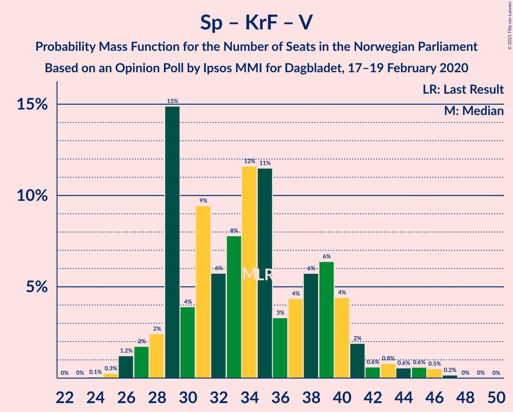

| Number of Seats | Probability | Accumulated | Special Marks |
|:---------------:|:-----------:|:-----------:|:-------------:|
| 24 | 0.1% | 100% |  |
| 25 | 0.3% | 99.9% |  |
| 26 | 1.2% | 99.7% |  |
| 27 | 2% | 98% |  |
| 28 | 2% | 97% |  |
| 29 | 15% | 94% |  |
| 30 | 4% | 79% |  |
| 31 | 9% | 75% |  |
| 32 | 6% | 66% | Median |
| 33 | 8% | 60% |  |
| 34 | 12% | 52% |  |
| 35 | 11% | 41% | Last Result |
| 36 | 3% | 29% |  |
| 37 | 4% | 26% |  |
| 38 | 6% | 22% |  |
| 39 | 6% | 16% |  |
| 40 | 4% | 10% |  |
| 41 | 2% | 5% |  |
| 42 | 0.6% | 3% |  |
| 43 | 0.8% | 3% |  |
| 44 | 0.6% | 2% |  |
| 45 | 0.6% | 1.3% |  |
| 46 | 0.5% | 0.7% |  |
| 47 | 0.2% | 0.2% |  |
| 48 | 0% | 0.1% |  |
| 49 | 0% | 0% |  |

## Technical Information

### Opinion Poll

+ **Polling firm:** Ipsos MMI
+ **Commissioner(s):** Dagbladet
+ **Fieldwork period:** 17–19 February 2020

### Calculations

+ **Sample size:** 726
+ **Simulations done:** 524,288
+ **Error estimate:** 2.79%

