# Opinion Poll by Norstat for Aftenposten and NRK, 24 February–2 March 2020

<a href="#voting-intentions">Voting Intentions</a> | <a href="#seats">Seats</a> | <a href="#coalitions">Coalitions</a> | <a href="#technical-information">Technical Information</a>

## Voting Intentions

### Confidence Intervals

| Party | Last Result | Poll Result | 80% Confidence Interval | 90% Confidence Interval | 95% Confidence Interval | 99% Confidence Interval |
|:-----:|:-----------:|:-----------:|:-----------------------:|:-----------------------:|:-----------------------:|:-----------------------:|
| Arbeiderpartiet | 27.4% | 23.8% | 21.8–25.9% |21.2–26.6% |20.7–27.1% |19.8–28.2% |
| Høyre | 25.0% | 19.9% | 18.0–21.9% |17.5–22.5% |17.0–23.0% |16.2–24.0% |
| Senterpartiet | 10.3% | 16.4% | 14.7–18.3% |14.2–18.9% |13.8–19.3% |13.0–20.3% |
| Fremskrittspartiet | 15.2% | 13.2% | 11.7–15.0% |11.2–15.5% |10.9–15.9% |10.2–16.8% |
| Sosialistisk Venstreparti | 6.0% | 8.4% | 7.2–9.9% |6.8–10.3% |6.6–10.7% |6.0–11.5% |
| Miljøpartiet De Grønne | 3.2% | 4.9% | 4.0–6.2% |3.8–6.5% |3.6–6.8% |3.2–7.5% |
| Rødt | 2.4% | 4.6% | 3.7–5.8% |3.5–6.2% |3.3–6.5% |2.9–7.1% |
| Kristelig Folkeparti | 4.2% | 4.1% | 3.2–5.2% |3.0–5.5% |2.8–5.8% |2.5–6.4% |
| Venstre | 4.4% | 2.8% | 2.1–3.7% |1.9–4.0% |1.8–4.3% |1.5–4.8% |

*Note:* The poll result column reflects the actual value used in the calculations. Published results may vary slightly, and in addition be rounded to fewer digits.

## Seats

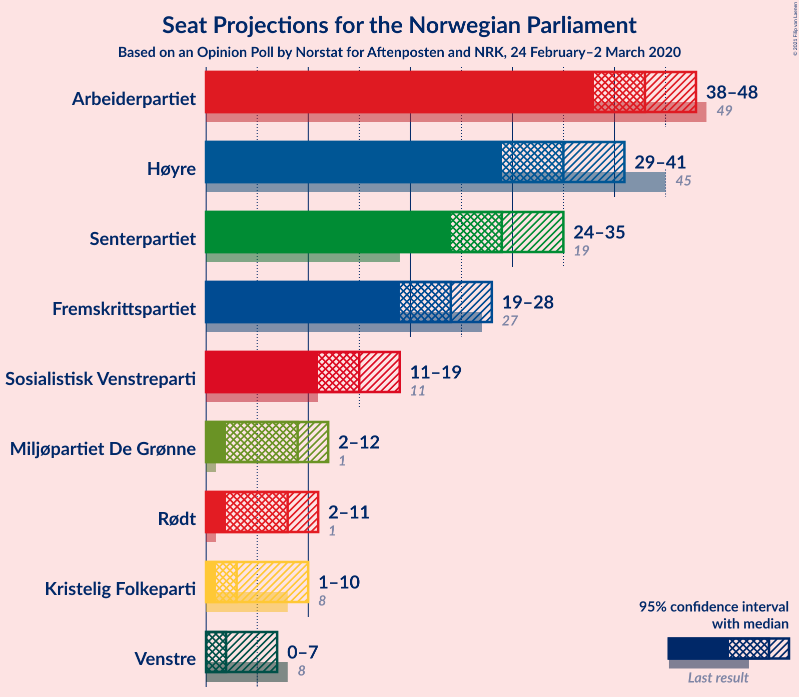

### Confidence Intervals

| Party | Last Result | Median | 80% Confidence Interval | 90% Confidence Interval | 95% Confidence Interval | 99% Confidence Interval |
|:-----:|:-----------:|:------:|:-----------------------:|:-----------------------:|:-----------------------:|:-----------------------:|
| <a href="#arbeiderpartiet">Arbeiderpartiet</a> | 49 | 43 | 40–46 |39–47 |38–48 |36–51 |
| <a href="#høyre">Høyre</a> | 45 | 35 | 31–38 |30–40 |29–41 |28–43 |
| <a href="#senterpartiet">Senterpartiet</a> | 19 | 29 | 26–33 |25–34 |24–35 |23–37 |
| <a href="#fremskrittspartiet">Fremskrittspartiet</a> | 27 | 24 | 20–26 |19–27 |19–28 |17–30 |
| <a href="#sosialistisk-venstreparti">Sosialistisk Venstreparti</a> | 11 | 15 | 12–18 |12–18 |11–19 |10–20 |
| <a href="#miljøpartiet-de-grønne">Miljøpartiet De Grønne</a> | 1 | 9 | 3–11 |2–11 |2–12 |2–13 |
| <a href="#rødt">Rødt</a> | 1 | 8 | 2–10 |2–11 |2–11 |2–12 |
| <a href="#kristelig-folkeparti">Kristelig Folkeparti</a> | 8 | 3 | 1–9 |1–10 |1–10 |1–11 |
| <a href="#venstre">Venstre</a> | 8 | 2 | 1–2 |1–3 |0–7 |0–8 |

### Arbeiderpartiet

*For a full overview of the results for this party, see the [Arbeiderpartiet](party-arbeiderpartiet.html) page.*

| Number of Seats | Probability | Accumulated | Special Marks |
|:---------------:|:-----------:|:-----------:|:-------------:|
| 34 | 0.1% | 100% |  |
| 35 | 0.2% | 99.9% |  |
| 36 | 0.6% | 99.7% |  |
| 37 | 1.4% | 99.1% |  |
| 38 | 2% | 98% |  |
| 39 | 3% | 96% |  |
| 40 | 9% | 93% |  |
| 41 | 7% | 84% |  |
| 42 | 15% | 77% |  |
| 43 | 15% | 62% | Median |
| 44 | 21% | 47% |  |
| 45 | 11% | 26% |  |
| 46 | 9% | 15% |  |
| 47 | 2% | 6% |  |
| 48 | 3% | 5% |  |
| 49 | 0.9% | 2% | Last Result |
| 50 | 0.6% | 1.2% |  |
| 51 | 0.2% | 0.6% |  |
| 52 | 0.2% | 0.4% |  |
| 53 | 0.1% | 0.2% |  |
| 54 | 0% | 0% |  |

### Høyre

*For a full overview of the results for this party, see the [Høyre](party-høyre.html) page.*

| Number of Seats | Probability | Accumulated | Special Marks |
|:---------------:|:-----------:|:-----------:|:-------------:|
| 26 | 0.1% | 100% |  |
| 27 | 0.3% | 99.9% |  |
| 28 | 0.5% | 99.5% |  |
| 29 | 2% | 99.0% |  |
| 30 | 4% | 97% |  |
| 31 | 4% | 93% |  |
| 32 | 7% | 88% |  |
| 33 | 7% | 81% |  |
| 34 | 11% | 74% |  |
| 35 | 19% | 63% | Median |
| 36 | 13% | 45% |  |
| 37 | 15% | 32% |  |
| 38 | 7% | 17% |  |
| 39 | 4% | 10% |  |
| 40 | 3% | 6% |  |
| 41 | 2% | 3% |  |
| 42 | 0.7% | 1.5% |  |
| 43 | 0.5% | 0.8% |  |
| 44 | 0.2% | 0.3% |  |
| 45 | 0.1% | 0.1% | Last Result |
| 46 | 0% | 0% |  |

### Senterpartiet

*For a full overview of the results for this party, see the [Senterpartiet](party-senterpartiet.html) page.*

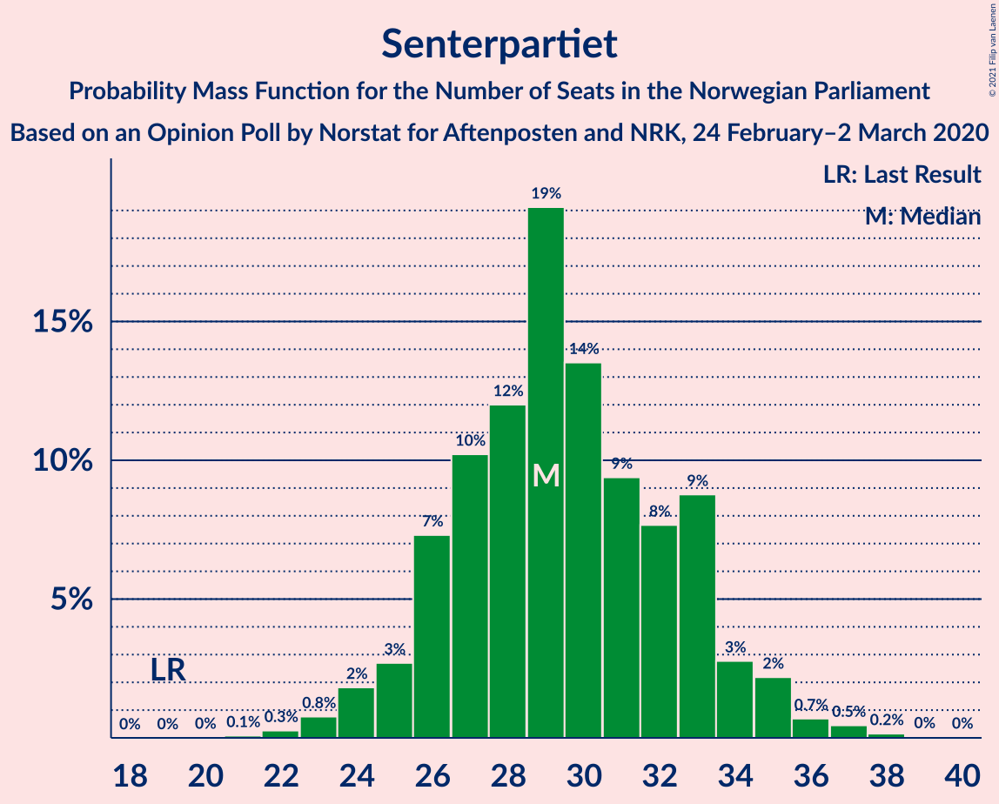

| Number of Seats | Probability | Accumulated | Special Marks |
|:---------------:|:-----------:|:-----------:|:-------------:|
| 19 | 0% | 100% | Last Result |
| 20 | 0% | 100% |  |
| 21 | 0.1% | 100% |  |
| 22 | 0.3% | 99.9% |  |
| 23 | 0.8% | 99.6% |  |
| 24 | 2% | 98.9% |  |
| 25 | 3% | 97% |  |
| 26 | 7% | 94% |  |
| 27 | 10% | 87% |  |
| 28 | 12% | 77% |  |
| 29 | 19% | 65% | Median |
| 30 | 14% | 46% |  |
| 31 | 9% | 32% |  |
| 32 | 8% | 23% |  |
| 33 | 9% | 15% |  |
| 34 | 3% | 6% |  |
| 35 | 2% | 4% |  |
| 36 | 0.7% | 1.4% |  |
| 37 | 0.5% | 0.7% |  |
| 38 | 0.2% | 0.2% |  |
| 39 | 0% | 0.1% |  |
| 40 | 0% | 0% |  |

### Fremskrittspartiet

*For a full overview of the results for this party, see the [Fremskrittspartiet](party-fremskrittspartiet.html) page.*

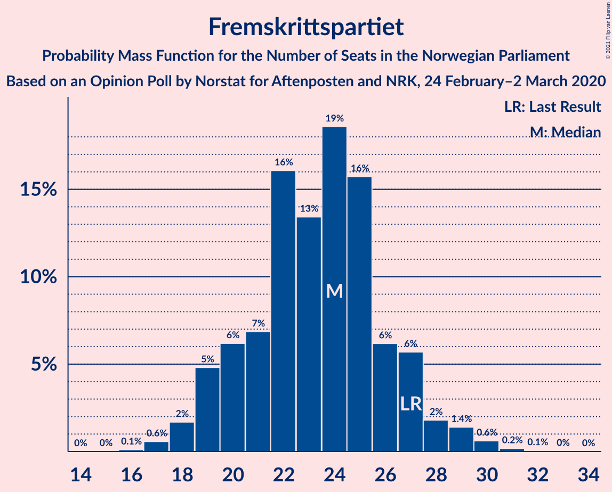

| Number of Seats | Probability | Accumulated | Special Marks |
|:---------------:|:-----------:|:-----------:|:-------------:|
| 16 | 0.1% | 100% |  |
| 17 | 0.6% | 99.9% |  |
| 18 | 2% | 99.3% |  |
| 19 | 5% | 98% |  |
| 20 | 6% | 93% |  |
| 21 | 7% | 87% |  |
| 22 | 16% | 80% |  |
| 23 | 13% | 64% |  |
| 24 | 19% | 50% | Median |
| 25 | 16% | 32% |  |
| 26 | 6% | 16% |  |
| 27 | 6% | 10% | Last Result |
| 28 | 2% | 4% |  |
| 29 | 1.4% | 2% |  |
| 30 | 0.6% | 0.9% |  |
| 31 | 0.2% | 0.3% |  |
| 32 | 0.1% | 0.1% |  |
| 33 | 0% | 0% |  |

### Sosialistisk Venstreparti

*For a full overview of the results for this party, see the [Sosialistisk Venstreparti](party-sosialistiskvenstreparti.html) page.*

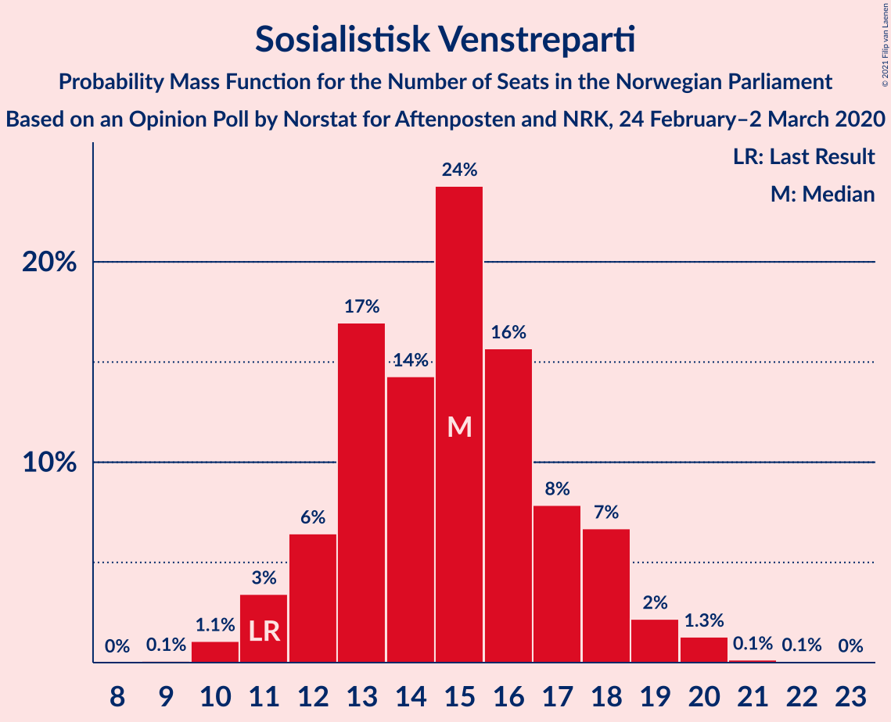

| Number of Seats | Probability | Accumulated | Special Marks |
|:---------------:|:-----------:|:-----------:|:-------------:|
| 9 | 0.1% | 100% |  |
| 10 | 1.1% | 99.9% |  |
| 11 | 3% | 98.8% | Last Result |
| 12 | 6% | 95% |  |
| 13 | 17% | 89% |  |
| 14 | 14% | 72% |  |
| 15 | 24% | 58% | Median |
| 16 | 16% | 34% |  |
| 17 | 8% | 18% |  |
| 18 | 7% | 10% |  |
| 19 | 2% | 4% |  |
| 20 | 1.3% | 2% |  |
| 21 | 0.1% | 0.2% |  |
| 22 | 0.1% | 0.1% |  |
| 23 | 0% | 0% |  |

### Miljøpartiet De Grønne

*For a full overview of the results for this party, see the [Miljøpartiet De Grønne](party-miljøpartietdegrønne.html) page.*

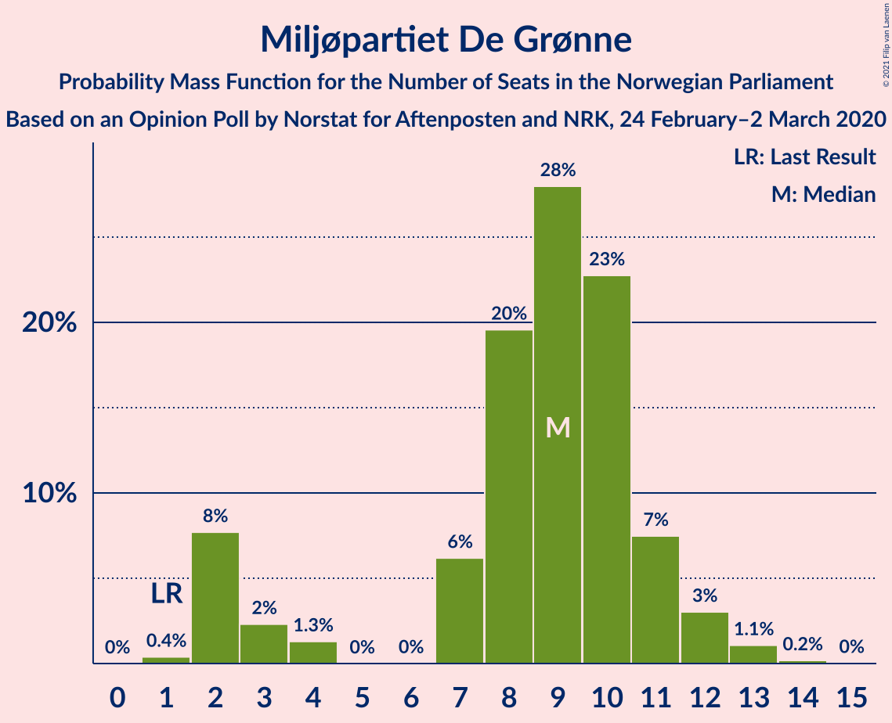

| Number of Seats | Probability | Accumulated | Special Marks |
|:---------------:|:-----------:|:-----------:|:-------------:|
| 1 | 0.4% | 100% | Last Result |
| 2 | 8% | 99.6% |  |
| 3 | 2% | 92% |  |
| 4 | 1.3% | 90% |  |
| 5 | 0% | 88% |  |
| 6 | 0% | 88% |  |
| 7 | 6% | 88% |  |
| 8 | 20% | 82% |  |
| 9 | 28% | 63% | Median |
| 10 | 23% | 35% |  |
| 11 | 7% | 12% |  |
| 12 | 3% | 4% |  |
| 13 | 1.1% | 1.3% |  |
| 14 | 0.2% | 0.2% |  |
| 15 | 0% | 0% |  |

### Rødt

*For a full overview of the results for this party, see the [Rødt](party-rødt.html) page.*

| Number of Seats | Probability | Accumulated | Special Marks |
|:---------------:|:-----------:|:-----------:|:-------------:|
| 1 | 0.3% | 100% | Last Result |
| 2 | 15% | 99.7% |  |
| 3 | 0% | 85% |  |
| 4 | 0% | 85% |  |
| 5 | 0% | 85% |  |
| 6 | 0.4% | 85% |  |
| 7 | 15% | 84% |  |
| 8 | 28% | 70% | Median |
| 9 | 26% | 42% |  |
| 10 | 10% | 17% |  |
| 11 | 4% | 6% |  |
| 12 | 2% | 2% |  |
| 13 | 0.2% | 0.3% |  |
| 14 | 0.1% | 0.1% |  |
| 15 | 0% | 0% |  |

### Kristelig Folkeparti

*For a full overview of the results for this party, see the [Kristelig Folkeparti](party-kristeligfolkeparti.html) page.*

| Number of Seats | Probability | Accumulated | Special Marks |
|:---------------:|:-----------:|:-----------:|:-------------:|
| 0 | 0.2% | 100% |  |
| 1 | 10% | 99.8% |  |
| 2 | 4% | 90% |  |
| 3 | 41% | 85% | Median |
| 4 | 0% | 45% |  |
| 5 | 0% | 45% |  |
| 6 | 0.1% | 45% |  |
| 7 | 11% | 45% |  |
| 8 | 18% | 33% | Last Result |
| 9 | 9% | 15% |  |
| 10 | 4% | 6% |  |
| 11 | 1.1% | 1.3% |  |
| 12 | 0.2% | 0.2% |  |
| 13 | 0% | 0% |  |

### Venstre

*For a full overview of the results for this party, see the [Venstre](party-venstre.html) page.*

| Number of Seats | Probability | Accumulated | Special Marks |
|:---------------:|:-----------:|:-----------:|:-------------:|
| 0 | 4% | 100% |  |
| 1 | 19% | 96% |  |
| 2 | 72% | 78% | Median |
| 3 | 1.1% | 6% |  |
| 4 | 0% | 4% |  |
| 5 | 0% | 4% |  |
| 6 | 0.2% | 4% |  |
| 7 | 3% | 4% |  |
| 8 | 1.1% | 1.3% | Last Result |
| 9 | 0.2% | 0.2% |  |
| 10 | 0% | 0% |  |

## Coalitions

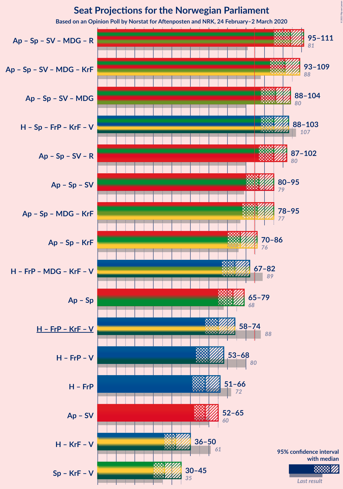

### Confidence Intervals

| Coalition | Last Result | Median | Majority? | 80% Confidence Interval | 90% Confidence Interval | 95% Confidence Interval | 99% Confidence Interval |
|:---------:|:-----------:|:------:|:---------:|:-----------------------:|:-----------------------:|:-----------------------:|:-----------------------:|
| Arbeiderpartiet – Senterpartiet – Sosialistisk Venstreparti – Miljøpartiet De Grønne – Rødt | 81 | 104 | 100% | 98–108 | 96–109 | 95–111 | 93–112 |
| Arbeiderpartiet – Senterpartiet – Sosialistisk Venstreparti – Miljøpartiet De Grønne – Kristelig Folkeparti | 88 | 101 | 100% | 97–106 | 95–108 | 93–109 | 90–111 |
| Arbeiderpartiet – Senterpartiet – Sosialistisk Venstreparti – Miljøpartiet De Grønne | 80 | 96 | 99.7% | 90–101 | 89–103 | 88–104 | 85–106 |
| Høyre – Senterpartiet – Fremskrittspartiet – Kristelig Folkeparti – Venstre | 107 | 95 | 99.9% | 90–100 | 89–102 | 88–103 | 86–106 |
| Arbeiderpartiet – Senterpartiet – Sosialistisk Venstreparti – Rødt | 80 | 95 | 99.3% | 90–100 | 88–101 | 87–102 | 84–104 |
| Arbeiderpartiet – Senterpartiet – Sosialistisk Venstreparti | 79 | 87 | 83% | 82–92 | 81–94 | 80–95 | 78–97 |
| Arbeiderpartiet – Senterpartiet – Miljøpartiet De Grønne – Kristelig Folkeparti | 77 | 86 | 60% | 81–92 | 79–93 | 78–95 | 76–96 |
| Arbeiderpartiet – Senterpartiet – Kristelig Folkeparti | 76 | 77 | 7% | 72–83 | 71–85 | 70–86 | 68–88 |
| Høyre – Fremskrittspartiet – Miljøpartiet De Grønne – Kristelig Folkeparti – Venstre | 89 | 74 | 0.7% | 69–79 | 68–81 | 67–82 | 64–85 |
| Arbeiderpartiet – Senterpartiet | 68 | 73 | 0.1% | 68–77 | 66–78 | 65–79 | 63–82 |
| Høyre – Fremskrittspartiet – Kristelig Folkeparti – Venstre | 88 | 65 | 0% | 61–71 | 60–73 | 58–74 | 57–76 |
| Høyre – Fremskrittspartiet – Venstre | 80 | 60 | 0% | 55–65 | 54–67 | 53–68 | 51–71 |
| Høyre – Fremskrittspartiet | 72 | 58 | 0% | 53–63 | 53–65 | 51–66 | 49–69 |
| Arbeiderpartiet – Sosialistisk Venstreparti | 60 | 58 | 0% | 55–62 | 53–63 | 52–65 | 50–66 |
| Høyre – Kristelig Folkeparti – Venstre | 61 | 42 | 0% | 38–47 | 37–49 | 36–50 | 34–53 |
| Senterpartiet – Kristelig Folkeparti – Venstre | 35 | 36 | 0% | 31–42 | 31–44 | 30–45 | 28–47 |

### Arbeiderpartiet – Senterpartiet – Sosialistisk Venstreparti – Miljøpartiet De Grønne – Rødt

| Number of Seats | Probability | Accumulated | Special Marks |
|:---------------:|:-----------:|:-----------:|:-------------:|
| 81 | 0% | 100% | Last Result |
| 82 | 0% | 100% |  |
| 83 | 0% | 100% |  |
| 84 | 0% | 100% |  |
| 85 | 0% | 100% | Majority |
| 86 | 0% | 100% |  |
| 87 | 0% | 100% |  |
| 88 | 0% | 100% |  |
| 89 | 0% | 100% |  |
| 90 | 0.1% | 99.9% |  |
| 91 | 0.1% | 99.8% |  |
| 92 | 0.2% | 99.8% |  |
| 93 | 0.6% | 99.6% |  |
| 94 | 0.9% | 99.0% |  |
| 95 | 1.1% | 98% |  |
| 96 | 3% | 97% |  |
| 97 | 2% | 94% |  |
| 98 | 5% | 92% |  |
| 99 | 6% | 87% |  |
| 100 | 4% | 81% |  |
| 101 | 4% | 77% |  |
| 102 | 11% | 73% |  |
| 103 | 9% | 62% |  |
| 104 | 9% | 52% | Median |
| 105 | 10% | 43% |  |
| 106 | 6% | 33% |  |
| 107 | 17% | 28% |  |
| 108 | 2% | 11% |  |
| 109 | 4% | 9% |  |
| 110 | 1.2% | 5% |  |
| 111 | 2% | 3% |  |
| 112 | 1.2% | 2% |  |
| 113 | 0.2% | 0.4% |  |
| 114 | 0.1% | 0.2% |  |
| 115 | 0% | 0.1% |  |
| 116 | 0% | 0% |  |

### Arbeiderpartiet – Senterpartiet – Sosialistisk Venstreparti – Miljøpartiet De Grønne – Kristelig Folkeparti

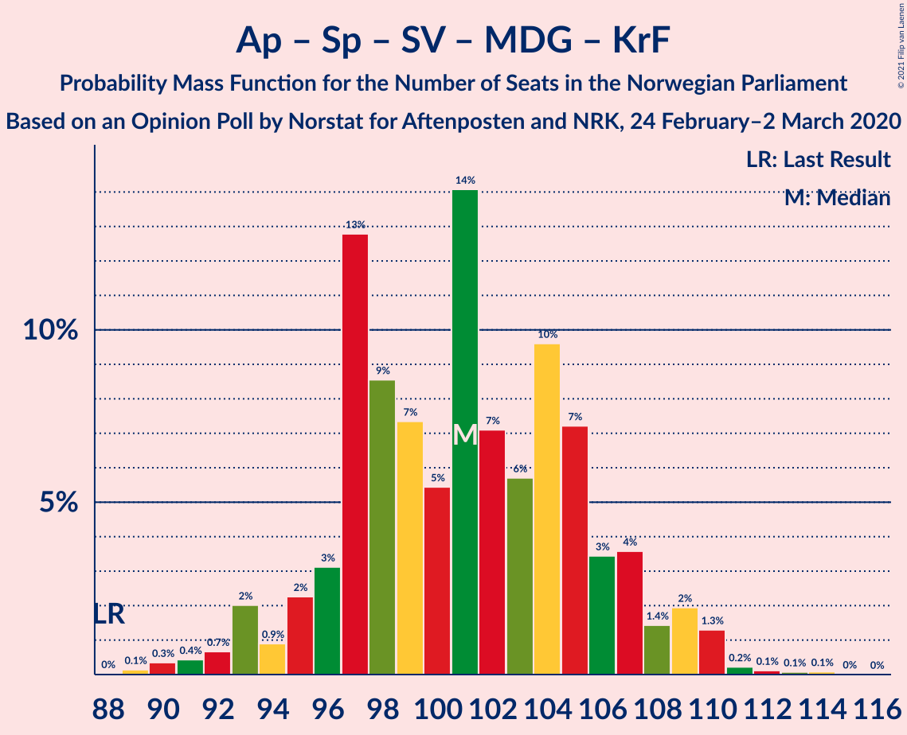

| Number of Seats | Probability | Accumulated | Special Marks |
|:---------------:|:-----------:|:-----------:|:-------------:|
| 88 | 0% | 100% | Last Result |
| 89 | 0.1% | 99.9% |  |
| 90 | 0.3% | 99.8% |  |
| 91 | 0.4% | 99.5% |  |
| 92 | 0.7% | 99.0% |  |
| 93 | 2% | 98% |  |
| 94 | 0.9% | 96% |  |
| 95 | 2% | 95% |  |
| 96 | 3% | 93% |  |
| 97 | 13% | 90% |  |
| 98 | 9% | 77% |  |
| 99 | 7% | 69% | Median |
| 100 | 5% | 61% |  |
| 101 | 14% | 56% |  |
| 102 | 7% | 42% |  |
| 103 | 6% | 35% |  |
| 104 | 10% | 29% |  |
| 105 | 7% | 19% |  |
| 106 | 3% | 12% |  |
| 107 | 4% | 9% |  |
| 108 | 1.4% | 5% |  |
| 109 | 2% | 4% |  |
| 110 | 1.3% | 2% |  |
| 111 | 0.2% | 0.5% |  |
| 112 | 0.1% | 0.3% |  |
| 113 | 0.1% | 0.2% |  |
| 114 | 0.1% | 0.1% |  |
| 115 | 0% | 0% |  |

### Arbeiderpartiet – Senterpartiet – Sosialistisk Venstreparti – Miljøpartiet De Grønne

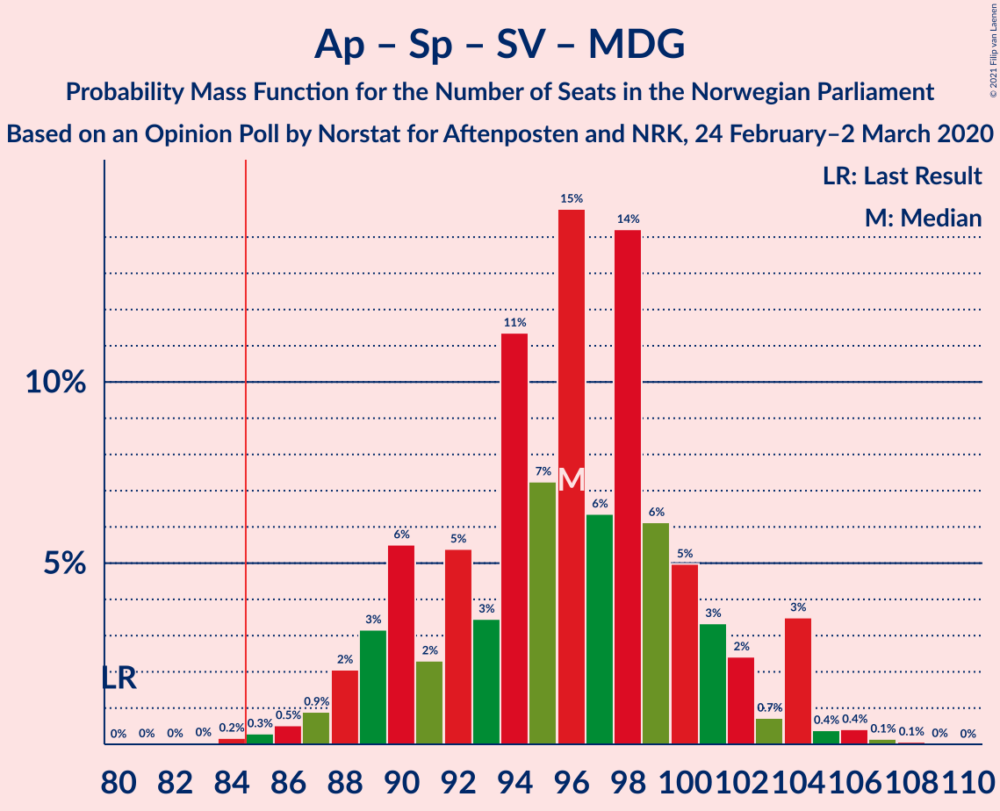

| Number of Seats | Probability | Accumulated | Special Marks |
|:---------------:|:-----------:|:-----------:|:-------------:|
| 80 | 0% | 100% | Last Result |
| 81 | 0% | 100% |  |
| 82 | 0% | 100% |  |
| 83 | 0% | 100% |  |
| 84 | 0.2% | 99.9% |  |
| 85 | 0.3% | 99.7% | Majority |
| 86 | 0.5% | 99.4% |  |
| 87 | 0.9% | 98.9% |  |
| 88 | 2% | 98% |  |
| 89 | 3% | 96% |  |
| 90 | 6% | 93% |  |
| 91 | 2% | 87% |  |
| 92 | 5% | 85% |  |
| 93 | 3% | 80% |  |
| 94 | 11% | 76% |  |
| 95 | 7% | 65% |  |
| 96 | 15% | 58% | Median |
| 97 | 6% | 43% |  |
| 98 | 14% | 36% |  |
| 99 | 6% | 22% |  |
| 100 | 5% | 16% |  |
| 101 | 3% | 11% |  |
| 102 | 2% | 8% |  |
| 103 | 0.7% | 5% |  |
| 104 | 3% | 5% |  |
| 105 | 0.4% | 1.1% |  |
| 106 | 0.4% | 0.7% |  |
| 107 | 0.1% | 0.3% |  |
| 108 | 0.1% | 0.1% |  |
| 109 | 0% | 0.1% |  |
| 110 | 0% | 0% |  |

### Høyre – Senterpartiet – Fremskrittspartiet – Kristelig Folkeparti – Venstre

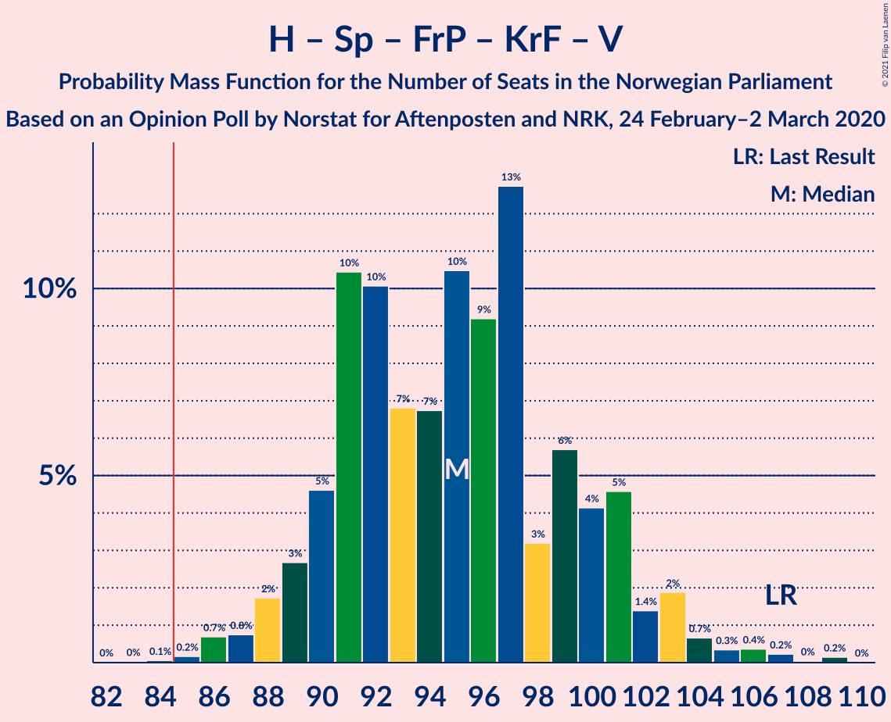

| Number of Seats | Probability | Accumulated | Special Marks |
|:---------------:|:-----------:|:-----------:|:-------------:|
| 83 | 0% | 100% |  |
| 84 | 0.1% | 99.9% |  |
| 85 | 0.2% | 99.9% | Majority |
| 86 | 0.7% | 99.7% |  |
| 87 | 0.8% | 99.0% |  |
| 88 | 2% | 98% |  |
| 89 | 3% | 97% |  |
| 90 | 5% | 94% |  |
| 91 | 10% | 89% |  |
| 92 | 10% | 79% |  |
| 93 | 7% | 69% | Median |
| 94 | 7% | 62% |  |
| 95 | 10% | 55% |  |
| 96 | 9% | 45% |  |
| 97 | 13% | 35% |  |
| 98 | 3% | 23% |  |
| 99 | 6% | 20% |  |
| 100 | 4% | 14% |  |
| 101 | 5% | 10% |  |
| 102 | 1.4% | 5% |  |
| 103 | 2% | 4% |  |
| 104 | 0.7% | 2% |  |
| 105 | 0.3% | 1.2% |  |
| 106 | 0.4% | 0.8% |  |
| 107 | 0.2% | 0.5% | Last Result |
| 108 | 0% | 0.2% |  |
| 109 | 0.2% | 0.2% |  |
| 110 | 0% | 0% |  |

### Arbeiderpartiet – Senterpartiet – Sosialistisk Venstreparti – Rødt

| Number of Seats | Probability | Accumulated | Special Marks |
|:---------------:|:-----------:|:-----------:|:-------------:|
| 80 | 0% | 100% | Last Result |
| 81 | 0% | 100% |  |
| 82 | 0.1% | 99.9% |  |
| 83 | 0.1% | 99.9% |  |
| 84 | 0.4% | 99.8% |  |
| 85 | 0.5% | 99.3% | Majority |
| 86 | 1.1% | 98.8% |  |
| 87 | 2% | 98% |  |
| 88 | 1.3% | 96% |  |
| 89 | 3% | 95% |  |
| 90 | 4% | 92% |  |
| 91 | 5% | 88% |  |
| 92 | 5% | 83% |  |
| 93 | 11% | 78% |  |
| 94 | 9% | 67% |  |
| 95 | 11% | 58% | Median |
| 96 | 7% | 47% |  |
| 97 | 19% | 40% |  |
| 98 | 6% | 22% |  |
| 99 | 5% | 16% |  |
| 100 | 4% | 11% |  |
| 101 | 4% | 7% |  |
| 102 | 1.4% | 3% |  |
| 103 | 0.7% | 2% |  |
| 104 | 0.5% | 0.9% |  |
| 105 | 0.2% | 0.5% |  |
| 106 | 0.2% | 0.3% |  |
| 107 | 0.1% | 0.2% |  |
| 108 | 0% | 0.1% |  |
| 109 | 0% | 0% |  |

### Arbeiderpartiet – Senterpartiet – Sosialistisk Venstreparti

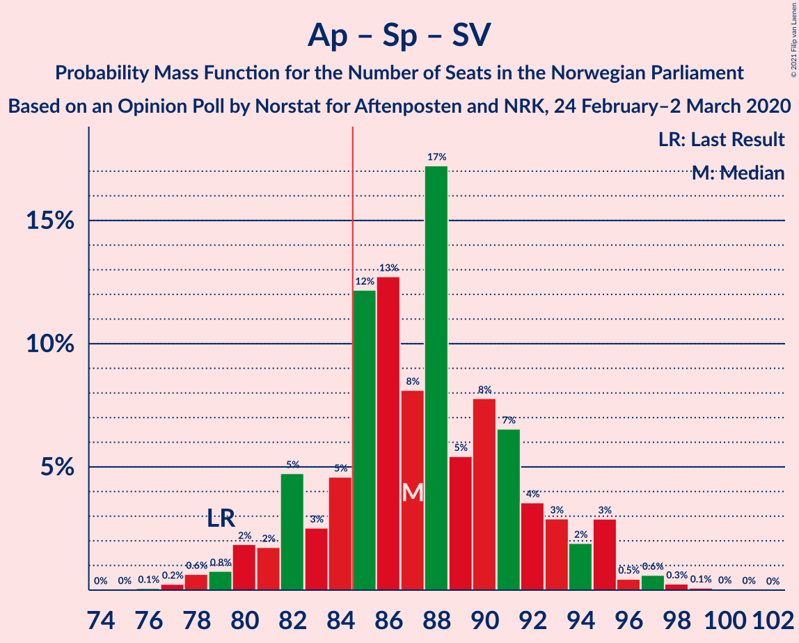

| Number of Seats | Probability | Accumulated | Special Marks |
|:---------------:|:-----------:|:-----------:|:-------------:|
| 75 | 0% | 100% |  |
| 76 | 0.1% | 99.9% |  |
| 77 | 0.2% | 99.9% |  |
| 78 | 0.6% | 99.6% |  |
| 79 | 0.8% | 99.0% | Last Result |
| 80 | 2% | 98% |  |
| 81 | 2% | 96% |  |
| 82 | 5% | 95% |  |
| 83 | 3% | 90% |  |
| 84 | 5% | 87% |  |
| 85 | 12% | 83% | Majority |
| 86 | 13% | 71% |  |
| 87 | 8% | 58% | Median |
| 88 | 17% | 50% |  |
| 89 | 5% | 32% |  |
| 90 | 8% | 27% |  |
| 91 | 7% | 19% |  |
| 92 | 4% | 13% |  |
| 93 | 3% | 9% |  |
| 94 | 2% | 6% |  |
| 95 | 3% | 4% |  |
| 96 | 0.5% | 2% |  |
| 97 | 0.6% | 1.1% |  |
| 98 | 0.3% | 0.4% |  |
| 99 | 0.1% | 0.2% |  |
| 100 | 0% | 0.1% |  |
| 101 | 0% | 0% |  |

### Arbeiderpartiet – Senterpartiet – Miljøpartiet De Grønne – Kristelig Folkeparti

| Number of Seats | Probability | Accumulated | Special Marks |
|:---------------:|:-----------:|:-----------:|:-------------:|
| 72 | 0% | 100% |  |
| 73 | 0% | 99.9% |  |
| 74 | 0.2% | 99.9% |  |
| 75 | 0.2% | 99.7% |  |
| 76 | 0.7% | 99.5% |  |
| 77 | 0.5% | 98.8% | Last Result |
| 78 | 2% | 98% |  |
| 79 | 2% | 96% |  |
| 80 | 2% | 94% |  |
| 81 | 5% | 92% |  |
| 82 | 6% | 88% |  |
| 83 | 7% | 82% |  |
| 84 | 15% | 75% | Median |
| 85 | 3% | 60% | Majority |
| 86 | 16% | 57% |  |
| 87 | 4% | 41% |  |
| 88 | 8% | 37% |  |
| 89 | 7% | 29% |  |
| 90 | 5% | 22% |  |
| 91 | 6% | 16% |  |
| 92 | 4% | 10% |  |
| 93 | 2% | 6% |  |
| 94 | 2% | 4% |  |
| 95 | 0.7% | 3% |  |
| 96 | 2% | 2% |  |
| 97 | 0.2% | 0.5% |  |
| 98 | 0.1% | 0.3% |  |
| 99 | 0.1% | 0.1% |  |
| 100 | 0% | 0% |  |

### Arbeiderpartiet – Senterpartiet – Kristelig Folkeparti

| Number of Seats | Probability | Accumulated | Special Marks |
|:---------------:|:-----------:|:-----------:|:-------------:|
| 65 | 0.1% | 100% |  |
| 66 | 0.1% | 99.9% |  |
| 67 | 0.2% | 99.9% |  |
| 68 | 0.8% | 99.7% |  |
| 69 | 1.1% | 98.9% |  |
| 70 | 1.5% | 98% |  |
| 71 | 4% | 96% |  |
| 72 | 2% | 92% |  |
| 73 | 4% | 90% |  |
| 74 | 5% | 86% |  |
| 75 | 12% | 81% | Median |
| 76 | 14% | 68% | Last Result |
| 77 | 5% | 55% |  |
| 78 | 9% | 49% |  |
| 79 | 7% | 40% |  |
| 80 | 7% | 33% |  |
| 81 | 6% | 26% |  |
| 82 | 5% | 20% |  |
| 83 | 5% | 15% |  |
| 84 | 2% | 9% |  |
| 85 | 3% | 7% | Majority |
| 86 | 3% | 4% |  |
| 87 | 0.6% | 1.2% |  |
| 88 | 0.3% | 0.6% |  |
| 89 | 0.2% | 0.3% |  |
| 90 | 0.1% | 0.1% |  |
| 91 | 0% | 0.1% |  |
| 92 | 0% | 0% |  |

### Høyre – Fremskrittspartiet – Miljøpartiet De Grønne – Kristelig Folkeparti – Venstre

| Number of Seats | Probability | Accumulated | Special Marks |
|:---------------:|:-----------:|:-----------:|:-------------:|
| 61 | 0% | 100% |  |
| 62 | 0.1% | 99.9% |  |
| 63 | 0.2% | 99.8% |  |
| 64 | 0.2% | 99.7% |  |
| 65 | 0.5% | 99.5% |  |
| 66 | 0.7% | 99.0% |  |
| 67 | 1.4% | 98% |  |
| 68 | 4% | 97% |  |
| 69 | 4% | 93% |  |
| 70 | 5% | 89% |  |
| 71 | 6% | 84% |  |
| 72 | 19% | 78% |  |
| 73 | 7% | 59% | Median |
| 74 | 11% | 53% |  |
| 75 | 9% | 42% |  |
| 76 | 11% | 33% |  |
| 77 | 5% | 22% |  |
| 78 | 5% | 17% |  |
| 79 | 4% | 12% |  |
| 80 | 3% | 8% |  |
| 81 | 1.3% | 5% |  |
| 82 | 2% | 4% |  |
| 83 | 1.1% | 2% |  |
| 84 | 0.5% | 1.2% |  |
| 85 | 0.4% | 0.7% | Majority |
| 86 | 0.1% | 0.2% |  |
| 87 | 0% | 0.1% |  |
| 88 | 0% | 0.1% |  |
| 89 | 0% | 0% | Last Result |

### Arbeiderpartiet – Senterpartiet

| Number of Seats | Probability | Accumulated | Special Marks |
|:---------------:|:-----------:|:-----------:|:-------------:|
| 61 | 0% | 100% |  |
| 62 | 0.1% | 99.9% |  |
| 63 | 0.5% | 99.8% |  |
| 64 | 0.5% | 99.3% |  |
| 65 | 2% | 98.8% |  |
| 66 | 2% | 96% |  |
| 67 | 2% | 94% |  |
| 68 | 6% | 92% | Last Result |
| 69 | 4% | 86% |  |
| 70 | 7% | 82% |  |
| 71 | 8% | 75% |  |
| 72 | 16% | 67% | Median |
| 73 | 14% | 52% |  |
| 74 | 8% | 38% |  |
| 75 | 10% | 30% |  |
| 76 | 8% | 20% |  |
| 77 | 5% | 12% |  |
| 78 | 3% | 7% |  |
| 79 | 3% | 5% |  |
| 80 | 0.4% | 2% |  |
| 81 | 0.5% | 1.3% |  |
| 82 | 0.3% | 0.7% |  |
| 83 | 0.3% | 0.4% |  |
| 84 | 0.1% | 0.2% |  |
| 85 | 0.1% | 0.1% | Majority |
| 86 | 0% | 0% |  |

### Høyre – Fremskrittspartiet – Kristelig Folkeparti – Venstre

| Number of Seats | Probability | Accumulated | Special Marks |
|:---------------:|:-----------:|:-----------:|:-------------:|
| 54 | 0% | 100% |  |
| 55 | 0.1% | 99.9% |  |
| 56 | 0.2% | 99.8% |  |
| 57 | 1.3% | 99.6% |  |
| 58 | 2% | 98% |  |
| 59 | 1.2% | 96% |  |
| 60 | 4% | 95% |  |
| 61 | 2% | 91% |  |
| 62 | 17% | 89% |  |
| 63 | 6% | 72% |  |
| 64 | 10% | 66% | Median |
| 65 | 9% | 57% |  |
| 66 | 9% | 48% |  |
| 67 | 11% | 38% |  |
| 68 | 4% | 27% |  |
| 69 | 4% | 23% |  |
| 70 | 6% | 19% |  |
| 71 | 5% | 13% |  |
| 72 | 2% | 8% |  |
| 73 | 3% | 6% |  |
| 74 | 1.1% | 3% |  |
| 75 | 0.8% | 2% |  |
| 76 | 0.6% | 1.0% |  |
| 77 | 0.2% | 0.4% |  |
| 78 | 0.1% | 0.2% |  |
| 79 | 0.1% | 0.2% |  |
| 80 | 0% | 0.1% |  |
| 81 | 0% | 0% |  |
| 82 | 0% | 0% |  |
| 83 | 0% | 0% |  |
| 84 | 0% | 0% |  |
| 85 | 0% | 0% | Majority |
| 86 | 0% | 0% |  |
| 87 | 0% | 0% |  |
| 88 | 0% | 0% | Last Result |

### Høyre – Fremskrittspartiet – Venstre

| Number of Seats | Probability | Accumulated | Special Marks |
|:---------------:|:-----------:|:-----------:|:-------------:|
| 49 | 0.1% | 100% |  |
| 50 | 0.1% | 99.9% |  |
| 51 | 0.7% | 99.8% |  |
| 52 | 1.3% | 99.1% |  |
| 53 | 0.9% | 98% |  |
| 54 | 2% | 97% |  |
| 55 | 5% | 94% |  |
| 56 | 4% | 90% |  |
| 57 | 7% | 86% |  |
| 58 | 7% | 79% |  |
| 59 | 18% | 72% |  |
| 60 | 5% | 54% |  |
| 61 | 7% | 49% | Median |
| 62 | 10% | 42% |  |
| 63 | 10% | 32% |  |
| 64 | 11% | 22% |  |
| 65 | 3% | 11% |  |
| 66 | 3% | 8% |  |
| 67 | 3% | 5% |  |
| 68 | 0.7% | 3% |  |
| 69 | 0.8% | 2% |  |
| 70 | 0.6% | 1.3% |  |
| 71 | 0.4% | 0.6% |  |
| 72 | 0.1% | 0.2% |  |
| 73 | 0% | 0.1% |  |
| 74 | 0.1% | 0.1% |  |
| 75 | 0% | 0% |  |
| 76 | 0% | 0% |  |
| 77 | 0% | 0% |  |
| 78 | 0% | 0% |  |
| 79 | 0% | 0% |  |
| 80 | 0% | 0% | Last Result |

### Høyre – Fremskrittspartiet

| Number of Seats | Probability | Accumulated | Special Marks |
|:---------------:|:-----------:|:-----------:|:-------------:|
| 47 | 0.1% | 100% |  |
| 48 | 0.1% | 99.9% |  |
| 49 | 0.7% | 99.8% |  |
| 50 | 1.4% | 99.0% |  |
| 51 | 0.8% | 98% |  |
| 52 | 2% | 97% |  |
| 53 | 6% | 95% |  |
| 54 | 4% | 89% |  |
| 55 | 7% | 85% |  |
| 56 | 5% | 79% |  |
| 57 | 19% | 73% |  |
| 58 | 6% | 54% |  |
| 59 | 6% | 48% | Median |
| 60 | 7% | 41% |  |
| 61 | 12% | 34% |  |
| 62 | 11% | 22% |  |
| 63 | 3% | 11% |  |
| 64 | 3% | 8% |  |
| 65 | 2% | 5% |  |
| 66 | 0.8% | 3% |  |
| 67 | 0.6% | 2% |  |
| 68 | 0.6% | 1.1% |  |
| 69 | 0.4% | 0.6% |  |
| 70 | 0.1% | 0.2% |  |
| 71 | 0% | 0.1% |  |
| 72 | 0% | 0% | Last Result |

### Arbeiderpartiet – Sosialistisk Venstreparti

| Number of Seats | Probability | Accumulated | Special Marks |
|:---------------:|:-----------:|:-----------:|:-------------:|
| 48 | 0.1% | 100% |  |
| 49 | 0.2% | 99.9% |  |
| 50 | 0.7% | 99.7% |  |
| 51 | 1.4% | 99.0% |  |
| 52 | 1.4% | 98% |  |
| 53 | 2% | 96% |  |
| 54 | 4% | 94% |  |
| 55 | 14% | 90% |  |
| 56 | 9% | 76% |  |
| 57 | 9% | 67% |  |
| 58 | 13% | 58% | Median |
| 59 | 17% | 44% |  |
| 60 | 11% | 27% | Last Result |
| 61 | 5% | 16% |  |
| 62 | 5% | 12% |  |
| 63 | 2% | 7% |  |
| 64 | 2% | 5% |  |
| 65 | 1.0% | 3% |  |
| 66 | 1.2% | 2% |  |
| 67 | 0.1% | 0.3% |  |
| 68 | 0.1% | 0.2% |  |
| 69 | 0% | 0.1% |  |
| 70 | 0% | 0% |  |

### Høyre – Kristelig Folkeparti – Venstre

| Number of Seats | Probability | Accumulated | Special Marks |
|:---------------:|:-----------:|:-----------:|:-------------:|
| 32 | 0.1% | 100% |  |
| 33 | 0.3% | 99.9% |  |
| 34 | 0.5% | 99.6% |  |
| 35 | 0.9% | 99.2% |  |
| 36 | 2% | 98% |  |
| 37 | 5% | 97% |  |
| 38 | 4% | 92% |  |
| 39 | 7% | 88% |  |
| 40 | 16% | 81% | Median |
| 41 | 10% | 65% |  |
| 42 | 18% | 55% |  |
| 43 | 7% | 37% |  |
| 44 | 7% | 30% |  |
| 45 | 5% | 23% |  |
| 46 | 4% | 18% |  |
| 47 | 5% | 14% |  |
| 48 | 2% | 9% |  |
| 49 | 3% | 6% |  |
| 50 | 1.4% | 4% |  |
| 51 | 1.5% | 2% |  |
| 52 | 0.5% | 1.0% |  |
| 53 | 0.2% | 0.5% |  |
| 54 | 0.1% | 0.3% |  |
| 55 | 0.1% | 0.2% |  |
| 56 | 0% | 0% |  |
| 57 | 0% | 0% |  |
| 58 | 0% | 0% |  |
| 59 | 0% | 0% |  |
| 60 | 0% | 0% |  |
| 61 | 0% | 0% | Last Result |

### Senterpartiet – Kristelig Folkeparti – Venstre

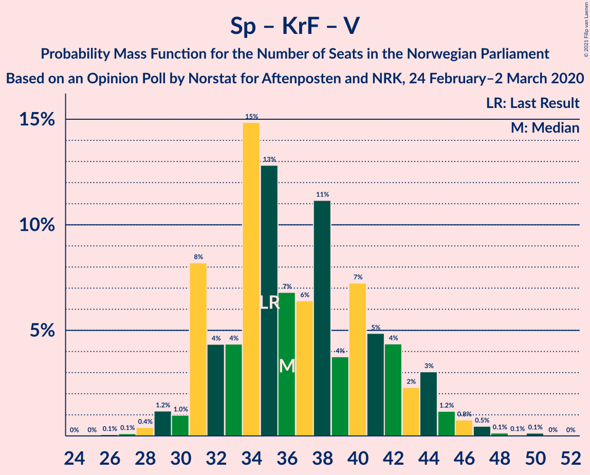

| Number of Seats | Probability | Accumulated | Special Marks |
|:---------------:|:-----------:|:-----------:|:-------------:|
| 26 | 0.1% | 100% |  |
| 27 | 0.1% | 99.9% |  |
| 28 | 0.4% | 99.8% |  |
| 29 | 1.2% | 99.4% |  |
| 30 | 1.0% | 98% |  |
| 31 | 8% | 97% |  |
| 32 | 4% | 89% |  |
| 33 | 4% | 85% |  |
| 34 | 15% | 80% | Median |
| 35 | 13% | 65% | Last Result |
| 36 | 7% | 53% |  |
| 37 | 6% | 46% |  |
| 38 | 11% | 39% |  |
| 39 | 4% | 28% |  |
| 40 | 7% | 25% |  |
| 41 | 5% | 17% |  |
| 42 | 4% | 12% |  |
| 43 | 2% | 8% |  |
| 44 | 3% | 6% |  |
| 45 | 1.2% | 3% |  |
| 46 | 0.8% | 2% |  |
| 47 | 0.5% | 0.8% |  |
| 48 | 0.1% | 0.4% |  |
| 49 | 0.1% | 0.2% |  |
| 50 | 0.1% | 0.2% |  |
| 51 | 0% | 0% |  |

## Technical Information

### Opinion Poll

+ **Polling firm:** Norstat
+ **Commissioner(s):** Aftenposten and NRK
+ **Fieldwork period:** 24 February–2 March 2020

### Calculations

+ **Sample size:** 690
+ **Simulations done:** 1,048,576
+ **Error estimate:** 1.51%

