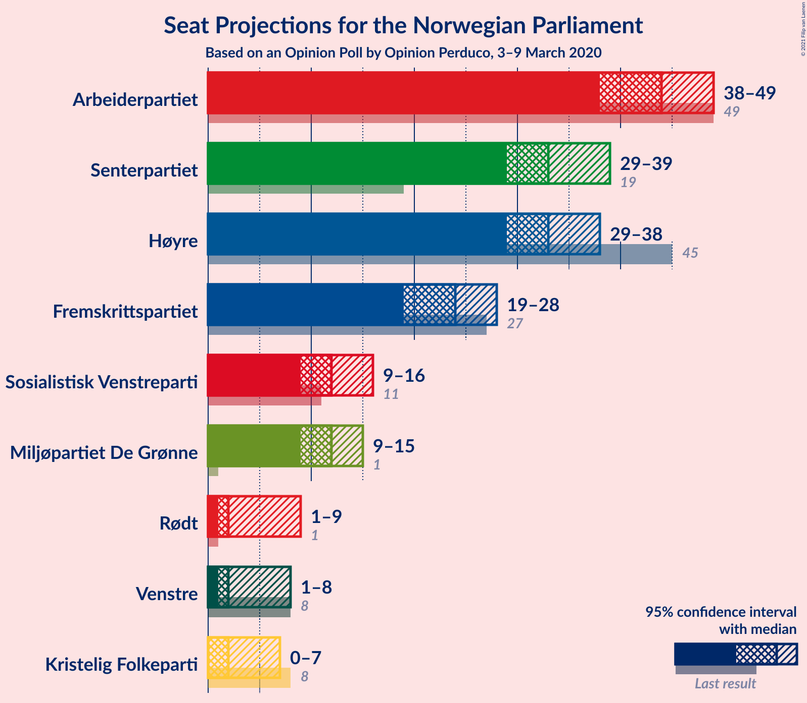
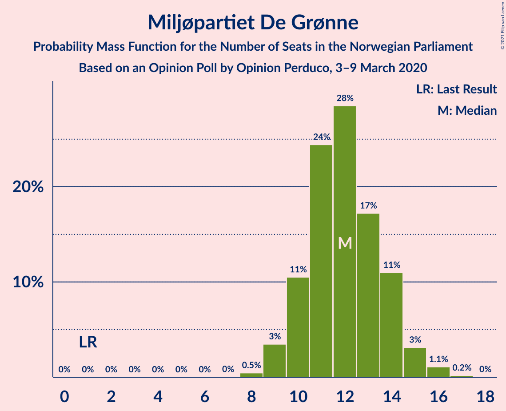
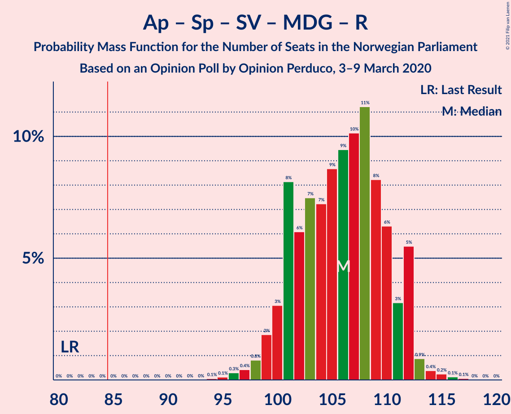
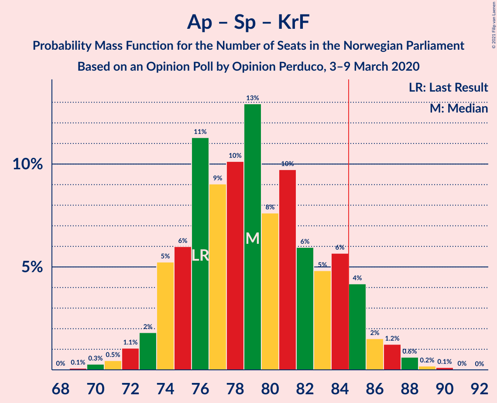
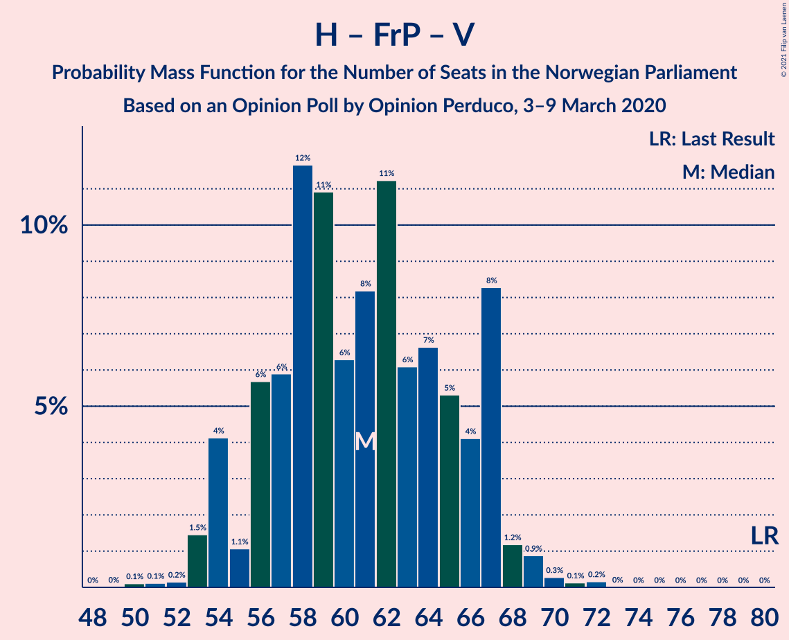

# Opinion Poll by Opinion Perduco, 3–9 March 2020

<a href="#voting-intentions">Voting Intentions</a> | <a href="#seats">Seats</a> | <a href="#coalitions">Coalitions</a> | <a href="#technical-information">Technical Information</a>

## Voting Intentions

### Confidence Intervals

| Party | Last Result | Poll Result | 80% Confidence Interval | 90% Confidence Interval | 95% Confidence Interval | 99% Confidence Interval |
|:-----:|:-----------:|:-----------:|:-----------------------:|:-----------------------:|:-----------------------:|:-----------------------:|
| Arbeiderpartiet | 27.4% | 24.0% | 22.3–25.8% |21.8–26.4% |21.4–26.8% |20.6–27.7% |
| Høyre | 25.0% | 18.9% | 17.3–20.6% |16.9–21.0% |16.5–21.5% |15.8–22.3% |
| Senterpartiet | 10.3% | 18.4% | 16.8–20.0% |16.4–20.5% |16.0–20.9% |15.3–21.7% |
| Fremskrittspartiet | 15.2% | 13.5% | 12.2–15.0% |11.8–15.4% |11.5–15.8% |10.9–16.6% |
| Sosialistisk Venstreparti | 6.0% | 6.9% | 6.0–8.1% |5.7–8.4% |5.5–8.7% |5.0–9.3% |
| Miljøpartiet De Grønne | 3.2% | 6.7% | 5.8–7.8% |5.5–8.2% |5.3–8.5% |4.9–9.0% |
| Rødt | 2.4% | 3.9% | 3.2–4.8% |3.0–5.1% |2.9–5.3% |2.6–5.8% |
| Venstre | 4.4% | 3.5% | 2.9–4.4% |2.7–4.6% |2.5–4.9% |2.2–5.3% |
| Kristelig Folkeparti | 4.2% | 3.1% | 2.5–3.9% |2.3–4.2% |2.2–4.4% |1.9–4.8% |

*Note:* The poll result column reflects the actual value used in the calculations. Published results may vary slightly, and in addition be rounded to fewer digits.

## Seats

### Confidence Intervals

| Party | Last Result | Median | 80% Confidence Interval | 90% Confidence Interval | 95% Confidence Interval | 99% Confidence Interval |
|:-----:|:-----------:|:------:|:-----------------------:|:-----------------------:|:-----------------------:|:-----------------------:|
| <a href="#arbeiderpartiet">Arbeiderpartiet</a> | 49 | 44 | 40–46 |39–48 |38–49 |37–50 |
| <a href="#høyre">Høyre</a> | 45 | 33 | 30–38 |29–38 |29–38 |27–40 |
| <a href="#senterpartiet">Senterpartiet</a> | 19 | 33 | 30–37 |29–38 |29–39 |28–40 |
| <a href="#fremskrittspartiet">Fremskrittspartiet</a> | 27 | 24 | 21–27 |20–28 |19–28 |18–29 |
| <a href="#sosialistisk-venstreparti">Sosialistisk Venstreparti</a> | 11 | 12 | 10–14 |10–15 |9–16 |9–17 |
| <a href="#miljøpartiet-de-grønne">Miljøpartiet De Grønne</a> | 1 | 12 | 10–14 |10–14 |9–15 |9–16 |
| <a href="#rødt">Rødt</a> | 1 | 2 | 2–9 |1–9 |1–9 |1–10 |
| <a href="#venstre">Venstre</a> | 8 | 2 | 2–8 |2–8 |1–8 |1–9 |
| <a href="#kristelig-folkeparti">Kristelig Folkeparti</a> | 8 | 2 | 1–3 |0–7 |0–7 |0–8 |

### Arbeiderpartiet

*For a full overview of the results for this party, see the [Arbeiderpartiet](party-arbeiderpartiet.html) page.*

| Number of Seats | Probability | Accumulated | Special Marks |
|:---------------:|:-----------:|:-----------:|:-------------:|
| 35 | 0.1% | 100% |  |
| 36 | 0.3% | 99.9% |  |
| 37 | 0.5% | 99.7% |  |
| 38 | 2% | 99.2% |  |
| 39 | 4% | 97% |  |
| 40 | 7% | 93% |  |
| 41 | 7% | 86% |  |
| 42 | 12% | 79% |  |
| 43 | 17% | 67% |  |
| 44 | 15% | 51% | Median |
| 45 | 19% | 35% |  |
| 46 | 7% | 16% |  |
| 47 | 3% | 9% |  |
| 48 | 3% | 6% |  |
| 49 | 2% | 3% | Last Result |
| 50 | 0.3% | 0.6% |  |
| 51 | 0.3% | 0.4% |  |
| 52 | 0% | 0.1% |  |
| 53 | 0% | 0% |  |

### Høyre

*For a full overview of the results for this party, see the [Høyre](party-høyre.html) page.*

| Number of Seats | Probability | Accumulated | Special Marks |
|:---------------:|:-----------:|:-----------:|:-------------:|
| 25 | 0.1% | 100% |  |
| 26 | 0.2% | 99.9% |  |
| 27 | 0.3% | 99.7% |  |
| 28 | 1.1% | 99.4% |  |
| 29 | 4% | 98% |  |
| 30 | 6% | 94% |  |
| 31 | 12% | 88% |  |
| 32 | 15% | 76% |  |
| 33 | 19% | 61% | Median |
| 34 | 10% | 42% |  |
| 35 | 12% | 32% |  |
| 36 | 7% | 20% |  |
| 37 | 2% | 12% |  |
| 38 | 8% | 10% |  |
| 39 | 1.4% | 2% |  |
| 40 | 0.5% | 0.8% |  |
| 41 | 0.3% | 0.3% |  |
| 42 | 0% | 0.1% |  |
| 43 | 0% | 0% |  |
| 44 | 0% | 0% |  |
| 45 | 0% | 0% | Last Result |

### Senterpartiet

*For a full overview of the results for this party, see the [Senterpartiet](party-senterpartiet.html) page.*

| Number of Seats | Probability | Accumulated | Special Marks |
|:---------------:|:-----------:|:-----------:|:-------------:|
| 19 | 0% | 100% | Last Result |
| 20 | 0% | 100% |  |
| 21 | 0% | 100% |  |
| 22 | 0% | 100% |  |
| 23 | 0% | 100% |  |
| 24 | 0% | 100% |  |
| 25 | 0% | 100% |  |
| 26 | 0.1% | 100% |  |
| 27 | 0.2% | 99.8% |  |
| 28 | 0.9% | 99.6% |  |
| 29 | 5% | 98.7% |  |
| 30 | 11% | 94% |  |
| 31 | 11% | 83% |  |
| 32 | 12% | 72% |  |
| 33 | 13% | 60% | Median |
| 34 | 14% | 47% |  |
| 35 | 8% | 33% |  |
| 36 | 7% | 25% |  |
| 37 | 8% | 17% |  |
| 38 | 5% | 9% |  |
| 39 | 3% | 5% |  |
| 40 | 1.0% | 1.2% |  |
| 41 | 0.1% | 0.2% |  |
| 42 | 0% | 0.1% |  |
| 43 | 0% | 0% |  |

### Fremskrittspartiet

*For a full overview of the results for this party, see the [Fremskrittspartiet](party-fremskrittspartiet.html) page.*

| Number of Seats | Probability | Accumulated | Special Marks |
|:---------------:|:-----------:|:-----------:|:-------------:|
| 17 | 0.1% | 100% |  |
| 18 | 0.7% | 99.9% |  |
| 19 | 2% | 99.3% |  |
| 20 | 5% | 97% |  |
| 21 | 10% | 92% |  |
| 22 | 9% | 82% |  |
| 23 | 14% | 73% |  |
| 24 | 14% | 59% | Median |
| 25 | 12% | 45% |  |
| 26 | 14% | 33% |  |
| 27 | 11% | 19% | Last Result |
| 28 | 6% | 8% |  |
| 29 | 1.3% | 2% |  |
| 30 | 0.2% | 0.4% |  |
| 31 | 0.2% | 0.2% |  |
| 32 | 0% | 0% |  |

### Sosialistisk Venstreparti

*For a full overview of the results for this party, see the [Sosialistisk Venstreparti](party-sosialistiskvenstreparti.html) page.*

| Number of Seats | Probability | Accumulated | Special Marks |
|:---------------:|:-----------:|:-----------:|:-------------:|
| 8 | 0.4% | 100% |  |
| 9 | 2% | 99.6% |  |
| 10 | 9% | 97% |  |
| 11 | 21% | 89% | Last Result |
| 12 | 23% | 68% | Median |
| 13 | 24% | 45% |  |
| 14 | 13% | 21% |  |
| 15 | 5% | 8% |  |
| 16 | 3% | 3% |  |
| 17 | 0.5% | 0.6% |  |
| 18 | 0.1% | 0.1% |  |
| 19 | 0% | 0% |  |

### Miljøpartiet De Grønne

*For a full overview of the results for this party, see the [Miljøpartiet De Grønne](party-miljøpartietdegrønne.html) page.*

| Number of Seats | Probability | Accumulated | Special Marks |
|:---------------:|:-----------:|:-----------:|:-------------:|
| 1 | 0% | 100% | Last Result |
| 2 | 0% | 100% |  |
| 3 | 0% | 100% |  |
| 4 | 0% | 100% |  |
| 5 | 0% | 100% |  |
| 6 | 0% | 100% |  |
| 7 | 0% | 100% |  |
| 8 | 0.5% | 100% |  |
| 9 | 3% | 99.5% |  |
| 10 | 11% | 96% |  |
| 11 | 24% | 86% |  |
| 12 | 28% | 61% | Median |
| 13 | 17% | 33% |  |
| 14 | 11% | 15% |  |
| 15 | 3% | 4% |  |
| 16 | 1.1% | 1.3% |  |
| 17 | 0.2% | 0.2% |  |
| 18 | 0% | 0% |  |

### Rødt

*For a full overview of the results for this party, see the [Rødt](party-rødt.html) page.*

| Number of Seats | Probability | Accumulated | Special Marks |
|:---------------:|:-----------:|:-----------:|:-------------:|
| 1 | 6% | 100% | Last Result |
| 2 | 47% | 94% | Median |
| 3 | 0% | 47% |  |
| 4 | 0% | 47% |  |
| 5 | 0% | 47% |  |
| 6 | 0.3% | 47% |  |
| 7 | 16% | 47% |  |
| 8 | 19% | 31% |  |
| 9 | 10% | 12% |  |
| 10 | 1.3% | 2% |  |
| 11 | 0.2% | 0.3% |  |
| 12 | 0% | 0% |  |

### Venstre

*For a full overview of the results for this party, see the [Venstre](party-venstre.html) page.*

| Number of Seats | Probability | Accumulated | Special Marks |
|:---------------:|:-----------:|:-----------:|:-------------:|
| 0 | 0.1% | 100% |  |
| 1 | 3% | 99.9% |  |
| 2 | 71% | 97% | Median |
| 3 | 0.2% | 26% |  |
| 4 | 0% | 26% |  |
| 5 | 0% | 26% |  |
| 6 | 0.6% | 26% |  |
| 7 | 12% | 26% |  |
| 8 | 11% | 14% | Last Result |
| 9 | 2% | 2% |  |
| 10 | 0.3% | 0.3% |  |
| 11 | 0% | 0% |  |

### Kristelig Folkeparti

*For a full overview of the results for this party, see the [Kristelig Folkeparti](party-kristeligfolkeparti.html) page.*

| Number of Seats | Probability | Accumulated | Special Marks |
|:---------------:|:-----------:|:-----------:|:-------------:|
| 0 | 5% | 100% |  |
| 1 | 40% | 95% |  |
| 2 | 15% | 55% | Median |
| 3 | 32% | 40% |  |
| 4 | 0% | 8% |  |
| 5 | 0% | 8% |  |
| 6 | 0.5% | 8% |  |
| 7 | 6% | 7% |  |
| 8 | 2% | 2% | Last Result |
| 9 | 0.1% | 0.2% |  |
| 10 | 0% | 0% |  |

## Coalitions

### Confidence Intervals

| Coalition | Last Result | Median | Majority? | 80% Confidence Interval | 90% Confidence Interval | 95% Confidence Interval | 99% Confidence Interval |
|:---------:|:-----------:|:------:|:---------:|:-----------------------:|:-----------------------:|:-----------------------:|:-----------------------:|
| Arbeiderpartiet – Senterpartiet – Sosialistisk Venstreparti – Miljøpartiet De Grønne – Rødt | 81 | 106 | 100% | 101–111 | 100–112 | 99–112 | 97–114 |
| Arbeiderpartiet – Senterpartiet – Sosialistisk Venstreparti – Miljøpartiet De Grønne – Kristelig Folkeparti | 88 | 103 | 100% | 99–108 | 98–110 | 97–110 | 94–112 |
| Arbeiderpartiet – Senterpartiet – Sosialistisk Venstreparti – Miljøpartiet De Grønne | 80 | 101 | 100% | 97–106 | 96–107 | 94–108 | 92–110 |
| Høyre – Senterpartiet – Fremskrittspartiet – Venstre – Kristelig Folkeparti | 107 | 97 | 100% | 92–101 | 91–103 | 90–104 | 88–106 |
| Arbeiderpartiet – Senterpartiet – Sosialistisk Venstreparti – Rødt | 80 | 94 | 99.6% | 89–99 | 88–99 | 87–101 | 85–103 |
| Arbeiderpartiet – Senterpartiet – Miljøpartiet De Grønne – Kristelig Folkeparti | 77 | 91 | 97% | 87–97 | 85–97 | 84–98 | 82–100 |
| Arbeiderpartiet – Senterpartiet – Sosialistisk Venstreparti | 79 | 89 | 93% | 85–94 | 83–95 | 83–96 | 81–97 |
| Arbeiderpartiet – Senterpartiet – Kristelig Folkeparti | 76 | 79 | 8% | 75–84 | 74–85 | 73–86 | 71–88 |
| Arbeiderpartiet – Senterpartiet | 68 | 77 | 0.7% | 73–81 | 72–82 | 71–83 | 69–85 |
| Høyre – Fremskrittspartiet – Miljøpartiet De Grønne – Venstre – Kristelig Folkeparti | 89 | 75 | 0.4% | 70–80 | 70–81 | 68–82 | 66–84 |
| Høyre – Fremskrittspartiet – Venstre – Kristelig Folkeparti | 88 | 63 | 0% | 58–68 | 57–69 | 57–70 | 55–72 |
| Høyre – Fremskrittspartiet – Venstre | 80 | 61 | 0% | 56–67 | 54–67 | 54–68 | 53–70 |
| Høyre – Fremskrittspartiet | 72 | 57 | 0% | 53–62 | 52–65 | 51–65 | 50–66 |
| Arbeiderpartiet – Sosialistisk Venstreparti | 60 | 56 | 0% | 52–59 | 50–61 | 50–62 | 48–63 |
| Senterpartiet – Venstre – Kristelig Folkeparti | 35 | 39 | 0% | 34–44 | 33–46 | 33–47 | 31–49 |
| Høyre – Venstre – Kristelig Folkeparti | 61 | 39 | 0% | 35–43 | 34–45 | 34–46 | 32–48 |

### Arbeiderpartiet – Senterpartiet – Sosialistisk Venstreparti – Miljøpartiet De Grønne – Rødt

| Number of Seats | Probability | Accumulated | Special Marks |
|:---------------:|:-----------:|:-----------:|:-------------:|
| 81 | 0% | 100% | Last Result |
| 82 | 0% | 100% |  |
| 83 | 0% | 100% |  |
| 84 | 0% | 100% |  |
| 85 | 0% | 100% | Majority |
| 86 | 0% | 100% |  |
| 87 | 0% | 100% |  |
| 88 | 0% | 100% |  |
| 89 | 0% | 100% |  |
| 90 | 0% | 100% |  |
| 91 | 0% | 100% |  |
| 92 | 0% | 100% |  |
| 93 | 0% | 100% |  |
| 94 | 0.1% | 100% |  |
| 95 | 0.1% | 99.9% |  |
| 96 | 0.3% | 99.8% |  |
| 97 | 0.4% | 99.5% |  |
| 98 | 0.8% | 99.1% |  |
| 99 | 2% | 98% |  |
| 100 | 3% | 96% |  |
| 101 | 8% | 93% |  |
| 102 | 6% | 85% |  |
| 103 | 7% | 79% | Median |
| 104 | 7% | 72% |  |
| 105 | 9% | 64% |  |
| 106 | 9% | 56% |  |
| 107 | 10% | 46% |  |
| 108 | 11% | 36% |  |
| 109 | 8% | 25% |  |
| 110 | 6% | 17% |  |
| 111 | 3% | 10% |  |
| 112 | 5% | 7% |  |
| 113 | 0.9% | 2% |  |
| 114 | 0.4% | 0.8% |  |
| 115 | 0.2% | 0.4% |  |
| 116 | 0.1% | 0.2% |  |
| 117 | 0.1% | 0.1% |  |
| 118 | 0% | 0% |  |

### Arbeiderpartiet – Senterpartiet – Sosialistisk Venstreparti – Miljøpartiet De Grønne – Kristelig Folkeparti

| Number of Seats | Probability | Accumulated | Special Marks |
|:---------------:|:-----------:|:-----------:|:-------------:|
| 88 | 0% | 100% | Last Result |
| 89 | 0% | 100% |  |
| 90 | 0% | 100% |  |
| 91 | 0% | 100% |  |
| 92 | 0.1% | 100% |  |
| 93 | 0.1% | 99.9% |  |
| 94 | 0.7% | 99.7% |  |
| 95 | 0.6% | 99.0% |  |
| 96 | 0.5% | 98% |  |
| 97 | 1.0% | 98% |  |
| 98 | 4% | 97% |  |
| 99 | 7% | 92% |  |
| 100 | 12% | 85% |  |
| 101 | 8% | 73% |  |
| 102 | 9% | 65% |  |
| 103 | 14% | 56% | Median |
| 104 | 6% | 42% |  |
| 105 | 6% | 37% |  |
| 106 | 6% | 31% |  |
| 107 | 5% | 25% |  |
| 108 | 11% | 20% |  |
| 109 | 4% | 9% |  |
| 110 | 3% | 5% |  |
| 111 | 1.2% | 2% |  |
| 112 | 0.5% | 0.8% |  |
| 113 | 0.2% | 0.3% |  |
| 114 | 0.1% | 0.1% |  |
| 115 | 0% | 0% |  |

### Arbeiderpartiet – Senterpartiet – Sosialistisk Venstreparti – Miljøpartiet De Grønne

| Number of Seats | Probability | Accumulated | Special Marks |
|:---------------:|:-----------:|:-----------:|:-------------:|
| 80 | 0% | 100% | Last Result |
| 81 | 0% | 100% |  |
| 82 | 0% | 100% |  |
| 83 | 0% | 100% |  |
| 84 | 0% | 100% |  |
| 85 | 0% | 100% | Majority |
| 86 | 0% | 100% |  |
| 87 | 0% | 100% |  |
| 88 | 0% | 100% |  |
| 89 | 0% | 100% |  |
| 90 | 0% | 100% |  |
| 91 | 0.2% | 99.9% |  |
| 92 | 0.6% | 99.7% |  |
| 93 | 0.8% | 99.1% |  |
| 94 | 1.3% | 98% |  |
| 95 | 0.9% | 97% |  |
| 96 | 4% | 96% |  |
| 97 | 7% | 92% |  |
| 98 | 6% | 85% |  |
| 99 | 14% | 79% |  |
| 100 | 12% | 65% |  |
| 101 | 10% | 53% | Median |
| 102 | 10% | 43% |  |
| 103 | 6% | 33% |  |
| 104 | 6% | 27% |  |
| 105 | 8% | 21% |  |
| 106 | 5% | 13% |  |
| 107 | 5% | 8% |  |
| 108 | 3% | 3% |  |
| 109 | 0.4% | 0.9% |  |
| 110 | 0.4% | 0.5% |  |
| 111 | 0.1% | 0.1% |  |
| 112 | 0% | 0.1% |  |
| 113 | 0% | 0% |  |

### Høyre – Senterpartiet – Fremskrittspartiet – Venstre – Kristelig Folkeparti

| Number of Seats | Probability | Accumulated | Special Marks |
|:---------------:|:-----------:|:-----------:|:-------------:|
| 86 | 0% | 100% |  |
| 87 | 0.3% | 99.9% |  |
| 88 | 0.3% | 99.6% |  |
| 89 | 2% | 99.3% |  |
| 90 | 2% | 98% |  |
| 91 | 3% | 96% |  |
| 92 | 4% | 93% |  |
| 93 | 8% | 89% |  |
| 94 | 11% | 81% | Median |
| 95 | 9% | 71% |  |
| 96 | 11% | 62% |  |
| 97 | 11% | 51% |  |
| 98 | 10% | 40% |  |
| 99 | 14% | 30% |  |
| 100 | 6% | 16% |  |
| 101 | 2% | 10% |  |
| 102 | 2% | 8% |  |
| 103 | 3% | 6% |  |
| 104 | 2% | 3% |  |
| 105 | 0.8% | 2% |  |
| 106 | 0.3% | 0.7% |  |
| 107 | 0.4% | 0.4% | Last Result |
| 108 | 0% | 0% |  |

### Arbeiderpartiet – Senterpartiet – Sosialistisk Venstreparti – Rødt

| Number of Seats | Probability | Accumulated | Special Marks |
|:---------------:|:-----------:|:-----------:|:-------------:|
| 80 | 0% | 100% | Last Result |
| 81 | 0% | 100% |  |
| 82 | 0% | 100% |  |
| 83 | 0.1% | 100% |  |
| 84 | 0.2% | 99.8% |  |
| 85 | 0.5% | 99.6% | Majority |
| 86 | 1.4% | 99.1% |  |
| 87 | 1.3% | 98% |  |
| 88 | 3% | 96% |  |
| 89 | 7% | 93% |  |
| 90 | 7% | 86% |  |
| 91 | 8% | 79% | Median |
| 92 | 6% | 71% |  |
| 93 | 10% | 65% |  |
| 94 | 9% | 55% |  |
| 95 | 9% | 46% |  |
| 96 | 10% | 37% |  |
| 97 | 8% | 26% |  |
| 98 | 6% | 18% |  |
| 99 | 8% | 12% |  |
| 100 | 2% | 4% |  |
| 101 | 2% | 3% |  |
| 102 | 0.4% | 0.9% |  |
| 103 | 0.3% | 0.5% |  |
| 104 | 0.1% | 0.2% |  |
| 105 | 0.1% | 0.1% |  |
| 106 | 0% | 0% |  |

### Arbeiderpartiet – Senterpartiet – Miljøpartiet De Grønne – Kristelig Folkeparti

| Number of Seats | Probability | Accumulated | Special Marks |
|:---------------:|:-----------:|:-----------:|:-------------:|
| 77 | 0% | 100% | Last Result |
| 78 | 0% | 100% |  |
| 79 | 0% | 100% |  |
| 80 | 0.1% | 100% |  |
| 81 | 0.2% | 99.9% |  |
| 82 | 0.4% | 99.7% |  |
| 83 | 0.5% | 99.3% |  |
| 84 | 1.3% | 98.8% |  |
| 85 | 3% | 97% | Majority |
| 86 | 3% | 95% |  |
| 87 | 5% | 92% |  |
| 88 | 15% | 87% |  |
| 89 | 10% | 72% |  |
| 90 | 8% | 62% |  |
| 91 | 13% | 53% | Median |
| 92 | 8% | 41% |  |
| 93 | 6% | 33% |  |
| 94 | 7% | 27% |  |
| 95 | 5% | 19% |  |
| 96 | 3% | 14% |  |
| 97 | 8% | 11% |  |
| 98 | 0.7% | 3% |  |
| 99 | 1.1% | 2% |  |
| 100 | 0.5% | 0.7% |  |
| 101 | 0.1% | 0.2% |  |
| 102 | 0% | 0.1% |  |
| 103 | 0% | 0% |  |

### Arbeiderpartiet – Senterpartiet – Sosialistisk Venstreparti

| Number of Seats | Probability | Accumulated | Special Marks |
|:---------------:|:-----------:|:-----------:|:-------------:|
| 79 | 0.1% | 100% | Last Result |
| 80 | 0.2% | 99.9% |  |
| 81 | 0.6% | 99.7% |  |
| 82 | 0.8% | 99.1% |  |
| 83 | 3% | 98% |  |
| 84 | 2% | 95% |  |
| 85 | 7% | 93% | Majority |
| 86 | 7% | 86% |  |
| 87 | 10% | 79% |  |
| 88 | 16% | 69% |  |
| 89 | 8% | 53% | Median |
| 90 | 9% | 45% |  |
| 91 | 11% | 36% |  |
| 92 | 7% | 25% |  |
| 93 | 7% | 18% |  |
| 94 | 3% | 11% |  |
| 95 | 4% | 7% |  |
| 96 | 2% | 3% |  |
| 97 | 1.2% | 2% |  |
| 98 | 0.2% | 0.3% |  |
| 99 | 0.1% | 0.1% |  |
| 100 | 0% | 0% |  |

### Arbeiderpartiet – Senterpartiet – Kristelig Folkeparti

| Number of Seats | Probability | Accumulated | Special Marks |
|:---------------:|:-----------:|:-----------:|:-------------:|
| 69 | 0.1% | 100% |  |
| 70 | 0.3% | 99.9% |  |
| 71 | 0.5% | 99.6% |  |
| 72 | 1.1% | 99.2% |  |
| 73 | 2% | 98% |  |
| 74 | 5% | 96% |  |
| 75 | 6% | 91% |  |
| 76 | 11% | 85% | Last Result |
| 77 | 9% | 74% |  |
| 78 | 10% | 65% |  |
| 79 | 13% | 55% | Median |
| 80 | 8% | 42% |  |
| 81 | 10% | 34% |  |
| 82 | 6% | 24% |  |
| 83 | 5% | 18% |  |
| 84 | 6% | 14% |  |
| 85 | 4% | 8% | Majority |
| 86 | 2% | 4% |  |
| 87 | 1.2% | 2% |  |
| 88 | 0.6% | 1.0% |  |
| 89 | 0.2% | 0.3% |  |
| 90 | 0.1% | 0.1% |  |
| 91 | 0% | 0% |  |

### Arbeiderpartiet – Senterpartiet

| Number of Seats | Probability | Accumulated | Special Marks |
|:---------------:|:-----------:|:-----------:|:-------------:|
| 67 | 0% | 100% |  |
| 68 | 0.1% | 99.9% | Last Result |
| 69 | 0.7% | 99.8% |  |
| 70 | 0.7% | 99.1% |  |
| 71 | 2% | 98% |  |
| 72 | 5% | 97% |  |
| 73 | 5% | 91% |  |
| 74 | 10% | 87% |  |
| 75 | 13% | 77% |  |
| 76 | 12% | 64% |  |
| 77 | 12% | 52% | Median |
| 78 | 8% | 40% |  |
| 79 | 12% | 33% |  |
| 80 | 7% | 21% |  |
| 81 | 6% | 14% |  |
| 82 | 5% | 8% |  |
| 83 | 1.3% | 3% |  |
| 84 | 0.9% | 2% |  |
| 85 | 0.5% | 0.7% | Majority |
| 86 | 0.1% | 0.2% |  |
| 87 | 0.1% | 0.1% |  |
| 88 | 0% | 0% |  |

### Høyre – Fremskrittspartiet – Miljøpartiet De Grønne – Venstre – Kristelig Folkeparti

| Number of Seats | Probability | Accumulated | Special Marks |
|:---------------:|:-----------:|:-----------:|:-------------:|
| 64 | 0.1% | 100% |  |
| 65 | 0.1% | 99.9% |  |
| 66 | 0.3% | 99.8% |  |
| 67 | 0.4% | 99.5% |  |
| 68 | 2% | 99.1% |  |
| 69 | 2% | 97% |  |
| 70 | 8% | 96% |  |
| 71 | 6% | 88% |  |
| 72 | 8% | 82% |  |
| 73 | 10% | 74% | Median |
| 74 | 9% | 63% |  |
| 75 | 9% | 54% |  |
| 76 | 10% | 45% |  |
| 77 | 6% | 35% |  |
| 78 | 8% | 29% |  |
| 79 | 7% | 21% |  |
| 80 | 7% | 14% |  |
| 81 | 3% | 7% |  |
| 82 | 1.3% | 4% |  |
| 83 | 1.4% | 2% |  |
| 84 | 0.5% | 0.9% |  |
| 85 | 0.2% | 0.4% | Majority |
| 86 | 0.1% | 0.2% |  |
| 87 | 0% | 0% |  |
| 88 | 0% | 0% |  |
| 89 | 0% | 0% | Last Result |

### Høyre – Fremskrittspartiet – Venstre – Kristelig Folkeparti

| Number of Seats | Probability | Accumulated | Special Marks |
|:---------------:|:-----------:|:-----------:|:-------------:|
| 52 | 0.1% | 100% |  |
| 53 | 0.1% | 99.9% |  |
| 54 | 0.2% | 99.8% |  |
| 55 | 0.4% | 99.6% |  |
| 56 | 0.9% | 99.2% |  |
| 57 | 5% | 98% |  |
| 58 | 3% | 93% |  |
| 59 | 6% | 90% |  |
| 60 | 8% | 83% |  |
| 61 | 11% | 75% | Median |
| 62 | 10% | 64% |  |
| 63 | 9% | 54% |  |
| 64 | 9% | 44% |  |
| 65 | 7% | 36% |  |
| 66 | 7% | 28% |  |
| 67 | 6% | 21% |  |
| 68 | 8% | 15% |  |
| 69 | 3% | 7% |  |
| 70 | 2% | 4% |  |
| 71 | 0.8% | 2% |  |
| 72 | 0.4% | 0.9% |  |
| 73 | 0.3% | 0.5% |  |
| 74 | 0.1% | 0.2% |  |
| 75 | 0.1% | 0.1% |  |
| 76 | 0% | 0% |  |
| 77 | 0% | 0% |  |
| 78 | 0% | 0% |  |
| 79 | 0% | 0% |  |
| 80 | 0% | 0% |  |
| 81 | 0% | 0% |  |
| 82 | 0% | 0% |  |
| 83 | 0% | 0% |  |
| 84 | 0% | 0% |  |
| 85 | 0% | 0% | Majority |
| 86 | 0% | 0% |  |
| 87 | 0% | 0% |  |
| 88 | 0% | 0% | Last Result |

### Høyre – Fremskrittspartiet – Venstre

| Number of Seats | Probability | Accumulated | Special Marks |
|:---------------:|:-----------:|:-----------:|:-------------:|
| 50 | 0.1% | 100% |  |
| 51 | 0.1% | 99.9% |  |
| 52 | 0.2% | 99.8% |  |
| 53 | 1.5% | 99.6% |  |
| 54 | 4% | 98% |  |
| 55 | 1.1% | 94% |  |
| 56 | 6% | 93% |  |
| 57 | 6% | 87% |  |
| 58 | 12% | 81% |  |
| 59 | 11% | 70% | Median |
| 60 | 6% | 59% |  |
| 61 | 8% | 53% |  |
| 62 | 11% | 44% |  |
| 63 | 6% | 33% |  |
| 64 | 7% | 27% |  |
| 65 | 5% | 20% |  |
| 66 | 4% | 15% |  |
| 67 | 8% | 11% |  |
| 68 | 1.2% | 3% |  |
| 69 | 0.9% | 1.5% |  |
| 70 | 0.3% | 0.6% |  |
| 71 | 0.1% | 0.3% |  |
| 72 | 0.2% | 0.2% |  |
| 73 | 0% | 0% |  |
| 74 | 0% | 0% |  |
| 75 | 0% | 0% |  |
| 76 | 0% | 0% |  |
| 77 | 0% | 0% |  |
| 78 | 0% | 0% |  |
| 79 | 0% | 0% |  |
| 80 | 0% | 0% | Last Result |

### Høyre – Fremskrittspartiet

| Number of Seats | Probability | Accumulated | Special Marks |
|:---------------:|:-----------:|:-----------:|:-------------:|
| 48 | 0.2% | 100% |  |
| 49 | 0.3% | 99.8% |  |
| 50 | 1.0% | 99.5% |  |
| 51 | 3% | 98% |  |
| 52 | 5% | 96% |  |
| 53 | 3% | 90% |  |
| 54 | 7% | 87% |  |
| 55 | 7% | 80% |  |
| 56 | 16% | 73% |  |
| 57 | 12% | 57% | Median |
| 58 | 8% | 45% |  |
| 59 | 10% | 37% |  |
| 60 | 10% | 27% |  |
| 61 | 3% | 17% |  |
| 62 | 4% | 14% |  |
| 63 | 2% | 10% |  |
| 64 | 3% | 8% |  |
| 65 | 5% | 5% |  |
| 66 | 0.3% | 0.6% |  |
| 67 | 0.2% | 0.3% |  |
| 68 | 0.1% | 0.1% |  |
| 69 | 0% | 0% |  |
| 70 | 0% | 0% |  |
| 71 | 0% | 0% |  |
| 72 | 0% | 0% | Last Result |

### Arbeiderpartiet – Sosialistisk Venstreparti

| Number of Seats | Probability | Accumulated | Special Marks |
|:---------------:|:-----------:|:-----------:|:-------------:|
| 47 | 0.1% | 100% |  |
| 48 | 0.4% | 99.8% |  |
| 49 | 0.7% | 99.4% |  |
| 50 | 4% | 98.8% |  |
| 51 | 4% | 95% |  |
| 52 | 4% | 91% |  |
| 53 | 11% | 87% |  |
| 54 | 8% | 76% |  |
| 55 | 14% | 68% |  |
| 56 | 10% | 54% | Median |
| 57 | 17% | 43% |  |
| 58 | 9% | 26% |  |
| 59 | 9% | 17% |  |
| 60 | 3% | 9% | Last Result |
| 61 | 2% | 6% |  |
| 62 | 3% | 4% |  |
| 63 | 1.1% | 1.4% |  |
| 64 | 0.1% | 0.3% |  |
| 65 | 0.1% | 0.1% |  |
| 66 | 0% | 0% |  |

### Senterpartiet – Venstre – Kristelig Folkeparti

| Number of Seats | Probability | Accumulated | Special Marks |
|:---------------:|:-----------:|:-----------:|:-------------:|
| 30 | 0.1% | 100% |  |
| 31 | 0.4% | 99.9% |  |
| 32 | 2% | 99.5% |  |
| 33 | 6% | 98% |  |
| 34 | 6% | 92% |  |
| 35 | 5% | 86% | Last Result |
| 36 | 7% | 81% |  |
| 37 | 10% | 74% | Median |
| 38 | 9% | 63% |  |
| 39 | 10% | 54% |  |
| 40 | 6% | 44% |  |
| 41 | 9% | 39% |  |
| 42 | 10% | 30% |  |
| 43 | 9% | 19% |  |
| 44 | 3% | 11% |  |
| 45 | 2% | 7% |  |
| 46 | 2% | 6% |  |
| 47 | 2% | 4% |  |
| 48 | 1.4% | 2% |  |
| 49 | 0.4% | 0.8% |  |
| 50 | 0.2% | 0.4% |  |
| 51 | 0.1% | 0.2% |  |
| 52 | 0% | 0.1% |  |
| 53 | 0.1% | 0.1% |  |
| 54 | 0% | 0% |  |

### Høyre – Venstre – Kristelig Folkeparti

| Number of Seats | Probability | Accumulated | Special Marks |
|:---------------:|:-----------:|:-----------:|:-------------:|
| 29 | 0% | 100% |  |
| 30 | 0.1% | 99.9% |  |
| 31 | 0.1% | 99.9% |  |
| 32 | 0.4% | 99.8% |  |
| 33 | 2% | 99.3% |  |
| 34 | 6% | 98% |  |
| 35 | 8% | 92% |  |
| 36 | 11% | 84% |  |
| 37 | 8% | 73% | Median |
| 38 | 10% | 65% |  |
| 39 | 10% | 55% |  |
| 40 | 9% | 44% |  |
| 41 | 13% | 35% |  |
| 42 | 7% | 22% |  |
| 43 | 7% | 16% |  |
| 44 | 3% | 8% |  |
| 45 | 2% | 5% |  |
| 46 | 1.4% | 3% |  |
| 47 | 0.7% | 2% |  |
| 48 | 0.5% | 0.8% |  |
| 49 | 0.1% | 0.2% |  |
| 50 | 0.1% | 0.1% |  |
| 51 | 0% | 0% |  |
| 52 | 0% | 0% |  |
| 53 | 0% | 0% |  |
| 54 | 0% | 0% |  |
| 55 | 0% | 0% |  |
| 56 | 0% | 0% |  |
| 57 | 0% | 0% |  |
| 58 | 0% | 0% |  |
| 59 | 0% | 0% |  |
| 60 | 0% | 0% |  |
| 61 | 0% | 0% | Last Result |

## Technical Information

### Opinion Poll

+ **Polling firm:** Opinion Perduco
+ **Commissioner(s):** —
+ **Fieldwork period:** 3–9 March 2020

### Calculations

+ **Sample size:** 970
+ **Simulations done:** 1,048,576
+ **Error estimate:** 2.15%

