# Opinion Poll by Norstat for Aftenposten and NRK, 16–23 March 2020

<a href="#voting-intentions">Voting Intentions</a> | <a href="#seats">Seats</a> | <a href="#coalitions">Coalitions</a> | <a href="#technical-information">Technical Information</a>

## Voting Intentions

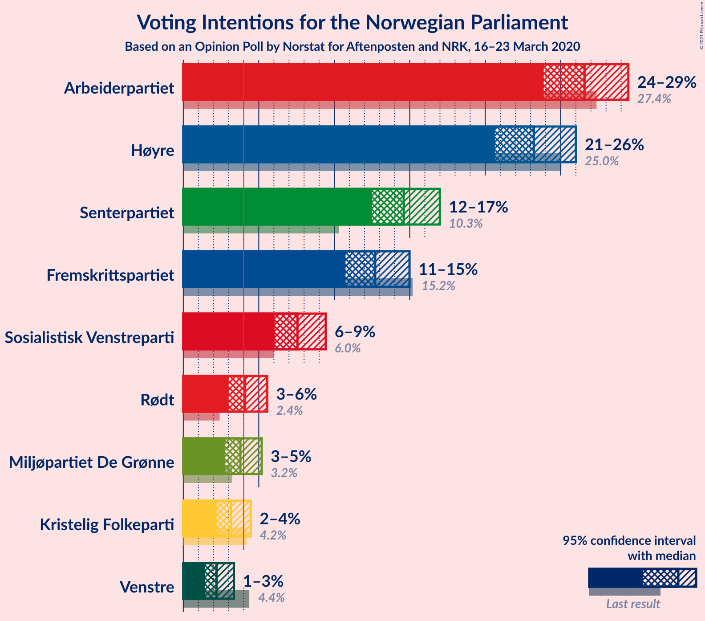

### Confidence Intervals

| Party | Last Result | Poll Result | 80% Confidence Interval | 90% Confidence Interval | 95% Confidence Interval | 99% Confidence Interval |
|:-----:|:-----------:|:-----------:|:-----------------------:|:-----------------------:|:-----------------------:|:-----------------------:|
| Arbeiderpartiet | 27.4% | 26.6% | 24.8–28.5% |24.3–29.0% |23.9–29.5% |23.0–30.4% |
| Høyre | 25.0% | 23.2% | 21.5–25.0% |21.0–25.6% |20.6–26.0% |19.8–26.9% |
| Senterpartiet | 10.3% | 14.6% | 13.2–16.2% |12.8–16.6% |12.5–17.0% |11.9–17.8% |
| Fremskrittspartiet | 15.2% | 12.7% | 11.4–14.2% |11.1–14.6% |10.7–15.0% |10.2–15.7% |
| Sosialistisk Venstreparti | 6.0% | 7.6% | 6.6–8.8% |6.3–9.1% |6.1–9.4% |5.6–10.0% |
| Rødt | 2.4% | 4.1% | 3.4–5.0% |3.2–5.3% |3.0–5.6% |2.7–6.1% |
| Miljøpartiet De Grønne | 3.2% | 3.8% | 3.1–4.7% |2.9–5.0% |2.7–5.2% |2.4–5.7% |
| Kristelig Folkeparti | 4.2% | 3.2% | 2.5–4.0% |2.4–4.3% |2.2–4.5% |2.0–4.9% |
| Venstre | 4.4% | 2.2% | 1.7–3.0% |1.6–3.2% |1.4–3.4% |1.2–3.7% |

*Note:* The poll result column reflects the actual value used in the calculations. Published results may vary slightly, and in addition be rounded to fewer digits.

## Seats

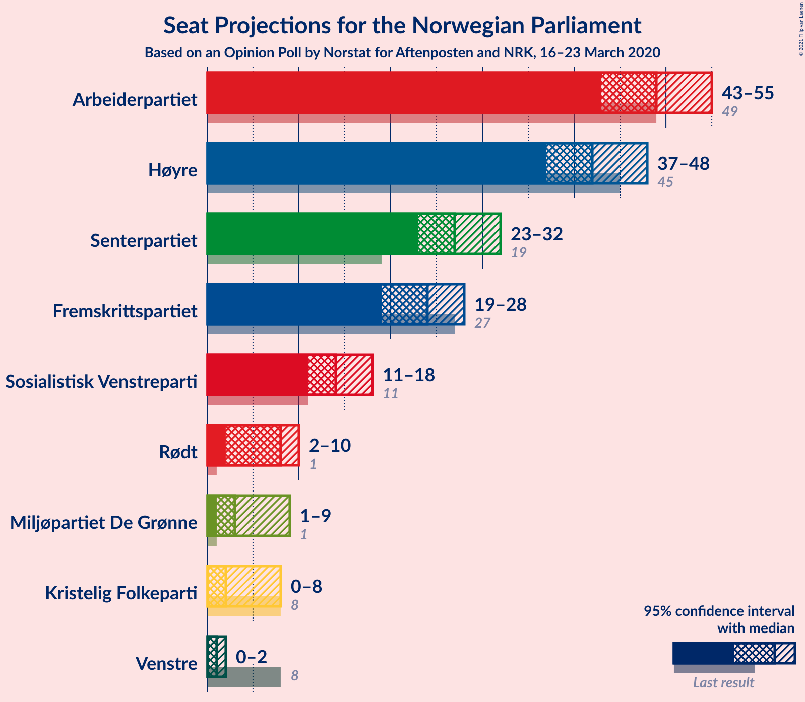

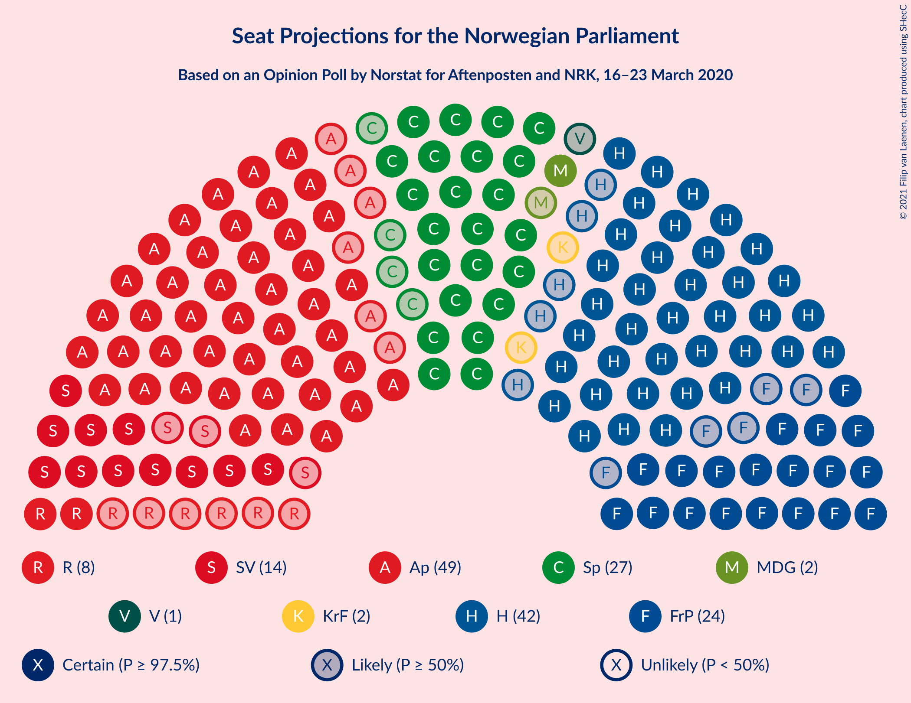

### Confidence Intervals

| Party | Last Result | Median | 80% Confidence Interval | 90% Confidence Interval | 95% Confidence Interval | 99% Confidence Interval |
|:-----:|:-----------:|:------:|:-----------------------:|:-----------------------:|:-----------------------:|:-----------------------:|
| <a href="#arbeiderpartiet">Arbeiderpartiet</a> | 49 | 49 | 44–53 |44–54 |43–55 |41–56 |
| <a href="#høyre">Høyre</a> | 45 | 42 | 38–46 |37–47 |37–48 |35–50 |
| <a href="#senterpartiet">Senterpartiet</a> | 19 | 27 | 24–30 |24–31 |23–32 |21–35 |
| <a href="#fremskrittspartiet">Fremskrittspartiet</a> | 27 | 24 | 21–26 |20–27 |19–28 |18–29 |
| <a href="#sosialistisk-venstreparti">Sosialistisk Venstreparti</a> | 11 | 14 | 12–16 |11–17 |11–18 |10–19 |
| <a href="#rødt">Rødt</a> | 1 | 8 | 2–9 |2–10 |2–10 |1–11 |
| <a href="#miljøpartiet-de-grønne">Miljøpartiet De Grønne</a> | 1 | 3 | 1–9 |1–9 |1–9 |1–10 |
| <a href="#kristelig-folkeparti">Kristelig Folkeparti</a> | 8 | 2 | 1–7 |1–8 |0–8 |0–9 |
| <a href="#venstre">Venstre</a> | 8 | 1 | 0–2 |0–2 |0–2 |0–2 |

### Arbeiderpartiet

*For a full overview of the results for this party, see the [Arbeiderpartiet](party-arbeiderpartiet.html) page.*

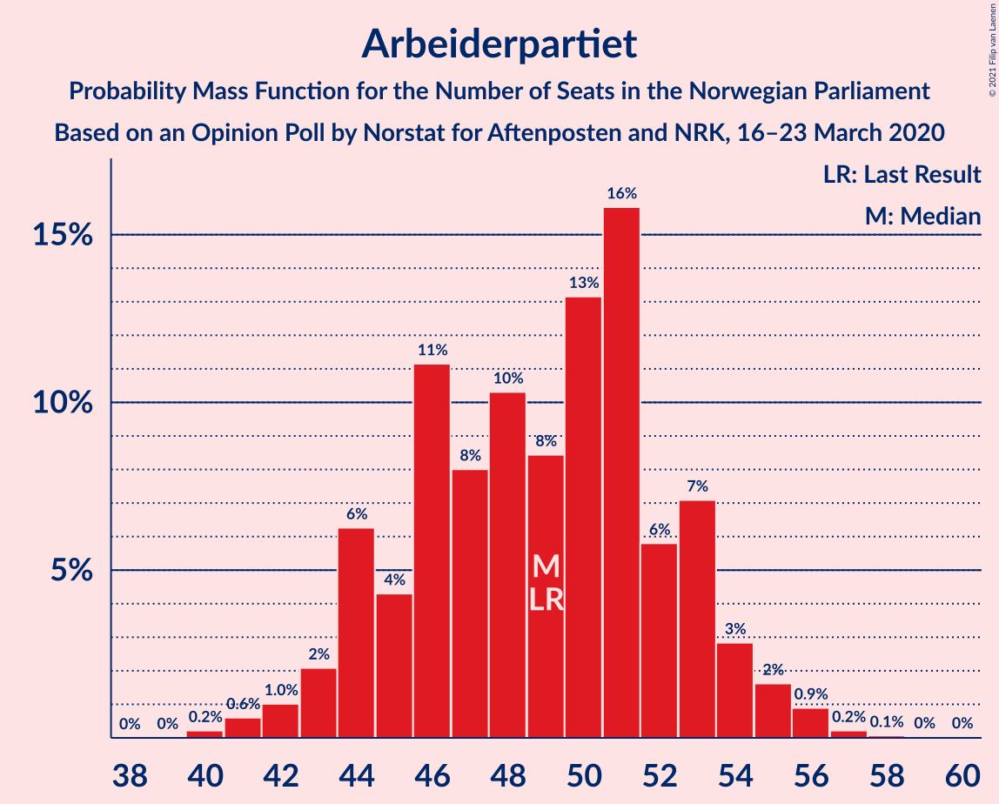

| Number of Seats | Probability | Accumulated | Special Marks |
|:---------------:|:-----------:|:-----------:|:-------------:|
| 40 | 0.2% | 100% |  |
| 41 | 0.6% | 99.8% |  |
| 42 | 1.0% | 99.2% |  |
| 43 | 2% | 98% |  |
| 44 | 6% | 96% |  |
| 45 | 4% | 90% |  |
| 46 | 11% | 85% |  |
| 47 | 8% | 74% |  |
| 48 | 10% | 66% |  |
| 49 | 8% | 56% | Last Result, Median |
| 50 | 13% | 48% |  |
| 51 | 16% | 34% |  |
| 52 | 6% | 19% |  |
| 53 | 7% | 13% |  |
| 54 | 3% | 6% |  |
| 55 | 2% | 3% |  |
| 56 | 0.9% | 1.2% |  |
| 57 | 0.2% | 0.4% |  |
| 58 | 0.1% | 0.1% |  |
| 59 | 0% | 0.1% |  |
| 60 | 0% | 0% |  |

### Høyre

*For a full overview of the results for this party, see the [Høyre](party-høyre.html) page.*

| Number of Seats | Probability | Accumulated | Special Marks |
|:---------------:|:-----------:|:-----------:|:-------------:|
| 34 | 0.1% | 100% |  |
| 35 | 0.5% | 99.9% |  |
| 36 | 0.8% | 99.3% |  |
| 37 | 4% | 98.6% |  |
| 38 | 5% | 95% |  |
| 39 | 14% | 89% |  |
| 40 | 9% | 76% |  |
| 41 | 12% | 67% |  |
| 42 | 14% | 55% | Median |
| 43 | 12% | 42% |  |
| 44 | 9% | 29% |  |
| 45 | 8% | 21% | Last Result |
| 46 | 6% | 12% |  |
| 47 | 3% | 7% |  |
| 48 | 2% | 3% |  |
| 49 | 0.6% | 1.3% |  |
| 50 | 0.2% | 0.6% |  |
| 51 | 0.1% | 0.5% |  |
| 52 | 0.2% | 0.3% |  |
| 53 | 0.1% | 0.1% |  |
| 54 | 0% | 0% |  |

### Senterpartiet

*For a full overview of the results for this party, see the [Senterpartiet](party-senterpartiet.html) page.*

| Number of Seats | Probability | Accumulated | Special Marks |
|:---------------:|:-----------:|:-----------:|:-------------:|
| 19 | 0% | 100% | Last Result |
| 20 | 0.1% | 100% |  |
| 21 | 0.5% | 99.9% |  |
| 22 | 0.8% | 99.3% |  |
| 23 | 2% | 98.5% |  |
| 24 | 8% | 96% |  |
| 25 | 13% | 88% |  |
| 26 | 15% | 76% |  |
| 27 | 31% | 61% | Median |
| 28 | 11% | 29% |  |
| 29 | 5% | 18% |  |
| 30 | 5% | 13% |  |
| 31 | 5% | 8% |  |
| 32 | 1.2% | 3% |  |
| 33 | 0.5% | 2% |  |
| 34 | 1.1% | 2% |  |
| 35 | 0.7% | 0.7% |  |
| 36 | 0% | 0% |  |

### Fremskrittspartiet

*For a full overview of the results for this party, see the [Fremskrittspartiet](party-fremskrittspartiet.html) page.*

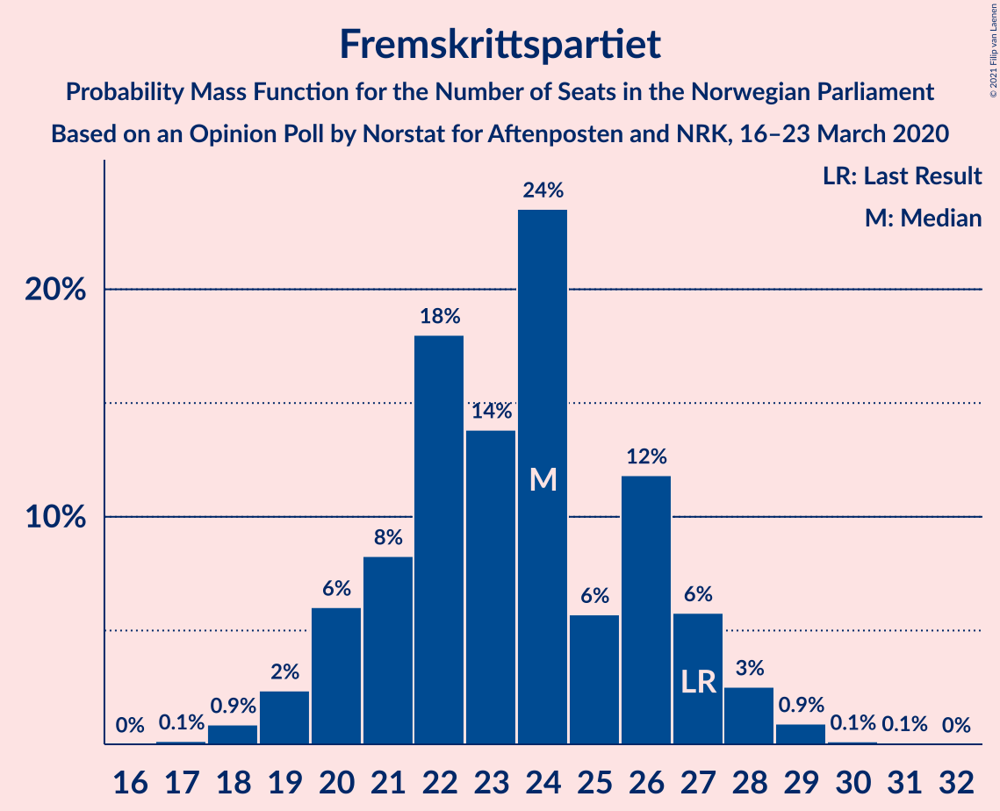

| Number of Seats | Probability | Accumulated | Special Marks |
|:---------------:|:-----------:|:-----------:|:-------------:|
| 17 | 0.1% | 100% |  |
| 18 | 0.9% | 99.8% |  |
| 19 | 2% | 99.0% |  |
| 20 | 6% | 97% |  |
| 21 | 8% | 91% |  |
| 22 | 18% | 82% |  |
| 23 | 14% | 64% |  |
| 24 | 24% | 50% | Median |
| 25 | 6% | 27% |  |
| 26 | 12% | 21% |  |
| 27 | 6% | 9% | Last Result |
| 28 | 3% | 4% |  |
| 29 | 0.9% | 1.1% |  |
| 30 | 0.1% | 0.2% |  |
| 31 | 0.1% | 0.1% |  |
| 32 | 0% | 0% |  |

### Sosialistisk Venstreparti

*For a full overview of the results for this party, see the [Sosialistisk Venstreparti](party-sosialistiskvenstreparti.html) page.*

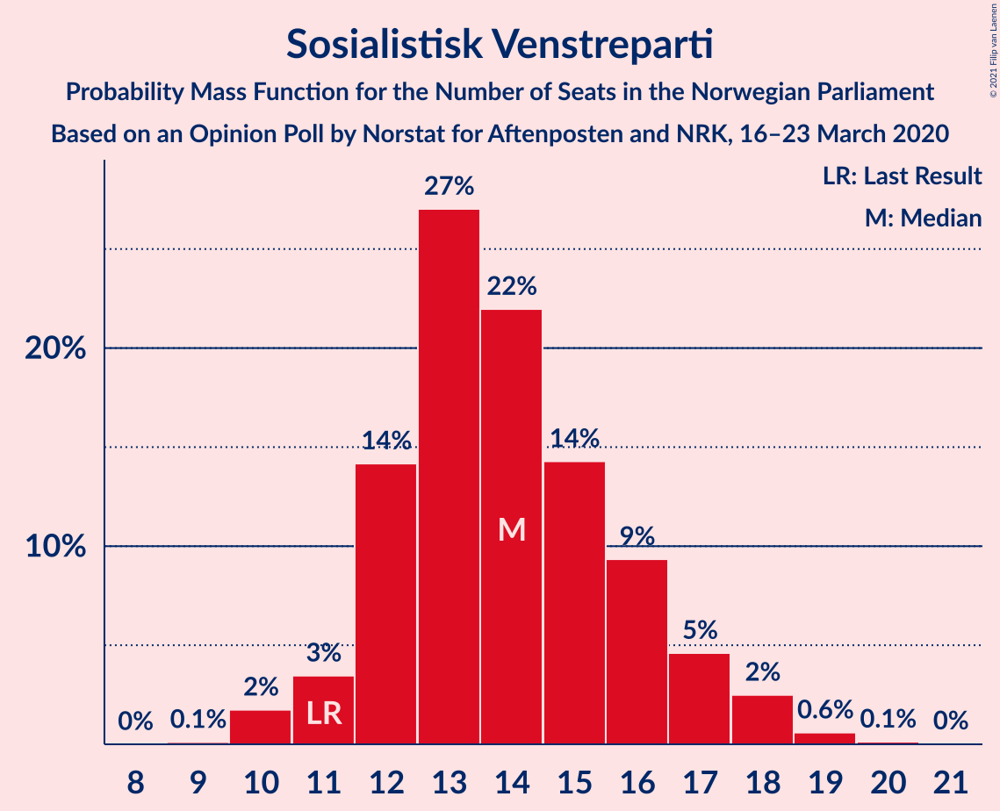

| Number of Seats | Probability | Accumulated | Special Marks |
|:---------------:|:-----------:|:-----------:|:-------------:|
| 9 | 0.1% | 100% |  |
| 10 | 2% | 99.9% |  |
| 11 | 3% | 98% | Last Result |
| 12 | 14% | 95% |  |
| 13 | 27% | 80% |  |
| 14 | 22% | 53% | Median |
| 15 | 14% | 31% |  |
| 16 | 9% | 17% |  |
| 17 | 5% | 8% |  |
| 18 | 2% | 3% |  |
| 19 | 0.6% | 0.8% |  |
| 20 | 0.1% | 0.2% |  |
| 21 | 0% | 0% |  |

### Rødt

*For a full overview of the results for this party, see the [Rødt](party-rødt.html) page.*

| Number of Seats | Probability | Accumulated | Special Marks |
|:---------------:|:-----------:|:-----------:|:-------------:|
| 1 | 2% | 100% | Last Result |
| 2 | 39% | 98% |  |
| 3 | 0% | 59% |  |
| 4 | 0% | 59% |  |
| 5 | 0% | 59% |  |
| 6 | 0% | 59% |  |
| 7 | 6% | 59% |  |
| 8 | 32% | 53% | Median |
| 9 | 14% | 21% |  |
| 10 | 5% | 7% |  |
| 11 | 2% | 2% |  |
| 12 | 0.3% | 0.4% |  |
| 13 | 0% | 0% |  |

### Miljøpartiet De Grønne

*For a full overview of the results for this party, see the [Miljøpartiet De Grønne](party-miljøpartietdegrønne.html) page.*

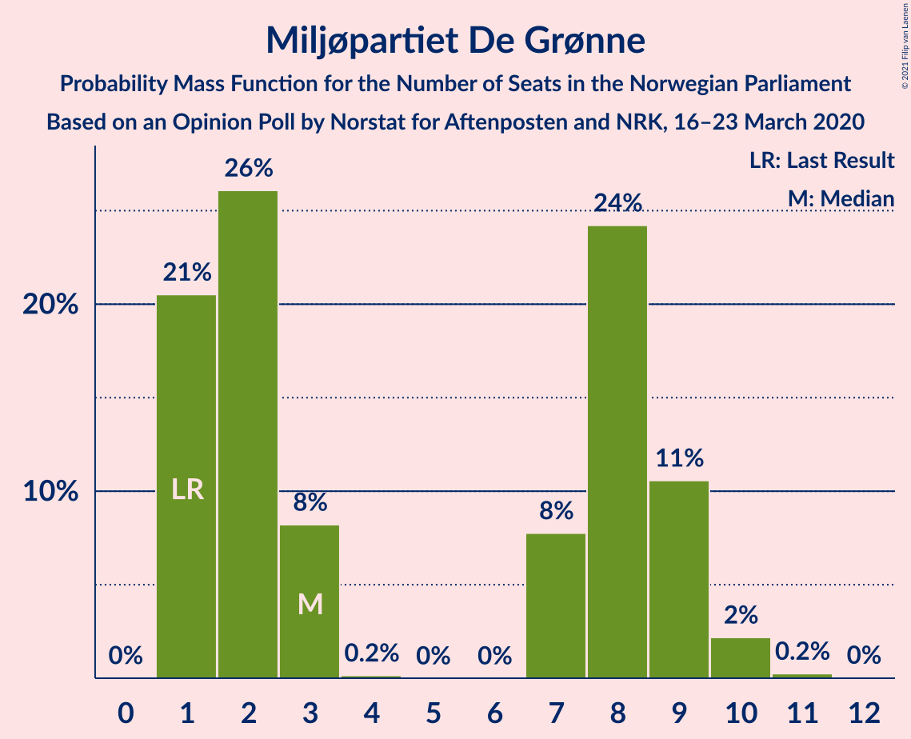

| Number of Seats | Probability | Accumulated | Special Marks |
|:---------------:|:-----------:|:-----------:|:-------------:|
| 1 | 21% | 100% | Last Result |
| 2 | 26% | 79% |  |
| 3 | 8% | 53% | Median |
| 4 | 0.2% | 45% |  |
| 5 | 0% | 45% |  |
| 6 | 0% | 45% |  |
| 7 | 8% | 45% |  |
| 8 | 24% | 37% |  |
| 9 | 11% | 13% |  |
| 10 | 2% | 2% |  |
| 11 | 0.2% | 0.3% |  |
| 12 | 0% | 0% |  |

### Kristelig Folkeparti

*For a full overview of the results for this party, see the [Kristelig Folkeparti](party-kristeligfolkeparti.html) page.*

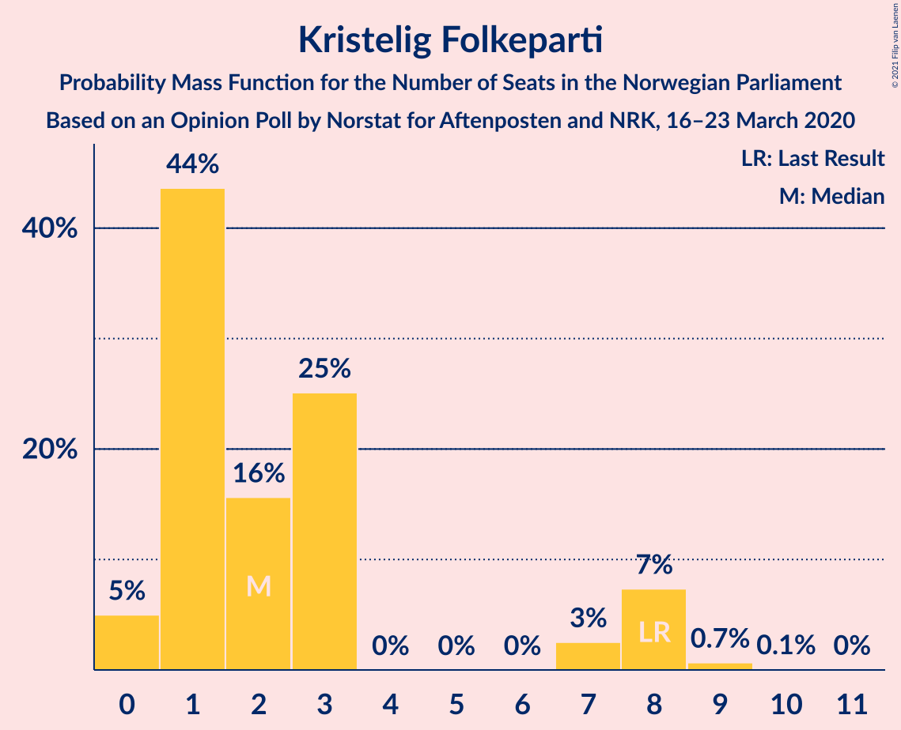

| Number of Seats | Probability | Accumulated | Special Marks |
|:---------------:|:-----------:|:-----------:|:-------------:|
| 0 | 5% | 100% |  |
| 1 | 44% | 95% |  |
| 2 | 16% | 51% | Median |
| 3 | 25% | 36% |  |
| 4 | 0% | 11% |  |
| 5 | 0% | 11% |  |
| 6 | 0% | 11% |  |
| 7 | 3% | 11% |  |
| 8 | 7% | 8% | Last Result |
| 9 | 0.7% | 0.8% |  |
| 10 | 0.1% | 0.1% |  |
| 11 | 0% | 0% |  |

### Venstre

*For a full overview of the results for this party, see the [Venstre](party-venstre.html) page.*

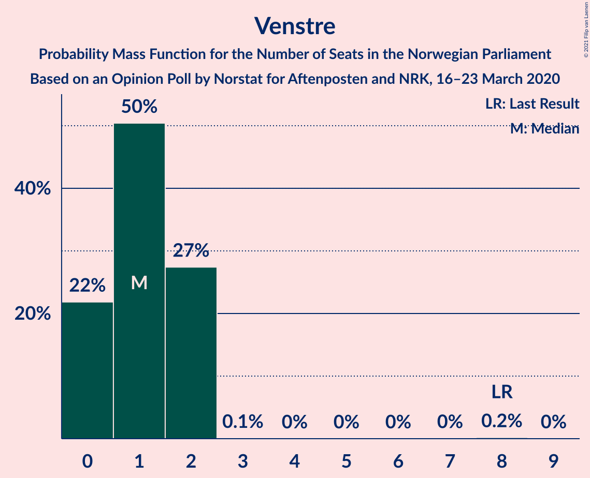

| Number of Seats | Probability | Accumulated | Special Marks |
|:---------------:|:-----------:|:-----------:|:-------------:|
| 0 | 22% | 100% |  |
| 1 | 50% | 78% | Median |
| 2 | 27% | 28% |  |
| 3 | 0.1% | 0.3% |  |
| 4 | 0% | 0.3% |  |
| 5 | 0% | 0.3% |  |
| 6 | 0% | 0.3% |  |
| 7 | 0% | 0.2% |  |
| 8 | 0.2% | 0.2% | Last Result |
| 9 | 0% | 0% |  |

## Coalitions

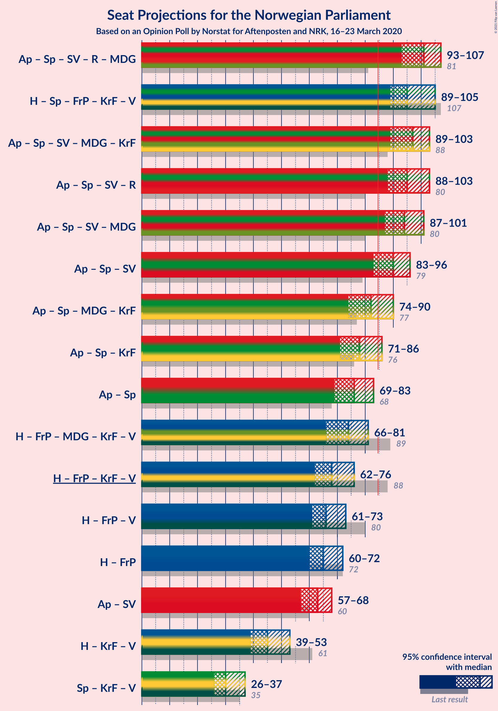

### Confidence Intervals

| Coalition | Last Result | Median | Majority? | 80% Confidence Interval | 90% Confidence Interval | 95% Confidence Interval | 99% Confidence Interval |
|:---------:|:-----------:|:------:|:---------:|:-----------------------:|:-----------------------:|:-----------------------:|:-----------------------:|
| Arbeiderpartiet – Senterpartiet – Sosialistisk Venstreparti – Rødt – Miljøpartiet De Grønne | 81 | 101 | 100% | 94–106 | 94–106 | 93–107 | 89–108 |
| Høyre – Senterpartiet – Fremskrittspartiet – Kristelig Folkeparti – Venstre | 107 | 95 | 99.8% | 90–101 | 90–102 | 89–105 | 87–106 |
| Arbeiderpartiet – Senterpartiet – Sosialistisk Venstreparti – Miljøpartiet De Grønne – Kristelig Folkeparti | 88 | 97 | 99.9% | 92–101 | 90–102 | 89–103 | 88–105 |
| Arbeiderpartiet – Senterpartiet – Sosialistisk Venstreparti – Rødt | 80 | 95 | 99.7% | 91–101 | 89–102 | 88–103 | 85–104 |
| Arbeiderpartiet – Senterpartiet – Sosialistisk Venstreparti – Miljøpartiet De Grønne | 80 | 94 | 99.5% | 89–100 | 87–100 | 87–101 | 84–103 |
| Arbeiderpartiet – Senterpartiet – Sosialistisk Venstreparti | 79 | 90 | 91% | 85–94 | 83–95 | 83–96 | 80–99 |
| Arbeiderpartiet – Senterpartiet – Miljøpartiet De Grønne – Kristelig Folkeparti | 77 | 82 | 43% | 78–89 | 76–89 | 74–90 | 72–92 |
| Arbeiderpartiet – Senterpartiet – Kristelig Folkeparti | 76 | 78 | 6% | 73–83 | 72–85 | 71–86 | 68–89 |
| Arbeiderpartiet – Senterpartiet | 68 | 76 | 0.8% | 71–80 | 69–81 | 69–83 | 66–85 |
| Høyre – Fremskrittspartiet – Miljøpartiet De Grønne – Kristelig Folkeparti – Venstre | 89 | 74 | 0.3% | 68–78 | 67–80 | 66–81 | 65–84 |
| Høyre – Fremskrittspartiet – Kristelig Folkeparti – Venstre | 88 | 68 | 0% | 63–75 | 63–75 | 62–76 | 61–80 |
| Høyre – Fremskrittspartiet – Venstre | 80 | 66 | 0% | 62–72 | 61–73 | 61–73 | 59–75 |
| Høyre – Fremskrittspartiet | 72 | 65 | 0% | 61–71 | 60–71 | 60–72 | 57–74 |
| Arbeiderpartiet – Sosialistisk Venstreparti | 60 | 63 | 0% | 58–66 | 58–67 | 57–68 | 55–72 |
| Høyre – Kristelig Folkeparti – Venstre | 61 | 45 | 0% | 41–50 | 40–51 | 39–53 | 37–55 |
| Senterpartiet – Kristelig Folkeparti – Venstre | 35 | 30 | 0% | 27–35 | 27–36 | 26–37 | 24–40 |

### Arbeiderpartiet – Senterpartiet – Sosialistisk Venstreparti – Rødt – Miljøpartiet De Grønne

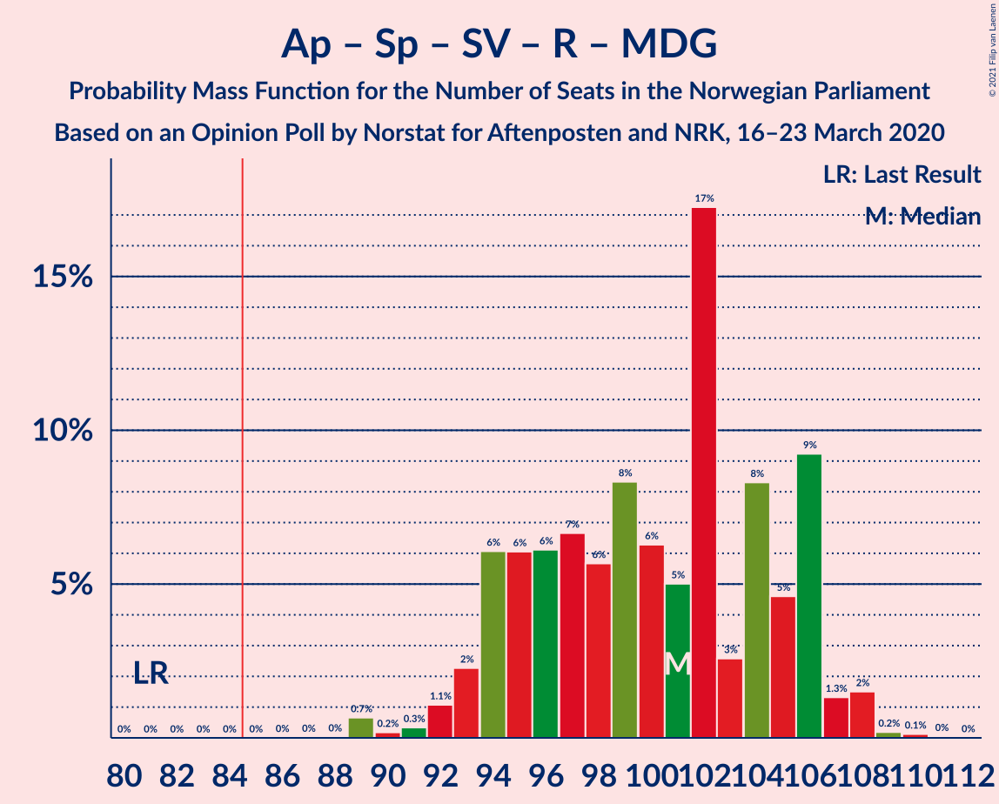

| Number of Seats | Probability | Accumulated | Special Marks |
|:---------------:|:-----------:|:-----------:|:-------------:|
| 81 | 0% | 100% | Last Result |
| 82 | 0% | 100% |  |
| 83 | 0% | 100% |  |
| 84 | 0% | 100% |  |
| 85 | 0% | 100% | Majority |
| 86 | 0% | 100% |  |
| 87 | 0% | 100% |  |
| 88 | 0% | 100% |  |
| 89 | 0.7% | 99.9% |  |
| 90 | 0.2% | 99.3% |  |
| 91 | 0.3% | 99.1% |  |
| 92 | 1.1% | 98.7% |  |
| 93 | 2% | 98% |  |
| 94 | 6% | 95% |  |
| 95 | 6% | 89% |  |
| 96 | 6% | 83% |  |
| 97 | 7% | 77% |  |
| 98 | 6% | 71% |  |
| 99 | 8% | 65% |  |
| 100 | 6% | 57% |  |
| 101 | 5% | 50% | Median |
| 102 | 17% | 45% |  |
| 103 | 3% | 28% |  |
| 104 | 8% | 25% |  |
| 105 | 5% | 17% |  |
| 106 | 9% | 12% |  |
| 107 | 1.3% | 3% |  |
| 108 | 2% | 2% |  |
| 109 | 0.2% | 0.4% |  |
| 110 | 0.1% | 0.2% |  |
| 111 | 0% | 0.1% |  |
| 112 | 0% | 0% |  |

### Høyre – Senterpartiet – Fremskrittspartiet – Kristelig Folkeparti – Venstre

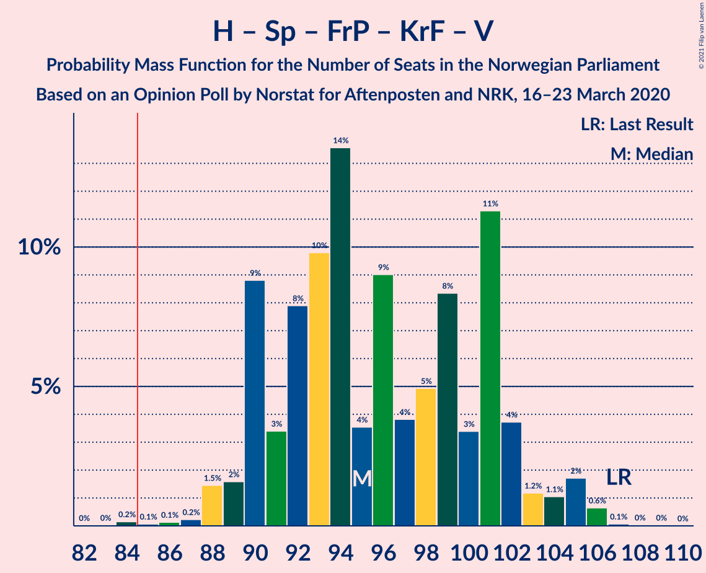

| Number of Seats | Probability | Accumulated | Special Marks |
|:---------------:|:-----------:|:-----------:|:-------------:|
| 83 | 0% | 100% |  |
| 84 | 0.2% | 99.9% |  |
| 85 | 0.1% | 99.8% | Majority |
| 86 | 0.1% | 99.7% |  |
| 87 | 0.2% | 99.6% |  |
| 88 | 1.5% | 99.4% |  |
| 89 | 2% | 98% |  |
| 90 | 9% | 96% |  |
| 91 | 3% | 88% |  |
| 92 | 8% | 84% |  |
| 93 | 10% | 76% |  |
| 94 | 14% | 66% |  |
| 95 | 4% | 53% |  |
| 96 | 9% | 49% | Median |
| 97 | 4% | 40% |  |
| 98 | 5% | 36% |  |
| 99 | 8% | 32% |  |
| 100 | 3% | 23% |  |
| 101 | 11% | 20% |  |
| 102 | 4% | 8% |  |
| 103 | 1.2% | 5% |  |
| 104 | 1.1% | 4% |  |
| 105 | 2% | 3% |  |
| 106 | 0.6% | 0.8% |  |
| 107 | 0.1% | 0.1% | Last Result |
| 108 | 0% | 0.1% |  |
| 109 | 0% | 0% |  |

### Arbeiderpartiet – Senterpartiet – Sosialistisk Venstreparti – Miljøpartiet De Grønne – Kristelig Folkeparti

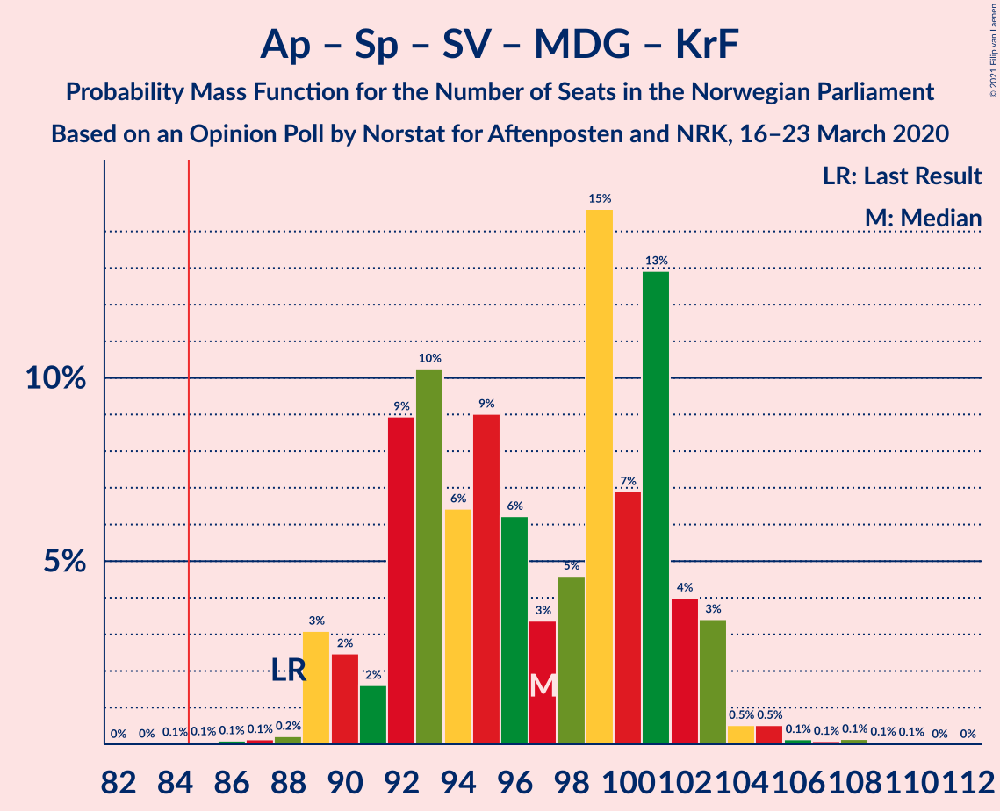

| Number of Seats | Probability | Accumulated | Special Marks |
|:---------------:|:-----------:|:-----------:|:-------------:|
| 84 | 0.1% | 100% |  |
| 85 | 0.1% | 99.9% | Majority |
| 86 | 0.1% | 99.9% |  |
| 87 | 0.1% | 99.8% |  |
| 88 | 0.2% | 99.6% | Last Result |
| 89 | 3% | 99.4% |  |
| 90 | 2% | 96% |  |
| 91 | 2% | 94% |  |
| 92 | 9% | 92% |  |
| 93 | 10% | 83% |  |
| 94 | 6% | 73% |  |
| 95 | 9% | 67% | Median |
| 96 | 6% | 58% |  |
| 97 | 3% | 51% |  |
| 98 | 5% | 48% |  |
| 99 | 15% | 43% |  |
| 100 | 7% | 29% |  |
| 101 | 13% | 22% |  |
| 102 | 4% | 9% |  |
| 103 | 3% | 5% |  |
| 104 | 0.5% | 2% |  |
| 105 | 0.5% | 1.0% |  |
| 106 | 0.1% | 0.5% |  |
| 107 | 0.1% | 0.4% |  |
| 108 | 0.1% | 0.3% |  |
| 109 | 0.1% | 0.1% |  |
| 110 | 0.1% | 0.1% |  |
| 111 | 0% | 0% |  |

### Arbeiderpartiet – Senterpartiet – Sosialistisk Venstreparti – Rødt

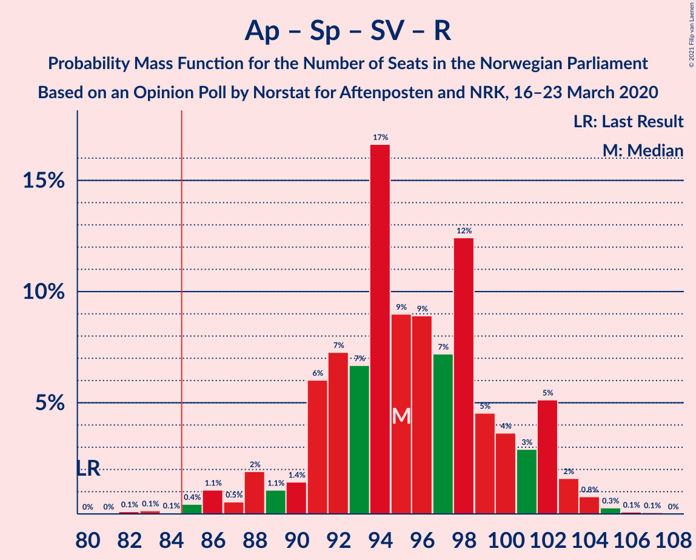

| Number of Seats | Probability | Accumulated | Special Marks |
|:---------------:|:-----------:|:-----------:|:-------------:|
| 80 | 0% | 100% | Last Result |
| 81 | 0% | 100% |  |
| 82 | 0.1% | 100% |  |
| 83 | 0.1% | 99.9% |  |
| 84 | 0.1% | 99.7% |  |
| 85 | 0.4% | 99.7% | Majority |
| 86 | 1.1% | 99.2% |  |
| 87 | 0.5% | 98% |  |
| 88 | 2% | 98% |  |
| 89 | 1.1% | 96% |  |
| 90 | 1.4% | 95% |  |
| 91 | 6% | 93% |  |
| 92 | 7% | 87% |  |
| 93 | 7% | 80% |  |
| 94 | 17% | 73% |  |
| 95 | 9% | 57% |  |
| 96 | 9% | 48% |  |
| 97 | 7% | 39% |  |
| 98 | 12% | 31% | Median |
| 99 | 5% | 19% |  |
| 100 | 4% | 15% |  |
| 101 | 3% | 11% |  |
| 102 | 5% | 8% |  |
| 103 | 2% | 3% |  |
| 104 | 0.8% | 1.2% |  |
| 105 | 0.3% | 0.5% |  |
| 106 | 0.1% | 0.2% |  |
| 107 | 0.1% | 0.1% |  |
| 108 | 0% | 0% |  |

### Arbeiderpartiet – Senterpartiet – Sosialistisk Venstreparti – Miljøpartiet De Grønne

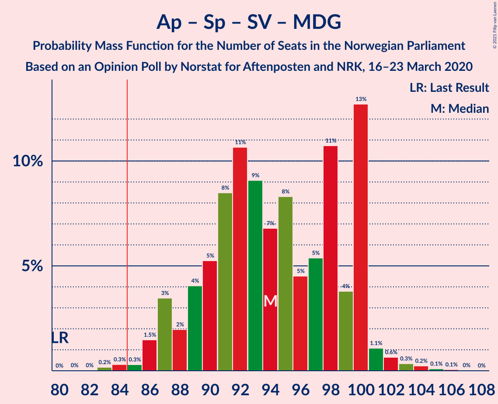

| Number of Seats | Probability | Accumulated | Special Marks |
|:---------------:|:-----------:|:-----------:|:-------------:|
| 80 | 0% | 100% | Last Result |
| 81 | 0% | 100% |  |
| 82 | 0% | 100% |  |
| 83 | 0.2% | 99.9% |  |
| 84 | 0.3% | 99.8% |  |
| 85 | 0.3% | 99.5% | Majority |
| 86 | 1.5% | 99.2% |  |
| 87 | 3% | 98% |  |
| 88 | 2% | 94% |  |
| 89 | 4% | 92% |  |
| 90 | 5% | 88% |  |
| 91 | 8% | 83% |  |
| 92 | 11% | 74% |  |
| 93 | 9% | 64% | Median |
| 94 | 7% | 55% |  |
| 95 | 8% | 48% |  |
| 96 | 5% | 40% |  |
| 97 | 5% | 35% |  |
| 98 | 11% | 30% |  |
| 99 | 4% | 19% |  |
| 100 | 13% | 15% |  |
| 101 | 1.1% | 3% |  |
| 102 | 0.6% | 1.4% |  |
| 103 | 0.3% | 0.8% |  |
| 104 | 0.2% | 0.4% |  |
| 105 | 0.1% | 0.2% |  |
| 106 | 0.1% | 0.1% |  |
| 107 | 0% | 0% |  |

### Arbeiderpartiet – Senterpartiet – Sosialistisk Venstreparti

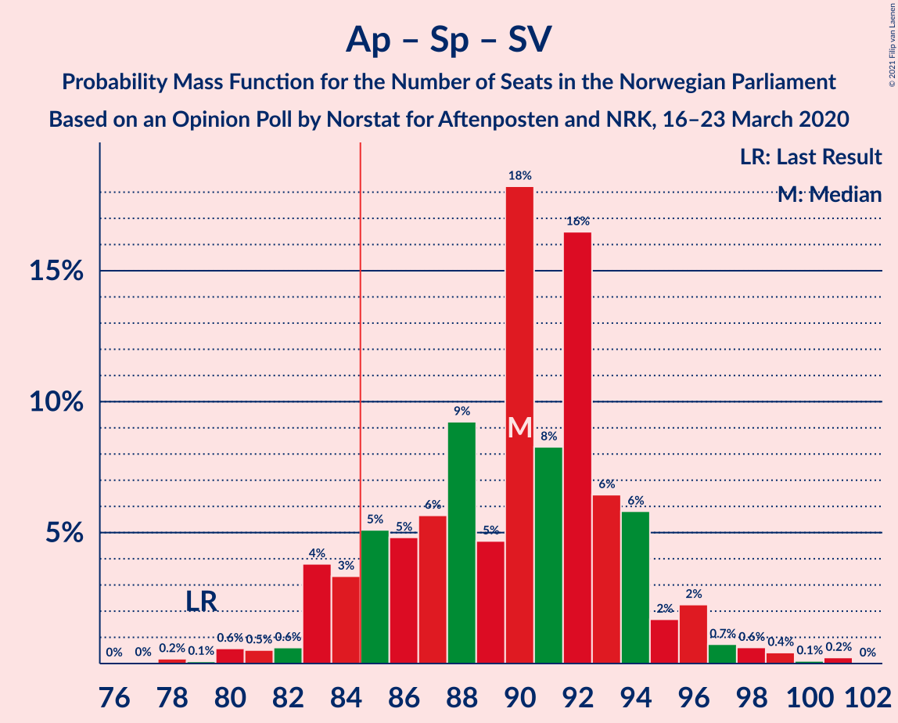

| Number of Seats | Probability | Accumulated | Special Marks |
|:---------------:|:-----------:|:-----------:|:-------------:|
| 77 | 0% | 100% |  |
| 78 | 0.2% | 99.9% |  |
| 79 | 0.1% | 99.8% | Last Result |
| 80 | 0.6% | 99.7% |  |
| 81 | 0.5% | 99.1% |  |
| 82 | 0.6% | 98.6% |  |
| 83 | 4% | 98% |  |
| 84 | 3% | 94% |  |
| 85 | 5% | 91% | Majority |
| 86 | 5% | 86% |  |
| 87 | 6% | 81% |  |
| 88 | 9% | 75% |  |
| 89 | 5% | 66% |  |
| 90 | 18% | 61% | Median |
| 91 | 8% | 43% |  |
| 92 | 16% | 35% |  |
| 93 | 6% | 18% |  |
| 94 | 6% | 12% |  |
| 95 | 2% | 6% |  |
| 96 | 2% | 4% |  |
| 97 | 0.7% | 2% |  |
| 98 | 0.6% | 1.4% |  |
| 99 | 0.4% | 0.8% |  |
| 100 | 0.1% | 0.4% |  |
| 101 | 0.2% | 0.3% |  |
| 102 | 0% | 0% |  |

### Arbeiderpartiet – Senterpartiet – Miljøpartiet De Grønne – Kristelig Folkeparti

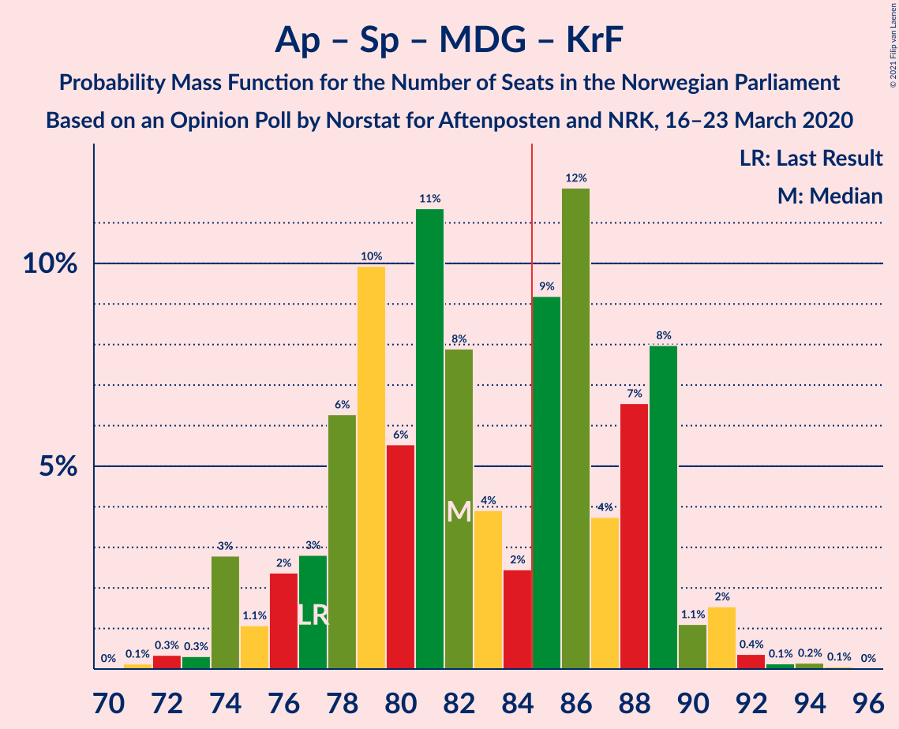

| Number of Seats | Probability | Accumulated | Special Marks |
|:---------------:|:-----------:|:-----------:|:-------------:|
| 71 | 0.1% | 100% |  |
| 72 | 0.3% | 99.8% |  |
| 73 | 0.3% | 99.5% |  |
| 74 | 3% | 99.2% |  |
| 75 | 1.1% | 96% |  |
| 76 | 2% | 95% |  |
| 77 | 3% | 93% | Last Result |
| 78 | 6% | 90% |  |
| 79 | 10% | 84% |  |
| 80 | 6% | 74% |  |
| 81 | 11% | 68% | Median |
| 82 | 8% | 57% |  |
| 83 | 4% | 49% |  |
| 84 | 2% | 45% |  |
| 85 | 9% | 43% | Majority |
| 86 | 12% | 34% |  |
| 87 | 4% | 22% |  |
| 88 | 7% | 18% |  |
| 89 | 8% | 11% |  |
| 90 | 1.1% | 3% |  |
| 91 | 2% | 2% |  |
| 92 | 0.4% | 0.8% |  |
| 93 | 0.1% | 0.4% |  |
| 94 | 0.2% | 0.2% |  |
| 95 | 0.1% | 0.1% |  |
| 96 | 0% | 0% |  |

### Arbeiderpartiet – Senterpartiet – Kristelig Folkeparti

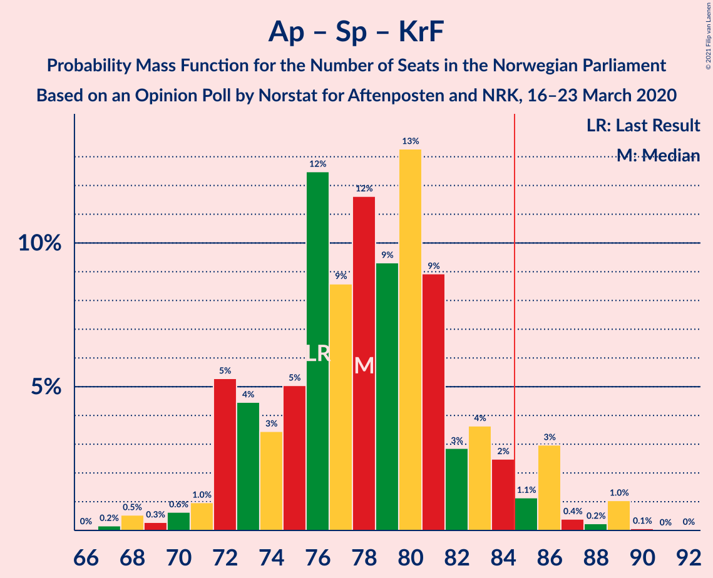

| Number of Seats | Probability | Accumulated | Special Marks |
|:---------------:|:-----------:|:-----------:|:-------------:|
| 66 | 0% | 100% |  |
| 67 | 0.2% | 99.9% |  |
| 68 | 0.5% | 99.8% |  |
| 69 | 0.3% | 99.2% |  |
| 70 | 0.6% | 98.9% |  |
| 71 | 1.0% | 98% |  |
| 72 | 5% | 97% |  |
| 73 | 4% | 92% |  |
| 74 | 3% | 88% |  |
| 75 | 5% | 84% |  |
| 76 | 12% | 79% | Last Result |
| 77 | 9% | 67% |  |
| 78 | 12% | 58% | Median |
| 79 | 9% | 46% |  |
| 80 | 13% | 37% |  |
| 81 | 9% | 24% |  |
| 82 | 3% | 15% |  |
| 83 | 4% | 12% |  |
| 84 | 2% | 8% |  |
| 85 | 1.1% | 6% | Majority |
| 86 | 3% | 5% |  |
| 87 | 0.4% | 2% |  |
| 88 | 0.2% | 1.4% |  |
| 89 | 1.0% | 1.2% |  |
| 90 | 0.1% | 0.1% |  |
| 91 | 0% | 0% |  |

### Arbeiderpartiet – Senterpartiet

| Number of Seats | Probability | Accumulated | Special Marks |
|:---------------:|:-----------:|:-----------:|:-------------:|
| 64 | 0.1% | 100% |  |
| 65 | 0.1% | 99.9% |  |
| 66 | 0.6% | 99.8% |  |
| 67 | 0.5% | 99.2% |  |
| 68 | 0.6% | 98.7% | Last Result |
| 69 | 4% | 98% |  |
| 70 | 4% | 94% |  |
| 71 | 2% | 91% |  |
| 72 | 5% | 89% |  |
| 73 | 11% | 83% |  |
| 74 | 5% | 73% |  |
| 75 | 10% | 68% |  |
| 76 | 10% | 57% | Median |
| 77 | 13% | 47% |  |
| 78 | 12% | 34% |  |
| 79 | 6% | 22% |  |
| 80 | 8% | 15% |  |
| 81 | 4% | 8% |  |
| 82 | 0.8% | 4% |  |
| 83 | 2% | 3% |  |
| 84 | 0.4% | 1.3% |  |
| 85 | 0.7% | 0.8% | Majority |
| 86 | 0.1% | 0.1% |  |
| 87 | 0% | 0% |  |

### Høyre – Fremskrittspartiet – Miljøpartiet De Grønne – Kristelig Folkeparti – Venstre

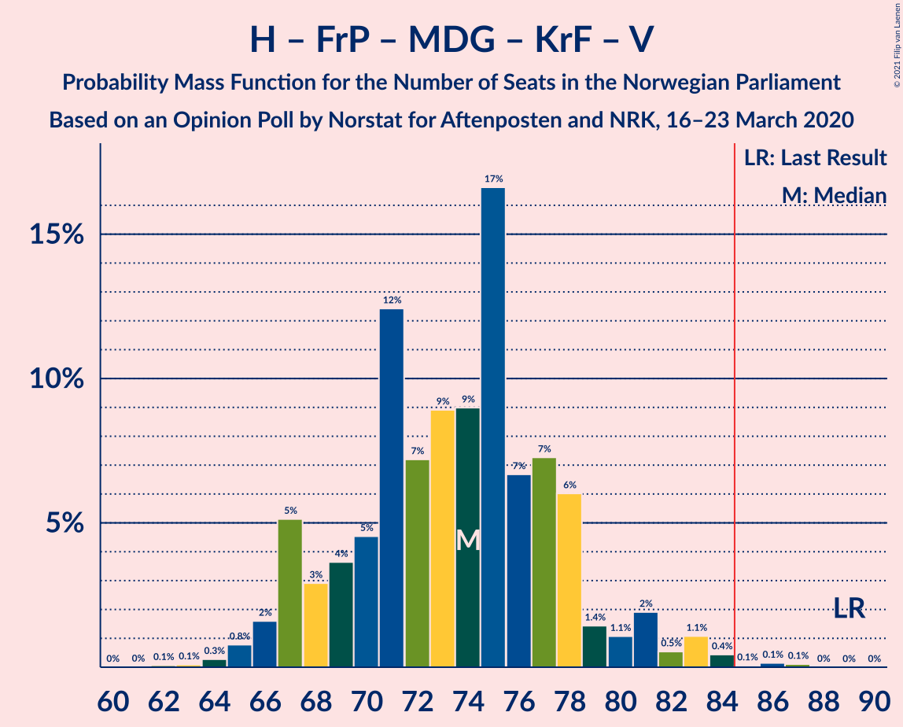

| Number of Seats | Probability | Accumulated | Special Marks |
|:---------------:|:-----------:|:-----------:|:-------------:|
| 62 | 0.1% | 100% |  |
| 63 | 0.1% | 99.9% |  |
| 64 | 0.3% | 99.8% |  |
| 65 | 0.8% | 99.5% |  |
| 66 | 2% | 98.8% |  |
| 67 | 5% | 97% |  |
| 68 | 3% | 92% |  |
| 69 | 4% | 89% |  |
| 70 | 5% | 85% |  |
| 71 | 12% | 81% |  |
| 72 | 7% | 69% | Median |
| 73 | 9% | 61% |  |
| 74 | 9% | 52% |  |
| 75 | 17% | 43% |  |
| 76 | 7% | 27% |  |
| 77 | 7% | 20% |  |
| 78 | 6% | 13% |  |
| 79 | 1.4% | 7% |  |
| 80 | 1.1% | 5% |  |
| 81 | 2% | 4% |  |
| 82 | 0.5% | 2% |  |
| 83 | 1.1% | 2% |  |
| 84 | 0.4% | 0.8% |  |
| 85 | 0.1% | 0.3% | Majority |
| 86 | 0.1% | 0.3% |  |
| 87 | 0.1% | 0.1% |  |
| 88 | 0% | 0% |  |
| 89 | 0% | 0% | Last Result |

### Høyre – Fremskrittspartiet – Kristelig Folkeparti – Venstre

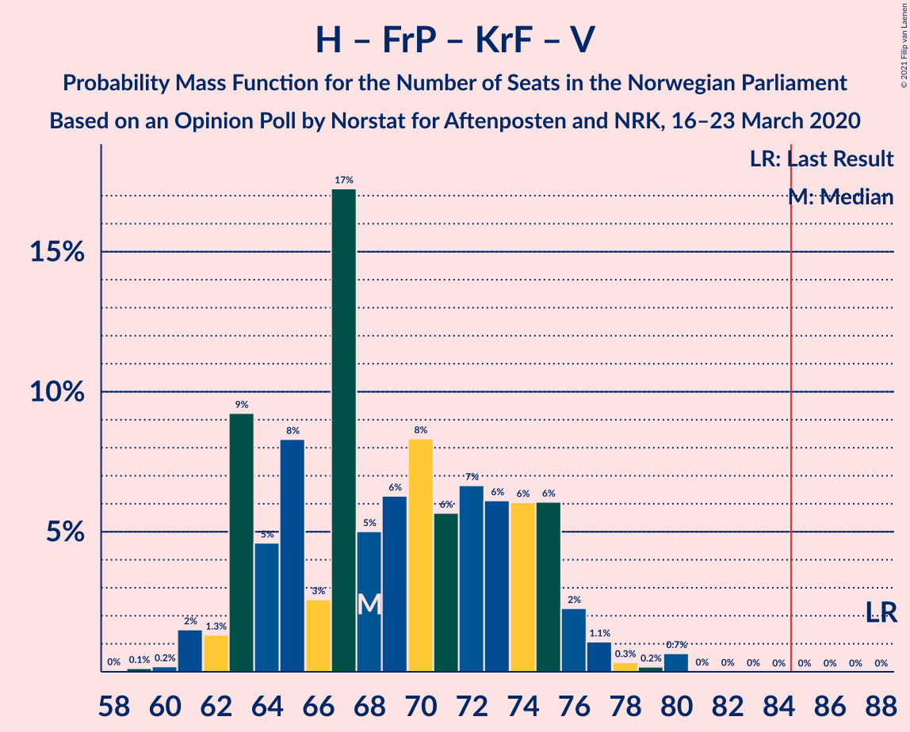

| Number of Seats | Probability | Accumulated | Special Marks |
|:---------------:|:-----------:|:-----------:|:-------------:|
| 58 | 0% | 100% |  |
| 59 | 0.1% | 99.9% |  |
| 60 | 0.2% | 99.8% |  |
| 61 | 2% | 99.6% |  |
| 62 | 1.3% | 98% |  |
| 63 | 9% | 97% |  |
| 64 | 5% | 88% |  |
| 65 | 8% | 83% |  |
| 66 | 3% | 75% |  |
| 67 | 17% | 72% |  |
| 68 | 5% | 55% |  |
| 69 | 6% | 50% | Median |
| 70 | 8% | 43% |  |
| 71 | 6% | 35% |  |
| 72 | 7% | 29% |  |
| 73 | 6% | 23% |  |
| 74 | 6% | 17% |  |
| 75 | 6% | 11% |  |
| 76 | 2% | 5% |  |
| 77 | 1.1% | 2% |  |
| 78 | 0.3% | 1.3% |  |
| 79 | 0.2% | 0.9% |  |
| 80 | 0.7% | 0.7% |  |
| 81 | 0% | 0.1% |  |
| 82 | 0% | 0% |  |
| 83 | 0% | 0% |  |
| 84 | 0% | 0% |  |
| 85 | 0% | 0% | Majority |
| 86 | 0% | 0% |  |
| 87 | 0% | 0% |  |
| 88 | 0% | 0% | Last Result |

### Høyre – Fremskrittspartiet – Venstre

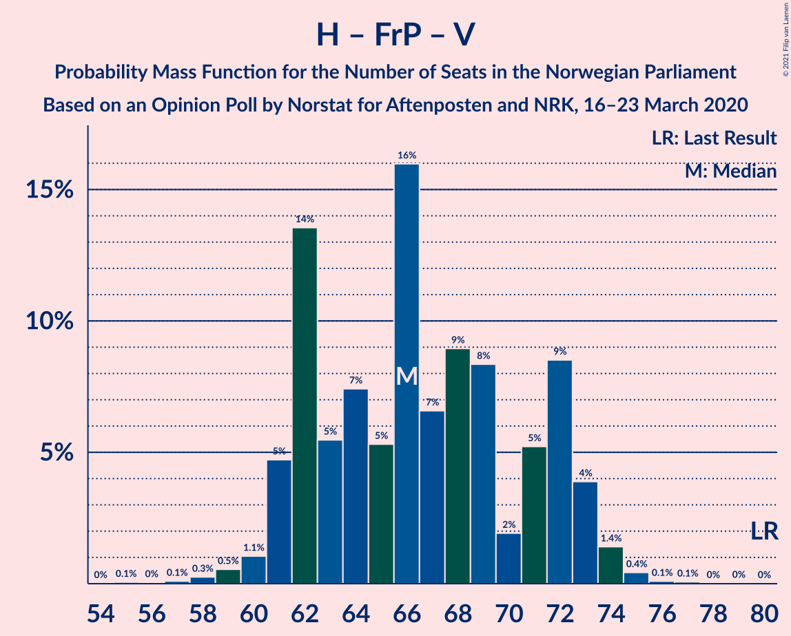

| Number of Seats | Probability | Accumulated | Special Marks |
|:---------------:|:-----------:|:-----------:|:-------------:|
| 55 | 0.1% | 100% |  |
| 56 | 0% | 99.9% |  |
| 57 | 0.1% | 99.9% |  |
| 58 | 0.3% | 99.8% |  |
| 59 | 0.5% | 99.5% |  |
| 60 | 1.1% | 99.0% |  |
| 61 | 5% | 98% |  |
| 62 | 14% | 93% |  |
| 63 | 5% | 80% |  |
| 64 | 7% | 74% |  |
| 65 | 5% | 67% |  |
| 66 | 16% | 61% |  |
| 67 | 7% | 45% | Median |
| 68 | 9% | 39% |  |
| 69 | 8% | 30% |  |
| 70 | 2% | 22% |  |
| 71 | 5% | 20% |  |
| 72 | 9% | 14% |  |
| 73 | 4% | 6% |  |
| 74 | 1.4% | 2% |  |
| 75 | 0.4% | 0.6% |  |
| 76 | 0.1% | 0.2% |  |
| 77 | 0.1% | 0.1% |  |
| 78 | 0% | 0.1% |  |
| 79 | 0% | 0% |  |
| 80 | 0% | 0% | Last Result |

### Høyre – Fremskrittspartiet

| Number of Seats | Probability | Accumulated | Special Marks |
|:---------------:|:-----------:|:-----------:|:-------------:|
| 54 | 0% | 100% |  |
| 55 | 0.1% | 99.9% |  |
| 56 | 0.1% | 99.9% |  |
| 57 | 0.4% | 99.8% |  |
| 58 | 0.5% | 99.4% |  |
| 59 | 1.3% | 98.9% |  |
| 60 | 4% | 98% |  |
| 61 | 14% | 94% |  |
| 62 | 6% | 80% |  |
| 63 | 6% | 74% |  |
| 64 | 8% | 68% |  |
| 65 | 11% | 59% |  |
| 66 | 13% | 49% | Median |
| 67 | 10% | 36% |  |
| 68 | 4% | 26% |  |
| 69 | 4% | 22% |  |
| 70 | 3% | 18% |  |
| 71 | 11% | 15% |  |
| 72 | 3% | 4% | Last Result |
| 73 | 0.7% | 1.5% |  |
| 74 | 0.5% | 0.7% |  |
| 75 | 0.2% | 0.3% |  |
| 76 | 0% | 0.1% |  |
| 77 | 0% | 0% |  |

### Arbeiderpartiet – Sosialistisk Venstreparti

| Number of Seats | Probability | Accumulated | Special Marks |
|:---------------:|:-----------:|:-----------:|:-------------:|
| 52 | 0.1% | 100% |  |
| 53 | 0.1% | 99.9% |  |
| 54 | 0.2% | 99.8% |  |
| 55 | 0.6% | 99.6% |  |
| 56 | 1.5% | 99.0% |  |
| 57 | 2% | 98% |  |
| 58 | 7% | 96% |  |
| 59 | 7% | 89% |  |
| 60 | 9% | 81% | Last Result |
| 61 | 9% | 72% |  |
| 62 | 4% | 63% |  |
| 63 | 11% | 59% | Median |
| 64 | 12% | 48% |  |
| 65 | 16% | 36% |  |
| 66 | 10% | 19% |  |
| 67 | 5% | 9% |  |
| 68 | 2% | 4% |  |
| 69 | 0.9% | 2% |  |
| 70 | 0.4% | 1.5% |  |
| 71 | 0.5% | 1.1% |  |
| 72 | 0.3% | 0.5% |  |
| 73 | 0.2% | 0.3% |  |
| 74 | 0% | 0% |  |

### Høyre – Kristelig Folkeparti – Venstre

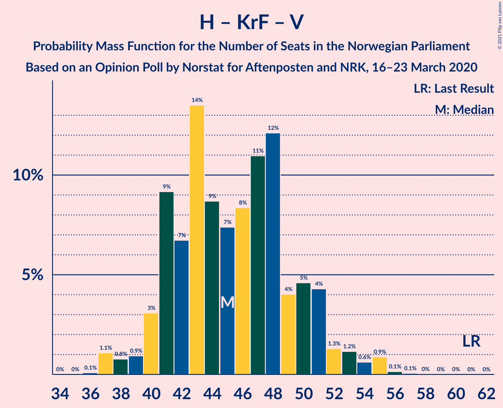

| Number of Seats | Probability | Accumulated | Special Marks |
|:---------------:|:-----------:|:-----------:|:-------------:|
| 36 | 0.1% | 100% |  |
| 37 | 1.1% | 99.9% |  |
| 38 | 0.8% | 98.8% |  |
| 39 | 0.9% | 98% |  |
| 40 | 3% | 97% |  |
| 41 | 9% | 94% |  |
| 42 | 7% | 85% |  |
| 43 | 14% | 78% |  |
| 44 | 9% | 65% |  |
| 45 | 7% | 56% | Median |
| 46 | 8% | 49% |  |
| 47 | 11% | 40% |  |
| 48 | 12% | 29% |  |
| 49 | 4% | 17% |  |
| 50 | 5% | 13% |  |
| 51 | 4% | 8% |  |
| 52 | 1.3% | 4% |  |
| 53 | 1.2% | 3% |  |
| 54 | 0.6% | 2% |  |
| 55 | 0.9% | 1.1% |  |
| 56 | 0.1% | 0.2% |  |
| 57 | 0.1% | 0.1% |  |
| 58 | 0% | 0% |  |
| 59 | 0% | 0% |  |
| 60 | 0% | 0% |  |
| 61 | 0% | 0% | Last Result |

### Senterpartiet – Kristelig Folkeparti – Venstre

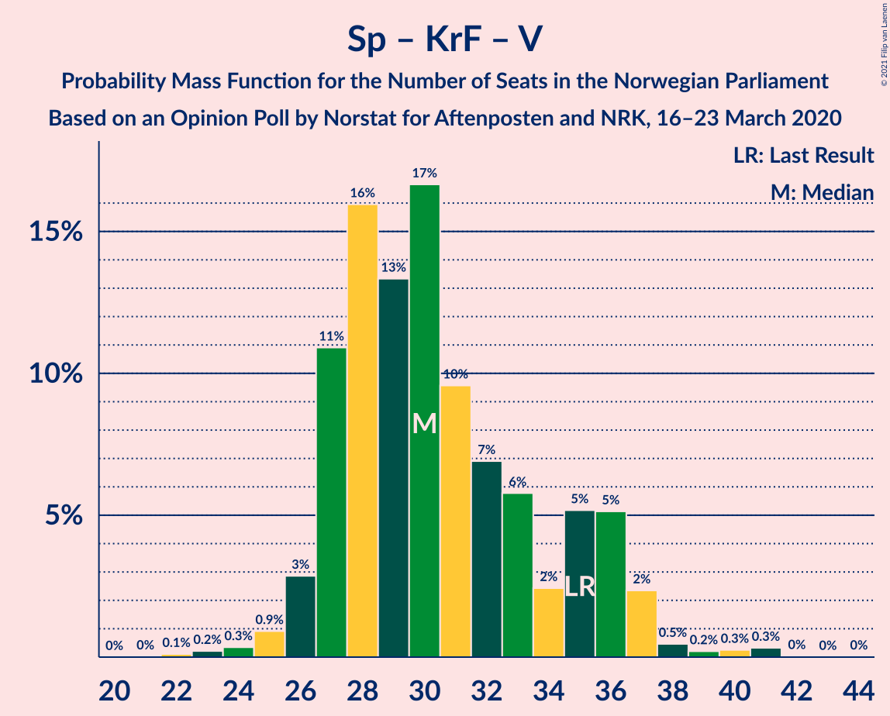

| Number of Seats | Probability | Accumulated | Special Marks |
|:---------------:|:-----------:|:-----------:|:-------------:|
| 22 | 0.1% | 100% |  |
| 23 | 0.2% | 99.9% |  |
| 24 | 0.3% | 99.7% |  |
| 25 | 0.9% | 99.3% |  |
| 26 | 3% | 98% |  |
| 27 | 11% | 96% |  |
| 28 | 16% | 85% |  |
| 29 | 13% | 69% |  |
| 30 | 17% | 55% | Median |
| 31 | 10% | 39% |  |
| 32 | 7% | 29% |  |
| 33 | 6% | 22% |  |
| 34 | 2% | 16% |  |
| 35 | 5% | 14% | Last Result |
| 36 | 5% | 9% |  |
| 37 | 2% | 4% |  |
| 38 | 0.5% | 1.3% |  |
| 39 | 0.2% | 0.9% |  |
| 40 | 0.3% | 0.6% |  |
| 41 | 0.3% | 0.4% |  |
| 42 | 0% | 0.1% |  |
| 43 | 0% | 0% |  |

## Technical Information

### Opinion Poll

+ **Polling firm:** Norstat
+ **Commissioner(s):** Aftenposten and NRK
+ **Fieldwork period:** 16–23 March 2020

### Calculations

+ **Sample size:** 952
+ **Simulations done:** 524,288
+ **Error estimate:** 1.16%

