# Opinion Poll by Opinion Perduco, 31 March–5 April 2020

<a href="#voting-intentions">Voting Intentions</a> | <a href="#seats">Seats</a> | <a href="#coalitions">Coalitions</a> | <a href="#technical-information">Technical Information</a>

## Voting Intentions

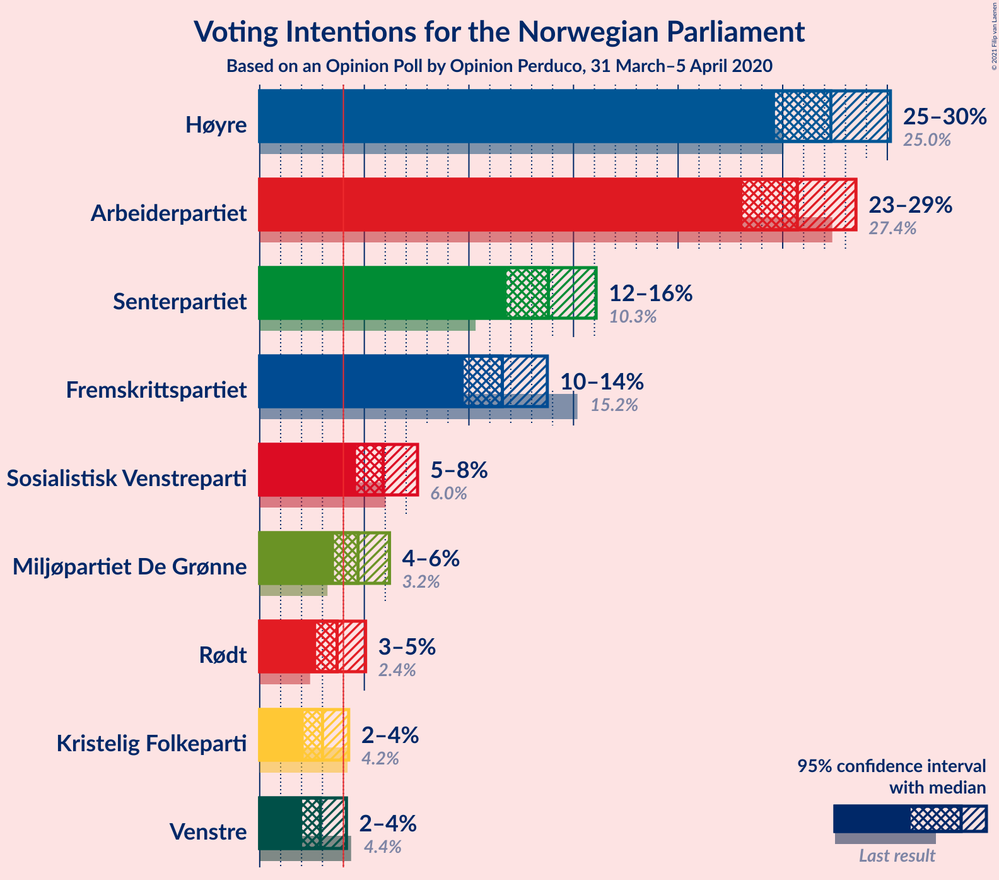

### Confidence Intervals

| Party | Last Result | Poll Result | 80% Confidence Interval | 90% Confidence Interval | 95% Confidence Interval | 99% Confidence Interval |
|:-----:|:-----------:|:-----------:|:-----------------------:|:-----------------------:|:-----------------------:|:-----------------------:|
| Høyre | 25.0% | 27.3% | 25.5–29.2% |25.0–29.7% |24.6–30.1% |23.8–31.1% |
| Arbeiderpartiet | 27.4% | 25.7% | 24.0–27.5% |23.5–28.1% |23.1–28.5% |22.3–29.4% |
| Senterpartiet | 10.3% | 13.8% | 12.5–15.3% |12.1–15.7% |11.8–16.1% |11.2–16.8% |
| Fremskrittspartiet | 15.2% | 11.6% | 10.4–13.0% |10.0–13.4% |9.8–13.7% |9.2–14.4% |
| Sosialistisk Venstreparti | 6.0% | 5.9% | 5.0–7.0% |4.8–7.3% |4.6–7.5% |4.2–8.1% |
| Miljøpartiet De Grønne | 3.2% | 4.7% | 3.9–5.7% |3.7–6.0% |3.6–6.2% |3.2–6.7% |
| Rødt | 2.4% | 3.7% | 3.0–4.6% |2.9–4.8% |2.7–5.1% |2.4–5.5% |
| Kristelig Folkeparti | 4.2% | 3.0% | 2.4–3.8% |2.2–4.1% |2.1–4.3% |1.9–4.7% |
| Venstre | 4.4% | 2.9% | 2.3–3.7% |2.2–3.9% |2.0–4.1% |1.8–4.6% |

*Note:* The poll result column reflects the actual value used in the calculations. Published results may vary slightly, and in addition be rounded to fewer digits.

## Seats

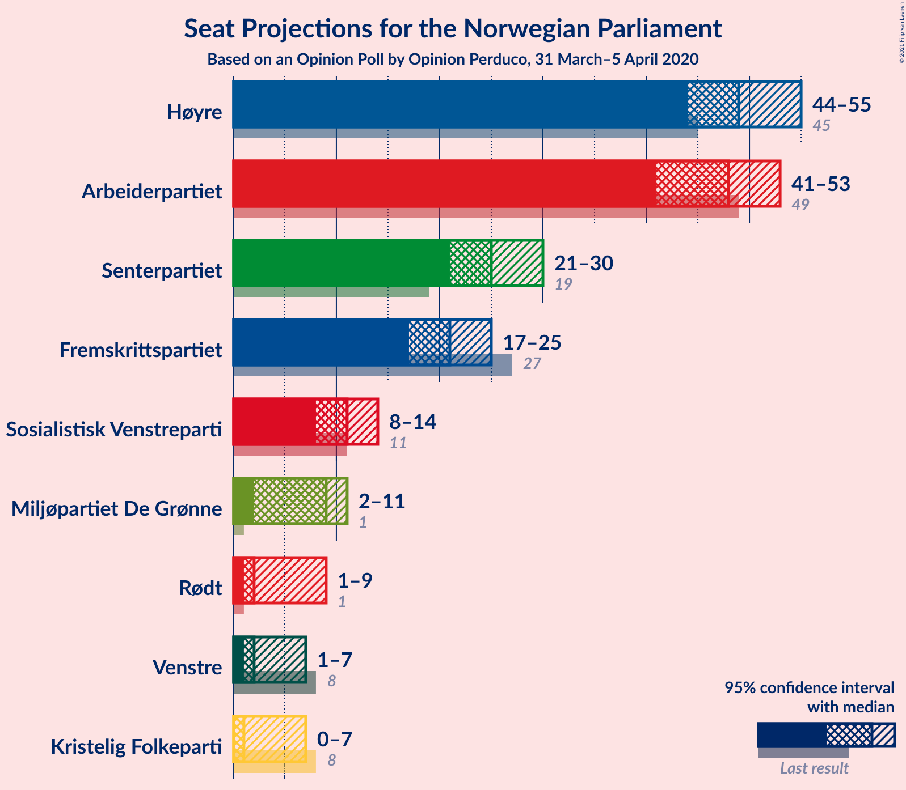

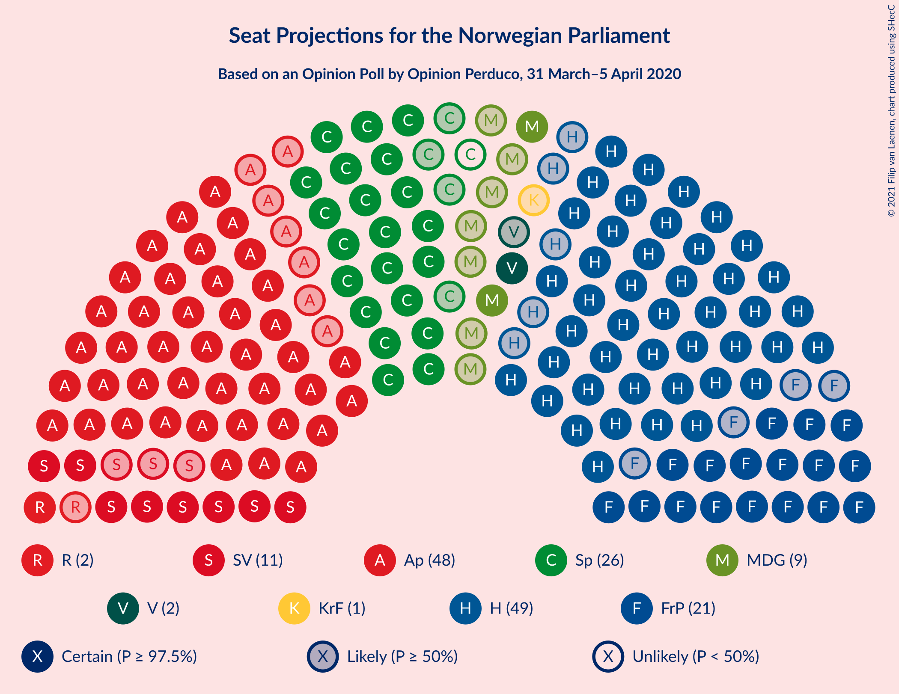

### Confidence Intervals

| Party | Last Result | Median | 80% Confidence Interval | 90% Confidence Interval | 95% Confidence Interval | 99% Confidence Interval |
|:-----:|:-----------:|:------:|:-----------------------:|:-----------------------:|:-----------------------:|:-----------------------:|
| <a href="#høyre">Høyre</a> | 45 | 49 | 46–54 |45–55 |44–55 |42–57 |
| <a href="#arbeiderpartiet">Arbeiderpartiet</a> | 49 | 48 | 43–51 |42–52 |41–53 |41–54 |
| <a href="#senterpartiet">Senterpartiet</a> | 19 | 25 | 22–27 |22–29 |21–30 |20–32 |
| <a href="#fremskrittspartiet">Fremskrittspartiet</a> | 27 | 21 | 18–23 |18–24 |17–25 |16–26 |
| <a href="#sosialistisk-venstreparti">Sosialistisk Venstreparti</a> | 11 | 11 | 9–13 |9–13 |8–14 |7–14 |
| <a href="#miljøpartiet-de-grønne">Miljøpartiet De Grønne</a> | 1 | 9 | 2–10 |2–11 |2–11 |1–12 |
| <a href="#rødt">Rødt</a> | 1 | 2 | 2–8 |2–9 |1–9 |1–10 |
| <a href="#kristelig-folkeparti">Kristelig Folkeparti</a> | 8 | 1 | 1–3 |1–7 |0–7 |0–8 |
| <a href="#venstre">Venstre</a> | 8 | 2 | 1–2 |1–2 |1–7 |0–8 |

### Høyre

*For a full overview of the results for this party, see the [Høyre](party-høyre.html) page.*

| Number of Seats | Probability | Accumulated | Special Marks |
|:---------------:|:-----------:|:-----------:|:-------------:|
| 40 | 0.1% | 100% |  |
| 41 | 0.2% | 99.9% |  |
| 42 | 0.4% | 99.7% |  |
| 43 | 1.4% | 99.3% |  |
| 44 | 2% | 98% |  |
| 45 | 2% | 96% | Last Result |
| 46 | 6% | 94% |  |
| 47 | 19% | 88% |  |
| 48 | 11% | 69% |  |
| 49 | 10% | 57% | Median |
| 50 | 7% | 47% |  |
| 51 | 11% | 40% |  |
| 52 | 12% | 29% |  |
| 53 | 6% | 17% |  |
| 54 | 4% | 11% |  |
| 55 | 5% | 6% |  |
| 56 | 1.1% | 2% |  |
| 57 | 0.3% | 0.6% |  |
| 58 | 0.1% | 0.2% |  |
| 59 | 0.1% | 0.1% |  |
| 60 | 0% | 0% |  |

### Arbeiderpartiet

*For a full overview of the results for this party, see the [Arbeiderpartiet](party-arbeiderpartiet.html) page.*

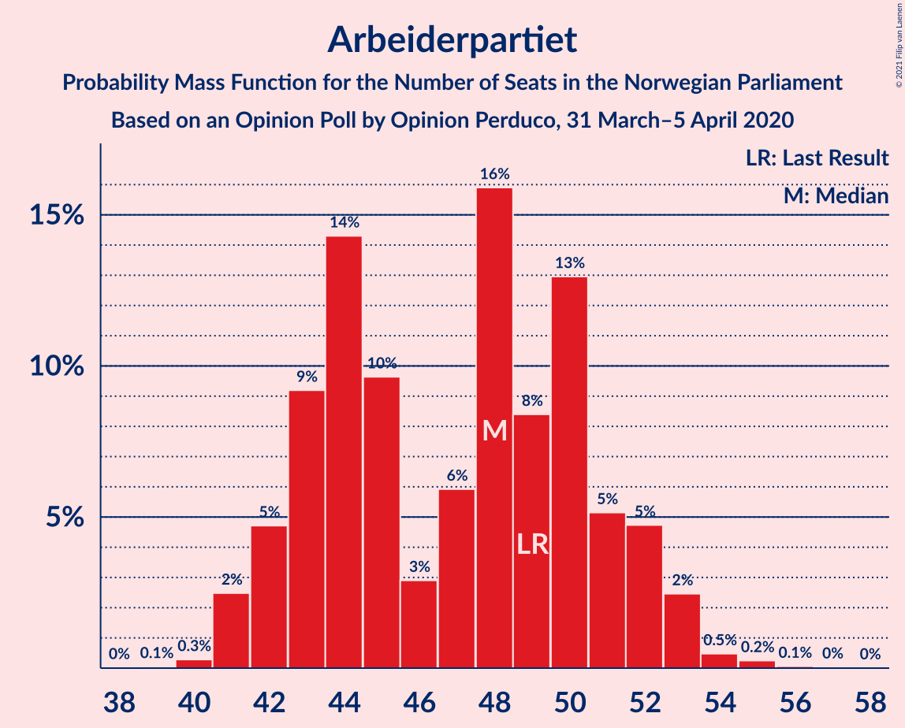

| Number of Seats | Probability | Accumulated | Special Marks |
|:---------------:|:-----------:|:-----------:|:-------------:|
| 39 | 0.1% | 100% |  |
| 40 | 0.3% | 99.9% |  |
| 41 | 2% | 99.6% |  |
| 42 | 5% | 97% |  |
| 43 | 9% | 92% |  |
| 44 | 14% | 83% |  |
| 45 | 10% | 69% |  |
| 46 | 3% | 59% |  |
| 47 | 6% | 56% |  |
| 48 | 16% | 50% | Median |
| 49 | 8% | 35% | Last Result |
| 50 | 13% | 26% |  |
| 51 | 5% | 13% |  |
| 52 | 5% | 8% |  |
| 53 | 2% | 3% |  |
| 54 | 0.5% | 0.8% |  |
| 55 | 0.2% | 0.4% |  |
| 56 | 0.1% | 0.1% |  |
| 57 | 0% | 0.1% |  |
| 58 | 0% | 0% |  |

### Senterpartiet

*For a full overview of the results for this party, see the [Senterpartiet](party-senterpartiet.html) page.*

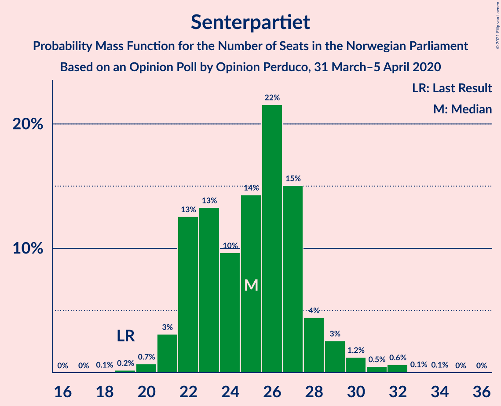

| Number of Seats | Probability | Accumulated | Special Marks |
|:---------------:|:-----------:|:-----------:|:-------------:|
| 18 | 0.1% | 100% |  |
| 19 | 0.2% | 99.9% | Last Result |
| 20 | 0.7% | 99.7% |  |
| 21 | 3% | 99.0% |  |
| 22 | 13% | 96% |  |
| 23 | 13% | 83% |  |
| 24 | 10% | 70% |  |
| 25 | 14% | 60% | Median |
| 26 | 22% | 46% |  |
| 27 | 15% | 25% |  |
| 28 | 4% | 10% |  |
| 29 | 3% | 5% |  |
| 30 | 1.2% | 3% |  |
| 31 | 0.5% | 1.3% |  |
| 32 | 0.6% | 0.8% |  |
| 33 | 0.1% | 0.2% |  |
| 34 | 0.1% | 0.1% |  |
| 35 | 0% | 0% |  |

### Fremskrittspartiet

*For a full overview of the results for this party, see the [Fremskrittspartiet](party-fremskrittspartiet.html) page.*

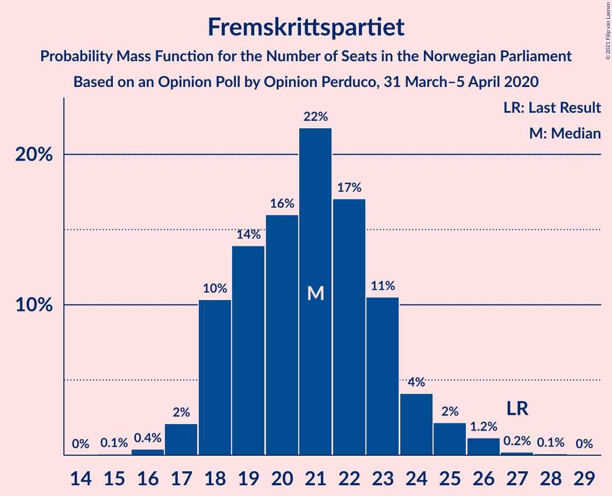

| Number of Seats | Probability | Accumulated | Special Marks |
|:---------------:|:-----------:|:-----------:|:-------------:|
| 15 | 0.1% | 100% |  |
| 16 | 0.4% | 99.9% |  |
| 17 | 2% | 99.5% |  |
| 18 | 10% | 97% |  |
| 19 | 14% | 87% |  |
| 20 | 16% | 73% |  |
| 21 | 22% | 57% | Median |
| 22 | 17% | 35% |  |
| 23 | 11% | 18% |  |
| 24 | 4% | 8% |  |
| 25 | 2% | 4% |  |
| 26 | 1.2% | 1.5% |  |
| 27 | 0.2% | 0.3% | Last Result |
| 28 | 0.1% | 0.1% |  |
| 29 | 0% | 0% |  |

### Sosialistisk Venstreparti

*For a full overview of the results for this party, see the [Sosialistisk Venstreparti](party-sosialistiskvenstreparti.html) page.*

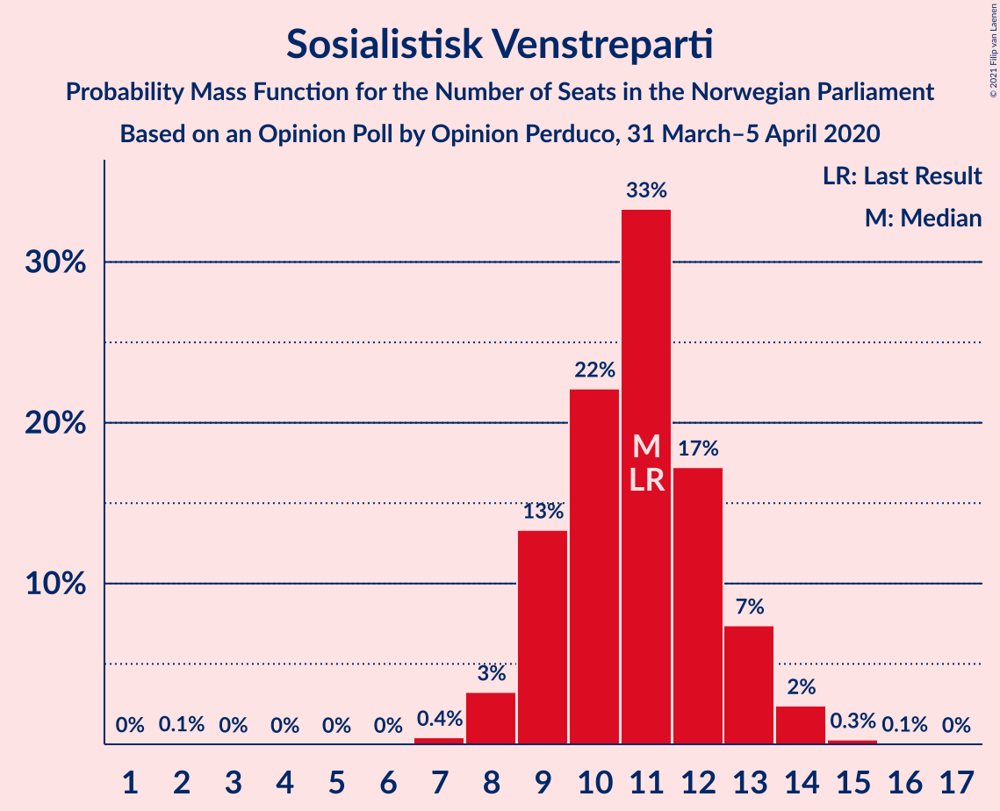

| Number of Seats | Probability | Accumulated | Special Marks |
|:---------------:|:-----------:|:-----------:|:-------------:|
| 2 | 0.1% | 100% |  |
| 3 | 0% | 99.9% |  |
| 4 | 0% | 99.9% |  |
| 5 | 0% | 99.9% |  |
| 6 | 0% | 99.9% |  |
| 7 | 0.4% | 99.9% |  |
| 8 | 3% | 99.4% |  |
| 9 | 13% | 96% |  |
| 10 | 22% | 83% |  |
| 11 | 33% | 61% | Last Result, Median |
| 12 | 17% | 27% |  |
| 13 | 7% | 10% |  |
| 14 | 2% | 3% |  |
| 15 | 0.3% | 0.4% |  |
| 16 | 0.1% | 0.1% |  |
| 17 | 0% | 0% |  |

### Miljøpartiet De Grønne

*For a full overview of the results for this party, see the [Miljøpartiet De Grønne](party-miljøpartietdegrønne.html) page.*

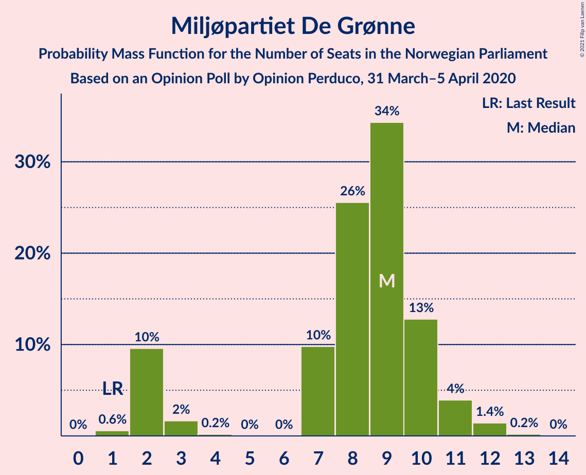

| Number of Seats | Probability | Accumulated | Special Marks |
|:---------------:|:-----------:|:-----------:|:-------------:|
| 1 | 0.6% | 100% | Last Result |
| 2 | 10% | 99.4% |  |
| 3 | 2% | 90% |  |
| 4 | 0.2% | 88% |  |
| 5 | 0% | 88% |  |
| 6 | 0% | 88% |  |
| 7 | 10% | 88% |  |
| 8 | 26% | 78% |  |
| 9 | 34% | 53% | Median |
| 10 | 13% | 18% |  |
| 11 | 4% | 6% |  |
| 12 | 1.4% | 2% |  |
| 13 | 0.2% | 0.2% |  |
| 14 | 0% | 0% |  |

### Rødt

*For a full overview of the results for this party, see the [Rødt](party-rødt.html) page.*

| Number of Seats | Probability | Accumulated | Special Marks |
|:---------------:|:-----------:|:-----------:|:-------------:|
| 1 | 5% | 100% | Last Result |
| 2 | 62% | 95% | Median |
| 3 | 0% | 33% |  |
| 4 | 0% | 33% |  |
| 5 | 0% | 33% |  |
| 6 | 0% | 33% |  |
| 7 | 18% | 33% |  |
| 8 | 10% | 15% |  |
| 9 | 4% | 5% |  |
| 10 | 0.9% | 1.0% |  |
| 11 | 0.1% | 0.1% |  |
| 12 | 0% | 0% |  |

### Kristelig Folkeparti

*For a full overview of the results for this party, see the [Kristelig Folkeparti](party-kristeligfolkeparti.html) page.*

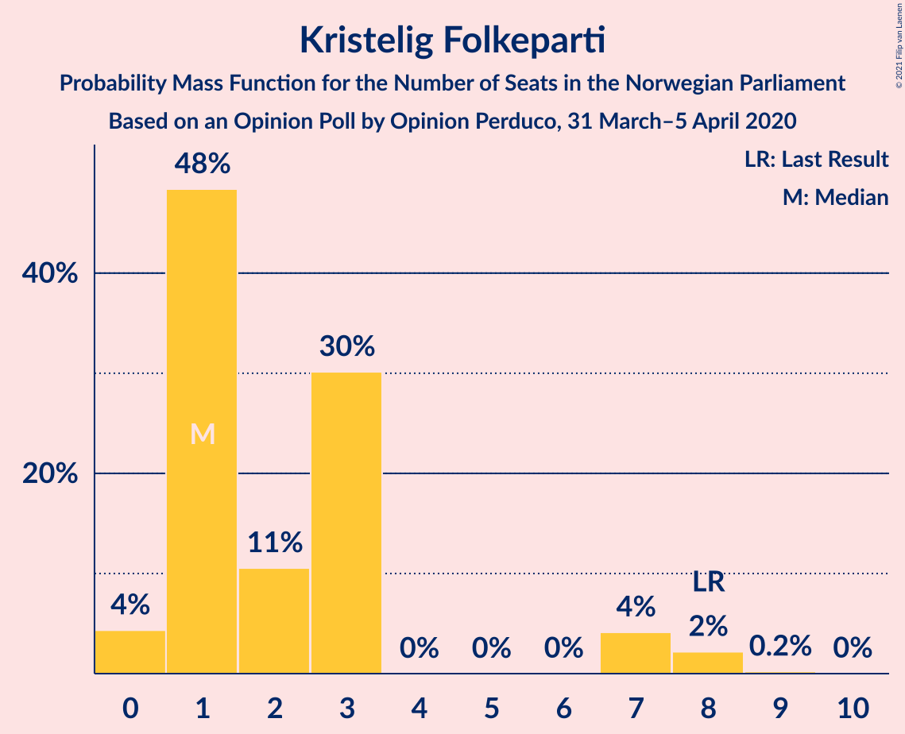

| Number of Seats | Probability | Accumulated | Special Marks |
|:---------------:|:-----------:|:-----------:|:-------------:|
| 0 | 4% | 100% |  |
| 1 | 48% | 96% | Median |
| 2 | 11% | 47% |  |
| 3 | 30% | 37% |  |
| 4 | 0% | 7% |  |
| 5 | 0% | 7% |  |
| 6 | 0% | 7% |  |
| 7 | 4% | 7% |  |
| 8 | 2% | 2% | Last Result |
| 9 | 0.2% | 0.2% |  |
| 10 | 0% | 0% |  |

### Venstre

*For a full overview of the results for this party, see the [Venstre](party-venstre.html) page.*

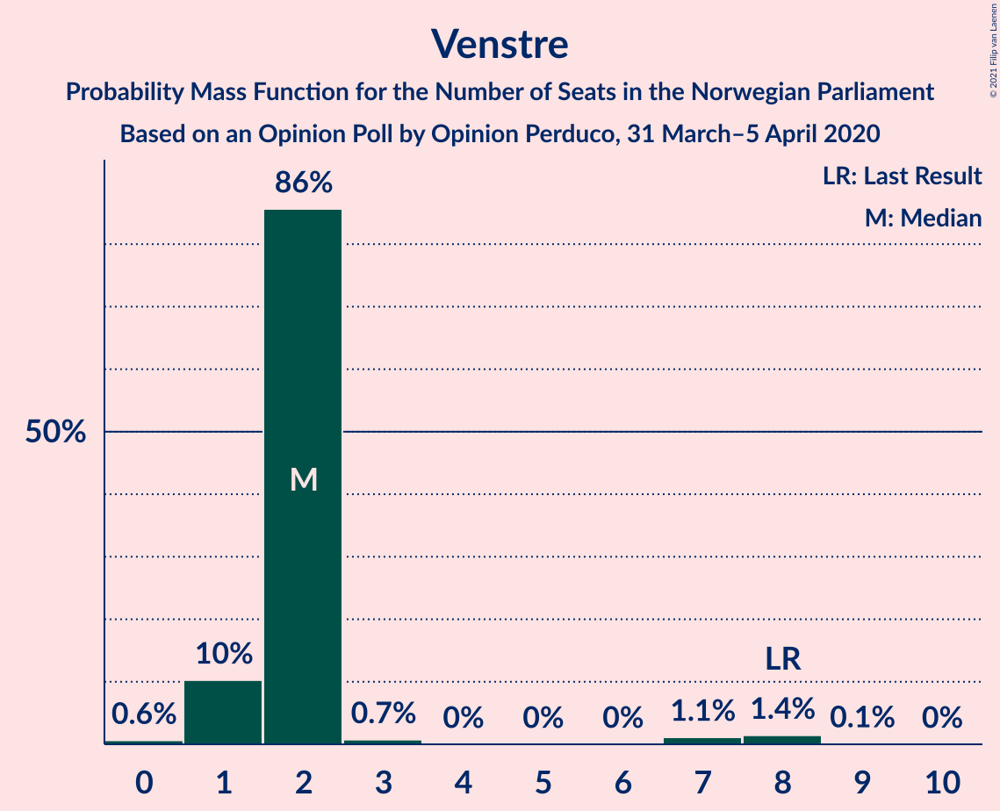

| Number of Seats | Probability | Accumulated | Special Marks |
|:---------------:|:-----------:|:-----------:|:-------------:|
| 0 | 0.6% | 100% |  |
| 1 | 10% | 99.4% |  |
| 2 | 86% | 89% | Median |
| 3 | 0.7% | 3% |  |
| 4 | 0% | 3% |  |
| 5 | 0% | 3% |  |
| 6 | 0% | 3% |  |
| 7 | 1.1% | 3% |  |
| 8 | 1.4% | 2% | Last Result |
| 9 | 0.1% | 0.1% |  |
| 10 | 0% | 0% |  |

## Coalitions

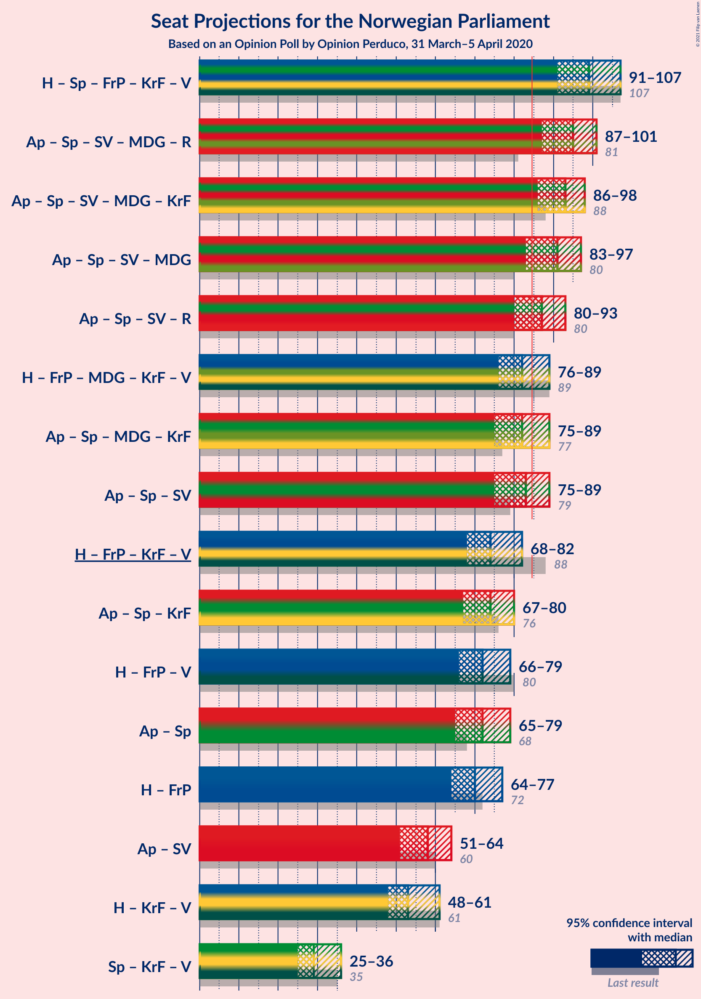

### Confidence Intervals

| Coalition | Last Result | Median | Majority? | 80% Confidence Interval | 90% Confidence Interval | 95% Confidence Interval | 99% Confidence Interval |
|:---------:|:-----------:|:------:|:---------:|:-----------------------:|:-----------------------:|:-----------------------:|:-----------------------:|
| Høyre – Senterpartiet – Fremskrittspartiet – Kristelig Folkeparti – Venstre | 107 | 99 | 100% | 95–104 | 93–106 | 91–107 | 89–109 |
| Arbeiderpartiet – Senterpartiet – Sosialistisk Venstreparti – Miljøpartiet De Grønne – Rødt | 81 | 95 | 99.7% | 90–99 | 89–100 | 87–101 | 85–103 |
| Arbeiderpartiet – Senterpartiet – Sosialistisk Venstreparti – Miljøpartiet De Grønne – Kristelig Folkeparti | 88 | 93 | 98.8% | 88–97 | 86–98 | 86–98 | 83–101 |
| Arbeiderpartiet – Senterpartiet – Sosialistisk Venstreparti – Miljøpartiet De Grønne | 80 | 91 | 93% | 85–96 | 83–97 | 83–97 | 81–99 |
| Arbeiderpartiet – Senterpartiet – Sosialistisk Venstreparti – Rødt | 80 | 87 | 71% | 82–91 | 81–92 | 80–93 | 78–97 |
| Høyre – Fremskrittspartiet – Miljøpartiet De Grønne – Kristelig Folkeparti – Venstre | 89 | 82 | 29% | 78–87 | 77–88 | 76–89 | 72–91 |
| Arbeiderpartiet – Senterpartiet – Miljøpartiet De Grønne – Kristelig Folkeparti | 77 | 82 | 26% | 77–86 | 76–87 | 75–89 | 73–91 |
| Arbeiderpartiet – Senterpartiet – Sosialistisk Venstreparti | 79 | 83 | 35% | 78–87 | 75–88 | 75–89 | 73–91 |
| Høyre – Fremskrittspartiet – Kristelig Folkeparti – Venstre | 88 | 74 | 0.3% | 70–79 | 69–80 | 68–82 | 66–84 |
| Arbeiderpartiet – Senterpartiet – Kristelig Folkeparti | 76 | 74 | 0.1% | 69–78 | 69–79 | 67–80 | 65–83 |
| Høyre – Fremskrittspartiet – Venstre | 80 | 72 | 0.1% | 68–77 | 67–78 | 66–79 | 64–81 |
| Arbeiderpartiet – Senterpartiet | 68 | 72 | 0% | 67–76 | 66–77 | 65–79 | 63–80 |
| Høyre – Fremskrittspartiet | 72 | 70 | 0% | 66–75 | 65–75 | 64–77 | 61–79 |
| Arbeiderpartiet – Sosialistisk Venstreparti | 60 | 58 | 0% | 53–62 | 52–63 | 51–64 | 50–65 |
| Høyre – Kristelig Folkeparti – Venstre | 61 | 53 | 0% | 50–58 | 49–59 | 48–61 | 46–62 |
| Senterpartiet – Kristelig Folkeparti – Venstre | 35 | 29 | 0% | 25–33 | 25–34 | 25–36 | 24–38 |

### Høyre – Senterpartiet – Fremskrittspartiet – Kristelig Folkeparti – Venstre

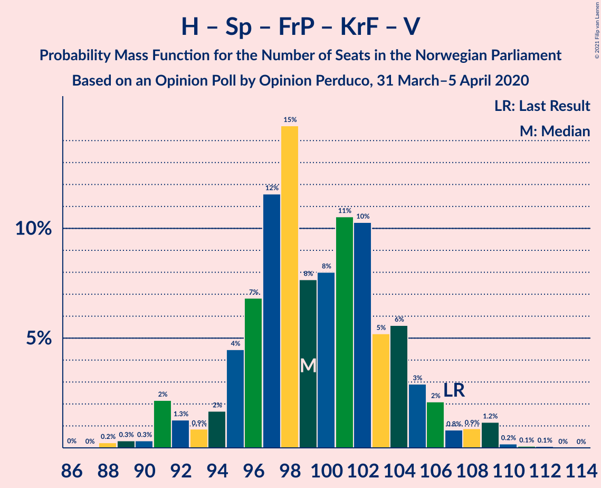

| Number of Seats | Probability | Accumulated | Special Marks |
|:---------------:|:-----------:|:-----------:|:-------------:|
| 86 | 0% | 100% |  |
| 87 | 0% | 99.9% |  |
| 88 | 0.2% | 99.9% |  |
| 89 | 0.3% | 99.7% |  |
| 90 | 0.3% | 99.3% |  |
| 91 | 2% | 99.0% |  |
| 92 | 1.3% | 97% |  |
| 93 | 0.9% | 96% |  |
| 94 | 2% | 95% |  |
| 95 | 4% | 93% |  |
| 96 | 7% | 89% |  |
| 97 | 12% | 82% |  |
| 98 | 15% | 70% | Median |
| 99 | 8% | 55% |  |
| 100 | 8% | 48% |  |
| 101 | 11% | 40% |  |
| 102 | 10% | 29% |  |
| 103 | 5% | 19% |  |
| 104 | 6% | 14% |  |
| 105 | 3% | 8% |  |
| 106 | 2% | 5% |  |
| 107 | 0.8% | 3% | Last Result |
| 108 | 0.9% | 2% |  |
| 109 | 1.2% | 2% |  |
| 110 | 0.2% | 0.4% |  |
| 111 | 0.1% | 0.2% |  |
| 112 | 0.1% | 0.1% |  |
| 113 | 0% | 0% |  |

### Arbeiderpartiet – Senterpartiet – Sosialistisk Venstreparti – Miljøpartiet De Grønne – Rødt

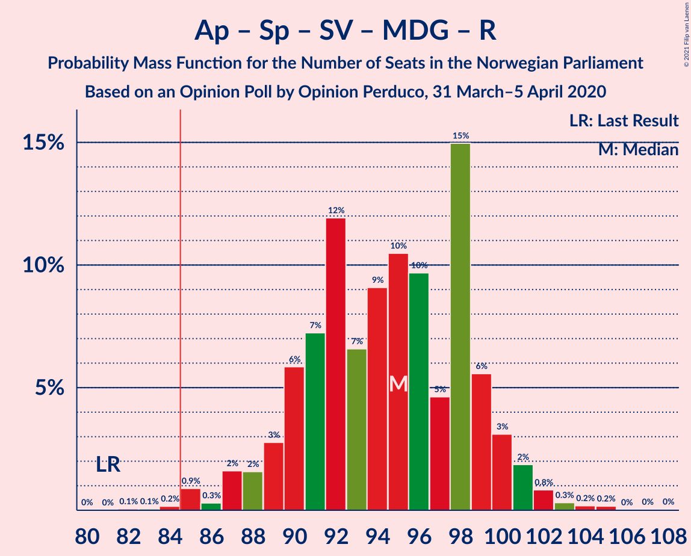

| Number of Seats | Probability | Accumulated | Special Marks |
|:---------------:|:-----------:|:-----------:|:-------------:|
| 81 | 0% | 100% | Last Result |
| 82 | 0.1% | 100% |  |
| 83 | 0.1% | 99.9% |  |
| 84 | 0.2% | 99.9% |  |
| 85 | 0.9% | 99.7% | Majority |
| 86 | 0.3% | 98.8% |  |
| 87 | 2% | 98.5% |  |
| 88 | 2% | 97% |  |
| 89 | 3% | 95% |  |
| 90 | 6% | 93% |  |
| 91 | 7% | 87% |  |
| 92 | 12% | 79% |  |
| 93 | 7% | 68% |  |
| 94 | 9% | 61% |  |
| 95 | 10% | 52% | Median |
| 96 | 10% | 41% |  |
| 97 | 5% | 32% |  |
| 98 | 15% | 27% |  |
| 99 | 6% | 12% |  |
| 100 | 3% | 7% |  |
| 101 | 2% | 3% |  |
| 102 | 0.8% | 2% |  |
| 103 | 0.3% | 0.8% |  |
| 104 | 0.2% | 0.4% |  |
| 105 | 0.2% | 0.3% |  |
| 106 | 0% | 0.1% |  |
| 107 | 0% | 0.1% |  |
| 108 | 0% | 0% |  |

### Arbeiderpartiet – Senterpartiet – Sosialistisk Venstreparti – Miljøpartiet De Grønne – Kristelig Folkeparti

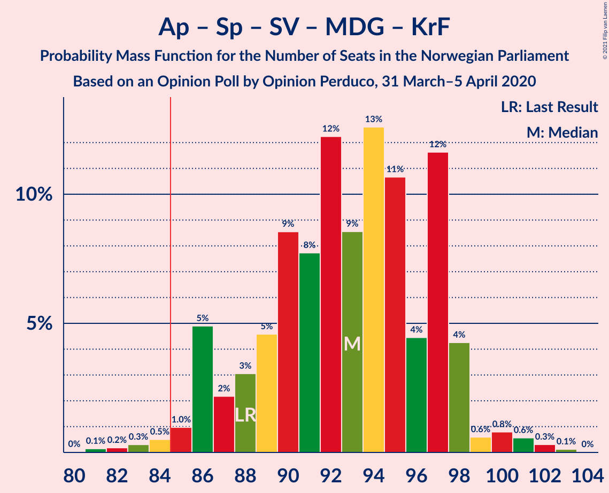

| Number of Seats | Probability | Accumulated | Special Marks |
|:---------------:|:-----------:|:-----------:|:-------------:|
| 81 | 0.1% | 100% |  |
| 82 | 0.2% | 99.8% |  |
| 83 | 0.3% | 99.6% |  |
| 84 | 0.5% | 99.3% |  |
| 85 | 1.0% | 98.8% | Majority |
| 86 | 5% | 98% |  |
| 87 | 2% | 93% |  |
| 88 | 3% | 91% | Last Result |
| 89 | 5% | 88% |  |
| 90 | 9% | 83% |  |
| 91 | 8% | 75% |  |
| 92 | 12% | 67% |  |
| 93 | 9% | 55% |  |
| 94 | 13% | 46% | Median |
| 95 | 11% | 33% |  |
| 96 | 4% | 23% |  |
| 97 | 12% | 18% |  |
| 98 | 4% | 7% |  |
| 99 | 0.6% | 2% |  |
| 100 | 0.8% | 2% |  |
| 101 | 0.6% | 1.0% |  |
| 102 | 0.3% | 0.5% |  |
| 103 | 0.1% | 0.2% |  |
| 104 | 0% | 0% |  |

### Arbeiderpartiet – Senterpartiet – Sosialistisk Venstreparti – Miljøpartiet De Grønne

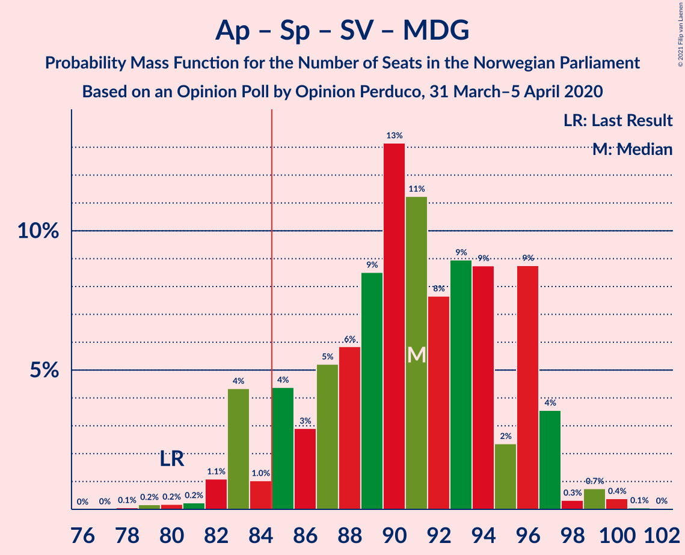

| Number of Seats | Probability | Accumulated | Special Marks |
|:---------------:|:-----------:|:-----------:|:-------------:|
| 78 | 0.1% | 100% |  |
| 79 | 0.2% | 99.9% |  |
| 80 | 0.2% | 99.7% | Last Result |
| 81 | 0.2% | 99.6% |  |
| 82 | 1.1% | 99.3% |  |
| 83 | 4% | 98% |  |
| 84 | 1.0% | 94% |  |
| 85 | 4% | 93% | Majority |
| 86 | 3% | 88% |  |
| 87 | 5% | 86% |  |
| 88 | 6% | 80% |  |
| 89 | 9% | 75% |  |
| 90 | 13% | 66% |  |
| 91 | 11% | 53% |  |
| 92 | 8% | 42% |  |
| 93 | 9% | 34% | Median |
| 94 | 9% | 25% |  |
| 95 | 2% | 16% |  |
| 96 | 9% | 14% |  |
| 97 | 4% | 5% |  |
| 98 | 0.3% | 2% |  |
| 99 | 0.7% | 1.2% |  |
| 100 | 0.4% | 0.5% |  |
| 101 | 0.1% | 0.1% |  |
| 102 | 0% | 0% |  |

### Arbeiderpartiet – Senterpartiet – Sosialistisk Venstreparti – Rødt

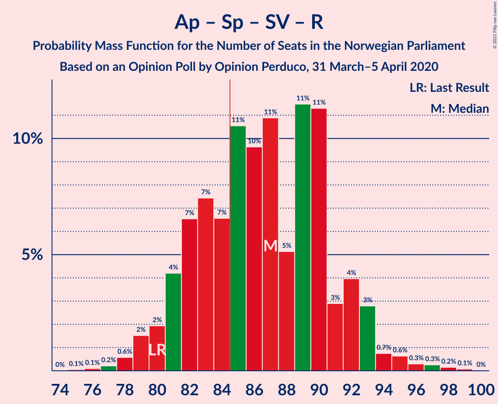

| Number of Seats | Probability | Accumulated | Special Marks |
|:---------------:|:-----------:|:-----------:|:-------------:|
| 75 | 0.1% | 100% |  |
| 76 | 0.1% | 99.9% |  |
| 77 | 0.2% | 99.8% |  |
| 78 | 0.6% | 99.6% |  |
| 79 | 2% | 99.0% |  |
| 80 | 2% | 98% | Last Result |
| 81 | 4% | 96% |  |
| 82 | 7% | 91% |  |
| 83 | 7% | 85% |  |
| 84 | 7% | 77% |  |
| 85 | 11% | 71% | Majority |
| 86 | 10% | 60% | Median |
| 87 | 11% | 51% |  |
| 88 | 5% | 40% |  |
| 89 | 11% | 35% |  |
| 90 | 11% | 23% |  |
| 91 | 3% | 12% |  |
| 92 | 4% | 9% |  |
| 93 | 3% | 5% |  |
| 94 | 0.7% | 2% |  |
| 95 | 0.6% | 1.4% |  |
| 96 | 0.3% | 0.8% |  |
| 97 | 0.3% | 0.5% |  |
| 98 | 0.2% | 0.2% |  |
| 99 | 0.1% | 0.1% |  |
| 100 | 0% | 0% |  |

### Høyre – Fremskrittspartiet – Miljøpartiet De Grønne – Kristelig Folkeparti – Venstre

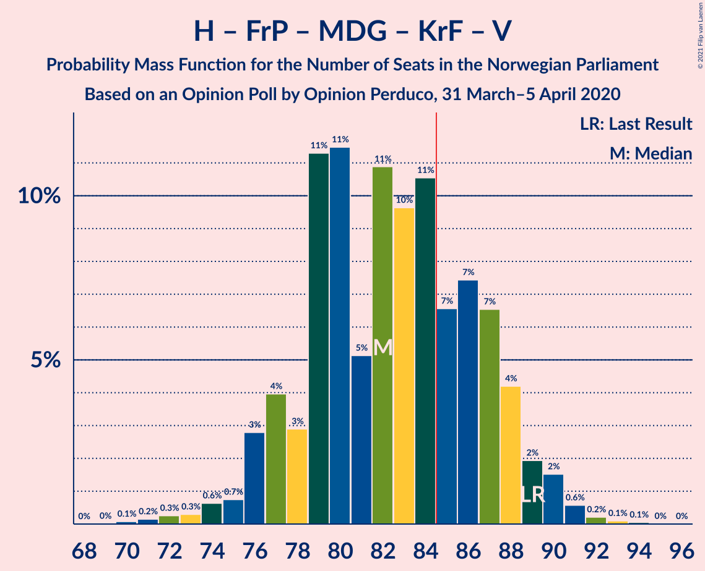

| Number of Seats | Probability | Accumulated | Special Marks |
|:---------------:|:-----------:|:-----------:|:-------------:|
| 70 | 0.1% | 100% |  |
| 71 | 0.2% | 99.9% |  |
| 72 | 0.3% | 99.8% |  |
| 73 | 0.3% | 99.5% |  |
| 74 | 0.6% | 99.2% |  |
| 75 | 0.7% | 98.6% |  |
| 76 | 3% | 98% |  |
| 77 | 4% | 95% |  |
| 78 | 3% | 91% |  |
| 79 | 11% | 88% |  |
| 80 | 11% | 77% |  |
| 81 | 5% | 65% |  |
| 82 | 11% | 60% | Median |
| 83 | 10% | 49% |  |
| 84 | 11% | 40% |  |
| 85 | 7% | 29% | Majority |
| 86 | 7% | 23% |  |
| 87 | 7% | 15% |  |
| 88 | 4% | 9% |  |
| 89 | 2% | 4% | Last Result |
| 90 | 2% | 2% |  |
| 91 | 0.6% | 1.0% |  |
| 92 | 0.2% | 0.4% |  |
| 93 | 0.1% | 0.2% |  |
| 94 | 0.1% | 0.1% |  |
| 95 | 0% | 0% |  |

### Arbeiderpartiet – Senterpartiet – Miljøpartiet De Grønne – Kristelig Folkeparti

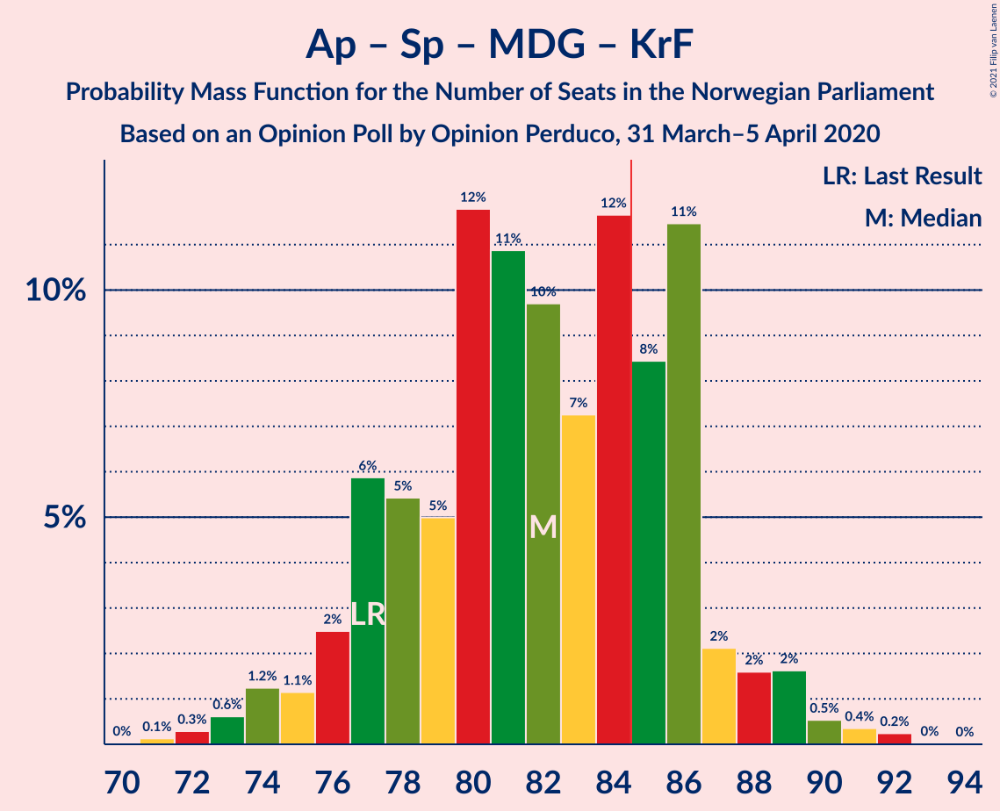

| Number of Seats | Probability | Accumulated | Special Marks |
|:---------------:|:-----------:|:-----------:|:-------------:|
| 70 | 0% | 100% |  |
| 71 | 0.1% | 99.9% |  |
| 72 | 0.3% | 99.8% |  |
| 73 | 0.6% | 99.5% |  |
| 74 | 1.2% | 98.9% |  |
| 75 | 1.1% | 98% |  |
| 76 | 2% | 97% |  |
| 77 | 6% | 94% | Last Result |
| 78 | 5% | 88% |  |
| 79 | 5% | 83% |  |
| 80 | 12% | 78% |  |
| 81 | 11% | 66% |  |
| 82 | 10% | 55% |  |
| 83 | 7% | 45% | Median |
| 84 | 12% | 38% |  |
| 85 | 8% | 26% | Majority |
| 86 | 11% | 18% |  |
| 87 | 2% | 7% |  |
| 88 | 2% | 4% |  |
| 89 | 2% | 3% |  |
| 90 | 0.5% | 1.2% |  |
| 91 | 0.4% | 0.6% |  |
| 92 | 0.2% | 0.3% |  |
| 93 | 0% | 0% |  |

### Arbeiderpartiet – Senterpartiet – Sosialistisk Venstreparti

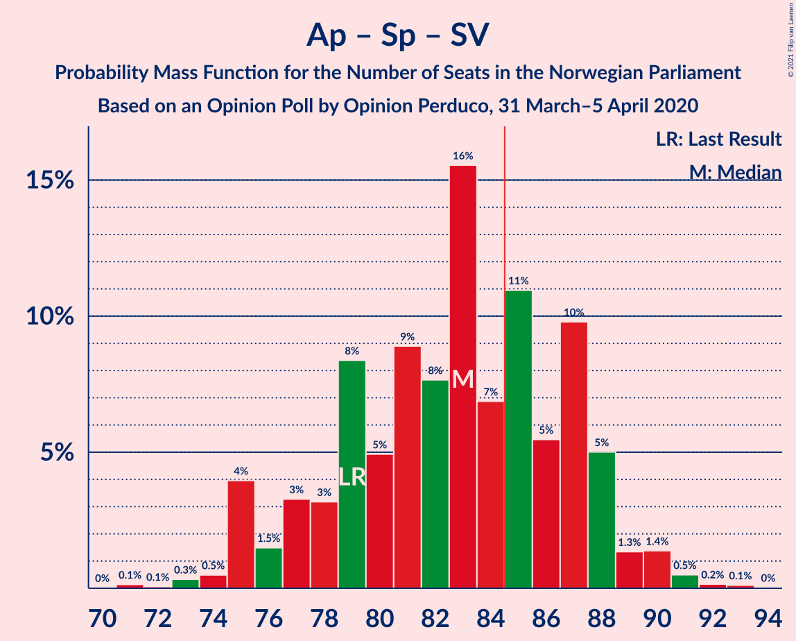

| Number of Seats | Probability | Accumulated | Special Marks |
|:---------------:|:-----------:|:-----------:|:-------------:|
| 71 | 0.1% | 100% |  |
| 72 | 0.1% | 99.8% |  |
| 73 | 0.3% | 99.8% |  |
| 74 | 0.5% | 99.4% |  |
| 75 | 4% | 98.9% |  |
| 76 | 1.5% | 95% |  |
| 77 | 3% | 93% |  |
| 78 | 3% | 90% |  |
| 79 | 8% | 87% | Last Result |
| 80 | 5% | 79% |  |
| 81 | 9% | 74% |  |
| 82 | 8% | 65% |  |
| 83 | 16% | 57% |  |
| 84 | 7% | 42% | Median |
| 85 | 11% | 35% | Majority |
| 86 | 5% | 24% |  |
| 87 | 10% | 18% |  |
| 88 | 5% | 9% |  |
| 89 | 1.3% | 4% |  |
| 90 | 1.4% | 2% |  |
| 91 | 0.5% | 0.8% |  |
| 92 | 0.2% | 0.3% |  |
| 93 | 0.1% | 0.2% |  |
| 94 | 0% | 0% |  |

### Høyre – Fremskrittspartiet – Kristelig Folkeparti – Venstre

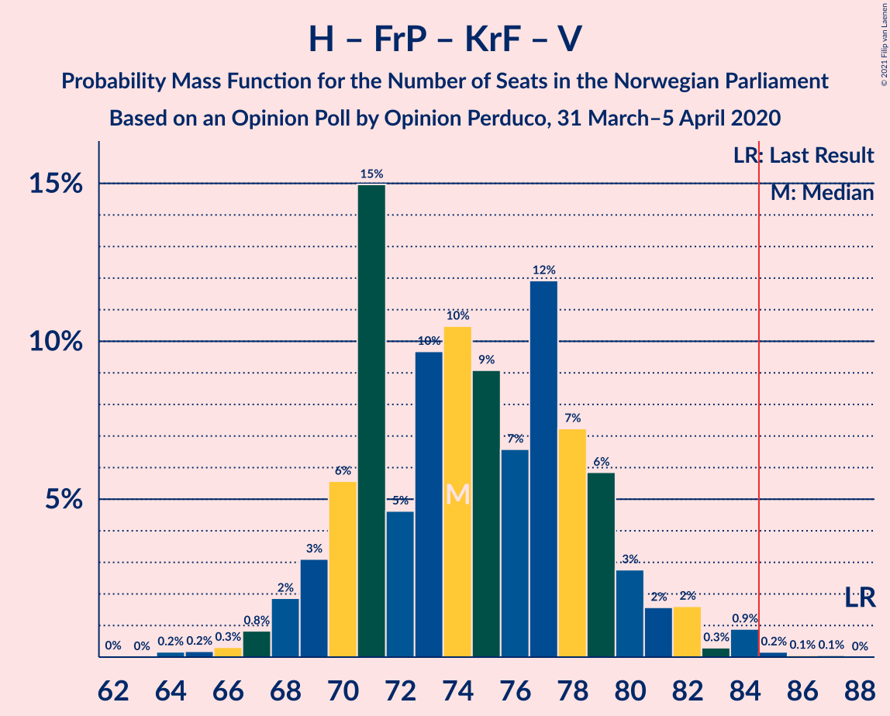

| Number of Seats | Probability | Accumulated | Special Marks |
|:---------------:|:-----------:|:-----------:|:-------------:|
| 62 | 0% | 100% |  |
| 63 | 0% | 99.9% |  |
| 64 | 0.2% | 99.9% |  |
| 65 | 0.2% | 99.7% |  |
| 66 | 0.3% | 99.6% |  |
| 67 | 0.8% | 99.2% |  |
| 68 | 2% | 98% |  |
| 69 | 3% | 97% |  |
| 70 | 6% | 93% |  |
| 71 | 15% | 88% |  |
| 72 | 5% | 73% |  |
| 73 | 10% | 68% | Median |
| 74 | 10% | 59% |  |
| 75 | 9% | 48% |  |
| 76 | 7% | 39% |  |
| 77 | 12% | 32% |  |
| 78 | 7% | 21% |  |
| 79 | 6% | 13% |  |
| 80 | 3% | 7% |  |
| 81 | 2% | 5% |  |
| 82 | 2% | 3% |  |
| 83 | 0.3% | 1.5% |  |
| 84 | 0.9% | 1.2% |  |
| 85 | 0.2% | 0.3% | Majority |
| 86 | 0.1% | 0.1% |  |
| 87 | 0.1% | 0.1% |  |
| 88 | 0% | 0% | Last Result |

### Arbeiderpartiet – Senterpartiet – Kristelig Folkeparti

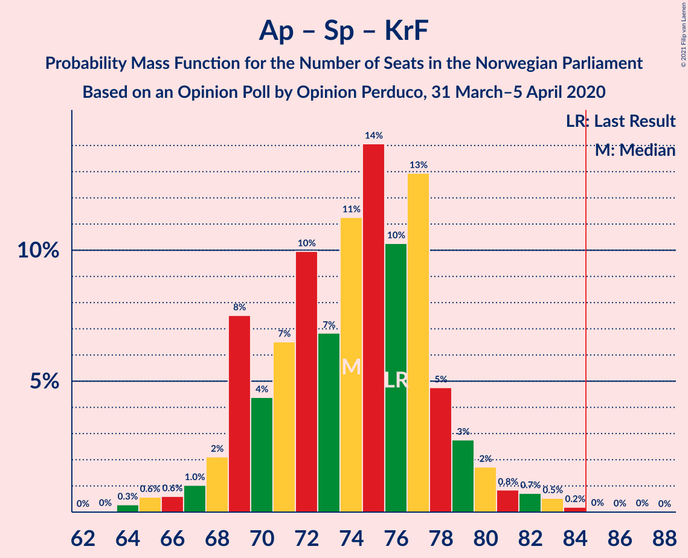

| Number of Seats | Probability | Accumulated | Special Marks |
|:---------------:|:-----------:|:-----------:|:-------------:|
| 63 | 0% | 100% |  |
| 64 | 0.3% | 99.9% |  |
| 65 | 0.6% | 99.7% |  |
| 66 | 0.6% | 99.1% |  |
| 67 | 1.0% | 98% |  |
| 68 | 2% | 97% |  |
| 69 | 8% | 95% |  |
| 70 | 4% | 88% |  |
| 71 | 7% | 83% |  |
| 72 | 10% | 77% |  |
| 73 | 7% | 67% |  |
| 74 | 11% | 60% | Median |
| 75 | 14% | 49% |  |
| 76 | 10% | 35% | Last Result |
| 77 | 13% | 25% |  |
| 78 | 5% | 12% |  |
| 79 | 3% | 7% |  |
| 80 | 2% | 4% |  |
| 81 | 0.8% | 2% |  |
| 82 | 0.7% | 2% |  |
| 83 | 0.5% | 0.8% |  |
| 84 | 0.2% | 0.3% |  |
| 85 | 0% | 0.1% | Majority |
| 86 | 0% | 0.1% |  |
| 87 | 0% | 0% |  |

### Høyre – Fremskrittspartiet – Venstre

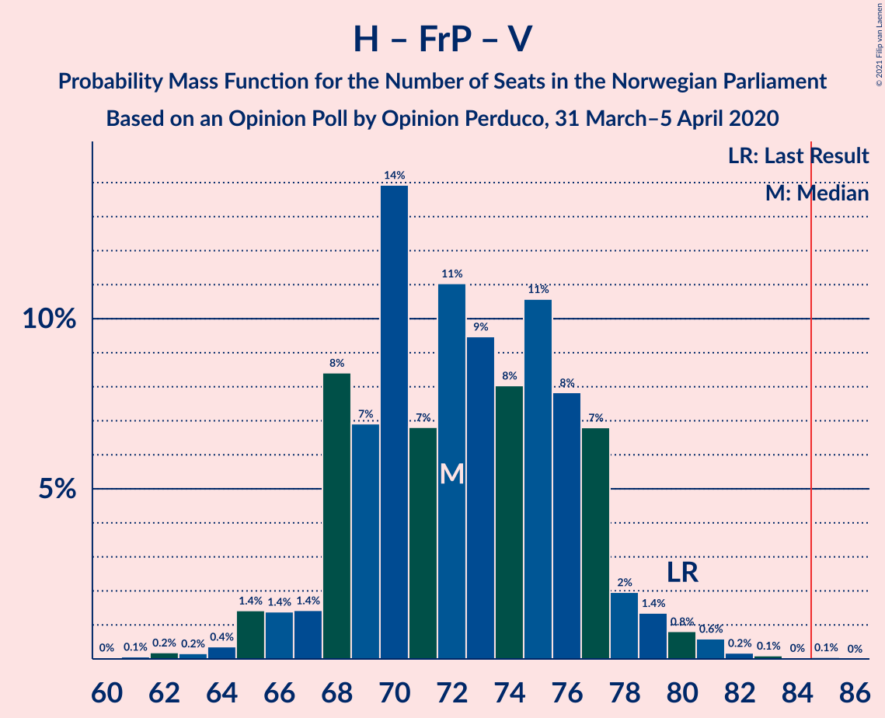

| Number of Seats | Probability | Accumulated | Special Marks |
|:---------------:|:-----------:|:-----------:|:-------------:|
| 60 | 0% | 100% |  |
| 61 | 0.1% | 99.9% |  |
| 62 | 0.2% | 99.9% |  |
| 63 | 0.2% | 99.7% |  |
| 64 | 0.4% | 99.5% |  |
| 65 | 1.4% | 99.2% |  |
| 66 | 1.4% | 98% |  |
| 67 | 1.4% | 96% |  |
| 68 | 8% | 95% |  |
| 69 | 7% | 87% |  |
| 70 | 14% | 80% |  |
| 71 | 7% | 66% |  |
| 72 | 11% | 59% | Median |
| 73 | 9% | 48% |  |
| 74 | 8% | 38% |  |
| 75 | 11% | 30% |  |
| 76 | 8% | 20% |  |
| 77 | 7% | 12% |  |
| 78 | 2% | 5% |  |
| 79 | 1.4% | 3% |  |
| 80 | 0.8% | 2% | Last Result |
| 81 | 0.6% | 1.0% |  |
| 82 | 0.2% | 0.4% |  |
| 83 | 0.1% | 0.2% |  |
| 84 | 0% | 0.1% |  |
| 85 | 0.1% | 0.1% | Majority |
| 86 | 0% | 0% |  |

### Arbeiderpartiet – Senterpartiet

| Number of Seats | Probability | Accumulated | Special Marks |
|:---------------:|:-----------:|:-----------:|:-------------:|
| 62 | 0.1% | 100% |  |
| 63 | 0.4% | 99.9% |  |
| 64 | 0.8% | 99.4% |  |
| 65 | 2% | 98.6% |  |
| 66 | 6% | 97% |  |
| 67 | 3% | 91% |  |
| 68 | 6% | 88% | Last Result |
| 69 | 7% | 81% |  |
| 70 | 7% | 75% |  |
| 71 | 11% | 68% |  |
| 72 | 12% | 56% |  |
| 73 | 6% | 44% | Median |
| 74 | 14% | 38% |  |
| 75 | 6% | 23% |  |
| 76 | 11% | 18% |  |
| 77 | 2% | 6% |  |
| 78 | 2% | 4% |  |
| 79 | 1.5% | 3% |  |
| 80 | 1.0% | 1.4% |  |
| 81 | 0.3% | 0.4% |  |
| 82 | 0.1% | 0.1% |  |
| 83 | 0% | 0% |  |

### Høyre – Fremskrittspartiet

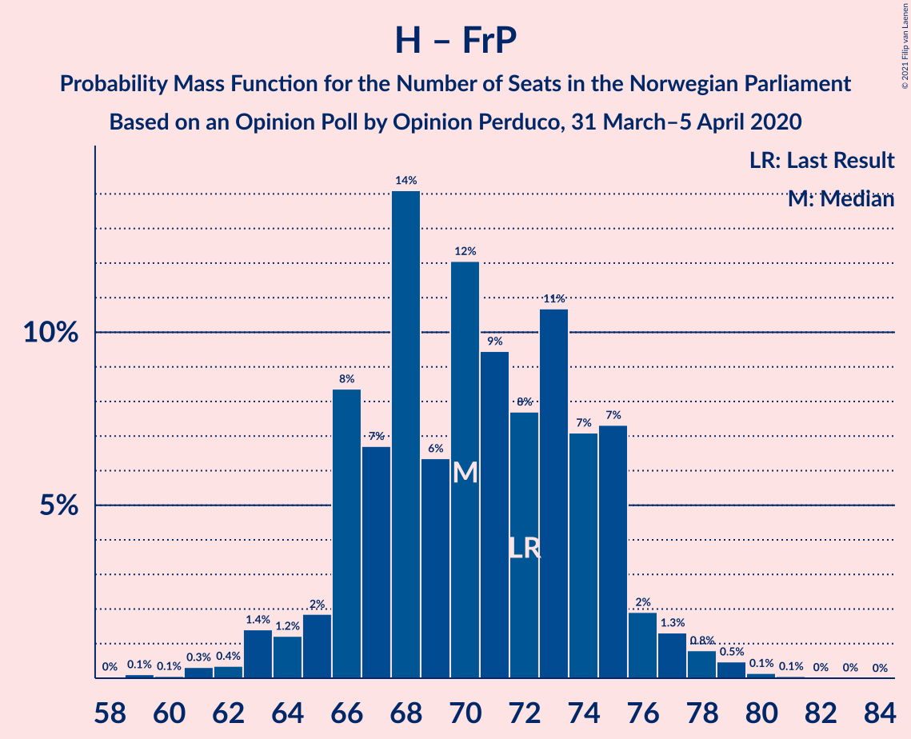

| Number of Seats | Probability | Accumulated | Special Marks |
|:---------------:|:-----------:|:-----------:|:-------------:|
| 58 | 0% | 100% |  |
| 59 | 0.1% | 99.9% |  |
| 60 | 0.1% | 99.8% |  |
| 61 | 0.3% | 99.8% |  |
| 62 | 0.4% | 99.5% |  |
| 63 | 1.4% | 99.1% |  |
| 64 | 1.2% | 98% |  |
| 65 | 2% | 96% |  |
| 66 | 8% | 95% |  |
| 67 | 7% | 86% |  |
| 68 | 14% | 80% |  |
| 69 | 6% | 65% |  |
| 70 | 12% | 59% | Median |
| 71 | 9% | 47% |  |
| 72 | 8% | 38% | Last Result |
| 73 | 11% | 30% |  |
| 74 | 7% | 19% |  |
| 75 | 7% | 12% |  |
| 76 | 2% | 5% |  |
| 77 | 1.3% | 3% |  |
| 78 | 0.8% | 2% |  |
| 79 | 0.5% | 0.7% |  |
| 80 | 0.1% | 0.3% |  |
| 81 | 0.1% | 0.1% |  |
| 82 | 0% | 0.1% |  |
| 83 | 0% | 0% |  |

### Arbeiderpartiet – Sosialistisk Venstreparti

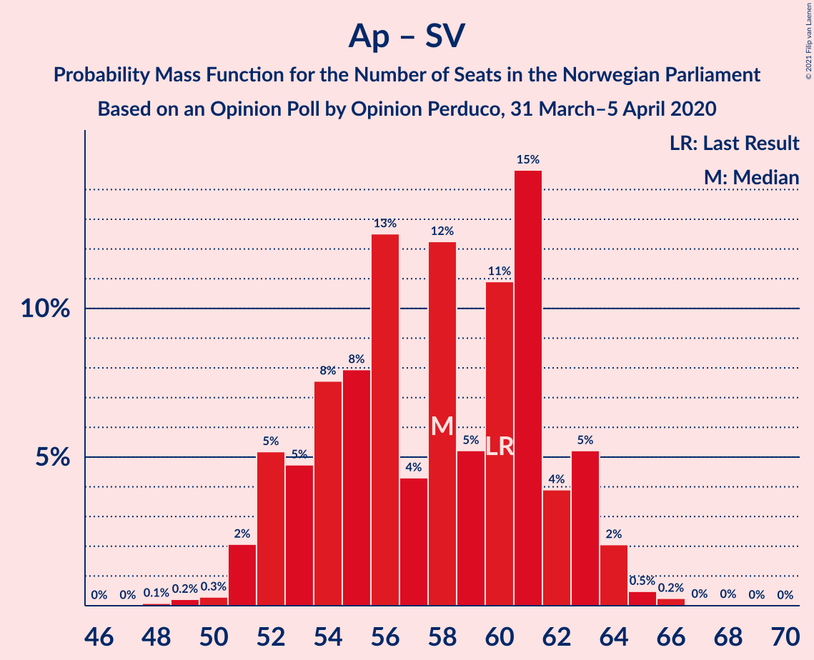

| Number of Seats | Probability | Accumulated | Special Marks |
|:---------------:|:-----------:|:-----------:|:-------------:|
| 48 | 0.1% | 100% |  |
| 49 | 0.2% | 99.9% |  |
| 50 | 0.3% | 99.7% |  |
| 51 | 2% | 99.4% |  |
| 52 | 5% | 97% |  |
| 53 | 5% | 92% |  |
| 54 | 8% | 87% |  |
| 55 | 8% | 80% |  |
| 56 | 13% | 72% |  |
| 57 | 4% | 59% |  |
| 58 | 12% | 55% |  |
| 59 | 5% | 43% | Median |
| 60 | 11% | 38% | Last Result |
| 61 | 15% | 27% |  |
| 62 | 4% | 12% |  |
| 63 | 5% | 8% |  |
| 64 | 2% | 3% |  |
| 65 | 0.5% | 0.8% |  |
| 66 | 0.2% | 0.4% |  |
| 67 | 0% | 0.1% |  |
| 68 | 0% | 0.1% |  |
| 69 | 0% | 0% |  |

### Høyre – Kristelig Folkeparti – Venstre

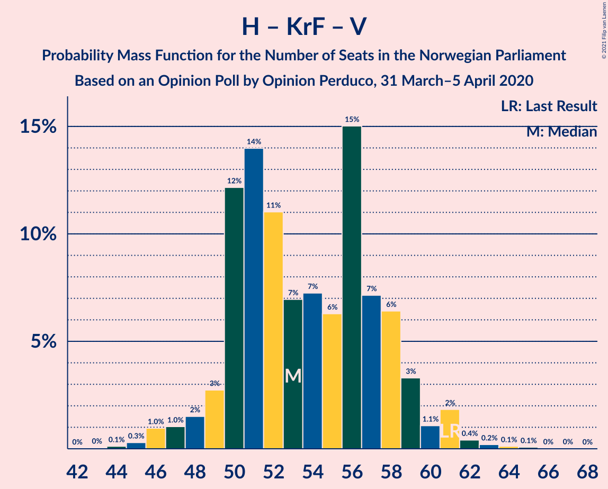

| Number of Seats | Probability | Accumulated | Special Marks |
|:---------------:|:-----------:|:-----------:|:-------------:|
| 43 | 0% | 100% |  |
| 44 | 0.1% | 99.9% |  |
| 45 | 0.3% | 99.8% |  |
| 46 | 1.0% | 99.5% |  |
| 47 | 1.0% | 98.6% |  |
| 48 | 2% | 98% |  |
| 49 | 3% | 96% |  |
| 50 | 12% | 93% |  |
| 51 | 14% | 81% |  |
| 52 | 11% | 67% | Median |
| 53 | 7% | 56% |  |
| 54 | 7% | 49% |  |
| 55 | 6% | 42% |  |
| 56 | 15% | 36% |  |
| 57 | 7% | 21% |  |
| 58 | 6% | 13% |  |
| 59 | 3% | 7% |  |
| 60 | 1.1% | 4% |  |
| 61 | 2% | 3% | Last Result |
| 62 | 0.4% | 0.9% |  |
| 63 | 0.2% | 0.4% |  |
| 64 | 0.1% | 0.2% |  |
| 65 | 0.1% | 0.1% |  |
| 66 | 0% | 0.1% |  |
| 67 | 0% | 0% |  |

### Senterpartiet – Kristelig Folkeparti – Venstre

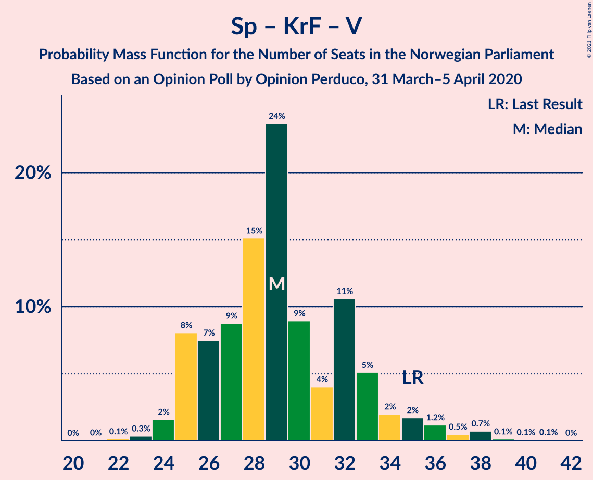

| Number of Seats | Probability | Accumulated | Special Marks |
|:---------------:|:-----------:|:-----------:|:-------------:|
| 22 | 0.1% | 100% |  |
| 23 | 0.3% | 99.9% |  |
| 24 | 2% | 99.5% |  |
| 25 | 8% | 98% |  |
| 26 | 7% | 90% |  |
| 27 | 9% | 82% |  |
| 28 | 15% | 74% | Median |
| 29 | 24% | 59% |  |
| 30 | 9% | 35% |  |
| 31 | 4% | 26% |  |
| 32 | 11% | 22% |  |
| 33 | 5% | 11% |  |
| 34 | 2% | 6% |  |
| 35 | 2% | 4% | Last Result |
| 36 | 1.2% | 3% |  |
| 37 | 0.5% | 1.4% |  |
| 38 | 0.7% | 0.9% |  |
| 39 | 0.1% | 0.2% |  |
| 40 | 0.1% | 0.1% |  |
| 41 | 0.1% | 0.1% |  |
| 42 | 0% | 0% |  |

## Technical Information

### Opinion Poll

+ **Polling firm:** Opinion Perduco
+ **Commissioner(s):** —
+ **Fieldwork period:** 31 March–5 April 2020

### Calculations

+ **Sample size:** 1000
+ **Simulations done:** 1,048,576
+ **Error estimate:** 2.26%

