# Opinion Poll by Norstat for Aftenposten and NRK, 20–26 April 2020

<a href="#voting-intentions">Voting Intentions</a> | <a href="#seats">Seats</a> | <a href="#coalitions">Coalitions</a> | <a href="#technical-information">Technical Information</a>

## Voting Intentions

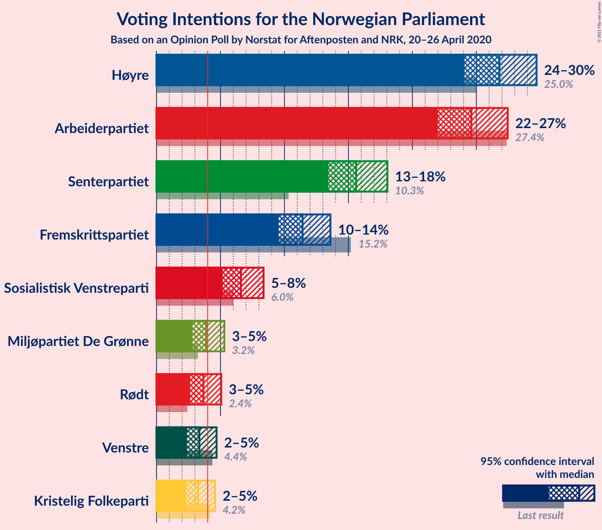

### Confidence Intervals

| Party | Last Result | Poll Result | 80% Confidence Interval | 90% Confidence Interval | 95% Confidence Interval | 99% Confidence Interval |
|:-----:|:-----------:|:-----------:|:-----------------------:|:-----------------------:|:-----------------------:|:-----------------------:|
| Høyre | 25.0% | 26.8% | 25.0–28.7% |24.5–29.2% |24.1–29.7% |23.3–30.6% |
| Arbeiderpartiet | 27.4% | 24.6% | 22.9–26.5% |22.4–27.0% |22.0–27.5% |21.2–28.3% |
| Senterpartiet | 10.3% | 15.6% | 14.2–17.2% |13.8–17.6% |13.4–18.0% |12.8–18.8% |
| Fremskrittspartiet | 15.2% | 11.4% | 10.2–12.8% |9.8–13.2% |9.5–13.6% |9.0–14.3% |
| Sosialistisk Venstreparti | 6.0% | 6.6% | 5.7–7.7% |5.4–8.1% |5.2–8.4% |4.8–8.9% |
| Miljøpartiet De Grønne | 3.2% | 3.9% | 3.2–4.8% |3.0–5.1% |2.8–5.3% |2.5–5.8% |
| Rødt | 2.4% | 3.7% | 3.0–4.6% |2.8–4.8% |2.6–5.1% |2.3–5.5% |
| Venstre | 4.4% | 3.4% | 2.7–4.2% |2.5–4.5% |2.4–4.7% |2.1–5.2% |
| Kristelig Folkeparti | 4.2% | 3.2% | 2.6–4.1% |2.4–4.4% |2.3–4.6% |2.0–5.0% |

*Note:* The poll result column reflects the actual value used in the calculations. Published results may vary slightly, and in addition be rounded to fewer digits.

## Seats

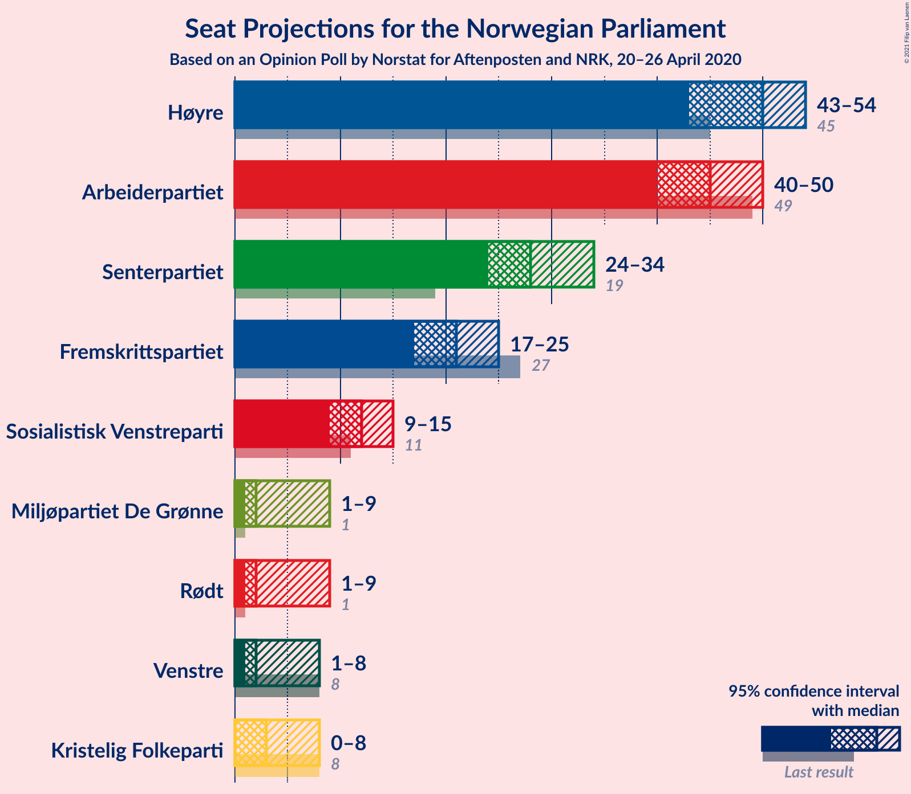

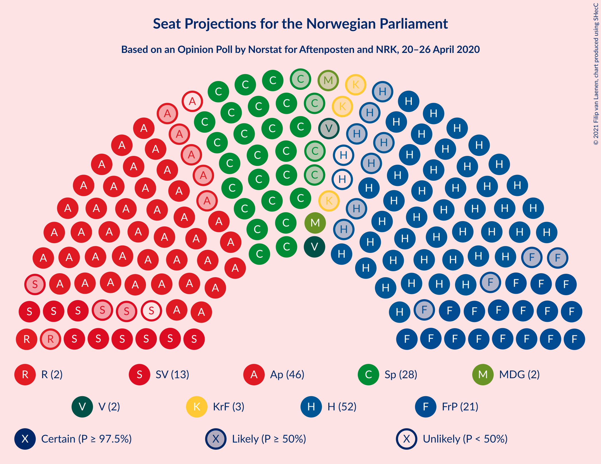

### Confidence Intervals

| Party | Last Result | Median | 80% Confidence Interval | 90% Confidence Interval | 95% Confidence Interval | 99% Confidence Interval |
|:-----:|:-----------:|:------:|:-----------------------:|:-----------------------:|:-----------------------:|:-----------------------:|
| <a href="#høyre">Høyre</a> | 45 | 50 | 45–53 |43–54 |43–54 |41–56 |
| <a href="#arbeiderpartiet">Arbeiderpartiet</a> | 49 | 45 | 41–49 |41–49 |40–50 |38–52 |
| <a href="#senterpartiet">Senterpartiet</a> | 19 | 28 | 25–32 |25–33 |24–34 |23–35 |
| <a href="#fremskrittspartiet">Fremskrittspartiet</a> | 27 | 21 | 18–23 |18–24 |17–25 |16–26 |
| <a href="#sosialistisk-venstreparti">Sosialistisk Venstreparti</a> | 11 | 12 | 10–14 |10–15 |9–15 |9–16 |
| <a href="#miljøpartiet-de-grønne">Miljøpartiet De Grønne</a> | 1 | 2 | 2–9 |1–9 |1–9 |1–11 |
| <a href="#rødt">Rødt</a> | 1 | 2 | 2–8 |1–8 |1–9 |1–10 |
| <a href="#venstre">Venstre</a> | 8 | 2 | 2–7 |2–8 |1–8 |1–9 |
| <a href="#kristelig-folkeparti">Kristelig Folkeparti</a> | 8 | 3 | 1–7 |1–8 |0–8 |0–9 |

### Høyre

*For a full overview of the results for this party, see the [Høyre](party-høyre.html) page.*

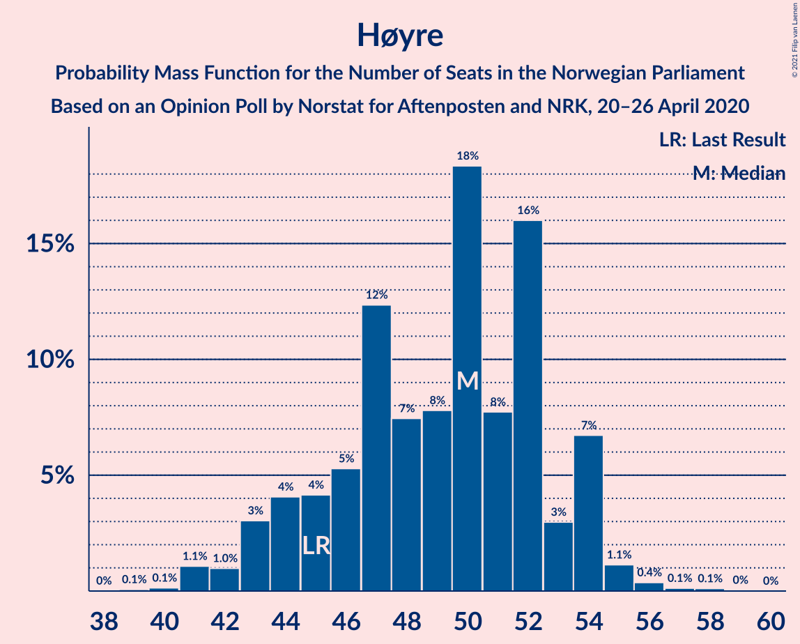

| Number of Seats | Probability | Accumulated | Special Marks |
|:---------------:|:-----------:|:-----------:|:-------------:|
| 39 | 0.1% | 100% |  |
| 40 | 0.1% | 99.9% |  |
| 41 | 1.1% | 99.8% |  |
| 42 | 1.0% | 98.7% |  |
| 43 | 3% | 98% |  |
| 44 | 4% | 95% |  |
| 45 | 4% | 91% | Last Result |
| 46 | 5% | 86% |  |
| 47 | 12% | 81% |  |
| 48 | 7% | 69% |  |
| 49 | 8% | 61% |  |
| 50 | 18% | 54% | Median |
| 51 | 8% | 35% |  |
| 52 | 16% | 27% |  |
| 53 | 3% | 11% |  |
| 54 | 7% | 9% |  |
| 55 | 1.1% | 2% |  |
| 56 | 0.4% | 0.7% |  |
| 57 | 0.1% | 0.3% |  |
| 58 | 0.1% | 0.2% |  |
| 59 | 0% | 0.1% |  |
| 60 | 0% | 0% |  |

### Arbeiderpartiet

*For a full overview of the results for this party, see the [Arbeiderpartiet](party-arbeiderpartiet.html) page.*

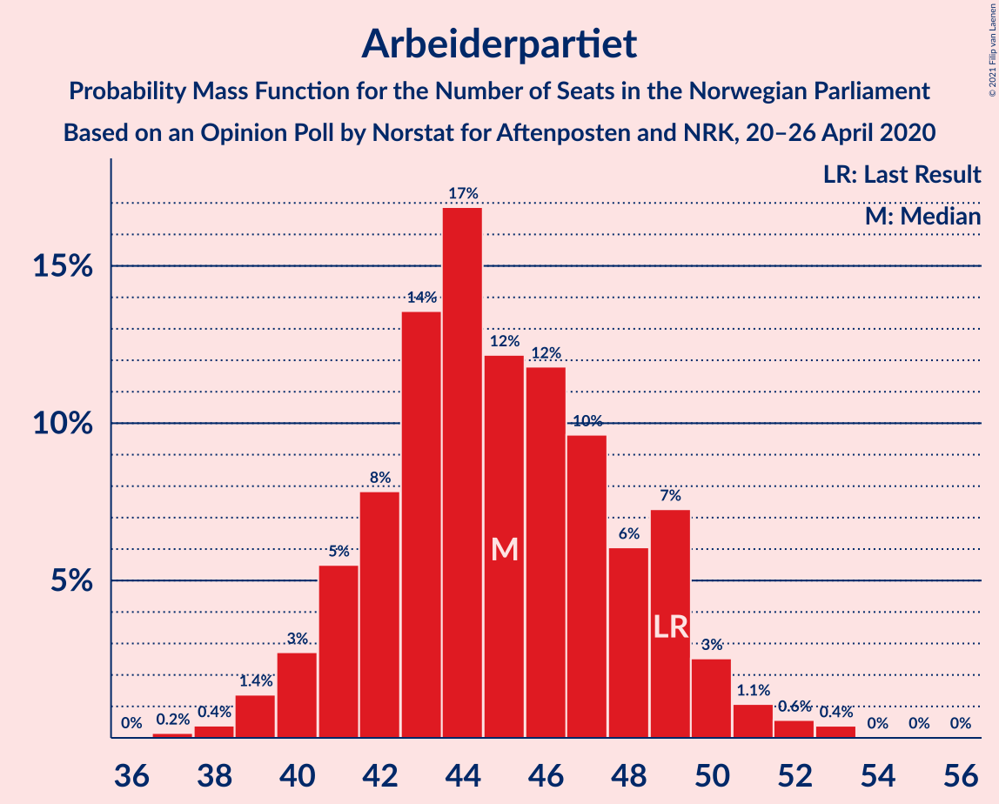

| Number of Seats | Probability | Accumulated | Special Marks |
|:---------------:|:-----------:|:-----------:|:-------------:|
| 37 | 0.2% | 100% |  |
| 38 | 0.4% | 99.8% |  |
| 39 | 1.4% | 99.4% |  |
| 40 | 3% | 98% |  |
| 41 | 5% | 95% |  |
| 42 | 8% | 90% |  |
| 43 | 14% | 82% |  |
| 44 | 17% | 68% |  |
| 45 | 12% | 52% | Median |
| 46 | 12% | 39% |  |
| 47 | 10% | 28% |  |
| 48 | 6% | 18% |  |
| 49 | 7% | 12% | Last Result |
| 50 | 3% | 5% |  |
| 51 | 1.1% | 2% |  |
| 52 | 0.6% | 1.0% |  |
| 53 | 0.4% | 0.5% |  |
| 54 | 0% | 0.1% |  |
| 55 | 0% | 0.1% |  |
| 56 | 0% | 0% |  |

### Senterpartiet

*For a full overview of the results for this party, see the [Senterpartiet](party-senterpartiet.html) page.*

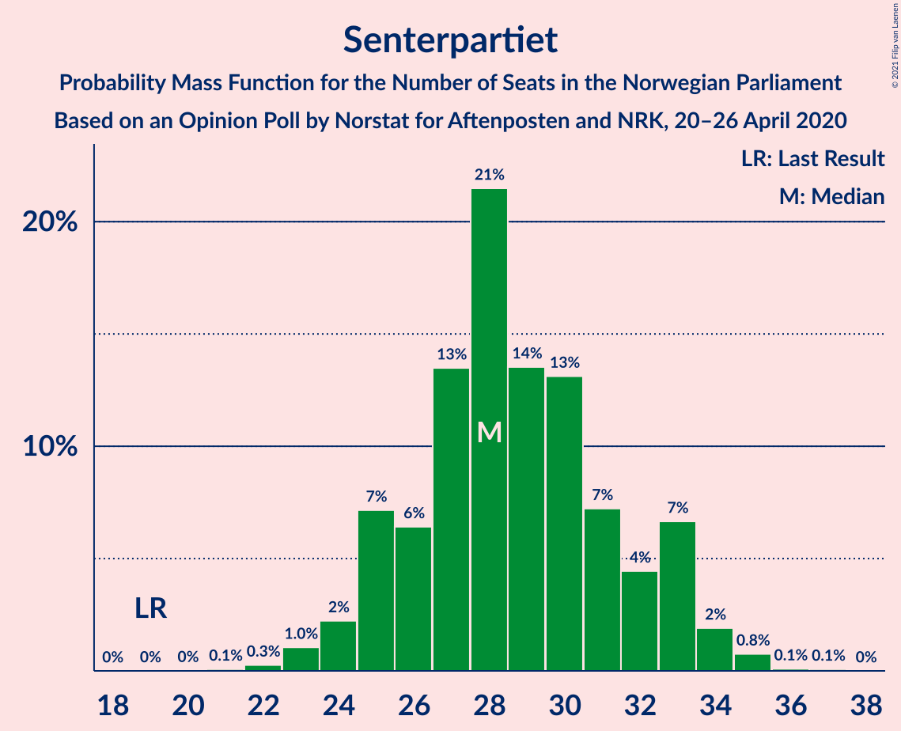

| Number of Seats | Probability | Accumulated | Special Marks |
|:---------------:|:-----------:|:-----------:|:-------------:|
| 19 | 0% | 100% | Last Result |
| 20 | 0% | 100% |  |
| 21 | 0.1% | 100% |  |
| 22 | 0.3% | 99.9% |  |
| 23 | 1.0% | 99.6% |  |
| 24 | 2% | 98.6% |  |
| 25 | 7% | 96% |  |
| 26 | 6% | 89% |  |
| 27 | 13% | 83% |  |
| 28 | 21% | 69% | Median |
| 29 | 14% | 48% |  |
| 30 | 13% | 34% |  |
| 31 | 7% | 21% |  |
| 32 | 4% | 14% |  |
| 33 | 7% | 9% |  |
| 34 | 2% | 3% |  |
| 35 | 0.8% | 0.9% |  |
| 36 | 0.1% | 0.2% |  |
| 37 | 0.1% | 0.1% |  |
| 38 | 0% | 0% |  |

### Fremskrittspartiet

*For a full overview of the results for this party, see the [Fremskrittspartiet](party-fremskrittspartiet.html) page.*

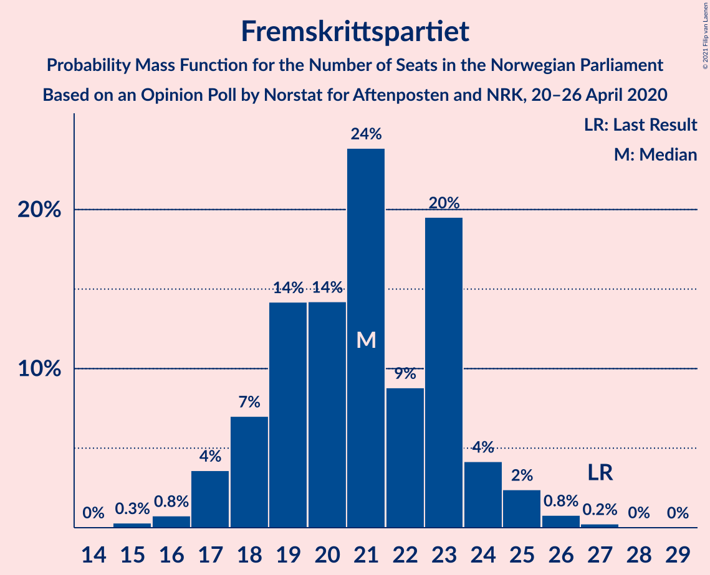

| Number of Seats | Probability | Accumulated | Special Marks |
|:---------------:|:-----------:|:-----------:|:-------------:|
| 14 | 0% | 100% |  |
| 15 | 0.3% | 99.9% |  |
| 16 | 0.8% | 99.6% |  |
| 17 | 4% | 98.9% |  |
| 18 | 7% | 95% |  |
| 19 | 14% | 88% |  |
| 20 | 14% | 74% |  |
| 21 | 24% | 60% | Median |
| 22 | 9% | 36% |  |
| 23 | 20% | 27% |  |
| 24 | 4% | 8% |  |
| 25 | 2% | 4% |  |
| 26 | 0.8% | 1.1% |  |
| 27 | 0.2% | 0.3% | Last Result |
| 28 | 0% | 0.1% |  |
| 29 | 0% | 0% |  |

### Sosialistisk Venstreparti

*For a full overview of the results for this party, see the [Sosialistisk Venstreparti](party-sosialistiskvenstreparti.html) page.*

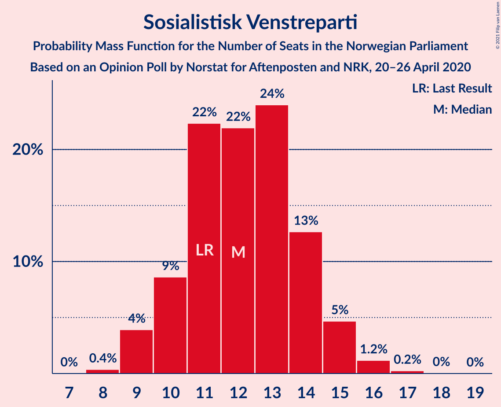

| Number of Seats | Probability | Accumulated | Special Marks |
|:---------------:|:-----------:|:-----------:|:-------------:|
| 8 | 0.4% | 100% |  |
| 9 | 4% | 99.6% |  |
| 10 | 9% | 96% |  |
| 11 | 22% | 87% | Last Result |
| 12 | 22% | 65% | Median |
| 13 | 24% | 43% |  |
| 14 | 13% | 19% |  |
| 15 | 5% | 6% |  |
| 16 | 1.2% | 1.5% |  |
| 17 | 0.2% | 0.3% |  |
| 18 | 0% | 0.1% |  |
| 19 | 0% | 0% |  |

### Miljøpartiet De Grønne

*For a full overview of the results for this party, see the [Miljøpartiet De Grønne](party-miljøpartietdegrønne.html) page.*

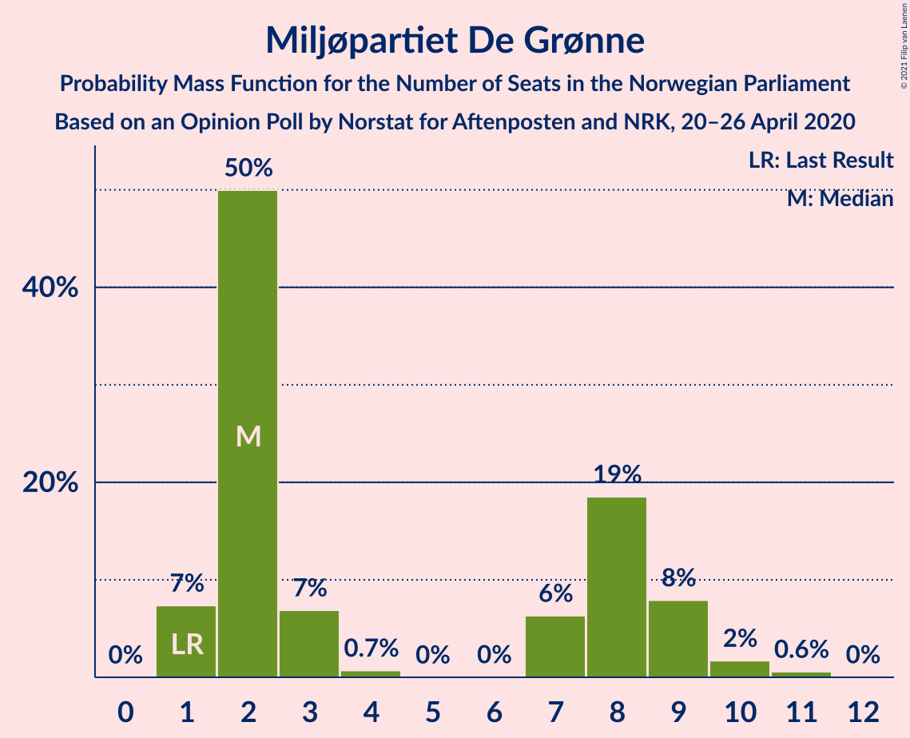

| Number of Seats | Probability | Accumulated | Special Marks |
|:---------------:|:-----------:|:-----------:|:-------------:|
| 1 | 7% | 100% | Last Result |
| 2 | 50% | 93% | Median |
| 3 | 7% | 43% |  |
| 4 | 0.7% | 36% |  |
| 5 | 0% | 35% |  |
| 6 | 0% | 35% |  |
| 7 | 6% | 35% |  |
| 8 | 19% | 29% |  |
| 9 | 8% | 10% |  |
| 10 | 2% | 2% |  |
| 11 | 0.6% | 0.6% |  |
| 12 | 0% | 0% |  |

### Rødt

*For a full overview of the results for this party, see the [Rødt](party-rødt.html) page.*

| Number of Seats | Probability | Accumulated | Special Marks |
|:---------------:|:-----------:|:-----------:|:-------------:|
| 1 | 7% | 100% | Last Result |
| 2 | 65% | 93% | Median |
| 3 | 0% | 28% |  |
| 4 | 0% | 28% |  |
| 5 | 0% | 28% |  |
| 6 | 0% | 28% |  |
| 7 | 8% | 28% |  |
| 8 | 16% | 21% |  |
| 9 | 4% | 4% |  |
| 10 | 0.6% | 0.7% |  |
| 11 | 0.1% | 0.1% |  |
| 12 | 0% | 0% |  |

### Venstre

*For a full overview of the results for this party, see the [Venstre](party-venstre.html) page.*

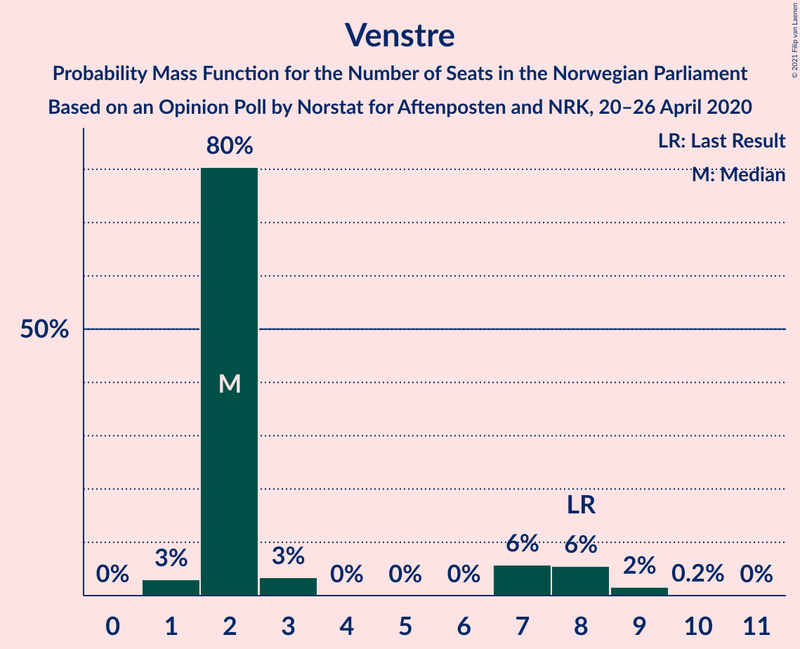

| Number of Seats | Probability | Accumulated | Special Marks |
|:---------------:|:-----------:|:-----------:|:-------------:|
| 1 | 3% | 100% |  |
| 2 | 80% | 97% | Median |
| 3 | 3% | 17% |  |
| 4 | 0% | 13% |  |
| 5 | 0% | 13% |  |
| 6 | 0% | 13% |  |
| 7 | 6% | 13% |  |
| 8 | 6% | 7% | Last Result |
| 9 | 2% | 2% |  |
| 10 | 0.2% | 0.2% |  |
| 11 | 0% | 0% |  |

### Kristelig Folkeparti

*For a full overview of the results for this party, see the [Kristelig Folkeparti](party-kristeligfolkeparti.html) page.*

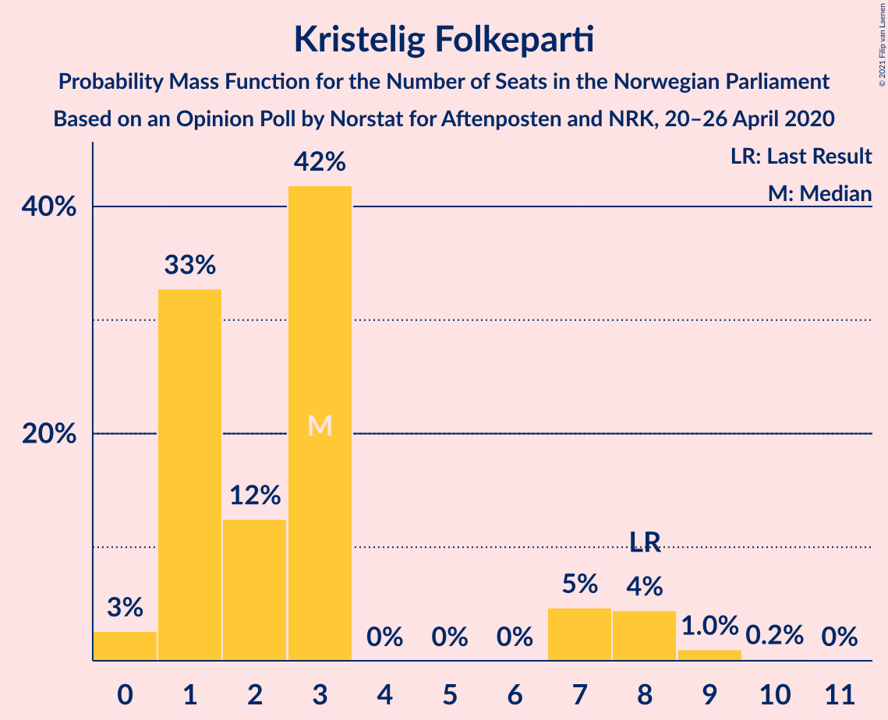

| Number of Seats | Probability | Accumulated | Special Marks |
|:---------------:|:-----------:|:-----------:|:-------------:|
| 0 | 3% | 100% |  |
| 1 | 33% | 97% |  |
| 2 | 12% | 65% |  |
| 3 | 42% | 52% | Median |
| 4 | 0% | 10% |  |
| 5 | 0% | 10% |  |
| 6 | 0% | 10% |  |
| 7 | 5% | 10% |  |
| 8 | 4% | 6% | Last Result |
| 9 | 1.0% | 1.2% |  |
| 10 | 0.2% | 0.2% |  |
| 11 | 0% | 0% |  |

## Coalitions

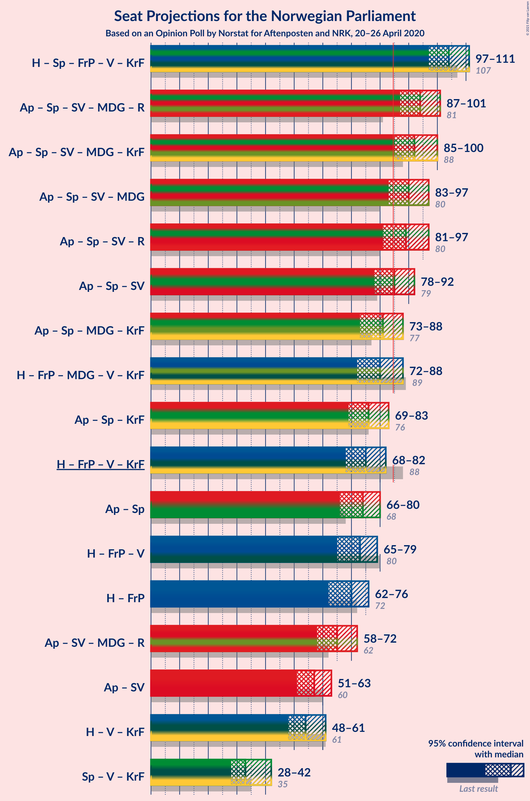

### Confidence Intervals

| Coalition | Last Result | Median | Majority? | 80% Confidence Interval | 90% Confidence Interval | 95% Confidence Interval | 99% Confidence Interval |
|:---------:|:-----------:|:------:|:---------:|:-----------------------:|:-----------------------:|:-----------------------:|:-----------------------:|
| Høyre – Senterpartiet – Fremskrittspartiet – Venstre – Kristelig Folkeparti | 107 | 104 | 100% | 99–109 | 97–110 | 97–111 | 94–113 |
| Arbeiderpartiet – Senterpartiet – Sosialistisk Venstreparti – Miljøpartiet De Grønne – Rødt | 81 | 94 | 99.3% | 89–98 | 88–100 | 87–101 | 84–105 |
| Arbeiderpartiet – Senterpartiet – Sosialistisk Venstreparti – Miljøpartiet De Grønne – Kristelig Folkeparti | 88 | 92 | 98% | 88–97 | 87–98 | 85–100 | 83–102 |
| Arbeiderpartiet – Senterpartiet – Sosialistisk Venstreparti – Miljøpartiet De Grønne | 80 | 90 | 94% | 86–94 | 84–96 | 83–97 | 80–99 |
| Arbeiderpartiet – Senterpartiet – Sosialistisk Venstreparti – Rødt | 80 | 89 | 92% | 85–94 | 83–95 | 81–97 | 79–99 |
| Arbeiderpartiet – Senterpartiet – Sosialistisk Venstreparti | 79 | 85 | 70% | 81–91 | 79–91 | 78–92 | 76–95 |
| Arbeiderpartiet – Senterpartiet – Miljøpartiet De Grønne – Kristelig Folkeparti | 77 | 81 | 14% | 76–85 | 75–87 | 73–88 | 71–91 |
| Høyre – Fremskrittspartiet – Miljøpartiet De Grønne – Venstre – Kristelig Folkeparti | 89 | 80 | 8% | 75–84 | 74–86 | 72–88 | 70–90 |
| Arbeiderpartiet – Senterpartiet – Kristelig Folkeparti | 76 | 76 | 0.9% | 72–81 | 70–82 | 69–83 | 67–86 |
| Høyre – Fremskrittspartiet – Venstre – Kristelig Folkeparti | 88 | 75 | 0.7% | 71–80 | 69–81 | 68–82 | 64–85 |
| Arbeiderpartiet – Senterpartiet | 68 | 74 | 0% | 69–79 | 68–79 | 66–80 | 65–82 |
| Høyre – Fremskrittspartiet – Venstre | 80 | 73 | 0.1% | 68–77 | 67–78 | 65–79 | 63–82 |
| Høyre – Fremskrittspartiet | 72 | 70 | 0% | 66–75 | 63–75 | 62–76 | 60–78 |
| Arbeiderpartiet – Sosialistisk Venstreparti – Miljøpartiet De Grønne – Rødt | 62 | 65 | 0% | 60–70 | 59–72 | 58–72 | 56–75 |
| Arbeiderpartiet – Sosialistisk Venstreparti | 60 | 57 | 0% | 53–61 | 52–62 | 51–63 | 49–66 |
| Høyre – Venstre – Kristelig Folkeparti | 61 | 54 | 0% | 50–59 | 49–60 | 48–61 | 45–65 |
| Senterpartiet – Venstre – Kristelig Folkeparti | 35 | 33 | 0% | 30–39 | 29–41 | 28–42 | 27–44 |

### Høyre – Senterpartiet – Fremskrittspartiet – Venstre – Kristelig Folkeparti

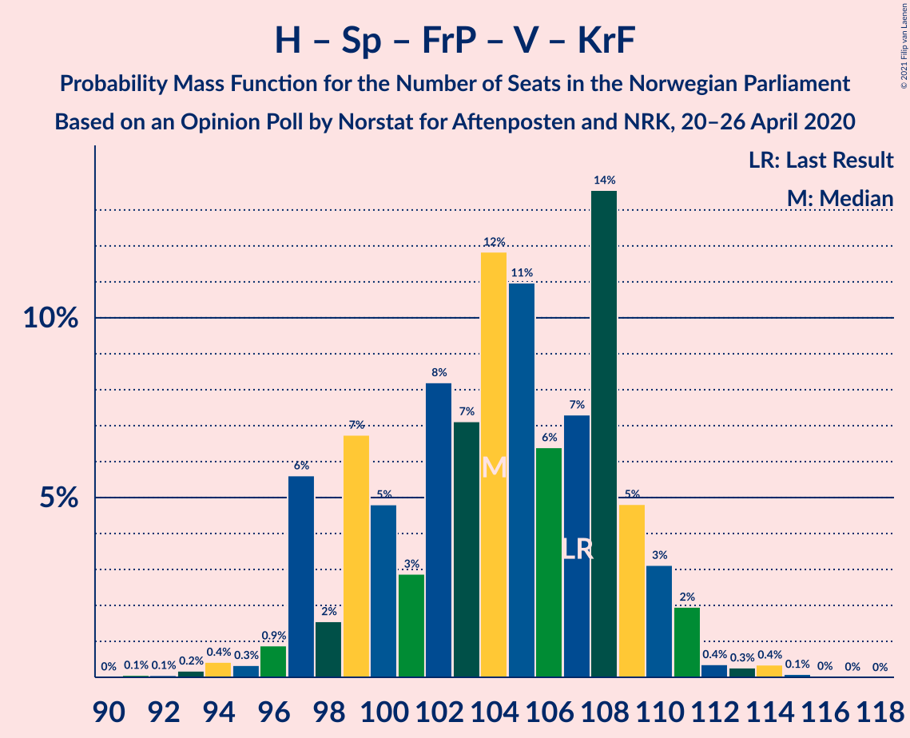

| Number of Seats | Probability | Accumulated | Special Marks |
|:---------------:|:-----------:|:-----------:|:-------------:|
| 90 | 0% | 100% |  |
| 91 | 0.1% | 99.9% |  |
| 92 | 0.1% | 99.9% |  |
| 93 | 0.2% | 99.8% |  |
| 94 | 0.4% | 99.6% |  |
| 95 | 0.3% | 99.2% |  |
| 96 | 0.9% | 98.9% |  |
| 97 | 6% | 98% |  |
| 98 | 2% | 92% |  |
| 99 | 7% | 91% |  |
| 100 | 5% | 84% |  |
| 101 | 3% | 79% |  |
| 102 | 8% | 76% |  |
| 103 | 7% | 68% |  |
| 104 | 12% | 61% | Median |
| 105 | 11% | 49% |  |
| 106 | 6% | 38% |  |
| 107 | 7% | 32% | Last Result |
| 108 | 14% | 25% |  |
| 109 | 5% | 11% |  |
| 110 | 3% | 6% |  |
| 111 | 2% | 3% |  |
| 112 | 0.4% | 1.1% |  |
| 113 | 0.3% | 0.8% |  |
| 114 | 0.4% | 0.5% |  |
| 115 | 0.1% | 0.1% |  |
| 116 | 0% | 0.1% |  |
| 117 | 0% | 0% |  |

### Arbeiderpartiet – Senterpartiet – Sosialistisk Venstreparti – Miljøpartiet De Grønne – Rødt

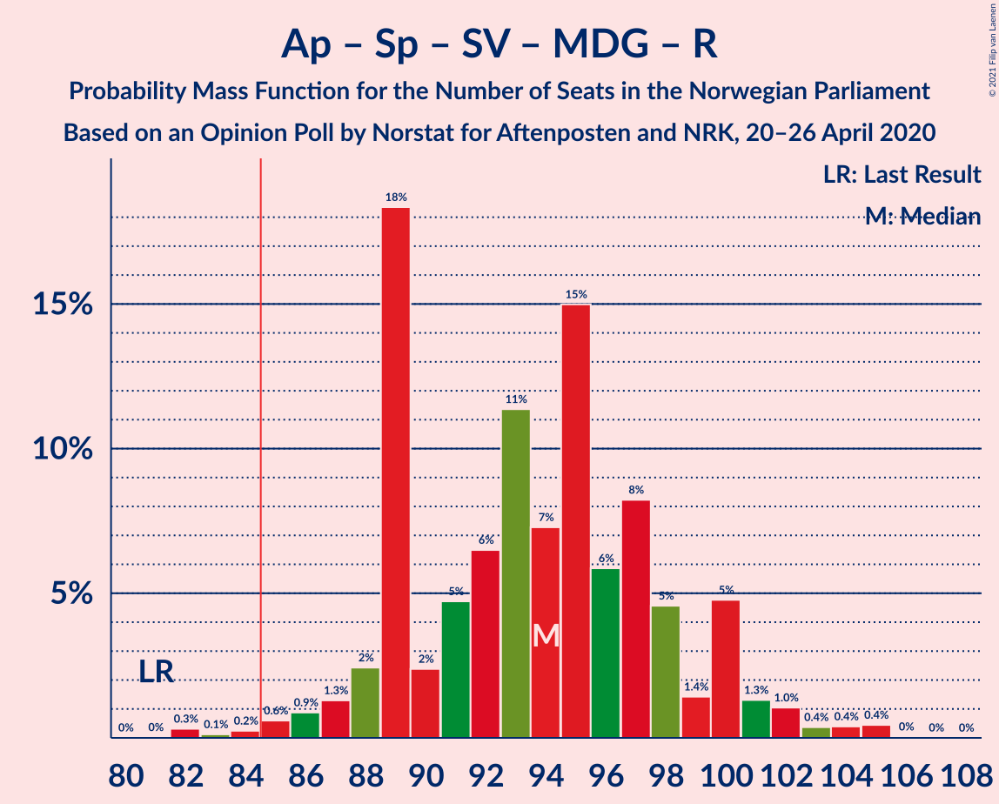

| Number of Seats | Probability | Accumulated | Special Marks |
|:---------------:|:-----------:|:-----------:|:-------------:|
| 81 | 0% | 100% | Last Result |
| 82 | 0.3% | 100% |  |
| 83 | 0.1% | 99.6% |  |
| 84 | 0.2% | 99.5% |  |
| 85 | 0.6% | 99.3% | Majority |
| 86 | 0.9% | 98.7% |  |
| 87 | 1.3% | 98% |  |
| 88 | 2% | 97% |  |
| 89 | 18% | 94% | Median |
| 90 | 2% | 76% |  |
| 91 | 5% | 73% |  |
| 92 | 6% | 69% |  |
| 93 | 11% | 62% |  |
| 94 | 7% | 51% |  |
| 95 | 15% | 43% |  |
| 96 | 6% | 28% |  |
| 97 | 8% | 23% |  |
| 98 | 5% | 14% |  |
| 99 | 1.4% | 10% |  |
| 100 | 5% | 8% |  |
| 101 | 1.3% | 4% |  |
| 102 | 1.0% | 2% |  |
| 103 | 0.4% | 1.3% |  |
| 104 | 0.4% | 0.9% |  |
| 105 | 0.4% | 0.5% |  |
| 106 | 0% | 0.1% |  |
| 107 | 0% | 0% |  |

### Arbeiderpartiet – Senterpartiet – Sosialistisk Venstreparti – Miljøpartiet De Grønne – Kristelig Folkeparti

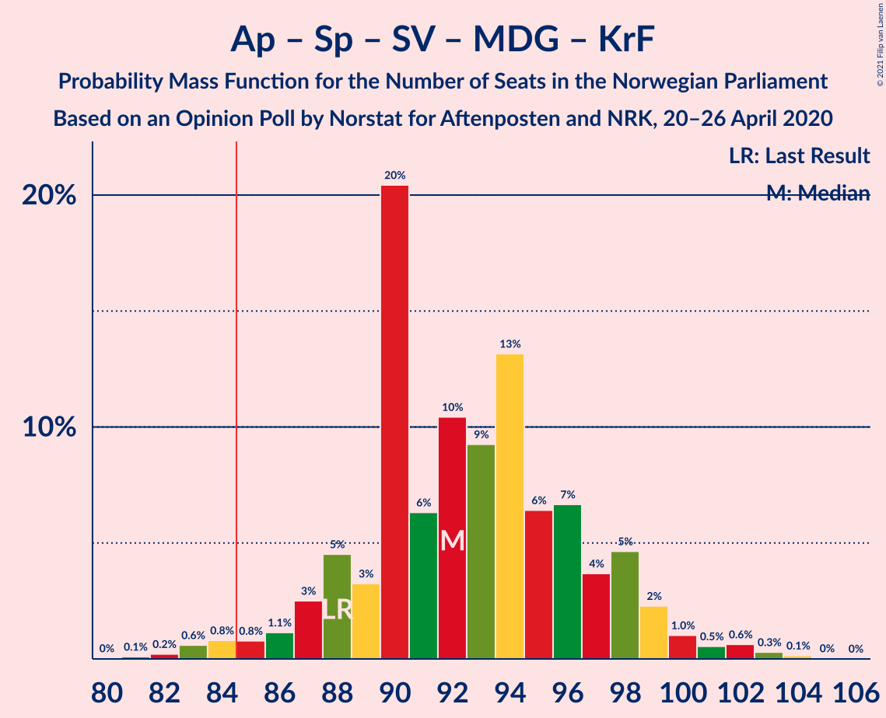

| Number of Seats | Probability | Accumulated | Special Marks |
|:---------------:|:-----------:|:-----------:|:-------------:|
| 80 | 0% | 100% |  |
| 81 | 0.1% | 99.9% |  |
| 82 | 0.2% | 99.8% |  |
| 83 | 0.6% | 99.6% |  |
| 84 | 0.8% | 99.0% |  |
| 85 | 0.8% | 98% | Majority |
| 86 | 1.1% | 97% |  |
| 87 | 3% | 96% |  |
| 88 | 5% | 94% | Last Result |
| 89 | 3% | 89% |  |
| 90 | 20% | 86% | Median |
| 91 | 6% | 66% |  |
| 92 | 10% | 59% |  |
| 93 | 9% | 49% |  |
| 94 | 13% | 40% |  |
| 95 | 6% | 26% |  |
| 96 | 7% | 20% |  |
| 97 | 4% | 13% |  |
| 98 | 5% | 10% |  |
| 99 | 2% | 5% |  |
| 100 | 1.0% | 3% |  |
| 101 | 0.5% | 2% |  |
| 102 | 0.6% | 1.1% |  |
| 103 | 0.3% | 0.5% |  |
| 104 | 0.1% | 0.2% |  |
| 105 | 0% | 0.1% |  |
| 106 | 0% | 0% |  |

### Arbeiderpartiet – Senterpartiet – Sosialistisk Venstreparti – Miljøpartiet De Grønne

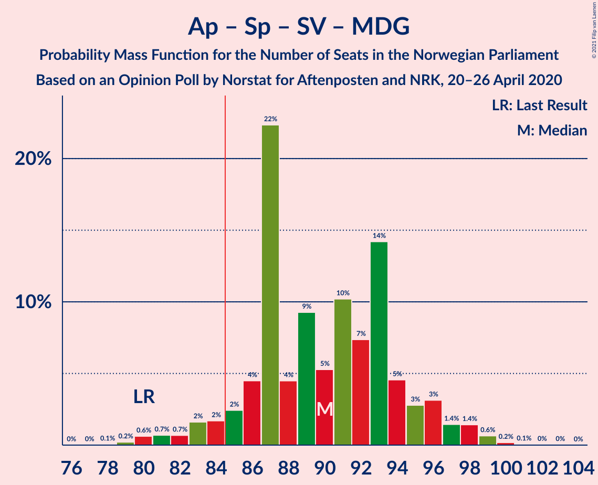

| Number of Seats | Probability | Accumulated | Special Marks |
|:---------------:|:-----------:|:-----------:|:-------------:|
| 78 | 0.1% | 100% |  |
| 79 | 0.2% | 99.9% |  |
| 80 | 0.6% | 99.7% | Last Result |
| 81 | 0.7% | 99.1% |  |
| 82 | 0.7% | 98% |  |
| 83 | 2% | 98% |  |
| 84 | 2% | 96% |  |
| 85 | 2% | 94% | Majority |
| 86 | 4% | 92% |  |
| 87 | 22% | 87% | Median |
| 88 | 4% | 65% |  |
| 89 | 9% | 61% |  |
| 90 | 5% | 51% |  |
| 91 | 10% | 46% |  |
| 92 | 7% | 36% |  |
| 93 | 14% | 29% |  |
| 94 | 5% | 14% |  |
| 95 | 3% | 10% |  |
| 96 | 3% | 7% |  |
| 97 | 1.4% | 4% |  |
| 98 | 1.4% | 2% |  |
| 99 | 0.6% | 1.0% |  |
| 100 | 0.2% | 0.3% |  |
| 101 | 0.1% | 0.1% |  |
| 102 | 0% | 0.1% |  |
| 103 | 0% | 0% |  |

### Arbeiderpartiet – Senterpartiet – Sosialistisk Venstreparti – Rødt

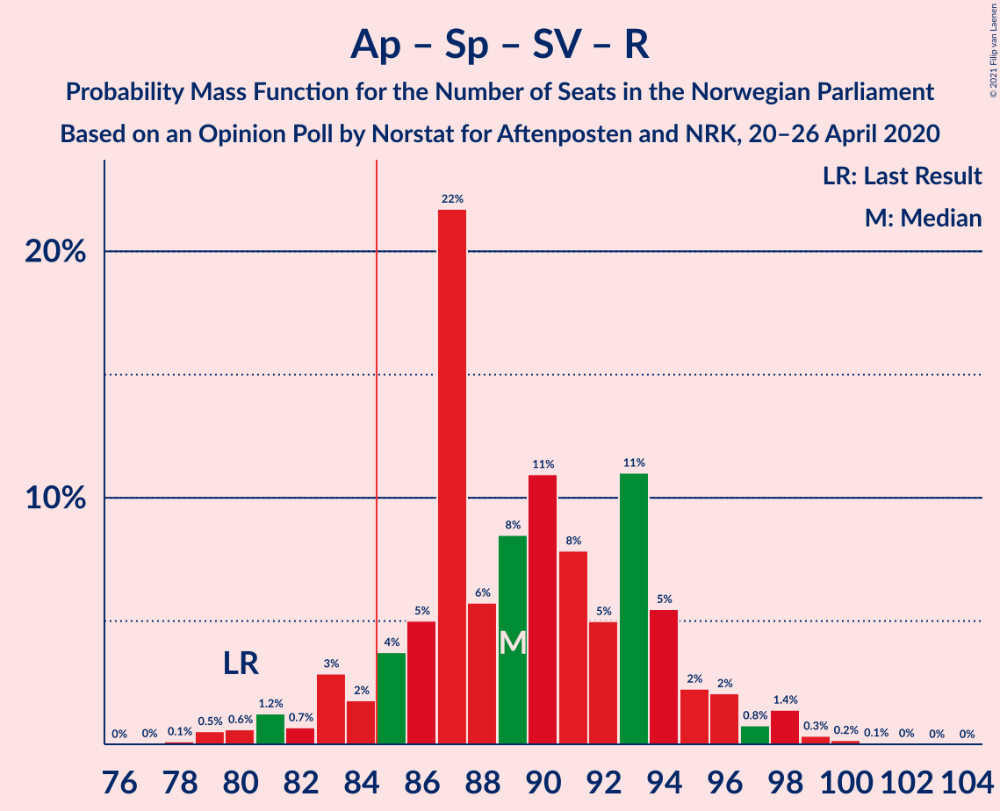

| Number of Seats | Probability | Accumulated | Special Marks |
|:---------------:|:-----------:|:-----------:|:-------------:|
| 77 | 0% | 100% |  |
| 78 | 0.1% | 99.9% |  |
| 79 | 0.5% | 99.8% |  |
| 80 | 0.6% | 99.3% | Last Result |
| 81 | 1.2% | 98.7% |  |
| 82 | 0.7% | 97% |  |
| 83 | 3% | 97% |  |
| 84 | 2% | 94% |  |
| 85 | 4% | 92% | Majority |
| 86 | 5% | 88% |  |
| 87 | 22% | 83% | Median |
| 88 | 6% | 62% |  |
| 89 | 8% | 56% |  |
| 90 | 11% | 47% |  |
| 91 | 8% | 36% |  |
| 92 | 5% | 29% |  |
| 93 | 11% | 24% |  |
| 94 | 5% | 13% |  |
| 95 | 2% | 7% |  |
| 96 | 2% | 5% |  |
| 97 | 0.8% | 3% |  |
| 98 | 1.4% | 2% |  |
| 99 | 0.3% | 0.6% |  |
| 100 | 0.2% | 0.3% |  |
| 101 | 0.1% | 0.1% |  |
| 102 | 0% | 0.1% |  |
| 103 | 0% | 0% |  |

### Arbeiderpartiet – Senterpartiet – Sosialistisk Venstreparti

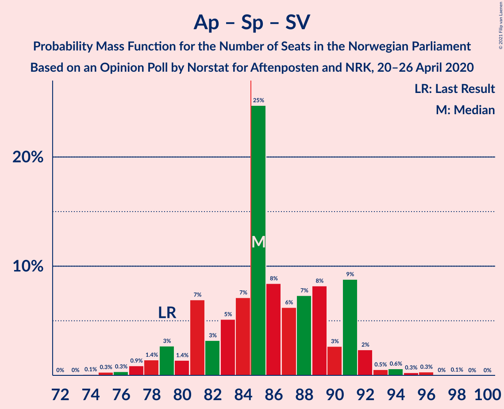

| Number of Seats | Probability | Accumulated | Special Marks |
|:---------------:|:-----------:|:-----------:|:-------------:|
| 74 | 0.1% | 100% |  |
| 75 | 0.3% | 99.9% |  |
| 76 | 0.3% | 99.6% |  |
| 77 | 0.9% | 99.2% |  |
| 78 | 1.4% | 98% |  |
| 79 | 3% | 97% | Last Result |
| 80 | 1.4% | 94% |  |
| 81 | 7% | 93% |  |
| 82 | 3% | 86% |  |
| 83 | 5% | 83% |  |
| 84 | 7% | 78% |  |
| 85 | 25% | 70% | Median, Majority |
| 86 | 8% | 46% |  |
| 87 | 6% | 37% |  |
| 88 | 7% | 31% |  |
| 89 | 8% | 24% |  |
| 90 | 3% | 16% |  |
| 91 | 9% | 13% |  |
| 92 | 2% | 4% |  |
| 93 | 0.5% | 2% |  |
| 94 | 0.6% | 1.3% |  |
| 95 | 0.3% | 0.7% |  |
| 96 | 0.3% | 0.4% |  |
| 97 | 0% | 0.1% |  |
| 98 | 0.1% | 0.1% |  |
| 99 | 0% | 0% |  |

### Arbeiderpartiet – Senterpartiet – Miljøpartiet De Grønne – Kristelig Folkeparti

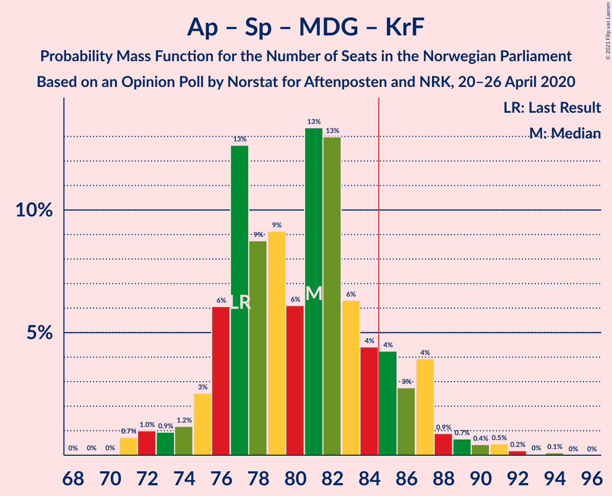

| Number of Seats | Probability | Accumulated | Special Marks |
|:---------------:|:-----------:|:-----------:|:-------------:|
| 68 | 0% | 100% |  |
| 69 | 0% | 99.9% |  |
| 70 | 0% | 99.9% |  |
| 71 | 0.7% | 99.8% |  |
| 72 | 1.0% | 99.1% |  |
| 73 | 0.9% | 98% |  |
| 74 | 1.2% | 97% |  |
| 75 | 3% | 96% |  |
| 76 | 6% | 93% |  |
| 77 | 13% | 87% | Last Result |
| 78 | 9% | 75% | Median |
| 79 | 9% | 66% |  |
| 80 | 6% | 57% |  |
| 81 | 13% | 51% |  |
| 82 | 13% | 37% |  |
| 83 | 6% | 24% |  |
| 84 | 4% | 18% |  |
| 85 | 4% | 14% | Majority |
| 86 | 3% | 9% |  |
| 87 | 4% | 7% |  |
| 88 | 0.9% | 3% |  |
| 89 | 0.7% | 2% |  |
| 90 | 0.4% | 1.2% |  |
| 91 | 0.5% | 0.8% |  |
| 92 | 0.2% | 0.3% |  |
| 93 | 0% | 0.1% |  |
| 94 | 0.1% | 0.1% |  |
| 95 | 0% | 0% |  |

### Høyre – Fremskrittspartiet – Miljøpartiet De Grønne – Venstre – Kristelig Folkeparti

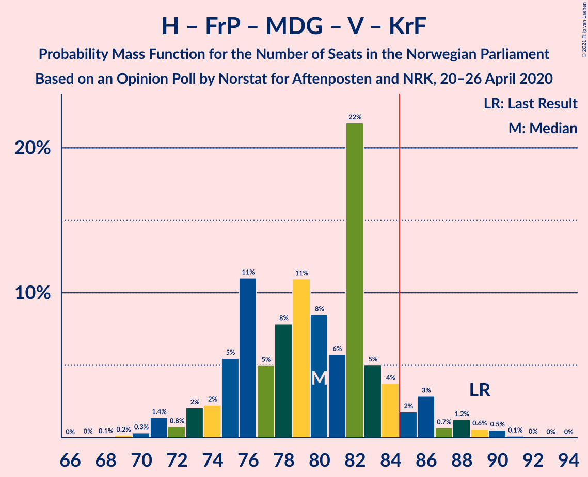

| Number of Seats | Probability | Accumulated | Special Marks |
|:---------------:|:-----------:|:-----------:|:-------------:|
| 67 | 0% | 100% |  |
| 68 | 0.1% | 99.9% |  |
| 69 | 0.2% | 99.9% |  |
| 70 | 0.3% | 99.7% |  |
| 71 | 1.4% | 99.4% |  |
| 72 | 0.8% | 98% |  |
| 73 | 2% | 97% |  |
| 74 | 2% | 95% |  |
| 75 | 5% | 93% |  |
| 76 | 11% | 87% |  |
| 77 | 5% | 76% |  |
| 78 | 8% | 71% | Median |
| 79 | 11% | 64% |  |
| 80 | 8% | 53% |  |
| 81 | 6% | 44% |  |
| 82 | 22% | 38% |  |
| 83 | 5% | 17% |  |
| 84 | 4% | 12% |  |
| 85 | 2% | 8% | Majority |
| 86 | 3% | 6% |  |
| 87 | 0.7% | 3% |  |
| 88 | 1.2% | 3% |  |
| 89 | 0.6% | 1.3% | Last Result |
| 90 | 0.5% | 0.7% |  |
| 91 | 0.1% | 0.2% |  |
| 92 | 0% | 0.1% |  |
| 93 | 0% | 0% |  |

### Arbeiderpartiet – Senterpartiet – Kristelig Folkeparti

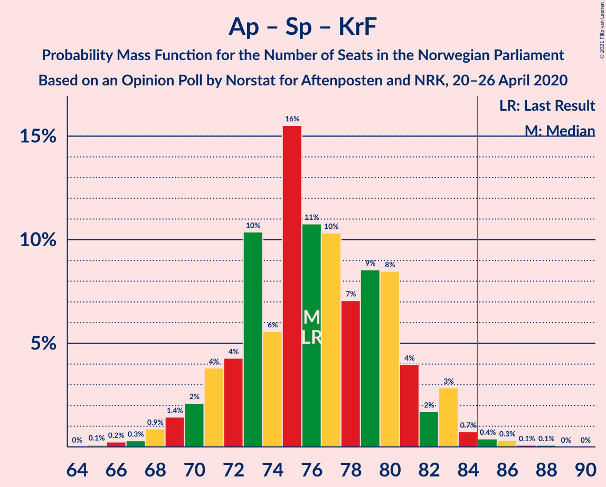

| Number of Seats | Probability | Accumulated | Special Marks |
|:---------------:|:-----------:|:-----------:|:-------------:|
| 65 | 0.1% | 100% |  |
| 66 | 0.2% | 99.9% |  |
| 67 | 0.3% | 99.6% |  |
| 68 | 0.9% | 99.3% |  |
| 69 | 1.4% | 98% |  |
| 70 | 2% | 97% |  |
| 71 | 4% | 95% |  |
| 72 | 4% | 91% |  |
| 73 | 10% | 87% |  |
| 74 | 6% | 76% |  |
| 75 | 16% | 71% |  |
| 76 | 11% | 55% | Last Result, Median |
| 77 | 10% | 45% |  |
| 78 | 7% | 34% |  |
| 79 | 9% | 27% |  |
| 80 | 8% | 19% |  |
| 81 | 4% | 10% |  |
| 82 | 2% | 6% |  |
| 83 | 3% | 4% |  |
| 84 | 0.7% | 2% |  |
| 85 | 0.4% | 0.9% | Majority |
| 86 | 0.3% | 0.5% |  |
| 87 | 0.1% | 0.2% |  |
| 88 | 0.1% | 0.1% |  |
| 89 | 0% | 0% |  |

### Høyre – Fremskrittspartiet – Venstre – Kristelig Folkeparti

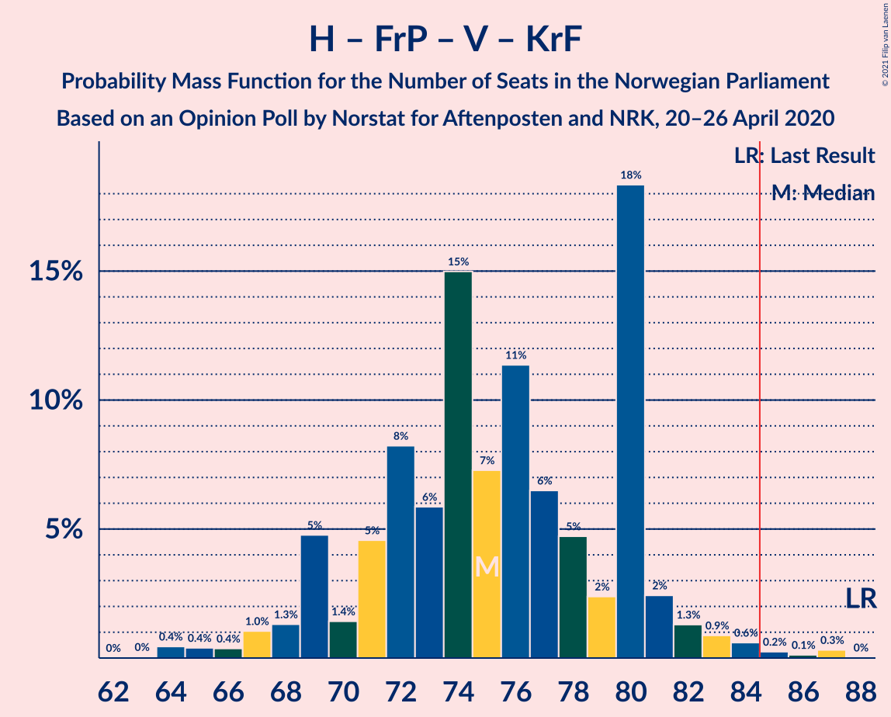

| Number of Seats | Probability | Accumulated | Special Marks |
|:---------------:|:-----------:|:-----------:|:-------------:|
| 63 | 0% | 100% |  |
| 64 | 0.4% | 99.9% |  |
| 65 | 0.4% | 99.5% |  |
| 66 | 0.4% | 99.1% |  |
| 67 | 1.0% | 98.7% |  |
| 68 | 1.3% | 98% |  |
| 69 | 5% | 96% |  |
| 70 | 1.4% | 92% |  |
| 71 | 5% | 90% |  |
| 72 | 8% | 86% |  |
| 73 | 6% | 77% |  |
| 74 | 15% | 72% |  |
| 75 | 7% | 57% |  |
| 76 | 11% | 49% | Median |
| 77 | 6% | 38% |  |
| 78 | 5% | 31% |  |
| 79 | 2% | 27% |  |
| 80 | 18% | 24% |  |
| 81 | 2% | 6% |  |
| 82 | 1.3% | 3% |  |
| 83 | 0.9% | 2% |  |
| 84 | 0.6% | 1.3% |  |
| 85 | 0.2% | 0.7% | Majority |
| 86 | 0.1% | 0.5% |  |
| 87 | 0.3% | 0.4% |  |
| 88 | 0% | 0% | Last Result |

### Arbeiderpartiet – Senterpartiet

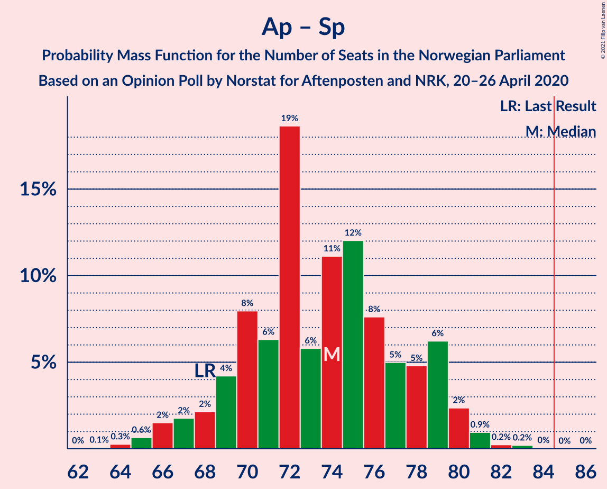

| Number of Seats | Probability | Accumulated | Special Marks |
|:---------------:|:-----------:|:-----------:|:-------------:|
| 63 | 0.1% | 100% |  |
| 64 | 0.3% | 99.9% |  |
| 65 | 0.6% | 99.6% |  |
| 66 | 2% | 99.0% |  |
| 67 | 2% | 97% |  |
| 68 | 2% | 96% | Last Result |
| 69 | 4% | 94% |  |
| 70 | 8% | 89% |  |
| 71 | 6% | 81% |  |
| 72 | 19% | 75% |  |
| 73 | 6% | 56% | Median |
| 74 | 11% | 51% |  |
| 75 | 12% | 39% |  |
| 76 | 8% | 27% |  |
| 77 | 5% | 20% |  |
| 78 | 5% | 15% |  |
| 79 | 6% | 10% |  |
| 80 | 2% | 4% |  |
| 81 | 0.9% | 1.5% |  |
| 82 | 0.2% | 0.5% |  |
| 83 | 0.2% | 0.3% |  |
| 84 | 0% | 0.1% |  |
| 85 | 0% | 0% | Majority |

### Høyre – Fremskrittspartiet – Venstre

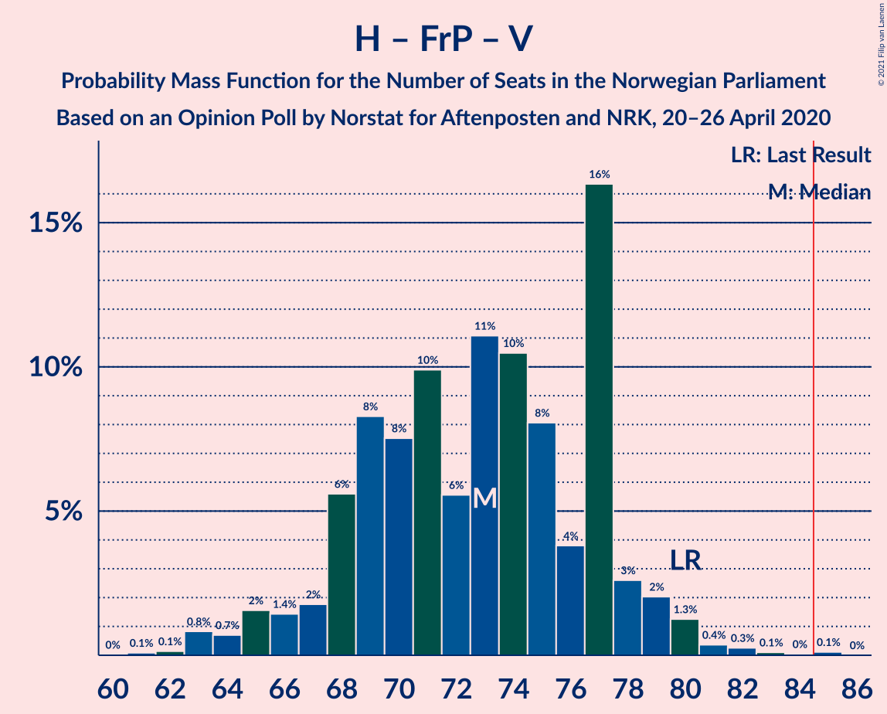

| Number of Seats | Probability | Accumulated | Special Marks |
|:---------------:|:-----------:|:-----------:|:-------------:|
| 61 | 0.1% | 100% |  |
| 62 | 0.1% | 99.9% |  |
| 63 | 0.8% | 99.7% |  |
| 64 | 0.7% | 98.9% |  |
| 65 | 2% | 98% |  |
| 66 | 1.4% | 97% |  |
| 67 | 2% | 95% |  |
| 68 | 6% | 93% |  |
| 69 | 8% | 88% |  |
| 70 | 8% | 80% |  |
| 71 | 10% | 72% |  |
| 72 | 6% | 62% |  |
| 73 | 11% | 57% | Median |
| 74 | 10% | 45% |  |
| 75 | 8% | 35% |  |
| 76 | 4% | 27% |  |
| 77 | 16% | 23% |  |
| 78 | 3% | 7% |  |
| 79 | 2% | 4% |  |
| 80 | 1.3% | 2% | Last Result |
| 81 | 0.4% | 0.9% |  |
| 82 | 0.3% | 0.5% |  |
| 83 | 0.1% | 0.3% |  |
| 84 | 0% | 0.2% |  |
| 85 | 0.1% | 0.1% | Majority |
| 86 | 0% | 0% |  |

### Høyre – Fremskrittspartiet

| Number of Seats | Probability | Accumulated | Special Marks |
|:---------------:|:-----------:|:-----------:|:-------------:|
| 58 | 0.1% | 100% |  |
| 59 | 0.2% | 99.9% |  |
| 60 | 0.5% | 99.7% |  |
| 61 | 1.1% | 99.2% |  |
| 62 | 1.3% | 98% |  |
| 63 | 2% | 97% |  |
| 64 | 2% | 94% |  |
| 65 | 2% | 92% |  |
| 66 | 8% | 90% |  |
| 67 | 10% | 83% |  |
| 68 | 9% | 73% |  |
| 69 | 8% | 64% |  |
| 70 | 6% | 56% |  |
| 71 | 10% | 50% | Median |
| 72 | 11% | 40% | Last Result |
| 73 | 7% | 29% |  |
| 74 | 3% | 22% |  |
| 75 | 16% | 19% |  |
| 76 | 1.3% | 3% |  |
| 77 | 0.5% | 1.5% |  |
| 78 | 0.7% | 0.9% |  |
| 79 | 0.1% | 0.2% |  |
| 80 | 0.1% | 0.1% |  |
| 81 | 0% | 0.1% |  |
| 82 | 0% | 0% |  |

### Arbeiderpartiet – Sosialistisk Venstreparti – Miljøpartiet De Grønne – Rødt

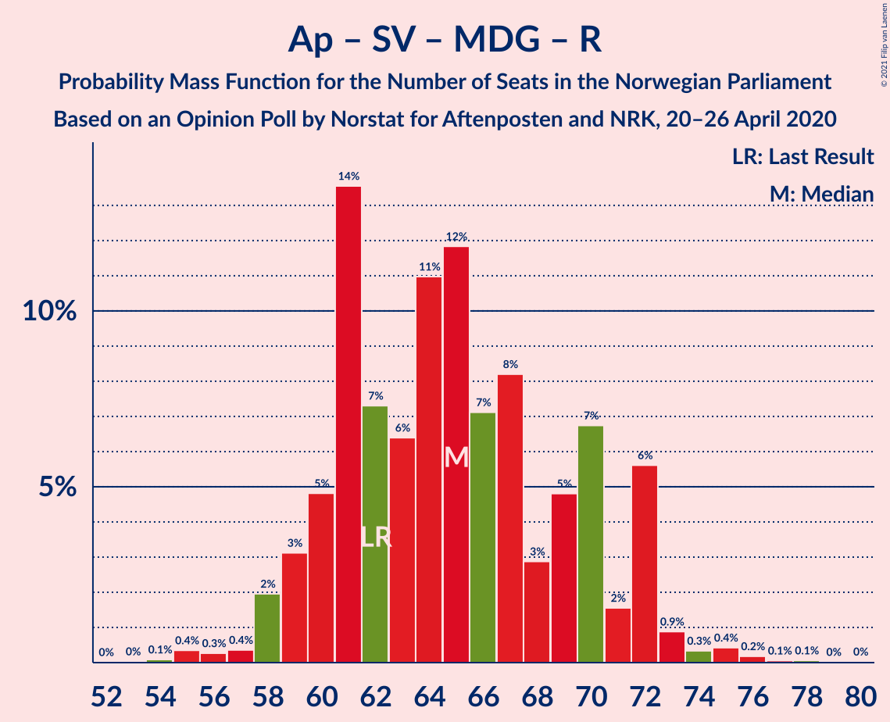

| Number of Seats | Probability | Accumulated | Special Marks |
|:---------------:|:-----------:|:-----------:|:-------------:|
| 53 | 0% | 100% |  |
| 54 | 0.1% | 99.9% |  |
| 55 | 0.4% | 99.9% |  |
| 56 | 0.3% | 99.5% |  |
| 57 | 0.4% | 99.2% |  |
| 58 | 2% | 98.9% |  |
| 59 | 3% | 97% |  |
| 60 | 5% | 94% |  |
| 61 | 14% | 89% | Median |
| 62 | 7% | 75% | Last Result |
| 63 | 6% | 68% |  |
| 64 | 11% | 62% |  |
| 65 | 12% | 51% |  |
| 66 | 7% | 39% |  |
| 67 | 8% | 32% |  |
| 68 | 3% | 24% |  |
| 69 | 5% | 21% |  |
| 70 | 7% | 16% |  |
| 71 | 2% | 9% |  |
| 72 | 6% | 8% |  |
| 73 | 0.9% | 2% |  |
| 74 | 0.3% | 1.1% |  |
| 75 | 0.4% | 0.8% |  |
| 76 | 0.2% | 0.4% |  |
| 77 | 0.1% | 0.2% |  |
| 78 | 0.1% | 0.1% |  |
| 79 | 0% | 0.1% |  |
| 80 | 0% | 0% |  |

### Arbeiderpartiet – Sosialistisk Venstreparti

| Number of Seats | Probability | Accumulated | Special Marks |
|:---------------:|:-----------:|:-----------:|:-------------:|
| 47 | 0.1% | 100% |  |
| 48 | 0.1% | 99.9% |  |
| 49 | 0.5% | 99.7% |  |
| 50 | 1.1% | 99.3% |  |
| 51 | 2% | 98% |  |
| 52 | 3% | 96% |  |
| 53 | 5% | 93% |  |
| 54 | 9% | 88% |  |
| 55 | 9% | 79% |  |
| 56 | 11% | 70% |  |
| 57 | 19% | 59% | Median |
| 58 | 9% | 41% |  |
| 59 | 8% | 31% |  |
| 60 | 10% | 23% | Last Result |
| 61 | 7% | 14% |  |
| 62 | 3% | 7% |  |
| 63 | 3% | 4% |  |
| 64 | 0.6% | 2% |  |
| 65 | 0.6% | 1.1% |  |
| 66 | 0.3% | 0.5% |  |
| 67 | 0.2% | 0.3% |  |
| 68 | 0% | 0.1% |  |
| 69 | 0% | 0% |  |

### Høyre – Venstre – Kristelig Folkeparti

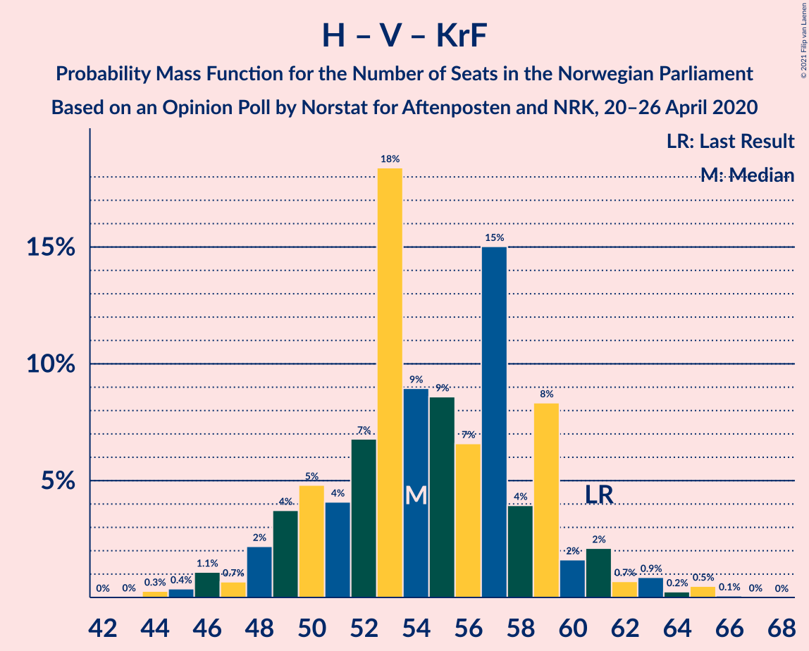

| Number of Seats | Probability | Accumulated | Special Marks |
|:---------------:|:-----------:|:-----------:|:-------------:|
| 44 | 0.3% | 100% |  |
| 45 | 0.4% | 99.7% |  |
| 46 | 1.1% | 99.3% |  |
| 47 | 0.7% | 98% |  |
| 48 | 2% | 98% |  |
| 49 | 4% | 95% |  |
| 50 | 5% | 92% |  |
| 51 | 4% | 87% |  |
| 52 | 7% | 83% |  |
| 53 | 18% | 76% |  |
| 54 | 9% | 58% |  |
| 55 | 9% | 49% | Median |
| 56 | 7% | 40% |  |
| 57 | 15% | 33% |  |
| 58 | 4% | 18% |  |
| 59 | 8% | 14% |  |
| 60 | 2% | 6% |  |
| 61 | 2% | 5% | Last Result |
| 62 | 0.7% | 2% |  |
| 63 | 0.9% | 2% |  |
| 64 | 0.2% | 0.8% |  |
| 65 | 0.5% | 0.6% |  |
| 66 | 0.1% | 0.1% |  |
| 67 | 0% | 0% |  |

### Senterpartiet – Venstre – Kristelig Folkeparti

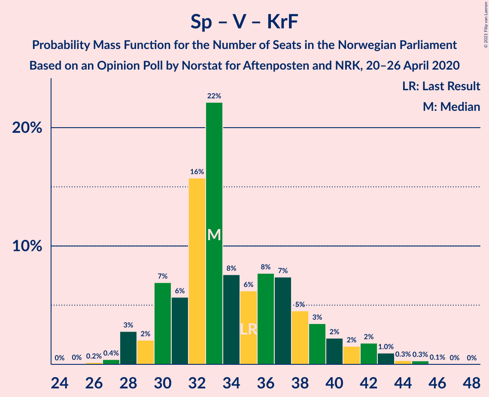

| Number of Seats | Probability | Accumulated | Special Marks |
|:---------------:|:-----------:|:-----------:|:-------------:|
| 25 | 0% | 100% |  |
| 26 | 0.2% | 99.9% |  |
| 27 | 0.4% | 99.8% |  |
| 28 | 3% | 99.4% |  |
| 29 | 2% | 97% |  |
| 30 | 7% | 95% |  |
| 31 | 6% | 88% |  |
| 32 | 16% | 82% |  |
| 33 | 22% | 66% | Median |
| 34 | 8% | 44% |  |
| 35 | 6% | 36% | Last Result |
| 36 | 8% | 30% |  |
| 37 | 7% | 23% |  |
| 38 | 5% | 15% |  |
| 39 | 3% | 11% |  |
| 40 | 2% | 7% |  |
| 41 | 2% | 5% |  |
| 42 | 2% | 3% |  |
| 43 | 1.0% | 2% |  |
| 44 | 0.3% | 0.7% |  |
| 45 | 0.3% | 0.4% |  |
| 46 | 0.1% | 0.1% |  |
| 47 | 0% | 0.1% |  |
| 48 | 0% | 0% |  |

## Technical Information

### Opinion Poll

+ **Polling firm:** Norstat
+ **Commissioner(s):** Aftenposten and NRK
+ **Fieldwork period:** 20–26 April 2020

### Calculations

+ **Sample size:** 955
+ **Simulations done:** 1,048,576
+ **Error estimate:** 1.48%

