# Opinion Poll by Kantar TNS for TV2, 27–29 April 2020

<a href="#voting-intentions">Voting Intentions</a> | <a href="#seats">Seats</a> | <a href="#coalitions">Coalitions</a> | <a href="#technical-information">Technical Information</a>

## Voting Intentions

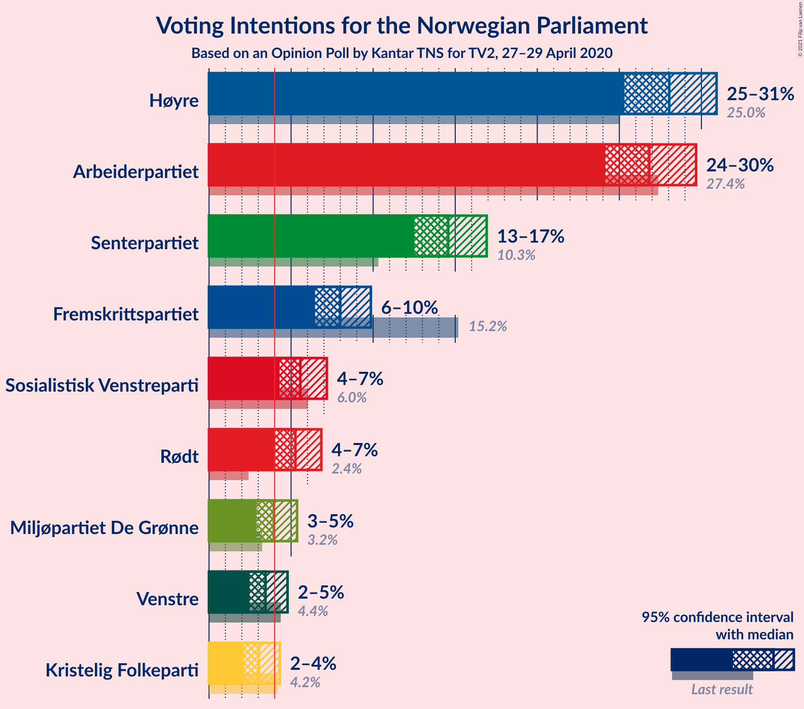

### Confidence Intervals

| Party | Last Result | Poll Result | 80% Confidence Interval | 90% Confidence Interval | 95% Confidence Interval | 99% Confidence Interval |
|:-----:|:-----------:|:-----------:|:-----------------------:|:-----------------------:|:-----------------------:|:-----------------------:|
| Høyre | 25.0% | 28.0% | 26.2–29.9% |25.8–30.5% |25.3–30.9% |24.5–31.8% |
| Arbeiderpartiet | 27.4% | 26.8% | 25.1–28.7% |24.6–29.2% |24.1–29.7% |23.3–30.6% |
| Senterpartiet | 10.3% | 14.6% | 13.2–16.1% |12.8–16.5% |12.5–16.9% |11.9–17.7% |
| Fremskrittspartiet | 15.2% | 8.0% | 7.0–9.2% |6.7–9.6% |6.5–9.9% |6.0–10.5% |
| Sosialistisk Venstreparti | 6.0% | 5.6% | 4.7–6.6% |4.5–6.9% |4.3–7.2% |3.9–7.7% |
| Rødt | 2.4% | 5.3% | 4.5–6.3% |4.2–6.6% |4.0–6.8% |3.7–7.4% |
| Miljøpartiet De Grønne | 3.2% | 3.9% | 3.2–4.9% |3.1–5.1% |2.9–5.4% |2.6–5.8% |
| Venstre | 4.4% | 3.4% | 2.8–4.3% |2.6–4.6% |2.5–4.8% |2.2–5.2% |
| Kristelig Folkeparti | 4.2% | 3.0% | 2.4–3.9% |2.3–4.1% |2.1–4.3% |1.9–4.7% |

*Note:* The poll result column reflects the actual value used in the calculations. Published results may vary slightly, and in addition be rounded to fewer digits.

## Seats

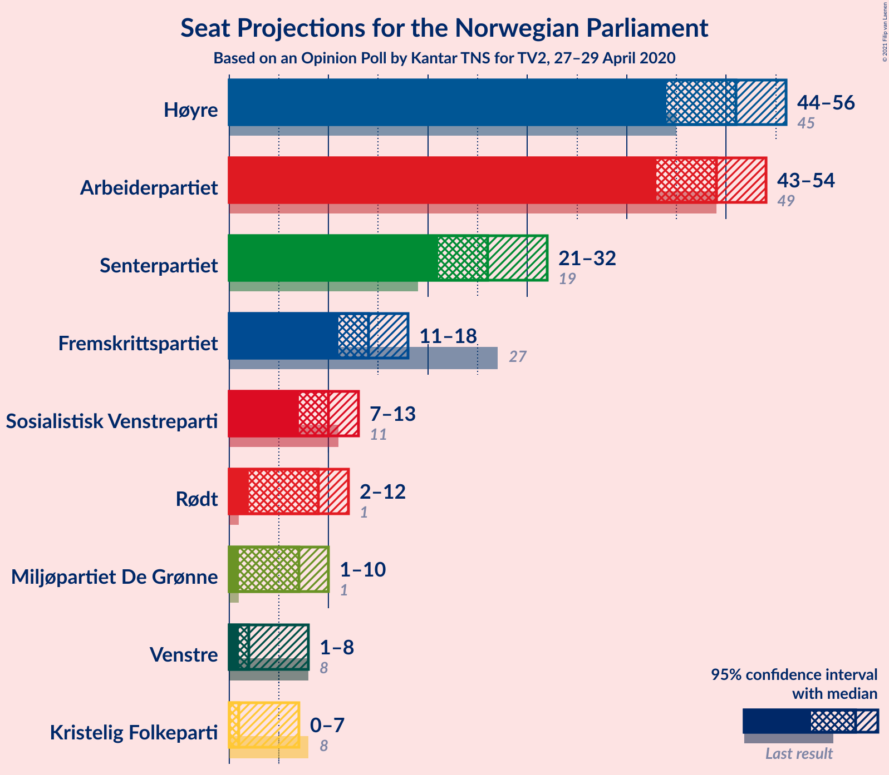

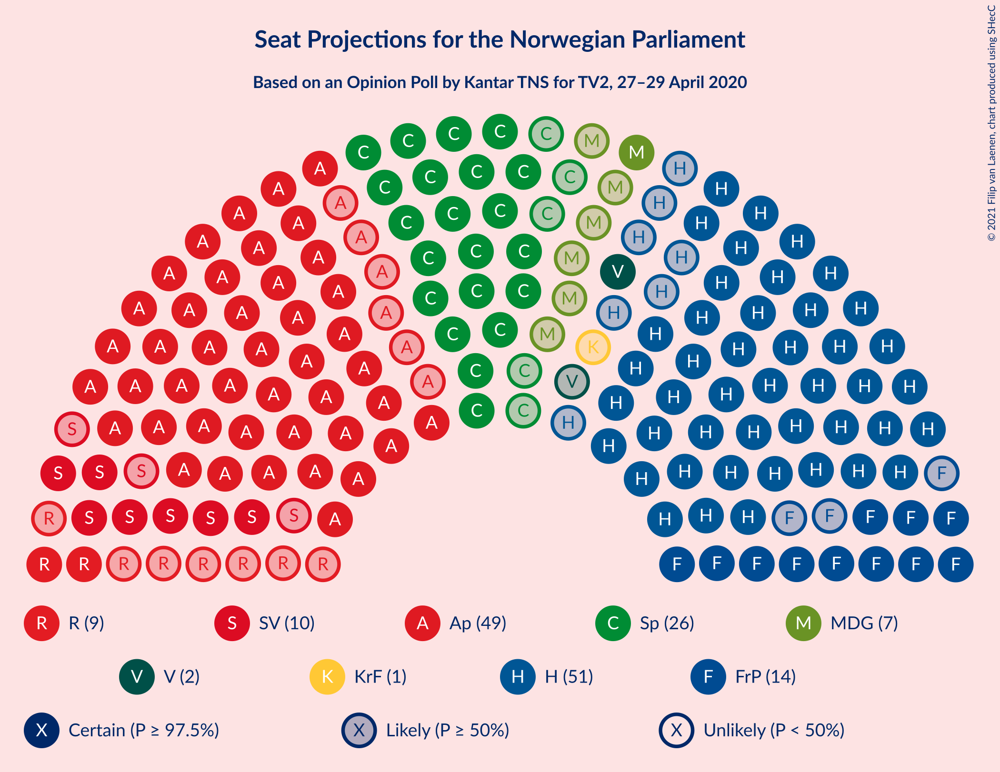

### Confidence Intervals

| Party | Last Result | Median | 80% Confidence Interval | 90% Confidence Interval | 95% Confidence Interval | 99% Confidence Interval |
|:-----:|:-----------:|:------:|:-----------------------:|:-----------------------:|:-----------------------:|:-----------------------:|
| <a href="#høyre">Høyre</a> | 45 | 51 | 47–54 |45–55 |44–56 |42–58 |
| <a href="#arbeiderpartiet">Arbeiderpartiet</a> | 49 | 49 | 45–52 |43–53 |43–54 |41–56 |
| <a href="#senterpartiet">Senterpartiet</a> | 19 | 26 | 23–30 |22–31 |21–32 |20–34 |
| <a href="#fremskrittspartiet">Fremskrittspartiet</a> | 27 | 14 | 12–17 |11–17 |11–18 |10–19 |
| <a href="#sosialistisk-venstreparti">Sosialistisk Venstreparti</a> | 11 | 10 | 8–12 |8–12 |7–13 |2–13 |
| <a href="#rødt">Rødt</a> | 1 | 9 | 7–11 |7–12 |2–12 |2–13 |
| <a href="#miljøpartiet-de-grønne">Miljøpartiet De Grønne</a> | 1 | 7 | 1–9 |1–9 |1–10 |1–10 |
| <a href="#venstre">Venstre</a> | 8 | 2 | 2–7 |2–8 |1–8 |1–9 |
| <a href="#kristelig-folkeparti">Kristelig Folkeparti</a> | 8 | 1 | 1–3 |1–3 |0–7 |0–8 |

### Høyre

*For a full overview of the results for this party, see the [Høyre](party-høyre.html) page.*

| Number of Seats | Probability | Accumulated | Special Marks |
|:---------------:|:-----------:|:-----------:|:-------------:|
| 40 | 0.1% | 100% |  |
| 41 | 0.2% | 99.9% |  |
| 42 | 0.4% | 99.7% |  |
| 43 | 0.9% | 99.3% |  |
| 44 | 2% | 98% |  |
| 45 | 2% | 97% | Last Result |
| 46 | 4% | 94% |  |
| 47 | 9% | 91% |  |
| 48 | 7% | 82% |  |
| 49 | 10% | 75% |  |
| 50 | 13% | 65% |  |
| 51 | 15% | 51% | Median |
| 52 | 9% | 36% |  |
| 53 | 12% | 27% |  |
| 54 | 7% | 15% |  |
| 55 | 3% | 8% |  |
| 56 | 3% | 5% |  |
| 57 | 0.9% | 2% |  |
| 58 | 0.5% | 0.9% |  |
| 59 | 0.3% | 0.4% |  |
| 60 | 0.1% | 0.1% |  |
| 61 | 0% | 0% |  |

### Arbeiderpartiet

*For a full overview of the results for this party, see the [Arbeiderpartiet](party-arbeiderpartiet.html) page.*

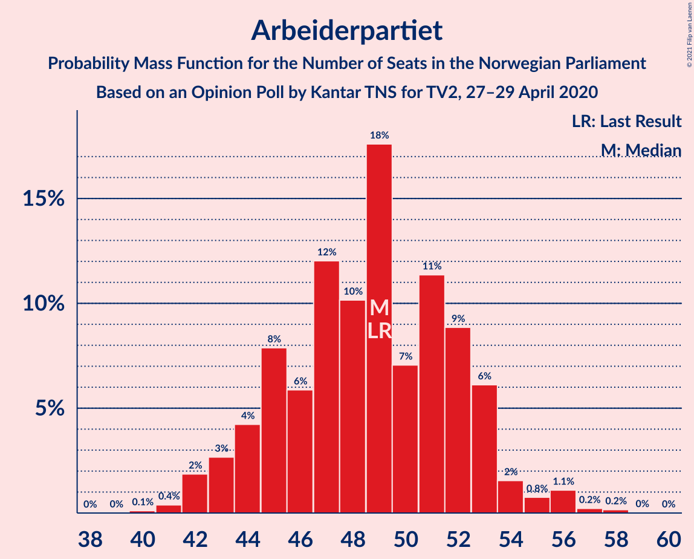

| Number of Seats | Probability | Accumulated | Special Marks |
|:---------------:|:-----------:|:-----------:|:-------------:|
| 40 | 0.1% | 100% |  |
| 41 | 0.4% | 99.9% |  |
| 42 | 2% | 99.5% |  |
| 43 | 3% | 98% |  |
| 44 | 4% | 95% |  |
| 45 | 8% | 91% |  |
| 46 | 6% | 83% |  |
| 47 | 12% | 77% |  |
| 48 | 10% | 65% |  |
| 49 | 18% | 55% | Last Result, Median |
| 50 | 7% | 37% |  |
| 51 | 11% | 30% |  |
| 52 | 9% | 19% |  |
| 53 | 6% | 10% |  |
| 54 | 2% | 4% |  |
| 55 | 0.8% | 2% |  |
| 56 | 1.1% | 2% |  |
| 57 | 0.2% | 0.4% |  |
| 58 | 0.2% | 0.2% |  |
| 59 | 0% | 0% |  |

### Senterpartiet

*For a full overview of the results for this party, see the [Senterpartiet](party-senterpartiet.html) page.*

| Number of Seats | Probability | Accumulated | Special Marks |
|:---------------:|:-----------:|:-----------:|:-------------:|
| 18 | 0.1% | 100% |  |
| 19 | 0.3% | 99.9% | Last Result |
| 20 | 1.0% | 99.6% |  |
| 21 | 2% | 98.6% |  |
| 22 | 5% | 97% |  |
| 23 | 3% | 92% |  |
| 24 | 19% | 88% |  |
| 25 | 10% | 69% |  |
| 26 | 16% | 60% | Median |
| 27 | 17% | 44% |  |
| 28 | 7% | 27% |  |
| 29 | 8% | 20% |  |
| 30 | 6% | 12% |  |
| 31 | 2% | 6% |  |
| 32 | 2% | 4% |  |
| 33 | 1.0% | 2% |  |
| 34 | 0.4% | 0.5% |  |
| 35 | 0.2% | 0.2% |  |
| 36 | 0% | 0% |  |

### Fremskrittspartiet

*For a full overview of the results for this party, see the [Fremskrittspartiet](party-fremskrittspartiet.html) page.*

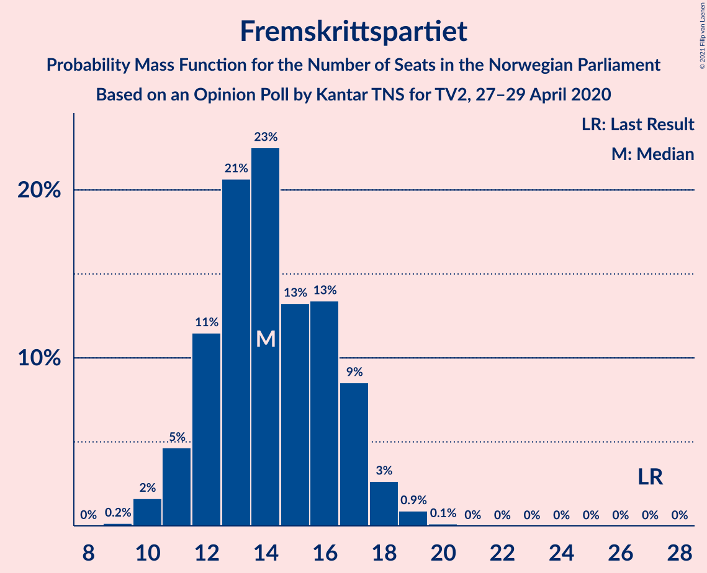

| Number of Seats | Probability | Accumulated | Special Marks |
|:---------------:|:-----------:|:-----------:|:-------------:|
| 9 | 0.2% | 100% |  |
| 10 | 2% | 99.8% |  |
| 11 | 5% | 98% |  |
| 12 | 11% | 94% |  |
| 13 | 21% | 82% |  |
| 14 | 23% | 61% | Median |
| 15 | 13% | 39% |  |
| 16 | 13% | 26% |  |
| 17 | 9% | 12% |  |
| 18 | 3% | 4% |  |
| 19 | 0.9% | 1.0% |  |
| 20 | 0.1% | 0.1% |  |
| 21 | 0% | 0% |  |
| 22 | 0% | 0% |  |
| 23 | 0% | 0% |  |
| 24 | 0% | 0% |  |
| 25 | 0% | 0% |  |
| 26 | 0% | 0% |  |
| 27 | 0% | 0% | Last Result |

### Sosialistisk Venstreparti

*For a full overview of the results for this party, see the [Sosialistisk Venstreparti](party-sosialistiskvenstreparti.html) page.*

| Number of Seats | Probability | Accumulated | Special Marks |
|:---------------:|:-----------:|:-----------:|:-------------:|
| 1 | 0.2% | 100% |  |
| 2 | 0.8% | 99.8% |  |
| 3 | 0% | 98.9% |  |
| 4 | 0% | 98.9% |  |
| 5 | 0% | 98.9% |  |
| 6 | 0% | 98.9% |  |
| 7 | 3% | 98.9% |  |
| 8 | 11% | 96% |  |
| 9 | 25% | 85% |  |
| 10 | 35% | 60% | Median |
| 11 | 13% | 25% | Last Result |
| 12 | 8% | 12% |  |
| 13 | 4% | 4% |  |
| 14 | 0.3% | 0.4% |  |
| 15 | 0.1% | 0.1% |  |
| 16 | 0% | 0% |  |

### Rødt

*For a full overview of the results for this party, see the [Rødt](party-rødt.html) page.*

| Number of Seats | Probability | Accumulated | Special Marks |
|:---------------:|:-----------:|:-----------:|:-------------:|
| 1 | 0% | 100% | Last Result |
| 2 | 3% | 100% |  |
| 3 | 0% | 97% |  |
| 4 | 0% | 97% |  |
| 5 | 0% | 97% |  |
| 6 | 0.1% | 97% |  |
| 7 | 8% | 97% |  |
| 8 | 14% | 89% |  |
| 9 | 30% | 76% | Median |
| 10 | 24% | 46% |  |
| 11 | 13% | 21% |  |
| 12 | 7% | 8% |  |
| 13 | 1.2% | 2% |  |
| 14 | 0.3% | 0.3% |  |
| 15 | 0% | 0% |  |

### Miljøpartiet De Grønne

*For a full overview of the results for this party, see the [Miljøpartiet De Grønne](party-miljøpartietdegrønne.html) page.*

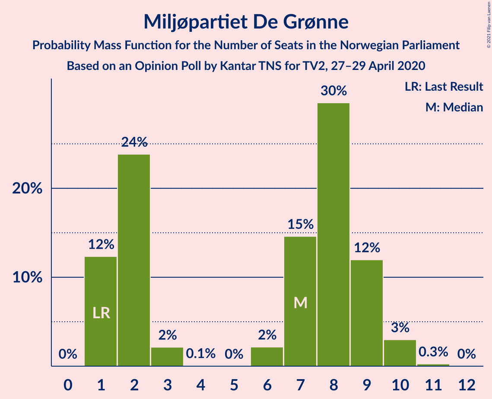

| Number of Seats | Probability | Accumulated | Special Marks |
|:---------------:|:-----------:|:-----------:|:-------------:|
| 1 | 12% | 100% | Last Result |
| 2 | 24% | 88% |  |
| 3 | 2% | 64% |  |
| 4 | 0.1% | 62% |  |
| 5 | 0% | 62% |  |
| 6 | 2% | 62% |  |
| 7 | 15% | 59% | Median |
| 8 | 30% | 45% |  |
| 9 | 12% | 15% |  |
| 10 | 3% | 3% |  |
| 11 | 0.3% | 0.3% |  |
| 12 | 0% | 0% |  |

### Venstre

*For a full overview of the results for this party, see the [Venstre](party-venstre.html) page.*

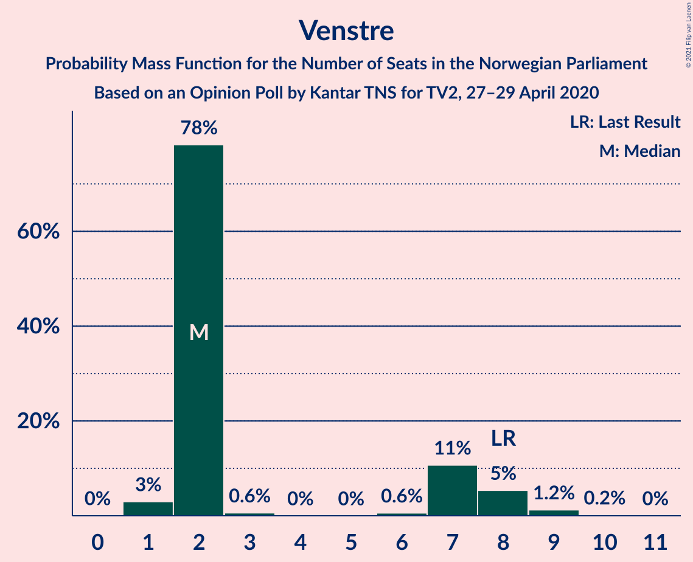

| Number of Seats | Probability | Accumulated | Special Marks |
|:---------------:|:-----------:|:-----------:|:-------------:|
| 1 | 3% | 100% |  |
| 2 | 78% | 97% | Median |
| 3 | 0.6% | 19% |  |
| 4 | 0% | 18% |  |
| 5 | 0% | 18% |  |
| 6 | 0.6% | 18% |  |
| 7 | 11% | 18% |  |
| 8 | 5% | 7% | Last Result |
| 9 | 1.2% | 1.4% |  |
| 10 | 0.2% | 0.2% |  |
| 11 | 0% | 0% |  |

### Kristelig Folkeparti

*For a full overview of the results for this party, see the [Kristelig Folkeparti](party-kristeligfolkeparti.html) page.*

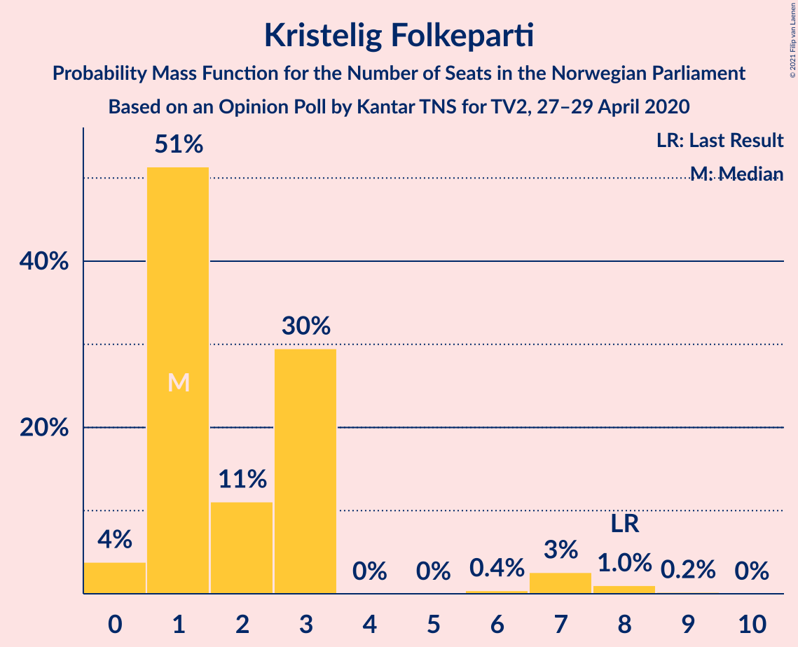

| Number of Seats | Probability | Accumulated | Special Marks |
|:---------------:|:-----------:|:-----------:|:-------------:|
| 0 | 4% | 100% |  |
| 1 | 51% | 96% | Median |
| 2 | 11% | 45% |  |
| 3 | 30% | 34% |  |
| 4 | 0% | 4% |  |
| 5 | 0% | 4% |  |
| 6 | 0.4% | 4% |  |
| 7 | 3% | 4% |  |
| 8 | 1.0% | 1.2% | Last Result |
| 9 | 0.2% | 0.2% |  |
| 10 | 0% | 0% |  |

## Coalitions

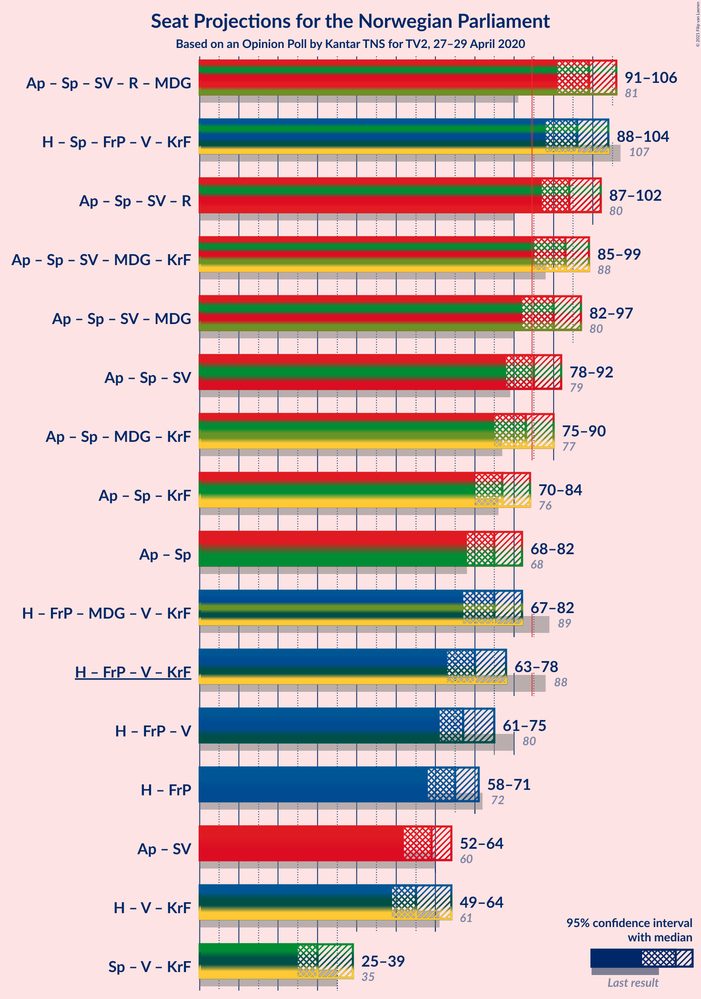

### Confidence Intervals

| Coalition | Last Result | Median | Majority? | 80% Confidence Interval | 90% Confidence Interval | 95% Confidence Interval | 99% Confidence Interval |
|:---------:|:-----------:|:------:|:---------:|:-----------------------:|:-----------------------:|:-----------------------:|:-----------------------:|
| Arbeiderpartiet – Senterpartiet – Sosialistisk Venstreparti – Rødt – Miljøpartiet De Grønne | 81 | 99 | 100% | 95–104 | 93–106 | 91–106 | 89–109 |
| Høyre – Senterpartiet – Fremskrittspartiet – Venstre – Kristelig Folkeparti | 107 | 96 | 99.9% | 90–101 | 89–102 | 88–104 | 86–106 |
| Arbeiderpartiet – Senterpartiet – Sosialistisk Venstreparti – Rødt | 80 | 94 | 99.3% | 89–99 | 87–101 | 87–102 | 84–104 |
| Arbeiderpartiet – Senterpartiet – Sosialistisk Venstreparti – Miljøpartiet De Grønne – Kristelig Folkeparti | 88 | 93 | 98% | 87–96 | 86–97 | 85–99 | 82–102 |
| Arbeiderpartiet – Senterpartiet – Sosialistisk Venstreparti – Miljøpartiet De Grønne | 80 | 90 | 93% | 85–95 | 84–96 | 82–97 | 80–100 |
| Arbeiderpartiet – Senterpartiet – Sosialistisk Venstreparti | 79 | 85 | 52% | 80–89 | 78–91 | 78–92 | 75–94 |
| Arbeiderpartiet – Senterpartiet – Miljøpartiet De Grønne – Kristelig Folkeparti | 77 | 83 | 29% | 77–87 | 75–88 | 75–90 | 73–93 |
| Arbeiderpartiet – Senterpartiet – Kristelig Folkeparti | 76 | 77 | 1.4% | 72–81 | 71–83 | 70–84 | 68–87 |
| Arbeiderpartiet – Senterpartiet | 68 | 75 | 0.3% | 70–79 | 69–81 | 68–82 | 66–84 |
| Høyre – Fremskrittspartiet – Miljøpartiet De Grønne – Venstre – Kristelig Folkeparti | 89 | 75 | 0.7% | 70–80 | 68–82 | 67–82 | 65–85 |
| Høyre – Fremskrittspartiet – Venstre – Kristelig Folkeparti | 88 | 70 | 0% | 65–74 | 63–76 | 63–78 | 60–80 |
| Høyre – Fremskrittspartiet – Venstre | 80 | 67 | 0% | 63–73 | 62–74 | 61–75 | 58–78 |
| Høyre – Fremskrittspartiet | 72 | 65 | 0% | 60–69 | 59–70 | 58–71 | 55–74 |
| Arbeiderpartiet – Sosialistisk Venstreparti | 60 | 59 | 0% | 54–63 | 53–63 | 52–64 | 50–66 |
| Høyre – Venstre – Kristelig Folkeparti | 61 | 55 | 0% | 50–61 | 50–62 | 49–64 | 47–66 |
| Senterpartiet – Venstre – Kristelig Folkeparti | 35 | 30 | 0% | 27–36 | 26–38 | 25–39 | 24–42 |

### Arbeiderpartiet – Senterpartiet – Sosialistisk Venstreparti – Rødt – Miljøpartiet De Grønne

| Number of Seats | Probability | Accumulated | Special Marks |
|:---------------:|:-----------:|:-----------:|:-------------:|
| 81 | 0% | 100% | Last Result |
| 82 | 0% | 100% |  |
| 83 | 0% | 100% |  |
| 84 | 0% | 100% |  |
| 85 | 0% | 100% | Majority |
| 86 | 0% | 100% |  |
| 87 | 0.1% | 99.9% |  |
| 88 | 0.1% | 99.8% |  |
| 89 | 0.2% | 99.7% |  |
| 90 | 0.9% | 99.5% |  |
| 91 | 2% | 98.6% |  |
| 92 | 1.1% | 97% |  |
| 93 | 2% | 96% |  |
| 94 | 3% | 93% |  |
| 95 | 5% | 90% |  |
| 96 | 5% | 85% |  |
| 97 | 11% | 80% |  |
| 98 | 6% | 69% |  |
| 99 | 15% | 63% |  |
| 100 | 8% | 48% |  |
| 101 | 9% | 40% | Median |
| 102 | 8% | 31% |  |
| 103 | 11% | 24% |  |
| 104 | 3% | 13% |  |
| 105 | 3% | 10% |  |
| 106 | 4% | 7% |  |
| 107 | 0.9% | 2% |  |
| 108 | 1.1% | 2% |  |
| 109 | 0.2% | 0.5% |  |
| 110 | 0.1% | 0.3% |  |
| 111 | 0.1% | 0.2% |  |
| 112 | 0% | 0.1% |  |
| 113 | 0% | 0.1% |  |
| 114 | 0% | 0% |  |

### Høyre – Senterpartiet – Fremskrittspartiet – Venstre – Kristelig Folkeparti

| Number of Seats | Probability | Accumulated | Special Marks |
|:---------------:|:-----------:|:-----------:|:-------------:|
| 84 | 0% | 100% |  |
| 85 | 0.3% | 99.9% | Majority |
| 86 | 0.4% | 99.6% |  |
| 87 | 0.8% | 99.2% |  |
| 88 | 1.1% | 98% |  |
| 89 | 5% | 97% |  |
| 90 | 4% | 93% |  |
| 91 | 2% | 88% |  |
| 92 | 7% | 87% |  |
| 93 | 11% | 80% |  |
| 94 | 10% | 69% | Median |
| 95 | 9% | 60% |  |
| 96 | 11% | 50% |  |
| 97 | 6% | 39% |  |
| 98 | 9% | 33% |  |
| 99 | 5% | 25% |  |
| 100 | 5% | 19% |  |
| 101 | 6% | 14% |  |
| 102 | 3% | 8% |  |
| 103 | 2% | 5% |  |
| 104 | 1.0% | 3% |  |
| 105 | 0.6% | 2% |  |
| 106 | 0.6% | 1.0% |  |
| 107 | 0.2% | 0.4% | Last Result |
| 108 | 0.2% | 0.2% |  |
| 109 | 0% | 0.1% |  |
| 110 | 0% | 0% |  |

### Arbeiderpartiet – Senterpartiet – Sosialistisk Venstreparti – Rødt

| Number of Seats | Probability | Accumulated | Special Marks |
|:---------------:|:-----------:|:-----------:|:-------------:|
| 80 | 0% | 100% | Last Result |
| 81 | 0% | 100% |  |
| 82 | 0.2% | 100% |  |
| 83 | 0.1% | 99.8% |  |
| 84 | 0.3% | 99.7% |  |
| 85 | 0.4% | 99.3% | Majority |
| 86 | 0.9% | 98.9% |  |
| 87 | 4% | 98% |  |
| 88 | 3% | 94% |  |
| 89 | 5% | 91% |  |
| 90 | 8% | 85% |  |
| 91 | 8% | 77% |  |
| 92 | 6% | 69% |  |
| 93 | 11% | 63% |  |
| 94 | 8% | 52% | Median |
| 95 | 12% | 44% |  |
| 96 | 6% | 32% |  |
| 97 | 6% | 27% |  |
| 98 | 7% | 21% |  |
| 99 | 5% | 14% |  |
| 100 | 3% | 9% |  |
| 101 | 3% | 6% |  |
| 102 | 1.1% | 3% |  |
| 103 | 1.3% | 2% |  |
| 104 | 0.4% | 0.6% |  |
| 105 | 0.1% | 0.2% |  |
| 106 | 0.1% | 0.1% |  |
| 107 | 0% | 0% |  |

### Arbeiderpartiet – Senterpartiet – Sosialistisk Venstreparti – Miljøpartiet De Grønne – Kristelig Folkeparti

| Number of Seats | Probability | Accumulated | Special Marks |
|:---------------:|:-----------:|:-----------:|:-------------:|
| 79 | 0% | 100% |  |
| 80 | 0.1% | 99.9% |  |
| 81 | 0.1% | 99.8% |  |
| 82 | 0.7% | 99.7% |  |
| 83 | 0.4% | 99.1% |  |
| 84 | 0.7% | 98.6% |  |
| 85 | 2% | 98% | Majority |
| 86 | 5% | 96% |  |
| 87 | 5% | 92% |  |
| 88 | 3% | 87% | Last Result |
| 89 | 5% | 84% |  |
| 90 | 6% | 79% |  |
| 91 | 10% | 73% |  |
| 92 | 10% | 63% |  |
| 93 | 15% | 53% | Median |
| 94 | 19% | 38% |  |
| 95 | 5% | 18% |  |
| 96 | 4% | 14% |  |
| 97 | 5% | 9% |  |
| 98 | 1.2% | 5% |  |
| 99 | 1.1% | 4% |  |
| 100 | 1.3% | 2% |  |
| 101 | 0.3% | 1.1% |  |
| 102 | 0.3% | 0.8% |  |
| 103 | 0.3% | 0.5% |  |
| 104 | 0.1% | 0.2% |  |
| 105 | 0% | 0.1% |  |
| 106 | 0% | 0% |  |

### Arbeiderpartiet – Senterpartiet – Sosialistisk Venstreparti – Miljøpartiet De Grønne

| Number of Seats | Probability | Accumulated | Special Marks |
|:---------------:|:-----------:|:-----------:|:-------------:|
| 77 | 0% | 100% |  |
| 78 | 0.1% | 99.9% |  |
| 79 | 0.2% | 99.9% |  |
| 80 | 0.4% | 99.7% | Last Result |
| 81 | 1.1% | 99.3% |  |
| 82 | 0.7% | 98% |  |
| 83 | 2% | 97% |  |
| 84 | 3% | 96% |  |
| 85 | 4% | 93% | Majority |
| 86 | 6% | 89% |  |
| 87 | 6% | 83% |  |
| 88 | 9% | 76% |  |
| 89 | 7% | 67% |  |
| 90 | 15% | 61% |  |
| 91 | 7% | 46% |  |
| 92 | 8% | 39% | Median |
| 93 | 13% | 31% |  |
| 94 | 5% | 17% |  |
| 95 | 3% | 12% |  |
| 96 | 6% | 9% |  |
| 97 | 1.4% | 3% |  |
| 98 | 0.7% | 2% |  |
| 99 | 0.7% | 1.3% |  |
| 100 | 0.2% | 0.6% |  |
| 101 | 0.2% | 0.4% |  |
| 102 | 0.2% | 0.3% |  |
| 103 | 0.1% | 0.1% |  |
| 104 | 0% | 0% |  |

### Arbeiderpartiet – Senterpartiet – Sosialistisk Venstreparti

| Number of Seats | Probability | Accumulated | Special Marks |
|:---------------:|:-----------:|:-----------:|:-------------:|
| 72 | 0.1% | 100% |  |
| 73 | 0.1% | 99.9% |  |
| 74 | 0.1% | 99.8% |  |
| 75 | 0.3% | 99.7% |  |
| 76 | 0.5% | 99.4% |  |
| 77 | 0.9% | 98.9% |  |
| 78 | 4% | 98% |  |
| 79 | 3% | 94% | Last Result |
| 80 | 3% | 91% |  |
| 81 | 9% | 88% |  |
| 82 | 6% | 79% |  |
| 83 | 9% | 73% |  |
| 84 | 12% | 64% |  |
| 85 | 14% | 52% | Median, Majority |
| 86 | 10% | 39% |  |
| 87 | 6% | 29% |  |
| 88 | 11% | 23% |  |
| 89 | 3% | 12% |  |
| 90 | 3% | 9% |  |
| 91 | 2% | 6% |  |
| 92 | 2% | 4% |  |
| 93 | 1.4% | 2% |  |
| 94 | 0.4% | 0.8% |  |
| 95 | 0.2% | 0.3% |  |
| 96 | 0.1% | 0.1% |  |
| 97 | 0% | 0.1% |  |
| 98 | 0% | 0% |  |

### Arbeiderpartiet – Senterpartiet – Miljøpartiet De Grønne – Kristelig Folkeparti

| Number of Seats | Probability | Accumulated | Special Marks |
|:---------------:|:-----------:|:-----------:|:-------------:|
| 69 | 0% | 100% |  |
| 70 | 0% | 99.9% |  |
| 71 | 0% | 99.9% |  |
| 72 | 0.2% | 99.9% |  |
| 73 | 0.6% | 99.7% |  |
| 74 | 1.2% | 99.1% |  |
| 75 | 3% | 98% |  |
| 76 | 3% | 95% |  |
| 77 | 4% | 92% | Last Result |
| 78 | 3% | 88% |  |
| 79 | 4% | 85% |  |
| 80 | 7% | 80% |  |
| 81 | 10% | 73% |  |
| 82 | 7% | 63% |  |
| 83 | 18% | 56% | Median |
| 84 | 9% | 39% |  |
| 85 | 14% | 29% | Majority |
| 86 | 5% | 15% |  |
| 87 | 5% | 10% |  |
| 88 | 2% | 5% |  |
| 89 | 1.0% | 4% |  |
| 90 | 2% | 3% |  |
| 91 | 0.4% | 1.3% |  |
| 92 | 0.4% | 0.9% |  |
| 93 | 0.2% | 0.5% |  |
| 94 | 0.2% | 0.4% |  |
| 95 | 0.1% | 0.2% |  |
| 96 | 0% | 0% |  |

### Arbeiderpartiet – Senterpartiet – Kristelig Folkeparti

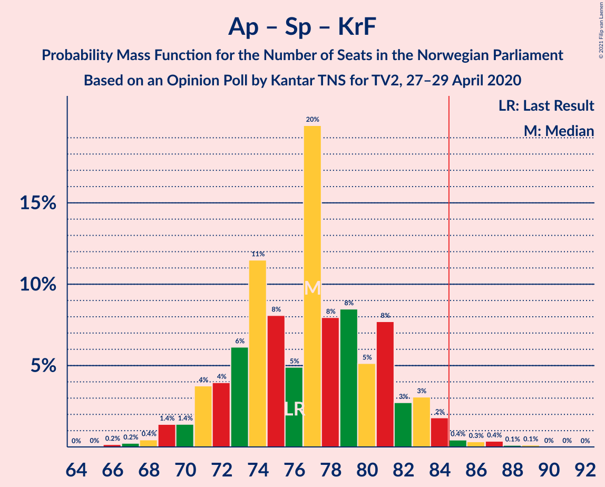

| Number of Seats | Probability | Accumulated | Special Marks |
|:---------------:|:-----------:|:-----------:|:-------------:|
| 66 | 0.2% | 100% |  |
| 67 | 0.2% | 99.8% |  |
| 68 | 0.4% | 99.6% |  |
| 69 | 1.4% | 99.2% |  |
| 70 | 1.4% | 98% |  |
| 71 | 4% | 96% |  |
| 72 | 4% | 93% |  |
| 73 | 6% | 89% |  |
| 74 | 11% | 83% |  |
| 75 | 8% | 71% |  |
| 76 | 5% | 63% | Last Result, Median |
| 77 | 20% | 58% |  |
| 78 | 8% | 38% |  |
| 79 | 8% | 30% |  |
| 80 | 5% | 22% |  |
| 81 | 8% | 17% |  |
| 82 | 3% | 9% |  |
| 83 | 3% | 6% |  |
| 84 | 2% | 3% |  |
| 85 | 0.4% | 1.4% | Majority |
| 86 | 0.3% | 1.0% |  |
| 87 | 0.4% | 0.6% |  |
| 88 | 0.1% | 0.3% |  |
| 89 | 0.1% | 0.2% |  |
| 90 | 0% | 0.1% |  |
| 91 | 0% | 0% |  |

### Arbeiderpartiet – Senterpartiet

| Number of Seats | Probability | Accumulated | Special Marks |
|:---------------:|:-----------:|:-----------:|:-------------:|
| 64 | 0% | 100% |  |
| 65 | 0.2% | 99.9% |  |
| 66 | 0.5% | 99.7% |  |
| 67 | 0.5% | 99.2% |  |
| 68 | 2% | 98.7% | Last Result |
| 69 | 3% | 97% |  |
| 70 | 4% | 94% |  |
| 71 | 8% | 89% |  |
| 72 | 7% | 81% |  |
| 73 | 8% | 74% |  |
| 74 | 9% | 66% |  |
| 75 | 11% | 56% | Median |
| 76 | 16% | 45% |  |
| 77 | 7% | 29% |  |
| 78 | 10% | 22% |  |
| 79 | 3% | 12% |  |
| 80 | 4% | 9% |  |
| 81 | 2% | 6% |  |
| 82 | 1.4% | 4% |  |
| 83 | 1.3% | 2% |  |
| 84 | 0.4% | 0.7% |  |
| 85 | 0.2% | 0.3% | Majority |
| 86 | 0% | 0.1% |  |
| 87 | 0% | 0.1% |  |
| 88 | 0% | 0% |  |

### Høyre – Fremskrittspartiet – Miljøpartiet De Grønne – Venstre – Kristelig Folkeparti

| Number of Seats | Probability | Accumulated | Special Marks |
|:---------------:|:-----------:|:-----------:|:-------------:|
| 63 | 0.1% | 100% |  |
| 64 | 0.1% | 99.9% |  |
| 65 | 0.4% | 99.8% |  |
| 66 | 1.3% | 99.4% |  |
| 67 | 1.1% | 98% |  |
| 68 | 3% | 97% |  |
| 69 | 3% | 94% |  |
| 70 | 5% | 91% |  |
| 71 | 7% | 86% |  |
| 72 | 6% | 79% |  |
| 73 | 6% | 73% |  |
| 74 | 12% | 68% |  |
| 75 | 8% | 56% | Median |
| 76 | 11% | 48% |  |
| 77 | 6% | 37% |  |
| 78 | 8% | 31% |  |
| 79 | 8% | 23% |  |
| 80 | 5% | 15% |  |
| 81 | 3% | 9% |  |
| 82 | 4% | 6% |  |
| 83 | 0.9% | 2% |  |
| 84 | 0.4% | 1.1% |  |
| 85 | 0.3% | 0.7% | Majority |
| 86 | 0.1% | 0.3% |  |
| 87 | 0.2% | 0.2% |  |
| 88 | 0% | 0% |  |
| 89 | 0% | 0% | Last Result |

### Høyre – Fremskrittspartiet – Venstre – Kristelig Folkeparti

| Number of Seats | Probability | Accumulated | Special Marks |
|:---------------:|:-----------:|:-----------:|:-------------:|
| 56 | 0% | 100% |  |
| 57 | 0% | 99.9% |  |
| 58 | 0.1% | 99.9% |  |
| 59 | 0.1% | 99.8% |  |
| 60 | 0.2% | 99.7% |  |
| 61 | 1.1% | 99.5% |  |
| 62 | 0.9% | 98% |  |
| 63 | 4% | 98% |  |
| 64 | 3% | 93% |  |
| 65 | 3% | 90% |  |
| 66 | 11% | 87% |  |
| 67 | 8% | 76% |  |
| 68 | 9% | 69% | Median |
| 69 | 8% | 60% |  |
| 70 | 15% | 52% |  |
| 71 | 6% | 37% |  |
| 72 | 11% | 31% |  |
| 73 | 5% | 20% |  |
| 74 | 5% | 15% |  |
| 75 | 3% | 10% |  |
| 76 | 2% | 7% |  |
| 77 | 1.1% | 4% |  |
| 78 | 2% | 3% |  |
| 79 | 0.9% | 1.4% |  |
| 80 | 0.2% | 0.5% |  |
| 81 | 0.1% | 0.3% |  |
| 82 | 0.1% | 0.2% |  |
| 83 | 0% | 0.1% |  |
| 84 | 0% | 0% |  |
| 85 | 0% | 0% | Majority |
| 86 | 0% | 0% |  |
| 87 | 0% | 0% |  |
| 88 | 0% | 0% | Last Result |

### Høyre – Fremskrittspartiet – Venstre

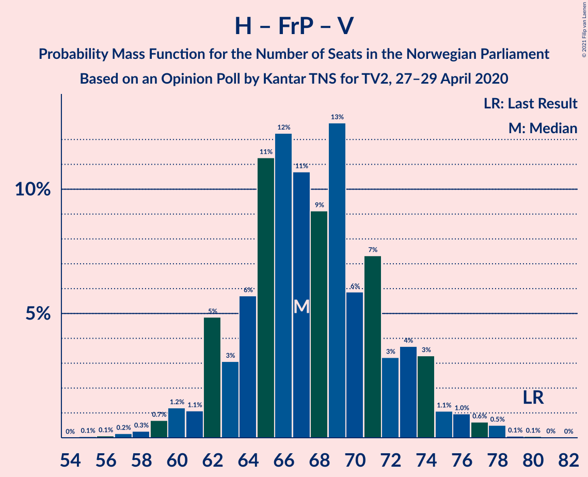

| Number of Seats | Probability | Accumulated | Special Marks |
|:---------------:|:-----------:|:-----------:|:-------------:|
| 55 | 0.1% | 100% |  |
| 56 | 0.1% | 99.9% |  |
| 57 | 0.2% | 99.9% |  |
| 58 | 0.3% | 99.7% |  |
| 59 | 0.7% | 99.4% |  |
| 60 | 1.2% | 98.7% |  |
| 61 | 1.1% | 98% |  |
| 62 | 5% | 96% |  |
| 63 | 3% | 92% |  |
| 64 | 6% | 89% |  |
| 65 | 11% | 83% |  |
| 66 | 12% | 72% |  |
| 67 | 11% | 59% | Median |
| 68 | 9% | 49% |  |
| 69 | 13% | 39% |  |
| 70 | 6% | 27% |  |
| 71 | 7% | 21% |  |
| 72 | 3% | 14% |  |
| 73 | 4% | 10% |  |
| 74 | 3% | 7% |  |
| 75 | 1.1% | 3% |  |
| 76 | 1.0% | 2% |  |
| 77 | 0.6% | 1.3% |  |
| 78 | 0.5% | 0.7% |  |
| 79 | 0.1% | 0.2% |  |
| 80 | 0.1% | 0.1% | Last Result |
| 81 | 0% | 0.1% |  |
| 82 | 0% | 0% |  |

### Høyre – Fremskrittspartiet

| Number of Seats | Probability | Accumulated | Special Marks |
|:---------------:|:-----------:|:-----------:|:-------------:|
| 52 | 0% | 100% |  |
| 53 | 0.1% | 99.9% |  |
| 54 | 0.2% | 99.9% |  |
| 55 | 0.4% | 99.7% |  |
| 56 | 0.7% | 99.3% |  |
| 57 | 0.9% | 98.7% |  |
| 58 | 2% | 98% |  |
| 59 | 2% | 96% |  |
| 60 | 6% | 94% |  |
| 61 | 4% | 88% |  |
| 62 | 8% | 83% |  |
| 63 | 12% | 75% |  |
| 64 | 12% | 63% |  |
| 65 | 12% | 51% | Median |
| 66 | 8% | 39% |  |
| 67 | 12% | 31% |  |
| 68 | 5% | 19% |  |
| 69 | 7% | 14% |  |
| 70 | 3% | 7% |  |
| 71 | 2% | 4% |  |
| 72 | 1.2% | 2% | Last Result |
| 73 | 0.5% | 1.0% |  |
| 74 | 0.4% | 0.5% |  |
| 75 | 0% | 0.2% |  |
| 76 | 0.1% | 0.1% |  |
| 77 | 0% | 0% |  |

### Arbeiderpartiet – Sosialistisk Venstreparti

| Number of Seats | Probability | Accumulated | Special Marks |
|:---------------:|:-----------:|:-----------:|:-------------:|
| 47 | 0% | 100% |  |
| 48 | 0.1% | 99.9% |  |
| 49 | 0.2% | 99.8% |  |
| 50 | 0.5% | 99.6% |  |
| 51 | 0.9% | 99.1% |  |
| 52 | 3% | 98% |  |
| 53 | 3% | 96% |  |
| 54 | 3% | 93% |  |
| 55 | 7% | 89% |  |
| 56 | 8% | 82% |  |
| 57 | 10% | 74% |  |
| 58 | 13% | 64% |  |
| 59 | 14% | 52% | Median |
| 60 | 14% | 38% | Last Result |
| 61 | 7% | 24% |  |
| 62 | 7% | 17% |  |
| 63 | 6% | 10% |  |
| 64 | 2% | 5% |  |
| 65 | 0.8% | 2% |  |
| 66 | 0.9% | 1.4% |  |
| 67 | 0.2% | 0.4% |  |
| 68 | 0.1% | 0.2% |  |
| 69 | 0.1% | 0.1% |  |
| 70 | 0% | 0% |  |

### Høyre – Venstre – Kristelig Folkeparti

| Number of Seats | Probability | Accumulated | Special Marks |
|:---------------:|:-----------:|:-----------:|:-------------:|
| 44 | 0.1% | 100% |  |
| 45 | 0.1% | 99.9% |  |
| 46 | 0.3% | 99.8% |  |
| 47 | 1.2% | 99.5% |  |
| 48 | 0.6% | 98% |  |
| 49 | 1.4% | 98% |  |
| 50 | 7% | 96% |  |
| 51 | 4% | 89% |  |
| 52 | 4% | 85% |  |
| 53 | 9% | 81% |  |
| 54 | 16% | 73% | Median |
| 55 | 14% | 57% |  |
| 56 | 11% | 43% |  |
| 57 | 7% | 32% |  |
| 58 | 8% | 25% |  |
| 59 | 4% | 17% |  |
| 60 | 3% | 13% |  |
| 61 | 3% | 10% | Last Result |
| 62 | 3% | 7% |  |
| 63 | 1.2% | 4% |  |
| 64 | 0.6% | 3% |  |
| 65 | 0.9% | 2% |  |
| 66 | 0.7% | 1.0% |  |
| 67 | 0.2% | 0.4% |  |
| 68 | 0.1% | 0.1% |  |
| 69 | 0% | 0% |  |

### Senterpartiet – Venstre – Kristelig Folkeparti

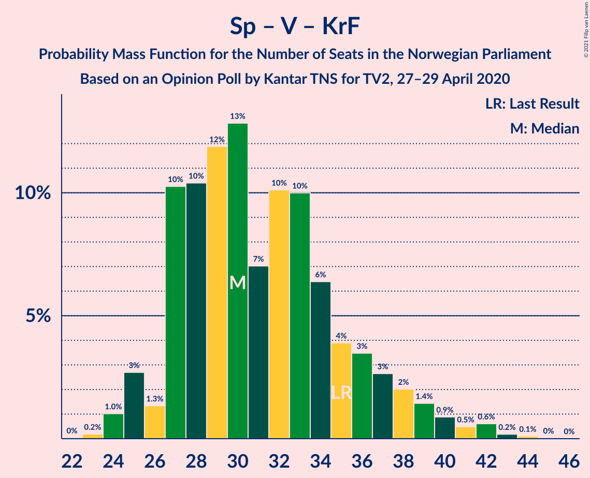

| Number of Seats | Probability | Accumulated | Special Marks |
|:---------------:|:-----------:|:-----------:|:-------------:|
| 23 | 0.2% | 100% |  |
| 24 | 1.0% | 99.8% |  |
| 25 | 3% | 98.7% |  |
| 26 | 1.3% | 96% |  |
| 27 | 10% | 95% |  |
| 28 | 10% | 84% |  |
| 29 | 12% | 74% | Median |
| 30 | 13% | 62% |  |
| 31 | 7% | 49% |  |
| 32 | 10% | 42% |  |
| 33 | 10% | 32% |  |
| 34 | 6% | 22% |  |
| 35 | 4% | 16% | Last Result |
| 36 | 3% | 12% |  |
| 37 | 3% | 8% |  |
| 38 | 2% | 6% |  |
| 39 | 1.4% | 4% |  |
| 40 | 0.9% | 2% |  |
| 41 | 0.5% | 1.4% |  |
| 42 | 0.6% | 0.9% |  |
| 43 | 0.2% | 0.3% |  |
| 44 | 0.1% | 0.2% |  |
| 45 | 0% | 0.1% |  |
| 46 | 0% | 0% |  |

## Technical Information

### Opinion Poll

+ **Polling firm:** Kantar TNS
+ **Commissioner(s):** TV2
+ **Fieldwork period:** 27–29 April 2020

### Calculations

+ **Sample size:** 988
+ **Simulations done:** 1,048,576
+ **Error estimate:** 1.78%

