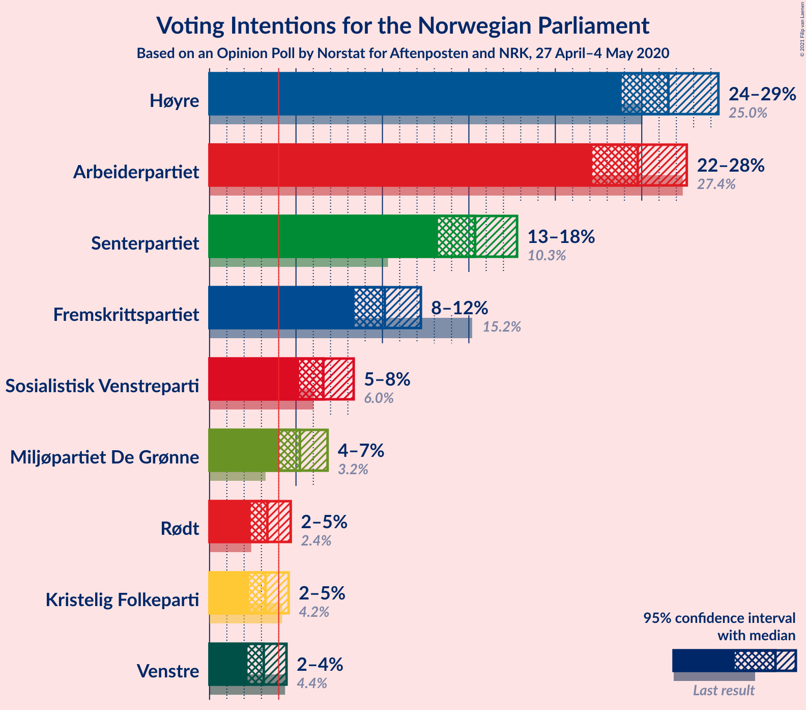
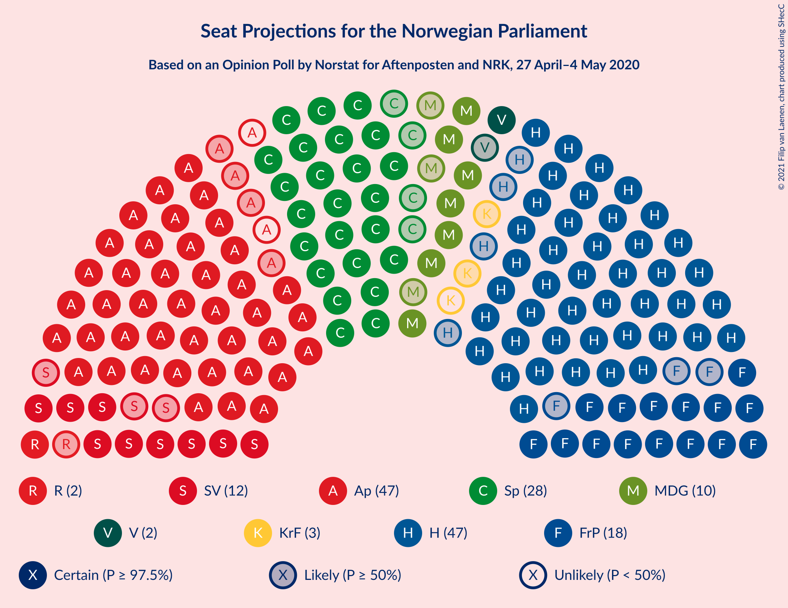
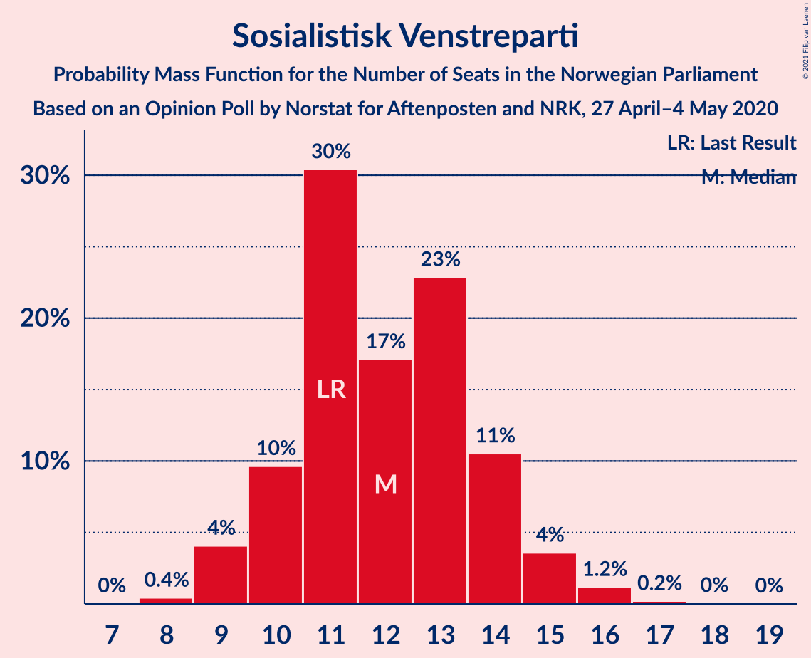
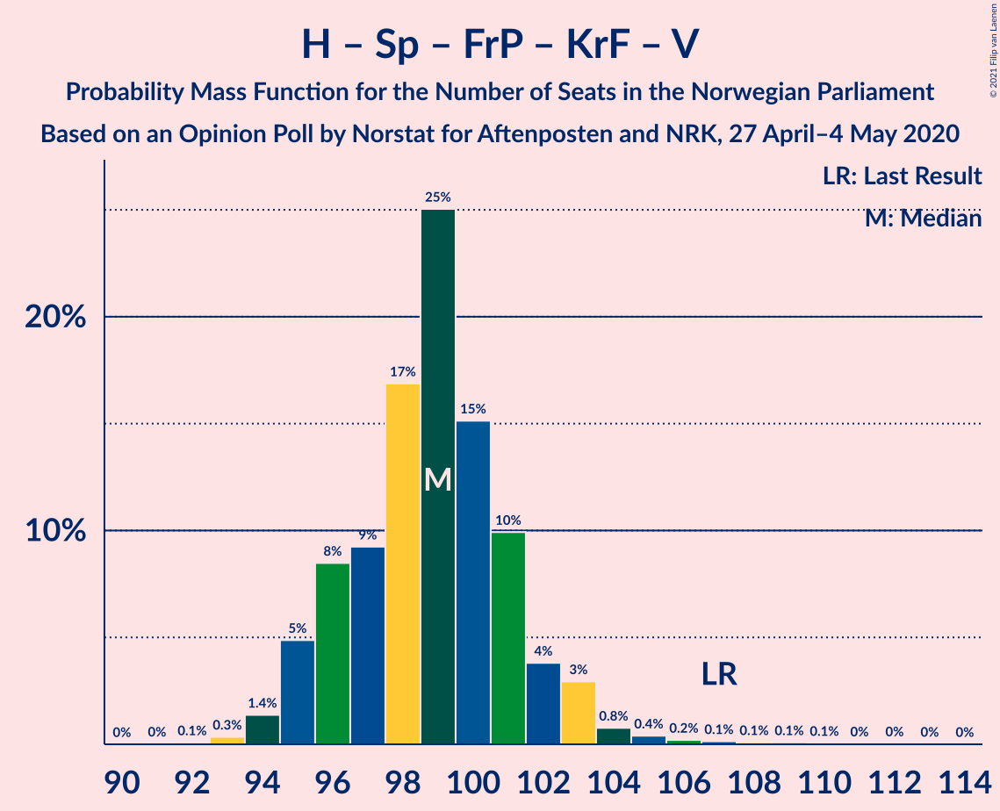
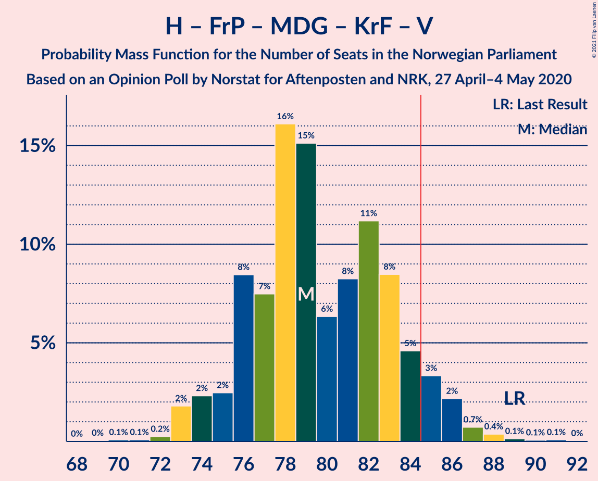
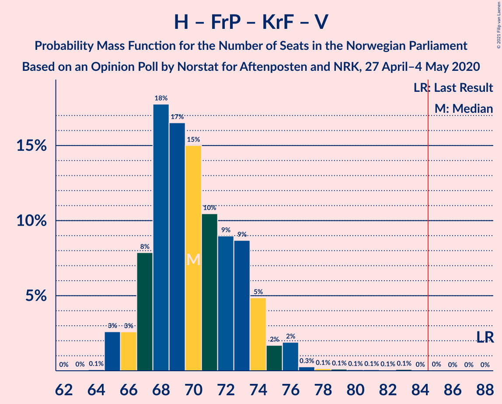
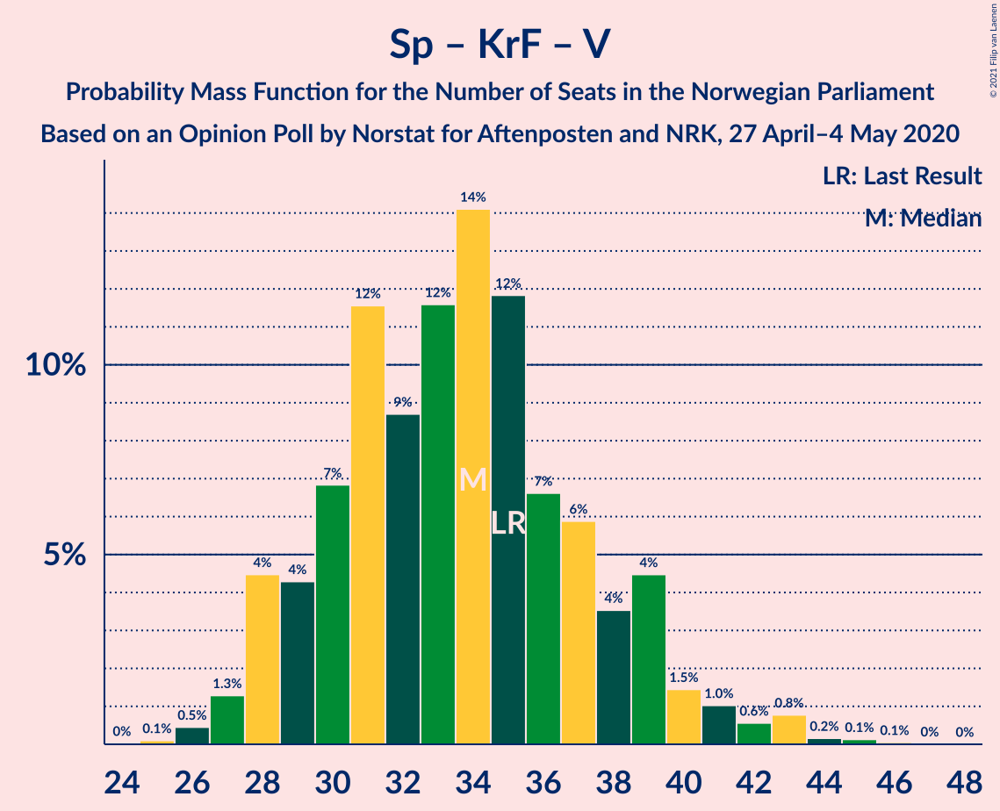

# Opinion Poll by Norstat for Aftenposten and NRK, 27 April–4 May 2020

<a href="#voting-intentions">Voting Intentions</a> | <a href="#seats">Seats</a> | <a href="#coalitions">Coalitions</a> | <a href="#technical-information">Technical Information</a>

## Voting Intentions

### Confidence Intervals

| Party | Last Result | Poll Result | 80% Confidence Interval | 90% Confidence Interval | 95% Confidence Interval | 99% Confidence Interval |
|:-----:|:-----------:|:-----------:|:-----------------------:|:-----------------------:|:-----------------------:|:-----------------------:|
| Høyre | 25.0% | 26.5% | 24.8–28.4% |24.3–29.0% |23.8–29.4% |23.0–30.4% |
| Arbeiderpartiet | 27.4% | 24.8% | 23.0–26.6% |22.5–27.1% |22.1–27.6% |21.3–28.5% |
| Senterpartiet | 10.3% | 15.4% | 13.9–16.9% |13.5–17.4% |13.2–17.8% |12.6–18.6% |
| Fremskrittspartiet | 15.2% | 10.1% | 9.0–11.5% |8.7–11.9% |8.4–12.2% |7.8–12.9% |
| Sosialistisk Venstreparti | 6.0% | 6.6% | 5.7–7.7% |5.4–8.1% |5.2–8.3% |4.8–8.9% |
| Miljøpartiet De Grønne | 3.2% | 5.2% | 4.4–6.3% |4.2–6.6% |4.0–6.8% |3.6–7.4% |
| Rødt | 2.4% | 3.3% | 2.7–4.2% |2.5–4.5% |2.4–4.7% |2.1–5.1% |
| Kristelig Folkeparti | 4.2% | 3.2% | 2.6–4.1% |2.4–4.3% |2.3–4.6% |2.0–5.0% |
| Venstre | 4.4% | 3.1% | 2.5–4.0% |2.3–4.2% |2.2–4.5% |1.9–4.9% |

*Note:* The poll result column reflects the actual value used in the calculations. Published results may vary slightly, and in addition be rounded to fewer digits.

## Seats

### Confidence Intervals

| Party | Last Result | Median | 80% Confidence Interval | 90% Confidence Interval | 95% Confidence Interval | 99% Confidence Interval |
|:-----:|:-----------:|:------:|:-----------------------:|:-----------------------:|:-----------------------:|:-----------------------:|
| <a href="#høyre">Høyre</a> | 45 | 47 | 44–51 |43–52 |43–52 |41–54 |
| <a href="#arbeiderpartiet">Arbeiderpartiet</a> | 49 | 45 | 42–49 |42–50 |41–50 |40–52 |
| <a href="#senterpartiet">Senterpartiet</a> | 19 | 28 | 25–33 |24–34 |24–34 |23–35 |
| <a href="#fremskrittspartiet">Fremskrittspartiet</a> | 27 | 18 | 16–20 |15–21 |15–21 |14–23 |
| <a href="#sosialistisk-venstreparti">Sosialistisk Venstreparti</a> | 11 | 12 | 10–14 |10–14 |9–15 |9–16 |
| <a href="#miljøpartiet-de-grønne">Miljøpartiet De Grønne</a> | 1 | 10 | 8–12 |8–12 |7–12 |2–13 |
| <a href="#rødt">Rødt</a> | 1 | 2 | 2–7 |1–8 |1–8 |1–9 |
| <a href="#kristelig-folkeparti">Kristelig Folkeparti</a> | 8 | 2 | 1–3 |1–7 |0–7 |0–8 |
| <a href="#venstre">Venstre</a> | 8 | 2 | 2–3 |2–7 |1–8 |1–8 |

### Høyre

*For a full overview of the results for this party, see the [Høyre](party-høyre.html) page.*

| Number of Seats | Probability | Accumulated | Special Marks |
|:---------------:|:-----------:|:-----------:|:-------------:|
| 39 | 0.1% | 100% |  |
| 40 | 0.2% | 99.9% |  |
| 41 | 0.5% | 99.7% |  |
| 42 | 2% | 99.2% |  |
| 43 | 5% | 98% |  |
| 44 | 6% | 93% |  |
| 45 | 10% | 87% | Last Result |
| 46 | 21% | 77% |  |
| 47 | 17% | 56% | Median |
| 48 | 12% | 39% |  |
| 49 | 9% | 28% |  |
| 50 | 5% | 19% |  |
| 51 | 8% | 13% |  |
| 52 | 3% | 5% |  |
| 53 | 1.2% | 2% |  |
| 54 | 0.7% | 1.0% |  |
| 55 | 0.1% | 0.3% |  |
| 56 | 0.1% | 0.1% |  |
| 57 | 0% | 0% |  |

### Arbeiderpartiet

*For a full overview of the results for this party, see the [Arbeiderpartiet](party-arbeiderpartiet.html) page.*

| Number of Seats | Probability | Accumulated | Special Marks |
|:---------------:|:-----------:|:-----------:|:-------------:|
| 38 | 0.1% | 100% |  |
| 39 | 0.3% | 99.9% |  |
| 40 | 0.7% | 99.5% |  |
| 41 | 3% | 98.9% |  |
| 42 | 6% | 96% |  |
| 43 | 10% | 90% |  |
| 44 | 14% | 80% |  |
| 45 | 18% | 67% | Median |
| 46 | 10% | 49% |  |
| 47 | 21% | 39% |  |
| 48 | 7% | 18% |  |
| 49 | 4% | 11% | Last Result |
| 50 | 5% | 7% |  |
| 51 | 0.7% | 2% |  |
| 52 | 0.4% | 0.8% |  |
| 53 | 0.4% | 0.4% |  |
| 54 | 0% | 0.1% |  |
| 55 | 0% | 0% |  |

### Senterpartiet

*For a full overview of the results for this party, see the [Senterpartiet](party-senterpartiet.html) page.*

| Number of Seats | Probability | Accumulated | Special Marks |
|:---------------:|:-----------:|:-----------:|:-------------:|
| 19 | 0% | 100% | Last Result |
| 20 | 0% | 100% |  |
| 21 | 0.2% | 100% |  |
| 22 | 0.3% | 99.8% |  |
| 23 | 1.2% | 99.5% |  |
| 24 | 4% | 98% |  |
| 25 | 7% | 95% |  |
| 26 | 13% | 88% |  |
| 27 | 9% | 75% |  |
| 28 | 17% | 66% | Median |
| 29 | 7% | 49% |  |
| 30 | 12% | 42% |  |
| 31 | 14% | 30% |  |
| 32 | 6% | 16% |  |
| 33 | 3% | 10% |  |
| 34 | 5% | 7% |  |
| 35 | 1.4% | 2% |  |
| 36 | 0.1% | 0.1% |  |
| 37 | 0% | 0% |  |

### Fremskrittspartiet

*For a full overview of the results for this party, see the [Fremskrittspartiet](party-fremskrittspartiet.html) page.*

| Number of Seats | Probability | Accumulated | Special Marks |
|:---------------:|:-----------:|:-----------:|:-------------:|
| 12 | 0.1% | 100% |  |
| 13 | 0.3% | 99.9% |  |
| 14 | 1.1% | 99.6% |  |
| 15 | 5% | 98.5% |  |
| 16 | 12% | 94% |  |
| 17 | 16% | 82% |  |
| 18 | 28% | 66% | Median |
| 19 | 19% | 38% |  |
| 20 | 14% | 20% |  |
| 21 | 4% | 6% |  |
| 22 | 0.9% | 2% |  |
| 23 | 0.6% | 0.7% |  |
| 24 | 0.1% | 0.1% |  |
| 25 | 0% | 0% |  |
| 26 | 0% | 0% |  |
| 27 | 0% | 0% | Last Result |

### Sosialistisk Venstreparti

*For a full overview of the results for this party, see the [Sosialistisk Venstreparti](party-sosialistiskvenstreparti.html) page.*

| Number of Seats | Probability | Accumulated | Special Marks |
|:---------------:|:-----------:|:-----------:|:-------------:|
| 8 | 0.4% | 100% |  |
| 9 | 4% | 99.6% |  |
| 10 | 10% | 95% |  |
| 11 | 30% | 86% | Last Result |
| 12 | 17% | 55% | Median |
| 13 | 23% | 38% |  |
| 14 | 11% | 16% |  |
| 15 | 4% | 5% |  |
| 16 | 1.2% | 1.4% |  |
| 17 | 0.2% | 0.2% |  |
| 18 | 0% | 0.1% |  |
| 19 | 0% | 0% |  |

### Miljøpartiet De Grønne

*For a full overview of the results for this party, see the [Miljøpartiet De Grønne](party-miljøpartietdegrønne.html) page.*

| Number of Seats | Probability | Accumulated | Special Marks |
|:---------------:|:-----------:|:-----------:|:-------------:|
| 1 | 0% | 100% | Last Result |
| 2 | 1.0% | 100% |  |
| 3 | 0.7% | 99.0% |  |
| 4 | 0.1% | 98% |  |
| 5 | 0% | 98% |  |
| 6 | 0% | 98% |  |
| 7 | 0.7% | 98% |  |
| 8 | 13% | 97% |  |
| 9 | 28% | 85% |  |
| 10 | 32% | 56% | Median |
| 11 | 14% | 24% |  |
| 12 | 9% | 10% |  |
| 13 | 1.5% | 2% |  |
| 14 | 0.2% | 0.2% |  |
| 15 | 0% | 0% |  |

### Rødt

*For a full overview of the results for this party, see the [Rødt](party-rødt.html) page.*

| Number of Seats | Probability | Accumulated | Special Marks |
|:---------------:|:-----------:|:-----------:|:-------------:|
| 1 | 9% | 100% | Last Result |
| 2 | 71% | 91% | Median |
| 3 | 0% | 19% |  |
| 4 | 0% | 19% |  |
| 5 | 0% | 19% |  |
| 6 | 0% | 19% |  |
| 7 | 9% | 19% |  |
| 8 | 8% | 10% |  |
| 9 | 2% | 2% |  |
| 10 | 0.2% | 0.2% |  |
| 11 | 0% | 0% |  |

### Kristelig Folkeparti

*For a full overview of the results for this party, see the [Kristelig Folkeparti](party-kristeligfolkeparti.html) page.*

| Number of Seats | Probability | Accumulated | Special Marks |
|:---------------:|:-----------:|:-----------:|:-------------:|
| 0 | 5% | 100% |  |
| 1 | 42% | 95% |  |
| 2 | 9% | 53% | Median |
| 3 | 36% | 43% |  |
| 4 | 0% | 8% |  |
| 5 | 0% | 8% |  |
| 6 | 0.1% | 8% |  |
| 7 | 6% | 8% |  |
| 8 | 2% | 2% | Last Result |
| 9 | 0.2% | 0.2% |  |
| 10 | 0% | 0% |  |

### Venstre

*For a full overview of the results for this party, see the [Venstre](party-venstre.html) page.*

| Number of Seats | Probability | Accumulated | Special Marks |
|:---------------:|:-----------:|:-----------:|:-------------:|
| 0 | 0.2% | 100% |  |
| 1 | 4% | 99.8% |  |
| 2 | 81% | 95% | Median |
| 3 | 5% | 15% |  |
| 4 | 0% | 10% |  |
| 5 | 0% | 10% |  |
| 6 | 0% | 10% |  |
| 7 | 5% | 10% |  |
| 8 | 4% | 4% | Last Result |
| 9 | 0.3% | 0.4% |  |
| 10 | 0.1% | 0.1% |  |
| 11 | 0% | 0% |  |

## Coalitions

### Confidence Intervals

| Coalition | Last Result | Median | Majority? | 80% Confidence Interval | 90% Confidence Interval | 95% Confidence Interval | 99% Confidence Interval |
|:---------:|:-----------:|:------:|:---------:|:-----------------------:|:-----------------------:|:-----------------------:|:-----------------------:|
| Arbeiderpartiet – Senterpartiet – Sosialistisk Venstreparti – Miljøpartiet De Grønne – Rødt | 81 | 99 | 100% | 96–102 | 95–103 | 93–104 | 91–104 |
| Arbeiderpartiet – Senterpartiet – Sosialistisk Venstreparti – Miljøpartiet De Grønne – Kristelig Folkeparti | 88 | 99 | 100% | 94–102 | 91–103 | 90–104 | 89–106 |
| Høyre – Senterpartiet – Fremskrittspartiet – Kristelig Folkeparti – Venstre | 107 | 99 | 100% | 96–101 | 95–102 | 95–103 | 94–106 |
| Arbeiderpartiet – Senterpartiet – Sosialistisk Venstreparti – Miljøpartiet De Grønne | 80 | 97 | 99.8% | 91–99 | 90–100 | 89–101 | 86–102 |
| Arbeiderpartiet – Senterpartiet – Sosialistisk Venstreparti – Rødt | 80 | 90 | 93% | 85–93 | 84–94 | 83–95 | 81–96 |
| Arbeiderpartiet – Senterpartiet – Miljøpartiet De Grønne – Kristelig Folkeparti | 77 | 87 | 71% | 82–90 | 80–92 | 79–92 | 78–94 |
| Arbeiderpartiet – Senterpartiet – Sosialistisk Venstreparti | 79 | 87 | 71% | 82–91 | 80–91 | 79–92 | 77–94 |
| Høyre – Fremskrittspartiet – Miljøpartiet De Grønne – Kristelig Folkeparti – Venstre | 89 | 79 | 7% | 76–84 | 75–85 | 74–86 | 73–88 |
| Arbeiderpartiet – Senterpartiet – Kristelig Folkeparti | 76 | 77 | 0.6% | 72–81 | 70–82 | 69–83 | 68–85 |
| Arbeiderpartiet – Senterpartiet | 68 | 75 | 0% | 70–79 | 68–80 | 68–80 | 66–82 |
| Høyre – Fremskrittspartiet – Kristelig Folkeparti – Venstre | 88 | 70 | 0% | 67–73 | 66–74 | 65–76 | 65–78 |
| Arbeiderpartiet – Sosialistisk Venstreparti – Miljøpartiet De Grønne – Rødt | 62 | 70 | 0% | 68–73 | 67–74 | 66–74 | 63–75 |
| Høyre – Fremskrittspartiet – Venstre | 80 | 67 | 0% | 65–72 | 63–72 | 63–73 | 60–75 |
| Høyre – Fremskrittspartiet | 72 | 65 | 0% | 62–69 | 61–70 | 61–71 | 58–72 |
| Arbeiderpartiet – Sosialistisk Venstreparti | 60 | 58 | 0% | 54–61 | 53–63 | 52–63 | 51–65 |
| Høyre – Kristelig Folkeparti – Venstre | 61 | 51 | 0% | 49–56 | 48–58 | 47–59 | 46–61 |
| Senterpartiet – Kristelig Folkeparti – Venstre | 35 | 34 | 0% | 29–38 | 28–39 | 28–41 | 26–43 |

### Arbeiderpartiet – Senterpartiet – Sosialistisk Venstreparti – Miljøpartiet De Grønne – Rødt

| Number of Seats | Probability | Accumulated | Special Marks |
|:---------------:|:-----------:|:-----------:|:-------------:|
| 81 | 0% | 100% | Last Result |
| 82 | 0% | 100% |  |
| 83 | 0% | 100% |  |
| 84 | 0% | 100% |  |
| 85 | 0% | 100% | Majority |
| 86 | 0.1% | 99.9% |  |
| 87 | 0.1% | 99.8% |  |
| 88 | 0.1% | 99.8% |  |
| 89 | 0.1% | 99.7% |  |
| 90 | 0.1% | 99.6% |  |
| 91 | 0.1% | 99.5% |  |
| 92 | 0.3% | 99.4% |  |
| 93 | 2% | 99.1% |  |
| 94 | 2% | 97% |  |
| 95 | 5% | 96% |  |
| 96 | 9% | 91% |  |
| 97 | 9% | 82% | Median |
| 98 | 10% | 73% |  |
| 99 | 15% | 63% |  |
| 100 | 17% | 48% |  |
| 101 | 18% | 31% |  |
| 102 | 8% | 13% |  |
| 103 | 3% | 5% |  |
| 104 | 3% | 3% |  |
| 105 | 0.1% | 0.2% |  |
| 106 | 0% | 0.1% |  |
| 107 | 0% | 0% |  |

### Arbeiderpartiet – Senterpartiet – Sosialistisk Venstreparti – Miljøpartiet De Grønne – Kristelig Folkeparti

| Number of Seats | Probability | Accumulated | Special Marks |
|:---------------:|:-----------:|:-----------:|:-------------:|
| 86 | 0.1% | 100% |  |
| 87 | 0.1% | 99.9% |  |
| 88 | 0.1% | 99.8% | Last Result |
| 89 | 0.2% | 99.7% |  |
| 90 | 3% | 99.4% |  |
| 91 | 2% | 97% |  |
| 92 | 2% | 95% |  |
| 93 | 2% | 93% |  |
| 94 | 3% | 91% |  |
| 95 | 6% | 87% |  |
| 96 | 8% | 81% |  |
| 97 | 13% | 73% | Median |
| 98 | 7% | 60% |  |
| 99 | 8% | 53% |  |
| 100 | 19% | 45% |  |
| 101 | 13% | 26% |  |
| 102 | 6% | 13% |  |
| 103 | 4% | 7% |  |
| 104 | 2% | 3% |  |
| 105 | 0.4% | 1.0% |  |
| 106 | 0.4% | 0.6% |  |
| 107 | 0.1% | 0.3% |  |
| 108 | 0.1% | 0.2% |  |
| 109 | 0% | 0% |  |

### Høyre – Senterpartiet – Fremskrittspartiet – Kristelig Folkeparti – Venstre

| Number of Seats | Probability | Accumulated | Special Marks |
|:---------------:|:-----------:|:-----------:|:-------------:|
| 92 | 0.1% | 100% |  |
| 93 | 0.3% | 99.9% |  |
| 94 | 1.4% | 99.5% |  |
| 95 | 5% | 98% |  |
| 96 | 8% | 93% |  |
| 97 | 9% | 85% | Median |
| 98 | 17% | 76% |  |
| 99 | 25% | 59% |  |
| 100 | 15% | 34% |  |
| 101 | 10% | 19% |  |
| 102 | 4% | 9% |  |
| 103 | 3% | 5% |  |
| 104 | 0.8% | 2% |  |
| 105 | 0.4% | 1.1% |  |
| 106 | 0.2% | 0.7% |  |
| 107 | 0.1% | 0.5% | Last Result |
| 108 | 0.1% | 0.3% |  |
| 109 | 0.1% | 0.2% |  |
| 110 | 0.1% | 0.1% |  |
| 111 | 0% | 0.1% |  |
| 112 | 0% | 0.1% |  |
| 113 | 0% | 0% |  |

### Arbeiderpartiet – Senterpartiet – Sosialistisk Venstreparti – Miljøpartiet De Grønne

| Number of Seats | Probability | Accumulated | Special Marks |
|:---------------:|:-----------:|:-----------:|:-------------:|
| 80 | 0% | 100% | Last Result |
| 81 | 0% | 100% |  |
| 82 | 0% | 100% |  |
| 83 | 0% | 100% |  |
| 84 | 0.1% | 99.9% |  |
| 85 | 0.2% | 99.8% | Majority |
| 86 | 0.2% | 99.7% |  |
| 87 | 0.2% | 99.5% |  |
| 88 | 0.6% | 99.2% |  |
| 89 | 4% | 98.6% |  |
| 90 | 2% | 95% |  |
| 91 | 4% | 93% |  |
| 92 | 4% | 89% |  |
| 93 | 6% | 85% |  |
| 94 | 9% | 79% |  |
| 95 | 9% | 70% | Median |
| 96 | 10% | 61% |  |
| 97 | 11% | 51% |  |
| 98 | 16% | 40% |  |
| 99 | 15% | 24% |  |
| 100 | 6% | 9% |  |
| 101 | 2% | 3% |  |
| 102 | 2% | 2% |  |
| 103 | 0.3% | 0.3% |  |
| 104 | 0% | 0% |  |

### Arbeiderpartiet – Senterpartiet – Sosialistisk Venstreparti – Rødt

| Number of Seats | Probability | Accumulated | Special Marks |
|:---------------:|:-----------:|:-----------:|:-------------:|
| 78 | 0.1% | 100% |  |
| 79 | 0.1% | 99.9% |  |
| 80 | 0.1% | 99.8% | Last Result |
| 81 | 0.4% | 99.7% |  |
| 82 | 0.7% | 99.3% |  |
| 83 | 2% | 98.6% |  |
| 84 | 3% | 96% |  |
| 85 | 5% | 93% | Majority |
| 86 | 8% | 88% |  |
| 87 | 11% | 80% | Median |
| 88 | 8% | 69% |  |
| 89 | 6% | 61% |  |
| 90 | 15% | 54% |  |
| 91 | 16% | 39% |  |
| 92 | 7% | 23% |  |
| 93 | 8% | 16% |  |
| 94 | 2% | 7% |  |
| 95 | 2% | 5% |  |
| 96 | 2% | 2% |  |
| 97 | 0.2% | 0.5% |  |
| 98 | 0.1% | 0.2% |  |
| 99 | 0.1% | 0.1% |  |
| 100 | 0% | 0.1% |  |
| 101 | 0% | 0% |  |

### Arbeiderpartiet – Senterpartiet – Miljøpartiet De Grønne – Kristelig Folkeparti

| Number of Seats | Probability | Accumulated | Special Marks |
|:---------------:|:-----------:|:-----------:|:-------------:|
| 75 | 0% | 100% |  |
| 76 | 0.2% | 99.9% |  |
| 77 | 0.2% | 99.7% | Last Result |
| 78 | 0.9% | 99.5% |  |
| 79 | 3% | 98.6% |  |
| 80 | 2% | 95% |  |
| 81 | 2% | 93% |  |
| 82 | 6% | 91% |  |
| 83 | 6% | 86% |  |
| 84 | 9% | 80% |  |
| 85 | 10% | 71% | Median, Majority |
| 86 | 7% | 61% |  |
| 87 | 15% | 54% |  |
| 88 | 10% | 39% |  |
| 89 | 14% | 29% |  |
| 90 | 6% | 15% |  |
| 91 | 3% | 9% |  |
| 92 | 4% | 5% |  |
| 93 | 0.4% | 1.1% |  |
| 94 | 0.3% | 0.7% |  |
| 95 | 0.2% | 0.4% |  |
| 96 | 0.1% | 0.2% |  |
| 97 | 0% | 0.1% |  |
| 98 | 0% | 0% |  |

### Arbeiderpartiet – Senterpartiet – Sosialistisk Venstreparti

| Number of Seats | Probability | Accumulated | Special Marks |
|:---------------:|:-----------:|:-----------:|:-------------:|
| 75 | 0.1% | 100% |  |
| 76 | 0.2% | 99.9% |  |
| 77 | 0.3% | 99.7% |  |
| 78 | 0.3% | 99.4% |  |
| 79 | 3% | 99.1% | Last Result |
| 80 | 2% | 96% |  |
| 81 | 3% | 94% |  |
| 82 | 5% | 91% |  |
| 83 | 7% | 86% |  |
| 84 | 8% | 79% |  |
| 85 | 12% | 71% | Median, Majority |
| 86 | 9% | 60% |  |
| 87 | 5% | 50% |  |
| 88 | 16% | 45% |  |
| 89 | 14% | 29% |  |
| 90 | 5% | 15% |  |
| 91 | 7% | 10% |  |
| 92 | 2% | 4% |  |
| 93 | 1.1% | 2% |  |
| 94 | 0.5% | 0.8% |  |
| 95 | 0.2% | 0.3% |  |
| 96 | 0% | 0.1% |  |
| 97 | 0% | 0.1% |  |
| 98 | 0.1% | 0.1% |  |
| 99 | 0% | 0% |  |

### Høyre – Fremskrittspartiet – Miljøpartiet De Grønne – Kristelig Folkeparti – Venstre

| Number of Seats | Probability | Accumulated | Special Marks |
|:---------------:|:-----------:|:-----------:|:-------------:|
| 69 | 0% | 100% |  |
| 70 | 0.1% | 99.9% |  |
| 71 | 0.1% | 99.9% |  |
| 72 | 0.2% | 99.8% |  |
| 73 | 2% | 99.5% |  |
| 74 | 2% | 98% |  |
| 75 | 2% | 95% |  |
| 76 | 8% | 93% |  |
| 77 | 7% | 84% |  |
| 78 | 16% | 77% |  |
| 79 | 15% | 61% | Median |
| 80 | 6% | 46% |  |
| 81 | 8% | 39% |  |
| 82 | 11% | 31% |  |
| 83 | 8% | 20% |  |
| 84 | 5% | 12% |  |
| 85 | 3% | 7% | Majority |
| 86 | 2% | 4% |  |
| 87 | 0.7% | 1.4% |  |
| 88 | 0.4% | 0.7% |  |
| 89 | 0.1% | 0.3% | Last Result |
| 90 | 0.1% | 0.2% |  |
| 91 | 0.1% | 0.1% |  |
| 92 | 0% | 0% |  |

### Arbeiderpartiet – Senterpartiet – Kristelig Folkeparti

| Number of Seats | Probability | Accumulated | Special Marks |
|:---------------:|:-----------:|:-----------:|:-------------:|
| 66 | 0% | 100% |  |
| 67 | 0.3% | 99.9% |  |
| 68 | 0.6% | 99.7% |  |
| 69 | 3% | 99.0% |  |
| 70 | 2% | 96% |  |
| 71 | 3% | 94% |  |
| 72 | 5% | 91% |  |
| 73 | 5% | 87% |  |
| 74 | 9% | 81% |  |
| 75 | 7% | 72% | Median |
| 76 | 10% | 65% | Last Result |
| 77 | 10% | 55% |  |
| 78 | 11% | 44% |  |
| 79 | 16% | 34% |  |
| 80 | 6% | 18% |  |
| 81 | 4% | 12% |  |
| 82 | 4% | 8% |  |
| 83 | 2% | 4% |  |
| 84 | 1.1% | 2% |  |
| 85 | 0.4% | 0.6% | Majority |
| 86 | 0.1% | 0.3% |  |
| 87 | 0.1% | 0.2% |  |
| 88 | 0% | 0.1% |  |
| 89 | 0% | 0% |  |

### Arbeiderpartiet – Senterpartiet

| Number of Seats | Probability | Accumulated | Special Marks |
|:---------------:|:-----------:|:-----------:|:-------------:|
| 64 | 0.1% | 100% |  |
| 65 | 0.2% | 99.9% |  |
| 66 | 0.6% | 99.7% |  |
| 67 | 0.9% | 99.1% |  |
| 68 | 3% | 98% | Last Result |
| 69 | 3% | 95% |  |
| 70 | 4% | 91% |  |
| 71 | 8% | 87% |  |
| 72 | 8% | 80% |  |
| 73 | 14% | 71% | Median |
| 74 | 6% | 58% |  |
| 75 | 14% | 52% |  |
| 76 | 11% | 38% |  |
| 77 | 4% | 27% |  |
| 78 | 12% | 23% |  |
| 79 | 5% | 10% |  |
| 80 | 3% | 5% |  |
| 81 | 1.3% | 2% |  |
| 82 | 0.4% | 0.5% |  |
| 83 | 0.1% | 0.2% |  |
| 84 | 0.1% | 0.1% |  |
| 85 | 0% | 0% | Majority |

### Høyre – Fremskrittspartiet – Kristelig Folkeparti – Venstre

| Number of Seats | Probability | Accumulated | Special Marks |
|:---------------:|:-----------:|:-----------:|:-------------:|
| 63 | 0% | 100% |  |
| 64 | 0.1% | 99.9% |  |
| 65 | 3% | 99.8% |  |
| 66 | 3% | 97% |  |
| 67 | 8% | 95% |  |
| 68 | 18% | 87% |  |
| 69 | 17% | 69% | Median |
| 70 | 15% | 52% |  |
| 71 | 10% | 37% |  |
| 72 | 9% | 27% |  |
| 73 | 9% | 18% |  |
| 74 | 5% | 9% |  |
| 75 | 2% | 4% |  |
| 76 | 2% | 3% |  |
| 77 | 0.3% | 0.9% |  |
| 78 | 0.1% | 0.6% |  |
| 79 | 0.1% | 0.5% |  |
| 80 | 0.1% | 0.4% |  |
| 81 | 0.1% | 0.3% |  |
| 82 | 0.1% | 0.2% |  |
| 83 | 0.1% | 0.2% |  |
| 84 | 0% | 0.1% |  |
| 85 | 0% | 0% | Majority |
| 86 | 0% | 0% |  |
| 87 | 0% | 0% |  |
| 88 | 0% | 0% | Last Result |

### Arbeiderpartiet – Sosialistisk Venstreparti – Miljøpartiet De Grønne – Rødt

| Number of Seats | Probability | Accumulated | Special Marks |
|:---------------:|:-----------:|:-----------:|:-------------:|
| 57 | 0% | 100% |  |
| 58 | 0% | 99.9% |  |
| 59 | 0.1% | 99.9% |  |
| 60 | 0.1% | 99.9% |  |
| 61 | 0.1% | 99.8% |  |
| 62 | 0.1% | 99.7% | Last Result |
| 63 | 0.2% | 99.5% |  |
| 64 | 0.4% | 99.3% |  |
| 65 | 0.8% | 98.9% |  |
| 66 | 3% | 98% |  |
| 67 | 4% | 95% |  |
| 68 | 10% | 91% |  |
| 69 | 15% | 81% | Median |
| 70 | 25% | 66% |  |
| 71 | 17% | 41% |  |
| 72 | 9% | 24% |  |
| 73 | 8% | 15% |  |
| 74 | 5% | 7% |  |
| 75 | 1.4% | 2% |  |
| 76 | 0.3% | 0.5% |  |
| 77 | 0.1% | 0.1% |  |
| 78 | 0% | 0% |  |

### Høyre – Fremskrittspartiet – Venstre

| Number of Seats | Probability | Accumulated | Special Marks |
|:---------------:|:-----------:|:-----------:|:-------------:|
| 58 | 0% | 100% |  |
| 59 | 0.3% | 99.9% |  |
| 60 | 0.1% | 99.6% |  |
| 61 | 0.6% | 99.5% |  |
| 62 | 0.6% | 98.9% |  |
| 63 | 3% | 98% |  |
| 64 | 4% | 95% |  |
| 65 | 8% | 90% |  |
| 66 | 15% | 82% |  |
| 67 | 22% | 67% | Median |
| 68 | 9% | 45% |  |
| 69 | 8% | 36% |  |
| 70 | 12% | 29% |  |
| 71 | 6% | 17% |  |
| 72 | 5% | 10% |  |
| 73 | 3% | 5% |  |
| 74 | 1.0% | 2% |  |
| 75 | 0.7% | 1.1% |  |
| 76 | 0.3% | 0.5% |  |
| 77 | 0.1% | 0.2% |  |
| 78 | 0.1% | 0.1% |  |
| 79 | 0% | 0.1% |  |
| 80 | 0% | 0.1% | Last Result |
| 81 | 0% | 0% |  |

### Høyre – Fremskrittspartiet

| Number of Seats | Probability | Accumulated | Special Marks |
|:---------------:|:-----------:|:-----------:|:-------------:|
| 56 | 0.1% | 100% |  |
| 57 | 0.4% | 99.9% |  |
| 58 | 0.2% | 99.5% |  |
| 59 | 0.8% | 99.3% |  |
| 60 | 0.9% | 98% |  |
| 61 | 5% | 98% |  |
| 62 | 6% | 93% |  |
| 63 | 9% | 87% |  |
| 64 | 16% | 78% |  |
| 65 | 24% | 61% | Median |
| 66 | 10% | 38% |  |
| 67 | 6% | 28% |  |
| 68 | 12% | 22% |  |
| 69 | 3% | 10% |  |
| 70 | 5% | 7% |  |
| 71 | 2% | 3% |  |
| 72 | 0.4% | 0.8% | Last Result |
| 73 | 0.2% | 0.4% |  |
| 74 | 0% | 0.2% |  |
| 75 | 0.1% | 0.1% |  |
| 76 | 0% | 0.1% |  |
| 77 | 0% | 0% |  |

### Arbeiderpartiet – Sosialistisk Venstreparti

| Number of Seats | Probability | Accumulated | Special Marks |
|:---------------:|:-----------:|:-----------:|:-------------:|
| 49 | 0.1% | 100% |  |
| 50 | 0.2% | 99.9% |  |
| 51 | 1.1% | 99.6% |  |
| 52 | 2% | 98% |  |
| 53 | 4% | 97% |  |
| 54 | 8% | 93% |  |
| 55 | 7% | 84% |  |
| 56 | 7% | 78% |  |
| 57 | 16% | 71% | Median |
| 58 | 27% | 55% |  |
| 59 | 6% | 28% |  |
| 60 | 7% | 21% | Last Result |
| 61 | 5% | 14% |  |
| 62 | 3% | 9% |  |
| 63 | 4% | 5% |  |
| 64 | 0.9% | 1.5% |  |
| 65 | 0.4% | 0.5% |  |
| 66 | 0.1% | 0.2% |  |
| 67 | 0% | 0% |  |

### Høyre – Kristelig Folkeparti – Venstre

| Number of Seats | Probability | Accumulated | Special Marks |
|:---------------:|:-----------:|:-----------:|:-------------:|
| 44 | 0.1% | 100% |  |
| 45 | 0.2% | 99.9% |  |
| 46 | 0.7% | 99.7% |  |
| 47 | 3% | 98.9% |  |
| 48 | 5% | 96% |  |
| 49 | 10% | 90% |  |
| 50 | 16% | 81% |  |
| 51 | 16% | 65% | Median |
| 52 | 14% | 49% |  |
| 53 | 6% | 36% |  |
| 54 | 12% | 30% |  |
| 55 | 5% | 17% |  |
| 56 | 4% | 12% |  |
| 57 | 2% | 8% |  |
| 58 | 3% | 6% |  |
| 59 | 2% | 3% |  |
| 60 | 0.8% | 1.5% |  |
| 61 | 0.3% | 0.6% | Last Result |
| 62 | 0.2% | 0.4% |  |
| 63 | 0.1% | 0.2% |  |
| 64 | 0.1% | 0.1% |  |
| 65 | 0% | 0.1% |  |
| 66 | 0% | 0% |  |

### Senterpartiet – Kristelig Folkeparti – Venstre

| Number of Seats | Probability | Accumulated | Special Marks |
|:---------------:|:-----------:|:-----------:|:-------------:|
| 25 | 0.1% | 100% |  |
| 26 | 0.5% | 99.9% |  |
| 27 | 1.3% | 99.4% |  |
| 28 | 4% | 98% |  |
| 29 | 4% | 94% |  |
| 30 | 7% | 89% |  |
| 31 | 12% | 83% |  |
| 32 | 9% | 71% | Median |
| 33 | 12% | 62% |  |
| 34 | 14% | 51% |  |
| 35 | 12% | 37% | Last Result |
| 36 | 7% | 25% |  |
| 37 | 6% | 18% |  |
| 38 | 4% | 12% |  |
| 39 | 4% | 9% |  |
| 40 | 1.5% | 4% |  |
| 41 | 1.0% | 3% |  |
| 42 | 0.6% | 2% |  |
| 43 | 0.8% | 1.2% |  |
| 44 | 0.2% | 0.4% |  |
| 45 | 0.1% | 0.2% |  |
| 46 | 0.1% | 0.1% |  |
| 47 | 0% | 0% |  |

## Technical Information

### Opinion Poll

+ **Polling firm:** Norstat
+ **Commissioner(s):** Aftenposten and NRK
+ **Fieldwork period:** 27 April–4 May 2020

### Calculations

+ **Sample size:** 957
+ **Simulations done:** 1,048,576
+ **Error estimate:** 1.84%

