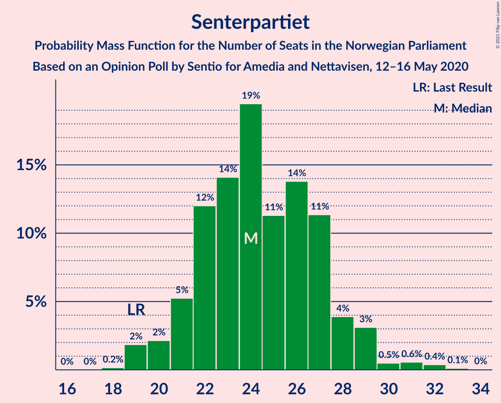
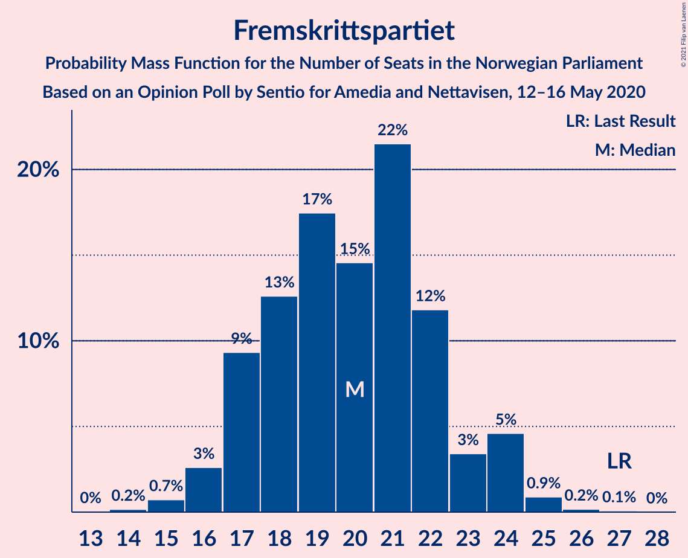
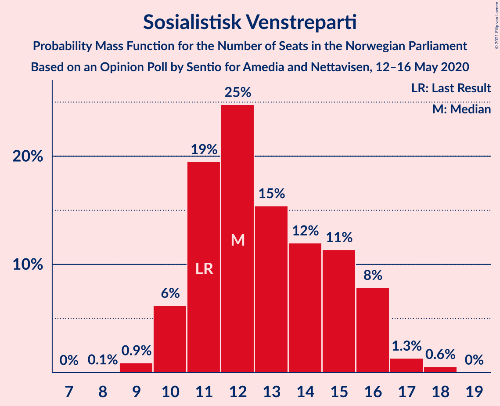
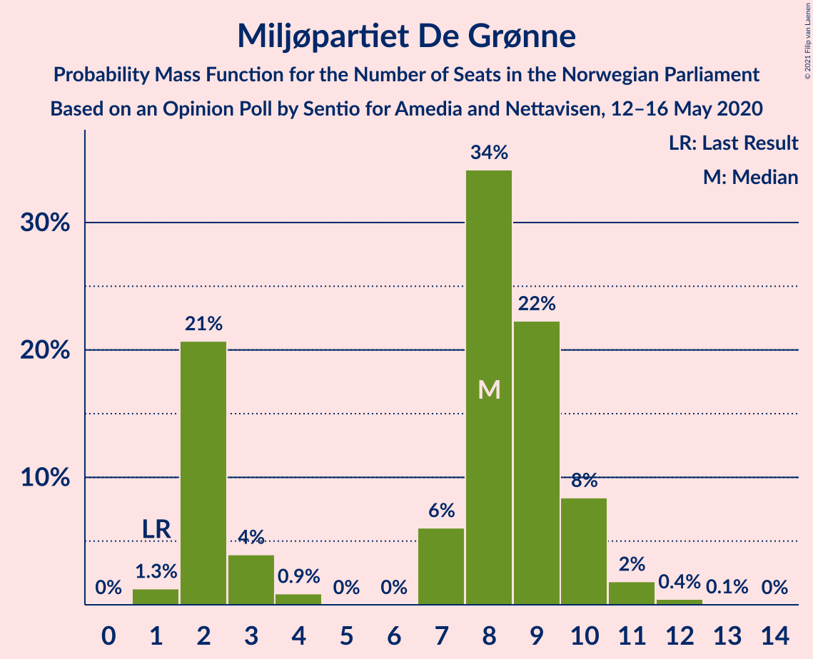
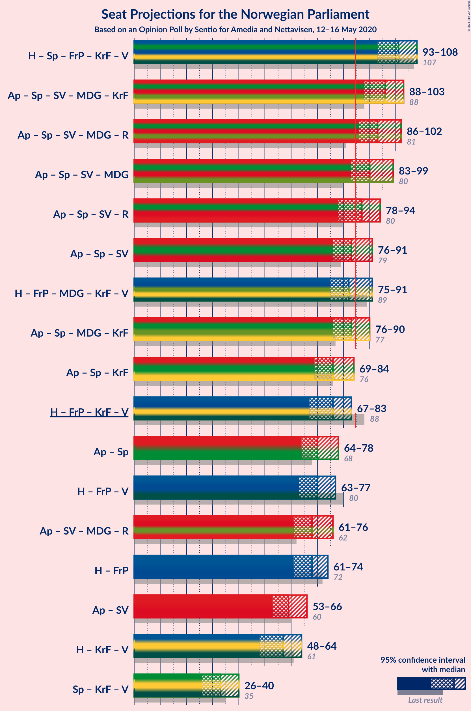
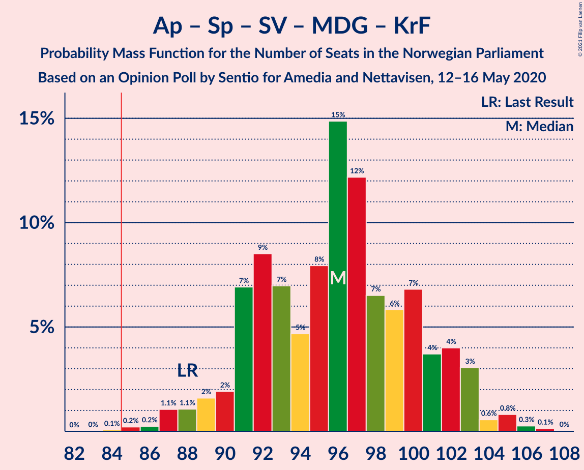
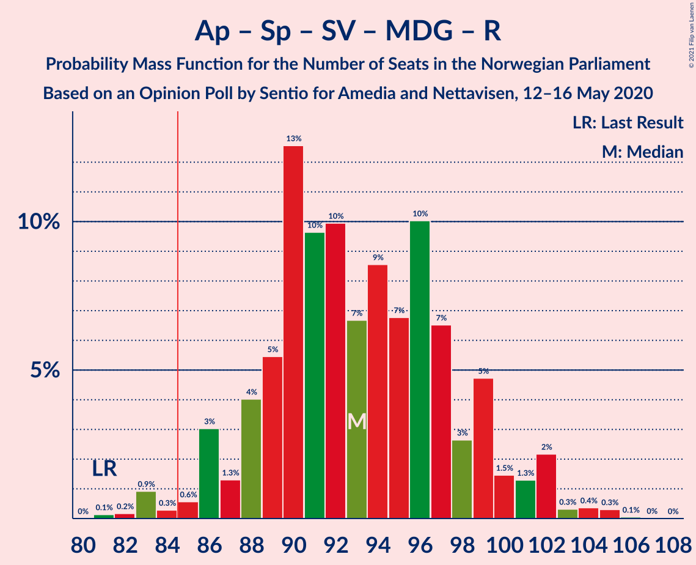
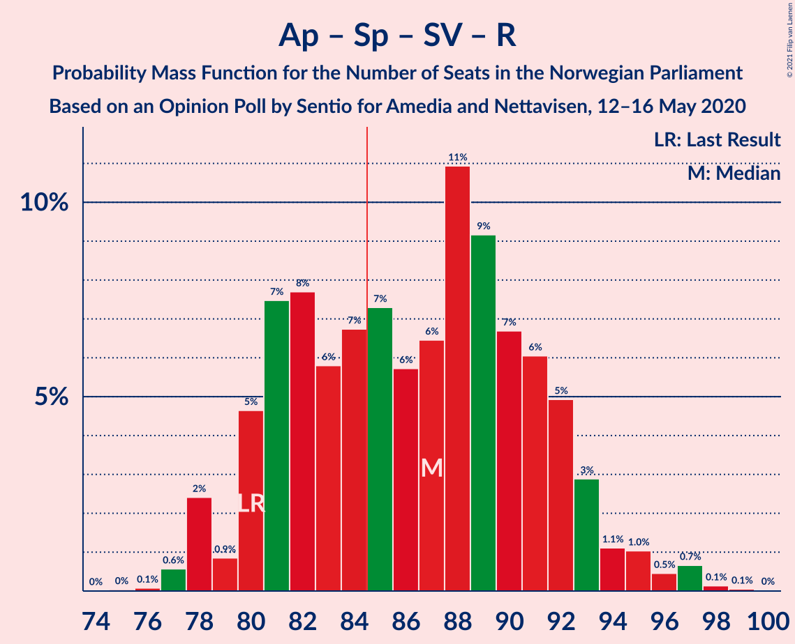
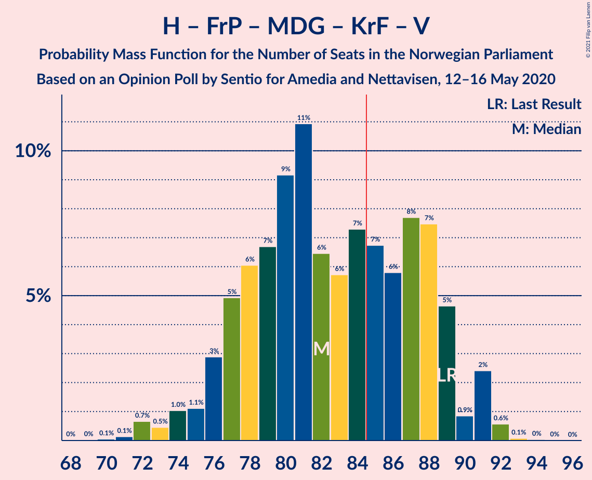
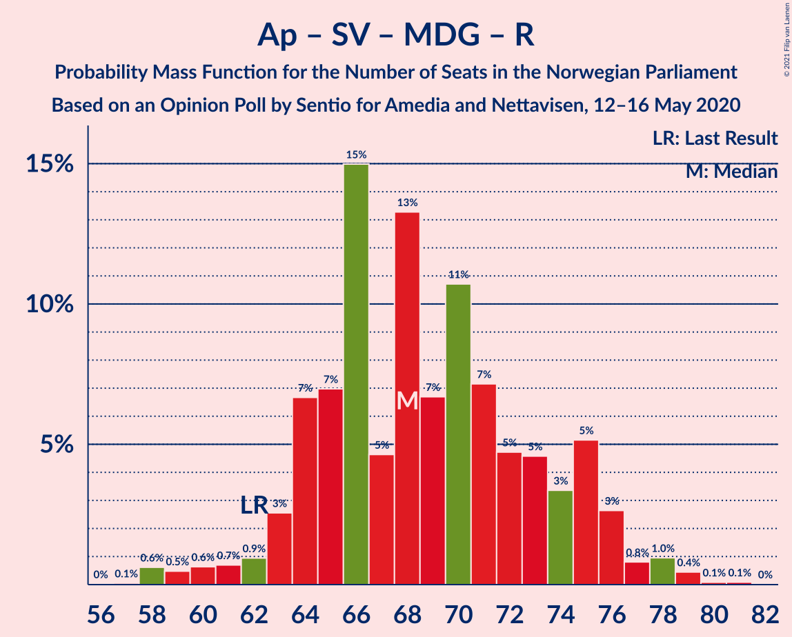

# Opinion Poll by Sentio for Amedia and Nettavisen, 12–16 May 2020

<a href="#voting-intentions">Voting Intentions</a> | <a href="#seats">Seats</a> | <a href="#coalitions">Coalitions</a> | <a href="#technical-information">Technical Information</a>

## Voting Intentions

### Confidence Intervals

| Party | Last Result | Poll Result | 80% Confidence Interval | 90% Confidence Interval | 95% Confidence Interval | 99% Confidence Interval |
|:-----:|:-----------:|:-----------:|:-----------------------:|:-----------------------:|:-----------------------:|:-----------------------:|
| Høyre | 25.0% | 26.0% | 24.3–27.8% |23.8–28.4% |23.4–28.8% |22.6–29.7% |
| Arbeiderpartiet | 27.4% | 25.5% | 23.8–27.3% |23.3–27.8% |22.9–28.3% |22.1–29.2% |
| Senterpartiet | 10.3% | 13.5% | 12.2–15.0% |11.8–15.4% |11.5–15.8% |10.9–16.5% |
| Fremskrittspartiet | 15.2% | 11.0% | 9.8–12.4% |9.5–12.8% |9.2–13.1% |8.7–13.8% |
| Sosialistisk Venstreparti | 6.0% | 7.1% | 6.2–8.3% |5.9–8.6% |5.7–8.9% |5.2–9.4% |
| Miljøpartiet De Grønne | 3.2% | 4.4% | 3.7–5.3% |3.5–5.6% |3.3–5.9% |3.0–6.4% |
| Kristelig Folkeparti | 4.2% | 4.0% | 3.3–4.9% |3.1–5.2% |2.9–5.4% |2.7–5.9% |
| Rødt | 2.4% | 3.3% | 2.7–4.1% |2.5–4.4% |2.4–4.6% |2.1–5.0% |
| Venstre | 4.4% | 3.3% | 2.7–4.1% |2.5–4.4% |2.4–4.6% |2.1–5.0% |

*Note:* The poll result column reflects the actual value used in the calculations. Published results may vary slightly, and in addition be rounded to fewer digits.

## Seats

### Confidence Intervals

| Party | Last Result | Median | 80% Confidence Interval | 90% Confidence Interval | 95% Confidence Interval | 99% Confidence Interval |
|:-----:|:-----------:|:------:|:-----------------------:|:-----------------------:|:-----------------------:|:-----------------------:|
| <a href="#høyre">Høyre</a> | 45 | 48 | 43–51 |42–52 |41–52 |40–55 |
| <a href="#arbeiderpartiet">Arbeiderpartiet</a> | 49 | 46 | 43–50 |42–51 |41–52 |40–54 |
| <a href="#senterpartiet">Senterpartiet</a> | 19 | 24 | 22–27 |21–28 |20–29 |19–32 |
| <a href="#fremskrittspartiet">Fremskrittspartiet</a> | 27 | 20 | 17–22 |17–24 |16–24 |15–25 |
| <a href="#sosialistisk-venstreparti">Sosialistisk Venstreparti</a> | 11 | 12 | 11–15 |10–16 |10–16 |9–18 |
| <a href="#miljøpartiet-de-grønne">Miljøpartiet De Grønne</a> | 1 | 8 | 2–10 |2–10 |2–10 |1–12 |
| <a href="#kristelig-folkeparti">Kristelig Folkeparti</a> | 8 | 7 | 3–9 |1–9 |1–10 |1–10 |
| <a href="#rødt">Rødt</a> | 1 | 2 | 1–7 |1–8 |1–8 |1–9 |
| <a href="#venstre">Venstre</a> | 8 | 2 | 2–7 |2–8 |2–8 |1–9 |

### Høyre

*For a full overview of the results for this party, see the [Høyre](party-høyre.html) page.*

| Number of Seats | Probability | Accumulated | Special Marks |
|:---------------:|:-----------:|:-----------:|:-------------:|
| 38 | 0.1% | 100% |  |
| 39 | 0.2% | 99.9% |  |
| 40 | 0.9% | 99.7% |  |
| 41 | 2% | 98.7% |  |
| 42 | 2% | 97% |  |
| 43 | 7% | 95% |  |
| 44 | 5% | 88% |  |
| 45 | 6% | 83% | Last Result |
| 46 | 6% | 77% |  |
| 47 | 19% | 70% |  |
| 48 | 17% | 51% | Median |
| 49 | 11% | 34% |  |
| 50 | 9% | 22% |  |
| 51 | 4% | 13% |  |
| 52 | 7% | 9% |  |
| 53 | 0.9% | 2% |  |
| 54 | 0.7% | 2% |  |
| 55 | 0.6% | 0.8% |  |
| 56 | 0.1% | 0.2% |  |
| 57 | 0% | 0.1% |  |
| 58 | 0% | 0% |  |

### Arbeiderpartiet

*For a full overview of the results for this party, see the [Arbeiderpartiet](party-arbeiderpartiet.html) page.*

| Number of Seats | Probability | Accumulated | Special Marks |
|:---------------:|:-----------:|:-----------:|:-------------:|
| 38 | 0% | 100% |  |
| 39 | 0.1% | 99.9% |  |
| 40 | 0.3% | 99.8% |  |
| 41 | 3% | 99.5% |  |
| 42 | 3% | 97% |  |
| 43 | 8% | 94% |  |
| 44 | 15% | 86% |  |
| 45 | 13% | 71% |  |
| 46 | 13% | 57% | Median |
| 47 | 11% | 44% |  |
| 48 | 10% | 33% |  |
| 49 | 8% | 23% | Last Result |
| 50 | 8% | 15% |  |
| 51 | 3% | 8% |  |
| 52 | 2% | 4% |  |
| 53 | 0.9% | 2% |  |
| 54 | 0.7% | 1.1% |  |
| 55 | 0.2% | 0.4% |  |
| 56 | 0.1% | 0.2% |  |
| 57 | 0.1% | 0.1% |  |
| 58 | 0% | 0% |  |

### Senterpartiet

*For a full overview of the results for this party, see the [Senterpartiet](party-senterpartiet.html) page.*

| Number of Seats | Probability | Accumulated | Special Marks |
|:---------------:|:-----------:|:-----------:|:-------------:|
| 18 | 0.2% | 100% |  |
| 19 | 2% | 99.8% | Last Result |
| 20 | 2% | 98% |  |
| 21 | 5% | 96% |  |
| 22 | 12% | 91% |  |
| 23 | 14% | 79% |  |
| 24 | 19% | 65% | Median |
| 25 | 11% | 45% |  |
| 26 | 14% | 34% |  |
| 27 | 11% | 20% |  |
| 28 | 4% | 9% |  |
| 29 | 3% | 5% |  |
| 30 | 0.5% | 2% |  |
| 31 | 0.6% | 1.1% |  |
| 32 | 0.4% | 0.5% |  |
| 33 | 0.1% | 0.2% |  |
| 34 | 0% | 0% |  |

### Fremskrittspartiet

*For a full overview of the results for this party, see the [Fremskrittspartiet](party-fremskrittspartiet.html) page.*

| Number of Seats | Probability | Accumulated | Special Marks |
|:---------------:|:-----------:|:-----------:|:-------------:|
| 14 | 0.2% | 100% |  |
| 15 | 0.7% | 99.8% |  |
| 16 | 3% | 99.1% |  |
| 17 | 9% | 96% |  |
| 18 | 13% | 87% |  |
| 19 | 17% | 75% |  |
| 20 | 15% | 57% | Median |
| 21 | 22% | 42% |  |
| 22 | 12% | 21% |  |
| 23 | 3% | 9% |  |
| 24 | 5% | 6% |  |
| 25 | 0.9% | 1.2% |  |
| 26 | 0.2% | 0.3% |  |
| 27 | 0.1% | 0.1% | Last Result |
| 28 | 0% | 0% |  |

### Sosialistisk Venstreparti

*For a full overview of the results for this party, see the [Sosialistisk Venstreparti](party-sosialistiskvenstreparti.html) page.*

| Number of Seats | Probability | Accumulated | Special Marks |
|:---------------:|:-----------:|:-----------:|:-------------:|
| 8 | 0.1% | 100% |  |
| 9 | 0.9% | 99.9% |  |
| 10 | 6% | 99.0% |  |
| 11 | 19% | 93% | Last Result |
| 12 | 25% | 73% | Median |
| 13 | 15% | 49% |  |
| 14 | 12% | 33% |  |
| 15 | 11% | 21% |  |
| 16 | 8% | 10% |  |
| 17 | 1.3% | 2% |  |
| 18 | 0.6% | 0.6% |  |
| 19 | 0% | 0% |  |

### Miljøpartiet De Grønne

*For a full overview of the results for this party, see the [Miljøpartiet De Grønne](party-miljøpartietdegrønne.html) page.*

| Number of Seats | Probability | Accumulated | Special Marks |
|:---------------:|:-----------:|:-----------:|:-------------:|
| 1 | 1.3% | 100% | Last Result |
| 2 | 21% | 98.7% |  |
| 3 | 4% | 78% |  |
| 4 | 0.9% | 74% |  |
| 5 | 0% | 73% |  |
| 6 | 0% | 73% |  |
| 7 | 6% | 73% |  |
| 8 | 34% | 67% | Median |
| 9 | 22% | 33% |  |
| 10 | 8% | 11% |  |
| 11 | 2% | 2% |  |
| 12 | 0.4% | 0.5% |  |
| 13 | 0.1% | 0.1% |  |
| 14 | 0% | 0% |  |

### Kristelig Folkeparti

*For a full overview of the results for this party, see the [Kristelig Folkeparti](party-kristeligfolkeparti.html) page.*

| Number of Seats | Probability | Accumulated | Special Marks |
|:---------------:|:-----------:|:-----------:|:-------------:|
| 1 | 6% | 100% |  |
| 2 | 4% | 94% |  |
| 3 | 37% | 90% |  |
| 4 | 0% | 53% |  |
| 5 | 0% | 53% |  |
| 6 | 0.2% | 53% |  |
| 7 | 10% | 53% | Median |
| 8 | 29% | 43% | Last Result |
| 9 | 10% | 13% |  |
| 10 | 3% | 3% |  |
| 11 | 0.3% | 0.3% |  |
| 12 | 0% | 0% |  |

### Rødt

*For a full overview of the results for this party, see the [Rødt](party-rødt.html) page.*

| Number of Seats | Probability | Accumulated | Special Marks |
|:---------------:|:-----------:|:-----------:|:-------------:|
| 1 | 21% | 100% | Last Result |
| 2 | 63% | 79% | Median |
| 3 | 0% | 17% |  |
| 4 | 0% | 17% |  |
| 5 | 0% | 17% |  |
| 6 | 0.5% | 17% |  |
| 7 | 9% | 16% |  |
| 8 | 6% | 7% |  |
| 9 | 0.9% | 1.1% |  |
| 10 | 0.2% | 0.2% |  |
| 11 | 0% | 0% |  |

### Venstre

*For a full overview of the results for this party, see the [Venstre](party-venstre.html) page.*

| Number of Seats | Probability | Accumulated | Special Marks |
|:---------------:|:-----------:|:-----------:|:-------------:|
| 0 | 0.1% | 100% |  |
| 1 | 2% | 99.9% |  |
| 2 | 77% | 98% | Median |
| 3 | 3% | 20% |  |
| 4 | 0% | 17% |  |
| 5 | 0% | 17% |  |
| 6 | 0.3% | 17% |  |
| 7 | 9% | 17% |  |
| 8 | 7% | 8% | Last Result |
| 9 | 1.1% | 1.2% |  |
| 10 | 0.2% | 0.2% |  |
| 11 | 0% | 0% |  |

## Coalitions

### Confidence Intervals

| Coalition | Last Result | Median | Majority? | 80% Confidence Interval | 90% Confidence Interval | 95% Confidence Interval | 99% Confidence Interval |
|:---------:|:-----------:|:------:|:---------:|:-----------------------:|:-----------------------:|:-----------------------:|:-----------------------:|
| Høyre – Senterpartiet – Fremskrittspartiet – Kristelig Folkeparti – Venstre | 107 | 101 | 100% | 94–105 | 93–106 | 93–108 | 90–111 |
| Arbeiderpartiet – Senterpartiet – Sosialistisk Venstreparti – Miljøpartiet De Grønne – Kristelig Folkeparti | 88 | 96 | 99.9% | 91–101 | 90–102 | 88–103 | 86–105 |
| Arbeiderpartiet – Senterpartiet – Sosialistisk Venstreparti – Miljøpartiet De Grønne – Rødt | 81 | 93 | 98% | 88–99 | 86–100 | 86–102 | 83–104 |
| Arbeiderpartiet – Senterpartiet – Sosialistisk Venstreparti – Miljøpartiet De Grønne | 80 | 90 | 93% | 85–96 | 84–97 | 83–99 | 81–100 |
| Arbeiderpartiet – Senterpartiet – Sosialistisk Venstreparti – Rødt | 80 | 87 | 64% | 81–92 | 80–93 | 78–94 | 77–97 |
| Arbeiderpartiet – Senterpartiet – Sosialistisk Venstreparti | 79 | 83 | 42% | 79–89 | 77–90 | 76–91 | 75–93 |
| Høyre – Fremskrittspartiet – Miljøpartiet De Grønne – Kristelig Folkeparti – Venstre | 89 | 82 | 36% | 77–88 | 76–89 | 75–91 | 72–92 |
| Arbeiderpartiet – Senterpartiet – Miljøpartiet De Grønne – Kristelig Folkeparti | 77 | 83 | 37% | 78–88 | 77–90 | 76–90 | 74–94 |
| Arbeiderpartiet – Senterpartiet – Kristelig Folkeparti | 76 | 76 | 2% | 71–82 | 70–83 | 69–84 | 67–86 |
| Høyre – Fremskrittspartiet – Kristelig Folkeparti – Venstre | 88 | 76 | 2% | 70–81 | 69–83 | 67–83 | 65–86 |
| Arbeiderpartiet – Senterpartiet | 68 | 70 | 0% | 66–76 | 66–77 | 64–78 | 63–79 |
| Høyre – Fremskrittspartiet – Venstre | 80 | 70 | 0% | 65–76 | 64–77 | 63–77 | 61–80 |
| Arbeiderpartiet – Sosialistisk Venstreparti – Miljøpartiet De Grønne – Rødt | 62 | 68 | 0% | 64–75 | 63–76 | 61–76 | 58–79 |
| Høyre – Fremskrittspartiet | 72 | 68 | 0% | 63–72 | 62–73 | 61–74 | 58–76 |
| Arbeiderpartiet – Sosialistisk Venstreparti | 60 | 59 | 0% | 55–64 | 54–65 | 53–66 | 52–68 |
| Høyre – Kristelig Folkeparti – Venstre | 61 | 57 | 0% | 51–61 | 49–63 | 48–64 | 46–65 |
| Senterpartiet – Kristelig Folkeparti – Venstre | 35 | 33 | 0% | 28–37 | 27–39 | 26–40 | 25–43 |

### Høyre – Senterpartiet – Fremskrittspartiet – Kristelig Folkeparti – Venstre

| Number of Seats | Probability | Accumulated | Special Marks |
|:---------------:|:-----------:|:-----------:|:-------------:|
| 88 | 0.1% | 100% |  |
| 89 | 0.1% | 99.9% |  |
| 90 | 0.4% | 99.8% |  |
| 91 | 1.0% | 99.3% |  |
| 92 | 0.8% | 98% |  |
| 93 | 3% | 98% |  |
| 94 | 5% | 95% |  |
| 95 | 3% | 90% |  |
| 96 | 5% | 86% |  |
| 97 | 5% | 82% |  |
| 98 | 7% | 77% |  |
| 99 | 11% | 70% |  |
| 100 | 7% | 59% |  |
| 101 | 13% | 53% | Median |
| 102 | 5% | 39% |  |
| 103 | 15% | 35% |  |
| 104 | 7% | 20% |  |
| 105 | 7% | 13% |  |
| 106 | 3% | 6% |  |
| 107 | 0.9% | 3% | Last Result |
| 108 | 0.7% | 3% |  |
| 109 | 0.6% | 2% |  |
| 110 | 0.5% | 1.2% |  |
| 111 | 0.6% | 0.7% |  |
| 112 | 0.1% | 0.1% |  |
| 113 | 0% | 0% |  |

### Arbeiderpartiet – Senterpartiet – Sosialistisk Venstreparti – Miljøpartiet De Grønne – Kristelig Folkeparti

| Number of Seats | Probability | Accumulated | Special Marks |
|:---------------:|:-----------:|:-----------:|:-------------:|
| 84 | 0.1% | 100% |  |
| 85 | 0.2% | 99.9% | Majority |
| 86 | 0.2% | 99.7% |  |
| 87 | 1.1% | 99.4% |  |
| 88 | 1.1% | 98% | Last Result |
| 89 | 2% | 97% |  |
| 90 | 2% | 96% |  |
| 91 | 7% | 94% |  |
| 92 | 9% | 87% |  |
| 93 | 7% | 78% |  |
| 94 | 5% | 71% |  |
| 95 | 8% | 67% |  |
| 96 | 15% | 59% |  |
| 97 | 12% | 44% | Median |
| 98 | 7% | 32% |  |
| 99 | 6% | 25% |  |
| 100 | 7% | 19% |  |
| 101 | 4% | 13% |  |
| 102 | 4% | 9% |  |
| 103 | 3% | 5% |  |
| 104 | 0.6% | 2% |  |
| 105 | 0.8% | 1.3% |  |
| 106 | 0.3% | 0.4% |  |
| 107 | 0.1% | 0.2% |  |
| 108 | 0% | 0% |  |

### Arbeiderpartiet – Senterpartiet – Sosialistisk Venstreparti – Miljøpartiet De Grønne – Rødt

| Number of Seats | Probability | Accumulated | Special Marks |
|:---------------:|:-----------:|:-----------:|:-------------:|
| 81 | 0.1% | 100% | Last Result |
| 82 | 0.2% | 99.9% |  |
| 83 | 0.9% | 99.7% |  |
| 84 | 0.3% | 98.8% |  |
| 85 | 0.6% | 98% | Majority |
| 86 | 3% | 98% |  |
| 87 | 1.3% | 95% |  |
| 88 | 4% | 94% |  |
| 89 | 5% | 90% |  |
| 90 | 13% | 84% |  |
| 91 | 10% | 72% |  |
| 92 | 10% | 62% | Median |
| 93 | 7% | 52% |  |
| 94 | 9% | 45% |  |
| 95 | 7% | 37% |  |
| 96 | 10% | 30% |  |
| 97 | 7% | 20% |  |
| 98 | 3% | 13% |  |
| 99 | 5% | 11% |  |
| 100 | 1.5% | 6% |  |
| 101 | 1.3% | 5% |  |
| 102 | 2% | 3% |  |
| 103 | 0.3% | 1.1% |  |
| 104 | 0.4% | 0.7% |  |
| 105 | 0.3% | 0.4% |  |
| 106 | 0.1% | 0.1% |  |
| 107 | 0% | 0% |  |

### Arbeiderpartiet – Senterpartiet – Sosialistisk Venstreparti – Miljøpartiet De Grønne

| Number of Seats | Probability | Accumulated | Special Marks |
|:---------------:|:-----------:|:-----------:|:-------------:|
| 79 | 0.1% | 100% |  |
| 80 | 0.2% | 99.9% | Last Result |
| 81 | 2% | 99.7% |  |
| 82 | 0.5% | 98% |  |
| 83 | 0.9% | 98% |  |
| 84 | 4% | 97% |  |
| 85 | 3% | 93% | Majority |
| 86 | 2% | 90% |  |
| 87 | 6% | 88% |  |
| 88 | 13% | 81% |  |
| 89 | 14% | 69% |  |
| 90 | 10% | 54% | Median |
| 91 | 8% | 44% |  |
| 92 | 8% | 36% |  |
| 93 | 6% | 29% |  |
| 94 | 6% | 22% |  |
| 95 | 4% | 16% |  |
| 96 | 3% | 11% |  |
| 97 | 4% | 9% |  |
| 98 | 1.3% | 4% |  |
| 99 | 1.1% | 3% |  |
| 100 | 2% | 2% |  |
| 101 | 0.2% | 0.3% |  |
| 102 | 0% | 0.1% |  |
| 103 | 0% | 0% |  |

### Arbeiderpartiet – Senterpartiet – Sosialistisk Venstreparti – Rødt

| Number of Seats | Probability | Accumulated | Special Marks |
|:---------------:|:-----------:|:-----------:|:-------------:|
| 75 | 0% | 100% |  |
| 76 | 0.1% | 99.9% |  |
| 77 | 0.6% | 99.9% |  |
| 78 | 2% | 99.3% |  |
| 79 | 0.9% | 97% |  |
| 80 | 5% | 96% | Last Result |
| 81 | 7% | 91% |  |
| 82 | 8% | 84% |  |
| 83 | 6% | 76% |  |
| 84 | 7% | 70% | Median |
| 85 | 7% | 64% | Majority |
| 86 | 6% | 56% |  |
| 87 | 6% | 51% |  |
| 88 | 11% | 44% |  |
| 89 | 9% | 33% |  |
| 90 | 7% | 24% |  |
| 91 | 6% | 17% |  |
| 92 | 5% | 11% |  |
| 93 | 3% | 6% |  |
| 94 | 1.1% | 4% |  |
| 95 | 1.0% | 2% |  |
| 96 | 0.5% | 1.4% |  |
| 97 | 0.7% | 0.9% |  |
| 98 | 0.1% | 0.2% |  |
| 99 | 0.1% | 0.1% |  |
| 100 | 0% | 0% |  |

### Arbeiderpartiet – Senterpartiet – Sosialistisk Venstreparti

| Number of Seats | Probability | Accumulated | Special Marks |
|:---------------:|:-----------:|:-----------:|:-------------:|
| 73 | 0.1% | 100% |  |
| 74 | 0.3% | 99.9% |  |
| 75 | 0.3% | 99.6% |  |
| 76 | 3% | 99.3% |  |
| 77 | 2% | 96% |  |
| 78 | 3% | 94% |  |
| 79 | 9% | 91% | Last Result |
| 80 | 8% | 82% |  |
| 81 | 11% | 74% |  |
| 82 | 6% | 63% | Median |
| 83 | 10% | 57% |  |
| 84 | 5% | 47% |  |
| 85 | 7% | 42% | Majority |
| 86 | 6% | 35% |  |
| 87 | 10% | 30% |  |
| 88 | 5% | 20% |  |
| 89 | 6% | 14% |  |
| 90 | 4% | 8% |  |
| 91 | 3% | 4% |  |
| 92 | 0.8% | 2% |  |
| 93 | 0.4% | 0.7% |  |
| 94 | 0.2% | 0.3% |  |
| 95 | 0% | 0.2% |  |
| 96 | 0.1% | 0.1% |  |
| 97 | 0% | 0% |  |

### Høyre – Fremskrittspartiet – Miljøpartiet De Grønne – Kristelig Folkeparti – Venstre

| Number of Seats | Probability | Accumulated | Special Marks |
|:---------------:|:-----------:|:-----------:|:-------------:|
| 70 | 0.1% | 100% |  |
| 71 | 0.1% | 99.9% |  |
| 72 | 0.7% | 99.8% |  |
| 73 | 0.5% | 99.1% |  |
| 74 | 1.0% | 98.6% |  |
| 75 | 1.1% | 98% |  |
| 76 | 3% | 96% |  |
| 77 | 5% | 94% |  |
| 78 | 6% | 89% |  |
| 79 | 7% | 83% |  |
| 80 | 9% | 76% |  |
| 81 | 11% | 67% |  |
| 82 | 6% | 56% |  |
| 83 | 6% | 49% |  |
| 84 | 7% | 44% |  |
| 85 | 7% | 36% | Median, Majority |
| 86 | 6% | 30% |  |
| 87 | 8% | 24% |  |
| 88 | 7% | 16% |  |
| 89 | 5% | 9% | Last Result |
| 90 | 0.9% | 4% |  |
| 91 | 2% | 3% |  |
| 92 | 0.6% | 0.7% |  |
| 93 | 0.1% | 0.1% |  |
| 94 | 0% | 0.1% |  |
| 95 | 0% | 0% |  |

### Arbeiderpartiet – Senterpartiet – Miljøpartiet De Grønne – Kristelig Folkeparti

| Number of Seats | Probability | Accumulated | Special Marks |
|:---------------:|:-----------:|:-----------:|:-------------:|
| 70 | 0.1% | 100% |  |
| 71 | 0.1% | 99.9% |  |
| 72 | 0.1% | 99.9% |  |
| 73 | 0.2% | 99.8% |  |
| 74 | 1.0% | 99.5% |  |
| 75 | 0.9% | 98.6% |  |
| 76 | 2% | 98% |  |
| 77 | 3% | 96% | Last Result |
| 78 | 3% | 93% |  |
| 79 | 6% | 89% |  |
| 80 | 9% | 84% |  |
| 81 | 13% | 75% |  |
| 82 | 5% | 62% |  |
| 83 | 8% | 57% |  |
| 84 | 12% | 49% |  |
| 85 | 10% | 37% | Median, Majority |
| 86 | 9% | 27% |  |
| 87 | 3% | 18% |  |
| 88 | 7% | 15% |  |
| 89 | 2% | 8% |  |
| 90 | 4% | 6% |  |
| 91 | 1.0% | 2% |  |
| 92 | 0.5% | 1.3% |  |
| 93 | 0.3% | 0.8% |  |
| 94 | 0.2% | 0.5% |  |
| 95 | 0.3% | 0.4% |  |
| 96 | 0% | 0% |  |

### Arbeiderpartiet – Senterpartiet – Kristelig Folkeparti

| Number of Seats | Probability | Accumulated | Special Marks |
|:---------------:|:-----------:|:-----------:|:-------------:|
| 66 | 0.2% | 100% |  |
| 67 | 0.3% | 99.8% |  |
| 68 | 1.1% | 99.5% |  |
| 69 | 1.2% | 98% |  |
| 70 | 2% | 97% |  |
| 71 | 6% | 95% |  |
| 72 | 7% | 89% |  |
| 73 | 6% | 81% |  |
| 74 | 8% | 75% |  |
| 75 | 8% | 67% |  |
| 76 | 14% | 59% | Last Result |
| 77 | 6% | 45% | Median |
| 78 | 10% | 39% |  |
| 79 | 9% | 29% |  |
| 80 | 5% | 20% |  |
| 81 | 5% | 15% |  |
| 82 | 5% | 10% |  |
| 83 | 2% | 6% |  |
| 84 | 1.1% | 3% |  |
| 85 | 1.1% | 2% | Majority |
| 86 | 0.6% | 1.1% |  |
| 87 | 0.4% | 0.5% |  |
| 88 | 0% | 0.1% |  |
| 89 | 0% | 0% |  |

### Høyre – Fremskrittspartiet – Kristelig Folkeparti – Venstre

| Number of Seats | Probability | Accumulated | Special Marks |
|:---------------:|:-----------:|:-----------:|:-------------:|
| 63 | 0.1% | 100% |  |
| 64 | 0.3% | 99.9% |  |
| 65 | 0.4% | 99.6% |  |
| 66 | 0.3% | 99.3% |  |
| 67 | 2% | 98.9% |  |
| 68 | 1.3% | 97% |  |
| 69 | 1.5% | 95% |  |
| 70 | 5% | 94% |  |
| 71 | 3% | 89% |  |
| 72 | 7% | 87% |  |
| 73 | 10% | 80% |  |
| 74 | 7% | 70% |  |
| 75 | 9% | 63% |  |
| 76 | 7% | 55% |  |
| 77 | 10% | 48% | Median |
| 78 | 10% | 38% |  |
| 79 | 13% | 28% |  |
| 80 | 5% | 16% |  |
| 81 | 4% | 10% |  |
| 82 | 1.3% | 6% |  |
| 83 | 3% | 5% |  |
| 84 | 0.6% | 2% |  |
| 85 | 0.3% | 2% | Majority |
| 86 | 0.9% | 1.2% |  |
| 87 | 0.2% | 0.3% |  |
| 88 | 0.1% | 0.1% | Last Result |
| 89 | 0% | 0% |  |

### Arbeiderpartiet – Senterpartiet

| Number of Seats | Probability | Accumulated | Special Marks |
|:---------------:|:-----------:|:-----------:|:-------------:|
| 61 | 0.1% | 100% |  |
| 62 | 0.2% | 99.9% |  |
| 63 | 0.5% | 99.7% |  |
| 64 | 2% | 99.2% |  |
| 65 | 2% | 97% |  |
| 66 | 6% | 96% |  |
| 67 | 8% | 90% |  |
| 68 | 16% | 82% | Last Result |
| 69 | 9% | 66% |  |
| 70 | 8% | 58% | Median |
| 71 | 11% | 50% |  |
| 72 | 5% | 38% |  |
| 73 | 8% | 34% |  |
| 74 | 7% | 25% |  |
| 75 | 7% | 19% |  |
| 76 | 5% | 12% |  |
| 77 | 4% | 7% |  |
| 78 | 1.5% | 3% |  |
| 79 | 1.0% | 1.4% |  |
| 80 | 0.2% | 0.4% |  |
| 81 | 0.1% | 0.2% |  |
| 82 | 0.1% | 0.1% |  |
| 83 | 0% | 0.1% |  |
| 84 | 0% | 0% |  |

### Høyre – Fremskrittspartiet – Venstre

| Number of Seats | Probability | Accumulated | Special Marks |
|:---------------:|:-----------:|:-----------:|:-------------:|
| 58 | 0% | 100% |  |
| 59 | 0.1% | 99.9% |  |
| 60 | 0.2% | 99.8% |  |
| 61 | 0.5% | 99.6% |  |
| 62 | 0.8% | 99.2% |  |
| 63 | 1.2% | 98% |  |
| 64 | 3% | 97% |  |
| 65 | 6% | 94% |  |
| 66 | 4% | 88% |  |
| 67 | 9% | 84% |  |
| 68 | 5% | 75% |  |
| 69 | 9% | 70% |  |
| 70 | 13% | 62% | Median |
| 71 | 14% | 49% |  |
| 72 | 9% | 34% |  |
| 73 | 4% | 25% |  |
| 74 | 6% | 21% |  |
| 75 | 4% | 15% |  |
| 76 | 6% | 11% |  |
| 77 | 3% | 5% |  |
| 78 | 0.8% | 2% |  |
| 79 | 0.6% | 1.2% |  |
| 80 | 0.3% | 0.6% | Last Result |
| 81 | 0.2% | 0.3% |  |
| 82 | 0.1% | 0.1% |  |
| 83 | 0% | 0% |  |

### Arbeiderpartiet – Sosialistisk Venstreparti – Miljøpartiet De Grønne – Rødt

| Number of Seats | Probability | Accumulated | Special Marks |
|:---------------:|:-----------:|:-----------:|:-------------:|
| 57 | 0.1% | 100% |  |
| 58 | 0.6% | 99.9% |  |
| 59 | 0.5% | 99.3% |  |
| 60 | 0.6% | 98.8% |  |
| 61 | 0.7% | 98% |  |
| 62 | 0.9% | 97% | Last Result |
| 63 | 3% | 97% |  |
| 64 | 7% | 94% |  |
| 65 | 7% | 87% |  |
| 66 | 15% | 80% |  |
| 67 | 5% | 65% |  |
| 68 | 13% | 61% | Median |
| 69 | 7% | 47% |  |
| 70 | 11% | 41% |  |
| 71 | 7% | 30% |  |
| 72 | 5% | 23% |  |
| 73 | 5% | 18% |  |
| 74 | 3% | 14% |  |
| 75 | 5% | 10% |  |
| 76 | 3% | 5% |  |
| 77 | 0.8% | 2% |  |
| 78 | 1.0% | 2% |  |
| 79 | 0.4% | 0.7% |  |
| 80 | 0.1% | 0.2% |  |
| 81 | 0.1% | 0.1% |  |
| 82 | 0% | 0% |  |

### Høyre – Fremskrittspartiet

| Number of Seats | Probability | Accumulated | Special Marks |
|:---------------:|:-----------:|:-----------:|:-------------:|
| 55 | 0% | 100% |  |
| 56 | 0.1% | 99.9% |  |
| 57 | 0.2% | 99.9% |  |
| 58 | 0.6% | 99.7% |  |
| 59 | 0.6% | 99.1% |  |
| 60 | 0.9% | 98% |  |
| 61 | 1.4% | 98% |  |
| 62 | 4% | 96% |  |
| 63 | 7% | 92% |  |
| 64 | 8% | 85% |  |
| 65 | 9% | 77% |  |
| 66 | 6% | 69% |  |
| 67 | 9% | 63% |  |
| 68 | 14% | 54% | Median |
| 69 | 16% | 40% |  |
| 70 | 9% | 24% |  |
| 71 | 3% | 15% |  |
| 72 | 5% | 12% | Last Result |
| 73 | 3% | 7% |  |
| 74 | 3% | 4% |  |
| 75 | 0.6% | 1.2% |  |
| 76 | 0.3% | 0.6% |  |
| 77 | 0.2% | 0.3% |  |
| 78 | 0% | 0.1% |  |
| 79 | 0.1% | 0.1% |  |
| 80 | 0% | 0% |  |

### Arbeiderpartiet – Sosialistisk Venstreparti

| Number of Seats | Probability | Accumulated | Special Marks |
|:---------------:|:-----------:|:-----------:|:-------------:|
| 50 | 0.1% | 100% |  |
| 51 | 0.2% | 99.9% |  |
| 52 | 0.5% | 99.7% |  |
| 53 | 2% | 99.2% |  |
| 54 | 5% | 97% |  |
| 55 | 9% | 93% |  |
| 56 | 8% | 84% |  |
| 57 | 14% | 76% |  |
| 58 | 7% | 62% | Median |
| 59 | 8% | 54% |  |
| 60 | 11% | 47% | Last Result |
| 61 | 13% | 36% |  |
| 62 | 6% | 23% |  |
| 63 | 3% | 17% |  |
| 64 | 6% | 14% |  |
| 65 | 5% | 8% |  |
| 66 | 1.1% | 3% |  |
| 67 | 1.0% | 2% |  |
| 68 | 0.7% | 0.9% |  |
| 69 | 0.1% | 0.2% |  |
| 70 | 0% | 0.1% |  |
| 71 | 0.1% | 0.1% |  |
| 72 | 0% | 0% |  |

### Høyre – Kristelig Folkeparti – Venstre

| Number of Seats | Probability | Accumulated | Special Marks |
|:---------------:|:-----------:|:-----------:|:-------------:|
| 45 | 0.3% | 100% |  |
| 46 | 0.6% | 99.7% |  |
| 47 | 1.2% | 99.0% |  |
| 48 | 2% | 98% |  |
| 49 | 1.0% | 95% |  |
| 50 | 4% | 94% |  |
| 51 | 4% | 91% |  |
| 52 | 5% | 87% |  |
| 53 | 13% | 82% |  |
| 54 | 9% | 69% |  |
| 55 | 4% | 60% |  |
| 56 | 4% | 55% |  |
| 57 | 18% | 51% | Median |
| 58 | 8% | 33% |  |
| 59 | 6% | 25% |  |
| 60 | 6% | 19% |  |
| 61 | 4% | 13% | Last Result |
| 62 | 4% | 9% |  |
| 63 | 1.1% | 5% |  |
| 64 | 3% | 4% |  |
| 65 | 0.7% | 1.2% |  |
| 66 | 0.2% | 0.5% |  |
| 67 | 0.1% | 0.3% |  |
| 68 | 0.1% | 0.1% |  |
| 69 | 0% | 0.1% |  |
| 70 | 0% | 0% |  |

### Senterpartiet – Kristelig Folkeparti – Venstre

| Number of Seats | Probability | Accumulated | Special Marks |
|:---------------:|:-----------:|:-----------:|:-------------:|
| 23 | 0% | 100% |  |
| 24 | 0.2% | 99.9% |  |
| 25 | 0.4% | 99.7% |  |
| 26 | 3% | 99.4% |  |
| 27 | 5% | 96% |  |
| 28 | 5% | 91% |  |
| 29 | 5% | 86% |  |
| 30 | 7% | 81% |  |
| 31 | 8% | 73% |  |
| 32 | 7% | 65% |  |
| 33 | 12% | 58% | Median |
| 34 | 14% | 46% |  |
| 35 | 5% | 32% | Last Result |
| 36 | 10% | 26% |  |
| 37 | 6% | 16% |  |
| 38 | 2% | 10% |  |
| 39 | 4% | 7% |  |
| 40 | 1.0% | 3% |  |
| 41 | 1.1% | 2% |  |
| 42 | 0.6% | 1.3% |  |
| 43 | 0.4% | 0.7% |  |
| 44 | 0.2% | 0.3% |  |
| 45 | 0% | 0.1% |  |
| 46 | 0% | 0.1% |  |
| 47 | 0% | 0% |  |

## Technical Information

### Opinion Poll

+ **Polling firm:** Sentio
+ **Commissioner(s):** Amedia and Nettavisen
+ **Fieldwork period:** 12–16 May 2020

### Calculations

+ **Sample size:** 1000
+ **Simulations done:** 1,048,576
+ **Error estimate:** 2.18%

