# Opinion Poll by Norstat for Aftenposten and NRK, 19–25 May 2020

<a href="#voting-intentions">Voting Intentions</a> | <a href="#seats">Seats</a> | <a href="#coalitions">Coalitions</a> | <a href="#technical-information">Technical Information</a>

## Voting Intentions

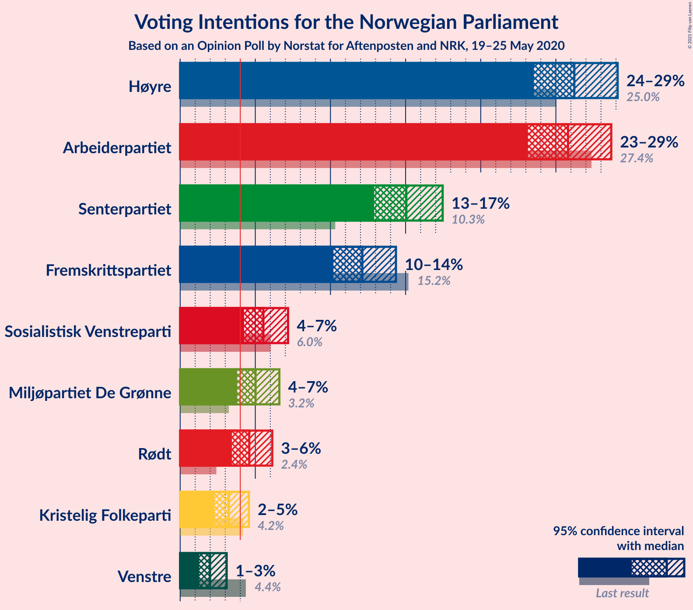

### Confidence Intervals

| Party | Last Result | Poll Result | 80% Confidence Interval | 90% Confidence Interval | 95% Confidence Interval | 99% Confidence Interval |
|:-----:|:-----------:|:-----------:|:-----------------------:|:-----------------------:|:-----------------------:|:-----------------------:|
| Høyre | 25.0% | 26.2% | 24.5–28.1% |24.0–28.7% |23.5–29.1% |22.7–30.0% |
| Arbeiderpartiet | 27.4% | 25.8% | 24.1–27.7% |23.6–28.2% |23.1–28.7% |22.3–29.6% |
| Senterpartiet | 10.3% | 15.0% | 13.6–16.6% |13.3–17.1% |12.9–17.5% |12.3–18.2% |
| Fremskrittspartiet | 15.2% | 12.1% | 10.9–13.6% |10.5–14.0% |10.2–14.4% |9.6–15.1% |
| Sosialistisk Venstreparti | 6.0% | 5.5% | 4.7–6.6% |4.5–6.9% |4.3–7.2% |3.9–7.7% |
| Miljøpartiet De Grønne | 3.2% | 5.0% | 4.2–6.1% |4.0–6.3% |3.8–6.6% |3.4–7.1% |
| Rødt | 2.4% | 4.6% | 3.8–5.6% |3.6–5.9% |3.4–6.1% |3.1–6.6% |
| Kristelig Folkeparti | 4.2% | 3.2% | 2.6–4.1% |2.4–4.3% |2.3–4.6% |2.0–5.0% |
| Venstre | 4.4% | 2.0% | 1.5–2.7% |1.4–2.9% |1.3–3.1% |1.1–3.5% |

*Note:* The poll result column reflects the actual value used in the calculations. Published results may vary slightly, and in addition be rounded to fewer digits.

## Seats

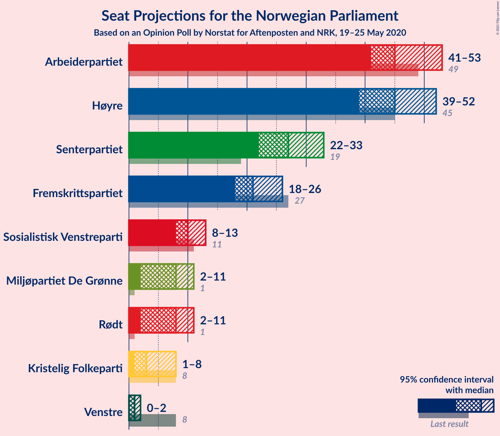

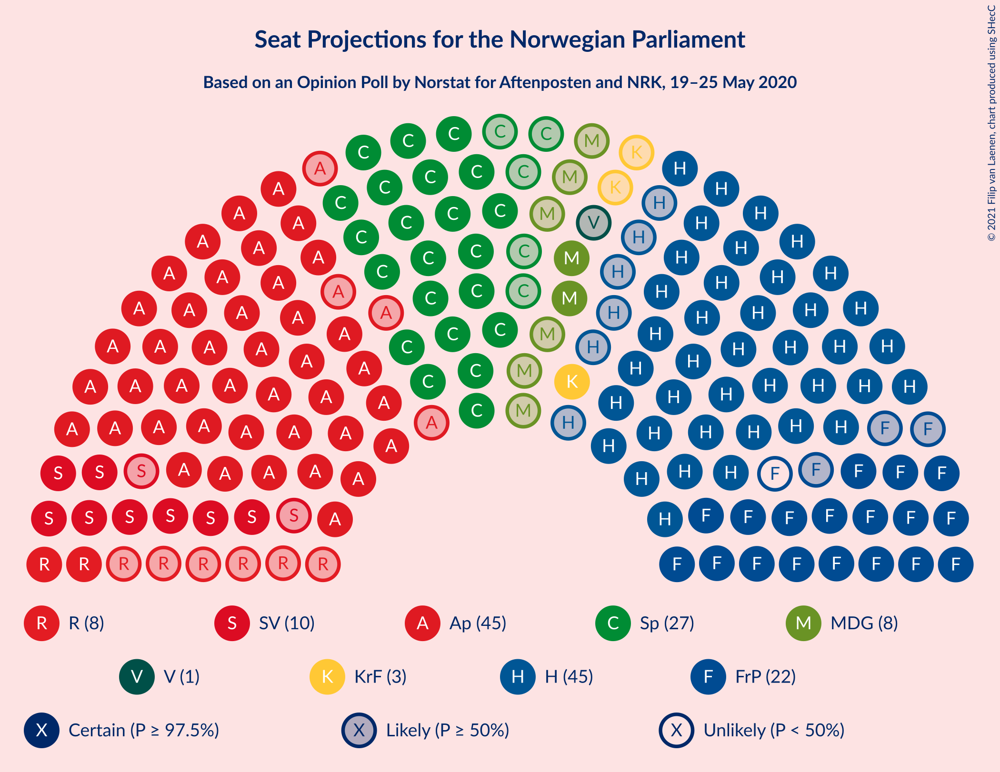

### Confidence Intervals

| Party | Last Result | Median | 80% Confidence Interval | 90% Confidence Interval | 95% Confidence Interval | 99% Confidence Interval |
|:-----:|:-----------:|:------:|:-----------------------:|:-----------------------:|:-----------------------:|:-----------------------:|
| <a href="#høyre">Høyre</a> | 45 | 45 | 41–49 |41–51 |39–52 |39–54 |
| <a href="#arbeiderpartiet">Arbeiderpartiet</a> | 49 | 45 | 42–50 |41–51 |41–53 |39–54 |
| <a href="#senterpartiet">Senterpartiet</a> | 19 | 27 | 24–31 |23–32 |22–33 |21–34 |
| <a href="#fremskrittspartiet">Fremskrittspartiet</a> | 27 | 21 | 18–25 |18–26 |18–26 |17–27 |
| <a href="#sosialistisk-venstreparti">Sosialistisk Venstreparti</a> | 11 | 10 | 8–12 |8–13 |8–13 |2–13 |
| <a href="#miljøpartiet-de-grønne">Miljøpartiet De Grønne</a> | 1 | 8 | 3–10 |2–11 |2–11 |2–12 |
| <a href="#rødt">Rødt</a> | 1 | 8 | 2–10 |2–10 |2–11 |2–12 |
| <a href="#kristelig-folkeparti">Kristelig Folkeparti</a> | 8 | 3 | 1–7 |1–8 |1–8 |0–9 |
| <a href="#venstre">Venstre</a> | 8 | 1 | 0–2 |0–2 |0–2 |0–2 |

### Høyre

*For a full overview of the results for this party, see the [Høyre](party-høyre.html) page.*

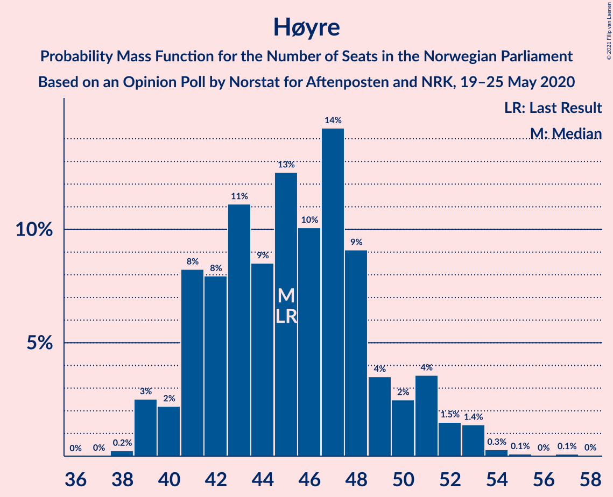

| Number of Seats | Probability | Accumulated | Special Marks |
|:---------------:|:-----------:|:-----------:|:-------------:|
| 38 | 0.2% | 100% |  |
| 39 | 3% | 99.7% |  |
| 40 | 2% | 97% |  |
| 41 | 8% | 95% |  |
| 42 | 8% | 87% |  |
| 43 | 11% | 79% |  |
| 44 | 9% | 68% |  |
| 45 | 13% | 59% | Last Result, Median |
| 46 | 10% | 47% |  |
| 47 | 14% | 37% |  |
| 48 | 9% | 22% |  |
| 49 | 4% | 13% |  |
| 50 | 2% | 9% |  |
| 51 | 4% | 7% |  |
| 52 | 1.5% | 3% |  |
| 53 | 1.4% | 2% |  |
| 54 | 0.3% | 0.5% |  |
| 55 | 0.1% | 0.3% |  |
| 56 | 0% | 0.2% |  |
| 57 | 0.1% | 0.1% |  |
| 58 | 0% | 0% |  |

### Arbeiderpartiet

*For a full overview of the results for this party, see the [Arbeiderpartiet](party-arbeiderpartiet.html) page.*

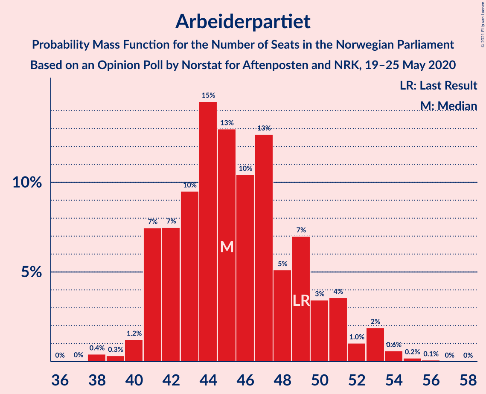

| Number of Seats | Probability | Accumulated | Special Marks |
|:---------------:|:-----------:|:-----------:|:-------------:|
| 38 | 0.4% | 100% |  |
| 39 | 0.3% | 99.5% |  |
| 40 | 1.2% | 99.2% |  |
| 41 | 7% | 98% |  |
| 42 | 7% | 91% |  |
| 43 | 10% | 83% |  |
| 44 | 15% | 74% |  |
| 45 | 13% | 59% | Median |
| 46 | 10% | 46% |  |
| 47 | 13% | 36% |  |
| 48 | 5% | 23% |  |
| 49 | 7% | 18% | Last Result |
| 50 | 3% | 11% |  |
| 51 | 4% | 7% |  |
| 52 | 1.0% | 4% |  |
| 53 | 2% | 3% |  |
| 54 | 0.6% | 0.9% |  |
| 55 | 0.2% | 0.3% |  |
| 56 | 0.1% | 0.1% |  |
| 57 | 0% | 0% |  |

### Senterpartiet

*For a full overview of the results for this party, see the [Senterpartiet](party-senterpartiet.html) page.*

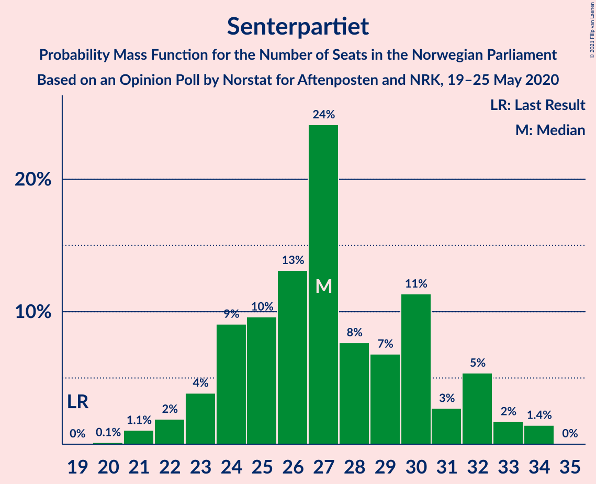

| Number of Seats | Probability | Accumulated | Special Marks |
|:---------------:|:-----------:|:-----------:|:-------------:|
| 19 | 0% | 100% | Last Result |
| 20 | 0.1% | 100% |  |
| 21 | 1.1% | 99.8% |  |
| 22 | 2% | 98.8% |  |
| 23 | 4% | 97% |  |
| 24 | 9% | 93% |  |
| 25 | 10% | 84% |  |
| 26 | 13% | 74% |  |
| 27 | 24% | 61% | Median |
| 28 | 8% | 37% |  |
| 29 | 7% | 29% |  |
| 30 | 11% | 23% |  |
| 31 | 3% | 11% |  |
| 32 | 5% | 9% |  |
| 33 | 2% | 3% |  |
| 34 | 1.4% | 1.5% |  |
| 35 | 0% | 0% |  |

### Fremskrittspartiet

*For a full overview of the results for this party, see the [Fremskrittspartiet](party-fremskrittspartiet.html) page.*

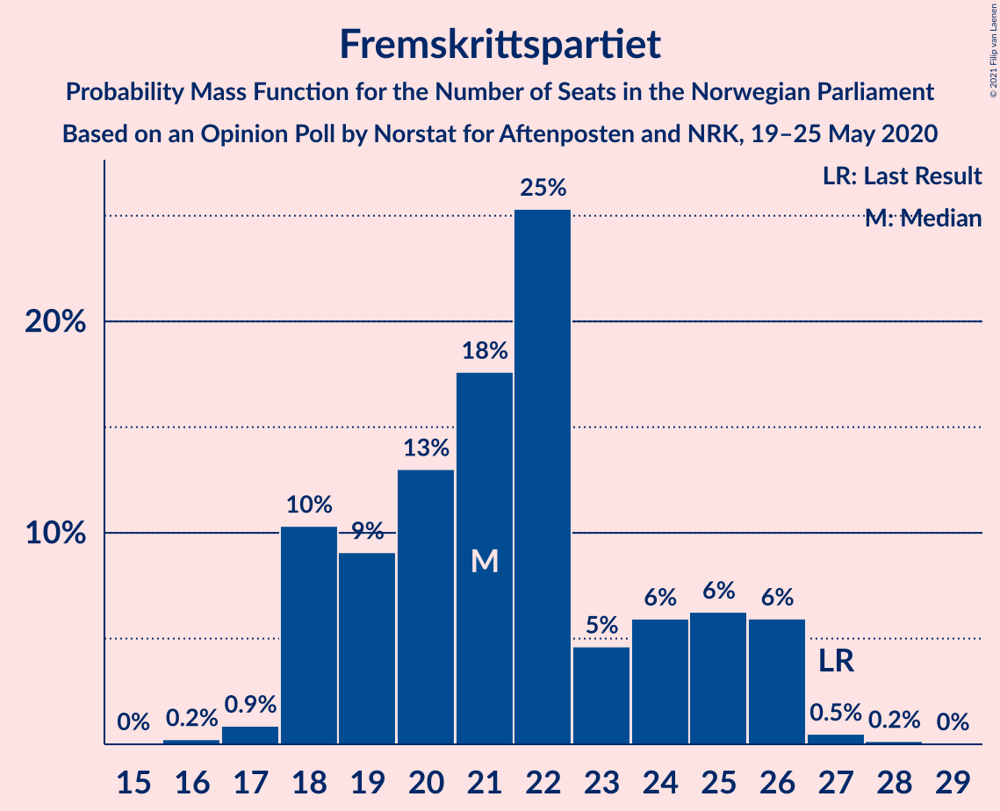

| Number of Seats | Probability | Accumulated | Special Marks |
|:---------------:|:-----------:|:-----------:|:-------------:|
| 15 | 0% | 100% |  |
| 16 | 0.2% | 99.9% |  |
| 17 | 0.9% | 99.7% |  |
| 18 | 10% | 98.8% |  |
| 19 | 9% | 88% |  |
| 20 | 13% | 79% |  |
| 21 | 18% | 66% | Median |
| 22 | 25% | 49% |  |
| 23 | 5% | 23% |  |
| 24 | 6% | 19% |  |
| 25 | 6% | 13% |  |
| 26 | 6% | 7% |  |
| 27 | 0.5% | 0.7% | Last Result |
| 28 | 0.2% | 0.2% |  |
| 29 | 0% | 0% |  |

### Sosialistisk Venstreparti

*For a full overview of the results for this party, see the [Sosialistisk Venstreparti](party-sosialistiskvenstreparti.html) page.*

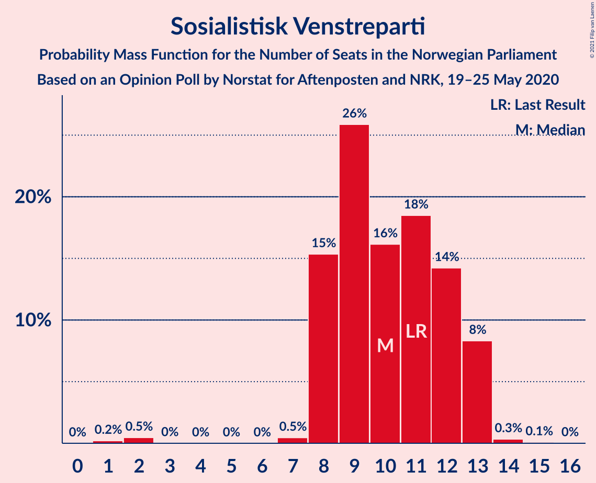

| Number of Seats | Probability | Accumulated | Special Marks |
|:---------------:|:-----------:|:-----------:|:-------------:|
| 1 | 0.2% | 100% |  |
| 2 | 0.5% | 99.8% |  |
| 3 | 0% | 99.3% |  |
| 4 | 0% | 99.3% |  |
| 5 | 0% | 99.3% |  |
| 6 | 0% | 99.3% |  |
| 7 | 0.5% | 99.3% |  |
| 8 | 15% | 98.9% |  |
| 9 | 26% | 84% |  |
| 10 | 16% | 58% | Median |
| 11 | 18% | 41% | Last Result |
| 12 | 14% | 23% |  |
| 13 | 8% | 9% |  |
| 14 | 0.3% | 0.4% |  |
| 15 | 0.1% | 0.1% |  |
| 16 | 0% | 0% |  |

### Miljøpartiet De Grønne

*For a full overview of the results for this party, see the [Miljøpartiet De Grønne](party-miljøpartietdegrønne.html) page.*

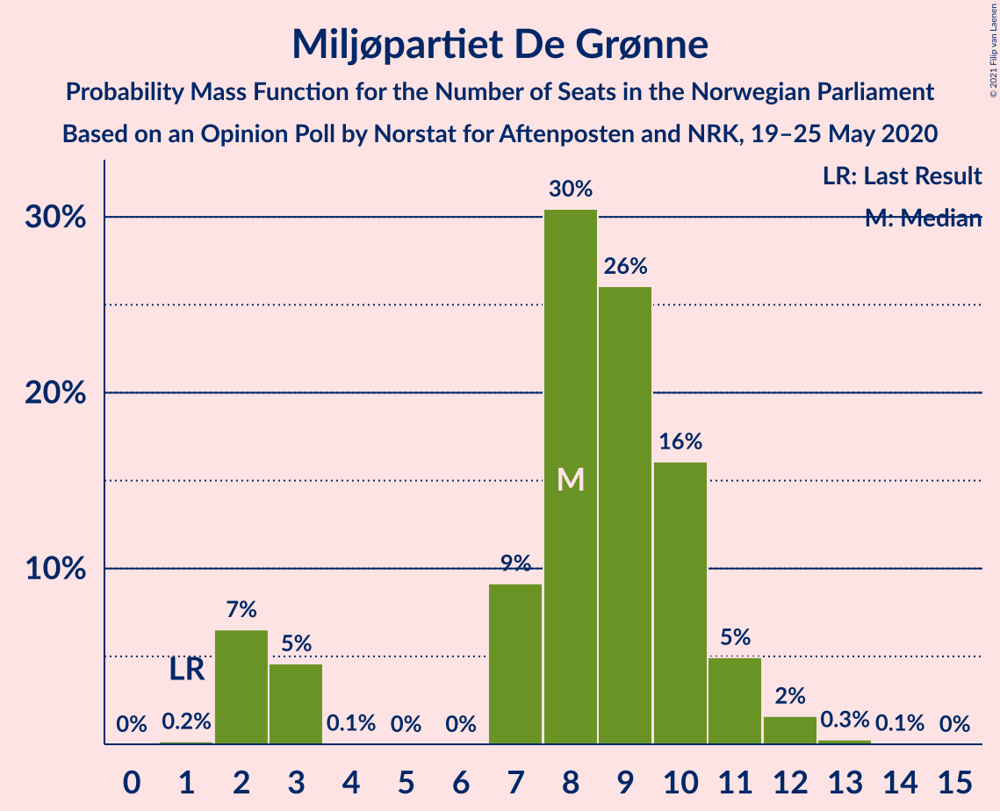

| Number of Seats | Probability | Accumulated | Special Marks |
|:---------------:|:-----------:|:-----------:|:-------------:|
| 1 | 0.2% | 100% | Last Result |
| 2 | 7% | 99.8% |  |
| 3 | 5% | 93% |  |
| 4 | 0.1% | 89% |  |
| 5 | 0% | 89% |  |
| 6 | 0% | 89% |  |
| 7 | 9% | 89% |  |
| 8 | 30% | 79% | Median |
| 9 | 26% | 49% |  |
| 10 | 16% | 23% |  |
| 11 | 5% | 7% |  |
| 12 | 2% | 2% |  |
| 13 | 0.3% | 0.3% |  |
| 14 | 0.1% | 0.1% |  |
| 15 | 0% | 0% |  |

### Rødt

*For a full overview of the results for this party, see the [Rødt](party-rødt.html) page.*

| Number of Seats | Probability | Accumulated | Special Marks |
|:---------------:|:-----------:|:-----------:|:-------------:|
| 1 | 0.1% | 100% | Last Result |
| 2 | 16% | 99.9% |  |
| 3 | 0% | 84% |  |
| 4 | 0% | 84% |  |
| 5 | 0% | 84% |  |
| 6 | 0% | 84% |  |
| 7 | 17% | 84% |  |
| 8 | 32% | 67% | Median |
| 9 | 18% | 34% |  |
| 10 | 12% | 17% |  |
| 11 | 4% | 5% |  |
| 12 | 0.6% | 0.7% |  |
| 13 | 0.1% | 0.1% |  |
| 14 | 0% | 0% |  |

### Kristelig Folkeparti

*For a full overview of the results for this party, see the [Kristelig Folkeparti](party-kristeligfolkeparti.html) page.*

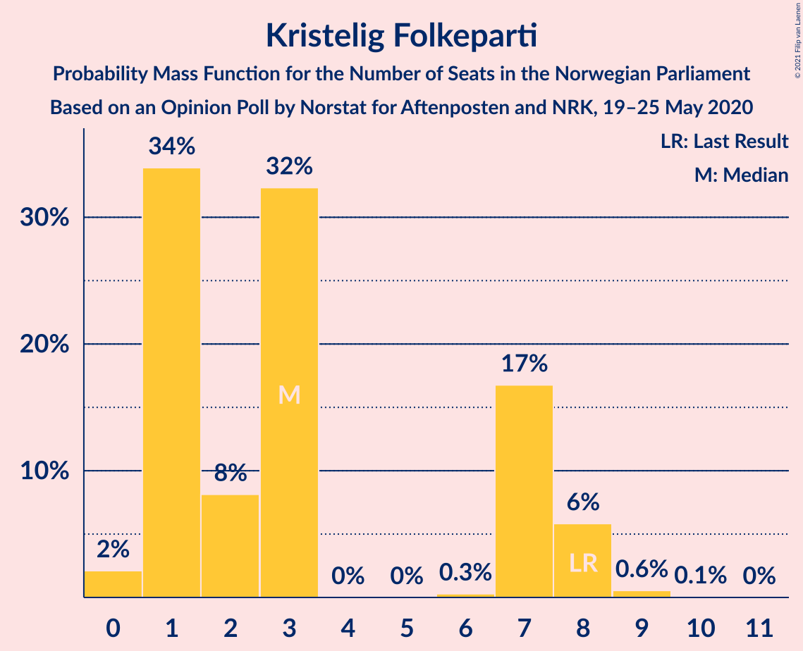

| Number of Seats | Probability | Accumulated | Special Marks |
|:---------------:|:-----------:|:-----------:|:-------------:|
| 0 | 2% | 100% |  |
| 1 | 34% | 98% |  |
| 2 | 8% | 64% |  |
| 3 | 32% | 56% | Median |
| 4 | 0% | 23% |  |
| 5 | 0% | 23% |  |
| 6 | 0.3% | 23% |  |
| 7 | 17% | 23% |  |
| 8 | 6% | 6% | Last Result |
| 9 | 0.6% | 0.6% |  |
| 10 | 0.1% | 0.1% |  |
| 11 | 0% | 0% |  |

### Venstre

*For a full overview of the results for this party, see the [Venstre](party-venstre.html) page.*

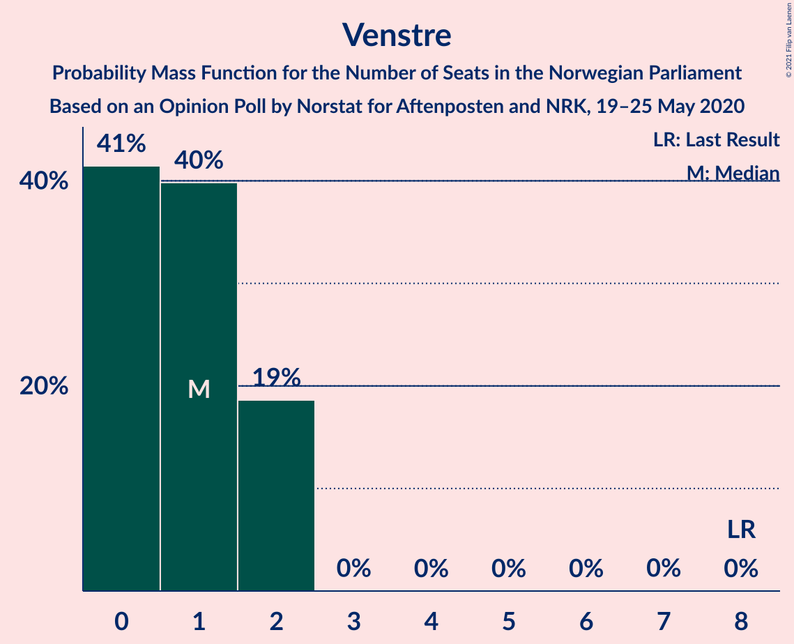

| Number of Seats | Probability | Accumulated | Special Marks |
|:---------------:|:-----------:|:-----------:|:-------------:|
| 0 | 41% | 100% |  |
| 1 | 40% | 59% | Median |
| 2 | 19% | 19% |  |
| 3 | 0% | 0.1% |  |
| 4 | 0% | 0.1% |  |
| 5 | 0% | 0.1% |  |
| 6 | 0% | 0.1% |  |
| 7 | 0% | 0% |  |
| 8 | 0% | 0% | Last Result |

## Coalitions

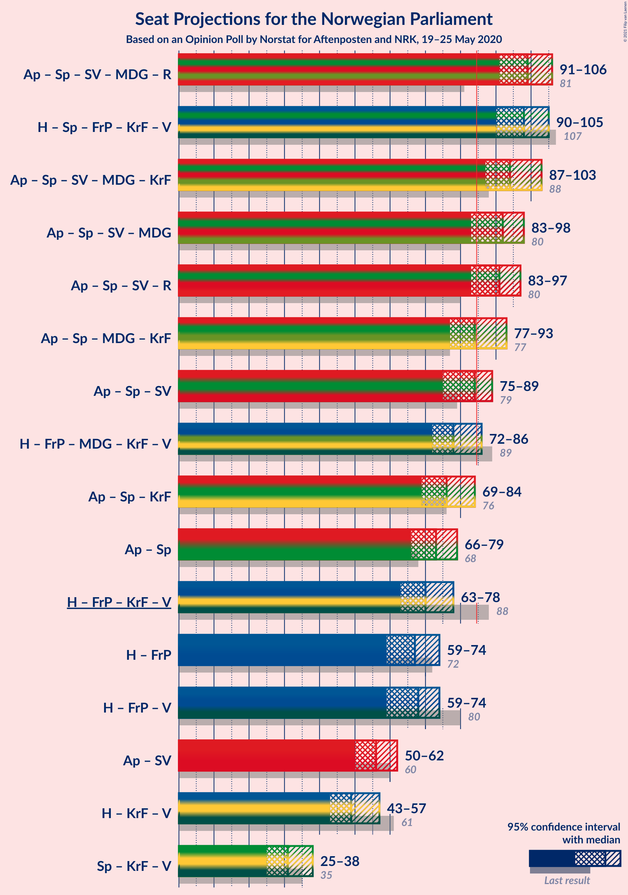

### Confidence Intervals

| Coalition | Last Result | Median | Majority? | 80% Confidence Interval | 90% Confidence Interval | 95% Confidence Interval | 99% Confidence Interval |
|:---------:|:-----------:|:------:|:---------:|:-----------------------:|:-----------------------:|:-----------------------:|:-----------------------:|
| Arbeiderpartiet – Senterpartiet – Sosialistisk Venstreparti – Miljøpartiet De Grønne – Rødt | 81 | 99 | 100% | 93–104 | 92–105 | 91–106 | 90–107 |
| Høyre – Senterpartiet – Fremskrittspartiet – Kristelig Folkeparti – Venstre | 107 | 98 | 100% | 93–103 | 91–104 | 90–105 | 88–107 |
| Arbeiderpartiet – Senterpartiet – Sosialistisk Venstreparti – Miljøpartiet De Grønne – Kristelig Folkeparti | 88 | 94 | 99.7% | 89–99 | 88–100 | 87–103 | 85–103 |
| Arbeiderpartiet – Senterpartiet – Sosialistisk Venstreparti – Miljøpartiet De Grønne | 80 | 92 | 93% | 85–96 | 84–97 | 83–98 | 82–100 |
| Arbeiderpartiet – Senterpartiet – Sosialistisk Venstreparti – Rødt | 80 | 91 | 94% | 85–96 | 84–96 | 83–97 | 81–99 |
| Arbeiderpartiet – Senterpartiet – Miljøpartiet De Grønne – Kristelig Folkeparti | 77 | 84 | 44% | 78–90 | 78–91 | 77–93 | 75–94 |
| Arbeiderpartiet – Senterpartiet – Sosialistisk Venstreparti | 79 | 84 | 28% | 78–87 | 77–88 | 75–89 | 74–91 |
| Høyre – Fremskrittspartiet – Miljøpartiet De Grønne – Kristelig Folkeparti – Venstre | 89 | 78 | 6% | 73–84 | 73–85 | 72–86 | 70–88 |
| Arbeiderpartiet – Senterpartiet – Kristelig Folkeparti | 76 | 76 | 2% | 70–81 | 70–83 | 69–84 | 67–86 |
| Arbeiderpartiet – Senterpartiet | 68 | 73 | 0% | 68–77 | 67–78 | 66–79 | 64–81 |
| Høyre – Fremskrittspartiet – Kristelig Folkeparti – Venstre | 88 | 70 | 0% | 65–76 | 64–77 | 63–78 | 62–79 |
| Høyre – Fremskrittspartiet | 72 | 67 | 0% | 62–72 | 61–73 | 59–74 | 57–75 |
| Høyre – Fremskrittspartiet – Venstre | 80 | 68 | 0% | 63–73 | 61–74 | 59–74 | 58–76 |
| Arbeiderpartiet – Sosialistisk Venstreparti | 60 | 56 | 0% | 52–60 | 51–61 | 50–62 | 48–65 |
| Høyre – Kristelig Folkeparti – Venstre | 61 | 49 | 0% | 45–54 | 44–56 | 43–57 | 41–58 |
| Senterpartiet – Kristelig Folkeparti – Venstre | 35 | 31 | 0% | 27–36 | 26–37 | 25–38 | 24–39 |

### Arbeiderpartiet – Senterpartiet – Sosialistisk Venstreparti – Miljøpartiet De Grønne – Rødt

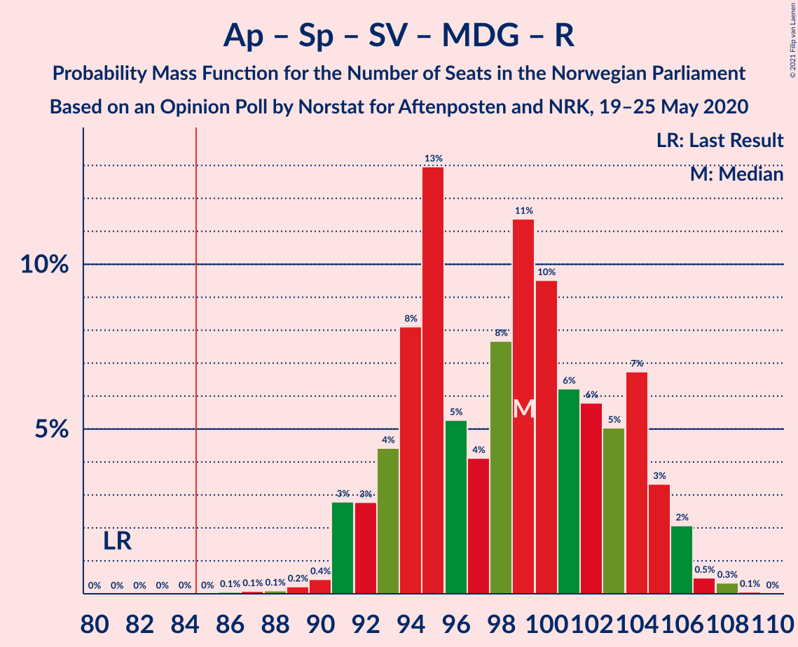

| Number of Seats | Probability | Accumulated | Special Marks |
|:---------------:|:-----------:|:-----------:|:-------------:|
| 81 | 0% | 100% | Last Result |
| 82 | 0% | 100% |  |
| 83 | 0% | 100% |  |
| 84 | 0% | 100% |  |
| 85 | 0% | 100% | Majority |
| 86 | 0.1% | 100% |  |
| 87 | 0.1% | 99.9% |  |
| 88 | 0.1% | 99.8% |  |
| 89 | 0.2% | 99.8% |  |
| 90 | 0.4% | 99.5% |  |
| 91 | 3% | 99.1% |  |
| 92 | 3% | 96% |  |
| 93 | 4% | 94% |  |
| 94 | 8% | 89% |  |
| 95 | 13% | 81% |  |
| 96 | 5% | 68% |  |
| 97 | 4% | 63% |  |
| 98 | 8% | 59% | Median |
| 99 | 11% | 51% |  |
| 100 | 10% | 40% |  |
| 101 | 6% | 30% |  |
| 102 | 6% | 24% |  |
| 103 | 5% | 18% |  |
| 104 | 7% | 13% |  |
| 105 | 3% | 6% |  |
| 106 | 2% | 3% |  |
| 107 | 0.5% | 0.9% |  |
| 108 | 0.3% | 0.4% |  |
| 109 | 0.1% | 0.1% |  |
| 110 | 0% | 0% |  |

### Høyre – Senterpartiet – Fremskrittspartiet – Kristelig Folkeparti – Venstre

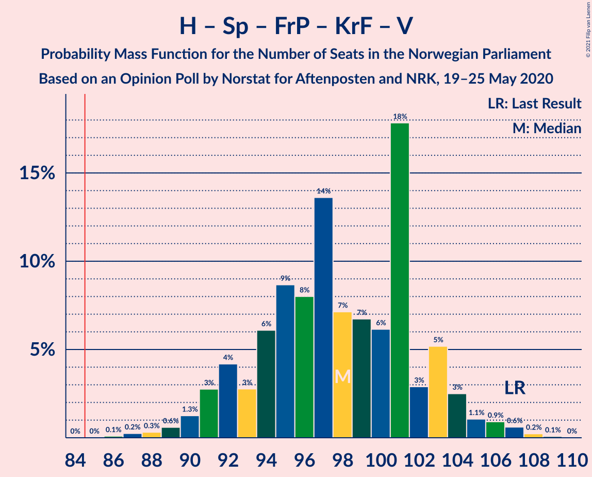

| Number of Seats | Probability | Accumulated | Special Marks |
|:---------------:|:-----------:|:-----------:|:-------------:|
| 86 | 0.1% | 100% |  |
| 87 | 0.2% | 99.9% |  |
| 88 | 0.3% | 99.6% |  |
| 89 | 0.6% | 99.3% |  |
| 90 | 1.3% | 98.7% |  |
| 91 | 3% | 97% |  |
| 92 | 4% | 95% |  |
| 93 | 3% | 91% |  |
| 94 | 6% | 88% |  |
| 95 | 9% | 82% |  |
| 96 | 8% | 73% |  |
| 97 | 14% | 65% | Median |
| 98 | 7% | 51% |  |
| 99 | 7% | 44% |  |
| 100 | 6% | 37% |  |
| 101 | 18% | 31% |  |
| 102 | 3% | 14% |  |
| 103 | 5% | 11% |  |
| 104 | 3% | 5% |  |
| 105 | 1.1% | 3% |  |
| 106 | 0.9% | 2% |  |
| 107 | 0.6% | 1.0% | Last Result |
| 108 | 0.2% | 0.3% |  |
| 109 | 0.1% | 0.1% |  |
| 110 | 0% | 0% |  |

### Arbeiderpartiet – Senterpartiet – Sosialistisk Venstreparti – Miljøpartiet De Grønne – Kristelig Folkeparti

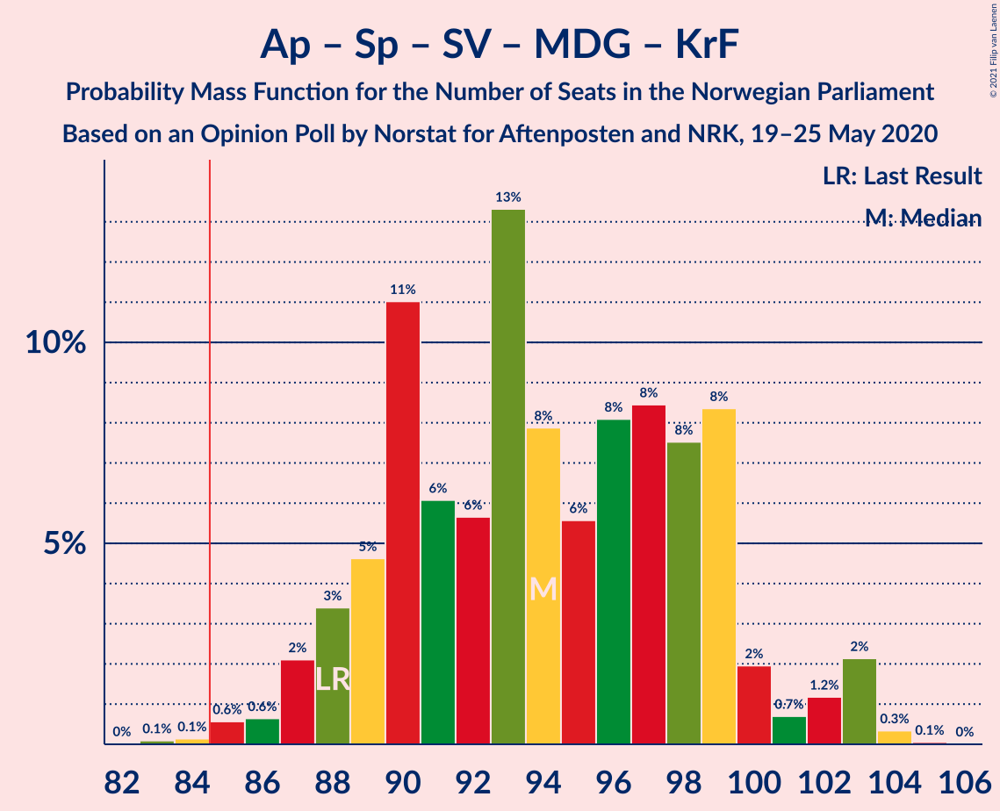

| Number of Seats | Probability | Accumulated | Special Marks |
|:---------------:|:-----------:|:-----------:|:-------------:|
| 83 | 0.1% | 100% |  |
| 84 | 0.1% | 99.9% |  |
| 85 | 0.6% | 99.7% | Majority |
| 86 | 0.6% | 99.2% |  |
| 87 | 2% | 98.5% |  |
| 88 | 3% | 96% | Last Result |
| 89 | 5% | 93% |  |
| 90 | 11% | 88% |  |
| 91 | 6% | 77% |  |
| 92 | 6% | 71% |  |
| 93 | 13% | 66% | Median |
| 94 | 8% | 52% |  |
| 95 | 6% | 44% |  |
| 96 | 8% | 39% |  |
| 97 | 8% | 31% |  |
| 98 | 8% | 22% |  |
| 99 | 8% | 15% |  |
| 100 | 2% | 6% |  |
| 101 | 0.7% | 4% |  |
| 102 | 1.2% | 4% |  |
| 103 | 2% | 3% |  |
| 104 | 0.3% | 0.4% |  |
| 105 | 0.1% | 0.1% |  |
| 106 | 0% | 0% |  |

### Arbeiderpartiet – Senterpartiet – Sosialistisk Venstreparti – Miljøpartiet De Grønne

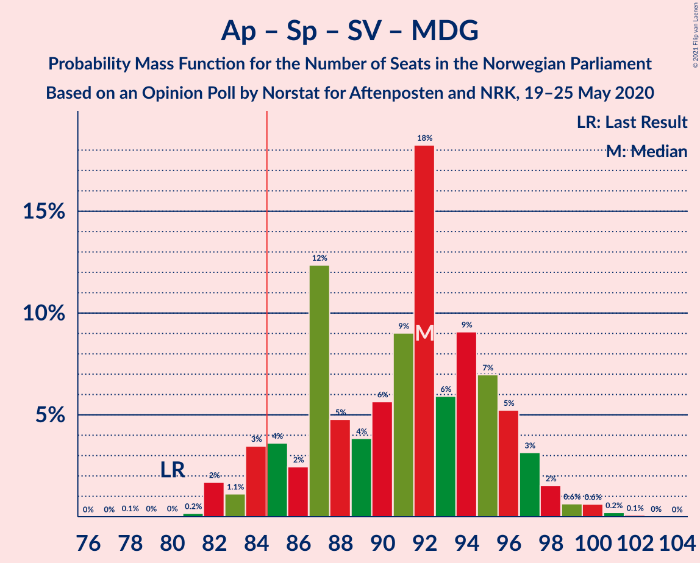

| Number of Seats | Probability | Accumulated | Special Marks |
|:---------------:|:-----------:|:-----------:|:-------------:|
| 78 | 0.1% | 100% |  |
| 79 | 0% | 99.9% |  |
| 80 | 0% | 99.9% | Last Result |
| 81 | 0.2% | 99.8% |  |
| 82 | 2% | 99.7% |  |
| 83 | 1.1% | 98% |  |
| 84 | 3% | 97% |  |
| 85 | 4% | 93% | Majority |
| 86 | 2% | 90% |  |
| 87 | 12% | 87% |  |
| 88 | 5% | 75% |  |
| 89 | 4% | 70% |  |
| 90 | 6% | 66% | Median |
| 91 | 9% | 61% |  |
| 92 | 18% | 52% |  |
| 93 | 6% | 33% |  |
| 94 | 9% | 28% |  |
| 95 | 7% | 18% |  |
| 96 | 5% | 11% |  |
| 97 | 3% | 6% |  |
| 98 | 2% | 3% |  |
| 99 | 0.6% | 2% |  |
| 100 | 0.6% | 0.9% |  |
| 101 | 0.2% | 0.3% |  |
| 102 | 0.1% | 0.1% |  |
| 103 | 0% | 0% |  |

### Arbeiderpartiet – Senterpartiet – Sosialistisk Venstreparti – Rødt

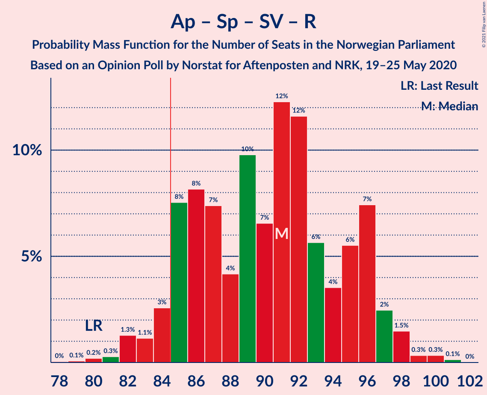

| Number of Seats | Probability | Accumulated | Special Marks |
|:---------------:|:-----------:|:-----------:|:-------------:|
| 78 | 0% | 100% |  |
| 79 | 0.1% | 99.9% |  |
| 80 | 0.2% | 99.9% | Last Result |
| 81 | 0.3% | 99.7% |  |
| 82 | 1.3% | 99.4% |  |
| 83 | 1.1% | 98% |  |
| 84 | 3% | 97% |  |
| 85 | 8% | 94% | Majority |
| 86 | 8% | 87% |  |
| 87 | 7% | 79% |  |
| 88 | 4% | 71% |  |
| 89 | 10% | 67% |  |
| 90 | 7% | 57% | Median |
| 91 | 12% | 51% |  |
| 92 | 12% | 38% |  |
| 93 | 6% | 27% |  |
| 94 | 4% | 21% |  |
| 95 | 6% | 18% |  |
| 96 | 7% | 12% |  |
| 97 | 2% | 5% |  |
| 98 | 1.5% | 2% |  |
| 99 | 0.3% | 0.8% |  |
| 100 | 0.3% | 0.5% |  |
| 101 | 0.1% | 0.2% |  |
| 102 | 0% | 0% |  |

### Arbeiderpartiet – Senterpartiet – Miljøpartiet De Grønne – Kristelig Folkeparti

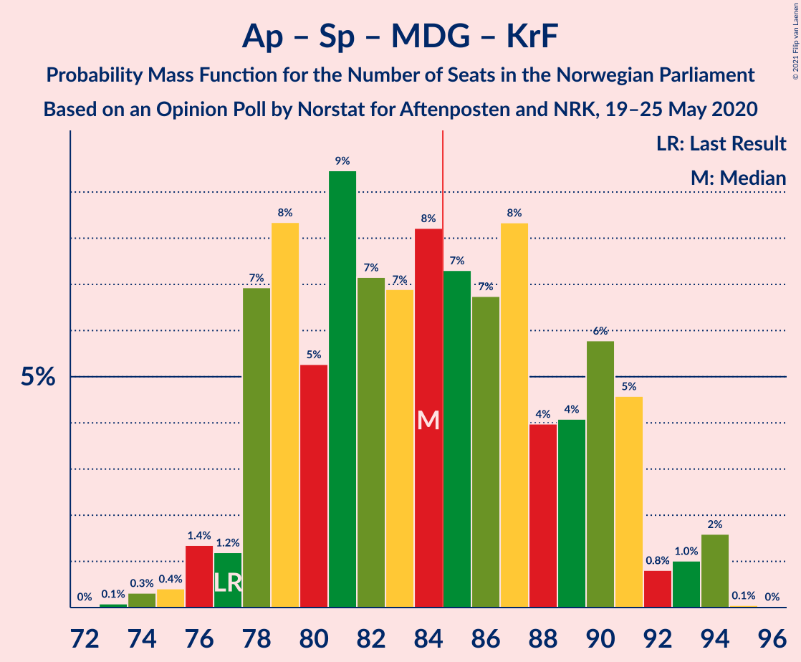

| Number of Seats | Probability | Accumulated | Special Marks |
|:---------------:|:-----------:|:-----------:|:-------------:|
| 73 | 0.1% | 100% |  |
| 74 | 0.3% | 99.9% |  |
| 75 | 0.4% | 99.6% |  |
| 76 | 1.4% | 99.2% |  |
| 77 | 1.2% | 98% | Last Result |
| 78 | 7% | 97% |  |
| 79 | 8% | 90% |  |
| 80 | 5% | 81% |  |
| 81 | 9% | 76% |  |
| 82 | 7% | 67% |  |
| 83 | 7% | 59% | Median |
| 84 | 8% | 53% |  |
| 85 | 7% | 44% | Majority |
| 86 | 7% | 37% |  |
| 87 | 8% | 30% |  |
| 88 | 4% | 22% |  |
| 89 | 4% | 18% |  |
| 90 | 6% | 14% |  |
| 91 | 5% | 8% |  |
| 92 | 0.8% | 4% |  |
| 93 | 1.0% | 3% |  |
| 94 | 2% | 2% |  |
| 95 | 0.1% | 0.1% |  |
| 96 | 0% | 0% |  |

### Arbeiderpartiet – Senterpartiet – Sosialistisk Venstreparti

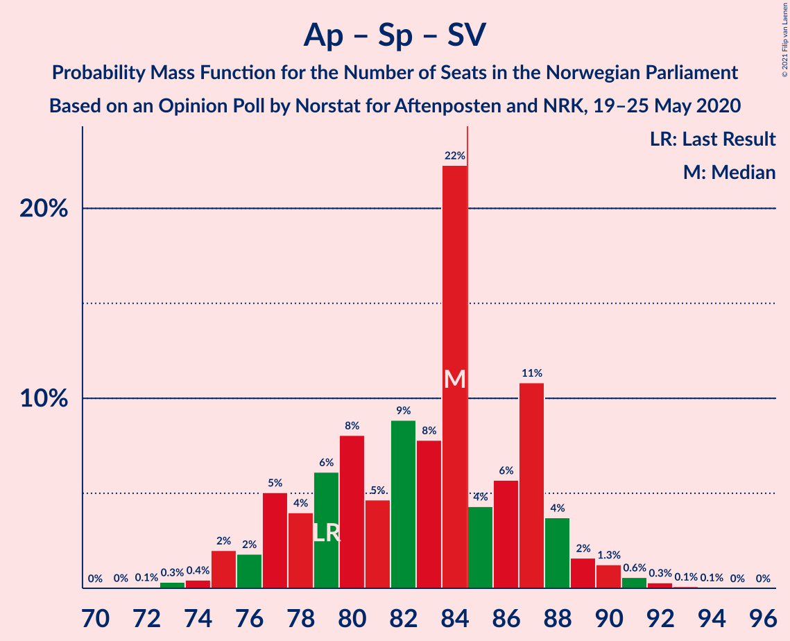

| Number of Seats | Probability | Accumulated | Special Marks |
|:---------------:|:-----------:|:-----------:|:-------------:|
| 71 | 0% | 100% |  |
| 72 | 0.1% | 99.9% |  |
| 73 | 0.3% | 99.9% |  |
| 74 | 0.4% | 99.5% |  |
| 75 | 2% | 99.1% |  |
| 76 | 2% | 97% |  |
| 77 | 5% | 95% |  |
| 78 | 4% | 90% |  |
| 79 | 6% | 86% | Last Result |
| 80 | 8% | 80% |  |
| 81 | 5% | 72% |  |
| 82 | 9% | 67% | Median |
| 83 | 8% | 59% |  |
| 84 | 22% | 51% |  |
| 85 | 4% | 28% | Majority |
| 86 | 6% | 24% |  |
| 87 | 11% | 18% |  |
| 88 | 4% | 8% |  |
| 89 | 2% | 4% |  |
| 90 | 1.3% | 2% |  |
| 91 | 0.6% | 1.1% |  |
| 92 | 0.3% | 0.5% |  |
| 93 | 0.1% | 0.2% |  |
| 94 | 0.1% | 0.1% |  |
| 95 | 0% | 0% |  |

### Høyre – Fremskrittspartiet – Miljøpartiet De Grønne – Kristelig Folkeparti – Venstre

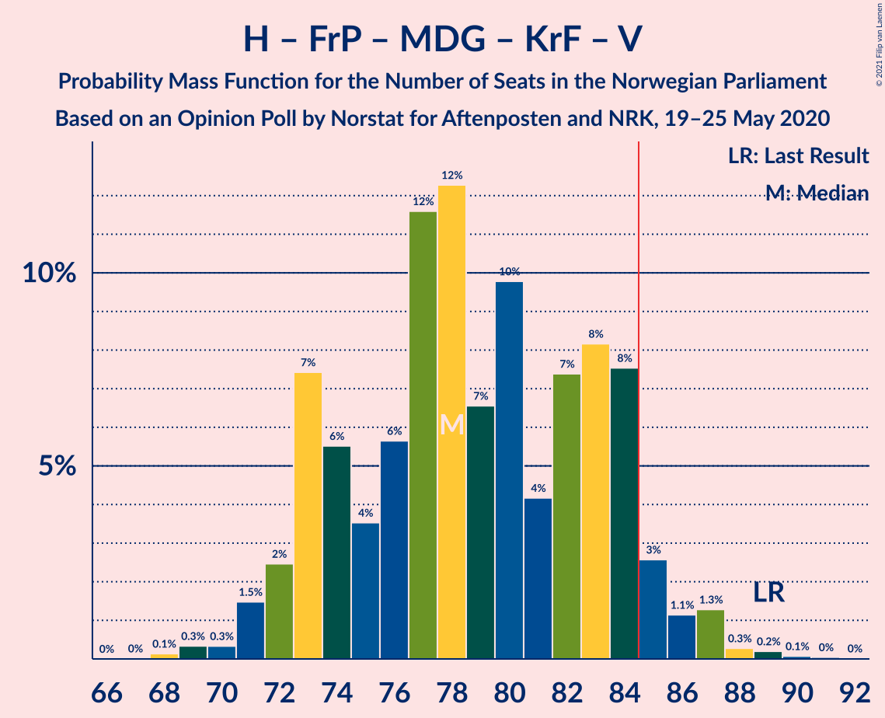

| Number of Seats | Probability | Accumulated | Special Marks |
|:---------------:|:-----------:|:-----------:|:-------------:|
| 68 | 0.1% | 100% |  |
| 69 | 0.3% | 99.8% |  |
| 70 | 0.3% | 99.5% |  |
| 71 | 1.5% | 99.2% |  |
| 72 | 2% | 98% |  |
| 73 | 7% | 95% |  |
| 74 | 6% | 88% |  |
| 75 | 4% | 82% |  |
| 76 | 6% | 79% |  |
| 77 | 12% | 73% |  |
| 78 | 12% | 62% | Median |
| 79 | 7% | 49% |  |
| 80 | 10% | 43% |  |
| 81 | 4% | 33% |  |
| 82 | 7% | 29% |  |
| 83 | 8% | 21% |  |
| 84 | 8% | 13% |  |
| 85 | 3% | 6% | Majority |
| 86 | 1.1% | 3% |  |
| 87 | 1.3% | 2% |  |
| 88 | 0.3% | 0.6% |  |
| 89 | 0.2% | 0.3% | Last Result |
| 90 | 0.1% | 0.1% |  |
| 91 | 0% | 0.1% |  |
| 92 | 0% | 0% |  |

### Arbeiderpartiet – Senterpartiet – Kristelig Folkeparti

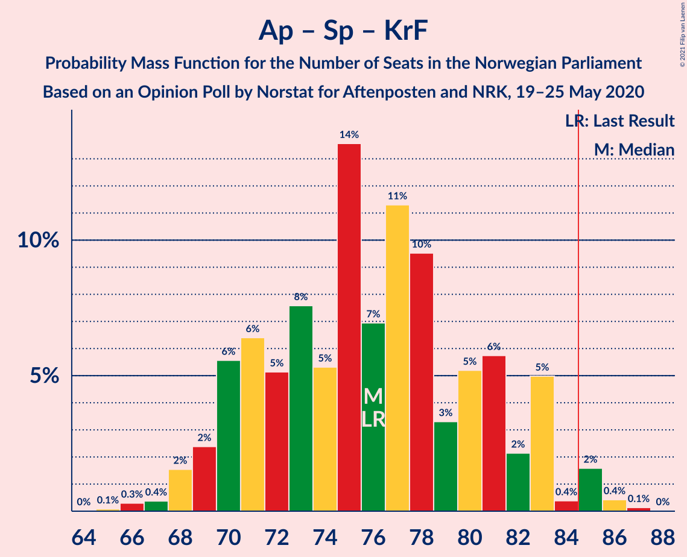

| Number of Seats | Probability | Accumulated | Special Marks |
|:---------------:|:-----------:|:-----------:|:-------------:|
| 65 | 0.1% | 100% |  |
| 66 | 0.3% | 99.9% |  |
| 67 | 0.4% | 99.6% |  |
| 68 | 2% | 99.2% |  |
| 69 | 2% | 98% |  |
| 70 | 6% | 95% |  |
| 71 | 6% | 90% |  |
| 72 | 5% | 83% |  |
| 73 | 8% | 78% |  |
| 74 | 5% | 71% |  |
| 75 | 14% | 65% | Median |
| 76 | 7% | 52% | Last Result |
| 77 | 11% | 45% |  |
| 78 | 10% | 33% |  |
| 79 | 3% | 24% |  |
| 80 | 5% | 21% |  |
| 81 | 6% | 15% |  |
| 82 | 2% | 10% |  |
| 83 | 5% | 8% |  |
| 84 | 0.4% | 3% |  |
| 85 | 2% | 2% | Majority |
| 86 | 0.4% | 0.6% |  |
| 87 | 0.1% | 0.2% |  |
| 88 | 0% | 0% |  |

### Arbeiderpartiet – Senterpartiet

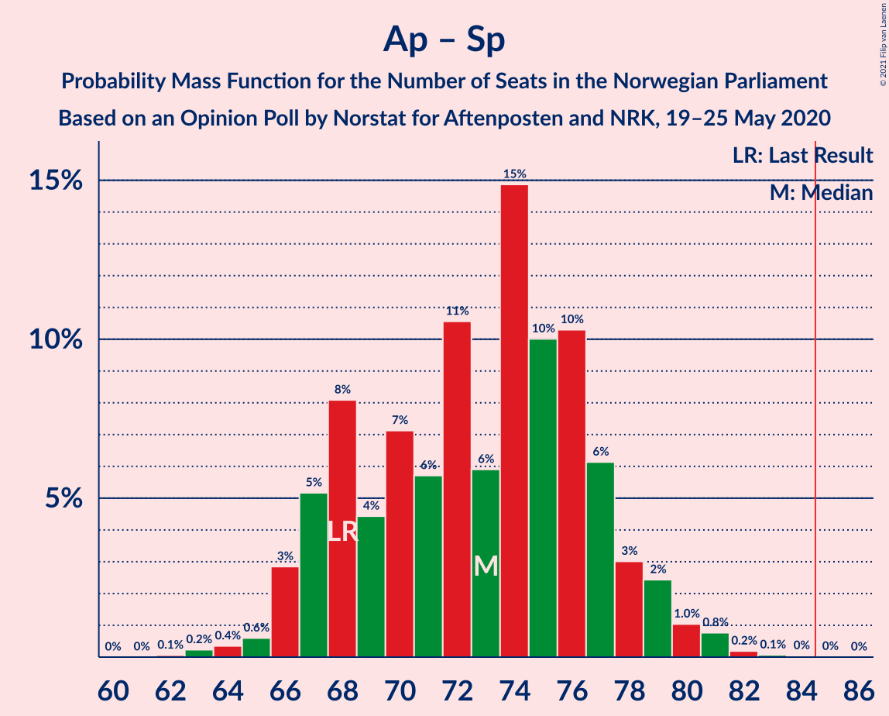

| Number of Seats | Probability | Accumulated | Special Marks |
|:---------------:|:-----------:|:-----------:|:-------------:|
| 62 | 0.1% | 100% |  |
| 63 | 0.2% | 99.9% |  |
| 64 | 0.4% | 99.7% |  |
| 65 | 0.6% | 99.3% |  |
| 66 | 3% | 98.7% |  |
| 67 | 5% | 96% |  |
| 68 | 8% | 91% | Last Result |
| 69 | 4% | 83% |  |
| 70 | 7% | 78% |  |
| 71 | 6% | 71% |  |
| 72 | 11% | 65% | Median |
| 73 | 6% | 55% |  |
| 74 | 15% | 49% |  |
| 75 | 10% | 34% |  |
| 76 | 10% | 24% |  |
| 77 | 6% | 14% |  |
| 78 | 3% | 8% |  |
| 79 | 2% | 5% |  |
| 80 | 1.0% | 2% |  |
| 81 | 0.8% | 1.1% |  |
| 82 | 0.2% | 0.3% |  |
| 83 | 0.1% | 0.1% |  |
| 84 | 0% | 0.1% |  |
| 85 | 0% | 0% | Majority |

### Høyre – Fremskrittspartiet – Kristelig Folkeparti – Venstre

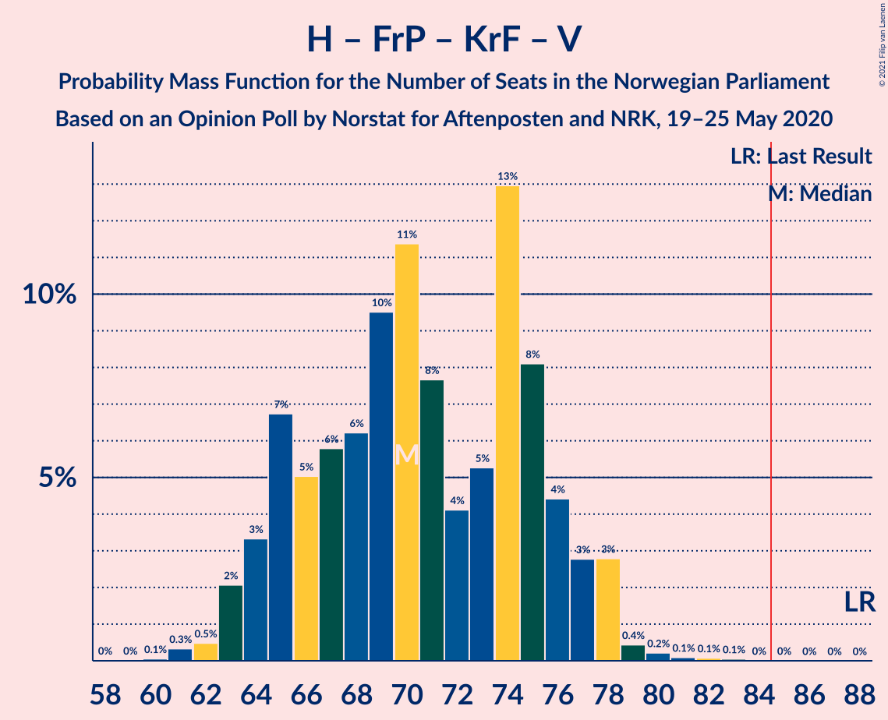

| Number of Seats | Probability | Accumulated | Special Marks |
|:---------------:|:-----------:|:-----------:|:-------------:|
| 60 | 0.1% | 100% |  |
| 61 | 0.3% | 99.9% |  |
| 62 | 0.5% | 99.6% |  |
| 63 | 2% | 99.1% |  |
| 64 | 3% | 97% |  |
| 65 | 7% | 94% |  |
| 66 | 5% | 87% |  |
| 67 | 6% | 82% |  |
| 68 | 6% | 76% |  |
| 69 | 10% | 70% |  |
| 70 | 11% | 60% | Median |
| 71 | 8% | 49% |  |
| 72 | 4% | 41% |  |
| 73 | 5% | 37% |  |
| 74 | 13% | 32% |  |
| 75 | 8% | 19% |  |
| 76 | 4% | 11% |  |
| 77 | 3% | 6% |  |
| 78 | 3% | 4% |  |
| 79 | 0.4% | 0.9% |  |
| 80 | 0.2% | 0.5% |  |
| 81 | 0.1% | 0.2% |  |
| 82 | 0.1% | 0.2% |  |
| 83 | 0.1% | 0.1% |  |
| 84 | 0% | 0% |  |
| 85 | 0% | 0% | Majority |
| 86 | 0% | 0% |  |
| 87 | 0% | 0% |  |
| 88 | 0% | 0% | Last Result |

### Høyre – Fremskrittspartiet

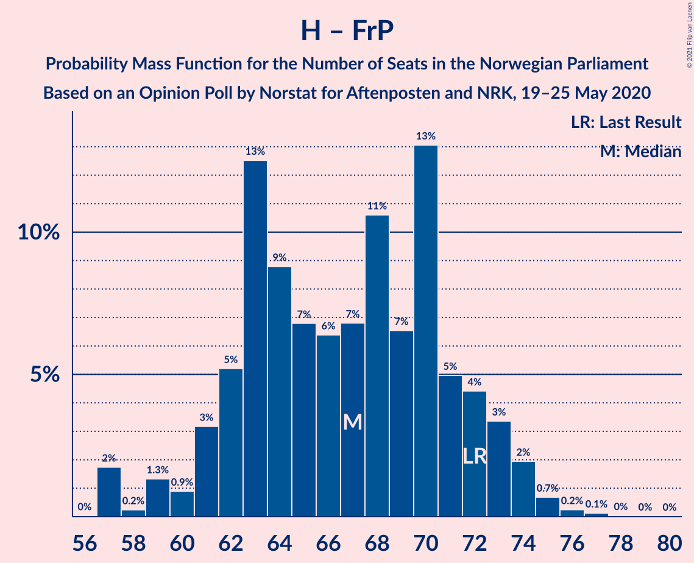

| Number of Seats | Probability | Accumulated | Special Marks |
|:---------------:|:-----------:|:-----------:|:-------------:|
| 57 | 2% | 100% |  |
| 58 | 0.2% | 98% |  |
| 59 | 1.3% | 98% |  |
| 60 | 0.9% | 97% |  |
| 61 | 3% | 96% |  |
| 62 | 5% | 93% |  |
| 63 | 13% | 87% |  |
| 64 | 9% | 75% |  |
| 65 | 7% | 66% |  |
| 66 | 6% | 59% | Median |
| 67 | 7% | 53% |  |
| 68 | 11% | 46% |  |
| 69 | 7% | 35% |  |
| 70 | 13% | 29% |  |
| 71 | 5% | 16% |  |
| 72 | 4% | 11% | Last Result |
| 73 | 3% | 6% |  |
| 74 | 2% | 3% |  |
| 75 | 0.7% | 1.1% |  |
| 76 | 0.2% | 0.5% |  |
| 77 | 0.1% | 0.2% |  |
| 78 | 0% | 0.1% |  |
| 79 | 0% | 0% |  |

### Høyre – Fremskrittspartiet – Venstre

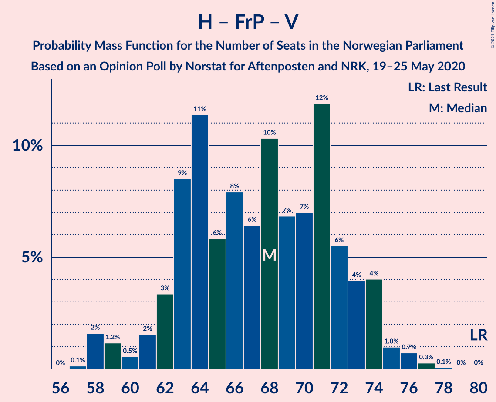

| Number of Seats | Probability | Accumulated | Special Marks |
|:---------------:|:-----------:|:-----------:|:-------------:|
| 57 | 0.1% | 100% |  |
| 58 | 2% | 99.8% |  |
| 59 | 1.2% | 98% |  |
| 60 | 0.5% | 97% |  |
| 61 | 2% | 97% |  |
| 62 | 3% | 95% |  |
| 63 | 9% | 92% |  |
| 64 | 11% | 83% |  |
| 65 | 6% | 72% |  |
| 66 | 8% | 66% |  |
| 67 | 6% | 58% | Median |
| 68 | 10% | 52% |  |
| 69 | 7% | 41% |  |
| 70 | 7% | 34% |  |
| 71 | 12% | 27% |  |
| 72 | 6% | 16% |  |
| 73 | 4% | 10% |  |
| 74 | 4% | 6% |  |
| 75 | 1.0% | 2% |  |
| 76 | 0.7% | 1.1% |  |
| 77 | 0.3% | 0.4% |  |
| 78 | 0.1% | 0.1% |  |
| 79 | 0% | 0.1% |  |
| 80 | 0% | 0% | Last Result |

### Arbeiderpartiet – Sosialistisk Venstreparti

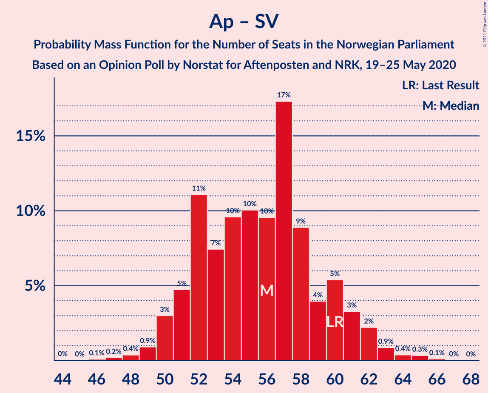

| Number of Seats | Probability | Accumulated | Special Marks |
|:---------------:|:-----------:|:-----------:|:-------------:|
| 44 | 0% | 100% |  |
| 45 | 0% | 99.9% |  |
| 46 | 0.1% | 99.9% |  |
| 47 | 0.2% | 99.8% |  |
| 48 | 0.4% | 99.6% |  |
| 49 | 0.9% | 99.2% |  |
| 50 | 3% | 98% |  |
| 51 | 5% | 95% |  |
| 52 | 11% | 91% |  |
| 53 | 7% | 79% |  |
| 54 | 10% | 72% |  |
| 55 | 10% | 62% | Median |
| 56 | 10% | 52% |  |
| 57 | 17% | 43% |  |
| 58 | 9% | 26% |  |
| 59 | 4% | 17% |  |
| 60 | 5% | 13% | Last Result |
| 61 | 3% | 7% |  |
| 62 | 2% | 4% |  |
| 63 | 0.9% | 2% |  |
| 64 | 0.4% | 0.9% |  |
| 65 | 0.3% | 0.5% |  |
| 66 | 0.1% | 0.2% |  |
| 67 | 0% | 0.1% |  |
| 68 | 0% | 0% |  |

### Høyre – Kristelig Folkeparti – Venstre

| Number of Seats | Probability | Accumulated | Special Marks |
|:---------------:|:-----------:|:-----------:|:-------------:|
| 40 | 0.2% | 100% |  |
| 41 | 0.4% | 99.8% |  |
| 42 | 2% | 99.4% |  |
| 43 | 1.1% | 98% |  |
| 44 | 5% | 96% |  |
| 45 | 6% | 92% |  |
| 46 | 5% | 86% |  |
| 47 | 11% | 81% |  |
| 48 | 18% | 70% |  |
| 49 | 10% | 52% | Median |
| 50 | 11% | 42% |  |
| 51 | 6% | 32% |  |
| 52 | 9% | 26% |  |
| 53 | 4% | 17% |  |
| 54 | 4% | 13% |  |
| 55 | 3% | 8% |  |
| 56 | 2% | 5% |  |
| 57 | 0.5% | 3% |  |
| 58 | 2% | 2% |  |
| 59 | 0.2% | 0.5% |  |
| 60 | 0.2% | 0.3% |  |
| 61 | 0% | 0% | Last Result |

### Senterpartiet – Kristelig Folkeparti – Venstre

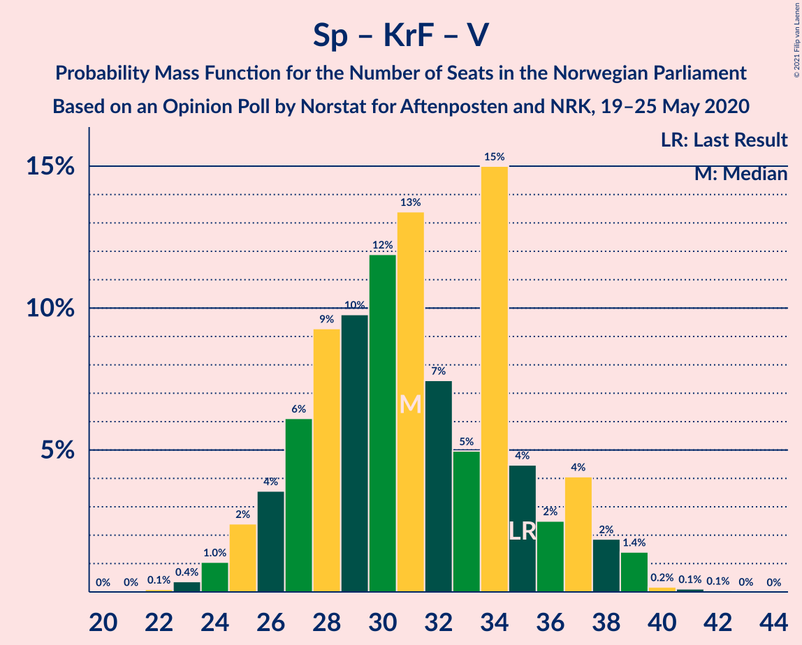

| Number of Seats | Probability | Accumulated | Special Marks |
|:---------------:|:-----------:|:-----------:|:-------------:|
| 22 | 0.1% | 100% |  |
| 23 | 0.4% | 99.9% |  |
| 24 | 1.0% | 99.5% |  |
| 25 | 2% | 98% |  |
| 26 | 4% | 96% |  |
| 27 | 6% | 93% |  |
| 28 | 9% | 86% |  |
| 29 | 10% | 77% |  |
| 30 | 12% | 67% |  |
| 31 | 13% | 55% | Median |
| 32 | 7% | 42% |  |
| 33 | 5% | 35% |  |
| 34 | 15% | 30% |  |
| 35 | 4% | 15% | Last Result |
| 36 | 2% | 10% |  |
| 37 | 4% | 8% |  |
| 38 | 2% | 4% |  |
| 39 | 1.4% | 2% |  |
| 40 | 0.2% | 0.4% |  |
| 41 | 0.1% | 0.2% |  |
| 42 | 0.1% | 0.1% |  |
| 43 | 0% | 0% |  |

## Technical Information

### Opinion Poll

+ **Polling firm:** Norstat
+ **Commissioner(s):** Aftenposten and NRK
+ **Fieldwork period:** 19–25 May 2020

### Calculations

+ **Sample size:** 957
+ **Simulations done:** 1,048,576
+ **Error estimate:** 2.24%

