# Opinion Poll by Ipsos MMI for Dagbladet, 25–28 May 2020

<a href="#voting-intentions">Voting Intentions</a> | <a href="#seats">Seats</a> | <a href="#coalitions">Coalitions</a> | <a href="#technical-information">Technical Information</a>

## Voting Intentions

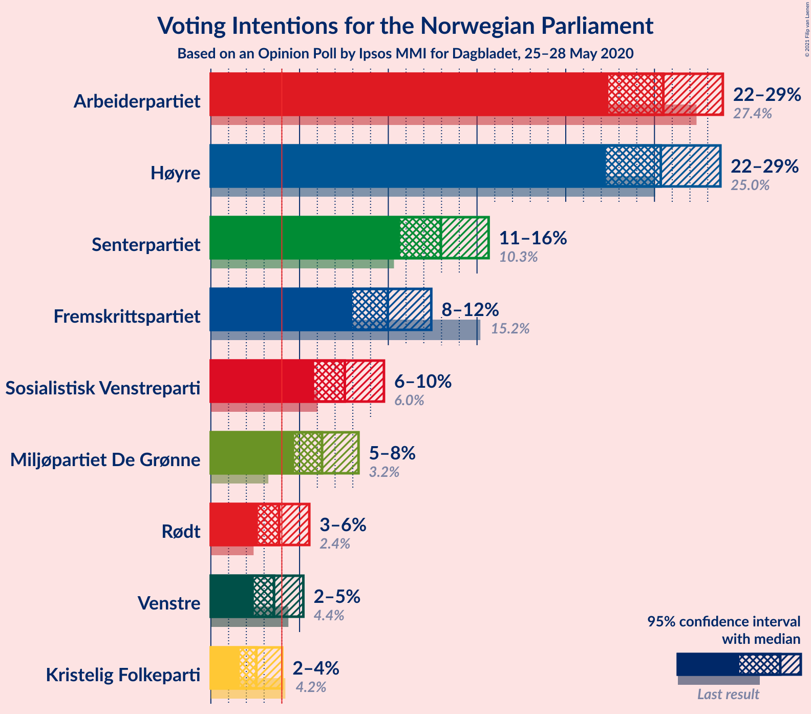

### Confidence Intervals

| Party | Last Result | Poll Result | 80% Confidence Interval | 90% Confidence Interval | 95% Confidence Interval | 99% Confidence Interval |
|:-----:|:-----------:|:-----------:|:-----------------------:|:-----------------------:|:-----------------------:|:-----------------------:|
| Arbeiderpartiet | 27.4% | 25.5% | 23.5–27.7% |22.9–28.3% |22.4–28.9% |21.5–29.9% |
| Høyre | 25.0% | 25.4% | 23.3–27.6% |22.8–28.2% |22.3–28.7% |21.3–29.8% |
| Senterpartiet | 10.3% | 13.0% | 11.5–14.7% |11.0–15.2% |10.7–15.7% |10.0–16.5% |
| Fremskrittspartiet | 15.2% | 10.0% | 8.7–11.6% |8.3–12.0% |8.0–12.4% |7.4–13.2% |
| Sosialistisk Venstreparti | 6.0% | 7.5% | 6.4–9.0% |6.1–9.4% |5.8–9.8% |5.3–10.5% |
| Miljøpartiet De Grønne | 3.2% | 6.3% | 5.2–7.6% |4.9–8.0% |4.7–8.3% |4.3–9.0% |
| Rødt | 2.4% | 3.8% | 3.1–5.0% |2.8–5.3% |2.7–5.5% |2.3–6.1% |
| Venstre | 4.4% | 3.6% | 2.8–4.6% |2.6–4.9% |2.4–5.2% |2.1–5.8% |
| Kristelig Folkeparti | 4.2% | 2.6% | 1.9–3.5% |1.8–3.8% |1.6–4.0% |1.4–4.5% |

*Note:* The poll result column reflects the actual value used in the calculations. Published results may vary slightly, and in addition be rounded to fewer digits.

## Seats

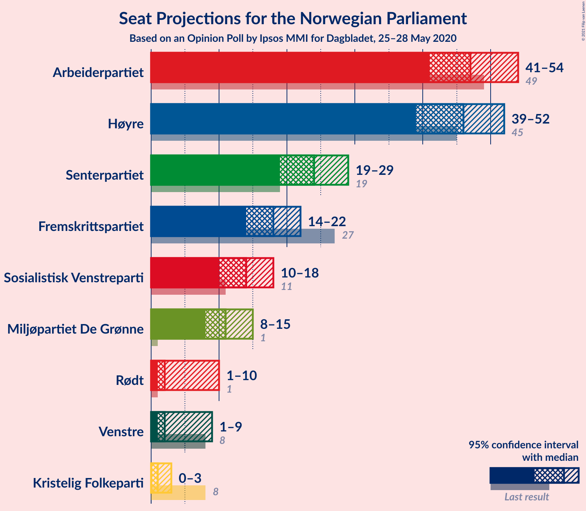

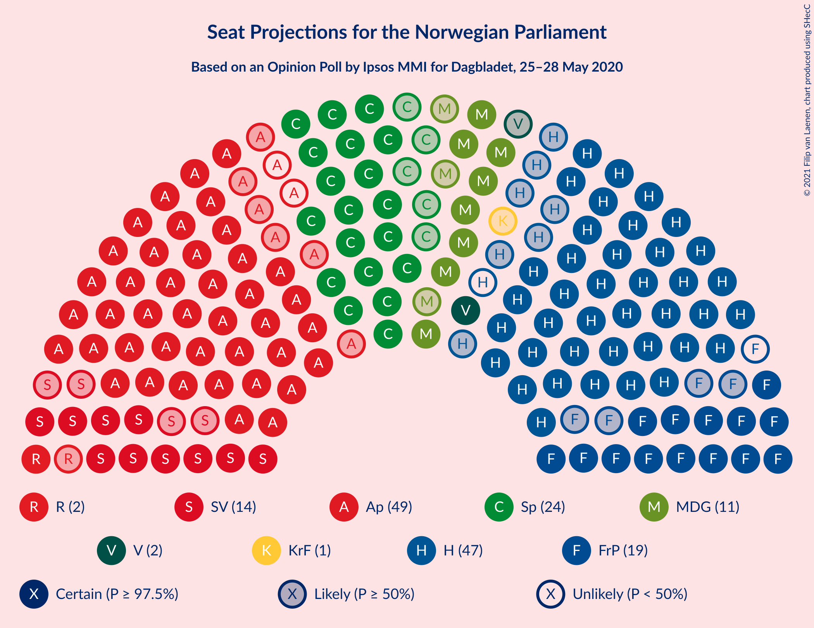

### Confidence Intervals

| Party | Last Result | Median | 80% Confidence Interval | 90% Confidence Interval | 95% Confidence Interval | 99% Confidence Interval |
|:-----:|:-----------:|:------:|:-----------------------:|:-----------------------:|:-----------------------:|:-----------------------:|
| <a href="#arbeiderpartiet">Arbeiderpartiet</a> | 49 | 47 | 43–51 |42–52 |41–54 |40–56 |
| <a href="#høyre">Høyre</a> | 45 | 46 | 42–51 |40–52 |39–52 |37–55 |
| <a href="#senterpartiet">Senterpartiet</a> | 19 | 24 | 20–27 |19–29 |19–29 |18–32 |
| <a href="#fremskrittspartiet">Fremskrittspartiet</a> | 27 | 18 | 15–21 |14–22 |14–22 |13–24 |
| <a href="#sosialistisk-venstreparti">Sosialistisk Venstreparti</a> | 11 | 14 | 11–16 |11–17 |10–18 |9–19 |
| <a href="#miljøpartiet-de-grønne">Miljøpartiet De Grønne</a> | 1 | 11 | 9–13 |9–14 |8–15 |7–16 |
| <a href="#rødt">Rødt</a> | 1 | 2 | 2–8 |1–9 |1–10 |1–11 |
| <a href="#venstre">Venstre</a> | 8 | 2 | 2–8 |2–8 |1–9 |1–10 |
| <a href="#kristelig-folkeparti">Kristelig Folkeparti</a> | 8 | 1 | 0–3 |0–3 |0–3 |0–8 |

### Arbeiderpartiet

*For a full overview of the results for this party, see the [Arbeiderpartiet](party-arbeiderpartiet.html) page.*

| Number of Seats | Probability | Accumulated | Special Marks |
|:---------------:|:-----------:|:-----------:|:-------------:|
| 37 | 0% | 100% |  |
| 38 | 0.1% | 99.9% |  |
| 39 | 0.3% | 99.9% |  |
| 40 | 2% | 99.6% |  |
| 41 | 2% | 98% |  |
| 42 | 3% | 96% |  |
| 43 | 9% | 92% |  |
| 44 | 13% | 83% |  |
| 45 | 11% | 70% |  |
| 46 | 7% | 59% |  |
| 47 | 12% | 52% | Median |
| 48 | 9% | 41% |  |
| 49 | 13% | 32% | Last Result |
| 50 | 7% | 18% |  |
| 51 | 4% | 12% |  |
| 52 | 3% | 7% |  |
| 53 | 2% | 5% |  |
| 54 | 2% | 3% |  |
| 55 | 0.9% | 2% |  |
| 56 | 0.4% | 0.7% |  |
| 57 | 0.2% | 0.3% |  |
| 58 | 0.1% | 0.1% |  |
| 59 | 0% | 0% |  |

### Høyre

*For a full overview of the results for this party, see the [Høyre](party-høyre.html) page.*

| Number of Seats | Probability | Accumulated | Special Marks |
|:---------------:|:-----------:|:-----------:|:-------------:|
| 36 | 0.1% | 100% |  |
| 37 | 0.8% | 99.8% |  |
| 38 | 0.6% | 99.0% |  |
| 39 | 1.5% | 98% |  |
| 40 | 3% | 97% |  |
| 41 | 4% | 94% |  |
| 42 | 7% | 90% |  |
| 43 | 7% | 84% |  |
| 44 | 6% | 77% |  |
| 45 | 12% | 72% | Last Result |
| 46 | 14% | 59% | Median |
| 47 | 15% | 46% |  |
| 48 | 10% | 30% |  |
| 49 | 6% | 20% |  |
| 50 | 4% | 15% |  |
| 51 | 2% | 11% |  |
| 52 | 6% | 9% |  |
| 53 | 0.9% | 2% |  |
| 54 | 0.9% | 1.4% |  |
| 55 | 0.3% | 0.5% |  |
| 56 | 0.1% | 0.2% |  |
| 57 | 0.1% | 0.1% |  |
| 58 | 0% | 0% |  |

### Senterpartiet

*For a full overview of the results for this party, see the [Senterpartiet](party-senterpartiet.html) page.*

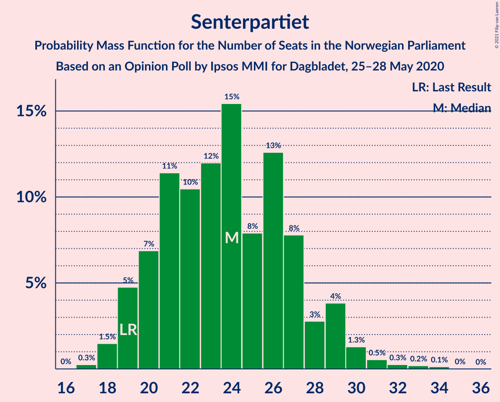

| Number of Seats | Probability | Accumulated | Special Marks |
|:---------------:|:-----------:|:-----------:|:-------------:|
| 17 | 0.3% | 100% |  |
| 18 | 1.5% | 99.7% |  |
| 19 | 5% | 98% | Last Result |
| 20 | 7% | 93% |  |
| 21 | 11% | 87% |  |
| 22 | 10% | 75% |  |
| 23 | 12% | 65% |  |
| 24 | 15% | 53% | Median |
| 25 | 8% | 37% |  |
| 26 | 13% | 29% |  |
| 27 | 8% | 17% |  |
| 28 | 3% | 9% |  |
| 29 | 4% | 6% |  |
| 30 | 1.3% | 2% |  |
| 31 | 0.5% | 1.1% |  |
| 32 | 0.3% | 0.6% |  |
| 33 | 0.2% | 0.3% |  |
| 34 | 0.1% | 0.2% |  |
| 35 | 0% | 0% |  |

### Fremskrittspartiet

*For a full overview of the results for this party, see the [Fremskrittspartiet](party-fremskrittspartiet.html) page.*

| Number of Seats | Probability | Accumulated | Special Marks |
|:---------------:|:-----------:|:-----------:|:-------------:|
| 11 | 0.1% | 100% |  |
| 12 | 0.4% | 99.9% |  |
| 13 | 1.3% | 99.5% |  |
| 14 | 5% | 98% |  |
| 15 | 8% | 94% |  |
| 16 | 10% | 86% |  |
| 17 | 14% | 76% |  |
| 18 | 15% | 62% | Median |
| 19 | 20% | 47% |  |
| 20 | 10% | 26% |  |
| 21 | 9% | 16% |  |
| 22 | 4% | 6% |  |
| 23 | 1.3% | 2% |  |
| 24 | 0.6% | 1.0% |  |
| 25 | 0.2% | 0.3% |  |
| 26 | 0.1% | 0.1% |  |
| 27 | 0% | 0% | Last Result |

### Sosialistisk Venstreparti

*For a full overview of the results for this party, see the [Sosialistisk Venstreparti](party-sosialistiskvenstreparti.html) page.*

| Number of Seats | Probability | Accumulated | Special Marks |
|:---------------:|:-----------:|:-----------:|:-------------:|
| 8 | 0.1% | 100% |  |
| 9 | 0.7% | 99.9% |  |
| 10 | 3% | 99.3% |  |
| 11 | 8% | 96% | Last Result |
| 12 | 16% | 88% |  |
| 13 | 19% | 71% |  |
| 14 | 20% | 52% | Median |
| 15 | 16% | 32% |  |
| 16 | 7% | 16% |  |
| 17 | 5% | 8% |  |
| 18 | 2% | 3% |  |
| 19 | 0.9% | 1.1% |  |
| 20 | 0.2% | 0.2% |  |
| 21 | 0.1% | 0.1% |  |
| 22 | 0% | 0% |  |

### Miljøpartiet De Grønne

*For a full overview of the results for this party, see the [Miljøpartiet De Grønne](party-miljøpartietdegrønne.html) page.*

| Number of Seats | Probability | Accumulated | Special Marks |
|:---------------:|:-----------:|:-----------:|:-------------:|
| 1 | 0% | 100% | Last Result |
| 2 | 0.1% | 100% |  |
| 3 | 0.1% | 99.9% |  |
| 4 | 0% | 99.8% |  |
| 5 | 0% | 99.8% |  |
| 6 | 0% | 99.8% |  |
| 7 | 0.3% | 99.8% |  |
| 8 | 4% | 99.5% |  |
| 9 | 7% | 95% |  |
| 10 | 20% | 88% |  |
| 11 | 28% | 68% | Median |
| 12 | 17% | 40% |  |
| 13 | 13% | 22% |  |
| 14 | 6% | 10% |  |
| 15 | 3% | 4% |  |
| 16 | 0.6% | 1.0% |  |
| 17 | 0.4% | 0.5% |  |
| 18 | 0% | 0.1% |  |
| 19 | 0% | 0% |  |

### Rødt

*For a full overview of the results for this party, see the [Rødt](party-rødt.html) page.*

| Number of Seats | Probability | Accumulated | Special Marks |
|:---------------:|:-----------:|:-----------:|:-------------:|
| 1 | 8% | 100% | Last Result |
| 2 | 50% | 92% | Median |
| 3 | 0% | 42% |  |
| 4 | 0% | 42% |  |
| 5 | 0% | 42% |  |
| 6 | 0.1% | 42% |  |
| 7 | 10% | 42% |  |
| 8 | 23% | 32% |  |
| 9 | 6% | 9% |  |
| 10 | 2% | 3% |  |
| 11 | 0.6% | 0.7% |  |
| 12 | 0.1% | 0.1% |  |
| 13 | 0% | 0% |  |

### Venstre

*For a full overview of the results for this party, see the [Venstre](party-venstre.html) page.*

| Number of Seats | Probability | Accumulated | Special Marks |
|:---------------:|:-----------:|:-----------:|:-------------:|
| 0 | 0.1% | 100% |  |
| 1 | 2% | 99.9% |  |
| 2 | 67% | 97% | Median |
| 3 | 2% | 31% |  |
| 4 | 0% | 29% |  |
| 5 | 0% | 28% |  |
| 6 | 0.1% | 28% |  |
| 7 | 9% | 28% |  |
| 8 | 15% | 20% | Last Result |
| 9 | 4% | 5% |  |
| 10 | 1.1% | 1.2% |  |
| 11 | 0.1% | 0.2% |  |
| 12 | 0% | 0% |  |

### Kristelig Folkeparti

*For a full overview of the results for this party, see the [Kristelig Folkeparti](party-kristeligfolkeparti.html) page.*

| Number of Seats | Probability | Accumulated | Special Marks |
|:---------------:|:-----------:|:-----------:|:-------------:|
| 0 | 32% | 100% |  |
| 1 | 43% | 68% | Median |
| 2 | 13% | 25% |  |
| 3 | 11% | 13% |  |
| 4 | 0% | 2% |  |
| 5 | 0% | 2% |  |
| 6 | 0.1% | 2% |  |
| 7 | 0.9% | 2% |  |
| 8 | 0.8% | 0.9% | Last Result |
| 9 | 0.1% | 0.1% |  |
| 10 | 0% | 0% |  |

## Coalitions

### Confidence Intervals

| Coalition | Last Result | Median | Majority? | 80% Confidence Interval | 90% Confidence Interval | 95% Confidence Interval | 99% Confidence Interval |
|:---------:|:-----------:|:------:|:---------:|:-----------------------:|:-----------------------:|:-----------------------:|:-----------------------:|
| Arbeiderpartiet – Senterpartiet – Sosialistisk Venstreparti – Miljøpartiet De Grønne – Rødt | 81 | 100 | 100% | 95–105 | 93–107 | 92–107 | 89–111 |
| Arbeiderpartiet – Senterpartiet – Sosialistisk Venstreparti – Miljøpartiet De Grønne – Kristelig Folkeparti | 88 | 97 | 99.9% | 90–102 | 90–104 | 89–104 | 86–107 |
| Arbeiderpartiet – Senterpartiet – Sosialistisk Venstreparti – Miljøpartiet De Grønne | 80 | 96 | 99.5% | 89–100 | 88–102 | 87–104 | 84–105 |
| Høyre – Senterpartiet – Fremskrittspartiet – Venstre – Kristelig Folkeparti | 107 | 93 | 98% | 87–98 | 86–100 | 85–101 | 82–102 |
| Arbeiderpartiet – Senterpartiet – Sosialistisk Venstreparti – Rødt | 80 | 89 | 87% | 83–94 | 82–96 | 81–97 | 78–99 |
| Arbeiderpartiet – Senterpartiet – Sosialistisk Venstreparti | 79 | 84 | 47% | 78–89 | 77–90 | 76–92 | 74–94 |
| Arbeiderpartiet – Senterpartiet – Miljøpartiet De Grønne – Kristelig Folkeparti | 77 | 83 | 35% | 77–88 | 76–90 | 76–91 | 74–93 |
| Høyre – Fremskrittspartiet – Miljøpartiet De Grønne – Venstre – Kristelig Folkeparti | 89 | 80 | 12% | 75–85 | 73–87 | 72–88 | 70–91 |
| Arbeiderpartiet – Senterpartiet – Kristelig Folkeparti | 76 | 72 | 0.1% | 67–76 | 65–78 | 65–79 | 62–81 |
| Arbeiderpartiet – Senterpartiet | 68 | 71 | 0% | 65–76 | 65–77 | 63–78 | 62–80 |
| Høyre – Fremskrittspartiet – Venstre – Kristelig Folkeparti | 88 | 69 | 0% | 63–74 | 62–75 | 62–77 | 58–79 |
| Høyre – Fremskrittspartiet – Venstre | 80 | 67 | 0% | 63–73 | 61–74 | 60–75 | 57–78 |
| Høyre – Fremskrittspartiet | 72 | 65 | 0% | 59–69 | 57–70 | 56–71 | 53–74 |
| Arbeiderpartiet – Sosialistisk Venstreparti | 60 | 60 | 0% | 56–65 | 55–66 | 54–67 | 52–70 |
| Høyre – Venstre – Kristelig Folkeparti | 61 | 50 | 0% | 46–57 | 45–57 | 43–59 | 42–62 |
| Senterpartiet – Venstre – Kristelig Folkeparti | 35 | 28 | 0% | 24–34 | 23–35 | 22–37 | 21–39 |

### Arbeiderpartiet – Senterpartiet – Sosialistisk Venstreparti – Miljøpartiet De Grønne – Rødt

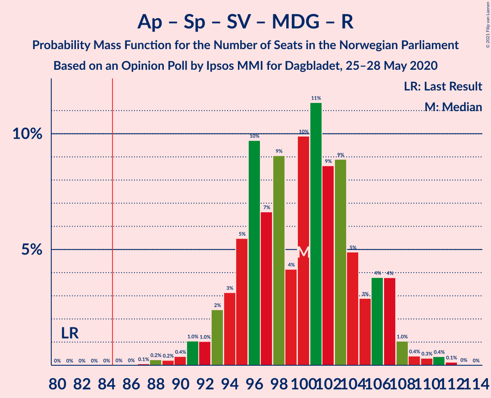

| Number of Seats | Probability | Accumulated | Special Marks |
|:---------------:|:-----------:|:-----------:|:-------------:|
| 81 | 0% | 100% | Last Result |
| 82 | 0% | 100% |  |
| 83 | 0% | 100% |  |
| 84 | 0% | 100% |  |
| 85 | 0% | 100% | Majority |
| 86 | 0% | 100% |  |
| 87 | 0.1% | 100% |  |
| 88 | 0.2% | 99.9% |  |
| 89 | 0.2% | 99.7% |  |
| 90 | 0.4% | 99.4% |  |
| 91 | 1.0% | 99.1% |  |
| 92 | 1.0% | 98% |  |
| 93 | 2% | 97% |  |
| 94 | 3% | 95% |  |
| 95 | 5% | 91% |  |
| 96 | 10% | 86% |  |
| 97 | 7% | 76% |  |
| 98 | 9% | 70% | Median |
| 99 | 4% | 61% |  |
| 100 | 10% | 56% |  |
| 101 | 11% | 47% |  |
| 102 | 9% | 35% |  |
| 103 | 9% | 27% |  |
| 104 | 5% | 18% |  |
| 105 | 3% | 13% |  |
| 106 | 4% | 10% |  |
| 107 | 4% | 6% |  |
| 108 | 1.0% | 2% |  |
| 109 | 0.4% | 1.3% |  |
| 110 | 0.3% | 0.9% |  |
| 111 | 0.4% | 0.6% |  |
| 112 | 0.1% | 0.2% |  |
| 113 | 0% | 0% |  |

### Arbeiderpartiet – Senterpartiet – Sosialistisk Venstreparti – Miljøpartiet De Grønne – Kristelig Folkeparti

| Number of Seats | Probability | Accumulated | Special Marks |
|:---------------:|:-----------:|:-----------:|:-------------:|
| 84 | 0.1% | 100% |  |
| 85 | 0.2% | 99.9% | Majority |
| 86 | 0.4% | 99.7% |  |
| 87 | 0.4% | 99.3% |  |
| 88 | 0.9% | 98.9% | Last Result |
| 89 | 2% | 98% |  |
| 90 | 7% | 96% |  |
| 91 | 4% | 89% |  |
| 92 | 4% | 85% |  |
| 93 | 4% | 80% |  |
| 94 | 5% | 76% |  |
| 95 | 12% | 71% |  |
| 96 | 7% | 59% |  |
| 97 | 9% | 52% | Median |
| 98 | 6% | 43% |  |
| 99 | 9% | 37% |  |
| 100 | 15% | 28% |  |
| 101 | 2% | 13% |  |
| 102 | 3% | 11% |  |
| 103 | 2% | 7% |  |
| 104 | 3% | 5% |  |
| 105 | 1.3% | 2% |  |
| 106 | 0.4% | 1.0% |  |
| 107 | 0.2% | 0.6% |  |
| 108 | 0.2% | 0.4% |  |
| 109 | 0.1% | 0.2% |  |
| 110 | 0% | 0% |  |

### Arbeiderpartiet – Senterpartiet – Sosialistisk Venstreparti – Miljøpartiet De Grønne

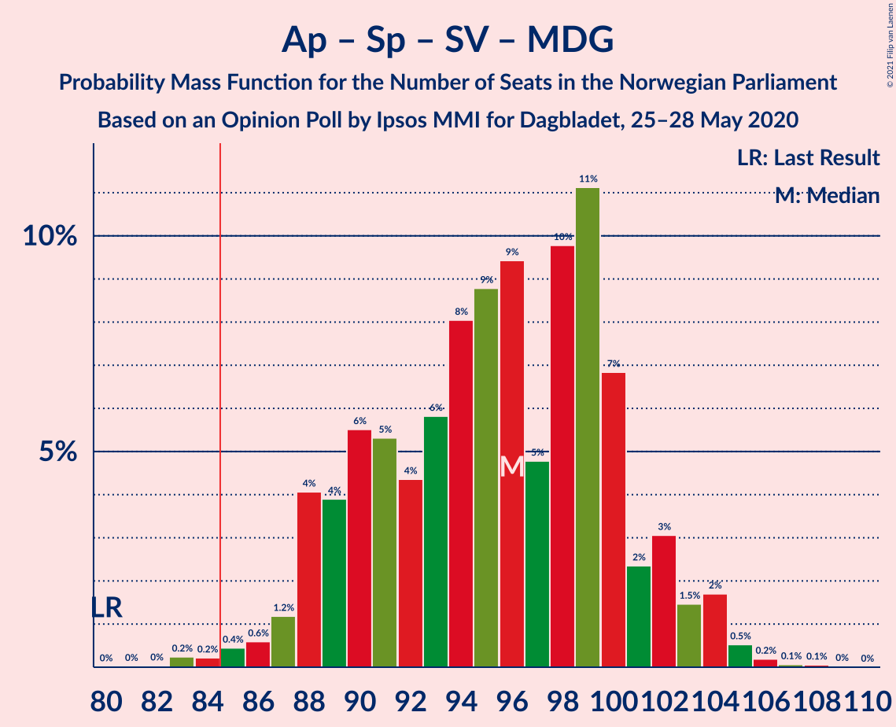

| Number of Seats | Probability | Accumulated | Special Marks |
|:---------------:|:-----------:|:-----------:|:-------------:|
| 80 | 0% | 100% | Last Result |
| 81 | 0% | 100% |  |
| 82 | 0% | 100% |  |
| 83 | 0.2% | 99.9% |  |
| 84 | 0.2% | 99.7% |  |
| 85 | 0.4% | 99.5% | Majority |
| 86 | 0.6% | 99.0% |  |
| 87 | 1.2% | 98% |  |
| 88 | 4% | 97% |  |
| 89 | 4% | 93% |  |
| 90 | 6% | 89% |  |
| 91 | 5% | 84% |  |
| 92 | 4% | 78% |  |
| 93 | 6% | 74% |  |
| 94 | 8% | 68% |  |
| 95 | 9% | 60% |  |
| 96 | 9% | 51% | Median |
| 97 | 5% | 42% |  |
| 98 | 10% | 37% |  |
| 99 | 11% | 27% |  |
| 100 | 7% | 16% |  |
| 101 | 2% | 9% |  |
| 102 | 3% | 7% |  |
| 103 | 1.5% | 4% |  |
| 104 | 2% | 3% |  |
| 105 | 0.5% | 0.9% |  |
| 106 | 0.2% | 0.3% |  |
| 107 | 0.1% | 0.2% |  |
| 108 | 0.1% | 0.1% |  |
| 109 | 0% | 0% |  |

### Høyre – Senterpartiet – Fremskrittspartiet – Venstre – Kristelig Folkeparti

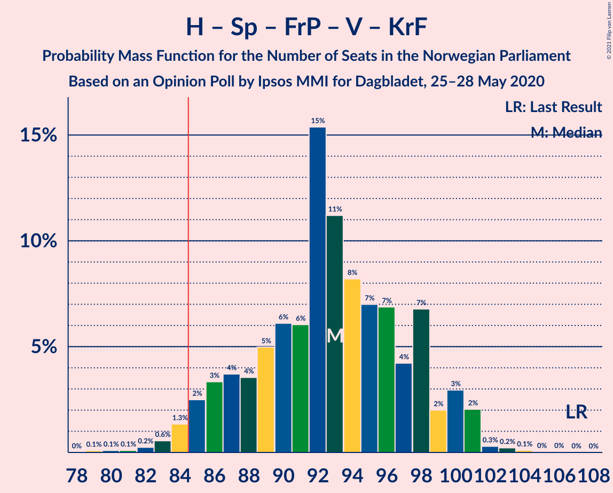

| Number of Seats | Probability | Accumulated | Special Marks |
|:---------------:|:-----------:|:-----------:|:-------------:|
| 79 | 0.1% | 100% |  |
| 80 | 0.1% | 99.9% |  |
| 81 | 0.1% | 99.8% |  |
| 82 | 0.2% | 99.7% |  |
| 83 | 0.6% | 99.4% |  |
| 84 | 1.3% | 98.9% |  |
| 85 | 2% | 98% | Majority |
| 86 | 3% | 95% |  |
| 87 | 4% | 92% |  |
| 88 | 4% | 88% |  |
| 89 | 5% | 84% |  |
| 90 | 6% | 79% |  |
| 91 | 6% | 73% | Median |
| 92 | 15% | 67% |  |
| 93 | 11% | 52% |  |
| 94 | 8% | 41% |  |
| 95 | 7% | 33% |  |
| 96 | 7% | 26% |  |
| 97 | 4% | 19% |  |
| 98 | 7% | 14% |  |
| 99 | 2% | 8% |  |
| 100 | 3% | 6% |  |
| 101 | 2% | 3% |  |
| 102 | 0.3% | 0.7% |  |
| 103 | 0.2% | 0.4% |  |
| 104 | 0.1% | 0.2% |  |
| 105 | 0% | 0.1% |  |
| 106 | 0% | 0% |  |
| 107 | 0% | 0% | Last Result |

### Arbeiderpartiet – Senterpartiet – Sosialistisk Venstreparti – Rødt

| Number of Seats | Probability | Accumulated | Special Marks |
|:---------------:|:-----------:|:-----------:|:-------------:|
| 76 | 0.1% | 100% |  |
| 77 | 0.2% | 99.9% |  |
| 78 | 0.3% | 99.7% |  |
| 79 | 0.3% | 99.3% |  |
| 80 | 0.8% | 99.0% | Last Result |
| 81 | 2% | 98% |  |
| 82 | 4% | 96% |  |
| 83 | 2% | 92% |  |
| 84 | 2% | 90% |  |
| 85 | 10% | 87% | Majority |
| 86 | 14% | 77% |  |
| 87 | 5% | 63% | Median |
| 88 | 8% | 58% |  |
| 89 | 8% | 50% |  |
| 90 | 7% | 42% |  |
| 91 | 12% | 36% |  |
| 92 | 6% | 23% |  |
| 93 | 5% | 17% |  |
| 94 | 4% | 13% |  |
| 95 | 4% | 9% |  |
| 96 | 3% | 5% |  |
| 97 | 1.0% | 3% |  |
| 98 | 0.5% | 2% |  |
| 99 | 0.7% | 1.1% |  |
| 100 | 0.2% | 0.4% |  |
| 101 | 0.1% | 0.2% |  |
| 102 | 0% | 0.1% |  |
| 103 | 0% | 0% |  |

### Arbeiderpartiet – Senterpartiet – Sosialistisk Venstreparti

| Number of Seats | Probability | Accumulated | Special Marks |
|:---------------:|:-----------:|:-----------:|:-------------:|
| 71 | 0% | 100% |  |
| 72 | 0.1% | 99.9% |  |
| 73 | 0.3% | 99.9% |  |
| 74 | 0.2% | 99.5% |  |
| 75 | 1.1% | 99.3% |  |
| 76 | 1.2% | 98% |  |
| 77 | 2% | 97% |  |
| 78 | 5% | 95% |  |
| 79 | 6% | 89% | Last Result |
| 80 | 6% | 83% |  |
| 81 | 5% | 78% |  |
| 82 | 4% | 73% |  |
| 83 | 13% | 69% |  |
| 84 | 8% | 56% |  |
| 85 | 9% | 47% | Median, Majority |
| 86 | 7% | 38% |  |
| 87 | 8% | 31% |  |
| 88 | 7% | 24% |  |
| 89 | 7% | 16% |  |
| 90 | 4% | 9% |  |
| 91 | 1.2% | 5% |  |
| 92 | 2% | 3% |  |
| 93 | 1.2% | 2% |  |
| 94 | 0.2% | 0.5% |  |
| 95 | 0.2% | 0.3% |  |
| 96 | 0.1% | 0.1% |  |
| 97 | 0% | 0% |  |

### Arbeiderpartiet – Senterpartiet – Miljøpartiet De Grønne – Kristelig Folkeparti

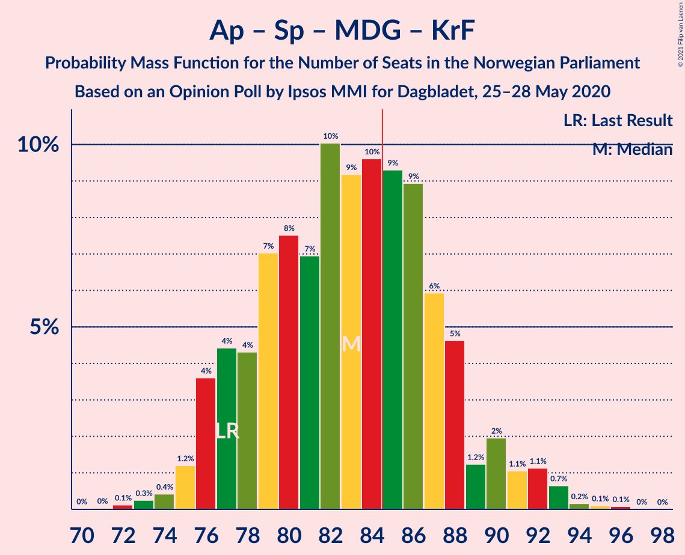

| Number of Seats | Probability | Accumulated | Special Marks |
|:---------------:|:-----------:|:-----------:|:-------------:|
| 71 | 0% | 100% |  |
| 72 | 0.1% | 99.9% |  |
| 73 | 0.3% | 99.8% |  |
| 74 | 0.4% | 99.5% |  |
| 75 | 1.2% | 99.1% |  |
| 76 | 4% | 98% |  |
| 77 | 4% | 94% | Last Result |
| 78 | 4% | 90% |  |
| 79 | 7% | 86% |  |
| 80 | 8% | 79% |  |
| 81 | 7% | 71% |  |
| 82 | 10% | 64% |  |
| 83 | 9% | 54% | Median |
| 84 | 10% | 45% |  |
| 85 | 9% | 35% | Majority |
| 86 | 9% | 26% |  |
| 87 | 6% | 17% |  |
| 88 | 5% | 11% |  |
| 89 | 1.2% | 6% |  |
| 90 | 2% | 5% |  |
| 91 | 1.1% | 3% |  |
| 92 | 1.1% | 2% |  |
| 93 | 0.7% | 1.0% |  |
| 94 | 0.2% | 0.4% |  |
| 95 | 0.1% | 0.2% |  |
| 96 | 0.1% | 0.1% |  |
| 97 | 0% | 0% |  |

### Høyre – Fremskrittspartiet – Miljøpartiet De Grønne – Venstre – Kristelig Folkeparti

| Number of Seats | Probability | Accumulated | Special Marks |
|:---------------:|:-----------:|:-----------:|:-------------:|
| 66 | 0% | 100% |  |
| 67 | 0% | 99.9% |  |
| 68 | 0.1% | 99.9% |  |
| 69 | 0.2% | 99.8% |  |
| 70 | 0.8% | 99.6% |  |
| 71 | 0.5% | 98.8% |  |
| 72 | 1.0% | 98% |  |
| 73 | 3% | 97% |  |
| 74 | 4% | 94% |  |
| 75 | 4% | 91% |  |
| 76 | 5% | 87% |  |
| 77 | 6% | 82% |  |
| 78 | 12% | 76% | Median |
| 79 | 7% | 64% |  |
| 80 | 8% | 57% |  |
| 81 | 8% | 49% |  |
| 82 | 5% | 41% |  |
| 83 | 14% | 36% |  |
| 84 | 10% | 22% |  |
| 85 | 2% | 12% | Majority |
| 86 | 2% | 10% |  |
| 87 | 4% | 7% |  |
| 88 | 2% | 4% |  |
| 89 | 0.6% | 2% | Last Result |
| 90 | 0.3% | 0.9% |  |
| 91 | 0.3% | 0.6% |  |
| 92 | 0.2% | 0.3% |  |
| 93 | 0.1% | 0.1% |  |
| 94 | 0% | 0% |  |

### Arbeiderpartiet – Senterpartiet – Kristelig Folkeparti

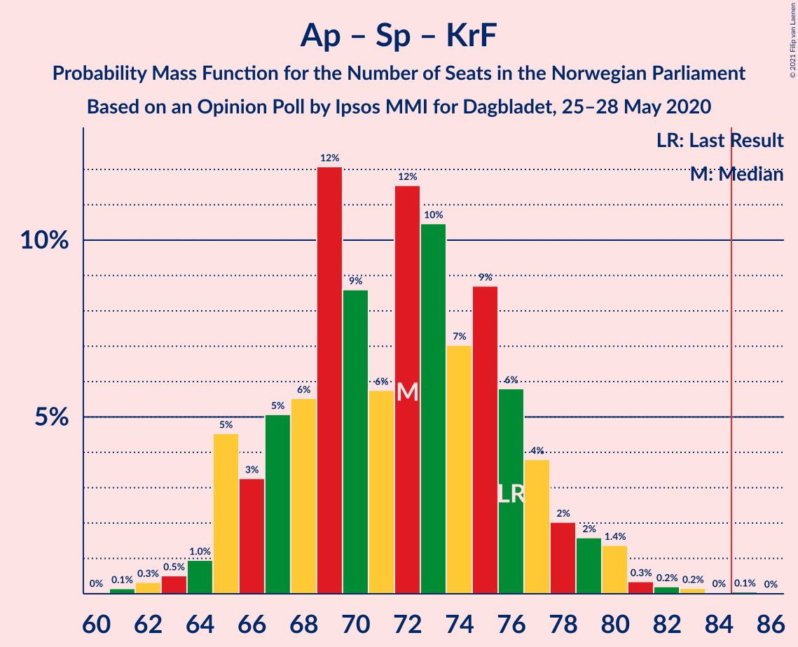

| Number of Seats | Probability | Accumulated | Special Marks |
|:---------------:|:-----------:|:-----------:|:-------------:|
| 60 | 0% | 100% |  |
| 61 | 0.1% | 99.9% |  |
| 62 | 0.3% | 99.8% |  |
| 63 | 0.5% | 99.5% |  |
| 64 | 1.0% | 99.0% |  |
| 65 | 5% | 98% |  |
| 66 | 3% | 93% |  |
| 67 | 5% | 90% |  |
| 68 | 6% | 85% |  |
| 69 | 12% | 80% |  |
| 70 | 9% | 68% |  |
| 71 | 6% | 59% |  |
| 72 | 12% | 53% | Median |
| 73 | 10% | 42% |  |
| 74 | 7% | 31% |  |
| 75 | 9% | 24% |  |
| 76 | 6% | 15% | Last Result |
| 77 | 4% | 10% |  |
| 78 | 2% | 6% |  |
| 79 | 2% | 4% |  |
| 80 | 1.4% | 2% |  |
| 81 | 0.3% | 0.8% |  |
| 82 | 0.2% | 0.5% |  |
| 83 | 0.2% | 0.3% |  |
| 84 | 0% | 0.1% |  |
| 85 | 0.1% | 0.1% | Majority |
| 86 | 0% | 0% |  |

### Arbeiderpartiet – Senterpartiet

| Number of Seats | Probability | Accumulated | Special Marks |
|:---------------:|:-----------:|:-----------:|:-------------:|
| 59 | 0.1% | 100% |  |
| 60 | 0.2% | 99.9% |  |
| 61 | 0.3% | 99.8% |  |
| 62 | 1.1% | 99.5% |  |
| 63 | 2% | 98% |  |
| 64 | 2% | 97% |  |
| 65 | 7% | 95% |  |
| 66 | 3% | 88% |  |
| 67 | 9% | 84% |  |
| 68 | 7% | 75% | Last Result |
| 69 | 9% | 68% |  |
| 70 | 7% | 59% |  |
| 71 | 12% | 51% | Median |
| 72 | 10% | 39% |  |
| 73 | 6% | 29% |  |
| 74 | 4% | 23% |  |
| 75 | 9% | 19% |  |
| 76 | 5% | 10% |  |
| 77 | 3% | 6% |  |
| 78 | 2% | 3% |  |
| 79 | 0.7% | 1.2% |  |
| 80 | 0.3% | 0.6% |  |
| 81 | 0.2% | 0.3% |  |
| 82 | 0.1% | 0.1% |  |
| 83 | 0% | 0% |  |

### Høyre – Fremskrittspartiet – Venstre – Kristelig Folkeparti

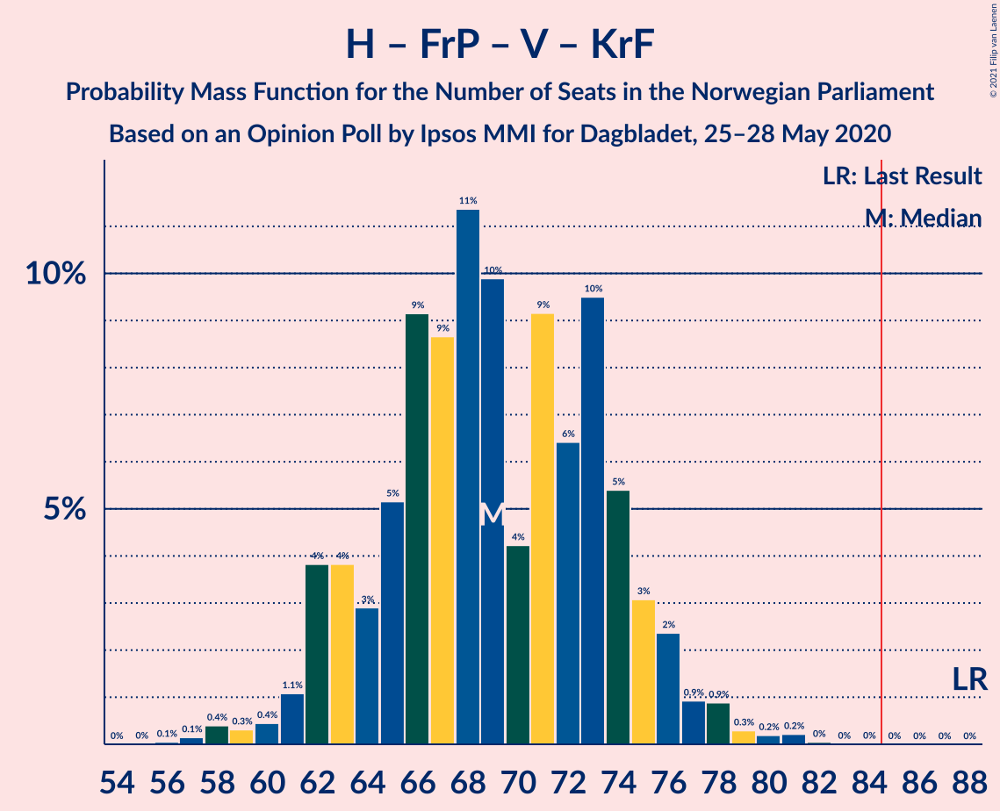

| Number of Seats | Probability | Accumulated | Special Marks |
|:---------------:|:-----------:|:-----------:|:-------------:|
| 56 | 0.1% | 100% |  |
| 57 | 0.1% | 99.9% |  |
| 58 | 0.4% | 99.8% |  |
| 59 | 0.3% | 99.4% |  |
| 60 | 0.4% | 99.1% |  |
| 61 | 1.1% | 98.6% |  |
| 62 | 4% | 98% |  |
| 63 | 4% | 94% |  |
| 64 | 3% | 90% |  |
| 65 | 5% | 87% |  |
| 66 | 9% | 82% |  |
| 67 | 9% | 73% | Median |
| 68 | 11% | 64% |  |
| 69 | 10% | 53% |  |
| 70 | 4% | 43% |  |
| 71 | 9% | 39% |  |
| 72 | 6% | 29% |  |
| 73 | 10% | 23% |  |
| 74 | 5% | 13% |  |
| 75 | 3% | 8% |  |
| 76 | 2% | 5% |  |
| 77 | 0.9% | 3% |  |
| 78 | 0.9% | 2% |  |
| 79 | 0.3% | 0.8% |  |
| 80 | 0.2% | 0.5% |  |
| 81 | 0.2% | 0.3% |  |
| 82 | 0% | 0.1% |  |
| 83 | 0% | 0% |  |
| 84 | 0% | 0% |  |
| 85 | 0% | 0% | Majority |
| 86 | 0% | 0% |  |
| 87 | 0% | 0% |  |
| 88 | 0% | 0% | Last Result |

### Høyre – Fremskrittspartiet – Venstre

| Number of Seats | Probability | Accumulated | Special Marks |
|:---------------:|:-----------:|:-----------:|:-------------:|
| 55 | 0.1% | 100% |  |
| 56 | 0.1% | 99.9% |  |
| 57 | 0.4% | 99.8% |  |
| 58 | 0.5% | 99.3% |  |
| 59 | 0.5% | 98.8% |  |
| 60 | 1.0% | 98% |  |
| 61 | 4% | 97% |  |
| 62 | 4% | 94% |  |
| 63 | 5% | 90% |  |
| 64 | 4% | 85% |  |
| 65 | 5% | 81% |  |
| 66 | 10% | 76% | Median |
| 67 | 17% | 67% |  |
| 68 | 8% | 50% |  |
| 69 | 5% | 42% |  |
| 70 | 6% | 37% |  |
| 71 | 13% | 31% |  |
| 72 | 7% | 17% |  |
| 73 | 3% | 11% |  |
| 74 | 3% | 7% |  |
| 75 | 2% | 4% |  |
| 76 | 1.0% | 2% |  |
| 77 | 0.5% | 1.0% |  |
| 78 | 0.3% | 0.5% |  |
| 79 | 0.1% | 0.2% |  |
| 80 | 0.1% | 0.1% | Last Result |
| 81 | 0% | 0% |  |

### Høyre – Fremskrittspartiet

| Number of Seats | Probability | Accumulated | Special Marks |
|:---------------:|:-----------:|:-----------:|:-------------:|
| 51 | 0.1% | 100% |  |
| 52 | 0.1% | 99.9% |  |
| 53 | 0.4% | 99.8% |  |
| 54 | 0.6% | 99.4% |  |
| 55 | 1.1% | 98.8% |  |
| 56 | 1.3% | 98% |  |
| 57 | 3% | 96% |  |
| 58 | 1.4% | 93% |  |
| 59 | 4% | 92% |  |
| 60 | 5% | 88% |  |
| 61 | 7% | 83% |  |
| 62 | 6% | 75% |  |
| 63 | 7% | 69% |  |
| 64 | 11% | 63% | Median |
| 65 | 16% | 51% |  |
| 66 | 9% | 35% |  |
| 67 | 5% | 26% |  |
| 68 | 4% | 21% |  |
| 69 | 7% | 17% |  |
| 70 | 6% | 9% |  |
| 71 | 2% | 3% |  |
| 72 | 0.3% | 1.3% | Last Result |
| 73 | 0.5% | 1.0% |  |
| 74 | 0.2% | 0.5% |  |
| 75 | 0.2% | 0.3% |  |
| 76 | 0.1% | 0.1% |  |
| 77 | 0% | 0% |  |

### Arbeiderpartiet – Sosialistisk Venstreparti

| Number of Seats | Probability | Accumulated | Special Marks |
|:---------------:|:-----------:|:-----------:|:-------------:|
| 50 | 0.1% | 100% |  |
| 51 | 0.3% | 99.9% |  |
| 52 | 0.4% | 99.6% |  |
| 53 | 1.2% | 99.2% |  |
| 54 | 2% | 98% |  |
| 55 | 4% | 96% |  |
| 56 | 5% | 92% |  |
| 57 | 9% | 86% |  |
| 58 | 12% | 77% |  |
| 59 | 8% | 65% |  |
| 60 | 7% | 56% | Last Result |
| 61 | 9% | 50% | Median |
| 62 | 9% | 40% |  |
| 63 | 11% | 31% |  |
| 64 | 6% | 20% |  |
| 65 | 7% | 14% |  |
| 66 | 2% | 7% |  |
| 67 | 3% | 5% |  |
| 68 | 0.7% | 2% |  |
| 69 | 0.5% | 1.3% |  |
| 70 | 0.3% | 0.8% |  |
| 71 | 0.3% | 0.5% |  |
| 72 | 0.1% | 0.2% |  |
| 73 | 0.1% | 0.1% |  |
| 74 | 0% | 0% |  |

### Høyre – Venstre – Kristelig Folkeparti

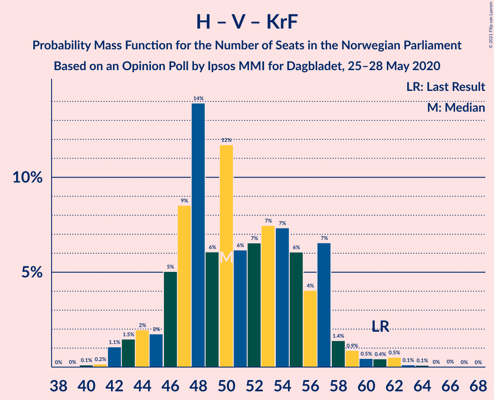

| Number of Seats | Probability | Accumulated | Special Marks |
|:---------------:|:-----------:|:-----------:|:-------------:|
| 40 | 0.1% | 100% |  |
| 41 | 0.2% | 99.9% |  |
| 42 | 1.1% | 99.7% |  |
| 43 | 1.5% | 98.6% |  |
| 44 | 2% | 97% |  |
| 45 | 2% | 95% |  |
| 46 | 5% | 93% |  |
| 47 | 9% | 88% |  |
| 48 | 14% | 80% |  |
| 49 | 6% | 66% | Median |
| 50 | 12% | 60% |  |
| 51 | 6% | 48% |  |
| 52 | 7% | 42% |  |
| 53 | 7% | 35% |  |
| 54 | 7% | 28% |  |
| 55 | 6% | 21% |  |
| 56 | 4% | 15% |  |
| 57 | 7% | 11% |  |
| 58 | 1.4% | 4% |  |
| 59 | 0.9% | 3% |  |
| 60 | 0.5% | 2% |  |
| 61 | 0.4% | 1.3% | Last Result |
| 62 | 0.5% | 0.8% |  |
| 63 | 0.1% | 0.3% |  |
| 64 | 0.1% | 0.2% |  |
| 65 | 0% | 0.1% |  |
| 66 | 0% | 0.1% |  |
| 67 | 0% | 0% |  |

### Senterpartiet – Venstre – Kristelig Folkeparti

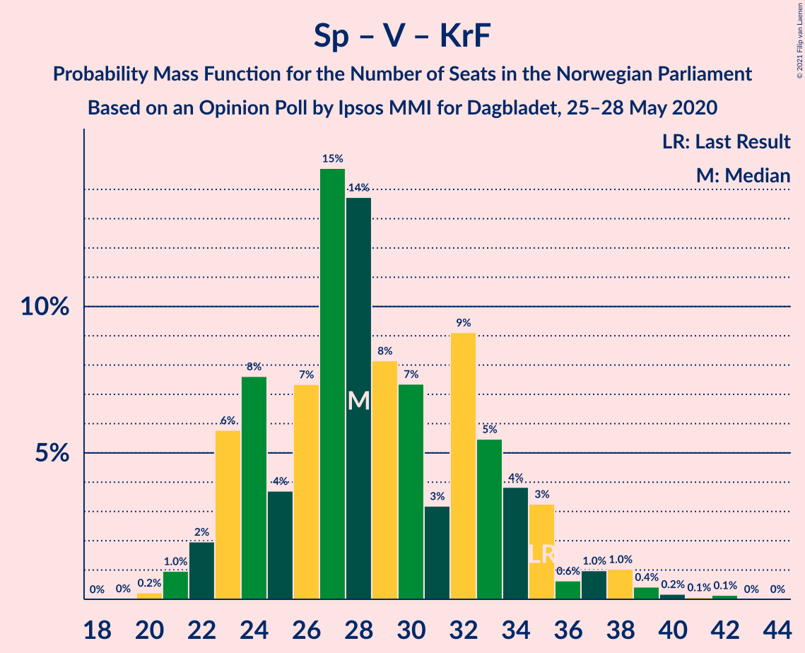

| Number of Seats | Probability | Accumulated | Special Marks |
|:---------------:|:-----------:|:-----------:|:-------------:|
| 20 | 0.2% | 100% |  |
| 21 | 1.0% | 99.7% |  |
| 22 | 2% | 98.8% |  |
| 23 | 6% | 97% |  |
| 24 | 8% | 91% |  |
| 25 | 4% | 83% |  |
| 26 | 7% | 80% |  |
| 27 | 15% | 72% | Median |
| 28 | 14% | 58% |  |
| 29 | 8% | 44% |  |
| 30 | 7% | 36% |  |
| 31 | 3% | 28% |  |
| 32 | 9% | 25% |  |
| 33 | 5% | 16% |  |
| 34 | 4% | 11% |  |
| 35 | 3% | 7% | Last Result |
| 36 | 0.6% | 4% |  |
| 37 | 1.0% | 3% |  |
| 38 | 1.0% | 2% |  |
| 39 | 0.4% | 0.9% |  |
| 40 | 0.2% | 0.4% |  |
| 41 | 0.1% | 0.3% |  |
| 42 | 0.1% | 0.2% |  |
| 43 | 0% | 0% |  |

## Technical Information

### Opinion Poll

+ **Polling firm:** Ipsos MMI
+ **Commissioner(s):** Dagbladet
+ **Fieldwork period:** 25–28 May 2020

### Calculations

+ **Sample size:** 702
+ **Simulations done:** 1,048,576
+ **Error estimate:** 2.03%

