# Opinion Poll by Kantar TNS for TV2, 25–29 May 2020

<a href="#voting-intentions">Voting Intentions</a> | <a href="#seats">Seats</a> | <a href="#coalitions">Coalitions</a> | <a href="#technical-information">Technical Information</a>

## Voting Intentions

### Confidence Intervals

| Party | Last Result | Poll Result | 80% Confidence Interval | 90% Confidence Interval | 95% Confidence Interval | 99% Confidence Interval |
|:-----:|:-----------:|:-----------:|:-----------------------:|:-----------------------:|:-----------------------:|:-----------------------:|
| Høyre | 25.0% | 27.3% | 25.3–29.5% |24.8–30.1% |24.3–30.6% |23.4–31.6% |
| Arbeiderpartiet | 27.4% | 23.4% | 21.6–25.5% |21.0–26.1% |20.6–26.6% |19.7–27.6% |
| Senterpartiet | 10.3% | 13.7% | 12.3–15.4% |11.8–15.9% |11.5–16.4% |10.8–17.2% |
| Fremskrittspartiet | 15.2% | 11.9% | 10.5–13.5% |10.2–14.0% |9.8–14.4% |9.2–15.2% |
| Sosialistisk Venstreparti | 6.0% | 7.3% | 6.2–8.6% |5.9–9.0% |5.6–9.3% |5.2–10.0% |
| Miljøpartiet De Grønne | 3.2% | 4.8% | 3.9–5.9% |3.7–6.2% |3.5–6.5% |3.1–7.1% |
| Rødt | 2.4% | 4.7% | 3.8–5.8% |3.6–6.1% |3.4–6.4% |3.0–7.0% |
| Kristelig Folkeparti | 4.2% | 3.5% | 2.8–4.5% |2.6–4.8% |2.4–5.0% |2.1–5.6% |
| Venstre | 4.4% | 1.6% | 1.1–2.3% |1.0–2.5% |0.9–2.7% |0.7–3.1% |

*Note:* The poll result column reflects the actual value used in the calculations. Published results may vary slightly, and in addition be rounded to fewer digits.

## Seats

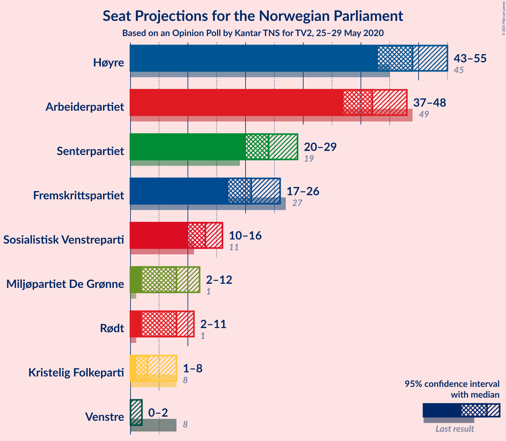

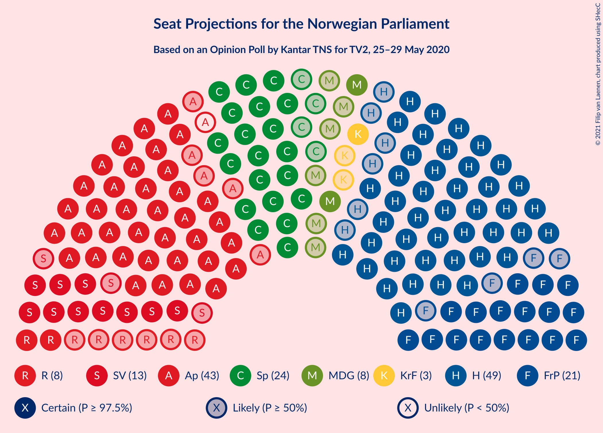

### Confidence Intervals

| Party | Last Result | Median | 80% Confidence Interval | 90% Confidence Interval | 95% Confidence Interval | 99% Confidence Interval |
|:-----:|:-----------:|:------:|:-----------------------:|:-----------------------:|:-----------------------:|:-----------------------:|
| <a href="#høyre">Høyre</a> | 45 | 49 | 44–53 |44–54 |43–55 |40–57 |
| <a href="#arbeiderpartiet">Arbeiderpartiet</a> | 49 | 42 | 39–46 |38–47 |37–48 |35–50 |
| <a href="#senterpartiet">Senterpartiet</a> | 19 | 24 | 21–28 |20–29 |20–29 |18–32 |
| <a href="#fremskrittspartiet">Fremskrittspartiet</a> | 27 | 21 | 18–24 |17–25 |17–26 |16–27 |
| <a href="#sosialistisk-venstreparti">Sosialistisk Venstreparti</a> | 11 | 13 | 11–15 |10–16 |10–16 |9–18 |
| <a href="#miljøpartiet-de-grønne">Miljøpartiet De Grønne</a> | 1 | 8 | 2–10 |2–11 |2–12 |2–13 |
| <a href="#rødt">Rødt</a> | 1 | 8 | 2–10 |2–11 |2–11 |2–12 |
| <a href="#kristelig-folkeparti">Kristelig Folkeparti</a> | 8 | 3 | 1–8 |1–8 |1–8 |0–9 |
| <a href="#venstre">Venstre</a> | 8 | 0 | 0–1 |0–2 |0–2 |0–2 |

### Høyre

*For a full overview of the results for this party, see the [Høyre](party-høyre.html) page.*

| Number of Seats | Probability | Accumulated | Special Marks |
|:---------------:|:-----------:|:-----------:|:-------------:|
| 38 | 0.1% | 100% |  |
| 39 | 0.1% | 99.9% |  |
| 40 | 0.4% | 99.8% |  |
| 41 | 0.6% | 99.4% |  |
| 42 | 1.2% | 98.8% |  |
| 43 | 3% | 98% |  |
| 44 | 5% | 95% |  |
| 45 | 4% | 90% | Last Result |
| 46 | 7% | 86% |  |
| 47 | 11% | 79% |  |
| 48 | 17% | 68% |  |
| 49 | 13% | 51% | Median |
| 50 | 9% | 37% |  |
| 51 | 13% | 28% |  |
| 52 | 4% | 15% |  |
| 53 | 5% | 11% |  |
| 54 | 3% | 6% |  |
| 55 | 1.1% | 3% |  |
| 56 | 0.7% | 2% |  |
| 57 | 1.4% | 2% |  |
| 58 | 0.2% | 0.3% |  |
| 59 | 0.1% | 0.1% |  |
| 60 | 0% | 0.1% |  |
| 61 | 0% | 0% |  |

### Arbeiderpartiet

*For a full overview of the results for this party, see the [Arbeiderpartiet](party-arbeiderpartiet.html) page.*

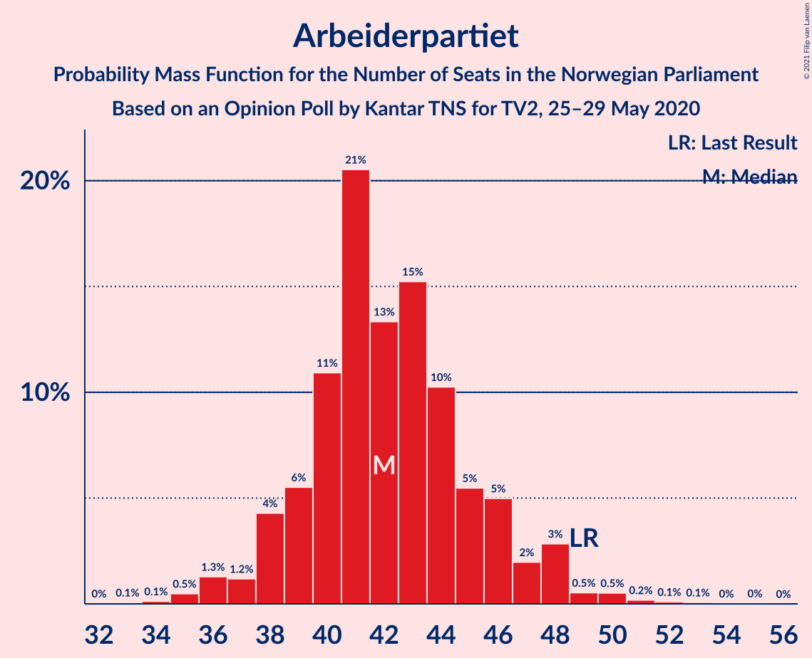

| Number of Seats | Probability | Accumulated | Special Marks |
|:---------------:|:-----------:|:-----------:|:-------------:|
| 33 | 0.1% | 100% |  |
| 34 | 0.1% | 99.9% |  |
| 35 | 0.5% | 99.8% |  |
| 36 | 1.3% | 99.3% |  |
| 37 | 1.2% | 98% |  |
| 38 | 4% | 97% |  |
| 39 | 6% | 93% |  |
| 40 | 11% | 87% |  |
| 41 | 21% | 76% |  |
| 42 | 13% | 56% | Median |
| 43 | 15% | 42% |  |
| 44 | 10% | 27% |  |
| 45 | 5% | 17% |  |
| 46 | 5% | 11% |  |
| 47 | 2% | 6% |  |
| 48 | 3% | 4% |  |
| 49 | 0.5% | 1.4% | Last Result |
| 50 | 0.5% | 0.9% |  |
| 51 | 0.2% | 0.4% |  |
| 52 | 0.1% | 0.2% |  |
| 53 | 0.1% | 0.1% |  |
| 54 | 0% | 0.1% |  |
| 55 | 0% | 0% |  |

### Senterpartiet

*For a full overview of the results for this party, see the [Senterpartiet](party-senterpartiet.html) page.*

| Number of Seats | Probability | Accumulated | Special Marks |
|:---------------:|:-----------:|:-----------:|:-------------:|
| 18 | 0.5% | 100% |  |
| 19 | 1.3% | 99.5% | Last Result |
| 20 | 4% | 98% |  |
| 21 | 5% | 94% |  |
| 22 | 10% | 89% |  |
| 23 | 13% | 79% |  |
| 24 | 18% | 66% | Median |
| 25 | 18% | 49% |  |
| 26 | 12% | 31% |  |
| 27 | 9% | 19% |  |
| 28 | 5% | 10% |  |
| 29 | 3% | 5% |  |
| 30 | 0.9% | 2% |  |
| 31 | 0.8% | 1.3% |  |
| 32 | 0.4% | 0.6% |  |
| 33 | 0.1% | 0.2% |  |
| 34 | 0.1% | 0.1% |  |
| 35 | 0% | 0% |  |

### Fremskrittspartiet

*For a full overview of the results for this party, see the [Fremskrittspartiet](party-fremskrittspartiet.html) page.*

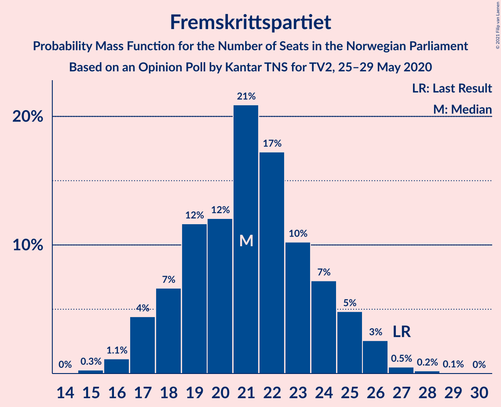

| Number of Seats | Probability | Accumulated | Special Marks |
|:---------------:|:-----------:|:-----------:|:-------------:|
| 15 | 0.3% | 100% |  |
| 16 | 1.1% | 99.7% |  |
| 17 | 4% | 98.5% |  |
| 18 | 7% | 94% |  |
| 19 | 12% | 87% |  |
| 20 | 12% | 76% |  |
| 21 | 21% | 64% | Median |
| 22 | 17% | 43% |  |
| 23 | 10% | 26% |  |
| 24 | 7% | 15% |  |
| 25 | 5% | 8% |  |
| 26 | 3% | 3% |  |
| 27 | 0.5% | 0.8% | Last Result |
| 28 | 0.2% | 0.3% |  |
| 29 | 0.1% | 0.1% |  |
| 30 | 0% | 0% |  |

### Sosialistisk Venstreparti

*For a full overview of the results for this party, see the [Sosialistisk Venstreparti](party-sosialistiskvenstreparti.html) page.*

| Number of Seats | Probability | Accumulated | Special Marks |
|:---------------:|:-----------:|:-----------:|:-------------:|
| 8 | 0.3% | 100% |  |
| 9 | 1.1% | 99.7% |  |
| 10 | 8% | 98.6% |  |
| 11 | 11% | 91% | Last Result |
| 12 | 21% | 80% |  |
| 13 | 23% | 58% | Median |
| 14 | 17% | 35% |  |
| 15 | 12% | 19% |  |
| 16 | 5% | 7% |  |
| 17 | 2% | 2% |  |
| 18 | 0.6% | 0.8% |  |
| 19 | 0.1% | 0.2% |  |
| 20 | 0% | 0% |  |

### Miljøpartiet De Grønne

*For a full overview of the results for this party, see the [Miljøpartiet De Grønne](party-miljøpartietdegrønne.html) page.*

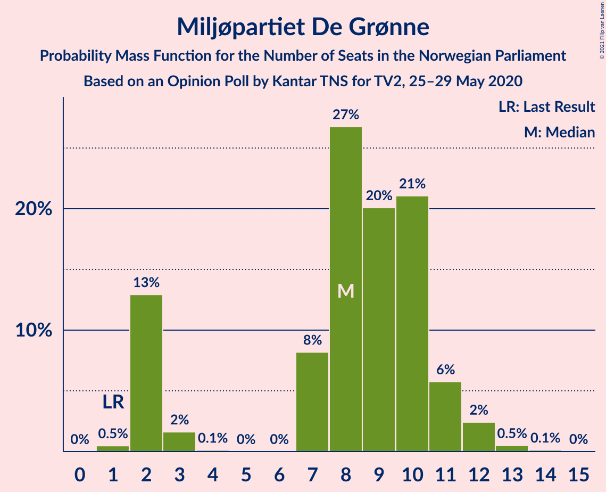

| Number of Seats | Probability | Accumulated | Special Marks |
|:---------------:|:-----------:|:-----------:|:-------------:|
| 1 | 0.5% | 100% | Last Result |
| 2 | 13% | 99.5% |  |
| 3 | 2% | 87% |  |
| 4 | 0.1% | 85% |  |
| 5 | 0% | 85% |  |
| 6 | 0% | 85% |  |
| 7 | 8% | 85% |  |
| 8 | 27% | 77% | Median |
| 9 | 20% | 50% |  |
| 10 | 21% | 30% |  |
| 11 | 6% | 9% |  |
| 12 | 2% | 3% |  |
| 13 | 0.5% | 0.6% |  |
| 14 | 0.1% | 0.1% |  |
| 15 | 0% | 0% |  |

### Rødt

*For a full overview of the results for this party, see the [Rødt](party-rødt.html) page.*

| Number of Seats | Probability | Accumulated | Special Marks |
|:---------------:|:-----------:|:-----------:|:-------------:|
| 1 | 0.2% | 100% | Last Result |
| 2 | 16% | 99.8% |  |
| 3 | 0% | 83% |  |
| 4 | 0% | 83% |  |
| 5 | 0% | 83% |  |
| 6 | 0% | 83% |  |
| 7 | 13% | 83% |  |
| 8 | 27% | 70% | Median |
| 9 | 21% | 43% |  |
| 10 | 15% | 22% |  |
| 11 | 5% | 7% |  |
| 12 | 2% | 2% |  |
| 13 | 0.3% | 0.3% |  |
| 14 | 0% | 0% |  |

### Kristelig Folkeparti

*For a full overview of the results for this party, see the [Kristelig Folkeparti](party-kristeligfolkeparti.html) page.*

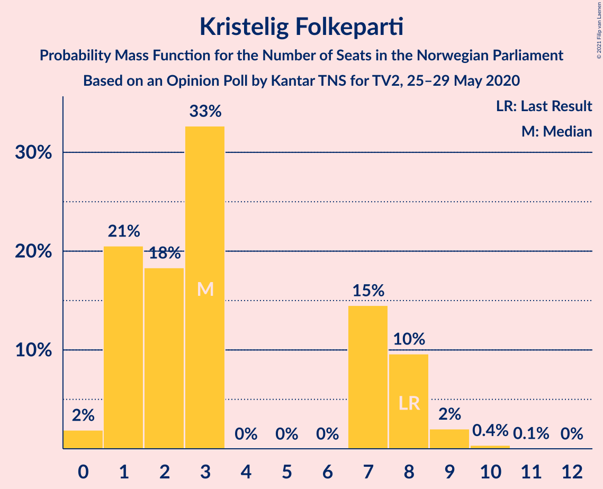

| Number of Seats | Probability | Accumulated | Special Marks |
|:---------------:|:-----------:|:-----------:|:-------------:|
| 0 | 2% | 100% |  |
| 1 | 21% | 98% |  |
| 2 | 18% | 78% |  |
| 3 | 33% | 59% | Median |
| 4 | 0% | 27% |  |
| 5 | 0% | 27% |  |
| 6 | 0% | 27% |  |
| 7 | 15% | 27% |  |
| 8 | 10% | 12% | Last Result |
| 9 | 2% | 2% |  |
| 10 | 0.4% | 0.4% |  |
| 11 | 0.1% | 0.1% |  |
| 12 | 0% | 0% |  |

### Venstre

*For a full overview of the results for this party, see the [Venstre](party-venstre.html) page.*

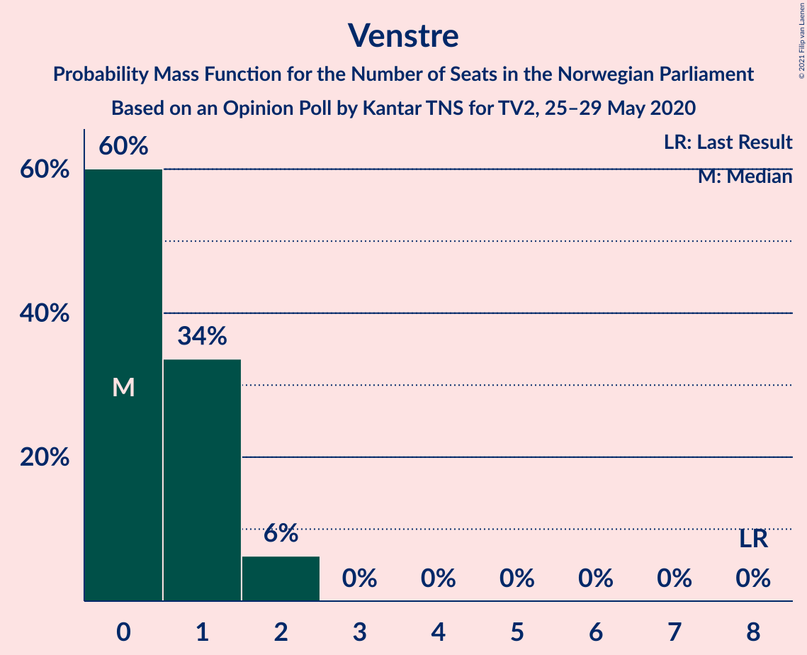

| Number of Seats | Probability | Accumulated | Special Marks |
|:---------------:|:-----------:|:-----------:|:-------------:|
| 0 | 60% | 100% | Median |
| 1 | 34% | 40% |  |
| 2 | 6% | 6% |  |
| 3 | 0% | 0% |  |
| 4 | 0% | 0% |  |
| 5 | 0% | 0% |  |
| 6 | 0% | 0% |  |
| 7 | 0% | 0% |  |
| 8 | 0% | 0% | Last Result |

## Coalitions

### Confidence Intervals

| Coalition | Last Result | Median | Majority? | 80% Confidence Interval | 90% Confidence Interval | 95% Confidence Interval | 99% Confidence Interval |
|:---------:|:-----------:|:------:|:---------:|:-----------------------:|:-----------------------:|:-----------------------:|:-----------------------:|
| Høyre – Senterpartiet – Fremskrittspartiet – Kristelig Folkeparti – Venstre | 107 | 98 | 100% | 94–103 | 92–105 | 91–107 | 89–108 |
| Arbeiderpartiet – Senterpartiet – Sosialistisk Venstreparti – Miljøpartiet De Grønne – Rødt | 81 | 95 | 99.7% | 90–100 | 89–101 | 87–103 | 85–105 |
| Arbeiderpartiet – Senterpartiet – Sosialistisk Venstreparti – Miljøpartiet De Grønne – Kristelig Folkeparti | 88 | 91 | 96% | 86–96 | 85–98 | 83–99 | 82–102 |
| Arbeiderpartiet – Senterpartiet – Sosialistisk Venstreparti – Miljøpartiet De Grønne | 80 | 88 | 75% | 83–93 | 81–94 | 80–95 | 78–98 |
| Arbeiderpartiet – Senterpartiet – Sosialistisk Venstreparti – Rødt | 80 | 86 | 73% | 82–93 | 81–94 | 80–95 | 77–97 |
| Høyre – Fremskrittspartiet – Miljøpartiet De Grønne – Kristelig Folkeparti – Venstre | 89 | 83 | 27% | 76–87 | 75–88 | 74–89 | 72–92 |
| Arbeiderpartiet – Senterpartiet – Sosialistisk Venstreparti | 79 | 79 | 8% | 75–84 | 74–85 | 72–87 | 71–90 |
| Arbeiderpartiet – Senterpartiet – Miljøpartiet De Grønne – Kristelig Folkeparti | 77 | 78 | 7% | 73–83 | 72–85 | 70–86 | 68–89 |
| Høyre – Fremskrittspartiet – Kristelig Folkeparti – Venstre | 88 | 74 | 0.3% | 69–79 | 68–80 | 66–82 | 64–84 |
| Høyre – Fremskrittspartiet | 72 | 70 | 0% | 65–75 | 64–76 | 63–79 | 60–79 |
| Høyre – Fremskrittspartiet – Venstre | 80 | 70 | 0% | 66–75 | 64–76 | 63–79 | 60–80 |
| Arbeiderpartiet – Senterpartiet – Kristelig Folkeparti | 76 | 70 | 0% | 66–75 | 64–76 | 64–78 | 61–80 |
| Arbeiderpartiet – Senterpartiet | 68 | 66 | 0% | 63–71 | 61–72 | 61–74 | 58–76 |
| Arbeiderpartiet – Sosialistisk Venstreparti | 60 | 55 | 0% | 51–59 | 50–60 | 49–61 | 48–64 |
| Høyre – Kristelig Folkeparti – Venstre | 61 | 52 | 0% | 48–57 | 47–59 | 45–61 | 44–62 |
| Senterpartiet – Kristelig Folkeparti – Venstre | 35 | 28 | 0% | 25–32 | 24–34 | 23–36 | 21–38 |

### Høyre – Senterpartiet – Fremskrittspartiet – Kristelig Folkeparti – Venstre

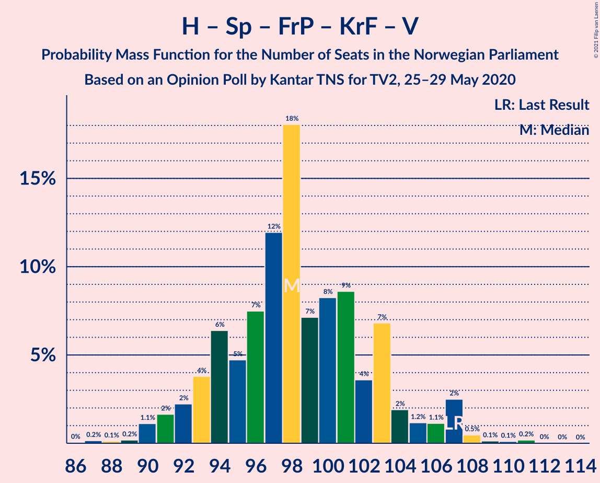

| Number of Seats | Probability | Accumulated | Special Marks |
|:---------------:|:-----------:|:-----------:|:-------------:|
| 86 | 0% | 100% |  |
| 87 | 0.2% | 99.9% |  |
| 88 | 0.1% | 99.8% |  |
| 89 | 0.2% | 99.7% |  |
| 90 | 1.1% | 99.5% |  |
| 91 | 2% | 98% |  |
| 92 | 2% | 97% |  |
| 93 | 4% | 94% |  |
| 94 | 6% | 91% |  |
| 95 | 5% | 84% |  |
| 96 | 7% | 80% |  |
| 97 | 12% | 72% | Median |
| 98 | 18% | 60% |  |
| 99 | 7% | 42% |  |
| 100 | 8% | 35% |  |
| 101 | 9% | 27% |  |
| 102 | 4% | 18% |  |
| 103 | 7% | 14% |  |
| 104 | 2% | 8% |  |
| 105 | 1.2% | 6% |  |
| 106 | 1.1% | 5% |  |
| 107 | 2% | 3% | Last Result |
| 108 | 0.5% | 1.0% |  |
| 109 | 0.1% | 0.5% |  |
| 110 | 0.1% | 0.4% |  |
| 111 | 0.2% | 0.3% |  |
| 112 | 0% | 0.1% |  |
| 113 | 0% | 0% |  |

### Arbeiderpartiet – Senterpartiet – Sosialistisk Venstreparti – Miljøpartiet De Grønne – Rødt

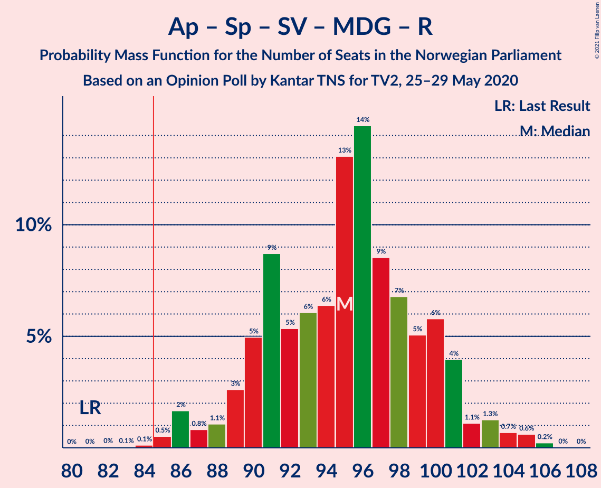

| Number of Seats | Probability | Accumulated | Special Marks |
|:---------------:|:-----------:|:-----------:|:-------------:|
| 81 | 0% | 100% | Last Result |
| 82 | 0% | 100% |  |
| 83 | 0.1% | 99.9% |  |
| 84 | 0.1% | 99.9% |  |
| 85 | 0.5% | 99.7% | Majority |
| 86 | 2% | 99.2% |  |
| 87 | 0.8% | 98% |  |
| 88 | 1.1% | 97% |  |
| 89 | 3% | 96% |  |
| 90 | 5% | 93% |  |
| 91 | 9% | 88% |  |
| 92 | 5% | 79% |  |
| 93 | 6% | 74% |  |
| 94 | 6% | 68% |  |
| 95 | 13% | 62% | Median |
| 96 | 14% | 49% |  |
| 97 | 9% | 34% |  |
| 98 | 7% | 26% |  |
| 99 | 5% | 19% |  |
| 100 | 6% | 14% |  |
| 101 | 4% | 8% |  |
| 102 | 1.1% | 4% |  |
| 103 | 1.3% | 3% |  |
| 104 | 0.7% | 2% |  |
| 105 | 0.6% | 0.9% |  |
| 106 | 0.2% | 0.3% |  |
| 107 | 0% | 0.1% |  |
| 108 | 0% | 0% |  |

### Arbeiderpartiet – Senterpartiet – Sosialistisk Venstreparti – Miljøpartiet De Grønne – Kristelig Folkeparti

| Number of Seats | Probability | Accumulated | Special Marks |
|:---------------:|:-----------:|:-----------:|:-------------:|
| 79 | 0.1% | 100% |  |
| 80 | 0.1% | 99.9% |  |
| 81 | 0.2% | 99.8% |  |
| 82 | 0.7% | 99.5% |  |
| 83 | 2% | 98.8% |  |
| 84 | 1.3% | 97% |  |
| 85 | 2% | 96% | Majority |
| 86 | 5% | 93% |  |
| 87 | 5% | 88% |  |
| 88 | 11% | 84% | Last Result |
| 89 | 5% | 73% |  |
| 90 | 11% | 68% | Median |
| 91 | 17% | 57% |  |
| 92 | 8% | 40% |  |
| 93 | 6% | 32% |  |
| 94 | 6% | 26% |  |
| 95 | 6% | 20% |  |
| 96 | 6% | 14% |  |
| 97 | 2% | 8% |  |
| 98 | 2% | 5% |  |
| 99 | 2% | 4% |  |
| 100 | 0.7% | 2% |  |
| 101 | 0.2% | 0.8% |  |
| 102 | 0.4% | 0.6% |  |
| 103 | 0.1% | 0.2% |  |
| 104 | 0.1% | 0.1% |  |
| 105 | 0% | 0% |  |

### Arbeiderpartiet – Senterpartiet – Sosialistisk Venstreparti – Miljøpartiet De Grønne

| Number of Seats | Probability | Accumulated | Special Marks |
|:---------------:|:-----------:|:-----------:|:-------------:|
| 75 | 0% | 100% |  |
| 76 | 0.1% | 99.9% |  |
| 77 | 0.2% | 99.9% |  |
| 78 | 0.3% | 99.7% |  |
| 79 | 0.7% | 99.4% |  |
| 80 | 2% | 98.7% | Last Result |
| 81 | 3% | 97% |  |
| 82 | 3% | 94% |  |
| 83 | 8% | 91% |  |
| 84 | 8% | 83% |  |
| 85 | 6% | 75% | Majority |
| 86 | 10% | 69% |  |
| 87 | 7% | 59% | Median |
| 88 | 15% | 52% |  |
| 89 | 7% | 37% |  |
| 90 | 7% | 29% |  |
| 91 | 5% | 22% |  |
| 92 | 6% | 17% |  |
| 93 | 5% | 11% |  |
| 94 | 3% | 6% |  |
| 95 | 1.1% | 3% |  |
| 96 | 1.3% | 2% |  |
| 97 | 0.4% | 1.0% |  |
| 98 | 0.4% | 0.7% |  |
| 99 | 0.1% | 0.2% |  |
| 100 | 0.1% | 0.2% |  |
| 101 | 0.1% | 0.1% |  |
| 102 | 0% | 0% |  |

### Arbeiderpartiet – Senterpartiet – Sosialistisk Venstreparti – Rødt

| Number of Seats | Probability | Accumulated | Special Marks |
|:---------------:|:-----------:|:-----------:|:-------------:|
| 75 | 0.3% | 100% |  |
| 76 | 0.1% | 99.7% |  |
| 77 | 0.3% | 99.5% |  |
| 78 | 0.4% | 99.2% |  |
| 79 | 0.4% | 98.8% |  |
| 80 | 1.2% | 98% | Last Result |
| 81 | 2% | 97% |  |
| 82 | 6% | 95% |  |
| 83 | 8% | 89% |  |
| 84 | 8% | 81% |  |
| 85 | 9% | 73% | Majority |
| 86 | 15% | 63% |  |
| 87 | 5% | 49% | Median |
| 88 | 5% | 44% |  |
| 89 | 9% | 39% |  |
| 90 | 7% | 30% |  |
| 91 | 7% | 23% |  |
| 92 | 5% | 16% |  |
| 93 | 6% | 11% |  |
| 94 | 2% | 5% |  |
| 95 | 1.3% | 3% |  |
| 96 | 0.7% | 1.5% |  |
| 97 | 0.4% | 0.8% |  |
| 98 | 0.2% | 0.4% |  |
| 99 | 0.1% | 0.1% |  |
| 100 | 0% | 0.1% |  |
| 101 | 0% | 0.1% |  |
| 102 | 0% | 0% |  |

### Høyre – Fremskrittspartiet – Miljøpartiet De Grønne – Kristelig Folkeparti – Venstre

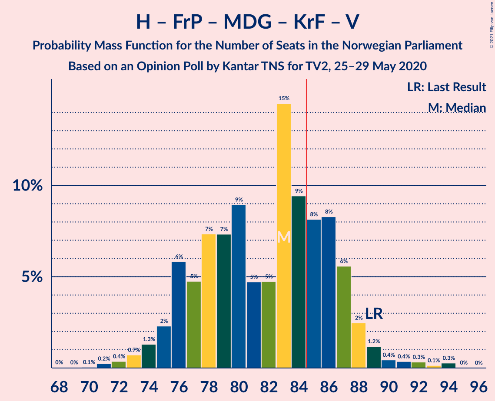

| Number of Seats | Probability | Accumulated | Special Marks |
|:---------------:|:-----------:|:-----------:|:-------------:|
| 68 | 0% | 100% |  |
| 69 | 0% | 99.9% |  |
| 70 | 0.1% | 99.9% |  |
| 71 | 0.2% | 99.9% |  |
| 72 | 0.4% | 99.6% |  |
| 73 | 0.7% | 99.2% |  |
| 74 | 1.3% | 98.5% |  |
| 75 | 2% | 97% |  |
| 76 | 6% | 95% |  |
| 77 | 5% | 89% |  |
| 78 | 7% | 84% |  |
| 79 | 7% | 77% |  |
| 80 | 9% | 70% |  |
| 81 | 5% | 61% | Median |
| 82 | 5% | 56% |  |
| 83 | 15% | 51% |  |
| 84 | 9% | 37% |  |
| 85 | 8% | 27% | Majority |
| 86 | 8% | 19% |  |
| 87 | 6% | 11% |  |
| 88 | 2% | 5% |  |
| 89 | 1.2% | 3% | Last Result |
| 90 | 0.4% | 2% |  |
| 91 | 0.4% | 1.2% |  |
| 92 | 0.3% | 0.8% |  |
| 93 | 0.1% | 0.5% |  |
| 94 | 0.3% | 0.3% |  |
| 95 | 0% | 0% |  |

### Arbeiderpartiet – Senterpartiet – Sosialistisk Venstreparti

| Number of Seats | Probability | Accumulated | Special Marks |
|:---------------:|:-----------:|:-----------:|:-------------:|
| 68 | 0.1% | 100% |  |
| 69 | 0.1% | 99.9% |  |
| 70 | 0.3% | 99.8% |  |
| 71 | 0.5% | 99.6% |  |
| 72 | 2% | 99.0% |  |
| 73 | 2% | 97% |  |
| 74 | 3% | 96% |  |
| 75 | 6% | 92% |  |
| 76 | 10% | 87% |  |
| 77 | 6% | 77% |  |
| 78 | 12% | 71% |  |
| 79 | 12% | 58% | Last Result, Median |
| 80 | 7% | 47% |  |
| 81 | 8% | 40% |  |
| 82 | 7% | 32% |  |
| 83 | 11% | 25% |  |
| 84 | 5% | 13% |  |
| 85 | 3% | 8% | Majority |
| 86 | 2% | 5% |  |
| 87 | 1.4% | 3% |  |
| 88 | 0.8% | 2% |  |
| 89 | 0.3% | 0.9% |  |
| 90 | 0.2% | 0.6% |  |
| 91 | 0.2% | 0.4% |  |
| 92 | 0.1% | 0.1% |  |
| 93 | 0.1% | 0.1% |  |
| 94 | 0% | 0% |  |

### Arbeiderpartiet – Senterpartiet – Miljøpartiet De Grønne – Kristelig Folkeparti

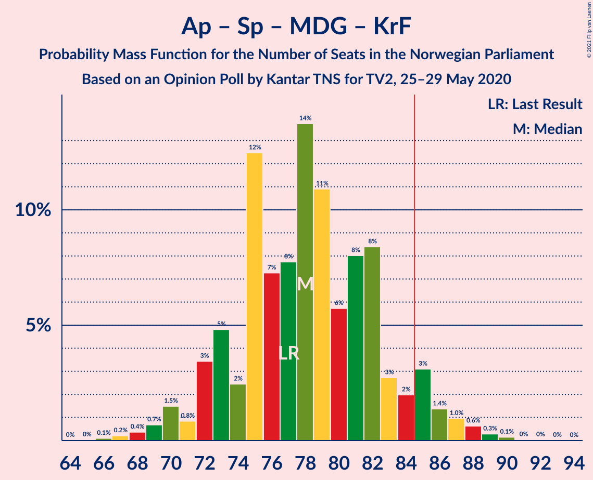

| Number of Seats | Probability | Accumulated | Special Marks |
|:---------------:|:-----------:|:-----------:|:-------------:|
| 65 | 0% | 100% |  |
| 66 | 0.1% | 99.9% |  |
| 67 | 0.2% | 99.8% |  |
| 68 | 0.4% | 99.6% |  |
| 69 | 0.7% | 99.3% |  |
| 70 | 1.5% | 98.6% |  |
| 71 | 0.8% | 97% |  |
| 72 | 3% | 96% |  |
| 73 | 5% | 93% |  |
| 74 | 2% | 88% |  |
| 75 | 12% | 86% |  |
| 76 | 7% | 73% |  |
| 77 | 8% | 66% | Last Result, Median |
| 78 | 14% | 58% |  |
| 79 | 11% | 44% |  |
| 80 | 6% | 33% |  |
| 81 | 8% | 28% |  |
| 82 | 8% | 20% |  |
| 83 | 3% | 11% |  |
| 84 | 2% | 9% |  |
| 85 | 3% | 7% | Majority |
| 86 | 1.4% | 3% |  |
| 87 | 1.0% | 2% |  |
| 88 | 0.6% | 1.2% |  |
| 89 | 0.3% | 0.5% |  |
| 90 | 0.1% | 0.2% |  |
| 91 | 0% | 0.1% |  |
| 92 | 0% | 0.1% |  |
| 93 | 0% | 0% |  |

### Høyre – Fremskrittspartiet – Kristelig Folkeparti – Venstre

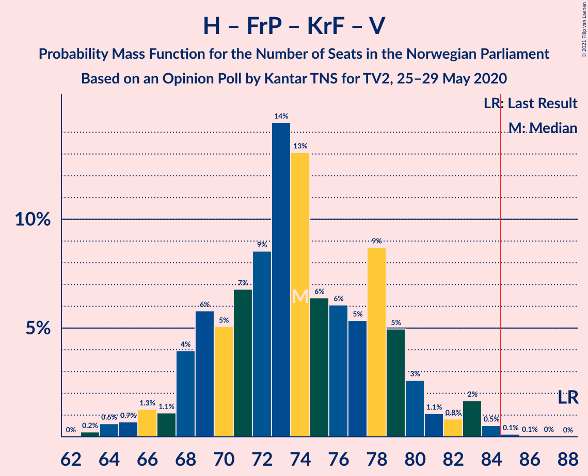

| Number of Seats | Probability | Accumulated | Special Marks |
|:---------------:|:-----------:|:-----------:|:-------------:|
| 62 | 0% | 100% |  |
| 63 | 0.2% | 99.9% |  |
| 64 | 0.6% | 99.7% |  |
| 65 | 0.7% | 99.1% |  |
| 66 | 1.3% | 98% |  |
| 67 | 1.1% | 97% |  |
| 68 | 4% | 96% |  |
| 69 | 6% | 92% |  |
| 70 | 5% | 86% |  |
| 71 | 7% | 81% |  |
| 72 | 9% | 74% |  |
| 73 | 14% | 66% | Median |
| 74 | 13% | 51% |  |
| 75 | 6% | 38% |  |
| 76 | 6% | 32% |  |
| 77 | 5% | 26% |  |
| 78 | 9% | 21% |  |
| 79 | 5% | 12% |  |
| 80 | 3% | 7% |  |
| 81 | 1.1% | 4% |  |
| 82 | 0.8% | 3% |  |
| 83 | 2% | 2% |  |
| 84 | 0.5% | 0.8% |  |
| 85 | 0.1% | 0.3% | Majority |
| 86 | 0.1% | 0.1% |  |
| 87 | 0% | 0.1% |  |
| 88 | 0% | 0% | Last Result |

### Høyre – Fremskrittspartiet

| Number of Seats | Probability | Accumulated | Special Marks |
|:---------------:|:-----------:|:-----------:|:-------------:|
| 57 | 0.1% | 100% |  |
| 58 | 0.1% | 99.9% |  |
| 59 | 0.2% | 99.8% |  |
| 60 | 0.3% | 99.6% |  |
| 61 | 0.5% | 99.3% |  |
| 62 | 0.9% | 98.9% |  |
| 63 | 2% | 98% |  |
| 64 | 2% | 96% |  |
| 65 | 5% | 94% |  |
| 66 | 4% | 89% |  |
| 67 | 8% | 85% |  |
| 68 | 9% | 77% |  |
| 69 | 12% | 68% |  |
| 70 | 19% | 56% | Median |
| 71 | 13% | 37% |  |
| 72 | 4% | 25% | Last Result |
| 73 | 7% | 21% |  |
| 74 | 2% | 14% |  |
| 75 | 5% | 12% |  |
| 76 | 3% | 7% |  |
| 77 | 1.0% | 4% |  |
| 78 | 0.3% | 3% |  |
| 79 | 2% | 3% |  |
| 80 | 0.2% | 0.3% |  |
| 81 | 0.1% | 0.1% |  |
| 82 | 0% | 0.1% |  |
| 83 | 0% | 0.1% |  |
| 84 | 0% | 0% |  |

### Høyre – Fremskrittspartiet – Venstre

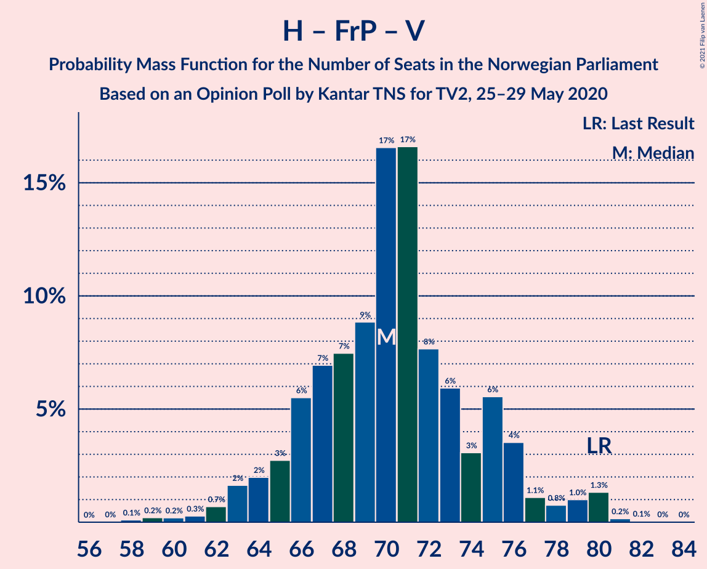

| Number of Seats | Probability | Accumulated | Special Marks |
|:---------------:|:-----------:|:-----------:|:-------------:|
| 58 | 0.1% | 100% |  |
| 59 | 0.2% | 99.9% |  |
| 60 | 0.2% | 99.7% |  |
| 61 | 0.3% | 99.5% |  |
| 62 | 0.7% | 99.2% |  |
| 63 | 2% | 98% |  |
| 64 | 2% | 97% |  |
| 65 | 3% | 95% |  |
| 66 | 6% | 92% |  |
| 67 | 7% | 87% |  |
| 68 | 7% | 80% |  |
| 69 | 9% | 72% |  |
| 70 | 17% | 63% | Median |
| 71 | 17% | 47% |  |
| 72 | 8% | 30% |  |
| 73 | 6% | 23% |  |
| 74 | 3% | 17% |  |
| 75 | 6% | 14% |  |
| 76 | 4% | 8% |  |
| 77 | 1.1% | 4% |  |
| 78 | 0.8% | 3% |  |
| 79 | 1.0% | 3% |  |
| 80 | 1.3% | 2% | Last Result |
| 81 | 0.2% | 0.3% |  |
| 82 | 0.1% | 0.1% |  |
| 83 | 0% | 0.1% |  |
| 84 | 0% | 0% |  |

### Arbeiderpartiet – Senterpartiet – Kristelig Folkeparti

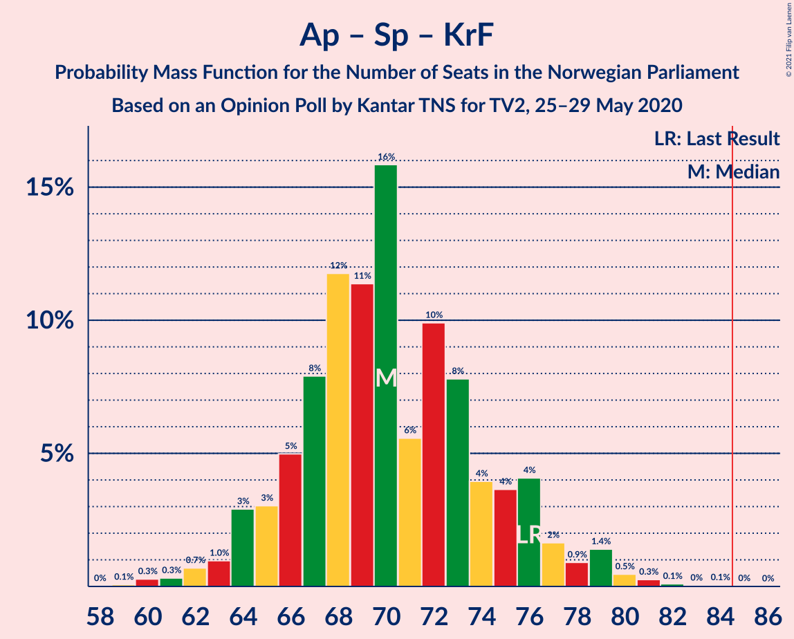

| Number of Seats | Probability | Accumulated | Special Marks |
|:---------------:|:-----------:|:-----------:|:-------------:|
| 59 | 0.1% | 100% |  |
| 60 | 0.3% | 99.9% |  |
| 61 | 0.3% | 99.6% |  |
| 62 | 0.7% | 99.3% |  |
| 63 | 1.0% | 98.6% |  |
| 64 | 3% | 98% |  |
| 65 | 3% | 95% |  |
| 66 | 5% | 92% |  |
| 67 | 8% | 87% |  |
| 68 | 12% | 79% |  |
| 69 | 11% | 67% | Median |
| 70 | 16% | 56% |  |
| 71 | 6% | 40% |  |
| 72 | 10% | 34% |  |
| 73 | 8% | 24% |  |
| 74 | 4% | 17% |  |
| 75 | 4% | 13% |  |
| 76 | 4% | 9% | Last Result |
| 77 | 2% | 5% |  |
| 78 | 0.9% | 3% |  |
| 79 | 1.4% | 2% |  |
| 80 | 0.5% | 0.9% |  |
| 81 | 0.3% | 0.5% |  |
| 82 | 0.1% | 0.2% |  |
| 83 | 0% | 0.1% |  |
| 84 | 0.1% | 0.1% |  |
| 85 | 0% | 0% | Majority |

### Arbeiderpartiet – Senterpartiet

| Number of Seats | Probability | Accumulated | Special Marks |
|:---------------:|:-----------:|:-----------:|:-------------:|
| 56 | 0% | 100% |  |
| 57 | 0.1% | 99.9% |  |
| 58 | 0.5% | 99.9% |  |
| 59 | 0.8% | 99.4% |  |
| 60 | 0.8% | 98.6% |  |
| 61 | 3% | 98% |  |
| 62 | 2% | 95% |  |
| 63 | 11% | 92% |  |
| 64 | 10% | 81% |  |
| 65 | 7% | 72% |  |
| 66 | 16% | 64% | Median |
| 67 | 11% | 48% |  |
| 68 | 7% | 37% | Last Result |
| 69 | 12% | 30% |  |
| 70 | 7% | 18% |  |
| 71 | 3% | 11% |  |
| 72 | 3% | 8% |  |
| 73 | 2% | 5% |  |
| 74 | 1.3% | 3% |  |
| 75 | 0.8% | 1.5% |  |
| 76 | 0.3% | 0.6% |  |
| 77 | 0.2% | 0.4% |  |
| 78 | 0.1% | 0.2% |  |
| 79 | 0.1% | 0.1% |  |
| 80 | 0% | 0% |  |

### Arbeiderpartiet – Sosialistisk Venstreparti

| Number of Seats | Probability | Accumulated | Special Marks |
|:---------------:|:-----------:|:-----------:|:-------------:|
| 45 | 0.1% | 100% |  |
| 46 | 0.1% | 99.9% |  |
| 47 | 0.2% | 99.8% |  |
| 48 | 0.8% | 99.5% |  |
| 49 | 2% | 98.8% |  |
| 50 | 3% | 97% |  |
| 51 | 5% | 94% |  |
| 52 | 6% | 89% |  |
| 53 | 16% | 83% |  |
| 54 | 12% | 67% |  |
| 55 | 10% | 55% | Median |
| 56 | 15% | 45% |  |
| 57 | 9% | 30% |  |
| 58 | 8% | 21% |  |
| 59 | 6% | 13% |  |
| 60 | 3% | 7% | Last Result |
| 61 | 2% | 4% |  |
| 62 | 0.5% | 2% |  |
| 63 | 0.9% | 1.4% |  |
| 64 | 0.3% | 0.6% |  |
| 65 | 0.1% | 0.3% |  |
| 66 | 0.1% | 0.1% |  |
| 67 | 0% | 0% |  |

### Høyre – Kristelig Folkeparti – Venstre

| Number of Seats | Probability | Accumulated | Special Marks |
|:---------------:|:-----------:|:-----------:|:-------------:|
| 42 | 0.1% | 100% |  |
| 43 | 0.2% | 99.8% |  |
| 44 | 0.6% | 99.6% |  |
| 45 | 2% | 99.0% |  |
| 46 | 1.1% | 97% |  |
| 47 | 4% | 96% |  |
| 48 | 7% | 92% |  |
| 49 | 5% | 85% |  |
| 50 | 8% | 81% |  |
| 51 | 10% | 72% |  |
| 52 | 13% | 63% | Median |
| 53 | 11% | 50% |  |
| 54 | 5% | 38% |  |
| 55 | 5% | 33% |  |
| 56 | 11% | 28% |  |
| 57 | 7% | 17% |  |
| 58 | 3% | 9% |  |
| 59 | 3% | 6% |  |
| 60 | 1.1% | 4% |  |
| 61 | 2% | 3% | Last Result |
| 62 | 0.4% | 0.8% |  |
| 63 | 0.1% | 0.4% |  |
| 64 | 0.1% | 0.3% |  |
| 65 | 0.2% | 0.2% |  |
| 66 | 0% | 0% |  |

### Senterpartiet – Kristelig Folkeparti – Venstre

| Number of Seats | Probability | Accumulated | Special Marks |
|:---------------:|:-----------:|:-----------:|:-------------:|
| 19 | 0.1% | 100% |  |
| 20 | 0.2% | 99.9% |  |
| 21 | 0.4% | 99.7% |  |
| 22 | 1.4% | 99.4% |  |
| 23 | 2% | 98% |  |
| 24 | 5% | 96% |  |
| 25 | 10% | 91% |  |
| 26 | 7% | 81% |  |
| 27 | 16% | 74% | Median |
| 28 | 10% | 59% |  |
| 29 | 13% | 49% |  |
| 30 | 10% | 36% |  |
| 31 | 10% | 26% |  |
| 32 | 6% | 16% |  |
| 33 | 3% | 9% |  |
| 34 | 2% | 6% |  |
| 35 | 2% | 4% | Last Result |
| 36 | 1.2% | 3% |  |
| 37 | 0.8% | 1.3% |  |
| 38 | 0.3% | 0.5% |  |
| 39 | 0.1% | 0.3% |  |
| 40 | 0.1% | 0.2% |  |
| 41 | 0.1% | 0.1% |  |
| 42 | 0% | 0% |  |

## Technical Information

### Opinion Poll

+ **Polling firm:** Kantar TNS
+ **Commissioner(s):** TV2
+ **Fieldwork period:** 25–29 May 2020

### Calculations

+ **Sample size:** 772
+ **Simulations done:** 1,048,576
+ **Error estimate:** 0.94%

