# Opinion Poll by Norstat for Aftenposten and NRK, 15–21 June 2020

<a href="#voting-intentions">Voting Intentions</a> | <a href="#seats">Seats</a> | <a href="#coalitions">Coalitions</a> | <a href="#technical-information">Technical Information</a>

## Voting Intentions

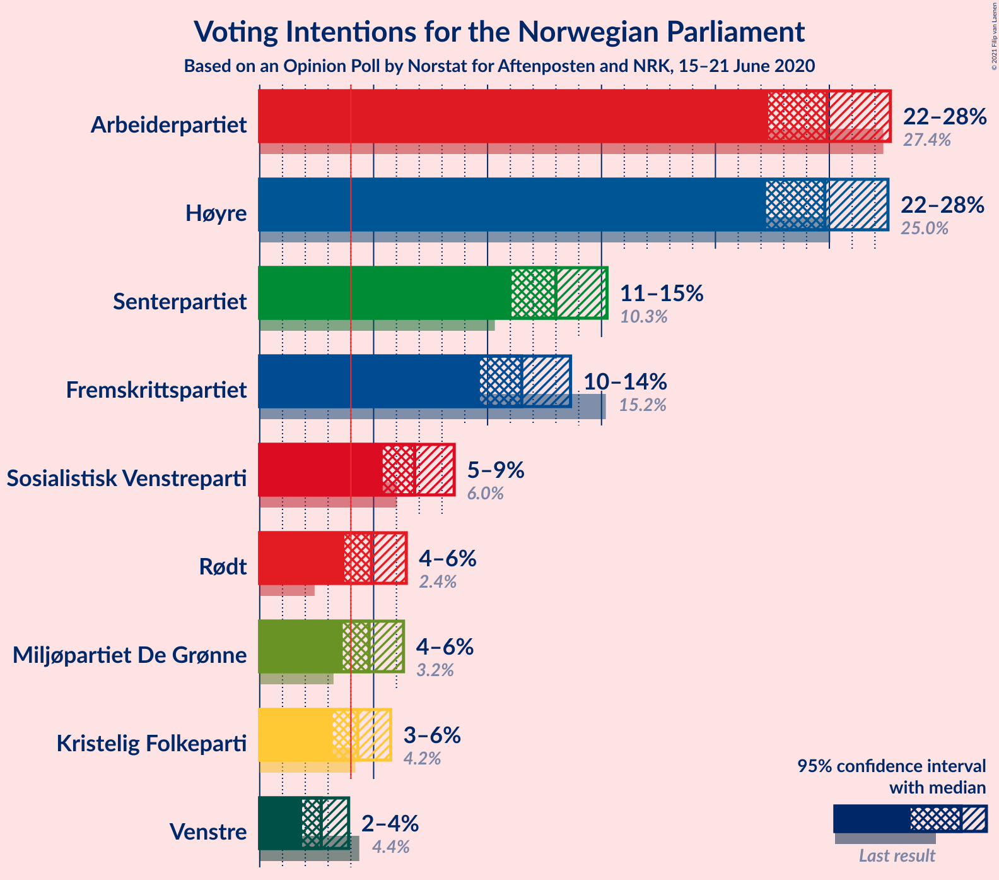

### Confidence Intervals

| Party | Last Result | Poll Result | 80% Confidence Interval | 90% Confidence Interval | 95% Confidence Interval | 99% Confidence Interval |
|:-----:|:-----------:|:-----------:|:-----------------------:|:-----------------------:|:-----------------------:|:-----------------------:|
| Arbeiderpartiet | 27.4% | 24.9% | 23.2–26.7% |22.7–27.2% |22.3–27.7% |21.5–28.6% |
| Høyre | 25.0% | 24.8% | 23.1–26.6% |22.6–27.1% |22.2–27.6% |21.4–28.5% |
| Senterpartiet | 10.3% | 13.0% | 11.7–14.5% |11.4–14.9% |11.1–15.2% |10.5–16.0% |
| Fremskrittspartiet | 15.2% | 11.5% | 10.3–12.9% |10.0–13.3% |9.7–13.6% |9.1–14.3% |
| Sosialistisk Venstreparti | 6.0% | 6.8% | 5.9–7.9% |5.6–8.3% |5.4–8.5% |5.0–9.1% |
| Rødt | 2.4% | 4.9% | 4.1–5.9% |3.9–6.2% |3.7–6.4% |3.4–6.9% |
| Miljøpartiet De Grønne | 3.2% | 4.8% | 4.0–5.8% |3.8–6.1% |3.6–6.3% |3.3–6.8% |
| Kristelig Folkeparti | 4.2% | 4.3% | 3.6–5.2% |3.4–5.5% |3.2–5.7% |2.9–6.2% |
| Venstre | 4.4% | 2.7% | 2.1–3.5% |2.0–3.7% |1.9–3.9% |1.6–4.3% |

*Note:* The poll result column reflects the actual value used in the calculations. Published results may vary slightly, and in addition be rounded to fewer digits.

## Seats

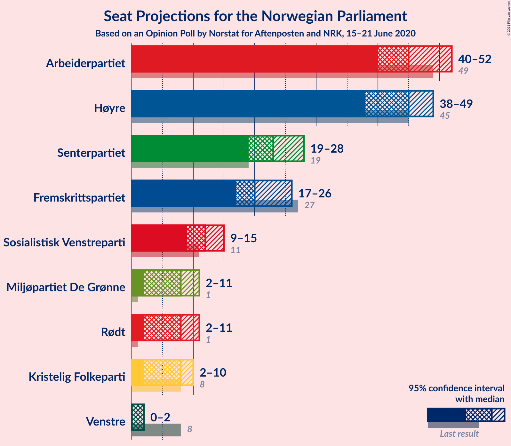

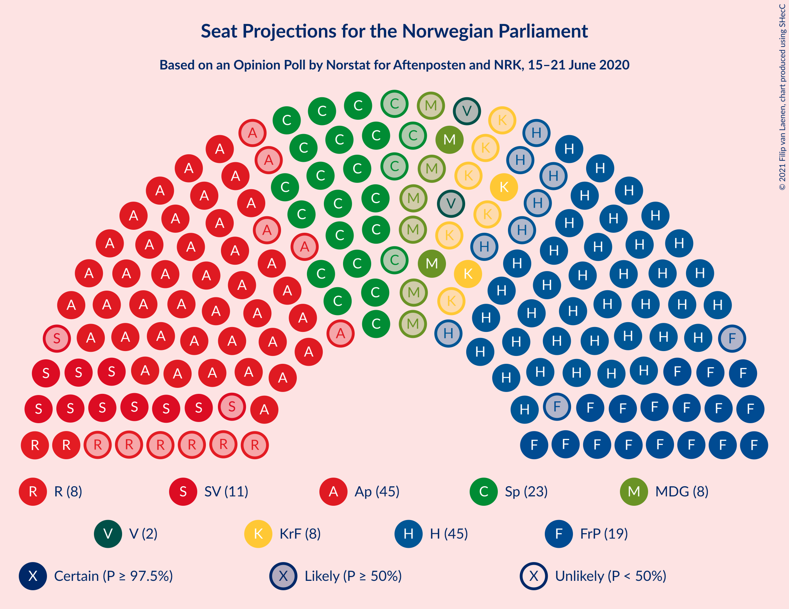

### Confidence Intervals

| Party | Last Result | Median | 80% Confidence Interval | 90% Confidence Interval | 95% Confidence Interval | 99% Confidence Interval |
|:-----:|:-----------:|:------:|:-----------------------:|:-----------------------:|:-----------------------:|:-----------------------:|
| <a href="#arbeiderpartiet">Arbeiderpartiet</a> | 49 | 45 | 42–49 |41–51 |40–52 |40–54 |
| <a href="#høyre">Høyre</a> | 45 | 45 | 41–47 |39–48 |38–49 |37–51 |
| <a href="#senterpartiet">Senterpartiet</a> | 19 | 23 | 20–27 |19–27 |19–28 |18–31 |
| <a href="#fremskrittspartiet">Fremskrittspartiet</a> | 27 | 20 | 17–23 |17–25 |17–26 |16–26 |
| <a href="#sosialistisk-venstreparti">Sosialistisk Venstreparti</a> | 11 | 12 | 10–14 |10–14 |9–15 |9–16 |
| <a href="#rødt">Rødt</a> | 1 | 8 | 7–10 |2–11 |2–11 |2–12 |
| <a href="#miljøpartiet-de-grønne">Miljøpartiet De Grønne</a> | 1 | 8 | 7–10 |2–11 |2–11 |1–12 |
| <a href="#kristelig-folkeparti">Kristelig Folkeparti</a> | 8 | 8 | 3–9 |3–9 |2–10 |1–10 |
| <a href="#venstre">Venstre</a> | 8 | 2 | 1–2 |1–2 |0–2 |0–7 |

### Arbeiderpartiet

*For a full overview of the results for this party, see the [Arbeiderpartiet](party-arbeiderpartiet.html) page.*

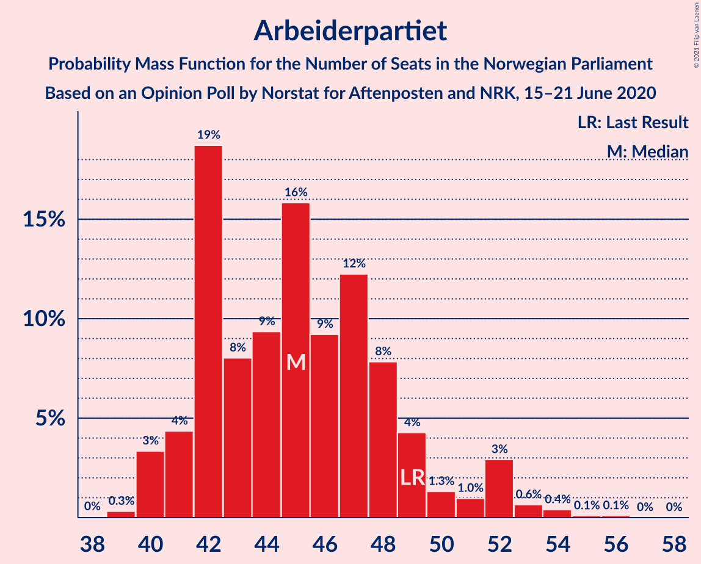

| Number of Seats | Probability | Accumulated | Special Marks |
|:---------------:|:-----------:|:-----------:|:-------------:|
| 38 | 0% | 100% |  |
| 39 | 0.3% | 99.9% |  |
| 40 | 3% | 99.6% |  |
| 41 | 4% | 96% |  |
| 42 | 19% | 92% |  |
| 43 | 8% | 73% |  |
| 44 | 9% | 65% |  |
| 45 | 16% | 56% | Median |
| 46 | 9% | 40% |  |
| 47 | 12% | 31% |  |
| 48 | 8% | 19% |  |
| 49 | 4% | 11% | Last Result |
| 50 | 1.3% | 6% |  |
| 51 | 1.0% | 5% |  |
| 52 | 3% | 4% |  |
| 53 | 0.6% | 1.2% |  |
| 54 | 0.4% | 0.6% |  |
| 55 | 0.1% | 0.2% |  |
| 56 | 0.1% | 0.1% |  |
| 57 | 0% | 0% |  |

### Høyre

*For a full overview of the results for this party, see the [Høyre](party-høyre.html) page.*

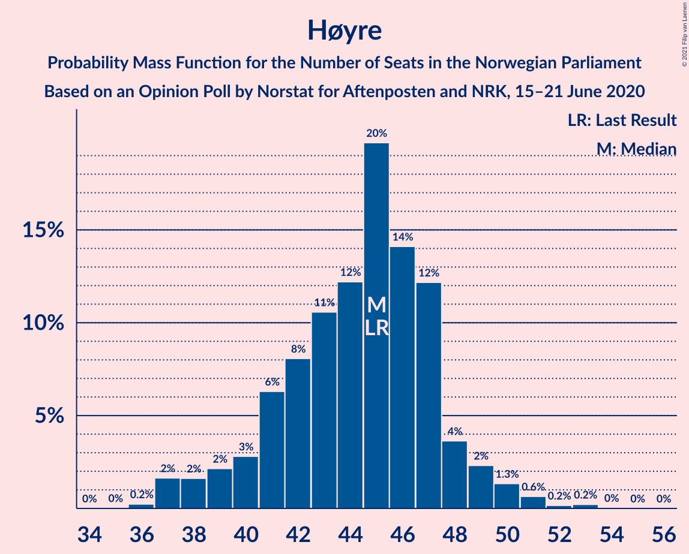

| Number of Seats | Probability | Accumulated | Special Marks |
|:---------------:|:-----------:|:-----------:|:-------------:|
| 36 | 0.2% | 100% |  |
| 37 | 2% | 99.7% |  |
| 38 | 2% | 98% |  |
| 39 | 2% | 96% |  |
| 40 | 3% | 94% |  |
| 41 | 6% | 92% |  |
| 42 | 8% | 85% |  |
| 43 | 11% | 77% |  |
| 44 | 12% | 67% |  |
| 45 | 20% | 54% | Last Result, Median |
| 46 | 14% | 35% |  |
| 47 | 12% | 21% |  |
| 48 | 4% | 8% |  |
| 49 | 2% | 5% |  |
| 50 | 1.3% | 2% |  |
| 51 | 0.6% | 1.1% |  |
| 52 | 0.2% | 0.4% |  |
| 53 | 0.2% | 0.3% |  |
| 54 | 0% | 0.1% |  |
| 55 | 0% | 0% |  |

### Senterpartiet

*For a full overview of the results for this party, see the [Senterpartiet](party-senterpartiet.html) page.*

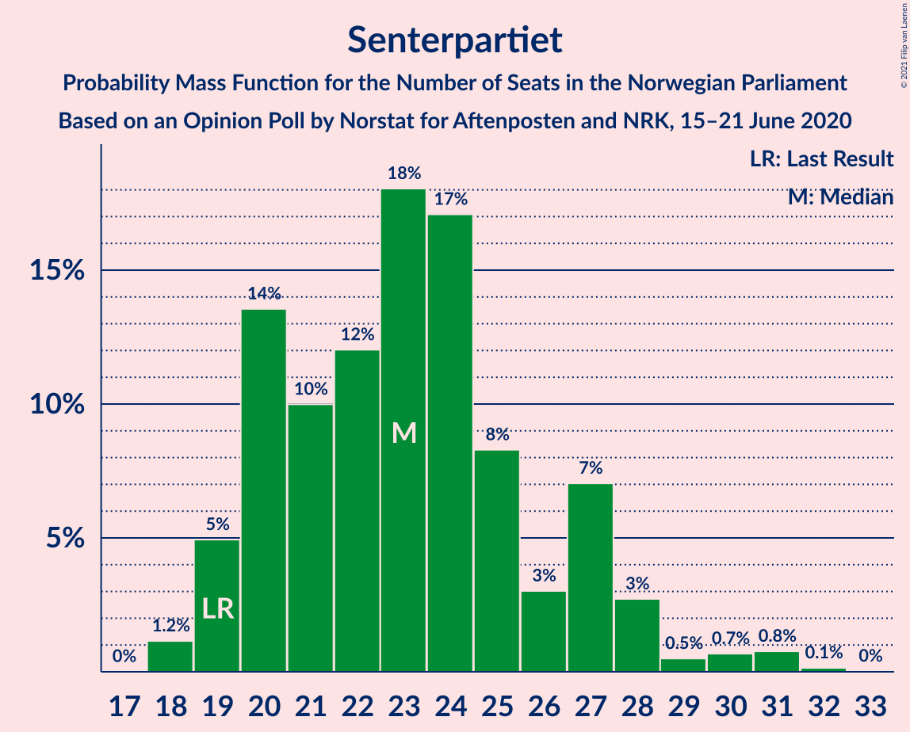

| Number of Seats | Probability | Accumulated | Special Marks |
|:---------------:|:-----------:|:-----------:|:-------------:|
| 18 | 1.2% | 100% |  |
| 19 | 5% | 98.8% | Last Result |
| 20 | 14% | 94% |  |
| 21 | 10% | 80% |  |
| 22 | 12% | 70% |  |
| 23 | 18% | 58% | Median |
| 24 | 17% | 40% |  |
| 25 | 8% | 23% |  |
| 26 | 3% | 15% |  |
| 27 | 7% | 12% |  |
| 28 | 3% | 5% |  |
| 29 | 0.5% | 2% |  |
| 30 | 0.7% | 2% |  |
| 31 | 0.8% | 0.9% |  |
| 32 | 0.1% | 0.2% |  |
| 33 | 0% | 0% |  |

### Fremskrittspartiet

*For a full overview of the results for this party, see the [Fremskrittspartiet](party-fremskrittspartiet.html) page.*

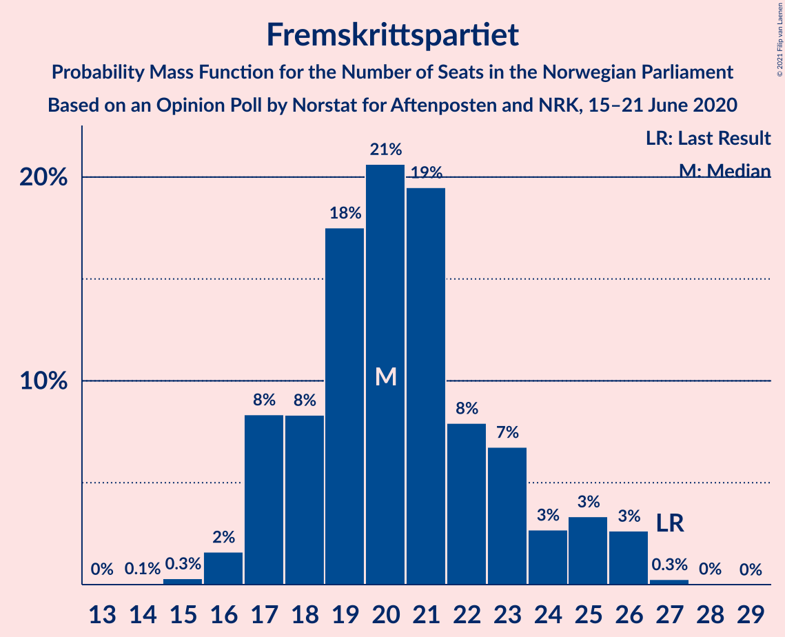

| Number of Seats | Probability | Accumulated | Special Marks |
|:---------------:|:-----------:|:-----------:|:-------------:|
| 14 | 0.1% | 100% |  |
| 15 | 0.3% | 99.9% |  |
| 16 | 2% | 99.6% |  |
| 17 | 8% | 98% |  |
| 18 | 8% | 90% |  |
| 19 | 18% | 81% |  |
| 20 | 21% | 64% | Median |
| 21 | 19% | 43% |  |
| 22 | 8% | 24% |  |
| 23 | 7% | 16% |  |
| 24 | 3% | 9% |  |
| 25 | 3% | 6% |  |
| 26 | 3% | 3% |  |
| 27 | 0.3% | 0.3% | Last Result |
| 28 | 0% | 0.1% |  |
| 29 | 0% | 0% |  |

### Sosialistisk Venstreparti

*For a full overview of the results for this party, see the [Sosialistisk Venstreparti](party-sosialistiskvenstreparti.html) page.*

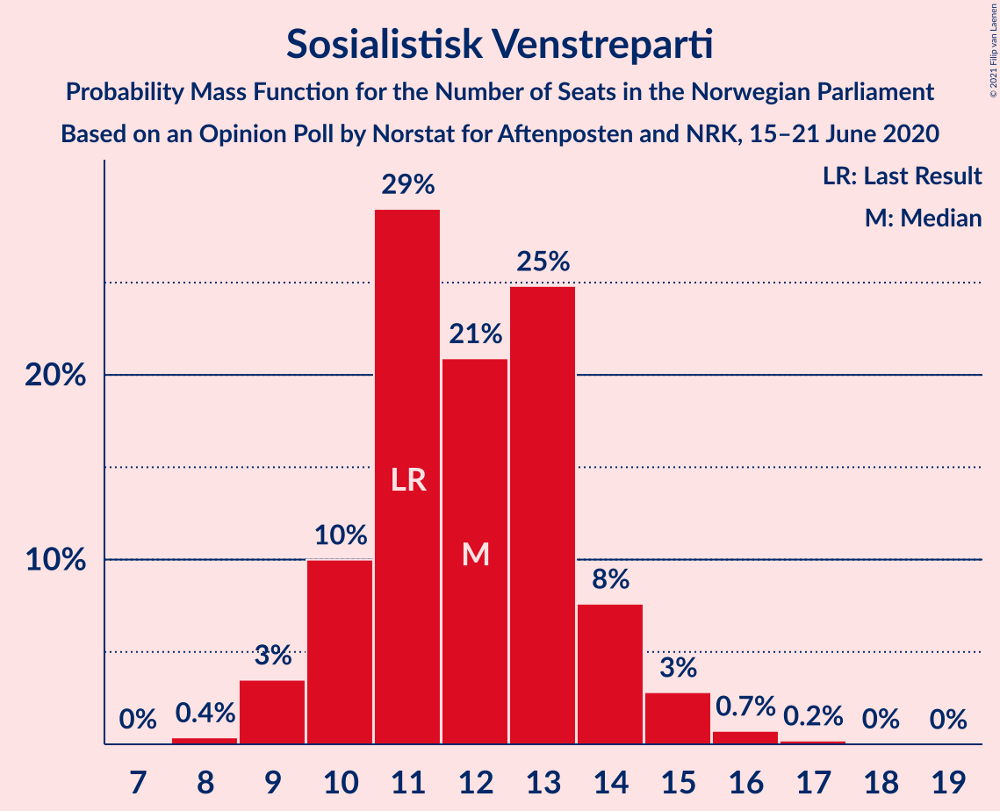

| Number of Seats | Probability | Accumulated | Special Marks |
|:---------------:|:-----------:|:-----------:|:-------------:|
| 8 | 0.4% | 100% |  |
| 9 | 3% | 99.6% |  |
| 10 | 10% | 96% |  |
| 11 | 29% | 86% | Last Result |
| 12 | 21% | 57% | Median |
| 13 | 25% | 36% |  |
| 14 | 8% | 11% |  |
| 15 | 3% | 4% |  |
| 16 | 0.7% | 1.0% |  |
| 17 | 0.2% | 0.3% |  |
| 18 | 0% | 0.1% |  |
| 19 | 0% | 0% |  |

### Rødt

*For a full overview of the results for this party, see the [Rødt](party-rødt.html) page.*

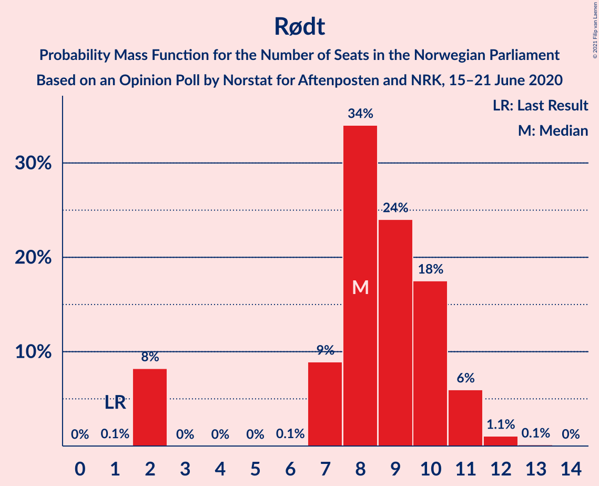

| Number of Seats | Probability | Accumulated | Special Marks |
|:---------------:|:-----------:|:-----------:|:-------------:|
| 1 | 0.1% | 100% | Last Result |
| 2 | 8% | 99.9% |  |
| 3 | 0% | 92% |  |
| 4 | 0% | 92% |  |
| 5 | 0% | 92% |  |
| 6 | 0.1% | 92% |  |
| 7 | 9% | 92% |  |
| 8 | 34% | 83% | Median |
| 9 | 24% | 49% |  |
| 10 | 18% | 25% |  |
| 11 | 6% | 7% |  |
| 12 | 1.1% | 1.2% |  |
| 13 | 0.1% | 0.2% |  |
| 14 | 0% | 0% |  |

### Miljøpartiet De Grønne

*For a full overview of the results for this party, see the [Miljøpartiet De Grønne](party-miljøpartietdegrønne.html) page.*

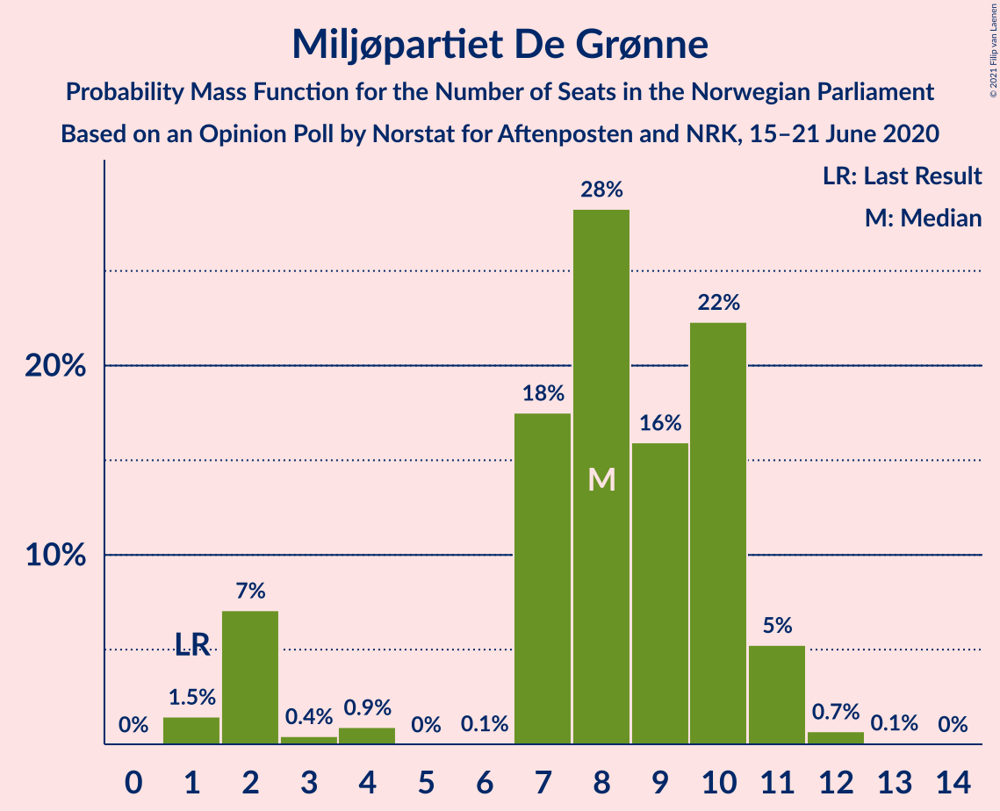

| Number of Seats | Probability | Accumulated | Special Marks |
|:---------------:|:-----------:|:-----------:|:-------------:|
| 1 | 1.5% | 100% | Last Result |
| 2 | 7% | 98.5% |  |
| 3 | 0.4% | 91% |  |
| 4 | 0.9% | 91% |  |
| 5 | 0% | 90% |  |
| 6 | 0.1% | 90% |  |
| 7 | 18% | 90% |  |
| 8 | 28% | 73% | Median |
| 9 | 16% | 44% |  |
| 10 | 22% | 28% |  |
| 11 | 5% | 6% |  |
| 12 | 0.7% | 0.8% |  |
| 13 | 0.1% | 0.1% |  |
| 14 | 0% | 0% |  |

### Kristelig Folkeparti

*For a full overview of the results for this party, see the [Kristelig Folkeparti](party-kristeligfolkeparti.html) page.*

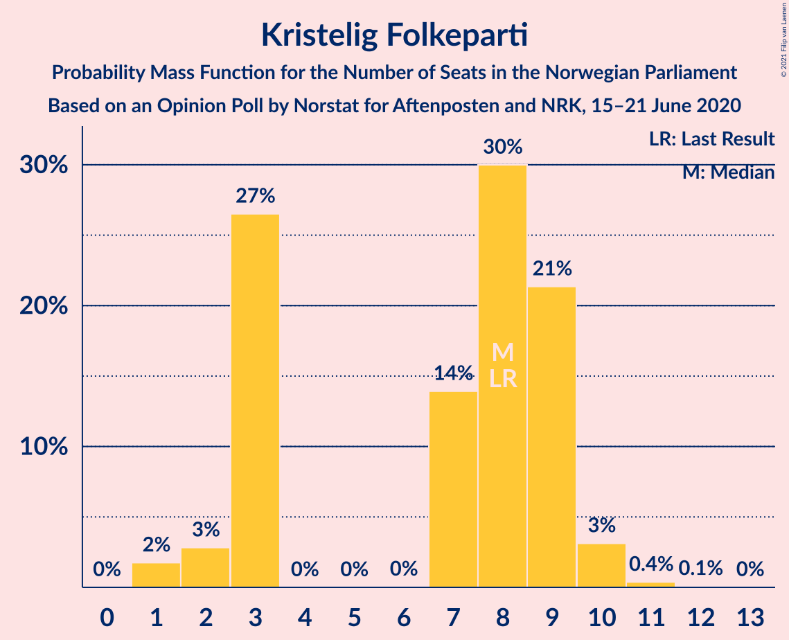

| Number of Seats | Probability | Accumulated | Special Marks |
|:---------------:|:-----------:|:-----------:|:-------------:|
| 1 | 2% | 100% |  |
| 2 | 3% | 98% |  |
| 3 | 27% | 95% |  |
| 4 | 0% | 69% |  |
| 5 | 0% | 69% |  |
| 6 | 0% | 69% |  |
| 7 | 14% | 69% |  |
| 8 | 30% | 55% | Last Result, Median |
| 9 | 21% | 25% |  |
| 10 | 3% | 4% |  |
| 11 | 0.4% | 0.5% |  |
| 12 | 0.1% | 0.1% |  |
| 13 | 0% | 0% |  |

### Venstre

*For a full overview of the results for this party, see the [Venstre](party-venstre.html) page.*

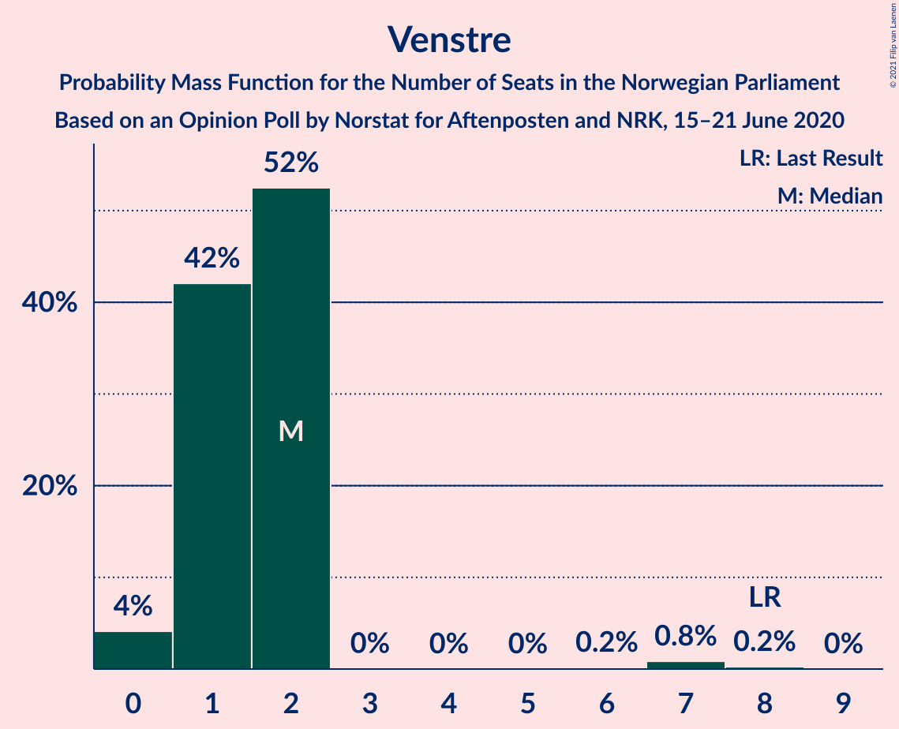

| Number of Seats | Probability | Accumulated | Special Marks |
|:---------------:|:-----------:|:-----------:|:-------------:|
| 0 | 4% | 100% |  |
| 1 | 42% | 96% |  |
| 2 | 52% | 54% | Median |
| 3 | 0% | 1.3% |  |
| 4 | 0% | 1.3% |  |
| 5 | 0% | 1.3% |  |
| 6 | 0.2% | 1.3% |  |
| 7 | 0.8% | 1.1% |  |
| 8 | 0.2% | 0.3% | Last Result |
| 9 | 0% | 0% |  |

## Coalitions

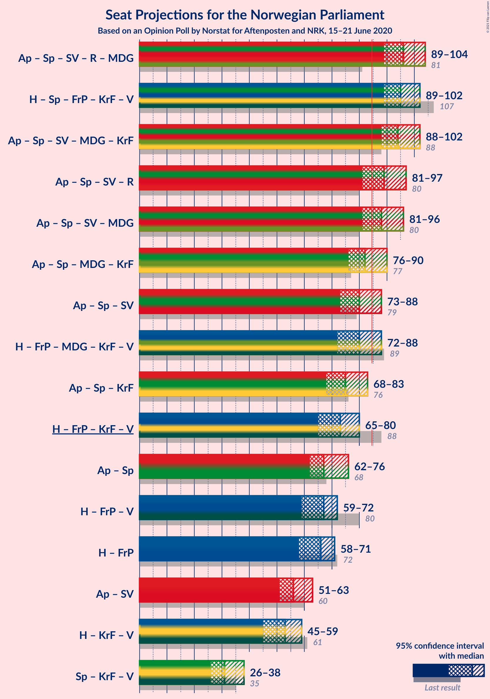

### Confidence Intervals

| Coalition | Last Result | Median | Majority? | 80% Confidence Interval | 90% Confidence Interval | 95% Confidence Interval | 99% Confidence Interval |
|:---------:|:-----------:|:------:|:---------:|:-----------------------:|:-----------------------:|:-----------------------:|:-----------------------:|
| Arbeiderpartiet – Senterpartiet – Sosialistisk Venstreparti – Rødt – Miljøpartiet De Grønne | 81 | 96 | 100% | 92–101 | 90–104 | 89–104 | 87–106 |
| Høyre – Senterpartiet – Fremskrittspartiet – Kristelig Folkeparti – Venstre | 107 | 95 | 99.9% | 92–100 | 90–102 | 89–102 | 86–105 |
| Arbeiderpartiet – Senterpartiet – Sosialistisk Venstreparti – Miljøpartiet De Grønne – Kristelig Folkeparti | 88 | 94 | 99.8% | 90–99 | 89–100 | 88–102 | 86–104 |
| Arbeiderpartiet – Senterpartiet – Sosialistisk Venstreparti – Rødt | 80 | 89 | 85% | 83–94 | 82–95 | 81–97 | 79–98 |
| Arbeiderpartiet – Senterpartiet – Sosialistisk Venstreparti – Miljøpartiet De Grønne | 80 | 88 | 84% | 83–94 | 82–96 | 81–96 | 80–97 |
| Arbeiderpartiet – Senterpartiet – Miljøpartiet De Grønne – Kristelig Folkeparti | 77 | 82 | 28% | 78–88 | 77–89 | 76–90 | 74–93 |
| Arbeiderpartiet – Senterpartiet – Sosialistisk Venstreparti | 79 | 80 | 14% | 75–85 | 74–86 | 73–88 | 72–90 |
| Høyre – Fremskrittspartiet – Miljøpartiet De Grønne – Kristelig Folkeparti – Venstre | 89 | 80 | 15% | 75–86 | 74–87 | 72–88 | 71–90 |
| Arbeiderpartiet – Senterpartiet – Kristelig Folkeparti | 76 | 75 | 1.4% | 70–79 | 69–82 | 68–83 | 66–87 |
| Høyre – Fremskrittspartiet – Kristelig Folkeparti – Venstre | 88 | 73 | 0% | 68–77 | 65–79 | 65–80 | 63–82 |
| Arbeiderpartiet – Senterpartiet | 68 | 67 | 0% | 63–73 | 62–75 | 62–76 | 61–79 |
| Høyre – Fremskrittspartiet – Venstre | 80 | 67 | 0% | 62–70 | 61–72 | 59–72 | 57–75 |
| Høyre – Fremskrittspartiet | 72 | 66 | 0% | 60–69 | 59–70 | 58–71 | 56–73 |
| Arbeiderpartiet – Sosialistisk Venstreparti | 60 | 56 | 0% | 53–61 | 52–62 | 51–63 | 50–65 |
| Høyre – Kristelig Folkeparti – Venstre | 61 | 53 | 0% | 48–56 | 46–58 | 45–59 | 43–60 |
| Senterpartiet – Kristelig Folkeparti – Venstre | 35 | 31 | 0% | 27–35 | 26–36 | 26–38 | 23–40 |

### Arbeiderpartiet – Senterpartiet – Sosialistisk Venstreparti – Rødt – Miljøpartiet De Grønne

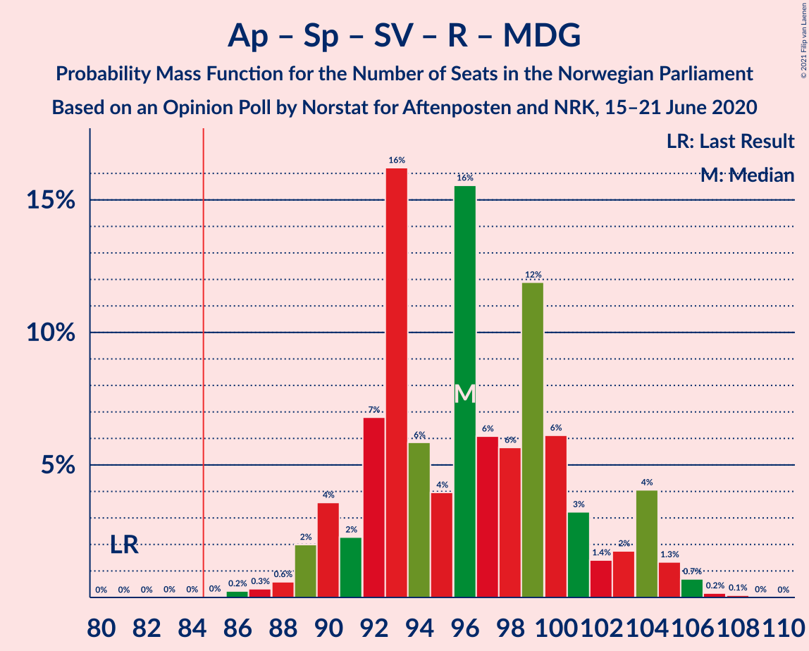

| Number of Seats | Probability | Accumulated | Special Marks |
|:---------------:|:-----------:|:-----------:|:-------------:|
| 81 | 0% | 100% | Last Result |
| 82 | 0% | 100% |  |
| 83 | 0% | 100% |  |
| 84 | 0% | 100% |  |
| 85 | 0% | 100% | Majority |
| 86 | 0.2% | 99.9% |  |
| 87 | 0.3% | 99.7% |  |
| 88 | 0.6% | 99.3% |  |
| 89 | 2% | 98.8% |  |
| 90 | 4% | 97% |  |
| 91 | 2% | 93% |  |
| 92 | 7% | 91% |  |
| 93 | 16% | 84% |  |
| 94 | 6% | 68% |  |
| 95 | 4% | 62% |  |
| 96 | 16% | 58% | Median |
| 97 | 6% | 43% |  |
| 98 | 6% | 36% |  |
| 99 | 12% | 31% |  |
| 100 | 6% | 19% |  |
| 101 | 3% | 13% |  |
| 102 | 1.4% | 10% |  |
| 103 | 2% | 8% |  |
| 104 | 4% | 6% |  |
| 105 | 1.3% | 2% |  |
| 106 | 0.7% | 1.0% |  |
| 107 | 0.2% | 0.3% |  |
| 108 | 0.1% | 0.1% |  |
| 109 | 0% | 0% |  |

### Høyre – Senterpartiet – Fremskrittspartiet – Kristelig Folkeparti – Venstre

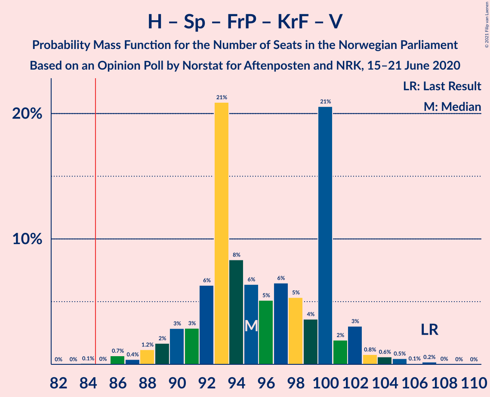

| Number of Seats | Probability | Accumulated | Special Marks |
|:---------------:|:-----------:|:-----------:|:-------------:|
| 84 | 0.1% | 100% |  |
| 85 | 0% | 99.9% | Majority |
| 86 | 0.7% | 99.9% |  |
| 87 | 0.4% | 99.2% |  |
| 88 | 1.2% | 98.8% |  |
| 89 | 2% | 98% |  |
| 90 | 3% | 96% |  |
| 91 | 3% | 93% |  |
| 92 | 6% | 90% |  |
| 93 | 21% | 84% |  |
| 94 | 8% | 63% |  |
| 95 | 6% | 55% |  |
| 96 | 5% | 48% |  |
| 97 | 6% | 43% |  |
| 98 | 5% | 37% | Median |
| 99 | 4% | 31% |  |
| 100 | 21% | 28% |  |
| 101 | 2% | 7% |  |
| 102 | 3% | 5% |  |
| 103 | 0.8% | 2% |  |
| 104 | 0.6% | 1.4% |  |
| 105 | 0.5% | 0.8% |  |
| 106 | 0.1% | 0.3% |  |
| 107 | 0.2% | 0.3% | Last Result |
| 108 | 0% | 0.1% |  |
| 109 | 0% | 0% |  |

### Arbeiderpartiet – Senterpartiet – Sosialistisk Venstreparti – Miljøpartiet De Grønne – Kristelig Folkeparti

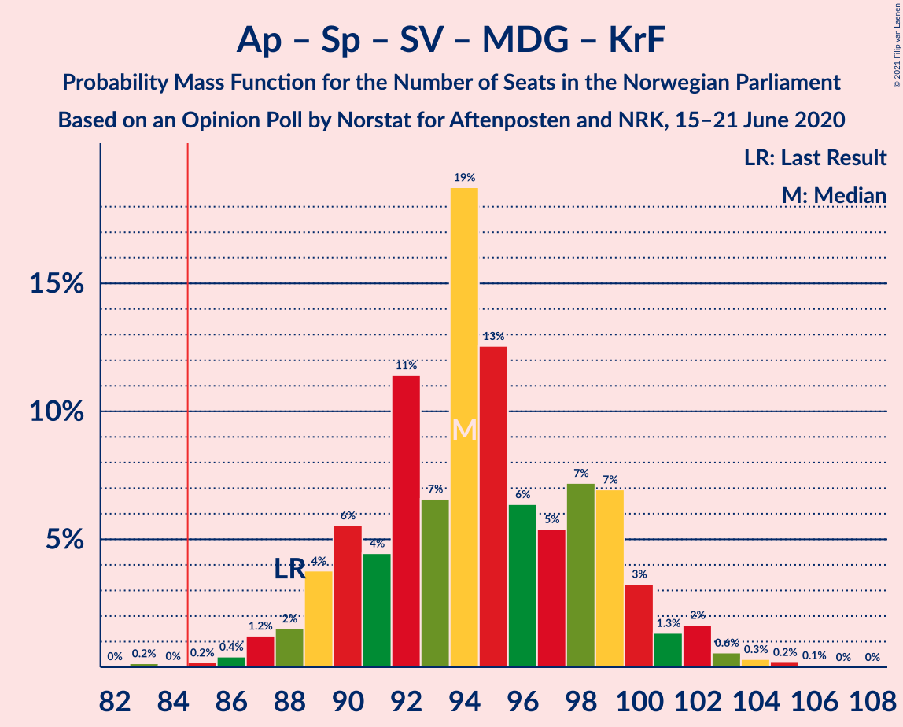

| Number of Seats | Probability | Accumulated | Special Marks |
|:---------------:|:-----------:|:-----------:|:-------------:|
| 83 | 0.2% | 100% |  |
| 84 | 0% | 99.8% |  |
| 85 | 0.2% | 99.8% | Majority |
| 86 | 0.4% | 99.6% |  |
| 87 | 1.2% | 99.2% |  |
| 88 | 2% | 98% | Last Result |
| 89 | 4% | 96% |  |
| 90 | 6% | 93% |  |
| 91 | 4% | 87% |  |
| 92 | 11% | 83% |  |
| 93 | 7% | 71% |  |
| 94 | 19% | 65% |  |
| 95 | 13% | 46% |  |
| 96 | 6% | 33% | Median |
| 97 | 5% | 27% |  |
| 98 | 7% | 22% |  |
| 99 | 7% | 14% |  |
| 100 | 3% | 7% |  |
| 101 | 1.3% | 4% |  |
| 102 | 2% | 3% |  |
| 103 | 0.6% | 1.2% |  |
| 104 | 0.3% | 0.6% |  |
| 105 | 0.2% | 0.3% |  |
| 106 | 0.1% | 0.1% |  |
| 107 | 0% | 0% |  |

### Arbeiderpartiet – Senterpartiet – Sosialistisk Venstreparti – Rødt

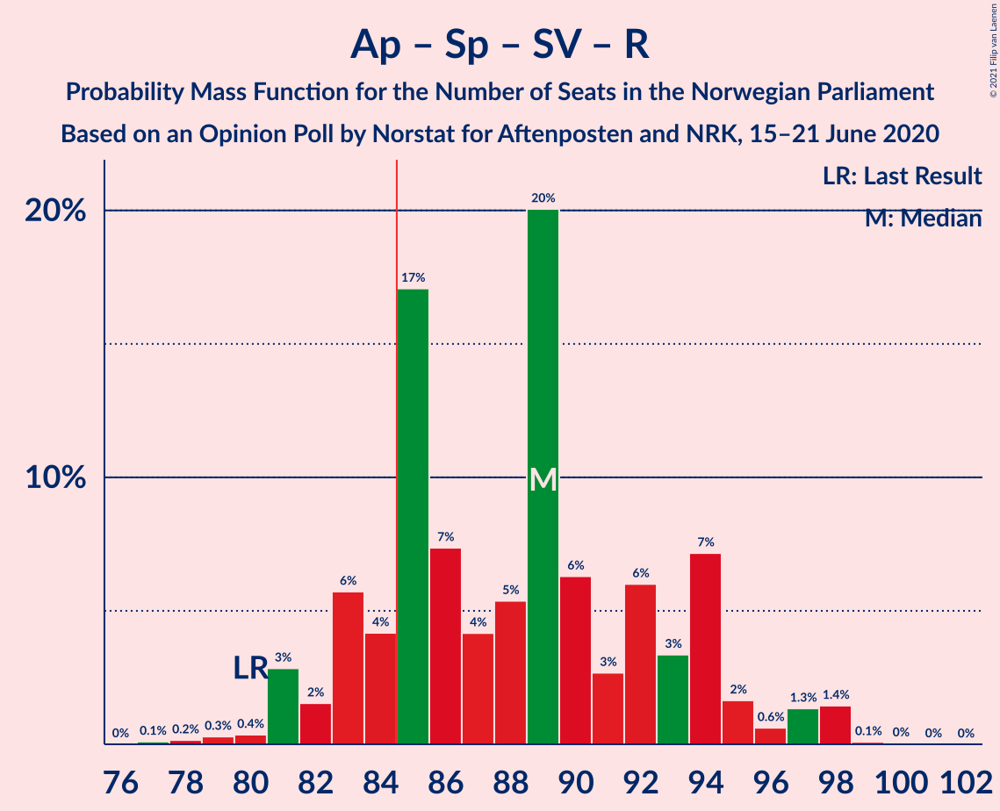

| Number of Seats | Probability | Accumulated | Special Marks |
|:---------------:|:-----------:|:-----------:|:-------------:|
| 77 | 0.1% | 100% |  |
| 78 | 0.2% | 99.9% |  |
| 79 | 0.3% | 99.7% |  |
| 80 | 0.4% | 99.4% | Last Result |
| 81 | 3% | 99.1% |  |
| 82 | 2% | 96% |  |
| 83 | 6% | 95% |  |
| 84 | 4% | 89% |  |
| 85 | 17% | 85% | Majority |
| 86 | 7% | 68% |  |
| 87 | 4% | 60% |  |
| 88 | 5% | 56% | Median |
| 89 | 20% | 51% |  |
| 90 | 6% | 31% |  |
| 91 | 3% | 24% |  |
| 92 | 6% | 22% |  |
| 93 | 3% | 16% |  |
| 94 | 7% | 12% |  |
| 95 | 2% | 5% |  |
| 96 | 0.6% | 4% |  |
| 97 | 1.3% | 3% |  |
| 98 | 1.4% | 2% |  |
| 99 | 0.1% | 0.2% |  |
| 100 | 0% | 0.1% |  |
| 101 | 0% | 0% |  |

### Arbeiderpartiet – Senterpartiet – Sosialistisk Venstreparti – Miljøpartiet De Grønne

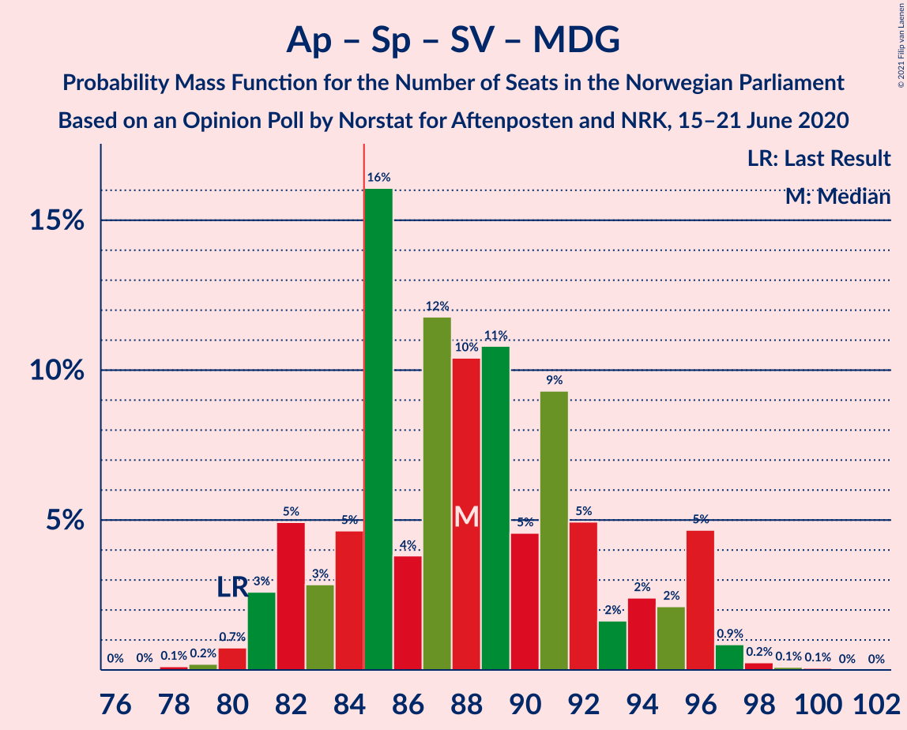

| Number of Seats | Probability | Accumulated | Special Marks |
|:---------------:|:-----------:|:-----------:|:-------------:|
| 77 | 0% | 100% |  |
| 78 | 0.1% | 99.9% |  |
| 79 | 0.2% | 99.8% |  |
| 80 | 0.7% | 99.6% | Last Result |
| 81 | 3% | 98.8% |  |
| 82 | 5% | 96% |  |
| 83 | 3% | 91% |  |
| 84 | 5% | 88% |  |
| 85 | 16% | 84% | Majority |
| 86 | 4% | 68% |  |
| 87 | 12% | 64% |  |
| 88 | 10% | 52% | Median |
| 89 | 11% | 42% |  |
| 90 | 5% | 31% |  |
| 91 | 9% | 26% |  |
| 92 | 5% | 17% |  |
| 93 | 2% | 12% |  |
| 94 | 2% | 10% |  |
| 95 | 2% | 8% |  |
| 96 | 5% | 6% |  |
| 97 | 0.9% | 1.3% |  |
| 98 | 0.2% | 0.4% |  |
| 99 | 0.1% | 0.2% |  |
| 100 | 0.1% | 0.1% |  |
| 101 | 0% | 0% |  |

### Arbeiderpartiet – Senterpartiet – Miljøpartiet De Grønne – Kristelig Folkeparti

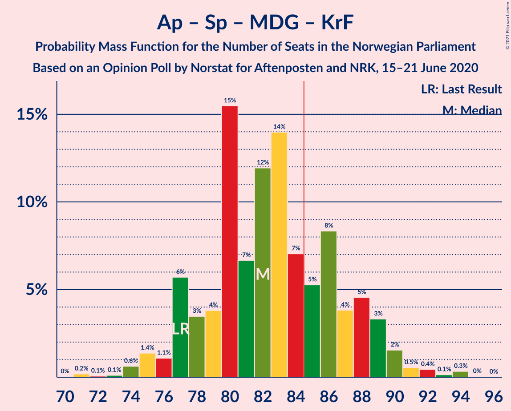

| Number of Seats | Probability | Accumulated | Special Marks |
|:---------------:|:-----------:|:-----------:|:-------------:|
| 71 | 0.2% | 100% |  |
| 72 | 0.1% | 99.8% |  |
| 73 | 0.1% | 99.7% |  |
| 74 | 0.6% | 99.6% |  |
| 75 | 1.4% | 99.0% |  |
| 76 | 1.1% | 98% |  |
| 77 | 6% | 96% | Last Result |
| 78 | 3% | 91% |  |
| 79 | 4% | 87% |  |
| 80 | 15% | 84% |  |
| 81 | 7% | 68% |  |
| 82 | 12% | 61% |  |
| 83 | 14% | 49% |  |
| 84 | 7% | 35% | Median |
| 85 | 5% | 28% | Majority |
| 86 | 8% | 23% |  |
| 87 | 4% | 15% |  |
| 88 | 5% | 11% |  |
| 89 | 3% | 6% |  |
| 90 | 2% | 3% |  |
| 91 | 0.5% | 2% |  |
| 92 | 0.4% | 1.0% |  |
| 93 | 0.1% | 0.5% |  |
| 94 | 0.3% | 0.4% |  |
| 95 | 0% | 0.1% |  |
| 96 | 0% | 0% |  |

### Arbeiderpartiet – Senterpartiet – Sosialistisk Venstreparti

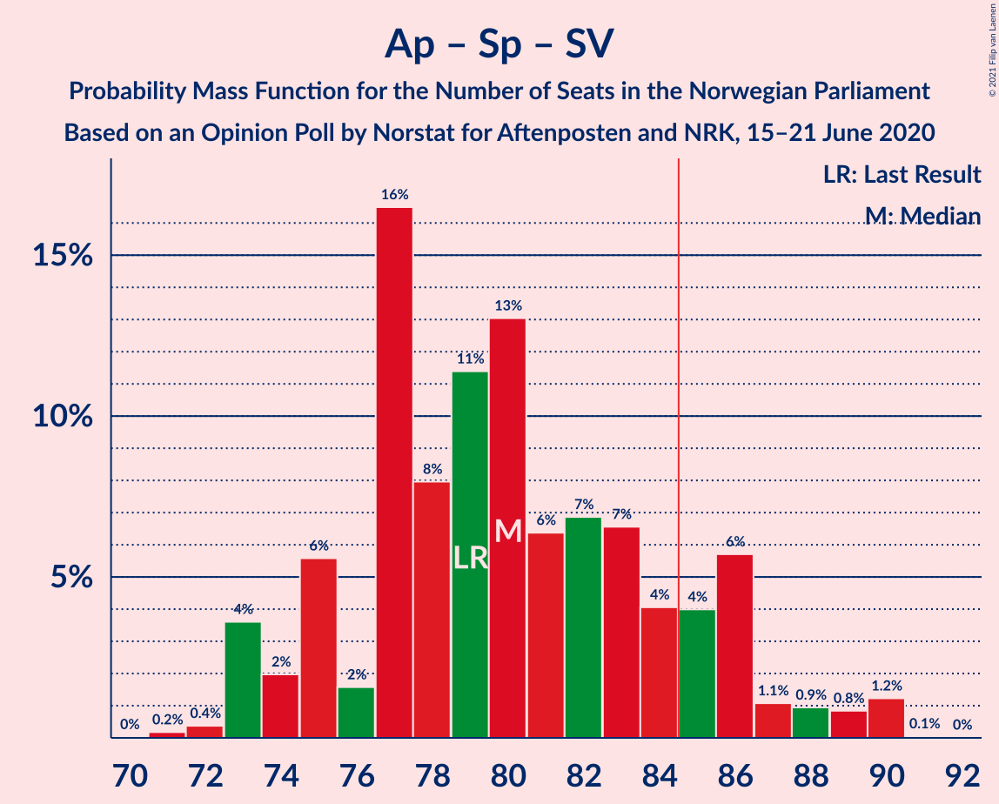

| Number of Seats | Probability | Accumulated | Special Marks |
|:---------------:|:-----------:|:-----------:|:-------------:|
| 70 | 0% | 100% |  |
| 71 | 0.2% | 99.9% |  |
| 72 | 0.4% | 99.8% |  |
| 73 | 4% | 99.4% |  |
| 74 | 2% | 96% |  |
| 75 | 6% | 94% |  |
| 76 | 2% | 88% |  |
| 77 | 16% | 87% |  |
| 78 | 8% | 70% |  |
| 79 | 11% | 62% | Last Result |
| 80 | 13% | 51% | Median |
| 81 | 6% | 38% |  |
| 82 | 7% | 31% |  |
| 83 | 7% | 25% |  |
| 84 | 4% | 18% |  |
| 85 | 4% | 14% | Majority |
| 86 | 6% | 10% |  |
| 87 | 1.1% | 4% |  |
| 88 | 0.9% | 3% |  |
| 89 | 0.8% | 2% |  |
| 90 | 1.2% | 1.3% |  |
| 91 | 0.1% | 0.1% |  |
| 92 | 0% | 0% |  |

### Høyre – Fremskrittspartiet – Miljøpartiet De Grønne – Kristelig Folkeparti – Venstre

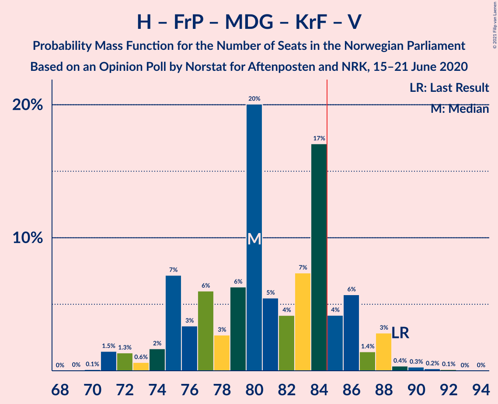

| Number of Seats | Probability | Accumulated | Special Marks |
|:---------------:|:-----------:|:-----------:|:-------------:|
| 69 | 0% | 100% |  |
| 70 | 0.1% | 99.9% |  |
| 71 | 1.5% | 99.8% |  |
| 72 | 1.3% | 98% |  |
| 73 | 0.6% | 97% |  |
| 74 | 2% | 96% |  |
| 75 | 7% | 95% |  |
| 76 | 3% | 88% |  |
| 77 | 6% | 84% |  |
| 78 | 3% | 78% |  |
| 79 | 6% | 76% |  |
| 80 | 20% | 69% |  |
| 81 | 5% | 49% |  |
| 82 | 4% | 44% |  |
| 83 | 7% | 40% | Median |
| 84 | 17% | 32% |  |
| 85 | 4% | 15% | Majority |
| 86 | 6% | 11% |  |
| 87 | 1.4% | 5% |  |
| 88 | 3% | 4% |  |
| 89 | 0.4% | 0.9% | Last Result |
| 90 | 0.3% | 0.6% |  |
| 91 | 0.2% | 0.3% |  |
| 92 | 0.1% | 0.1% |  |
| 93 | 0% | 0% |  |

### Arbeiderpartiet – Senterpartiet – Kristelig Folkeparti

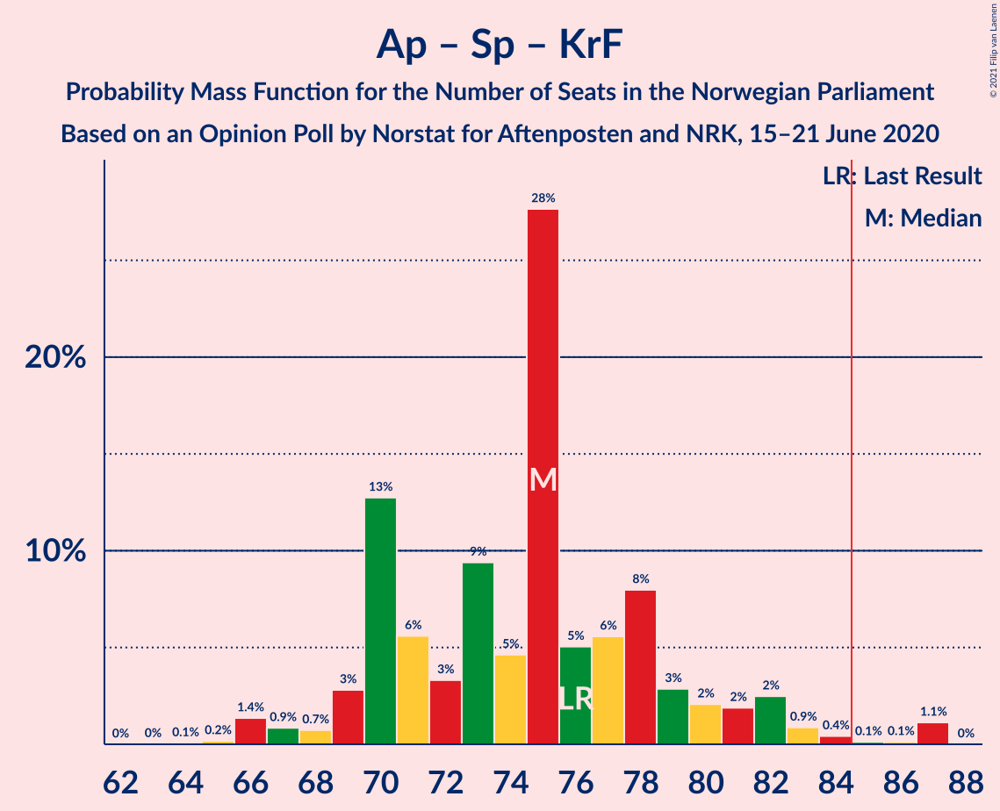

| Number of Seats | Probability | Accumulated | Special Marks |
|:---------------:|:-----------:|:-----------:|:-------------:|
| 64 | 0.1% | 100% |  |
| 65 | 0.2% | 99.9% |  |
| 66 | 1.4% | 99.7% |  |
| 67 | 0.9% | 98% |  |
| 68 | 0.7% | 98% |  |
| 69 | 3% | 97% |  |
| 70 | 13% | 94% |  |
| 71 | 6% | 81% |  |
| 72 | 3% | 76% |  |
| 73 | 9% | 72% |  |
| 74 | 5% | 63% |  |
| 75 | 28% | 58% |  |
| 76 | 5% | 31% | Last Result, Median |
| 77 | 6% | 26% |  |
| 78 | 8% | 20% |  |
| 79 | 3% | 12% |  |
| 80 | 2% | 9% |  |
| 81 | 2% | 7% |  |
| 82 | 2% | 5% |  |
| 83 | 0.9% | 3% |  |
| 84 | 0.4% | 2% |  |
| 85 | 0.1% | 1.4% | Majority |
| 86 | 0.1% | 1.3% |  |
| 87 | 1.1% | 1.1% |  |
| 88 | 0% | 0% |  |

### Høyre – Fremskrittspartiet – Kristelig Folkeparti – Venstre

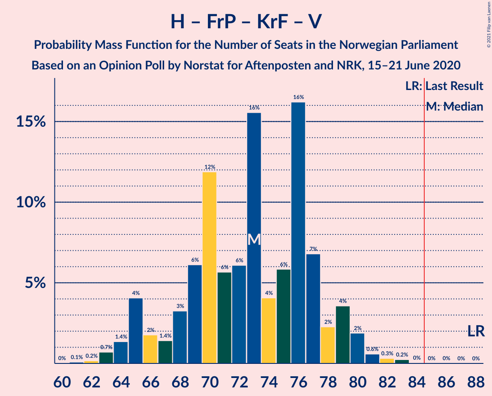

| Number of Seats | Probability | Accumulated | Special Marks |
|:---------------:|:-----------:|:-----------:|:-------------:|
| 61 | 0.1% | 100% |  |
| 62 | 0.2% | 99.9% |  |
| 63 | 0.7% | 99.7% |  |
| 64 | 1.4% | 99.0% |  |
| 65 | 4% | 98% |  |
| 66 | 2% | 94% |  |
| 67 | 1.4% | 92% |  |
| 68 | 3% | 90% |  |
| 69 | 6% | 87% |  |
| 70 | 12% | 81% |  |
| 71 | 6% | 69% |  |
| 72 | 6% | 64% |  |
| 73 | 16% | 57% |  |
| 74 | 4% | 42% |  |
| 75 | 6% | 38% | Median |
| 76 | 16% | 32% |  |
| 77 | 7% | 16% |  |
| 78 | 2% | 9% |  |
| 79 | 4% | 7% |  |
| 80 | 2% | 3% |  |
| 81 | 0.6% | 1.2% |  |
| 82 | 0.3% | 0.6% |  |
| 83 | 0.2% | 0.3% |  |
| 84 | 0% | 0.1% |  |
| 85 | 0% | 0% | Majority |
| 86 | 0% | 0% |  |
| 87 | 0% | 0% |  |
| 88 | 0% | 0% | Last Result |

### Arbeiderpartiet – Senterpartiet

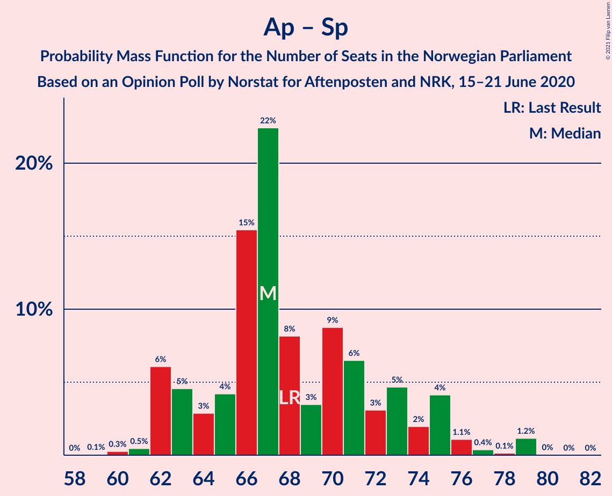

| Number of Seats | Probability | Accumulated | Special Marks |
|:---------------:|:-----------:|:-----------:|:-------------:|
| 59 | 0.1% | 100% |  |
| 60 | 0.3% | 99.9% |  |
| 61 | 0.5% | 99.7% |  |
| 62 | 6% | 99.2% |  |
| 63 | 5% | 93% |  |
| 64 | 3% | 89% |  |
| 65 | 4% | 86% |  |
| 66 | 15% | 81% |  |
| 67 | 22% | 66% |  |
| 68 | 8% | 44% | Last Result, Median |
| 69 | 3% | 35% |  |
| 70 | 9% | 32% |  |
| 71 | 6% | 23% |  |
| 72 | 3% | 17% |  |
| 73 | 5% | 14% |  |
| 74 | 2% | 9% |  |
| 75 | 4% | 7% |  |
| 76 | 1.1% | 3% |  |
| 77 | 0.4% | 2% |  |
| 78 | 0.1% | 1.4% |  |
| 79 | 1.2% | 1.2% |  |
| 80 | 0% | 0.1% |  |
| 81 | 0% | 0% |  |

### Høyre – Fremskrittspartiet – Venstre

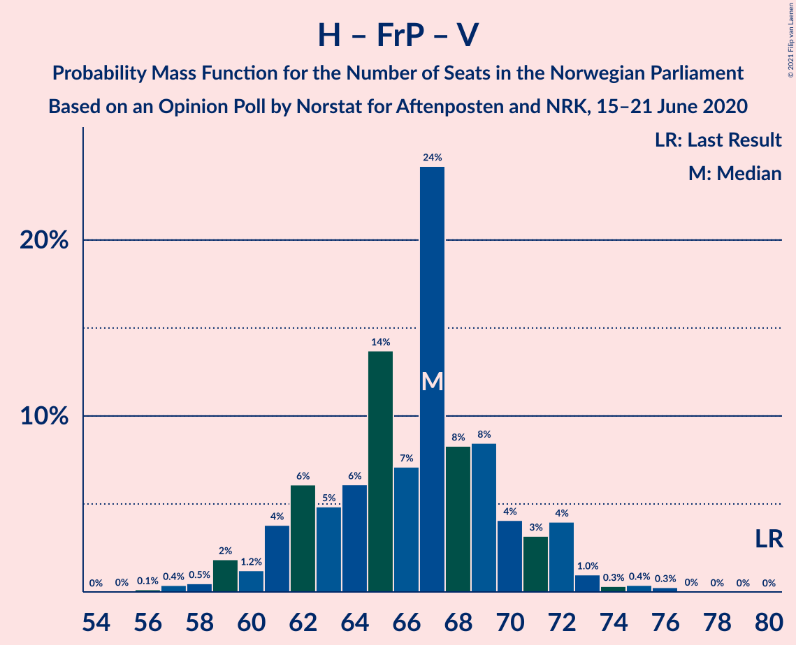

| Number of Seats | Probability | Accumulated | Special Marks |
|:---------------:|:-----------:|:-----------:|:-------------:|
| 56 | 0.1% | 100% |  |
| 57 | 0.4% | 99.8% |  |
| 58 | 0.5% | 99.4% |  |
| 59 | 2% | 99.0% |  |
| 60 | 1.2% | 97% |  |
| 61 | 4% | 96% |  |
| 62 | 6% | 92% |  |
| 63 | 5% | 86% |  |
| 64 | 6% | 81% |  |
| 65 | 14% | 75% |  |
| 66 | 7% | 61% |  |
| 67 | 24% | 54% | Median |
| 68 | 8% | 30% |  |
| 69 | 8% | 22% |  |
| 70 | 4% | 13% |  |
| 71 | 3% | 9% |  |
| 72 | 4% | 6% |  |
| 73 | 1.0% | 2% |  |
| 74 | 0.3% | 1.1% |  |
| 75 | 0.4% | 0.7% |  |
| 76 | 0.3% | 0.3% |  |
| 77 | 0% | 0.1% |  |
| 78 | 0% | 0% |  |
| 79 | 0% | 0% |  |
| 80 | 0% | 0% | Last Result |

### Høyre – Fremskrittspartiet

| Number of Seats | Probability | Accumulated | Special Marks |
|:---------------:|:-----------:|:-----------:|:-------------:|
| 54 | 0.1% | 100% |  |
| 55 | 0.3% | 99.9% |  |
| 56 | 0.3% | 99.6% |  |
| 57 | 1.1% | 99.3% |  |
| 58 | 2% | 98% |  |
| 59 | 2% | 96% |  |
| 60 | 5% | 94% |  |
| 61 | 7% | 90% |  |
| 62 | 4% | 83% |  |
| 63 | 15% | 79% |  |
| 64 | 9% | 63% |  |
| 65 | 5% | 55% | Median |
| 66 | 26% | 50% |  |
| 67 | 10% | 24% |  |
| 68 | 3% | 14% |  |
| 69 | 5% | 11% |  |
| 70 | 4% | 7% |  |
| 71 | 0.8% | 3% |  |
| 72 | 1.1% | 2% | Last Result |
| 73 | 0.4% | 0.6% |  |
| 74 | 0.2% | 0.3% |  |
| 75 | 0% | 0.1% |  |
| 76 | 0% | 0% |  |

### Arbeiderpartiet – Sosialistisk Venstreparti

| Number of Seats | Probability | Accumulated | Special Marks |
|:---------------:|:-----------:|:-----------:|:-------------:|
| 48 | 0% | 100% |  |
| 49 | 0.1% | 99.9% |  |
| 50 | 0.4% | 99.8% |  |
| 51 | 3% | 99.4% |  |
| 52 | 3% | 97% |  |
| 53 | 14% | 94% |  |
| 54 | 4% | 79% |  |
| 55 | 8% | 76% |  |
| 56 | 18% | 67% |  |
| 57 | 6% | 50% | Median |
| 58 | 10% | 44% |  |
| 59 | 9% | 34% |  |
| 60 | 13% | 25% | Last Result |
| 61 | 4% | 12% |  |
| 62 | 4% | 8% |  |
| 63 | 2% | 4% |  |
| 64 | 0.8% | 2% |  |
| 65 | 1.0% | 1.2% |  |
| 66 | 0% | 0.2% |  |
| 67 | 0.1% | 0.2% |  |
| 68 | 0.1% | 0.1% |  |
| 69 | 0% | 0% |  |

### Høyre – Kristelig Folkeparti – Venstre

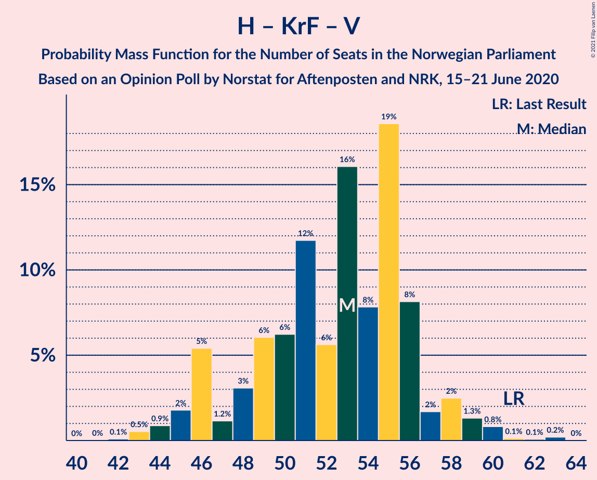

| Number of Seats | Probability | Accumulated | Special Marks |
|:---------------:|:-----------:|:-----------:|:-------------:|
| 42 | 0.1% | 100% |  |
| 43 | 0.5% | 99.9% |  |
| 44 | 0.9% | 99.3% |  |
| 45 | 2% | 98% |  |
| 46 | 5% | 97% |  |
| 47 | 1.2% | 91% |  |
| 48 | 3% | 90% |  |
| 49 | 6% | 87% |  |
| 50 | 6% | 81% |  |
| 51 | 12% | 75% |  |
| 52 | 6% | 63% |  |
| 53 | 16% | 57% |  |
| 54 | 8% | 41% |  |
| 55 | 19% | 33% | Median |
| 56 | 8% | 15% |  |
| 57 | 2% | 7% |  |
| 58 | 2% | 5% |  |
| 59 | 1.3% | 3% |  |
| 60 | 0.8% | 1.3% |  |
| 61 | 0.1% | 0.4% | Last Result |
| 62 | 0.1% | 0.3% |  |
| 63 | 0.2% | 0.2% |  |
| 64 | 0% | 0% |  |

### Senterpartiet – Kristelig Folkeparti – Venstre

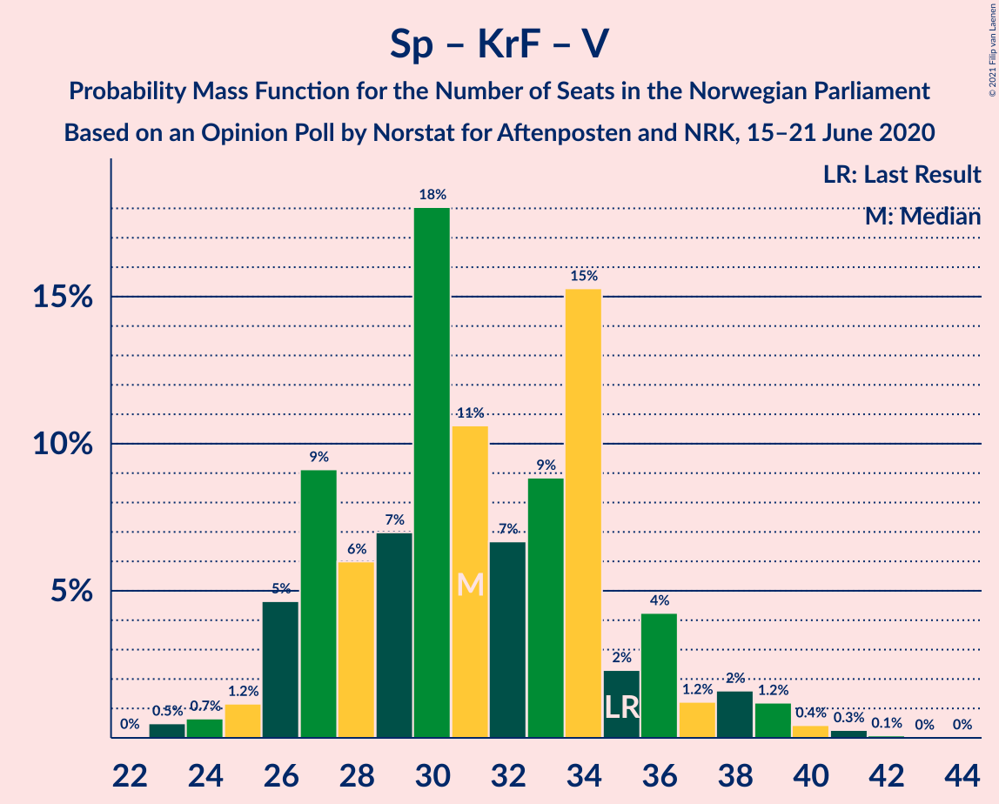

| Number of Seats | Probability | Accumulated | Special Marks |
|:---------------:|:-----------:|:-----------:|:-------------:|
| 22 | 0% | 100% |  |
| 23 | 0.5% | 99.9% |  |
| 24 | 0.7% | 99.4% |  |
| 25 | 1.2% | 98.8% |  |
| 26 | 5% | 98% |  |
| 27 | 9% | 93% |  |
| 28 | 6% | 84% |  |
| 29 | 7% | 78% |  |
| 30 | 18% | 71% |  |
| 31 | 11% | 53% |  |
| 32 | 7% | 42% |  |
| 33 | 9% | 36% | Median |
| 34 | 15% | 27% |  |
| 35 | 2% | 11% | Last Result |
| 36 | 4% | 9% |  |
| 37 | 1.2% | 5% |  |
| 38 | 2% | 4% |  |
| 39 | 1.2% | 2% |  |
| 40 | 0.4% | 0.8% |  |
| 41 | 0.3% | 0.4% |  |
| 42 | 0.1% | 0.1% |  |
| 43 | 0% | 0.1% |  |
| 44 | 0% | 0% |  |

## Technical Information

### Opinion Poll

+ **Polling firm:** Norstat
+ **Commissioner(s):** Aftenposten and NRK
+ **Fieldwork period:** 15–21 June 2020

### Calculations

+ **Sample size:** 1000
+ **Simulations done:** 524,288
+ **Error estimate:** 1.57%

