# Opinion Poll by Kantar TNS for TV2, 24–30 June 2020

<a href="#voting-intentions">Voting Intentions</a> | <a href="#seats">Seats</a> | <a href="#coalitions">Coalitions</a> | <a href="#technical-information">Technical Information</a>

## Voting Intentions

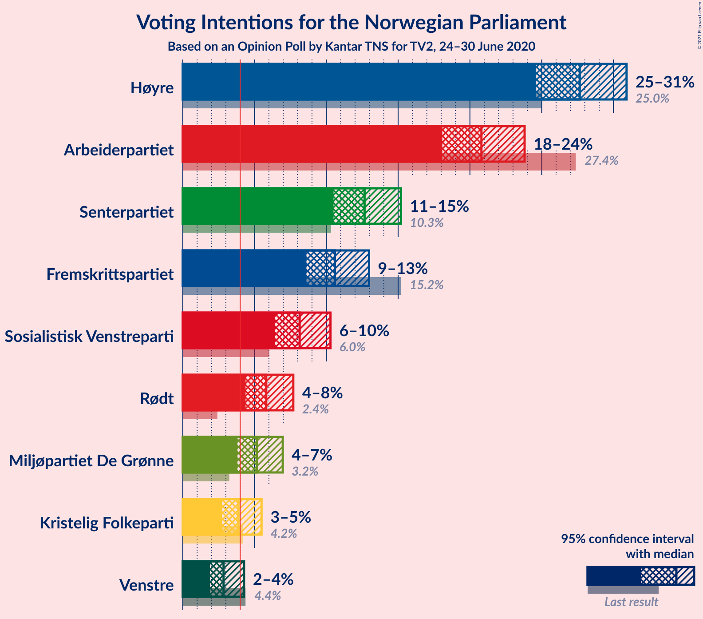

### Confidence Intervals

| Party | Last Result | Poll Result | 80% Confidence Interval | 90% Confidence Interval | 95% Confidence Interval | 99% Confidence Interval |
|:-----:|:-----------:|:-----------:|:-----------------------:|:-----------------------:|:-----------------------:|:-----------------------:|
| Høyre | 25.0% | 27.6% | 25.7–29.8% |25.1–30.4% |24.6–30.9% |23.7–31.9% |
| Arbeiderpartiet | 27.4% | 20.8% | 19.0–22.8% |18.5–23.3% |18.1–23.8% |17.3–24.8% |
| Senterpartiet | 10.3% | 12.7% | 11.2–14.3% |10.8–14.8% |10.5–15.2% |9.8–16.0% |
| Fremskrittspartiet | 15.2% | 10.6% | 9.3–12.1% |8.9–12.6% |8.6–13.0% |8.0–13.7% |
| Sosialistisk Venstreparti | 6.0% | 8.1% | 7.0–9.5% |6.7–9.9% |6.4–10.3% |5.9–11.0% |
| Rødt | 2.4% | 5.8% | 4.9–7.0% |4.6–7.4% |4.4–7.7% |3.9–8.3% |
| Miljøpartiet De Grønne | 3.2% | 5.2% | 4.3–6.3% |4.0–6.7% |3.8–7.0% |3.4–7.6% |
| Kristelig Folkeparti | 4.2% | 3.9% | 3.1–4.9% |2.9–5.2% |2.7–5.5% |2.4–6.0% |
| Venstre | 4.4% | 2.8% | 2.2–3.8% |2.0–4.0% |1.9–4.3% |1.6–4.8% |

*Note:* The poll result column reflects the actual value used in the calculations. Published results may vary slightly, and in addition be rounded to fewer digits.

## Seats

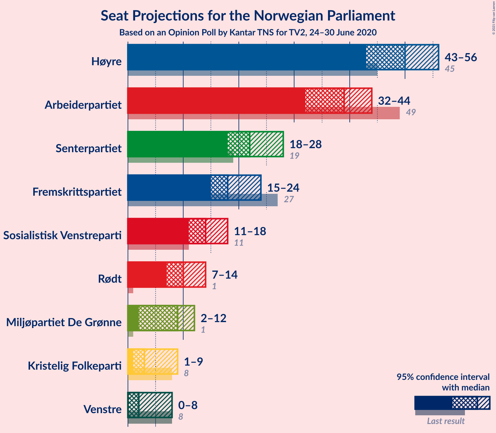

### Confidence Intervals

| Party | Last Result | Median | 80% Confidence Interval | 90% Confidence Interval | 95% Confidence Interval | 99% Confidence Interval |
|:-----:|:-----------:|:------:|:-----------------------:|:-----------------------:|:-----------------------:|:-----------------------:|
| <a href="#høyre">Høyre</a> | 45 | 50 | 45–53 |45–55 |43–56 |41–58 |
| <a href="#arbeiderpartiet">Arbeiderpartiet</a> | 49 | 39 | 33–42 |32–43 |32–44 |30–46 |
| <a href="#senterpartiet">Senterpartiet</a> | 19 | 22 | 19–26 |19–26 |18–28 |18–31 |
| <a href="#fremskrittspartiet">Fremskrittspartiet</a> | 27 | 18 | 16–21 |15–23 |15–24 |13–25 |
| <a href="#sosialistisk-venstreparti">Sosialistisk Venstreparti</a> | 11 | 14 | 12–17 |11–18 |11–18 |10–20 |
| <a href="#rødt">Rødt</a> | 1 | 10 | 8–13 |7–13 |7–14 |2–15 |
| <a href="#miljøpartiet-de-grønne">Miljøpartiet De Grønne</a> | 1 | 9 | 7–11 |2–12 |2–12 |1–13 |
| <a href="#kristelig-folkeparti">Kristelig Folkeparti</a> | 8 | 3 | 2–8 |2–9 |1–9 |1–10 |
| <a href="#venstre">Venstre</a> | 8 | 2 | 1–7 |0–7 |0–8 |0–8 |

### Høyre

*For a full overview of the results for this party, see the [Høyre](party-høyre.html) page.*

| Number of Seats | Probability | Accumulated | Special Marks |
|:---------------:|:-----------:|:-----------:|:-------------:|
| 39 | 0.1% | 100% |  |
| 40 | 0.2% | 99.9% |  |
| 41 | 0.4% | 99.8% |  |
| 42 | 0.8% | 99.4% |  |
| 43 | 2% | 98.6% |  |
| 44 | 1.5% | 97% |  |
| 45 | 6% | 96% | Last Result |
| 46 | 6% | 90% |  |
| 47 | 8% | 83% |  |
| 48 | 9% | 75% |  |
| 49 | 15% | 66% |  |
| 50 | 18% | 51% | Median |
| 51 | 11% | 33% |  |
| 52 | 7% | 22% |  |
| 53 | 6% | 15% |  |
| 54 | 3% | 10% |  |
| 55 | 3% | 7% |  |
| 56 | 2% | 4% |  |
| 57 | 1.2% | 2% |  |
| 58 | 0.8% | 1.1% |  |
| 59 | 0.2% | 0.3% |  |
| 60 | 0.1% | 0.1% |  |
| 61 | 0% | 0% |  |

### Arbeiderpartiet

*For a full overview of the results for this party, see the [Arbeiderpartiet](party-arbeiderpartiet.html) page.*

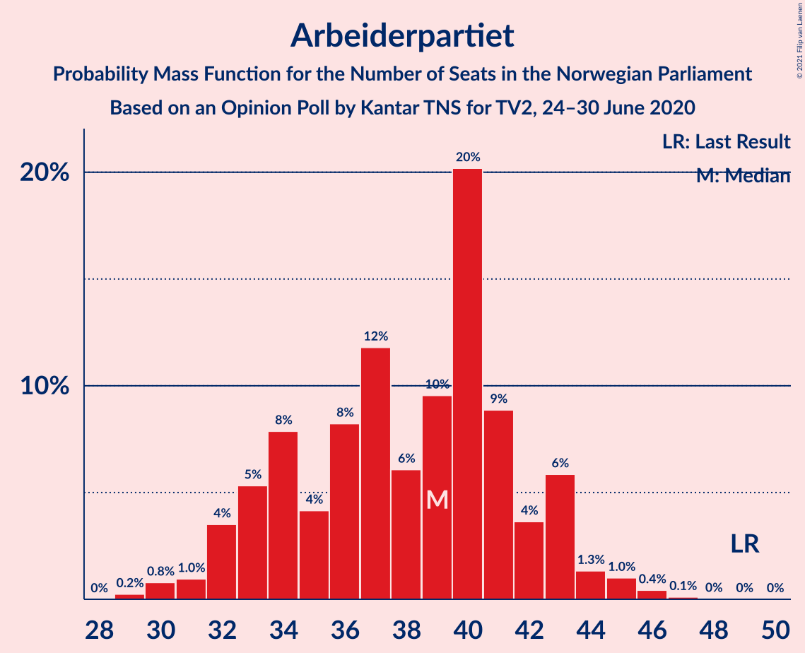

| Number of Seats | Probability | Accumulated | Special Marks |
|:---------------:|:-----------:|:-----------:|:-------------:|
| 29 | 0.2% | 100% |  |
| 30 | 0.8% | 99.7% |  |
| 31 | 1.0% | 99.0% |  |
| 32 | 4% | 98% |  |
| 33 | 5% | 94% |  |
| 34 | 8% | 89% |  |
| 35 | 4% | 81% |  |
| 36 | 8% | 77% |  |
| 37 | 12% | 69% |  |
| 38 | 6% | 57% |  |
| 39 | 10% | 51% | Median |
| 40 | 20% | 41% |  |
| 41 | 9% | 21% |  |
| 42 | 4% | 12% |  |
| 43 | 6% | 9% |  |
| 44 | 1.3% | 3% |  |
| 45 | 1.0% | 2% |  |
| 46 | 0.4% | 0.6% |  |
| 47 | 0.1% | 0.2% |  |
| 48 | 0% | 0.1% |  |
| 49 | 0% | 0% | Last Result |

### Senterpartiet

*For a full overview of the results for this party, see the [Senterpartiet](party-senterpartiet.html) page.*

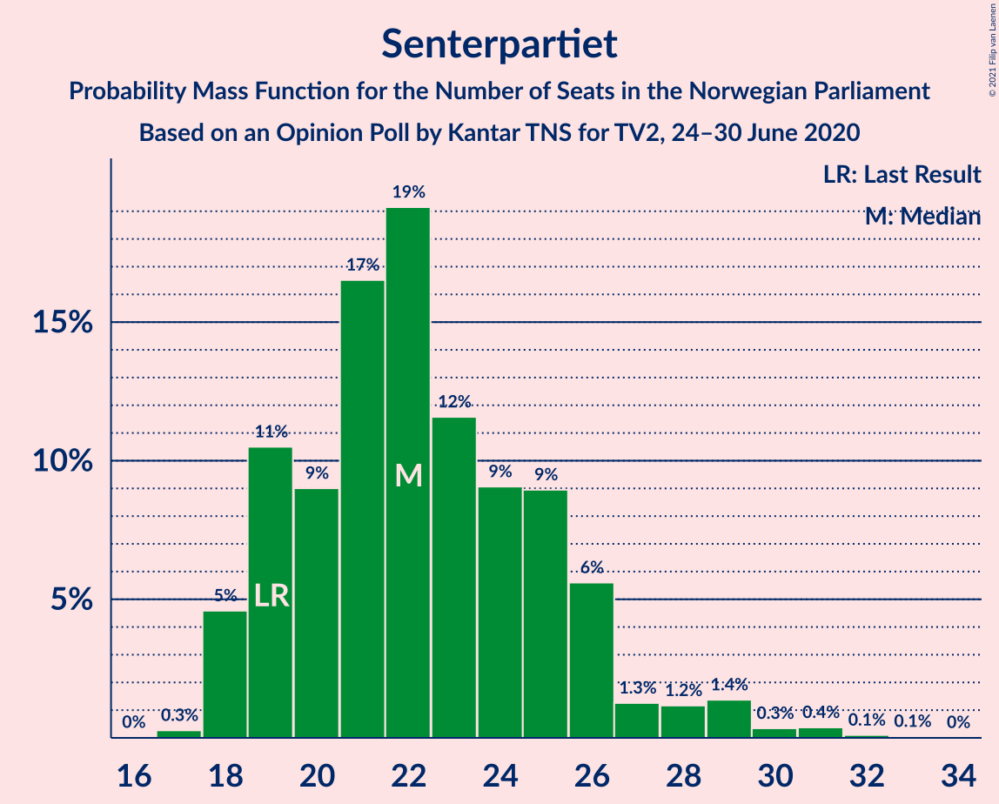

| Number of Seats | Probability | Accumulated | Special Marks |
|:---------------:|:-----------:|:-----------:|:-------------:|
| 17 | 0.3% | 100% |  |
| 18 | 5% | 99.7% |  |
| 19 | 11% | 95% | Last Result |
| 20 | 9% | 85% |  |
| 21 | 17% | 76% |  |
| 22 | 19% | 59% | Median |
| 23 | 12% | 40% |  |
| 24 | 9% | 28% |  |
| 25 | 9% | 19% |  |
| 26 | 6% | 10% |  |
| 27 | 1.3% | 5% |  |
| 28 | 1.2% | 3% |  |
| 29 | 1.4% | 2% |  |
| 30 | 0.3% | 0.9% |  |
| 31 | 0.4% | 0.6% |  |
| 32 | 0.1% | 0.2% |  |
| 33 | 0.1% | 0.1% |  |
| 34 | 0% | 0% |  |

### Fremskrittspartiet

*For a full overview of the results for this party, see the [Fremskrittspartiet](party-fremskrittspartiet.html) page.*

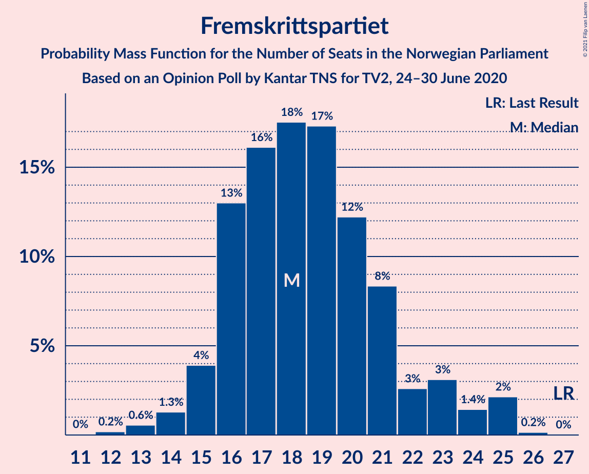

| Number of Seats | Probability | Accumulated | Special Marks |
|:---------------:|:-----------:|:-----------:|:-------------:|
| 12 | 0.2% | 100% |  |
| 13 | 0.6% | 99.8% |  |
| 14 | 1.3% | 99.2% |  |
| 15 | 4% | 98% |  |
| 16 | 13% | 94% |  |
| 17 | 16% | 81% |  |
| 18 | 18% | 65% | Median |
| 19 | 17% | 47% |  |
| 20 | 12% | 30% |  |
| 21 | 8% | 18% |  |
| 22 | 3% | 9% |  |
| 23 | 3% | 7% |  |
| 24 | 1.4% | 4% |  |
| 25 | 2% | 2% |  |
| 26 | 0.2% | 0.2% |  |
| 27 | 0% | 0% | Last Result |

### Sosialistisk Venstreparti

*For a full overview of the results for this party, see the [Sosialistisk Venstreparti](party-sosialistiskvenstreparti.html) page.*

| Number of Seats | Probability | Accumulated | Special Marks |
|:---------------:|:-----------:|:-----------:|:-------------:|
| 9 | 0.4% | 100% |  |
| 10 | 1.4% | 99.6% |  |
| 11 | 5% | 98% | Last Result |
| 12 | 18% | 94% |  |
| 13 | 15% | 75% |  |
| 14 | 15% | 60% | Median |
| 15 | 16% | 45% |  |
| 16 | 13% | 29% |  |
| 17 | 7% | 16% |  |
| 18 | 7% | 9% |  |
| 19 | 1.4% | 2% |  |
| 20 | 0.6% | 0.8% |  |
| 21 | 0.2% | 0.2% |  |
| 22 | 0% | 0% |  |

### Rødt

*For a full overview of the results for this party, see the [Rødt](party-rødt.html) page.*

| Number of Seats | Probability | Accumulated | Special Marks |
|:---------------:|:-----------:|:-----------:|:-------------:|
| 1 | 0% | 100% | Last Result |
| 2 | 0.9% | 100% |  |
| 3 | 0% | 99.1% |  |
| 4 | 0% | 99.1% |  |
| 5 | 0% | 99.1% |  |
| 6 | 0.1% | 99.1% |  |
| 7 | 5% | 99.0% |  |
| 8 | 10% | 94% |  |
| 9 | 11% | 84% |  |
| 10 | 27% | 72% | Median |
| 11 | 24% | 45% |  |
| 12 | 8% | 21% |  |
| 13 | 9% | 13% |  |
| 14 | 2% | 4% |  |
| 15 | 2% | 2% |  |
| 16 | 0.2% | 0.2% |  |
| 17 | 0% | 0% |  |

### Miljøpartiet De Grønne

*For a full overview of the results for this party, see the [Miljøpartiet De Grønne](party-miljøpartietdegrønne.html) page.*

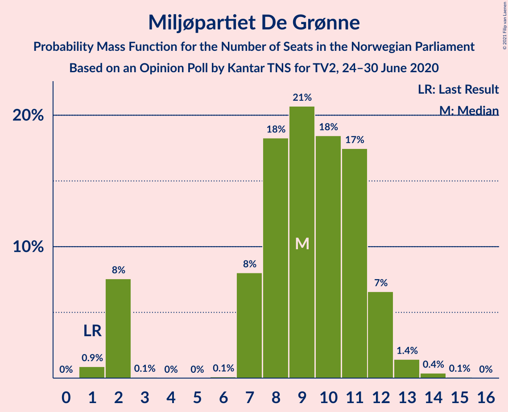

| Number of Seats | Probability | Accumulated | Special Marks |
|:---------------:|:-----------:|:-----------:|:-------------:|
| 1 | 0.9% | 100% | Last Result |
| 2 | 8% | 99.1% |  |
| 3 | 0.1% | 92% |  |
| 4 | 0% | 91% |  |
| 5 | 0% | 91% |  |
| 6 | 0.1% | 91% |  |
| 7 | 8% | 91% |  |
| 8 | 18% | 83% |  |
| 9 | 21% | 65% | Median |
| 10 | 18% | 44% |  |
| 11 | 17% | 26% |  |
| 12 | 7% | 8% |  |
| 13 | 1.4% | 2% |  |
| 14 | 0.4% | 0.5% |  |
| 15 | 0.1% | 0.1% |  |
| 16 | 0% | 0% |  |

### Kristelig Folkeparti

*For a full overview of the results for this party, see the [Kristelig Folkeparti](party-kristeligfolkeparti.html) page.*

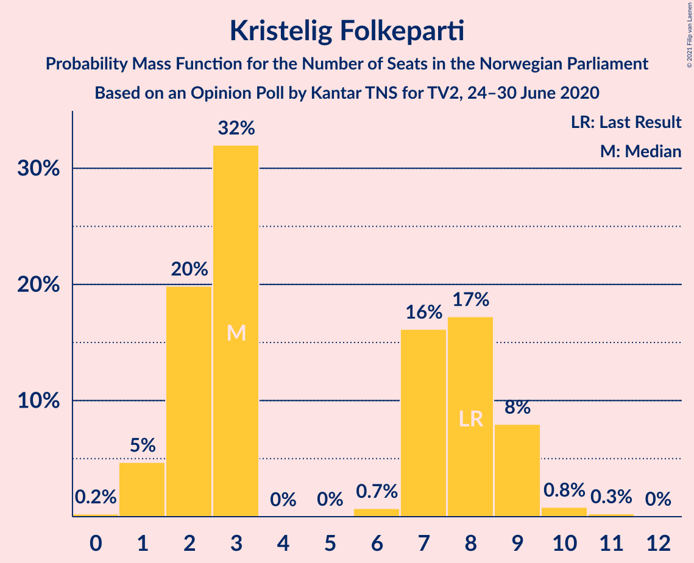

| Number of Seats | Probability | Accumulated | Special Marks |
|:---------------:|:-----------:|:-----------:|:-------------:|
| 0 | 0.2% | 100% |  |
| 1 | 5% | 99.8% |  |
| 2 | 20% | 95% |  |
| 3 | 32% | 75% | Median |
| 4 | 0% | 43% |  |
| 5 | 0% | 43% |  |
| 6 | 0.7% | 43% |  |
| 7 | 16% | 42% |  |
| 8 | 17% | 26% | Last Result |
| 9 | 8% | 9% |  |
| 10 | 0.8% | 1.1% |  |
| 11 | 0.3% | 0.3% |  |
| 12 | 0% | 0% |  |

### Venstre

*For a full overview of the results for this party, see the [Venstre](party-venstre.html) page.*

| Number of Seats | Probability | Accumulated | Special Marks |
|:---------------:|:-----------:|:-----------:|:-------------:|
| 0 | 6% | 100% |  |
| 1 | 26% | 94% |  |
| 2 | 52% | 67% | Median |
| 3 | 0% | 15% |  |
| 4 | 0% | 15% |  |
| 5 | 0% | 15% |  |
| 6 | 2% | 15% |  |
| 7 | 10% | 13% |  |
| 8 | 3% | 3% | Last Result |
| 9 | 0.2% | 0.2% |  |
| 10 | 0% | 0% |  |

## Coalitions

### Confidence Intervals

| Coalition | Last Result | Median | Majority? | 80% Confidence Interval | 90% Confidence Interval | 95% Confidence Interval | 99% Confidence Interval |
|:---------:|:-----------:|:------:|:---------:|:-----------------------:|:-----------------------:|:-----------------------:|:-----------------------:|
| Høyre – Senterpartiet – Fremskrittspartiet – Kristelig Folkeparti – Venstre | 107 | 97 | 100% | 92–103 | 91–105 | 91–105 | 88–107 |
| Arbeiderpartiet – Senterpartiet – Sosialistisk Venstreparti – Rødt – Miljøpartiet De Grønne | 81 | 93 | 99.1% | 88–99 | 86–100 | 86–102 | 84–103 |
| Arbeiderpartiet – Senterpartiet – Sosialistisk Venstreparti – Miljøpartiet De Grønne – Kristelig Folkeparti | 88 | 88 | 84% | 84–93 | 83–94 | 81–95 | 78–99 |
| Arbeiderpartiet – Senterpartiet – Sosialistisk Venstreparti – Rødt | 80 | 85 | 53% | 80–90 | 79–91 | 78–92 | 75–95 |
| Høyre – Fremskrittspartiet – Miljøpartiet De Grønne – Kristelig Folkeparti – Venstre | 89 | 84 | 46% | 79–89 | 78–90 | 77–91 | 74–94 |
| Arbeiderpartiet – Senterpartiet – Sosialistisk Venstreparti – Miljøpartiet De Grønne | 80 | 84 | 39% | 78–89 | 77–90 | 76–91 | 73–93 |
| Høyre – Fremskrittspartiet – Kristelig Folkeparti – Venstre | 88 | 76 | 0.8% | 70–81 | 69–82 | 67–83 | 66–85 |
| Arbeiderpartiet – Senterpartiet – Sosialistisk Venstreparti | 79 | 75 | 0.3% | 70–79 | 69–80 | 68–82 | 65–84 |
| Arbeiderpartiet – Senterpartiet – Miljøpartiet De Grønne – Kristelig Folkeparti | 77 | 75 | 0.8% | 68–80 | 68–81 | 67–82 | 63–85 |
| Høyre – Fremskrittspartiet – Venstre | 80 | 70 | 0% | 66–75 | 65–76 | 63–77 | 61–80 |
| Høyre – Fremskrittspartiet | 72 | 68 | 0% | 64–73 | 62–74 | 62–75 | 59–77 |
| Arbeiderpartiet – Senterpartiet – Kristelig Folkeparti | 76 | 66 | 0% | 60–70 | 59–72 | 57–73 | 55–77 |
| Arbeiderpartiet – Senterpartiet | 68 | 60 | 0% | 56–65 | 54–66 | 54–67 | 51–70 |
| Høyre – Kristelig Folkeparti – Venstre | 61 | 57 | 0% | 51–62 | 50–63 | 49–64 | 47–67 |
| Arbeiderpartiet – Sosialistisk Venstreparti | 60 | 52 | 0% | 48–57 | 47–58 | 46–59 | 43–60 |
| Senterpartiet – Kristelig Folkeparti – Venstre | 35 | 29 | 0% | 25–34 | 23–35 | 22–37 | 22–40 |

### Høyre – Senterpartiet – Fremskrittspartiet – Kristelig Folkeparti – Venstre

| Number of Seats | Probability | Accumulated | Special Marks |
|:---------------:|:-----------:|:-----------:|:-------------:|
| 86 | 0% | 100% |  |
| 87 | 0.1% | 99.9% |  |
| 88 | 0.4% | 99.8% |  |
| 89 | 0.5% | 99.4% |  |
| 90 | 0.7% | 98.9% |  |
| 91 | 8% | 98% |  |
| 92 | 5% | 91% |  |
| 93 | 4% | 86% |  |
| 94 | 7% | 81% |  |
| 95 | 11% | 75% | Median |
| 96 | 8% | 64% |  |
| 97 | 8% | 56% |  |
| 98 | 5% | 48% |  |
| 99 | 8% | 43% |  |
| 100 | 13% | 34% |  |
| 101 | 4% | 21% |  |
| 102 | 4% | 18% |  |
| 103 | 4% | 14% |  |
| 104 | 4% | 10% |  |
| 105 | 3% | 5% |  |
| 106 | 1.1% | 2% |  |
| 107 | 0.5% | 0.9% | Last Result |
| 108 | 0.3% | 0.5% |  |
| 109 | 0.1% | 0.2% |  |
| 110 | 0.1% | 0.1% |  |
| 111 | 0% | 0.1% |  |
| 112 | 0% | 0% |  |

### Arbeiderpartiet – Senterpartiet – Sosialistisk Venstreparti – Rødt – Miljøpartiet De Grønne

| Number of Seats | Probability | Accumulated | Special Marks |
|:---------------:|:-----------:|:-----------:|:-------------:|
| 80 | 0% | 100% |  |
| 81 | 0.1% | 99.9% | Last Result |
| 82 | 0.1% | 99.9% |  |
| 83 | 0.2% | 99.7% |  |
| 84 | 0.4% | 99.5% |  |
| 85 | 0.5% | 99.1% | Majority |
| 86 | 4% | 98.6% |  |
| 87 | 3% | 95% |  |
| 88 | 4% | 92% |  |
| 89 | 4% | 87% |  |
| 90 | 4% | 84% |  |
| 91 | 12% | 80% |  |
| 92 | 9% | 68% |  |
| 93 | 10% | 59% |  |
| 94 | 5% | 49% | Median |
| 95 | 8% | 44% |  |
| 96 | 6% | 36% |  |
| 97 | 8% | 29% |  |
| 98 | 6% | 21% |  |
| 99 | 8% | 15% |  |
| 100 | 3% | 7% |  |
| 101 | 1.4% | 5% |  |
| 102 | 3% | 3% |  |
| 103 | 0.4% | 0.7% |  |
| 104 | 0.1% | 0.3% |  |
| 105 | 0.1% | 0.2% |  |
| 106 | 0.1% | 0.1% |  |
| 107 | 0% | 0% |  |

### Arbeiderpartiet – Senterpartiet – Sosialistisk Venstreparti – Miljøpartiet De Grønne – Kristelig Folkeparti

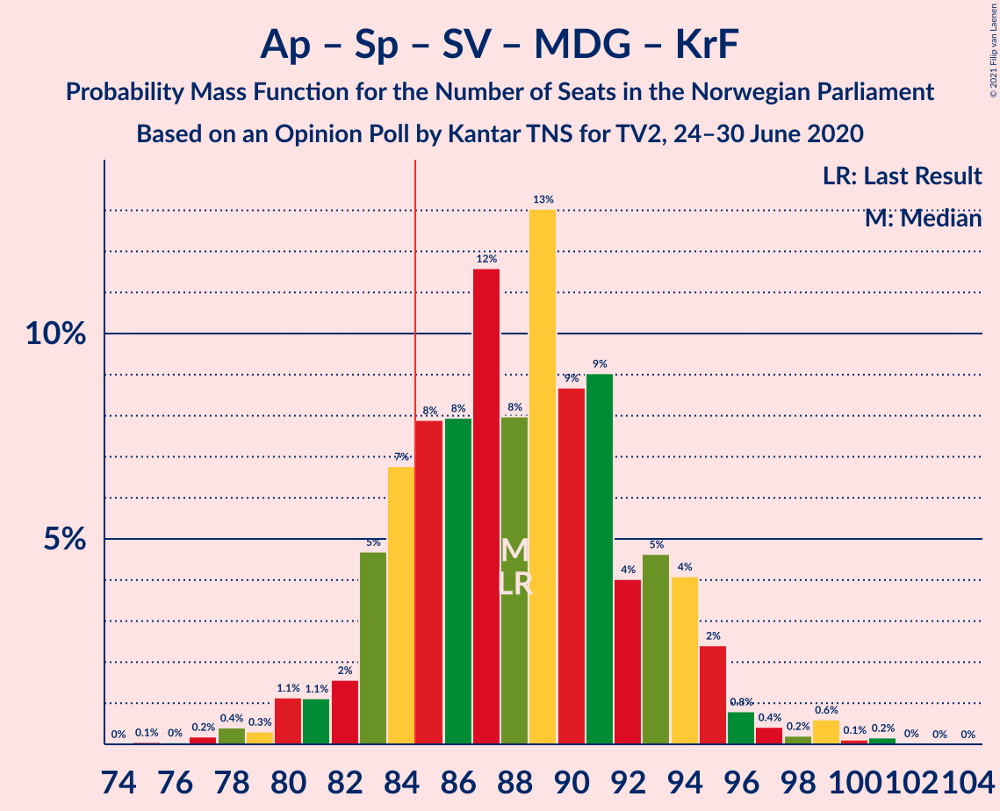

| Number of Seats | Probability | Accumulated | Special Marks |
|:---------------:|:-----------:|:-----------:|:-------------:|
| 75 | 0.1% | 100% |  |
| 76 | 0% | 99.9% |  |
| 77 | 0.2% | 99.9% |  |
| 78 | 0.4% | 99.7% |  |
| 79 | 0.3% | 99.3% |  |
| 80 | 1.1% | 99.0% |  |
| 81 | 1.1% | 98% |  |
| 82 | 2% | 97% |  |
| 83 | 5% | 95% |  |
| 84 | 7% | 90% |  |
| 85 | 8% | 84% | Majority |
| 86 | 8% | 76% |  |
| 87 | 12% | 68% | Median |
| 88 | 8% | 56% | Last Result |
| 89 | 13% | 48% |  |
| 90 | 9% | 35% |  |
| 91 | 9% | 27% |  |
| 92 | 4% | 18% |  |
| 93 | 5% | 13% |  |
| 94 | 4% | 9% |  |
| 95 | 2% | 5% |  |
| 96 | 0.8% | 2% |  |
| 97 | 0.4% | 2% |  |
| 98 | 0.2% | 1.1% |  |
| 99 | 0.6% | 0.9% |  |
| 100 | 0.1% | 0.3% |  |
| 101 | 0.2% | 0.2% |  |
| 102 | 0% | 0.1% |  |
| 103 | 0% | 0% |  |

### Arbeiderpartiet – Senterpartiet – Sosialistisk Venstreparti – Rødt

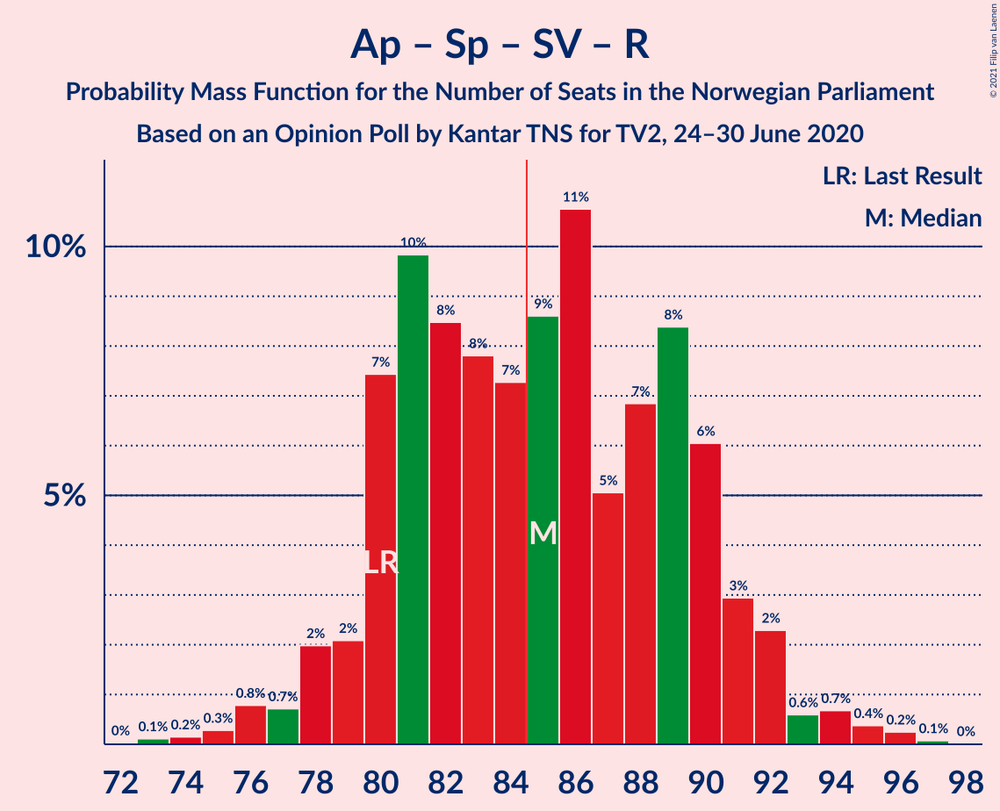

| Number of Seats | Probability | Accumulated | Special Marks |
|:---------------:|:-----------:|:-----------:|:-------------:|
| 72 | 0% | 100% |  |
| 73 | 0.1% | 99.9% |  |
| 74 | 0.2% | 99.8% |  |
| 75 | 0.3% | 99.7% |  |
| 76 | 0.8% | 99.4% |  |
| 77 | 0.7% | 98.6% |  |
| 78 | 2% | 98% |  |
| 79 | 2% | 96% |  |
| 80 | 7% | 94% | Last Result |
| 81 | 10% | 86% |  |
| 82 | 8% | 77% |  |
| 83 | 8% | 68% |  |
| 84 | 7% | 60% |  |
| 85 | 9% | 53% | Median, Majority |
| 86 | 11% | 44% |  |
| 87 | 5% | 34% |  |
| 88 | 7% | 29% |  |
| 89 | 8% | 22% |  |
| 90 | 6% | 13% |  |
| 91 | 3% | 7% |  |
| 92 | 2% | 4% |  |
| 93 | 0.6% | 2% |  |
| 94 | 0.7% | 1.4% |  |
| 95 | 0.4% | 0.7% |  |
| 96 | 0.2% | 0.4% |  |
| 97 | 0.1% | 0.1% |  |
| 98 | 0% | 0% |  |

### Høyre – Fremskrittspartiet – Miljøpartiet De Grønne – Kristelig Folkeparti – Venstre

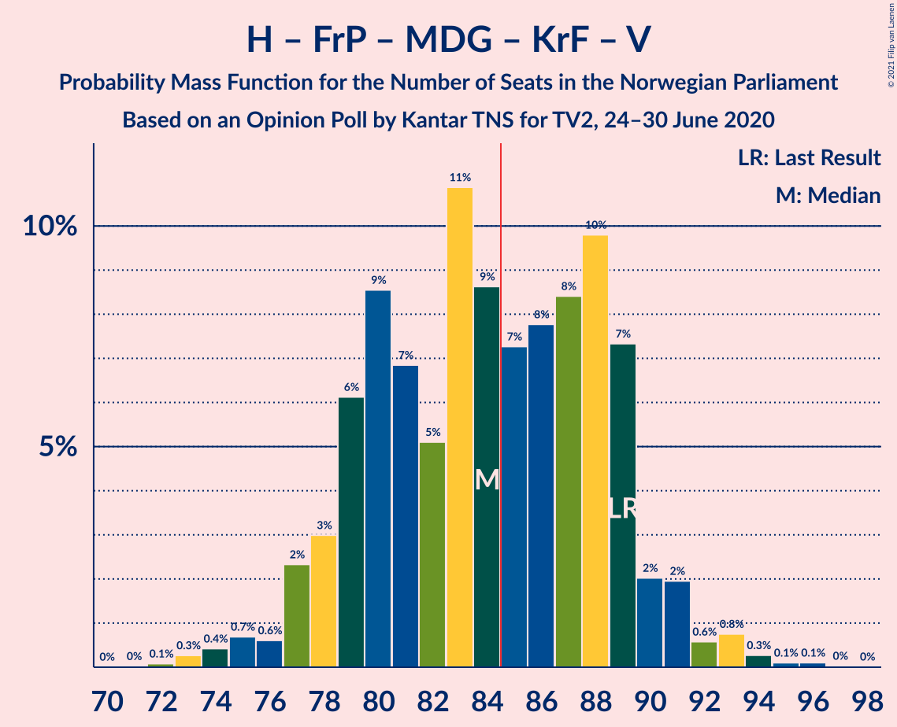

| Number of Seats | Probability | Accumulated | Special Marks |
|:---------------:|:-----------:|:-----------:|:-------------:|
| 71 | 0% | 100% |  |
| 72 | 0.1% | 99.9% |  |
| 73 | 0.3% | 99.9% |  |
| 74 | 0.4% | 99.6% |  |
| 75 | 0.7% | 99.2% |  |
| 76 | 0.6% | 98% |  |
| 77 | 2% | 98% |  |
| 78 | 3% | 96% |  |
| 79 | 6% | 93% |  |
| 80 | 9% | 86% |  |
| 81 | 7% | 78% |  |
| 82 | 5% | 71% | Median |
| 83 | 11% | 66% |  |
| 84 | 9% | 55% |  |
| 85 | 7% | 46% | Majority |
| 86 | 8% | 39% |  |
| 87 | 8% | 31% |  |
| 88 | 10% | 23% |  |
| 89 | 7% | 13% | Last Result |
| 90 | 2% | 6% |  |
| 91 | 2% | 4% |  |
| 92 | 0.6% | 2% |  |
| 93 | 0.8% | 1.3% |  |
| 94 | 0.3% | 0.5% |  |
| 95 | 0.1% | 0.3% |  |
| 96 | 0.1% | 0.1% |  |
| 97 | 0% | 0% |  |

### Arbeiderpartiet – Senterpartiet – Sosialistisk Venstreparti – Miljøpartiet De Grønne

| Number of Seats | Probability | Accumulated | Special Marks |
|:---------------:|:-----------:|:-----------:|:-------------:|
| 71 | 0% | 100% |  |
| 72 | 0.2% | 99.9% |  |
| 73 | 0.2% | 99.7% |  |
| 74 | 0.7% | 99.5% |  |
| 75 | 1.3% | 98.8% |  |
| 76 | 2% | 98% |  |
| 77 | 4% | 95% |  |
| 78 | 2% | 91% |  |
| 79 | 6% | 90% |  |
| 80 | 8% | 84% | Last Result |
| 81 | 8% | 76% |  |
| 82 | 11% | 67% |  |
| 83 | 5% | 56% |  |
| 84 | 13% | 52% | Median |
| 85 | 8% | 39% | Majority |
| 86 | 7% | 31% |  |
| 87 | 7% | 25% |  |
| 88 | 6% | 18% |  |
| 89 | 7% | 12% |  |
| 90 | 3% | 5% |  |
| 91 | 0.7% | 3% |  |
| 92 | 1.0% | 2% |  |
| 93 | 0.5% | 0.9% |  |
| 94 | 0.2% | 0.4% |  |
| 95 | 0.1% | 0.2% |  |
| 96 | 0.1% | 0.1% |  |
| 97 | 0% | 0% |  |

### Høyre – Fremskrittspartiet – Kristelig Folkeparti – Venstre

| Number of Seats | Probability | Accumulated | Special Marks |
|:---------------:|:-----------:|:-----------:|:-------------:|
| 63 | 0.1% | 100% |  |
| 64 | 0.1% | 99.9% |  |
| 65 | 0.1% | 99.8% |  |
| 66 | 0.4% | 99.7% |  |
| 67 | 3% | 99.2% |  |
| 68 | 1.5% | 97% |  |
| 69 | 3% | 95% |  |
| 70 | 8% | 93% |  |
| 71 | 6% | 84% |  |
| 72 | 8% | 79% |  |
| 73 | 6% | 70% | Median |
| 74 | 8% | 64% |  |
| 75 | 5% | 56% |  |
| 76 | 10% | 50% |  |
| 77 | 9% | 40% |  |
| 78 | 12% | 31% |  |
| 79 | 4% | 19% |  |
| 80 | 4% | 16% |  |
| 81 | 4% | 12% |  |
| 82 | 3% | 8% |  |
| 83 | 4% | 5% |  |
| 84 | 0.4% | 1.2% |  |
| 85 | 0.4% | 0.8% | Majority |
| 86 | 0.2% | 0.4% |  |
| 87 | 0.1% | 0.2% |  |
| 88 | 0% | 0.1% | Last Result |
| 89 | 0% | 0% |  |

### Arbeiderpartiet – Senterpartiet – Sosialistisk Venstreparti

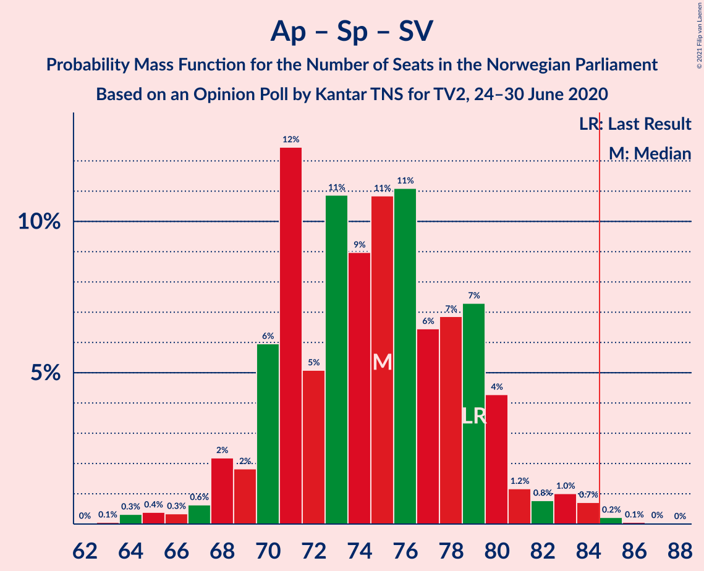

| Number of Seats | Probability | Accumulated | Special Marks |
|:---------------:|:-----------:|:-----------:|:-------------:|
| 63 | 0.1% | 100% |  |
| 64 | 0.3% | 99.9% |  |
| 65 | 0.4% | 99.6% |  |
| 66 | 0.3% | 99.2% |  |
| 67 | 0.6% | 98.9% |  |
| 68 | 2% | 98% |  |
| 69 | 2% | 96% |  |
| 70 | 6% | 94% |  |
| 71 | 12% | 88% |  |
| 72 | 5% | 76% |  |
| 73 | 11% | 71% |  |
| 74 | 9% | 60% |  |
| 75 | 11% | 51% | Median |
| 76 | 11% | 40% |  |
| 77 | 6% | 29% |  |
| 78 | 7% | 22% |  |
| 79 | 7% | 16% | Last Result |
| 80 | 4% | 8% |  |
| 81 | 1.2% | 4% |  |
| 82 | 0.8% | 3% |  |
| 83 | 1.0% | 2% |  |
| 84 | 0.7% | 1.1% |  |
| 85 | 0.2% | 0.3% | Majority |
| 86 | 0.1% | 0.1% |  |
| 87 | 0% | 0.1% |  |
| 88 | 0% | 0% |  |

### Arbeiderpartiet – Senterpartiet – Miljøpartiet De Grønne – Kristelig Folkeparti

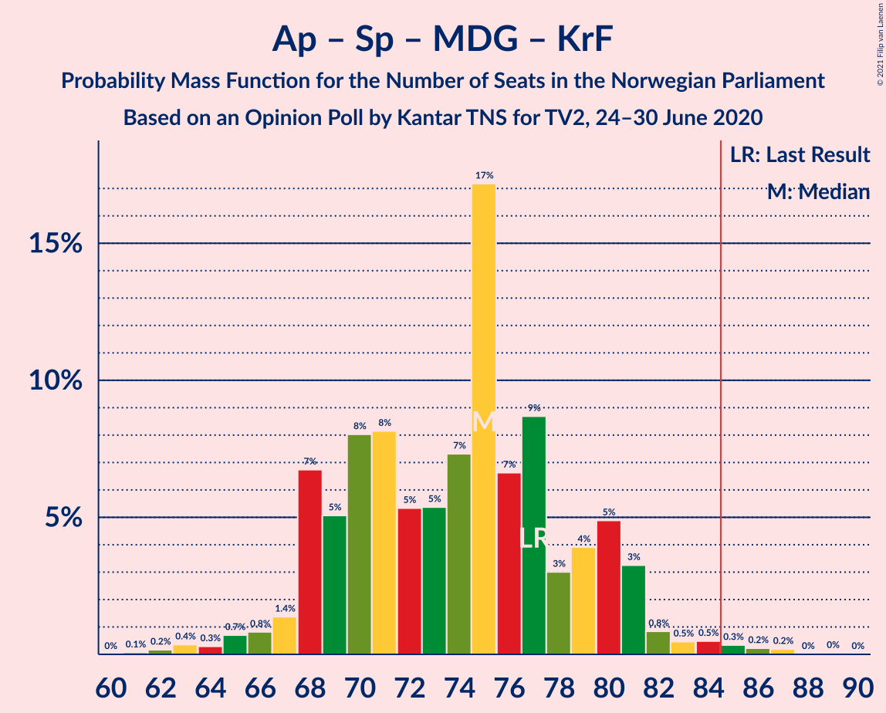

| Number of Seats | Probability | Accumulated | Special Marks |
|:---------------:|:-----------:|:-----------:|:-------------:|
| 61 | 0.1% | 100% |  |
| 62 | 0.2% | 99.9% |  |
| 63 | 0.4% | 99.7% |  |
| 64 | 0.3% | 99.4% |  |
| 65 | 0.7% | 99.1% |  |
| 66 | 0.8% | 98% |  |
| 67 | 1.4% | 98% |  |
| 68 | 7% | 96% |  |
| 69 | 5% | 89% |  |
| 70 | 8% | 84% |  |
| 71 | 8% | 76% |  |
| 72 | 5% | 68% |  |
| 73 | 5% | 63% | Median |
| 74 | 7% | 57% |  |
| 75 | 17% | 50% |  |
| 76 | 7% | 33% |  |
| 77 | 9% | 26% | Last Result |
| 78 | 3% | 18% |  |
| 79 | 4% | 15% |  |
| 80 | 5% | 11% |  |
| 81 | 3% | 6% |  |
| 82 | 0.8% | 3% |  |
| 83 | 0.5% | 2% |  |
| 84 | 0.5% | 1.3% |  |
| 85 | 0.3% | 0.8% | Majority |
| 86 | 0.2% | 0.5% |  |
| 87 | 0.2% | 0.3% |  |
| 88 | 0% | 0.1% |  |
| 89 | 0% | 0.1% |  |
| 90 | 0% | 0% |  |

### Høyre – Fremskrittspartiet – Venstre

| Number of Seats | Probability | Accumulated | Special Marks |
|:---------------:|:-----------:|:-----------:|:-------------:|
| 58 | 0% | 100% |  |
| 59 | 0.1% | 99.9% |  |
| 60 | 0.3% | 99.9% |  |
| 61 | 0.5% | 99.5% |  |
| 62 | 0.4% | 99.0% |  |
| 63 | 2% | 98.6% |  |
| 64 | 2% | 97% |  |
| 65 | 4% | 95% |  |
| 66 | 5% | 91% |  |
| 67 | 7% | 86% |  |
| 68 | 14% | 80% |  |
| 69 | 5% | 66% |  |
| 70 | 15% | 61% | Median |
| 71 | 6% | 45% |  |
| 72 | 7% | 39% |  |
| 73 | 7% | 32% |  |
| 74 | 10% | 24% |  |
| 75 | 8% | 14% |  |
| 76 | 3% | 6% |  |
| 77 | 1.3% | 4% |  |
| 78 | 1.1% | 2% |  |
| 79 | 0.5% | 1.4% |  |
| 80 | 0.5% | 0.8% | Last Result |
| 81 | 0.2% | 0.4% |  |
| 82 | 0.1% | 0.1% |  |
| 83 | 0% | 0.1% |  |
| 84 | 0% | 0% |  |

### Høyre – Fremskrittspartiet

| Number of Seats | Probability | Accumulated | Special Marks |
|:---------------:|:-----------:|:-----------:|:-------------:|
| 56 | 0% | 100% |  |
| 57 | 0.1% | 99.9% |  |
| 58 | 0.3% | 99.8% |  |
| 59 | 0.5% | 99.6% |  |
| 60 | 0.3% | 99.0% |  |
| 61 | 0.8% | 98.7% |  |
| 62 | 3% | 98% |  |
| 63 | 2% | 95% |  |
| 64 | 7% | 93% |  |
| 65 | 5% | 86% |  |
| 66 | 16% | 81% |  |
| 67 | 8% | 65% |  |
| 68 | 17% | 56% | Median |
| 69 | 10% | 40% |  |
| 70 | 7% | 29% |  |
| 71 | 4% | 23% |  |
| 72 | 7% | 18% | Last Result |
| 73 | 5% | 11% |  |
| 74 | 3% | 6% |  |
| 75 | 0.9% | 3% |  |
| 76 | 1.2% | 2% |  |
| 77 | 0.3% | 0.7% |  |
| 78 | 0.2% | 0.4% |  |
| 79 | 0.2% | 0.2% |  |
| 80 | 0% | 0.1% |  |
| 81 | 0% | 0% |  |

### Arbeiderpartiet – Senterpartiet – Kristelig Folkeparti

| Number of Seats | Probability | Accumulated | Special Marks |
|:---------------:|:-----------:|:-----------:|:-------------:|
| 53 | 0.1% | 100% |  |
| 54 | 0.1% | 99.9% |  |
| 55 | 0.4% | 99.8% |  |
| 56 | 0.6% | 99.4% |  |
| 57 | 2% | 98.8% |  |
| 58 | 2% | 97% |  |
| 59 | 5% | 95% |  |
| 60 | 2% | 90% |  |
| 61 | 11% | 88% |  |
| 62 | 3% | 77% |  |
| 63 | 7% | 74% |  |
| 64 | 9% | 67% | Median |
| 65 | 6% | 57% |  |
| 66 | 14% | 51% |  |
| 67 | 13% | 37% |  |
| 68 | 5% | 24% |  |
| 69 | 7% | 19% |  |
| 70 | 5% | 12% |  |
| 71 | 2% | 7% |  |
| 72 | 2% | 5% |  |
| 73 | 1.5% | 3% |  |
| 74 | 0.5% | 2% |  |
| 75 | 0.3% | 1.2% |  |
| 76 | 0.3% | 0.9% | Last Result |
| 77 | 0.1% | 0.5% |  |
| 78 | 0.4% | 0.4% |  |
| 79 | 0% | 0.1% |  |
| 80 | 0% | 0% |  |

### Arbeiderpartiet – Senterpartiet

| Number of Seats | Probability | Accumulated | Special Marks |
|:---------------:|:-----------:|:-----------:|:-------------:|
| 51 | 0.5% | 100% |  |
| 52 | 0.5% | 99.4% |  |
| 53 | 1.2% | 99.0% |  |
| 54 | 4% | 98% |  |
| 55 | 1.4% | 94% |  |
| 56 | 8% | 92% |  |
| 57 | 3% | 84% |  |
| 58 | 11% | 82% |  |
| 59 | 17% | 71% |  |
| 60 | 6% | 55% |  |
| 61 | 10% | 49% | Median |
| 62 | 14% | 39% |  |
| 63 | 4% | 25% |  |
| 64 | 10% | 20% |  |
| 65 | 4% | 10% |  |
| 66 | 3% | 6% |  |
| 67 | 2% | 3% |  |
| 68 | 0.5% | 2% | Last Result |
| 69 | 0.4% | 1.1% |  |
| 70 | 0.4% | 0.7% |  |
| 71 | 0.2% | 0.3% |  |
| 72 | 0.1% | 0.1% |  |
| 73 | 0% | 0.1% |  |
| 74 | 0% | 0% |  |

### Høyre – Kristelig Folkeparti – Venstre

| Number of Seats | Probability | Accumulated | Special Marks |
|:---------------:|:-----------:|:-----------:|:-------------:|
| 44 | 0% | 100% |  |
| 45 | 0.1% | 99.9% |  |
| 46 | 0.2% | 99.8% |  |
| 47 | 0.3% | 99.6% |  |
| 48 | 1.3% | 99.3% |  |
| 49 | 0.7% | 98% |  |
| 50 | 4% | 97% |  |
| 51 | 4% | 93% |  |
| 52 | 6% | 90% |  |
| 53 | 10% | 83% |  |
| 54 | 10% | 74% |  |
| 55 | 7% | 64% | Median |
| 56 | 5% | 56% |  |
| 57 | 9% | 52% |  |
| 58 | 4% | 43% |  |
| 59 | 8% | 38% |  |
| 60 | 10% | 31% |  |
| 61 | 11% | 21% | Last Result |
| 62 | 2% | 10% |  |
| 63 | 3% | 8% |  |
| 64 | 2% | 4% |  |
| 65 | 1.4% | 2% |  |
| 66 | 0.3% | 0.9% |  |
| 67 | 0.2% | 0.6% |  |
| 68 | 0.1% | 0.3% |  |
| 69 | 0.1% | 0.2% |  |
| 70 | 0.1% | 0.1% |  |
| 71 | 0% | 0% |  |

### Arbeiderpartiet – Sosialistisk Venstreparti

| Number of Seats | Probability | Accumulated | Special Marks |
|:---------------:|:-----------:|:-----------:|:-------------:|
| 41 | 0% | 100% |  |
| 42 | 0.2% | 99.9% |  |
| 43 | 0.4% | 99.8% |  |
| 44 | 0.3% | 99.4% |  |
| 45 | 1.1% | 99.0% |  |
| 46 | 2% | 98% |  |
| 47 | 4% | 96% |  |
| 48 | 7% | 92% |  |
| 49 | 8% | 85% |  |
| 50 | 5% | 77% |  |
| 51 | 6% | 72% |  |
| 52 | 22% | 66% |  |
| 53 | 8% | 43% | Median |
| 54 | 5% | 35% |  |
| 55 | 11% | 30% |  |
| 56 | 9% | 19% |  |
| 57 | 5% | 11% |  |
| 58 | 2% | 6% |  |
| 59 | 3% | 4% |  |
| 60 | 0.5% | 0.8% | Last Result |
| 61 | 0.2% | 0.4% |  |
| 62 | 0.1% | 0.1% |  |
| 63 | 0% | 0.1% |  |
| 64 | 0% | 0% |  |

### Senterpartiet – Kristelig Folkeparti – Venstre

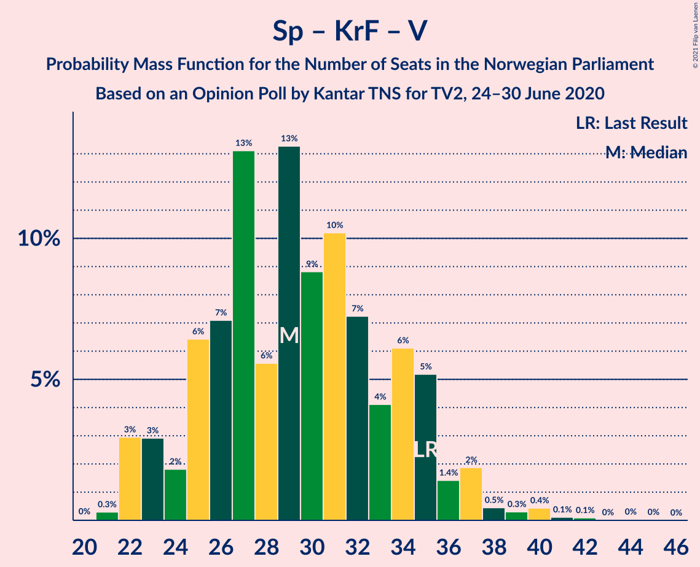

| Number of Seats | Probability | Accumulated | Special Marks |
|:---------------:|:-----------:|:-----------:|:-------------:|
| 20 | 0% | 100% |  |
| 21 | 0.3% | 99.9% |  |
| 22 | 3% | 99.6% |  |
| 23 | 3% | 97% |  |
| 24 | 2% | 94% |  |
| 25 | 6% | 92% |  |
| 26 | 7% | 86% |  |
| 27 | 13% | 78% | Median |
| 28 | 6% | 65% |  |
| 29 | 13% | 60% |  |
| 30 | 9% | 46% |  |
| 31 | 10% | 38% |  |
| 32 | 7% | 27% |  |
| 33 | 4% | 20% |  |
| 34 | 6% | 16% |  |
| 35 | 5% | 10% | Last Result |
| 36 | 1.4% | 5% |  |
| 37 | 2% | 3% |  |
| 38 | 0.5% | 1.5% |  |
| 39 | 0.3% | 1.0% |  |
| 40 | 0.4% | 0.7% |  |
| 41 | 0.1% | 0.3% |  |
| 42 | 0.1% | 0.2% |  |
| 43 | 0% | 0.1% |  |
| 44 | 0% | 0.1% |  |
| 45 | 0% | 0% |  |

## Technical Information

### Opinion Poll

+ **Polling firm:** Kantar TNS
+ **Commissioner(s):** TV2
+ **Fieldwork period:** 24–30 June 2020

### Calculations

+ **Sample size:** 774
+ **Simulations done:** 524,288
+ **Error estimate:** 1.48%

