# Opinion Poll by Opinion Perduco for Avisenes Nyhetsbyrå, Dagsavisen and FriFagbevegelse, 29 July–3 August 2020

<a href="#voting-intentions">Voting Intentions</a> | <a href="#seats">Seats</a> | <a href="#coalitions">Coalitions</a> | <a href="#technical-information">Technical Information</a>

## Voting Intentions

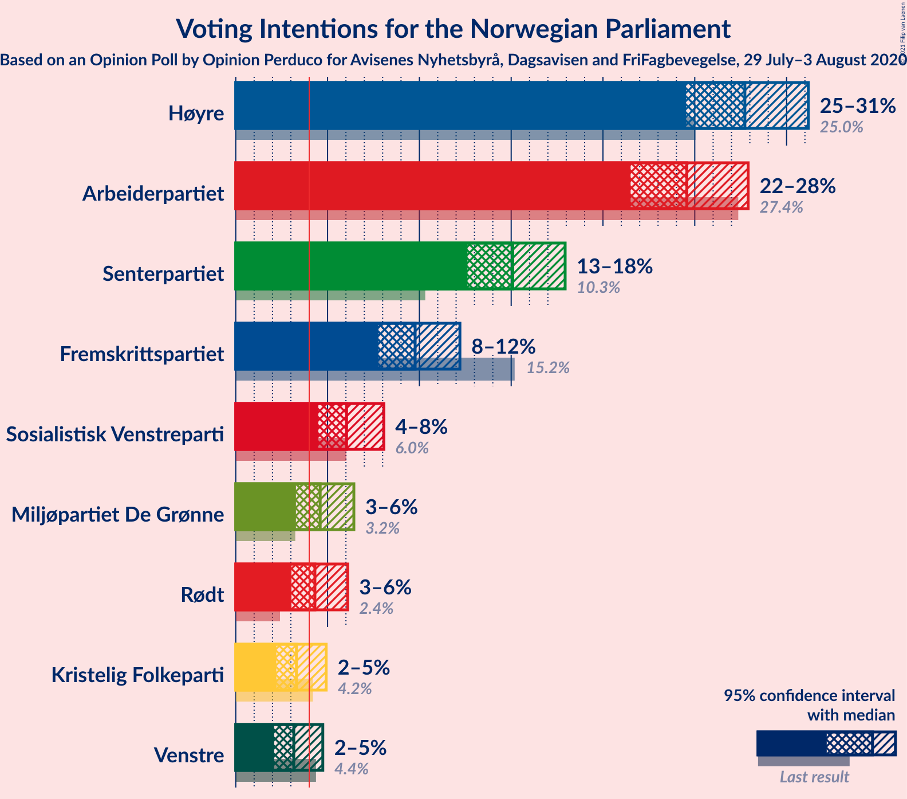

### Confidence Intervals

| Party | Last Result | Poll Result | 80% Confidence Interval | 90% Confidence Interval | 95% Confidence Interval | 99% Confidence Interval |
|:-----:|:-----------:|:-----------:|:-----------------------:|:-----------------------:|:-----------------------:|:-----------------------:|
| Høyre | 25.0% | 27.7% | 25.6–30.0% |25.0–30.6% |24.5–31.2% |23.5–32.3% |
| Arbeiderpartiet | 27.4% | 24.6% | 22.6–26.7% |22.0–27.4% |21.5–27.9% |20.6–29.0% |
| Senterpartiet | 10.3% | 15.1% | 13.5–16.9% |13.0–17.5% |12.6–17.9% |11.9–18.9% |
| Fremskrittspartiet | 15.2% | 9.8% | 8.5–11.4% |8.1–11.8% |7.8–12.2% |7.2–13.0% |
| Sosialistisk Venstreparti | 6.0% | 6.0% | 5.0–7.4% |4.7–7.7% |4.5–8.1% |4.1–8.7% |
| Miljøpartiet De Grønne | 3.2% | 4.6% | 3.7–5.8% |3.5–6.1% |3.3–6.4% |2.9–7.0% |
| Rødt | 2.4% | 4.3% | 3.5–5.5% |3.2–5.8% |3.0–6.1% |2.7–6.7% |
| Kristelig Folkeparti | 4.2% | 3.3% | 2.6–4.4% |2.4–4.6% |2.2–4.9% |1.9–5.5% |
| Venstre | 4.4% | 3.2% | 2.5–4.2% |2.3–4.5% |2.1–4.7% |1.8–5.3% |

*Note:* The poll result column reflects the actual value used in the calculations. Published results may vary slightly, and in addition be rounded to fewer digits.

## Seats

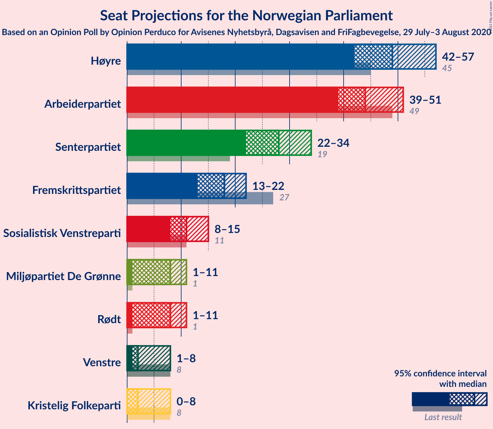

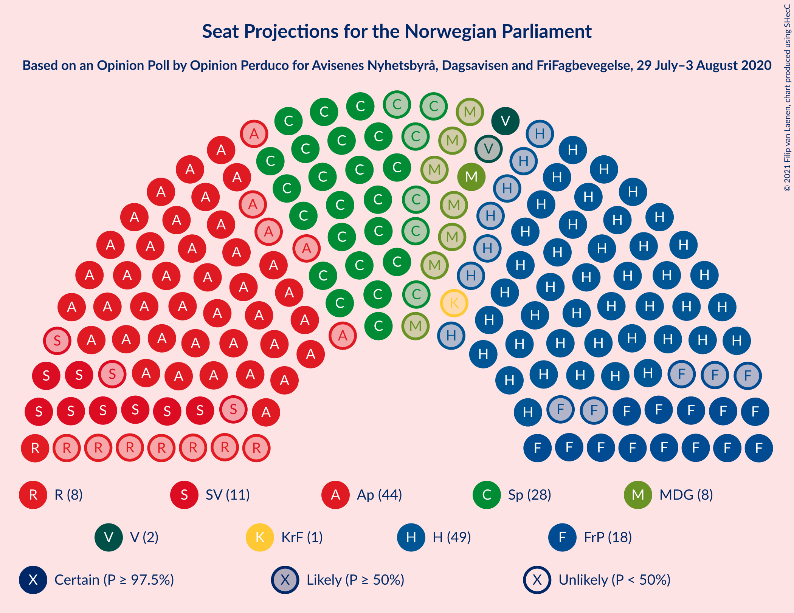

### Confidence Intervals

| Party | Last Result | Median | 80% Confidence Interval | 90% Confidence Interval | 95% Confidence Interval | 99% Confidence Interval |
|:-----:|:-----------:|:------:|:-----------------------:|:-----------------------:|:-----------------------:|:-----------------------:|
| <a href="#høyre">Høyre</a> | 45 | 49 | 45–54 |43–56 |42–57 |40–58 |
| <a href="#arbeiderpartiet">Arbeiderpartiet</a> | 49 | 44 | 40–48 |40–50 |39–51 |37–54 |
| <a href="#senterpartiet">Senterpartiet</a> | 19 | 28 | 24–33 |23–33 |22–34 |20–36 |
| <a href="#fremskrittspartiet">Fremskrittspartiet</a> | 27 | 18 | 15–20 |14–21 |13–22 |12–23 |
| <a href="#sosialistisk-venstreparti">Sosialistisk Venstreparti</a> | 11 | 11 | 9–13 |8–14 |8–15 |7–16 |
| <a href="#miljøpartiet-de-grønne">Miljøpartiet De Grønne</a> | 1 | 8 | 2–10 |1–11 |1–11 |1–12 |
| <a href="#rødt">Rødt</a> | 1 | 8 | 2–10 |2–10 |1–11 |1–12 |
| <a href="#kristelig-folkeparti">Kristelig Folkeparti</a> | 8 | 2 | 1–7 |1–8 |0–8 |0–9 |
| <a href="#venstre">Venstre</a> | 8 | 2 | 1–3 |1–7 |1–8 |0–9 |

### Høyre

*For a full overview of the results for this party, see the [Høyre](party-høyre.html) page.*

| Number of Seats | Probability | Accumulated | Special Marks |
|:---------------:|:-----------:|:-----------:|:-------------:|
| 38 | 0.2% | 100% |  |
| 39 | 0.1% | 99.8% |  |
| 40 | 0.3% | 99.7% |  |
| 41 | 0.9% | 99.4% |  |
| 42 | 2% | 98.5% |  |
| 43 | 2% | 97% |  |
| 44 | 2% | 95% |  |
| 45 | 5% | 93% | Last Result |
| 46 | 11% | 88% |  |
| 47 | 11% | 77% |  |
| 48 | 7% | 66% |  |
| 49 | 19% | 60% | Median |
| 50 | 6% | 40% |  |
| 51 | 6% | 34% |  |
| 52 | 8% | 28% |  |
| 53 | 5% | 20% |  |
| 54 | 5% | 14% |  |
| 55 | 4% | 10% |  |
| 56 | 1.2% | 5% |  |
| 57 | 3% | 4% |  |
| 58 | 0.4% | 0.8% |  |
| 59 | 0.1% | 0.4% |  |
| 60 | 0.2% | 0.3% |  |
| 61 | 0% | 0.1% |  |
| 62 | 0% | 0% |  |

### Arbeiderpartiet

*For a full overview of the results for this party, see the [Arbeiderpartiet](party-arbeiderpartiet.html) page.*

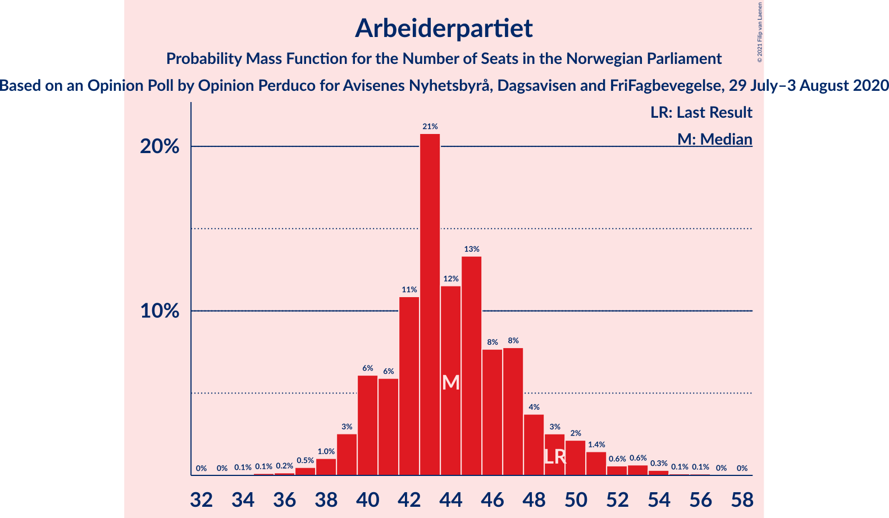

| Number of Seats | Probability | Accumulated | Special Marks |
|:---------------:|:-----------:|:-----------:|:-------------:|
| 34 | 0.1% | 100% |  |
| 35 | 0.1% | 99.9% |  |
| 36 | 0.2% | 99.8% |  |
| 37 | 0.5% | 99.6% |  |
| 38 | 1.0% | 99.2% |  |
| 39 | 3% | 98% |  |
| 40 | 6% | 96% |  |
| 41 | 6% | 89% |  |
| 42 | 11% | 84% |  |
| 43 | 21% | 73% |  |
| 44 | 12% | 52% | Median |
| 45 | 13% | 40% |  |
| 46 | 8% | 27% |  |
| 47 | 8% | 19% |  |
| 48 | 4% | 12% |  |
| 49 | 3% | 8% | Last Result |
| 50 | 2% | 5% |  |
| 51 | 1.4% | 3% |  |
| 52 | 0.6% | 2% |  |
| 53 | 0.6% | 1.2% |  |
| 54 | 0.3% | 0.5% |  |
| 55 | 0.1% | 0.2% |  |
| 56 | 0.1% | 0.1% |  |
| 57 | 0% | 0% |  |

### Senterpartiet

*For a full overview of the results for this party, see the [Senterpartiet](party-senterpartiet.html) page.*

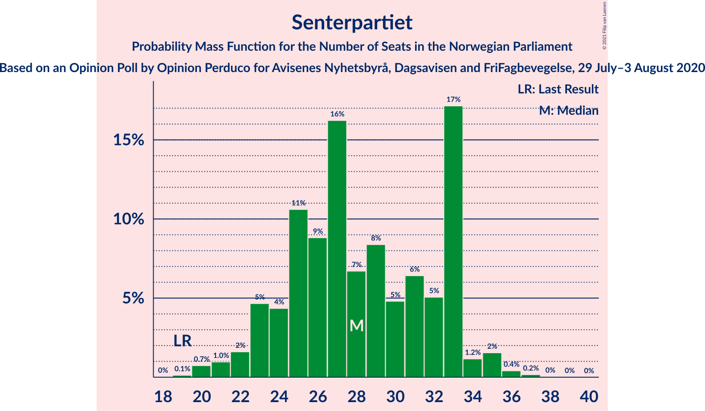

| Number of Seats | Probability | Accumulated | Special Marks |
|:---------------:|:-----------:|:-----------:|:-------------:|
| 19 | 0.1% | 100% | Last Result |
| 20 | 0.7% | 99.8% |  |
| 21 | 1.0% | 99.1% |  |
| 22 | 2% | 98% |  |
| 23 | 5% | 97% |  |
| 24 | 4% | 92% |  |
| 25 | 11% | 88% |  |
| 26 | 9% | 77% |  |
| 27 | 16% | 68% |  |
| 28 | 7% | 52% | Median |
| 29 | 8% | 45% |  |
| 30 | 5% | 37% |  |
| 31 | 6% | 32% |  |
| 32 | 5% | 26% |  |
| 33 | 17% | 20% |  |
| 34 | 1.2% | 3% |  |
| 35 | 2% | 2% |  |
| 36 | 0.4% | 0.6% |  |
| 37 | 0.2% | 0.2% |  |
| 38 | 0% | 0.1% |  |
| 39 | 0% | 0% |  |

### Fremskrittspartiet

*For a full overview of the results for this party, see the [Fremskrittspartiet](party-fremskrittspartiet.html) page.*

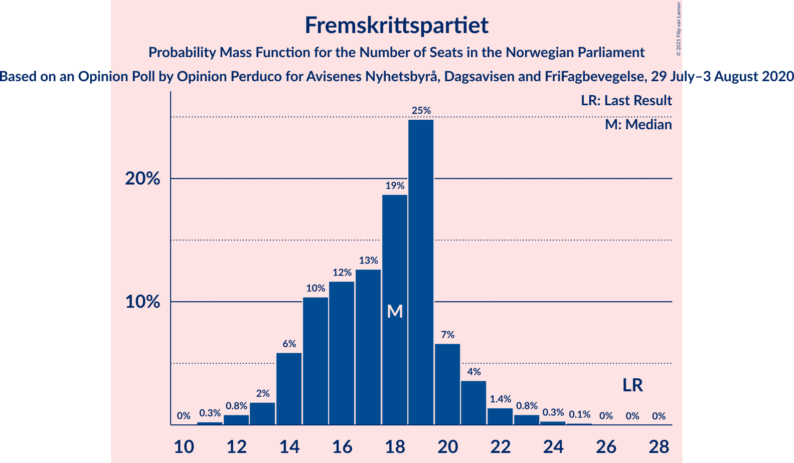

| Number of Seats | Probability | Accumulated | Special Marks |
|:---------------:|:-----------:|:-----------:|:-------------:|
| 11 | 0.3% | 100% |  |
| 12 | 0.8% | 99.7% |  |
| 13 | 2% | 98.9% |  |
| 14 | 6% | 97% |  |
| 15 | 10% | 91% |  |
| 16 | 12% | 81% |  |
| 17 | 13% | 69% |  |
| 18 | 19% | 56% | Median |
| 19 | 25% | 38% |  |
| 20 | 7% | 13% |  |
| 21 | 4% | 6% |  |
| 22 | 1.4% | 3% |  |
| 23 | 0.8% | 1.3% |  |
| 24 | 0.3% | 0.5% |  |
| 25 | 0.1% | 0.2% |  |
| 26 | 0% | 0% |  |
| 27 | 0% | 0% | Last Result |

### Sosialistisk Venstreparti

*For a full overview of the results for this party, see the [Sosialistisk Venstreparti](party-sosialistiskvenstreparti.html) page.*

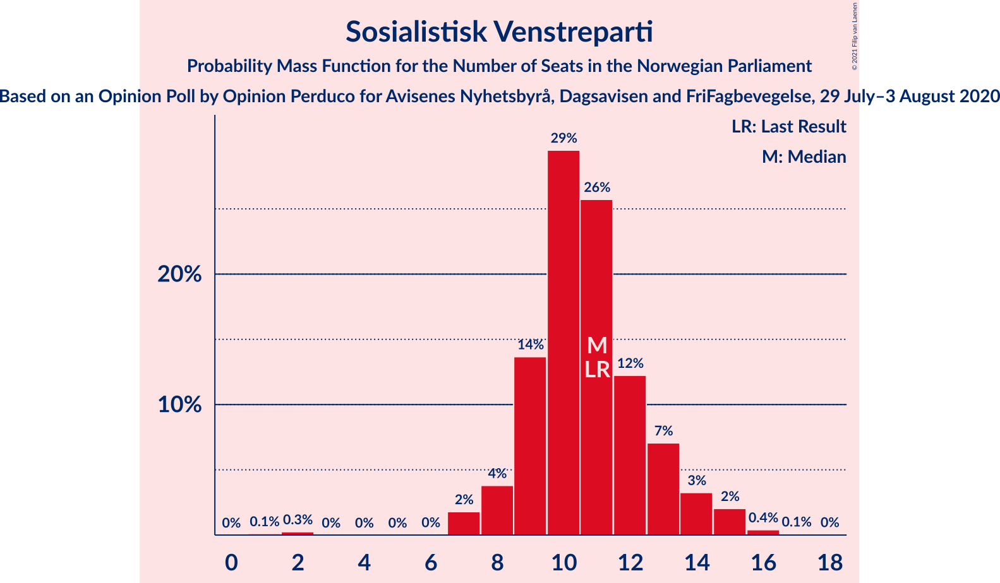

| Number of Seats | Probability | Accumulated | Special Marks |
|:---------------:|:-----------:|:-----------:|:-------------:|
| 1 | 0.1% | 100% |  |
| 2 | 0.3% | 99.9% |  |
| 3 | 0% | 99.6% |  |
| 4 | 0% | 99.6% |  |
| 5 | 0% | 99.6% |  |
| 6 | 0% | 99.6% |  |
| 7 | 2% | 99.6% |  |
| 8 | 4% | 98% |  |
| 9 | 14% | 94% |  |
| 10 | 29% | 80% |  |
| 11 | 26% | 51% | Last Result, Median |
| 12 | 12% | 25% |  |
| 13 | 7% | 13% |  |
| 14 | 3% | 6% |  |
| 15 | 2% | 3% |  |
| 16 | 0.4% | 0.5% |  |
| 17 | 0.1% | 0.1% |  |
| 18 | 0% | 0% |  |

### Miljøpartiet De Grønne

*For a full overview of the results for this party, see the [Miljøpartiet De Grønne](party-miljøpartietdegrønne.html) page.*

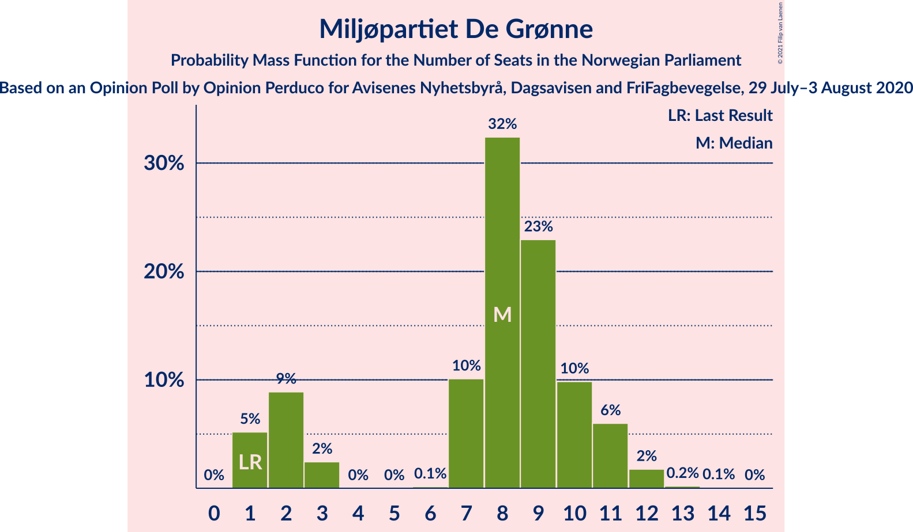

| Number of Seats | Probability | Accumulated | Special Marks |
|:---------------:|:-----------:|:-----------:|:-------------:|
| 1 | 5% | 100% | Last Result |
| 2 | 9% | 95% |  |
| 3 | 2% | 86% |  |
| 4 | 0% | 83% |  |
| 5 | 0% | 83% |  |
| 6 | 0.1% | 83% |  |
| 7 | 10% | 83% |  |
| 8 | 32% | 73% | Median |
| 9 | 23% | 41% |  |
| 10 | 10% | 18% |  |
| 11 | 6% | 8% |  |
| 12 | 2% | 2% |  |
| 13 | 0.2% | 0.3% |  |
| 14 | 0.1% | 0.1% |  |
| 15 | 0% | 0% |  |

### Rødt

*For a full overview of the results for this party, see the [Rødt](party-rødt.html) page.*

| Number of Seats | Probability | Accumulated | Special Marks |
|:---------------:|:-----------:|:-----------:|:-------------:|
| 1 | 3% | 100% | Last Result |
| 2 | 25% | 97% |  |
| 3 | 0% | 73% |  |
| 4 | 0% | 73% |  |
| 5 | 0% | 73% |  |
| 6 | 0.3% | 73% |  |
| 7 | 14% | 72% |  |
| 8 | 35% | 58% | Median |
| 9 | 11% | 24% |  |
| 10 | 9% | 13% |  |
| 11 | 2% | 4% |  |
| 12 | 1.4% | 1.5% |  |
| 13 | 0.1% | 0.1% |  |
| 14 | 0% | 0% |  |

### Kristelig Folkeparti

*For a full overview of the results for this party, see the [Kristelig Folkeparti](party-kristeligfolkeparti.html) page.*

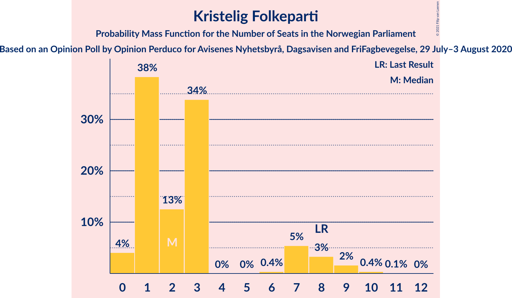

| Number of Seats | Probability | Accumulated | Special Marks |
|:---------------:|:-----------:|:-----------:|:-------------:|
| 0 | 4% | 100% |  |
| 1 | 38% | 96% |  |
| 2 | 13% | 58% | Median |
| 3 | 34% | 45% |  |
| 4 | 0% | 11% |  |
| 5 | 0% | 11% |  |
| 6 | 0.4% | 11% |  |
| 7 | 5% | 11% |  |
| 8 | 3% | 5% | Last Result |
| 9 | 2% | 2% |  |
| 10 | 0.4% | 0.5% |  |
| 11 | 0.1% | 0.1% |  |
| 12 | 0% | 0% |  |

### Venstre

*For a full overview of the results for this party, see the [Venstre](party-venstre.html) page.*

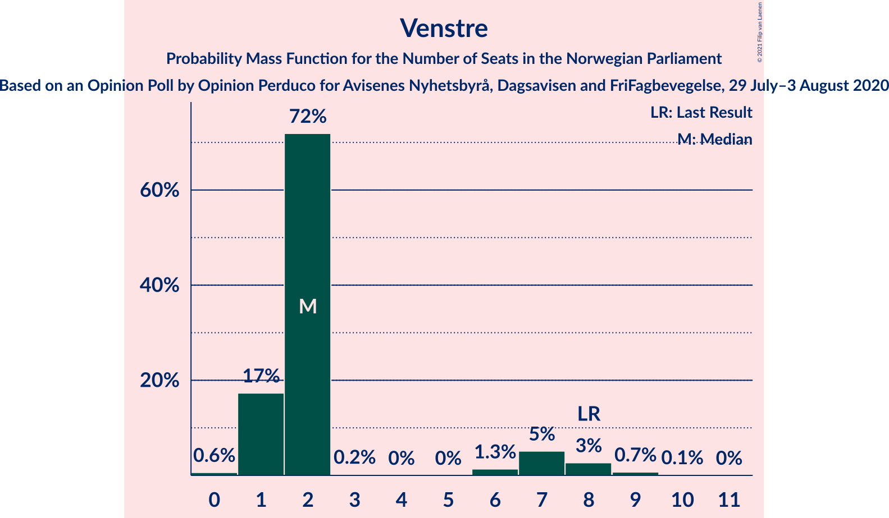

| Number of Seats | Probability | Accumulated | Special Marks |
|:---------------:|:-----------:|:-----------:|:-------------:|
| 0 | 0.6% | 100% |  |
| 1 | 17% | 99.4% |  |
| 2 | 72% | 82% | Median |
| 3 | 0.2% | 10% |  |
| 4 | 0% | 10% |  |
| 5 | 0% | 10% |  |
| 6 | 1.3% | 10% |  |
| 7 | 5% | 9% |  |
| 8 | 3% | 3% | Last Result |
| 9 | 0.7% | 0.8% |  |
| 10 | 0.1% | 0.1% |  |
| 11 | 0% | 0% |  |

## Coalitions

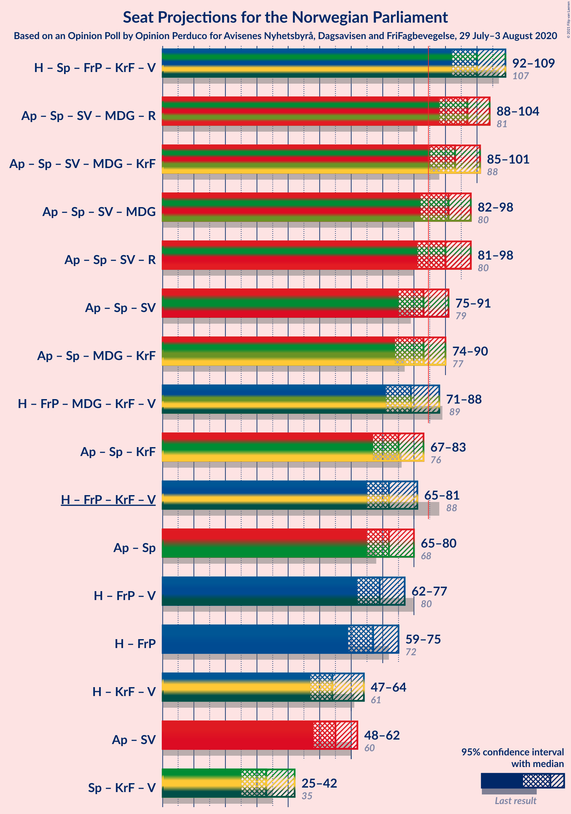

### Confidence Intervals

| Coalition | Last Result | Median | Majority? | 80% Confidence Interval | 90% Confidence Interval | 95% Confidence Interval | 99% Confidence Interval |
|:---------:|:-----------:|:------:|:---------:|:-----------------------:|:-----------------------:|:-----------------------:|:-----------------------:|
| Høyre – Senterpartiet – Fremskrittspartiet – Kristelig Folkeparti – Venstre | 107 | 100 | 100% | 94–106 | 93–107 | 92–109 | 89–112 |
| Arbeiderpartiet – Senterpartiet – Sosialistisk Venstreparti – Miljøpartiet De Grønne – Rødt | 81 | 97 | 99.8% | 92–103 | 90–104 | 88–104 | 85–107 |
| Arbeiderpartiet – Senterpartiet – Sosialistisk Venstreparti – Miljøpartiet De Grønne – Kristelig Folkeparti | 88 | 93 | 98% | 87–99 | 86–100 | 85–101 | 83–104 |
| Arbeiderpartiet – Senterpartiet – Sosialistisk Venstreparti – Miljøpartiet De Grønne | 80 | 91 | 90% | 84–97 | 84–97 | 82–98 | 79–101 |
| Arbeiderpartiet – Senterpartiet – Sosialistisk Venstreparti – Rødt | 80 | 90 | 87% | 84–96 | 83–97 | 81–98 | 78–101 |
| Arbeiderpartiet – Senterpartiet – Sosialistisk Venstreparti | 79 | 83 | 40% | 77–88 | 76–89 | 75–91 | 73–93 |
| Arbeiderpartiet – Senterpartiet – Miljøpartiet De Grønne – Kristelig Folkeparti | 77 | 83 | 32% | 76–89 | 76–89 | 74–90 | 71–94 |
| Høyre – Fremskrittspartiet – Miljøpartiet De Grønne – Kristelig Folkeparti – Venstre | 89 | 79 | 13% | 73–85 | 72–86 | 71–88 | 68–91 |
| Arbeiderpartiet – Senterpartiet – Kristelig Folkeparti | 76 | 75 | 1.3% | 70–80 | 68–81 | 67–83 | 66–87 |
| Høyre – Fremskrittspartiet – Kristelig Folkeparti – Venstre | 88 | 72 | 0.2% | 66–77 | 65–79 | 65–81 | 62–84 |
| Arbeiderpartiet – Senterpartiet | 68 | 72 | 0.2% | 67–78 | 66–78 | 65–80 | 63–82 |
| Høyre – Fremskrittspartiet – Venstre | 80 | 69 | 0% | 63–75 | 62–76 | 62–77 | 59–80 |
| Høyre – Fremskrittspartiet | 72 | 67 | 0% | 61–73 | 60–74 | 59–75 | 56–77 |
| Høyre – Kristelig Folkeparti – Venstre | 61 | 54 | 0% | 50–59 | 49–62 | 47–64 | 46–67 |
| Arbeiderpartiet – Sosialistisk Venstreparti | 60 | 55 | 0% | 51–59 | 49–62 | 48–62 | 47–65 |
| Senterpartiet – Kristelig Folkeparti – Venstre | 35 | 33 | 0% | 28–38 | 27–41 | 25–42 | 24–45 |

### Høyre – Senterpartiet – Fremskrittspartiet – Kristelig Folkeparti – Venstre

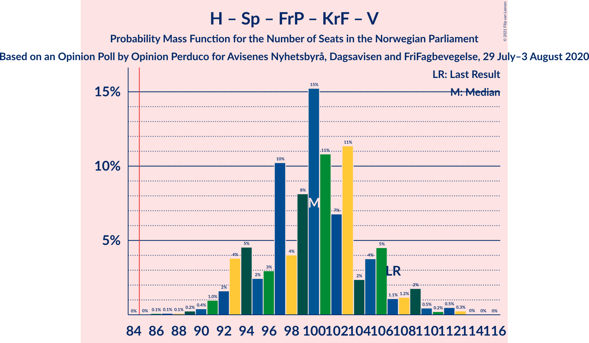

| Number of Seats | Probability | Accumulated | Special Marks |
|:---------------:|:-----------:|:-----------:|:-------------:|
| 86 | 0.1% | 100% |  |
| 87 | 0.1% | 99.9% |  |
| 88 | 0.1% | 99.8% |  |
| 89 | 0.2% | 99.7% |  |
| 90 | 0.4% | 99.4% |  |
| 91 | 1.0% | 99.0% |  |
| 92 | 2% | 98% |  |
| 93 | 4% | 96% |  |
| 94 | 5% | 93% |  |
| 95 | 2% | 88% |  |
| 96 | 3% | 86% |  |
| 97 | 10% | 83% |  |
| 98 | 4% | 72% |  |
| 99 | 8% | 68% | Median |
| 100 | 15% | 60% |  |
| 101 | 11% | 45% |  |
| 102 | 7% | 34% |  |
| 103 | 11% | 27% |  |
| 104 | 2% | 16% |  |
| 105 | 4% | 14% |  |
| 106 | 5% | 10% |  |
| 107 | 1.1% | 5% | Last Result |
| 108 | 1.2% | 4% |  |
| 109 | 2% | 3% |  |
| 110 | 0.5% | 1.5% |  |
| 111 | 0.2% | 1.0% |  |
| 112 | 0.5% | 0.8% |  |
| 113 | 0.3% | 0.3% |  |
| 114 | 0% | 0.1% |  |
| 115 | 0% | 0% |  |

### Arbeiderpartiet – Senterpartiet – Sosialistisk Venstreparti – Miljøpartiet De Grønne – Rødt

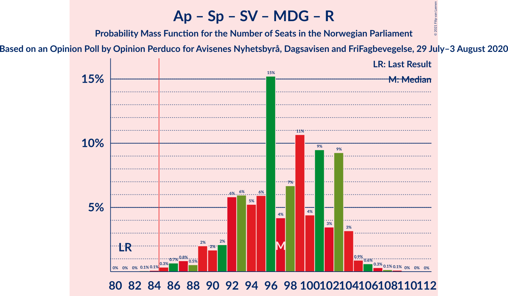

| Number of Seats | Probability | Accumulated | Special Marks |
|:---------------:|:-----------:|:-----------:|:-------------:|
| 81 | 0% | 100% | Last Result |
| 82 | 0% | 100% |  |
| 83 | 0.1% | 99.9% |  |
| 84 | 0.1% | 99.9% |  |
| 85 | 0.3% | 99.8% | Majority |
| 86 | 0.7% | 99.4% |  |
| 87 | 0.8% | 98.8% |  |
| 88 | 0.5% | 98% |  |
| 89 | 2% | 97% |  |
| 90 | 2% | 95% |  |
| 91 | 2% | 94% |  |
| 92 | 6% | 92% |  |
| 93 | 6% | 86% |  |
| 94 | 5% | 80% |  |
| 95 | 6% | 75% |  |
| 96 | 15% | 69% |  |
| 97 | 4% | 53% |  |
| 98 | 7% | 49% |  |
| 99 | 11% | 43% | Median |
| 100 | 4% | 32% |  |
| 101 | 9% | 28% |  |
| 102 | 3% | 18% |  |
| 103 | 9% | 15% |  |
| 104 | 3% | 5% |  |
| 105 | 0.9% | 2% |  |
| 106 | 0.6% | 1.2% |  |
| 107 | 0.3% | 0.6% |  |
| 108 | 0.1% | 0.3% |  |
| 109 | 0.1% | 0.2% |  |
| 110 | 0% | 0.1% |  |
| 111 | 0% | 0% |  |

### Arbeiderpartiet – Senterpartiet – Sosialistisk Venstreparti – Miljøpartiet De Grønne – Kristelig Folkeparti

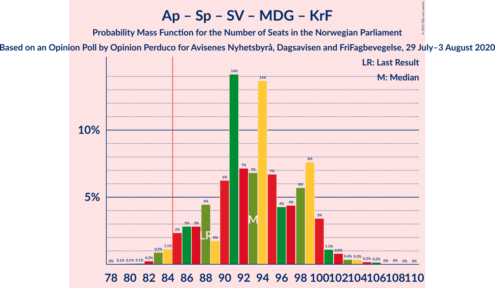

| Number of Seats | Probability | Accumulated | Special Marks |
|:---------------:|:-----------:|:-----------:|:-------------:|
| 79 | 0.1% | 100% |  |
| 80 | 0.1% | 99.9% |  |
| 81 | 0.1% | 99.9% |  |
| 82 | 0.2% | 99.8% |  |
| 83 | 0.9% | 99.5% |  |
| 84 | 1.1% | 98.7% |  |
| 85 | 2% | 98% | Majority |
| 86 | 3% | 95% |  |
| 87 | 3% | 92% |  |
| 88 | 4% | 89% | Last Result |
| 89 | 2% | 85% |  |
| 90 | 6% | 83% |  |
| 91 | 14% | 77% |  |
| 92 | 7% | 63% |  |
| 93 | 7% | 56% | Median |
| 94 | 14% | 49% |  |
| 95 | 7% | 35% |  |
| 96 | 4% | 28% |  |
| 97 | 4% | 24% |  |
| 98 | 6% | 20% |  |
| 99 | 8% | 14% |  |
| 100 | 3% | 6% |  |
| 101 | 1.1% | 3% |  |
| 102 | 0.8% | 2% |  |
| 103 | 0.4% | 1.1% |  |
| 104 | 0.3% | 0.8% |  |
| 105 | 0.2% | 0.4% |  |
| 106 | 0.2% | 0.2% |  |
| 107 | 0% | 0.1% |  |
| 108 | 0% | 0.1% |  |
| 109 | 0% | 0% |  |

### Arbeiderpartiet – Senterpartiet – Sosialistisk Venstreparti – Miljøpartiet De Grønne

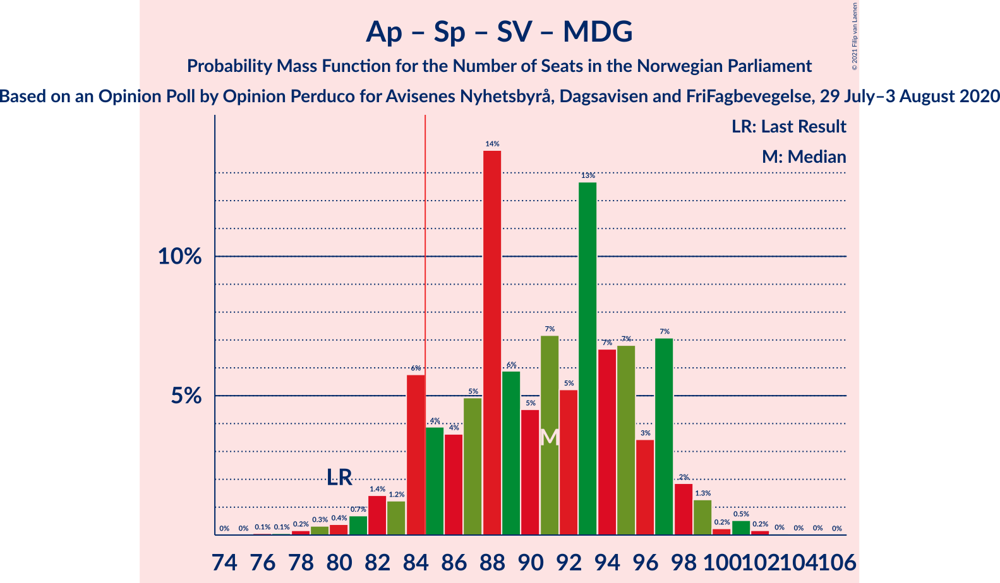

| Number of Seats | Probability | Accumulated | Special Marks |
|:---------------:|:-----------:|:-----------:|:-------------:|
| 76 | 0.1% | 100% |  |
| 77 | 0.1% | 99.9% |  |
| 78 | 0.2% | 99.9% |  |
| 79 | 0.3% | 99.7% |  |
| 80 | 0.4% | 99.4% | Last Result |
| 81 | 0.7% | 99.0% |  |
| 82 | 1.4% | 98% |  |
| 83 | 1.2% | 97% |  |
| 84 | 6% | 96% |  |
| 85 | 4% | 90% | Majority |
| 86 | 4% | 86% |  |
| 87 | 5% | 82% |  |
| 88 | 14% | 77% |  |
| 89 | 6% | 64% |  |
| 90 | 5% | 58% |  |
| 91 | 7% | 53% | Median |
| 92 | 5% | 46% |  |
| 93 | 13% | 41% |  |
| 94 | 7% | 28% |  |
| 95 | 7% | 21% |  |
| 96 | 3% | 15% |  |
| 97 | 7% | 11% |  |
| 98 | 2% | 4% |  |
| 99 | 1.3% | 2% |  |
| 100 | 0.2% | 1.0% |  |
| 101 | 0.5% | 0.8% |  |
| 102 | 0.2% | 0.3% |  |
| 103 | 0% | 0.1% |  |
| 104 | 0% | 0.1% |  |
| 105 | 0% | 0% |  |

### Arbeiderpartiet – Senterpartiet – Sosialistisk Venstreparti – Rødt

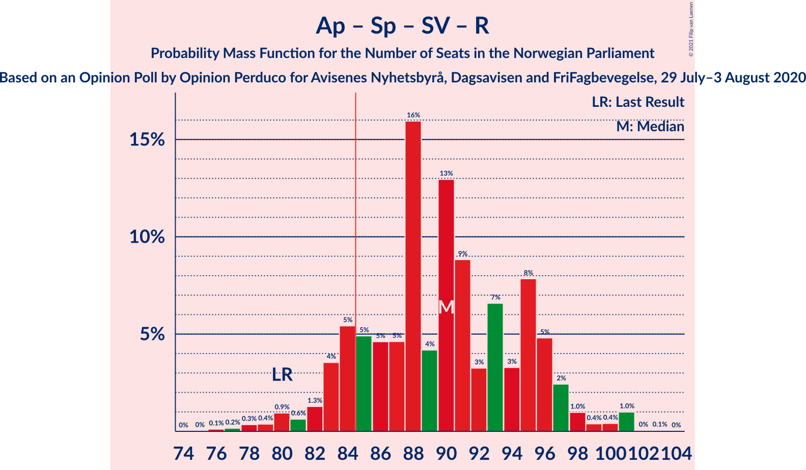

| Number of Seats | Probability | Accumulated | Special Marks |
|:---------------:|:-----------:|:-----------:|:-------------:|
| 75 | 0% | 100% |  |
| 76 | 0.1% | 99.9% |  |
| 77 | 0.2% | 99.8% |  |
| 78 | 0.3% | 99.7% |  |
| 79 | 0.4% | 99.3% |  |
| 80 | 0.9% | 98.9% | Last Result |
| 81 | 0.6% | 98% |  |
| 82 | 1.3% | 97% |  |
| 83 | 4% | 96% |  |
| 84 | 5% | 93% |  |
| 85 | 5% | 87% | Majority |
| 86 | 5% | 82% |  |
| 87 | 5% | 78% |  |
| 88 | 16% | 73% |  |
| 89 | 4% | 57% |  |
| 90 | 13% | 53% |  |
| 91 | 9% | 40% | Median |
| 92 | 3% | 31% |  |
| 93 | 7% | 28% |  |
| 94 | 3% | 21% |  |
| 95 | 8% | 18% |  |
| 96 | 5% | 10% |  |
| 97 | 2% | 5% |  |
| 98 | 1.0% | 3% |  |
| 99 | 0.4% | 2% |  |
| 100 | 0.4% | 2% |  |
| 101 | 1.0% | 1.1% |  |
| 102 | 0% | 0.1% |  |
| 103 | 0.1% | 0.1% |  |
| 104 | 0% | 0% |  |

### Arbeiderpartiet – Senterpartiet – Sosialistisk Venstreparti

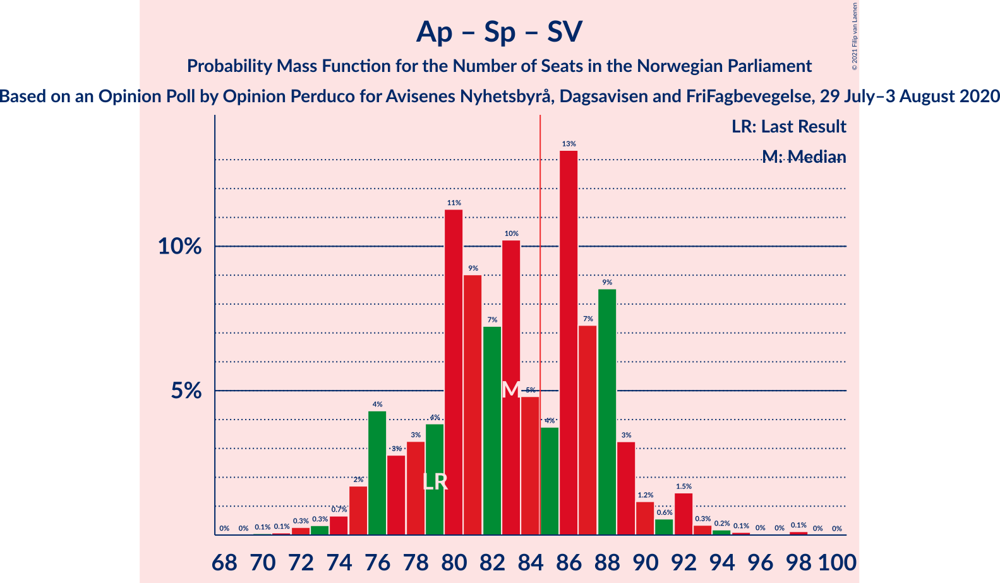

| Number of Seats | Probability | Accumulated | Special Marks |
|:---------------:|:-----------:|:-----------:|:-------------:|
| 70 | 0.1% | 100% |  |
| 71 | 0.1% | 99.9% |  |
| 72 | 0.3% | 99.8% |  |
| 73 | 0.3% | 99.6% |  |
| 74 | 0.7% | 99.2% |  |
| 75 | 2% | 98.6% |  |
| 76 | 4% | 97% |  |
| 77 | 3% | 93% |  |
| 78 | 3% | 90% |  |
| 79 | 4% | 87% | Last Result |
| 80 | 11% | 83% |  |
| 81 | 9% | 71% |  |
| 82 | 7% | 62% |  |
| 83 | 10% | 55% | Median |
| 84 | 5% | 45% |  |
| 85 | 4% | 40% | Majority |
| 86 | 13% | 36% |  |
| 87 | 7% | 23% |  |
| 88 | 9% | 16% |  |
| 89 | 3% | 7% |  |
| 90 | 1.2% | 4% |  |
| 91 | 0.6% | 3% |  |
| 92 | 1.5% | 2% |  |
| 93 | 0.3% | 0.8% |  |
| 94 | 0.2% | 0.5% |  |
| 95 | 0.1% | 0.3% |  |
| 96 | 0% | 0.2% |  |
| 97 | 0% | 0.2% |  |
| 98 | 0.1% | 0.1% |  |
| 99 | 0% | 0% |  |

### Arbeiderpartiet – Senterpartiet – Miljøpartiet De Grønne – Kristelig Folkeparti

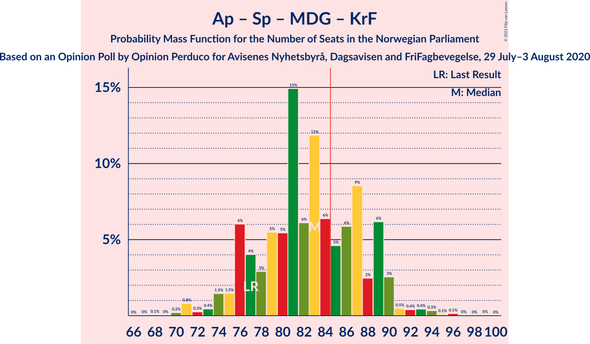

| Number of Seats | Probability | Accumulated | Special Marks |
|:---------------:|:-----------:|:-----------:|:-------------:|
| 68 | 0.1% | 100% |  |
| 69 | 0% | 99.9% |  |
| 70 | 0.2% | 99.9% |  |
| 71 | 0.8% | 99.7% |  |
| 72 | 0.3% | 98.9% |  |
| 73 | 0.4% | 98.6% |  |
| 74 | 1.5% | 98% |  |
| 75 | 1.5% | 97% |  |
| 76 | 6% | 95% |  |
| 77 | 4% | 89% | Last Result |
| 78 | 3% | 85% |  |
| 79 | 5% | 82% |  |
| 80 | 5% | 77% |  |
| 81 | 15% | 71% |  |
| 82 | 6% | 56% | Median |
| 83 | 12% | 50% |  |
| 84 | 6% | 39% |  |
| 85 | 5% | 32% | Majority |
| 86 | 6% | 28% |  |
| 87 | 9% | 22% |  |
| 88 | 2% | 13% |  |
| 89 | 6% | 11% |  |
| 90 | 3% | 4% |  |
| 91 | 0.5% | 2% |  |
| 92 | 0.4% | 1.5% |  |
| 93 | 0.4% | 1.1% |  |
| 94 | 0.3% | 0.6% |  |
| 95 | 0.1% | 0.3% |  |
| 96 | 0.1% | 0.2% |  |
| 97 | 0% | 0.1% |  |
| 98 | 0% | 0.1% |  |
| 99 | 0% | 0% |  |

### Høyre – Fremskrittspartiet – Miljøpartiet De Grønne – Kristelig Folkeparti – Venstre

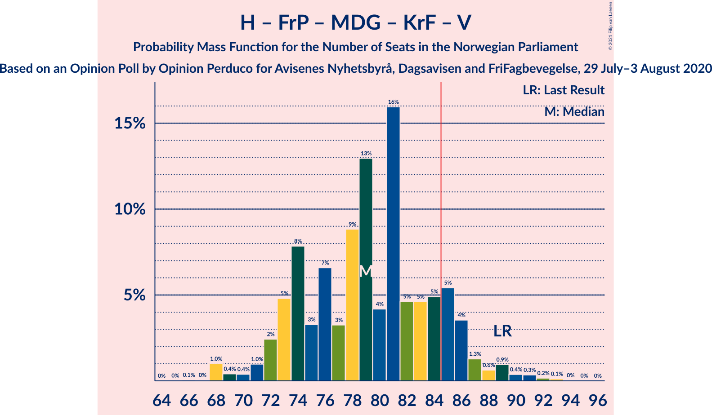

| Number of Seats | Probability | Accumulated | Special Marks |
|:---------------:|:-----------:|:-----------:|:-------------:|
| 66 | 0.1% | 100% |  |
| 67 | 0% | 99.9% |  |
| 68 | 1.0% | 99.9% |  |
| 69 | 0.4% | 98.9% |  |
| 70 | 0.4% | 98% |  |
| 71 | 1.0% | 98% |  |
| 72 | 2% | 97% |  |
| 73 | 5% | 95% |  |
| 74 | 8% | 90% |  |
| 75 | 3% | 82% |  |
| 76 | 7% | 79% |  |
| 77 | 3% | 72% |  |
| 78 | 9% | 69% |  |
| 79 | 13% | 60% | Median |
| 80 | 4% | 47% |  |
| 81 | 16% | 43% |  |
| 82 | 5% | 27% |  |
| 83 | 5% | 22% |  |
| 84 | 5% | 18% |  |
| 85 | 5% | 13% | Majority |
| 86 | 4% | 7% |  |
| 87 | 1.3% | 4% |  |
| 88 | 0.6% | 3% |  |
| 89 | 0.9% | 2% | Last Result |
| 90 | 0.4% | 1.1% |  |
| 91 | 0.3% | 0.7% |  |
| 92 | 0.2% | 0.3% |  |
| 93 | 0.1% | 0.2% |  |
| 94 | 0% | 0.1% |  |
| 95 | 0% | 0% |  |

### Arbeiderpartiet – Senterpartiet – Kristelig Folkeparti

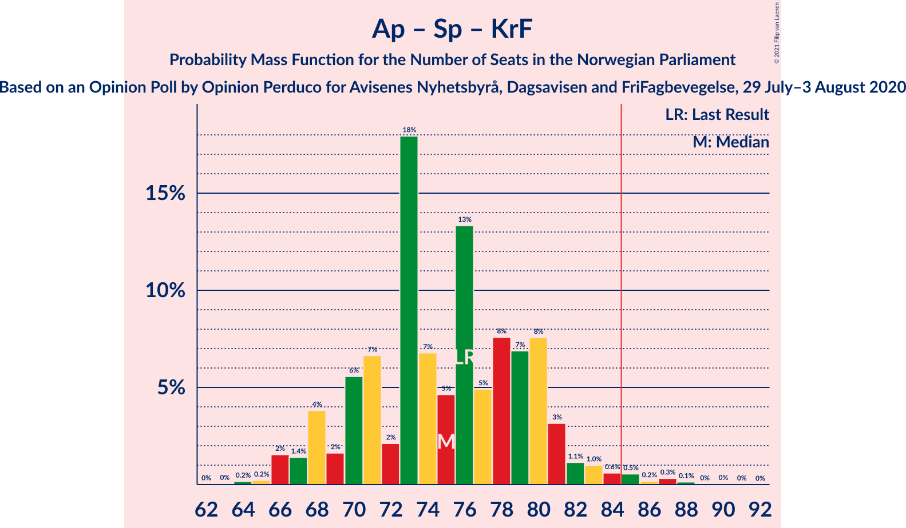

| Number of Seats | Probability | Accumulated | Special Marks |
|:---------------:|:-----------:|:-----------:|:-------------:|
| 62 | 0% | 100% |  |
| 63 | 0% | 99.9% |  |
| 64 | 0.2% | 99.9% |  |
| 65 | 0.2% | 99.7% |  |
| 66 | 2% | 99.5% |  |
| 67 | 1.4% | 98% |  |
| 68 | 4% | 97% |  |
| 69 | 2% | 93% |  |
| 70 | 6% | 91% |  |
| 71 | 7% | 86% |  |
| 72 | 2% | 79% |  |
| 73 | 18% | 77% |  |
| 74 | 7% | 59% | Median |
| 75 | 5% | 52% |  |
| 76 | 13% | 47% | Last Result |
| 77 | 5% | 34% |  |
| 78 | 8% | 29% |  |
| 79 | 7% | 22% |  |
| 80 | 8% | 15% |  |
| 81 | 3% | 7% |  |
| 82 | 1.1% | 4% |  |
| 83 | 1.0% | 3% |  |
| 84 | 0.6% | 2% |  |
| 85 | 0.5% | 1.3% | Majority |
| 86 | 0.2% | 0.7% |  |
| 87 | 0.3% | 0.6% |  |
| 88 | 0.1% | 0.2% |  |
| 89 | 0% | 0.1% |  |
| 90 | 0% | 0.1% |  |
| 91 | 0% | 0% |  |

### Høyre – Fremskrittspartiet – Kristelig Folkeparti – Venstre

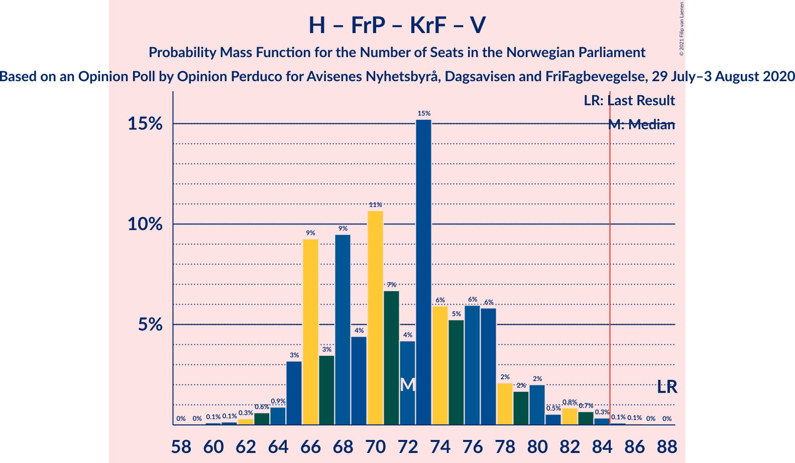

| Number of Seats | Probability | Accumulated | Special Marks |
|:---------------:|:-----------:|:-----------:|:-------------:|
| 59 | 0% | 100% |  |
| 60 | 0.1% | 99.9% |  |
| 61 | 0.1% | 99.8% |  |
| 62 | 0.3% | 99.7% |  |
| 63 | 0.6% | 99.4% |  |
| 64 | 0.9% | 98.8% |  |
| 65 | 3% | 98% |  |
| 66 | 9% | 95% |  |
| 67 | 3% | 85% |  |
| 68 | 9% | 82% |  |
| 69 | 4% | 72% |  |
| 70 | 11% | 68% |  |
| 71 | 7% | 57% | Median |
| 72 | 4% | 51% |  |
| 73 | 15% | 47% |  |
| 74 | 6% | 31% |  |
| 75 | 5% | 25% |  |
| 76 | 6% | 20% |  |
| 77 | 6% | 14% |  |
| 78 | 2% | 8% |  |
| 79 | 2% | 6% |  |
| 80 | 2% | 5% |  |
| 81 | 0.5% | 3% |  |
| 82 | 0.8% | 2% |  |
| 83 | 0.7% | 1.2% |  |
| 84 | 0.3% | 0.6% |  |
| 85 | 0.1% | 0.2% | Majority |
| 86 | 0.1% | 0.1% |  |
| 87 | 0% | 0.1% |  |
| 88 | 0% | 0% | Last Result |

### Arbeiderpartiet – Senterpartiet

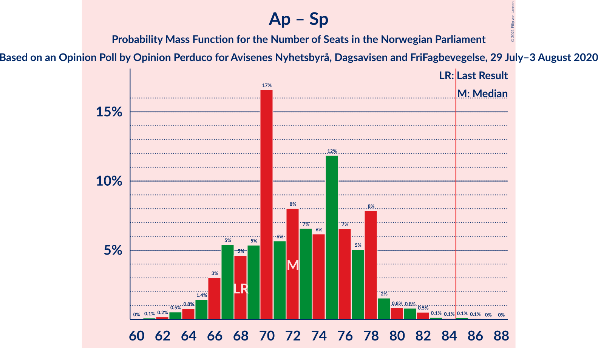

| Number of Seats | Probability | Accumulated | Special Marks |
|:---------------:|:-----------:|:-----------:|:-------------:|
| 60 | 0% | 100% |  |
| 61 | 0.1% | 99.9% |  |
| 62 | 0.2% | 99.8% |  |
| 63 | 0.5% | 99.7% |  |
| 64 | 0.8% | 99.1% |  |
| 65 | 1.4% | 98% |  |
| 66 | 3% | 97% |  |
| 67 | 5% | 94% |  |
| 68 | 5% | 88% | Last Result |
| 69 | 5% | 84% |  |
| 70 | 17% | 78% |  |
| 71 | 6% | 62% |  |
| 72 | 8% | 56% | Median |
| 73 | 7% | 48% |  |
| 74 | 6% | 42% |  |
| 75 | 12% | 35% |  |
| 76 | 7% | 24% |  |
| 77 | 5% | 17% |  |
| 78 | 8% | 12% |  |
| 79 | 2% | 4% |  |
| 80 | 0.8% | 3% |  |
| 81 | 0.8% | 2% |  |
| 82 | 0.5% | 0.9% |  |
| 83 | 0.1% | 0.4% |  |
| 84 | 0.1% | 0.3% |  |
| 85 | 0.1% | 0.2% | Majority |
| 86 | 0.1% | 0.1% |  |
| 87 | 0% | 0% |  |

### Høyre – Fremskrittspartiet – Venstre

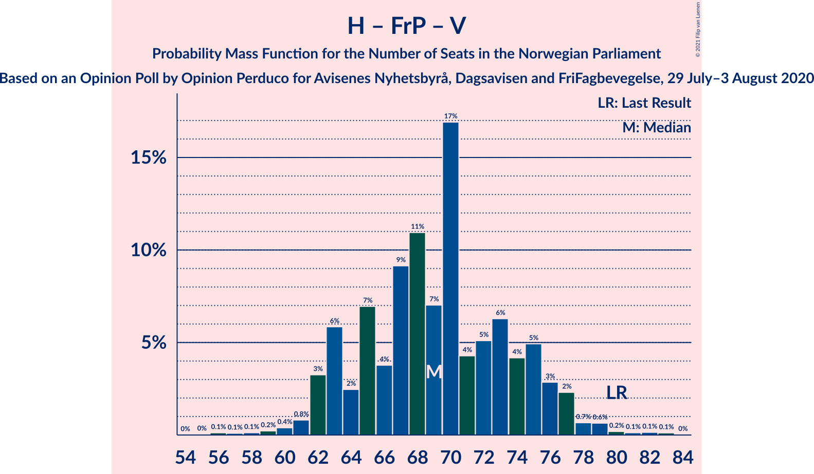

| Number of Seats | Probability | Accumulated | Special Marks |
|:---------------:|:-----------:|:-----------:|:-------------:|
| 55 | 0% | 100% |  |
| 56 | 0.1% | 99.9% |  |
| 57 | 0.1% | 99.8% |  |
| 58 | 0.1% | 99.7% |  |
| 59 | 0.2% | 99.6% |  |
| 60 | 0.4% | 99.4% |  |
| 61 | 0.8% | 99.0% |  |
| 62 | 3% | 98% |  |
| 63 | 6% | 95% |  |
| 64 | 2% | 89% |  |
| 65 | 7% | 87% |  |
| 66 | 4% | 80% |  |
| 67 | 9% | 76% |  |
| 68 | 11% | 67% |  |
| 69 | 7% | 56% | Median |
| 70 | 17% | 49% |  |
| 71 | 4% | 32% |  |
| 72 | 5% | 28% |  |
| 73 | 6% | 22% |  |
| 74 | 4% | 16% |  |
| 75 | 5% | 12% |  |
| 76 | 3% | 7% |  |
| 77 | 2% | 4% |  |
| 78 | 0.7% | 2% |  |
| 79 | 0.6% | 1.3% |  |
| 80 | 0.2% | 0.6% | Last Result |
| 81 | 0.1% | 0.4% |  |
| 82 | 0.1% | 0.3% |  |
| 83 | 0.1% | 0.1% |  |
| 84 | 0% | 0% |  |

### Høyre – Fremskrittspartiet

| Number of Seats | Probability | Accumulated | Special Marks |
|:---------------:|:-----------:|:-----------:|:-------------:|
| 53 | 0% | 100% |  |
| 54 | 0.1% | 99.9% |  |
| 55 | 0.3% | 99.9% |  |
| 56 | 0.3% | 99.6% |  |
| 57 | 0.3% | 99.3% |  |
| 58 | 0.9% | 99.1% |  |
| 59 | 0.9% | 98% |  |
| 60 | 4% | 97% |  |
| 61 | 6% | 94% |  |
| 62 | 3% | 88% |  |
| 63 | 7% | 85% |  |
| 64 | 4% | 78% |  |
| 65 | 9% | 73% |  |
| 66 | 11% | 64% |  |
| 67 | 8% | 54% | Median |
| 68 | 18% | 46% |  |
| 69 | 4% | 28% |  |
| 70 | 5% | 25% |  |
| 71 | 4% | 19% |  |
| 72 | 5% | 15% | Last Result |
| 73 | 4% | 10% |  |
| 74 | 1.5% | 6% |  |
| 75 | 3% | 4% |  |
| 76 | 1.1% | 2% |  |
| 77 | 0.3% | 0.6% |  |
| 78 | 0.1% | 0.3% |  |
| 79 | 0.1% | 0.2% |  |
| 80 | 0% | 0.1% |  |
| 81 | 0% | 0.1% |  |
| 82 | 0% | 0% |  |

### Høyre – Kristelig Folkeparti – Venstre

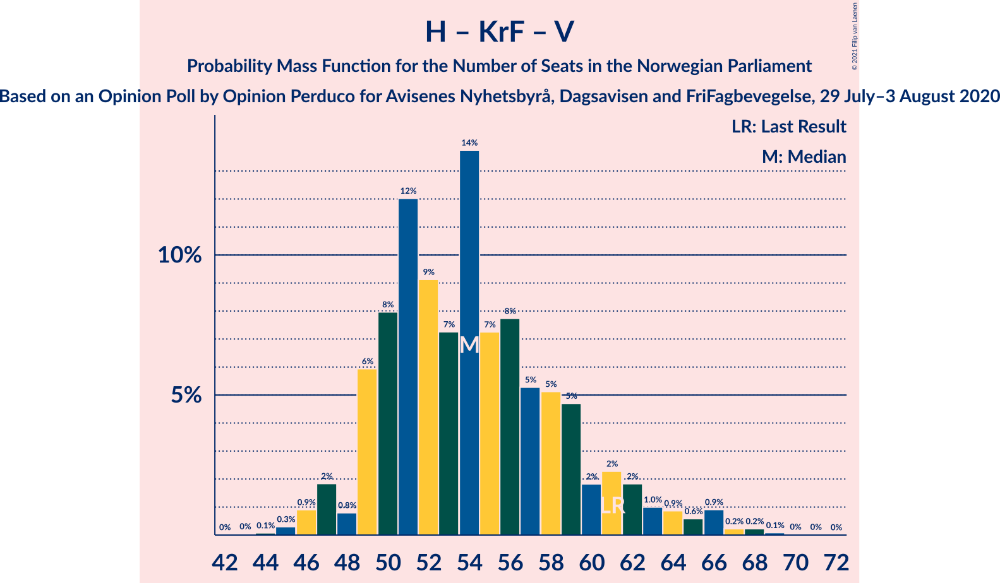

| Number of Seats | Probability | Accumulated | Special Marks |
|:---------------:|:-----------:|:-----------:|:-------------:|
| 43 | 0% | 100% |  |
| 44 | 0.1% | 99.9% |  |
| 45 | 0.3% | 99.9% |  |
| 46 | 0.9% | 99.6% |  |
| 47 | 2% | 98.7% |  |
| 48 | 0.8% | 97% |  |
| 49 | 6% | 96% |  |
| 50 | 8% | 90% |  |
| 51 | 12% | 82% |  |
| 52 | 9% | 70% |  |
| 53 | 7% | 61% | Median |
| 54 | 14% | 54% |  |
| 55 | 7% | 40% |  |
| 56 | 8% | 33% |  |
| 57 | 5% | 25% |  |
| 58 | 5% | 20% |  |
| 59 | 5% | 15% |  |
| 60 | 2% | 10% |  |
| 61 | 2% | 8% | Last Result |
| 62 | 2% | 6% |  |
| 63 | 1.0% | 4% |  |
| 64 | 0.9% | 3% |  |
| 65 | 0.6% | 2% |  |
| 66 | 0.9% | 2% |  |
| 67 | 0.2% | 0.6% |  |
| 68 | 0.2% | 0.4% |  |
| 69 | 0.1% | 0.1% |  |
| 70 | 0% | 0.1% |  |
| 71 | 0% | 0% |  |

### Arbeiderpartiet – Sosialistisk Venstreparti

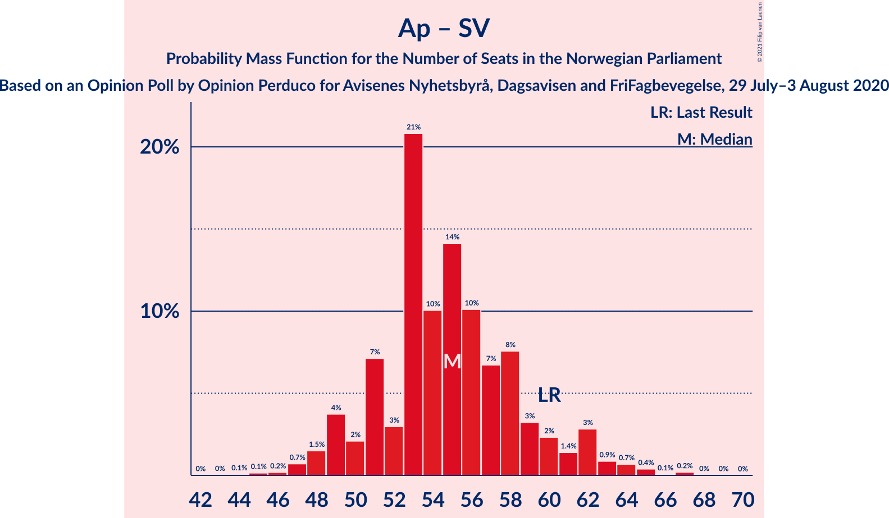

| Number of Seats | Probability | Accumulated | Special Marks |
|:---------------:|:-----------:|:-----------:|:-------------:|
| 43 | 0% | 100% |  |
| 44 | 0.1% | 99.9% |  |
| 45 | 0.1% | 99.9% |  |
| 46 | 0.2% | 99.7% |  |
| 47 | 0.7% | 99.5% |  |
| 48 | 1.5% | 98.8% |  |
| 49 | 4% | 97% |  |
| 50 | 2% | 94% |  |
| 51 | 7% | 92% |  |
| 52 | 3% | 84% |  |
| 53 | 21% | 81% |  |
| 54 | 10% | 61% |  |
| 55 | 14% | 51% | Median |
| 56 | 10% | 36% |  |
| 57 | 7% | 26% |  |
| 58 | 8% | 20% |  |
| 59 | 3% | 12% |  |
| 60 | 2% | 9% | Last Result |
| 61 | 1.4% | 6% |  |
| 62 | 3% | 5% |  |
| 63 | 0.9% | 2% |  |
| 64 | 0.7% | 1.4% |  |
| 65 | 0.4% | 0.7% |  |
| 66 | 0.1% | 0.3% |  |
| 67 | 0.2% | 0.2% |  |
| 68 | 0% | 0.1% |  |
| 69 | 0% | 0% |  |

### Senterpartiet – Kristelig Folkeparti – Venstre

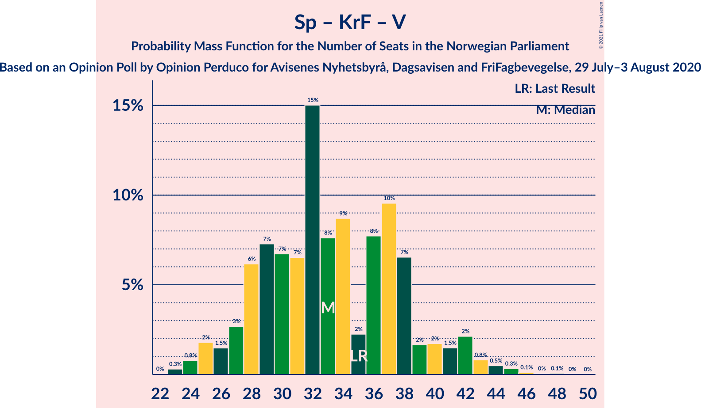

| Number of Seats | Probability | Accumulated | Special Marks |
|:---------------:|:-----------:|:-----------:|:-------------:|
| 23 | 0.3% | 100% |  |
| 24 | 0.8% | 99.7% |  |
| 25 | 2% | 98.9% |  |
| 26 | 1.5% | 97% |  |
| 27 | 3% | 96% |  |
| 28 | 6% | 93% |  |
| 29 | 7% | 87% |  |
| 30 | 7% | 79% |  |
| 31 | 7% | 73% |  |
| 32 | 15% | 66% | Median |
| 33 | 8% | 51% |  |
| 34 | 9% | 44% |  |
| 35 | 2% | 35% | Last Result |
| 36 | 8% | 33% |  |
| 37 | 10% | 25% |  |
| 38 | 7% | 15% |  |
| 39 | 2% | 9% |  |
| 40 | 2% | 7% |  |
| 41 | 1.5% | 5% |  |
| 42 | 2% | 4% |  |
| 43 | 0.8% | 2% |  |
| 44 | 0.5% | 1.1% |  |
| 45 | 0.3% | 0.6% |  |
| 46 | 0.1% | 0.3% |  |
| 47 | 0% | 0.1% |  |
| 48 | 0.1% | 0.1% |  |
| 49 | 0% | 0% |  |

## Technical Information

### Opinion Poll

+ **Polling firm:** Opinion Perduco
+ **Commissioner(s):** Avisenes Nyhetsbyrå, Dagsavisen and FriFagbevegelse
+ **Fieldwork period:** 29 July–3 August 2020

### Calculations

+ **Sample size:** 696
+ **Simulations done:** 1,048,576
+ **Error estimate:** 1.45%

