# Opinion Poll by Norfakta for Klassekampen and Nationen, 4–5 August 2020

<a href="#voting-intentions">Voting Intentions</a> | <a href="#seats">Seats</a> | <a href="#coalitions">Coalitions</a> | <a href="#technical-information">Technical Information</a>

## Voting Intentions

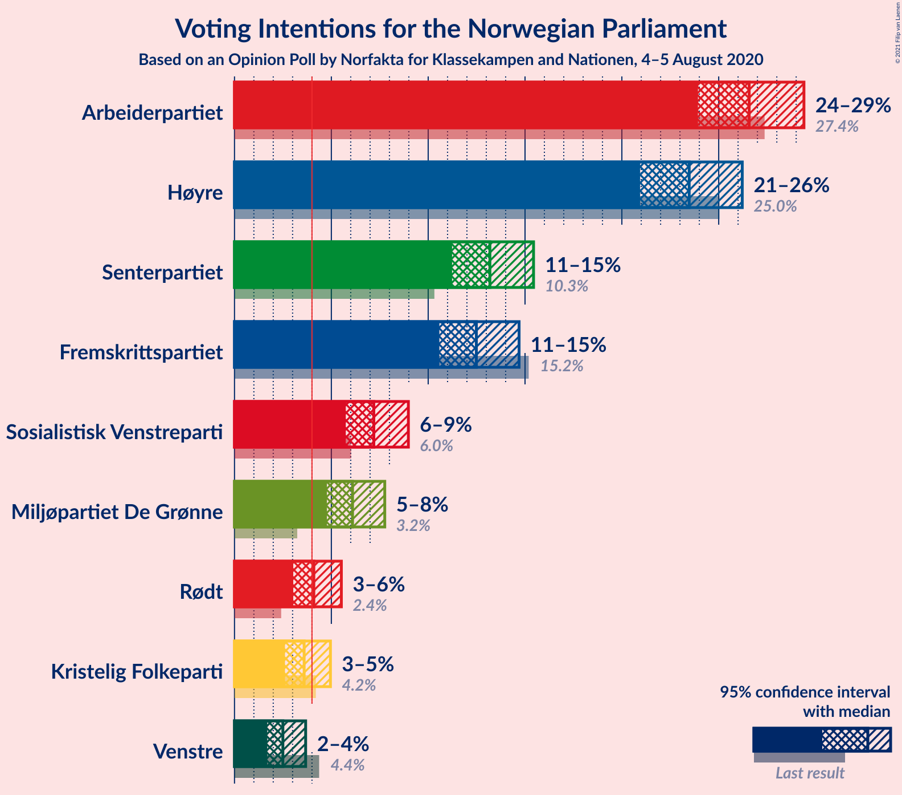

### Confidence Intervals

| Party | Last Result | Poll Result | 80% Confidence Interval | 90% Confidence Interval | 95% Confidence Interval | 99% Confidence Interval |
|:-----:|:-----------:|:-----------:|:-----------------------:|:-----------------------:|:-----------------------:|:-----------------------:|
| Arbeiderpartiet | 27.4% | 26.6% | 24.8–28.4% |24.3–28.9% |23.9–29.4% |23.1–30.3% |
| Høyre | 25.0% | 23.5% | 21.8–25.3% |21.4–25.8% |20.9–26.2% |20.2–27.1% |
| Senterpartiet | 10.3% | 13.2% | 11.9–14.6% |11.5–15.1% |11.2–15.4% |10.6–16.2% |
| Fremskrittspartiet | 15.2% | 12.5% | 11.2–13.9% |10.9–14.3% |10.6–14.7% |10.0–15.4% |
| Sosialistisk Venstreparti | 6.0% | 7.2% | 6.2–8.4% |6.0–8.7% |5.7–9.0% |5.3–9.6% |
| Miljøpartiet De Grønne | 3.2% | 6.1% | 5.2–7.2% |5.0–7.5% |4.8–7.8% |4.4–8.3% |
| Rødt | 2.4% | 4.1% | 3.4–5.0% |3.2–5.3% |3.0–5.5% |2.7–6.0% |
| Kristelig Folkeparti | 4.2% | 3.6% | 2.9–4.5% |2.8–4.7% |2.6–5.0% |2.3–5.4% |
| Venstre | 4.4% | 2.5% | 2.0–3.3% |1.8–3.5% |1.7–3.7% |1.5–4.1% |

*Note:* The poll result column reflects the actual value used in the calculations. Published results may vary slightly, and in addition be rounded to fewer digits.

## Seats

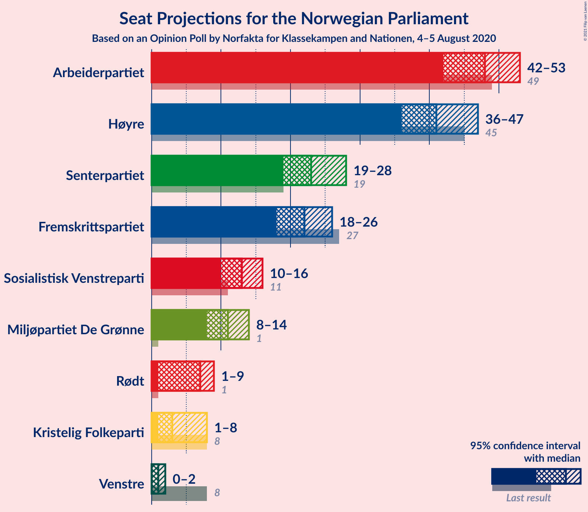

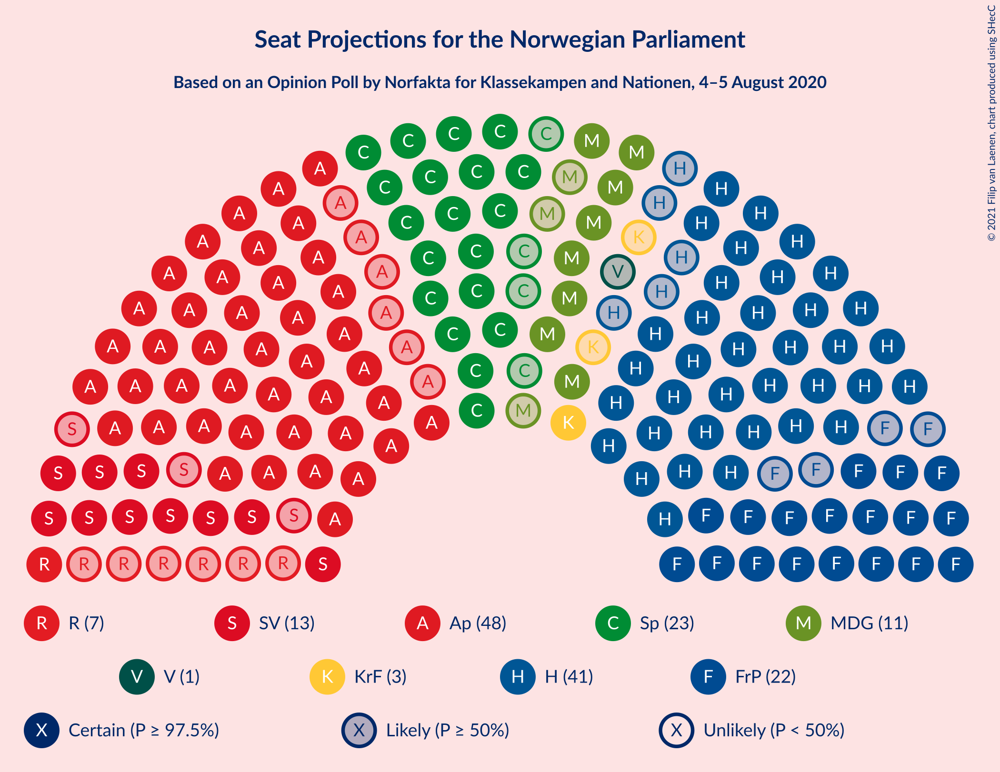

### Confidence Intervals

| Party | Last Result | Median | 80% Confidence Interval | 90% Confidence Interval | 95% Confidence Interval | 99% Confidence Interval |
|:-----:|:-----------:|:------:|:-----------------------:|:-----------------------:|:-----------------------:|:-----------------------:|
| <a href="#arbeiderpartiet">Arbeiderpartiet</a> | 49 | 48 | 44–52 |43–52 |42–53 |41–55 |
| <a href="#høyre">Høyre</a> | 45 | 41 | 38–46 |37–46 |36–47 |36–48 |
| <a href="#senterpartiet">Senterpartiet</a> | 19 | 23 | 21–26 |20–27 |19–28 |19–30 |
| <a href="#fremskrittspartiet">Fremskrittspartiet</a> | 27 | 22 | 19–25 |19–26 |18–26 |18–28 |
| <a href="#sosialistisk-venstreparti">Sosialistisk Venstreparti</a> | 11 | 13 | 11–14 |10–15 |10–16 |9–17 |
| <a href="#miljøpartiet-de-grønne">Miljøpartiet De Grønne</a> | 1 | 11 | 9–12 |9–13 |8–14 |8–15 |
| <a href="#rødt">Rødt</a> | 1 | 7 | 2–9 |2–9 |1–9 |1–10 |
| <a href="#kristelig-folkeparti">Kristelig Folkeparti</a> | 8 | 3 | 1–8 |1–8 |1–8 |0–9 |
| <a href="#venstre">Venstre</a> | 8 | 1 | 1–2 |0–2 |0–2 |0–7 |

### Arbeiderpartiet

*For a full overview of the results for this party, see the [Arbeiderpartiet](party-arbeiderpartiet.html) page.*

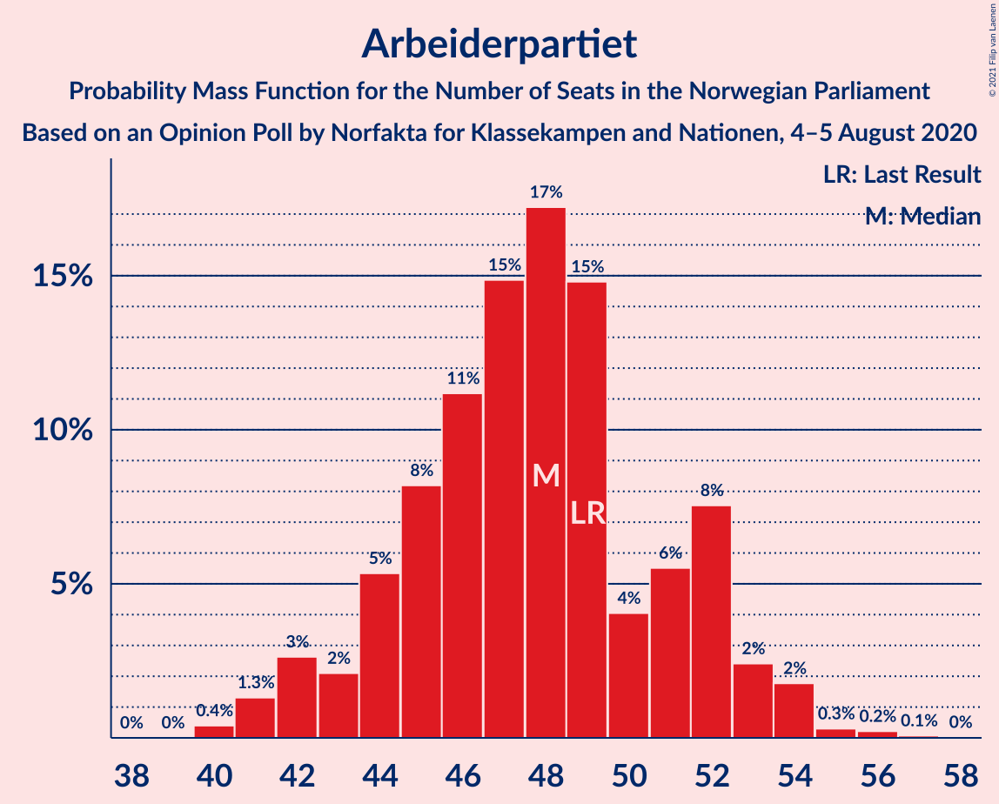

| Number of Seats | Probability | Accumulated | Special Marks |
|:---------------:|:-----------:|:-----------:|:-------------:|
| 40 | 0.4% | 100% |  |
| 41 | 1.3% | 99.6% |  |
| 42 | 3% | 98% |  |
| 43 | 2% | 96% |  |
| 44 | 5% | 94% |  |
| 45 | 8% | 88% |  |
| 46 | 11% | 80% |  |
| 47 | 15% | 69% |  |
| 48 | 17% | 54% | Median |
| 49 | 15% | 37% | Last Result |
| 50 | 4% | 22% |  |
| 51 | 6% | 18% |  |
| 52 | 8% | 12% |  |
| 53 | 2% | 5% |  |
| 54 | 2% | 2% |  |
| 55 | 0.3% | 0.6% |  |
| 56 | 0.2% | 0.3% |  |
| 57 | 0.1% | 0.1% |  |
| 58 | 0% | 0% |  |

### Høyre

*For a full overview of the results for this party, see the [Høyre](party-høyre.html) page.*

| Number of Seats | Probability | Accumulated | Special Marks |
|:---------------:|:-----------:|:-----------:|:-------------:|
| 34 | 0.1% | 100% |  |
| 35 | 0.3% | 99.8% |  |
| 36 | 2% | 99.5% |  |
| 37 | 4% | 97% |  |
| 38 | 14% | 93% |  |
| 39 | 5% | 79% |  |
| 40 | 8% | 74% |  |
| 41 | 17% | 65% | Median |
| 42 | 8% | 48% |  |
| 43 | 8% | 41% |  |
| 44 | 8% | 33% |  |
| 45 | 12% | 25% | Last Result |
| 46 | 8% | 13% |  |
| 47 | 3% | 4% |  |
| 48 | 0.6% | 0.9% |  |
| 49 | 0.1% | 0.2% |  |
| 50 | 0.1% | 0.1% |  |
| 51 | 0% | 0% |  |

### Senterpartiet

*For a full overview of the results for this party, see the [Senterpartiet](party-senterpartiet.html) page.*

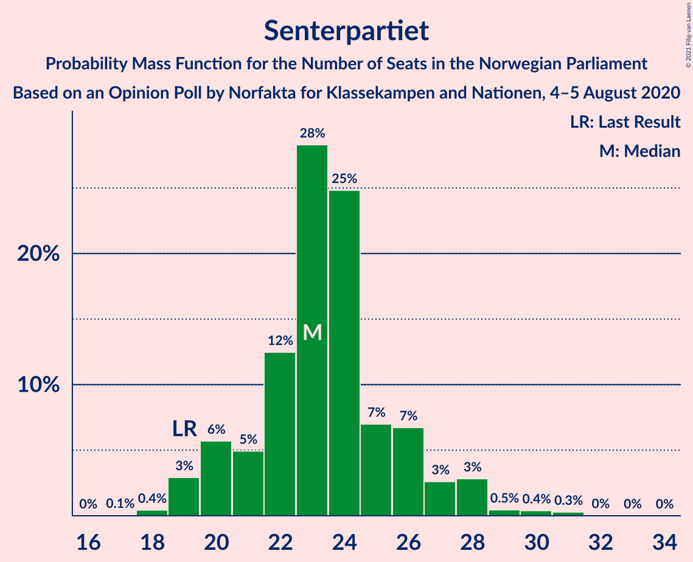

| Number of Seats | Probability | Accumulated | Special Marks |
|:---------------:|:-----------:|:-----------:|:-------------:|
| 17 | 0.1% | 100% |  |
| 18 | 0.4% | 99.9% |  |
| 19 | 3% | 99.5% | Last Result |
| 20 | 6% | 97% |  |
| 21 | 5% | 91% |  |
| 22 | 12% | 86% |  |
| 23 | 28% | 73% | Median |
| 24 | 25% | 45% |  |
| 25 | 7% | 20% |  |
| 26 | 7% | 13% |  |
| 27 | 3% | 7% |  |
| 28 | 3% | 4% |  |
| 29 | 0.5% | 1.2% |  |
| 30 | 0.4% | 0.7% |  |
| 31 | 0.3% | 0.3% |  |
| 32 | 0% | 0.1% |  |
| 33 | 0% | 0% |  |

### Fremskrittspartiet

*For a full overview of the results for this party, see the [Fremskrittspartiet](party-fremskrittspartiet.html) page.*

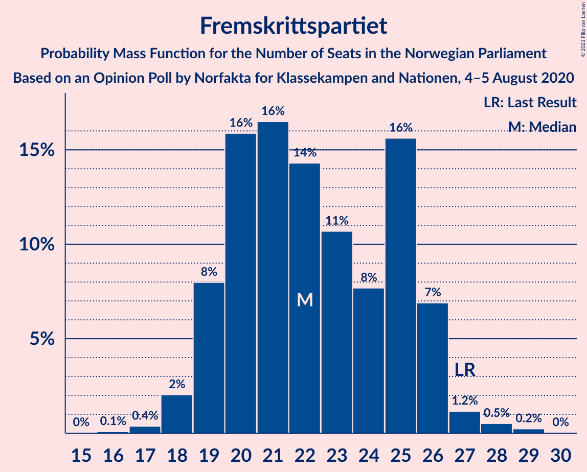

| Number of Seats | Probability | Accumulated | Special Marks |
|:---------------:|:-----------:|:-----------:|:-------------:|
| 16 | 0.1% | 100% |  |
| 17 | 0.4% | 99.9% |  |
| 18 | 2% | 99.5% |  |
| 19 | 8% | 97% |  |
| 20 | 16% | 90% |  |
| 21 | 16% | 74% |  |
| 22 | 14% | 57% | Median |
| 23 | 11% | 43% |  |
| 24 | 8% | 32% |  |
| 25 | 16% | 24% |  |
| 26 | 7% | 9% |  |
| 27 | 1.2% | 2% | Last Result |
| 28 | 0.5% | 0.8% |  |
| 29 | 0.2% | 0.3% |  |
| 30 | 0% | 0% |  |

### Sosialistisk Venstreparti

*For a full overview of the results for this party, see the [Sosialistisk Venstreparti](party-sosialistiskvenstreparti.html) page.*

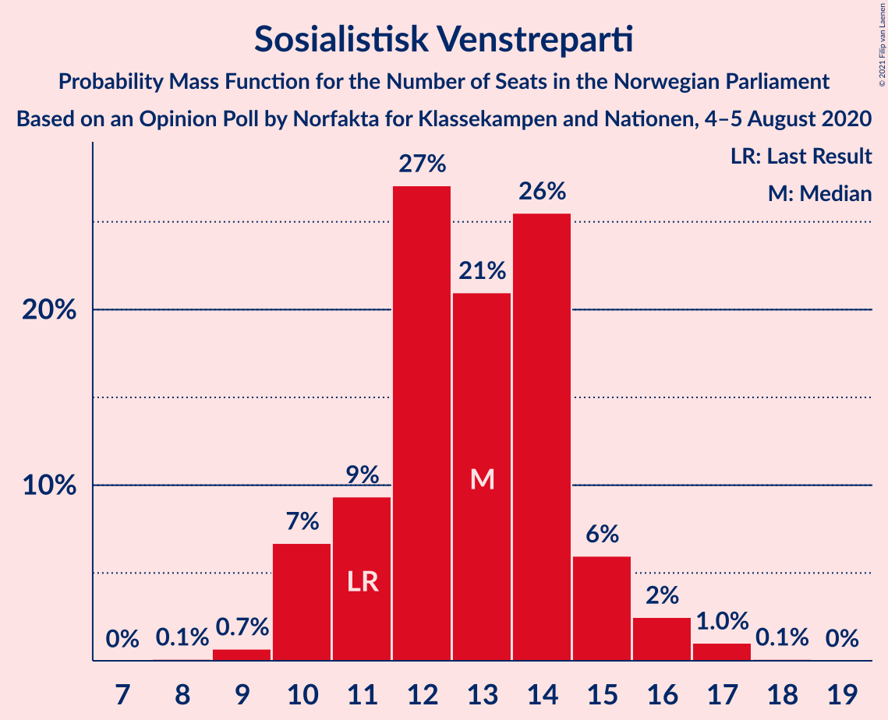

| Number of Seats | Probability | Accumulated | Special Marks |
|:---------------:|:-----------:|:-----------:|:-------------:|
| 8 | 0.1% | 100% |  |
| 9 | 0.7% | 99.9% |  |
| 10 | 7% | 99.2% |  |
| 11 | 9% | 93% | Last Result |
| 12 | 27% | 83% |  |
| 13 | 21% | 56% | Median |
| 14 | 26% | 35% |  |
| 15 | 6% | 10% |  |
| 16 | 2% | 4% |  |
| 17 | 1.0% | 1.1% |  |
| 18 | 0.1% | 0.1% |  |
| 19 | 0% | 0% |  |

### Miljøpartiet De Grønne

*For a full overview of the results for this party, see the [Miljøpartiet De Grønne](party-miljøpartietdegrønne.html) page.*

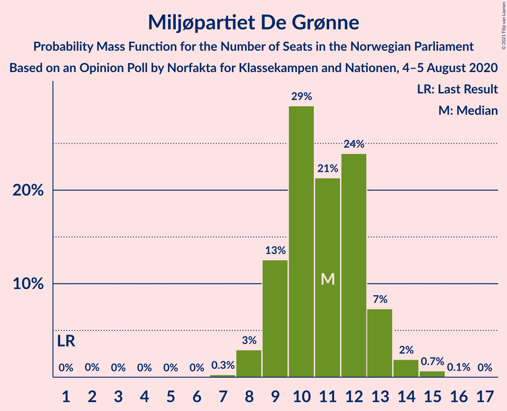

| Number of Seats | Probability | Accumulated | Special Marks |
|:---------------:|:-----------:|:-----------:|:-------------:|
| 1 | 0% | 100% | Last Result |
| 2 | 0% | 100% |  |
| 3 | 0% | 100% |  |
| 4 | 0% | 99.9% |  |
| 5 | 0% | 99.9% |  |
| 6 | 0% | 99.9% |  |
| 7 | 0.3% | 99.9% |  |
| 8 | 3% | 99.7% |  |
| 9 | 13% | 97% |  |
| 10 | 29% | 84% |  |
| 11 | 21% | 55% | Median |
| 12 | 24% | 34% |  |
| 13 | 7% | 10% |  |
| 14 | 2% | 3% |  |
| 15 | 0.7% | 0.7% |  |
| 16 | 0.1% | 0.1% |  |
| 17 | 0% | 0% |  |

### Rødt

*For a full overview of the results for this party, see the [Rødt](party-rødt.html) page.*

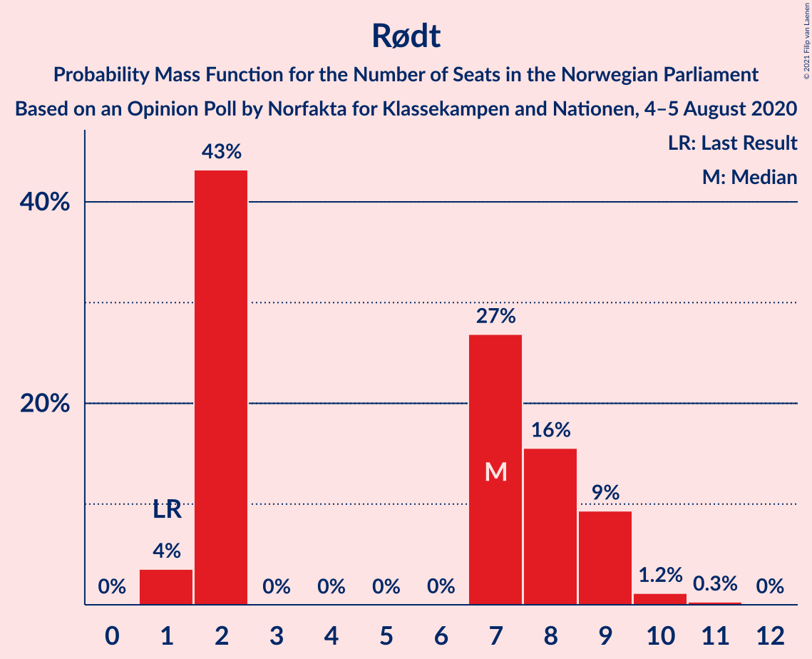

| Number of Seats | Probability | Accumulated | Special Marks |
|:---------------:|:-----------:|:-----------:|:-------------:|
| 1 | 4% | 100% | Last Result |
| 2 | 43% | 96% |  |
| 3 | 0% | 53% |  |
| 4 | 0% | 53% |  |
| 5 | 0% | 53% |  |
| 6 | 0% | 53% |  |
| 7 | 27% | 53% | Median |
| 8 | 16% | 26% |  |
| 9 | 9% | 11% |  |
| 10 | 1.2% | 1.5% |  |
| 11 | 0.3% | 0.3% |  |
| 12 | 0% | 0% |  |

### Kristelig Folkeparti

*For a full overview of the results for this party, see the [Kristelig Folkeparti](party-kristeligfolkeparti.html) page.*

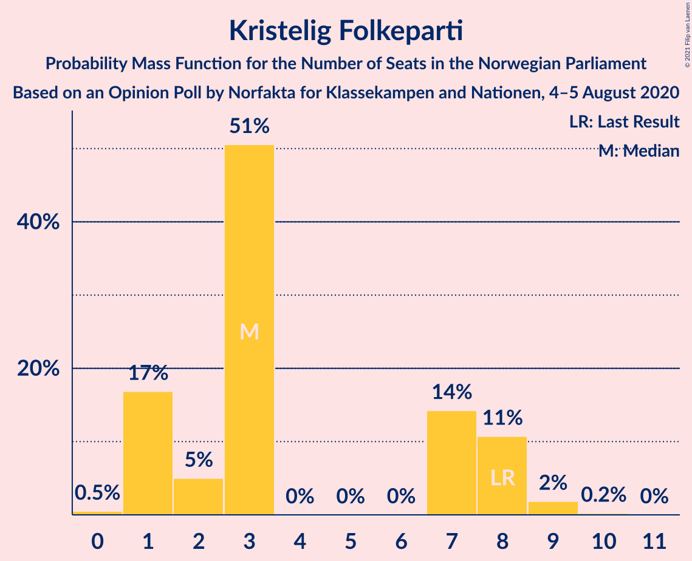

| Number of Seats | Probability | Accumulated | Special Marks |
|:---------------:|:-----------:|:-----------:|:-------------:|
| 0 | 0.5% | 100% |  |
| 1 | 17% | 99.5% |  |
| 2 | 5% | 83% |  |
| 3 | 51% | 78% | Median |
| 4 | 0% | 27% |  |
| 5 | 0% | 27% |  |
| 6 | 0% | 27% |  |
| 7 | 14% | 27% |  |
| 8 | 11% | 13% | Last Result |
| 9 | 2% | 2% |  |
| 10 | 0.2% | 0.2% |  |
| 11 | 0% | 0% |  |

### Venstre

*For a full overview of the results for this party, see the [Venstre](party-venstre.html) page.*

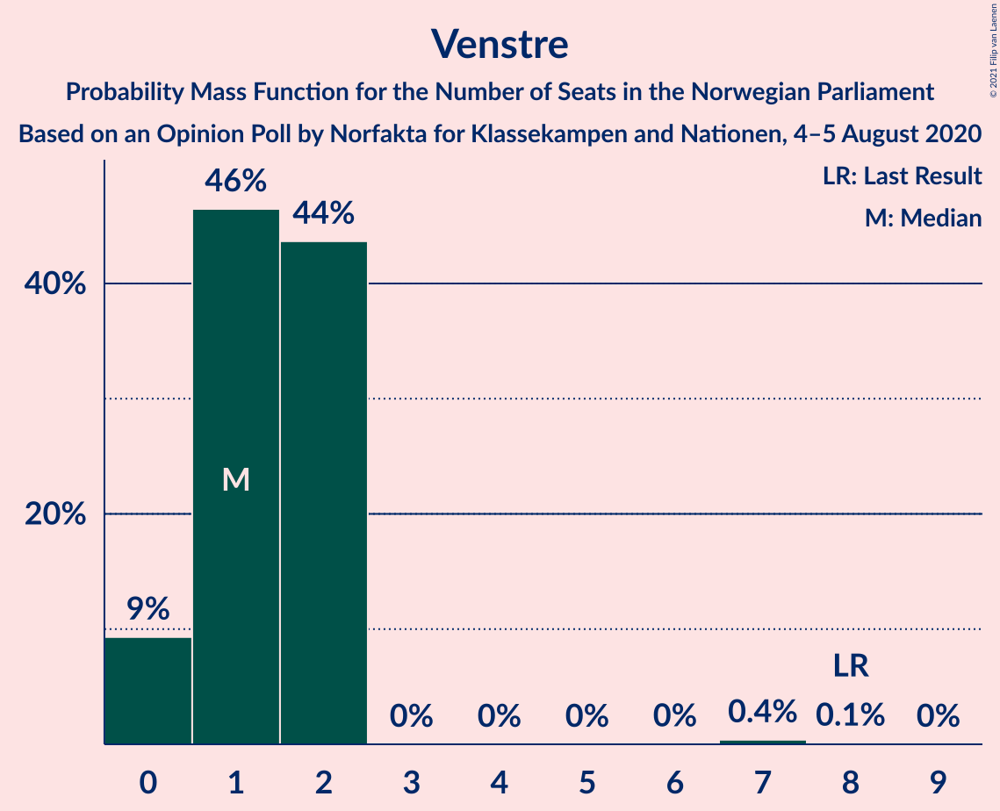

| Number of Seats | Probability | Accumulated | Special Marks |
|:---------------:|:-----------:|:-----------:|:-------------:|
| 0 | 9% | 100% |  |
| 1 | 46% | 91% | Median |
| 2 | 44% | 44% |  |
| 3 | 0% | 0.5% |  |
| 4 | 0% | 0.5% |  |
| 5 | 0% | 0.5% |  |
| 6 | 0% | 0.5% |  |
| 7 | 0.4% | 0.5% |  |
| 8 | 0.1% | 0.1% | Last Result |
| 9 | 0% | 0% |  |

## Coalitions

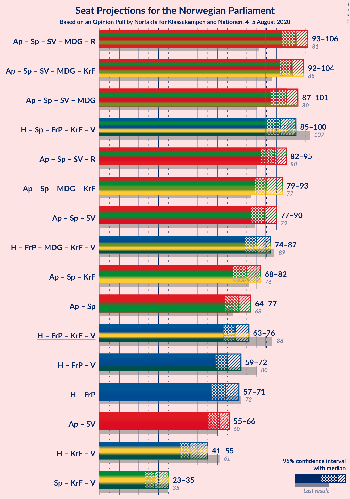

### Confidence Intervals

| Coalition | Last Result | Median | Majority? | 80% Confidence Interval | 90% Confidence Interval | 95% Confidence Interval | 99% Confidence Interval |
|:---------:|:-----------:|:------:|:---------:|:-----------------------:|:-----------------------:|:-----------------------:|:-----------------------:|
| Arbeiderpartiet – Senterpartiet – Sosialistisk Venstreparti – Miljøpartiet De Grønne – Rødt | 81 | 100 | 100% | 95–104 | 94–105 | 93–106 | 91–108 |
| Arbeiderpartiet – Senterpartiet – Sosialistisk Venstreparti – Miljøpartiet De Grønne – Kristelig Folkeparti | 88 | 98 | 100% | 94–102 | 93–103 | 92–104 | 89–107 |
| Arbeiderpartiet – Senterpartiet – Sosialistisk Venstreparti – Miljøpartiet De Grønne | 80 | 95 | 99.7% | 90–99 | 88–101 | 87–101 | 85–103 |
| Høyre – Senterpartiet – Fremskrittspartiet – Kristelig Folkeparti – Venstre | 107 | 92 | 98% | 89–97 | 87–98 | 85–100 | 84–102 |
| Arbeiderpartiet – Senterpartiet – Sosialistisk Venstreparti – Rødt | 80 | 89 | 88% | 84–93 | 83–95 | 82–95 | 80–98 |
| Arbeiderpartiet – Senterpartiet – Miljøpartiet De Grønne – Kristelig Folkeparti | 77 | 85 | 59% | 82–90 | 81–91 | 79–93 | 77–95 |
| Arbeiderpartiet – Senterpartiet – Sosialistisk Venstreparti | 79 | 84 | 50% | 79–88 | 78–89 | 77–90 | 75–92 |
| Høyre – Fremskrittspartiet – Miljøpartiet De Grønne – Kristelig Folkeparti – Venstre | 89 | 80 | 12% | 76–85 | 74–86 | 74–87 | 71–89 |
| Arbeiderpartiet – Senterpartiet – Kristelig Folkeparti | 76 | 75 | 0.4% | 71–78 | 70–80 | 68–82 | 66–84 |
| Arbeiderpartiet – Senterpartiet | 68 | 71 | 0% | 68–75 | 66–76 | 64–77 | 63–79 |
| Høyre – Fremskrittspartiet – Kristelig Folkeparti – Venstre | 88 | 69 | 0% | 65–74 | 64–75 | 63–76 | 61–78 |
| Høyre – Fremskrittspartiet – Venstre | 80 | 65 | 0% | 61–69 | 60–71 | 59–72 | 57–73 |
| Høyre – Fremskrittspartiet | 72 | 64 | 0% | 60–68 | 59–70 | 57–71 | 56–72 |
| Arbeiderpartiet – Sosialistisk Venstreparti | 60 | 61 | 0% | 56–64 | 55–65 | 55–66 | 52–68 |
| Høyre – Kristelig Folkeparti – Venstre | 61 | 46 | 0% | 42–52 | 42–54 | 41–55 | 39–55 |
| Senterpartiet – Kristelig Folkeparti – Venstre | 35 | 28 | 0% | 25–32 | 24–34 | 23–35 | 22–37 |

### Arbeiderpartiet – Senterpartiet – Sosialistisk Venstreparti – Miljøpartiet De Grønne – Rødt

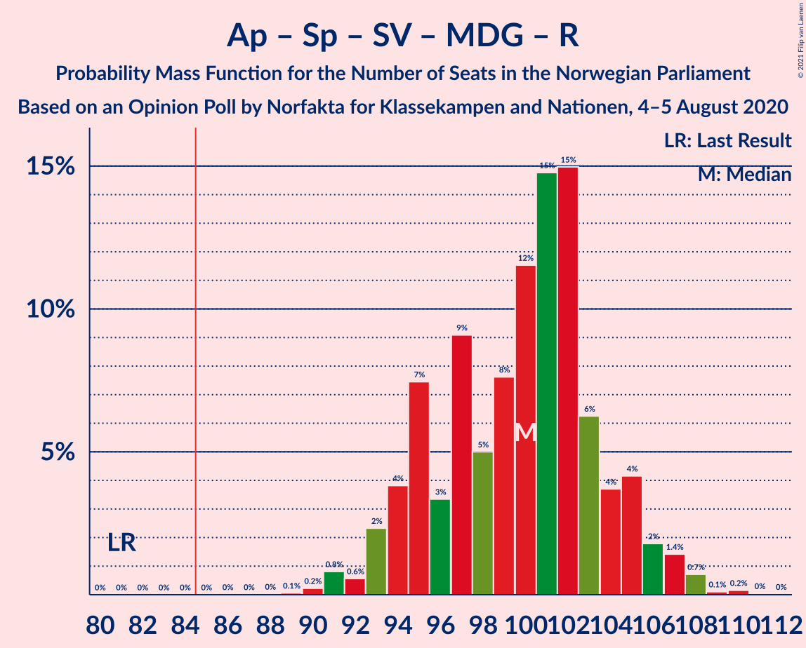

| Number of Seats | Probability | Accumulated | Special Marks |
|:---------------:|:-----------:|:-----------:|:-------------:|
| 81 | 0% | 100% | Last Result |
| 82 | 0% | 100% |  |
| 83 | 0% | 100% |  |
| 84 | 0% | 100% |  |
| 85 | 0% | 100% | Majority |
| 86 | 0% | 100% |  |
| 87 | 0% | 100% |  |
| 88 | 0% | 100% |  |
| 89 | 0.1% | 100% |  |
| 90 | 0.2% | 99.9% |  |
| 91 | 0.8% | 99.7% |  |
| 92 | 0.6% | 98.9% |  |
| 93 | 2% | 98% |  |
| 94 | 4% | 96% |  |
| 95 | 7% | 92% |  |
| 96 | 3% | 85% |  |
| 97 | 9% | 81% |  |
| 98 | 5% | 72% |  |
| 99 | 8% | 67% |  |
| 100 | 12% | 60% |  |
| 101 | 15% | 48% |  |
| 102 | 15% | 33% | Median |
| 103 | 6% | 18% |  |
| 104 | 4% | 12% |  |
| 105 | 4% | 8% |  |
| 106 | 2% | 4% |  |
| 107 | 1.4% | 2% |  |
| 108 | 0.7% | 1.0% |  |
| 109 | 0.1% | 0.3% |  |
| 110 | 0.2% | 0.2% |  |
| 111 | 0% | 0.1% |  |
| 112 | 0% | 0% |  |

### Arbeiderpartiet – Senterpartiet – Sosialistisk Venstreparti – Miljøpartiet De Grønne – Kristelig Folkeparti

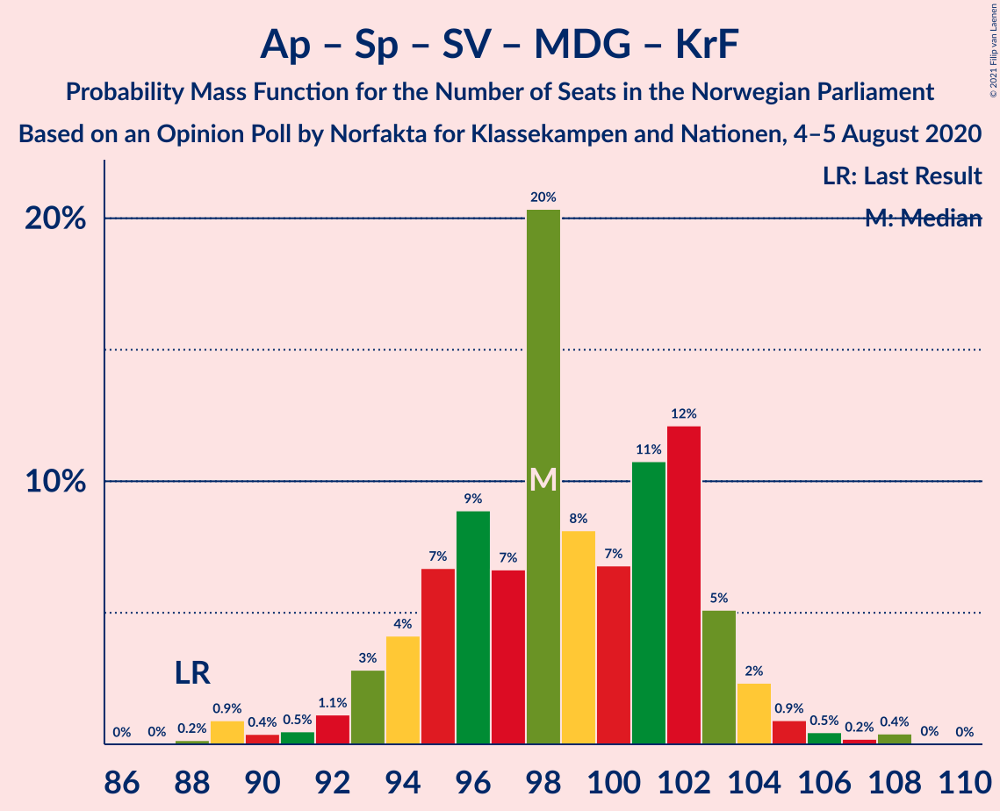

| Number of Seats | Probability | Accumulated | Special Marks |
|:---------------:|:-----------:|:-----------:|:-------------:|
| 88 | 0.2% | 100% | Last Result |
| 89 | 0.9% | 99.8% |  |
| 90 | 0.4% | 98.9% |  |
| 91 | 0.5% | 98% |  |
| 92 | 1.1% | 98% |  |
| 93 | 3% | 97% |  |
| 94 | 4% | 94% |  |
| 95 | 7% | 90% |  |
| 96 | 9% | 83% |  |
| 97 | 7% | 74% |  |
| 98 | 20% | 68% | Median |
| 99 | 8% | 47% |  |
| 100 | 7% | 39% |  |
| 101 | 11% | 32% |  |
| 102 | 12% | 22% |  |
| 103 | 5% | 10% |  |
| 104 | 2% | 4% |  |
| 105 | 0.9% | 2% |  |
| 106 | 0.5% | 1.1% |  |
| 107 | 0.2% | 0.7% |  |
| 108 | 0.4% | 0.5% |  |
| 109 | 0% | 0.1% |  |
| 110 | 0% | 0% |  |

### Arbeiderpartiet – Senterpartiet – Sosialistisk Venstreparti – Miljøpartiet De Grønne

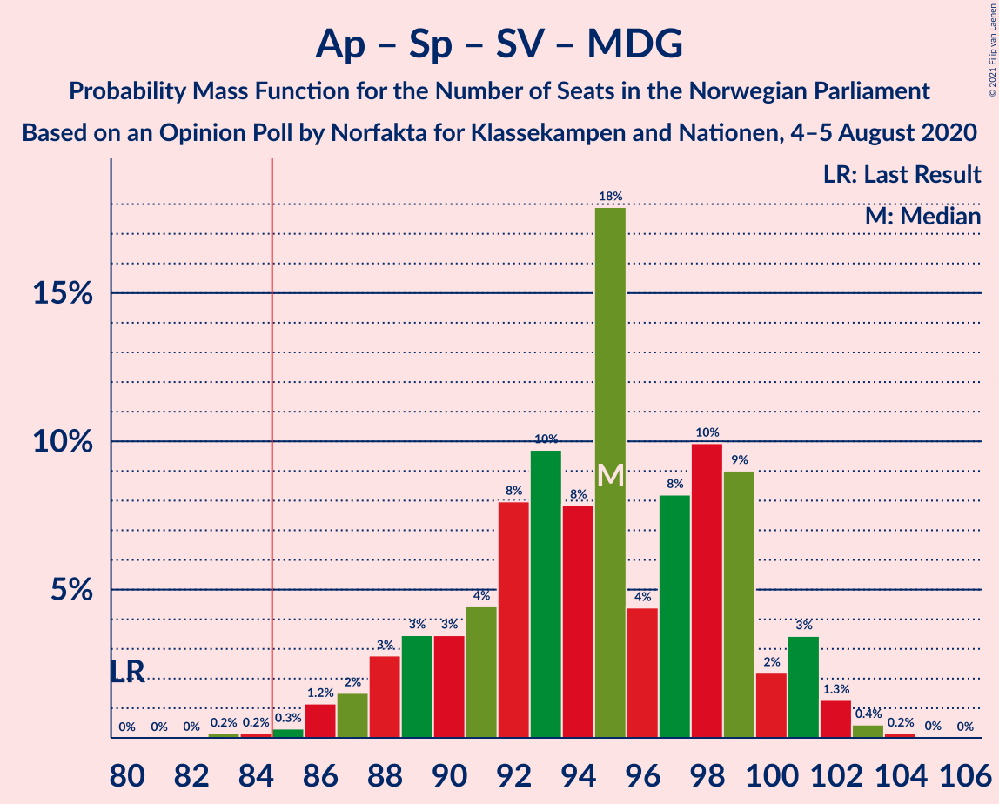

| Number of Seats | Probability | Accumulated | Special Marks |
|:---------------:|:-----------:|:-----------:|:-------------:|
| 80 | 0% | 100% | Last Result |
| 81 | 0% | 100% |  |
| 82 | 0% | 100% |  |
| 83 | 0.2% | 100% |  |
| 84 | 0.2% | 99.8% |  |
| 85 | 0.3% | 99.7% | Majority |
| 86 | 1.2% | 99.4% |  |
| 87 | 2% | 98% |  |
| 88 | 3% | 97% |  |
| 89 | 3% | 94% |  |
| 90 | 3% | 90% |  |
| 91 | 4% | 87% |  |
| 92 | 8% | 83% |  |
| 93 | 10% | 75% |  |
| 94 | 8% | 65% |  |
| 95 | 18% | 57% | Median |
| 96 | 4% | 39% |  |
| 97 | 8% | 35% |  |
| 98 | 10% | 27% |  |
| 99 | 9% | 17% |  |
| 100 | 2% | 8% |  |
| 101 | 3% | 5% |  |
| 102 | 1.3% | 2% |  |
| 103 | 0.4% | 0.7% |  |
| 104 | 0.2% | 0.2% |  |
| 105 | 0% | 0.1% |  |
| 106 | 0% | 0% |  |

### Høyre – Senterpartiet – Fremskrittspartiet – Kristelig Folkeparti – Venstre

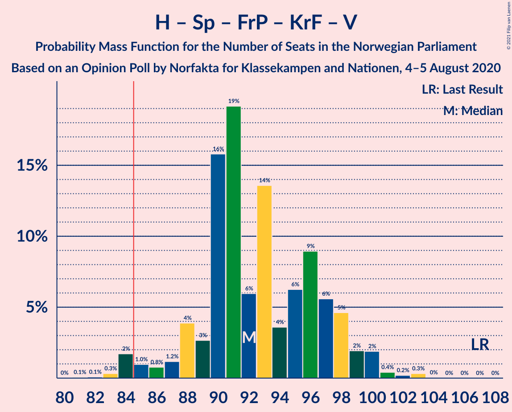

| Number of Seats | Probability | Accumulated | Special Marks |
|:---------------:|:-----------:|:-----------:|:-------------:|
| 81 | 0.1% | 100% |  |
| 82 | 0.1% | 99.9% |  |
| 83 | 0.3% | 99.8% |  |
| 84 | 2% | 99.5% |  |
| 85 | 1.0% | 98% | Majority |
| 86 | 0.8% | 97% |  |
| 87 | 1.2% | 96% |  |
| 88 | 4% | 95% |  |
| 89 | 3% | 91% |  |
| 90 | 16% | 88% | Median |
| 91 | 19% | 73% |  |
| 92 | 6% | 53% |  |
| 93 | 14% | 47% |  |
| 94 | 4% | 34% |  |
| 95 | 6% | 30% |  |
| 96 | 9% | 24% |  |
| 97 | 6% | 15% |  |
| 98 | 5% | 9% |  |
| 99 | 2% | 5% |  |
| 100 | 2% | 3% |  |
| 101 | 0.4% | 1.0% |  |
| 102 | 0.2% | 0.6% |  |
| 103 | 0.3% | 0.4% |  |
| 104 | 0% | 0.1% |  |
| 105 | 0% | 0% |  |
| 106 | 0% | 0% |  |
| 107 | 0% | 0% | Last Result |

### Arbeiderpartiet – Senterpartiet – Sosialistisk Venstreparti – Rødt

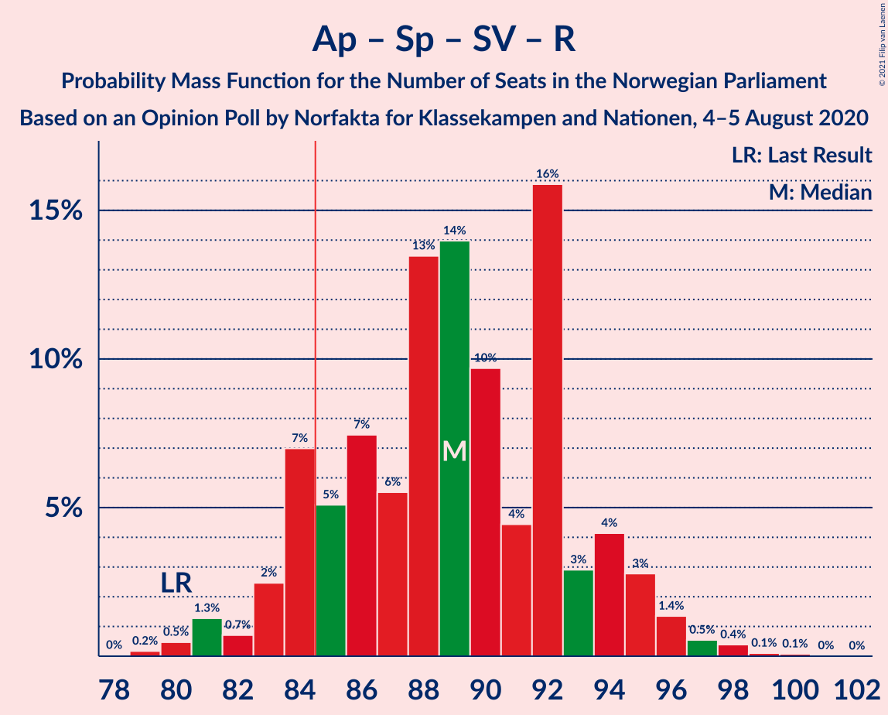

| Number of Seats | Probability | Accumulated | Special Marks |
|:---------------:|:-----------:|:-----------:|:-------------:|
| 78 | 0% | 100% |  |
| 79 | 0.2% | 99.9% |  |
| 80 | 0.5% | 99.8% | Last Result |
| 81 | 1.3% | 99.3% |  |
| 82 | 0.7% | 98% |  |
| 83 | 2% | 97% |  |
| 84 | 7% | 95% |  |
| 85 | 5% | 88% | Majority |
| 86 | 7% | 83% |  |
| 87 | 6% | 75% |  |
| 88 | 13% | 70% |  |
| 89 | 14% | 56% |  |
| 90 | 10% | 42% |  |
| 91 | 4% | 33% | Median |
| 92 | 16% | 28% |  |
| 93 | 3% | 12% |  |
| 94 | 4% | 9% |  |
| 95 | 3% | 5% |  |
| 96 | 1.4% | 2% |  |
| 97 | 0.5% | 1.1% |  |
| 98 | 0.4% | 0.6% |  |
| 99 | 0.1% | 0.2% |  |
| 100 | 0.1% | 0.1% |  |
| 101 | 0% | 0% |  |

### Arbeiderpartiet – Senterpartiet – Miljøpartiet De Grønne – Kristelig Folkeparti

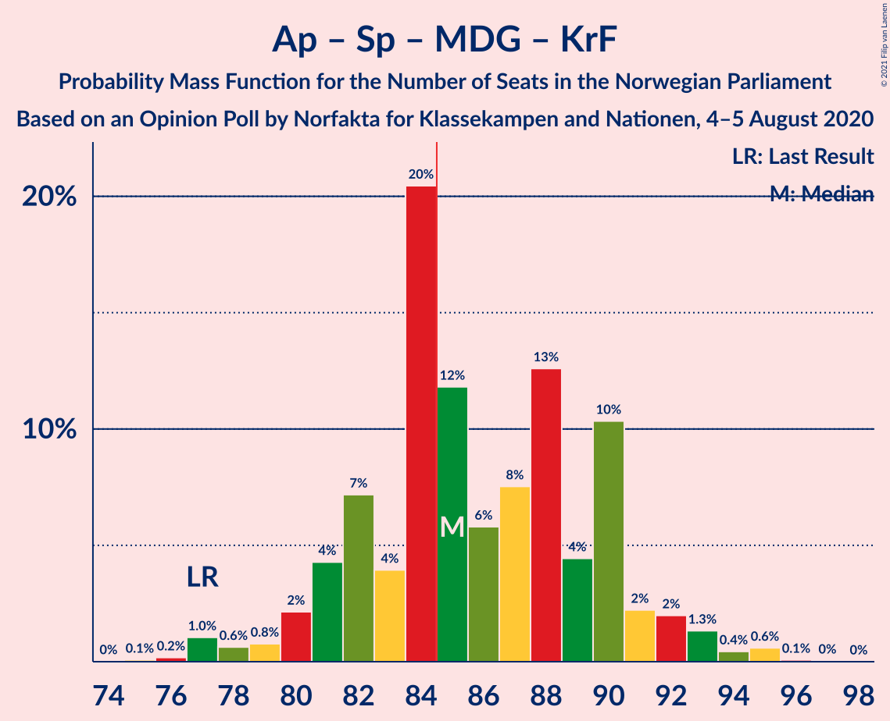

| Number of Seats | Probability | Accumulated | Special Marks |
|:---------------:|:-----------:|:-----------:|:-------------:|
| 75 | 0.1% | 100% |  |
| 76 | 0.2% | 99.9% |  |
| 77 | 1.0% | 99.7% | Last Result |
| 78 | 0.6% | 98.7% |  |
| 79 | 0.8% | 98% |  |
| 80 | 2% | 97% |  |
| 81 | 4% | 95% |  |
| 82 | 7% | 91% |  |
| 83 | 4% | 84% |  |
| 84 | 20% | 80% |  |
| 85 | 12% | 59% | Median, Majority |
| 86 | 6% | 47% |  |
| 87 | 8% | 42% |  |
| 88 | 13% | 34% |  |
| 89 | 4% | 22% |  |
| 90 | 10% | 17% |  |
| 91 | 2% | 7% |  |
| 92 | 2% | 4% |  |
| 93 | 1.3% | 3% |  |
| 94 | 0.4% | 1.2% |  |
| 95 | 0.6% | 0.7% |  |
| 96 | 0.1% | 0.1% |  |
| 97 | 0% | 0.1% |  |
| 98 | 0% | 0% |  |

### Arbeiderpartiet – Senterpartiet – Sosialistisk Venstreparti

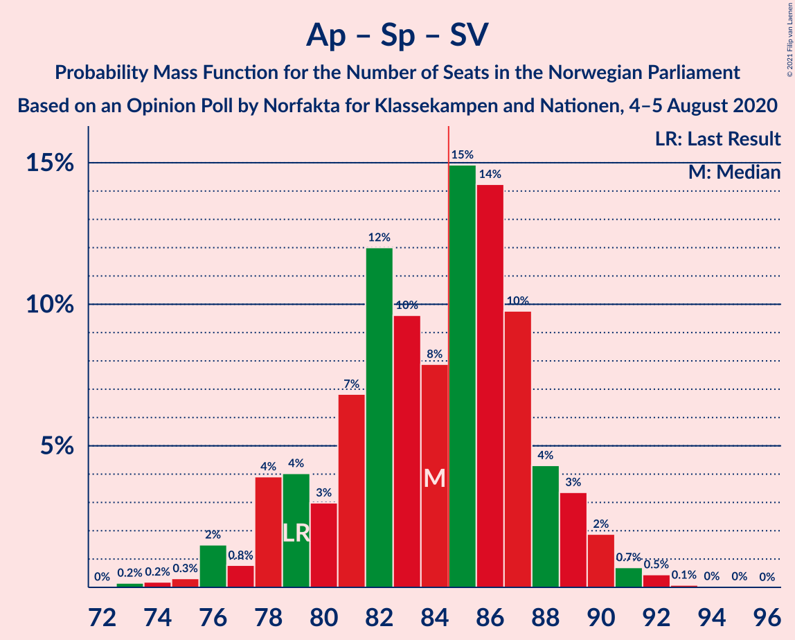

| Number of Seats | Probability | Accumulated | Special Marks |
|:---------------:|:-----------:|:-----------:|:-------------:|
| 73 | 0.2% | 100% |  |
| 74 | 0.2% | 99.8% |  |
| 75 | 0.3% | 99.6% |  |
| 76 | 2% | 99.3% |  |
| 77 | 0.8% | 98% |  |
| 78 | 4% | 97% |  |
| 79 | 4% | 93% | Last Result |
| 80 | 3% | 89% |  |
| 81 | 7% | 86% |  |
| 82 | 12% | 79% |  |
| 83 | 10% | 67% |  |
| 84 | 8% | 58% | Median |
| 85 | 15% | 50% | Majority |
| 86 | 14% | 35% |  |
| 87 | 10% | 21% |  |
| 88 | 4% | 11% |  |
| 89 | 3% | 7% |  |
| 90 | 2% | 3% |  |
| 91 | 0.7% | 1.3% |  |
| 92 | 0.5% | 0.6% |  |
| 93 | 0.1% | 0.2% |  |
| 94 | 0% | 0.1% |  |
| 95 | 0% | 0% |  |

### Høyre – Fremskrittspartiet – Miljøpartiet De Grønne – Kristelig Folkeparti – Venstre

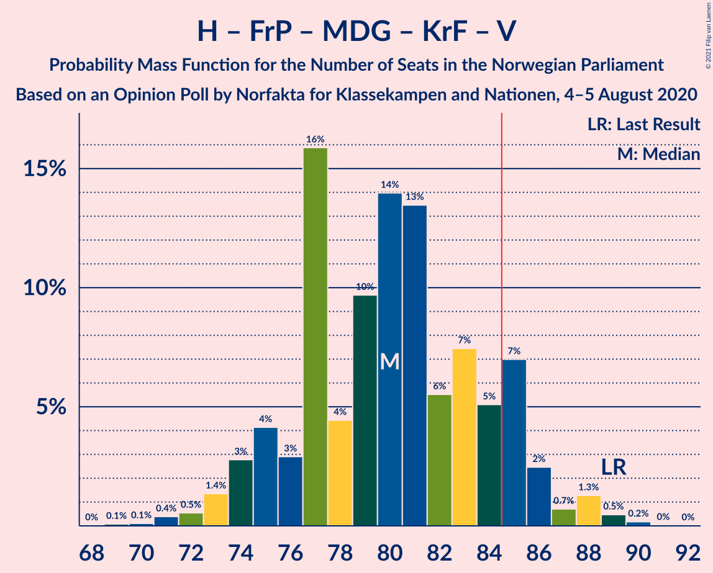

| Number of Seats | Probability | Accumulated | Special Marks |
|:---------------:|:-----------:|:-----------:|:-------------:|
| 69 | 0.1% | 100% |  |
| 70 | 0.1% | 99.9% |  |
| 71 | 0.4% | 99.8% |  |
| 72 | 0.5% | 99.4% |  |
| 73 | 1.4% | 98.9% |  |
| 74 | 3% | 98% |  |
| 75 | 4% | 95% |  |
| 76 | 3% | 91% |  |
| 77 | 16% | 88% |  |
| 78 | 4% | 72% | Median |
| 79 | 10% | 67% |  |
| 80 | 14% | 58% |  |
| 81 | 13% | 44% |  |
| 82 | 6% | 30% |  |
| 83 | 7% | 25% |  |
| 84 | 5% | 17% |  |
| 85 | 7% | 12% | Majority |
| 86 | 2% | 5% |  |
| 87 | 0.7% | 3% |  |
| 88 | 1.3% | 2% |  |
| 89 | 0.5% | 0.7% | Last Result |
| 90 | 0.2% | 0.2% |  |
| 91 | 0% | 0.1% |  |
| 92 | 0% | 0% |  |

### Arbeiderpartiet – Senterpartiet – Kristelig Folkeparti

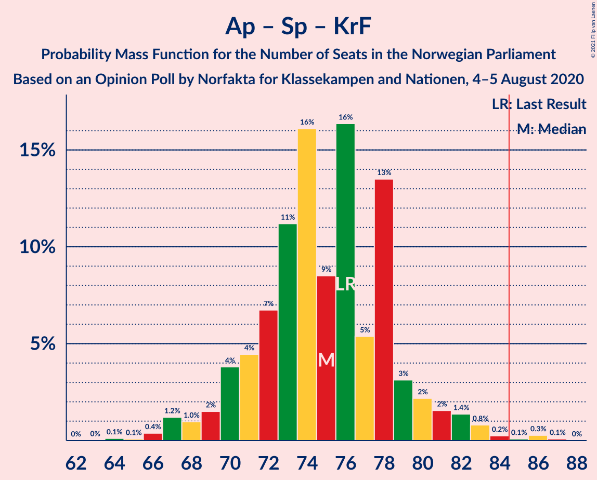

| Number of Seats | Probability | Accumulated | Special Marks |
|:---------------:|:-----------:|:-----------:|:-------------:|
| 64 | 0.1% | 100% |  |
| 65 | 0.1% | 99.9% |  |
| 66 | 0.4% | 99.8% |  |
| 67 | 1.2% | 99.4% |  |
| 68 | 1.0% | 98% |  |
| 69 | 2% | 97% |  |
| 70 | 4% | 96% |  |
| 71 | 4% | 92% |  |
| 72 | 7% | 87% |  |
| 73 | 11% | 81% |  |
| 74 | 16% | 70% | Median |
| 75 | 9% | 53% |  |
| 76 | 16% | 45% | Last Result |
| 77 | 5% | 29% |  |
| 78 | 13% | 23% |  |
| 79 | 3% | 10% |  |
| 80 | 2% | 7% |  |
| 81 | 2% | 4% |  |
| 82 | 1.4% | 3% |  |
| 83 | 0.8% | 1.5% |  |
| 84 | 0.2% | 0.7% |  |
| 85 | 0.1% | 0.4% | Majority |
| 86 | 0.3% | 0.4% |  |
| 87 | 0.1% | 0.1% |  |
| 88 | 0% | 0% |  |

### Arbeiderpartiet – Senterpartiet

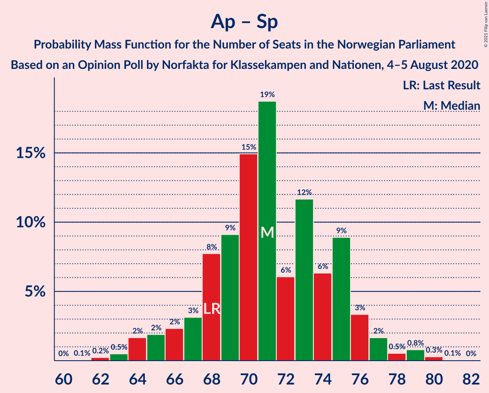

| Number of Seats | Probability | Accumulated | Special Marks |
|:---------------:|:-----------:|:-----------:|:-------------:|
| 60 | 0% | 100% |  |
| 61 | 0.1% | 99.9% |  |
| 62 | 0.2% | 99.9% |  |
| 63 | 0.5% | 99.7% |  |
| 64 | 2% | 99.2% |  |
| 65 | 2% | 97% |  |
| 66 | 2% | 96% |  |
| 67 | 3% | 93% |  |
| 68 | 8% | 90% | Last Result |
| 69 | 9% | 82% |  |
| 70 | 15% | 73% |  |
| 71 | 19% | 58% | Median |
| 72 | 6% | 40% |  |
| 73 | 12% | 34% |  |
| 74 | 6% | 22% |  |
| 75 | 9% | 16% |  |
| 76 | 3% | 7% |  |
| 77 | 2% | 3% |  |
| 78 | 0.5% | 2% |  |
| 79 | 0.8% | 1.2% |  |
| 80 | 0.3% | 0.4% |  |
| 81 | 0.1% | 0.1% |  |
| 82 | 0% | 0% |  |

### Høyre – Fremskrittspartiet – Kristelig Folkeparti – Venstre

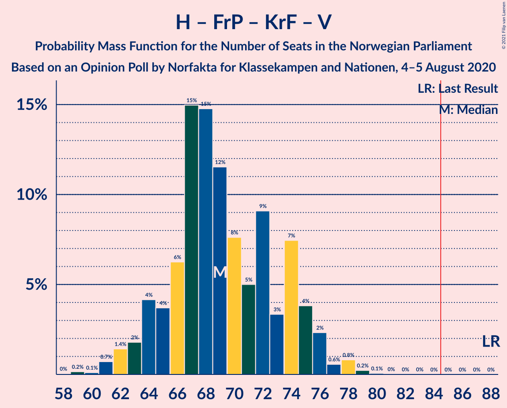

| Number of Seats | Probability | Accumulated | Special Marks |
|:---------------:|:-----------:|:-----------:|:-------------:|
| 58 | 0% | 100% |  |
| 59 | 0.2% | 99.9% |  |
| 60 | 0.1% | 99.8% |  |
| 61 | 0.7% | 99.7% |  |
| 62 | 1.4% | 99.0% |  |
| 63 | 2% | 98% |  |
| 64 | 4% | 96% |  |
| 65 | 4% | 92% |  |
| 66 | 6% | 88% |  |
| 67 | 15% | 82% | Median |
| 68 | 15% | 67% |  |
| 69 | 12% | 52% |  |
| 70 | 8% | 40% |  |
| 71 | 5% | 33% |  |
| 72 | 9% | 28% |  |
| 73 | 3% | 19% |  |
| 74 | 7% | 15% |  |
| 75 | 4% | 8% |  |
| 76 | 2% | 4% |  |
| 77 | 0.6% | 2% |  |
| 78 | 0.8% | 1.1% |  |
| 79 | 0.2% | 0.3% |  |
| 80 | 0.1% | 0.1% |  |
| 81 | 0% | 0% |  |
| 82 | 0% | 0% |  |
| 83 | 0% | 0% |  |
| 84 | 0% | 0% |  |
| 85 | 0% | 0% | Majority |
| 86 | 0% | 0% |  |
| 87 | 0% | 0% |  |
| 88 | 0% | 0% | Last Result |

### Høyre – Fremskrittspartiet – Venstre

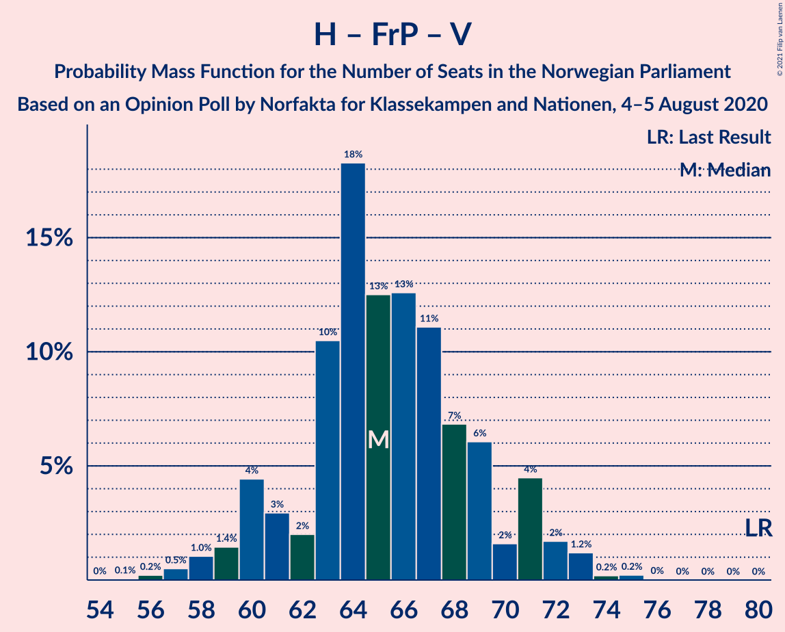

| Number of Seats | Probability | Accumulated | Special Marks |
|:---------------:|:-----------:|:-----------:|:-------------:|
| 55 | 0.1% | 100% |  |
| 56 | 0.2% | 99.9% |  |
| 57 | 0.5% | 99.7% |  |
| 58 | 1.0% | 99.2% |  |
| 59 | 1.4% | 98% |  |
| 60 | 4% | 97% |  |
| 61 | 3% | 92% |  |
| 62 | 2% | 89% |  |
| 63 | 10% | 87% |  |
| 64 | 18% | 77% | Median |
| 65 | 13% | 59% |  |
| 66 | 13% | 46% |  |
| 67 | 11% | 33% |  |
| 68 | 7% | 22% |  |
| 69 | 6% | 16% |  |
| 70 | 2% | 9% |  |
| 71 | 4% | 8% |  |
| 72 | 2% | 3% |  |
| 73 | 1.2% | 2% |  |
| 74 | 0.2% | 0.5% |  |
| 75 | 0.2% | 0.3% |  |
| 76 | 0% | 0% |  |
| 77 | 0% | 0% |  |
| 78 | 0% | 0% |  |
| 79 | 0% | 0% |  |
| 80 | 0% | 0% | Last Result |

### Høyre – Fremskrittspartiet

| Number of Seats | Probability | Accumulated | Special Marks |
|:---------------:|:-----------:|:-----------:|:-------------:|
| 53 | 0% | 100% |  |
| 54 | 0.1% | 99.9% |  |
| 55 | 0.2% | 99.8% |  |
| 56 | 0.5% | 99.6% |  |
| 57 | 2% | 99.1% |  |
| 58 | 1.0% | 97% |  |
| 59 | 5% | 96% |  |
| 60 | 3% | 91% |  |
| 61 | 9% | 89% |  |
| 62 | 8% | 80% |  |
| 63 | 21% | 73% | Median |
| 64 | 9% | 52% |  |
| 65 | 16% | 43% |  |
| 66 | 6% | 27% |  |
| 67 | 9% | 21% |  |
| 68 | 3% | 12% |  |
| 69 | 2% | 9% |  |
| 70 | 4% | 7% |  |
| 71 | 3% | 3% |  |
| 72 | 0.3% | 0.6% | Last Result |
| 73 | 0.2% | 0.3% |  |
| 74 | 0.1% | 0.1% |  |
| 75 | 0% | 0% |  |

### Arbeiderpartiet – Sosialistisk Venstreparti

| Number of Seats | Probability | Accumulated | Special Marks |
|:---------------:|:-----------:|:-----------:|:-------------:|
| 51 | 0.1% | 100% |  |
| 52 | 0.5% | 99.9% |  |
| 53 | 0.9% | 99.4% |  |
| 54 | 1.0% | 98.5% |  |
| 55 | 3% | 98% |  |
| 56 | 6% | 95% |  |
| 57 | 5% | 89% |  |
| 58 | 6% | 84% |  |
| 59 | 16% | 78% |  |
| 60 | 9% | 62% | Last Result |
| 61 | 5% | 53% | Median |
| 62 | 24% | 48% |  |
| 63 | 8% | 24% |  |
| 64 | 9% | 15% |  |
| 65 | 3% | 7% |  |
| 66 | 2% | 4% |  |
| 67 | 0.8% | 1.4% |  |
| 68 | 0.4% | 0.7% |  |
| 69 | 0.2% | 0.3% |  |
| 70 | 0.1% | 0.1% |  |
| 71 | 0% | 0% |  |

### Høyre – Kristelig Folkeparti – Venstre

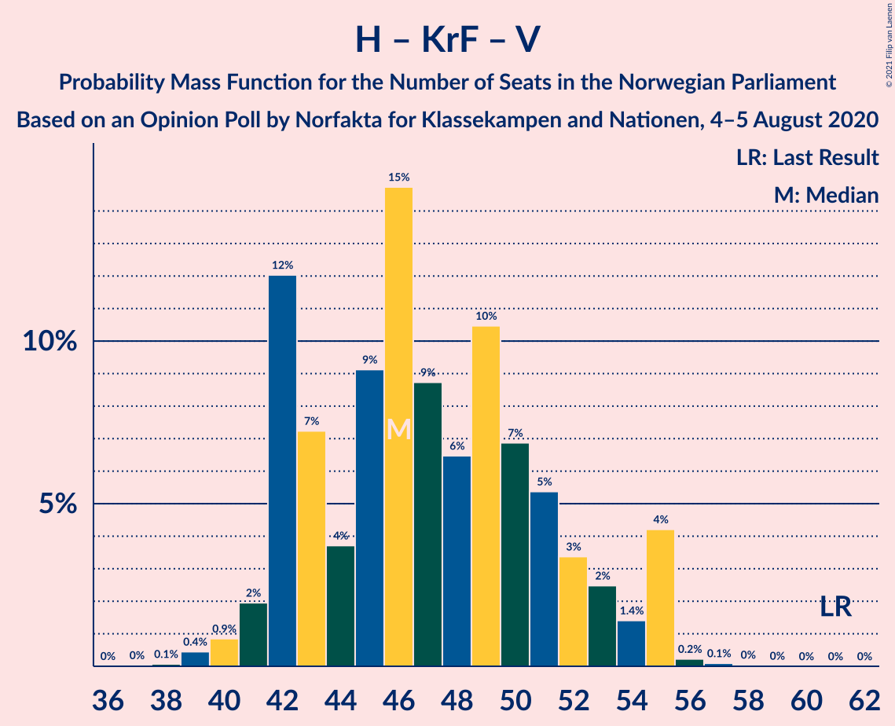

| Number of Seats | Probability | Accumulated | Special Marks |
|:---------------:|:-----------:|:-----------:|:-------------:|
| 38 | 0.1% | 100% |  |
| 39 | 0.4% | 99.9% |  |
| 40 | 0.9% | 99.4% |  |
| 41 | 2% | 98.6% |  |
| 42 | 12% | 97% |  |
| 43 | 7% | 85% |  |
| 44 | 4% | 77% |  |
| 45 | 9% | 74% | Median |
| 46 | 15% | 65% |  |
| 47 | 9% | 50% |  |
| 48 | 6% | 41% |  |
| 49 | 10% | 35% |  |
| 50 | 7% | 24% |  |
| 51 | 5% | 17% |  |
| 52 | 3% | 12% |  |
| 53 | 2% | 8% |  |
| 54 | 1.4% | 6% |  |
| 55 | 4% | 5% |  |
| 56 | 0.2% | 0.4% |  |
| 57 | 0.1% | 0.2% |  |
| 58 | 0% | 0.1% |  |
| 59 | 0% | 0% |  |
| 60 | 0% | 0% |  |
| 61 | 0% | 0% | Last Result |

### Senterpartiet – Kristelig Folkeparti – Venstre

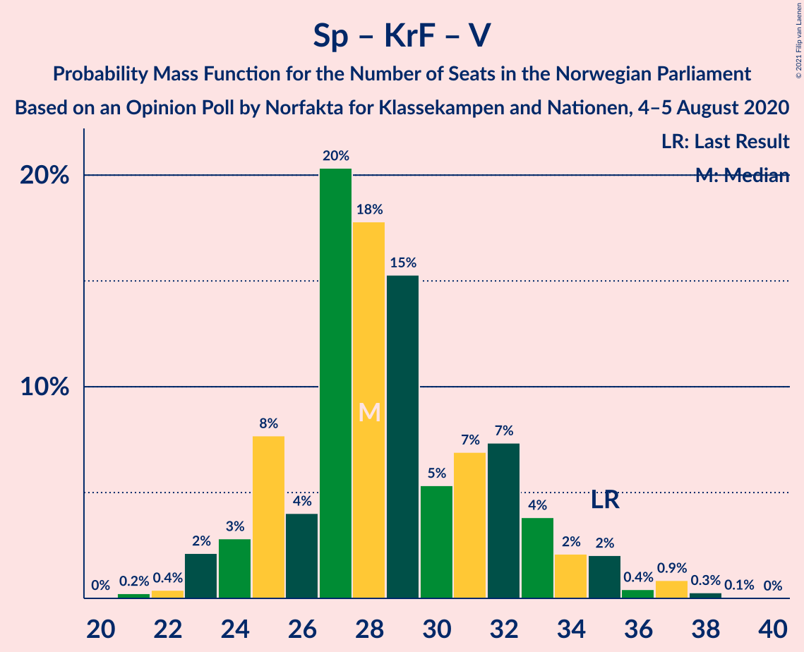

| Number of Seats | Probability | Accumulated | Special Marks |
|:---------------:|:-----------:|:-----------:|:-------------:|
| 20 | 0% | 100% |  |
| 21 | 0.2% | 99.9% |  |
| 22 | 0.4% | 99.7% |  |
| 23 | 2% | 99.3% |  |
| 24 | 3% | 97% |  |
| 25 | 8% | 94% |  |
| 26 | 4% | 87% |  |
| 27 | 20% | 83% | Median |
| 28 | 18% | 62% |  |
| 29 | 15% | 45% |  |
| 30 | 5% | 29% |  |
| 31 | 7% | 24% |  |
| 32 | 7% | 17% |  |
| 33 | 4% | 10% |  |
| 34 | 2% | 6% |  |
| 35 | 2% | 4% | Last Result |
| 36 | 0.4% | 2% |  |
| 37 | 0.9% | 1.2% |  |
| 38 | 0.3% | 0.4% |  |
| 39 | 0.1% | 0.1% |  |
| 40 | 0% | 0% |  |

## Technical Information

### Opinion Poll

+ **Polling firm:** Norfakta
+ **Commissioner(s):** Klassekampen and Nationen
+ **Fieldwork period:** 4–5 August 2020

### Calculations

+ **Sample size:** 1001
+ **Simulations done:** 1,048,576
+ **Error estimate:** 1.20%

