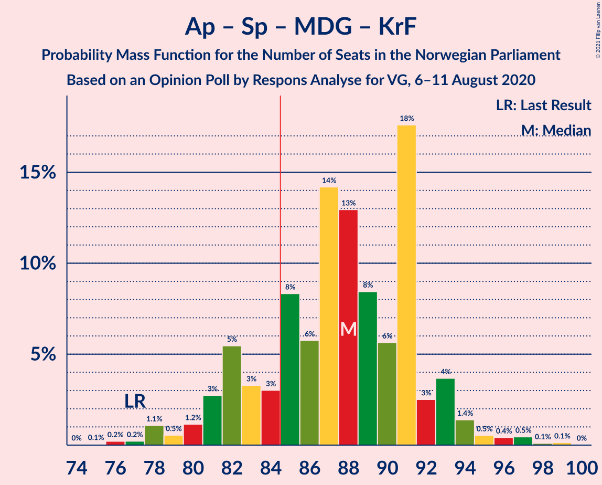
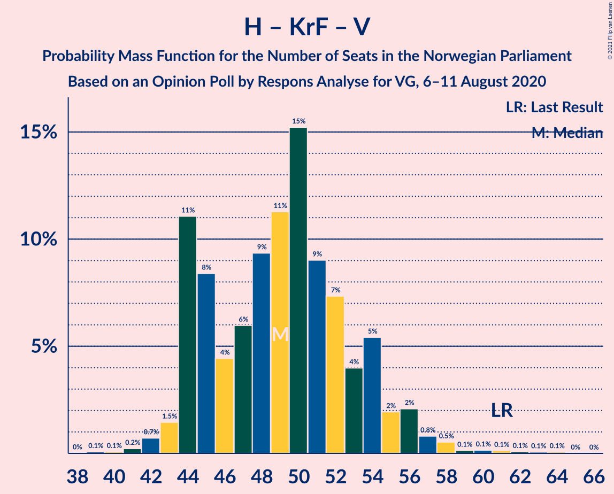

# Opinion Poll by Respons Analyse for VG, 6–11 August 2020

<a href="#voting-intentions">Voting Intentions</a> | <a href="#seats">Seats</a> | <a href="#coalitions">Coalitions</a> | <a href="#technical-information">Technical Information</a>

## Voting Intentions

### Confidence Intervals

| Party | Last Result | Poll Result | 80% Confidence Interval | 90% Confidence Interval | 95% Confidence Interval | 99% Confidence Interval |
|:-----:|:-----------:|:-----------:|:-----------------------:|:-----------------------:|:-----------------------:|:-----------------------:|
| Arbeiderpartiet | 27.4% | 25.5% | 23.8–27.3% |23.3–27.8% |22.9–28.3% |22.1–29.2% |
| Høyre | 25.0% | 23.0% | 21.3–24.8% |20.9–25.3% |20.5–25.7% |19.7–26.6% |
| Senterpartiet | 10.3% | 14.4% | 13.0–15.9% |12.7–16.3% |12.3–16.7% |11.7–17.5% |
| Fremskrittspartiet | 15.2% | 10.4% | 9.2–11.7% |8.9–12.1% |8.6–12.4% |8.1–13.1% |
| Sosialistisk Venstreparti | 6.0% | 7.6% | 6.6–8.8% |6.3–9.1% |6.1–9.4% |5.7–10.0% |
| Miljøpartiet De Grønne | 3.2% | 5.2% | 4.4–6.2% |4.2–6.5% |4.0–6.8% |3.6–7.3% |
| Kristelig Folkeparti | 4.2% | 3.9% | 3.2–4.8% |3.0–5.1% |2.9–5.3% |2.6–5.8% |
| Rødt | 2.4% | 3.8% | 3.1–4.7% |2.9–5.0% |2.8–5.2% |2.5–5.6% |
| Venstre | 4.4% | 3.6% | 2.9–4.5% |2.8–4.7% |2.6–5.0% |2.3–5.4% |

*Note:* The poll result column reflects the actual value used in the calculations. Published results may vary slightly, and in addition be rounded to fewer digits.

## Seats

### Confidence Intervals

| Party | Last Result | Median | 80% Confidence Interval | 90% Confidence Interval | 95% Confidence Interval | 99% Confidence Interval |
|:-----:|:-----------:|:------:|:-----------------------:|:-----------------------:|:-----------------------:|:-----------------------:|
| <a href="#arbeiderpartiet">Arbeiderpartiet</a> | 49 | 47 | 43–51 |42–52 |42–53 |40–55 |
| <a href="#høyre">Høyre</a> | 45 | 41 | 38–45 |37–47 |36–47 |34–49 |
| <a href="#senterpartiet">Senterpartiet</a> | 19 | 26 | 24–31 |22–32 |22–33 |20–34 |
| <a href="#fremskrittspartiet">Fremskrittspartiet</a> | 27 | 18 | 16–22 |16–22 |15–22 |14–25 |
| <a href="#sosialistisk-venstreparti">Sosialistisk Venstreparti</a> | 11 | 14 | 12–16 |11–16 |11–17 |10–18 |
| <a href="#miljøpartiet-de-grønne">Miljøpartiet De Grønne</a> | 1 | 10 | 8–11 |8–12 |7–12 |2–13 |
| <a href="#kristelig-folkeparti">Kristelig Folkeparti</a> | 8 | 3 | 2–8 |2–9 |1–9 |1–10 |
| <a href="#rødt">Rødt</a> | 1 | 2 | 2–8 |2–9 |1–9 |1–10 |
| <a href="#venstre">Venstre</a> | 8 | 2 | 2–7 |2–8 |2–8 |1–9 |

### Arbeiderpartiet

*For a full overview of the results for this party, see the [Arbeiderpartiet](party-arbeiderpartiet.html) page.*

| Number of Seats | Probability | Accumulated | Special Marks |
|:---------------:|:-----------:|:-----------:|:-------------:|
| 39 | 0.1% | 100% |  |
| 40 | 0.8% | 99.8% |  |
| 41 | 1.2% | 99.0% |  |
| 42 | 3% | 98% |  |
| 43 | 6% | 94% |  |
| 44 | 11% | 88% |  |
| 45 | 10% | 77% |  |
| 46 | 14% | 67% |  |
| 47 | 8% | 53% | Median |
| 48 | 20% | 45% |  |
| 49 | 13% | 25% | Last Result |
| 50 | 2% | 13% |  |
| 51 | 5% | 10% |  |
| 52 | 1.4% | 5% |  |
| 53 | 2% | 4% |  |
| 54 | 1.0% | 2% |  |
| 55 | 0.4% | 0.7% |  |
| 56 | 0.2% | 0.3% |  |
| 57 | 0.1% | 0.2% |  |
| 58 | 0% | 0.1% |  |
| 59 | 0% | 0% |  |

### Høyre

*For a full overview of the results for this party, see the [Høyre](party-høyre.html) page.*

| Number of Seats | Probability | Accumulated | Special Marks |
|:---------------:|:-----------:|:-----------:|:-------------:|
| 33 | 0.1% | 100% |  |
| 34 | 0.4% | 99.8% |  |
| 35 | 0.6% | 99.4% |  |
| 36 | 2% | 98.8% |  |
| 37 | 4% | 96% |  |
| 38 | 5% | 92% |  |
| 39 | 14% | 87% |  |
| 40 | 16% | 72% |  |
| 41 | 18% | 56% | Median |
| 42 | 8% | 39% |  |
| 43 | 11% | 31% |  |
| 44 | 8% | 20% |  |
| 45 | 3% | 13% | Last Result |
| 46 | 4% | 9% |  |
| 47 | 4% | 5% |  |
| 48 | 1.0% | 2% |  |
| 49 | 0.5% | 0.7% |  |
| 50 | 0.2% | 0.2% |  |
| 51 | 0% | 0% |  |

### Senterpartiet

*For a full overview of the results for this party, see the [Senterpartiet](party-senterpartiet.html) page.*

| Number of Seats | Probability | Accumulated | Special Marks |
|:---------------:|:-----------:|:-----------:|:-------------:|
| 19 | 0.1% | 100% | Last Result |
| 20 | 0.7% | 99.9% |  |
| 21 | 1.2% | 99.2% |  |
| 22 | 3% | 98% |  |
| 23 | 4% | 95% |  |
| 24 | 7% | 91% |  |
| 25 | 16% | 84% |  |
| 26 | 22% | 68% | Median |
| 27 | 15% | 46% |  |
| 28 | 12% | 31% |  |
| 29 | 4% | 19% |  |
| 30 | 4% | 15% |  |
| 31 | 6% | 12% |  |
| 32 | 3% | 6% |  |
| 33 | 1.1% | 3% |  |
| 34 | 1.0% | 1.5% |  |
| 35 | 0.2% | 0.5% |  |
| 36 | 0.2% | 0.2% |  |
| 37 | 0% | 0% |  |

### Fremskrittspartiet

*For a full overview of the results for this party, see the [Fremskrittspartiet](party-fremskrittspartiet.html) page.*

| Number of Seats | Probability | Accumulated | Special Marks |
|:---------------:|:-----------:|:-----------:|:-------------:|
| 12 | 0% | 100% |  |
| 13 | 0.3% | 99.9% |  |
| 14 | 1.3% | 99.7% |  |
| 15 | 2% | 98% |  |
| 16 | 8% | 96% |  |
| 17 | 10% | 89% |  |
| 18 | 31% | 78% | Median |
| 19 | 15% | 47% |  |
| 20 | 15% | 32% |  |
| 21 | 6% | 18% |  |
| 22 | 9% | 11% |  |
| 23 | 1.5% | 2% |  |
| 24 | 0.4% | 0.9% |  |
| 25 | 0.4% | 0.5% |  |
| 26 | 0.1% | 0.1% |  |
| 27 | 0% | 0% | Last Result |

### Sosialistisk Venstreparti

*For a full overview of the results for this party, see the [Sosialistisk Venstreparti](party-sosialistiskvenstreparti.html) page.*

| Number of Seats | Probability | Accumulated | Special Marks |
|:---------------:|:-----------:|:-----------:|:-------------:|
| 9 | 0.2% | 100% |  |
| 10 | 1.4% | 99.8% |  |
| 11 | 6% | 98% | Last Result |
| 12 | 11% | 92% |  |
| 13 | 25% | 81% |  |
| 14 | 22% | 56% | Median |
| 15 | 20% | 35% |  |
| 16 | 10% | 14% |  |
| 17 | 3% | 4% |  |
| 18 | 0.9% | 1.1% |  |
| 19 | 0.2% | 0.2% |  |
| 20 | 0.1% | 0.1% |  |
| 21 | 0% | 0% |  |

### Miljøpartiet De Grønne

*For a full overview of the results for this party, see the [Miljøpartiet De Grønne](party-miljøpartietdegrønne.html) page.*

| Number of Seats | Probability | Accumulated | Special Marks |
|:---------------:|:-----------:|:-----------:|:-------------:|
| 1 | 0.2% | 100% | Last Result |
| 2 | 1.2% | 99.8% |  |
| 3 | 0.5% | 98.7% |  |
| 4 | 0% | 98% |  |
| 5 | 0% | 98% |  |
| 6 | 0% | 98% |  |
| 7 | 3% | 98% |  |
| 8 | 17% | 95% |  |
| 9 | 26% | 78% |  |
| 10 | 36% | 53% | Median |
| 11 | 12% | 17% |  |
| 12 | 4% | 5% |  |
| 13 | 0.9% | 1.2% |  |
| 14 | 0.3% | 0.3% |  |
| 15 | 0% | 0% |  |

### Kristelig Folkeparti

*For a full overview of the results for this party, see the [Kristelig Folkeparti](party-kristeligfolkeparti.html) page.*

| Number of Seats | Probability | Accumulated | Special Marks |
|:---------------:|:-----------:|:-----------:|:-------------:|
| 1 | 5% | 100% |  |
| 2 | 9% | 95% |  |
| 3 | 45% | 86% | Median |
| 4 | 0% | 41% |  |
| 5 | 0% | 41% |  |
| 6 | 0.5% | 41% |  |
| 7 | 25% | 41% |  |
| 8 | 11% | 16% | Last Result |
| 9 | 4% | 5% |  |
| 10 | 2% | 2% |  |
| 11 | 0.2% | 0.2% |  |
| 12 | 0% | 0% |  |

### Rødt

*For a full overview of the results for this party, see the [Rødt](party-rødt.html) page.*

| Number of Seats | Probability | Accumulated | Special Marks |
|:---------------:|:-----------:|:-----------:|:-------------:|
| 1 | 5% | 100% | Last Result |
| 2 | 52% | 95% | Median |
| 3 | 0% | 43% |  |
| 4 | 0% | 43% |  |
| 5 | 0% | 43% |  |
| 6 | 2% | 43% |  |
| 7 | 16% | 41% |  |
| 8 | 20% | 26% |  |
| 9 | 4% | 5% |  |
| 10 | 0.7% | 1.0% |  |
| 11 | 0.3% | 0.3% |  |
| 12 | 0% | 0% |  |

### Venstre

*For a full overview of the results for this party, see the [Venstre](party-venstre.html) page.*

| Number of Seats | Probability | Accumulated | Special Marks |
|:---------------:|:-----------:|:-----------:|:-------------:|
| 1 | 2% | 100% |  |
| 2 | 76% | 98% | Median |
| 3 | 1.3% | 22% |  |
| 4 | 0% | 20% |  |
| 5 | 0% | 20% |  |
| 6 | 0.5% | 20% |  |
| 7 | 11% | 20% |  |
| 8 | 6% | 9% | Last Result |
| 9 | 2% | 2% |  |
| 10 | 0.3% | 0.3% |  |
| 11 | 0% | 0% |  |

## Coalitions

### Confidence Intervals

| Coalition | Last Result | Median | Majority? | 80% Confidence Interval | 90% Confidence Interval | 95% Confidence Interval | 99% Confidence Interval |
|:---------:|:-----------:|:------:|:---------:|:-----------------------:|:-----------------------:|:-----------------------:|:-----------------------:|
| Arbeiderpartiet – Senterpartiet – Sosialistisk Venstreparti – Miljøpartiet De Grønne – Rødt | 81 | 101 | 100% | 96–106 | 95–107 | 94–108 | 91–109 |
| Arbeiderpartiet – Senterpartiet – Sosialistisk Venstreparti – Miljøpartiet De Grønne – Kristelig Folkeparti | 88 | 101 | 100% | 96–106 | 95–107 | 94–107 | 90–110 |
| Arbeiderpartiet – Senterpartiet – Sosialistisk Venstreparti – Miljøpartiet De Grønne | 80 | 97 | 99.9% | 92–101 | 91–102 | 89–104 | 86–105 |
| Høyre – Senterpartiet – Fremskrittspartiet – Kristelig Folkeparti – Venstre | 107 | 94 | 99.6% | 90–100 | 89–101 | 88–102 | 85–104 |
| Arbeiderpartiet – Senterpartiet – Sosialistisk Venstreparti – Rødt | 80 | 92 | 97% | 87–97 | 85–98 | 84–99 | 82–101 |
| Arbeiderpartiet – Senterpartiet – Miljøpartiet De Grønne – Kristelig Folkeparti | 77 | 88 | 82% | 82–91 | 81–93 | 80–94 | 77–97 |
| Arbeiderpartiet – Senterpartiet – Sosialistisk Venstreparti | 79 | 88 | 81% | 83–91 | 81–92 | 80–94 | 78–96 |
| Arbeiderpartiet – Senterpartiet – Kristelig Folkeparti | 76 | 78 | 2% | 73–82 | 72–84 | 71–84 | 69–87 |
| Høyre – Fremskrittspartiet – Miljøpartiet De Grønne – Kristelig Folkeparti – Venstre | 89 | 77 | 2% | 72–82 | 71–84 | 70–84 | 68–87 |
| Arbeiderpartiet – Senterpartiet | 68 | 74 | 0% | 69–78 | 68–79 | 67–80 | 65–82 |
| Høyre – Fremskrittspartiet – Kristelig Folkeparti – Venstre | 88 | 68 | 0% | 63–73 | 62–74 | 61–75 | 60–78 |
| Høyre – Fremskrittspartiet – Venstre | 80 | 63 | 0% | 59–68 | 58–70 | 57–71 | 55–73 |
| Arbeiderpartiet – Sosialistisk Venstreparti | 60 | 61 | 0% | 56–64 | 56–66 | 55–67 | 53–69 |
| Høyre – Fremskrittspartiet | 72 | 59 | 0% | 56–64 | 55–66 | 53–67 | 51–69 |
| Høyre – Kristelig Folkeparti – Venstre | 61 | 49 | 0% | 44–54 | 44–55 | 43–56 | 42–59 |
| Senterpartiet – Kristelig Folkeparti – Venstre | 35 | 34 | 0% | 30–40 | 29–42 | 28–43 | 25–46 |

### Arbeiderpartiet – Senterpartiet – Sosialistisk Venstreparti – Miljøpartiet De Grønne – Rødt

| Number of Seats | Probability | Accumulated | Special Marks |
|:---------------:|:-----------:|:-----------:|:-------------:|
| 81 | 0% | 100% | Last Result |
| 82 | 0% | 100% |  |
| 83 | 0% | 100% |  |
| 84 | 0% | 100% |  |
| 85 | 0% | 100% | Majority |
| 86 | 0% | 100% |  |
| 87 | 0% | 100% |  |
| 88 | 0.1% | 99.9% |  |
| 89 | 0.1% | 99.8% |  |
| 90 | 0.2% | 99.8% |  |
| 91 | 0.4% | 99.6% |  |
| 92 | 0.5% | 99.2% |  |
| 93 | 0.7% | 98.7% |  |
| 94 | 2% | 98% |  |
| 95 | 3% | 96% |  |
| 96 | 5% | 94% |  |
| 97 | 6% | 89% |  |
| 98 | 8% | 83% |  |
| 99 | 8% | 75% | Median |
| 100 | 7% | 68% |  |
| 101 | 16% | 60% |  |
| 102 | 10% | 44% |  |
| 103 | 6% | 35% |  |
| 104 | 7% | 29% |  |
| 105 | 10% | 22% |  |
| 106 | 4% | 12% |  |
| 107 | 5% | 8% |  |
| 108 | 2% | 3% |  |
| 109 | 0.5% | 0.9% |  |
| 110 | 0.2% | 0.4% |  |
| 111 | 0.1% | 0.2% |  |
| 112 | 0.1% | 0.1% |  |
| 113 | 0% | 0% |  |

### Arbeiderpartiet – Senterpartiet – Sosialistisk Venstreparti – Miljøpartiet De Grønne – Kristelig Folkeparti

| Number of Seats | Probability | Accumulated | Special Marks |
|:---------------:|:-----------:|:-----------:|:-------------:|
| 87 | 0.1% | 100% |  |
| 88 | 0% | 99.9% | Last Result |
| 89 | 0.2% | 99.9% |  |
| 90 | 0.4% | 99.7% |  |
| 91 | 0.2% | 99.3% |  |
| 92 | 0.4% | 99.1% |  |
| 93 | 0.7% | 98.6% |  |
| 94 | 1.1% | 98% |  |
| 95 | 3% | 97% |  |
| 96 | 4% | 94% |  |
| 97 | 5% | 90% |  |
| 98 | 6% | 85% |  |
| 99 | 7% | 79% |  |
| 100 | 9% | 72% | Median |
| 101 | 15% | 63% |  |
| 102 | 9% | 48% |  |
| 103 | 7% | 39% |  |
| 104 | 11% | 32% |  |
| 105 | 3% | 21% |  |
| 106 | 11% | 18% |  |
| 107 | 4% | 7% |  |
| 108 | 0.9% | 2% |  |
| 109 | 0.6% | 2% |  |
| 110 | 0.6% | 0.9% |  |
| 111 | 0.1% | 0.3% |  |
| 112 | 0.1% | 0.2% |  |
| 113 | 0% | 0.1% |  |
| 114 | 0% | 0% |  |

### Arbeiderpartiet – Senterpartiet – Sosialistisk Venstreparti – Miljøpartiet De Grønne

| Number of Seats | Probability | Accumulated | Special Marks |
|:---------------:|:-----------:|:-----------:|:-------------:|
| 80 | 0% | 100% | Last Result |
| 81 | 0% | 100% |  |
| 82 | 0% | 100% |  |
| 83 | 0% | 100% |  |
| 84 | 0% | 99.9% |  |
| 85 | 0.2% | 99.9% | Majority |
| 86 | 0.3% | 99.7% |  |
| 87 | 0.3% | 99.4% |  |
| 88 | 0.7% | 99.1% |  |
| 89 | 1.1% | 98% |  |
| 90 | 1.1% | 97% |  |
| 91 | 4% | 96% |  |
| 92 | 4% | 92% |  |
| 93 | 5% | 88% |  |
| 94 | 9% | 83% |  |
| 95 | 8% | 74% |  |
| 96 | 9% | 66% |  |
| 97 | 13% | 57% | Median |
| 98 | 9% | 44% |  |
| 99 | 19% | 35% |  |
| 100 | 4% | 17% |  |
| 101 | 6% | 13% |  |
| 102 | 3% | 7% |  |
| 103 | 0.6% | 3% |  |
| 104 | 2% | 3% |  |
| 105 | 0.5% | 0.7% |  |
| 106 | 0.1% | 0.3% |  |
| 107 | 0.1% | 0.2% |  |
| 108 | 0% | 0% |  |

### Høyre – Senterpartiet – Fremskrittspartiet – Kristelig Folkeparti – Venstre

| Number of Seats | Probability | Accumulated | Special Marks |
|:---------------:|:-----------:|:-----------:|:-------------:|
| 82 | 0% | 100% |  |
| 83 | 0% | 99.9% |  |
| 84 | 0.3% | 99.9% |  |
| 85 | 0.5% | 99.6% | Majority |
| 86 | 0.4% | 99.1% |  |
| 87 | 1.1% | 98.7% |  |
| 88 | 1.2% | 98% |  |
| 89 | 2% | 96% |  |
| 90 | 11% | 94% | Median |
| 91 | 6% | 83% |  |
| 92 | 9% | 77% |  |
| 93 | 7% | 69% |  |
| 94 | 17% | 61% |  |
| 95 | 9% | 44% |  |
| 96 | 6% | 35% |  |
| 97 | 10% | 30% |  |
| 98 | 4% | 19% |  |
| 99 | 5% | 15% |  |
| 100 | 3% | 11% |  |
| 101 | 3% | 7% |  |
| 102 | 2% | 4% |  |
| 103 | 1.0% | 2% |  |
| 104 | 0.5% | 0.8% |  |
| 105 | 0.2% | 0.3% |  |
| 106 | 0.1% | 0.1% |  |
| 107 | 0% | 0.1% | Last Result |
| 108 | 0% | 0% |  |

### Arbeiderpartiet – Senterpartiet – Sosialistisk Venstreparti – Rødt

| Number of Seats | Probability | Accumulated | Special Marks |
|:---------------:|:-----------:|:-----------:|:-------------:|
| 78 | 0% | 100% |  |
| 79 | 0% | 99.9% |  |
| 80 | 0.1% | 99.9% | Last Result |
| 81 | 0.2% | 99.8% |  |
| 82 | 0.4% | 99.5% |  |
| 83 | 1.0% | 99.2% |  |
| 84 | 0.8% | 98% |  |
| 85 | 3% | 97% | Majority |
| 86 | 3% | 94% |  |
| 87 | 6% | 91% |  |
| 88 | 7% | 85% |  |
| 89 | 9% | 78% | Median |
| 90 | 4% | 70% |  |
| 91 | 15% | 65% |  |
| 92 | 7% | 51% |  |
| 93 | 13% | 44% |  |
| 94 | 4% | 31% |  |
| 95 | 9% | 27% |  |
| 96 | 6% | 18% |  |
| 97 | 3% | 12% |  |
| 98 | 6% | 9% |  |
| 99 | 2% | 3% |  |
| 100 | 0.5% | 1.1% |  |
| 101 | 0.3% | 0.5% |  |
| 102 | 0.1% | 0.2% |  |
| 103 | 0.1% | 0.1% |  |
| 104 | 0% | 0% |  |

### Arbeiderpartiet – Senterpartiet – Miljøpartiet De Grønne – Kristelig Folkeparti

| Number of Seats | Probability | Accumulated | Special Marks |
|:---------------:|:-----------:|:-----------:|:-------------:|
| 75 | 0.1% | 100% |  |
| 76 | 0.2% | 99.9% |  |
| 77 | 0.2% | 99.7% | Last Result |
| 78 | 1.1% | 99.5% |  |
| 79 | 0.5% | 98% |  |
| 80 | 1.2% | 98% |  |
| 81 | 3% | 97% |  |
| 82 | 5% | 94% |  |
| 83 | 3% | 88% |  |
| 84 | 3% | 85% |  |
| 85 | 8% | 82% | Majority |
| 86 | 6% | 74% | Median |
| 87 | 14% | 68% |  |
| 88 | 13% | 54% |  |
| 89 | 8% | 41% |  |
| 90 | 6% | 33% |  |
| 91 | 18% | 27% |  |
| 92 | 3% | 9% |  |
| 93 | 4% | 7% |  |
| 94 | 1.4% | 3% |  |
| 95 | 0.5% | 2% |  |
| 96 | 0.4% | 1.2% |  |
| 97 | 0.5% | 0.7% |  |
| 98 | 0.1% | 0.3% |  |
| 99 | 0.1% | 0.2% |  |
| 100 | 0% | 0% |  |

### Arbeiderpartiet – Senterpartiet – Sosialistisk Venstreparti

| Number of Seats | Probability | Accumulated | Special Marks |
|:---------------:|:-----------:|:-----------:|:-------------:|
| 74 | 0% | 100% |  |
| 75 | 0% | 99.9% |  |
| 76 | 0.1% | 99.9% |  |
| 77 | 0.2% | 99.8% |  |
| 78 | 0.4% | 99.6% |  |
| 79 | 0.7% | 99.2% | Last Result |
| 80 | 1.2% | 98.5% |  |
| 81 | 3% | 97% |  |
| 82 | 2% | 95% |  |
| 83 | 5% | 93% |  |
| 84 | 6% | 87% |  |
| 85 | 12% | 81% | Majority |
| 86 | 8% | 70% |  |
| 87 | 9% | 61% | Median |
| 88 | 12% | 52% |  |
| 89 | 15% | 40% |  |
| 90 | 9% | 24% |  |
| 91 | 7% | 16% |  |
| 92 | 4% | 9% |  |
| 93 | 1.2% | 5% |  |
| 94 | 1.1% | 3% |  |
| 95 | 2% | 2% |  |
| 96 | 0.2% | 0.6% |  |
| 97 | 0.3% | 0.4% |  |
| 98 | 0.1% | 0.1% |  |
| 99 | 0% | 0.1% |  |
| 100 | 0% | 0% |  |

### Arbeiderpartiet – Senterpartiet – Kristelig Folkeparti

| Number of Seats | Probability | Accumulated | Special Marks |
|:---------------:|:-----------:|:-----------:|:-------------:|
| 65 | 0% | 100% |  |
| 66 | 0% | 99.9% |  |
| 67 | 0.1% | 99.9% |  |
| 68 | 0.2% | 99.8% |  |
| 69 | 0.7% | 99.6% |  |
| 70 | 1.3% | 98.8% |  |
| 71 | 0.9% | 98% |  |
| 72 | 2% | 97% |  |
| 73 | 7% | 94% |  |
| 74 | 3% | 87% |  |
| 75 | 7% | 84% |  |
| 76 | 6% | 77% | Last Result, Median |
| 77 | 7% | 71% |  |
| 78 | 17% | 64% |  |
| 79 | 6% | 47% |  |
| 80 | 12% | 41% |  |
| 81 | 15% | 28% |  |
| 82 | 4% | 13% |  |
| 83 | 3% | 9% |  |
| 84 | 4% | 6% |  |
| 85 | 0.6% | 2% | Majority |
| 86 | 0.5% | 2% |  |
| 87 | 0.6% | 1.1% |  |
| 88 | 0.3% | 0.5% |  |
| 89 | 0.1% | 0.1% |  |
| 90 | 0% | 0.1% |  |
| 91 | 0% | 0% |  |

### Høyre – Fremskrittspartiet – Miljøpartiet De Grønne – Kristelig Folkeparti – Venstre

| Number of Seats | Probability | Accumulated | Special Marks |
|:---------------:|:-----------:|:-----------:|:-------------:|
| 65 | 0% | 100% |  |
| 66 | 0.1% | 99.9% |  |
| 67 | 0.1% | 99.8% |  |
| 68 | 0.3% | 99.7% |  |
| 69 | 0.6% | 99.4% |  |
| 70 | 2% | 98.8% |  |
| 71 | 6% | 97% |  |
| 72 | 3% | 91% |  |
| 73 | 6% | 88% |  |
| 74 | 9% | 81% | Median |
| 75 | 4% | 73% |  |
| 76 | 13% | 68% |  |
| 77 | 7% | 55% |  |
| 78 | 15% | 49% |  |
| 79 | 4% | 34% |  |
| 80 | 9% | 30% |  |
| 81 | 7% | 21% |  |
| 82 | 6% | 14% |  |
| 83 | 3% | 8% |  |
| 84 | 3% | 5% |  |
| 85 | 0.7% | 2% | Majority |
| 86 | 0.9% | 2% |  |
| 87 | 0.4% | 0.8% |  |
| 88 | 0.2% | 0.4% |  |
| 89 | 0.1% | 0.2% | Last Result |
| 90 | 0% | 0.1% |  |
| 91 | 0% | 0% |  |

### Arbeiderpartiet – Senterpartiet

| Number of Seats | Probability | Accumulated | Special Marks |
|:---------------:|:-----------:|:-----------:|:-------------:|
| 62 | 0.1% | 100% |  |
| 63 | 0.1% | 99.9% |  |
| 64 | 0.2% | 99.8% |  |
| 65 | 0.3% | 99.6% |  |
| 66 | 1.0% | 99.3% |  |
| 67 | 1.3% | 98% |  |
| 68 | 3% | 97% | Last Result |
| 69 | 4% | 93% |  |
| 70 | 7% | 89% |  |
| 71 | 10% | 82% |  |
| 72 | 9% | 72% |  |
| 73 | 10% | 63% | Median |
| 74 | 16% | 53% |  |
| 75 | 11% | 37% |  |
| 76 | 9% | 26% |  |
| 77 | 7% | 18% |  |
| 78 | 4% | 10% |  |
| 79 | 2% | 6% |  |
| 80 | 1.1% | 4% |  |
| 81 | 2% | 2% |  |
| 82 | 0.3% | 0.7% |  |
| 83 | 0.3% | 0.4% |  |
| 84 | 0.1% | 0.1% |  |
| 85 | 0% | 0% | Majority |

### Høyre – Fremskrittspartiet – Kristelig Folkeparti – Venstre

| Number of Seats | Probability | Accumulated | Special Marks |
|:---------------:|:-----------:|:-----------:|:-------------:|
| 57 | 0.1% | 100% |  |
| 58 | 0.1% | 99.9% |  |
| 59 | 0.2% | 99.8% |  |
| 60 | 0.6% | 99.5% |  |
| 61 | 2% | 99.0% |  |
| 62 | 5% | 97% |  |
| 63 | 4% | 92% |  |
| 64 | 10% | 88% | Median |
| 65 | 7% | 78% |  |
| 66 | 6% | 71% |  |
| 67 | 10% | 64% |  |
| 68 | 16% | 55% |  |
| 69 | 7% | 39% |  |
| 70 | 7% | 31% |  |
| 71 | 8% | 24% |  |
| 72 | 6% | 16% |  |
| 73 | 5% | 11% |  |
| 74 | 3% | 6% |  |
| 75 | 2% | 3% |  |
| 76 | 0.6% | 2% |  |
| 77 | 0.4% | 1.1% |  |
| 78 | 0.3% | 0.7% |  |
| 79 | 0.2% | 0.3% |  |
| 80 | 0% | 0.2% |  |
| 81 | 0.1% | 0.1% |  |
| 82 | 0% | 0% |  |
| 83 | 0% | 0% |  |
| 84 | 0% | 0% |  |
| 85 | 0% | 0% | Majority |
| 86 | 0% | 0% |  |
| 87 | 0% | 0% |  |
| 88 | 0% | 0% | Last Result |

### Høyre – Fremskrittspartiet – Venstre

| Number of Seats | Probability | Accumulated | Special Marks |
|:---------------:|:-----------:|:-----------:|:-------------:|
| 52 | 0.1% | 100% |  |
| 53 | 0.1% | 99.9% |  |
| 54 | 0.2% | 99.8% |  |
| 55 | 0.9% | 99.6% |  |
| 56 | 0.7% | 98.7% |  |
| 57 | 2% | 98% |  |
| 58 | 3% | 96% |  |
| 59 | 7% | 93% |  |
| 60 | 9% | 86% |  |
| 61 | 19% | 77% | Median |
| 62 | 6% | 58% |  |
| 63 | 12% | 53% |  |
| 64 | 9% | 41% |  |
| 65 | 6% | 32% |  |
| 66 | 9% | 26% |  |
| 67 | 4% | 16% |  |
| 68 | 4% | 12% |  |
| 69 | 3% | 8% |  |
| 70 | 1.4% | 5% |  |
| 71 | 2% | 4% |  |
| 72 | 0.7% | 1.4% |  |
| 73 | 0.3% | 0.7% |  |
| 74 | 0.2% | 0.3% |  |
| 75 | 0.1% | 0.1% |  |
| 76 | 0% | 0.1% |  |
| 77 | 0% | 0% |  |
| 78 | 0% | 0% |  |
| 79 | 0% | 0% |  |
| 80 | 0% | 0% | Last Result |

### Arbeiderpartiet – Sosialistisk Venstreparti

| Number of Seats | Probability | Accumulated | Special Marks |
|:---------------:|:-----------:|:-----------:|:-------------:|
| 51 | 0.3% | 100% |  |
| 52 | 0.2% | 99.7% |  |
| 53 | 0.6% | 99.5% |  |
| 54 | 1.1% | 98.9% |  |
| 55 | 3% | 98% |  |
| 56 | 5% | 95% |  |
| 57 | 6% | 90% |  |
| 58 | 9% | 83% |  |
| 59 | 10% | 75% |  |
| 60 | 14% | 64% | Last Result |
| 61 | 7% | 51% | Median |
| 62 | 14% | 44% |  |
| 63 | 14% | 29% |  |
| 64 | 8% | 16% |  |
| 65 | 2% | 8% |  |
| 66 | 2% | 6% |  |
| 67 | 2% | 4% |  |
| 68 | 1.0% | 2% |  |
| 69 | 0.4% | 0.8% |  |
| 70 | 0.2% | 0.4% |  |
| 71 | 0.1% | 0.2% |  |
| 72 | 0.1% | 0.1% |  |
| 73 | 0% | 0% |  |

### Høyre – Fremskrittspartiet

| Number of Seats | Probability | Accumulated | Special Marks |
|:---------------:|:-----------:|:-----------:|:-------------:|
| 49 | 0.1% | 100% |  |
| 50 | 0.1% | 99.9% |  |
| 51 | 0.3% | 99.7% |  |
| 52 | 0.5% | 99.4% |  |
| 53 | 2% | 99.0% |  |
| 54 | 1.4% | 97% |  |
| 55 | 4% | 96% |  |
| 56 | 5% | 91% |  |
| 57 | 10% | 87% |  |
| 58 | 9% | 77% |  |
| 59 | 19% | 67% | Median |
| 60 | 7% | 48% |  |
| 61 | 10% | 41% |  |
| 62 | 7% | 31% |  |
| 63 | 6% | 24% |  |
| 64 | 9% | 18% |  |
| 65 | 2% | 8% |  |
| 66 | 3% | 6% |  |
| 67 | 1.2% | 3% |  |
| 68 | 0.8% | 2% |  |
| 69 | 1.2% | 1.3% |  |
| 70 | 0.1% | 0.1% |  |
| 71 | 0% | 0.1% |  |
| 72 | 0% | 0% | Last Result |

### Høyre – Kristelig Folkeparti – Venstre

| Number of Seats | Probability | Accumulated | Special Marks |
|:---------------:|:-----------:|:-----------:|:-------------:|
| 39 | 0.1% | 100% |  |
| 40 | 0.1% | 99.9% |  |
| 41 | 0.2% | 99.8% |  |
| 42 | 0.7% | 99.6% |  |
| 43 | 1.5% | 98.9% |  |
| 44 | 11% | 97% |  |
| 45 | 8% | 86% |  |
| 46 | 4% | 78% | Median |
| 47 | 6% | 74% |  |
| 48 | 9% | 68% |  |
| 49 | 11% | 58% |  |
| 50 | 15% | 47% |  |
| 51 | 9% | 32% |  |
| 52 | 7% | 23% |  |
| 53 | 4% | 15% |  |
| 54 | 5% | 11% |  |
| 55 | 2% | 6% |  |
| 56 | 2% | 4% |  |
| 57 | 0.8% | 2% |  |
| 58 | 0.5% | 1.1% |  |
| 59 | 0.1% | 0.6% |  |
| 60 | 0.1% | 0.5% |  |
| 61 | 0.1% | 0.3% | Last Result |
| 62 | 0.1% | 0.2% |  |
| 63 | 0.1% | 0.1% |  |
| 64 | 0.1% | 0.1% |  |
| 65 | 0% | 0% |  |

### Senterpartiet – Kristelig Folkeparti – Venstre

| Number of Seats | Probability | Accumulated | Special Marks |
|:---------------:|:-----------:|:-----------:|:-------------:|
| 25 | 0.6% | 100% |  |
| 26 | 0.4% | 99.4% |  |
| 27 | 0.7% | 98.9% |  |
| 28 | 2% | 98% |  |
| 29 | 2% | 97% |  |
| 30 | 6% | 95% |  |
| 31 | 14% | 89% | Median |
| 32 | 9% | 75% |  |
| 33 | 10% | 66% |  |
| 34 | 8% | 56% |  |
| 35 | 16% | 48% | Last Result |
| 36 | 6% | 32% |  |
| 37 | 6% | 26% |  |
| 38 | 4% | 20% |  |
| 39 | 3% | 16% |  |
| 40 | 5% | 13% |  |
| 41 | 4% | 9% |  |
| 42 | 2% | 5% |  |
| 43 | 1.4% | 3% |  |
| 44 | 0.9% | 2% |  |
| 45 | 0.3% | 0.9% |  |
| 46 | 0.2% | 0.5% |  |
| 47 | 0.1% | 0.4% |  |
| 48 | 0.2% | 0.3% |  |
| 49 | 0% | 0.1% |  |
| 50 | 0% | 0% |  |

## Technical Information

### Opinion Poll

+ **Polling firm:** Respons Analyse
+ **Commissioner(s):** VG
+ **Fieldwork period:** 6–11 August 2020

### Calculations

+ **Sample size:** 1001
+ **Simulations done:** 1,048,576
+ **Error estimate:** 2.29%

