# Opinion Poll by Ipsos MMI for Dagbladet, 17–19 August 2020

<a href="#voting-intentions">Voting Intentions</a> | <a href="#seats">Seats</a> | <a href="#coalitions">Coalitions</a> | <a href="#technical-information">Technical Information</a>

## Voting Intentions

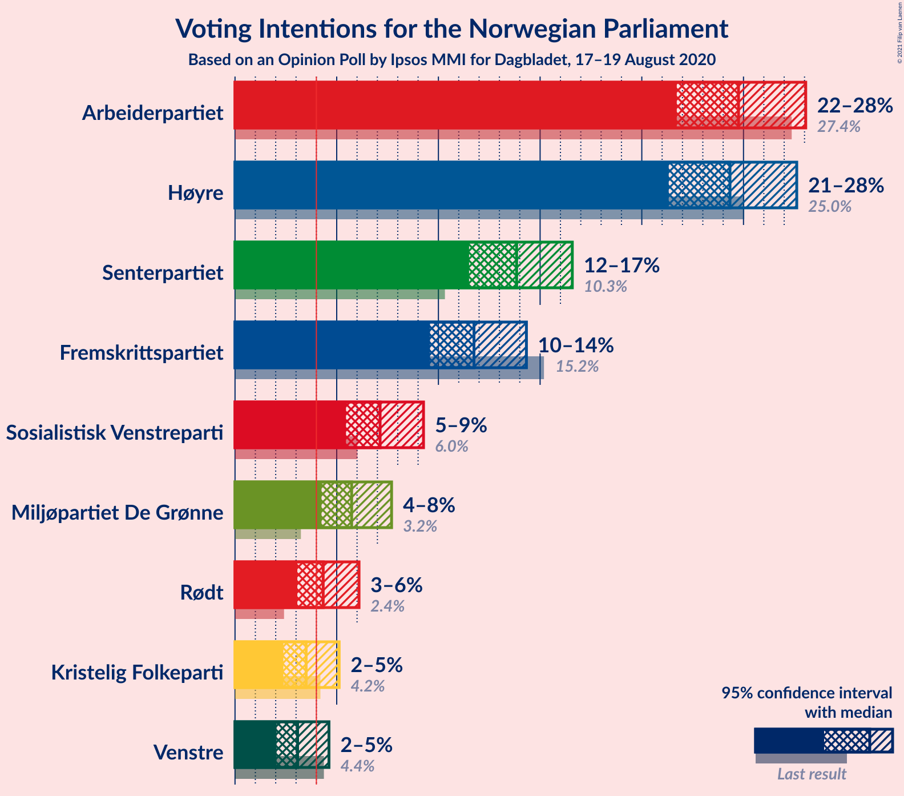

### Confidence Intervals

| Party | Last Result | Poll Result | 80% Confidence Interval | 90% Confidence Interval | 95% Confidence Interval | 99% Confidence Interval |
|:-----:|:-----------:|:-----------:|:-----------------------:|:-----------------------:|:-----------------------:|:-----------------------:|
| Arbeiderpartiet | 27.4% | 24.8% | 22.8–26.9% |22.2–27.5% |21.7–28.1% |20.8–29.1% |
| Høyre | 25.0% | 24.3% | 22.4–26.5% |21.8–27.1% |21.3–27.6% |20.4–28.7% |
| Senterpartiet | 10.3% | 13.8% | 12.3–15.6% |11.9–16.1% |11.5–16.6% |10.8–17.5% |
| Fremskrittspartiet | 15.2% | 11.7% | 10.3–13.4% |9.9–13.9% |9.6–14.3% |8.9–15.2% |
| Sosialistisk Venstreparti | 6.0% | 7.1% | 6.0–8.5% |5.7–8.9% |5.5–9.3% |5.0–10.0% |
| Miljøpartiet De Grønne | 3.2% | 5.7% | 4.8–7.0% |4.5–7.4% |4.3–7.7% |3.8–8.4% |
| Rødt | 2.4% | 4.3% | 3.5–5.5% |3.3–5.8% |3.1–6.1% |2.7–6.7% |
| Kristelig Folkeparti | 4.2% | 3.5% | 2.8–4.6% |2.5–4.8% |2.4–5.1% |2.1–5.7% |
| Venstre | 4.4% | 3.1% | 2.4–4.1% |2.2–4.4% |2.0–4.6% |1.8–5.2% |

*Note:* The poll result column reflects the actual value used in the calculations. Published results may vary slightly, and in addition be rounded to fewer digits.

## Seats

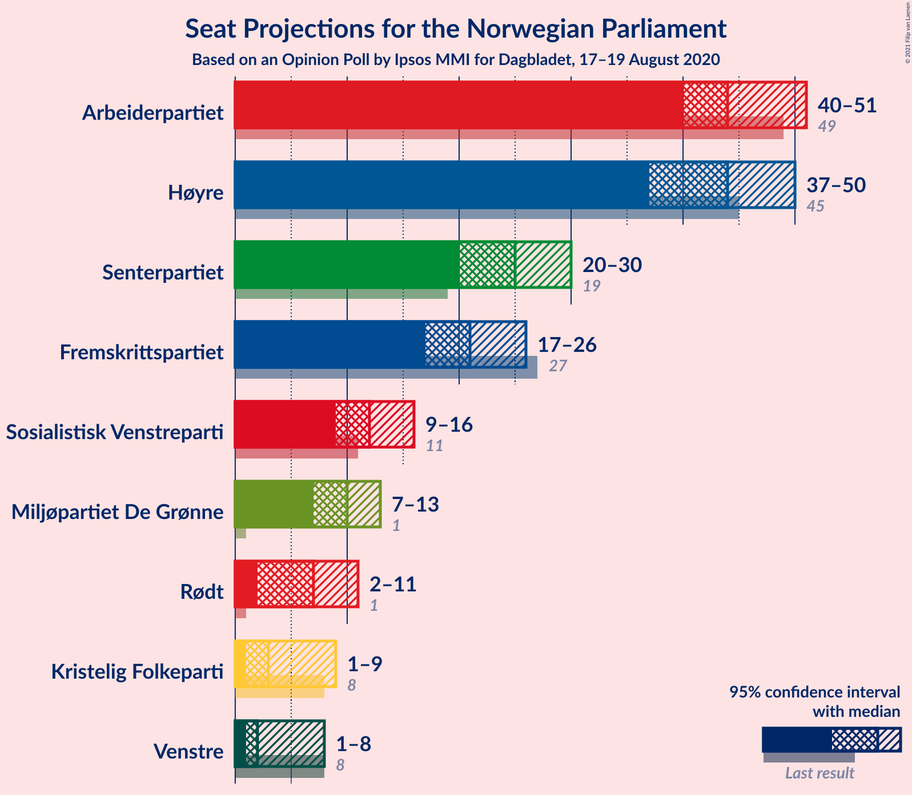

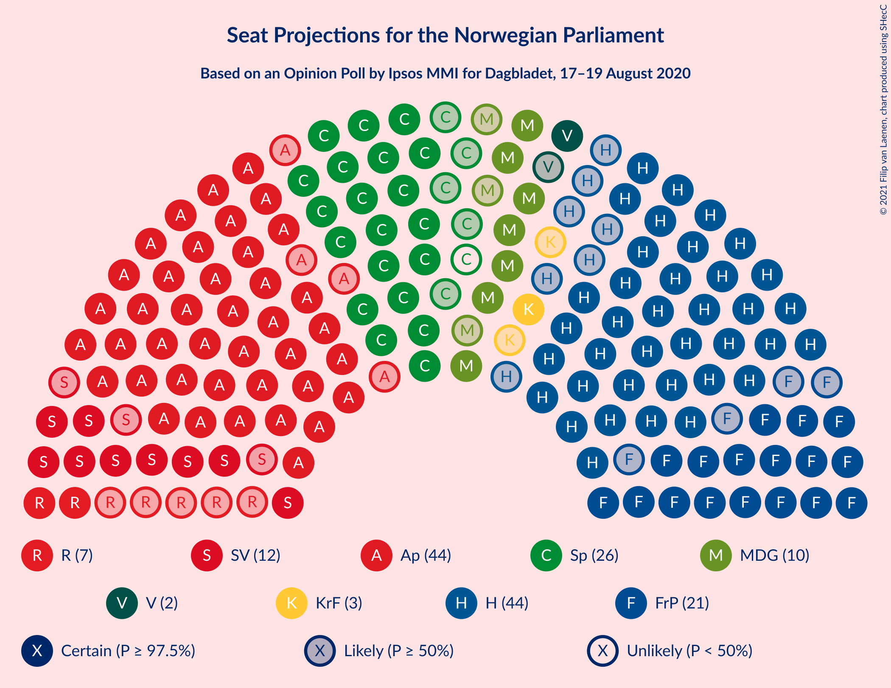

### Confidence Intervals

| Party | Last Result | Median | 80% Confidence Interval | 90% Confidence Interval | 95% Confidence Interval | 99% Confidence Interval |
|:-----:|:-----------:|:------:|:-----------------------:|:-----------------------:|:-----------------------:|:-----------------------:|
| <a href="#arbeiderpartiet">Arbeiderpartiet</a> | 49 | 44 | 41–49 |40–50 |40–51 |38–53 |
| <a href="#høyre">Høyre</a> | 45 | 44 | 39–48 |38–49 |37–50 |36–52 |
| <a href="#senterpartiet">Senterpartiet</a> | 19 | 25 | 22–28 |21–30 |20–30 |19–33 |
| <a href="#fremskrittspartiet">Fremskrittspartiet</a> | 27 | 21 | 18–25 |17–26 |17–26 |15–27 |
| <a href="#sosialistisk-venstreparti">Sosialistisk Venstreparti</a> | 11 | 12 | 10–15 |10–16 |9–16 |8–18 |
| <a href="#miljøpartiet-de-grønne">Miljøpartiet De Grønne</a> | 1 | 10 | 8–12 |8–13 |7–13 |2–15 |
| <a href="#rødt">Rødt</a> | 1 | 7 | 2–10 |2–10 |2–11 |1–12 |
| <a href="#kristelig-folkeparti">Kristelig Folkeparti</a> | 8 | 3 | 1–7 |1–8 |1–9 |0–9 |
| <a href="#venstre">Venstre</a> | 8 | 2 | 1–2 |1–7 |1–8 |0–9 |

### Arbeiderpartiet

*For a full overview of the results for this party, see the [Arbeiderpartiet](party-arbeiderpartiet.html) page.*

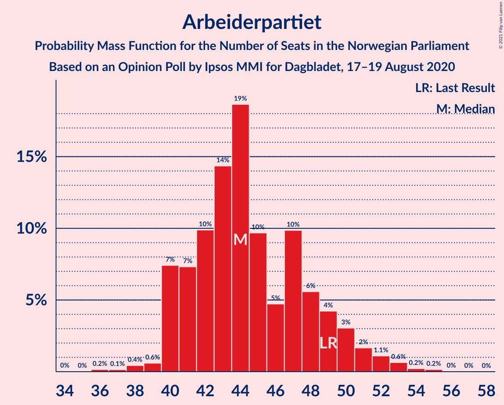

| Number of Seats | Probability | Accumulated | Special Marks |
|:---------------:|:-----------:|:-----------:|:-------------:|
| 35 | 0% | 100% |  |
| 36 | 0.2% | 99.9% |  |
| 37 | 0.1% | 99.8% |  |
| 38 | 0.4% | 99.6% |  |
| 39 | 0.6% | 99.2% |  |
| 40 | 7% | 98.6% |  |
| 41 | 7% | 91% |  |
| 42 | 10% | 84% |  |
| 43 | 14% | 74% |  |
| 44 | 19% | 60% | Median |
| 45 | 10% | 41% |  |
| 46 | 5% | 31% |  |
| 47 | 10% | 27% |  |
| 48 | 6% | 17% |  |
| 49 | 4% | 11% | Last Result |
| 50 | 3% | 7% |  |
| 51 | 2% | 4% |  |
| 52 | 1.1% | 2% |  |
| 53 | 0.6% | 1.1% |  |
| 54 | 0.2% | 0.4% |  |
| 55 | 0.2% | 0.2% |  |
| 56 | 0% | 0.1% |  |
| 57 | 0% | 0% |  |

### Høyre

*For a full overview of the results for this party, see the [Høyre](party-høyre.html) page.*

| Number of Seats | Probability | Accumulated | Special Marks |
|:---------------:|:-----------:|:-----------:|:-------------:|
| 34 | 0.1% | 100% |  |
| 35 | 0.4% | 99.9% |  |
| 36 | 1.2% | 99.5% |  |
| 37 | 3% | 98% |  |
| 38 | 3% | 95% |  |
| 39 | 5% | 92% |  |
| 40 | 7% | 87% |  |
| 41 | 9% | 80% |  |
| 42 | 9% | 71% |  |
| 43 | 10% | 62% |  |
| 44 | 10% | 52% | Median |
| 45 | 16% | 42% | Last Result |
| 46 | 4% | 26% |  |
| 47 | 10% | 22% |  |
| 48 | 4% | 11% |  |
| 49 | 3% | 7% |  |
| 50 | 3% | 4% |  |
| 51 | 0.7% | 2% |  |
| 52 | 0.6% | 0.8% |  |
| 53 | 0.1% | 0.2% |  |
| 54 | 0.1% | 0.1% |  |
| 55 | 0% | 0% |  |

### Senterpartiet

*For a full overview of the results for this party, see the [Senterpartiet](party-senterpartiet.html) page.*

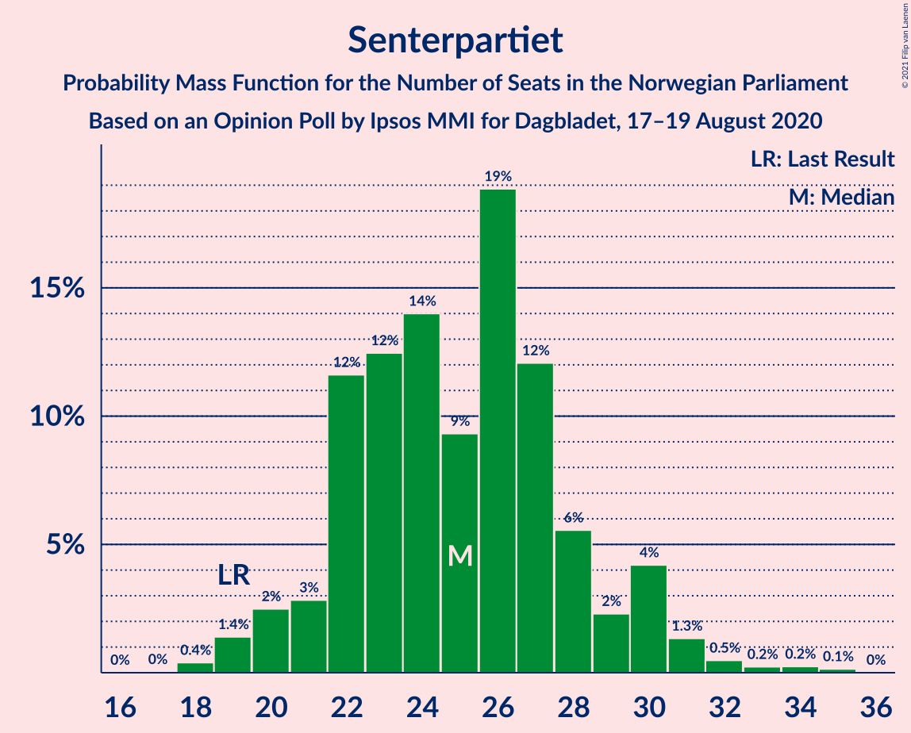

| Number of Seats | Probability | Accumulated | Special Marks |
|:---------------:|:-----------:|:-----------:|:-------------:|
| 18 | 0.4% | 100% |  |
| 19 | 1.4% | 99.6% | Last Result |
| 20 | 2% | 98% |  |
| 21 | 3% | 96% |  |
| 22 | 12% | 93% |  |
| 23 | 12% | 81% |  |
| 24 | 14% | 69% |  |
| 25 | 9% | 55% | Median |
| 26 | 19% | 45% |  |
| 27 | 12% | 27% |  |
| 28 | 6% | 15% |  |
| 29 | 2% | 9% |  |
| 30 | 4% | 7% |  |
| 31 | 1.3% | 2% |  |
| 32 | 0.5% | 1.1% |  |
| 33 | 0.2% | 0.6% |  |
| 34 | 0.2% | 0.4% |  |
| 35 | 0.1% | 0.2% |  |
| 36 | 0% | 0% |  |

### Fremskrittspartiet

*For a full overview of the results for this party, see the [Fremskrittspartiet](party-fremskrittspartiet.html) page.*

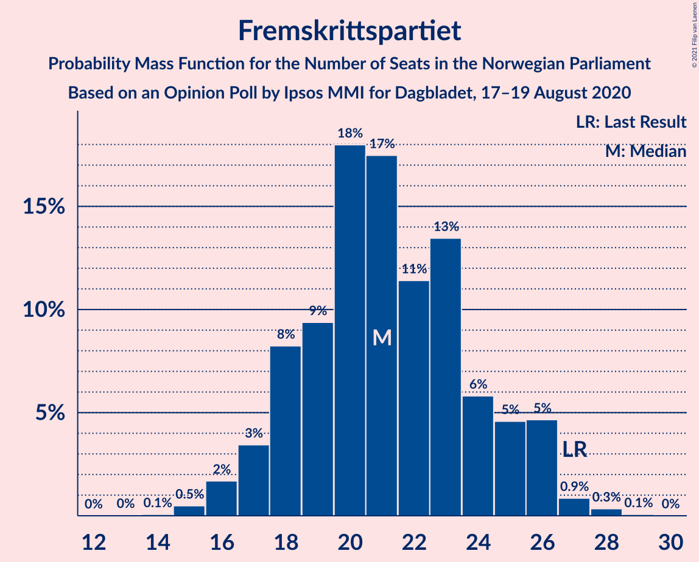

| Number of Seats | Probability | Accumulated | Special Marks |
|:---------------:|:-----------:|:-----------:|:-------------:|
| 14 | 0.1% | 100% |  |
| 15 | 0.5% | 99.9% |  |
| 16 | 2% | 99.4% |  |
| 17 | 3% | 98% |  |
| 18 | 8% | 94% |  |
| 19 | 9% | 86% |  |
| 20 | 18% | 77% |  |
| 21 | 17% | 59% | Median |
| 22 | 11% | 41% |  |
| 23 | 13% | 30% |  |
| 24 | 6% | 16% |  |
| 25 | 5% | 11% |  |
| 26 | 5% | 6% |  |
| 27 | 0.9% | 1.3% | Last Result |
| 28 | 0.3% | 0.4% |  |
| 29 | 0.1% | 0.1% |  |
| 30 | 0% | 0% |  |

### Sosialistisk Venstreparti

*For a full overview of the results for this party, see the [Sosialistisk Venstreparti](party-sosialistiskvenstreparti.html) page.*

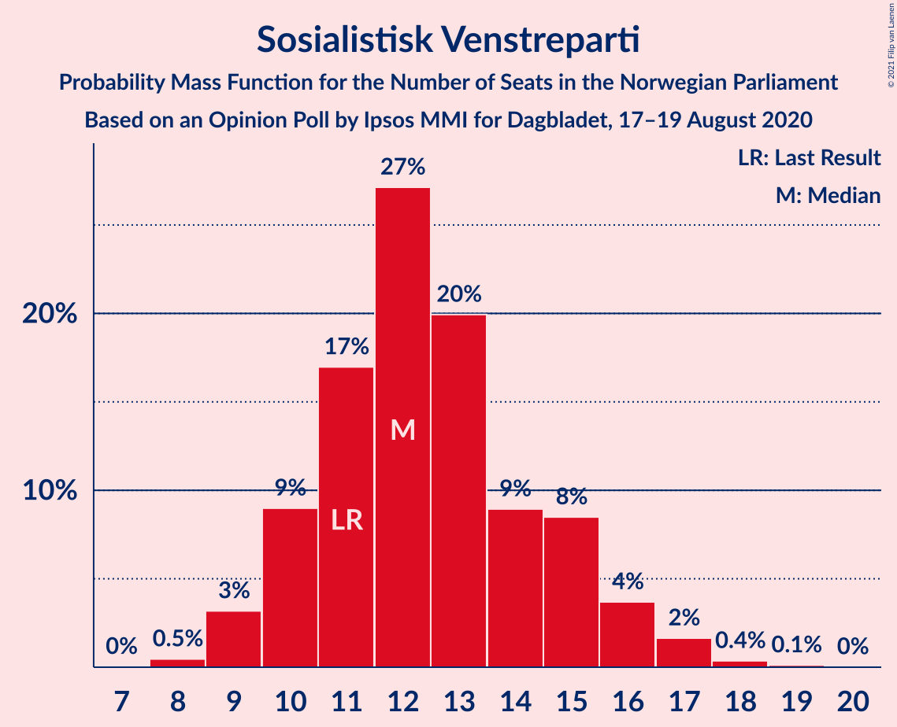

| Number of Seats | Probability | Accumulated | Special Marks |
|:---------------:|:-----------:|:-----------:|:-------------:|
| 8 | 0.5% | 100% |  |
| 9 | 3% | 99.5% |  |
| 10 | 9% | 96% |  |
| 11 | 17% | 87% | Last Result |
| 12 | 27% | 70% | Median |
| 13 | 20% | 43% |  |
| 14 | 9% | 23% |  |
| 15 | 8% | 14% |  |
| 16 | 4% | 6% |  |
| 17 | 2% | 2% |  |
| 18 | 0.4% | 0.5% |  |
| 19 | 0.1% | 0.1% |  |
| 20 | 0% | 0% |  |

### Miljøpartiet De Grønne

*For a full overview of the results for this party, see the [Miljøpartiet De Grønne](party-miljøpartietdegrønne.html) page.*

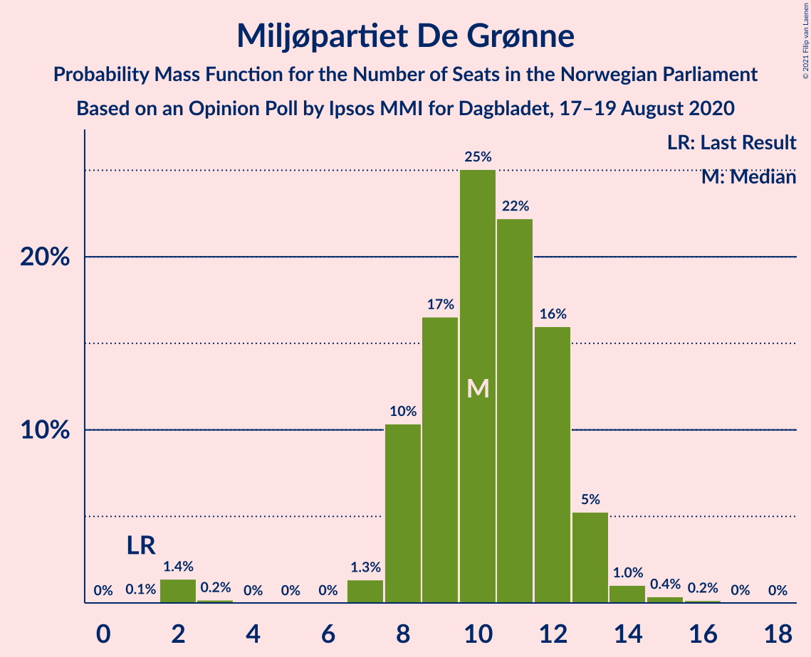

| Number of Seats | Probability | Accumulated | Special Marks |
|:---------------:|:-----------:|:-----------:|:-------------:|
| 1 | 0.1% | 100% | Last Result |
| 2 | 1.4% | 99.9% |  |
| 3 | 0.2% | 98.5% |  |
| 4 | 0% | 98% |  |
| 5 | 0% | 98% |  |
| 6 | 0% | 98% |  |
| 7 | 1.3% | 98% |  |
| 8 | 10% | 97% |  |
| 9 | 17% | 87% |  |
| 10 | 25% | 70% | Median |
| 11 | 22% | 45% |  |
| 12 | 16% | 23% |  |
| 13 | 5% | 7% |  |
| 14 | 1.0% | 2% |  |
| 15 | 0.4% | 0.5% |  |
| 16 | 0.2% | 0.2% |  |
| 17 | 0% | 0% |  |

### Rødt

*For a full overview of the results for this party, see the [Rødt](party-rødt.html) page.*

| Number of Seats | Probability | Accumulated | Special Marks |
|:---------------:|:-----------:|:-----------:|:-------------:|
| 1 | 2% | 100% | Last Result |
| 2 | 26% | 98% |  |
| 3 | 0% | 72% |  |
| 4 | 0% | 72% |  |
| 5 | 0% | 72% |  |
| 6 | 0.3% | 72% |  |
| 7 | 25% | 71% | Median |
| 8 | 20% | 46% |  |
| 9 | 16% | 26% |  |
| 10 | 6% | 11% |  |
| 11 | 3% | 4% |  |
| 12 | 0.7% | 0.9% |  |
| 13 | 0.1% | 0.1% |  |
| 14 | 0% | 0% |  |

### Kristelig Folkeparti

*For a full overview of the results for this party, see the [Kristelig Folkeparti](party-kristeligfolkeparti.html) page.*

| Number of Seats | Probability | Accumulated | Special Marks |
|:---------------:|:-----------:|:-----------:|:-------------:|
| 0 | 1.3% | 100% |  |
| 1 | 25% | 98.7% |  |
| 2 | 9% | 73% |  |
| 3 | 39% | 64% | Median |
| 4 | 0% | 25% |  |
| 5 | 0% | 25% |  |
| 6 | 0.3% | 25% |  |
| 7 | 16% | 25% |  |
| 8 | 6% | 9% | Last Result |
| 9 | 2% | 3% |  |
| 10 | 0.4% | 0.5% |  |
| 11 | 0.1% | 0.1% |  |
| 12 | 0% | 0% |  |

### Venstre

*For a full overview of the results for this party, see the [Venstre](party-venstre.html) page.*

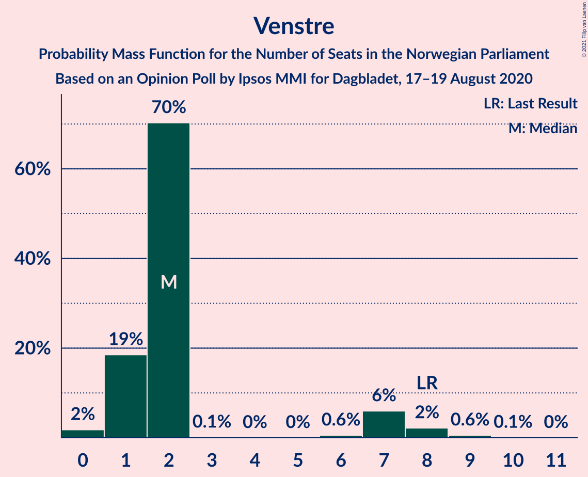

| Number of Seats | Probability | Accumulated | Special Marks |
|:---------------:|:-----------:|:-----------:|:-------------:|
| 0 | 2% | 100% |  |
| 1 | 19% | 98% |  |
| 2 | 70% | 80% | Median |
| 3 | 0.1% | 9% |  |
| 4 | 0% | 9% |  |
| 5 | 0% | 9% |  |
| 6 | 0.6% | 9% |  |
| 7 | 6% | 9% |  |
| 8 | 2% | 3% | Last Result |
| 9 | 0.6% | 0.6% |  |
| 10 | 0.1% | 0.1% |  |
| 11 | 0% | 0% |  |

## Coalitions

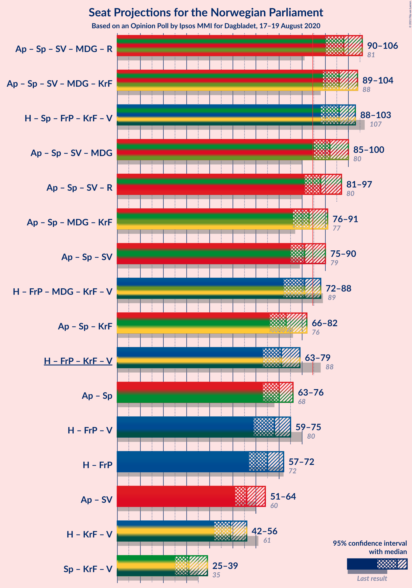

### Confidence Intervals

| Coalition | Last Result | Median | Majority? | 80% Confidence Interval | 90% Confidence Interval | 95% Confidence Interval | 99% Confidence Interval |
|:---------:|:-----------:|:------:|:---------:|:-----------------------:|:-----------------------:|:-----------------------:|:-----------------------:|
| Arbeiderpartiet – Senterpartiet – Sosialistisk Venstreparti – Miljøpartiet De Grønne – Rødt | 81 | 98 | 100% | 94–104 | 92–105 | 90–106 | 88–109 |
| Arbeiderpartiet – Senterpartiet – Sosialistisk Venstreparti – Miljøpartiet De Grønne – Kristelig Folkeparti | 88 | 96 | 99.8% | 91–101 | 89–102 | 89–104 | 87–106 |
| Høyre – Senterpartiet – Fremskrittspartiet – Kristelig Folkeparti – Venstre | 107 | 96 | 99.8% | 89–101 | 88–102 | 88–103 | 85–105 |
| Arbeiderpartiet – Senterpartiet – Sosialistisk Venstreparti – Miljøpartiet De Grønne | 80 | 92 | 98.8% | 87–97 | 86–98 | 85–100 | 82–103 |
| Arbeiderpartiet – Senterpartiet – Sosialistisk Venstreparti – Rødt | 80 | 88 | 82% | 83–94 | 82–95 | 81–97 | 78–99 |
| Arbeiderpartiet – Senterpartiet – Miljøpartiet De Grønne – Kristelig Folkeparti | 77 | 83 | 43% | 78–88 | 77–90 | 76–91 | 74–94 |
| Arbeiderpartiet – Senterpartiet – Sosialistisk Venstreparti | 79 | 81 | 25% | 77–87 | 76–88 | 75–90 | 72–93 |
| Høyre – Fremskrittspartiet – Miljøpartiet De Grønne – Kristelig Folkeparti – Venstre | 89 | 81 | 18% | 75–86 | 74–87 | 72–88 | 70–91 |
| Arbeiderpartiet – Senterpartiet – Kristelig Folkeparti | 76 | 73 | 0.4% | 68–79 | 66–80 | 66–82 | 64–84 |
| Høyre – Fremskrittspartiet – Kristelig Folkeparti – Venstre | 88 | 71 | 0% | 65–75 | 64–77 | 63–79 | 60–81 |
| Arbeiderpartiet – Senterpartiet | 68 | 70 | 0% | 65–74 | 64–75 | 63–76 | 61–80 |
| Høyre – Fremskrittspartiet – Venstre | 80 | 68 | 0% | 62–71 | 60–73 | 59–75 | 56–77 |
| Høyre – Fremskrittspartiet | 72 | 65 | 0% | 60–69 | 58–70 | 57–72 | 54–74 |
| Arbeiderpartiet – Sosialistisk Venstreparti | 60 | 56 | 0% | 54–62 | 52–63 | 51–64 | 49–66 |
| Høyre – Kristelig Folkeparti – Venstre | 61 | 49 | 0% | 44–55 | 44–55 | 42–56 | 40–60 |
| Senterpartiet – Kristelig Folkeparti – Venstre | 35 | 31 | 0% | 25–37 | 25–38 | 25–39 | 23–42 |

### Arbeiderpartiet – Senterpartiet – Sosialistisk Venstreparti – Miljøpartiet De Grønne – Rødt

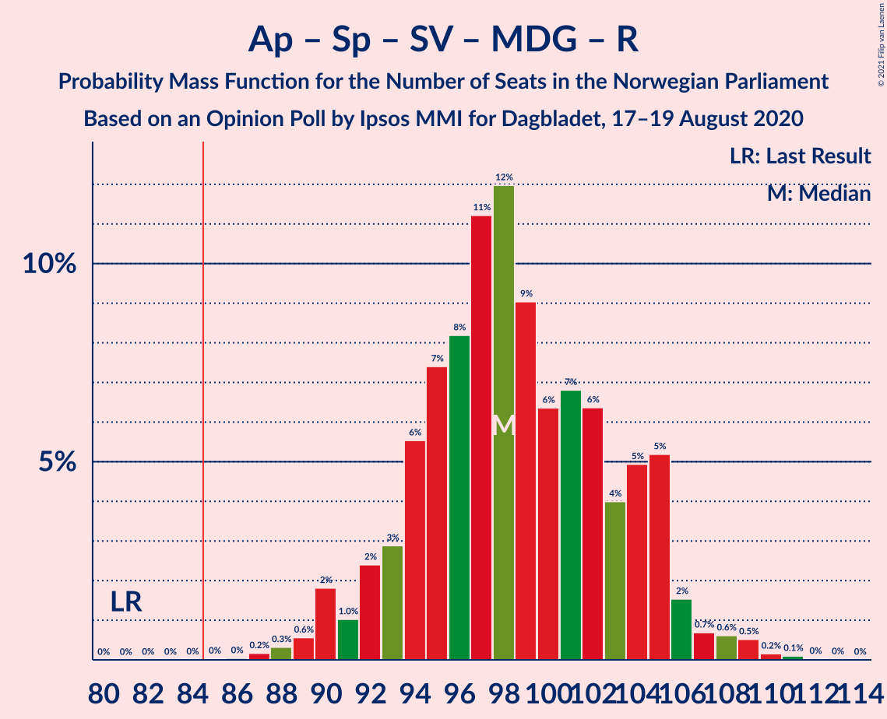

| Number of Seats | Probability | Accumulated | Special Marks |
|:---------------:|:-----------:|:-----------:|:-------------:|
| 81 | 0% | 100% | Last Result |
| 82 | 0% | 100% |  |
| 83 | 0% | 100% |  |
| 84 | 0% | 100% |  |
| 85 | 0% | 100% | Majority |
| 86 | 0% | 99.9% |  |
| 87 | 0.2% | 99.9% |  |
| 88 | 0.3% | 99.7% |  |
| 89 | 0.6% | 99.4% |  |
| 90 | 2% | 98.8% |  |
| 91 | 1.0% | 97% |  |
| 92 | 2% | 96% |  |
| 93 | 3% | 94% |  |
| 94 | 6% | 91% |  |
| 95 | 7% | 85% |  |
| 96 | 8% | 78% |  |
| 97 | 11% | 70% |  |
| 98 | 12% | 58% | Median |
| 99 | 9% | 46% |  |
| 100 | 6% | 37% |  |
| 101 | 7% | 31% |  |
| 102 | 6% | 24% |  |
| 103 | 4% | 18% |  |
| 104 | 5% | 14% |  |
| 105 | 5% | 9% |  |
| 106 | 2% | 4% |  |
| 107 | 0.7% | 2% |  |
| 108 | 0.6% | 1.4% |  |
| 109 | 0.5% | 0.8% |  |
| 110 | 0.2% | 0.3% |  |
| 111 | 0.1% | 0.2% |  |
| 112 | 0% | 0.1% |  |
| 113 | 0% | 0% |  |

### Arbeiderpartiet – Senterpartiet – Sosialistisk Venstreparti – Miljøpartiet De Grønne – Kristelig Folkeparti

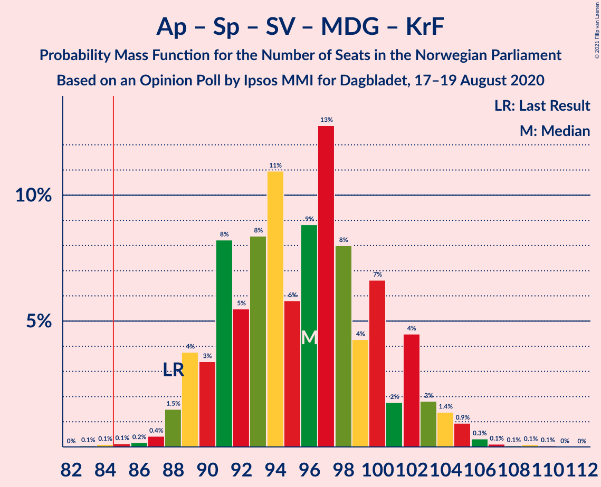

| Number of Seats | Probability | Accumulated | Special Marks |
|:---------------:|:-----------:|:-----------:|:-------------:|
| 83 | 0.1% | 100% |  |
| 84 | 0.1% | 99.9% |  |
| 85 | 0.1% | 99.8% | Majority |
| 86 | 0.2% | 99.7% |  |
| 87 | 0.4% | 99.5% |  |
| 88 | 1.5% | 99.1% | Last Result |
| 89 | 4% | 98% |  |
| 90 | 3% | 94% |  |
| 91 | 8% | 90% |  |
| 92 | 5% | 82% |  |
| 93 | 8% | 77% |  |
| 94 | 11% | 68% | Median |
| 95 | 6% | 57% |  |
| 96 | 9% | 52% |  |
| 97 | 13% | 43% |  |
| 98 | 8% | 30% |  |
| 99 | 4% | 22% |  |
| 100 | 7% | 18% |  |
| 101 | 2% | 11% |  |
| 102 | 4% | 9% |  |
| 103 | 2% | 5% |  |
| 104 | 1.4% | 3% |  |
| 105 | 0.9% | 2% |  |
| 106 | 0.3% | 0.7% |  |
| 107 | 0.1% | 0.3% |  |
| 108 | 0.1% | 0.2% |  |
| 109 | 0.1% | 0.2% |  |
| 110 | 0.1% | 0.1% |  |
| 111 | 0% | 0% |  |

### Høyre – Senterpartiet – Fremskrittspartiet – Kristelig Folkeparti – Venstre

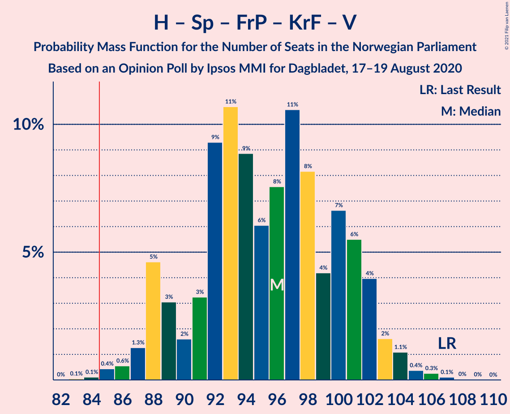

| Number of Seats | Probability | Accumulated | Special Marks |
|:---------------:|:-----------:|:-----------:|:-------------:|
| 83 | 0.1% | 100% |  |
| 84 | 0.1% | 99.9% |  |
| 85 | 0.4% | 99.8% | Majority |
| 86 | 0.6% | 99.4% |  |
| 87 | 1.3% | 98.8% |  |
| 88 | 5% | 98% |  |
| 89 | 3% | 93% |  |
| 90 | 2% | 90% |  |
| 91 | 3% | 88% |  |
| 92 | 9% | 85% |  |
| 93 | 11% | 76% |  |
| 94 | 9% | 65% |  |
| 95 | 6% | 56% | Median |
| 96 | 8% | 50% |  |
| 97 | 11% | 43% |  |
| 98 | 8% | 32% |  |
| 99 | 4% | 24% |  |
| 100 | 7% | 20% |  |
| 101 | 6% | 13% |  |
| 102 | 4% | 7% |  |
| 103 | 2% | 4% |  |
| 104 | 1.1% | 2% |  |
| 105 | 0.4% | 0.8% |  |
| 106 | 0.3% | 0.4% |  |
| 107 | 0.1% | 0.2% | Last Result |
| 108 | 0% | 0.1% |  |
| 109 | 0% | 0% |  |

### Arbeiderpartiet – Senterpartiet – Sosialistisk Venstreparti – Miljøpartiet De Grønne

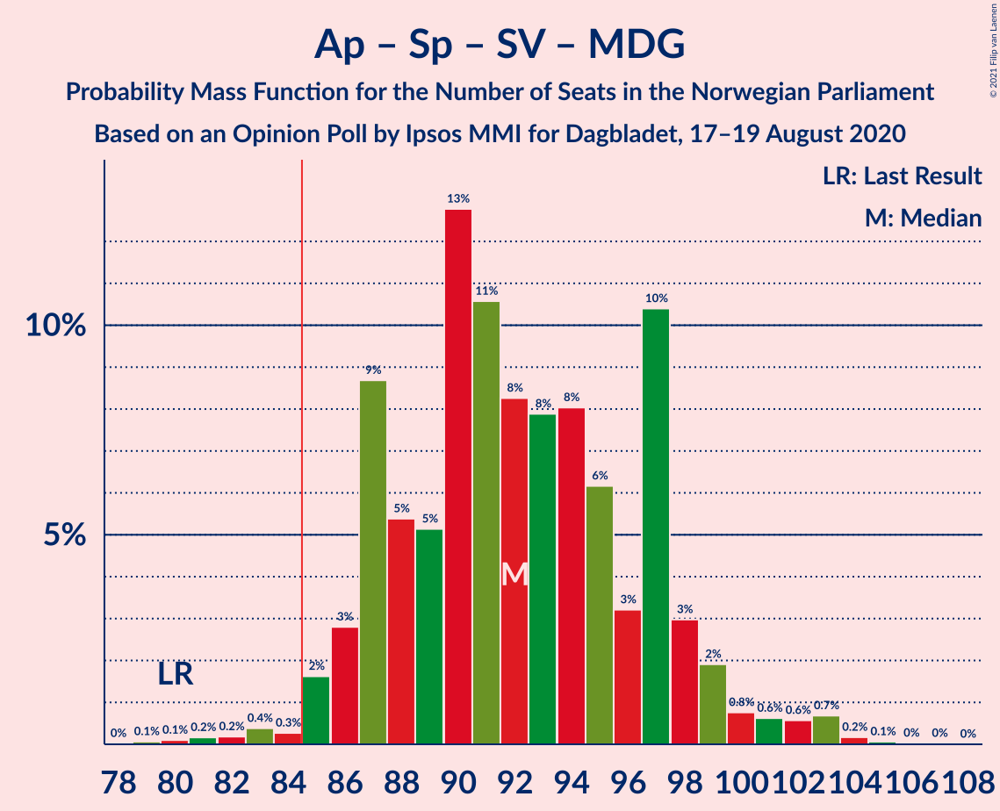

| Number of Seats | Probability | Accumulated | Special Marks |
|:---------------:|:-----------:|:-----------:|:-------------:|
| 79 | 0.1% | 100% |  |
| 80 | 0.1% | 99.9% | Last Result |
| 81 | 0.2% | 99.8% |  |
| 82 | 0.2% | 99.6% |  |
| 83 | 0.4% | 99.4% |  |
| 84 | 0.3% | 99.1% |  |
| 85 | 2% | 98.8% | Majority |
| 86 | 3% | 97% |  |
| 87 | 9% | 94% |  |
| 88 | 5% | 86% |  |
| 89 | 5% | 80% |  |
| 90 | 13% | 75% |  |
| 91 | 11% | 62% | Median |
| 92 | 8% | 52% |  |
| 93 | 8% | 44% |  |
| 94 | 8% | 36% |  |
| 95 | 6% | 28% |  |
| 96 | 3% | 21% |  |
| 97 | 10% | 18% |  |
| 98 | 3% | 8% |  |
| 99 | 2% | 5% |  |
| 100 | 0.8% | 3% |  |
| 101 | 0.6% | 2% |  |
| 102 | 0.6% | 2% |  |
| 103 | 0.7% | 1.0% |  |
| 104 | 0.2% | 0.3% |  |
| 105 | 0.1% | 0.1% |  |
| 106 | 0% | 0.1% |  |
| 107 | 0% | 0% |  |

### Arbeiderpartiet – Senterpartiet – Sosialistisk Venstreparti – Rødt

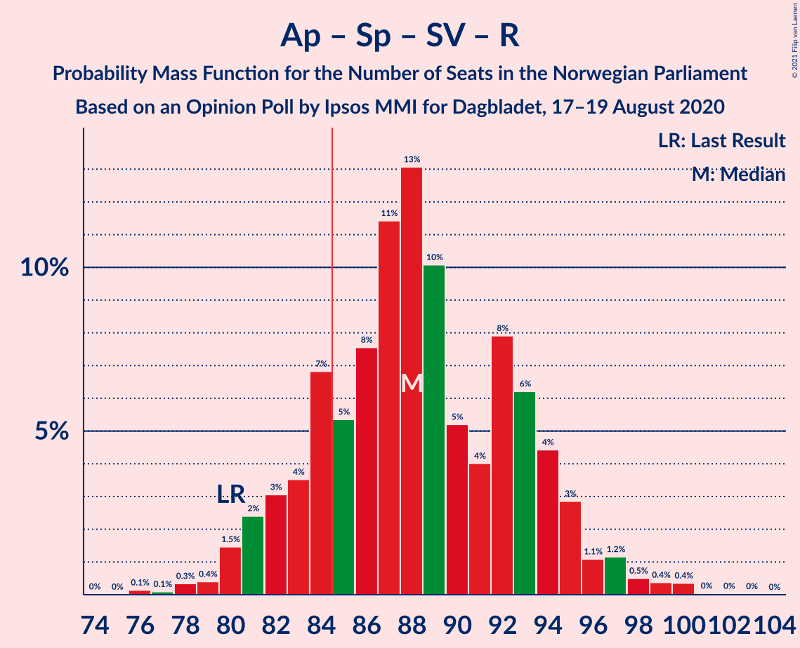

| Number of Seats | Probability | Accumulated | Special Marks |
|:---------------:|:-----------:|:-----------:|:-------------:|
| 76 | 0.1% | 100% |  |
| 77 | 0.1% | 99.8% |  |
| 78 | 0.3% | 99.7% |  |
| 79 | 0.4% | 99.4% |  |
| 80 | 1.5% | 99.0% | Last Result |
| 81 | 2% | 98% |  |
| 82 | 3% | 95% |  |
| 83 | 4% | 92% |  |
| 84 | 7% | 89% |  |
| 85 | 5% | 82% | Majority |
| 86 | 8% | 76% |  |
| 87 | 11% | 69% |  |
| 88 | 13% | 57% | Median |
| 89 | 10% | 44% |  |
| 90 | 5% | 34% |  |
| 91 | 4% | 29% |  |
| 92 | 8% | 25% |  |
| 93 | 6% | 17% |  |
| 94 | 4% | 11% |  |
| 95 | 3% | 6% |  |
| 96 | 1.1% | 4% |  |
| 97 | 1.2% | 3% |  |
| 98 | 0.5% | 1.3% |  |
| 99 | 0.4% | 0.8% |  |
| 100 | 0.4% | 0.5% |  |
| 101 | 0% | 0.1% |  |
| 102 | 0% | 0.1% |  |
| 103 | 0% | 0% |  |

### Arbeiderpartiet – Senterpartiet – Miljøpartiet De Grønne – Kristelig Folkeparti

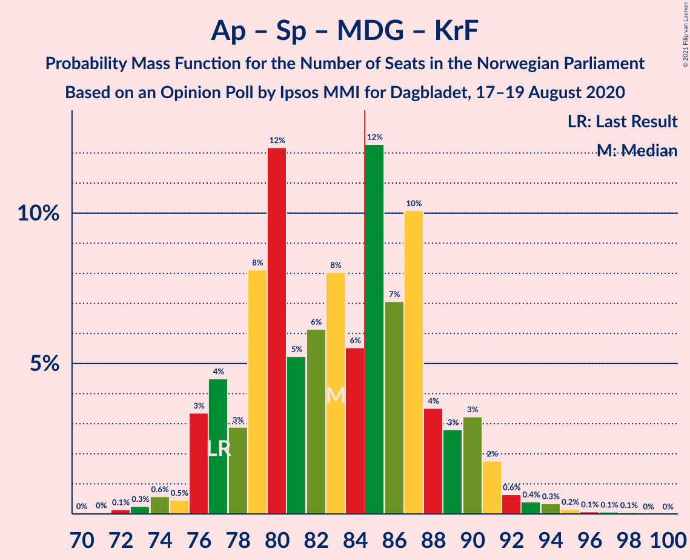

| Number of Seats | Probability | Accumulated | Special Marks |
|:---------------:|:-----------:|:-----------:|:-------------:|
| 71 | 0% | 100% |  |
| 72 | 0.1% | 99.9% |  |
| 73 | 0.3% | 99.8% |  |
| 74 | 0.6% | 99.5% |  |
| 75 | 0.5% | 98.9% |  |
| 76 | 3% | 98% |  |
| 77 | 4% | 95% | Last Result |
| 78 | 3% | 91% |  |
| 79 | 8% | 88% |  |
| 80 | 12% | 80% |  |
| 81 | 5% | 67% |  |
| 82 | 6% | 62% | Median |
| 83 | 8% | 56% |  |
| 84 | 6% | 48% |  |
| 85 | 12% | 43% | Majority |
| 86 | 7% | 30% |  |
| 87 | 10% | 23% |  |
| 88 | 4% | 13% |  |
| 89 | 3% | 10% |  |
| 90 | 3% | 7% |  |
| 91 | 2% | 4% |  |
| 92 | 0.6% | 2% |  |
| 93 | 0.4% | 1.1% |  |
| 94 | 0.3% | 0.7% |  |
| 95 | 0.2% | 0.4% |  |
| 96 | 0.1% | 0.2% |  |
| 97 | 0.1% | 0.1% |  |
| 98 | 0.1% | 0.1% |  |
| 99 | 0% | 0% |  |

### Arbeiderpartiet – Senterpartiet – Sosialistisk Venstreparti

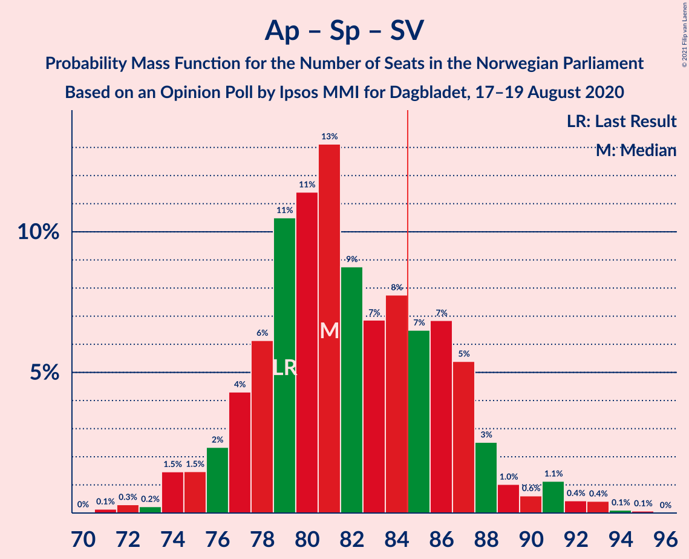

| Number of Seats | Probability | Accumulated | Special Marks |
|:---------------:|:-----------:|:-----------:|:-------------:|
| 70 | 0% | 100% |  |
| 71 | 0.1% | 99.9% |  |
| 72 | 0.3% | 99.8% |  |
| 73 | 0.2% | 99.5% |  |
| 74 | 1.5% | 99.3% |  |
| 75 | 1.5% | 98% |  |
| 76 | 2% | 96% |  |
| 77 | 4% | 94% |  |
| 78 | 6% | 90% |  |
| 79 | 11% | 84% | Last Result |
| 80 | 11% | 73% |  |
| 81 | 13% | 62% | Median |
| 82 | 9% | 48% |  |
| 83 | 7% | 40% |  |
| 84 | 8% | 33% |  |
| 85 | 7% | 25% | Majority |
| 86 | 7% | 19% |  |
| 87 | 5% | 12% |  |
| 88 | 3% | 6% |  |
| 89 | 1.0% | 4% |  |
| 90 | 0.6% | 3% |  |
| 91 | 1.1% | 2% |  |
| 92 | 0.4% | 1.1% |  |
| 93 | 0.4% | 0.6% |  |
| 94 | 0.1% | 0.2% |  |
| 95 | 0.1% | 0.1% |  |
| 96 | 0% | 0% |  |

### Høyre – Fremskrittspartiet – Miljøpartiet De Grønne – Kristelig Folkeparti – Venstre

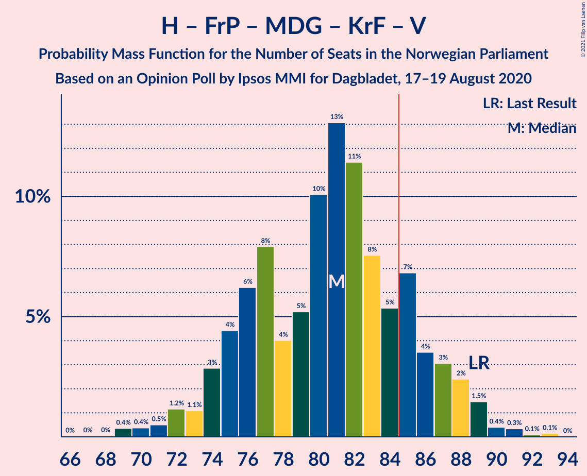

| Number of Seats | Probability | Accumulated | Special Marks |
|:---------------:|:-----------:|:-----------:|:-------------:|
| 67 | 0% | 100% |  |
| 68 | 0% | 99.9% |  |
| 69 | 0.4% | 99.9% |  |
| 70 | 0.4% | 99.5% |  |
| 71 | 0.5% | 99.2% |  |
| 72 | 1.2% | 98.6% |  |
| 73 | 1.1% | 97% |  |
| 74 | 3% | 96% |  |
| 75 | 4% | 94% |  |
| 76 | 6% | 89% |  |
| 77 | 8% | 83% |  |
| 78 | 4% | 75% |  |
| 79 | 5% | 71% |  |
| 80 | 10% | 66% | Median |
| 81 | 13% | 56% |  |
| 82 | 11% | 43% |  |
| 83 | 8% | 31% |  |
| 84 | 5% | 24% |  |
| 85 | 7% | 18% | Majority |
| 86 | 4% | 11% |  |
| 87 | 3% | 8% |  |
| 88 | 2% | 5% |  |
| 89 | 1.5% | 2% | Last Result |
| 90 | 0.4% | 1.0% |  |
| 91 | 0.3% | 0.6% |  |
| 92 | 0.1% | 0.3% |  |
| 93 | 0.1% | 0.2% |  |
| 94 | 0% | 0% |  |

### Arbeiderpartiet – Senterpartiet – Kristelig Folkeparti

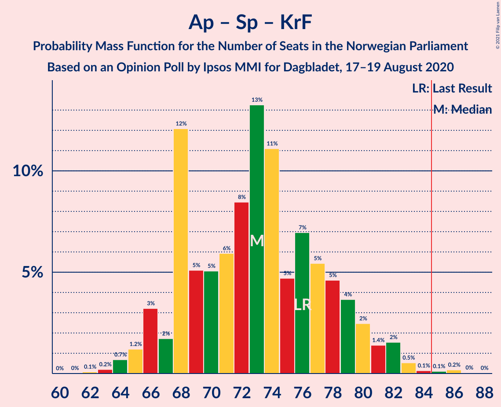

| Number of Seats | Probability | Accumulated | Special Marks |
|:---------------:|:-----------:|:-----------:|:-------------:|
| 62 | 0.1% | 100% |  |
| 63 | 0.2% | 99.9% |  |
| 64 | 0.7% | 99.7% |  |
| 65 | 1.2% | 99.0% |  |
| 66 | 3% | 98% |  |
| 67 | 2% | 95% |  |
| 68 | 12% | 93% |  |
| 69 | 5% | 81% |  |
| 70 | 5% | 76% |  |
| 71 | 6% | 71% |  |
| 72 | 8% | 65% | Median |
| 73 | 13% | 56% |  |
| 74 | 11% | 43% |  |
| 75 | 5% | 32% |  |
| 76 | 7% | 27% | Last Result |
| 77 | 5% | 20% |  |
| 78 | 5% | 15% |  |
| 79 | 4% | 10% |  |
| 80 | 2% | 6% |  |
| 81 | 1.4% | 4% |  |
| 82 | 2% | 3% |  |
| 83 | 0.5% | 1.1% |  |
| 84 | 0.1% | 0.5% |  |
| 85 | 0.1% | 0.4% | Majority |
| 86 | 0.2% | 0.3% |  |
| 87 | 0% | 0.1% |  |
| 88 | 0% | 0% |  |

### Høyre – Fremskrittspartiet – Kristelig Folkeparti – Venstre

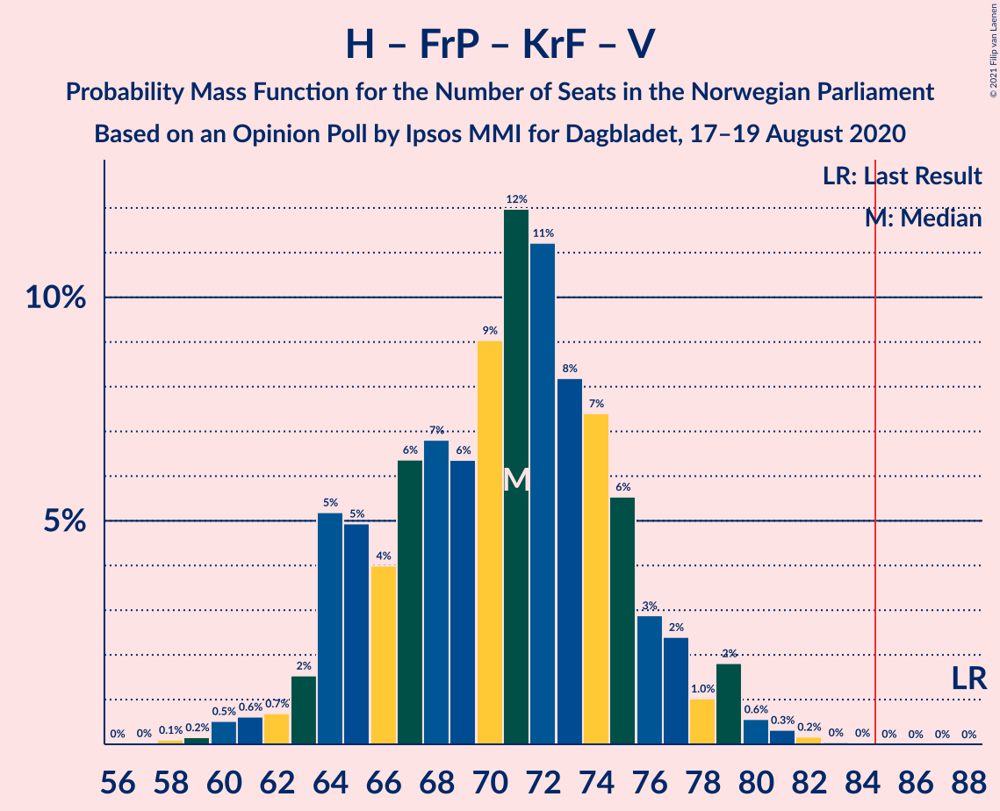

| Number of Seats | Probability | Accumulated | Special Marks |
|:---------------:|:-----------:|:-----------:|:-------------:|
| 57 | 0% | 100% |  |
| 58 | 0.1% | 99.9% |  |
| 59 | 0.2% | 99.8% |  |
| 60 | 0.5% | 99.7% |  |
| 61 | 0.6% | 99.2% |  |
| 62 | 0.7% | 98.6% |  |
| 63 | 2% | 98% |  |
| 64 | 5% | 96% |  |
| 65 | 5% | 91% |  |
| 66 | 4% | 86% |  |
| 67 | 6% | 82% |  |
| 68 | 7% | 76% |  |
| 69 | 6% | 69% |  |
| 70 | 9% | 63% | Median |
| 71 | 12% | 54% |  |
| 72 | 11% | 42% |  |
| 73 | 8% | 30% |  |
| 74 | 7% | 22% |  |
| 75 | 6% | 15% |  |
| 76 | 3% | 9% |  |
| 77 | 2% | 6% |  |
| 78 | 1.0% | 4% |  |
| 79 | 2% | 3% |  |
| 80 | 0.6% | 1.2% |  |
| 81 | 0.3% | 0.6% |  |
| 82 | 0.2% | 0.3% |  |
| 83 | 0% | 0.1% |  |
| 84 | 0% | 0.1% |  |
| 85 | 0% | 0% | Majority |
| 86 | 0% | 0% |  |
| 87 | 0% | 0% |  |
| 88 | 0% | 0% | Last Result |

### Arbeiderpartiet – Senterpartiet

| Number of Seats | Probability | Accumulated | Special Marks |
|:---------------:|:-----------:|:-----------:|:-------------:|
| 59 | 0.1% | 100% |  |
| 60 | 0.1% | 99.9% |  |
| 61 | 0.6% | 99.8% |  |
| 62 | 1.1% | 99.2% |  |
| 63 | 3% | 98% |  |
| 64 | 2% | 95% |  |
| 65 | 8% | 93% |  |
| 66 | 9% | 85% |  |
| 67 | 11% | 76% |  |
| 68 | 5% | 66% | Last Result |
| 69 | 8% | 61% | Median |
| 70 | 14% | 53% |  |
| 71 | 11% | 39% |  |
| 72 | 8% | 28% |  |
| 73 | 7% | 20% |  |
| 74 | 5% | 13% |  |
| 75 | 4% | 8% |  |
| 76 | 2% | 5% |  |
| 77 | 0.9% | 2% |  |
| 78 | 0.6% | 2% |  |
| 79 | 0.5% | 1.0% |  |
| 80 | 0.3% | 0.5% |  |
| 81 | 0.1% | 0.2% |  |
| 82 | 0% | 0.1% |  |
| 83 | 0% | 0% |  |

### Høyre – Fremskrittspartiet – Venstre

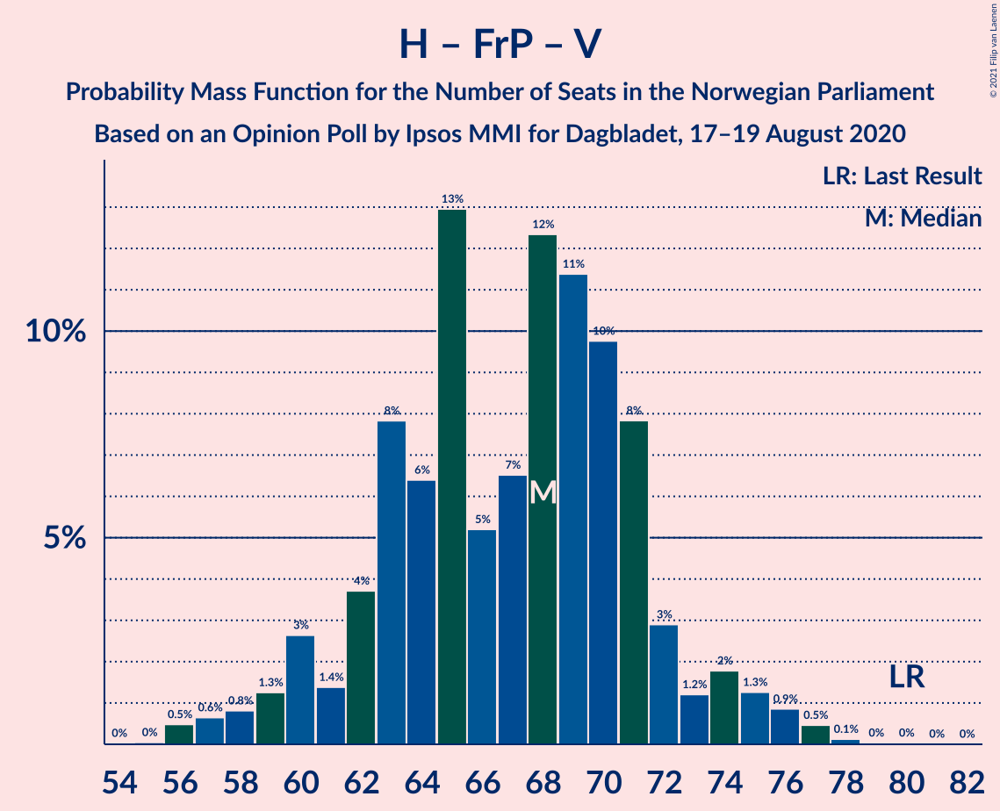

| Number of Seats | Probability | Accumulated | Special Marks |
|:---------------:|:-----------:|:-----------:|:-------------:|
| 54 | 0% | 100% |  |
| 55 | 0% | 99.9% |  |
| 56 | 0.5% | 99.9% |  |
| 57 | 0.6% | 99.4% |  |
| 58 | 0.8% | 98.7% |  |
| 59 | 1.3% | 98% |  |
| 60 | 3% | 97% |  |
| 61 | 1.4% | 94% |  |
| 62 | 4% | 93% |  |
| 63 | 8% | 89% |  |
| 64 | 6% | 81% |  |
| 65 | 13% | 75% |  |
| 66 | 5% | 62% |  |
| 67 | 7% | 57% | Median |
| 68 | 12% | 50% |  |
| 69 | 11% | 38% |  |
| 70 | 10% | 26% |  |
| 71 | 8% | 17% |  |
| 72 | 3% | 9% |  |
| 73 | 1.2% | 6% |  |
| 74 | 2% | 5% |  |
| 75 | 1.3% | 3% |  |
| 76 | 0.9% | 2% |  |
| 77 | 0.5% | 0.7% |  |
| 78 | 0.1% | 0.2% |  |
| 79 | 0% | 0.1% |  |
| 80 | 0% | 0.1% | Last Result |
| 81 | 0% | 0% |  |

### Høyre – Fremskrittspartiet

| Number of Seats | Probability | Accumulated | Special Marks |
|:---------------:|:-----------:|:-----------:|:-------------:|
| 52 | 0.1% | 100% |  |
| 53 | 0.1% | 99.9% |  |
| 54 | 0.5% | 99.8% |  |
| 55 | 0.6% | 99.3% |  |
| 56 | 1.0% | 98.7% |  |
| 57 | 1.0% | 98% |  |
| 58 | 3% | 97% |  |
| 59 | 3% | 93% |  |
| 60 | 3% | 90% |  |
| 61 | 8% | 87% |  |
| 62 | 6% | 78% |  |
| 63 | 12% | 72% |  |
| 64 | 6% | 60% |  |
| 65 | 6% | 53% | Median |
| 66 | 11% | 47% |  |
| 67 | 10% | 36% |  |
| 68 | 11% | 26% |  |
| 69 | 7% | 15% |  |
| 70 | 3% | 8% |  |
| 71 | 1.2% | 5% |  |
| 72 | 2% | 4% | Last Result |
| 73 | 1.0% | 2% |  |
| 74 | 0.6% | 1.0% |  |
| 75 | 0.3% | 0.4% |  |
| 76 | 0% | 0% |  |

### Arbeiderpartiet – Sosialistisk Venstreparti

| Number of Seats | Probability | Accumulated | Special Marks |
|:---------------:|:-----------:|:-----------:|:-------------:|
| 47 | 0% | 100% |  |
| 48 | 0.2% | 99.9% |  |
| 49 | 0.4% | 99.8% |  |
| 50 | 0.9% | 99.3% |  |
| 51 | 2% | 98% |  |
| 52 | 3% | 96% |  |
| 53 | 3% | 93% |  |
| 54 | 13% | 90% |  |
| 55 | 15% | 77% |  |
| 56 | 12% | 62% | Median |
| 57 | 12% | 50% |  |
| 58 | 11% | 38% |  |
| 59 | 6% | 27% |  |
| 60 | 5% | 21% | Last Result |
| 61 | 5% | 16% |  |
| 62 | 4% | 10% |  |
| 63 | 3% | 6% |  |
| 64 | 1.0% | 3% |  |
| 65 | 1.0% | 2% |  |
| 66 | 0.4% | 0.8% |  |
| 67 | 0.2% | 0.4% |  |
| 68 | 0.1% | 0.2% |  |
| 69 | 0.1% | 0.1% |  |
| 70 | 0% | 0% |  |

### Høyre – Kristelig Folkeparti – Venstre

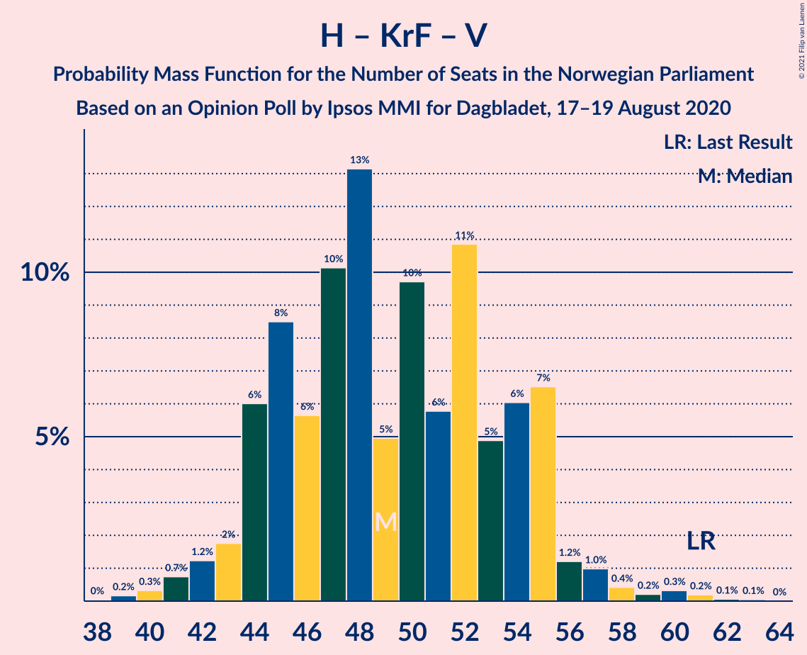

| Number of Seats | Probability | Accumulated | Special Marks |
|:---------------:|:-----------:|:-----------:|:-------------:|
| 38 | 0% | 100% |  |
| 39 | 0.2% | 99.9% |  |
| 40 | 0.3% | 99.8% |  |
| 41 | 0.7% | 99.4% |  |
| 42 | 1.2% | 98.7% |  |
| 43 | 2% | 97% |  |
| 44 | 6% | 96% |  |
| 45 | 8% | 90% |  |
| 46 | 6% | 81% |  |
| 47 | 10% | 76% |  |
| 48 | 13% | 65% |  |
| 49 | 5% | 52% | Median |
| 50 | 10% | 47% |  |
| 51 | 6% | 38% |  |
| 52 | 11% | 32% |  |
| 53 | 5% | 21% |  |
| 54 | 6% | 16% |  |
| 55 | 7% | 10% |  |
| 56 | 1.2% | 3% |  |
| 57 | 1.0% | 2% |  |
| 58 | 0.4% | 1.3% |  |
| 59 | 0.2% | 0.9% |  |
| 60 | 0.3% | 0.7% |  |
| 61 | 0.2% | 0.3% | Last Result |
| 62 | 0.1% | 0.1% |  |
| 63 | 0.1% | 0.1% |  |
| 64 | 0% | 0% |  |

### Senterpartiet – Kristelig Folkeparti – Venstre

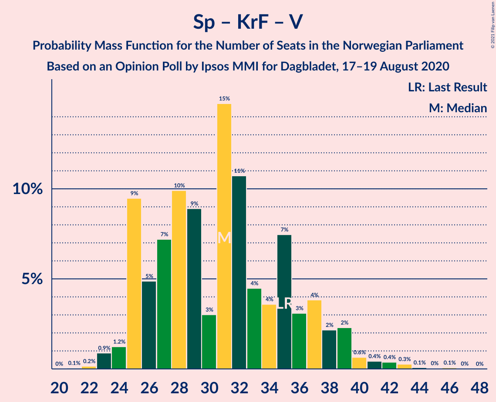

| Number of Seats | Probability | Accumulated | Special Marks |
|:---------------:|:-----------:|:-----------:|:-------------:|
| 21 | 0.1% | 100% |  |
| 22 | 0.2% | 99.9% |  |
| 23 | 0.9% | 99.8% |  |
| 24 | 1.2% | 98.9% |  |
| 25 | 9% | 98% |  |
| 26 | 5% | 88% |  |
| 27 | 7% | 83% |  |
| 28 | 10% | 76% |  |
| 29 | 9% | 66% |  |
| 30 | 3% | 57% | Median |
| 31 | 15% | 54% |  |
| 32 | 11% | 40% |  |
| 33 | 4% | 29% |  |
| 34 | 4% | 24% |  |
| 35 | 7% | 21% | Last Result |
| 36 | 3% | 13% |  |
| 37 | 4% | 10% |  |
| 38 | 2% | 6% |  |
| 39 | 2% | 4% |  |
| 40 | 0.6% | 2% |  |
| 41 | 0.4% | 1.3% |  |
| 42 | 0.4% | 0.8% |  |
| 43 | 0.3% | 0.5% |  |
| 44 | 0.1% | 0.2% |  |
| 45 | 0% | 0.1% |  |
| 46 | 0.1% | 0.1% |  |
| 47 | 0% | 0% |  |

## Technical Information

### Opinion Poll

+ **Polling firm:** Ipsos MMI
+ **Commissioner(s):** Dagbladet
+ **Fieldwork period:** 17–19 August 2020

### Calculations

+ **Sample size:** 715
+ **Simulations done:** 1,048,576
+ **Error estimate:** 1.80%

