# Opinion Poll by Norstat for Aftenposten and NRK, 17–23 August 2020

<a href="#voting-intentions">Voting Intentions</a> | <a href="#seats">Seats</a> | <a href="#coalitions">Coalitions</a> | <a href="#technical-information">Technical Information</a>

## Voting Intentions

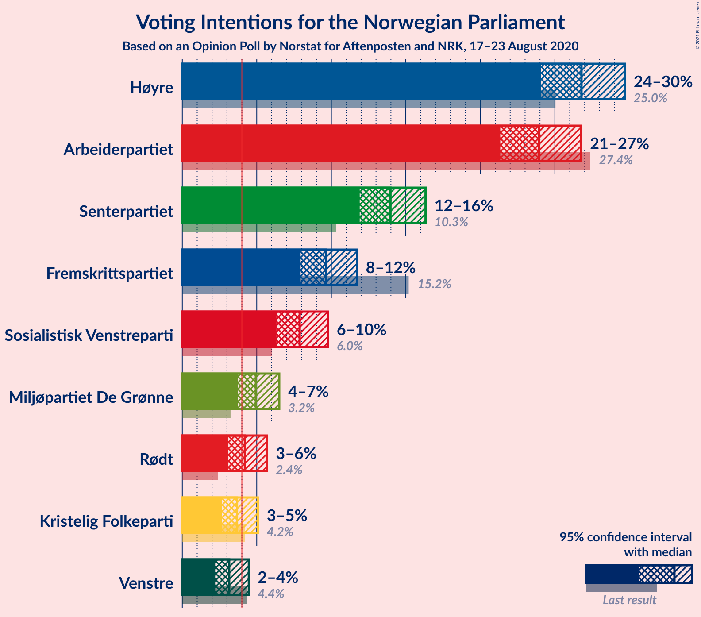

### Confidence Intervals

| Party | Last Result | Poll Result | 80% Confidence Interval | 90% Confidence Interval | 95% Confidence Interval | 99% Confidence Interval |
|:-----:|:-----------:|:-----------:|:-----------------------:|:-----------------------:|:-----------------------:|:-----------------------:|
| Høyre | 25.0% | 26.8% | 25.0–28.7% |24.5–29.2% |24.1–29.7% |23.2–30.6% |
| Arbeiderpartiet | 27.4% | 23.9% | 22.2–25.8% |21.7–26.3% |21.3–26.8% |20.5–27.7% |
| Senterpartiet | 10.3% | 14.0% | 12.6–15.5% |12.2–15.9% |11.9–16.3% |11.3–17.1% |
| Fremskrittspartiet | 15.2% | 9.7% | 8.5–11.0% |8.2–11.4% |7.9–11.7% |7.4–12.4% |
| Sosialistisk Venstreparti | 6.0% | 7.9% | 6.9–9.1% |6.6–9.5% |6.3–9.8% |5.9–10.4% |
| Miljøpartiet De Grønne | 3.2% | 4.9% | 4.1–6.0% |3.9–6.2% |3.7–6.5% |3.4–7.0% |
| Rødt | 2.4% | 4.2% | 3.5–5.2% |3.3–5.4% |3.1–5.7% |2.8–6.2% |
| Kristelig Folkeparti | 4.2% | 3.7% | 3.0–4.6% |2.8–4.8% |2.7–5.1% |2.4–5.5% |
| Venstre | 4.4% | 3.2% | 2.5–4.0% |2.4–4.3% |2.2–4.5% |2.0–4.9% |

*Note:* The poll result column reflects the actual value used in the calculations. Published results may vary slightly, and in addition be rounded to fewer digits.

## Seats

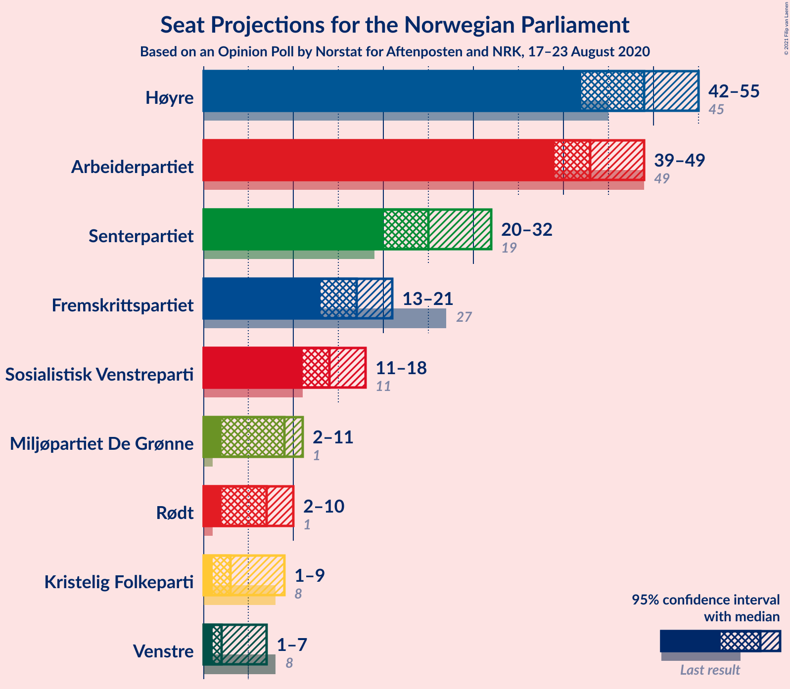

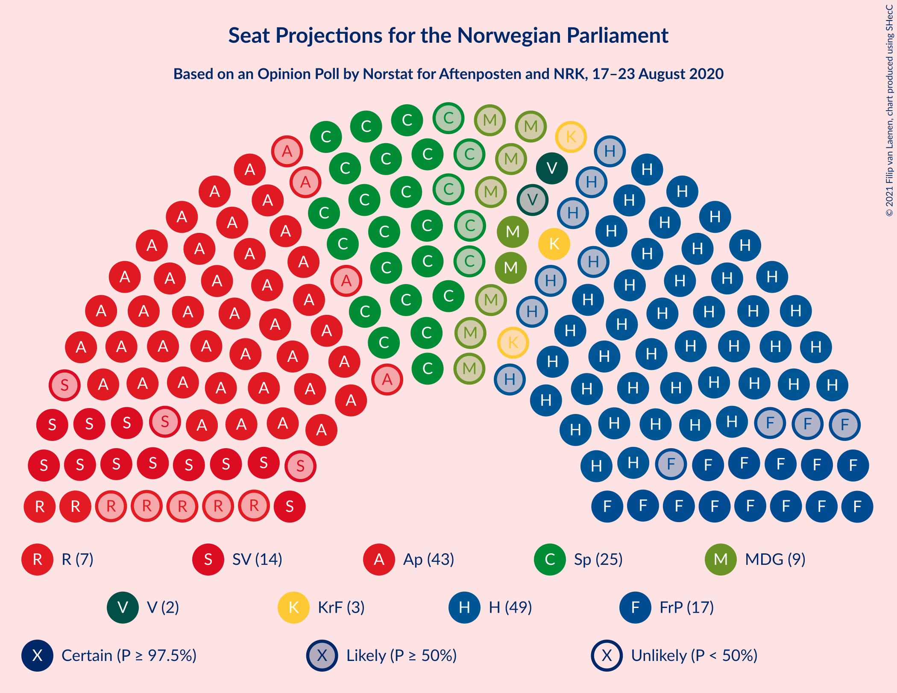

### Confidence Intervals

| Party | Last Result | Median | 80% Confidence Interval | 90% Confidence Interval | 95% Confidence Interval | 99% Confidence Interval |
|:-----:|:-----------:|:------:|:-----------------------:|:-----------------------:|:-----------------------:|:-----------------------:|
| <a href="#høyre">Høyre</a> | 45 | 49 | 44–53 |43–54 |42–55 |40–56 |
| <a href="#arbeiderpartiet">Arbeiderpartiet</a> | 49 | 43 | 40–47 |40–48 |39–49 |38–51 |
| <a href="#senterpartiet">Senterpartiet</a> | 19 | 25 | 21–30 |21–31 |20–32 |19–33 |
| <a href="#fremskrittspartiet">Fremskrittspartiet</a> | 27 | 17 | 15–20 |14–20 |13–21 |12–23 |
| <a href="#sosialistisk-venstreparti">Sosialistisk Venstreparti</a> | 11 | 14 | 12–16 |11–17 |11–18 |10–19 |
| <a href="#miljøpartiet-de-grønne">Miljøpartiet De Grønne</a> | 1 | 9 | 7–10 |2–11 |2–11 |1–12 |
| <a href="#rødt">Rødt</a> | 1 | 7 | 2–9 |2–9 |2–10 |1–11 |
| <a href="#kristelig-folkeparti">Kristelig Folkeparti</a> | 8 | 3 | 1–8 |1–8 |1–9 |1–9 |
| <a href="#venstre">Venstre</a> | 8 | 2 | 1–2 |1–7 |1–7 |0–8 |

### Høyre

*For a full overview of the results for this party, see the [Høyre](party-høyre.html) page.*

| Number of Seats | Probability | Accumulated | Special Marks |
|:---------------:|:-----------:|:-----------:|:-------------:|
| 38 | 0.1% | 100% |  |
| 39 | 0.2% | 99.9% |  |
| 40 | 0.3% | 99.6% |  |
| 41 | 2% | 99.3% |  |
| 42 | 3% | 98% |  |
| 43 | 4% | 95% |  |
| 44 | 5% | 91% |  |
| 45 | 4% | 86% | Last Result |
| 46 | 9% | 82% |  |
| 47 | 11% | 73% |  |
| 48 | 7% | 62% |  |
| 49 | 14% | 55% | Median |
| 50 | 12% | 42% |  |
| 51 | 13% | 30% |  |
| 52 | 5% | 16% |  |
| 53 | 4% | 11% |  |
| 54 | 4% | 7% |  |
| 55 | 2% | 3% |  |
| 56 | 0.5% | 0.9% |  |
| 57 | 0.3% | 0.4% |  |
| 58 | 0% | 0.1% |  |
| 59 | 0% | 0.1% |  |
| 60 | 0% | 0% |  |

### Arbeiderpartiet

*For a full overview of the results for this party, see the [Arbeiderpartiet](party-arbeiderpartiet.html) page.*

| Number of Seats | Probability | Accumulated | Special Marks |
|:---------------:|:-----------:|:-----------:|:-------------:|
| 35 | 0.1% | 100% |  |
| 36 | 0.1% | 99.9% |  |
| 37 | 0.3% | 99.8% |  |
| 38 | 1.0% | 99.5% |  |
| 39 | 2% | 98.6% |  |
| 40 | 12% | 96% |  |
| 41 | 14% | 84% |  |
| 42 | 14% | 71% |  |
| 43 | 8% | 57% | Median |
| 44 | 12% | 48% |  |
| 45 | 16% | 36% |  |
| 46 | 8% | 21% |  |
| 47 | 8% | 13% |  |
| 48 | 2% | 5% |  |
| 49 | 2% | 3% | Last Result |
| 50 | 1.0% | 2% |  |
| 51 | 0.5% | 0.8% |  |
| 52 | 0.2% | 0.3% |  |
| 53 | 0.1% | 0.1% |  |
| 54 | 0% | 0.1% |  |
| 55 | 0% | 0% |  |

### Senterpartiet

*For a full overview of the results for this party, see the [Senterpartiet](party-senterpartiet.html) page.*

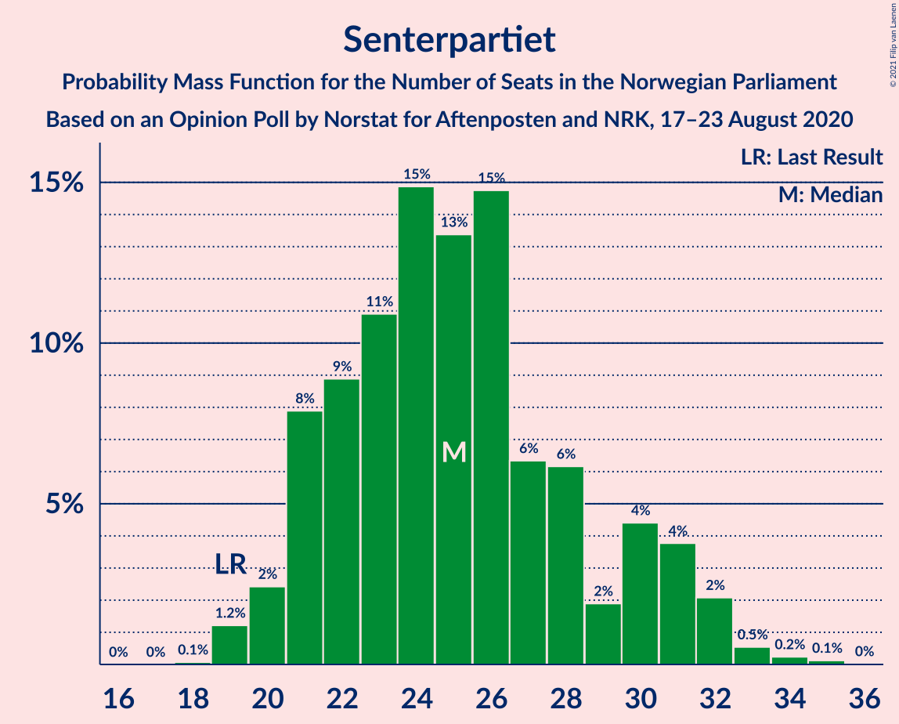

| Number of Seats | Probability | Accumulated | Special Marks |
|:---------------:|:-----------:|:-----------:|:-------------:|
| 18 | 0.1% | 100% |  |
| 19 | 1.2% | 99.9% | Last Result |
| 20 | 2% | 98.7% |  |
| 21 | 8% | 96% |  |
| 22 | 9% | 88% |  |
| 23 | 11% | 80% |  |
| 24 | 15% | 69% |  |
| 25 | 13% | 54% | Median |
| 26 | 15% | 40% |  |
| 27 | 6% | 26% |  |
| 28 | 6% | 19% |  |
| 29 | 2% | 13% |  |
| 30 | 4% | 11% |  |
| 31 | 4% | 7% |  |
| 32 | 2% | 3% |  |
| 33 | 0.5% | 0.9% |  |
| 34 | 0.2% | 0.4% |  |
| 35 | 0.1% | 0.2% |  |
| 36 | 0% | 0% |  |

### Fremskrittspartiet

*For a full overview of the results for this party, see the [Fremskrittspartiet](party-fremskrittspartiet.html) page.*

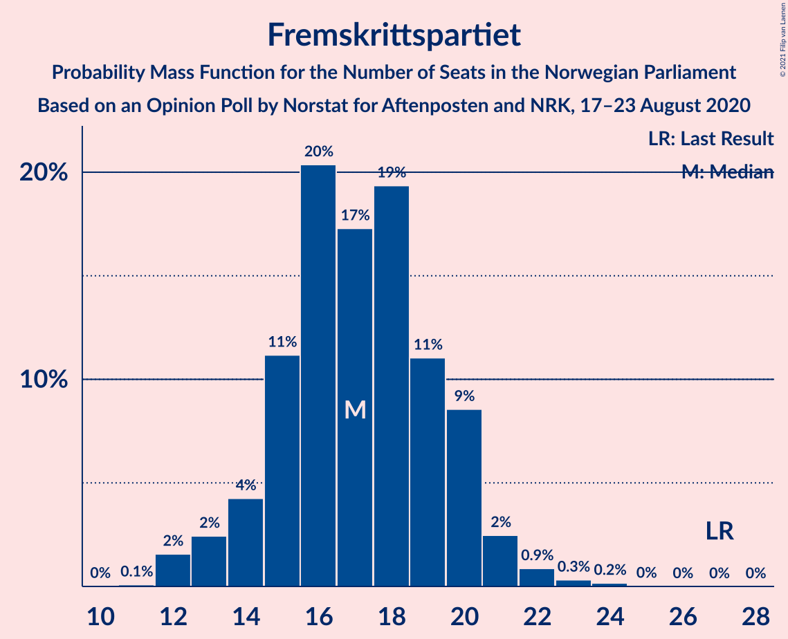

| Number of Seats | Probability | Accumulated | Special Marks |
|:---------------:|:-----------:|:-----------:|:-------------:|
| 11 | 0.1% | 100% |  |
| 12 | 2% | 99.9% |  |
| 13 | 2% | 98% |  |
| 14 | 4% | 96% |  |
| 15 | 11% | 92% |  |
| 16 | 20% | 80% |  |
| 17 | 17% | 60% | Median |
| 18 | 19% | 43% |  |
| 19 | 11% | 23% |  |
| 20 | 9% | 12% |  |
| 21 | 2% | 4% |  |
| 22 | 0.9% | 1.4% |  |
| 23 | 0.3% | 0.5% |  |
| 24 | 0.2% | 0.2% |  |
| 25 | 0% | 0% |  |
| 26 | 0% | 0% |  |
| 27 | 0% | 0% | Last Result |

### Sosialistisk Venstreparti

*For a full overview of the results for this party, see the [Sosialistisk Venstreparti](party-sosialistiskvenstreparti.html) page.*

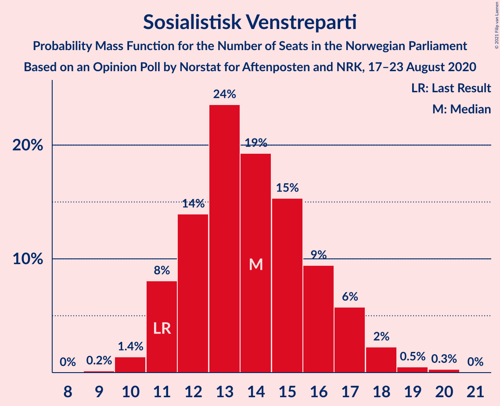

| Number of Seats | Probability | Accumulated | Special Marks |
|:---------------:|:-----------:|:-----------:|:-------------:|
| 9 | 0.2% | 100% |  |
| 10 | 1.4% | 99.8% |  |
| 11 | 8% | 98% | Last Result |
| 12 | 14% | 90% |  |
| 13 | 24% | 76% |  |
| 14 | 19% | 53% | Median |
| 15 | 15% | 34% |  |
| 16 | 9% | 18% |  |
| 17 | 6% | 9% |  |
| 18 | 2% | 3% |  |
| 19 | 0.5% | 0.8% |  |
| 20 | 0.3% | 0.3% |  |
| 21 | 0% | 0% |  |

### Miljøpartiet De Grønne

*For a full overview of the results for this party, see the [Miljøpartiet De Grønne](party-miljøpartietdegrønne.html) page.*

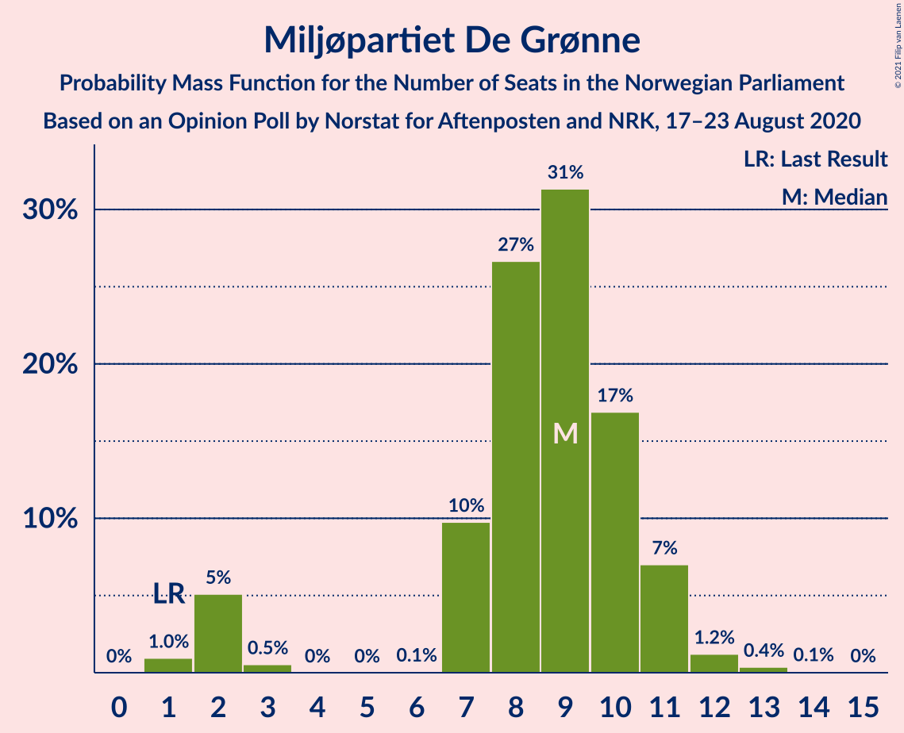

| Number of Seats | Probability | Accumulated | Special Marks |
|:---------------:|:-----------:|:-----------:|:-------------:|
| 1 | 1.0% | 100% | Last Result |
| 2 | 5% | 99.0% |  |
| 3 | 0.5% | 94% |  |
| 4 | 0% | 93% |  |
| 5 | 0% | 93% |  |
| 6 | 0.1% | 93% |  |
| 7 | 10% | 93% |  |
| 8 | 27% | 84% |  |
| 9 | 31% | 57% | Median |
| 10 | 17% | 26% |  |
| 11 | 7% | 9% |  |
| 12 | 1.2% | 2% |  |
| 13 | 0.4% | 0.5% |  |
| 14 | 0.1% | 0.1% |  |
| 15 | 0% | 0% |  |

### Rødt

*For a full overview of the results for this party, see the [Rødt](party-rødt.html) page.*

| Number of Seats | Probability | Accumulated | Special Marks |
|:---------------:|:-----------:|:-----------:|:-------------:|
| 1 | 2% | 100% | Last Result |
| 2 | 30% | 98% |  |
| 3 | 0% | 67% |  |
| 4 | 0% | 67% |  |
| 5 | 0% | 67% |  |
| 6 | 0.4% | 67% |  |
| 7 | 22% | 67% | Median |
| 8 | 26% | 45% |  |
| 9 | 16% | 20% |  |
| 10 | 3% | 4% |  |
| 11 | 0.7% | 0.7% |  |
| 12 | 0.1% | 0.1% |  |
| 13 | 0% | 0% |  |

### Kristelig Folkeparti

*For a full overview of the results for this party, see the [Kristelig Folkeparti](party-kristeligfolkeparti.html) page.*

| Number of Seats | Probability | Accumulated | Special Marks |
|:---------------:|:-----------:|:-----------:|:-------------:|
| 0 | 0.5% | 100% |  |
| 1 | 10% | 99.5% |  |
| 2 | 10% | 90% |  |
| 3 | 42% | 80% | Median |
| 4 | 0% | 38% |  |
| 5 | 0% | 38% |  |
| 6 | 2% | 38% |  |
| 7 | 16% | 35% |  |
| 8 | 16% | 19% | Last Result |
| 9 | 3% | 3% |  |
| 10 | 0.4% | 0.5% |  |
| 11 | 0% | 0% |  |

### Venstre

*For a full overview of the results for this party, see the [Venstre](party-venstre.html) page.*

| Number of Seats | Probability | Accumulated | Special Marks |
|:---------------:|:-----------:|:-----------:|:-------------:|
| 0 | 0.7% | 100% |  |
| 1 | 21% | 99.3% |  |
| 2 | 70% | 79% | Median |
| 3 | 0.1% | 9% |  |
| 4 | 0% | 9% |  |
| 5 | 0% | 9% |  |
| 6 | 1.2% | 9% |  |
| 7 | 5% | 8% |  |
| 8 | 2% | 2% | Last Result |
| 9 | 0.3% | 0.3% |  |
| 10 | 0% | 0% |  |

## Coalitions

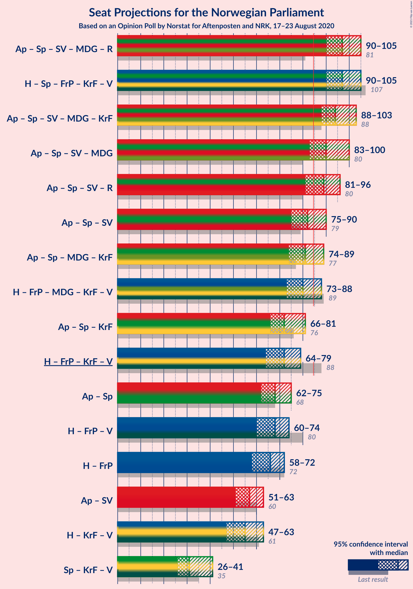

### Confidence Intervals

| Coalition | Last Result | Median | Majority? | 80% Confidence Interval | 90% Confidence Interval | 95% Confidence Interval | 99% Confidence Interval |
|:---------:|:-----------:|:------:|:---------:|:-----------------------:|:-----------------------:|:-----------------------:|:-----------------------:|
| Arbeiderpartiet – Senterpartiet – Sosialistisk Venstreparti – Miljøpartiet De Grønne – Rødt | 81 | 97 | 100% | 92–102 | 91–103 | 90–105 | 88–107 |
| Høyre – Senterpartiet – Fremskrittspartiet – Kristelig Folkeparti – Venstre | 107 | 97 | 100% | 93–102 | 92–103 | 90–105 | 89–107 |
| Arbeiderpartiet – Senterpartiet – Sosialistisk Venstreparti – Miljøpartiet De Grønne – Kristelig Folkeparti | 88 | 94 | 99.7% | 90–102 | 89–103 | 88–103 | 85–105 |
| Arbeiderpartiet – Senterpartiet – Sosialistisk Venstreparti – Miljøpartiet De Grønne | 80 | 90 | 95% | 86–97 | 85–99 | 83–100 | 82–102 |
| Arbeiderpartiet – Senterpartiet – Sosialistisk Venstreparti – Rødt | 80 | 89 | 82% | 83–93 | 83–95 | 81–96 | 79–99 |
| Arbeiderpartiet – Senterpartiet – Sosialistisk Venstreparti | 79 | 82 | 25% | 77–88 | 76–90 | 75–90 | 74–93 |
| Arbeiderpartiet – Senterpartiet – Miljøpartiet De Grønne – Kristelig Folkeparti | 77 | 81 | 24% | 76–87 | 76–88 | 74–89 | 72–92 |
| Høyre – Fremskrittspartiet – Miljøpartiet De Grønne – Kristelig Folkeparti – Venstre | 89 | 80 | 18% | 76–86 | 74–86 | 73–88 | 70–90 |
| Arbeiderpartiet – Senterpartiet – Kristelig Folkeparti | 76 | 72 | 0.3% | 68–78 | 67–80 | 66–81 | 64–83 |
| Høyre – Fremskrittspartiet – Kristelig Folkeparti – Venstre | 88 | 72 | 0% | 67–77 | 66–78 | 64–79 | 62–81 |
| Arbeiderpartiet – Senterpartiet | 68 | 68 | 0% | 64–74 | 63–75 | 62–75 | 61–78 |
| Høyre – Fremskrittspartiet – Venstre | 80 | 68 | 0% | 63–73 | 61–73 | 60–74 | 59–77 |
| Høyre – Fremskrittspartiet | 72 | 66 | 0% | 61–70 | 59–71 | 58–72 | 55–74 |
| Arbeiderpartiet – Sosialistisk Venstreparti | 60 | 57 | 0% | 53–61 | 53–62 | 51–63 | 50–66 |
| Høyre – Kristelig Folkeparti – Venstre | 61 | 55 | 0% | 50–60 | 48–62 | 47–63 | 46–65 |
| Senterpartiet – Kristelig Folkeparti – Venstre | 35 | 31 | 0% | 27–37 | 26–40 | 26–41 | 24–43 |

### Arbeiderpartiet – Senterpartiet – Sosialistisk Venstreparti – Miljøpartiet De Grønne – Rødt

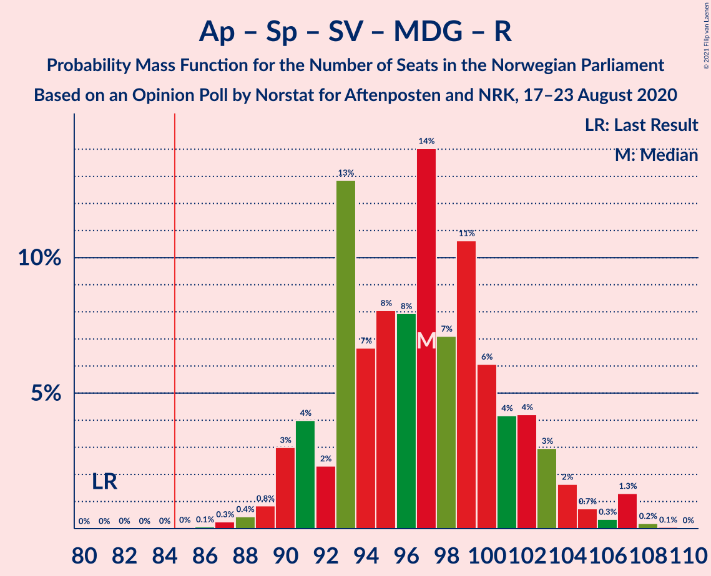

| Number of Seats | Probability | Accumulated | Special Marks |
|:---------------:|:-----------:|:-----------:|:-------------:|
| 81 | 0% | 100% | Last Result |
| 82 | 0% | 100% |  |
| 83 | 0% | 100% |  |
| 84 | 0% | 100% |  |
| 85 | 0% | 100% | Majority |
| 86 | 0.1% | 99.9% |  |
| 87 | 0.3% | 99.8% |  |
| 88 | 0.4% | 99.6% |  |
| 89 | 0.8% | 99.2% |  |
| 90 | 3% | 98% |  |
| 91 | 4% | 95% |  |
| 92 | 2% | 91% |  |
| 93 | 13% | 89% |  |
| 94 | 7% | 76% |  |
| 95 | 8% | 69% |  |
| 96 | 8% | 61% |  |
| 97 | 14% | 53% |  |
| 98 | 7% | 39% | Median |
| 99 | 11% | 32% |  |
| 100 | 6% | 22% |  |
| 101 | 4% | 16% |  |
| 102 | 4% | 11% |  |
| 103 | 3% | 7% |  |
| 104 | 2% | 4% |  |
| 105 | 0.7% | 3% |  |
| 106 | 0.3% | 2% |  |
| 107 | 1.3% | 2% |  |
| 108 | 0.2% | 0.3% |  |
| 109 | 0.1% | 0.1% |  |
| 110 | 0% | 0% |  |

### Høyre – Senterpartiet – Fremskrittspartiet – Kristelig Folkeparti – Venstre

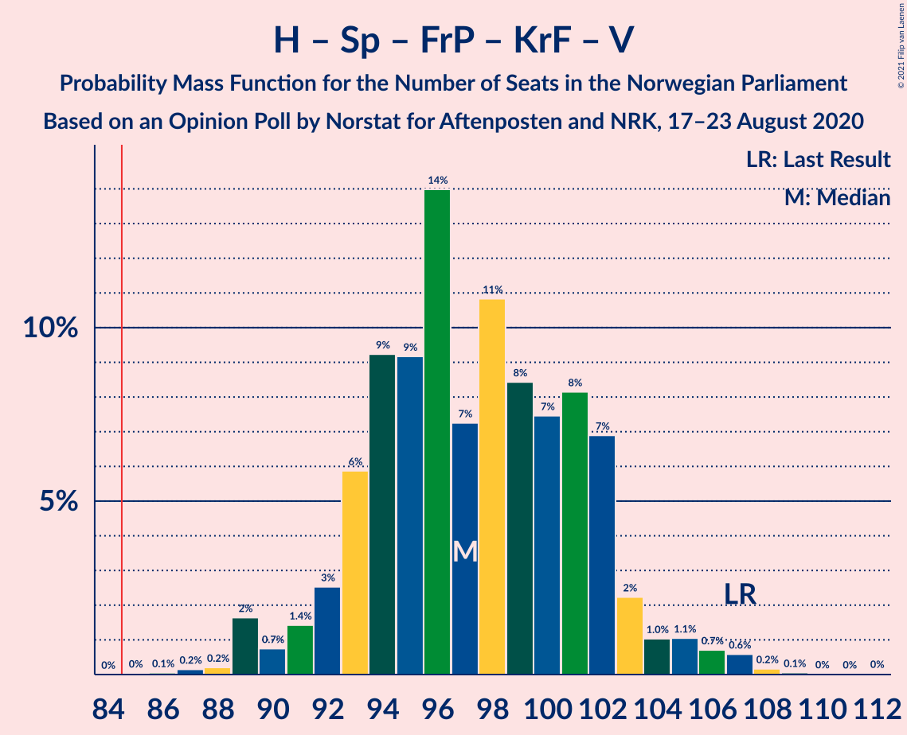

| Number of Seats | Probability | Accumulated | Special Marks |
|:---------------:|:-----------:|:-----------:|:-------------:|
| 85 | 0% | 100% | Majority |
| 86 | 0.1% | 99.9% |  |
| 87 | 0.2% | 99.9% |  |
| 88 | 0.2% | 99.7% |  |
| 89 | 2% | 99.5% |  |
| 90 | 0.7% | 98% |  |
| 91 | 1.4% | 97% |  |
| 92 | 3% | 96% |  |
| 93 | 6% | 93% |  |
| 94 | 9% | 87% |  |
| 95 | 9% | 78% |  |
| 96 | 14% | 69% | Median |
| 97 | 7% | 55% |  |
| 98 | 11% | 48% |  |
| 99 | 8% | 37% |  |
| 100 | 7% | 28% |  |
| 101 | 8% | 21% |  |
| 102 | 7% | 13% |  |
| 103 | 2% | 6% |  |
| 104 | 1.0% | 4% |  |
| 105 | 1.1% | 3% |  |
| 106 | 0.7% | 2% |  |
| 107 | 0.6% | 0.9% | Last Result |
| 108 | 0.2% | 0.3% |  |
| 109 | 0.1% | 0.1% |  |
| 110 | 0% | 0.1% |  |
| 111 | 0% | 0% |  |

### Arbeiderpartiet – Senterpartiet – Sosialistisk Venstreparti – Miljøpartiet De Grønne – Kristelig Folkeparti

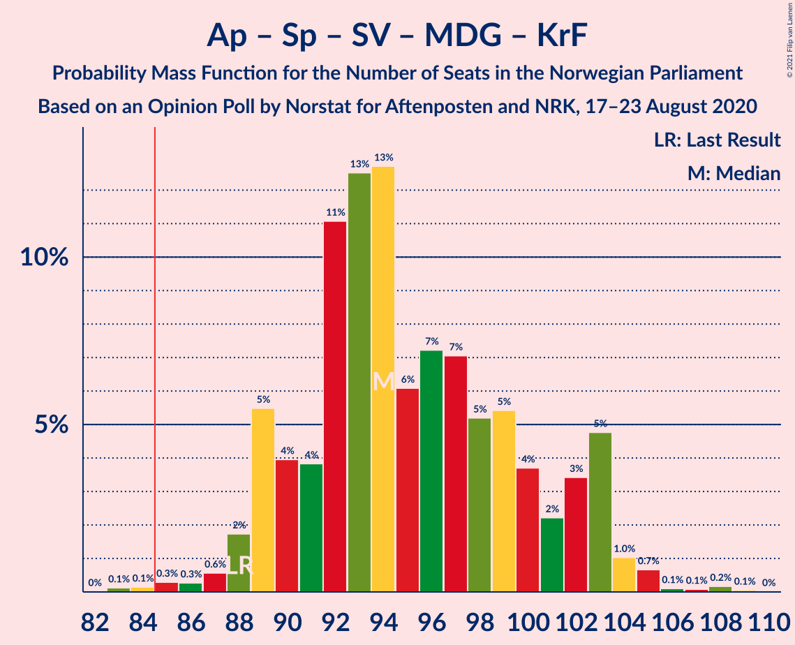

| Number of Seats | Probability | Accumulated | Special Marks |
|:---------------:|:-----------:|:-----------:|:-------------:|
| 83 | 0.1% | 100% |  |
| 84 | 0.1% | 99.8% |  |
| 85 | 0.3% | 99.7% | Majority |
| 86 | 0.3% | 99.4% |  |
| 87 | 0.6% | 99.1% |  |
| 88 | 2% | 98.6% | Last Result |
| 89 | 5% | 97% |  |
| 90 | 4% | 91% |  |
| 91 | 4% | 87% |  |
| 92 | 11% | 84% |  |
| 93 | 13% | 72% |  |
| 94 | 13% | 60% | Median |
| 95 | 6% | 47% |  |
| 96 | 7% | 41% |  |
| 97 | 7% | 34% |  |
| 98 | 5% | 27% |  |
| 99 | 5% | 22% |  |
| 100 | 4% | 16% |  |
| 101 | 2% | 13% |  |
| 102 | 3% | 10% |  |
| 103 | 5% | 7% |  |
| 104 | 1.0% | 2% |  |
| 105 | 0.7% | 1.1% |  |
| 106 | 0.1% | 0.4% |  |
| 107 | 0.1% | 0.3% |  |
| 108 | 0.2% | 0.2% |  |
| 109 | 0.1% | 0.1% |  |
| 110 | 0% | 0% |  |

### Arbeiderpartiet – Senterpartiet – Sosialistisk Venstreparti – Miljøpartiet De Grønne

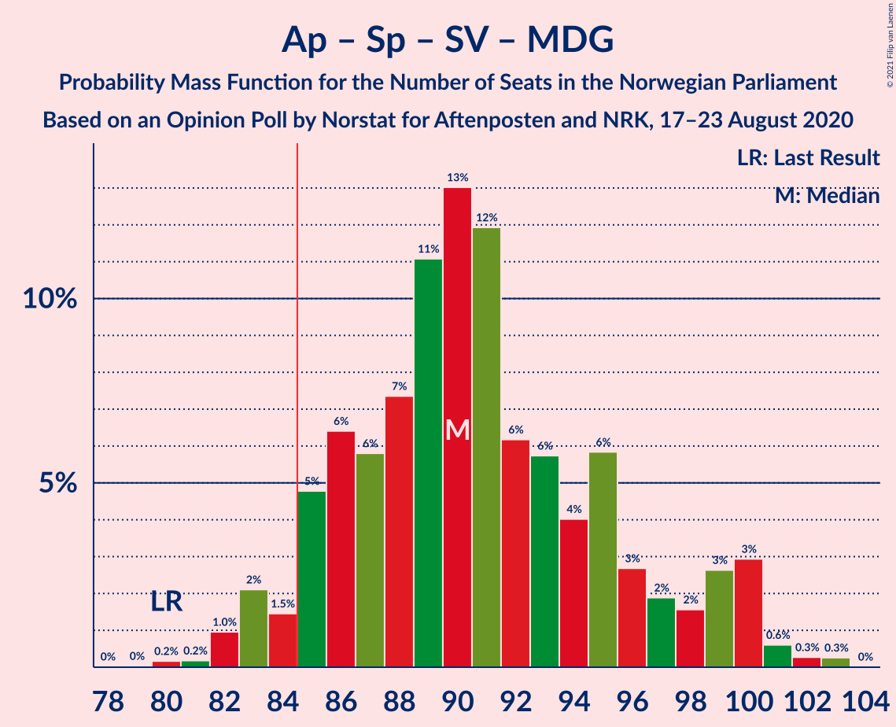

| Number of Seats | Probability | Accumulated | Special Marks |
|:---------------:|:-----------:|:-----------:|:-------------:|
| 79 | 0% | 100% |  |
| 80 | 0.2% | 99.9% | Last Result |
| 81 | 0.2% | 99.8% |  |
| 82 | 1.0% | 99.6% |  |
| 83 | 2% | 98.6% |  |
| 84 | 1.5% | 97% |  |
| 85 | 5% | 95% | Majority |
| 86 | 6% | 90% |  |
| 87 | 6% | 84% |  |
| 88 | 7% | 78% |  |
| 89 | 11% | 71% |  |
| 90 | 13% | 60% |  |
| 91 | 12% | 47% | Median |
| 92 | 6% | 35% |  |
| 93 | 6% | 28% |  |
| 94 | 4% | 23% |  |
| 95 | 6% | 19% |  |
| 96 | 3% | 13% |  |
| 97 | 2% | 10% |  |
| 98 | 2% | 8% |  |
| 99 | 3% | 7% |  |
| 100 | 3% | 4% |  |
| 101 | 0.6% | 1.2% |  |
| 102 | 0.3% | 0.6% |  |
| 103 | 0.3% | 0.3% |  |
| 104 | 0% | 0% |  |

### Arbeiderpartiet – Senterpartiet – Sosialistisk Venstreparti – Rødt

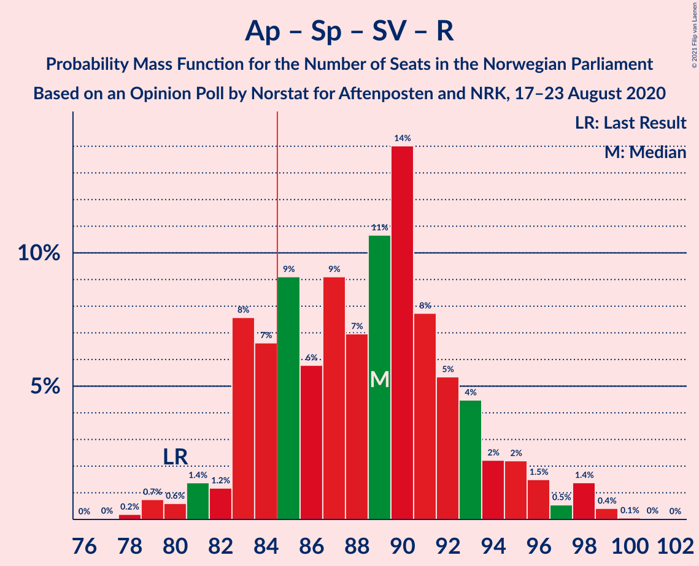

| Number of Seats | Probability | Accumulated | Special Marks |
|:---------------:|:-----------:|:-----------:|:-------------:|
| 77 | 0% | 100% |  |
| 78 | 0.2% | 99.9% |  |
| 79 | 0.7% | 99.7% |  |
| 80 | 0.6% | 99.0% | Last Result |
| 81 | 1.4% | 98% |  |
| 82 | 1.2% | 97% |  |
| 83 | 8% | 96% |  |
| 84 | 7% | 88% |  |
| 85 | 9% | 82% | Majority |
| 86 | 6% | 73% |  |
| 87 | 9% | 67% |  |
| 88 | 7% | 58% |  |
| 89 | 11% | 51% | Median |
| 90 | 14% | 40% |  |
| 91 | 8% | 26% |  |
| 92 | 5% | 18% |  |
| 93 | 4% | 13% |  |
| 94 | 2% | 8% |  |
| 95 | 2% | 6% |  |
| 96 | 1.5% | 4% |  |
| 97 | 0.5% | 2% |  |
| 98 | 1.4% | 2% |  |
| 99 | 0.4% | 0.6% |  |
| 100 | 0.1% | 0.1% |  |
| 101 | 0% | 0.1% |  |
| 102 | 0% | 0% |  |

### Arbeiderpartiet – Senterpartiet – Sosialistisk Venstreparti

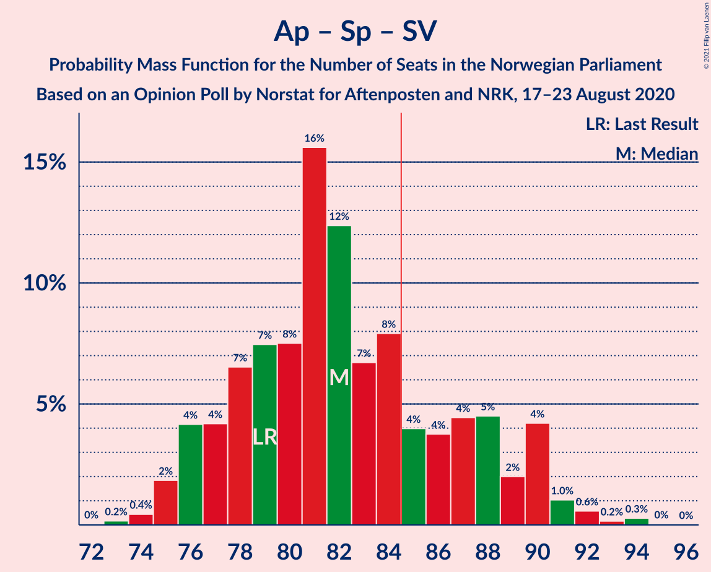

| Number of Seats | Probability | Accumulated | Special Marks |
|:---------------:|:-----------:|:-----------:|:-------------:|
| 72 | 0% | 100% |  |
| 73 | 0.2% | 99.9% |  |
| 74 | 0.4% | 99.8% |  |
| 75 | 2% | 99.3% |  |
| 76 | 4% | 97% |  |
| 77 | 4% | 93% |  |
| 78 | 7% | 89% |  |
| 79 | 7% | 83% | Last Result |
| 80 | 8% | 75% |  |
| 81 | 16% | 68% |  |
| 82 | 12% | 52% | Median |
| 83 | 7% | 40% |  |
| 84 | 8% | 33% |  |
| 85 | 4% | 25% | Majority |
| 86 | 4% | 21% |  |
| 87 | 4% | 17% |  |
| 88 | 5% | 13% |  |
| 89 | 2% | 8% |  |
| 90 | 4% | 6% |  |
| 91 | 1.0% | 2% |  |
| 92 | 0.6% | 1.1% |  |
| 93 | 0.2% | 0.5% |  |
| 94 | 0.3% | 0.3% |  |
| 95 | 0% | 0.1% |  |
| 96 | 0% | 0% |  |

### Arbeiderpartiet – Senterpartiet – Miljøpartiet De Grønne – Kristelig Folkeparti

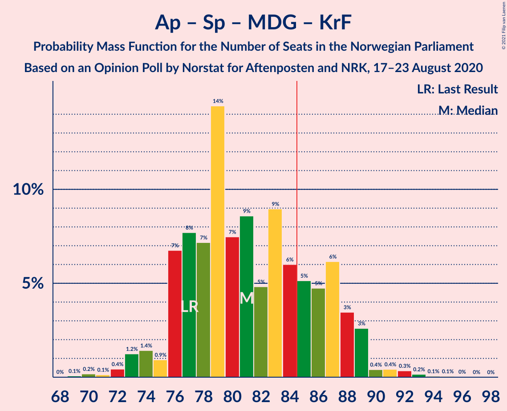

| Number of Seats | Probability | Accumulated | Special Marks |
|:---------------:|:-----------:|:-----------:|:-------------:|
| 69 | 0.1% | 100% |  |
| 70 | 0.2% | 99.9% |  |
| 71 | 0.1% | 99.7% |  |
| 72 | 0.4% | 99.6% |  |
| 73 | 1.2% | 99.1% |  |
| 74 | 1.4% | 98% |  |
| 75 | 0.9% | 96% |  |
| 76 | 7% | 96% |  |
| 77 | 8% | 89% | Last Result |
| 78 | 7% | 81% |  |
| 79 | 14% | 74% |  |
| 80 | 7% | 59% | Median |
| 81 | 9% | 52% |  |
| 82 | 5% | 43% |  |
| 83 | 9% | 39% |  |
| 84 | 6% | 30% |  |
| 85 | 5% | 24% | Majority |
| 86 | 5% | 18% |  |
| 87 | 6% | 14% |  |
| 88 | 3% | 8% |  |
| 89 | 3% | 4% |  |
| 90 | 0.4% | 1.5% |  |
| 91 | 0.4% | 1.1% |  |
| 92 | 0.3% | 0.7% |  |
| 93 | 0.2% | 0.3% |  |
| 94 | 0.1% | 0.2% |  |
| 95 | 0.1% | 0.1% |  |
| 96 | 0% | 0.1% |  |
| 97 | 0% | 0% |  |

### Høyre – Fremskrittspartiet – Miljøpartiet De Grønne – Kristelig Folkeparti – Venstre

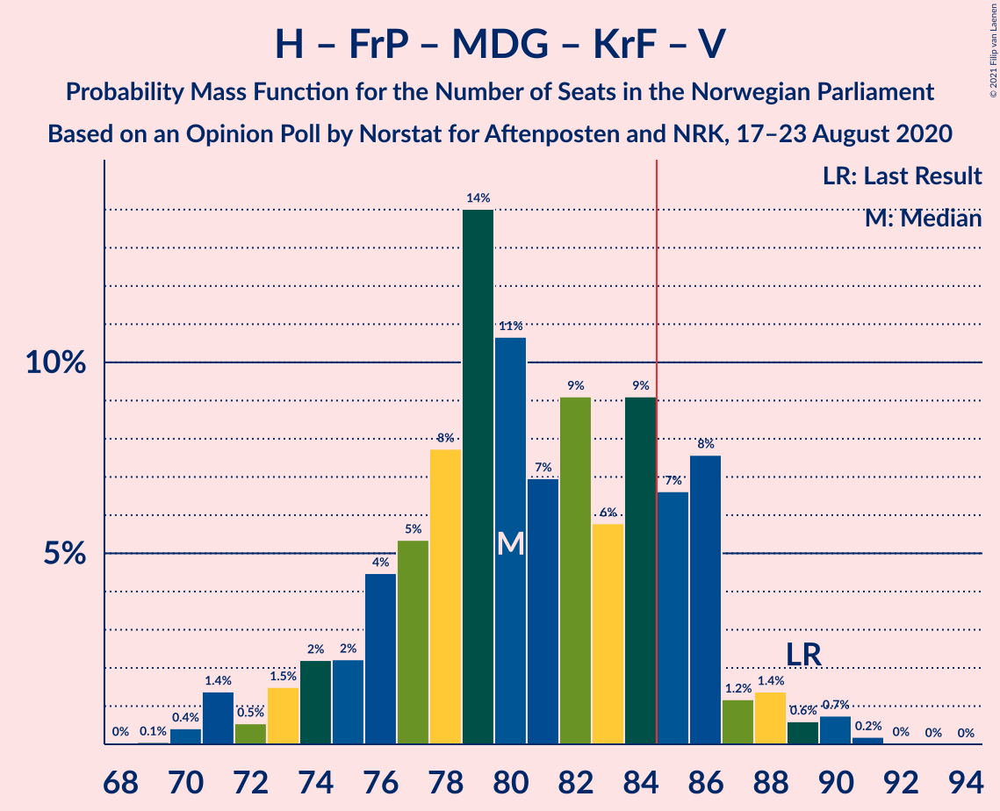

| Number of Seats | Probability | Accumulated | Special Marks |
|:---------------:|:-----------:|:-----------:|:-------------:|
| 68 | 0% | 100% |  |
| 69 | 0.1% | 99.9% |  |
| 70 | 0.4% | 99.9% |  |
| 71 | 1.4% | 99.4% |  |
| 72 | 0.5% | 98% |  |
| 73 | 1.5% | 98% |  |
| 74 | 2% | 96% |  |
| 75 | 2% | 94% |  |
| 76 | 4% | 92% |  |
| 77 | 5% | 87% |  |
| 78 | 8% | 82% |  |
| 79 | 14% | 74% |  |
| 80 | 11% | 60% | Median |
| 81 | 7% | 49% |  |
| 82 | 9% | 42% |  |
| 83 | 6% | 33% |  |
| 84 | 9% | 27% |  |
| 85 | 7% | 18% | Majority |
| 86 | 8% | 12% |  |
| 87 | 1.2% | 4% |  |
| 88 | 1.4% | 3% |  |
| 89 | 0.6% | 2% | Last Result |
| 90 | 0.7% | 1.0% |  |
| 91 | 0.2% | 0.3% |  |
| 92 | 0% | 0.1% |  |
| 93 | 0% | 0% |  |

### Arbeiderpartiet – Senterpartiet – Kristelig Folkeparti

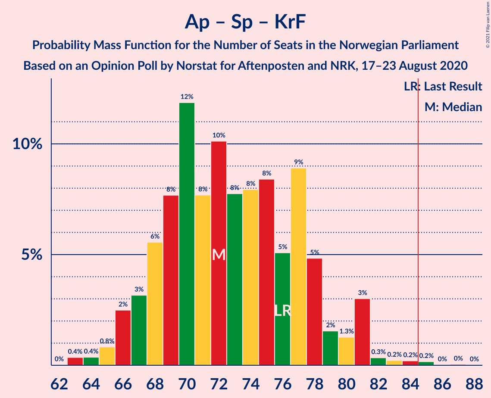

| Number of Seats | Probability | Accumulated | Special Marks |
|:---------------:|:-----------:|:-----------:|:-------------:|
| 62 | 0% | 100% |  |
| 63 | 0.4% | 99.9% |  |
| 64 | 0.4% | 99.6% |  |
| 65 | 0.8% | 99.2% |  |
| 66 | 2% | 98% |  |
| 67 | 3% | 96% |  |
| 68 | 6% | 93% |  |
| 69 | 8% | 87% |  |
| 70 | 12% | 79% |  |
| 71 | 8% | 68% | Median |
| 72 | 10% | 60% |  |
| 73 | 8% | 50% |  |
| 74 | 8% | 42% |  |
| 75 | 8% | 34% |  |
| 76 | 5% | 26% | Last Result |
| 77 | 9% | 21% |  |
| 78 | 5% | 12% |  |
| 79 | 2% | 7% |  |
| 80 | 1.3% | 5% |  |
| 81 | 3% | 4% |  |
| 82 | 0.3% | 1.0% |  |
| 83 | 0.2% | 0.7% |  |
| 84 | 0.2% | 0.5% |  |
| 85 | 0.2% | 0.3% | Majority |
| 86 | 0% | 0.1% |  |
| 87 | 0% | 0.1% |  |
| 88 | 0% | 0% |  |

### Høyre – Fremskrittspartiet – Kristelig Folkeparti – Venstre

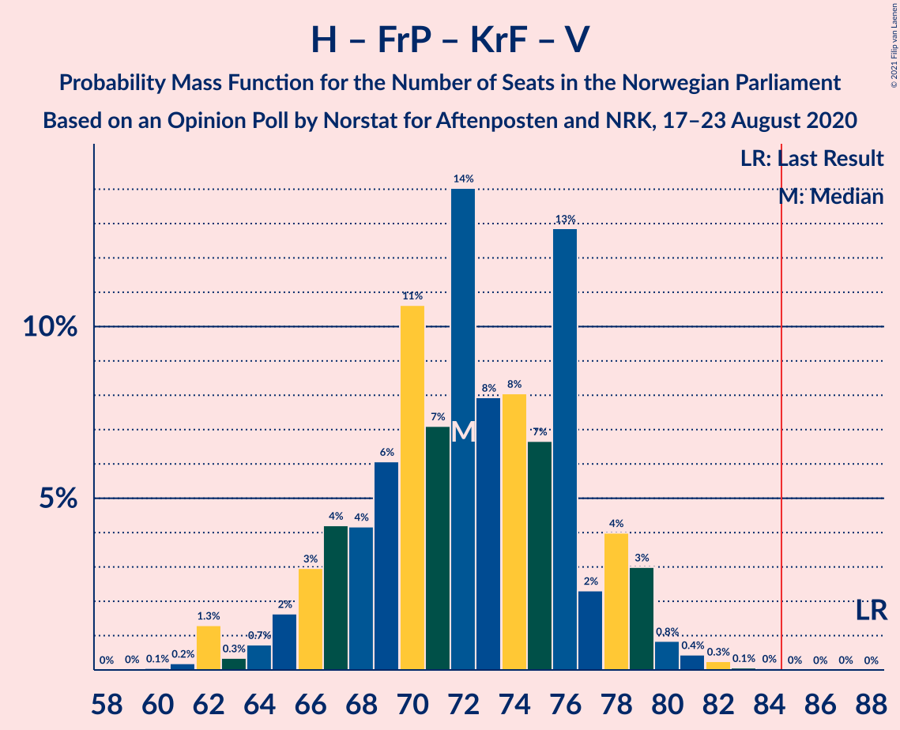

| Number of Seats | Probability | Accumulated | Special Marks |
|:---------------:|:-----------:|:-----------:|:-------------:|
| 60 | 0.1% | 100% |  |
| 61 | 0.2% | 99.9% |  |
| 62 | 1.3% | 99.7% |  |
| 63 | 0.3% | 98% |  |
| 64 | 0.7% | 98% |  |
| 65 | 2% | 97% |  |
| 66 | 3% | 96% |  |
| 67 | 4% | 93% |  |
| 68 | 4% | 89% |  |
| 69 | 6% | 84% |  |
| 70 | 11% | 78% |  |
| 71 | 7% | 68% | Median |
| 72 | 14% | 61% |  |
| 73 | 8% | 47% |  |
| 74 | 8% | 39% |  |
| 75 | 7% | 31% |  |
| 76 | 13% | 24% |  |
| 77 | 2% | 11% |  |
| 78 | 4% | 9% |  |
| 79 | 3% | 5% |  |
| 80 | 0.8% | 2% |  |
| 81 | 0.4% | 0.8% |  |
| 82 | 0.3% | 0.4% |  |
| 83 | 0.1% | 0.2% |  |
| 84 | 0% | 0.1% |  |
| 85 | 0% | 0% | Majority |
| 86 | 0% | 0% |  |
| 87 | 0% | 0% |  |
| 88 | 0% | 0% | Last Result |

### Arbeiderpartiet – Senterpartiet

| Number of Seats | Probability | Accumulated | Special Marks |
|:---------------:|:-----------:|:-----------:|:-------------:|
| 59 | 0.1% | 100% |  |
| 60 | 0.3% | 99.9% |  |
| 61 | 2% | 99.6% |  |
| 62 | 2% | 98% |  |
| 63 | 4% | 95% |  |
| 64 | 6% | 91% |  |
| 65 | 6% | 86% |  |
| 66 | 6% | 80% |  |
| 67 | 18% | 73% |  |
| 68 | 11% | 56% | Last Result, Median |
| 69 | 9% | 45% |  |
| 70 | 9% | 36% |  |
| 71 | 8% | 27% |  |
| 72 | 2% | 19% |  |
| 73 | 6% | 16% |  |
| 74 | 5% | 11% |  |
| 75 | 4% | 6% |  |
| 76 | 0.7% | 2% |  |
| 77 | 0.3% | 1.1% |  |
| 78 | 0.4% | 0.8% |  |
| 79 | 0.2% | 0.4% |  |
| 80 | 0.1% | 0.1% |  |
| 81 | 0% | 0% |  |

### Høyre – Fremskrittspartiet – Venstre

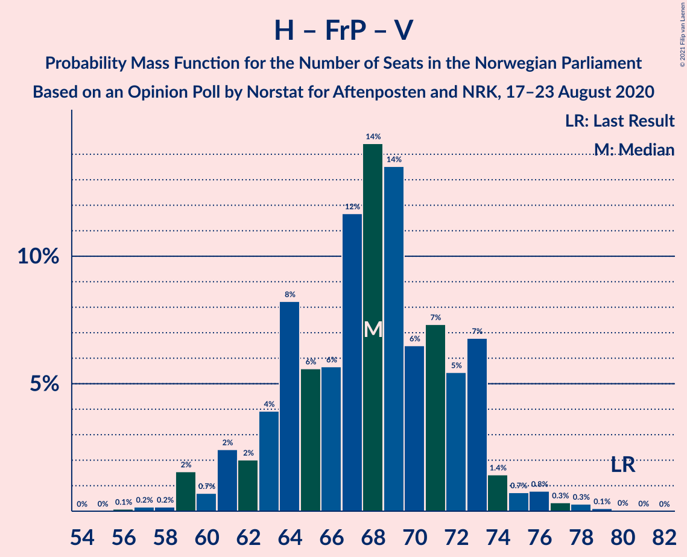

| Number of Seats | Probability | Accumulated | Special Marks |
|:---------------:|:-----------:|:-----------:|:-------------:|
| 56 | 0.1% | 100% |  |
| 57 | 0.2% | 99.9% |  |
| 58 | 0.2% | 99.7% |  |
| 59 | 2% | 99.5% |  |
| 60 | 0.7% | 98% |  |
| 61 | 2% | 97% |  |
| 62 | 2% | 95% |  |
| 63 | 4% | 93% |  |
| 64 | 8% | 89% |  |
| 65 | 6% | 81% |  |
| 66 | 6% | 75% |  |
| 67 | 12% | 69% |  |
| 68 | 14% | 58% | Median |
| 69 | 14% | 43% |  |
| 70 | 6% | 30% |  |
| 71 | 7% | 23% |  |
| 72 | 5% | 16% |  |
| 73 | 7% | 11% |  |
| 74 | 1.4% | 4% |  |
| 75 | 0.7% | 2% |  |
| 76 | 0.8% | 2% |  |
| 77 | 0.3% | 0.8% |  |
| 78 | 0.3% | 0.5% |  |
| 79 | 0.1% | 0.2% |  |
| 80 | 0% | 0.1% | Last Result |
| 81 | 0% | 0% |  |

### Høyre – Fremskrittspartiet

| Number of Seats | Probability | Accumulated | Special Marks |
|:---------------:|:-----------:|:-----------:|:-------------:|
| 53 | 0% | 100% |  |
| 54 | 0.1% | 99.9% |  |
| 55 | 0.4% | 99.9% |  |
| 56 | 0.2% | 99.4% |  |
| 57 | 2% | 99.2% |  |
| 58 | 0.8% | 98% |  |
| 59 | 2% | 97% |  |
| 60 | 3% | 94% |  |
| 61 | 6% | 92% |  |
| 62 | 7% | 86% |  |
| 63 | 8% | 79% |  |
| 64 | 5% | 71% |  |
| 65 | 6% | 66% |  |
| 66 | 19% | 60% | Median |
| 67 | 14% | 41% |  |
| 68 | 4% | 27% |  |
| 69 | 7% | 23% |  |
| 70 | 5% | 15% |  |
| 71 | 7% | 10% |  |
| 72 | 0.9% | 3% | Last Result |
| 73 | 1.0% | 2% |  |
| 74 | 0.4% | 0.8% |  |
| 75 | 0.2% | 0.4% |  |
| 76 | 0.1% | 0.1% |  |
| 77 | 0.1% | 0.1% |  |
| 78 | 0% | 0% |  |

### Arbeiderpartiet – Sosialistisk Venstreparti

| Number of Seats | Probability | Accumulated | Special Marks |
|:---------------:|:-----------:|:-----------:|:-------------:|
| 48 | 0% | 100% |  |
| 49 | 0.1% | 99.9% |  |
| 50 | 0.3% | 99.8% |  |
| 51 | 2% | 99.5% |  |
| 52 | 1.3% | 97% |  |
| 53 | 7% | 96% |  |
| 54 | 6% | 89% |  |
| 55 | 16% | 83% |  |
| 56 | 8% | 67% |  |
| 57 | 15% | 59% | Median |
| 58 | 13% | 44% |  |
| 59 | 11% | 31% |  |
| 60 | 5% | 20% | Last Result |
| 61 | 6% | 14% |  |
| 62 | 4% | 9% |  |
| 63 | 3% | 5% |  |
| 64 | 1.1% | 2% |  |
| 65 | 0.5% | 1.0% |  |
| 66 | 0.2% | 0.5% |  |
| 67 | 0.2% | 0.3% |  |
| 68 | 0.1% | 0.1% |  |
| 69 | 0% | 0% |  |

### Høyre – Kristelig Folkeparti – Venstre

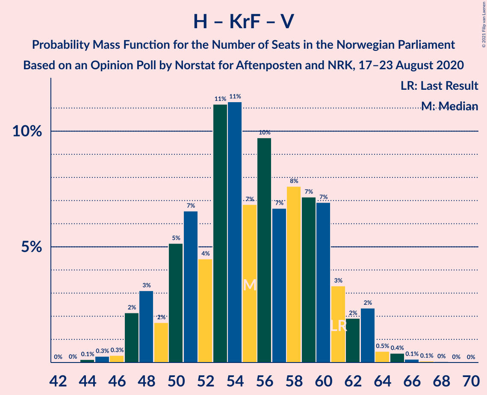

| Number of Seats | Probability | Accumulated | Special Marks |
|:---------------:|:-----------:|:-----------:|:-------------:|
| 44 | 0.1% | 100% |  |
| 45 | 0.3% | 99.8% |  |
| 46 | 0.3% | 99.6% |  |
| 47 | 2% | 99.3% |  |
| 48 | 3% | 97% |  |
| 49 | 2% | 94% |  |
| 50 | 5% | 92% |  |
| 51 | 7% | 87% |  |
| 52 | 4% | 81% |  |
| 53 | 11% | 76% |  |
| 54 | 11% | 65% | Median |
| 55 | 7% | 54% |  |
| 56 | 10% | 47% |  |
| 57 | 7% | 37% |  |
| 58 | 8% | 30% |  |
| 59 | 7% | 23% |  |
| 60 | 7% | 16% |  |
| 61 | 3% | 9% | Last Result |
| 62 | 2% | 5% |  |
| 63 | 2% | 4% |  |
| 64 | 0.5% | 1.2% |  |
| 65 | 0.4% | 0.7% |  |
| 66 | 0.1% | 0.3% |  |
| 67 | 0.1% | 0.1% |  |
| 68 | 0% | 0.1% |  |
| 69 | 0% | 0% |  |

### Senterpartiet – Kristelig Folkeparti – Venstre

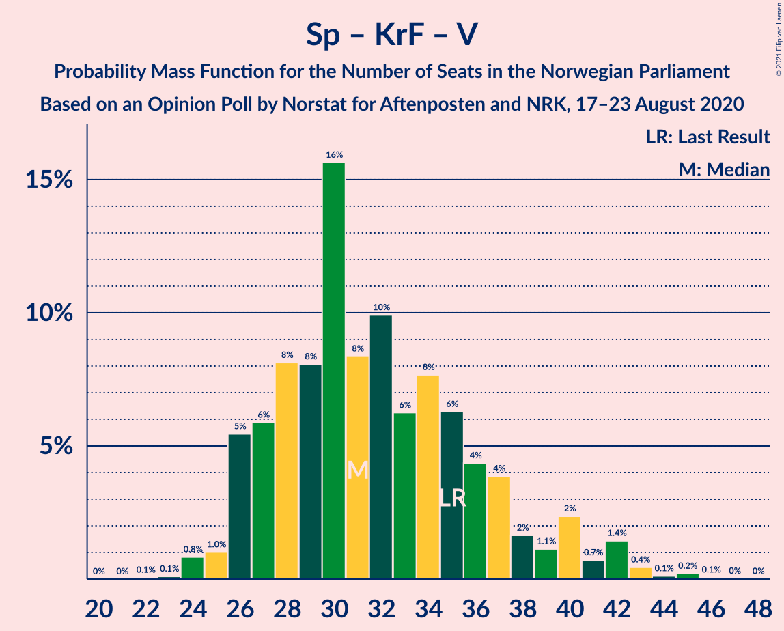

| Number of Seats | Probability | Accumulated | Special Marks |
|:---------------:|:-----------:|:-----------:|:-------------:|
| 22 | 0.1% | 100% |  |
| 23 | 0.1% | 99.9% |  |
| 24 | 0.8% | 99.8% |  |
| 25 | 1.0% | 99.0% |  |
| 26 | 5% | 98% |  |
| 27 | 6% | 93% |  |
| 28 | 8% | 87% |  |
| 29 | 8% | 79% |  |
| 30 | 16% | 70% | Median |
| 31 | 8% | 55% |  |
| 32 | 10% | 46% |  |
| 33 | 6% | 37% |  |
| 34 | 8% | 30% |  |
| 35 | 6% | 23% | Last Result |
| 36 | 4% | 16% |  |
| 37 | 4% | 12% |  |
| 38 | 2% | 8% |  |
| 39 | 1.1% | 7% |  |
| 40 | 2% | 5% |  |
| 41 | 0.7% | 3% |  |
| 42 | 1.4% | 2% |  |
| 43 | 0.4% | 0.9% |  |
| 44 | 0.1% | 0.4% |  |
| 45 | 0.2% | 0.3% |  |
| 46 | 0.1% | 0.1% |  |
| 47 | 0% | 0% |  |

## Technical Information

### Opinion Poll

+ **Polling firm:** Norstat
+ **Commissioner(s):** Aftenposten and NRK
+ **Fieldwork period:** 17–23 August 2020

### Calculations

+ **Sample size:** 952
+ **Simulations done:** 1,048,576
+ **Error estimate:** 2.45%

