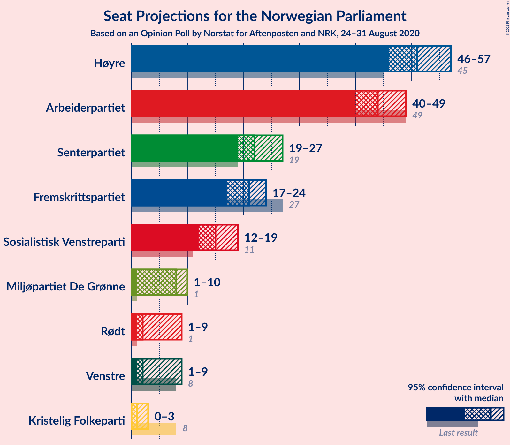
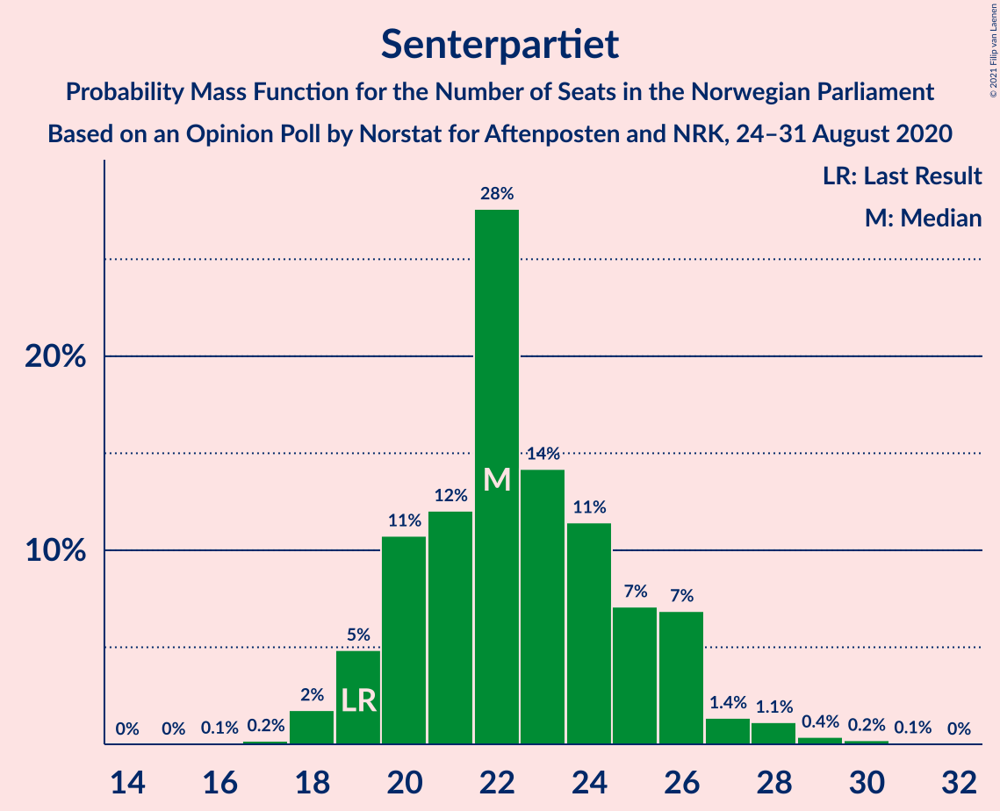
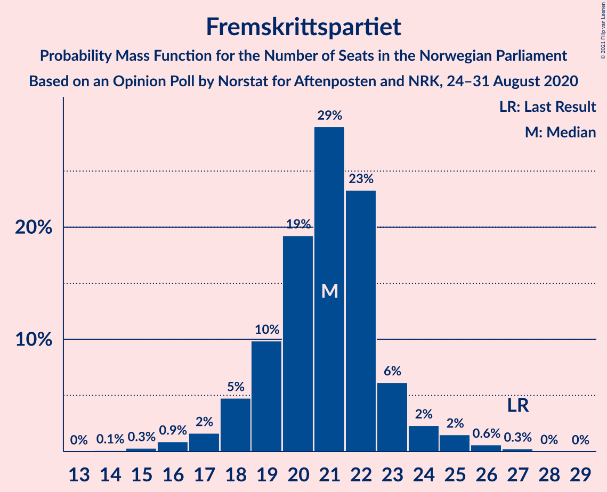
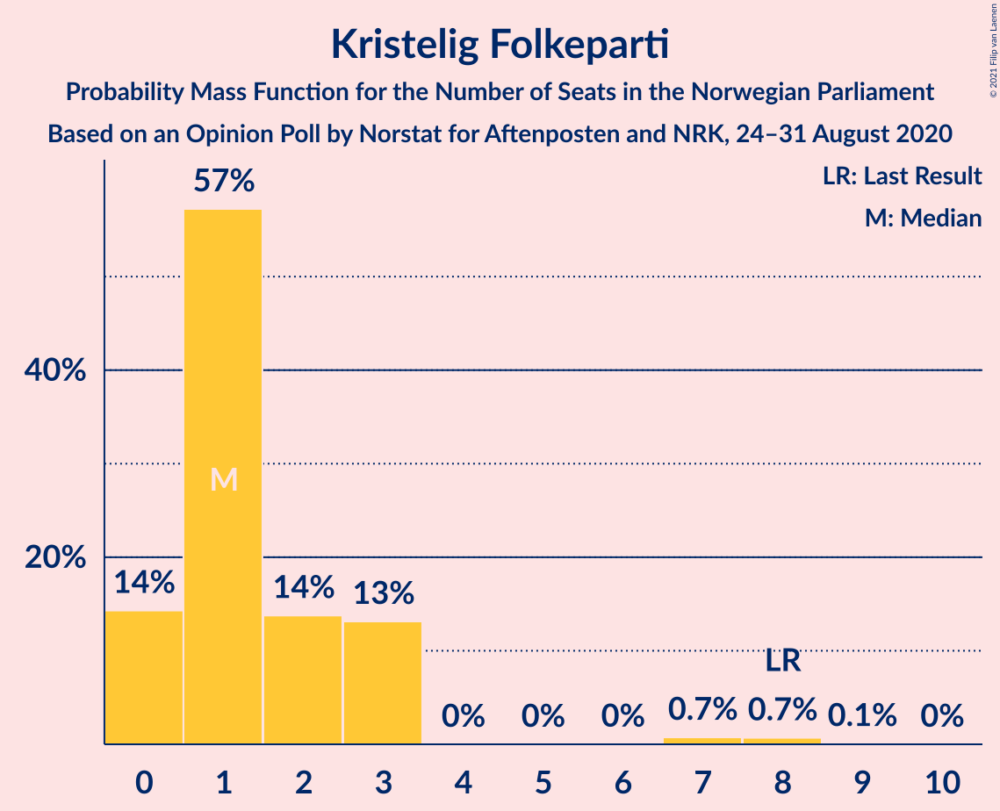
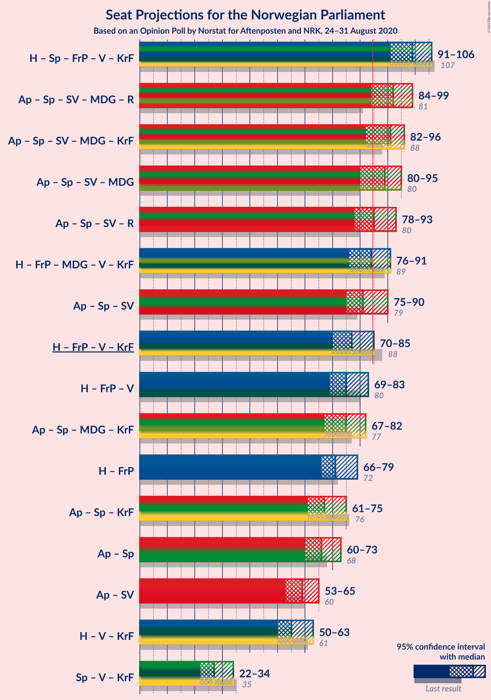
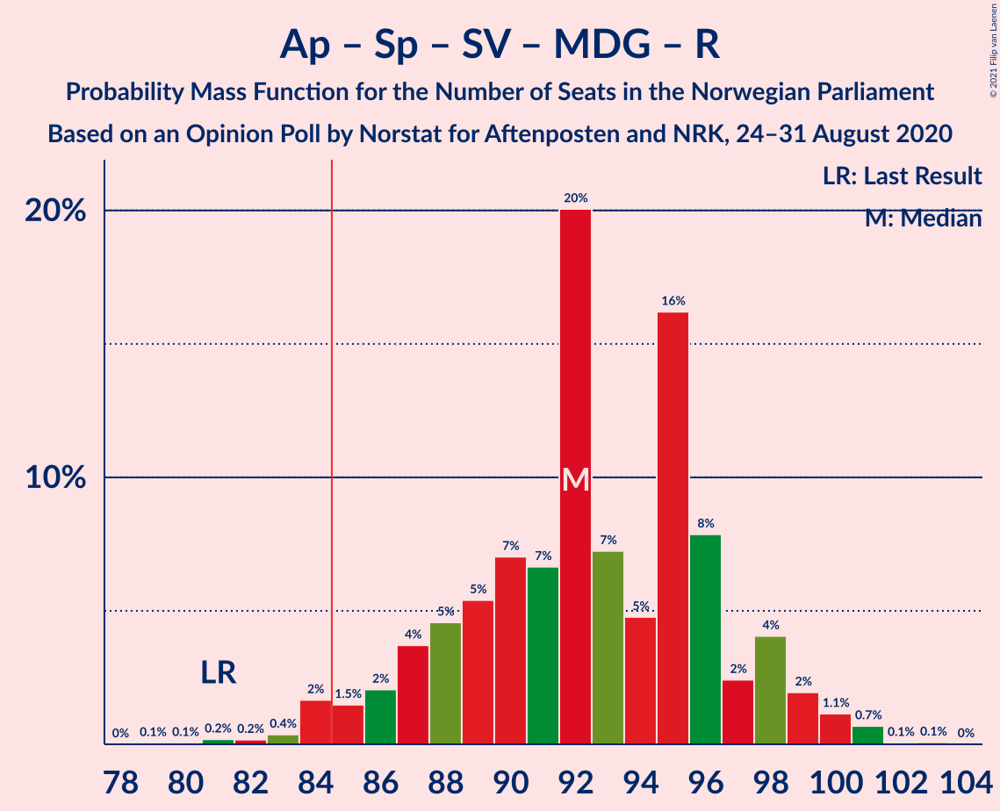
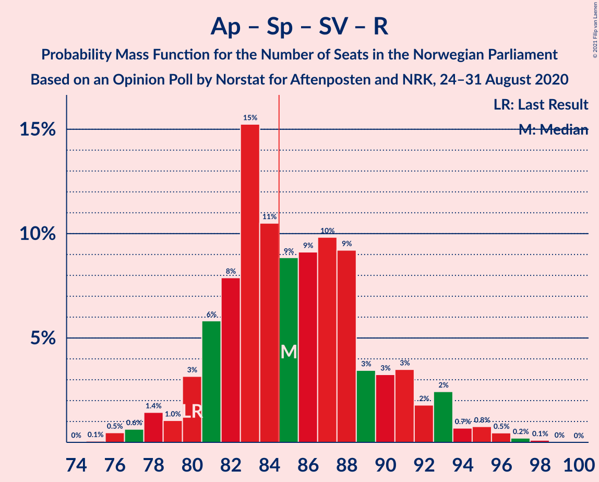
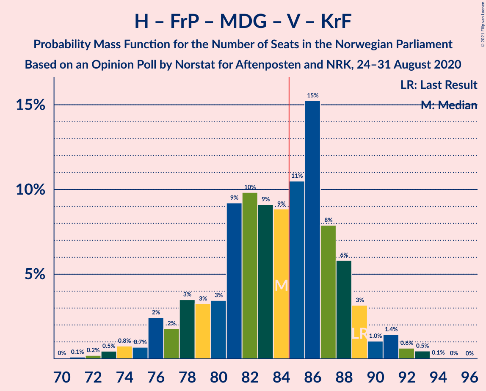
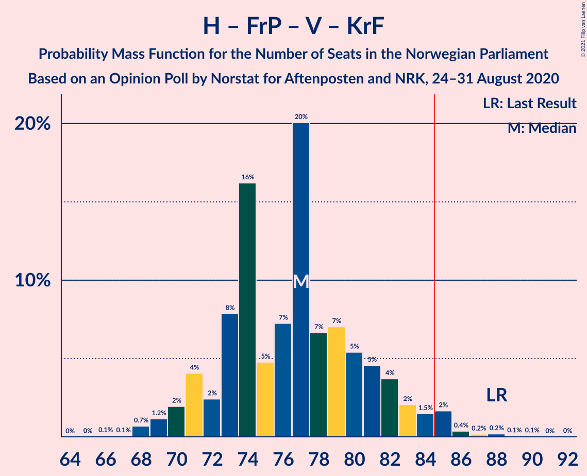
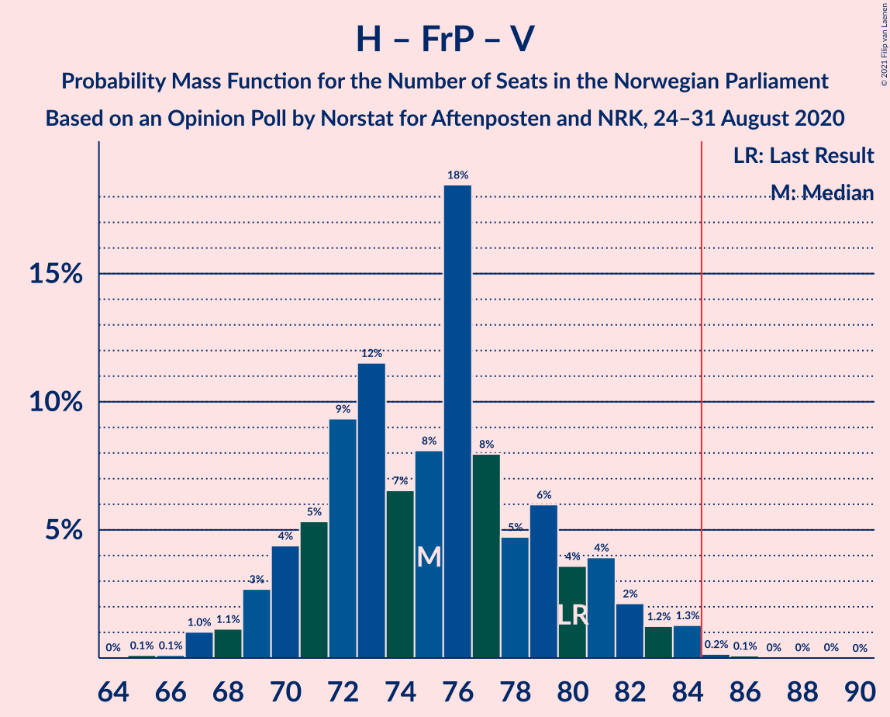

# Opinion Poll by Norstat for Aftenposten and NRK, 24–31 August 2020

<a href="#voting-intentions">Voting Intentions</a> | <a href="#seats">Seats</a> | <a href="#coalitions">Coalitions</a> | <a href="#technical-information">Technical Information</a>

## Voting Intentions

### Confidence Intervals

| Party | Last Result | Poll Result | 80% Confidence Interval | 90% Confidence Interval | 95% Confidence Interval | 99% Confidence Interval |
|:-----:|:-----------:|:-----------:|:-----------------------:|:-----------------------:|:-----------------------:|:-----------------------:|
| Høyre | 25.0% | 28.3% | 26.5–30.2% |25.9–30.8% |25.5–31.2% |24.6–32.2% |
| Arbeiderpartiet | 27.4% | 24.0% | 22.3–25.9% |21.8–26.4% |21.4–26.9% |20.6–27.8% |
| Senterpartiet | 10.3% | 12.2% | 10.9–13.7% |10.5–14.1% |10.2–14.4% |9.7–15.2% |
| Fremskrittspartiet | 15.2% | 11.4% | 10.2–12.9% |9.9–13.3% |9.6–13.6% |9.0–14.4% |
| Sosialistisk Venstreparti | 6.0% | 8.2% | 7.1–9.4% |6.8–9.8% |6.6–10.1% |6.1–10.7% |
| Miljøpartiet De Grønne | 3.2% | 4.1% | 3.4–5.1% |3.2–5.4% |3.0–5.6% |2.7–6.1% |
| Rødt | 2.4% | 3.8% | 3.1–4.7% |2.9–5.0% |2.8–5.2% |2.5–5.7% |
| Venstre | 4.4% | 3.4% | 2.7–4.3% |2.6–4.5% |2.4–4.8% |2.1–5.2% |
| Kristelig Folkeparti | 4.2% | 2.8% | 2.2–3.6% |2.0–3.8% |1.9–4.0% |1.6–4.4% |

*Note:* The poll result column reflects the actual value used in the calculations. Published results may vary slightly, and in addition be rounded to fewer digits.

## Seats

### Confidence Intervals

| Party | Last Result | Median | 80% Confidence Interval | 90% Confidence Interval | 95% Confidence Interval | 99% Confidence Interval |
|:-----:|:-----------:|:------:|:-----------------------:|:-----------------------:|:-----------------------:|:-----------------------:|
| <a href="#høyre">Høyre</a> | 45 | 51 | 48–54 |47–55 |46–57 |44–60 |
| <a href="#arbeiderpartiet">Arbeiderpartiet</a> | 49 | 44 | 40–47 |40–48 |40–49 |38–51 |
| <a href="#senterpartiet">Senterpartiet</a> | 19 | 22 | 20–26 |19–26 |19–27 |18–29 |
| <a href="#fremskrittspartiet">Fremskrittspartiet</a> | 27 | 21 | 19–23 |18–23 |17–24 |16–26 |
| <a href="#sosialistisk-venstreparti">Sosialistisk Venstreparti</a> | 11 | 15 | 13–17 |12–18 |12–19 |11–20 |
| <a href="#miljøpartiet-de-grønne">Miljøpartiet De Grønne</a> | 1 | 8 | 2–10 |2–10 |1–10 |1–11 |
| <a href="#rødt">Rødt</a> | 1 | 2 | 1–8 |1–9 |1–9 |1–10 |
| <a href="#venstre">Venstre</a> | 8 | 2 | 2–8 |2–9 |1–9 |1–10 |
| <a href="#kristelig-folkeparti">Kristelig Folkeparti</a> | 8 | 1 | 0–3 |0–3 |0–3 |0–8 |

### Høyre

*For a full overview of the results for this party, see the [Høyre](party-høyre.html) page.*

| Number of Seats | Probability | Accumulated | Special Marks |
|:---------------:|:-----------:|:-----------:|:-------------:|
| 42 | 0.1% | 100% |  |
| 43 | 0.1% | 99.9% |  |
| 44 | 0.5% | 99.9% |  |
| 45 | 1.0% | 99.4% | Last Result |
| 46 | 3% | 98% |  |
| 47 | 4% | 95% |  |
| 48 | 9% | 92% |  |
| 49 | 15% | 83% |  |
| 50 | 15% | 68% |  |
| 51 | 12% | 53% | Median |
| 52 | 19% | 41% |  |
| 53 | 10% | 22% |  |
| 54 | 5% | 12% |  |
| 55 | 3% | 7% |  |
| 56 | 2% | 4% |  |
| 57 | 0.8% | 3% |  |
| 58 | 0.5% | 2% |  |
| 59 | 0.6% | 1.2% |  |
| 60 | 0.3% | 0.7% |  |
| 61 | 0.3% | 0.4% |  |
| 62 | 0.1% | 0.1% |  |
| 63 | 0% | 0% |  |

### Arbeiderpartiet

*For a full overview of the results for this party, see the [Arbeiderpartiet](party-arbeiderpartiet.html) page.*

| Number of Seats | Probability | Accumulated | Special Marks |
|:---------------:|:-----------:|:-----------:|:-------------:|
| 36 | 0.1% | 100% |  |
| 37 | 0.2% | 99.9% |  |
| 38 | 0.5% | 99.7% |  |
| 39 | 1.5% | 99.2% |  |
| 40 | 10% | 98% |  |
| 41 | 9% | 88% |  |
| 42 | 9% | 79% |  |
| 43 | 15% | 70% |  |
| 44 | 19% | 56% | Median |
| 45 | 9% | 36% |  |
| 46 | 11% | 27% |  |
| 47 | 7% | 16% |  |
| 48 | 5% | 10% |  |
| 49 | 3% | 5% | Last Result |
| 50 | 1.1% | 2% |  |
| 51 | 0.7% | 1.0% |  |
| 52 | 0.1% | 0.3% |  |
| 53 | 0.1% | 0.1% |  |
| 54 | 0% | 0% |  |

### Senterpartiet

*For a full overview of the results for this party, see the [Senterpartiet](party-senterpartiet.html) page.*

| Number of Seats | Probability | Accumulated | Special Marks |
|:---------------:|:-----------:|:-----------:|:-------------:|
| 16 | 0.1% | 100% |  |
| 17 | 0.2% | 99.9% |  |
| 18 | 2% | 99.7% |  |
| 19 | 5% | 98% | Last Result |
| 20 | 11% | 93% |  |
| 21 | 12% | 82% |  |
| 22 | 28% | 70% | Median |
| 23 | 14% | 43% |  |
| 24 | 11% | 29% |  |
| 25 | 7% | 17% |  |
| 26 | 7% | 10% |  |
| 27 | 1.4% | 3% |  |
| 28 | 1.1% | 2% |  |
| 29 | 0.4% | 0.7% |  |
| 30 | 0.2% | 0.3% |  |
| 31 | 0.1% | 0.1% |  |
| 32 | 0% | 0% |  |

### Fremskrittspartiet

*For a full overview of the results for this party, see the [Fremskrittspartiet](party-fremskrittspartiet.html) page.*

| Number of Seats | Probability | Accumulated | Special Marks |
|:---------------:|:-----------:|:-----------:|:-------------:|
| 14 | 0.1% | 100% |  |
| 15 | 0.3% | 99.9% |  |
| 16 | 0.9% | 99.6% |  |
| 17 | 2% | 98.7% |  |
| 18 | 5% | 97% |  |
| 19 | 10% | 92% |  |
| 20 | 19% | 82% |  |
| 21 | 29% | 63% | Median |
| 22 | 23% | 34% |  |
| 23 | 6% | 11% |  |
| 24 | 2% | 5% |  |
| 25 | 2% | 2% |  |
| 26 | 0.6% | 0.9% |  |
| 27 | 0.3% | 0.3% | Last Result |
| 28 | 0% | 0.1% |  |
| 29 | 0% | 0% |  |

### Sosialistisk Venstreparti

*For a full overview of the results for this party, see the [Sosialistisk Venstreparti](party-sosialistiskvenstreparti.html) page.*

| Number of Seats | Probability | Accumulated | Special Marks |
|:---------------:|:-----------:|:-----------:|:-------------:|
| 10 | 0.2% | 100% |  |
| 11 | 1.0% | 99.7% | Last Result |
| 12 | 4% | 98.8% |  |
| 13 | 12% | 95% |  |
| 14 | 13% | 83% |  |
| 15 | 30% | 69% | Median |
| 16 | 17% | 40% |  |
| 17 | 17% | 23% |  |
| 18 | 4% | 6% |  |
| 19 | 2% | 3% |  |
| 20 | 0.6% | 0.7% |  |
| 21 | 0.1% | 0.1% |  |
| 22 | 0.1% | 0.1% |  |
| 23 | 0% | 0% |  |

### Miljøpartiet De Grønne

*For a full overview of the results for this party, see the [Miljøpartiet De Grønne](party-miljøpartietdegrønne.html) page.*

| Number of Seats | Probability | Accumulated | Special Marks |
|:---------------:|:-----------:|:-----------:|:-------------:|
| 1 | 4% | 100% | Last Result |
| 2 | 13% | 96% |  |
| 3 | 3% | 83% |  |
| 4 | 0% | 80% |  |
| 5 | 0% | 80% |  |
| 6 | 0.8% | 80% |  |
| 7 | 10% | 79% |  |
| 8 | 32% | 68% | Median |
| 9 | 25% | 36% |  |
| 10 | 10% | 11% |  |
| 11 | 0.8% | 0.8% |  |
| 12 | 0% | 0% |  |

### Rødt

*For a full overview of the results for this party, see the [Rødt](party-rødt.html) page.*

| Number of Seats | Probability | Accumulated | Special Marks |
|:---------------:|:-----------:|:-----------:|:-------------:|
| 1 | 11% | 100% | Last Result |
| 2 | 57% | 89% | Median |
| 3 | 0% | 32% |  |
| 4 | 0% | 32% |  |
| 5 | 0% | 32% |  |
| 6 | 0% | 32% |  |
| 7 | 12% | 32% |  |
| 8 | 12% | 20% |  |
| 9 | 6% | 8% |  |
| 10 | 2% | 2% |  |
| 11 | 0.3% | 0.3% |  |
| 12 | 0% | 0% |  |

### Venstre

*For a full overview of the results for this party, see the [Venstre](party-venstre.html) page.*

| Number of Seats | Probability | Accumulated | Special Marks |
|:---------------:|:-----------:|:-----------:|:-------------:|
| 0 | 0.1% | 100% |  |
| 1 | 5% | 99.9% |  |
| 2 | 69% | 95% | Median |
| 3 | 0% | 26% |  |
| 4 | 0% | 26% |  |
| 5 | 0% | 26% |  |
| 6 | 0% | 26% |  |
| 7 | 7% | 26% |  |
| 8 | 14% | 19% | Last Result |
| 9 | 5% | 5% |  |
| 10 | 0.5% | 0.6% |  |
| 11 | 0% | 0% |  |

### Kristelig Folkeparti

*For a full overview of the results for this party, see the [Kristelig Folkeparti](party-kristeligfolkeparti.html) page.*

| Number of Seats | Probability | Accumulated | Special Marks |
|:---------------:|:-----------:|:-----------:|:-------------:|
| 0 | 14% | 100% |  |
| 1 | 57% | 86% | Median |
| 2 | 14% | 28% |  |
| 3 | 13% | 15% |  |
| 4 | 0% | 2% |  |
| 5 | 0% | 2% |  |
| 6 | 0% | 2% |  |
| 7 | 0.7% | 2% |  |
| 8 | 0.7% | 0.8% | Last Result |
| 9 | 0.1% | 0.1% |  |
| 10 | 0% | 0% |  |

## Coalitions

### Confidence Intervals

| Coalition | Last Result | Median | Majority? | 80% Confidence Interval | 90% Confidence Interval | 95% Confidence Interval | 99% Confidence Interval |
|:---------:|:-----------:|:------:|:---------:|:-----------------------:|:-----------------------:|:-----------------------:|:-----------------------:|
| Høyre – Senterpartiet – Fremskrittspartiet – Venstre – Kristelig Folkeparti | 107 | 99 | 100% | 94–104 | 93–105 | 91–106 | 89–109 |
| Arbeiderpartiet – Senterpartiet – Sosialistisk Venstreparti – Miljøpartiet De Grønne – Rødt | 81 | 92 | 97% | 88–97 | 86–98 | 84–99 | 82–101 |
| Arbeiderpartiet – Senterpartiet – Sosialistisk Venstreparti – Miljøpartiet De Grønne – Kristelig Folkeparti | 88 | 91 | 92% | 85–95 | 84–96 | 82–96 | 80–98 |
| Arbeiderpartiet – Senterpartiet – Sosialistisk Venstreparti – Miljøpartiet De Grønne | 80 | 89 | 88% | 84–93 | 82–94 | 80–95 | 78–96 |
| Arbeiderpartiet – Senterpartiet – Sosialistisk Venstreparti – Rødt | 80 | 85 | 54% | 81–90 | 80–92 | 78–93 | 76–96 |
| Høyre – Fremskrittspartiet – Miljøpartiet De Grønne – Venstre – Kristelig Folkeparti | 89 | 84 | 46% | 79–88 | 77–89 | 76–91 | 73–93 |
| Arbeiderpartiet – Senterpartiet – Sosialistisk Venstreparti | 79 | 81 | 19% | 77–86 | 76–88 | 75–90 | 73–91 |
| Høyre – Fremskrittspartiet – Venstre – Kristelig Folkeparti | 88 | 77 | 3% | 72–81 | 71–83 | 70–85 | 68–86 |
| Høyre – Fremskrittspartiet – Venstre | 80 | 75 | 0.4% | 71–80 | 69–82 | 69–83 | 67–84 |
| Arbeiderpartiet – Senterpartiet – Miljøpartiet De Grønne – Kristelig Folkeparti | 77 | 75 | 0.2% | 70–80 | 69–81 | 67–82 | 66–83 |
| Høyre – Fremskrittspartiet | 72 | 71 | 0.1% | 68–75 | 67–76 | 66–79 | 65–83 |
| Arbeiderpartiet – Senterpartiet – Kristelig Folkeparti | 76 | 67 | 0% | 64–72 | 62–74 | 61–75 | 60–77 |
| Arbeiderpartiet – Senterpartiet | 68 | 66 | 0% | 62–71 | 61–72 | 60–73 | 59–75 |
| Arbeiderpartiet – Sosialistisk Venstreparti | 60 | 59 | 0% | 55–63 | 54–64 | 53–65 | 51–67 |
| Høyre – Venstre – Kristelig Folkeparti | 61 | 55 | 0% | 52–61 | 51–62 | 50–63 | 48–65 |
| Senterpartiet – Venstre – Kristelig Folkeparti | 35 | 27 | 0% | 24–32 | 23–34 | 22–34 | 21–36 |

### Høyre – Senterpartiet – Fremskrittspartiet – Venstre – Kristelig Folkeparti

| Number of Seats | Probability | Accumulated | Special Marks |
|:---------------:|:-----------:|:-----------:|:-------------:|
| 88 | 0.1% | 100% |  |
| 89 | 0.5% | 99.8% |  |
| 90 | 1.2% | 99.3% |  |
| 91 | 2% | 98% |  |
| 92 | 0.8% | 96% |  |
| 93 | 4% | 95% |  |
| 94 | 3% | 91% |  |
| 95 | 3% | 88% |  |
| 96 | 5% | 85% |  |
| 97 | 11% | 80% | Median |
| 98 | 9% | 69% |  |
| 99 | 23% | 60% |  |
| 100 | 7% | 37% |  |
| 101 | 6% | 31% |  |
| 102 | 5% | 24% |  |
| 103 | 7% | 19% |  |
| 104 | 6% | 13% |  |
| 105 | 3% | 7% |  |
| 106 | 2% | 4% |  |
| 107 | 0.5% | 2% | Last Result |
| 108 | 0.4% | 1.3% |  |
| 109 | 0.5% | 0.9% |  |
| 110 | 0.1% | 0.4% |  |
| 111 | 0.2% | 0.2% |  |
| 112 | 0% | 0.1% |  |
| 113 | 0% | 0% |  |

### Arbeiderpartiet – Senterpartiet – Sosialistisk Venstreparti – Miljøpartiet De Grønne – Rødt

| Number of Seats | Probability | Accumulated | Special Marks |
|:---------------:|:-----------:|:-----------:|:-------------:|
| 79 | 0.1% | 100% |  |
| 80 | 0.1% | 99.9% |  |
| 81 | 0.2% | 99.9% | Last Result |
| 82 | 0.2% | 99.7% |  |
| 83 | 0.4% | 99.5% |  |
| 84 | 2% | 99.1% |  |
| 85 | 1.5% | 97% | Majority |
| 86 | 2% | 96% |  |
| 87 | 4% | 94% |  |
| 88 | 5% | 90% |  |
| 89 | 5% | 86% |  |
| 90 | 7% | 80% |  |
| 91 | 7% | 73% | Median |
| 92 | 20% | 67% |  |
| 93 | 7% | 47% |  |
| 94 | 5% | 39% |  |
| 95 | 16% | 34% |  |
| 96 | 8% | 18% |  |
| 97 | 2% | 10% |  |
| 98 | 4% | 8% |  |
| 99 | 2% | 4% |  |
| 100 | 1.1% | 2% |  |
| 101 | 0.7% | 0.8% |  |
| 102 | 0.1% | 0.2% |  |
| 103 | 0.1% | 0.1% |  |
| 104 | 0% | 0% |  |

### Arbeiderpartiet – Senterpartiet – Sosialistisk Venstreparti – Miljøpartiet De Grønne – Kristelig Folkeparti

| Number of Seats | Probability | Accumulated | Special Marks |
|:---------------:|:-----------:|:-----------:|:-------------:|
| 77 | 0% | 100% |  |
| 78 | 0% | 99.9% |  |
| 79 | 0.2% | 99.9% |  |
| 80 | 0.8% | 99.7% |  |
| 81 | 0.9% | 99.0% |  |
| 82 | 0.8% | 98% |  |
| 83 | 2% | 97% |  |
| 84 | 3% | 95% |  |
| 85 | 4% | 92% | Majority |
| 86 | 6% | 89% |  |
| 87 | 5% | 82% |  |
| 88 | 10% | 77% | Last Result |
| 89 | 8% | 67% |  |
| 90 | 8% | 59% | Median |
| 91 | 18% | 51% |  |
| 92 | 10% | 32% |  |
| 93 | 3% | 23% |  |
| 94 | 7% | 20% |  |
| 95 | 7% | 13% |  |
| 96 | 4% | 6% |  |
| 97 | 1.1% | 2% |  |
| 98 | 0.4% | 0.7% |  |
| 99 | 0.2% | 0.3% |  |
| 100 | 0.1% | 0.1% |  |
| 101 | 0% | 0% |  |

### Arbeiderpartiet – Senterpartiet – Sosialistisk Venstreparti – Miljøpartiet De Grønne

| Number of Seats | Probability | Accumulated | Special Marks |
|:---------------:|:-----------:|:-----------:|:-------------:|
| 75 | 0.1% | 100% |  |
| 76 | 0% | 99.9% |  |
| 77 | 0.2% | 99.9% |  |
| 78 | 0.4% | 99.7% |  |
| 79 | 0.9% | 99.3% |  |
| 80 | 1.1% | 98% | Last Result |
| 81 | 1.2% | 97% |  |
| 82 | 2% | 96% |  |
| 83 | 3% | 94% |  |
| 84 | 3% | 91% |  |
| 85 | 7% | 88% | Majority |
| 86 | 7% | 80% |  |
| 87 | 7% | 74% |  |
| 88 | 11% | 67% |  |
| 89 | 8% | 55% | Median |
| 90 | 17% | 47% |  |
| 91 | 8% | 30% |  |
| 92 | 3% | 22% |  |
| 93 | 12% | 18% |  |
| 94 | 3% | 6% |  |
| 95 | 2% | 3% |  |
| 96 | 0.5% | 0.9% |  |
| 97 | 0.3% | 0.5% |  |
| 98 | 0.1% | 0.2% |  |
| 99 | 0.1% | 0.1% |  |
| 100 | 0% | 0% |  |

### Arbeiderpartiet – Senterpartiet – Sosialistisk Venstreparti – Rødt

| Number of Seats | Probability | Accumulated | Special Marks |
|:---------------:|:-----------:|:-----------:|:-------------:|
| 75 | 0.1% | 100% |  |
| 76 | 0.5% | 99.9% |  |
| 77 | 0.6% | 99.4% |  |
| 78 | 1.4% | 98.8% |  |
| 79 | 1.0% | 97% |  |
| 80 | 3% | 96% | Last Result |
| 81 | 6% | 93% |  |
| 82 | 8% | 87% |  |
| 83 | 15% | 79% | Median |
| 84 | 11% | 64% |  |
| 85 | 9% | 54% | Majority |
| 86 | 9% | 45% |  |
| 87 | 10% | 36% |  |
| 88 | 9% | 26% |  |
| 89 | 3% | 17% |  |
| 90 | 3% | 13% |  |
| 91 | 3% | 10% |  |
| 92 | 2% | 6% |  |
| 93 | 2% | 5% |  |
| 94 | 0.7% | 2% |  |
| 95 | 0.8% | 2% |  |
| 96 | 0.5% | 0.8% |  |
| 97 | 0.2% | 0.4% |  |
| 98 | 0.1% | 0.2% |  |
| 99 | 0% | 0.1% |  |
| 100 | 0% | 0% |  |

### Høyre – Fremskrittspartiet – Miljøpartiet De Grønne – Venstre – Kristelig Folkeparti

| Number of Seats | Probability | Accumulated | Special Marks |
|:---------------:|:-----------:|:-----------:|:-------------:|
| 70 | 0% | 100% |  |
| 71 | 0.1% | 99.9% |  |
| 72 | 0.2% | 99.8% |  |
| 73 | 0.5% | 99.6% |  |
| 74 | 0.8% | 99.2% |  |
| 75 | 0.7% | 98% |  |
| 76 | 2% | 98% |  |
| 77 | 2% | 95% |  |
| 78 | 3% | 94% |  |
| 79 | 3% | 90% |  |
| 80 | 3% | 87% |  |
| 81 | 9% | 83% |  |
| 82 | 10% | 74% |  |
| 83 | 9% | 64% | Median |
| 84 | 9% | 55% |  |
| 85 | 11% | 46% | Majority |
| 86 | 15% | 36% |  |
| 87 | 8% | 21% |  |
| 88 | 6% | 13% |  |
| 89 | 3% | 7% | Last Result |
| 90 | 1.0% | 4% |  |
| 91 | 1.4% | 3% |  |
| 92 | 0.6% | 1.2% |  |
| 93 | 0.5% | 0.6% |  |
| 94 | 0.1% | 0.1% |  |
| 95 | 0% | 0% |  |

### Arbeiderpartiet – Senterpartiet – Sosialistisk Venstreparti

| Number of Seats | Probability | Accumulated | Special Marks |
|:---------------:|:-----------:|:-----------:|:-------------:|
| 70 | 0% | 100% |  |
| 71 | 0.1% | 99.9% |  |
| 72 | 0.2% | 99.8% |  |
| 73 | 0.8% | 99.6% |  |
| 74 | 1.1% | 98.8% |  |
| 75 | 1.2% | 98% |  |
| 76 | 3% | 97% |  |
| 77 | 5% | 94% |  |
| 78 | 7% | 89% |  |
| 79 | 8% | 81% | Last Result |
| 80 | 8% | 73% |  |
| 81 | 20% | 65% | Median |
| 82 | 11% | 46% |  |
| 83 | 8% | 35% |  |
| 84 | 7% | 27% |  |
| 85 | 8% | 19% | Majority |
| 86 | 4% | 11% |  |
| 87 | 2% | 7% |  |
| 88 | 0.7% | 5% |  |
| 89 | 2% | 4% |  |
| 90 | 1.2% | 3% |  |
| 91 | 1.2% | 2% |  |
| 92 | 0.2% | 0.4% |  |
| 93 | 0.1% | 0.2% |  |
| 94 | 0% | 0.1% |  |
| 95 | 0% | 0% |  |

### Høyre – Fremskrittspartiet – Venstre – Kristelig Folkeparti

| Number of Seats | Probability | Accumulated | Special Marks |
|:---------------:|:-----------:|:-----------:|:-------------:|
| 66 | 0.1% | 100% |  |
| 67 | 0.1% | 99.9% |  |
| 68 | 0.7% | 99.8% |  |
| 69 | 1.2% | 99.2% |  |
| 70 | 2% | 98% |  |
| 71 | 4% | 96% |  |
| 72 | 2% | 92% |  |
| 73 | 8% | 90% |  |
| 74 | 16% | 82% |  |
| 75 | 5% | 66% | Median |
| 76 | 7% | 61% |  |
| 77 | 20% | 53% |  |
| 78 | 7% | 33% |  |
| 79 | 7% | 27% |  |
| 80 | 5% | 20% |  |
| 81 | 5% | 14% |  |
| 82 | 4% | 10% |  |
| 83 | 2% | 6% |  |
| 84 | 1.5% | 4% |  |
| 85 | 2% | 3% | Majority |
| 86 | 0.4% | 0.9% |  |
| 87 | 0.2% | 0.5% |  |
| 88 | 0.2% | 0.3% | Last Result |
| 89 | 0.1% | 0.1% |  |
| 90 | 0.1% | 0.1% |  |
| 91 | 0% | 0% |  |

### Høyre – Fremskrittspartiet – Venstre

| Number of Seats | Probability | Accumulated | Special Marks |
|:---------------:|:-----------:|:-----------:|:-------------:|
| 65 | 0.1% | 100% |  |
| 66 | 0.1% | 99.8% |  |
| 67 | 1.0% | 99.7% |  |
| 68 | 1.1% | 98.7% |  |
| 69 | 3% | 98% |  |
| 70 | 4% | 95% |  |
| 71 | 5% | 91% |  |
| 72 | 9% | 85% |  |
| 73 | 12% | 76% |  |
| 74 | 7% | 64% | Median |
| 75 | 8% | 58% |  |
| 76 | 18% | 50% |  |
| 77 | 8% | 31% |  |
| 78 | 5% | 23% |  |
| 79 | 6% | 19% |  |
| 80 | 4% | 13% | Last Result |
| 81 | 4% | 9% |  |
| 82 | 2% | 5% |  |
| 83 | 1.2% | 3% |  |
| 84 | 1.3% | 2% |  |
| 85 | 0.2% | 0.4% | Majority |
| 86 | 0.1% | 0.2% |  |
| 87 | 0% | 0.1% |  |
| 88 | 0% | 0.1% |  |
| 89 | 0% | 0% |  |

### Arbeiderpartiet – Senterpartiet – Miljøpartiet De Grønne – Kristelig Folkeparti

| Number of Seats | Probability | Accumulated | Special Marks |
|:---------------:|:-----------:|:-----------:|:-------------:|
| 62 | 0% | 100% |  |
| 63 | 0.1% | 99.9% |  |
| 64 | 0.1% | 99.9% |  |
| 65 | 0.2% | 99.8% |  |
| 66 | 0.6% | 99.6% |  |
| 67 | 2% | 99.0% |  |
| 68 | 2% | 97% |  |
| 69 | 3% | 95% |  |
| 70 | 5% | 92% |  |
| 71 | 8% | 87% |  |
| 72 | 6% | 79% |  |
| 73 | 5% | 73% |  |
| 74 | 12% | 68% |  |
| 75 | 10% | 56% | Median |
| 76 | 16% | 46% |  |
| 77 | 7% | 30% | Last Result |
| 78 | 5% | 23% |  |
| 79 | 7% | 18% |  |
| 80 | 4% | 11% |  |
| 81 | 4% | 7% |  |
| 82 | 2% | 3% |  |
| 83 | 0.6% | 1.1% |  |
| 84 | 0.3% | 0.5% |  |
| 85 | 0.1% | 0.2% | Majority |
| 86 | 0% | 0.1% |  |
| 87 | 0% | 0% |  |

### Høyre – Fremskrittspartiet

| Number of Seats | Probability | Accumulated | Special Marks |
|:---------------:|:-----------:|:-----------:|:-------------:|
| 62 | 0% | 100% |  |
| 63 | 0.1% | 99.9% |  |
| 64 | 0.3% | 99.9% |  |
| 65 | 1.2% | 99.5% |  |
| 66 | 2% | 98% |  |
| 67 | 4% | 96% |  |
| 68 | 7% | 92% |  |
| 69 | 7% | 85% |  |
| 70 | 13% | 78% |  |
| 71 | 16% | 65% |  |
| 72 | 11% | 50% | Last Result, Median |
| 73 | 8% | 39% |  |
| 74 | 19% | 31% |  |
| 75 | 6% | 12% |  |
| 76 | 1.2% | 6% |  |
| 77 | 0.8% | 5% |  |
| 78 | 1.2% | 4% |  |
| 79 | 0.5% | 3% |  |
| 80 | 0.7% | 2% |  |
| 81 | 0.8% | 2% |  |
| 82 | 0.2% | 0.7% |  |
| 83 | 0.3% | 0.5% |  |
| 84 | 0.1% | 0.2% |  |
| 85 | 0% | 0.1% | Majority |
| 86 | 0% | 0% |  |

### Arbeiderpartiet – Senterpartiet – Kristelig Folkeparti

| Number of Seats | Probability | Accumulated | Special Marks |
|:---------------:|:-----------:|:-----------:|:-------------:|
| 57 | 0% | 100% |  |
| 58 | 0.1% | 99.9% |  |
| 59 | 0.3% | 99.9% |  |
| 60 | 0.4% | 99.5% |  |
| 61 | 2% | 99.2% |  |
| 62 | 2% | 97% |  |
| 63 | 2% | 95% |  |
| 64 | 5% | 93% |  |
| 65 | 11% | 87% |  |
| 66 | 15% | 76% |  |
| 67 | 16% | 61% | Median |
| 68 | 9% | 45% |  |
| 69 | 10% | 36% |  |
| 70 | 4% | 26% |  |
| 71 | 6% | 22% |  |
| 72 | 7% | 16% |  |
| 73 | 3% | 9% |  |
| 74 | 3% | 5% |  |
| 75 | 1.4% | 3% |  |
| 76 | 0.5% | 1.4% | Last Result |
| 77 | 0.7% | 0.9% |  |
| 78 | 0% | 0.2% |  |
| 79 | 0.1% | 0.1% |  |
| 80 | 0% | 0% |  |

### Arbeiderpartiet – Senterpartiet

| Number of Seats | Probability | Accumulated | Special Marks |
|:---------------:|:-----------:|:-----------:|:-------------:|
| 57 | 0.1% | 100% |  |
| 58 | 0.2% | 99.9% |  |
| 59 | 0.7% | 99.7% |  |
| 60 | 2% | 99.0% |  |
| 61 | 3% | 97% |  |
| 62 | 4% | 93% |  |
| 63 | 4% | 89% |  |
| 64 | 15% | 86% |  |
| 65 | 15% | 71% |  |
| 66 | 14% | 57% | Median |
| 67 | 10% | 43% |  |
| 68 | 8% | 32% | Last Result |
| 69 | 5% | 24% |  |
| 70 | 8% | 19% |  |
| 71 | 4% | 11% |  |
| 72 | 3% | 7% |  |
| 73 | 2% | 4% |  |
| 74 | 0.9% | 2% |  |
| 75 | 1.0% | 1.3% |  |
| 76 | 0.1% | 0.2% |  |
| 77 | 0.1% | 0.1% |  |
| 78 | 0.1% | 0.1% |  |
| 79 | 0% | 0% |  |

### Arbeiderpartiet – Sosialistisk Venstreparti

| Number of Seats | Probability | Accumulated | Special Marks |
|:---------------:|:-----------:|:-----------:|:-------------:|
| 50 | 0.1% | 100% |  |
| 51 | 0.6% | 99.9% |  |
| 52 | 0.4% | 99.3% |  |
| 53 | 2% | 98.9% |  |
| 54 | 3% | 97% |  |
| 55 | 5% | 94% |  |
| 56 | 10% | 89% |  |
| 57 | 10% | 80% |  |
| 58 | 8% | 69% |  |
| 59 | 17% | 62% | Median |
| 60 | 14% | 45% | Last Result |
| 61 | 13% | 31% |  |
| 62 | 7% | 17% |  |
| 63 | 4% | 11% |  |
| 64 | 3% | 7% |  |
| 65 | 2% | 4% |  |
| 66 | 1.1% | 2% |  |
| 67 | 0.4% | 0.7% |  |
| 68 | 0.2% | 0.3% |  |
| 69 | 0.1% | 0.1% |  |
| 70 | 0% | 0.1% |  |
| 71 | 0% | 0% |  |

### Høyre – Venstre – Kristelig Folkeparti

| Number of Seats | Probability | Accumulated | Special Marks |
|:---------------:|:-----------:|:-----------:|:-------------:|
| 46 | 0.1% | 100% |  |
| 47 | 0.2% | 99.9% |  |
| 48 | 0.8% | 99.7% |  |
| 49 | 1.2% | 98.8% |  |
| 50 | 2% | 98% |  |
| 51 | 5% | 96% |  |
| 52 | 10% | 91% |  |
| 53 | 11% | 81% |  |
| 54 | 8% | 70% | Median |
| 55 | 16% | 61% |  |
| 56 | 9% | 45% |  |
| 57 | 9% | 37% |  |
| 58 | 6% | 27% |  |
| 59 | 5% | 22% |  |
| 60 | 4% | 16% |  |
| 61 | 6% | 12% | Last Result |
| 62 | 3% | 7% |  |
| 63 | 1.4% | 3% |  |
| 64 | 1.1% | 2% |  |
| 65 | 0.6% | 0.9% |  |
| 66 | 0.2% | 0.3% |  |
| 67 | 0.1% | 0.1% |  |
| 68 | 0% | 0.1% |  |
| 69 | 0% | 0% |  |

### Senterpartiet – Venstre – Kristelig Folkeparti

| Number of Seats | Probability | Accumulated | Special Marks |
|:---------------:|:-----------:|:-----------:|:-------------:|
| 19 | 0.1% | 100% |  |
| 20 | 0.3% | 99.9% |  |
| 21 | 0.9% | 99.6% |  |
| 22 | 2% | 98.8% |  |
| 23 | 6% | 97% |  |
| 24 | 8% | 91% |  |
| 25 | 23% | 83% | Median |
| 26 | 7% | 60% |  |
| 27 | 12% | 52% |  |
| 28 | 8% | 41% |  |
| 29 | 7% | 33% |  |
| 30 | 6% | 26% |  |
| 31 | 4% | 20% |  |
| 32 | 8% | 16% |  |
| 33 | 3% | 8% |  |
| 34 | 3% | 5% |  |
| 35 | 1.5% | 2% | Last Result |
| 36 | 0.4% | 0.8% |  |
| 37 | 0.2% | 0.3% |  |
| 38 | 0.1% | 0.2% |  |
| 39 | 0% | 0% |  |

## Technical Information

### Opinion Poll

+ **Polling firm:** Norstat
+ **Commissioner(s):** Aftenposten and NRK
+ **Fieldwork period:** 24–31 August 2020

### Calculations

+ **Sample size:** 944
+ **Simulations done:** 1,048,576
+ **Error estimate:** 1.01%

