# Opinion Poll by Kantar TNS for TV2, 25 August–1 September 2020

<a href="#voting-intentions">Voting Intentions</a> | <a href="#seats">Seats</a> | <a href="#coalitions">Coalitions</a> | <a href="#technical-information">Technical Information</a>

## Voting Intentions

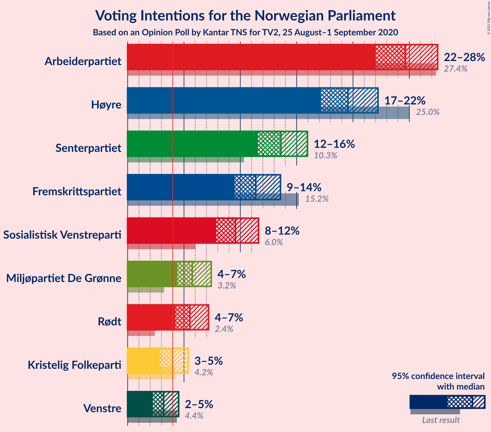

### Confidence Intervals

| Party | Last Result | Poll Result | 80% Confidence Interval | 90% Confidence Interval | 95% Confidence Interval | 99% Confidence Interval |
|:-----:|:-----------:|:-----------:|:-----------------------:|:-----------------------:|:-----------------------:|:-----------------------:|
| Arbeiderpartiet | 27.4% | 24.7% | 22.9–26.5% |22.4–27.1% |22.0–27.5% |21.2–28.4% |
| Høyre | 25.0% | 19.6% | 18.0–21.3% |17.5–21.8% |17.1–22.2% |16.4–23.1% |
| Senterpartiet | 10.3% | 13.6% | 12.3–15.1% |11.9–15.6% |11.6–16.0% |10.9–16.7% |
| Fremskrittspartiet | 15.2% | 11.4% | 10.1–12.8% |9.8–13.2% |9.5–13.6% |8.9–14.3% |
| Sosialistisk Venstreparti | 6.0% | 9.6% | 8.4–10.9% |8.1–11.3% |7.8–11.6% |7.3–12.3% |
| Miljøpartiet De Grønne | 3.2% | 5.7% | 4.9–6.8% |4.6–7.1% |4.4–7.4% |4.0–8.0% |
| Rødt | 2.4% | 5.5% | 4.7–6.6% |4.4–6.9% |4.2–7.2% |3.9–7.7% |
| Kristelig Folkeparti | 4.2% | 3.9% | 3.2–4.9% |3.0–5.1% |2.9–5.4% |2.6–5.9% |
| Venstre | 4.4% | 3.2% | 2.6–4.1% |2.4–4.3% |2.2–4.5% |2.0–5.0% |

*Note:* The poll result column reflects the actual value used in the calculations. Published results may vary slightly, and in addition be rounded to fewer digits.

## Seats

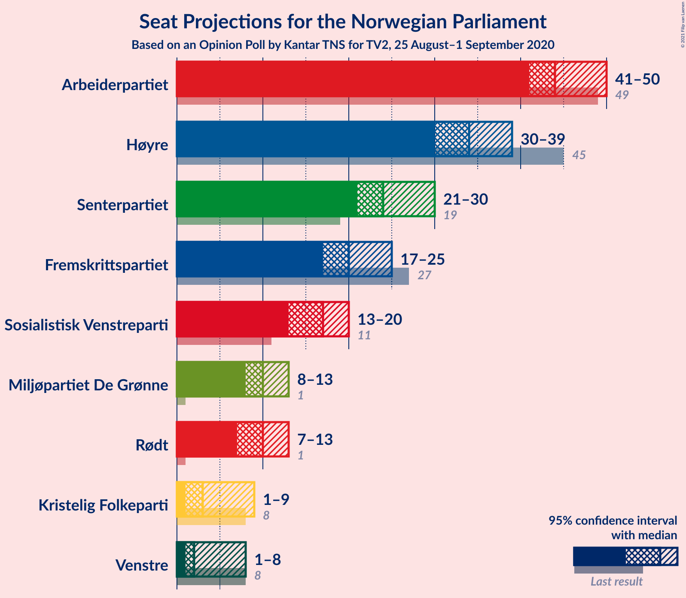

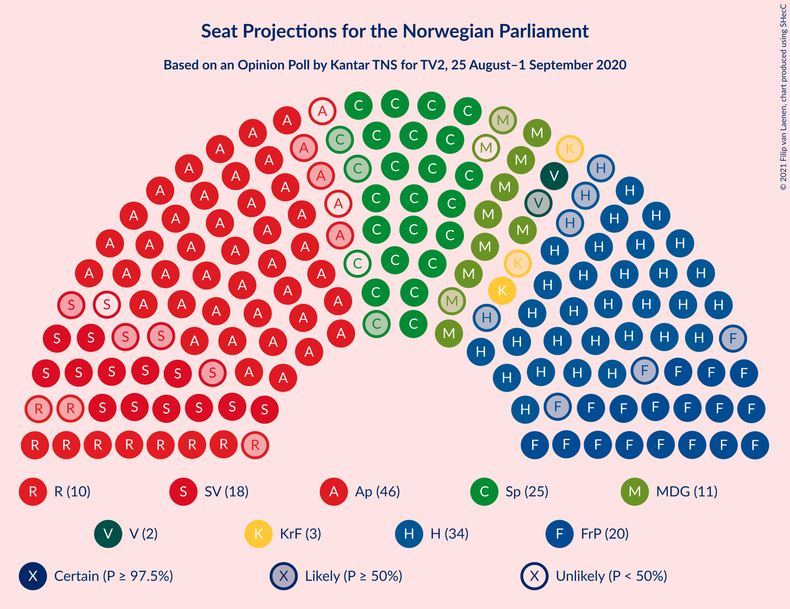

### Confidence Intervals

| Party | Last Result | Median | 80% Confidence Interval | 90% Confidence Interval | 95% Confidence Interval | 99% Confidence Interval |
|:-----:|:-----------:|:------:|:-----------------------:|:-----------------------:|:-----------------------:|:-----------------------:|
| <a href="#arbeiderpartiet">Arbeiderpartiet</a> | 49 | 44 | 42–47 |41–49 |41–50 |39–53 |
| <a href="#høyre">Høyre</a> | 45 | 34 | 32–38 |31–38 |30–39 |29–41 |
| <a href="#senterpartiet">Senterpartiet</a> | 19 | 24 | 22–28 |21–29 |21–30 |20–32 |
| <a href="#fremskrittspartiet">Fremskrittspartiet</a> | 27 | 20 | 18–23 |17–24 |17–25 |16–26 |
| <a href="#sosialistisk-venstreparti">Sosialistisk Venstreparti</a> | 11 | 17 | 15–19 |14–20 |13–20 |12–22 |
| <a href="#miljøpartiet-de-grønne">Miljøpartiet De Grønne</a> | 1 | 10 | 9–12 |8–13 |8–13 |7–14 |
| <a href="#rødt">Rødt</a> | 1 | 10 | 8–12 |8–12 |7–13 |2–14 |
| <a href="#kristelig-folkeparti">Kristelig Folkeparti</a> | 8 | 3 | 2–8 |2–9 |1–9 |1–10 |
| <a href="#venstre">Venstre</a> | 8 | 2 | 1–2 |1–7 |1–8 |0–8 |

### Arbeiderpartiet

*For a full overview of the results for this party, see the [Arbeiderpartiet](party-arbeiderpartiet.html) page.*

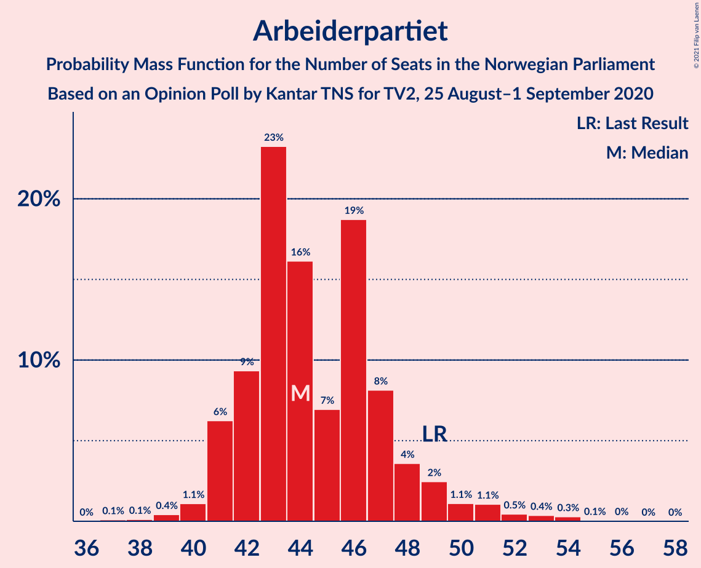

| Number of Seats | Probability | Accumulated | Special Marks |
|:---------------:|:-----------:|:-----------:|:-------------:|
| 37 | 0.1% | 100% |  |
| 38 | 0.1% | 99.9% |  |
| 39 | 0.4% | 99.8% |  |
| 40 | 1.1% | 99.3% |  |
| 41 | 6% | 98% |  |
| 42 | 9% | 92% |  |
| 43 | 23% | 83% |  |
| 44 | 16% | 59% | Median |
| 45 | 7% | 43% |  |
| 46 | 19% | 36% |  |
| 47 | 8% | 18% |  |
| 48 | 4% | 9% |  |
| 49 | 2% | 6% | Last Result |
| 50 | 1.1% | 3% |  |
| 51 | 1.1% | 2% |  |
| 52 | 0.5% | 1.2% |  |
| 53 | 0.4% | 0.8% |  |
| 54 | 0.3% | 0.4% |  |
| 55 | 0.1% | 0.1% |  |
| 56 | 0% | 0.1% |  |
| 57 | 0% | 0% |  |

### Høyre

*For a full overview of the results for this party, see the [Høyre](party-høyre.html) page.*

| Number of Seats | Probability | Accumulated | Special Marks |
|:---------------:|:-----------:|:-----------:|:-------------:|
| 28 | 0.2% | 100% |  |
| 29 | 1.1% | 99.8% |  |
| 30 | 2% | 98.7% |  |
| 31 | 5% | 96% |  |
| 32 | 6% | 91% |  |
| 33 | 7% | 85% |  |
| 34 | 39% | 79% | Median |
| 35 | 10% | 39% |  |
| 36 | 9% | 29% |  |
| 37 | 8% | 20% |  |
| 38 | 8% | 12% |  |
| 39 | 2% | 4% |  |
| 40 | 1.1% | 2% |  |
| 41 | 0.5% | 0.9% |  |
| 42 | 0.3% | 0.4% |  |
| 43 | 0.1% | 0.1% |  |
| 44 | 0% | 0% |  |
| 45 | 0% | 0% | Last Result |

### Senterpartiet

*For a full overview of the results for this party, see the [Senterpartiet](party-senterpartiet.html) page.*

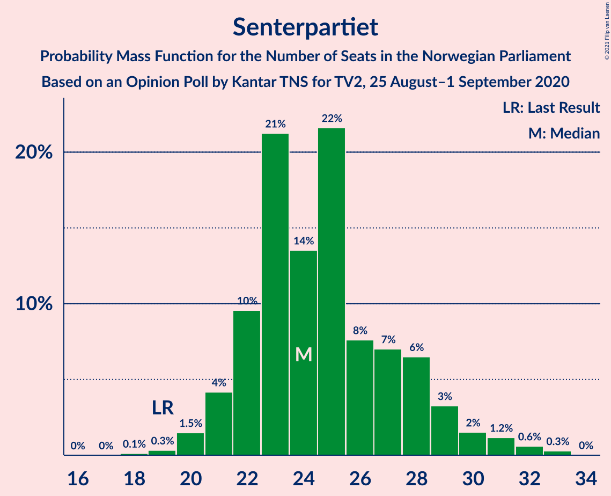

| Number of Seats | Probability | Accumulated | Special Marks |
|:---------------:|:-----------:|:-----------:|:-------------:|
| 18 | 0.1% | 100% |  |
| 19 | 0.3% | 99.9% | Last Result |
| 20 | 1.5% | 99.6% |  |
| 21 | 4% | 98% |  |
| 22 | 10% | 94% |  |
| 23 | 21% | 84% |  |
| 24 | 14% | 63% | Median |
| 25 | 22% | 50% |  |
| 26 | 8% | 28% |  |
| 27 | 7% | 20% |  |
| 28 | 6% | 13% |  |
| 29 | 3% | 7% |  |
| 30 | 2% | 4% |  |
| 31 | 1.2% | 2% |  |
| 32 | 0.6% | 0.9% |  |
| 33 | 0.3% | 0.3% |  |
| 34 | 0% | 0% |  |

### Fremskrittspartiet

*For a full overview of the results for this party, see the [Fremskrittspartiet](party-fremskrittspartiet.html) page.*

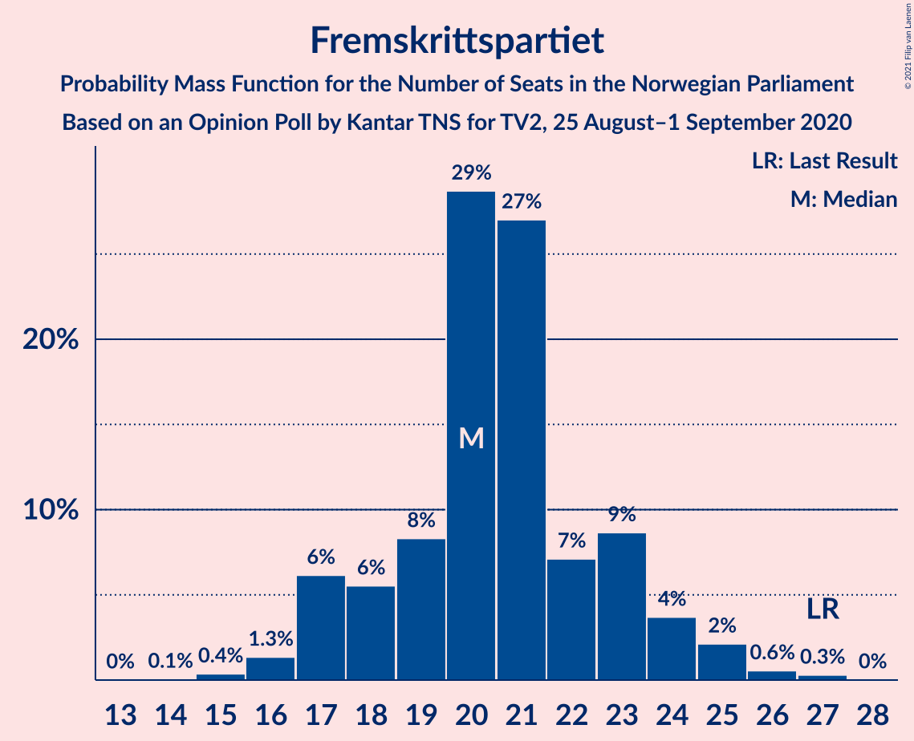

| Number of Seats | Probability | Accumulated | Special Marks |
|:---------------:|:-----------:|:-----------:|:-------------:|
| 14 | 0.1% | 100% |  |
| 15 | 0.4% | 99.9% |  |
| 16 | 1.3% | 99.6% |  |
| 17 | 6% | 98% |  |
| 18 | 6% | 92% |  |
| 19 | 8% | 87% |  |
| 20 | 29% | 78% | Median |
| 21 | 27% | 49% |  |
| 22 | 7% | 22% |  |
| 23 | 9% | 15% |  |
| 24 | 4% | 7% |  |
| 25 | 2% | 3% |  |
| 26 | 0.6% | 0.9% |  |
| 27 | 0.3% | 0.3% | Last Result |
| 28 | 0% | 0% |  |

### Sosialistisk Venstreparti

*For a full overview of the results for this party, see the [Sosialistisk Venstreparti](party-sosialistiskvenstreparti.html) page.*

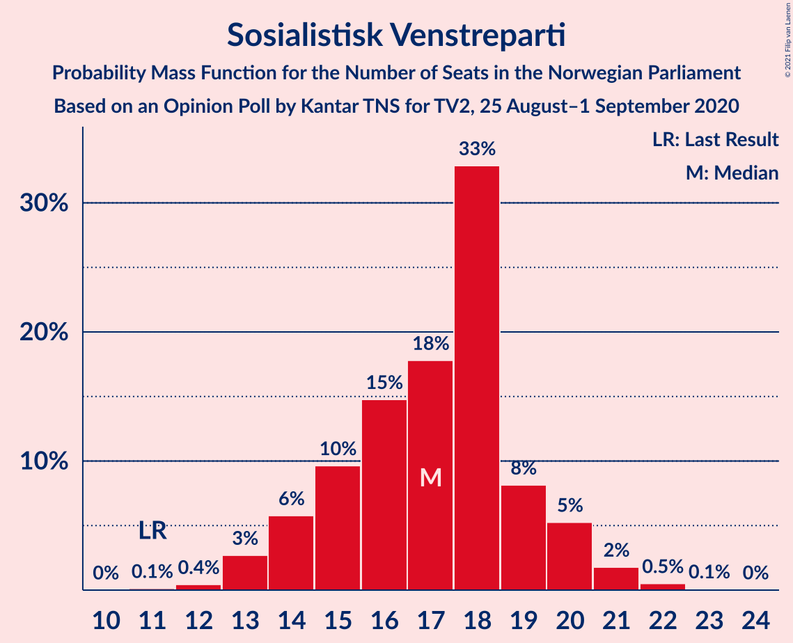

| Number of Seats | Probability | Accumulated | Special Marks |
|:---------------:|:-----------:|:-----------:|:-------------:|
| 11 | 0.1% | 100% | Last Result |
| 12 | 0.4% | 99.8% |  |
| 13 | 3% | 99.4% |  |
| 14 | 6% | 97% |  |
| 15 | 10% | 91% |  |
| 16 | 15% | 81% |  |
| 17 | 18% | 67% | Median |
| 18 | 33% | 49% |  |
| 19 | 8% | 16% |  |
| 20 | 5% | 8% |  |
| 21 | 2% | 2% |  |
| 22 | 0.5% | 0.6% |  |
| 23 | 0.1% | 0.1% |  |
| 24 | 0% | 0% |  |

### Miljøpartiet De Grønne

*For a full overview of the results for this party, see the [Miljøpartiet De Grønne](party-miljøpartietdegrønne.html) page.*

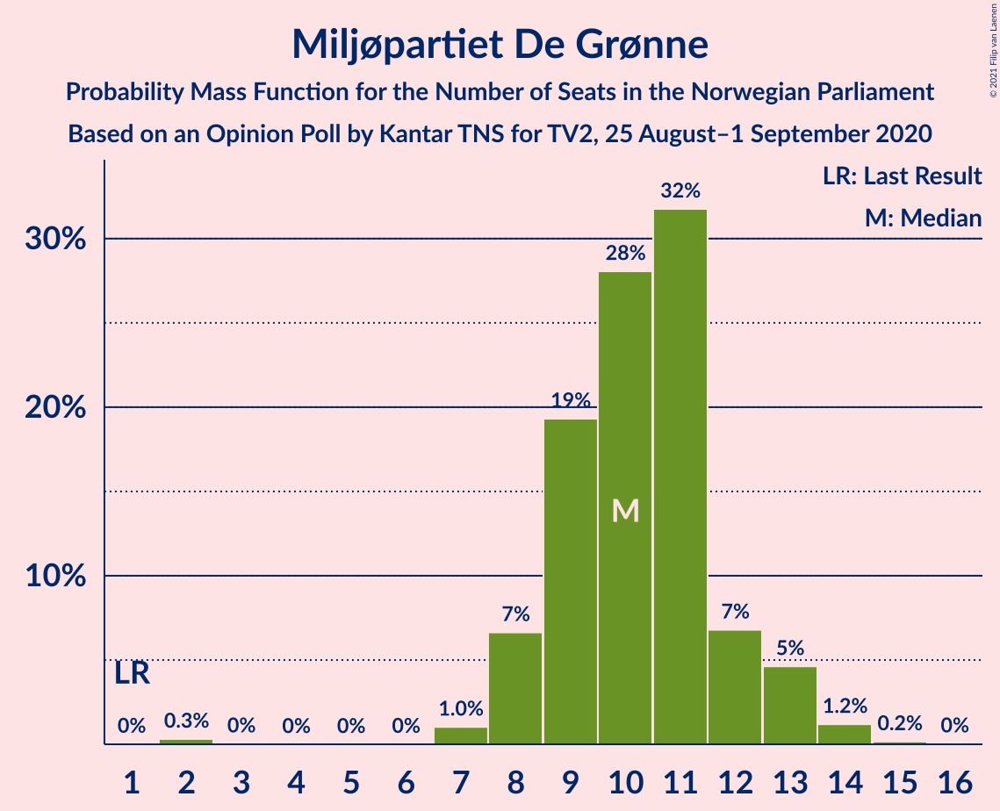

| Number of Seats | Probability | Accumulated | Special Marks |
|:---------------:|:-----------:|:-----------:|:-------------:|
| 1 | 0% | 100% | Last Result |
| 2 | 0.3% | 100% |  |
| 3 | 0% | 99.7% |  |
| 4 | 0% | 99.6% |  |
| 5 | 0% | 99.6% |  |
| 6 | 0% | 99.6% |  |
| 7 | 1.0% | 99.6% |  |
| 8 | 7% | 98.6% |  |
| 9 | 19% | 92% |  |
| 10 | 28% | 73% | Median |
| 11 | 32% | 45% |  |
| 12 | 7% | 13% |  |
| 13 | 5% | 6% |  |
| 14 | 1.2% | 1.4% |  |
| 15 | 0.2% | 0.2% |  |
| 16 | 0% | 0% |  |

### Rødt

*For a full overview of the results for this party, see the [Rødt](party-rødt.html) page.*

| Number of Seats | Probability | Accumulated | Special Marks |
|:---------------:|:-----------:|:-----------:|:-------------:|
| 1 | 0% | 100% | Last Result |
| 2 | 1.3% | 100% |  |
| 3 | 0% | 98.7% |  |
| 4 | 0% | 98.7% |  |
| 5 | 0% | 98.7% |  |
| 6 | 0.1% | 98.7% |  |
| 7 | 1.3% | 98.6% |  |
| 8 | 10% | 97% |  |
| 9 | 24% | 87% |  |
| 10 | 36% | 63% | Median |
| 11 | 16% | 27% |  |
| 12 | 6% | 11% |  |
| 13 | 4% | 4% |  |
| 14 | 0.6% | 0.6% |  |
| 15 | 0.1% | 0.1% |  |
| 16 | 0% | 0% |  |

### Kristelig Folkeparti

*For a full overview of the results for this party, see the [Kristelig Folkeparti](party-kristeligfolkeparti.html) page.*

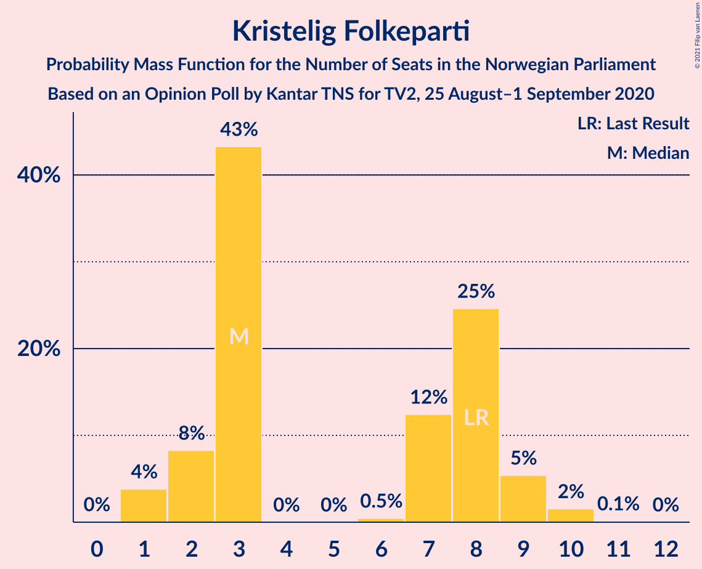

| Number of Seats | Probability | Accumulated | Special Marks |
|:---------------:|:-----------:|:-----------:|:-------------:|
| 1 | 4% | 100% |  |
| 2 | 8% | 96% |  |
| 3 | 43% | 88% | Median |
| 4 | 0% | 45% |  |
| 5 | 0% | 45% |  |
| 6 | 0.5% | 45% |  |
| 7 | 12% | 44% |  |
| 8 | 25% | 32% | Last Result |
| 9 | 5% | 7% |  |
| 10 | 2% | 2% |  |
| 11 | 0.1% | 0.2% |  |
| 12 | 0% | 0% |  |

### Venstre

*For a full overview of the results for this party, see the [Venstre](party-venstre.html) page.*

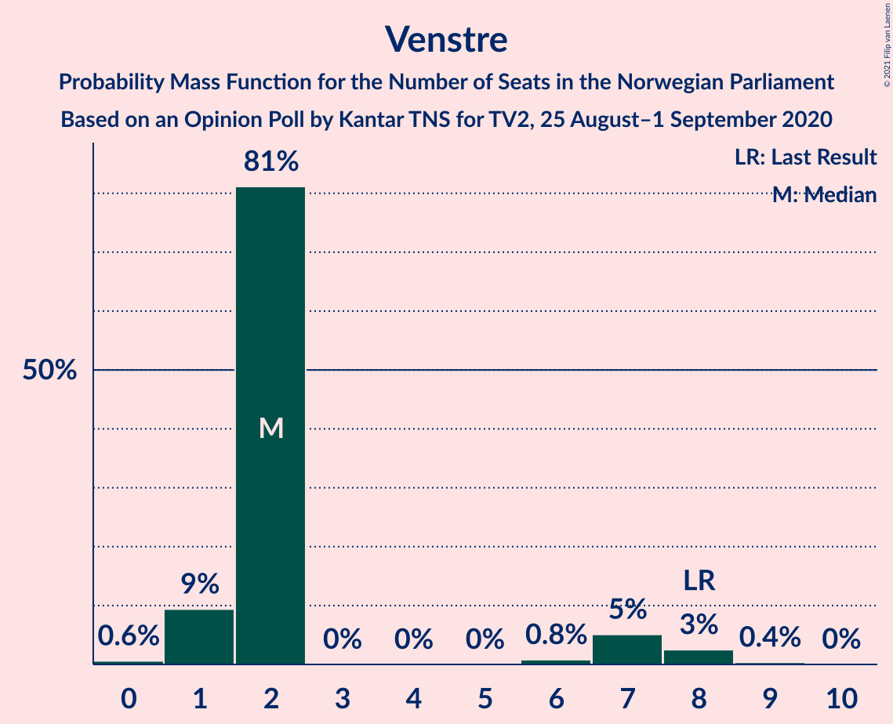

| Number of Seats | Probability | Accumulated | Special Marks |
|:---------------:|:-----------:|:-----------:|:-------------:|
| 0 | 0.6% | 100% |  |
| 1 | 9% | 99.4% |  |
| 2 | 81% | 90% | Median |
| 3 | 0% | 9% |  |
| 4 | 0% | 9% |  |
| 5 | 0% | 9% |  |
| 6 | 0.8% | 9% |  |
| 7 | 5% | 8% |  |
| 8 | 3% | 3% | Last Result |
| 9 | 0.4% | 0.4% |  |
| 10 | 0% | 0% |  |

## Coalitions

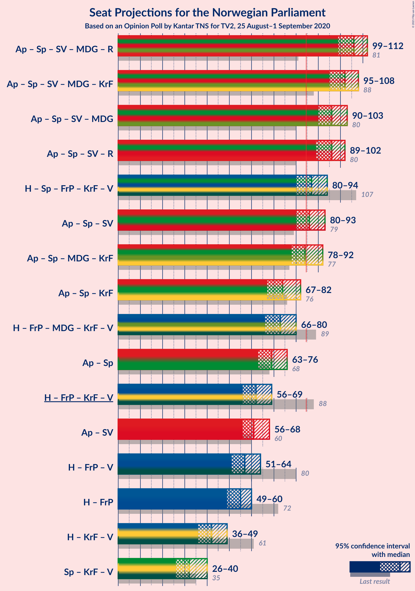

### Confidence Intervals

| Coalition | Last Result | Median | Majority? | 80% Confidence Interval | 90% Confidence Interval | 95% Confidence Interval | 99% Confidence Interval |
|:---------:|:-----------:|:------:|:---------:|:-----------------------:|:-----------------------:|:-----------------------:|:-----------------------:|
| Arbeiderpartiet – Senterpartiet – Sosialistisk Venstreparti – Miljøpartiet De Grønne – Rødt | 81 | 106 | 100% | 102–110 | 100–111 | 99–112 | 96–115 |
| Arbeiderpartiet – Senterpartiet – Sosialistisk Venstreparti – Miljøpartiet De Grønne – Kristelig Folkeparti | 88 | 102 | 100% | 97–105 | 96–107 | 95–108 | 92–110 |
| Arbeiderpartiet – Senterpartiet – Sosialistisk Venstreparti – Miljøpartiet De Grønne | 80 | 96 | 100% | 92–100 | 91–102 | 90–103 | 87–106 |
| Arbeiderpartiet – Senterpartiet – Sosialistisk Venstreparti – Rødt | 80 | 96 | 99.9% | 92–100 | 91–101 | 89–102 | 87–105 |
| Høyre – Senterpartiet – Fremskrittspartiet – Kristelig Folkeparti – Venstre | 107 | 87 | 72% | 84–92 | 83–93 | 80–94 | 78–96 |
| Arbeiderpartiet – Senterpartiet – Sosialistisk Venstreparti | 79 | 86 | 65% | 83–90 | 81–92 | 80–93 | 78–95 |
| Arbeiderpartiet – Senterpartiet – Miljøpartiet De Grønne – Kristelig Folkeparti | 77 | 84 | 50% | 80–89 | 79–91 | 78–92 | 76–94 |
| Arbeiderpartiet – Senterpartiet – Kristelig Folkeparti | 76 | 74 | 0.4% | 70–79 | 68–81 | 67–82 | 66–84 |
| Høyre – Fremskrittspartiet – Miljøpartiet De Grønne – Kristelig Folkeparti – Venstre | 89 | 73 | 0.1% | 69–77 | 68–78 | 66–80 | 64–82 |
| Arbeiderpartiet – Senterpartiet | 68 | 69 | 0% | 66–73 | 64–74 | 63–76 | 62–78 |
| Høyre – Fremskrittspartiet – Kristelig Folkeparti – Venstre | 88 | 62 | 0% | 59–67 | 58–69 | 56–69 | 54–72 |
| Arbeiderpartiet – Sosialistisk Venstreparti | 60 | 61 | 0% | 58–65 | 57–66 | 56–68 | 55–70 |
| Høyre – Fremskrittspartiet – Venstre | 80 | 57 | 0% | 54–61 | 52–62 | 51–64 | 50–67 |
| Høyre – Fremskrittspartiet | 72 | 55 | 0% | 52–59 | 50–60 | 49–60 | 48–64 |
| Høyre – Kristelig Folkeparti – Venstre | 61 | 42 | 0% | 39–46 | 38–48 | 36–49 | 35–51 |
| Senterpartiet – Kristelig Folkeparti – Venstre | 35 | 32 | 0% | 27–37 | 27–38 | 26–40 | 25–42 |

### Arbeiderpartiet – Senterpartiet – Sosialistisk Venstreparti – Miljøpartiet De Grønne – Rødt

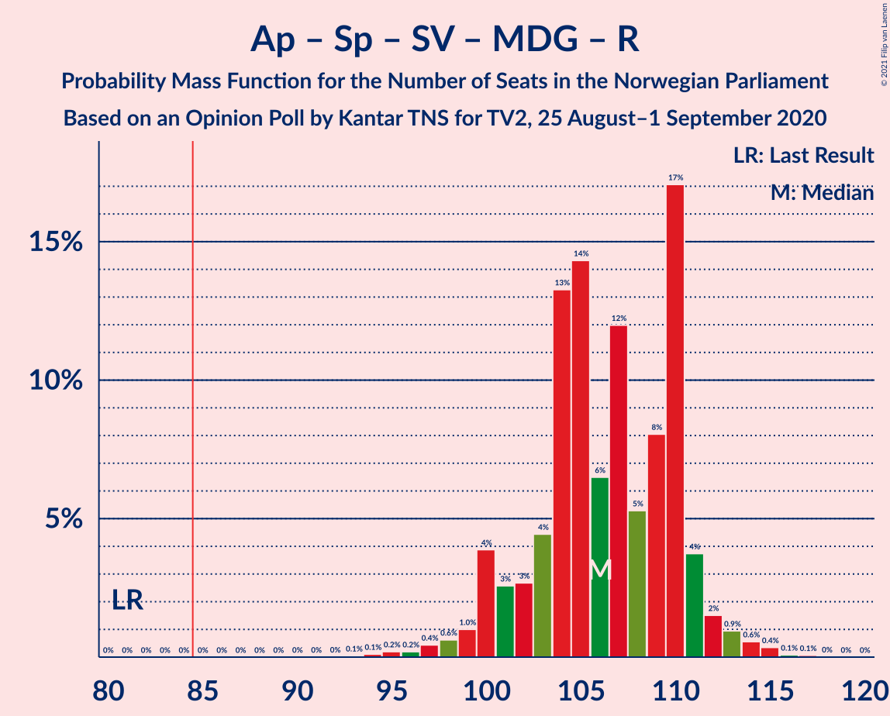

| Number of Seats | Probability | Accumulated | Special Marks |
|:---------------:|:-----------:|:-----------:|:-------------:|
| 81 | 0% | 100% | Last Result |
| 82 | 0% | 100% |  |
| 83 | 0% | 100% |  |
| 84 | 0% | 100% |  |
| 85 | 0% | 100% | Majority |
| 86 | 0% | 100% |  |
| 87 | 0% | 100% |  |
| 88 | 0% | 100% |  |
| 89 | 0% | 100% |  |
| 90 | 0% | 100% |  |
| 91 | 0% | 100% |  |
| 92 | 0% | 100% |  |
| 93 | 0.1% | 100% |  |
| 94 | 0.1% | 99.9% |  |
| 95 | 0.2% | 99.8% |  |
| 96 | 0.2% | 99.6% |  |
| 97 | 0.4% | 99.4% |  |
| 98 | 0.6% | 99.0% |  |
| 99 | 1.0% | 98% |  |
| 100 | 4% | 97% |  |
| 101 | 3% | 93% |  |
| 102 | 3% | 91% |  |
| 103 | 4% | 88% |  |
| 104 | 13% | 84% |  |
| 105 | 14% | 70% | Median |
| 106 | 6% | 56% |  |
| 107 | 12% | 50% |  |
| 108 | 5% | 38% |  |
| 109 | 8% | 32% |  |
| 110 | 17% | 24% |  |
| 111 | 4% | 7% |  |
| 112 | 2% | 4% |  |
| 113 | 0.9% | 2% |  |
| 114 | 0.6% | 1.1% |  |
| 115 | 0.4% | 0.5% |  |
| 116 | 0.1% | 0.2% |  |
| 117 | 0.1% | 0.1% |  |
| 118 | 0% | 0% |  |

### Arbeiderpartiet – Senterpartiet – Sosialistisk Venstreparti – Miljøpartiet De Grønne – Kristelig Folkeparti

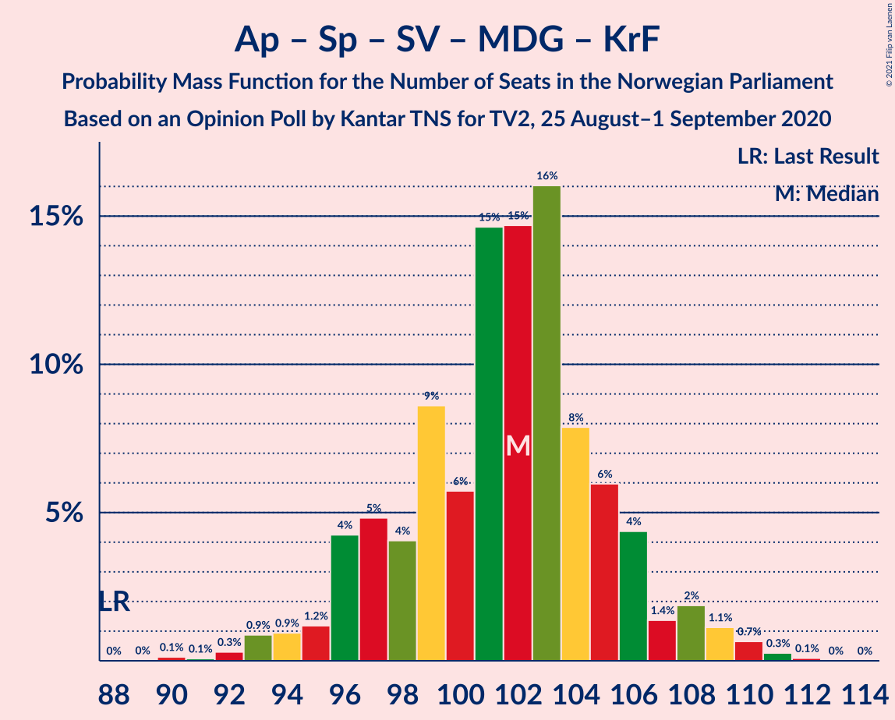

| Number of Seats | Probability | Accumulated | Special Marks |
|:---------------:|:-----------:|:-----------:|:-------------:|
| 88 | 0% | 100% | Last Result |
| 89 | 0% | 100% |  |
| 90 | 0.1% | 100% |  |
| 91 | 0.1% | 99.8% |  |
| 92 | 0.3% | 99.8% |  |
| 93 | 0.9% | 99.5% |  |
| 94 | 0.9% | 98.6% |  |
| 95 | 1.2% | 98% |  |
| 96 | 4% | 96% |  |
| 97 | 5% | 92% |  |
| 98 | 4% | 87% | Median |
| 99 | 9% | 83% |  |
| 100 | 6% | 75% |  |
| 101 | 15% | 69% |  |
| 102 | 15% | 54% |  |
| 103 | 16% | 40% |  |
| 104 | 8% | 24% |  |
| 105 | 6% | 16% |  |
| 106 | 4% | 10% |  |
| 107 | 1.4% | 5% |  |
| 108 | 2% | 4% |  |
| 109 | 1.1% | 2% |  |
| 110 | 0.7% | 1.0% |  |
| 111 | 0.3% | 0.4% |  |
| 112 | 0.1% | 0.1% |  |
| 113 | 0% | 0% |  |

### Arbeiderpartiet – Senterpartiet – Sosialistisk Venstreparti – Miljøpartiet De Grønne

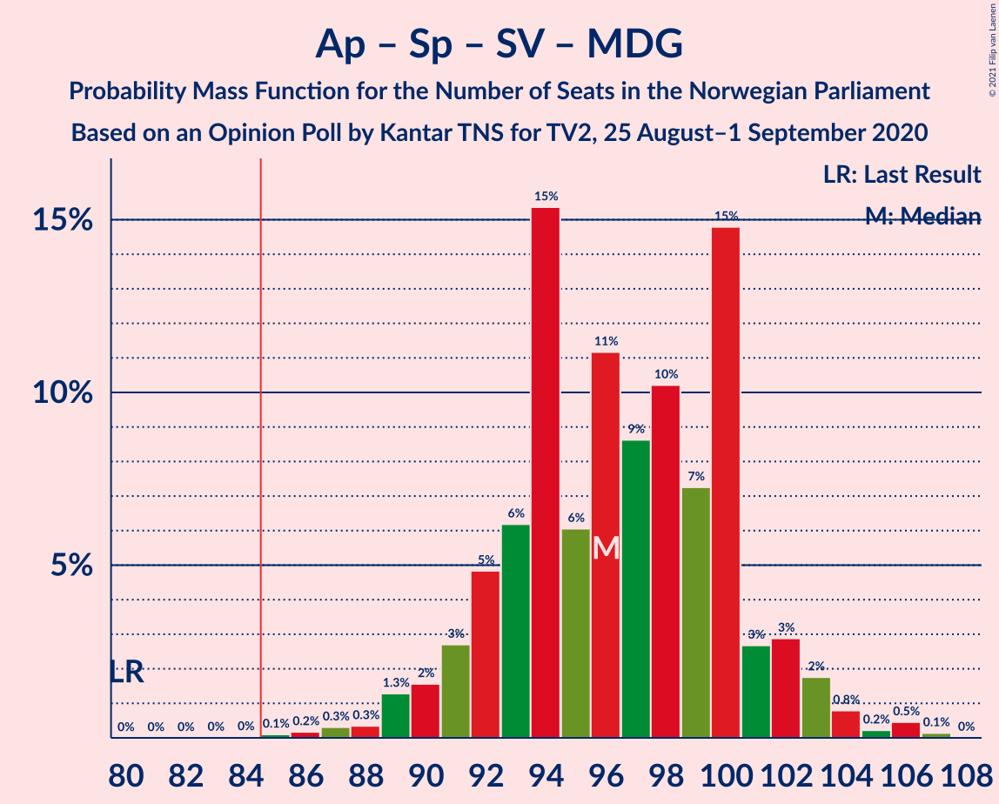

| Number of Seats | Probability | Accumulated | Special Marks |
|:---------------:|:-----------:|:-----------:|:-------------:|
| 80 | 0% | 100% | Last Result |
| 81 | 0% | 100% |  |
| 82 | 0% | 100% |  |
| 83 | 0% | 100% |  |
| 84 | 0% | 100% |  |
| 85 | 0.1% | 100% | Majority |
| 86 | 0.2% | 99.9% |  |
| 87 | 0.3% | 99.7% |  |
| 88 | 0.3% | 99.4% |  |
| 89 | 1.3% | 99.0% |  |
| 90 | 2% | 98% |  |
| 91 | 3% | 96% |  |
| 92 | 5% | 93% |  |
| 93 | 6% | 89% |  |
| 94 | 15% | 82% |  |
| 95 | 6% | 67% | Median |
| 96 | 11% | 61% |  |
| 97 | 9% | 50% |  |
| 98 | 10% | 41% |  |
| 99 | 7% | 31% |  |
| 100 | 15% | 24% |  |
| 101 | 3% | 9% |  |
| 102 | 3% | 6% |  |
| 103 | 2% | 3% |  |
| 104 | 0.8% | 2% |  |
| 105 | 0.2% | 0.8% |  |
| 106 | 0.5% | 0.6% |  |
| 107 | 0.1% | 0.2% |  |
| 108 | 0% | 0% |  |

### Arbeiderpartiet – Senterpartiet – Sosialistisk Venstreparti – Rødt

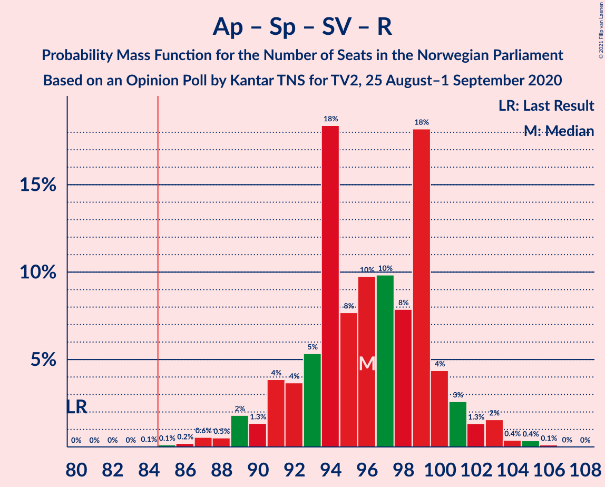

| Number of Seats | Probability | Accumulated | Special Marks |
|:---------------:|:-----------:|:-----------:|:-------------:|
| 80 | 0% | 100% | Last Result |
| 81 | 0% | 100% |  |
| 82 | 0% | 100% |  |
| 83 | 0% | 100% |  |
| 84 | 0.1% | 100% |  |
| 85 | 0.1% | 99.9% | Majority |
| 86 | 0.2% | 99.8% |  |
| 87 | 0.6% | 99.6% |  |
| 88 | 0.5% | 99.0% |  |
| 89 | 2% | 98.5% |  |
| 90 | 1.3% | 97% |  |
| 91 | 4% | 95% |  |
| 92 | 4% | 92% |  |
| 93 | 5% | 88% |  |
| 94 | 18% | 82% |  |
| 95 | 8% | 64% | Median |
| 96 | 10% | 56% |  |
| 97 | 10% | 47% |  |
| 98 | 8% | 37% |  |
| 99 | 18% | 29% |  |
| 100 | 4% | 11% |  |
| 101 | 3% | 6% |  |
| 102 | 1.3% | 4% |  |
| 103 | 2% | 2% |  |
| 104 | 0.4% | 0.9% |  |
| 105 | 0.4% | 0.5% |  |
| 106 | 0.1% | 0.2% |  |
| 107 | 0% | 0% |  |

### Høyre – Senterpartiet – Fremskrittspartiet – Kristelig Folkeparti – Venstre

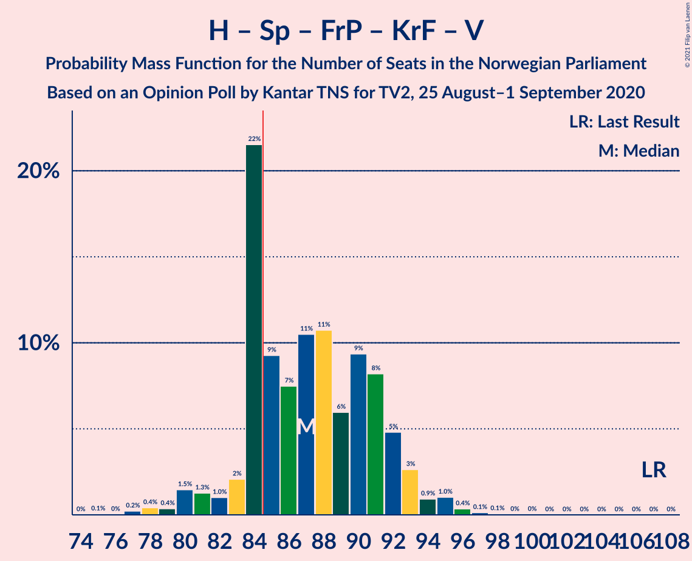

| Number of Seats | Probability | Accumulated | Special Marks |
|:---------------:|:-----------:|:-----------:|:-------------:|
| 75 | 0.1% | 100% |  |
| 76 | 0% | 99.9% |  |
| 77 | 0.2% | 99.9% |  |
| 78 | 0.4% | 99.7% |  |
| 79 | 0.4% | 99.3% |  |
| 80 | 1.5% | 98.9% |  |
| 81 | 1.3% | 97% |  |
| 82 | 1.0% | 96% |  |
| 83 | 2% | 95% | Median |
| 84 | 22% | 93% |  |
| 85 | 9% | 72% | Majority |
| 86 | 7% | 62% |  |
| 87 | 11% | 55% |  |
| 88 | 11% | 44% |  |
| 89 | 6% | 34% |  |
| 90 | 9% | 28% |  |
| 91 | 8% | 18% |  |
| 92 | 5% | 10% |  |
| 93 | 3% | 5% |  |
| 94 | 0.9% | 3% |  |
| 95 | 1.0% | 2% |  |
| 96 | 0.4% | 0.6% |  |
| 97 | 0.1% | 0.3% |  |
| 98 | 0.1% | 0.1% |  |
| 99 | 0% | 0.1% |  |
| 100 | 0% | 0% |  |
| 101 | 0% | 0% |  |
| 102 | 0% | 0% |  |
| 103 | 0% | 0% |  |
| 104 | 0% | 0% |  |
| 105 | 0% | 0% |  |
| 106 | 0% | 0% |  |
| 107 | 0% | 0% | Last Result |

### Arbeiderpartiet – Senterpartiet – Sosialistisk Venstreparti

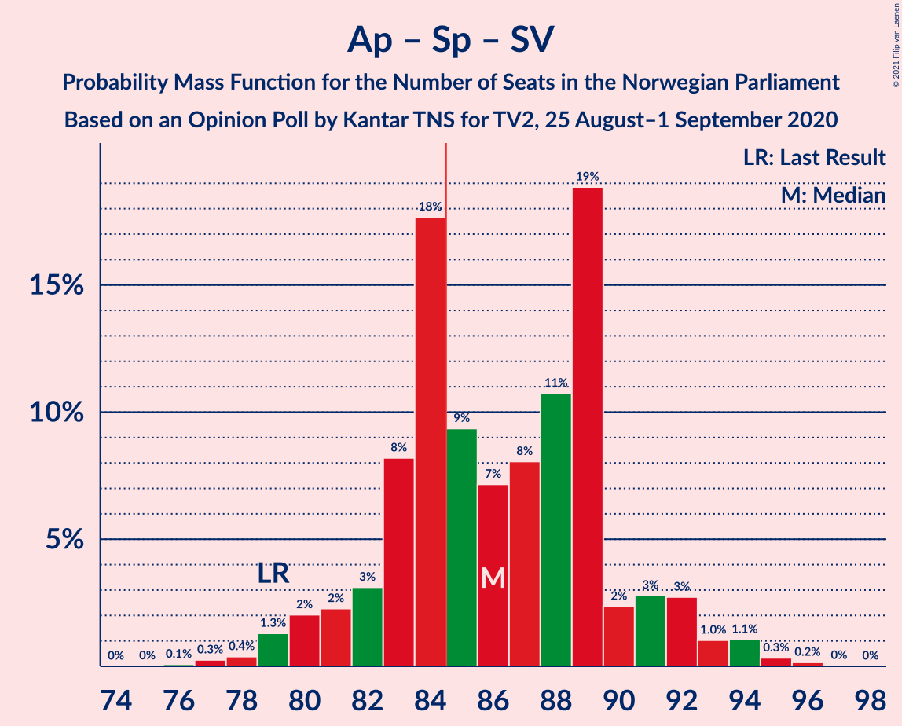

| Number of Seats | Probability | Accumulated | Special Marks |
|:---------------:|:-----------:|:-----------:|:-------------:|
| 76 | 0.1% | 100% |  |
| 77 | 0.3% | 99.9% |  |
| 78 | 0.4% | 99.6% |  |
| 79 | 1.3% | 99.3% | Last Result |
| 80 | 2% | 98% |  |
| 81 | 2% | 96% |  |
| 82 | 3% | 94% |  |
| 83 | 8% | 91% |  |
| 84 | 18% | 82% |  |
| 85 | 9% | 65% | Median, Majority |
| 86 | 7% | 55% |  |
| 87 | 8% | 48% |  |
| 88 | 11% | 40% |  |
| 89 | 19% | 29% |  |
| 90 | 2% | 11% |  |
| 91 | 3% | 8% |  |
| 92 | 3% | 5% |  |
| 93 | 1.0% | 3% |  |
| 94 | 1.1% | 2% |  |
| 95 | 0.3% | 0.5% |  |
| 96 | 0.2% | 0.2% |  |
| 97 | 0% | 0.1% |  |
| 98 | 0% | 0% |  |

### Arbeiderpartiet – Senterpartiet – Miljøpartiet De Grønne – Kristelig Folkeparti

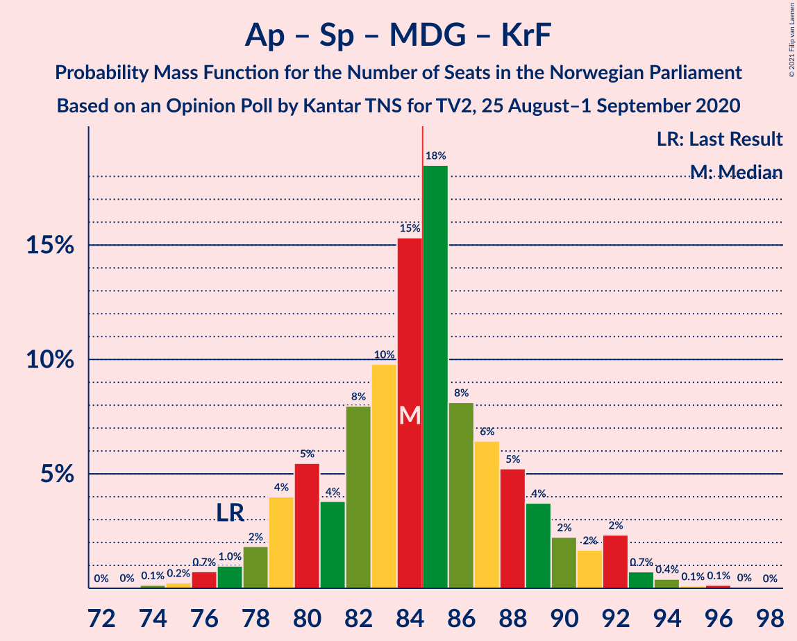

| Number of Seats | Probability | Accumulated | Special Marks |
|:---------------:|:-----------:|:-----------:|:-------------:|
| 73 | 0% | 100% |  |
| 74 | 0.1% | 99.9% |  |
| 75 | 0.2% | 99.8% |  |
| 76 | 0.7% | 99.6% |  |
| 77 | 1.0% | 98.8% | Last Result |
| 78 | 2% | 98% |  |
| 79 | 4% | 96% |  |
| 80 | 5% | 92% |  |
| 81 | 4% | 87% | Median |
| 82 | 8% | 83% |  |
| 83 | 10% | 75% |  |
| 84 | 15% | 65% |  |
| 85 | 18% | 50% | Majority |
| 86 | 8% | 31% |  |
| 87 | 6% | 23% |  |
| 88 | 5% | 17% |  |
| 89 | 4% | 11% |  |
| 90 | 2% | 8% |  |
| 91 | 2% | 5% |  |
| 92 | 2% | 4% |  |
| 93 | 0.7% | 1.4% |  |
| 94 | 0.4% | 0.7% |  |
| 95 | 0.1% | 0.3% |  |
| 96 | 0.1% | 0.2% |  |
| 97 | 0% | 0.1% |  |
| 98 | 0% | 0% |  |

### Arbeiderpartiet – Senterpartiet – Kristelig Folkeparti

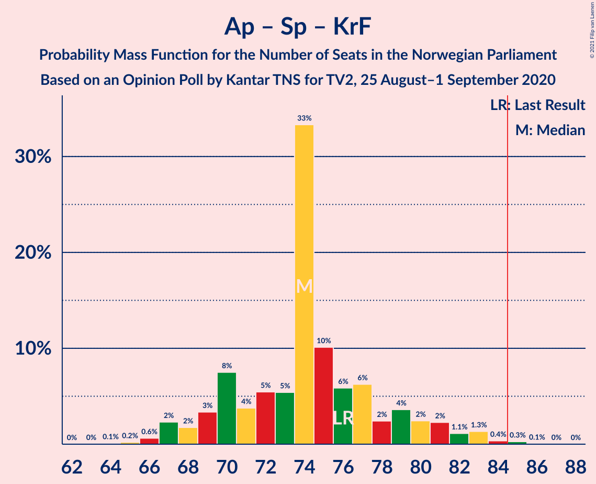

| Number of Seats | Probability | Accumulated | Special Marks |
|:---------------:|:-----------:|:-----------:|:-------------:|
| 64 | 0.1% | 100% |  |
| 65 | 0.2% | 99.9% |  |
| 66 | 0.6% | 99.7% |  |
| 67 | 2% | 99.0% |  |
| 68 | 2% | 97% |  |
| 69 | 3% | 95% |  |
| 70 | 8% | 92% |  |
| 71 | 4% | 84% | Median |
| 72 | 5% | 80% |  |
| 73 | 5% | 75% |  |
| 74 | 33% | 69% |  |
| 75 | 10% | 36% |  |
| 76 | 6% | 26% | Last Result |
| 77 | 6% | 20% |  |
| 78 | 2% | 14% |  |
| 79 | 4% | 12% |  |
| 80 | 2% | 8% |  |
| 81 | 2% | 5% |  |
| 82 | 1.1% | 3% |  |
| 83 | 1.3% | 2% |  |
| 84 | 0.4% | 0.7% |  |
| 85 | 0.3% | 0.4% | Majority |
| 86 | 0.1% | 0.1% |  |
| 87 | 0% | 0% |  |

### Høyre – Fremskrittspartiet – Miljøpartiet De Grønne – Kristelig Folkeparti – Venstre

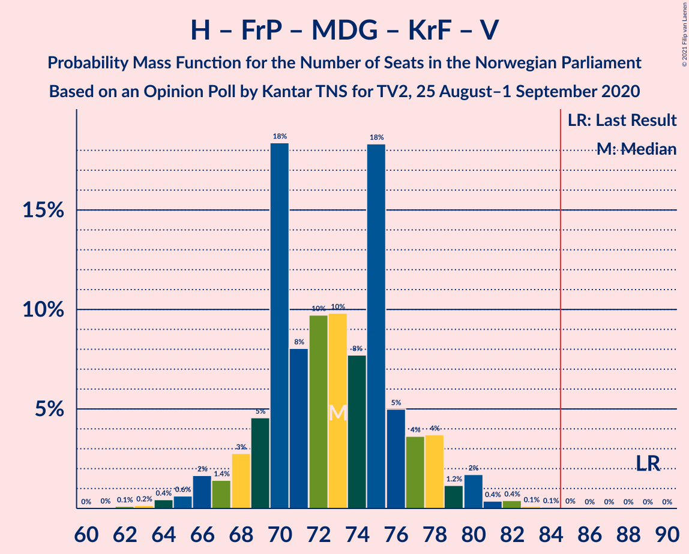

| Number of Seats | Probability | Accumulated | Special Marks |
|:---------------:|:-----------:|:-----------:|:-------------:|
| 61 | 0% | 100% |  |
| 62 | 0.1% | 99.9% |  |
| 63 | 0.2% | 99.8% |  |
| 64 | 0.4% | 99.7% |  |
| 65 | 0.6% | 99.2% |  |
| 66 | 2% | 98.6% |  |
| 67 | 1.4% | 97% |  |
| 68 | 3% | 96% |  |
| 69 | 5% | 93% | Median |
| 70 | 18% | 88% |  |
| 71 | 8% | 70% |  |
| 72 | 10% | 62% |  |
| 73 | 10% | 52% |  |
| 74 | 8% | 42% |  |
| 75 | 18% | 35% |  |
| 76 | 5% | 16% |  |
| 77 | 4% | 11% |  |
| 78 | 4% | 8% |  |
| 79 | 1.2% | 4% |  |
| 80 | 2% | 3% |  |
| 81 | 0.4% | 1.0% |  |
| 82 | 0.4% | 0.6% |  |
| 83 | 0.1% | 0.2% |  |
| 84 | 0.1% | 0.1% |  |
| 85 | 0% | 0.1% | Majority |
| 86 | 0% | 0% |  |
| 87 | 0% | 0% |  |
| 88 | 0% | 0% |  |
| 89 | 0% | 0% | Last Result |

### Arbeiderpartiet – Senterpartiet

| Number of Seats | Probability | Accumulated | Special Marks |
|:---------------:|:-----------:|:-----------:|:-------------:|
| 60 | 0.1% | 100% |  |
| 61 | 0.4% | 99.9% |  |
| 62 | 0.7% | 99.5% |  |
| 63 | 1.4% | 98.8% |  |
| 64 | 4% | 97% |  |
| 65 | 2% | 94% |  |
| 66 | 13% | 91% |  |
| 67 | 14% | 79% |  |
| 68 | 9% | 65% | Last Result, Median |
| 69 | 7% | 55% |  |
| 70 | 5% | 48% |  |
| 71 | 26% | 43% |  |
| 72 | 4% | 17% |  |
| 73 | 4% | 12% |  |
| 74 | 3% | 8% |  |
| 75 | 2% | 5% |  |
| 76 | 1.1% | 3% |  |
| 77 | 0.8% | 1.4% |  |
| 78 | 0.5% | 0.6% |  |
| 79 | 0.1% | 0.2% |  |
| 80 | 0.1% | 0.1% |  |
| 81 | 0% | 0% |  |

### Høyre – Fremskrittspartiet – Kristelig Folkeparti – Venstre

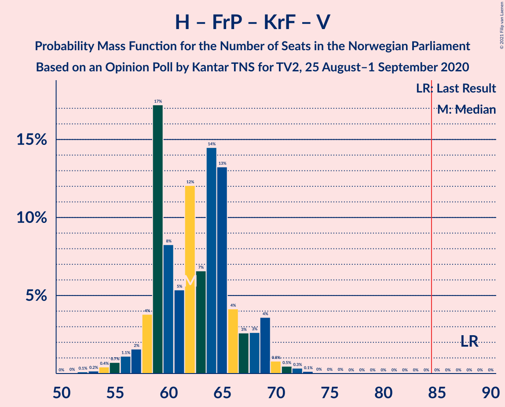

| Number of Seats | Probability | Accumulated | Special Marks |
|:---------------:|:-----------:|:-----------:|:-------------:|
| 52 | 0.1% | 100% |  |
| 53 | 0.2% | 99.8% |  |
| 54 | 0.4% | 99.7% |  |
| 55 | 0.7% | 99.3% |  |
| 56 | 1.1% | 98.5% |  |
| 57 | 2% | 97% |  |
| 58 | 4% | 96% |  |
| 59 | 17% | 92% | Median |
| 60 | 8% | 75% |  |
| 61 | 5% | 67% |  |
| 62 | 12% | 61% |  |
| 63 | 7% | 49% |  |
| 64 | 14% | 43% |  |
| 65 | 13% | 28% |  |
| 66 | 4% | 15% |  |
| 67 | 3% | 11% |  |
| 68 | 3% | 8% |  |
| 69 | 4% | 5% |  |
| 70 | 0.8% | 2% |  |
| 71 | 0.5% | 1.1% |  |
| 72 | 0.3% | 0.6% |  |
| 73 | 0.1% | 0.3% |  |
| 74 | 0% | 0.1% |  |
| 75 | 0% | 0.1% |  |
| 76 | 0% | 0% |  |
| 77 | 0% | 0% |  |
| 78 | 0% | 0% |  |
| 79 | 0% | 0% |  |
| 80 | 0% | 0% |  |
| 81 | 0% | 0% |  |
| 82 | 0% | 0% |  |
| 83 | 0% | 0% |  |
| 84 | 0% | 0% |  |
| 85 | 0% | 0% | Majority |
| 86 | 0% | 0% |  |
| 87 | 0% | 0% |  |
| 88 | 0% | 0% | Last Result |

### Arbeiderpartiet – Sosialistisk Venstreparti

| Number of Seats | Probability | Accumulated | Special Marks |
|:---------------:|:-----------:|:-----------:|:-------------:|
| 53 | 0% | 100% |  |
| 54 | 0.2% | 99.9% |  |
| 55 | 0.6% | 99.7% |  |
| 56 | 2% | 99.1% |  |
| 57 | 4% | 97% |  |
| 58 | 7% | 93% |  |
| 59 | 9% | 85% |  |
| 60 | 11% | 76% | Last Result |
| 61 | 18% | 66% | Median |
| 62 | 10% | 48% |  |
| 63 | 7% | 39% |  |
| 64 | 21% | 32% |  |
| 65 | 4% | 11% |  |
| 66 | 3% | 7% |  |
| 67 | 1.2% | 4% |  |
| 68 | 1.3% | 3% |  |
| 69 | 1.3% | 2% |  |
| 70 | 0.4% | 0.6% |  |
| 71 | 0.1% | 0.2% |  |
| 72 | 0% | 0.1% |  |
| 73 | 0% | 0% |  |

### Høyre – Fremskrittspartiet – Venstre

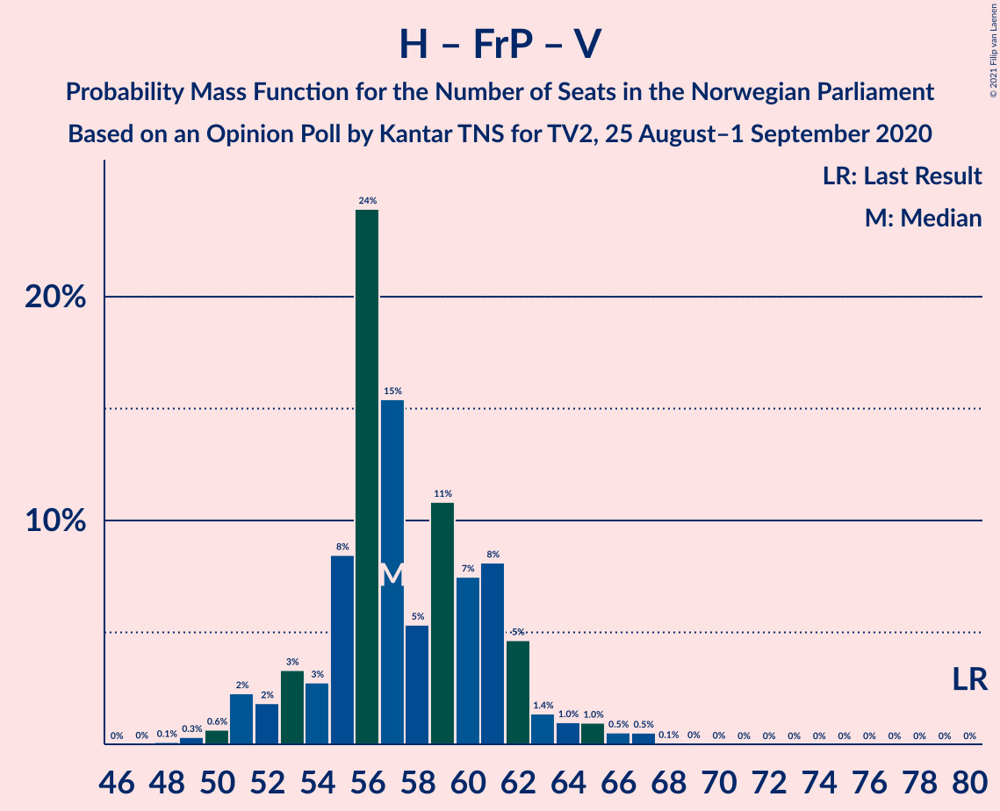

| Number of Seats | Probability | Accumulated | Special Marks |
|:---------------:|:-----------:|:-----------:|:-------------:|
| 48 | 0.1% | 100% |  |
| 49 | 0.3% | 99.9% |  |
| 50 | 0.6% | 99.5% |  |
| 51 | 2% | 98.9% |  |
| 52 | 2% | 97% |  |
| 53 | 3% | 95% |  |
| 54 | 3% | 91% |  |
| 55 | 8% | 89% |  |
| 56 | 24% | 80% | Median |
| 57 | 15% | 56% |  |
| 58 | 5% | 41% |  |
| 59 | 11% | 36% |  |
| 60 | 7% | 25% |  |
| 61 | 8% | 17% |  |
| 62 | 5% | 9% |  |
| 63 | 1.4% | 4% |  |
| 64 | 1.0% | 3% |  |
| 65 | 1.0% | 2% |  |
| 66 | 0.5% | 1.2% |  |
| 67 | 0.5% | 0.6% |  |
| 68 | 0.1% | 0.1% |  |
| 69 | 0% | 0.1% |  |
| 70 | 0% | 0% |  |
| 71 | 0% | 0% |  |
| 72 | 0% | 0% |  |
| 73 | 0% | 0% |  |
| 74 | 0% | 0% |  |
| 75 | 0% | 0% |  |
| 76 | 0% | 0% |  |
| 77 | 0% | 0% |  |
| 78 | 0% | 0% |  |
| 79 | 0% | 0% |  |
| 80 | 0% | 0% | Last Result |

### Høyre – Fremskrittspartiet

| Number of Seats | Probability | Accumulated | Special Marks |
|:---------------:|:-----------:|:-----------:|:-------------:|
| 45 | 0% | 100% |  |
| 46 | 0.1% | 99.9% |  |
| 47 | 0.3% | 99.8% |  |
| 48 | 1.0% | 99.6% |  |
| 49 | 3% | 98.6% |  |
| 50 | 2% | 96% |  |
| 51 | 2% | 93% |  |
| 52 | 4% | 91% |  |
| 53 | 10% | 88% |  |
| 54 | 26% | 77% | Median |
| 55 | 15% | 52% |  |
| 56 | 4% | 36% |  |
| 57 | 10% | 32% |  |
| 58 | 9% | 22% |  |
| 59 | 8% | 13% |  |
| 60 | 3% | 5% |  |
| 61 | 0.9% | 2% |  |
| 62 | 0.5% | 2% |  |
| 63 | 0.5% | 1.0% |  |
| 64 | 0.1% | 0.5% |  |
| 65 | 0.3% | 0.4% |  |
| 66 | 0% | 0% |  |
| 67 | 0% | 0% |  |
| 68 | 0% | 0% |  |
| 69 | 0% | 0% |  |
| 70 | 0% | 0% |  |
| 71 | 0% | 0% |  |
| 72 | 0% | 0% | Last Result |

### Høyre – Kristelig Folkeparti – Venstre

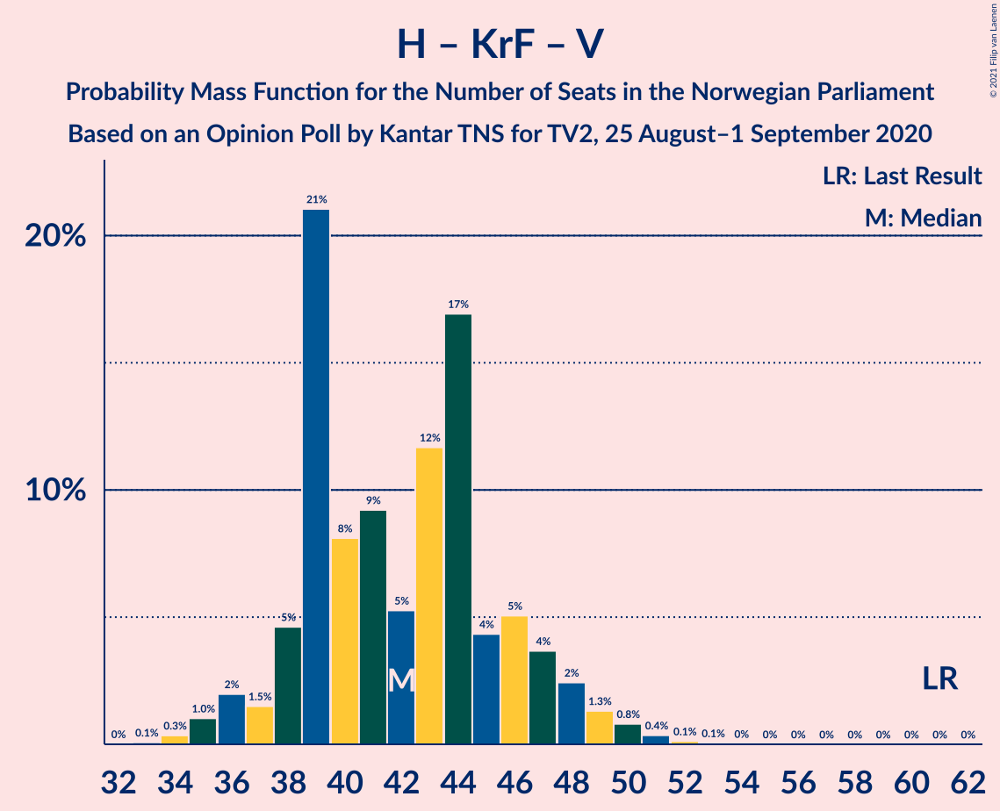

| Number of Seats | Probability | Accumulated | Special Marks |
|:---------------:|:-----------:|:-----------:|:-------------:|
| 33 | 0.1% | 100% |  |
| 34 | 0.3% | 99.9% |  |
| 35 | 1.0% | 99.6% |  |
| 36 | 2% | 98.5% |  |
| 37 | 1.5% | 97% |  |
| 38 | 5% | 95% |  |
| 39 | 21% | 90% | Median |
| 40 | 8% | 69% |  |
| 41 | 9% | 61% |  |
| 42 | 5% | 52% |  |
| 43 | 12% | 47% |  |
| 44 | 17% | 35% |  |
| 45 | 4% | 18% |  |
| 46 | 5% | 14% |  |
| 47 | 4% | 9% |  |
| 48 | 2% | 5% |  |
| 49 | 1.3% | 3% |  |
| 50 | 0.8% | 1.4% |  |
| 51 | 0.4% | 0.6% |  |
| 52 | 0.1% | 0.2% |  |
| 53 | 0.1% | 0.1% |  |
| 54 | 0% | 0% |  |
| 55 | 0% | 0% |  |
| 56 | 0% | 0% |  |
| 57 | 0% | 0% |  |
| 58 | 0% | 0% |  |
| 59 | 0% | 0% |  |
| 60 | 0% | 0% |  |
| 61 | 0% | 0% | Last Result |

### Senterpartiet – Kristelig Folkeparti – Venstre

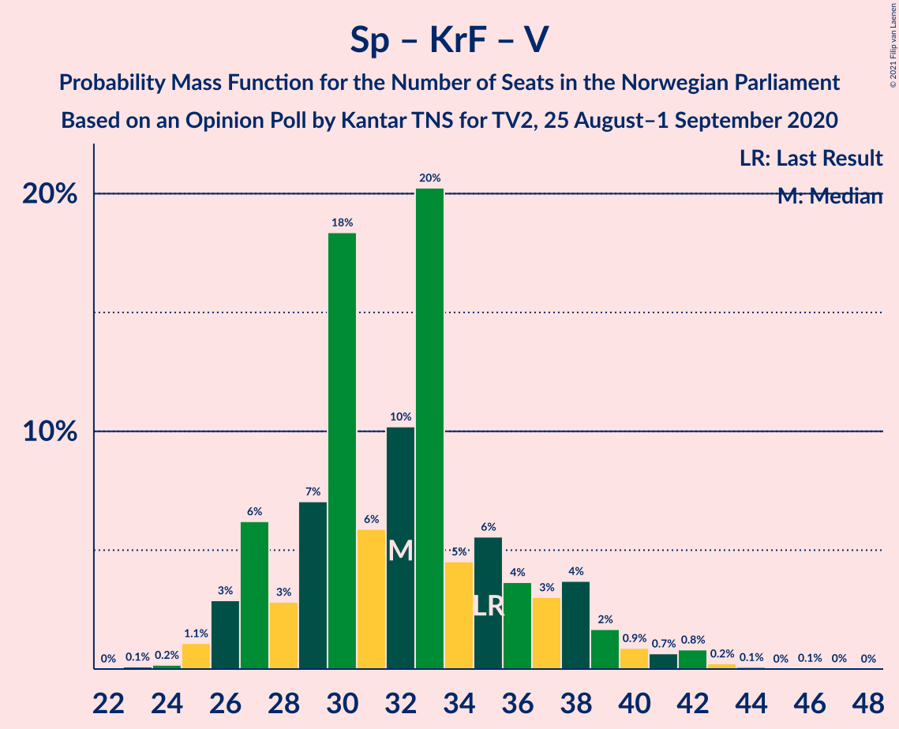

| Number of Seats | Probability | Accumulated | Special Marks |
|:---------------:|:-----------:|:-----------:|:-------------:|
| 23 | 0.1% | 100% |  |
| 24 | 0.2% | 99.9% |  |
| 25 | 1.1% | 99.7% |  |
| 26 | 3% | 98.6% |  |
| 27 | 6% | 96% |  |
| 28 | 3% | 90% |  |
| 29 | 7% | 87% | Median |
| 30 | 18% | 80% |  |
| 31 | 6% | 61% |  |
| 32 | 10% | 55% |  |
| 33 | 20% | 45% |  |
| 34 | 5% | 25% |  |
| 35 | 6% | 20% | Last Result |
| 36 | 4% | 15% |  |
| 37 | 3% | 11% |  |
| 38 | 4% | 8% |  |
| 39 | 2% | 4% |  |
| 40 | 0.9% | 3% |  |
| 41 | 0.7% | 2% |  |
| 42 | 0.8% | 1.3% |  |
| 43 | 0.2% | 0.4% |  |
| 44 | 0.1% | 0.2% |  |
| 45 | 0% | 0.1% |  |
| 46 | 0.1% | 0.1% |  |
| 47 | 0% | 0.1% |  |
| 48 | 0% | 0% |  |

## Technical Information

### Opinion Poll

+ **Polling firm:** Kantar TNS
+ **Commissioner(s):** TV2
+ **Fieldwork period:** 25 August–1 September 2020

### Calculations

+ **Sample size:** 941
+ **Simulations done:** 1,048,576
+ **Error estimate:** 1.13%

