# Opinion Poll by Norfakta for Klassekampen and Nationen, 1–2 September 2020

<a href="#voting-intentions">Voting Intentions</a> | <a href="#seats">Seats</a> | <a href="#coalitions">Coalitions</a> | <a href="#technical-information">Technical Information</a>

## Voting Intentions

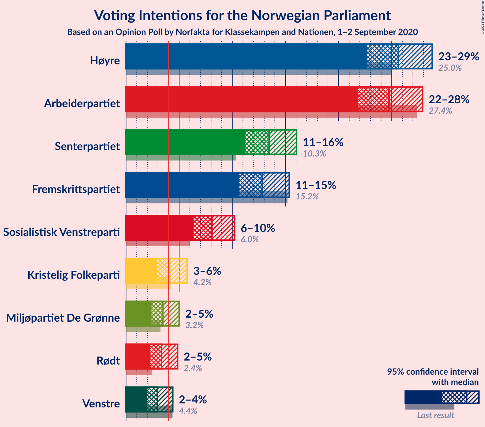

### Confidence Intervals

| Party | Last Result | Poll Result | 80% Confidence Interval | 90% Confidence Interval | 95% Confidence Interval | 99% Confidence Interval |
|:-----:|:-----------:|:-----------:|:-----------------------:|:-----------------------:|:-----------------------:|:-----------------------:|
| Høyre | 25.0% | 25.6% | 23.7–27.7% |23.2–28.3% |22.7–28.8% |21.8–29.8% |
| Arbeiderpartiet | 27.4% | 24.7% | 22.8–26.8% |22.3–27.4% |21.8–27.9% |21.0–28.9% |
| Senterpartiet | 10.3% | 13.5% | 12.0–15.2% |11.6–15.6% |11.2–16.0% |10.6–16.9% |
| Fremskrittspartiet | 15.2% | 12.8% | 11.4–14.5% |11.0–15.0% |10.7–15.4% |10.0–16.2% |
| Sosialistisk Venstreparti | 6.0% | 8.1% | 7.0–9.5% |6.6–9.9% |6.4–10.2% |5.9–10.9% |
| Kristelig Folkeparti | 4.2% | 4.1% | 3.3–5.2% |3.1–5.5% |2.9–5.7% |2.6–6.3% |
| Miljøpartiet De Grønne | 3.2% | 3.5% | 2.8–4.5% |2.5–4.7% |2.4–5.0% |2.1–5.5% |
| Rødt | 2.4% | 3.3% | 2.6–4.3% |2.4–4.6% |2.3–4.8% |2.0–5.4% |
| Venstre | 4.4% | 2.9% | 2.3–3.9% |2.1–4.2% |2.0–4.4% |1.7–4.9% |

*Note:* The poll result column reflects the actual value used in the calculations. Published results may vary slightly, and in addition be rounded to fewer digits.

## Seats

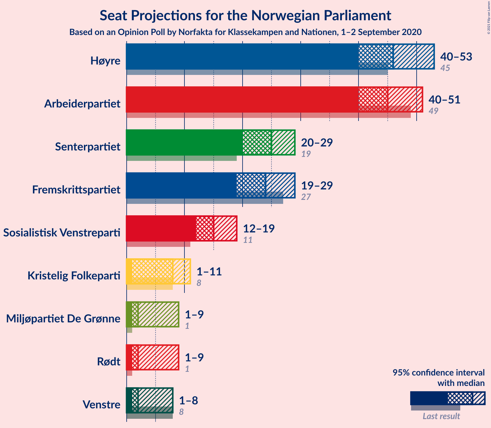

### Confidence Intervals

| Party | Last Result | Median | 80% Confidence Interval | 90% Confidence Interval | 95% Confidence Interval | 99% Confidence Interval |
|:-----:|:-----------:|:------:|:-----------------------:|:-----------------------:|:-----------------------:|:-----------------------:|
| <a href="#høyre">Høyre</a> | 45 | 46 | 43–50 |42–52 |40–53 |38–55 |
| <a href="#arbeiderpartiet">Arbeiderpartiet</a> | 49 | 45 | 41–49 |40–50 |40–51 |38–53 |
| <a href="#senterpartiet">Senterpartiet</a> | 19 | 25 | 22–28 |21–28 |20–29 |19–31 |
| <a href="#fremskrittspartiet">Fremskrittspartiet</a> | 27 | 24 | 21–27 |20–28 |19–29 |18–29 |
| <a href="#sosialistisk-venstreparti">Sosialistisk Venstreparti</a> | 11 | 15 | 13–17 |12–18 |12–19 |11–20 |
| <a href="#kristelig-folkeparti">Kristelig Folkeparti</a> | 8 | 8 | 3–10 |2–10 |1–11 |1–11 |
| <a href="#miljøpartiet-de-grønne">Miljøpartiet De Grønne</a> | 1 | 2 | 1–8 |1–8 |1–9 |1–10 |
| <a href="#rødt">Rødt</a> | 1 | 2 | 1–8 |1–8 |1–9 |1–9 |
| <a href="#venstre">Venstre</a> | 8 | 2 | 1–2 |1–7 |1–8 |0–9 |

### Høyre

*For a full overview of the results for this party, see the [Høyre](party-høyre.html) page.*

| Number of Seats | Probability | Accumulated | Special Marks |
|:---------------:|:-----------:|:-----------:|:-------------:|
| 36 | 0.1% | 100% |  |
| 37 | 0.1% | 99.9% |  |
| 38 | 0.6% | 99.8% |  |
| 39 | 0.4% | 99.3% |  |
| 40 | 2% | 98.9% |  |
| 41 | 2% | 97% |  |
| 42 | 5% | 95% |  |
| 43 | 6% | 90% |  |
| 44 | 7% | 84% |  |
| 45 | 11% | 76% | Last Result |
| 46 | 19% | 65% | Median |
| 47 | 11% | 46% |  |
| 48 | 12% | 35% |  |
| 49 | 10% | 24% |  |
| 50 | 4% | 14% |  |
| 51 | 3% | 9% |  |
| 52 | 3% | 6% |  |
| 53 | 2% | 3% |  |
| 54 | 0.7% | 1.2% |  |
| 55 | 0.3% | 0.5% |  |
| 56 | 0.1% | 0.2% |  |
| 57 | 0.1% | 0.1% |  |
| 58 | 0% | 0% |  |

### Arbeiderpartiet

*For a full overview of the results for this party, see the [Arbeiderpartiet](party-arbeiderpartiet.html) page.*

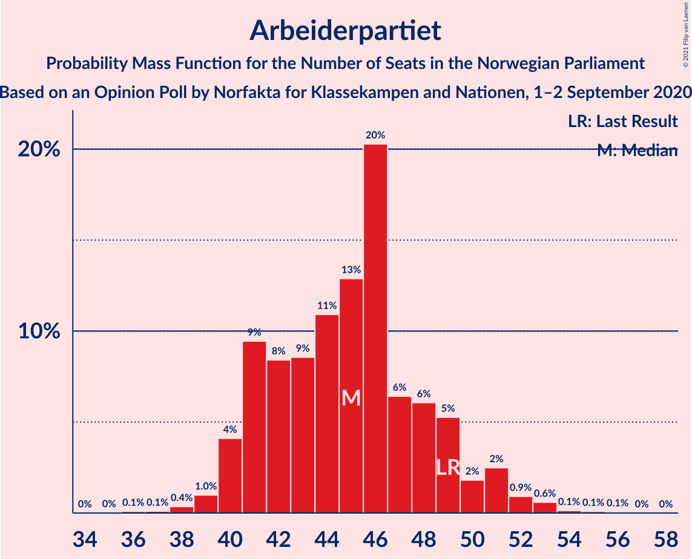

| Number of Seats | Probability | Accumulated | Special Marks |
|:---------------:|:-----------:|:-----------:|:-------------:|
| 36 | 0.1% | 100% |  |
| 37 | 0.1% | 99.9% |  |
| 38 | 0.4% | 99.8% |  |
| 39 | 1.0% | 99.4% |  |
| 40 | 4% | 98% |  |
| 41 | 9% | 94% |  |
| 42 | 8% | 85% |  |
| 43 | 9% | 76% |  |
| 44 | 11% | 68% |  |
| 45 | 13% | 57% | Median |
| 46 | 20% | 44% |  |
| 47 | 6% | 24% |  |
| 48 | 6% | 17% |  |
| 49 | 5% | 11% | Last Result |
| 50 | 2% | 6% |  |
| 51 | 2% | 4% |  |
| 52 | 0.9% | 2% |  |
| 53 | 0.6% | 0.9% |  |
| 54 | 0.1% | 0.3% |  |
| 55 | 0.1% | 0.2% |  |
| 56 | 0.1% | 0.1% |  |
| 57 | 0% | 0% |  |

### Senterpartiet

*For a full overview of the results for this party, see the [Senterpartiet](party-senterpartiet.html) page.*

| Number of Seats | Probability | Accumulated | Special Marks |
|:---------------:|:-----------:|:-----------:|:-------------:|
| 18 | 0.3% | 100% |  |
| 19 | 1.3% | 99.7% | Last Result |
| 20 | 2% | 98% |  |
| 21 | 3% | 96% |  |
| 22 | 7% | 93% |  |
| 23 | 14% | 86% |  |
| 24 | 18% | 72% |  |
| 25 | 11% | 54% | Median |
| 26 | 18% | 43% |  |
| 27 | 14% | 25% |  |
| 28 | 7% | 11% |  |
| 29 | 2% | 4% |  |
| 30 | 1.3% | 2% |  |
| 31 | 0.4% | 0.8% |  |
| 32 | 0.3% | 0.4% |  |
| 33 | 0.1% | 0.1% |  |
| 34 | 0% | 0% |  |

### Fremskrittspartiet

*For a full overview of the results for this party, see the [Fremskrittspartiet](party-fremskrittspartiet.html) page.*

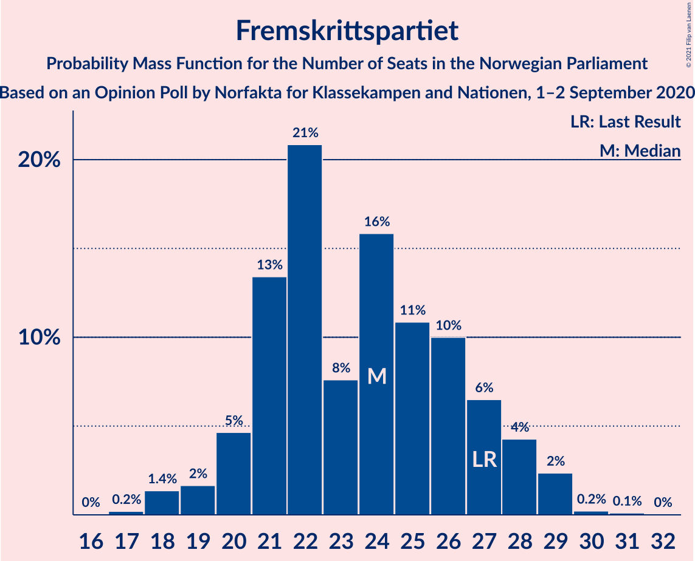

| Number of Seats | Probability | Accumulated | Special Marks |
|:---------------:|:-----------:|:-----------:|:-------------:|
| 17 | 0.2% | 100% |  |
| 18 | 1.4% | 99.8% |  |
| 19 | 2% | 98% |  |
| 20 | 5% | 97% |  |
| 21 | 13% | 92% |  |
| 22 | 21% | 79% |  |
| 23 | 8% | 58% |  |
| 24 | 16% | 50% | Median |
| 25 | 11% | 34% |  |
| 26 | 10% | 24% |  |
| 27 | 6% | 14% | Last Result |
| 28 | 4% | 7% |  |
| 29 | 2% | 3% |  |
| 30 | 0.2% | 0.4% |  |
| 31 | 0.1% | 0.2% |  |
| 32 | 0% | 0% |  |

### Sosialistisk Venstreparti

*For a full overview of the results for this party, see the [Sosialistisk Venstreparti](party-sosialistiskvenstreparti.html) page.*

| Number of Seats | Probability | Accumulated | Special Marks |
|:---------------:|:-----------:|:-----------:|:-------------:|
| 9 | 0.1% | 100% |  |
| 10 | 0.4% | 99.9% |  |
| 11 | 2% | 99.6% | Last Result |
| 12 | 6% | 98% |  |
| 13 | 16% | 92% |  |
| 14 | 16% | 76% |  |
| 15 | 22% | 59% | Median |
| 16 | 17% | 37% |  |
| 17 | 13% | 20% |  |
| 18 | 5% | 7% |  |
| 19 | 2% | 3% |  |
| 20 | 0.8% | 0.9% |  |
| 21 | 0.1% | 0.2% |  |
| 22 | 0.1% | 0.1% |  |
| 23 | 0% | 0% |  |

### Kristelig Folkeparti

*For a full overview of the results for this party, see the [Kristelig Folkeparti](party-kristeligfolkeparti.html) page.*

| Number of Seats | Probability | Accumulated | Special Marks |
|:---------------:|:-----------:|:-----------:|:-------------:|
| 0 | 0.1% | 100% |  |
| 1 | 3% | 99.9% |  |
| 2 | 4% | 97% |  |
| 3 | 35% | 93% |  |
| 4 | 0% | 58% |  |
| 5 | 0% | 58% |  |
| 6 | 0% | 58% |  |
| 7 | 7% | 58% |  |
| 8 | 27% | 51% | Last Result, Median |
| 9 | 14% | 25% |  |
| 10 | 8% | 11% |  |
| 11 | 3% | 3% |  |
| 12 | 0.2% | 0.3% |  |
| 13 | 0.1% | 0.1% |  |
| 14 | 0% | 0% |  |

### Miljøpartiet De Grønne

*For a full overview of the results for this party, see the [Miljøpartiet De Grønne](party-miljøpartietdegrønne.html) page.*

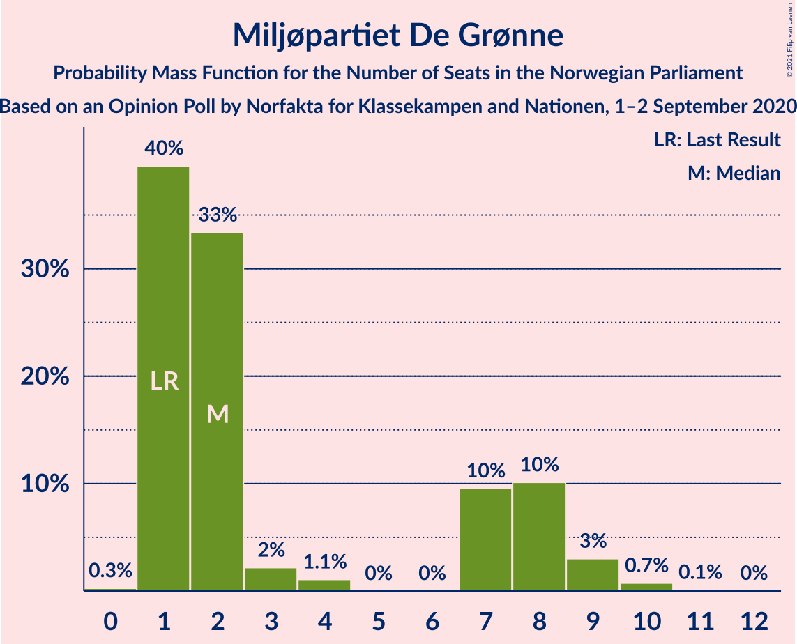

| Number of Seats | Probability | Accumulated | Special Marks |
|:---------------:|:-----------:|:-----------:|:-------------:|
| 0 | 0.3% | 100% |  |
| 1 | 40% | 99.7% | Last Result |
| 2 | 33% | 60% | Median |
| 3 | 2% | 27% |  |
| 4 | 1.1% | 25% |  |
| 5 | 0% | 24% |  |
| 6 | 0% | 24% |  |
| 7 | 10% | 24% |  |
| 8 | 10% | 14% |  |
| 9 | 3% | 4% |  |
| 10 | 0.7% | 0.9% |  |
| 11 | 0.1% | 0.1% |  |
| 12 | 0% | 0% |  |

### Rødt

*For a full overview of the results for this party, see the [Rødt](party-rødt.html) page.*

| Number of Seats | Probability | Accumulated | Special Marks |
|:---------------:|:-----------:|:-----------:|:-------------:|
| 1 | 25% | 100% | Last Result |
| 2 | 55% | 75% | Median |
| 3 | 0% | 19% |  |
| 4 | 0% | 19% |  |
| 5 | 0% | 19% |  |
| 6 | 0% | 19% |  |
| 7 | 4% | 19% |  |
| 8 | 12% | 15% |  |
| 9 | 2% | 3% |  |
| 10 | 0.4% | 0.5% |  |
| 11 | 0.1% | 0.1% |  |
| 12 | 0% | 0% |  |

### Venstre

*For a full overview of the results for this party, see the [Venstre](party-venstre.html) page.*

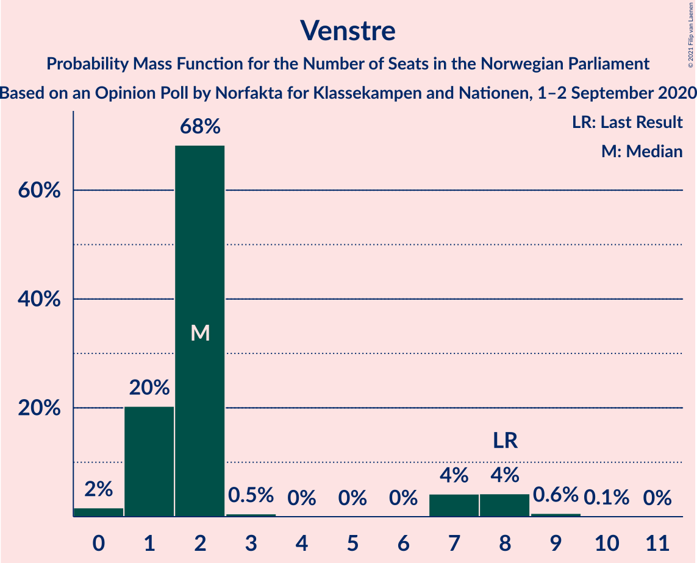

| Number of Seats | Probability | Accumulated | Special Marks |
|:---------------:|:-----------:|:-----------:|:-------------:|
| 0 | 2% | 100% |  |
| 1 | 20% | 98% |  |
| 2 | 68% | 78% | Median |
| 3 | 0.5% | 10% |  |
| 4 | 0% | 9% |  |
| 5 | 0% | 9% |  |
| 6 | 0% | 9% |  |
| 7 | 4% | 9% |  |
| 8 | 4% | 5% | Last Result |
| 9 | 0.6% | 0.8% |  |
| 10 | 0.1% | 0.1% |  |
| 11 | 0% | 0% |  |

## Coalitions

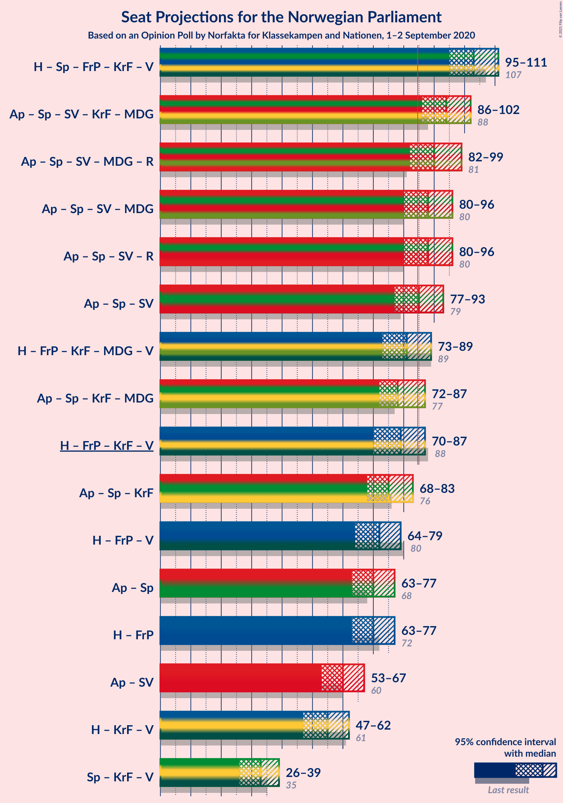

### Confidence Intervals

| Coalition | Last Result | Median | Majority? | 80% Confidence Interval | 90% Confidence Interval | 95% Confidence Interval | 99% Confidence Interval |
|:---------:|:-----------:|:------:|:---------:|:-----------------------:|:-----------------------:|:-----------------------:|:-----------------------:|
| Høyre – Senterpartiet – Fremskrittspartiet – Kristelig Folkeparti – Venstre | 107 | 103 | 100% | 98–108 | 97–110 | 95–111 | 92–112 |
| Arbeiderpartiet – Senterpartiet – Sosialistisk Venstreparti – Kristelig Folkeparti – Miljøpartiet De Grønne | 88 | 94 | 98.9% | 89–98 | 88–100 | 86–102 | 84–104 |
| Arbeiderpartiet – Senterpartiet – Sosialistisk Venstreparti – Miljøpartiet De Grønne – Rødt | 81 | 90 | 92% | 86–96 | 83–98 | 82–99 | 81–101 |
| Arbeiderpartiet – Senterpartiet – Sosialistisk Venstreparti – Miljøpartiet De Grønne | 80 | 88 | 78% | 82–93 | 81–95 | 80–96 | 78–98 |
| Arbeiderpartiet – Senterpartiet – Sosialistisk Venstreparti – Rødt | 80 | 88 | 76% | 82–93 | 81–95 | 80–96 | 78–98 |
| Arbeiderpartiet – Senterpartiet – Sosialistisk Venstreparti | 79 | 85 | 57% | 79–90 | 78–91 | 77–93 | 74–94 |
| Høyre – Fremskrittspartiet – Kristelig Folkeparti – Miljøpartiet De Grønne – Venstre | 89 | 81 | 24% | 76–87 | 74–88 | 73–89 | 71–91 |
| Arbeiderpartiet – Senterpartiet – Kristelig Folkeparti – Miljøpartiet De Grønne | 77 | 78 | 6% | 74–84 | 73–85 | 72–87 | 69–89 |
| Høyre – Fremskrittspartiet – Kristelig Folkeparti – Venstre | 88 | 79 | 8% | 73–83 | 71–86 | 70–87 | 68–88 |
| Arbeiderpartiet – Senterpartiet – Kristelig Folkeparti | 76 | 75 | 1.5% | 72–81 | 70–82 | 68–83 | 66–86 |
| Høyre – Fremskrittspartiet – Venstre | 80 | 72 | 0.1% | 68–78 | 66–78 | 64–79 | 63–82 |
| Arbeiderpartiet – Senterpartiet | 68 | 70 | 0% | 65–74 | 64–76 | 63–77 | 61–79 |
| Høyre – Fremskrittspartiet | 72 | 70 | 0% | 65–75 | 64–76 | 63–77 | 61–80 |
| Arbeiderpartiet – Sosialistisk Venstreparti | 60 | 60 | 0% | 55–64 | 55–66 | 53–67 | 52–69 |
| Høyre – Kristelig Folkeparti – Venstre | 61 | 55 | 0% | 50–60 | 49–61 | 47–62 | 45–65 |
| Senterpartiet – Kristelig Folkeparti – Venstre | 35 | 33 | 0% | 29–38 | 27–39 | 26–39 | 24–42 |

### Høyre – Senterpartiet – Fremskrittspartiet – Kristelig Folkeparti – Venstre

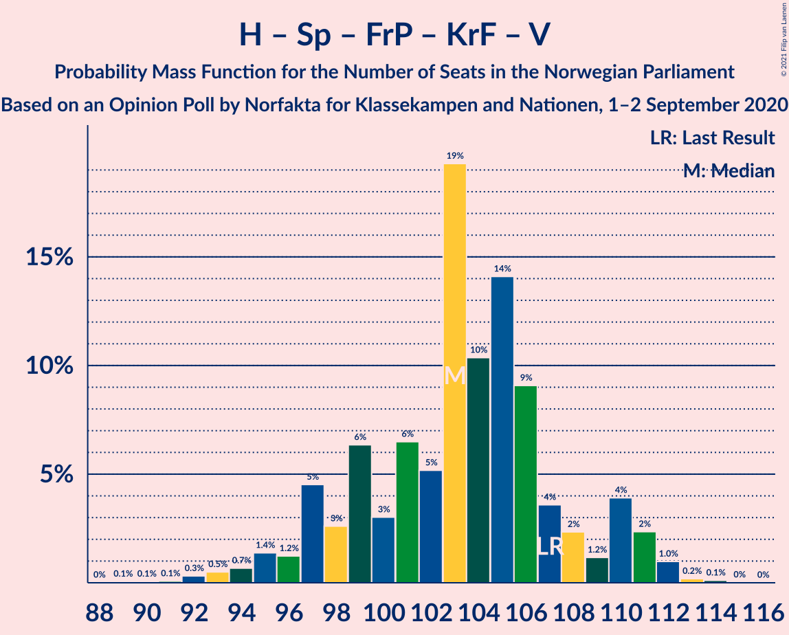

| Number of Seats | Probability | Accumulated | Special Marks |
|:---------------:|:-----------:|:-----------:|:-------------:|
| 89 | 0.1% | 100% |  |
| 90 | 0.1% | 99.9% |  |
| 91 | 0.1% | 99.9% |  |
| 92 | 0.3% | 99.8% |  |
| 93 | 0.5% | 99.5% |  |
| 94 | 0.7% | 99.0% |  |
| 95 | 1.4% | 98% |  |
| 96 | 1.2% | 97% |  |
| 97 | 5% | 96% |  |
| 98 | 3% | 91% |  |
| 99 | 6% | 89% |  |
| 100 | 3% | 82% |  |
| 101 | 6% | 79% |  |
| 102 | 5% | 73% |  |
| 103 | 19% | 68% |  |
| 104 | 10% | 48% |  |
| 105 | 14% | 38% | Median |
| 106 | 9% | 24% |  |
| 107 | 4% | 15% | Last Result |
| 108 | 2% | 11% |  |
| 109 | 1.2% | 9% |  |
| 110 | 4% | 8% |  |
| 111 | 2% | 4% |  |
| 112 | 1.0% | 1.3% |  |
| 113 | 0.2% | 0.3% |  |
| 114 | 0.1% | 0.1% |  |
| 115 | 0% | 0% |  |

### Arbeiderpartiet – Senterpartiet – Sosialistisk Venstreparti – Kristelig Folkeparti – Miljøpartiet De Grønne

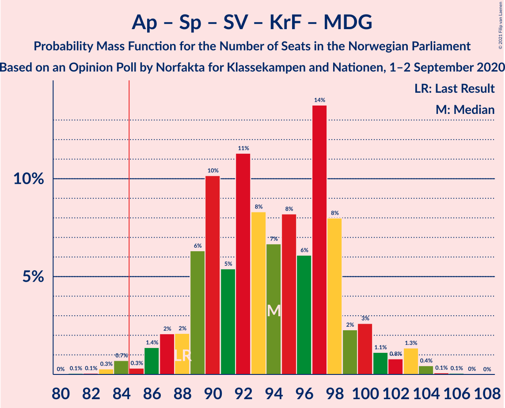

| Number of Seats | Probability | Accumulated | Special Marks |
|:---------------:|:-----------:|:-----------:|:-------------:|
| 81 | 0.1% | 100% |  |
| 82 | 0.1% | 99.9% |  |
| 83 | 0.3% | 99.8% |  |
| 84 | 0.7% | 99.6% |  |
| 85 | 0.3% | 98.9% | Majority |
| 86 | 1.4% | 98.5% |  |
| 87 | 2% | 97% |  |
| 88 | 2% | 95% | Last Result |
| 89 | 6% | 93% |  |
| 90 | 10% | 87% |  |
| 91 | 5% | 77% |  |
| 92 | 11% | 71% |  |
| 93 | 8% | 60% |  |
| 94 | 7% | 51% |  |
| 95 | 8% | 45% | Median |
| 96 | 6% | 37% |  |
| 97 | 14% | 31% |  |
| 98 | 8% | 17% |  |
| 99 | 2% | 9% |  |
| 100 | 3% | 6% |  |
| 101 | 1.1% | 4% |  |
| 102 | 0.8% | 3% |  |
| 103 | 1.3% | 2% |  |
| 104 | 0.4% | 0.6% |  |
| 105 | 0.1% | 0.2% |  |
| 106 | 0.1% | 0.1% |  |
| 107 | 0% | 0% |  |

### Arbeiderpartiet – Senterpartiet – Sosialistisk Venstreparti – Miljøpartiet De Grønne – Rødt

| Number of Seats | Probability | Accumulated | Special Marks |
|:---------------:|:-----------:|:-----------:|:-------------:|
| 79 | 0.1% | 100% |  |
| 80 | 0.3% | 99.8% |  |
| 81 | 0.6% | 99.5% | Last Result |
| 82 | 1.5% | 98.9% |  |
| 83 | 4% | 97% |  |
| 84 | 1.4% | 93% |  |
| 85 | 2% | 92% | Majority |
| 86 | 3% | 90% |  |
| 87 | 4% | 87% |  |
| 88 | 8% | 83% |  |
| 89 | 14% | 75% | Median |
| 90 | 14% | 62% |  |
| 91 | 14% | 48% |  |
| 92 | 8% | 34% |  |
| 93 | 5% | 26% |  |
| 94 | 4% | 21% |  |
| 95 | 3% | 17% |  |
| 96 | 5% | 14% |  |
| 97 | 2% | 9% |  |
| 98 | 4% | 7% |  |
| 99 | 1.2% | 3% |  |
| 100 | 0.5% | 1.4% |  |
| 101 | 0.5% | 0.9% |  |
| 102 | 0.2% | 0.4% |  |
| 103 | 0.1% | 0.2% |  |
| 104 | 0% | 0.1% |  |
| 105 | 0% | 0% |  |

### Arbeiderpartiet – Senterpartiet – Sosialistisk Venstreparti – Miljøpartiet De Grønne

| Number of Seats | Probability | Accumulated | Special Marks |
|:---------------:|:-----------:|:-----------:|:-------------:|
| 74 | 0.1% | 100% |  |
| 75 | 0% | 99.9% |  |
| 76 | 0.1% | 99.9% |  |
| 77 | 0.2% | 99.8% |  |
| 78 | 0.6% | 99.7% |  |
| 79 | 0.7% | 99.1% |  |
| 80 | 2% | 98% | Last Result |
| 81 | 5% | 96% |  |
| 82 | 4% | 91% |  |
| 83 | 5% | 87% |  |
| 84 | 4% | 82% |  |
| 85 | 4% | 78% | Majority |
| 86 | 6% | 74% |  |
| 87 | 14% | 69% | Median |
| 88 | 12% | 55% |  |
| 89 | 11% | 43% |  |
| 90 | 11% | 32% |  |
| 91 | 6% | 21% |  |
| 92 | 4% | 14% |  |
| 93 | 2% | 11% |  |
| 94 | 3% | 9% |  |
| 95 | 2% | 5% |  |
| 96 | 2% | 3% |  |
| 97 | 0.4% | 1.2% |  |
| 98 | 0.4% | 0.8% |  |
| 99 | 0.1% | 0.4% |  |
| 100 | 0.3% | 0.3% |  |
| 101 | 0% | 0.1% |  |
| 102 | 0% | 0% |  |

### Arbeiderpartiet – Senterpartiet – Sosialistisk Venstreparti – Rødt

| Number of Seats | Probability | Accumulated | Special Marks |
|:---------------:|:-----------:|:-----------:|:-------------:|
| 75 | 0% | 100% |  |
| 76 | 0.1% | 99.9% |  |
| 77 | 0.1% | 99.8% |  |
| 78 | 0.5% | 99.7% |  |
| 79 | 0.9% | 99.2% |  |
| 80 | 2% | 98% | Last Result |
| 81 | 3% | 96% |  |
| 82 | 6% | 93% |  |
| 83 | 7% | 87% |  |
| 84 | 5% | 80% |  |
| 85 | 4% | 76% | Majority |
| 86 | 7% | 72% |  |
| 87 | 9% | 65% | Median |
| 88 | 15% | 56% |  |
| 89 | 12% | 41% |  |
| 90 | 10% | 29% |  |
| 91 | 4% | 19% |  |
| 92 | 4% | 15% |  |
| 93 | 2% | 10% |  |
| 94 | 2% | 9% |  |
| 95 | 3% | 7% |  |
| 96 | 3% | 4% |  |
| 97 | 0.5% | 1.2% |  |
| 98 | 0.4% | 0.7% |  |
| 99 | 0.2% | 0.3% |  |
| 100 | 0.1% | 0.1% |  |
| 101 | 0% | 0% |  |

### Arbeiderpartiet – Senterpartiet – Sosialistisk Venstreparti

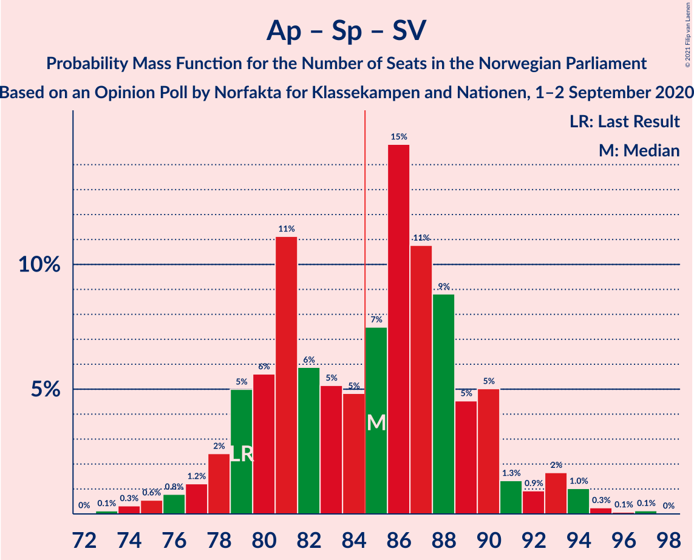

| Number of Seats | Probability | Accumulated | Special Marks |
|:---------------:|:-----------:|:-----------:|:-------------:|
| 72 | 0% | 100% |  |
| 73 | 0.1% | 99.9% |  |
| 74 | 0.3% | 99.8% |  |
| 75 | 0.6% | 99.5% |  |
| 76 | 0.8% | 98.9% |  |
| 77 | 1.2% | 98% |  |
| 78 | 2% | 97% |  |
| 79 | 5% | 94% | Last Result |
| 80 | 6% | 89% |  |
| 81 | 11% | 84% |  |
| 82 | 6% | 73% |  |
| 83 | 5% | 67% |  |
| 84 | 5% | 62% |  |
| 85 | 7% | 57% | Median, Majority |
| 86 | 15% | 49% |  |
| 87 | 11% | 35% |  |
| 88 | 9% | 24% |  |
| 89 | 5% | 15% |  |
| 90 | 5% | 10% |  |
| 91 | 1.3% | 5% |  |
| 92 | 0.9% | 4% |  |
| 93 | 2% | 3% |  |
| 94 | 1.0% | 2% |  |
| 95 | 0.3% | 0.5% |  |
| 96 | 0.1% | 0.2% |  |
| 97 | 0.1% | 0.2% |  |
| 98 | 0% | 0% |  |

### Høyre – Fremskrittspartiet – Kristelig Folkeparti – Miljøpartiet De Grønne – Venstre

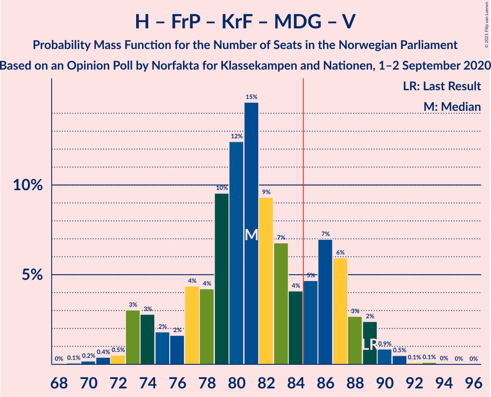

| Number of Seats | Probability | Accumulated | Special Marks |
|:---------------:|:-----------:|:-----------:|:-------------:|
| 69 | 0.1% | 100% |  |
| 70 | 0.2% | 99.9% |  |
| 71 | 0.4% | 99.7% |  |
| 72 | 0.5% | 99.3% |  |
| 73 | 3% | 98.8% |  |
| 74 | 3% | 96% |  |
| 75 | 2% | 93% |  |
| 76 | 2% | 91% |  |
| 77 | 4% | 90% |  |
| 78 | 4% | 85% |  |
| 79 | 10% | 81% |  |
| 80 | 12% | 71% |  |
| 81 | 15% | 59% |  |
| 82 | 9% | 44% | Median |
| 83 | 7% | 35% |  |
| 84 | 4% | 28% |  |
| 85 | 5% | 24% | Majority |
| 86 | 7% | 20% |  |
| 87 | 6% | 13% |  |
| 88 | 3% | 7% |  |
| 89 | 2% | 4% | Last Result |
| 90 | 0.9% | 2% |  |
| 91 | 0.5% | 0.8% |  |
| 92 | 0.1% | 0.3% |  |
| 93 | 0.1% | 0.2% |  |
| 94 | 0% | 0.1% |  |
| 95 | 0% | 0% |  |

### Arbeiderpartiet – Senterpartiet – Kristelig Folkeparti – Miljøpartiet De Grønne

| Number of Seats | Probability | Accumulated | Special Marks |
|:---------------:|:-----------:|:-----------:|:-------------:|
| 66 | 0.1% | 100% |  |
| 67 | 0.1% | 99.9% |  |
| 68 | 0.1% | 99.8% |  |
| 69 | 0.6% | 99.7% |  |
| 70 | 0.5% | 99.2% |  |
| 71 | 0.9% | 98.7% |  |
| 72 | 2% | 98% |  |
| 73 | 2% | 96% |  |
| 74 | 4% | 94% |  |
| 75 | 8% | 90% |  |
| 76 | 12% | 82% |  |
| 77 | 15% | 70% | Last Result |
| 78 | 8% | 55% |  |
| 79 | 5% | 47% |  |
| 80 | 5% | 42% | Median |
| 81 | 8% | 37% |  |
| 82 | 7% | 29% |  |
| 83 | 7% | 21% |  |
| 84 | 8% | 14% |  |
| 85 | 1.3% | 6% | Majority |
| 86 | 1.4% | 5% |  |
| 87 | 2% | 4% |  |
| 88 | 1.0% | 2% |  |
| 89 | 0.4% | 0.6% |  |
| 90 | 0.1% | 0.2% |  |
| 91 | 0.1% | 0.2% |  |
| 92 | 0% | 0.1% |  |
| 93 | 0% | 0% |  |

### Høyre – Fremskrittspartiet – Kristelig Folkeparti – Venstre

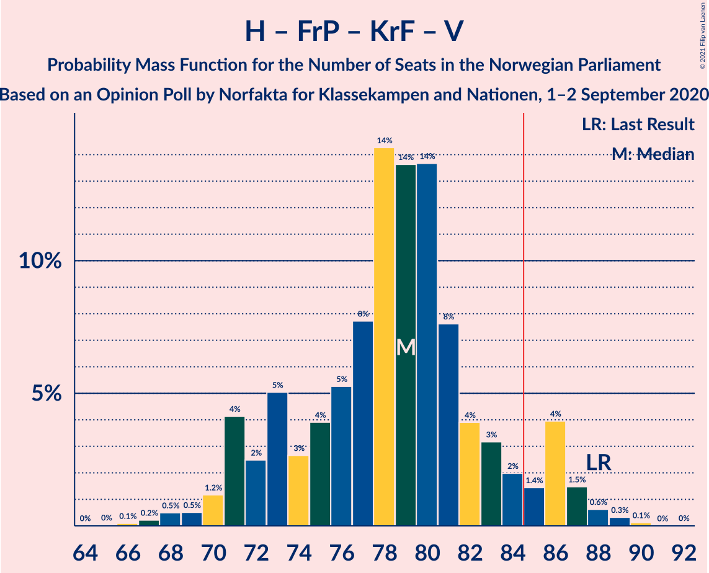

| Number of Seats | Probability | Accumulated | Special Marks |
|:---------------:|:-----------:|:-----------:|:-------------:|
| 65 | 0% | 100% |  |
| 66 | 0.1% | 99.9% |  |
| 67 | 0.2% | 99.8% |  |
| 68 | 0.5% | 99.6% |  |
| 69 | 0.5% | 99.1% |  |
| 70 | 1.2% | 98.6% |  |
| 71 | 4% | 97% |  |
| 72 | 2% | 93% |  |
| 73 | 5% | 91% |  |
| 74 | 3% | 86% |  |
| 75 | 4% | 83% |  |
| 76 | 5% | 79% |  |
| 77 | 8% | 74% |  |
| 78 | 14% | 66% |  |
| 79 | 14% | 52% |  |
| 80 | 14% | 38% | Median |
| 81 | 8% | 25% |  |
| 82 | 4% | 17% |  |
| 83 | 3% | 13% |  |
| 84 | 2% | 10% |  |
| 85 | 1.4% | 8% | Majority |
| 86 | 4% | 7% |  |
| 87 | 1.5% | 3% |  |
| 88 | 0.6% | 1.1% | Last Result |
| 89 | 0.3% | 0.5% |  |
| 90 | 0.1% | 0.2% |  |
| 91 | 0% | 0% |  |

### Arbeiderpartiet – Senterpartiet – Kristelig Folkeparti

| Number of Seats | Probability | Accumulated | Special Marks |
|:---------------:|:-----------:|:-----------:|:-------------:|
| 64 | 0.2% | 100% |  |
| 65 | 0.2% | 99.8% |  |
| 66 | 0.4% | 99.6% |  |
| 67 | 0.7% | 99.2% |  |
| 68 | 1.1% | 98.5% |  |
| 69 | 1.1% | 97% |  |
| 70 | 2% | 96% |  |
| 71 | 3% | 94% |  |
| 72 | 4% | 91% |  |
| 73 | 6% | 87% |  |
| 74 | 16% | 81% |  |
| 75 | 18% | 65% |  |
| 76 | 11% | 47% | Last Result |
| 77 | 8% | 35% |  |
| 78 | 5% | 28% | Median |
| 79 | 4% | 23% |  |
| 80 | 8% | 19% |  |
| 81 | 1.3% | 11% |  |
| 82 | 6% | 10% |  |
| 83 | 1.5% | 4% |  |
| 84 | 0.7% | 2% |  |
| 85 | 0.6% | 1.5% | Majority |
| 86 | 0.6% | 0.8% |  |
| 87 | 0.2% | 0.2% |  |
| 88 | 0% | 0% |  |

### Høyre – Fremskrittspartiet – Venstre

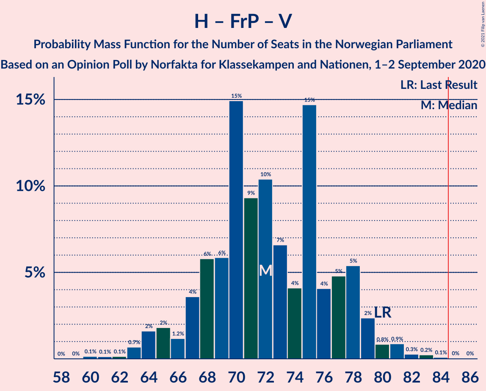

| Number of Seats | Probability | Accumulated | Special Marks |
|:---------------:|:-----------:|:-----------:|:-------------:|
| 60 | 0.1% | 100% |  |
| 61 | 0.1% | 99.8% |  |
| 62 | 0.1% | 99.7% |  |
| 63 | 0.7% | 99.6% |  |
| 64 | 2% | 98.9% |  |
| 65 | 2% | 97% |  |
| 66 | 1.2% | 95% |  |
| 67 | 4% | 94% |  |
| 68 | 6% | 91% |  |
| 69 | 6% | 85% |  |
| 70 | 15% | 79% |  |
| 71 | 9% | 64% |  |
| 72 | 10% | 55% | Median |
| 73 | 7% | 44% |  |
| 74 | 4% | 38% |  |
| 75 | 15% | 34% |  |
| 76 | 4% | 19% |  |
| 77 | 5% | 15% |  |
| 78 | 5% | 10% |  |
| 79 | 2% | 5% |  |
| 80 | 0.8% | 2% | Last Result |
| 81 | 0.9% | 2% |  |
| 82 | 0.3% | 0.7% |  |
| 83 | 0.2% | 0.4% |  |
| 84 | 0.1% | 0.2% |  |
| 85 | 0% | 0.1% | Majority |
| 86 | 0% | 0% |  |

### Arbeiderpartiet – Senterpartiet

| Number of Seats | Probability | Accumulated | Special Marks |
|:---------------:|:-----------:|:-----------:|:-------------:|
| 59 | 0.1% | 100% |  |
| 60 | 0.1% | 99.9% |  |
| 61 | 0.6% | 99.8% |  |
| 62 | 0.9% | 99.1% |  |
| 63 | 2% | 98% |  |
| 64 | 3% | 96% |  |
| 65 | 8% | 94% |  |
| 66 | 9% | 85% |  |
| 67 | 6% | 77% |  |
| 68 | 6% | 70% | Last Result |
| 69 | 10% | 64% |  |
| 70 | 7% | 54% | Median |
| 71 | 5% | 47% |  |
| 72 | 23% | 42% |  |
| 73 | 8% | 19% |  |
| 74 | 3% | 10% |  |
| 75 | 2% | 7% |  |
| 76 | 2% | 5% |  |
| 77 | 2% | 3% |  |
| 78 | 1.3% | 2% |  |
| 79 | 0.2% | 0.6% |  |
| 80 | 0.2% | 0.3% |  |
| 81 | 0.1% | 0.2% |  |
| 82 | 0% | 0.1% |  |
| 83 | 0% | 0% |  |

### Høyre – Fremskrittspartiet

| Number of Seats | Probability | Accumulated | Special Marks |
|:---------------:|:-----------:|:-----------:|:-------------:|
| 58 | 0.1% | 100% |  |
| 59 | 0.1% | 99.8% |  |
| 60 | 0.2% | 99.7% |  |
| 61 | 0.7% | 99.5% |  |
| 62 | 1.2% | 98.9% |  |
| 63 | 2% | 98% |  |
| 64 | 3% | 96% |  |
| 65 | 4% | 93% |  |
| 66 | 6% | 89% |  |
| 67 | 7% | 83% |  |
| 68 | 16% | 77% |  |
| 69 | 9% | 60% |  |
| 70 | 11% | 51% | Median |
| 71 | 6% | 40% |  |
| 72 | 3% | 33% | Last Result |
| 73 | 8% | 30% |  |
| 74 | 10% | 22% |  |
| 75 | 3% | 12% |  |
| 76 | 6% | 9% |  |
| 77 | 0.8% | 3% |  |
| 78 | 0.8% | 2% |  |
| 79 | 0.4% | 1.1% |  |
| 80 | 0.4% | 0.7% |  |
| 81 | 0.2% | 0.3% |  |
| 82 | 0.1% | 0.1% |  |
| 83 | 0% | 0% |  |

### Arbeiderpartiet – Sosialistisk Venstreparti

| Number of Seats | Probability | Accumulated | Special Marks |
|:---------------:|:-----------:|:-----------:|:-------------:|
| 50 | 0.1% | 100% |  |
| 51 | 0.2% | 99.9% |  |
| 52 | 0.9% | 99.6% |  |
| 53 | 1.3% | 98.7% |  |
| 54 | 2% | 97% |  |
| 55 | 6% | 95% |  |
| 56 | 7% | 90% |  |
| 57 | 12% | 83% |  |
| 58 | 5% | 71% |  |
| 59 | 10% | 66% |  |
| 60 | 14% | 55% | Last Result, Median |
| 61 | 8% | 42% |  |
| 62 | 15% | 33% |  |
| 63 | 7% | 18% |  |
| 64 | 3% | 11% |  |
| 65 | 2% | 8% |  |
| 66 | 2% | 6% |  |
| 67 | 2% | 4% |  |
| 68 | 1.3% | 2% |  |
| 69 | 0.6% | 0.9% |  |
| 70 | 0.1% | 0.3% |  |
| 71 | 0.1% | 0.2% |  |
| 72 | 0% | 0% |  |

### Høyre – Kristelig Folkeparti – Venstre

| Number of Seats | Probability | Accumulated | Special Marks |
|:---------------:|:-----------:|:-----------:|:-------------:|
| 43 | 0.1% | 100% |  |
| 44 | 0.2% | 99.9% |  |
| 45 | 0.4% | 99.8% |  |
| 46 | 0.8% | 99.4% |  |
| 47 | 2% | 98.6% |  |
| 48 | 1.0% | 97% |  |
| 49 | 4% | 96% |  |
| 50 | 5% | 91% |  |
| 51 | 8% | 86% |  |
| 52 | 7% | 78% |  |
| 53 | 10% | 71% |  |
| 54 | 4% | 61% |  |
| 55 | 9% | 57% |  |
| 56 | 11% | 47% | Median |
| 57 | 12% | 36% |  |
| 58 | 7% | 25% |  |
| 59 | 7% | 17% |  |
| 60 | 4% | 10% |  |
| 61 | 2% | 6% | Last Result |
| 62 | 2% | 4% |  |
| 63 | 0.7% | 2% |  |
| 64 | 0.9% | 1.4% |  |
| 65 | 0.2% | 0.5% |  |
| 66 | 0.1% | 0.3% |  |
| 67 | 0.1% | 0.2% |  |
| 68 | 0.1% | 0.1% |  |
| 69 | 0% | 0% |  |

### Senterpartiet – Kristelig Folkeparti – Venstre

| Number of Seats | Probability | Accumulated | Special Marks |
|:---------------:|:-----------:|:-----------:|:-------------:|
| 22 | 0.1% | 100% |  |
| 23 | 0.2% | 99.9% |  |
| 24 | 0.6% | 99.7% |  |
| 25 | 1.0% | 99.2% |  |
| 26 | 2% | 98% |  |
| 27 | 1.2% | 96% |  |
| 28 | 3% | 95% |  |
| 29 | 7% | 91% |  |
| 30 | 4% | 85% |  |
| 31 | 14% | 81% |  |
| 32 | 7% | 67% |  |
| 33 | 14% | 60% |  |
| 34 | 7% | 47% |  |
| 35 | 11% | 40% | Last Result, Median |
| 36 | 11% | 29% |  |
| 37 | 6% | 18% |  |
| 38 | 6% | 12% |  |
| 39 | 3% | 6% |  |
| 40 | 1.1% | 2% |  |
| 41 | 0.5% | 1.2% |  |
| 42 | 0.3% | 0.7% |  |
| 43 | 0.2% | 0.4% |  |
| 44 | 0.2% | 0.2% |  |
| 45 | 0% | 0.1% |  |
| 46 | 0% | 0% |  |

## Technical Information

### Opinion Poll

+ **Polling firm:** Norfakta
+ **Commissioner(s):** Klassekampen and Nationen
+ **Fieldwork period:** 1–2 September 2020

### Calculations

+ **Sample size:** 780
+ **Simulations done:** 1,048,576
+ **Error estimate:** 2.09%

