# Opinion Poll by Norstat for Aftenposten and NRK, 21–27 September 2020

<a href="#voting-intentions">Voting Intentions</a> | <a href="#seats">Seats</a> | <a href="#coalitions">Coalitions</a> | <a href="#technical-information">Technical Information</a>

## Voting Intentions

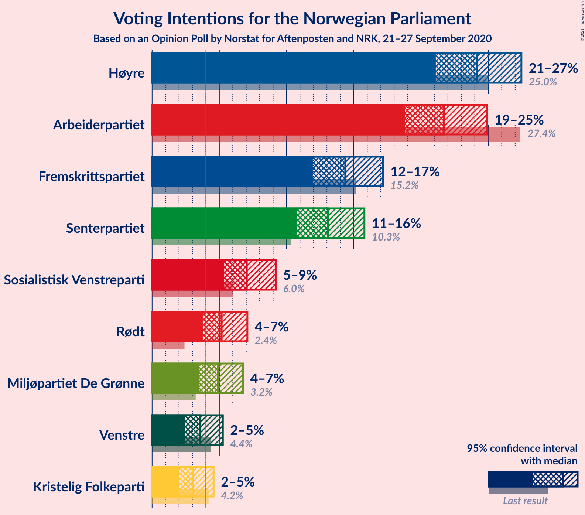

### Confidence Intervals

| Party | Last Result | Poll Result | 80% Confidence Interval | 90% Confidence Interval | 95% Confidence Interval | 99% Confidence Interval |
|:-----:|:-----------:|:-----------:|:-----------------------:|:-----------------------:|:-----------------------:|:-----------------------:|
| Høyre | 25.0% | 24.1% | 22.1–26.3% |21.6–26.9% |21.1–27.5% |20.2–28.5% |
| Arbeiderpartiet | 27.4% | 21.7% | 19.8–23.8% |19.3–24.4% |18.8–24.9% |17.9–26.0% |
| Fremskrittspartiet | 15.2% | 14.4% | 12.8–16.2% |12.3–16.7% |11.9–17.2% |11.2–18.1% |
| Senterpartiet | 10.3% | 13.1% | 11.6–14.8% |11.1–15.3% |10.8–15.8% |10.1–16.7% |
| Sosialistisk Venstreparti | 6.0% | 7.0% | 5.9–8.4% |5.6–8.8% |5.4–9.2% |4.9–9.9% |
| Rødt | 2.4% | 5.2% | 4.2–6.4% |4.0–6.8% |3.8–7.1% |3.4–7.7% |
| Miljøpartiet De Grønne | 3.2% | 4.9% | 4.0–6.1% |3.7–6.4% |3.5–6.8% |3.1–7.4% |
| Venstre | 4.4% | 3.6% | 2.8–4.7% |2.6–5.0% |2.4–5.3% |2.1–5.8% |
| Kristelig Folkeparti | 4.2% | 3.0% | 2.3–4.0% |2.1–4.3% |2.0–4.6% |1.7–5.1% |

*Note:* The poll result column reflects the actual value used in the calculations. Published results may vary slightly, and in addition be rounded to fewer digits.

## Seats

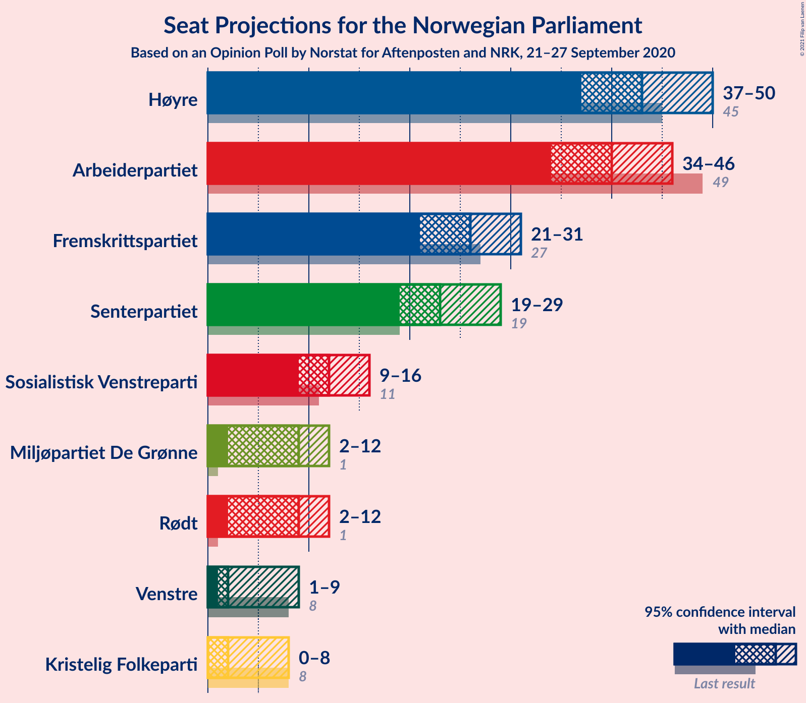

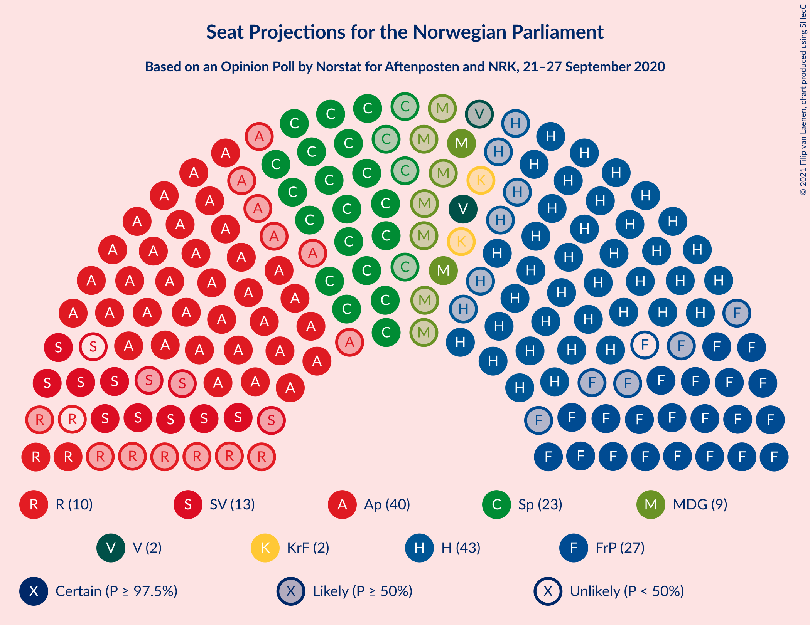

### Confidence Intervals

| Party | Last Result | Median | 80% Confidence Interval | 90% Confidence Interval | 95% Confidence Interval | 99% Confidence Interval |
|:-----:|:-----------:|:------:|:-----------------------:|:-----------------------:|:-----------------------:|:-----------------------:|
| <a href="#høyre">Høyre</a> | 45 | 43 | 39–48 |38–49 |37–50 |35–52 |
| <a href="#arbeiderpartiet">Arbeiderpartiet</a> | 49 | 40 | 36–43 |35–44 |34–46 |32–48 |
| <a href="#fremskrittspartiet">Fremskrittspartiet</a> | 27 | 26 | 24–29 |22–30 |21–31 |20–33 |
| <a href="#senterpartiet">Senterpartiet</a> | 19 | 23 | 20–27 |19–28 |19–29 |18–31 |
| <a href="#sosialistisk-venstreparti">Sosialistisk Venstreparti</a> | 11 | 12 | 10–15 |10–16 |9–16 |8–18 |
| <a href="#rødt">Rødt</a> | 1 | 9 | 7–12 |2–12 |2–12 |2–14 |
| <a href="#miljøpartiet-de-grønne">Miljøpartiet De Grønne</a> | 1 | 9 | 3–11 |2–11 |2–12 |1–13 |
| <a href="#venstre">Venstre</a> | 8 | 2 | 2–8 |1–9 |1–9 |1–10 |
| <a href="#kristelig-folkeparti">Kristelig Folkeparti</a> | 8 | 2 | 1–7 |0–7 |0–8 |0–9 |

### Høyre

*For a full overview of the results for this party, see the [Høyre](party-høyre.html) page.*

| Number of Seats | Probability | Accumulated | Special Marks |
|:---------------:|:-----------:|:-----------:|:-------------:|
| 33 | 0.1% | 100% |  |
| 34 | 0.2% | 99.9% |  |
| 35 | 0.7% | 99.7% |  |
| 36 | 1.2% | 99.0% |  |
| 37 | 2% | 98% |  |
| 38 | 3% | 96% |  |
| 39 | 7% | 93% |  |
| 40 | 9% | 86% |  |
| 41 | 10% | 77% |  |
| 42 | 9% | 66% |  |
| 43 | 16% | 58% | Median |
| 44 | 8% | 42% |  |
| 45 | 8% | 34% | Last Result |
| 46 | 12% | 26% |  |
| 47 | 4% | 14% |  |
| 48 | 5% | 10% |  |
| 49 | 3% | 6% |  |
| 50 | 2% | 3% |  |
| 51 | 0.4% | 1.1% |  |
| 52 | 0.6% | 0.7% |  |
| 53 | 0.1% | 0.2% |  |
| 54 | 0.1% | 0.1% |  |
| 55 | 0% | 0% |  |

### Arbeiderpartiet

*For a full overview of the results for this party, see the [Arbeiderpartiet](party-arbeiderpartiet.html) page.*

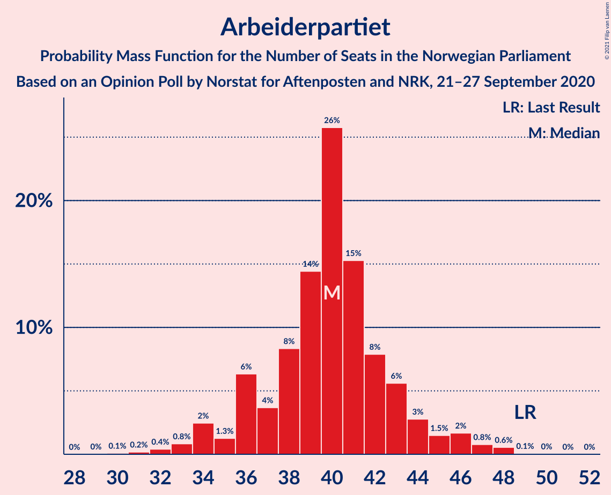

| Number of Seats | Probability | Accumulated | Special Marks |
|:---------------:|:-----------:|:-----------:|:-------------:|
| 30 | 0.1% | 100% |  |
| 31 | 0.2% | 99.9% |  |
| 32 | 0.4% | 99.7% |  |
| 33 | 0.8% | 99.3% |  |
| 34 | 2% | 98% |  |
| 35 | 1.3% | 96% |  |
| 36 | 6% | 95% |  |
| 37 | 4% | 88% |  |
| 38 | 8% | 85% |  |
| 39 | 14% | 76% |  |
| 40 | 26% | 62% | Median |
| 41 | 15% | 36% |  |
| 42 | 8% | 21% |  |
| 43 | 6% | 13% |  |
| 44 | 3% | 7% |  |
| 45 | 1.5% | 5% |  |
| 46 | 2% | 3% |  |
| 47 | 0.8% | 1.5% |  |
| 48 | 0.6% | 0.7% |  |
| 49 | 0.1% | 0.1% | Last Result |
| 50 | 0% | 0.1% |  |
| 51 | 0% | 0% |  |

### Fremskrittspartiet

*For a full overview of the results for this party, see the [Fremskrittspartiet](party-fremskrittspartiet.html) page.*

| Number of Seats | Probability | Accumulated | Special Marks |
|:---------------:|:-----------:|:-----------:|:-------------:|
| 18 | 0.1% | 100% |  |
| 19 | 0.1% | 99.9% |  |
| 20 | 0.6% | 99.8% |  |
| 21 | 2% | 99.1% |  |
| 22 | 3% | 97% |  |
| 23 | 4% | 94% |  |
| 24 | 10% | 90% |  |
| 25 | 26% | 80% |  |
| 26 | 15% | 55% | Median |
| 27 | 15% | 40% | Last Result |
| 28 | 11% | 26% |  |
| 29 | 6% | 15% |  |
| 30 | 5% | 9% |  |
| 31 | 2% | 4% |  |
| 32 | 1.0% | 2% |  |
| 33 | 0.9% | 1.2% |  |
| 34 | 0.2% | 0.3% |  |
| 35 | 0.1% | 0.1% |  |
| 36 | 0% | 0% |  |

### Senterpartiet

*For a full overview of the results for this party, see the [Senterpartiet](party-senterpartiet.html) page.*

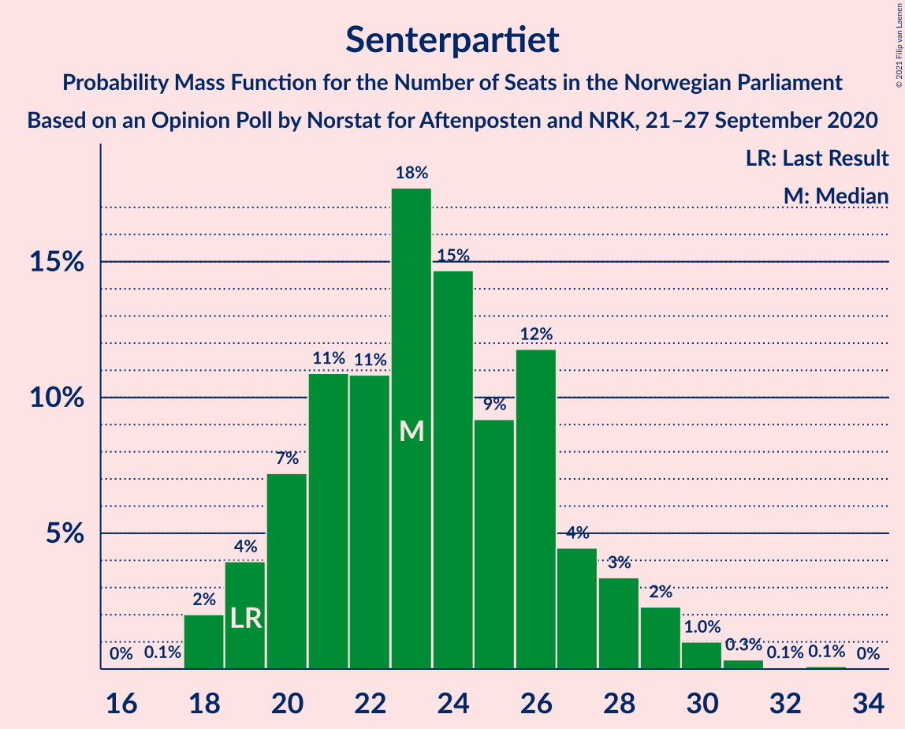

| Number of Seats | Probability | Accumulated | Special Marks |
|:---------------:|:-----------:|:-----------:|:-------------:|
| 17 | 0.1% | 100% |  |
| 18 | 2% | 99.9% |  |
| 19 | 4% | 98% | Last Result |
| 20 | 7% | 94% |  |
| 21 | 11% | 87% |  |
| 22 | 11% | 76% |  |
| 23 | 18% | 65% | Median |
| 24 | 15% | 47% |  |
| 25 | 9% | 33% |  |
| 26 | 12% | 23% |  |
| 27 | 4% | 12% |  |
| 28 | 3% | 7% |  |
| 29 | 2% | 4% |  |
| 30 | 1.0% | 2% |  |
| 31 | 0.3% | 0.5% |  |
| 32 | 0.1% | 0.2% |  |
| 33 | 0.1% | 0.1% |  |
| 34 | 0% | 0% |  |

### Sosialistisk Venstreparti

*For a full overview of the results for this party, see the [Sosialistisk Venstreparti](party-sosialistiskvenstreparti.html) page.*

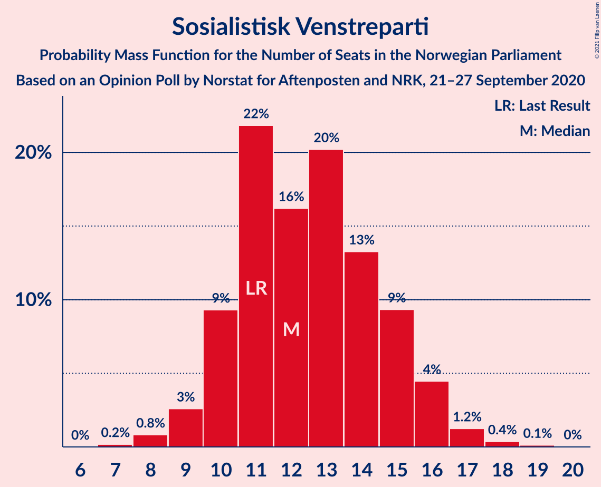

| Number of Seats | Probability | Accumulated | Special Marks |
|:---------------:|:-----------:|:-----------:|:-------------:|
| 7 | 0.2% | 100% |  |
| 8 | 0.8% | 99.8% |  |
| 9 | 3% | 99.0% |  |
| 10 | 9% | 96% |  |
| 11 | 22% | 87% | Last Result |
| 12 | 16% | 65% | Median |
| 13 | 20% | 49% |  |
| 14 | 13% | 29% |  |
| 15 | 9% | 16% |  |
| 16 | 4% | 6% |  |
| 17 | 1.2% | 2% |  |
| 18 | 0.4% | 0.5% |  |
| 19 | 0.1% | 0.2% |  |
| 20 | 0% | 0% |  |

### Rødt

*For a full overview of the results for this party, see the [Rødt](party-rødt.html) page.*

| Number of Seats | Probability | Accumulated | Special Marks |
|:---------------:|:-----------:|:-----------:|:-------------:|
| 1 | 0.2% | 100% | Last Result |
| 2 | 7% | 99.8% |  |
| 3 | 0% | 93% |  |
| 4 | 0% | 93% |  |
| 5 | 0% | 93% |  |
| 6 | 0.4% | 93% |  |
| 7 | 8% | 93% |  |
| 8 | 18% | 85% |  |
| 9 | 23% | 67% | Median |
| 10 | 22% | 44% |  |
| 11 | 12% | 23% |  |
| 12 | 9% | 10% |  |
| 13 | 1.2% | 2% |  |
| 14 | 0.5% | 0.6% |  |
| 15 | 0.1% | 0.1% |  |
| 16 | 0% | 0% |  |

### Miljøpartiet De Grønne

*For a full overview of the results for this party, see the [Miljøpartiet De Grønne](party-miljøpartietdegrønne.html) page.*

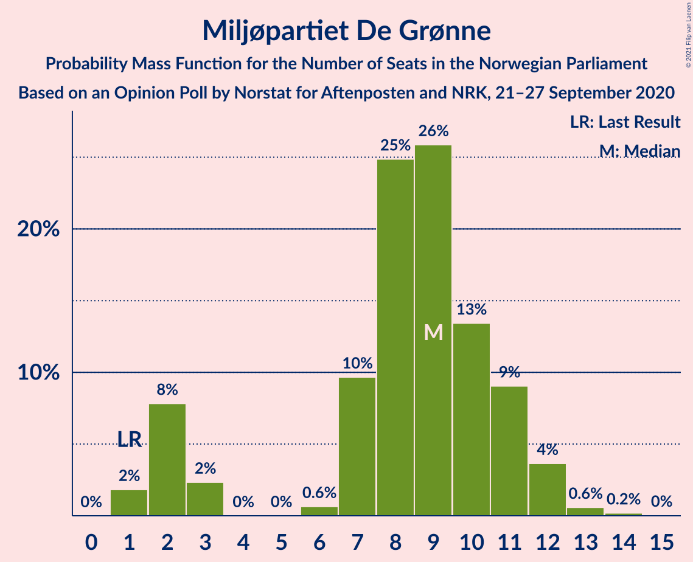

| Number of Seats | Probability | Accumulated | Special Marks |
|:---------------:|:-----------:|:-----------:|:-------------:|
| 1 | 2% | 100% | Last Result |
| 2 | 8% | 98% |  |
| 3 | 2% | 90% |  |
| 4 | 0% | 88% |  |
| 5 | 0% | 88% |  |
| 6 | 0.6% | 88% |  |
| 7 | 10% | 87% |  |
| 8 | 25% | 78% |  |
| 9 | 26% | 53% | Median |
| 10 | 13% | 27% |  |
| 11 | 9% | 14% |  |
| 12 | 4% | 4% |  |
| 13 | 0.6% | 0.8% |  |
| 14 | 0.2% | 0.2% |  |
| 15 | 0% | 0% |  |

### Venstre

*For a full overview of the results for this party, see the [Venstre](party-venstre.html) page.*

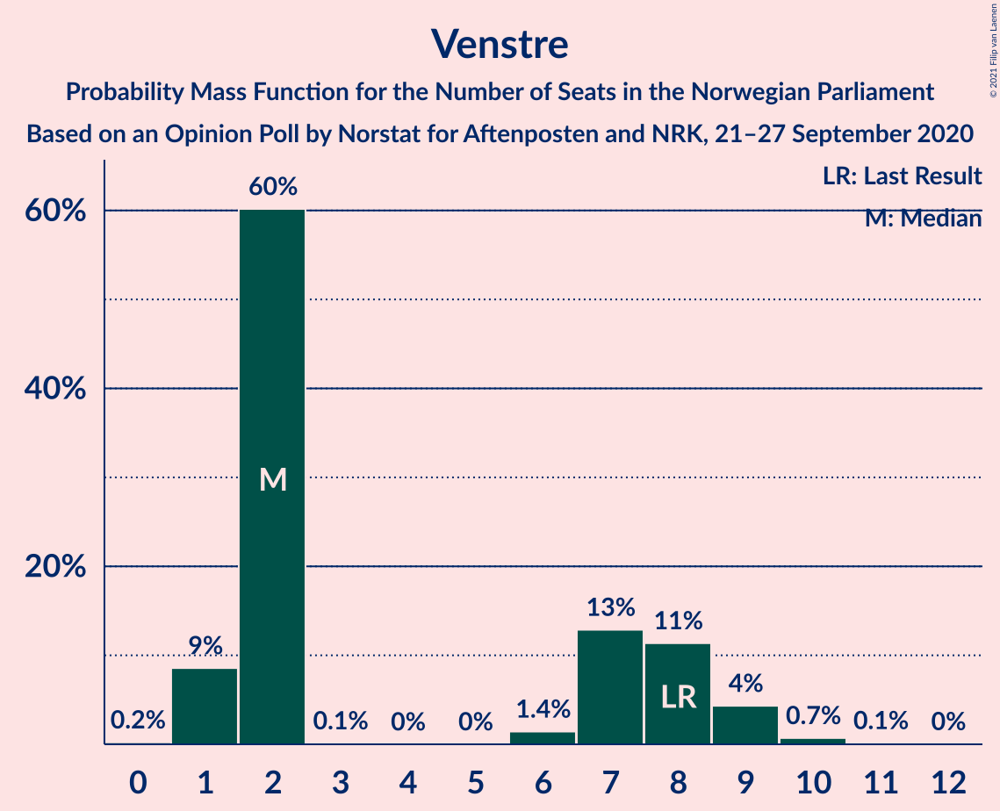

| Number of Seats | Probability | Accumulated | Special Marks |
|:---------------:|:-----------:|:-----------:|:-------------:|
| 0 | 0.2% | 100% |  |
| 1 | 9% | 99.8% |  |
| 2 | 60% | 91% | Median |
| 3 | 0.1% | 31% |  |
| 4 | 0% | 31% |  |
| 5 | 0% | 31% |  |
| 6 | 1.4% | 31% |  |
| 7 | 13% | 29% |  |
| 8 | 11% | 17% | Last Result |
| 9 | 4% | 5% |  |
| 10 | 0.7% | 0.9% |  |
| 11 | 0.1% | 0.2% |  |
| 12 | 0% | 0% |  |

### Kristelig Folkeparti

*For a full overview of the results for this party, see the [Kristelig Folkeparti](party-kristeligfolkeparti.html) page.*

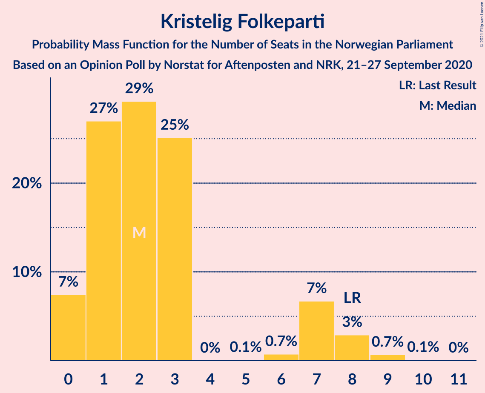

| Number of Seats | Probability | Accumulated | Special Marks |
|:---------------:|:-----------:|:-----------:|:-------------:|
| 0 | 7% | 100% |  |
| 1 | 27% | 93% |  |
| 2 | 29% | 66% | Median |
| 3 | 25% | 36% |  |
| 4 | 0% | 11% |  |
| 5 | 0.1% | 11% |  |
| 6 | 0.7% | 11% |  |
| 7 | 7% | 10% |  |
| 8 | 3% | 4% | Last Result |
| 9 | 0.7% | 0.8% |  |
| 10 | 0.1% | 0.1% |  |
| 11 | 0% | 0% |  |

## Coalitions

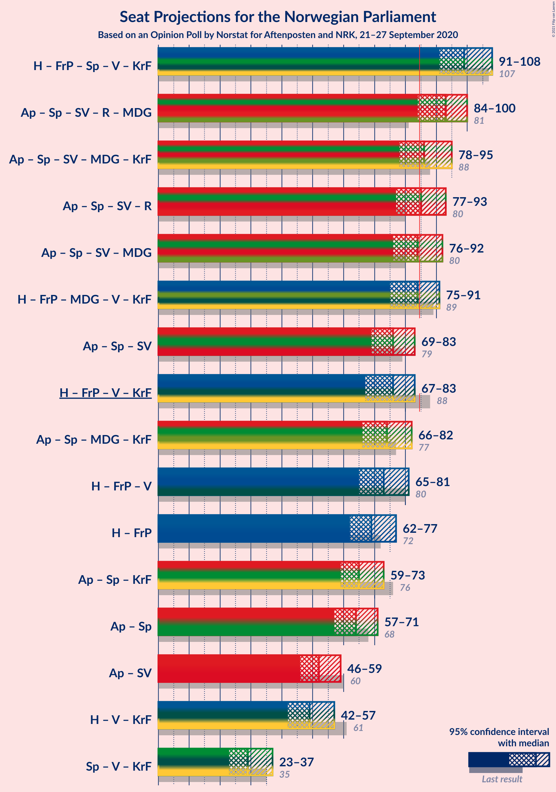

### Confidence Intervals

| Coalition | Last Result | Median | Majority? | 80% Confidence Interval | 90% Confidence Interval | 95% Confidence Interval | 99% Confidence Interval |
|:---------:|:-----------:|:------:|:---------:|:-----------------------:|:-----------------------:|:-----------------------:|:-----------------------:|
| Høyre – Fremskrittspartiet – Senterpartiet – Venstre – Kristelig Folkeparti | 107 | 99 | 100% | 93–104 | 92–106 | 91–108 | 89–110 |
| Arbeiderpartiet – Senterpartiet – Sosialistisk Venstreparti – Rødt – Miljøpartiet De Grønne | 81 | 93 | 97% | 88–99 | 85–100 | 84–100 | 81–103 |
| Arbeiderpartiet – Senterpartiet – Sosialistisk Venstreparti – Miljøpartiet De Grønne – Kristelig Folkeparti | 88 | 86 | 70% | 81–92 | 80–93 | 78–95 | 75–97 |
| Arbeiderpartiet – Senterpartiet – Sosialistisk Venstreparti – Rødt | 80 | 85 | 53% | 79–90 | 77–91 | 77–93 | 74–95 |
| Arbeiderpartiet – Senterpartiet – Sosialistisk Venstreparti – Miljøpartiet De Grønne | 80 | 84 | 46% | 79–89 | 77–91 | 76–92 | 73–94 |
| Høyre – Fremskrittspartiet – Miljøpartiet De Grønne – Venstre – Kristelig Folkeparti | 89 | 84 | 43% | 78–89 | 76–90 | 75–91 | 72–94 |
| Arbeiderpartiet – Senterpartiet – Sosialistisk Venstreparti | 79 | 76 | 2% | 71–81 | 69–83 | 69–83 | 66–86 |
| Høyre – Fremskrittspartiet – Venstre – Kristelig Folkeparti | 88 | 76 | 2% | 70–81 | 69–82 | 67–83 | 66–87 |
| Arbeiderpartiet – Senterpartiet – Miljøpartiet De Grønne – Kristelig Folkeparti | 77 | 74 | 0.4% | 69–79 | 68–81 | 66–82 | 64–84 |
| Høyre – Fremskrittspartiet – Venstre | 80 | 73 | 0.3% | 68–79 | 66–80 | 65–81 | 63–83 |
| Høyre – Fremskrittspartiet | 72 | 69 | 0% | 65–75 | 63–76 | 62–77 | 60–79 |
| Arbeiderpartiet – Senterpartiet – Kristelig Folkeparti | 76 | 65 | 0% | 61–71 | 60–72 | 59–73 | 56–76 |
| Arbeiderpartiet – Senterpartiet | 68 | 64 | 0% | 59–68 | 58–70 | 57–71 | 55–73 |
| Arbeiderpartiet – Sosialistisk Venstreparti | 60 | 52 | 0% | 49–56 | 47–57 | 46–59 | 44–61 |
| Høyre – Venstre – Kristelig Folkeparti | 61 | 49 | 0% | 44–55 | 43–56 | 42–57 | 40–60 |
| Senterpartiet – Venstre – Kristelig Folkeparti | 35 | 29 | 0% | 25–35 | 24–36 | 23–37 | 22–40 |

### Høyre – Fremskrittspartiet – Senterpartiet – Venstre – Kristelig Folkeparti

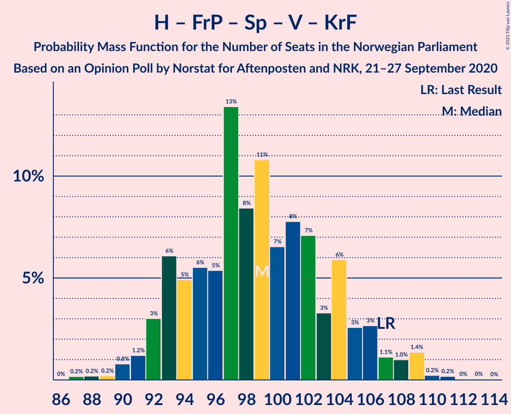

| Number of Seats | Probability | Accumulated | Special Marks |
|:---------------:|:-----------:|:-----------:|:-------------:|
| 86 | 0% | 100% |  |
| 87 | 0.2% | 99.9% |  |
| 88 | 0.2% | 99.8% |  |
| 89 | 0.2% | 99.6% |  |
| 90 | 0.8% | 99.4% |  |
| 91 | 1.2% | 98.6% |  |
| 92 | 3% | 97% |  |
| 93 | 6% | 94% |  |
| 94 | 5% | 88% |  |
| 95 | 6% | 83% |  |
| 96 | 5% | 78% | Median |
| 97 | 13% | 72% |  |
| 98 | 8% | 59% |  |
| 99 | 11% | 51% |  |
| 100 | 7% | 40% |  |
| 101 | 8% | 33% |  |
| 102 | 7% | 26% |  |
| 103 | 3% | 18% |  |
| 104 | 6% | 15% |  |
| 105 | 3% | 9% |  |
| 106 | 3% | 7% |  |
| 107 | 1.1% | 4% | Last Result |
| 108 | 1.0% | 3% |  |
| 109 | 1.4% | 2% |  |
| 110 | 0.2% | 0.5% |  |
| 111 | 0.2% | 0.3% |  |
| 112 | 0% | 0.1% |  |
| 113 | 0% | 0.1% |  |
| 114 | 0% | 0% |  |

### Arbeiderpartiet – Senterpartiet – Sosialistisk Venstreparti – Rødt – Miljøpartiet De Grønne

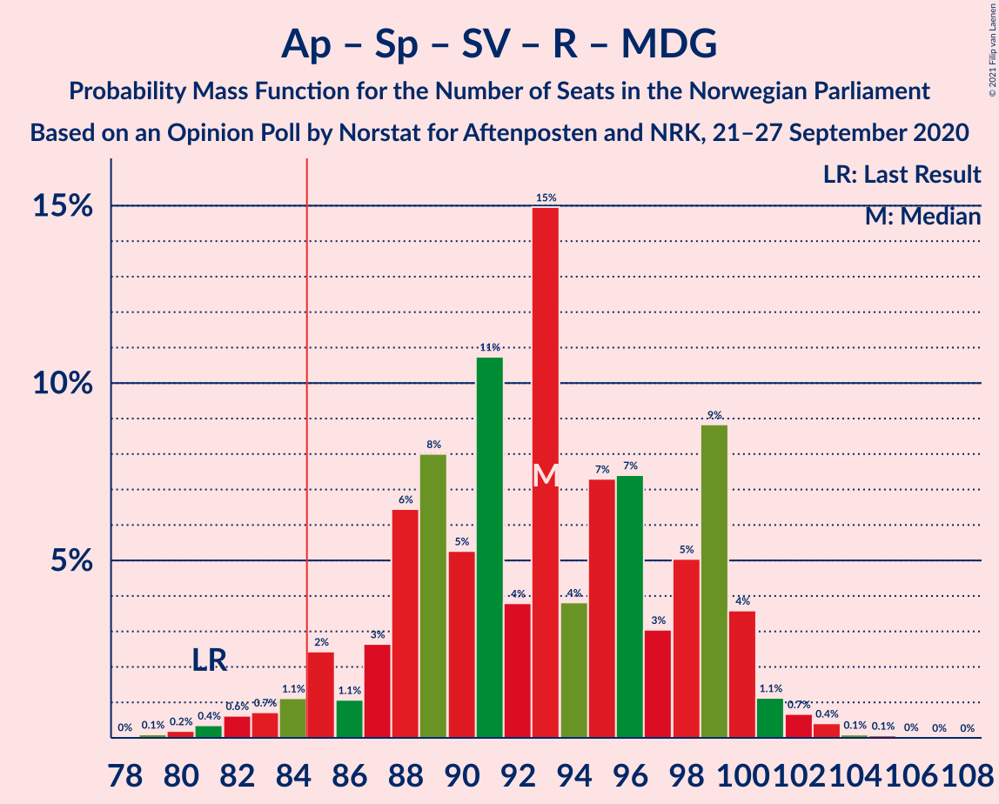

| Number of Seats | Probability | Accumulated | Special Marks |
|:---------------:|:-----------:|:-----------:|:-------------:|
| 78 | 0% | 100% |  |
| 79 | 0.1% | 99.9% |  |
| 80 | 0.2% | 99.8% |  |
| 81 | 0.4% | 99.7% | Last Result |
| 82 | 0.6% | 99.3% |  |
| 83 | 0.7% | 98.7% |  |
| 84 | 1.1% | 98% |  |
| 85 | 2% | 97% | Majority |
| 86 | 1.1% | 94% |  |
| 87 | 3% | 93% |  |
| 88 | 6% | 91% |  |
| 89 | 8% | 84% |  |
| 90 | 5% | 76% |  |
| 91 | 11% | 71% |  |
| 92 | 4% | 60% |  |
| 93 | 15% | 56% | Median |
| 94 | 4% | 41% |  |
| 95 | 7% | 38% |  |
| 96 | 7% | 30% |  |
| 97 | 3% | 23% |  |
| 98 | 5% | 20% |  |
| 99 | 9% | 15% |  |
| 100 | 4% | 6% |  |
| 101 | 1.1% | 2% |  |
| 102 | 0.7% | 1.3% |  |
| 103 | 0.4% | 0.6% |  |
| 104 | 0.1% | 0.2% |  |
| 105 | 0.1% | 0.1% |  |
| 106 | 0% | 0.1% |  |
| 107 | 0% | 0% |  |

### Arbeiderpartiet – Senterpartiet – Sosialistisk Venstreparti – Miljøpartiet De Grønne – Kristelig Folkeparti

| Number of Seats | Probability | Accumulated | Special Marks |
|:---------------:|:-----------:|:-----------:|:-------------:|
| 72 | 0% | 100% |  |
| 73 | 0.1% | 99.9% |  |
| 74 | 0.1% | 99.9% |  |
| 75 | 0.3% | 99.8% |  |
| 76 | 0.4% | 99.5% |  |
| 77 | 0.7% | 99.1% |  |
| 78 | 1.1% | 98% |  |
| 79 | 1.2% | 97% |  |
| 80 | 4% | 96% |  |
| 81 | 4% | 92% |  |
| 82 | 6% | 88% |  |
| 83 | 7% | 83% |  |
| 84 | 5% | 75% |  |
| 85 | 10% | 70% | Majority |
| 86 | 11% | 61% | Median |
| 87 | 10% | 50% |  |
| 88 | 12% | 40% | Last Result |
| 89 | 4% | 28% |  |
| 90 | 7% | 24% |  |
| 91 | 7% | 17% |  |
| 92 | 4% | 11% |  |
| 93 | 3% | 7% |  |
| 94 | 1.4% | 4% |  |
| 95 | 2% | 3% |  |
| 96 | 0.3% | 0.9% |  |
| 97 | 0.2% | 0.6% |  |
| 98 | 0.2% | 0.4% |  |
| 99 | 0.1% | 0.2% |  |
| 100 | 0% | 0.1% |  |
| 101 | 0% | 0.1% |  |
| 102 | 0% | 0% |  |

### Arbeiderpartiet – Senterpartiet – Sosialistisk Venstreparti – Rødt

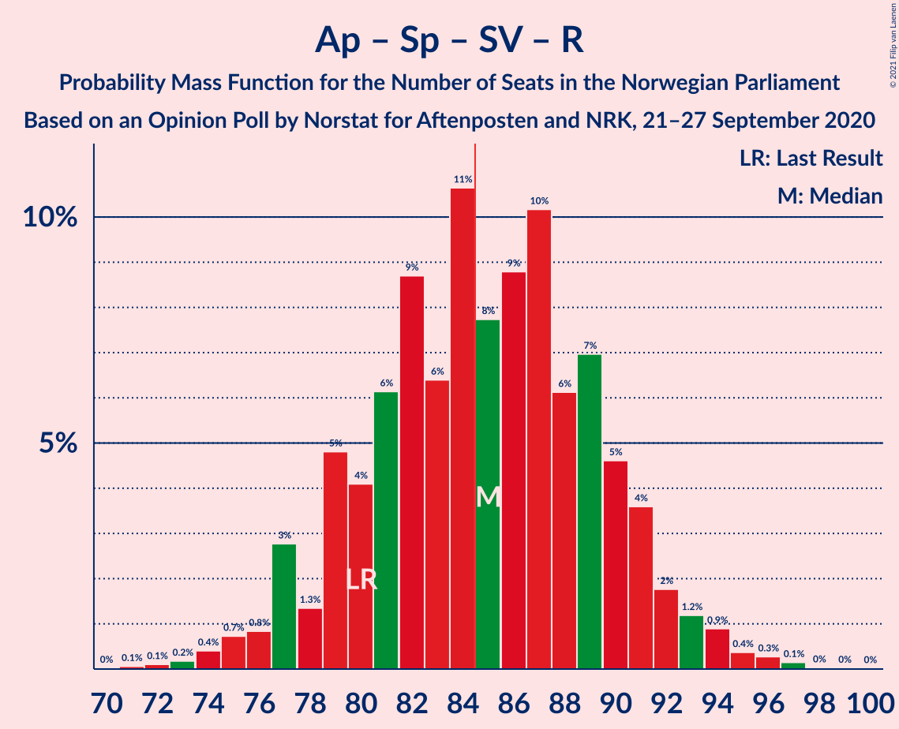

| Number of Seats | Probability | Accumulated | Special Marks |
|:---------------:|:-----------:|:-----------:|:-------------:|
| 71 | 0.1% | 100% |  |
| 72 | 0.1% | 99.9% |  |
| 73 | 0.2% | 99.8% |  |
| 74 | 0.4% | 99.6% |  |
| 75 | 0.7% | 99.2% |  |
| 76 | 0.8% | 98% |  |
| 77 | 3% | 98% |  |
| 78 | 1.3% | 95% |  |
| 79 | 5% | 94% |  |
| 80 | 4% | 89% | Last Result |
| 81 | 6% | 85% |  |
| 82 | 9% | 78% |  |
| 83 | 6% | 70% |  |
| 84 | 11% | 63% | Median |
| 85 | 8% | 53% | Majority |
| 86 | 9% | 45% |  |
| 87 | 10% | 36% |  |
| 88 | 6% | 26% |  |
| 89 | 7% | 20% |  |
| 90 | 5% | 13% |  |
| 91 | 4% | 8% |  |
| 92 | 2% | 5% |  |
| 93 | 1.2% | 3% |  |
| 94 | 0.9% | 2% |  |
| 95 | 0.4% | 0.9% |  |
| 96 | 0.3% | 0.5% |  |
| 97 | 0.1% | 0.2% |  |
| 98 | 0% | 0.1% |  |
| 99 | 0% | 0% |  |

### Arbeiderpartiet – Senterpartiet – Sosialistisk Venstreparti – Miljøpartiet De Grønne

| Number of Seats | Probability | Accumulated | Special Marks |
|:---------------:|:-----------:|:-----------:|:-------------:|
| 70 | 0% | 100% |  |
| 71 | 0% | 99.9% |  |
| 72 | 0.3% | 99.9% |  |
| 73 | 0.3% | 99.6% |  |
| 74 | 0.5% | 99.3% |  |
| 75 | 1.1% | 98.8% |  |
| 76 | 1.0% | 98% |  |
| 77 | 3% | 97% |  |
| 78 | 2% | 94% |  |
| 79 | 5% | 92% |  |
| 80 | 8% | 87% | Last Result |
| 81 | 6% | 78% |  |
| 82 | 8% | 73% |  |
| 83 | 12% | 64% |  |
| 84 | 7% | 53% | Median |
| 85 | 9% | 46% | Majority |
| 86 | 8% | 37% |  |
| 87 | 9% | 29% |  |
| 88 | 4% | 20% |  |
| 89 | 8% | 16% |  |
| 90 | 2% | 7% |  |
| 91 | 1.3% | 6% |  |
| 92 | 3% | 4% |  |
| 93 | 0.5% | 2% |  |
| 94 | 0.7% | 1.2% |  |
| 95 | 0.2% | 0.4% |  |
| 96 | 0.1% | 0.2% |  |
| 97 | 0.1% | 0.1% |  |
| 98 | 0% | 0.1% |  |
| 99 | 0% | 0% |  |

### Høyre – Fremskrittspartiet – Miljøpartiet De Grønne – Venstre – Kristelig Folkeparti

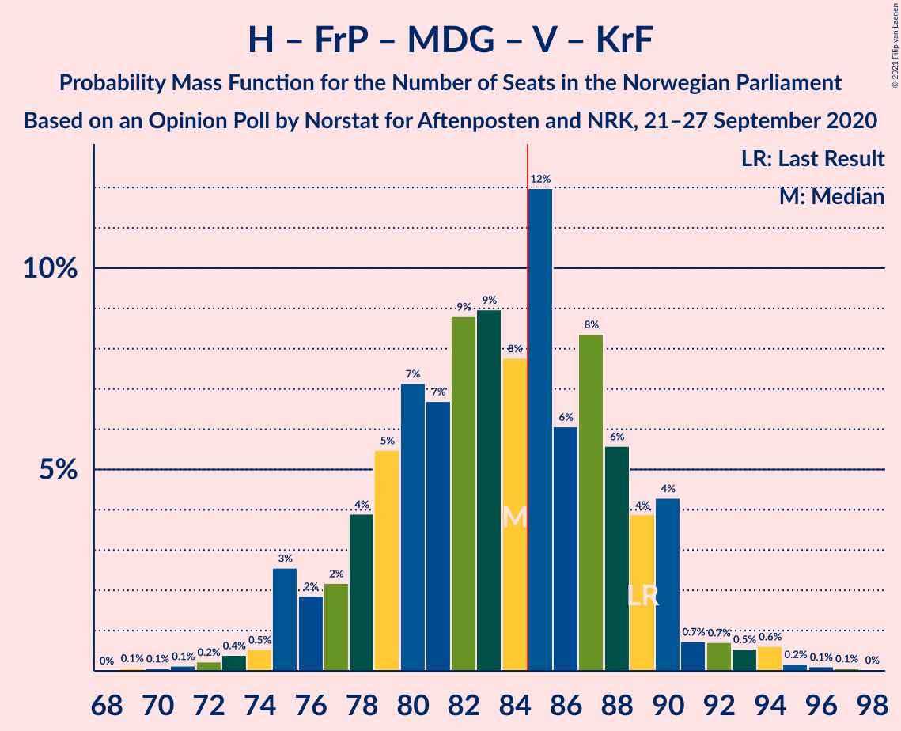

| Number of Seats | Probability | Accumulated | Special Marks |
|:---------------:|:-----------:|:-----------:|:-------------:|
| 69 | 0.1% | 100% |  |
| 70 | 0.1% | 99.9% |  |
| 71 | 0.1% | 99.8% |  |
| 72 | 0.2% | 99.7% |  |
| 73 | 0.4% | 99.5% |  |
| 74 | 0.5% | 99.1% |  |
| 75 | 3% | 98.6% |  |
| 76 | 2% | 96% |  |
| 77 | 2% | 94% |  |
| 78 | 4% | 92% |  |
| 79 | 5% | 88% |  |
| 80 | 7% | 83% |  |
| 81 | 7% | 75% |  |
| 82 | 9% | 69% | Median |
| 83 | 9% | 60% |  |
| 84 | 8% | 51% |  |
| 85 | 12% | 43% | Majority |
| 86 | 6% | 31% |  |
| 87 | 8% | 25% |  |
| 88 | 6% | 17% |  |
| 89 | 4% | 11% | Last Result |
| 90 | 4% | 7% |  |
| 91 | 0.7% | 3% |  |
| 92 | 0.7% | 2% |  |
| 93 | 0.5% | 2% |  |
| 94 | 0.6% | 1.0% |  |
| 95 | 0.2% | 0.4% |  |
| 96 | 0.1% | 0.2% |  |
| 97 | 0.1% | 0.1% |  |
| 98 | 0% | 0% |  |

### Arbeiderpartiet – Senterpartiet – Sosialistisk Venstreparti

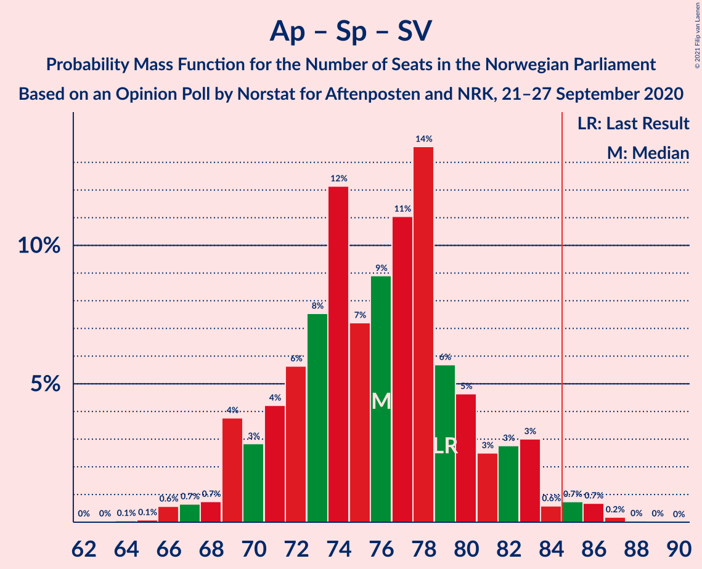

| Number of Seats | Probability | Accumulated | Special Marks |
|:---------------:|:-----------:|:-----------:|:-------------:|
| 63 | 0% | 100% |  |
| 64 | 0.1% | 99.9% |  |
| 65 | 0.1% | 99.9% |  |
| 66 | 0.6% | 99.8% |  |
| 67 | 0.7% | 99.2% |  |
| 68 | 0.7% | 98.6% |  |
| 69 | 4% | 98% |  |
| 70 | 3% | 94% |  |
| 71 | 4% | 91% |  |
| 72 | 6% | 87% |  |
| 73 | 8% | 81% |  |
| 74 | 12% | 74% |  |
| 75 | 7% | 62% | Median |
| 76 | 9% | 54% |  |
| 77 | 11% | 46% |  |
| 78 | 14% | 34% |  |
| 79 | 6% | 21% | Last Result |
| 80 | 5% | 15% |  |
| 81 | 3% | 11% |  |
| 82 | 3% | 8% |  |
| 83 | 3% | 5% |  |
| 84 | 0.6% | 2% |  |
| 85 | 0.7% | 2% | Majority |
| 86 | 0.7% | 1.0% |  |
| 87 | 0.2% | 0.3% |  |
| 88 | 0% | 0.1% |  |
| 89 | 0% | 0.1% |  |
| 90 | 0% | 0% |  |

### Høyre – Fremskrittspartiet – Venstre – Kristelig Folkeparti

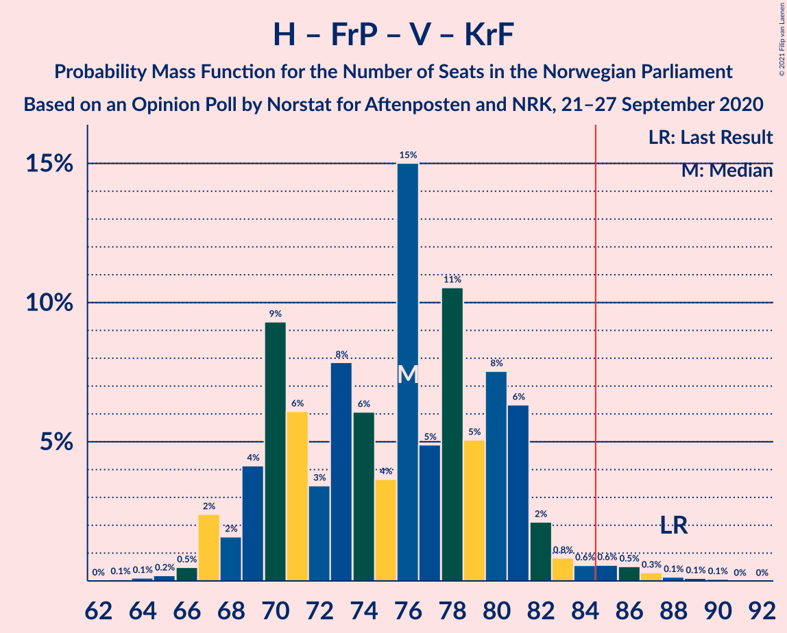

| Number of Seats | Probability | Accumulated | Special Marks |
|:---------------:|:-----------:|:-----------:|:-------------:|
| 63 | 0.1% | 100% |  |
| 64 | 0.1% | 99.9% |  |
| 65 | 0.2% | 99.8% |  |
| 66 | 0.5% | 99.6% |  |
| 67 | 2% | 99.1% |  |
| 68 | 2% | 97% |  |
| 69 | 4% | 95% |  |
| 70 | 9% | 91% |  |
| 71 | 6% | 82% |  |
| 72 | 3% | 76% |  |
| 73 | 8% | 72% | Median |
| 74 | 6% | 64% |  |
| 75 | 4% | 58% |  |
| 76 | 15% | 55% |  |
| 77 | 5% | 40% |  |
| 78 | 11% | 35% |  |
| 79 | 5% | 24% |  |
| 80 | 8% | 19% |  |
| 81 | 6% | 12% |  |
| 82 | 2% | 5% |  |
| 83 | 0.8% | 3% |  |
| 84 | 0.6% | 2% |  |
| 85 | 0.6% | 2% | Majority |
| 86 | 0.5% | 1.1% |  |
| 87 | 0.3% | 0.6% |  |
| 88 | 0.1% | 0.3% | Last Result |
| 89 | 0.1% | 0.2% |  |
| 90 | 0.1% | 0.1% |  |
| 91 | 0% | 0% |  |

### Arbeiderpartiet – Senterpartiet – Miljøpartiet De Grønne – Kristelig Folkeparti

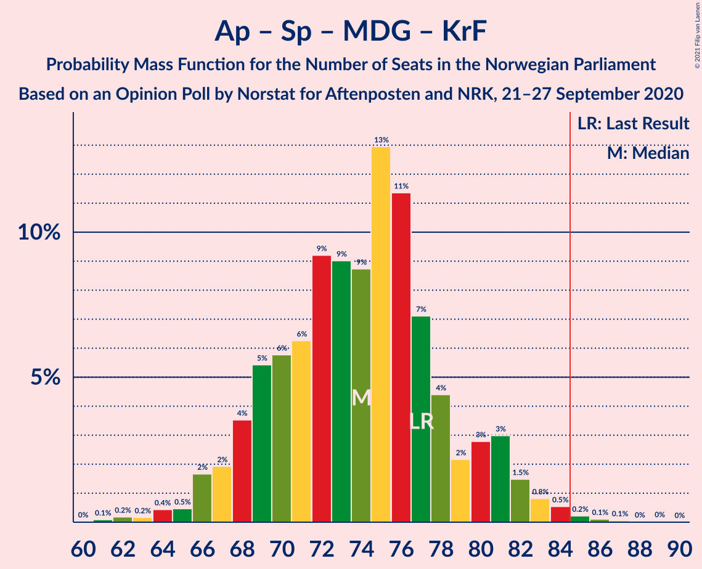

| Number of Seats | Probability | Accumulated | Special Marks |
|:---------------:|:-----------:|:-----------:|:-------------:|
| 61 | 0.1% | 100% |  |
| 62 | 0.2% | 99.9% |  |
| 63 | 0.2% | 99.7% |  |
| 64 | 0.4% | 99.5% |  |
| 65 | 0.5% | 99.1% |  |
| 66 | 2% | 98.6% |  |
| 67 | 2% | 97% |  |
| 68 | 4% | 95% |  |
| 69 | 5% | 91% |  |
| 70 | 6% | 86% |  |
| 71 | 6% | 80% |  |
| 72 | 9% | 74% |  |
| 73 | 9% | 65% |  |
| 74 | 9% | 56% | Median |
| 75 | 13% | 47% |  |
| 76 | 11% | 34% |  |
| 77 | 7% | 23% | Last Result |
| 78 | 4% | 16% |  |
| 79 | 2% | 11% |  |
| 80 | 3% | 9% |  |
| 81 | 3% | 6% |  |
| 82 | 1.5% | 3% |  |
| 83 | 0.8% | 2% |  |
| 84 | 0.5% | 1.0% |  |
| 85 | 0.2% | 0.4% | Majority |
| 86 | 0.1% | 0.2% |  |
| 87 | 0.1% | 0.1% |  |
| 88 | 0% | 0.1% |  |
| 89 | 0% | 0% |  |

### Høyre – Fremskrittspartiet – Venstre

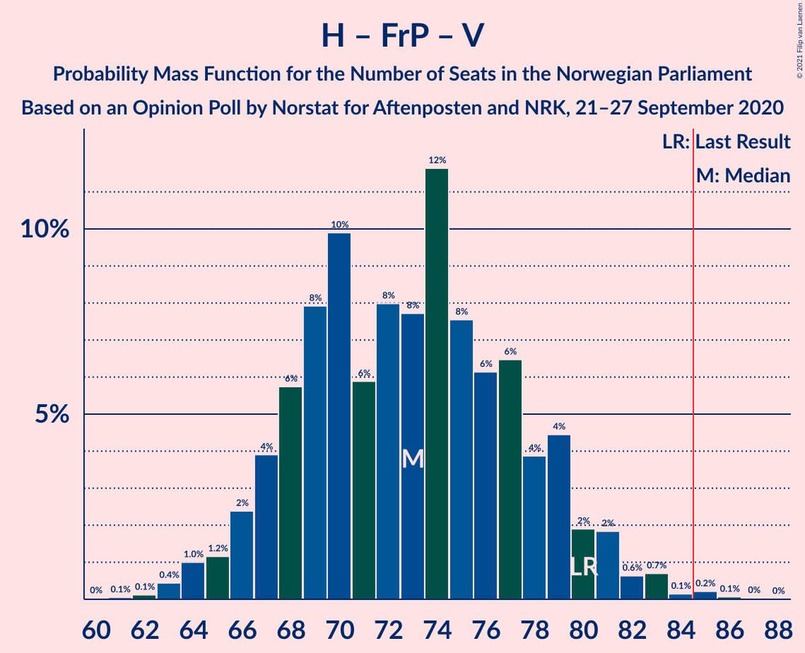

| Number of Seats | Probability | Accumulated | Special Marks |
|:---------------:|:-----------:|:-----------:|:-------------:|
| 60 | 0% | 100% |  |
| 61 | 0.1% | 99.9% |  |
| 62 | 0.1% | 99.9% |  |
| 63 | 0.4% | 99.8% |  |
| 64 | 1.0% | 99.3% |  |
| 65 | 1.2% | 98% |  |
| 66 | 2% | 97% |  |
| 67 | 4% | 95% |  |
| 68 | 6% | 91% |  |
| 69 | 8% | 85% |  |
| 70 | 10% | 77% |  |
| 71 | 6% | 67% | Median |
| 72 | 8% | 61% |  |
| 73 | 8% | 53% |  |
| 74 | 12% | 46% |  |
| 75 | 8% | 34% |  |
| 76 | 6% | 27% |  |
| 77 | 6% | 20% |  |
| 78 | 4% | 14% |  |
| 79 | 4% | 10% |  |
| 80 | 2% | 6% | Last Result |
| 81 | 2% | 4% |  |
| 82 | 0.6% | 2% |  |
| 83 | 0.7% | 1.2% |  |
| 84 | 0.1% | 0.5% |  |
| 85 | 0.2% | 0.3% | Majority |
| 86 | 0.1% | 0.1% |  |
| 87 | 0% | 0.1% |  |
| 88 | 0% | 0% |  |

### Høyre – Fremskrittspartiet

| Number of Seats | Probability | Accumulated | Special Marks |
|:---------------:|:-----------:|:-----------:|:-------------:|
| 57 | 0.1% | 100% |  |
| 58 | 0.1% | 99.9% |  |
| 59 | 0.1% | 99.8% |  |
| 60 | 0.6% | 99.7% |  |
| 61 | 0.8% | 99.1% |  |
| 62 | 2% | 98% |  |
| 63 | 2% | 96% |  |
| 64 | 4% | 94% |  |
| 65 | 5% | 90% |  |
| 66 | 9% | 85% |  |
| 67 | 13% | 76% |  |
| 68 | 12% | 63% |  |
| 69 | 9% | 51% | Median |
| 70 | 6% | 43% |  |
| 71 | 10% | 37% |  |
| 72 | 5% | 26% | Last Result |
| 73 | 7% | 21% |  |
| 74 | 3% | 14% |  |
| 75 | 4% | 11% |  |
| 76 | 2% | 7% |  |
| 77 | 2% | 4% |  |
| 78 | 0.5% | 2% |  |
| 79 | 1.3% | 2% |  |
| 80 | 0.1% | 0.5% |  |
| 81 | 0.2% | 0.3% |  |
| 82 | 0% | 0.1% |  |
| 83 | 0% | 0.1% |  |
| 84 | 0% | 0% |  |

### Arbeiderpartiet – Senterpartiet – Kristelig Folkeparti

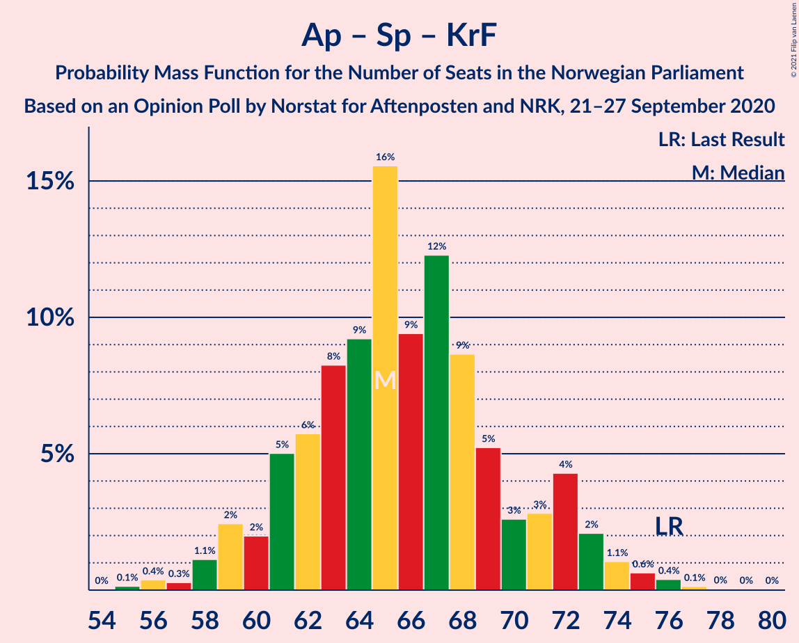

| Number of Seats | Probability | Accumulated | Special Marks |
|:---------------:|:-----------:|:-----------:|:-------------:|
| 54 | 0% | 100% |  |
| 55 | 0.1% | 99.9% |  |
| 56 | 0.4% | 99.8% |  |
| 57 | 0.3% | 99.4% |  |
| 58 | 1.1% | 99.1% |  |
| 59 | 2% | 98% |  |
| 60 | 2% | 96% |  |
| 61 | 5% | 94% |  |
| 62 | 6% | 89% |  |
| 63 | 8% | 83% |  |
| 64 | 9% | 75% |  |
| 65 | 16% | 65% | Median |
| 66 | 9% | 50% |  |
| 67 | 12% | 40% |  |
| 68 | 9% | 28% |  |
| 69 | 5% | 19% |  |
| 70 | 3% | 14% |  |
| 71 | 3% | 12% |  |
| 72 | 4% | 9% |  |
| 73 | 2% | 4% |  |
| 74 | 1.1% | 2% |  |
| 75 | 0.6% | 1.3% |  |
| 76 | 0.4% | 0.7% | Last Result |
| 77 | 0.1% | 0.3% |  |
| 78 | 0% | 0.1% |  |
| 79 | 0% | 0.1% |  |
| 80 | 0% | 0% |  |

### Arbeiderpartiet – Senterpartiet

| Number of Seats | Probability | Accumulated | Special Marks |
|:---------------:|:-----------:|:-----------:|:-------------:|
| 52 | 0.1% | 100% |  |
| 53 | 0.1% | 99.9% |  |
| 54 | 0.2% | 99.8% |  |
| 55 | 0.7% | 99.6% |  |
| 56 | 1.0% | 98.9% |  |
| 57 | 2% | 98% |  |
| 58 | 4% | 96% |  |
| 59 | 6% | 92% |  |
| 60 | 7% | 86% |  |
| 61 | 8% | 79% |  |
| 62 | 10% | 71% |  |
| 63 | 10% | 61% | Median |
| 64 | 18% | 52% |  |
| 65 | 10% | 33% |  |
| 66 | 7% | 23% |  |
| 67 | 6% | 16% |  |
| 68 | 3% | 11% | Last Result |
| 69 | 2% | 7% |  |
| 70 | 2% | 5% |  |
| 71 | 2% | 4% |  |
| 72 | 0.6% | 1.3% |  |
| 73 | 0.4% | 0.7% |  |
| 74 | 0.1% | 0.3% |  |
| 75 | 0.1% | 0.2% |  |
| 76 | 0% | 0.1% |  |
| 77 | 0% | 0% |  |

### Arbeiderpartiet – Sosialistisk Venstreparti

| Number of Seats | Probability | Accumulated | Special Marks |
|:---------------:|:-----------:|:-----------:|:-------------:|
| 41 | 0% | 100% |  |
| 42 | 0.1% | 99.9% |  |
| 43 | 0.3% | 99.8% |  |
| 44 | 0.4% | 99.5% |  |
| 45 | 1.1% | 99.2% |  |
| 46 | 1.3% | 98% |  |
| 47 | 4% | 97% |  |
| 48 | 2% | 93% |  |
| 49 | 7% | 90% |  |
| 50 | 9% | 84% |  |
| 51 | 14% | 75% |  |
| 52 | 14% | 61% | Median |
| 53 | 10% | 47% |  |
| 54 | 12% | 36% |  |
| 55 | 11% | 24% |  |
| 56 | 5% | 13% |  |
| 57 | 4% | 8% |  |
| 58 | 2% | 5% |  |
| 59 | 1.0% | 3% |  |
| 60 | 0.8% | 2% | Last Result |
| 61 | 0.8% | 1.3% |  |
| 62 | 0.3% | 0.5% |  |
| 63 | 0% | 0.1% |  |
| 64 | 0.1% | 0.1% |  |
| 65 | 0% | 0% |  |

### Høyre – Venstre – Kristelig Folkeparti

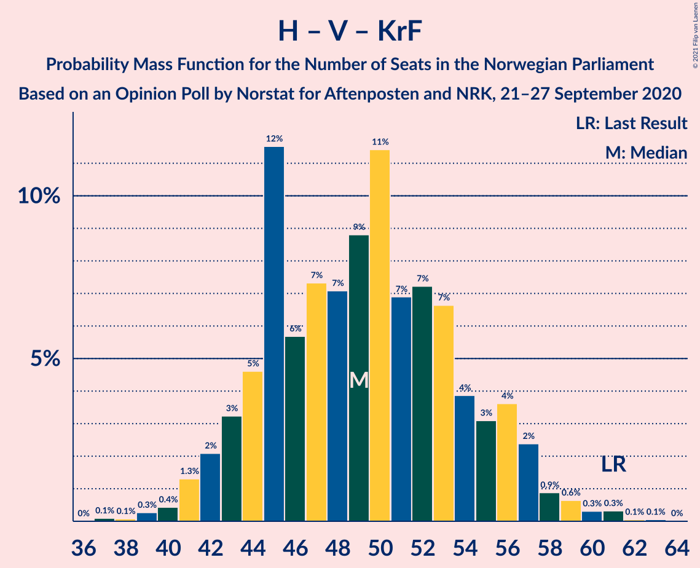

| Number of Seats | Probability | Accumulated | Special Marks |
|:---------------:|:-----------:|:-----------:|:-------------:|
| 37 | 0.1% | 100% |  |
| 38 | 0.1% | 99.9% |  |
| 39 | 0.3% | 99.8% |  |
| 40 | 0.4% | 99.5% |  |
| 41 | 1.3% | 99.1% |  |
| 42 | 2% | 98% |  |
| 43 | 3% | 96% |  |
| 44 | 5% | 92% |  |
| 45 | 12% | 88% |  |
| 46 | 6% | 76% |  |
| 47 | 7% | 71% | Median |
| 48 | 7% | 63% |  |
| 49 | 9% | 56% |  |
| 50 | 11% | 47% |  |
| 51 | 7% | 36% |  |
| 52 | 7% | 29% |  |
| 53 | 7% | 22% |  |
| 54 | 4% | 15% |  |
| 55 | 3% | 11% |  |
| 56 | 4% | 8% |  |
| 57 | 2% | 5% |  |
| 58 | 0.9% | 2% |  |
| 59 | 0.6% | 1.4% |  |
| 60 | 0.3% | 0.8% |  |
| 61 | 0.3% | 0.5% | Last Result |
| 62 | 0.1% | 0.1% |  |
| 63 | 0.1% | 0.1% |  |
| 64 | 0% | 0% |  |

### Senterpartiet – Venstre – Kristelig Folkeparti

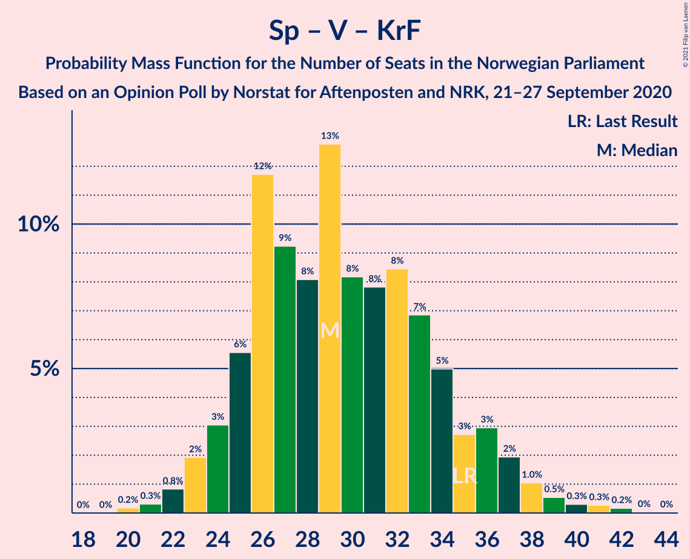

| Number of Seats | Probability | Accumulated | Special Marks |
|:---------------:|:-----------:|:-----------:|:-------------:|
| 20 | 0.2% | 100% |  |
| 21 | 0.3% | 99.8% |  |
| 22 | 0.8% | 99.5% |  |
| 23 | 2% | 98.7% |  |
| 24 | 3% | 97% |  |
| 25 | 6% | 94% |  |
| 26 | 12% | 88% |  |
| 27 | 9% | 76% | Median |
| 28 | 8% | 67% |  |
| 29 | 13% | 59% |  |
| 30 | 8% | 46% |  |
| 31 | 8% | 38% |  |
| 32 | 8% | 30% |  |
| 33 | 7% | 22% |  |
| 34 | 5% | 15% |  |
| 35 | 3% | 10% | Last Result |
| 36 | 3% | 7% |  |
| 37 | 2% | 4% |  |
| 38 | 1.0% | 2% |  |
| 39 | 0.5% | 1.3% |  |
| 40 | 0.3% | 0.8% |  |
| 41 | 0.3% | 0.5% |  |
| 42 | 0.2% | 0.2% |  |
| 43 | 0% | 0.1% |  |
| 44 | 0% | 0% |  |

## Technical Information

### Opinion Poll

+ **Polling firm:** Norstat
+ **Commissioner(s):** Aftenposten and NRK
+ **Fieldwork period:** 21–27 September 2020

### Calculations

+ **Sample size:** 696
+ **Simulations done:** 1,048,576
+ **Error estimate:** 2.03%

