# Opinion Poll by Respons Analyse for VG, 28–30 September 2020

<a href="#voting-intentions">Voting Intentions</a> | <a href="#seats">Seats</a> | <a href="#coalitions">Coalitions</a> | <a href="#technical-information">Technical Information</a>

## Voting Intentions

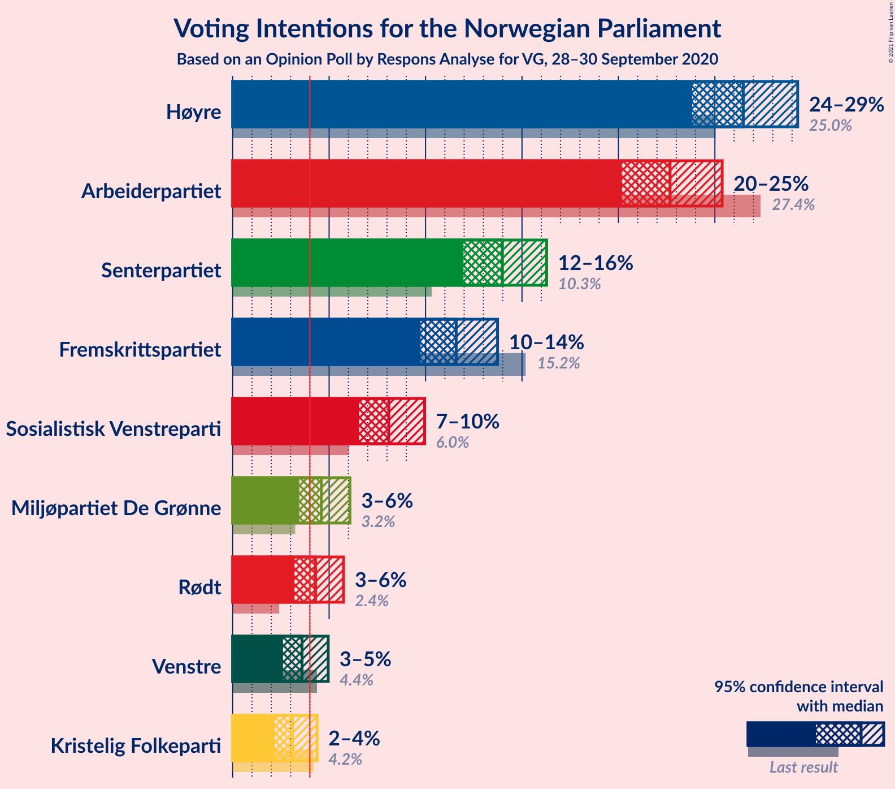

### Confidence Intervals

| Party | Last Result | Poll Result | 80% Confidence Interval | 90% Confidence Interval | 95% Confidence Interval | 99% Confidence Interval |
|:-----:|:-----------:|:-----------:|:-----------------------:|:-----------------------:|:-----------------------:|:-----------------------:|
| Høyre | 25.0% | 26.5% | 24.7–28.3% |24.2–28.9% |23.8–29.3% |23.0–30.2% |
| Arbeiderpartiet | 27.4% | 22.7% | 21.0–24.4% |20.6–25.0% |20.2–25.4% |19.4–26.2% |
| Senterpartiet | 10.3% | 14.0% | 12.7–15.5% |12.3–15.9% |12.0–16.3% |11.4–17.0% |
| Fremskrittspartiet | 15.2% | 11.6% | 10.4–13.0% |10.0–13.4% |9.7–13.7% |9.2–14.4% |
| Sosialistisk Venstreparti | 6.0% | 8.1% | 7.1–9.3% |6.8–9.6% |6.6–10.0% |6.1–10.6% |
| Miljøpartiet De Grønne | 3.2% | 4.6% | 3.8–5.6% |3.6–5.8% |3.5–6.1% |3.1–6.6% |
| Rødt | 2.4% | 4.3% | 3.6–5.2% |3.4–5.5% |3.2–5.7% |2.9–6.2% |
| Venstre | 4.4% | 3.6% | 2.9–4.5% |2.8–4.7% |2.6–5.0% |2.3–5.4% |
| Kristelig Folkeparti | 4.2% | 3.1% | 2.5–3.9% |2.3–4.2% |2.2–4.4% |1.9–4.8% |

*Note:* The poll result column reflects the actual value used in the calculations. Published results may vary slightly, and in addition be rounded to fewer digits.

## Seats

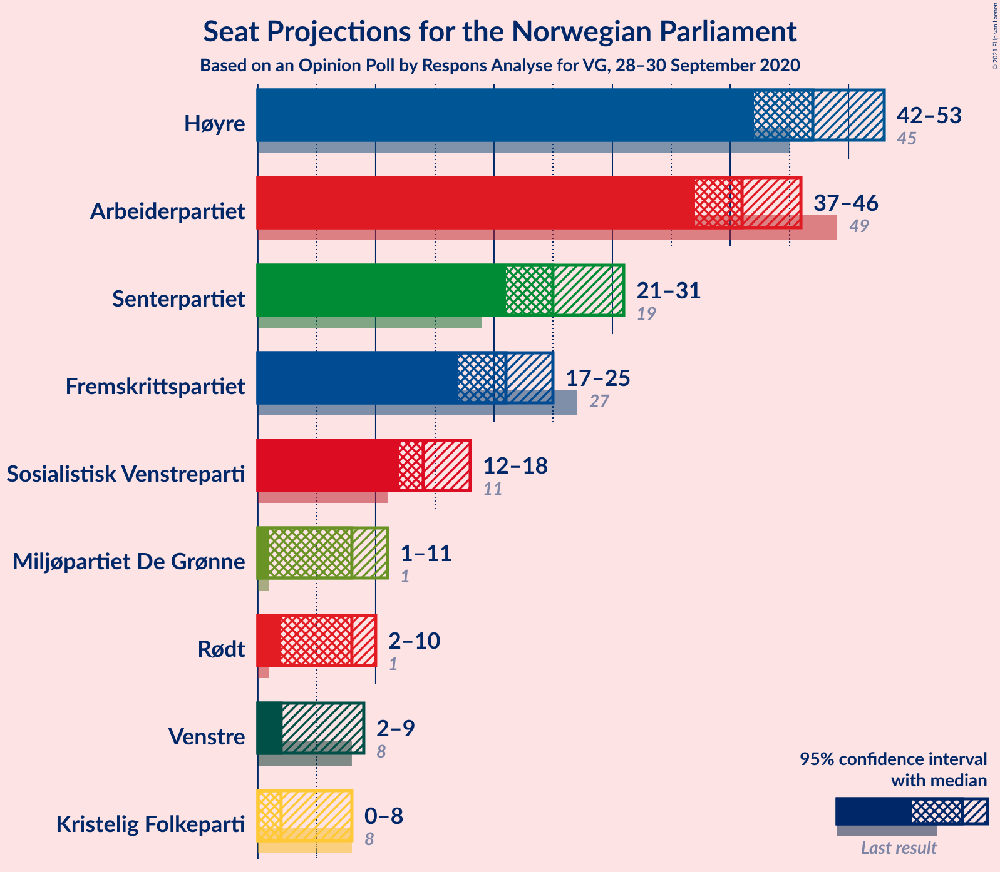

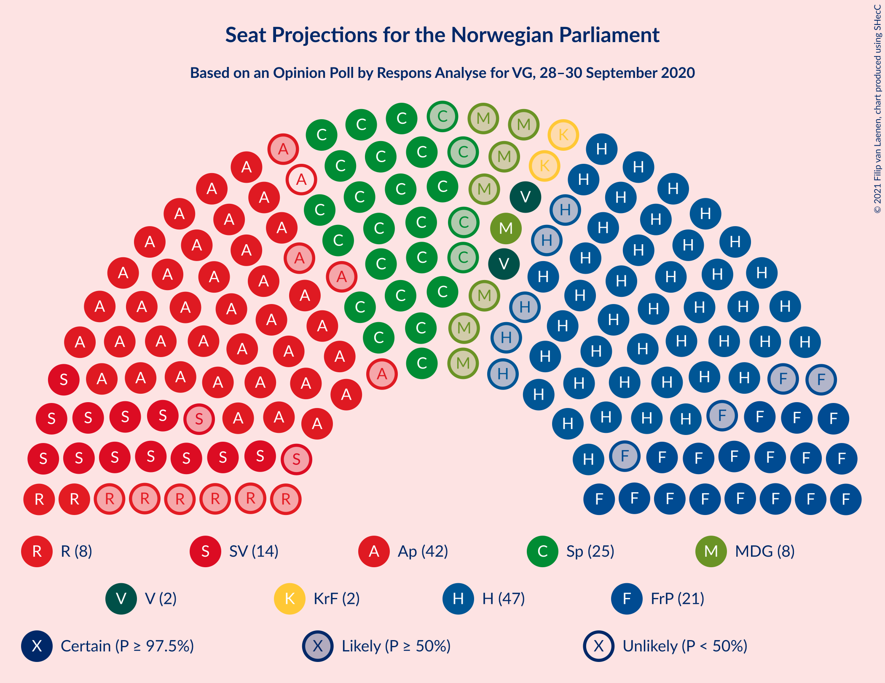

### Confidence Intervals

| Party | Last Result | Median | 80% Confidence Interval | 90% Confidence Interval | 95% Confidence Interval | 99% Confidence Interval |
|:-----:|:-----------:|:------:|:-----------------------:|:-----------------------:|:-----------------------:|:-----------------------:|
| <a href="#høyre">Høyre</a> | 45 | 47 | 44–51 |43–52 |42–53 |40–56 |
| <a href="#arbeiderpartiet">Arbeiderpartiet</a> | 49 | 41 | 39–44 |38–46 |37–46 |35–48 |
| <a href="#senterpartiet">Senterpartiet</a> | 19 | 25 | 22–28 |22–30 |21–31 |20–32 |
| <a href="#fremskrittspartiet">Fremskrittspartiet</a> | 27 | 21 | 18–24 |18–24 |17–25 |16–26 |
| <a href="#sosialistisk-venstreparti">Sosialistisk Venstreparti</a> | 11 | 14 | 13–17 |12–17 |12–18 |11–19 |
| <a href="#miljøpartiet-de-grønne">Miljøpartiet De Grønne</a> | 1 | 8 | 2–10 |2–10 |1–11 |1–12 |
| <a href="#rødt">Rødt</a> | 1 | 8 | 2–9 |2–10 |2–10 |1–11 |
| <a href="#venstre">Venstre</a> | 8 | 2 | 2–8 |2–8 |2–9 |1–9 |
| <a href="#kristelig-folkeparti">Kristelig Folkeparti</a> | 8 | 2 | 1–3 |1–7 |0–8 |0–8 |

### Høyre

*For a full overview of the results for this party, see the [Høyre](party-høyre.html) page.*

| Number of Seats | Probability | Accumulated | Special Marks |
|:---------------:|:-----------:|:-----------:|:-------------:|
| 38 | 0.1% | 100% |  |
| 39 | 0.1% | 99.9% |  |
| 40 | 0.4% | 99.7% |  |
| 41 | 1.3% | 99.4% |  |
| 42 | 2% | 98% |  |
| 43 | 3% | 96% |  |
| 44 | 5% | 93% |  |
| 45 | 14% | 88% | Last Result |
| 46 | 21% | 74% |  |
| 47 | 10% | 53% | Median |
| 48 | 7% | 43% |  |
| 49 | 12% | 36% |  |
| 50 | 8% | 23% |  |
| 51 | 9% | 15% |  |
| 52 | 4% | 7% |  |
| 53 | 1.0% | 3% |  |
| 54 | 1.0% | 2% |  |
| 55 | 0.5% | 1.0% |  |
| 56 | 0.3% | 0.5% |  |
| 57 | 0.2% | 0.3% |  |
| 58 | 0% | 0.1% |  |
| 59 | 0.1% | 0.1% |  |
| 60 | 0% | 0% |  |

### Arbeiderpartiet

*For a full overview of the results for this party, see the [Arbeiderpartiet](party-arbeiderpartiet.html) page.*

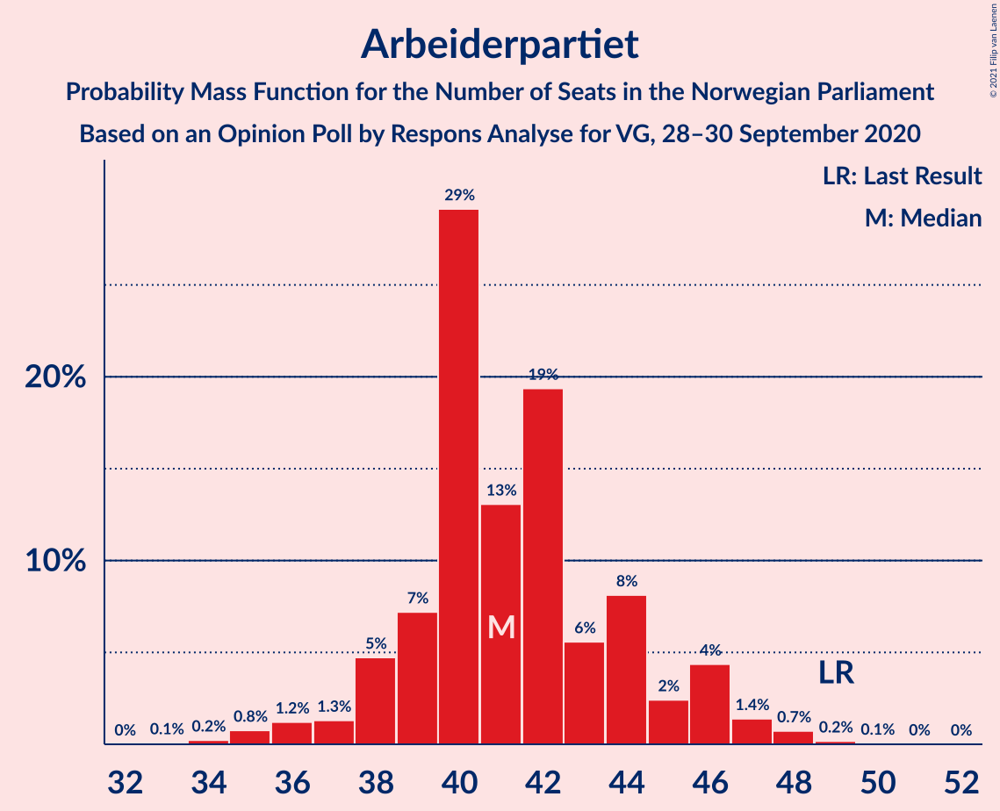

| Number of Seats | Probability | Accumulated | Special Marks |
|:---------------:|:-----------:|:-----------:|:-------------:|
| 33 | 0.1% | 100% |  |
| 34 | 0.2% | 99.9% |  |
| 35 | 0.8% | 99.7% |  |
| 36 | 1.2% | 98.9% |  |
| 37 | 1.3% | 98% |  |
| 38 | 5% | 96% |  |
| 39 | 7% | 92% |  |
| 40 | 29% | 84% |  |
| 41 | 13% | 55% | Median |
| 42 | 19% | 42% |  |
| 43 | 6% | 23% |  |
| 44 | 8% | 17% |  |
| 45 | 2% | 9% |  |
| 46 | 4% | 7% |  |
| 47 | 1.4% | 2% |  |
| 48 | 0.7% | 1.0% |  |
| 49 | 0.2% | 0.3% | Last Result |
| 50 | 0.1% | 0.1% |  |
| 51 | 0% | 0% |  |

### Senterpartiet

*For a full overview of the results for this party, see the [Senterpartiet](party-senterpartiet.html) page.*

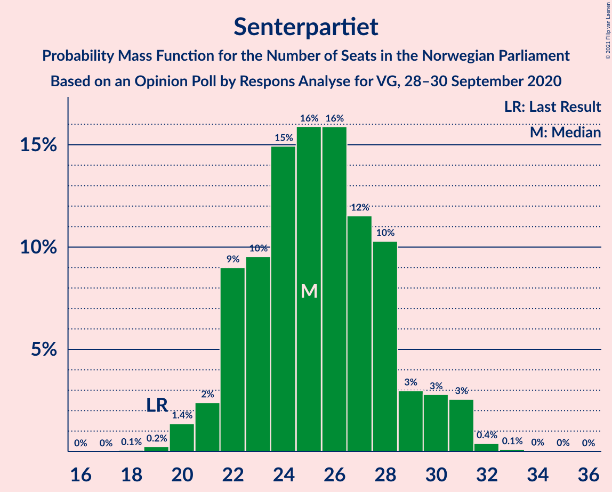

| Number of Seats | Probability | Accumulated | Special Marks |
|:---------------:|:-----------:|:-----------:|:-------------:|
| 18 | 0.1% | 100% |  |
| 19 | 0.2% | 99.9% | Last Result |
| 20 | 1.4% | 99.7% |  |
| 21 | 2% | 98% |  |
| 22 | 9% | 96% |  |
| 23 | 10% | 87% |  |
| 24 | 15% | 77% |  |
| 25 | 16% | 62% | Median |
| 26 | 16% | 47% |  |
| 27 | 12% | 31% |  |
| 28 | 10% | 19% |  |
| 29 | 3% | 9% |  |
| 30 | 3% | 6% |  |
| 31 | 3% | 3% |  |
| 32 | 0.4% | 0.6% |  |
| 33 | 0.1% | 0.2% |  |
| 34 | 0% | 0.1% |  |
| 35 | 0% | 0% |  |

### Fremskrittspartiet

*For a full overview of the results for this party, see the [Fremskrittspartiet](party-fremskrittspartiet.html) page.*

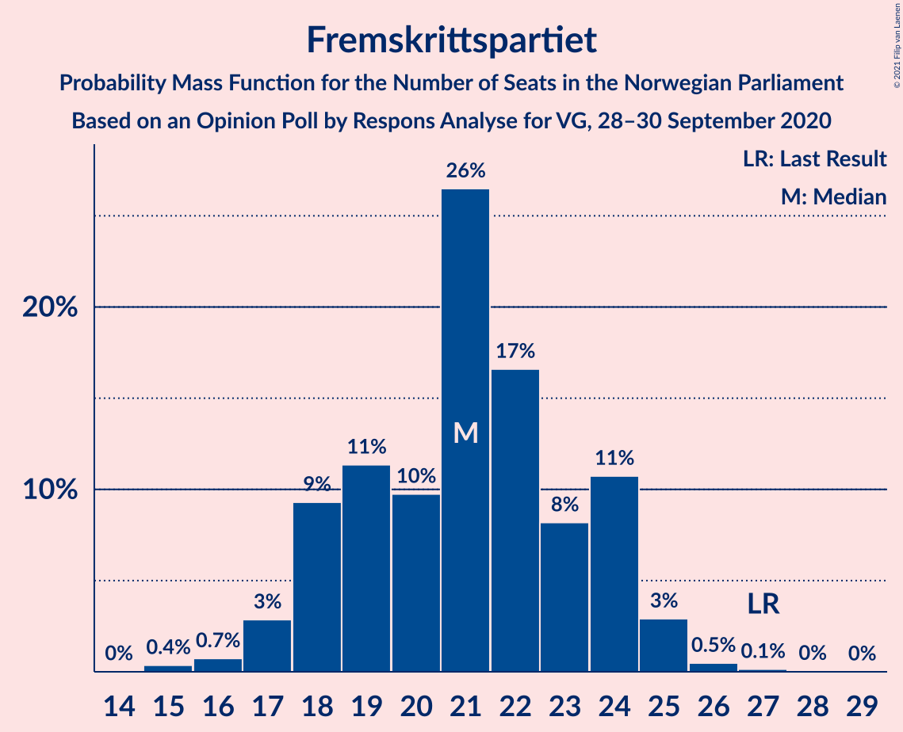

| Number of Seats | Probability | Accumulated | Special Marks |
|:---------------:|:-----------:|:-----------:|:-------------:|
| 15 | 0.4% | 100% |  |
| 16 | 0.7% | 99.6% |  |
| 17 | 3% | 98.9% |  |
| 18 | 9% | 96% |  |
| 19 | 11% | 87% |  |
| 20 | 10% | 75% |  |
| 21 | 26% | 66% | Median |
| 22 | 17% | 39% |  |
| 23 | 8% | 23% |  |
| 24 | 11% | 14% |  |
| 25 | 3% | 4% |  |
| 26 | 0.5% | 0.7% |  |
| 27 | 0.1% | 0.2% | Last Result |
| 28 | 0% | 0.1% |  |
| 29 | 0% | 0% |  |

### Sosialistisk Venstreparti

*For a full overview of the results for this party, see the [Sosialistisk Venstreparti](party-sosialistiskvenstreparti.html) page.*

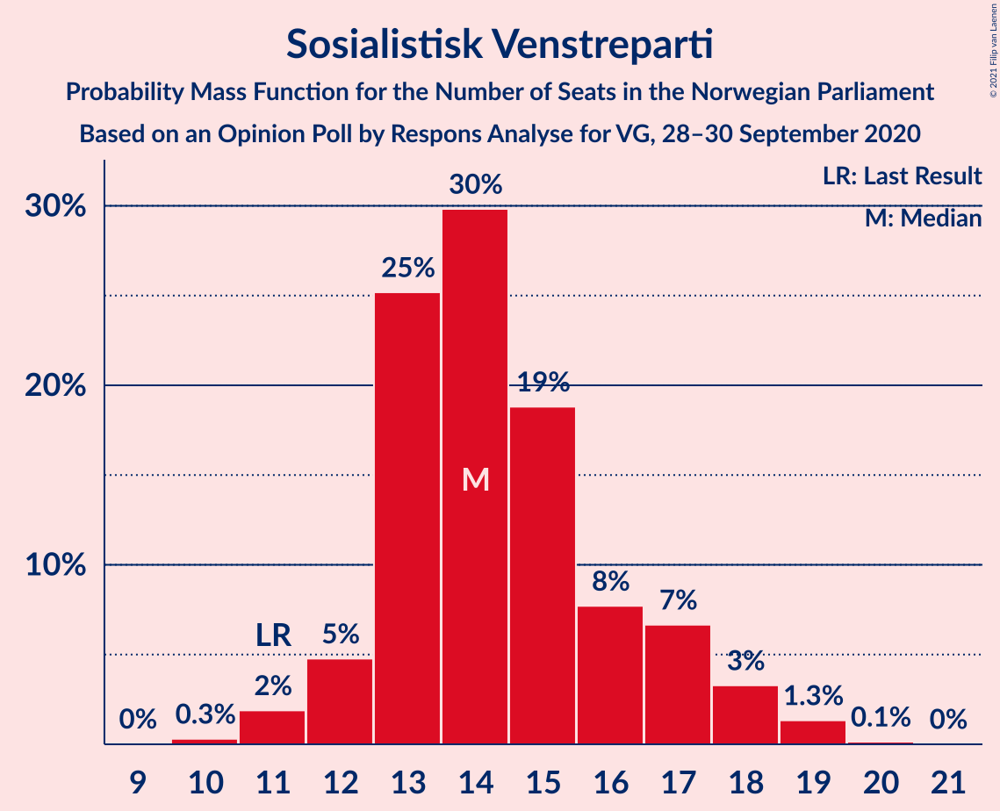

| Number of Seats | Probability | Accumulated | Special Marks |
|:---------------:|:-----------:|:-----------:|:-------------:|
| 10 | 0.3% | 100% |  |
| 11 | 2% | 99.7% | Last Result |
| 12 | 5% | 98% |  |
| 13 | 25% | 93% |  |
| 14 | 30% | 68% | Median |
| 15 | 19% | 38% |  |
| 16 | 8% | 19% |  |
| 17 | 7% | 11% |  |
| 18 | 3% | 5% |  |
| 19 | 1.3% | 2% |  |
| 20 | 0.1% | 0.2% |  |
| 21 | 0% | 0% |  |

### Miljøpartiet De Grønne

*For a full overview of the results for this party, see the [Miljøpartiet De Grønne](party-miljøpartietdegrønne.html) page.*

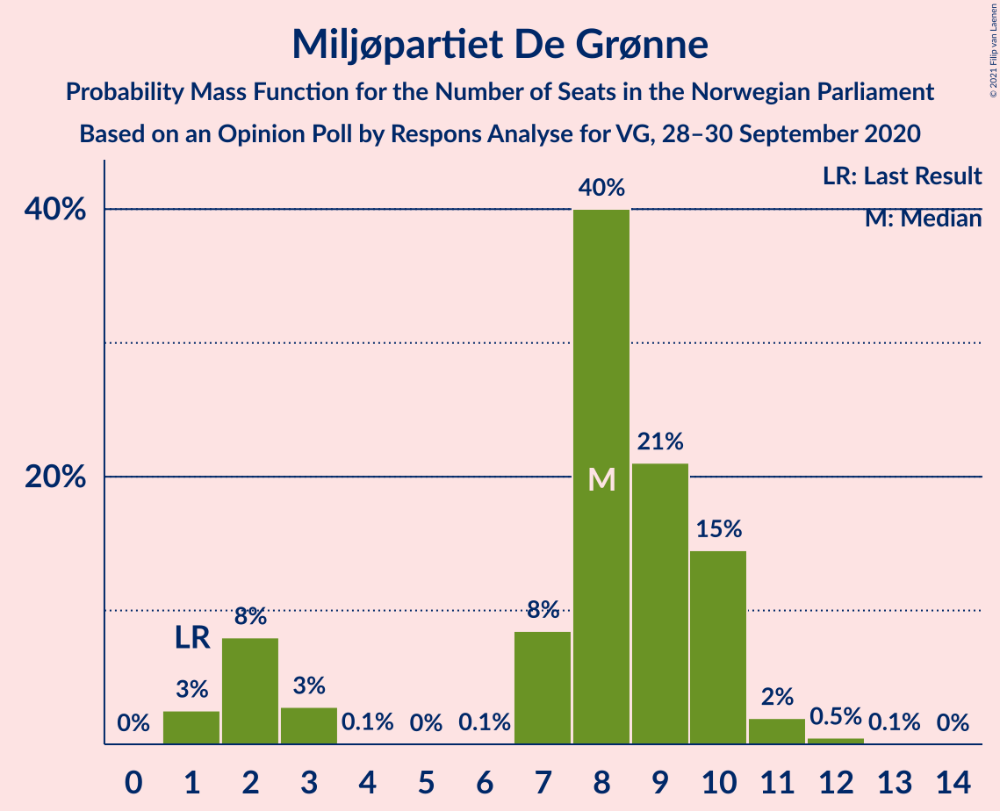

| Number of Seats | Probability | Accumulated | Special Marks |
|:---------------:|:-----------:|:-----------:|:-------------:|
| 1 | 3% | 100% | Last Result |
| 2 | 8% | 97% |  |
| 3 | 3% | 89% |  |
| 4 | 0.1% | 87% |  |
| 5 | 0% | 87% |  |
| 6 | 0.1% | 87% |  |
| 7 | 8% | 87% |  |
| 8 | 40% | 78% | Median |
| 9 | 21% | 38% |  |
| 10 | 15% | 17% |  |
| 11 | 2% | 3% |  |
| 12 | 0.5% | 0.6% |  |
| 13 | 0.1% | 0.1% |  |
| 14 | 0% | 0% |  |

### Rødt

*For a full overview of the results for this party, see the [Rødt](party-rødt.html) page.*

| Number of Seats | Probability | Accumulated | Special Marks |
|:---------------:|:-----------:|:-----------:|:-------------:|
| 1 | 1.1% | 100% | Last Result |
| 2 | 27% | 98.9% |  |
| 3 | 0% | 72% |  |
| 4 | 0% | 72% |  |
| 5 | 0% | 72% |  |
| 6 | 0.1% | 72% |  |
| 7 | 17% | 72% |  |
| 8 | 36% | 55% | Median |
| 9 | 12% | 19% |  |
| 10 | 6% | 7% |  |
| 11 | 1.0% | 1.1% |  |
| 12 | 0.1% | 0.2% |  |
| 13 | 0% | 0% |  |

### Venstre

*For a full overview of the results for this party, see the [Venstre](party-venstre.html) page.*

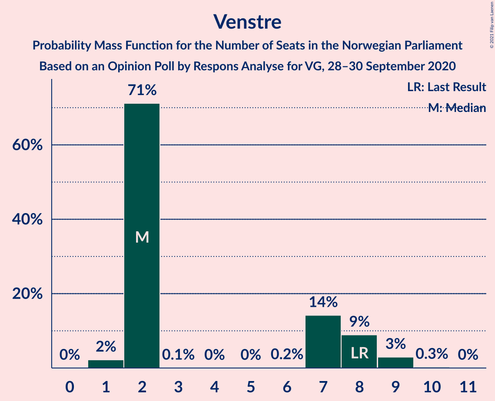

| Number of Seats | Probability | Accumulated | Special Marks |
|:---------------:|:-----------:|:-----------:|:-------------:|
| 1 | 2% | 100% |  |
| 2 | 71% | 98% | Median |
| 3 | 0.1% | 27% |  |
| 4 | 0% | 27% |  |
| 5 | 0% | 27% |  |
| 6 | 0.2% | 27% |  |
| 7 | 14% | 26% |  |
| 8 | 9% | 12% | Last Result |
| 9 | 3% | 3% |  |
| 10 | 0.3% | 0.3% |  |
| 11 | 0% | 0% |  |

### Kristelig Folkeparti

*For a full overview of the results for this party, see the [Kristelig Folkeparti](party-kristeligfolkeparti.html) page.*

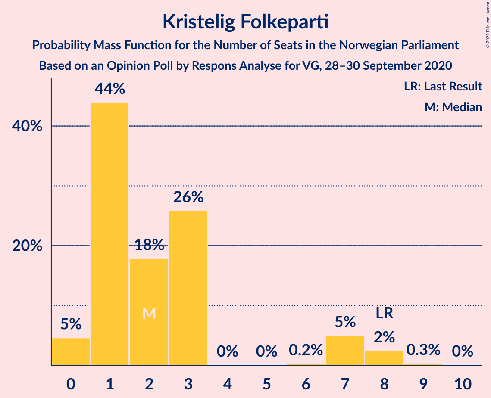

| Number of Seats | Probability | Accumulated | Special Marks |
|:---------------:|:-----------:|:-----------:|:-------------:|
| 0 | 5% | 100% |  |
| 1 | 44% | 95% |  |
| 2 | 18% | 51% | Median |
| 3 | 26% | 34% |  |
| 4 | 0% | 8% |  |
| 5 | 0% | 8% |  |
| 6 | 0.2% | 8% |  |
| 7 | 5% | 8% |  |
| 8 | 2% | 3% | Last Result |
| 9 | 0.3% | 0.3% |  |
| 10 | 0% | 0% |  |

## Coalitions

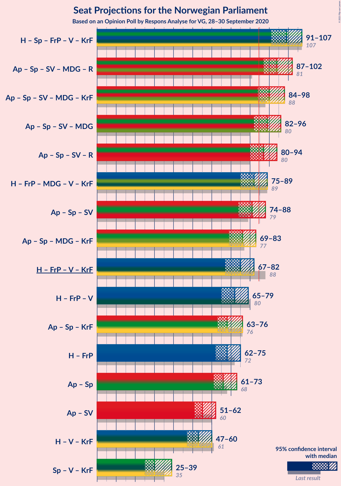

### Confidence Intervals

| Coalition | Last Result | Median | Majority? | 80% Confidence Interval | 90% Confidence Interval | 95% Confidence Interval | 99% Confidence Interval |
|:---------:|:-----------:|:------:|:---------:|:-----------------------:|:-----------------------:|:-----------------------:|:-----------------------:|
| Høyre – Senterpartiet – Fremskrittspartiet – Venstre – Kristelig Folkeparti | 107 | 99 | 100% | 95–104 | 93–105 | 91–107 | 90–110 |
| Arbeiderpartiet – Senterpartiet – Sosialistisk Venstreparti – Miljøpartiet De Grønne – Rødt | 81 | 94 | 99.8% | 91–100 | 89–101 | 87–102 | 85–103 |
| Arbeiderpartiet – Senterpartiet – Sosialistisk Venstreparti – Miljøpartiet De Grønne – Kristelig Folkeparti | 88 | 90 | 97% | 87–96 | 85–97 | 84–98 | 82–100 |
| Arbeiderpartiet – Senterpartiet – Sosialistisk Venstreparti – Miljøpartiet De Grønne | 80 | 89 | 88% | 84–94 | 83–95 | 82–96 | 79–97 |
| Arbeiderpartiet – Senterpartiet – Sosialistisk Venstreparti – Rødt | 80 | 87 | 78% | 83–92 | 81–93 | 80–94 | 77–97 |
| Høyre – Fremskrittspartiet – Miljøpartiet De Grønne – Venstre – Kristelig Folkeparti | 89 | 82 | 22% | 77–86 | 76–88 | 75–89 | 72–92 |
| Arbeiderpartiet – Senterpartiet – Sosialistisk Venstreparti | 79 | 81 | 16% | 77–86 | 75–87 | 74–88 | 73–90 |
| Arbeiderpartiet – Senterpartiet – Miljøpartiet De Grønne – Kristelig Folkeparti | 77 | 76 | 1.0% | 72–81 | 70–83 | 69–83 | 68–85 |
| Høyre – Fremskrittspartiet – Venstre – Kristelig Folkeparti | 88 | 75 | 0.2% | 69–78 | 68–80 | 67–82 | 66–84 |
| Høyre – Fremskrittspartiet – Venstre | 80 | 72 | 0% | 66–77 | 66–78 | 65–79 | 63–81 |
| Arbeiderpartiet – Senterpartiet – Kristelig Folkeparti | 76 | 68 | 0% | 65–73 | 64–74 | 63–76 | 61–77 |
| Høyre – Fremskrittspartiet | 72 | 68 | 0% | 64–73 | 63–75 | 62–75 | 59–78 |
| Arbeiderpartiet – Senterpartiet | 68 | 66 | 0% | 63–71 | 62–72 | 61–73 | 59–75 |
| Arbeiderpartiet – Sosialistisk Venstreparti | 60 | 55 | 0% | 52–59 | 52–61 | 51–62 | 49–63 |
| Høyre – Venstre – Kristelig Folkeparti | 61 | 53 | 0% | 49–57 | 48–59 | 47–60 | 45–63 |
| Senterpartiet – Venstre – Kristelig Folkeparti | 35 | 30 | 0% | 27–36 | 26–38 | 25–39 | 24–41 |

### Høyre – Senterpartiet – Fremskrittspartiet – Venstre – Kristelig Folkeparti

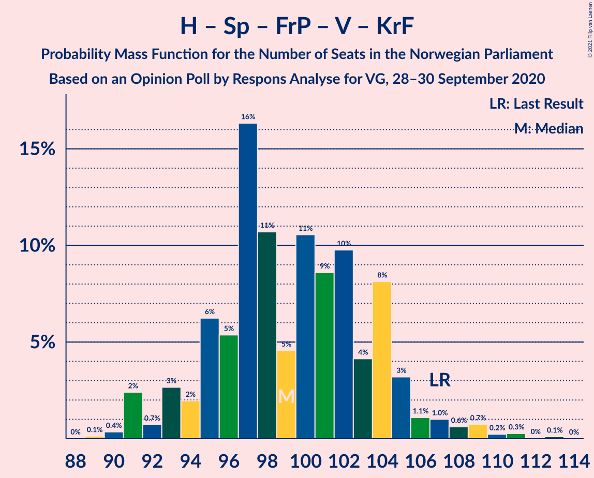

| Number of Seats | Probability | Accumulated | Special Marks |
|:---------------:|:-----------:|:-----------:|:-------------:|
| 89 | 0.1% | 100% |  |
| 90 | 0.4% | 99.8% |  |
| 91 | 2% | 99.5% |  |
| 92 | 0.7% | 97% |  |
| 93 | 3% | 96% |  |
| 94 | 2% | 94% |  |
| 95 | 6% | 92% |  |
| 96 | 5% | 85% |  |
| 97 | 16% | 80% | Median |
| 98 | 11% | 64% |  |
| 99 | 5% | 53% |  |
| 100 | 11% | 49% |  |
| 101 | 9% | 38% |  |
| 102 | 10% | 29% |  |
| 103 | 4% | 20% |  |
| 104 | 8% | 15% |  |
| 105 | 3% | 7% |  |
| 106 | 1.1% | 4% |  |
| 107 | 1.0% | 3% | Last Result |
| 108 | 0.6% | 2% |  |
| 109 | 0.7% | 1.4% |  |
| 110 | 0.2% | 0.7% |  |
| 111 | 0.3% | 0.4% |  |
| 112 | 0% | 0.2% |  |
| 113 | 0.1% | 0.1% |  |
| 114 | 0% | 0% |  |

### Arbeiderpartiet – Senterpartiet – Sosialistisk Venstreparti – Miljøpartiet De Grønne – Rødt

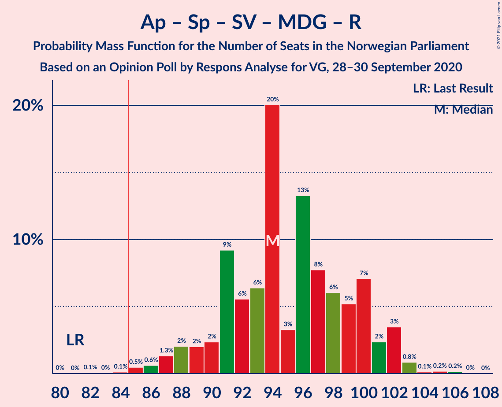

| Number of Seats | Probability | Accumulated | Special Marks |
|:---------------:|:-----------:|:-----------:|:-------------:|
| 81 | 0% | 100% | Last Result |
| 82 | 0.1% | 100% |  |
| 83 | 0% | 99.9% |  |
| 84 | 0.1% | 99.9% |  |
| 85 | 0.5% | 99.8% | Majority |
| 86 | 0.6% | 99.3% |  |
| 87 | 1.3% | 98.7% |  |
| 88 | 2% | 97% |  |
| 89 | 2% | 95% |  |
| 90 | 2% | 93% |  |
| 91 | 9% | 91% |  |
| 92 | 6% | 82% |  |
| 93 | 6% | 76% |  |
| 94 | 20% | 70% |  |
| 95 | 3% | 50% |  |
| 96 | 13% | 46% | Median |
| 97 | 8% | 33% |  |
| 98 | 6% | 25% |  |
| 99 | 5% | 19% |  |
| 100 | 7% | 14% |  |
| 101 | 2% | 7% |  |
| 102 | 3% | 5% |  |
| 103 | 0.8% | 1.3% |  |
| 104 | 0.1% | 0.5% |  |
| 105 | 0.2% | 0.4% |  |
| 106 | 0.2% | 0.2% |  |
| 107 | 0% | 0% |  |

### Arbeiderpartiet – Senterpartiet – Sosialistisk Venstreparti – Miljøpartiet De Grønne – Kristelig Folkeparti

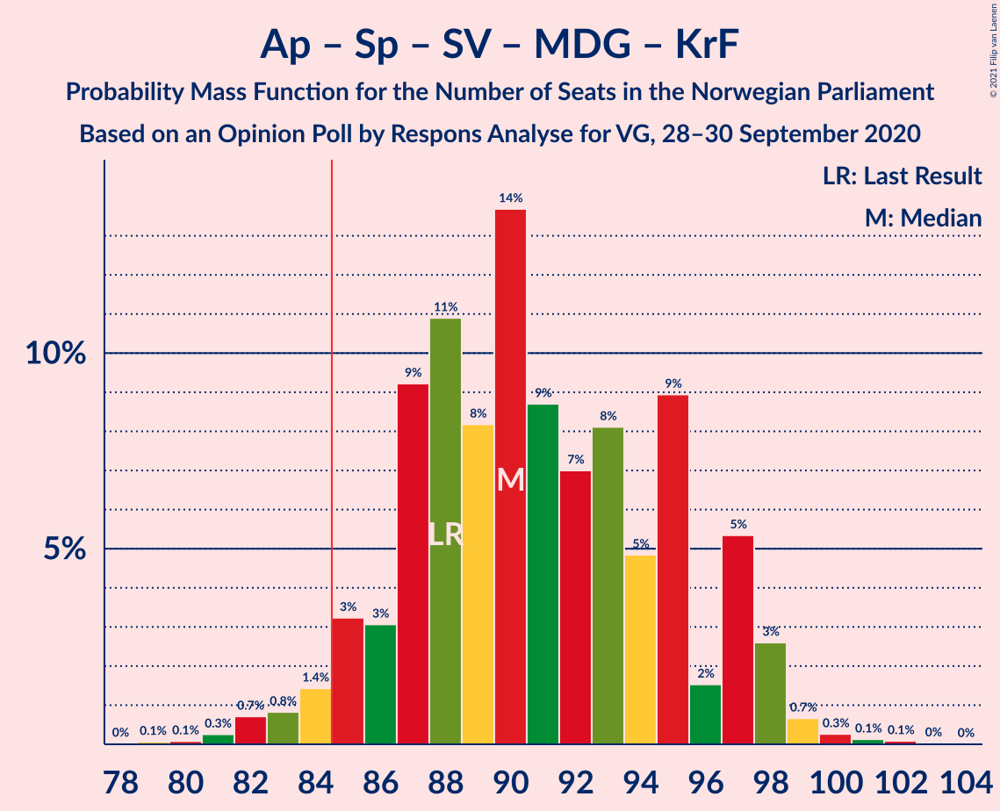

| Number of Seats | Probability | Accumulated | Special Marks |
|:---------------:|:-----------:|:-----------:|:-------------:|
| 79 | 0.1% | 100% |  |
| 80 | 0.1% | 99.9% |  |
| 81 | 0.3% | 99.8% |  |
| 82 | 0.7% | 99.6% |  |
| 83 | 0.8% | 98.8% |  |
| 84 | 1.4% | 98% |  |
| 85 | 3% | 97% | Majority |
| 86 | 3% | 93% |  |
| 87 | 9% | 90% |  |
| 88 | 11% | 81% | Last Result |
| 89 | 8% | 70% |  |
| 90 | 14% | 62% | Median |
| 91 | 9% | 48% |  |
| 92 | 7% | 40% |  |
| 93 | 8% | 33% |  |
| 94 | 5% | 24% |  |
| 95 | 9% | 20% |  |
| 96 | 2% | 11% |  |
| 97 | 5% | 9% |  |
| 98 | 3% | 4% |  |
| 99 | 0.7% | 1.2% |  |
| 100 | 0.3% | 0.5% |  |
| 101 | 0.1% | 0.3% |  |
| 102 | 0.1% | 0.1% |  |
| 103 | 0% | 0.1% |  |
| 104 | 0% | 0% |  |

### Arbeiderpartiet – Senterpartiet – Sosialistisk Venstreparti – Miljøpartiet De Grønne

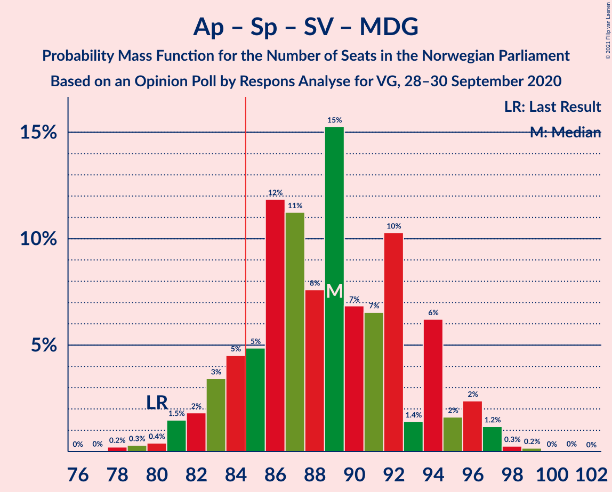

| Number of Seats | Probability | Accumulated | Special Marks |
|:---------------:|:-----------:|:-----------:|:-------------:|
| 76 | 0% | 100% |  |
| 77 | 0% | 99.9% |  |
| 78 | 0.2% | 99.9% |  |
| 79 | 0.3% | 99.7% |  |
| 80 | 0.4% | 99.4% | Last Result |
| 81 | 1.5% | 99.0% |  |
| 82 | 2% | 98% |  |
| 83 | 3% | 96% |  |
| 84 | 5% | 92% |  |
| 85 | 5% | 88% | Majority |
| 86 | 12% | 83% |  |
| 87 | 11% | 71% |  |
| 88 | 8% | 60% | Median |
| 89 | 15% | 52% |  |
| 90 | 7% | 37% |  |
| 91 | 7% | 30% |  |
| 92 | 10% | 24% |  |
| 93 | 1.4% | 13% |  |
| 94 | 6% | 12% |  |
| 95 | 2% | 6% |  |
| 96 | 2% | 4% |  |
| 97 | 1.2% | 2% |  |
| 98 | 0.3% | 0.5% |  |
| 99 | 0.2% | 0.2% |  |
| 100 | 0% | 0.1% |  |
| 101 | 0% | 0% |  |

### Arbeiderpartiet – Senterpartiet – Sosialistisk Venstreparti – Rødt

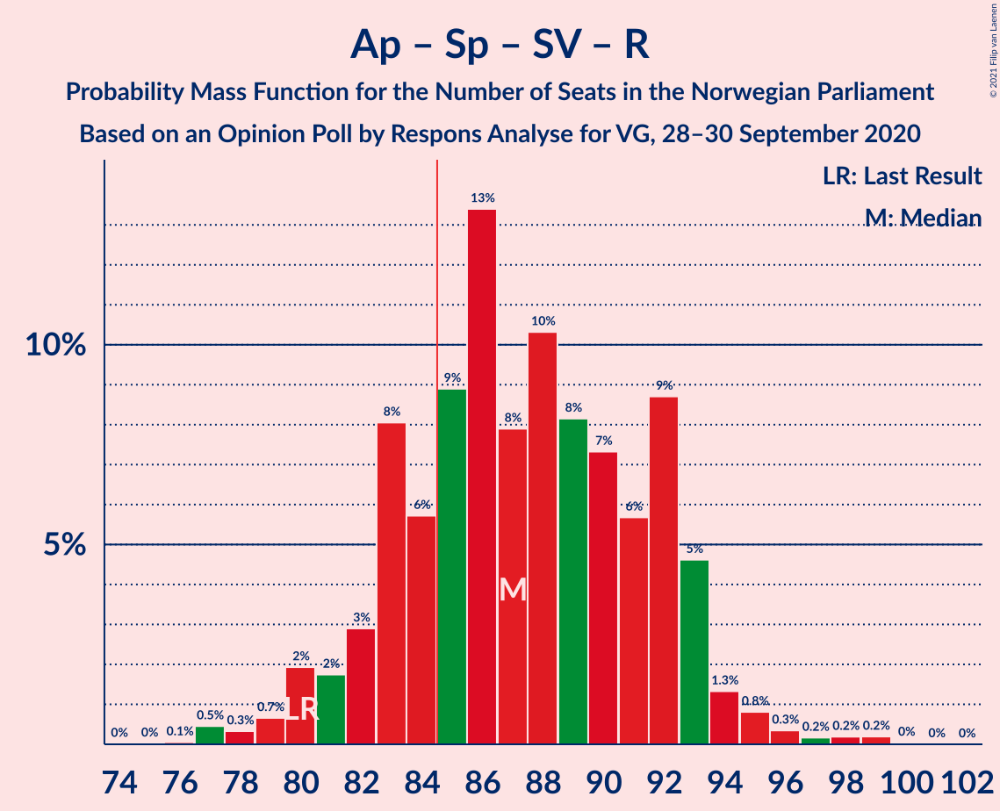

| Number of Seats | Probability | Accumulated | Special Marks |
|:---------------:|:-----------:|:-----------:|:-------------:|
| 76 | 0.1% | 100% |  |
| 77 | 0.5% | 99.9% |  |
| 78 | 0.3% | 99.4% |  |
| 79 | 0.7% | 99.1% |  |
| 80 | 2% | 98% | Last Result |
| 81 | 2% | 97% |  |
| 82 | 3% | 95% |  |
| 83 | 8% | 92% |  |
| 84 | 6% | 84% |  |
| 85 | 9% | 78% | Majority |
| 86 | 13% | 69% |  |
| 87 | 8% | 56% |  |
| 88 | 10% | 48% | Median |
| 89 | 8% | 38% |  |
| 90 | 7% | 29% |  |
| 91 | 6% | 22% |  |
| 92 | 9% | 16% |  |
| 93 | 5% | 8% |  |
| 94 | 1.3% | 3% |  |
| 95 | 0.8% | 2% |  |
| 96 | 0.3% | 1.0% |  |
| 97 | 0.2% | 0.6% |  |
| 98 | 0.2% | 0.4% |  |
| 99 | 0.2% | 0.2% |  |
| 100 | 0% | 0.1% |  |
| 101 | 0% | 0% |  |

### Høyre – Fremskrittspartiet – Miljøpartiet De Grønne – Venstre – Kristelig Folkeparti

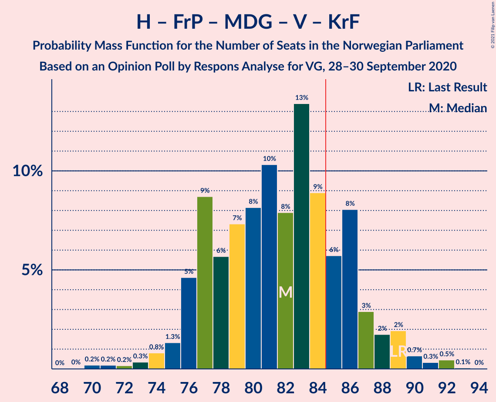

| Number of Seats | Probability | Accumulated | Special Marks |
|:---------------:|:-----------:|:-----------:|:-------------:|
| 69 | 0% | 100% |  |
| 70 | 0.2% | 99.9% |  |
| 71 | 0.2% | 99.8% |  |
| 72 | 0.2% | 99.6% |  |
| 73 | 0.3% | 99.4% |  |
| 74 | 0.8% | 99.0% |  |
| 75 | 1.3% | 98% |  |
| 76 | 5% | 97% |  |
| 77 | 9% | 92% |  |
| 78 | 6% | 84% |  |
| 79 | 7% | 78% |  |
| 80 | 8% | 71% | Median |
| 81 | 10% | 62% |  |
| 82 | 8% | 52% |  |
| 83 | 13% | 44% |  |
| 84 | 9% | 31% |  |
| 85 | 6% | 22% | Majority |
| 86 | 8% | 16% |  |
| 87 | 3% | 8% |  |
| 88 | 2% | 5% |  |
| 89 | 2% | 3% | Last Result |
| 90 | 0.7% | 2% |  |
| 91 | 0.3% | 0.9% |  |
| 92 | 0.5% | 0.6% |  |
| 93 | 0.1% | 0.1% |  |
| 94 | 0% | 0% |  |

### Arbeiderpartiet – Senterpartiet – Sosialistisk Venstreparti

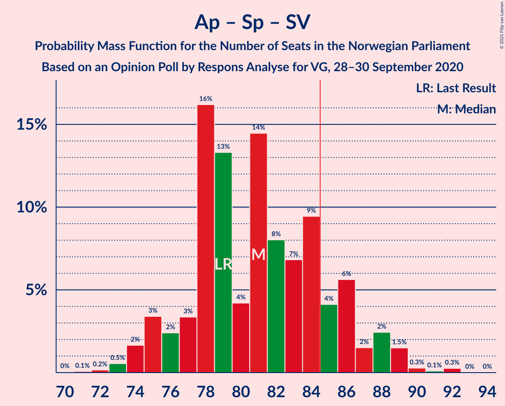

| Number of Seats | Probability | Accumulated | Special Marks |
|:---------------:|:-----------:|:-----------:|:-------------:|
| 70 | 0% | 100% |  |
| 71 | 0.1% | 99.9% |  |
| 72 | 0.2% | 99.9% |  |
| 73 | 0.5% | 99.7% |  |
| 74 | 2% | 99.2% |  |
| 75 | 3% | 97% |  |
| 76 | 2% | 94% |  |
| 77 | 3% | 92% |  |
| 78 | 16% | 88% |  |
| 79 | 13% | 72% | Last Result |
| 80 | 4% | 59% | Median |
| 81 | 14% | 55% |  |
| 82 | 8% | 40% |  |
| 83 | 7% | 32% |  |
| 84 | 9% | 25% |  |
| 85 | 4% | 16% | Majority |
| 86 | 6% | 12% |  |
| 87 | 2% | 6% |  |
| 88 | 2% | 5% |  |
| 89 | 1.5% | 2% |  |
| 90 | 0.3% | 0.7% |  |
| 91 | 0.1% | 0.4% |  |
| 92 | 0.3% | 0.3% |  |
| 93 | 0% | 0% |  |

### Arbeiderpartiet – Senterpartiet – Miljøpartiet De Grønne – Kristelig Folkeparti

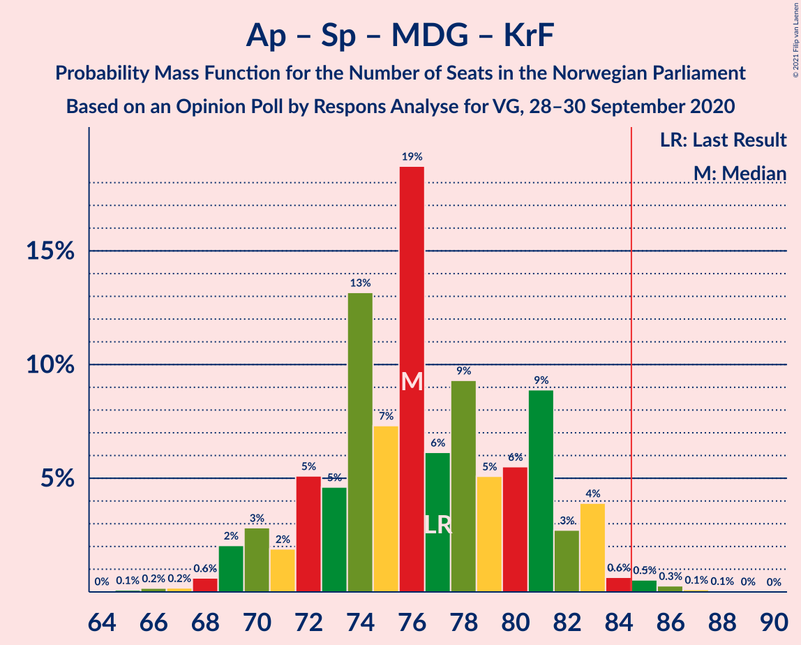

| Number of Seats | Probability | Accumulated | Special Marks |
|:---------------:|:-----------:|:-----------:|:-------------:|
| 64 | 0% | 100% |  |
| 65 | 0.1% | 99.9% |  |
| 66 | 0.2% | 99.9% |  |
| 67 | 0.2% | 99.7% |  |
| 68 | 0.6% | 99.5% |  |
| 69 | 2% | 98.9% |  |
| 70 | 3% | 97% |  |
| 71 | 2% | 94% |  |
| 72 | 5% | 92% |  |
| 73 | 5% | 87% |  |
| 74 | 13% | 82% |  |
| 75 | 7% | 69% |  |
| 76 | 19% | 62% | Median |
| 77 | 6% | 43% | Last Result |
| 78 | 9% | 37% |  |
| 79 | 5% | 28% |  |
| 80 | 6% | 23% |  |
| 81 | 9% | 17% |  |
| 82 | 3% | 8% |  |
| 83 | 4% | 6% |  |
| 84 | 0.6% | 2% |  |
| 85 | 0.5% | 1.0% | Majority |
| 86 | 0.3% | 0.5% |  |
| 87 | 0.1% | 0.2% |  |
| 88 | 0.1% | 0.1% |  |
| 89 | 0% | 0% |  |

### Høyre – Fremskrittspartiet – Venstre – Kristelig Folkeparti

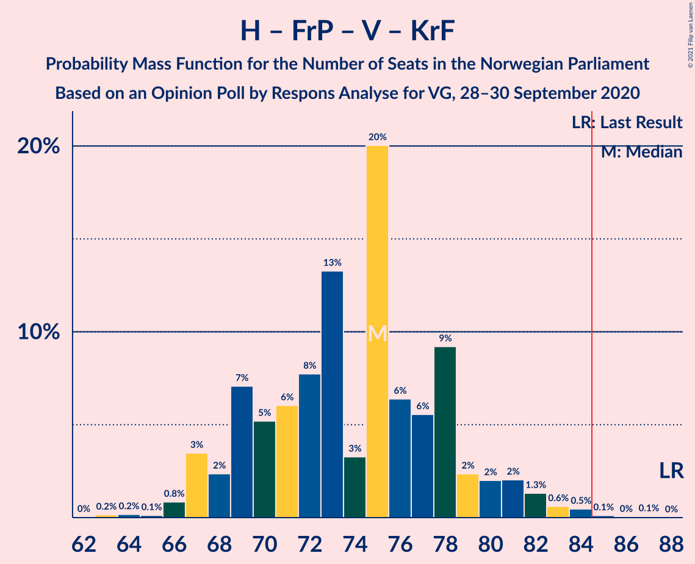

| Number of Seats | Probability | Accumulated | Special Marks |
|:---------------:|:-----------:|:-----------:|:-------------:|
| 63 | 0.2% | 100% |  |
| 64 | 0.2% | 99.8% |  |
| 65 | 0.1% | 99.6% |  |
| 66 | 0.8% | 99.5% |  |
| 67 | 3% | 98.7% |  |
| 68 | 2% | 95% |  |
| 69 | 7% | 93% |  |
| 70 | 5% | 86% |  |
| 71 | 6% | 81% |  |
| 72 | 8% | 75% | Median |
| 73 | 13% | 67% |  |
| 74 | 3% | 54% |  |
| 75 | 20% | 50% |  |
| 76 | 6% | 30% |  |
| 77 | 6% | 24% |  |
| 78 | 9% | 18% |  |
| 79 | 2% | 9% |  |
| 80 | 2% | 7% |  |
| 81 | 2% | 5% |  |
| 82 | 1.3% | 3% |  |
| 83 | 0.6% | 1.3% |  |
| 84 | 0.5% | 0.7% |  |
| 85 | 0.1% | 0.2% | Majority |
| 86 | 0% | 0.1% |  |
| 87 | 0.1% | 0.1% |  |
| 88 | 0% | 0% | Last Result |

### Høyre – Fremskrittspartiet – Venstre

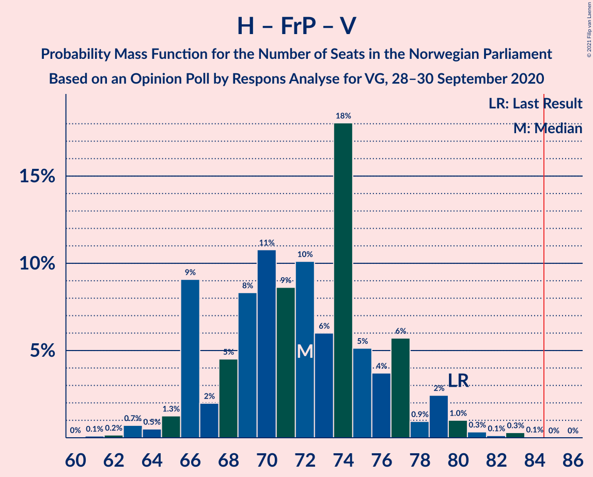

| Number of Seats | Probability | Accumulated | Special Marks |
|:---------------:|:-----------:|:-----------:|:-------------:|
| 61 | 0.1% | 100% |  |
| 62 | 0.2% | 99.9% |  |
| 63 | 0.7% | 99.7% |  |
| 64 | 0.5% | 99.0% |  |
| 65 | 1.3% | 98% |  |
| 66 | 9% | 97% |  |
| 67 | 2% | 88% |  |
| 68 | 5% | 86% |  |
| 69 | 8% | 82% |  |
| 70 | 11% | 73% | Median |
| 71 | 9% | 63% |  |
| 72 | 10% | 54% |  |
| 73 | 6% | 44% |  |
| 74 | 18% | 38% |  |
| 75 | 5% | 20% |  |
| 76 | 4% | 15% |  |
| 77 | 6% | 11% |  |
| 78 | 0.9% | 5% |  |
| 79 | 2% | 4% |  |
| 80 | 1.0% | 2% | Last Result |
| 81 | 0.3% | 0.8% |  |
| 82 | 0.1% | 0.5% |  |
| 83 | 0.3% | 0.4% |  |
| 84 | 0.1% | 0.1% |  |
| 85 | 0% | 0% | Majority |

### Arbeiderpartiet – Senterpartiet – Kristelig Folkeparti

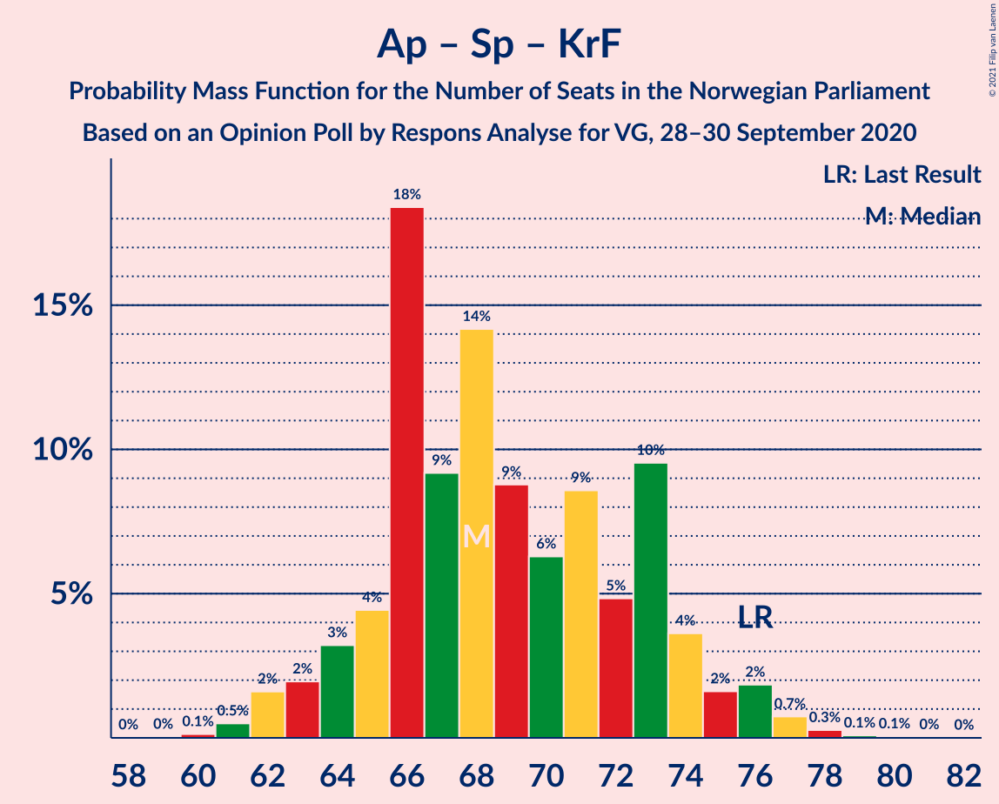

| Number of Seats | Probability | Accumulated | Special Marks |
|:---------------:|:-----------:|:-----------:|:-------------:|
| 59 | 0% | 100% |  |
| 60 | 0.1% | 99.9% |  |
| 61 | 0.5% | 99.8% |  |
| 62 | 2% | 99.3% |  |
| 63 | 2% | 98% |  |
| 64 | 3% | 96% |  |
| 65 | 4% | 93% |  |
| 66 | 18% | 88% |  |
| 67 | 9% | 70% |  |
| 68 | 14% | 60% | Median |
| 69 | 9% | 46% |  |
| 70 | 6% | 38% |  |
| 71 | 9% | 31% |  |
| 72 | 5% | 23% |  |
| 73 | 10% | 18% |  |
| 74 | 4% | 8% |  |
| 75 | 2% | 5% |  |
| 76 | 2% | 3% | Last Result |
| 77 | 0.7% | 1.2% |  |
| 78 | 0.3% | 0.5% |  |
| 79 | 0.1% | 0.2% |  |
| 80 | 0.1% | 0.1% |  |
| 81 | 0% | 0% |  |

### Høyre – Fremskrittspartiet

| Number of Seats | Probability | Accumulated | Special Marks |
|:---------------:|:-----------:|:-----------:|:-------------:|
| 57 | 0% | 100% |  |
| 58 | 0.1% | 99.9% |  |
| 59 | 0.5% | 99.8% |  |
| 60 | 0.7% | 99.3% |  |
| 61 | 1.0% | 98.6% |  |
| 62 | 2% | 98% |  |
| 63 | 3% | 96% |  |
| 64 | 10% | 93% |  |
| 65 | 4% | 83% |  |
| 66 | 6% | 79% |  |
| 67 | 17% | 73% |  |
| 68 | 10% | 56% | Median |
| 69 | 8% | 46% |  |
| 70 | 11% | 38% |  |
| 71 | 4% | 26% |  |
| 72 | 10% | 22% | Last Result |
| 73 | 3% | 11% |  |
| 74 | 2% | 8% |  |
| 75 | 5% | 6% |  |
| 76 | 0.5% | 1.4% |  |
| 77 | 0.3% | 0.9% |  |
| 78 | 0.2% | 0.6% |  |
| 79 | 0.2% | 0.3% |  |
| 80 | 0% | 0.1% |  |
| 81 | 0% | 0% |  |

### Arbeiderpartiet – Senterpartiet

| Number of Seats | Probability | Accumulated | Special Marks |
|:---------------:|:-----------:|:-----------:|:-------------:|
| 57 | 0.1% | 100% |  |
| 58 | 0.1% | 99.9% |  |
| 59 | 0.6% | 99.8% |  |
| 60 | 1.4% | 99.2% |  |
| 61 | 1.4% | 98% |  |
| 62 | 6% | 96% |  |
| 63 | 4% | 91% |  |
| 64 | 10% | 86% |  |
| 65 | 17% | 77% |  |
| 66 | 11% | 59% | Median |
| 67 | 13% | 48% |  |
| 68 | 9% | 36% | Last Result |
| 69 | 4% | 26% |  |
| 70 | 12% | 22% |  |
| 71 | 3% | 10% |  |
| 72 | 3% | 7% |  |
| 73 | 2% | 4% |  |
| 74 | 0.6% | 2% |  |
| 75 | 0.7% | 1.0% |  |
| 76 | 0.1% | 0.3% |  |
| 77 | 0.1% | 0.1% |  |
| 78 | 0% | 0% |  |

### Arbeiderpartiet – Sosialistisk Venstreparti

| Number of Seats | Probability | Accumulated | Special Marks |
|:---------------:|:-----------:|:-----------:|:-------------:|
| 46 | 0.1% | 100% |  |
| 47 | 0.1% | 99.9% |  |
| 48 | 0.3% | 99.8% |  |
| 49 | 0.5% | 99.5% |  |
| 50 | 1.3% | 99.0% |  |
| 51 | 2% | 98% |  |
| 52 | 7% | 95% |  |
| 53 | 13% | 88% |  |
| 54 | 8% | 76% |  |
| 55 | 21% | 67% | Median |
| 56 | 14% | 47% |  |
| 57 | 11% | 33% |  |
| 58 | 9% | 22% |  |
| 59 | 3% | 13% |  |
| 60 | 1.3% | 9% | Last Result |
| 61 | 5% | 8% |  |
| 62 | 2% | 4% |  |
| 63 | 0.9% | 1.2% |  |
| 64 | 0.3% | 0.4% |  |
| 65 | 0.1% | 0.1% |  |
| 66 | 0% | 0% |  |

### Høyre – Venstre – Kristelig Folkeparti

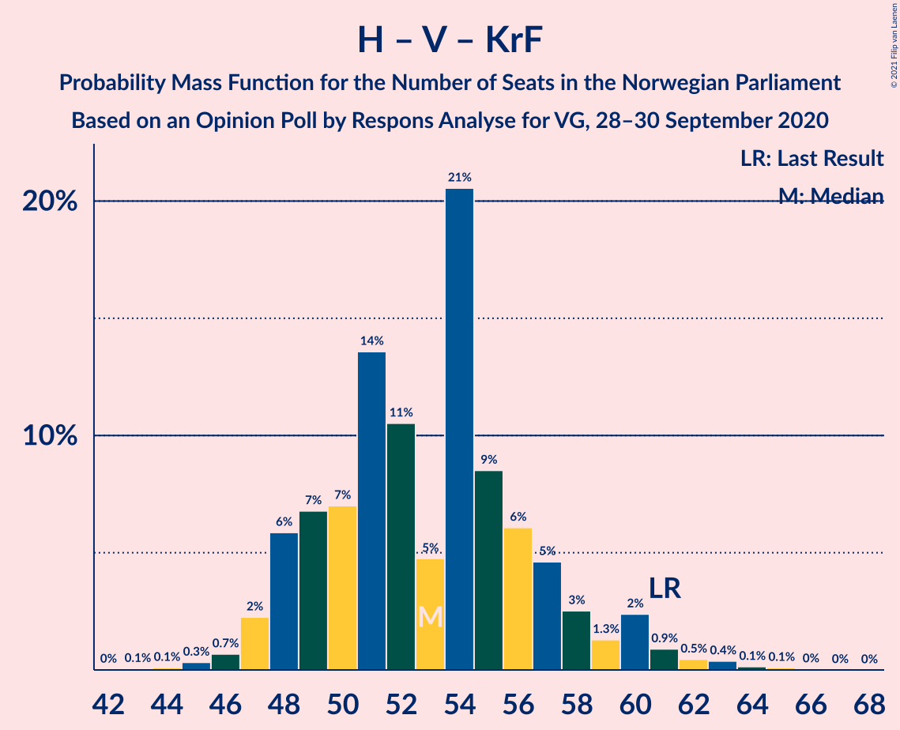

| Number of Seats | Probability | Accumulated | Special Marks |
|:---------------:|:-----------:|:-----------:|:-------------:|
| 43 | 0.1% | 100% |  |
| 44 | 0.1% | 99.9% |  |
| 45 | 0.3% | 99.8% |  |
| 46 | 0.7% | 99.5% |  |
| 47 | 2% | 98.8% |  |
| 48 | 6% | 97% |  |
| 49 | 7% | 91% |  |
| 50 | 7% | 84% |  |
| 51 | 14% | 77% | Median |
| 52 | 11% | 63% |  |
| 53 | 5% | 53% |  |
| 54 | 21% | 48% |  |
| 55 | 9% | 27% |  |
| 56 | 6% | 19% |  |
| 57 | 5% | 13% |  |
| 58 | 3% | 8% |  |
| 59 | 1.3% | 6% |  |
| 60 | 2% | 4% |  |
| 61 | 0.9% | 2% | Last Result |
| 62 | 0.5% | 1.1% |  |
| 63 | 0.4% | 0.7% |  |
| 64 | 0.1% | 0.3% |  |
| 65 | 0.1% | 0.2% |  |
| 66 | 0% | 0.1% |  |
| 67 | 0% | 0% |  |

### Senterpartiet – Venstre – Kristelig Folkeparti

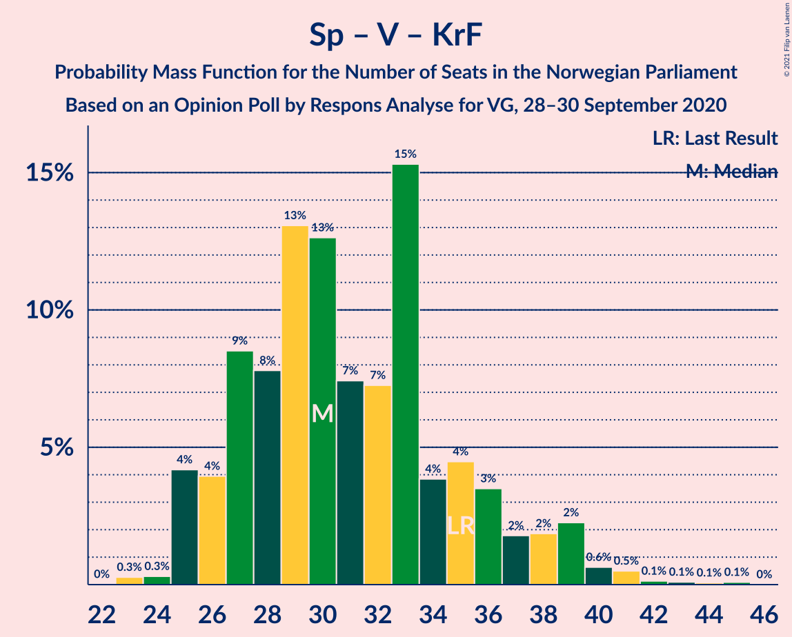

| Number of Seats | Probability | Accumulated | Special Marks |
|:---------------:|:-----------:|:-----------:|:-------------:|
| 23 | 0.3% | 100% |  |
| 24 | 0.3% | 99.7% |  |
| 25 | 4% | 99.4% |  |
| 26 | 4% | 95% |  |
| 27 | 9% | 91% |  |
| 28 | 8% | 83% |  |
| 29 | 13% | 75% | Median |
| 30 | 13% | 62% |  |
| 31 | 7% | 49% |  |
| 32 | 7% | 42% |  |
| 33 | 15% | 35% |  |
| 34 | 4% | 19% |  |
| 35 | 4% | 15% | Last Result |
| 36 | 3% | 11% |  |
| 37 | 2% | 7% |  |
| 38 | 2% | 6% |  |
| 39 | 2% | 4% |  |
| 40 | 0.6% | 2% |  |
| 41 | 0.5% | 0.9% |  |
| 42 | 0.1% | 0.4% |  |
| 43 | 0.1% | 0.3% |  |
| 44 | 0.1% | 0.2% |  |
| 45 | 0.1% | 0.1% |  |
| 46 | 0% | 0% |  |

## Technical Information

### Opinion Poll

+ **Polling firm:** Respons Analyse
+ **Commissioner(s):** VG
+ **Fieldwork period:** 28–30 September 2020

### Calculations

+ **Sample size:** 1001
+ **Simulations done:** 1,048,576
+ **Error estimate:** 1.97%

