# Opinion Poll by Opinion Perduco for Avisenes Nyhetsbyrå, Dagsavisen and FriFagbevegelse, 29 September–4 October 2020

<a href="#voting-intentions">Voting Intentions</a> | <a href="#seats">Seats</a> | <a href="#coalitions">Coalitions</a> | <a href="#technical-information">Technical Information</a>

## Voting Intentions

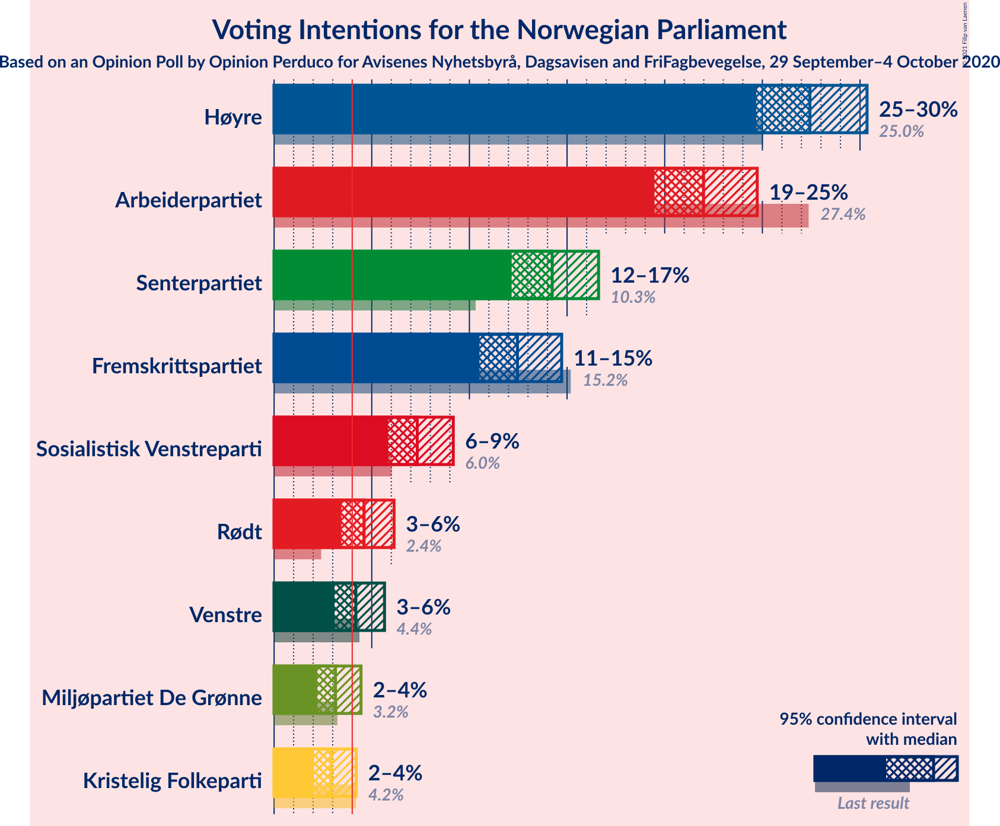

### Confidence Intervals

| Party | Last Result | Poll Result | 80% Confidence Interval | 90% Confidence Interval | 95% Confidence Interval | 99% Confidence Interval |
|:-----:|:-----------:|:-----------:|:-----------------------:|:-----------------------:|:-----------------------:|:-----------------------:|
| Høyre | 25.0% | 27.4% | 25.6–29.4% |25.1–29.9% |24.7–30.4% |23.9–31.3% |
| Arbeiderpartiet | 27.4% | 22.0% | 20.3–23.8% |19.9–24.3% |19.5–24.7% |18.7–25.6% |
| Senterpartiet | 10.3% | 14.2% | 12.9–15.8% |12.5–16.2% |12.2–16.6% |11.5–17.4% |
| Fremskrittspartiet | 15.2% | 12.5% | 11.2–13.9% |10.8–14.3% |10.5–14.7% |9.9–15.4% |
| Sosialistisk Venstreparti | 6.0% | 7.3% | 6.3–8.5% |6.1–8.9% |5.8–9.2% |5.4–9.8% |
| Rødt | 2.4% | 4.6% | 3.8–5.6% |3.6–5.9% |3.4–6.1% |3.1–6.6% |
| Venstre | 4.4% | 4.2% | 3.5–5.2% |3.3–5.4% |3.1–5.7% |2.8–6.2% |
| Miljøpartiet De Grønne | 3.2% | 3.1% | 2.5–4.0% |2.3–4.2% |2.2–4.5% |1.9–4.9% |
| Kristelig Folkeparti | 4.2% | 2.9% | 2.3–3.8% |2.2–4.0% |2.0–4.2% |1.8–4.6% |

*Note:* The poll result column reflects the actual value used in the calculations. Published results may vary slightly, and in addition be rounded to fewer digits.

## Seats

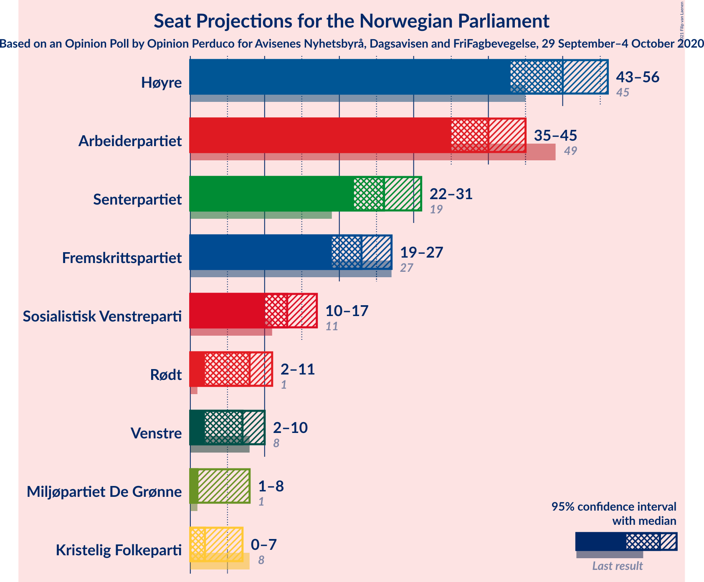

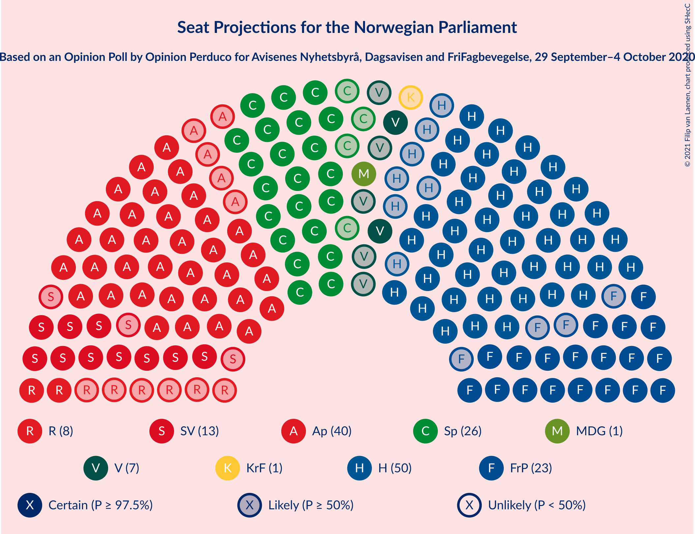

### Confidence Intervals

| Party | Last Result | Median | 80% Confidence Interval | 90% Confidence Interval | 95% Confidence Interval | 99% Confidence Interval |
|:-----:|:-----------:|:------:|:-----------------------:|:-----------------------:|:-----------------------:|:-----------------------:|
| <a href="#høyre">Høyre</a> | 45 | 50 | 46–54 |45–55 |43–56 |42–57 |
| <a href="#arbeiderpartiet">Arbeiderpartiet</a> | 49 | 40 | 37–43 |36–44 |35–45 |33–47 |
| <a href="#senterpartiet">Senterpartiet</a> | 19 | 26 | 23–30 |22–30 |22–31 |20–33 |
| <a href="#fremskrittspartiet">Fremskrittspartiet</a> | 27 | 23 | 20–25 |19–26 |19–27 |17–28 |
| <a href="#sosialistisk-venstreparti">Sosialistisk Venstreparti</a> | 11 | 13 | 11–15 |11–16 |10–17 |10–18 |
| <a href="#rødt">Rødt</a> | 1 | 8 | 2–10 |2–11 |2–11 |2–12 |
| <a href="#venstre">Venstre</a> | 8 | 7 | 2–9 |2–9 |2–10 |2–11 |
| <a href="#miljøpartiet-de-grønne">Miljøpartiet De Grønne</a> | 1 | 1 | 1–3 |1–7 |1–8 |1–9 |
| <a href="#kristelig-folkeparti">Kristelig Folkeparti</a> | 8 | 2 | 1–3 |0–3 |0–7 |0–8 |

### Høyre

*For a full overview of the results for this party, see the [Høyre](party-høyre.html) page.*

| Number of Seats | Probability | Accumulated | Special Marks |
|:---------------:|:-----------:|:-----------:|:-------------:|
| 40 | 0.1% | 100% |  |
| 41 | 0.1% | 99.9% |  |
| 42 | 0.8% | 99.8% |  |
| 43 | 2% | 99.0% |  |
| 44 | 2% | 97% |  |
| 45 | 4% | 95% | Last Result |
| 46 | 8% | 91% |  |
| 47 | 11% | 83% |  |
| 48 | 6% | 72% |  |
| 49 | 10% | 66% |  |
| 50 | 13% | 56% | Median |
| 51 | 8% | 43% |  |
| 52 | 18% | 35% |  |
| 53 | 4% | 17% |  |
| 54 | 4% | 13% |  |
| 55 | 6% | 9% |  |
| 56 | 2% | 3% |  |
| 57 | 0.7% | 1.2% |  |
| 58 | 0.3% | 0.4% |  |
| 59 | 0.1% | 0.1% |  |
| 60 | 0.1% | 0.1% |  |
| 61 | 0% | 0% |  |

### Arbeiderpartiet

*For a full overview of the results for this party, see the [Arbeiderpartiet](party-arbeiderpartiet.html) page.*

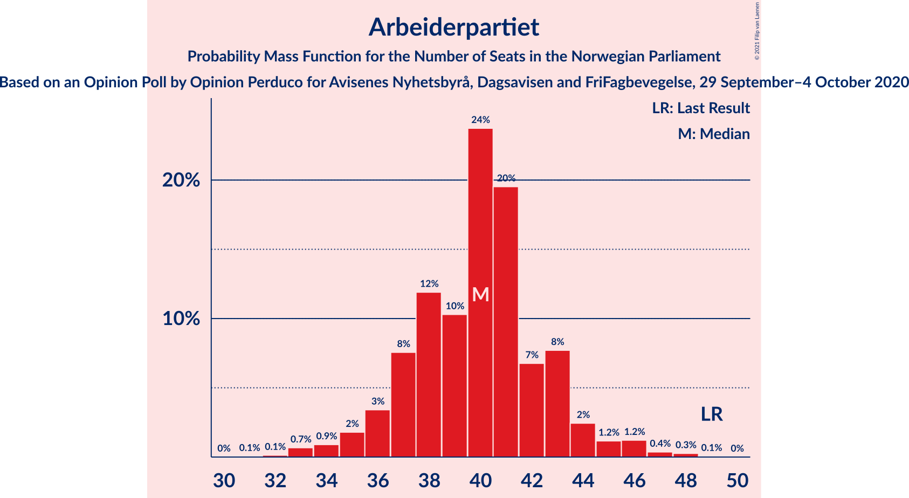

| Number of Seats | Probability | Accumulated | Special Marks |
|:---------------:|:-----------:|:-----------:|:-------------:|
| 31 | 0.1% | 100% |  |
| 32 | 0.1% | 99.9% |  |
| 33 | 0.7% | 99.8% |  |
| 34 | 0.9% | 99.1% |  |
| 35 | 2% | 98% |  |
| 36 | 3% | 96% |  |
| 37 | 8% | 93% |  |
| 38 | 12% | 85% |  |
| 39 | 10% | 74% |  |
| 40 | 24% | 63% | Median |
| 41 | 20% | 40% |  |
| 42 | 7% | 20% |  |
| 43 | 8% | 13% |  |
| 44 | 2% | 6% |  |
| 45 | 1.2% | 3% |  |
| 46 | 1.2% | 2% |  |
| 47 | 0.4% | 0.7% |  |
| 48 | 0.3% | 0.3% |  |
| 49 | 0.1% | 0.1% | Last Result |
| 50 | 0% | 0% |  |

### Senterpartiet

*For a full overview of the results for this party, see the [Senterpartiet](party-senterpartiet.html) page.*

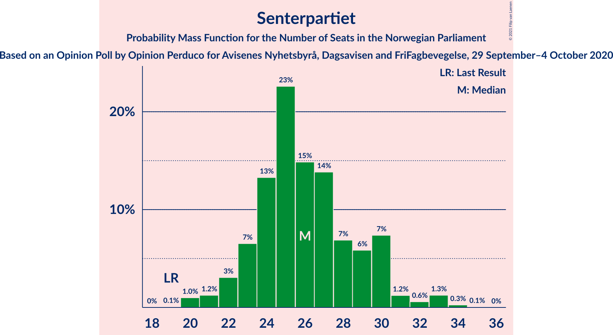

| Number of Seats | Probability | Accumulated | Special Marks |
|:---------------:|:-----------:|:-----------:|:-------------:|
| 19 | 0.1% | 100% | Last Result |
| 20 | 1.0% | 99.9% |  |
| 21 | 1.2% | 98.9% |  |
| 22 | 3% | 98% |  |
| 23 | 7% | 95% |  |
| 24 | 13% | 88% |  |
| 25 | 23% | 75% |  |
| 26 | 15% | 52% | Median |
| 27 | 14% | 37% |  |
| 28 | 7% | 24% |  |
| 29 | 6% | 17% |  |
| 30 | 7% | 11% |  |
| 31 | 1.2% | 3% |  |
| 32 | 0.6% | 2% |  |
| 33 | 1.3% | 2% |  |
| 34 | 0.3% | 0.3% |  |
| 35 | 0.1% | 0.1% |  |
| 36 | 0% | 0% |  |

### Fremskrittspartiet

*For a full overview of the results for this party, see the [Fremskrittspartiet](party-fremskrittspartiet.html) page.*

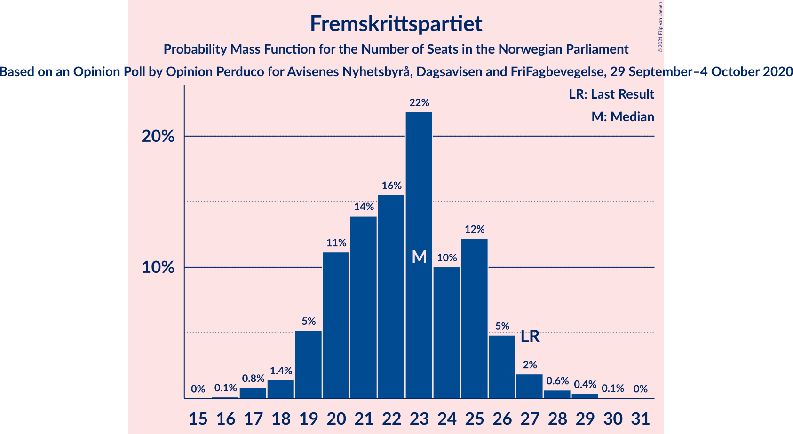

| Number of Seats | Probability | Accumulated | Special Marks |
|:---------------:|:-----------:|:-----------:|:-------------:|
| 16 | 0.1% | 100% |  |
| 17 | 0.8% | 99.9% |  |
| 18 | 1.4% | 99.1% |  |
| 19 | 5% | 98% |  |
| 20 | 11% | 92% |  |
| 21 | 14% | 81% |  |
| 22 | 16% | 67% |  |
| 23 | 22% | 52% | Median |
| 24 | 10% | 30% |  |
| 25 | 12% | 20% |  |
| 26 | 5% | 8% |  |
| 27 | 2% | 3% | Last Result |
| 28 | 0.6% | 1.1% |  |
| 29 | 0.4% | 0.5% |  |
| 30 | 0.1% | 0.1% |  |
| 31 | 0% | 0% |  |

### Sosialistisk Venstreparti

*For a full overview of the results for this party, see the [Sosialistisk Venstreparti](party-sosialistiskvenstreparti.html) page.*

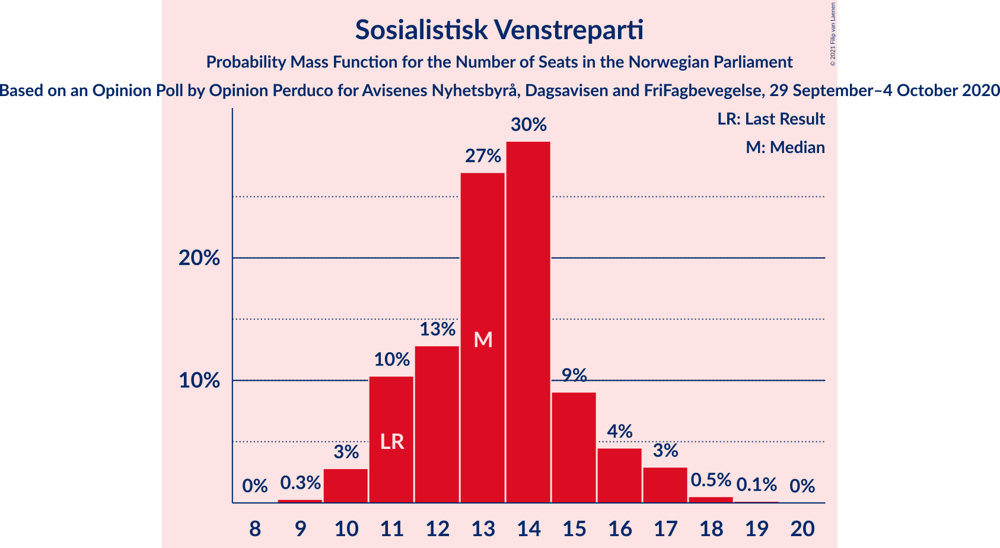

| Number of Seats | Probability | Accumulated | Special Marks |
|:---------------:|:-----------:|:-----------:|:-------------:|
| 9 | 0.3% | 100% |  |
| 10 | 3% | 99.7% |  |
| 11 | 10% | 97% | Last Result |
| 12 | 13% | 87% |  |
| 13 | 27% | 74% | Median |
| 14 | 30% | 47% |  |
| 15 | 9% | 17% |  |
| 16 | 4% | 8% |  |
| 17 | 3% | 4% |  |
| 18 | 0.5% | 0.7% |  |
| 19 | 0.1% | 0.2% |  |
| 20 | 0% | 0% |  |

### Rødt

*For a full overview of the results for this party, see the [Rødt](party-rødt.html) page.*

| Number of Seats | Probability | Accumulated | Special Marks |
|:---------------:|:-----------:|:-----------:|:-------------:|
| 1 | 0.3% | 100% | Last Result |
| 2 | 12% | 99.7% |  |
| 3 | 0% | 88% |  |
| 4 | 0% | 88% |  |
| 5 | 0% | 88% |  |
| 6 | 0% | 88% |  |
| 7 | 7% | 88% |  |
| 8 | 33% | 81% | Median |
| 9 | 23% | 47% |  |
| 10 | 17% | 24% |  |
| 11 | 5% | 6% |  |
| 12 | 2% | 2% |  |
| 13 | 0.1% | 0.1% |  |
| 14 | 0% | 0% |  |

### Venstre

*For a full overview of the results for this party, see the [Venstre](party-venstre.html) page.*

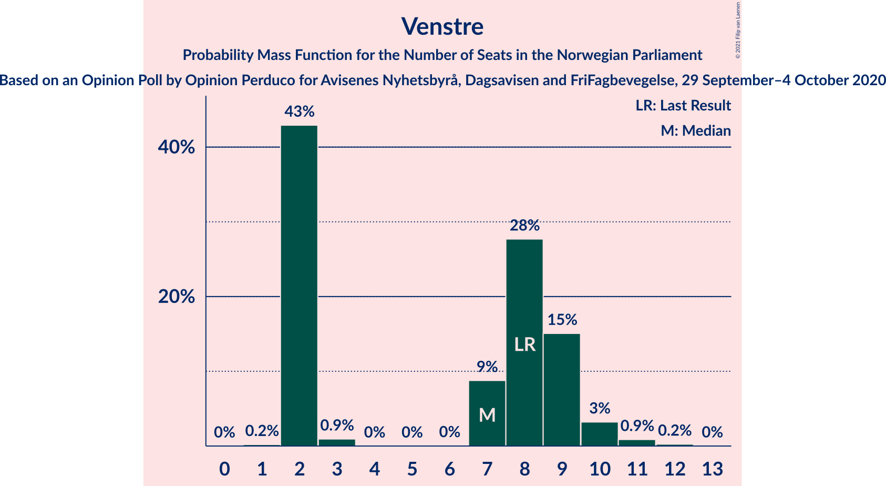

| Number of Seats | Probability | Accumulated | Special Marks |
|:---------------:|:-----------:|:-----------:|:-------------:|
| 1 | 0.2% | 100% |  |
| 2 | 43% | 99.8% |  |
| 3 | 0.9% | 57% |  |
| 4 | 0% | 56% |  |
| 5 | 0% | 56% |  |
| 6 | 0% | 56% |  |
| 7 | 9% | 56% | Median |
| 8 | 28% | 47% | Last Result |
| 9 | 15% | 19% |  |
| 10 | 3% | 4% |  |
| 11 | 0.9% | 1.1% |  |
| 12 | 0.2% | 0.3% |  |
| 13 | 0% | 0% |  |

### Miljøpartiet De Grønne

*For a full overview of the results for this party, see the [Miljøpartiet De Grønne](party-miljøpartietdegrønne.html) page.*

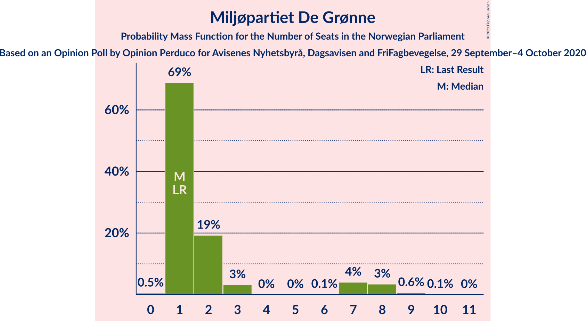

| Number of Seats | Probability | Accumulated | Special Marks |
|:---------------:|:-----------:|:-----------:|:-------------:|
| 0 | 0.5% | 100% |  |
| 1 | 69% | 99.5% | Last Result, Median |
| 2 | 19% | 31% |  |
| 3 | 3% | 11% |  |
| 4 | 0% | 8% |  |
| 5 | 0% | 8% |  |
| 6 | 0.1% | 8% |  |
| 7 | 4% | 8% |  |
| 8 | 3% | 4% |  |
| 9 | 0.6% | 0.7% |  |
| 10 | 0.1% | 0.1% |  |
| 11 | 0% | 0% |  |

### Kristelig Folkeparti

*For a full overview of the results for this party, see the [Kristelig Folkeparti](party-kristeligfolkeparti.html) page.*

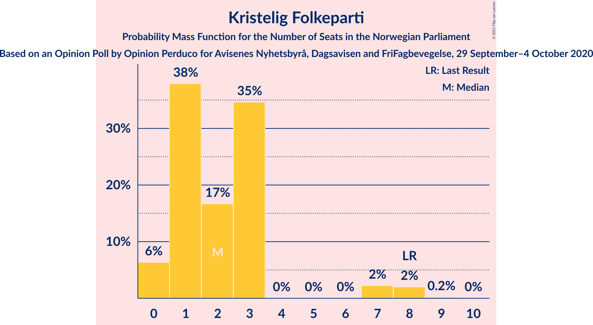

| Number of Seats | Probability | Accumulated | Special Marks |
|:---------------:|:-----------:|:-----------:|:-------------:|
| 0 | 6% | 100% |  |
| 1 | 38% | 94% |  |
| 2 | 17% | 56% | Median |
| 3 | 35% | 39% |  |
| 4 | 0% | 4% |  |
| 5 | 0% | 4% |  |
| 6 | 0% | 4% |  |
| 7 | 2% | 4% |  |
| 8 | 2% | 2% | Last Result |
| 9 | 0.2% | 0.2% |  |
| 10 | 0% | 0% |  |

## Coalitions

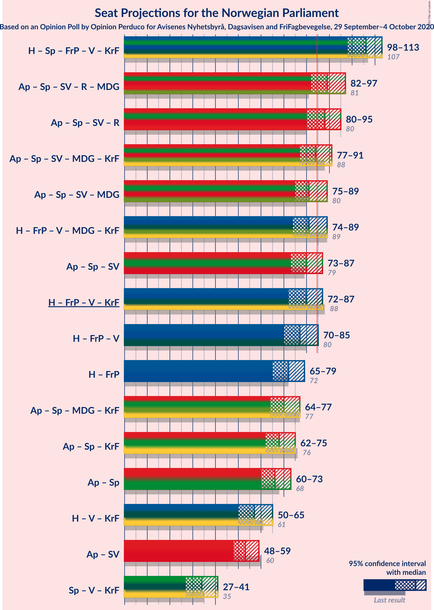

### Confidence Intervals

| Coalition | Last Result | Median | Majority? | 80% Confidence Interval | 90% Confidence Interval | 95% Confidence Interval | 99% Confidence Interval |
|:---------:|:-----------:|:------:|:---------:|:-----------------------:|:-----------------------:|:-----------------------:|:-----------------------:|
| Høyre – Senterpartiet – Fremskrittspartiet – Venstre – Kristelig Folkeparti | 107 | 106 | 100% | 102–110 | 100–112 | 98–113 | 96–115 |
| Arbeiderpartiet – Senterpartiet – Sosialistisk Venstreparti – Rødt – Miljøpartiet De Grønne | 81 | 89 | 90% | 85–94 | 83–96 | 82–97 | 79–98 |
| Arbeiderpartiet – Senterpartiet – Sosialistisk Venstreparti – Rødt | 80 | 88 | 79% | 82–92 | 81–93 | 80–95 | 77–96 |
| Arbeiderpartiet – Senterpartiet – Sosialistisk Venstreparti – Miljøpartiet De Grønne – Kristelig Folkeparti | 88 | 84 | 29% | 79–88 | 78–90 | 77–91 | 75–93 |
| Arbeiderpartiet – Senterpartiet – Sosialistisk Venstreparti – Miljøpartiet De Grønne | 80 | 81 | 16% | 77–86 | 76–88 | 75–89 | 73–91 |
| Høyre – Fremskrittspartiet – Venstre – Miljøpartiet De Grønne – Kristelig Folkeparti | 89 | 81 | 21% | 77–87 | 76–88 | 74–89 | 73–92 |
| Arbeiderpartiet – Senterpartiet – Sosialistisk Venstreparti | 79 | 80 | 7% | 75–84 | 74–85 | 73–87 | 69–88 |
| Høyre – Fremskrittspartiet – Venstre – Kristelig Folkeparti | 88 | 80 | 10% | 75–84 | 73–86 | 72–87 | 71–90 |
| Høyre – Fremskrittspartiet – Venstre | 80 | 77 | 3% | 73–83 | 71–84 | 70–85 | 69–88 |
| Høyre – Fremskrittspartiet | 72 | 72 | 0% | 67–76 | 66–77 | 65–79 | 63–82 |
| Arbeiderpartiet – Senterpartiet – Miljøpartiet De Grønne – Kristelig Folkeparti | 77 | 70 | 0% | 66–74 | 65–76 | 64–77 | 62–80 |
| Arbeiderpartiet – Senterpartiet – Kristelig Folkeparti | 76 | 68 | 0% | 64–72 | 63–73 | 62–75 | 60–78 |
| Arbeiderpartiet – Senterpartiet | 68 | 66 | 0% | 62–70 | 61–71 | 60–73 | 57–75 |
| Høyre – Venstre – Kristelig Folkeparti | 61 | 57 | 0% | 53–62 | 51–64 | 50–65 | 49–67 |
| Arbeiderpartiet – Sosialistisk Venstreparti | 60 | 53 | 0% | 50–57 | 49–58 | 48–59 | 46–61 |
| Senterpartiet – Venstre – Kristelig Folkeparti | 35 | 34 | 0% | 29–39 | 28–39 | 27–41 | 26–44 |

### Høyre – Senterpartiet – Fremskrittspartiet – Venstre – Kristelig Folkeparti

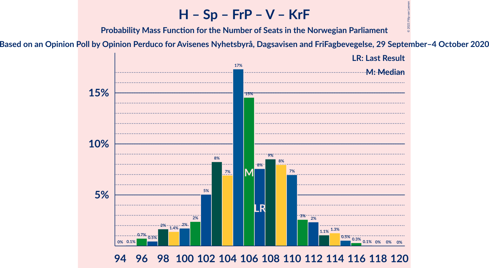

| Number of Seats | Probability | Accumulated | Special Marks |
|:---------------:|:-----------:|:-----------:|:-------------:|
| 94 | 0% | 100% |  |
| 95 | 0.1% | 99.9% |  |
| 96 | 0.7% | 99.9% |  |
| 97 | 0.5% | 99.1% |  |
| 98 | 2% | 98.7% |  |
| 99 | 1.4% | 97% |  |
| 100 | 2% | 96% |  |
| 101 | 2% | 94% |  |
| 102 | 5% | 91% |  |
| 103 | 8% | 86% |  |
| 104 | 7% | 78% |  |
| 105 | 17% | 71% |  |
| 106 | 15% | 54% |  |
| 107 | 8% | 39% | Last Result |
| 108 | 9% | 32% | Median |
| 109 | 8% | 23% |  |
| 110 | 7% | 15% |  |
| 111 | 3% | 8% |  |
| 112 | 2% | 6% |  |
| 113 | 1.1% | 3% |  |
| 114 | 1.3% | 2% |  |
| 115 | 0.5% | 1.0% |  |
| 116 | 0.3% | 0.4% |  |
| 117 | 0.1% | 0.1% |  |
| 118 | 0% | 0.1% |  |
| 119 | 0% | 0% |  |

### Arbeiderpartiet – Senterpartiet – Sosialistisk Venstreparti – Rødt – Miljøpartiet De Grønne

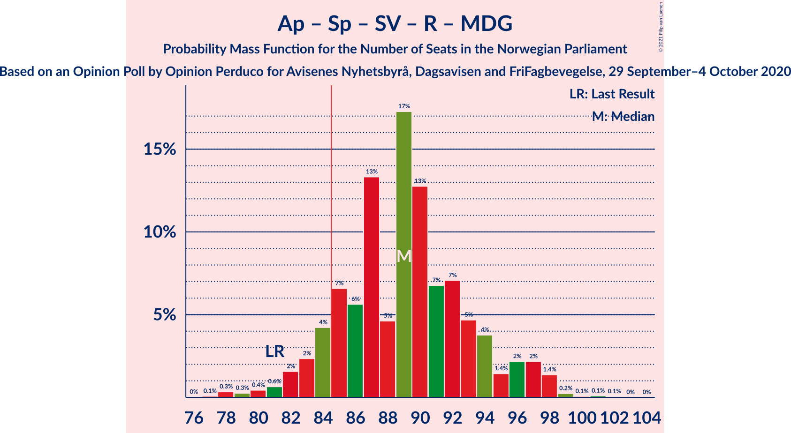

| Number of Seats | Probability | Accumulated | Special Marks |
|:---------------:|:-----------:|:-----------:|:-------------:|
| 77 | 0.1% | 100% |  |
| 78 | 0.3% | 99.9% |  |
| 79 | 0.3% | 99.6% |  |
| 80 | 0.4% | 99.3% |  |
| 81 | 0.6% | 98.9% | Last Result |
| 82 | 2% | 98% |  |
| 83 | 2% | 97% |  |
| 84 | 4% | 94% |  |
| 85 | 7% | 90% | Majority |
| 86 | 6% | 83% |  |
| 87 | 13% | 78% |  |
| 88 | 5% | 65% | Median |
| 89 | 17% | 60% |  |
| 90 | 13% | 43% |  |
| 91 | 7% | 30% |  |
| 92 | 7% | 23% |  |
| 93 | 5% | 16% |  |
| 94 | 4% | 11% |  |
| 95 | 1.4% | 8% |  |
| 96 | 2% | 6% |  |
| 97 | 2% | 4% |  |
| 98 | 1.4% | 2% |  |
| 99 | 0.2% | 0.4% |  |
| 100 | 0.1% | 0.2% |  |
| 101 | 0.1% | 0.1% |  |
| 102 | 0.1% | 0.1% |  |
| 103 | 0% | 0% |  |

### Arbeiderpartiet – Senterpartiet – Sosialistisk Venstreparti – Rødt

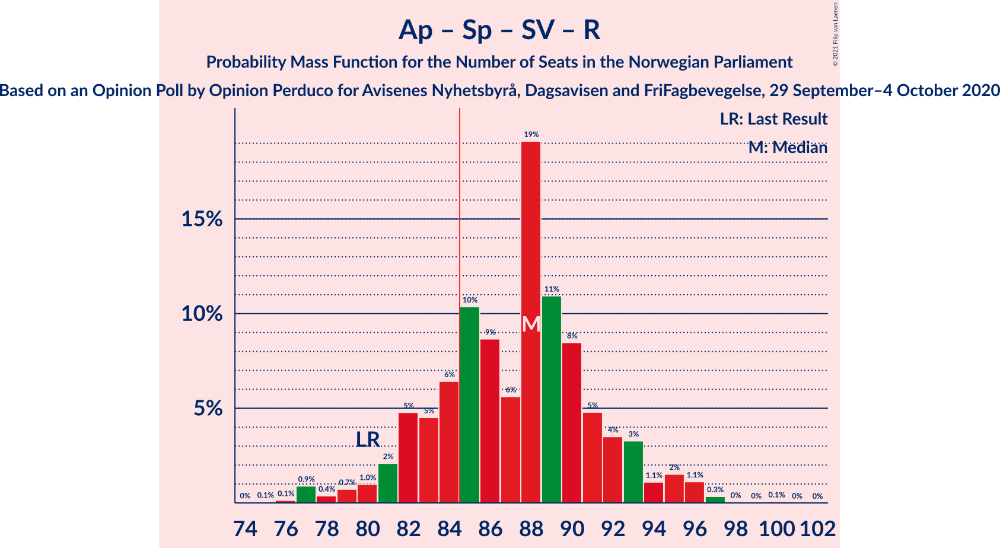

| Number of Seats | Probability | Accumulated | Special Marks |
|:---------------:|:-----------:|:-----------:|:-------------:|
| 75 | 0.1% | 100% |  |
| 76 | 0.1% | 99.9% |  |
| 77 | 0.9% | 99.8% |  |
| 78 | 0.4% | 98.9% |  |
| 79 | 0.7% | 98% |  |
| 80 | 1.0% | 98% | Last Result |
| 81 | 2% | 97% |  |
| 82 | 5% | 95% |  |
| 83 | 5% | 90% |  |
| 84 | 6% | 85% |  |
| 85 | 10% | 79% | Majority |
| 86 | 9% | 69% |  |
| 87 | 6% | 60% | Median |
| 88 | 19% | 54% |  |
| 89 | 11% | 35% |  |
| 90 | 8% | 24% |  |
| 91 | 5% | 16% |  |
| 92 | 4% | 11% |  |
| 93 | 3% | 8% |  |
| 94 | 1.1% | 4% |  |
| 95 | 2% | 3% |  |
| 96 | 1.1% | 2% |  |
| 97 | 0.3% | 0.5% |  |
| 98 | 0% | 0.1% |  |
| 99 | 0% | 0.1% |  |
| 100 | 0.1% | 0.1% |  |
| 101 | 0% | 0% |  |

### Arbeiderpartiet – Senterpartiet – Sosialistisk Venstreparti – Miljøpartiet De Grønne – Kristelig Folkeparti

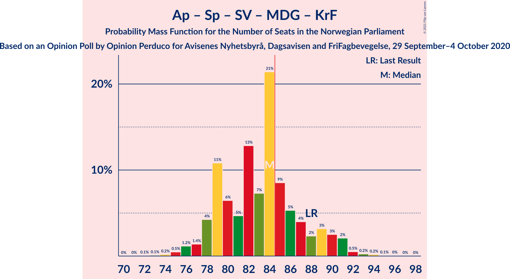

| Number of Seats | Probability | Accumulated | Special Marks |
|:---------------:|:-----------:|:-----------:|:-------------:|
| 72 | 0.1% | 100% |  |
| 73 | 0.1% | 99.9% |  |
| 74 | 0.2% | 99.8% |  |
| 75 | 0.5% | 99.7% |  |
| 76 | 1.2% | 99.2% |  |
| 77 | 1.4% | 98% |  |
| 78 | 4% | 97% |  |
| 79 | 11% | 92% |  |
| 80 | 6% | 82% |  |
| 81 | 5% | 75% |  |
| 82 | 13% | 70% | Median |
| 83 | 7% | 58% |  |
| 84 | 21% | 50% |  |
| 85 | 9% | 29% | Majority |
| 86 | 5% | 20% |  |
| 87 | 4% | 15% |  |
| 88 | 2% | 11% | Last Result |
| 89 | 3% | 9% |  |
| 90 | 3% | 6% |  |
| 91 | 2% | 3% |  |
| 92 | 0.5% | 1.0% |  |
| 93 | 0.2% | 0.5% |  |
| 94 | 0.2% | 0.3% |  |
| 95 | 0.1% | 0.1% |  |
| 96 | 0% | 0.1% |  |
| 97 | 0% | 0% |  |

### Arbeiderpartiet – Senterpartiet – Sosialistisk Venstreparti – Miljøpartiet De Grønne

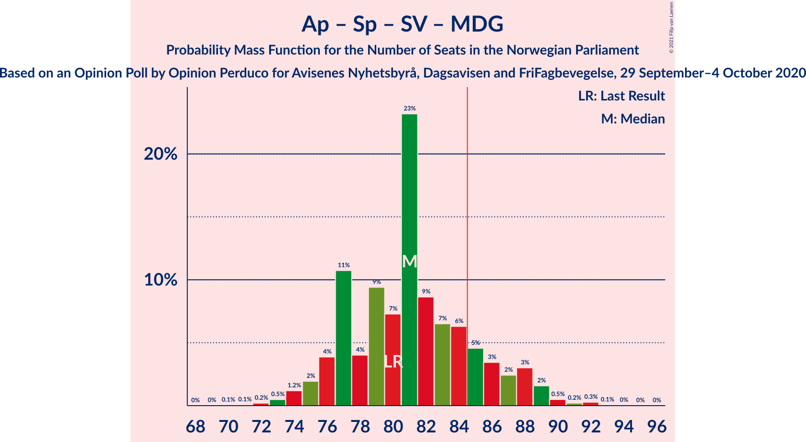

| Number of Seats | Probability | Accumulated | Special Marks |
|:---------------:|:-----------:|:-----------:|:-------------:|
| 70 | 0.1% | 100% |  |
| 71 | 0.1% | 99.9% |  |
| 72 | 0.2% | 99.9% |  |
| 73 | 0.5% | 99.7% |  |
| 74 | 1.2% | 99.2% |  |
| 75 | 2% | 98% |  |
| 76 | 4% | 96% |  |
| 77 | 11% | 92% |  |
| 78 | 4% | 81% |  |
| 79 | 9% | 77% |  |
| 80 | 7% | 68% | Last Result, Median |
| 81 | 23% | 61% |  |
| 82 | 9% | 38% |  |
| 83 | 7% | 29% |  |
| 84 | 6% | 22% |  |
| 85 | 5% | 16% | Majority |
| 86 | 3% | 12% |  |
| 87 | 2% | 8% |  |
| 88 | 3% | 6% |  |
| 89 | 2% | 3% |  |
| 90 | 0.5% | 1.1% |  |
| 91 | 0.2% | 0.6% |  |
| 92 | 0.3% | 0.4% |  |
| 93 | 0.1% | 0.1% |  |
| 94 | 0% | 0.1% |  |
| 95 | 0% | 0% |  |

### Høyre – Fremskrittspartiet – Venstre – Miljøpartiet De Grønne – Kristelig Folkeparti

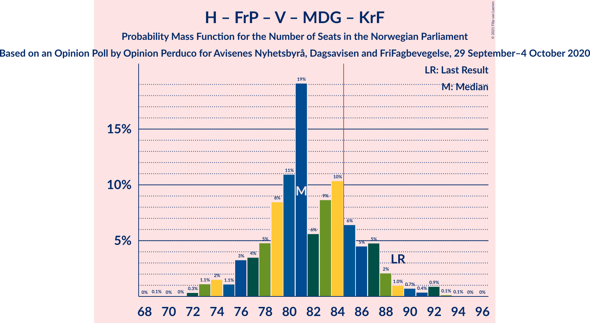

| Number of Seats | Probability | Accumulated | Special Marks |
|:---------------:|:-----------:|:-----------:|:-------------:|
| 69 | 0.1% | 100% |  |
| 70 | 0% | 99.9% |  |
| 71 | 0% | 99.9% |  |
| 72 | 0.3% | 99.9% |  |
| 73 | 1.1% | 99.5% |  |
| 74 | 2% | 98% |  |
| 75 | 1.1% | 97% |  |
| 76 | 3% | 96% |  |
| 77 | 4% | 92% |  |
| 78 | 5% | 89% |  |
| 79 | 8% | 84% |  |
| 80 | 11% | 76% |  |
| 81 | 19% | 65% |  |
| 82 | 6% | 46% |  |
| 83 | 9% | 40% | Median |
| 84 | 10% | 31% |  |
| 85 | 6% | 21% | Majority |
| 86 | 5% | 15% |  |
| 87 | 5% | 10% |  |
| 88 | 2% | 5% |  |
| 89 | 1.0% | 3% | Last Result |
| 90 | 0.7% | 2% |  |
| 91 | 0.4% | 2% |  |
| 92 | 0.9% | 1.1% |  |
| 93 | 0.1% | 0.2% |  |
| 94 | 0.1% | 0.1% |  |
| 95 | 0% | 0% |  |

### Arbeiderpartiet – Senterpartiet – Sosialistisk Venstreparti

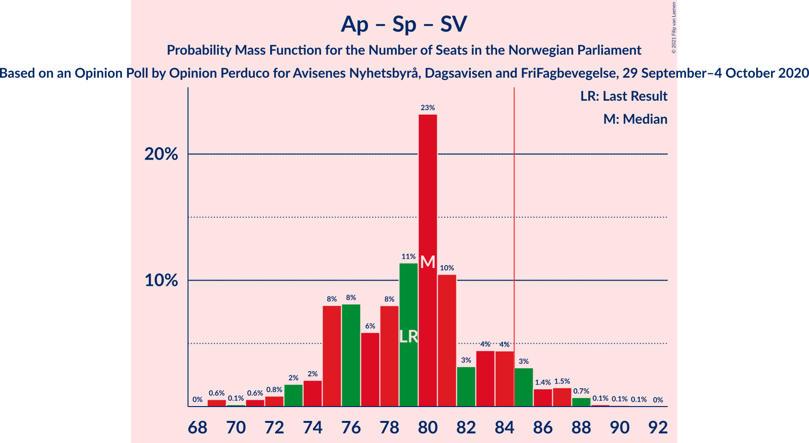

| Number of Seats | Probability | Accumulated | Special Marks |
|:---------------:|:-----------:|:-----------:|:-------------:|
| 68 | 0% | 100% |  |
| 69 | 0.6% | 99.9% |  |
| 70 | 0.1% | 99.4% |  |
| 71 | 0.6% | 99.2% |  |
| 72 | 0.8% | 98.7% |  |
| 73 | 2% | 98% |  |
| 74 | 2% | 96% |  |
| 75 | 8% | 94% |  |
| 76 | 8% | 86% |  |
| 77 | 6% | 78% |  |
| 78 | 8% | 72% |  |
| 79 | 11% | 64% | Last Result, Median |
| 80 | 23% | 53% |  |
| 81 | 10% | 29% |  |
| 82 | 3% | 19% |  |
| 83 | 4% | 16% |  |
| 84 | 4% | 11% |  |
| 85 | 3% | 7% | Majority |
| 86 | 1.4% | 4% |  |
| 87 | 1.5% | 3% |  |
| 88 | 0.7% | 1.0% |  |
| 89 | 0.1% | 0.3% |  |
| 90 | 0.1% | 0.2% |  |
| 91 | 0.1% | 0.1% |  |
| 92 | 0% | 0% |  |

### Høyre – Fremskrittspartiet – Venstre – Kristelig Folkeparti

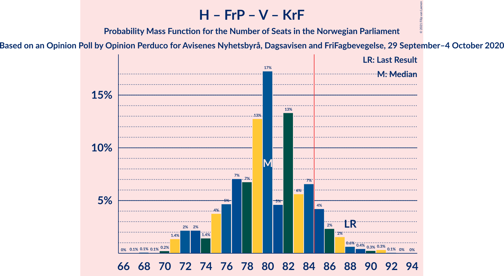

| Number of Seats | Probability | Accumulated | Special Marks |
|:---------------:|:-----------:|:-----------:|:-------------:|
| 67 | 0.1% | 100% |  |
| 68 | 0.1% | 99.9% |  |
| 69 | 0.1% | 99.9% |  |
| 70 | 0.2% | 99.8% |  |
| 71 | 1.4% | 99.6% |  |
| 72 | 2% | 98% |  |
| 73 | 2% | 96% |  |
| 74 | 1.4% | 94% |  |
| 75 | 4% | 92% |  |
| 76 | 5% | 89% |  |
| 77 | 7% | 84% |  |
| 78 | 7% | 77% |  |
| 79 | 13% | 70% |  |
| 80 | 17% | 57% |  |
| 81 | 5% | 40% |  |
| 82 | 13% | 35% | Median |
| 83 | 6% | 22% |  |
| 84 | 7% | 17% |  |
| 85 | 4% | 10% | Majority |
| 86 | 2% | 6% |  |
| 87 | 2% | 3% |  |
| 88 | 0.6% | 2% | Last Result |
| 89 | 0.4% | 1.1% |  |
| 90 | 0.3% | 0.7% |  |
| 91 | 0.3% | 0.4% |  |
| 92 | 0.1% | 0.1% |  |
| 93 | 0% | 0% |  |

### Høyre – Fremskrittspartiet – Venstre

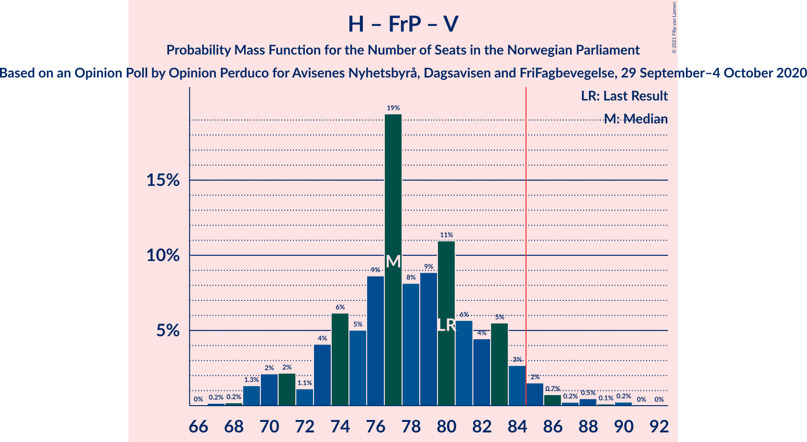

| Number of Seats | Probability | Accumulated | Special Marks |
|:---------------:|:-----------:|:-----------:|:-------------:|
| 67 | 0.2% | 100% |  |
| 68 | 0.2% | 99.8% |  |
| 69 | 1.3% | 99.6% |  |
| 70 | 2% | 98% |  |
| 71 | 2% | 96% |  |
| 72 | 1.1% | 94% |  |
| 73 | 4% | 93% |  |
| 74 | 6% | 89% |  |
| 75 | 5% | 83% |  |
| 76 | 9% | 78% |  |
| 77 | 19% | 69% |  |
| 78 | 8% | 50% |  |
| 79 | 9% | 41% |  |
| 80 | 11% | 33% | Last Result, Median |
| 81 | 6% | 22% |  |
| 82 | 4% | 16% |  |
| 83 | 5% | 11% |  |
| 84 | 3% | 6% |  |
| 85 | 2% | 3% | Majority |
| 86 | 0.7% | 2% |  |
| 87 | 0.2% | 1.1% |  |
| 88 | 0.5% | 0.8% |  |
| 89 | 0.1% | 0.4% |  |
| 90 | 0.2% | 0.3% |  |
| 91 | 0% | 0% |  |

### Høyre – Fremskrittspartiet

| Number of Seats | Probability | Accumulated | Special Marks |
|:---------------:|:-----------:|:-----------:|:-------------:|
| 60 | 0.1% | 100% |  |
| 61 | 0% | 99.9% |  |
| 62 | 0.2% | 99.9% |  |
| 63 | 0.5% | 99.7% |  |
| 64 | 1.2% | 99.2% |  |
| 65 | 2% | 98% |  |
| 66 | 2% | 97% |  |
| 67 | 6% | 95% |  |
| 68 | 4% | 89% |  |
| 69 | 7% | 85% |  |
| 70 | 6% | 77% |  |
| 71 | 8% | 71% |  |
| 72 | 14% | 63% | Last Result |
| 73 | 6% | 49% | Median |
| 74 | 9% | 43% |  |
| 75 | 22% | 35% |  |
| 76 | 4% | 13% |  |
| 77 | 4% | 9% |  |
| 78 | 1.5% | 5% |  |
| 79 | 1.4% | 3% |  |
| 80 | 1.0% | 2% |  |
| 81 | 0.4% | 1.0% |  |
| 82 | 0.4% | 0.5% |  |
| 83 | 0% | 0.1% |  |
| 84 | 0% | 0.1% |  |
| 85 | 0% | 0% | Majority |

### Arbeiderpartiet – Senterpartiet – Miljøpartiet De Grønne – Kristelig Folkeparti

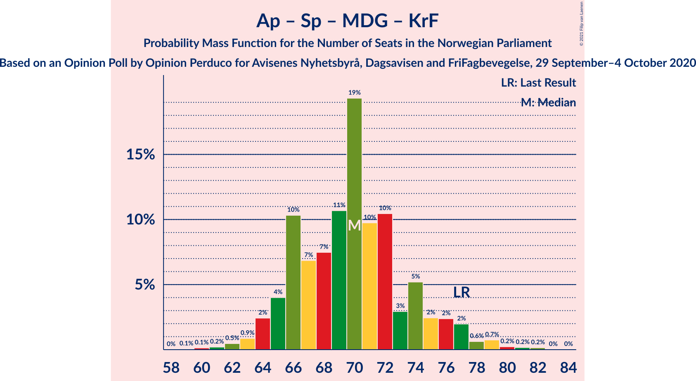

| Number of Seats | Probability | Accumulated | Special Marks |
|:---------------:|:-----------:|:-----------:|:-------------:|
| 59 | 0.1% | 100% |  |
| 60 | 0.1% | 99.9% |  |
| 61 | 0.2% | 99.8% |  |
| 62 | 0.5% | 99.6% |  |
| 63 | 0.9% | 99.1% |  |
| 64 | 2% | 98% |  |
| 65 | 4% | 96% |  |
| 66 | 10% | 92% |  |
| 67 | 7% | 81% |  |
| 68 | 7% | 75% |  |
| 69 | 11% | 67% | Median |
| 70 | 19% | 56% |  |
| 71 | 10% | 37% |  |
| 72 | 10% | 27% |  |
| 73 | 3% | 17% |  |
| 74 | 5% | 14% |  |
| 75 | 2% | 9% |  |
| 76 | 2% | 6% |  |
| 77 | 2% | 4% | Last Result |
| 78 | 0.6% | 2% |  |
| 79 | 0.7% | 1.4% |  |
| 80 | 0.2% | 0.6% |  |
| 81 | 0.2% | 0.4% |  |
| 82 | 0.2% | 0.2% |  |
| 83 | 0% | 0.1% |  |
| 84 | 0% | 0% |  |

### Arbeiderpartiet – Senterpartiet – Kristelig Folkeparti

| Number of Seats | Probability | Accumulated | Special Marks |
|:---------------:|:-----------:|:-----------:|:-------------:|
| 58 | 0.1% | 100% |  |
| 59 | 0.3% | 99.9% |  |
| 60 | 1.0% | 99.6% |  |
| 61 | 0.6% | 98.6% |  |
| 62 | 2% | 98% |  |
| 63 | 2% | 96% |  |
| 64 | 10% | 94% |  |
| 65 | 7% | 85% |  |
| 66 | 9% | 77% |  |
| 67 | 9% | 69% |  |
| 68 | 11% | 60% | Median |
| 69 | 21% | 49% |  |
| 70 | 8% | 28% |  |
| 71 | 8% | 19% |  |
| 72 | 3% | 12% |  |
| 73 | 4% | 9% |  |
| 74 | 2% | 5% |  |
| 75 | 1.3% | 3% |  |
| 76 | 0.4% | 1.4% | Last Result |
| 77 | 0.4% | 1.0% |  |
| 78 | 0.4% | 0.5% |  |
| 79 | 0.1% | 0.1% |  |
| 80 | 0% | 0.1% |  |
| 81 | 0% | 0% |  |

### Arbeiderpartiet – Senterpartiet

| Number of Seats | Probability | Accumulated | Special Marks |
|:---------------:|:-----------:|:-----------:|:-------------:|
| 56 | 0.1% | 100% |  |
| 57 | 0.6% | 99.9% |  |
| 58 | 0.7% | 99.3% |  |
| 59 | 0.6% | 98.7% |  |
| 60 | 2% | 98% |  |
| 61 | 3% | 97% |  |
| 62 | 7% | 94% |  |
| 63 | 8% | 87% |  |
| 64 | 10% | 79% |  |
| 65 | 9% | 69% |  |
| 66 | 21% | 60% | Median |
| 67 | 11% | 39% |  |
| 68 | 9% | 28% | Last Result |
| 69 | 6% | 19% |  |
| 70 | 6% | 13% |  |
| 71 | 3% | 7% |  |
| 72 | 1.3% | 4% |  |
| 73 | 2% | 3% |  |
| 74 | 0.5% | 1.2% |  |
| 75 | 0.3% | 0.7% |  |
| 76 | 0.3% | 0.4% |  |
| 77 | 0.1% | 0.1% |  |
| 78 | 0% | 0% |  |

### Høyre – Venstre – Kristelig Folkeparti

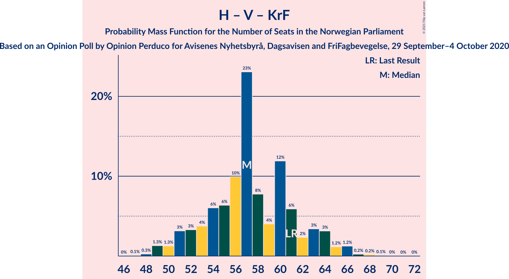

| Number of Seats | Probability | Accumulated | Special Marks |
|:---------------:|:-----------:|:-----------:|:-------------:|
| 47 | 0.1% | 100% |  |
| 48 | 0.3% | 99.9% |  |
| 49 | 1.3% | 99.6% |  |
| 50 | 1.3% | 98% |  |
| 51 | 3% | 97% |  |
| 52 | 3% | 94% |  |
| 53 | 4% | 91% |  |
| 54 | 6% | 87% |  |
| 55 | 6% | 81% |  |
| 56 | 10% | 74% |  |
| 57 | 23% | 65% |  |
| 58 | 8% | 41% |  |
| 59 | 4% | 34% | Median |
| 60 | 12% | 30% |  |
| 61 | 6% | 18% | Last Result |
| 62 | 2% | 12% |  |
| 63 | 3% | 10% |  |
| 64 | 3% | 6% |  |
| 65 | 1.2% | 3% |  |
| 66 | 1.2% | 2% |  |
| 67 | 0.2% | 0.6% |  |
| 68 | 0.2% | 0.3% |  |
| 69 | 0.1% | 0.2% |  |
| 70 | 0% | 0.1% |  |
| 71 | 0% | 0% |  |

### Arbeiderpartiet – Sosialistisk Venstreparti

| Number of Seats | Probability | Accumulated | Special Marks |
|:---------------:|:-----------:|:-----------:|:-------------:|
| 43 | 0% | 100% |  |
| 44 | 0.1% | 99.9% |  |
| 45 | 0.3% | 99.9% |  |
| 46 | 0.5% | 99.6% |  |
| 47 | 1.2% | 99.0% |  |
| 48 | 2% | 98% |  |
| 49 | 3% | 96% |  |
| 50 | 10% | 93% |  |
| 51 | 10% | 83% |  |
| 52 | 12% | 73% |  |
| 53 | 15% | 61% | Median |
| 54 | 10% | 46% |  |
| 55 | 18% | 36% |  |
| 56 | 7% | 18% |  |
| 57 | 4% | 11% |  |
| 58 | 4% | 7% |  |
| 59 | 1.2% | 3% |  |
| 60 | 0.9% | 2% | Last Result |
| 61 | 0.5% | 0.9% |  |
| 62 | 0.2% | 0.4% |  |
| 63 | 0.1% | 0.2% |  |
| 64 | 0% | 0% |  |

### Senterpartiet – Venstre – Kristelig Folkeparti

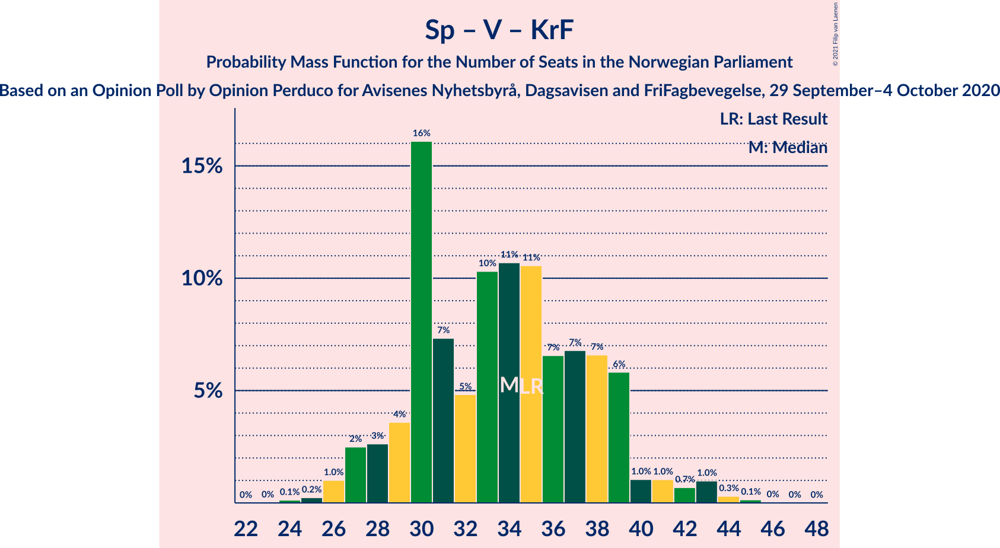

| Number of Seats | Probability | Accumulated | Special Marks |
|:---------------:|:-----------:|:-----------:|:-------------:|
| 24 | 0.1% | 100% |  |
| 25 | 0.2% | 99.8% |  |
| 26 | 1.0% | 99.6% |  |
| 27 | 2% | 98.6% |  |
| 28 | 3% | 96% |  |
| 29 | 4% | 93% |  |
| 30 | 16% | 90% |  |
| 31 | 7% | 74% |  |
| 32 | 5% | 66% |  |
| 33 | 10% | 62% |  |
| 34 | 11% | 51% |  |
| 35 | 11% | 41% | Last Result, Median |
| 36 | 7% | 30% |  |
| 37 | 7% | 23% |  |
| 38 | 7% | 17% |  |
| 39 | 6% | 10% |  |
| 40 | 1.0% | 4% |  |
| 41 | 1.0% | 3% |  |
| 42 | 0.7% | 2% |  |
| 43 | 1.0% | 1.5% |  |
| 44 | 0.3% | 0.5% |  |
| 45 | 0.1% | 0.2% |  |
| 46 | 0% | 0.1% |  |
| 47 | 0% | 0% |  |

## Technical Information

### Opinion Poll

+ **Polling firm:** Opinion Perduco
+ **Commissioner(s):** Avisenes Nyhetsbyrå, Dagsavisen and FriFagbevegelse
+ **Fieldwork period:** 29 September–4 October 2020

### Calculations

+ **Sample size:** 955
+ **Simulations done:** 1,048,576
+ **Error estimate:** 1.33%

