# Opinion Poll by Ipsos MMI for Dagbladet, 19–21 October 2020

<a href="#voting-intentions">Voting Intentions</a> | <a href="#seats">Seats</a> | <a href="#coalitions">Coalitions</a> | <a href="#technical-information">Technical Information</a>

## Voting Intentions

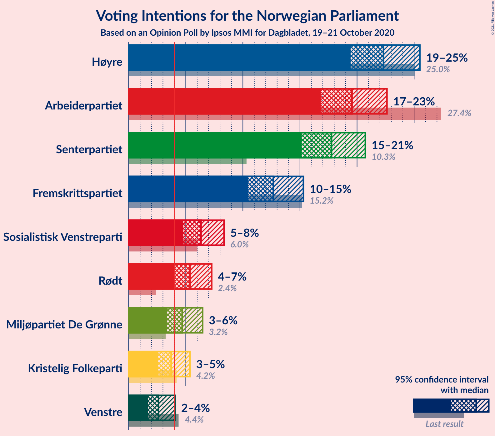

### Confidence Intervals

| Party | Last Result | Poll Result | 80% Confidence Interval | 90% Confidence Interval | 95% Confidence Interval | 99% Confidence Interval |
|:-----:|:-----------:|:-----------:|:-----------------------:|:-----------------------:|:-----------------------:|:-----------------------:|
| Høyre | 25.0% | 22.3% | 20.4–24.4% |19.9–25.0% |19.4–25.5% |18.5–26.5% |
| Arbeiderpartiet | 27.4% | 19.6% | 17.8–21.6% |17.3–22.1% |16.8–22.6% |16.0–23.6% |
| Senterpartiet | 10.3% | 17.8% | 16.0–19.7% |15.6–20.2% |15.2–20.7% |14.4–21.7% |
| Fremskrittspartiet | 15.2% | 12.7% | 11.2–14.4% |10.8–14.9% |10.4–15.3% |9.8–16.2% |
| Sosialistisk Venstreparti | 6.0% | 6.3% | 5.3–7.7% |5.0–8.0% |4.8–8.4% |4.3–9.0% |
| Rødt | 2.4% | 5.4% | 4.4–6.6% |4.2–7.0% |3.9–7.3% |3.6–7.9% |
| Miljøpartiet De Grønne | 3.2% | 4.7% | 3.8–5.9% |3.6–6.2% |3.4–6.5% |3.0–7.1% |
| Kristelig Folkeparti | 4.2% | 3.7% | 3.0–4.8% |2.7–5.1% |2.6–5.4% |2.2–5.9% |
| Venstre | 4.4% | 2.6% | 2.0–3.6% |1.8–3.8% |1.7–4.1% |1.4–4.6% |

*Note:* The poll result column reflects the actual value used in the calculations. Published results may vary slightly, and in addition be rounded to fewer digits.

## Seats

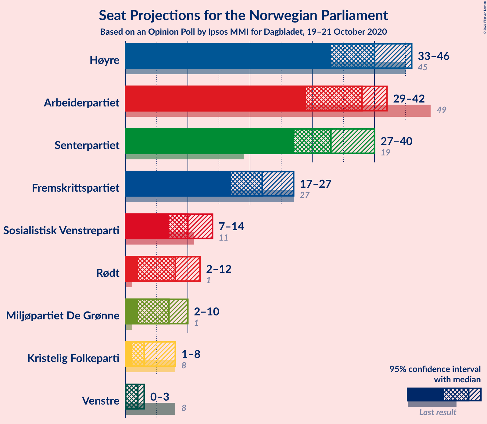

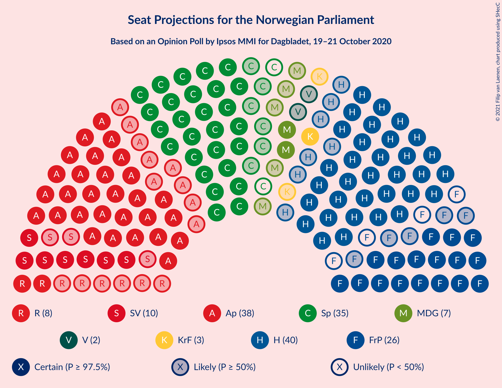

### Confidence Intervals

| Party | Last Result | Median | 80% Confidence Interval | 90% Confidence Interval | 95% Confidence Interval | 99% Confidence Interval |
|:-----:|:-----------:|:------:|:-----------------------:|:-----------------------:|:-----------------------:|:-----------------------:|
| <a href="#høyre">Høyre</a> | 45 | 40 | 34–44 |34–45 |33–46 |32–48 |
| <a href="#arbeiderpartiet">Arbeiderpartiet</a> | 49 | 38 | 32–40 |30–41 |29–42 |27–44 |
| <a href="#senterpartiet">Senterpartiet</a> | 19 | 33 | 29–38 |28–39 |27–40 |26–42 |
| <a href="#fremskrittspartiet">Fremskrittspartiet</a> | 27 | 22 | 18–26 |18–26 |17–27 |15–28 |
| <a href="#sosialistisk-venstreparti">Sosialistisk Venstreparti</a> | 11 | 10 | 8–12 |8–13 |7–14 |6–15 |
| <a href="#rødt">Rødt</a> | 1 | 8 | 7–10 |6–11 |2–12 |2–13 |
| <a href="#miljøpartiet-de-grønne">Miljøpartiet De Grønne</a> | 1 | 7 | 3–9 |2–9 |2–10 |1–11 |
| <a href="#kristelig-folkeparti">Kristelig Folkeparti</a> | 8 | 3 | 1–7 |1–8 |1–8 |1–9 |
| <a href="#venstre">Venstre</a> | 8 | 2 | 1–2 |0–2 |0–3 |0–7 |

### Høyre

*For a full overview of the results for this party, see the [Høyre](party-høyre.html) page.*

| Number of Seats | Probability | Accumulated | Special Marks |
|:---------------:|:-----------:|:-----------:|:-------------:|
| 31 | 0.2% | 100% |  |
| 32 | 0.9% | 99.8% |  |
| 33 | 3% | 98.9% |  |
| 34 | 6% | 96% |  |
| 35 | 4% | 89% |  |
| 36 | 5% | 86% |  |
| 37 | 6% | 81% |  |
| 38 | 9% | 75% |  |
| 39 | 10% | 66% |  |
| 40 | 22% | 56% | Median |
| 41 | 10% | 34% |  |
| 42 | 9% | 24% |  |
| 43 | 5% | 15% |  |
| 44 | 5% | 11% |  |
| 45 | 3% | 6% | Last Result |
| 46 | 2% | 3% |  |
| 47 | 0.6% | 1.2% |  |
| 48 | 0.3% | 0.5% |  |
| 49 | 0.1% | 0.2% |  |
| 50 | 0.1% | 0.1% |  |
| 51 | 0% | 0% |  |

### Arbeiderpartiet

*For a full overview of the results for this party, see the [Arbeiderpartiet](party-arbeiderpartiet.html) page.*

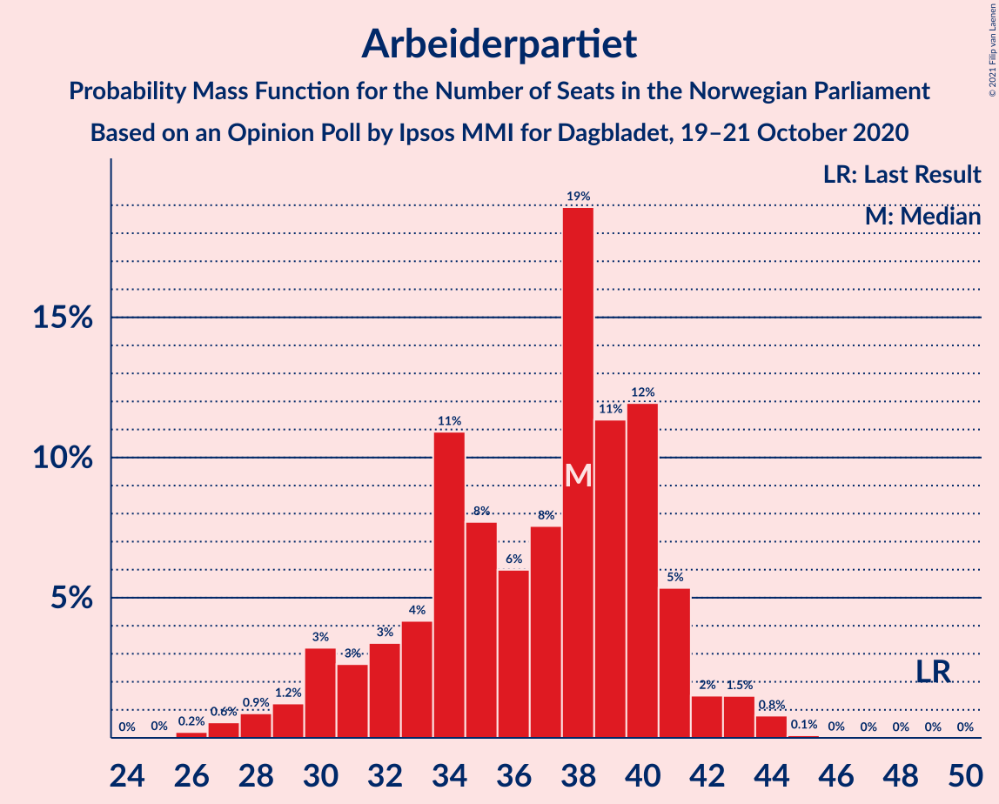

| Number of Seats | Probability | Accumulated | Special Marks |
|:---------------:|:-----------:|:-----------:|:-------------:|
| 26 | 0.2% | 100% |  |
| 27 | 0.6% | 99.7% |  |
| 28 | 0.9% | 99.2% |  |
| 29 | 1.2% | 98% |  |
| 30 | 3% | 97% |  |
| 31 | 3% | 94% |  |
| 32 | 3% | 91% |  |
| 33 | 4% | 88% |  |
| 34 | 11% | 84% |  |
| 35 | 8% | 73% |  |
| 36 | 6% | 65% |  |
| 37 | 8% | 59% |  |
| 38 | 19% | 52% | Median |
| 39 | 11% | 33% |  |
| 40 | 12% | 21% |  |
| 41 | 5% | 9% |  |
| 42 | 2% | 4% |  |
| 43 | 1.5% | 2% |  |
| 44 | 0.8% | 0.9% |  |
| 45 | 0.1% | 0.1% |  |
| 46 | 0% | 0% |  |
| 47 | 0% | 0% |  |
| 48 | 0% | 0% |  |
| 49 | 0% | 0% | Last Result |

### Senterpartiet

*For a full overview of the results for this party, see the [Senterpartiet](party-senterpartiet.html) page.*

| Number of Seats | Probability | Accumulated | Special Marks |
|:---------------:|:-----------:|:-----------:|:-------------:|
| 19 | 0% | 100% | Last Result |
| 20 | 0% | 100% |  |
| 21 | 0% | 100% |  |
| 22 | 0% | 100% |  |
| 23 | 0% | 100% |  |
| 24 | 0.2% | 100% |  |
| 25 | 0.1% | 99.8% |  |
| 26 | 0.7% | 99.7% |  |
| 27 | 2% | 99.0% |  |
| 28 | 4% | 97% |  |
| 29 | 5% | 93% |  |
| 30 | 9% | 88% |  |
| 31 | 9% | 79% |  |
| 32 | 16% | 70% |  |
| 33 | 8% | 54% | Median |
| 34 | 8% | 47% |  |
| 35 | 14% | 39% |  |
| 36 | 8% | 25% |  |
| 37 | 5% | 17% |  |
| 38 | 4% | 12% |  |
| 39 | 4% | 8% |  |
| 40 | 1.5% | 3% |  |
| 41 | 0.8% | 2% |  |
| 42 | 0.7% | 1.0% |  |
| 43 | 0.1% | 0.3% |  |
| 44 | 0.1% | 0.2% |  |
| 45 | 0% | 0% |  |

### Fremskrittspartiet

*For a full overview of the results for this party, see the [Fremskrittspartiet](party-fremskrittspartiet.html) page.*

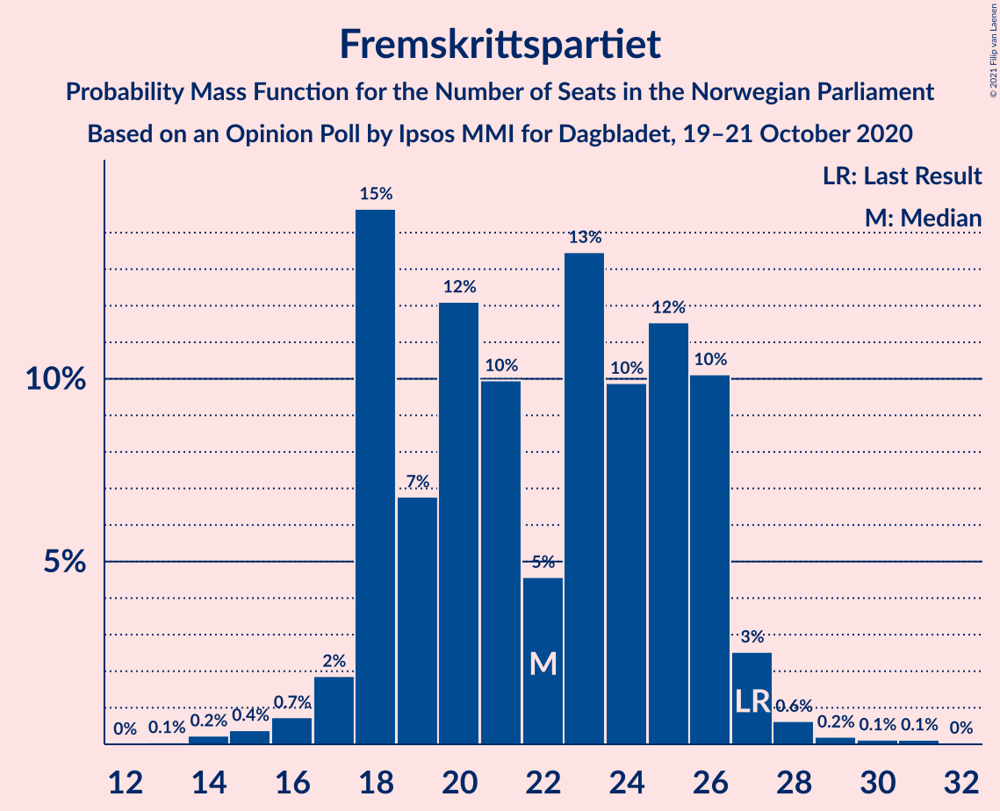

| Number of Seats | Probability | Accumulated | Special Marks |
|:---------------:|:-----------:|:-----------:|:-------------:|
| 13 | 0.1% | 100% |  |
| 14 | 0.2% | 99.9% |  |
| 15 | 0.4% | 99.7% |  |
| 16 | 0.7% | 99.3% |  |
| 17 | 2% | 98.6% |  |
| 18 | 15% | 97% |  |
| 19 | 7% | 82% |  |
| 20 | 12% | 75% |  |
| 21 | 10% | 63% |  |
| 22 | 5% | 53% | Median |
| 23 | 13% | 49% |  |
| 24 | 10% | 35% |  |
| 25 | 12% | 25% |  |
| 26 | 10% | 14% |  |
| 27 | 3% | 4% | Last Result |
| 28 | 0.6% | 1.1% |  |
| 29 | 0.2% | 0.5% |  |
| 30 | 0.1% | 0.3% |  |
| 31 | 0.1% | 0.2% |  |
| 32 | 0% | 0% |  |

### Sosialistisk Venstreparti

*For a full overview of the results for this party, see the [Sosialistisk Venstreparti](party-sosialistiskvenstreparti.html) page.*

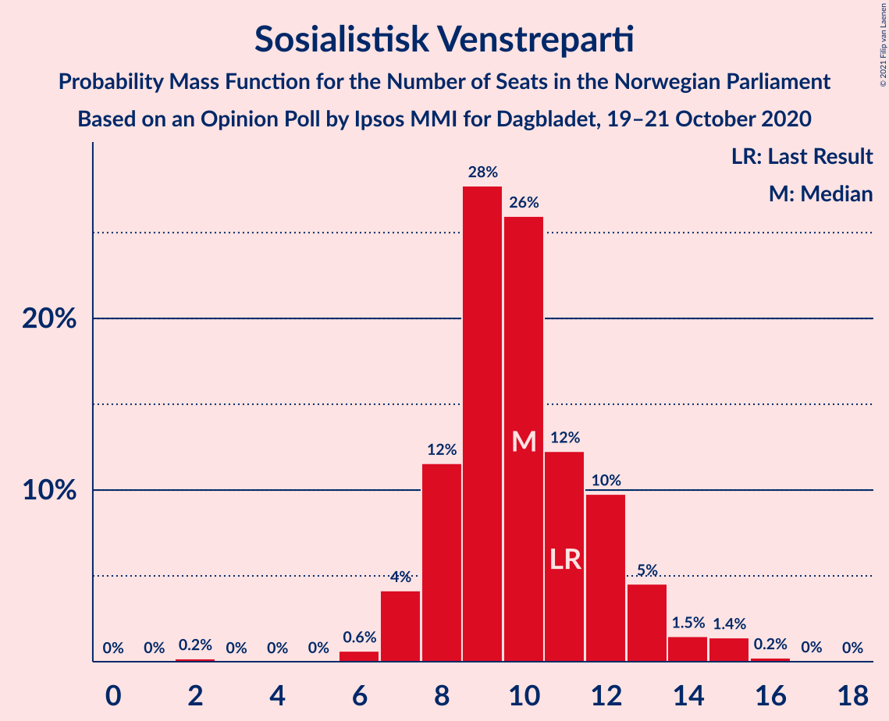

| Number of Seats | Probability | Accumulated | Special Marks |
|:---------------:|:-----------:|:-----------:|:-------------:|
| 2 | 0.2% | 100% |  |
| 3 | 0% | 99.8% |  |
| 4 | 0% | 99.8% |  |
| 5 | 0% | 99.8% |  |
| 6 | 0.6% | 99.8% |  |
| 7 | 4% | 99.2% |  |
| 8 | 12% | 95% |  |
| 9 | 28% | 83% |  |
| 10 | 26% | 56% | Median |
| 11 | 12% | 30% | Last Result |
| 12 | 10% | 17% |  |
| 13 | 5% | 8% |  |
| 14 | 1.5% | 3% |  |
| 15 | 1.4% | 2% |  |
| 16 | 0.2% | 0.3% |  |
| 17 | 0% | 0.1% |  |
| 18 | 0% | 0% |  |

### Rødt

*For a full overview of the results for this party, see the [Rødt](party-rødt.html) page.*

| Number of Seats | Probability | Accumulated | Special Marks |
|:---------------:|:-----------:|:-----------:|:-------------:|
| 1 | 0% | 100% | Last Result |
| 2 | 3% | 100% |  |
| 3 | 0% | 97% |  |
| 4 | 0% | 97% |  |
| 5 | 0.1% | 97% |  |
| 6 | 6% | 97% |  |
| 7 | 26% | 91% |  |
| 8 | 27% | 65% | Median |
| 9 | 18% | 38% |  |
| 10 | 11% | 20% |  |
| 11 | 6% | 8% |  |
| 12 | 2% | 3% |  |
| 13 | 0.6% | 0.8% |  |
| 14 | 0.1% | 0.2% |  |
| 15 | 0% | 0% |  |

### Miljøpartiet De Grønne

*For a full overview of the results for this party, see the [Miljøpartiet De Grønne](party-miljøpartietdegrønne.html) page.*

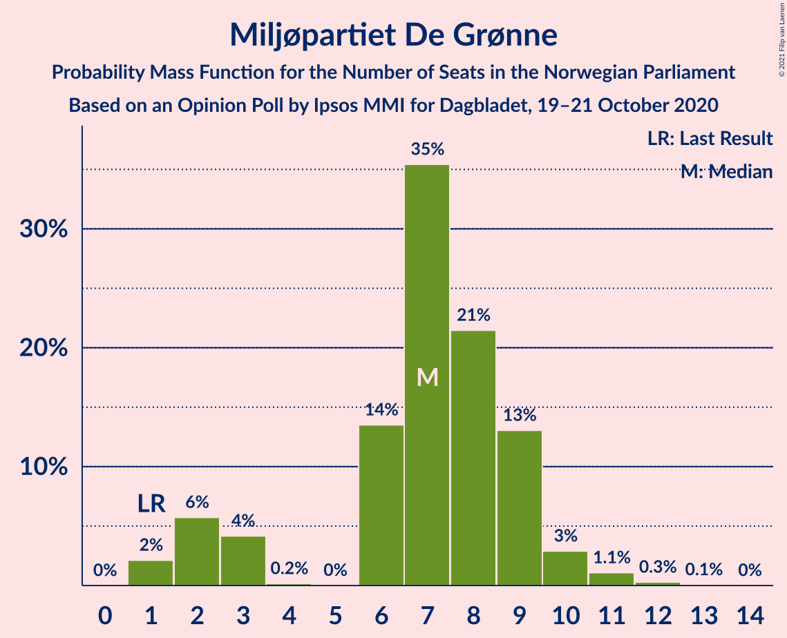

| Number of Seats | Probability | Accumulated | Special Marks |
|:---------------:|:-----------:|:-----------:|:-------------:|
| 1 | 2% | 100% | Last Result |
| 2 | 6% | 98% |  |
| 3 | 4% | 92% |  |
| 4 | 0.2% | 88% |  |
| 5 | 0% | 88% |  |
| 6 | 14% | 88% |  |
| 7 | 35% | 74% | Median |
| 8 | 21% | 39% |  |
| 9 | 13% | 17% |  |
| 10 | 3% | 4% |  |
| 11 | 1.1% | 1.4% |  |
| 12 | 0.3% | 0.4% |  |
| 13 | 0.1% | 0.1% |  |
| 14 | 0% | 0% |  |

### Kristelig Folkeparti

*For a full overview of the results for this party, see the [Kristelig Folkeparti](party-kristeligfolkeparti.html) page.*

| Number of Seats | Probability | Accumulated | Special Marks |
|:---------------:|:-----------:|:-----------:|:-------------:|
| 0 | 0.4% | 100% |  |
| 1 | 18% | 99.6% |  |
| 2 | 27% | 81% |  |
| 3 | 17% | 55% | Median |
| 4 | 0% | 38% |  |
| 5 | 0.2% | 38% |  |
| 6 | 16% | 38% |  |
| 7 | 15% | 22% |  |
| 8 | 5% | 7% | Last Result |
| 9 | 1.4% | 2% |  |
| 10 | 0.2% | 0.3% |  |
| 11 | 0% | 0% |  |

### Venstre

*For a full overview of the results for this party, see the [Venstre](party-venstre.html) page.*

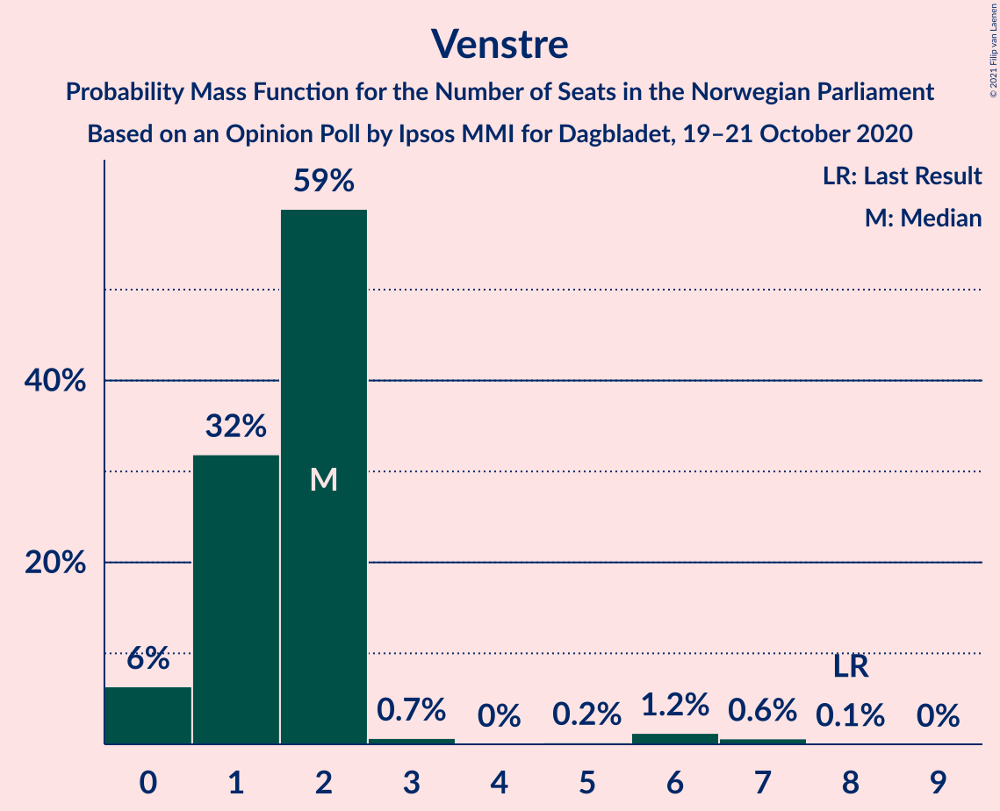

| Number of Seats | Probability | Accumulated | Special Marks |
|:---------------:|:-----------:|:-----------:|:-------------:|
| 0 | 6% | 100% |  |
| 1 | 32% | 94% |  |
| 2 | 59% | 62% | Median |
| 3 | 0.7% | 3% |  |
| 4 | 0% | 2% |  |
| 5 | 0.2% | 2% |  |
| 6 | 1.2% | 2% |  |
| 7 | 0.6% | 0.7% |  |
| 8 | 0.1% | 0.1% | Last Result |
| 9 | 0% | 0% |  |

## Coalitions

### Confidence Intervals

| Coalition | Last Result | Median | Majority? | 80% Confidence Interval | 90% Confidence Interval | 95% Confidence Interval | 99% Confidence Interval |
|:---------:|:-----------:|:------:|:---------:|:-----------------------:|:-----------------------:|:-----------------------:|:-----------------------:|
| Høyre – Senterpartiet – Fremskrittspartiet – Kristelig Folkeparti – Venstre | 107 | 100 | 100% | 95–106 | 94–108 | 92–108 | 90–112 |
| Arbeiderpartiet – Senterpartiet – Sosialistisk Venstreparti – Rødt – Miljøpartiet De Grønne | 81 | 95 | 98.9% | 89–101 | 88–102 | 86–103 | 84–106 |
| Arbeiderpartiet – Senterpartiet – Sosialistisk Venstreparti – Miljøpartiet De Grønne – Kristelig Folkeparti | 88 | 90 | 94% | 86–96 | 84–98 | 83–100 | 79–102 |
| Arbeiderpartiet – Senterpartiet – Sosialistisk Venstreparti – Rødt | 80 | 88 | 79% | 82–93 | 81–95 | 80–96 | 77–99 |
| Arbeiderpartiet – Senterpartiet – Sosialistisk Venstreparti – Miljøpartiet De Grønne | 80 | 87 | 73% | 81–93 | 80–94 | 78–95 | 75–97 |
| Arbeiderpartiet – Senterpartiet – Miljøpartiet De Grønne – Kristelig Folkeparti | 77 | 80 | 22% | 76–86 | 74–88 | 72–90 | 68–92 |
| Arbeiderpartiet – Senterpartiet – Sosialistisk Venstreparti | 79 | 80 | 12% | 74–85 | 73–86 | 72–88 | 69–90 |
| Arbeiderpartiet – Senterpartiet – Kristelig Folkeparti | 76 | 73 | 0.6% | 69–79 | 67–82 | 66–83 | 63–85 |
| Høyre – Fremskrittspartiet – Miljøpartiet De Grønne – Kristelig Folkeparti – Venstre | 89 | 74 | 0.6% | 68–80 | 66–82 | 65–82 | 62–85 |
| Arbeiderpartiet – Senterpartiet | 68 | 70 | 0% | 65–75 | 64–77 | 62–77 | 59–79 |
| Høyre – Fremskrittspartiet – Kristelig Folkeparti – Venstre | 88 | 67 | 0% | 61–73 | 60–74 | 59–76 | 57–78 |
| Høyre – Fremskrittspartiet – Venstre | 80 | 64 | 0% | 58–68 | 57–69 | 55–71 | 53–74 |
| Høyre – Fremskrittspartiet | 72 | 62 | 0% | 56–66 | 55–67 | 53–69 | 52–72 |
| Arbeiderpartiet – Sosialistisk Venstreparti | 60 | 47 | 0% | 42–50 | 40–52 | 38–53 | 36–55 |
| Høyre – Kristelig Folkeparti – Venstre | 61 | 44 | 0% | 40–50 | 38–52 | 38–53 | 37–55 |
| Senterpartiet – Kristelig Folkeparti – Venstre | 35 | 38 | 0% | 34–44 | 33–47 | 32–47 | 30–50 |

### Høyre – Senterpartiet – Fremskrittspartiet – Kristelig Folkeparti – Venstre

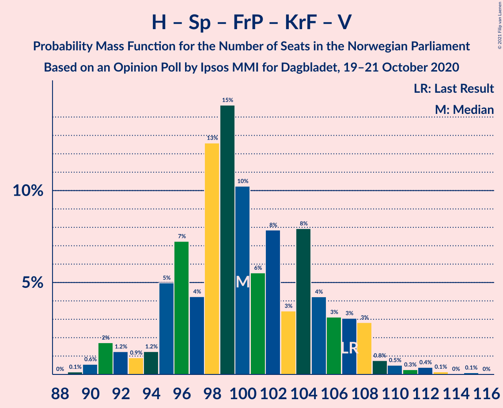

| Number of Seats | Probability | Accumulated | Special Marks |
|:---------------:|:-----------:|:-----------:|:-------------:|
| 89 | 0.1% | 100% |  |
| 90 | 0.6% | 99.8% |  |
| 91 | 2% | 99.3% |  |
| 92 | 1.2% | 98% |  |
| 93 | 0.9% | 96% |  |
| 94 | 1.2% | 95% |  |
| 95 | 5% | 94% |  |
| 96 | 7% | 89% |  |
| 97 | 4% | 82% |  |
| 98 | 13% | 78% |  |
| 99 | 15% | 65% |  |
| 100 | 10% | 50% | Median |
| 101 | 6% | 40% |  |
| 102 | 8% | 35% |  |
| 103 | 3% | 27% |  |
| 104 | 8% | 23% |  |
| 105 | 4% | 15% |  |
| 106 | 3% | 11% |  |
| 107 | 3% | 8% | Last Result |
| 108 | 3% | 5% |  |
| 109 | 0.8% | 2% |  |
| 110 | 0.5% | 1.5% |  |
| 111 | 0.3% | 1.0% |  |
| 112 | 0.4% | 0.7% |  |
| 113 | 0.1% | 0.3% |  |
| 114 | 0% | 0.2% |  |
| 115 | 0.1% | 0.1% |  |
| 116 | 0% | 0% |  |

### Arbeiderpartiet – Senterpartiet – Sosialistisk Venstreparti – Rødt – Miljøpartiet De Grønne

| Number of Seats | Probability | Accumulated | Special Marks |
|:---------------:|:-----------:|:-----------:|:-------------:|
| 80 | 0.1% | 100% |  |
| 81 | 0% | 99.9% | Last Result |
| 82 | 0.2% | 99.9% |  |
| 83 | 0.2% | 99.7% |  |
| 84 | 0.6% | 99.5% |  |
| 85 | 0.8% | 98.9% | Majority |
| 86 | 2% | 98% |  |
| 87 | 0.8% | 97% |  |
| 88 | 5% | 96% |  |
| 89 | 4% | 90% |  |
| 90 | 3% | 86% |  |
| 91 | 5% | 83% |  |
| 92 | 5% | 78% |  |
| 93 | 11% | 73% |  |
| 94 | 7% | 62% |  |
| 95 | 8% | 55% |  |
| 96 | 9% | 47% | Median |
| 97 | 10% | 39% |  |
| 98 | 6% | 29% |  |
| 99 | 6% | 23% |  |
| 100 | 4% | 17% |  |
| 101 | 6% | 13% |  |
| 102 | 3% | 7% |  |
| 103 | 1.3% | 3% |  |
| 104 | 0.6% | 2% |  |
| 105 | 0.8% | 2% |  |
| 106 | 0.4% | 0.7% |  |
| 107 | 0.1% | 0.3% |  |
| 108 | 0.1% | 0.2% |  |
| 109 | 0.1% | 0.1% |  |
| 110 | 0% | 0% |  |

### Arbeiderpartiet – Senterpartiet – Sosialistisk Venstreparti – Miljøpartiet De Grønne – Kristelig Folkeparti

| Number of Seats | Probability | Accumulated | Special Marks |
|:---------------:|:-----------:|:-----------:|:-------------:|
| 77 | 0.1% | 100% |  |
| 78 | 0.2% | 99.9% |  |
| 79 | 0.2% | 99.6% |  |
| 80 | 0.5% | 99.4% |  |
| 81 | 0.9% | 99.0% |  |
| 82 | 0.6% | 98% |  |
| 83 | 1.5% | 98% |  |
| 84 | 2% | 96% |  |
| 85 | 3% | 94% | Majority |
| 86 | 8% | 91% |  |
| 87 | 6% | 83% |  |
| 88 | 15% | 77% | Last Result |
| 89 | 5% | 62% |  |
| 90 | 9% | 57% |  |
| 91 | 6% | 48% | Median |
| 92 | 8% | 42% |  |
| 93 | 3% | 34% |  |
| 94 | 10% | 31% |  |
| 95 | 7% | 21% |  |
| 96 | 6% | 14% |  |
| 97 | 2% | 8% |  |
| 98 | 2% | 6% |  |
| 99 | 0.9% | 4% |  |
| 100 | 2% | 3% |  |
| 101 | 0.4% | 0.9% |  |
| 102 | 0.3% | 0.5% |  |
| 103 | 0.1% | 0.2% |  |
| 104 | 0.1% | 0.2% |  |
| 105 | 0.1% | 0.1% |  |
| 106 | 0% | 0% |  |

### Arbeiderpartiet – Senterpartiet – Sosialistisk Venstreparti – Rødt

| Number of Seats | Probability | Accumulated | Special Marks |
|:---------------:|:-----------:|:-----------:|:-------------:|
| 74 | 0% | 100% |  |
| 75 | 0% | 99.9% |  |
| 76 | 0.2% | 99.9% |  |
| 77 | 0.5% | 99.7% |  |
| 78 | 0.4% | 99.1% |  |
| 79 | 1.1% | 98.7% |  |
| 80 | 1.4% | 98% | Last Result |
| 81 | 5% | 96% |  |
| 82 | 2% | 91% |  |
| 83 | 5% | 89% |  |
| 84 | 5% | 84% |  |
| 85 | 4% | 79% | Majority |
| 86 | 13% | 75% |  |
| 87 | 7% | 62% |  |
| 88 | 8% | 55% |  |
| 89 | 8% | 47% | Median |
| 90 | 6% | 39% |  |
| 91 | 9% | 33% |  |
| 92 | 9% | 24% |  |
| 93 | 5% | 15% |  |
| 94 | 4% | 10% |  |
| 95 | 2% | 6% |  |
| 96 | 2% | 4% |  |
| 97 | 0.9% | 2% |  |
| 98 | 0.5% | 1.3% |  |
| 99 | 0.4% | 0.8% |  |
| 100 | 0.3% | 0.4% |  |
| 101 | 0.1% | 0.2% |  |
| 102 | 0% | 0.1% |  |
| 103 | 0% | 0% |  |

### Arbeiderpartiet – Senterpartiet – Sosialistisk Venstreparti – Miljøpartiet De Grønne

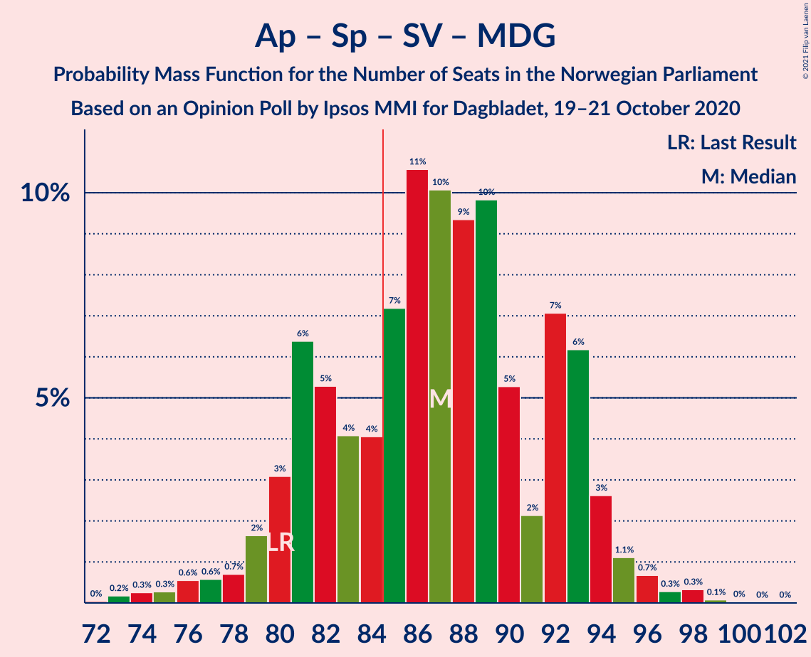

| Number of Seats | Probability | Accumulated | Special Marks |
|:---------------:|:-----------:|:-----------:|:-------------:|
| 72 | 0% | 100% |  |
| 73 | 0.2% | 99.9% |  |
| 74 | 0.3% | 99.8% |  |
| 75 | 0.3% | 99.5% |  |
| 76 | 0.6% | 99.2% |  |
| 77 | 0.6% | 98.7% |  |
| 78 | 0.7% | 98% |  |
| 79 | 2% | 97% |  |
| 80 | 3% | 96% | Last Result |
| 81 | 6% | 93% |  |
| 82 | 5% | 86% |  |
| 83 | 4% | 81% |  |
| 84 | 4% | 77% |  |
| 85 | 7% | 73% | Majority |
| 86 | 11% | 66% |  |
| 87 | 10% | 55% |  |
| 88 | 9% | 45% | Median |
| 89 | 10% | 36% |  |
| 90 | 5% | 26% |  |
| 91 | 2% | 21% |  |
| 92 | 7% | 18% |  |
| 93 | 6% | 11% |  |
| 94 | 3% | 5% |  |
| 95 | 1.1% | 3% |  |
| 96 | 0.7% | 1.4% |  |
| 97 | 0.3% | 0.8% |  |
| 98 | 0.3% | 0.5% |  |
| 99 | 0.1% | 0.1% |  |
| 100 | 0% | 0.1% |  |
| 101 | 0% | 0% |  |

### Arbeiderpartiet – Senterpartiet – Miljøpartiet De Grønne – Kristelig Folkeparti

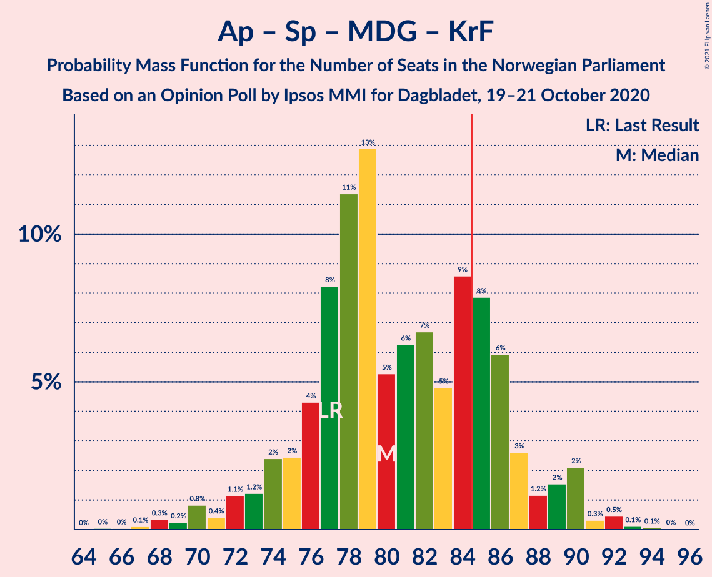

| Number of Seats | Probability | Accumulated | Special Marks |
|:---------------:|:-----------:|:-----------:|:-------------:|
| 65 | 0% | 100% |  |
| 66 | 0% | 99.9% |  |
| 67 | 0.1% | 99.9% |  |
| 68 | 0.3% | 99.8% |  |
| 69 | 0.2% | 99.4% |  |
| 70 | 0.8% | 99.2% |  |
| 71 | 0.4% | 98% |  |
| 72 | 1.1% | 98% |  |
| 73 | 1.2% | 97% |  |
| 74 | 2% | 96% |  |
| 75 | 2% | 93% |  |
| 76 | 4% | 91% |  |
| 77 | 8% | 86% | Last Result |
| 78 | 11% | 78% |  |
| 79 | 13% | 67% |  |
| 80 | 5% | 54% |  |
| 81 | 6% | 49% | Median |
| 82 | 7% | 42% |  |
| 83 | 5% | 36% |  |
| 84 | 9% | 31% |  |
| 85 | 8% | 22% | Majority |
| 86 | 6% | 14% |  |
| 87 | 3% | 8% |  |
| 88 | 1.2% | 6% |  |
| 89 | 2% | 5% |  |
| 90 | 2% | 3% |  |
| 91 | 0.3% | 1.0% |  |
| 92 | 0.5% | 0.7% |  |
| 93 | 0.1% | 0.2% |  |
| 94 | 0.1% | 0.1% |  |
| 95 | 0% | 0% |  |

### Arbeiderpartiet – Senterpartiet – Sosialistisk Venstreparti

| Number of Seats | Probability | Accumulated | Special Marks |
|:---------------:|:-----------:|:-----------:|:-------------:|
| 66 | 0.1% | 100% |  |
| 67 | 0.1% | 99.9% |  |
| 68 | 0.1% | 99.8% |  |
| 69 | 0.5% | 99.7% |  |
| 70 | 0.3% | 99.2% |  |
| 71 | 0.8% | 98.9% |  |
| 72 | 1.0% | 98% |  |
| 73 | 3% | 97% |  |
| 74 | 6% | 94% |  |
| 75 | 3% | 88% |  |
| 76 | 6% | 85% |  |
| 77 | 8% | 79% |  |
| 78 | 5% | 71% |  |
| 79 | 14% | 66% | Last Result |
| 80 | 6% | 52% |  |
| 81 | 9% | 46% | Median |
| 82 | 8% | 37% |  |
| 83 | 5% | 29% |  |
| 84 | 12% | 24% |  |
| 85 | 3% | 12% | Majority |
| 86 | 4% | 9% |  |
| 87 | 2% | 5% |  |
| 88 | 2% | 3% |  |
| 89 | 0.8% | 1.4% |  |
| 90 | 0.3% | 0.6% |  |
| 91 | 0.2% | 0.3% |  |
| 92 | 0% | 0.1% |  |
| 93 | 0% | 0.1% |  |
| 94 | 0% | 0% |  |

### Arbeiderpartiet – Senterpartiet – Kristelig Folkeparti

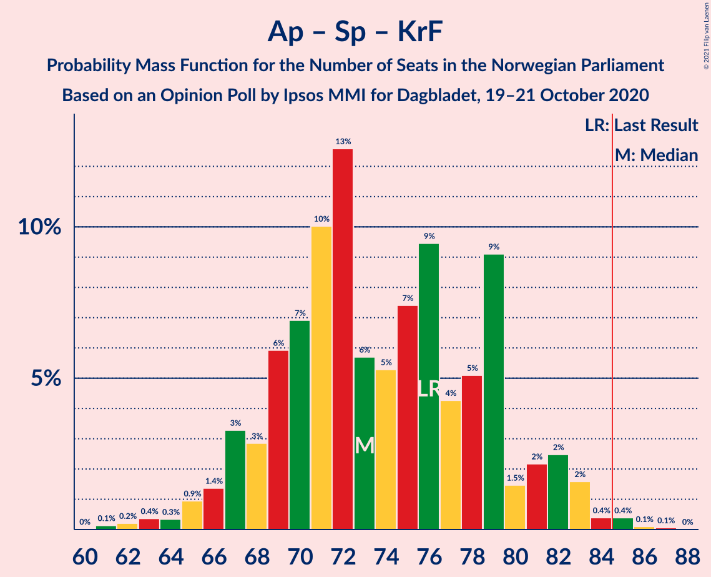

| Number of Seats | Probability | Accumulated | Special Marks |
|:---------------:|:-----------:|:-----------:|:-------------:|
| 61 | 0.1% | 100% |  |
| 62 | 0.2% | 99.8% |  |
| 63 | 0.4% | 99.6% |  |
| 64 | 0.3% | 99.3% |  |
| 65 | 0.9% | 98.9% |  |
| 66 | 1.4% | 98% |  |
| 67 | 3% | 97% |  |
| 68 | 3% | 93% |  |
| 69 | 6% | 90% |  |
| 70 | 7% | 85% |  |
| 71 | 10% | 78% |  |
| 72 | 13% | 68% |  |
| 73 | 6% | 55% |  |
| 74 | 5% | 49% | Median |
| 75 | 7% | 44% |  |
| 76 | 9% | 37% | Last Result |
| 77 | 4% | 27% |  |
| 78 | 5% | 23% |  |
| 79 | 9% | 18% |  |
| 80 | 1.5% | 9% |  |
| 81 | 2% | 7% |  |
| 82 | 2% | 5% |  |
| 83 | 2% | 3% |  |
| 84 | 0.4% | 1.0% |  |
| 85 | 0.4% | 0.6% | Majority |
| 86 | 0.1% | 0.2% |  |
| 87 | 0.1% | 0.1% |  |
| 88 | 0% | 0% |  |

### Høyre – Fremskrittspartiet – Miljøpartiet De Grønne – Kristelig Folkeparti – Venstre

| Number of Seats | Probability | Accumulated | Special Marks |
|:---------------:|:-----------:|:-----------:|:-------------:|
| 59 | 0.1% | 100% |  |
| 60 | 0% | 99.9% |  |
| 61 | 0.1% | 99.9% |  |
| 62 | 0.4% | 99.8% |  |
| 63 | 0.3% | 99.4% |  |
| 64 | 0.8% | 99.1% |  |
| 65 | 1.1% | 98% |  |
| 66 | 4% | 97% |  |
| 67 | 1.5% | 94% |  |
| 68 | 3% | 92% |  |
| 69 | 7% | 89% |  |
| 70 | 10% | 81% |  |
| 71 | 4% | 71% |  |
| 72 | 5% | 67% |  |
| 73 | 7% | 62% |  |
| 74 | 17% | 54% | Median |
| 75 | 5% | 38% |  |
| 76 | 4% | 32% |  |
| 77 | 4% | 29% |  |
| 78 | 7% | 25% |  |
| 79 | 5% | 18% |  |
| 80 | 6% | 13% |  |
| 81 | 1.1% | 7% |  |
| 82 | 3% | 6% |  |
| 83 | 0.8% | 2% |  |
| 84 | 1.0% | 2% |  |
| 85 | 0.3% | 0.6% | Majority |
| 86 | 0.1% | 0.3% |  |
| 87 | 0% | 0.2% |  |
| 88 | 0% | 0.1% |  |
| 89 | 0.1% | 0.1% | Last Result |
| 90 | 0% | 0% |  |

### Arbeiderpartiet – Senterpartiet

| Number of Seats | Probability | Accumulated | Special Marks |
|:---------------:|:-----------:|:-----------:|:-------------:|
| 58 | 0.2% | 100% |  |
| 59 | 0.4% | 99.8% |  |
| 60 | 0.3% | 99.3% |  |
| 61 | 0.8% | 99.1% |  |
| 62 | 2% | 98% |  |
| 63 | 2% | 97% |  |
| 64 | 3% | 95% |  |
| 65 | 9% | 93% |  |
| 66 | 4% | 83% |  |
| 67 | 5% | 79% |  |
| 68 | 8% | 74% | Last Result |
| 69 | 8% | 66% |  |
| 70 | 14% | 57% |  |
| 71 | 6% | 43% | Median |
| 72 | 7% | 37% |  |
| 73 | 7% | 30% |  |
| 74 | 11% | 23% |  |
| 75 | 4% | 12% |  |
| 76 | 3% | 8% |  |
| 77 | 3% | 5% |  |
| 78 | 1.0% | 2% |  |
| 79 | 0.4% | 0.8% |  |
| 80 | 0.1% | 0.4% |  |
| 81 | 0.2% | 0.2% |  |
| 82 | 0% | 0.1% |  |
| 83 | 0% | 0% |  |

### Høyre – Fremskrittspartiet – Kristelig Folkeparti – Venstre

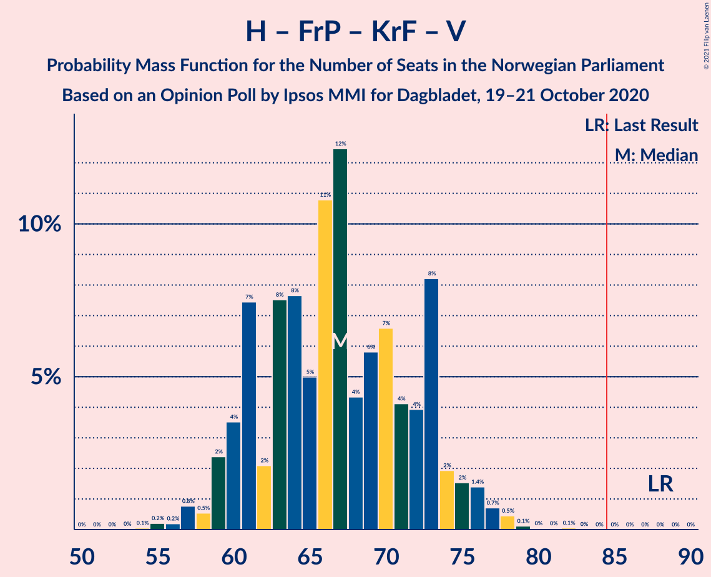

| Number of Seats | Probability | Accumulated | Special Marks |
|:---------------:|:-----------:|:-----------:|:-------------:|
| 54 | 0.1% | 100% |  |
| 55 | 0.2% | 99.9% |  |
| 56 | 0.2% | 99.7% |  |
| 57 | 0.8% | 99.5% |  |
| 58 | 0.5% | 98.7% |  |
| 59 | 2% | 98% |  |
| 60 | 4% | 96% |  |
| 61 | 7% | 92% |  |
| 62 | 2% | 85% |  |
| 63 | 8% | 83% |  |
| 64 | 8% | 75% |  |
| 65 | 5% | 68% |  |
| 66 | 11% | 63% |  |
| 67 | 12% | 52% | Median |
| 68 | 4% | 39% |  |
| 69 | 6% | 35% |  |
| 70 | 7% | 29% |  |
| 71 | 4% | 23% |  |
| 72 | 4% | 18% |  |
| 73 | 8% | 15% |  |
| 74 | 2% | 6% |  |
| 75 | 2% | 4% |  |
| 76 | 1.4% | 3% |  |
| 77 | 0.7% | 1.4% |  |
| 78 | 0.5% | 0.7% |  |
| 79 | 0.1% | 0.3% |  |
| 80 | 0% | 0.2% |  |
| 81 | 0% | 0.1% |  |
| 82 | 0.1% | 0.1% |  |
| 83 | 0% | 0% |  |
| 84 | 0% | 0% |  |
| 85 | 0% | 0% | Majority |
| 86 | 0% | 0% |  |
| 87 | 0% | 0% |  |
| 88 | 0% | 0% | Last Result |

### Høyre – Fremskrittspartiet – Venstre

| Number of Seats | Probability | Accumulated | Special Marks |
|:---------------:|:-----------:|:-----------:|:-------------:|
| 51 | 0.1% | 100% |  |
| 52 | 0.1% | 99.9% |  |
| 53 | 0.6% | 99.8% |  |
| 54 | 1.5% | 99.2% |  |
| 55 | 0.8% | 98% |  |
| 56 | 2% | 97% |  |
| 57 | 4% | 95% |  |
| 58 | 5% | 91% |  |
| 59 | 8% | 86% |  |
| 60 | 7% | 78% |  |
| 61 | 5% | 71% |  |
| 62 | 9% | 66% |  |
| 63 | 6% | 56% |  |
| 64 | 7% | 50% | Median |
| 65 | 18% | 44% |  |
| 66 | 6% | 26% |  |
| 67 | 9% | 19% |  |
| 68 | 3% | 10% |  |
| 69 | 2% | 7% |  |
| 70 | 2% | 5% |  |
| 71 | 1.4% | 3% |  |
| 72 | 0.4% | 1.4% |  |
| 73 | 0.5% | 1.0% |  |
| 74 | 0.3% | 0.5% |  |
| 75 | 0% | 0.2% |  |
| 76 | 0.1% | 0.2% |  |
| 77 | 0% | 0% |  |
| 78 | 0% | 0% |  |
| 79 | 0% | 0% |  |
| 80 | 0% | 0% | Last Result |

### Høyre – Fremskrittspartiet

| Number of Seats | Probability | Accumulated | Special Marks |
|:---------------:|:-----------:|:-----------:|:-------------:|
| 49 | 0% | 100% |  |
| 50 | 0.1% | 99.9% |  |
| 51 | 0.2% | 99.8% |  |
| 52 | 2% | 99.7% |  |
| 53 | 0.7% | 98% |  |
| 54 | 2% | 97% |  |
| 55 | 3% | 95% |  |
| 56 | 3% | 92% |  |
| 57 | 4% | 89% |  |
| 58 | 11% | 84% |  |
| 59 | 6% | 73% |  |
| 60 | 7% | 67% |  |
| 61 | 6% | 60% |  |
| 62 | 8% | 54% | Median |
| 63 | 18% | 46% |  |
| 64 | 5% | 28% |  |
| 65 | 10% | 22% |  |
| 66 | 4% | 12% |  |
| 67 | 3% | 8% |  |
| 68 | 2% | 5% |  |
| 69 | 0.9% | 3% |  |
| 70 | 1.2% | 2% |  |
| 71 | 0.3% | 1.0% |  |
| 72 | 0.3% | 0.7% | Last Result |
| 73 | 0.2% | 0.4% |  |
| 74 | 0% | 0.1% |  |
| 75 | 0.1% | 0.1% |  |
| 76 | 0% | 0% |  |

### Arbeiderpartiet – Sosialistisk Venstreparti

| Number of Seats | Probability | Accumulated | Special Marks |
|:---------------:|:-----------:|:-----------:|:-------------:|
| 34 | 0.1% | 100% |  |
| 35 | 0.1% | 99.9% |  |
| 36 | 0.3% | 99.7% |  |
| 37 | 0.5% | 99.5% |  |
| 38 | 2% | 98.9% |  |
| 39 | 0.9% | 97% |  |
| 40 | 3% | 96% |  |
| 41 | 2% | 93% |  |
| 42 | 3% | 91% |  |
| 43 | 6% | 88% |  |
| 44 | 10% | 82% |  |
| 45 | 6% | 71% |  |
| 46 | 7% | 66% |  |
| 47 | 15% | 59% |  |
| 48 | 12% | 44% | Median |
| 49 | 11% | 32% |  |
| 50 | 11% | 21% |  |
| 51 | 4% | 10% |  |
| 52 | 2% | 6% |  |
| 53 | 2% | 4% |  |
| 54 | 0.6% | 2% |  |
| 55 | 1.2% | 2% |  |
| 56 | 0.3% | 0.4% |  |
| 57 | 0.1% | 0.1% |  |
| 58 | 0% | 0% |  |
| 59 | 0% | 0% |  |
| 60 | 0% | 0% | Last Result |

### Høyre – Kristelig Folkeparti – Venstre

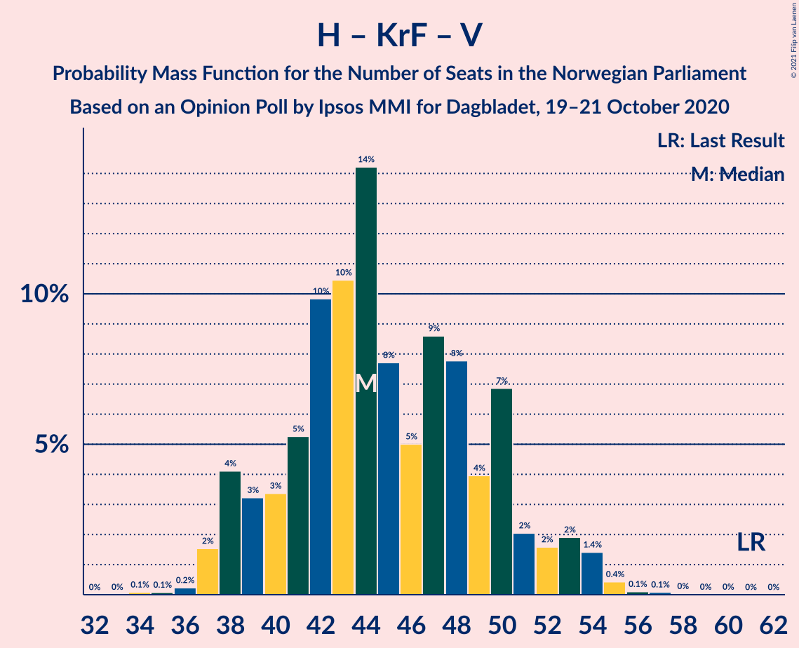

| Number of Seats | Probability | Accumulated | Special Marks |
|:---------------:|:-----------:|:-----------:|:-------------:|
| 34 | 0.1% | 100% |  |
| 35 | 0.1% | 99.9% |  |
| 36 | 0.2% | 99.8% |  |
| 37 | 2% | 99.6% |  |
| 38 | 4% | 98% |  |
| 39 | 3% | 94% |  |
| 40 | 3% | 91% |  |
| 41 | 5% | 87% |  |
| 42 | 10% | 82% |  |
| 43 | 10% | 72% |  |
| 44 | 14% | 62% |  |
| 45 | 8% | 48% | Median |
| 46 | 5% | 40% |  |
| 47 | 9% | 35% |  |
| 48 | 8% | 26% |  |
| 49 | 4% | 18% |  |
| 50 | 7% | 15% |  |
| 51 | 2% | 8% |  |
| 52 | 2% | 6% |  |
| 53 | 2% | 4% |  |
| 54 | 1.4% | 2% |  |
| 55 | 0.4% | 0.7% |  |
| 56 | 0.1% | 0.2% |  |
| 57 | 0.1% | 0.1% |  |
| 58 | 0% | 0.1% |  |
| 59 | 0% | 0% |  |
| 60 | 0% | 0% |  |
| 61 | 0% | 0% | Last Result |

### Senterpartiet – Kristelig Folkeparti – Venstre

| Number of Seats | Probability | Accumulated | Special Marks |
|:---------------:|:-----------:|:-----------:|:-------------:|
| 28 | 0% | 100% |  |
| 29 | 0.2% | 99.9% |  |
| 30 | 0.5% | 99.7% |  |
| 31 | 0.8% | 99.2% |  |
| 32 | 2% | 98% |  |
| 33 | 6% | 97% |  |
| 34 | 3% | 91% |  |
| 35 | 8% | 88% | Last Result |
| 36 | 14% | 80% |  |
| 37 | 5% | 66% |  |
| 38 | 12% | 61% | Median |
| 39 | 11% | 48% |  |
| 40 | 9% | 37% |  |
| 41 | 4% | 28% |  |
| 42 | 4% | 24% |  |
| 43 | 6% | 20% |  |
| 44 | 4% | 14% |  |
| 45 | 2% | 10% |  |
| 46 | 3% | 8% |  |
| 47 | 4% | 5% |  |
| 48 | 0.6% | 2% |  |
| 49 | 0.7% | 1.3% |  |
| 50 | 0.2% | 0.6% |  |
| 51 | 0.2% | 0.3% |  |
| 52 | 0% | 0.1% |  |
| 53 | 0.1% | 0.1% |  |
| 54 | 0% | 0% |  |

## Technical Information

### Opinion Poll

+ **Polling firm:** Ipsos MMI
+ **Commissioner(s):** Dagbladet
+ **Fieldwork period:** 19–21 October 2020

### Calculations

+ **Sample size:** 726
+ **Simulations done:** 1,048,576
+ **Error estimate:** 1.13%

