# Opinion Poll by Kantar TNS for TV2, 26–30 October 2020

<a href="#voting-intentions">Voting Intentions</a> | <a href="#seats">Seats</a> | <a href="#coalitions">Coalitions</a> | <a href="#technical-information">Technical Information</a>

## Voting Intentions

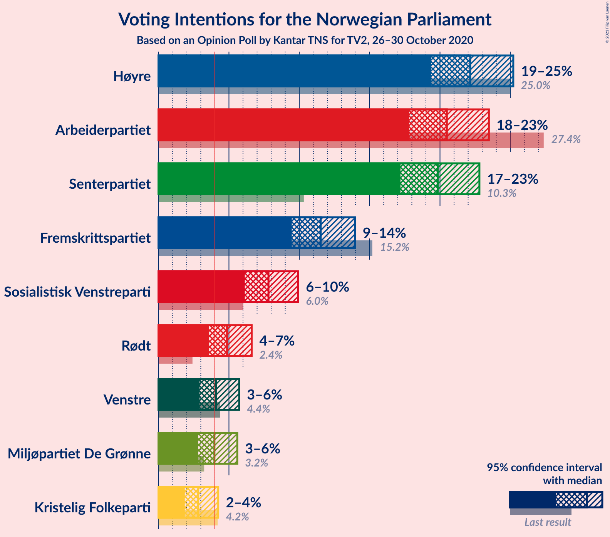

### Confidence Intervals

| Party | Last Result | Poll Result | 80% Confidence Interval | 90% Confidence Interval | 95% Confidence Interval | 99% Confidence Interval |
|:-----:|:-----------:|:-----------:|:-----------------------:|:-----------------------:|:-----------------------:|:-----------------------:|
| Høyre | 25.0% | 22.2% | 20.3–24.1% |19.8–24.7% |19.4–25.2% |18.5–26.2% |
| Arbeiderpartiet | 27.4% | 20.5% | 18.7–22.4% |18.2–23.0% |17.8–23.5% |17.0–24.4% |
| Senterpartiet | 10.3% | 19.8% | 18.1–21.8% |17.6–22.3% |17.2–22.8% |16.4–23.7% |
| Fremskrittspartiet | 15.2% | 11.5% | 10.2–13.1% |9.8–13.6% |9.5–14.0% |8.9–14.8% |
| Sosialistisk Venstreparti | 6.0% | 7.8% | 6.7–9.2% |6.4–9.6% |6.1–9.9% |5.6–10.6% |
| Rødt | 2.4% | 4.9% | 4.0–6.0% |3.8–6.3% |3.6–6.6% |3.2–7.2% |
| Venstre | 4.4% | 4.1% | 3.3–5.2% |3.1–5.5% |2.9–5.7% |2.6–6.3% |
| Miljøpartiet De Grønne | 3.2% | 4.0% | 3.2–5.0% |3.0–5.3% |2.8–5.6% |2.5–6.1% |
| Kristelig Folkeparti | 4.2% | 2.8% | 2.2–3.7% |2.0–4.0% |1.9–4.2% |1.6–4.7% |

*Note:* The poll result column reflects the actual value used in the calculations. Published results may vary slightly, and in addition be rounded to fewer digits.

## Seats

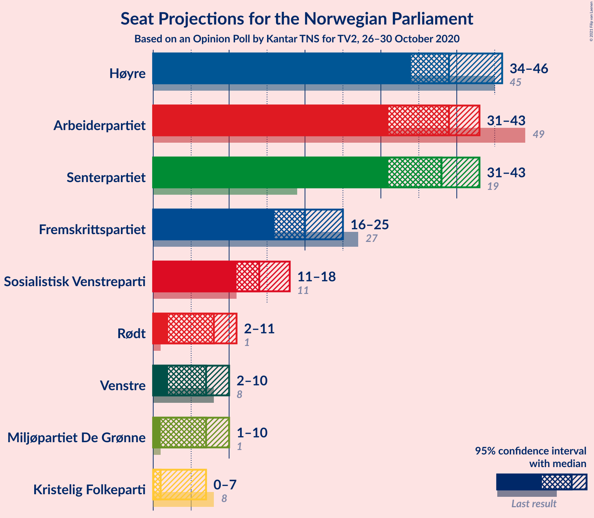

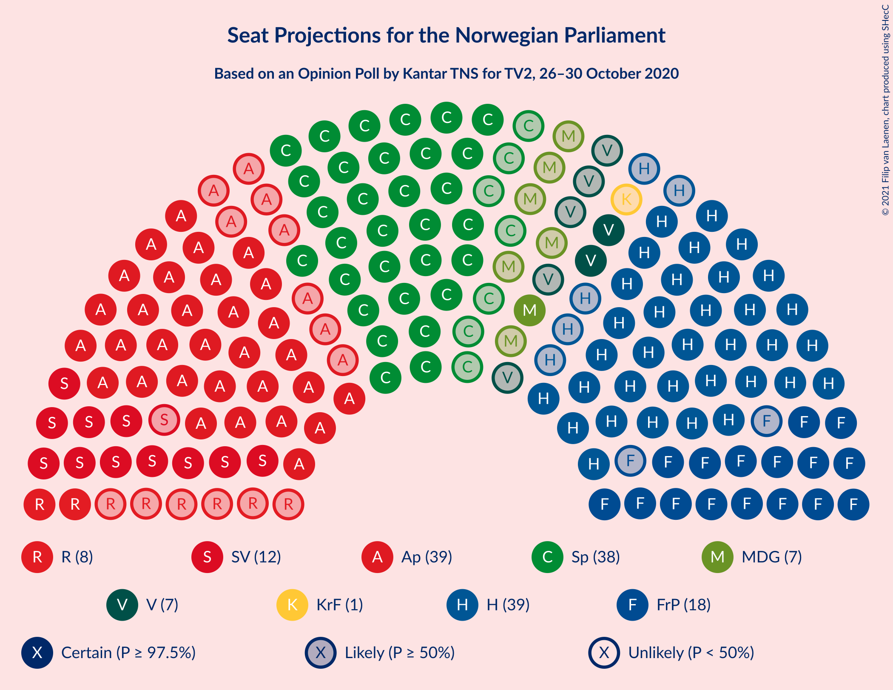

### Confidence Intervals

| Party | Last Result | Median | 80% Confidence Interval | 90% Confidence Interval | 95% Confidence Interval | 99% Confidence Interval |
|:-----:|:-----------:|:------:|:-----------------------:|:-----------------------:|:-----------------------:|:-----------------------:|
| <a href="#høyre">Høyre</a> | 45 | 39 | 35–43 |34–45 |34–46 |32–48 |
| <a href="#arbeiderpartiet">Arbeiderpartiet</a> | 49 | 39 | 34–41 |32–42 |31–43 |30–45 |
| <a href="#senterpartiet">Senterpartiet</a> | 19 | 38 | 33–40 |32–42 |31–43 |30–45 |
| <a href="#fremskrittspartiet">Fremskrittspartiet</a> | 27 | 20 | 18–23 |17–24 |16–25 |15–27 |
| <a href="#sosialistisk-venstreparti">Sosialistisk Venstreparti</a> | 11 | 14 | 12–16 |11–17 |11–18 |10–19 |
| <a href="#rødt">Rødt</a> | 1 | 8 | 7–10 |2–11 |2–11 |2–13 |
| <a href="#venstre">Venstre</a> | 8 | 7 | 2–9 |2–9 |2–10 |2–11 |
| <a href="#miljøpartiet-de-grønne">Miljøpartiet De Grønne</a> | 1 | 7 | 1–8 |1–9 |1–10 |1–10 |
| <a href="#kristelig-folkeparti">Kristelig Folkeparti</a> | 8 | 1 | 1–2 |0–3 |0–7 |0–8 |

### Høyre

*For a full overview of the results for this party, see the [Høyre](party-høyre.html) page.*

| Number of Seats | Probability | Accumulated | Special Marks |
|:---------------:|:-----------:|:-----------:|:-------------:|
| 31 | 0.1% | 100% |  |
| 32 | 0.5% | 99.9% |  |
| 33 | 1.2% | 99.4% |  |
| 34 | 6% | 98% |  |
| 35 | 11% | 92% |  |
| 36 | 8% | 81% |  |
| 37 | 7% | 72% |  |
| 38 | 11% | 65% |  |
| 39 | 11% | 54% | Median |
| 40 | 9% | 43% |  |
| 41 | 9% | 34% |  |
| 42 | 12% | 25% |  |
| 43 | 3% | 13% |  |
| 44 | 2% | 10% |  |
| 45 | 4% | 8% | Last Result |
| 46 | 2% | 4% |  |
| 47 | 1.1% | 2% |  |
| 48 | 0.6% | 0.9% |  |
| 49 | 0.2% | 0.3% |  |
| 50 | 0% | 0.1% |  |
| 51 | 0% | 0% |  |

### Arbeiderpartiet

*For a full overview of the results for this party, see the [Arbeiderpartiet](party-arbeiderpartiet.html) page.*

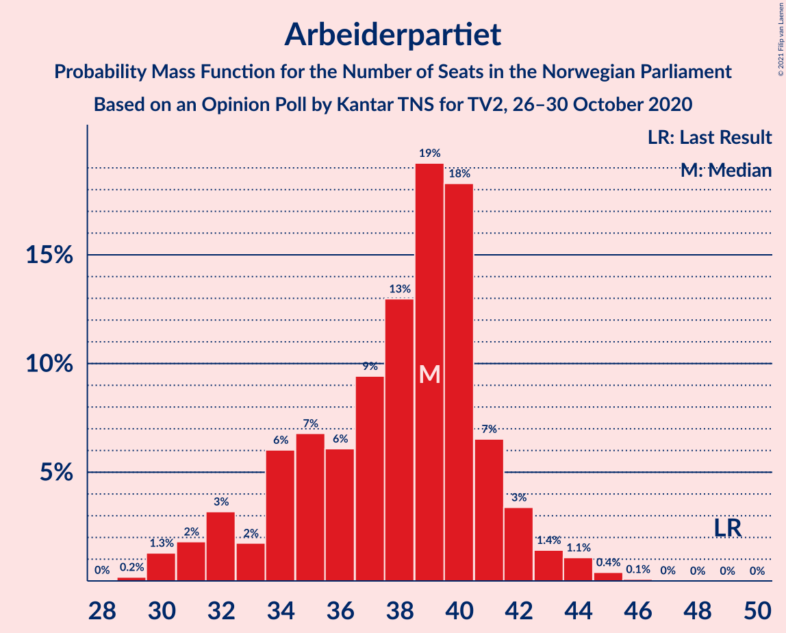

| Number of Seats | Probability | Accumulated | Special Marks |
|:---------------:|:-----------:|:-----------:|:-------------:|
| 28 | 0% | 100% |  |
| 29 | 0.2% | 99.9% |  |
| 30 | 1.3% | 99.8% |  |
| 31 | 2% | 98% |  |
| 32 | 3% | 97% |  |
| 33 | 2% | 93% |  |
| 34 | 6% | 92% |  |
| 35 | 7% | 86% |  |
| 36 | 6% | 79% |  |
| 37 | 9% | 73% |  |
| 38 | 13% | 63% |  |
| 39 | 19% | 50% | Median |
| 40 | 18% | 31% |  |
| 41 | 7% | 13% |  |
| 42 | 3% | 6% |  |
| 43 | 1.4% | 3% |  |
| 44 | 1.1% | 2% |  |
| 45 | 0.4% | 0.5% |  |
| 46 | 0.1% | 0.1% |  |
| 47 | 0% | 0% |  |
| 48 | 0% | 0% |  |
| 49 | 0% | 0% | Last Result |

### Senterpartiet

*For a full overview of the results for this party, see the [Senterpartiet](party-senterpartiet.html) page.*

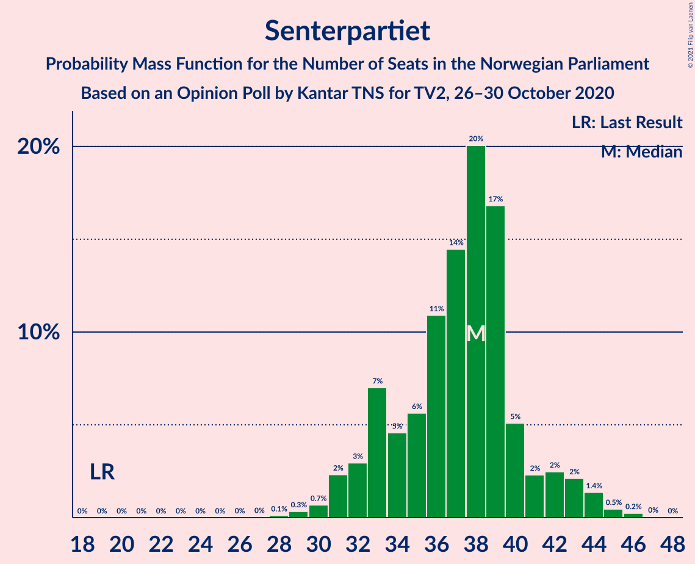

| Number of Seats | Probability | Accumulated | Special Marks |
|:---------------:|:-----------:|:-----------:|:-------------:|
| 19 | 0% | 100% | Last Result |
| 20 | 0% | 100% |  |
| 21 | 0% | 100% |  |
| 22 | 0% | 100% |  |
| 23 | 0% | 100% |  |
| 24 | 0% | 100% |  |
| 25 | 0% | 100% |  |
| 26 | 0% | 100% |  |
| 27 | 0% | 100% |  |
| 28 | 0.1% | 100% |  |
| 29 | 0.3% | 99.8% |  |
| 30 | 0.7% | 99.5% |  |
| 31 | 2% | 98.8% |  |
| 32 | 3% | 97% |  |
| 33 | 7% | 94% |  |
| 34 | 5% | 87% |  |
| 35 | 6% | 82% |  |
| 36 | 11% | 76% |  |
| 37 | 14% | 65% |  |
| 38 | 20% | 51% | Median |
| 39 | 17% | 31% |  |
| 40 | 5% | 14% |  |
| 41 | 2% | 9% |  |
| 42 | 2% | 7% |  |
| 43 | 2% | 4% |  |
| 44 | 1.4% | 2% |  |
| 45 | 0.5% | 0.8% |  |
| 46 | 0.2% | 0.3% |  |
| 47 | 0% | 0.1% |  |
| 48 | 0% | 0% |  |

### Fremskrittspartiet

*For a full overview of the results for this party, see the [Fremskrittspartiet](party-fremskrittspartiet.html) page.*

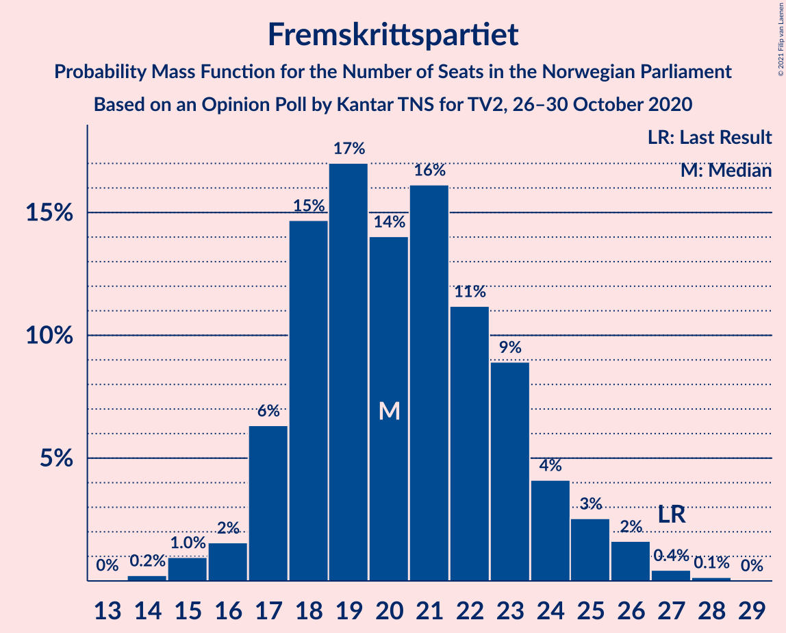

| Number of Seats | Probability | Accumulated | Special Marks |
|:---------------:|:-----------:|:-----------:|:-------------:|
| 13 | 0% | 100% |  |
| 14 | 0.2% | 99.9% |  |
| 15 | 1.0% | 99.7% |  |
| 16 | 2% | 98.8% |  |
| 17 | 6% | 97% |  |
| 18 | 15% | 91% |  |
| 19 | 17% | 76% |  |
| 20 | 14% | 59% | Median |
| 21 | 16% | 45% |  |
| 22 | 11% | 29% |  |
| 23 | 9% | 18% |  |
| 24 | 4% | 9% |  |
| 25 | 3% | 5% |  |
| 26 | 2% | 2% |  |
| 27 | 0.4% | 0.6% | Last Result |
| 28 | 0.1% | 0.2% |  |
| 29 | 0% | 0% |  |

### Sosialistisk Venstreparti

*For a full overview of the results for this party, see the [Sosialistisk Venstreparti](party-sosialistiskvenstreparti.html) page.*

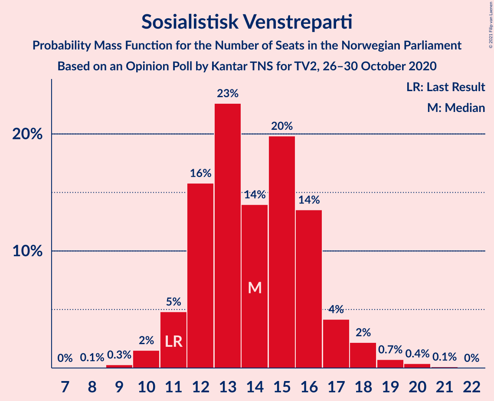

| Number of Seats | Probability | Accumulated | Special Marks |
|:---------------:|:-----------:|:-----------:|:-------------:|
| 8 | 0.1% | 100% |  |
| 9 | 0.3% | 99.9% |  |
| 10 | 2% | 99.7% |  |
| 11 | 5% | 98% | Last Result |
| 12 | 16% | 93% |  |
| 13 | 23% | 78% |  |
| 14 | 14% | 55% | Median |
| 15 | 20% | 41% |  |
| 16 | 14% | 21% |  |
| 17 | 4% | 8% |  |
| 18 | 2% | 3% |  |
| 19 | 0.7% | 1.2% |  |
| 20 | 0.4% | 0.5% |  |
| 21 | 0.1% | 0.1% |  |
| 22 | 0% | 0% |  |

### Rødt

*For a full overview of the results for this party, see the [Rødt](party-rødt.html) page.*

| Number of Seats | Probability | Accumulated | Special Marks |
|:---------------:|:-----------:|:-----------:|:-------------:|
| 1 | 0.1% | 100% | Last Result |
| 2 | 10% | 99.9% |  |
| 3 | 0% | 90% |  |
| 4 | 0% | 90% |  |
| 5 | 0% | 90% |  |
| 6 | 0% | 90% |  |
| 7 | 8% | 90% |  |
| 8 | 37% | 82% | Median |
| 9 | 20% | 45% |  |
| 10 | 17% | 24% |  |
| 11 | 5% | 7% |  |
| 12 | 2% | 2% |  |
| 13 | 0.4% | 0.7% |  |
| 14 | 0.3% | 0.3% |  |
| 15 | 0% | 0% |  |

### Venstre

*For a full overview of the results for this party, see the [Venstre](party-venstre.html) page.*

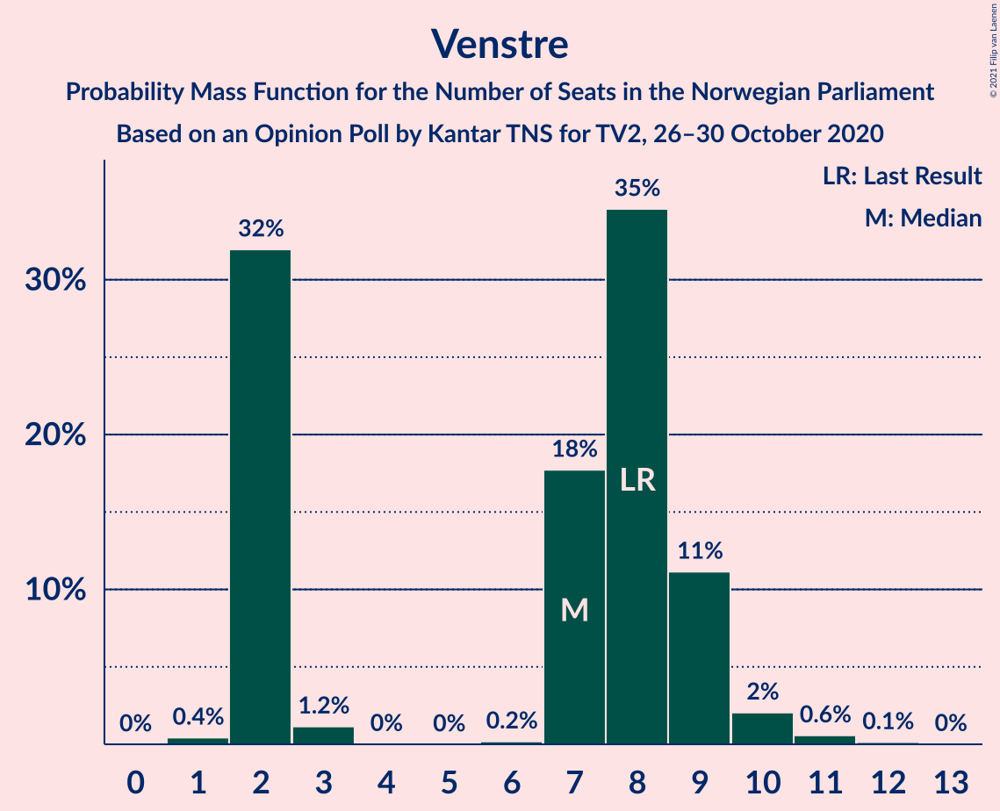

| Number of Seats | Probability | Accumulated | Special Marks |
|:---------------:|:-----------:|:-----------:|:-------------:|
| 1 | 0.4% | 100% |  |
| 2 | 32% | 99.6% |  |
| 3 | 1.2% | 68% |  |
| 4 | 0% | 66% |  |
| 5 | 0% | 66% |  |
| 6 | 0.2% | 66% |  |
| 7 | 18% | 66% | Median |
| 8 | 35% | 49% | Last Result |
| 9 | 11% | 14% |  |
| 10 | 2% | 3% |  |
| 11 | 0.6% | 0.7% |  |
| 12 | 0.1% | 0.2% |  |
| 13 | 0% | 0% |  |

### Miljøpartiet De Grønne

*For a full overview of the results for this party, see the [Miljøpartiet De Grønne](party-miljøpartietdegrønne.html) page.*

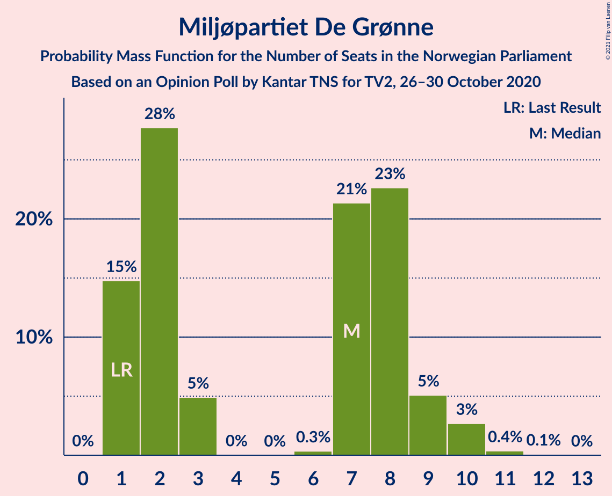

| Number of Seats | Probability | Accumulated | Special Marks |
|:---------------:|:-----------:|:-----------:|:-------------:|
| 1 | 15% | 100% | Last Result |
| 2 | 28% | 85% |  |
| 3 | 5% | 57% |  |
| 4 | 0% | 53% |  |
| 5 | 0% | 53% |  |
| 6 | 0.3% | 53% |  |
| 7 | 21% | 52% | Median |
| 8 | 23% | 31% |  |
| 9 | 5% | 8% |  |
| 10 | 3% | 3% |  |
| 11 | 0.4% | 0.5% |  |
| 12 | 0.1% | 0.1% |  |
| 13 | 0% | 0% |  |

### Kristelig Folkeparti

*For a full overview of the results for this party, see the [Kristelig Folkeparti](party-kristeligfolkeparti.html) page.*

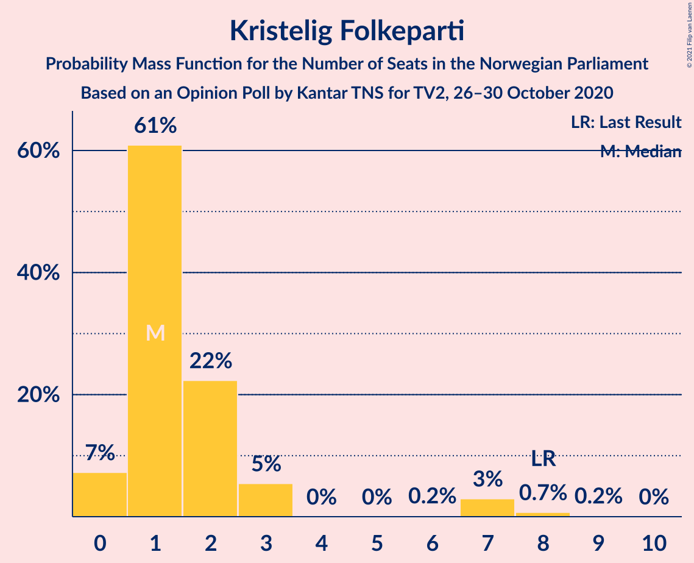

| Number of Seats | Probability | Accumulated | Special Marks |
|:---------------:|:-----------:|:-----------:|:-------------:|
| 0 | 7% | 100% |  |
| 1 | 61% | 93% | Median |
| 2 | 22% | 32% |  |
| 3 | 5% | 10% |  |
| 4 | 0% | 4% |  |
| 5 | 0% | 4% |  |
| 6 | 0.2% | 4% |  |
| 7 | 3% | 4% |  |
| 8 | 0.7% | 0.9% | Last Result |
| 9 | 0.2% | 0.2% |  |
| 10 | 0% | 0% |  |

## Coalitions

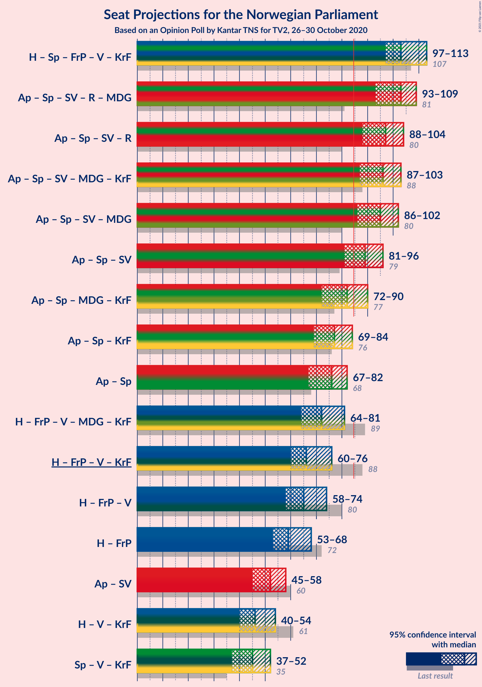

### Confidence Intervals

| Coalition | Last Result | Median | Majority? | 80% Confidence Interval | 90% Confidence Interval | 95% Confidence Interval | 99% Confidence Interval |
|:---------:|:-----------:|:------:|:---------:|:-----------------------:|:-----------------------:|:-----------------------:|:-----------------------:|
| Høyre – Senterpartiet – Fremskrittspartiet – Venstre – Kristelig Folkeparti | 107 | 103 | 100% | 100–110 | 98–112 | 97–113 | 95–115 |
| Arbeiderpartiet – Senterpartiet – Sosialistisk Venstreparti – Rødt – Miljøpartiet De Grønne | 81 | 103 | 100% | 96–106 | 95–108 | 93–109 | 91–111 |
| Arbeiderpartiet – Senterpartiet – Sosialistisk Venstreparti – Rødt | 80 | 97 | 99.9% | 92–103 | 90–104 | 88–104 | 86–106 |
| Arbeiderpartiet – Senterpartiet – Sosialistisk Venstreparti – Miljøpartiet De Grønne – Kristelig Folkeparti | 88 | 96 | 99.6% | 89–100 | 88–102 | 87–103 | 85–106 |
| Arbeiderpartiet – Senterpartiet – Sosialistisk Venstreparti – Miljøpartiet De Grønne | 80 | 95 | 98.6% | 88–98 | 87–100 | 86–102 | 83–104 |
| Arbeiderpartiet – Senterpartiet – Sosialistisk Venstreparti | 79 | 89 | 89% | 84–94 | 83–95 | 81–96 | 79–98 |
| Arbeiderpartiet – Senterpartiet – Miljøpartiet De Grønne – Kristelig Folkeparti | 77 | 82 | 26% | 75–86 | 74–88 | 72–90 | 70–93 |
| Arbeiderpartiet – Senterpartiet – Kristelig Folkeparti | 76 | 77 | 2% | 72–81 | 70–82 | 69–84 | 67–85 |
| Arbeiderpartiet – Senterpartiet | 68 | 76 | 0.1% | 71–79 | 69–80 | 67–82 | 65–83 |
| Høyre – Fremskrittspartiet – Venstre – Miljøpartiet De Grønne – Kristelig Folkeparti | 89 | 72 | 0.1% | 66–77 | 65–79 | 64–81 | 62–82 |
| Høyre – Fremskrittspartiet – Venstre – Kristelig Folkeparti | 88 | 66 | 0% | 63–73 | 61–74 | 60–76 | 57–78 |
| Høyre – Fremskrittspartiet – Venstre | 80 | 65 | 0% | 61–71 | 60–72 | 58–74 | 55–76 |
| Høyre – Fremskrittspartiet | 72 | 59 | 0% | 54–65 | 54–67 | 53–68 | 50–72 |
| Arbeiderpartiet – Sosialistisk Venstreparti | 60 | 52 | 0% | 47–56 | 46–57 | 45–58 | 42–59 |
| Høyre – Venstre – Kristelig Folkeparti | 61 | 46 | 0% | 42–52 | 41–52 | 40–54 | 38–56 |
| Senterpartiet – Venstre – Kristelig Folkeparti | 35 | 45 | 0% | 40–49 | 38–50 | 37–52 | 35–55 |

### Høyre – Senterpartiet – Fremskrittspartiet – Venstre – Kristelig Folkeparti

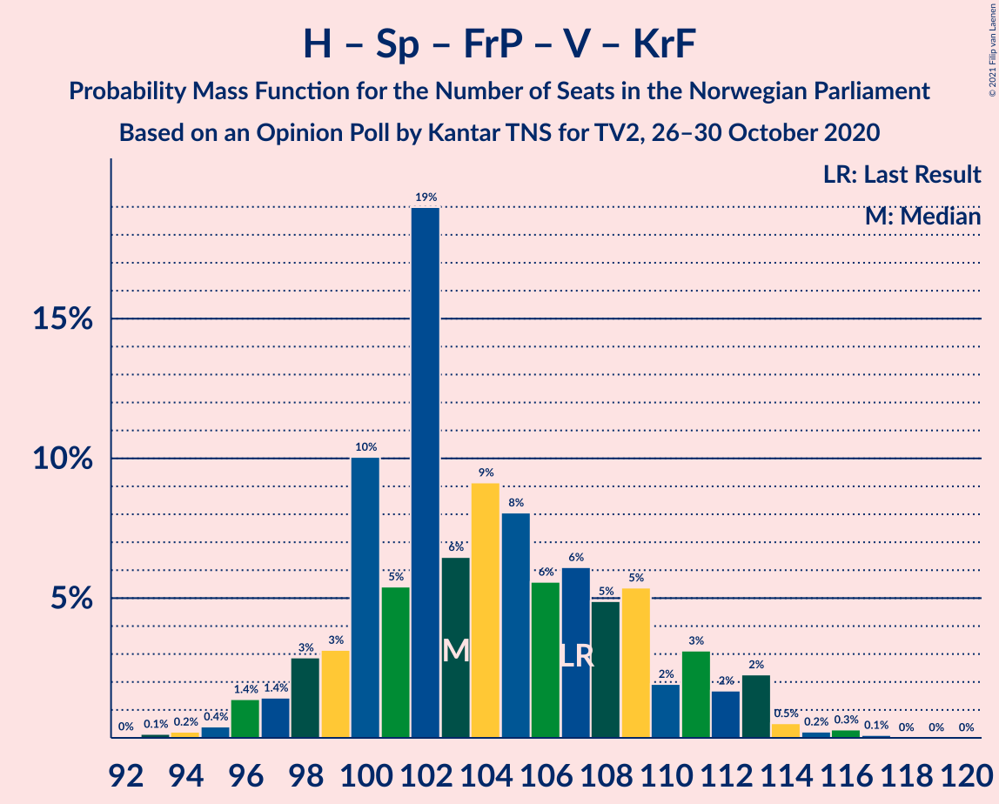

| Number of Seats | Probability | Accumulated | Special Marks |
|:---------------:|:-----------:|:-----------:|:-------------:|
| 92 | 0% | 100% |  |
| 93 | 0.1% | 99.9% |  |
| 94 | 0.2% | 99.8% |  |
| 95 | 0.4% | 99.6% |  |
| 96 | 1.4% | 99.1% |  |
| 97 | 1.4% | 98% |  |
| 98 | 3% | 96% |  |
| 99 | 3% | 93% |  |
| 100 | 10% | 90% |  |
| 101 | 5% | 80% |  |
| 102 | 19% | 75% |  |
| 103 | 6% | 56% |  |
| 104 | 9% | 49% |  |
| 105 | 8% | 40% | Median |
| 106 | 6% | 32% |  |
| 107 | 6% | 27% | Last Result |
| 108 | 5% | 20% |  |
| 109 | 5% | 16% |  |
| 110 | 2% | 10% |  |
| 111 | 3% | 8% |  |
| 112 | 2% | 5% |  |
| 113 | 2% | 3% |  |
| 114 | 0.5% | 1.2% |  |
| 115 | 0.2% | 0.7% |  |
| 116 | 0.3% | 0.5% |  |
| 117 | 0.1% | 0.2% |  |
| 118 | 0% | 0.1% |  |
| 119 | 0% | 0% |  |

### Arbeiderpartiet – Senterpartiet – Sosialistisk Venstreparti – Rødt – Miljøpartiet De Grønne

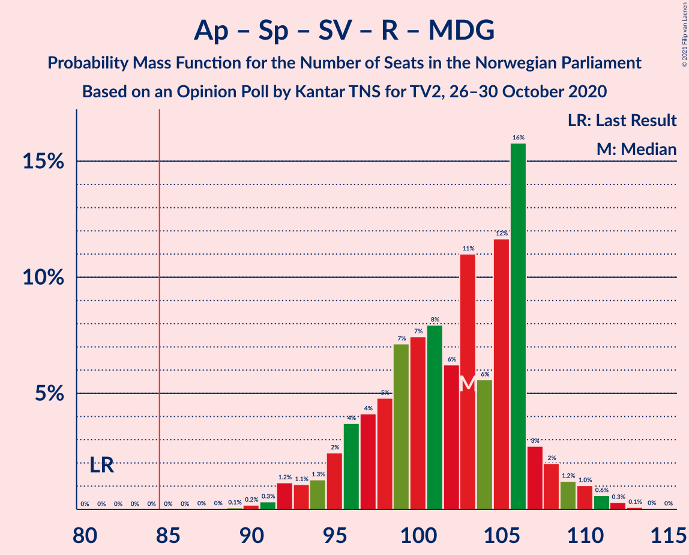

| Number of Seats | Probability | Accumulated | Special Marks |
|:---------------:|:-----------:|:-----------:|:-------------:|
| 81 | 0% | 100% | Last Result |
| 82 | 0% | 100% |  |
| 83 | 0% | 100% |  |
| 84 | 0% | 100% |  |
| 85 | 0% | 100% | Majority |
| 86 | 0% | 100% |  |
| 87 | 0% | 100% |  |
| 88 | 0% | 100% |  |
| 89 | 0.1% | 99.9% |  |
| 90 | 0.2% | 99.9% |  |
| 91 | 0.3% | 99.7% |  |
| 92 | 1.2% | 99.3% |  |
| 93 | 1.1% | 98% |  |
| 94 | 1.3% | 97% |  |
| 95 | 2% | 96% |  |
| 96 | 4% | 93% |  |
| 97 | 4% | 90% |  |
| 98 | 5% | 86% |  |
| 99 | 7% | 81% |  |
| 100 | 7% | 74% |  |
| 101 | 8% | 66% |  |
| 102 | 6% | 58% |  |
| 103 | 11% | 52% |  |
| 104 | 6% | 41% |  |
| 105 | 12% | 35% |  |
| 106 | 16% | 24% | Median |
| 107 | 3% | 8% |  |
| 108 | 2% | 5% |  |
| 109 | 1.2% | 3% |  |
| 110 | 1.0% | 2% |  |
| 111 | 0.6% | 1.1% |  |
| 112 | 0.3% | 0.5% |  |
| 113 | 0.1% | 0.2% |  |
| 114 | 0% | 0.1% |  |
| 115 | 0% | 0% |  |

### Arbeiderpartiet – Senterpartiet – Sosialistisk Venstreparti – Rødt

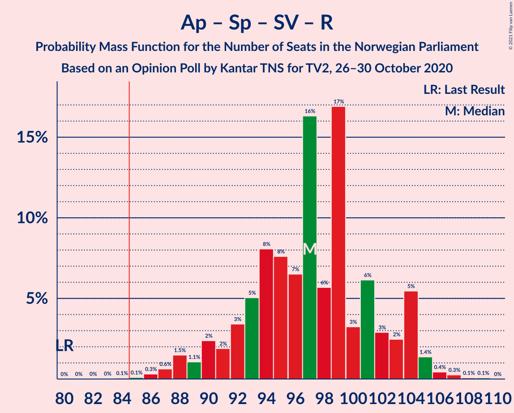

| Number of Seats | Probability | Accumulated | Special Marks |
|:---------------:|:-----------:|:-----------:|:-------------:|
| 80 | 0% | 100% | Last Result |
| 81 | 0% | 100% |  |
| 82 | 0% | 100% |  |
| 83 | 0% | 100% |  |
| 84 | 0.1% | 99.9% |  |
| 85 | 0.1% | 99.9% | Majority |
| 86 | 0.3% | 99.8% |  |
| 87 | 0.6% | 99.5% |  |
| 88 | 1.5% | 98.8% |  |
| 89 | 1.1% | 97% |  |
| 90 | 2% | 96% |  |
| 91 | 2% | 94% |  |
| 92 | 3% | 92% |  |
| 93 | 5% | 89% |  |
| 94 | 8% | 84% |  |
| 95 | 8% | 75% |  |
| 96 | 7% | 68% |  |
| 97 | 16% | 61% |  |
| 98 | 6% | 45% |  |
| 99 | 17% | 39% | Median |
| 100 | 3% | 22% |  |
| 101 | 6% | 19% |  |
| 102 | 3% | 13% |  |
| 103 | 2% | 10% |  |
| 104 | 5% | 8% |  |
| 105 | 1.4% | 2% |  |
| 106 | 0.4% | 0.9% |  |
| 107 | 0.3% | 0.4% |  |
| 108 | 0.1% | 0.2% |  |
| 109 | 0.1% | 0.1% |  |
| 110 | 0% | 0% |  |

### Arbeiderpartiet – Senterpartiet – Sosialistisk Venstreparti – Miljøpartiet De Grønne – Kristelig Folkeparti

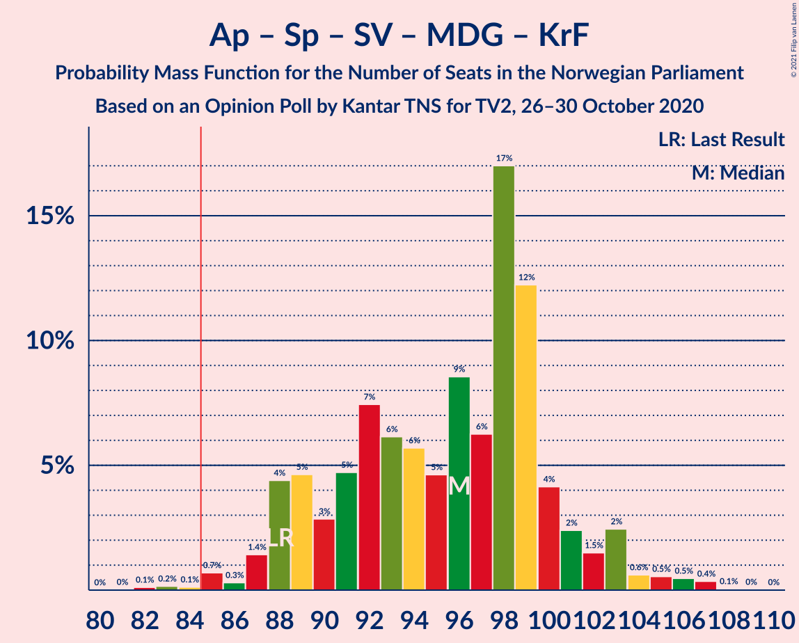

| Number of Seats | Probability | Accumulated | Special Marks |
|:---------------:|:-----------:|:-----------:|:-------------:|
| 82 | 0.1% | 100% |  |
| 83 | 0.2% | 99.9% |  |
| 84 | 0.1% | 99.7% |  |
| 85 | 0.7% | 99.6% | Majority |
| 86 | 0.3% | 98.9% |  |
| 87 | 1.4% | 98.6% |  |
| 88 | 4% | 97% | Last Result |
| 89 | 5% | 93% |  |
| 90 | 3% | 88% |  |
| 91 | 5% | 85% |  |
| 92 | 7% | 81% |  |
| 93 | 6% | 73% |  |
| 94 | 6% | 67% |  |
| 95 | 5% | 61% |  |
| 96 | 9% | 57% |  |
| 97 | 6% | 48% |  |
| 98 | 17% | 42% |  |
| 99 | 12% | 25% | Median |
| 100 | 4% | 13% |  |
| 101 | 2% | 8% |  |
| 102 | 1.5% | 6% |  |
| 103 | 2% | 5% |  |
| 104 | 0.6% | 2% |  |
| 105 | 0.5% | 1.5% |  |
| 106 | 0.5% | 0.9% |  |
| 107 | 0.4% | 0.5% |  |
| 108 | 0.1% | 0.1% |  |
| 109 | 0% | 0.1% |  |
| 110 | 0% | 0% |  |

### Arbeiderpartiet – Senterpartiet – Sosialistisk Venstreparti – Miljøpartiet De Grønne

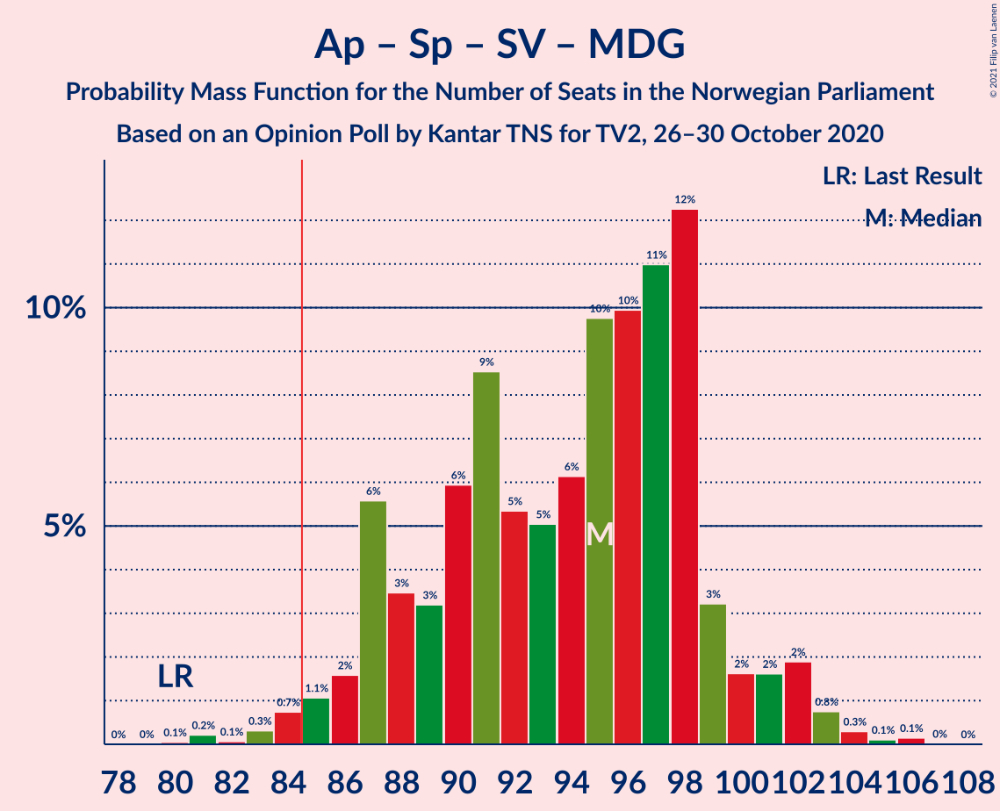

| Number of Seats | Probability | Accumulated | Special Marks |
|:---------------:|:-----------:|:-----------:|:-------------:|
| 80 | 0.1% | 100% | Last Result |
| 81 | 0.2% | 99.9% |  |
| 82 | 0.1% | 99.7% |  |
| 83 | 0.3% | 99.7% |  |
| 84 | 0.7% | 99.3% |  |
| 85 | 1.1% | 98.6% | Majority |
| 86 | 2% | 98% |  |
| 87 | 6% | 96% |  |
| 88 | 3% | 90% |  |
| 89 | 3% | 87% |  |
| 90 | 6% | 84% |  |
| 91 | 9% | 78% |  |
| 92 | 5% | 69% |  |
| 93 | 5% | 64% |  |
| 94 | 6% | 59% |  |
| 95 | 10% | 53% |  |
| 96 | 10% | 43% |  |
| 97 | 11% | 33% |  |
| 98 | 12% | 22% | Median |
| 99 | 3% | 10% |  |
| 100 | 2% | 6% |  |
| 101 | 2% | 5% |  |
| 102 | 2% | 3% |  |
| 103 | 0.8% | 1.4% |  |
| 104 | 0.3% | 0.6% |  |
| 105 | 0.1% | 0.3% |  |
| 106 | 0.1% | 0.2% |  |
| 107 | 0% | 0% |  |

### Arbeiderpartiet – Senterpartiet – Sosialistisk Venstreparti

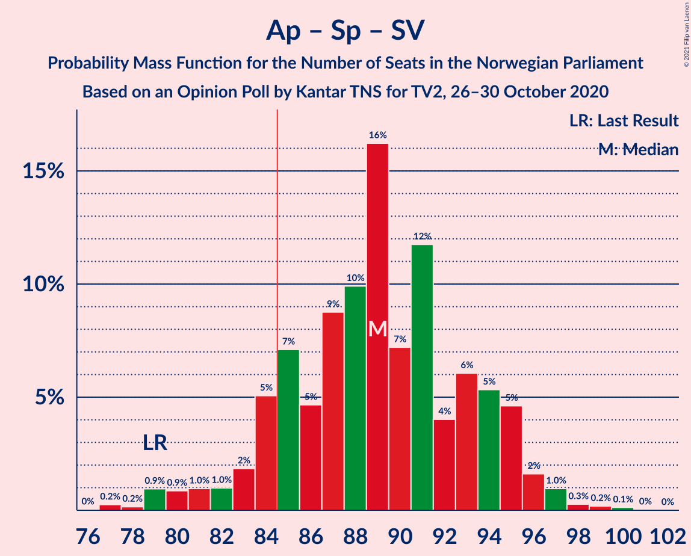

| Number of Seats | Probability | Accumulated | Special Marks |
|:---------------:|:-----------:|:-----------:|:-------------:|
| 76 | 0% | 100% |  |
| 77 | 0.2% | 99.9% |  |
| 78 | 0.2% | 99.7% |  |
| 79 | 0.9% | 99.5% | Last Result |
| 80 | 0.9% | 98.6% |  |
| 81 | 1.0% | 98% |  |
| 82 | 1.0% | 97% |  |
| 83 | 2% | 96% |  |
| 84 | 5% | 94% |  |
| 85 | 7% | 89% | Majority |
| 86 | 5% | 82% |  |
| 87 | 9% | 77% |  |
| 88 | 10% | 68% |  |
| 89 | 16% | 58% |  |
| 90 | 7% | 42% |  |
| 91 | 12% | 35% | Median |
| 92 | 4% | 23% |  |
| 93 | 6% | 19% |  |
| 94 | 5% | 13% |  |
| 95 | 5% | 8% |  |
| 96 | 2% | 3% |  |
| 97 | 1.0% | 2% |  |
| 98 | 0.3% | 0.6% |  |
| 99 | 0.2% | 0.4% |  |
| 100 | 0.1% | 0.2% |  |
| 101 | 0% | 0.1% |  |
| 102 | 0% | 0% |  |

### Arbeiderpartiet – Senterpartiet – Miljøpartiet De Grønne – Kristelig Folkeparti

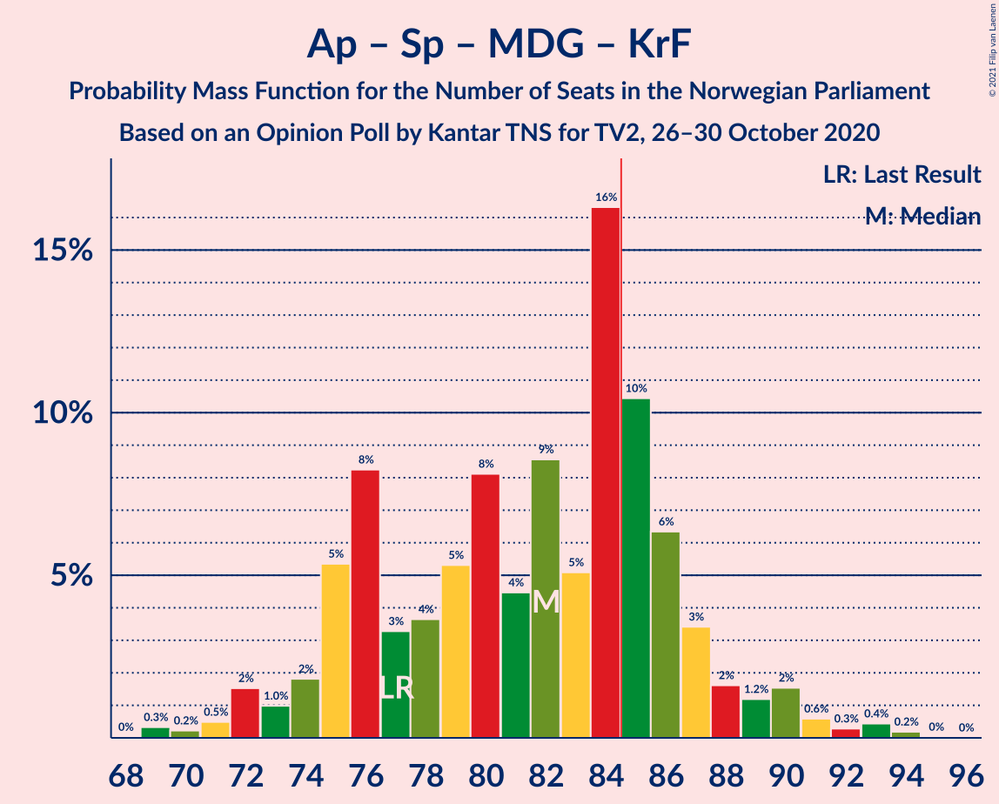

| Number of Seats | Probability | Accumulated | Special Marks |
|:---------------:|:-----------:|:-----------:|:-------------:|
| 68 | 0% | 100% |  |
| 69 | 0.3% | 99.9% |  |
| 70 | 0.2% | 99.6% |  |
| 71 | 0.5% | 99.4% |  |
| 72 | 2% | 98.9% |  |
| 73 | 1.0% | 97% |  |
| 74 | 2% | 96% |  |
| 75 | 5% | 95% |  |
| 76 | 8% | 89% |  |
| 77 | 3% | 81% | Last Result |
| 78 | 4% | 78% |  |
| 79 | 5% | 74% |  |
| 80 | 8% | 69% |  |
| 81 | 4% | 61% |  |
| 82 | 9% | 56% |  |
| 83 | 5% | 48% |  |
| 84 | 16% | 42% |  |
| 85 | 10% | 26% | Median, Majority |
| 86 | 6% | 16% |  |
| 87 | 3% | 9% |  |
| 88 | 2% | 6% |  |
| 89 | 1.2% | 4% |  |
| 90 | 2% | 3% |  |
| 91 | 0.6% | 2% |  |
| 92 | 0.3% | 1.0% |  |
| 93 | 0.4% | 0.7% |  |
| 94 | 0.2% | 0.3% |  |
| 95 | 0% | 0.1% |  |
| 96 | 0% | 0% |  |

### Arbeiderpartiet – Senterpartiet – Kristelig Folkeparti

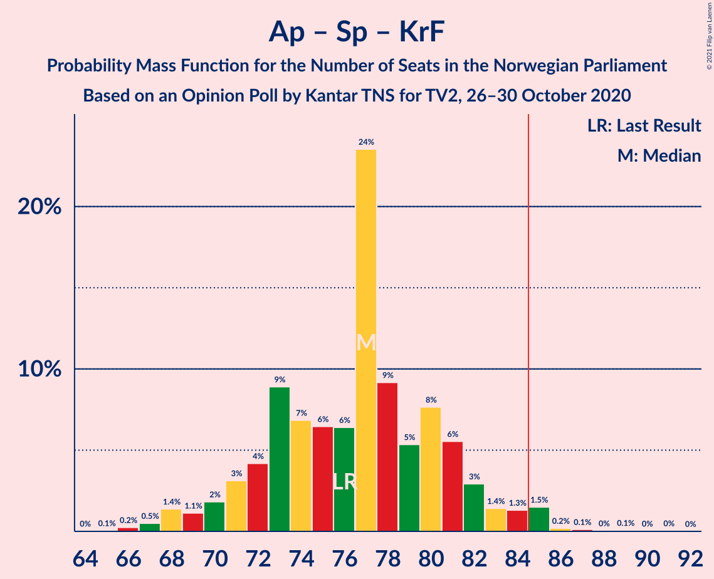

| Number of Seats | Probability | Accumulated | Special Marks |
|:---------------:|:-----------:|:-----------:|:-------------:|
| 64 | 0% | 100% |  |
| 65 | 0.1% | 99.9% |  |
| 66 | 0.2% | 99.9% |  |
| 67 | 0.5% | 99.6% |  |
| 68 | 1.4% | 99.1% |  |
| 69 | 1.1% | 98% |  |
| 70 | 2% | 97% |  |
| 71 | 3% | 95% |  |
| 72 | 4% | 92% |  |
| 73 | 9% | 88% |  |
| 74 | 7% | 79% |  |
| 75 | 6% | 72% |  |
| 76 | 6% | 65% | Last Result |
| 77 | 24% | 59% |  |
| 78 | 9% | 35% | Median |
| 79 | 5% | 26% |  |
| 80 | 8% | 21% |  |
| 81 | 6% | 13% |  |
| 82 | 3% | 8% |  |
| 83 | 1.4% | 5% |  |
| 84 | 1.3% | 3% |  |
| 85 | 1.5% | 2% | Majority |
| 86 | 0.2% | 0.5% |  |
| 87 | 0.1% | 0.3% |  |
| 88 | 0% | 0.2% |  |
| 89 | 0.1% | 0.1% |  |
| 90 | 0% | 0.1% |  |
| 91 | 0% | 0% |  |

### Arbeiderpartiet – Senterpartiet

| Number of Seats | Probability | Accumulated | Special Marks |
|:---------------:|:-----------:|:-----------:|:-------------:|
| 63 | 0% | 100% |  |
| 64 | 0.2% | 99.9% |  |
| 65 | 0.6% | 99.8% |  |
| 66 | 0.6% | 99.2% |  |
| 67 | 1.3% | 98.6% |  |
| 68 | 1.3% | 97% | Last Result |
| 69 | 2% | 96% |  |
| 70 | 4% | 94% |  |
| 71 | 8% | 90% |  |
| 72 | 5% | 82% |  |
| 73 | 6% | 77% |  |
| 74 | 7% | 70% |  |
| 75 | 8% | 63% |  |
| 76 | 27% | 55% |  |
| 77 | 4% | 28% | Median |
| 78 | 9% | 24% |  |
| 79 | 8% | 15% |  |
| 80 | 3% | 7% |  |
| 81 | 2% | 4% |  |
| 82 | 1.4% | 3% |  |
| 83 | 1.0% | 1.5% |  |
| 84 | 0.3% | 0.5% |  |
| 85 | 0.1% | 0.1% | Majority |
| 86 | 0% | 0.1% |  |
| 87 | 0% | 0% |  |

### Høyre – Fremskrittspartiet – Venstre – Miljøpartiet De Grønne – Kristelig Folkeparti

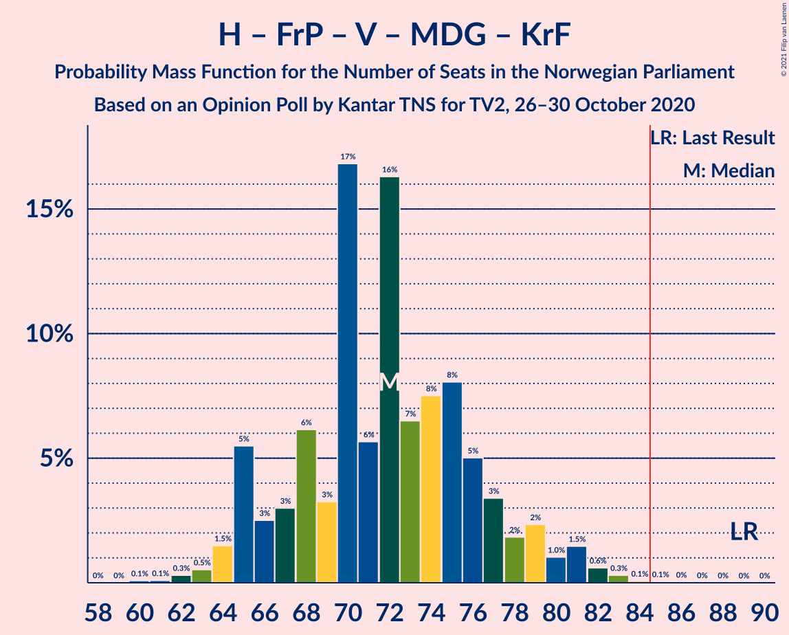

| Number of Seats | Probability | Accumulated | Special Marks |
|:---------------:|:-----------:|:-----------:|:-------------:|
| 60 | 0.1% | 100% |  |
| 61 | 0.1% | 99.9% |  |
| 62 | 0.3% | 99.8% |  |
| 63 | 0.5% | 99.5% |  |
| 64 | 1.5% | 99.0% |  |
| 65 | 5% | 97% |  |
| 66 | 3% | 92% |  |
| 67 | 3% | 89% |  |
| 68 | 6% | 86% |  |
| 69 | 3% | 80% |  |
| 70 | 17% | 77% |  |
| 71 | 6% | 60% |  |
| 72 | 16% | 55% |  |
| 73 | 7% | 38% |  |
| 74 | 8% | 32% | Median |
| 75 | 8% | 24% |  |
| 76 | 5% | 16% |  |
| 77 | 3% | 11% |  |
| 78 | 2% | 8% |  |
| 79 | 2% | 6% |  |
| 80 | 1.0% | 4% |  |
| 81 | 1.5% | 3% |  |
| 82 | 0.6% | 1.1% |  |
| 83 | 0.3% | 0.5% |  |
| 84 | 0.1% | 0.2% |  |
| 85 | 0.1% | 0.1% | Majority |
| 86 | 0% | 0.1% |  |
| 87 | 0% | 0% |  |
| 88 | 0% | 0% |  |
| 89 | 0% | 0% | Last Result |

### Høyre – Fremskrittspartiet – Venstre – Kristelig Folkeparti

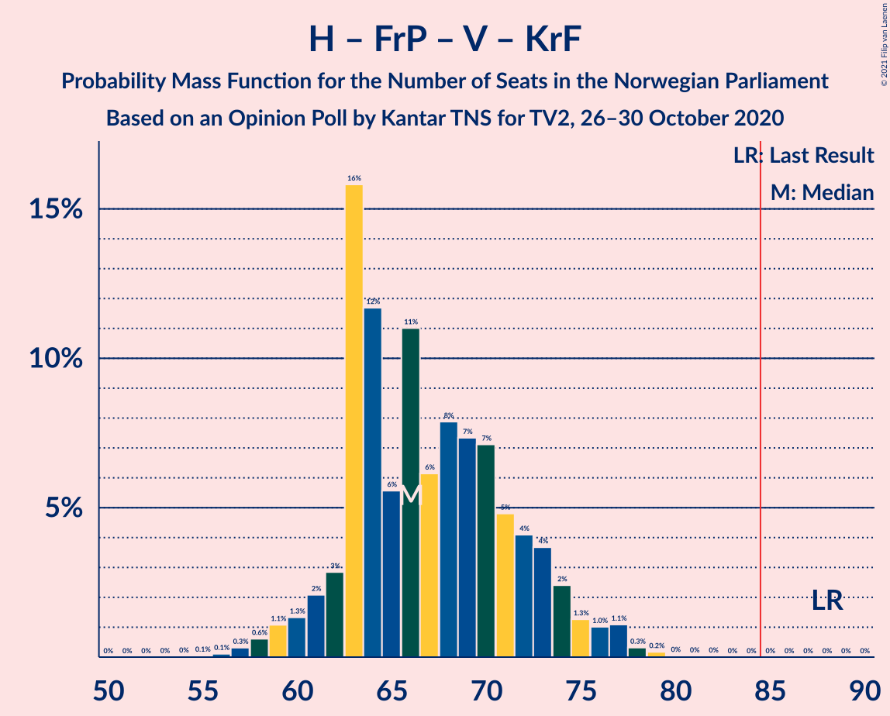

| Number of Seats | Probability | Accumulated | Special Marks |
|:---------------:|:-----------:|:-----------:|:-------------:|
| 55 | 0.1% | 100% |  |
| 56 | 0.1% | 99.9% |  |
| 57 | 0.3% | 99.8% |  |
| 58 | 0.6% | 99.5% |  |
| 59 | 1.1% | 98.9% |  |
| 60 | 1.3% | 98% |  |
| 61 | 2% | 96% |  |
| 62 | 3% | 94% |  |
| 63 | 16% | 92% |  |
| 64 | 12% | 76% |  |
| 65 | 6% | 64% |  |
| 66 | 11% | 58% |  |
| 67 | 6% | 47% | Median |
| 68 | 8% | 41% |  |
| 69 | 7% | 33% |  |
| 70 | 7% | 26% |  |
| 71 | 5% | 19% |  |
| 72 | 4% | 14% |  |
| 73 | 4% | 10% |  |
| 74 | 2% | 6% |  |
| 75 | 1.3% | 4% |  |
| 76 | 1.0% | 3% |  |
| 77 | 1.1% | 2% |  |
| 78 | 0.3% | 0.6% |  |
| 79 | 0.2% | 0.3% |  |
| 80 | 0% | 0.1% |  |
| 81 | 0% | 0.1% |  |
| 82 | 0% | 0% |  |
| 83 | 0% | 0% |  |
| 84 | 0% | 0% |  |
| 85 | 0% | 0% | Majority |
| 86 | 0% | 0% |  |
| 87 | 0% | 0% |  |
| 88 | 0% | 0% | Last Result |

### Høyre – Fremskrittspartiet – Venstre

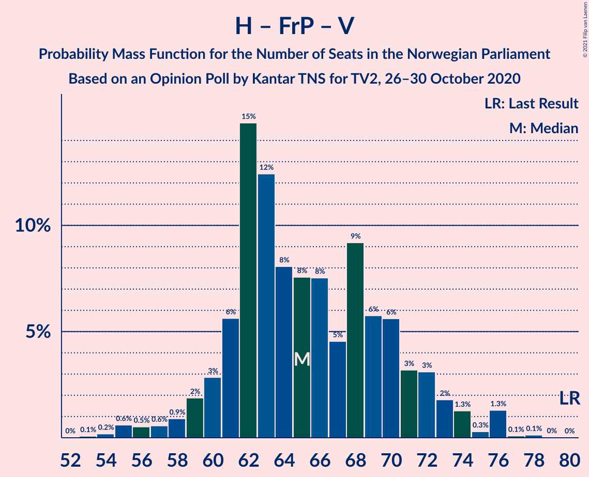

| Number of Seats | Probability | Accumulated | Special Marks |
|:---------------:|:-----------:|:-----------:|:-------------:|
| 53 | 0.1% | 100% |  |
| 54 | 0.2% | 99.9% |  |
| 55 | 0.6% | 99.7% |  |
| 56 | 0.5% | 99.1% |  |
| 57 | 0.6% | 98.6% |  |
| 58 | 0.9% | 98% |  |
| 59 | 2% | 97% |  |
| 60 | 3% | 95% |  |
| 61 | 6% | 92% |  |
| 62 | 15% | 87% |  |
| 63 | 12% | 72% |  |
| 64 | 8% | 60% |  |
| 65 | 8% | 51% |  |
| 66 | 8% | 44% | Median |
| 67 | 5% | 36% |  |
| 68 | 9% | 32% |  |
| 69 | 6% | 23% |  |
| 70 | 6% | 17% |  |
| 71 | 3% | 11% |  |
| 72 | 3% | 8% |  |
| 73 | 2% | 5% |  |
| 74 | 1.3% | 3% |  |
| 75 | 0.3% | 2% |  |
| 76 | 1.3% | 2% |  |
| 77 | 0.1% | 0.3% |  |
| 78 | 0.1% | 0.2% |  |
| 79 | 0% | 0.1% |  |
| 80 | 0% | 0% | Last Result |

### Høyre – Fremskrittspartiet

| Number of Seats | Probability | Accumulated | Special Marks |
|:---------------:|:-----------:|:-----------:|:-------------:|
| 48 | 0.1% | 100% |  |
| 49 | 0.3% | 99.9% |  |
| 50 | 0.2% | 99.6% |  |
| 51 | 0.4% | 99.4% |  |
| 52 | 1.4% | 99.0% |  |
| 53 | 2% | 98% |  |
| 54 | 14% | 96% |  |
| 55 | 4% | 82% |  |
| 56 | 8% | 78% |  |
| 57 | 6% | 70% |  |
| 58 | 9% | 63% |  |
| 59 | 6% | 54% | Median |
| 60 | 8% | 48% |  |
| 61 | 8% | 41% |  |
| 62 | 12% | 33% |  |
| 63 | 6% | 21% |  |
| 64 | 2% | 15% |  |
| 65 | 4% | 13% |  |
| 66 | 3% | 9% |  |
| 67 | 1.5% | 6% |  |
| 68 | 3% | 5% |  |
| 69 | 1.0% | 2% |  |
| 70 | 0.5% | 1.2% |  |
| 71 | 0.1% | 0.8% |  |
| 72 | 0.5% | 0.7% | Last Result |
| 73 | 0.1% | 0.1% |  |
| 74 | 0% | 0.1% |  |
| 75 | 0% | 0% |  |

### Arbeiderpartiet – Sosialistisk Venstreparti

| Number of Seats | Probability | Accumulated | Special Marks |
|:---------------:|:-----------:|:-----------:|:-------------:|
| 40 | 0.1% | 100% |  |
| 41 | 0.1% | 99.9% |  |
| 42 | 0.5% | 99.8% |  |
| 43 | 0.5% | 99.3% |  |
| 44 | 1.2% | 98.8% |  |
| 45 | 2% | 98% |  |
| 46 | 4% | 96% |  |
| 47 | 4% | 92% |  |
| 48 | 6% | 88% |  |
| 49 | 5% | 83% |  |
| 50 | 9% | 78% |  |
| 51 | 12% | 69% |  |
| 52 | 13% | 57% |  |
| 53 | 7% | 43% | Median |
| 54 | 14% | 36% |  |
| 55 | 8% | 22% |  |
| 56 | 7% | 14% |  |
| 57 | 4% | 7% |  |
| 58 | 2% | 3% |  |
| 59 | 0.9% | 1.3% |  |
| 60 | 0.2% | 0.4% | Last Result |
| 61 | 0.1% | 0.2% |  |
| 62 | 0% | 0.1% |  |
| 63 | 0% | 0.1% |  |
| 64 | 0% | 0% |  |

### Høyre – Venstre – Kristelig Folkeparti

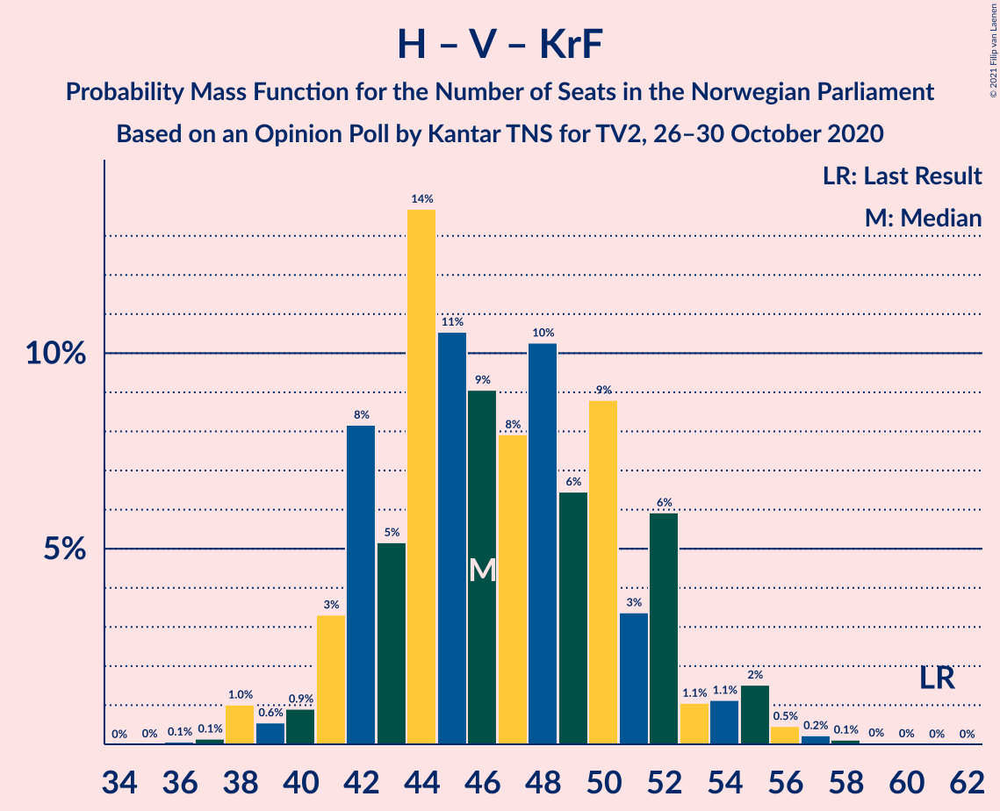

| Number of Seats | Probability | Accumulated | Special Marks |
|:---------------:|:-----------:|:-----------:|:-------------:|
| 36 | 0.1% | 100% |  |
| 37 | 0.1% | 99.9% |  |
| 38 | 1.0% | 99.8% |  |
| 39 | 0.6% | 98.8% |  |
| 40 | 0.9% | 98% |  |
| 41 | 3% | 97% |  |
| 42 | 8% | 94% |  |
| 43 | 5% | 86% |  |
| 44 | 14% | 81% |  |
| 45 | 11% | 67% |  |
| 46 | 9% | 56% |  |
| 47 | 8% | 47% | Median |
| 48 | 10% | 39% |  |
| 49 | 6% | 29% |  |
| 50 | 9% | 23% |  |
| 51 | 3% | 14% |  |
| 52 | 6% | 11% |  |
| 53 | 1.1% | 5% |  |
| 54 | 1.1% | 4% |  |
| 55 | 2% | 2% |  |
| 56 | 0.5% | 0.9% |  |
| 57 | 0.2% | 0.4% |  |
| 58 | 0.1% | 0.2% |  |
| 59 | 0% | 0.1% |  |
| 60 | 0% | 0% |  |
| 61 | 0% | 0% | Last Result |

### Senterpartiet – Venstre – Kristelig Folkeparti

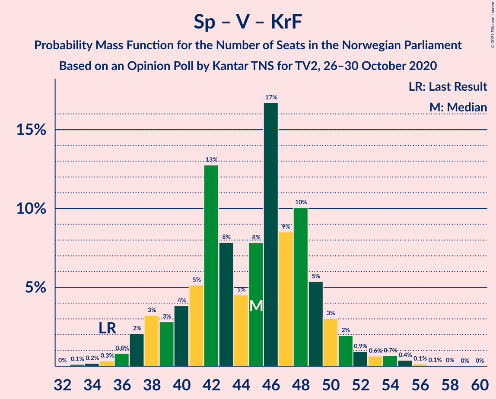

| Number of Seats | Probability | Accumulated | Special Marks |
|:---------------:|:-----------:|:-----------:|:-------------:|
| 33 | 0.1% | 100% |  |
| 34 | 0.2% | 99.8% |  |
| 35 | 0.3% | 99.7% | Last Result |
| 36 | 0.8% | 99.3% |  |
| 37 | 2% | 98.5% |  |
| 38 | 3% | 96% |  |
| 39 | 3% | 93% |  |
| 40 | 4% | 90% |  |
| 41 | 5% | 87% |  |
| 42 | 13% | 81% |  |
| 43 | 8% | 69% |  |
| 44 | 5% | 61% |  |
| 45 | 8% | 56% |  |
| 46 | 17% | 48% | Median |
| 47 | 9% | 32% |  |
| 48 | 10% | 23% |  |
| 49 | 5% | 13% |  |
| 50 | 3% | 8% |  |
| 51 | 2% | 5% |  |
| 52 | 0.9% | 3% |  |
| 53 | 0.6% | 2% |  |
| 54 | 0.7% | 1.3% |  |
| 55 | 0.4% | 0.6% |  |
| 56 | 0.1% | 0.3% |  |
| 57 | 0.1% | 0.1% |  |
| 58 | 0% | 0.1% |  |
| 59 | 0% | 0% |  |

## Technical Information

### Opinion Poll

+ **Polling firm:** Kantar TNS
+ **Commissioner(s):** TV2
+ **Fieldwork period:** 26–30 October 2020

### Calculations

+ **Sample size:** 781
+ **Simulations done:** 1,048,576
+ **Error estimate:** 1.54%

