# Opinion Poll by Sentio for Amedia and Nettavisen, 27 October–3 November 2020

<a href="#voting-intentions">Voting Intentions</a> | <a href="#seats">Seats</a> | <a href="#coalitions">Coalitions</a> | <a href="#technical-information">Technical Information</a>

## Voting Intentions

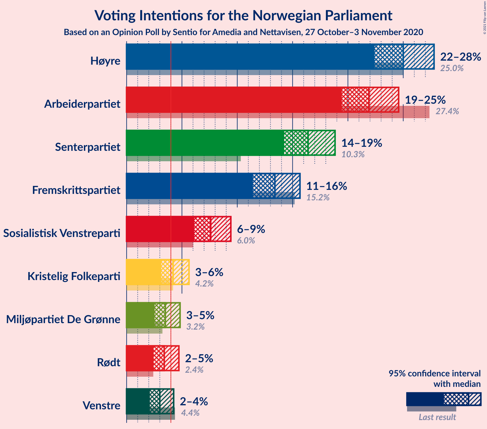

### Confidence Intervals

| Party | Last Result | Poll Result | 80% Confidence Interval | 90% Confidence Interval | 95% Confidence Interval | 99% Confidence Interval |
|:-----:|:-----------:|:-----------:|:-----------------------:|:-----------------------:|:-----------------------:|:-----------------------:|
| Høyre | 25.0% | 25.0% | 23.3–26.8% |22.8–27.3% |22.4–27.8% |21.6–28.7% |
| Arbeiderpartiet | 27.4% | 21.9% | 20.3–23.7% |19.8–24.1% |19.4–24.6% |18.7–25.4% |
| Senterpartiet | 10.3% | 16.4% | 15.0–18.0% |14.6–18.4% |14.2–18.8% |13.6–19.6% |
| Fremskrittspartiet | 15.2% | 13.4% | 12.1–14.9% |11.7–15.3% |11.4–15.7% |10.8–16.4% |
| Sosialistisk Venstreparti | 6.0% | 7.6% | 6.6–8.8% |6.3–9.1% |6.1–9.4% |5.7–10.0% |
| Kristelig Folkeparti | 4.2% | 4.2% | 3.5–5.1% |3.3–5.4% |3.1–5.6% |2.8–6.1% |
| Miljøpartiet De Grønne | 3.2% | 3.5% | 2.9–4.4% |2.7–4.6% |2.5–4.8% |2.2–5.3% |
| Rødt | 2.4% | 3.4% | 2.8–4.3% |2.6–4.5% |2.4–4.7% |2.2–5.2% |
| Venstre | 4.4% | 3.0% | 2.4–3.8% |2.2–4.1% |2.1–4.3% |1.9–4.7% |

*Note:* The poll result column reflects the actual value used in the calculations. Published results may vary slightly, and in addition be rounded to fewer digits.

## Seats

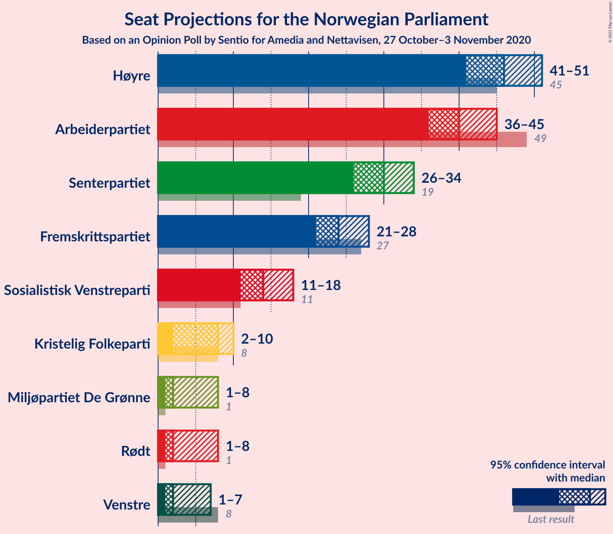

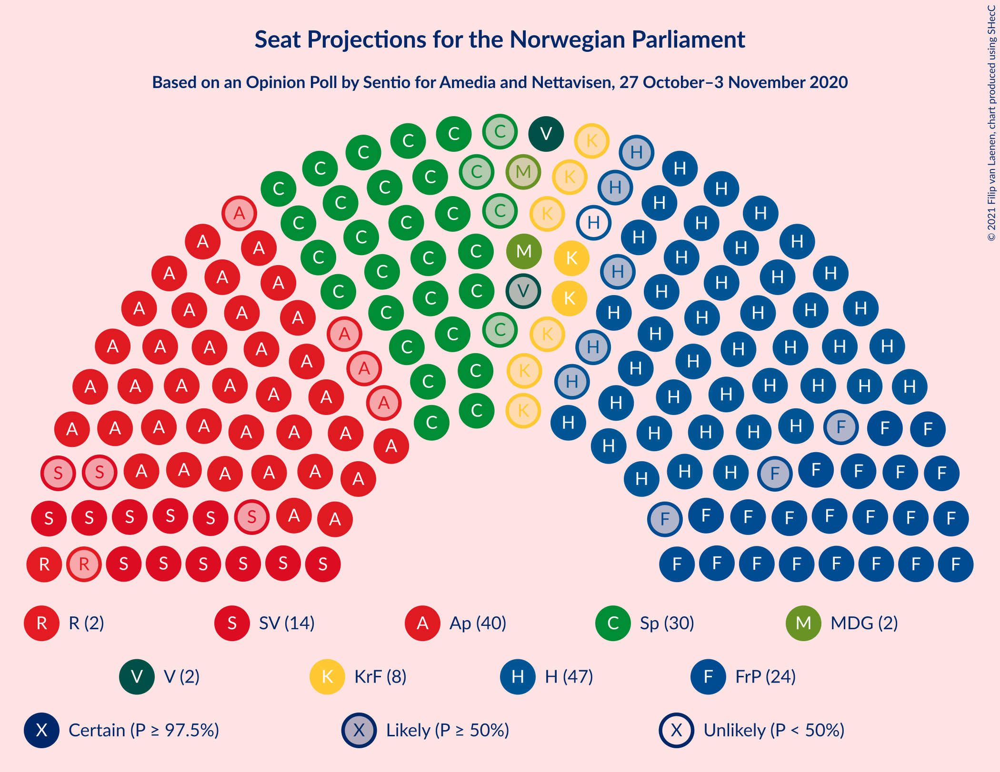

### Confidence Intervals

| Party | Last Result | Median | 80% Confidence Interval | 90% Confidence Interval | 95% Confidence Interval | 99% Confidence Interval |
|:-----:|:-----------:|:------:|:-----------------------:|:-----------------------:|:-----------------------:|:-----------------------:|
| <a href="#høyre">Høyre</a> | 45 | 46 | 42–49 |42–51 |41–51 |39–53 |
| <a href="#arbeiderpartiet">Arbeiderpartiet</a> | 49 | 40 | 37–44 |36–44 |36–45 |34–47 |
| <a href="#senterpartiet">Senterpartiet</a> | 19 | 30 | 27–32 |27–34 |26–34 |25–36 |
| <a href="#fremskrittspartiet">Fremskrittspartiet</a> | 27 | 24 | 23–27 |22–28 |21–28 |20–29 |
| <a href="#sosialistisk-venstreparti">Sosialistisk Venstreparti</a> | 11 | 14 | 12–16 |12–17 |11–18 |10–18 |
| <a href="#kristelig-folkeparti">Kristelig Folkeparti</a> | 8 | 8 | 3–9 |3–9 |2–10 |1–11 |
| <a href="#miljøpartiet-de-grønne">Miljøpartiet De Grønne</a> | 1 | 2 | 1–8 |1–8 |1–8 |1–9 |
| <a href="#rødt">Rødt</a> | 1 | 2 | 1–7 |1–8 |1–8 |1–9 |
| <a href="#venstre">Venstre</a> | 8 | 2 | 1–2 |1–2 |1–7 |1–8 |

### Høyre

*For a full overview of the results for this party, see the [Høyre](party-høyre.html) page.*

| Number of Seats | Probability | Accumulated | Special Marks |
|:---------------:|:-----------:|:-----------:|:-------------:|
| 37 | 0.1% | 100% |  |
| 38 | 0.3% | 99.9% |  |
| 39 | 0.4% | 99.6% |  |
| 40 | 1.1% | 99.2% |  |
| 41 | 3% | 98% |  |
| 42 | 5% | 95% |  |
| 43 | 6% | 90% |  |
| 44 | 18% | 84% |  |
| 45 | 10% | 66% | Last Result |
| 46 | 11% | 56% | Median |
| 47 | 23% | 45% |  |
| 48 | 6% | 23% |  |
| 49 | 8% | 16% |  |
| 50 | 3% | 9% |  |
| 51 | 3% | 5% |  |
| 52 | 0.9% | 2% |  |
| 53 | 0.8% | 1.0% |  |
| 54 | 0.1% | 0.2% |  |
| 55 | 0.1% | 0.1% |  |
| 56 | 0% | 0% |  |

### Arbeiderpartiet

*For a full overview of the results for this party, see the [Arbeiderpartiet](party-arbeiderpartiet.html) page.*

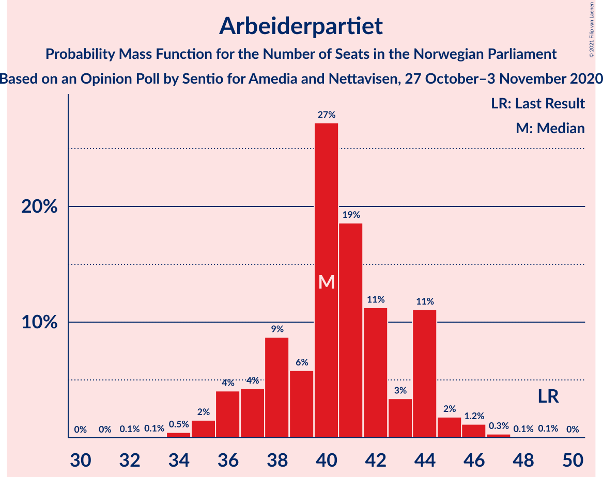

| Number of Seats | Probability | Accumulated | Special Marks |
|:---------------:|:-----------:|:-----------:|:-------------:|
| 32 | 0.1% | 100% |  |
| 33 | 0.1% | 99.9% |  |
| 34 | 0.5% | 99.8% |  |
| 35 | 2% | 99.4% |  |
| 36 | 4% | 98% |  |
| 37 | 4% | 94% |  |
| 38 | 9% | 90% |  |
| 39 | 6% | 81% |  |
| 40 | 27% | 75% | Median |
| 41 | 19% | 48% |  |
| 42 | 11% | 29% |  |
| 43 | 3% | 18% |  |
| 44 | 11% | 15% |  |
| 45 | 2% | 3% |  |
| 46 | 1.2% | 2% |  |
| 47 | 0.3% | 0.5% |  |
| 48 | 0.1% | 0.2% |  |
| 49 | 0.1% | 0.1% | Last Result |
| 50 | 0% | 0% |  |

### Senterpartiet

*For a full overview of the results for this party, see the [Senterpartiet](party-senterpartiet.html) page.*

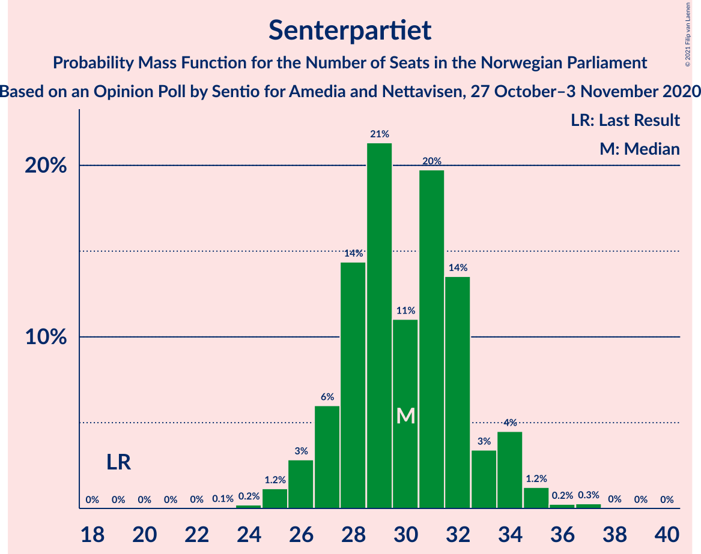

| Number of Seats | Probability | Accumulated | Special Marks |
|:---------------:|:-----------:|:-----------:|:-------------:|
| 19 | 0% | 100% | Last Result |
| 20 | 0% | 100% |  |
| 21 | 0% | 100% |  |
| 22 | 0% | 100% |  |
| 23 | 0.1% | 100% |  |
| 24 | 0.2% | 99.9% |  |
| 25 | 1.2% | 99.7% |  |
| 26 | 3% | 98.6% |  |
| 27 | 6% | 96% |  |
| 28 | 14% | 90% |  |
| 29 | 21% | 75% |  |
| 30 | 11% | 54% | Median |
| 31 | 20% | 43% |  |
| 32 | 14% | 23% |  |
| 33 | 3% | 10% |  |
| 34 | 4% | 6% |  |
| 35 | 1.2% | 2% |  |
| 36 | 0.2% | 0.6% |  |
| 37 | 0.3% | 0.3% |  |
| 38 | 0% | 0.1% |  |
| 39 | 0% | 0% |  |

### Fremskrittspartiet

*For a full overview of the results for this party, see the [Fremskrittspartiet](party-fremskrittspartiet.html) page.*

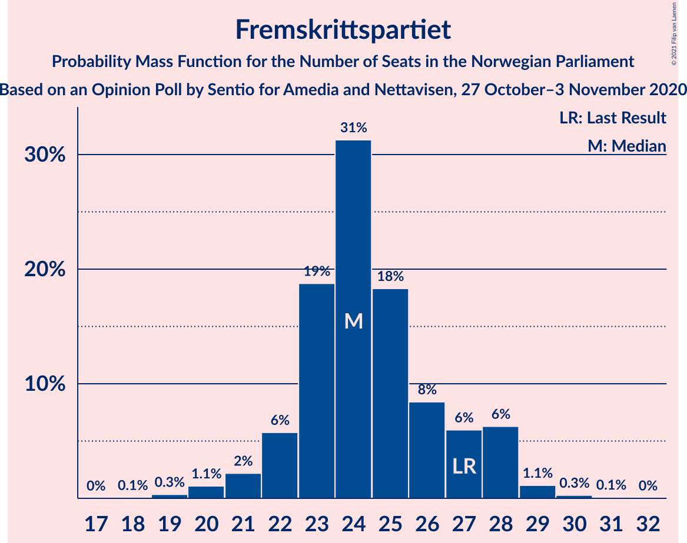

| Number of Seats | Probability | Accumulated | Special Marks |
|:---------------:|:-----------:|:-----------:|:-------------:|
| 18 | 0.1% | 100% |  |
| 19 | 0.3% | 99.9% |  |
| 20 | 1.1% | 99.6% |  |
| 21 | 2% | 98% |  |
| 22 | 6% | 96% |  |
| 23 | 19% | 91% |  |
| 24 | 31% | 72% | Median |
| 25 | 18% | 41% |  |
| 26 | 8% | 22% |  |
| 27 | 6% | 14% | Last Result |
| 28 | 6% | 8% |  |
| 29 | 1.1% | 2% |  |
| 30 | 0.3% | 0.4% |  |
| 31 | 0.1% | 0.1% |  |
| 32 | 0% | 0% |  |

### Sosialistisk Venstreparti

*For a full overview of the results for this party, see the [Sosialistisk Venstreparti](party-sosialistiskvenstreparti.html) page.*

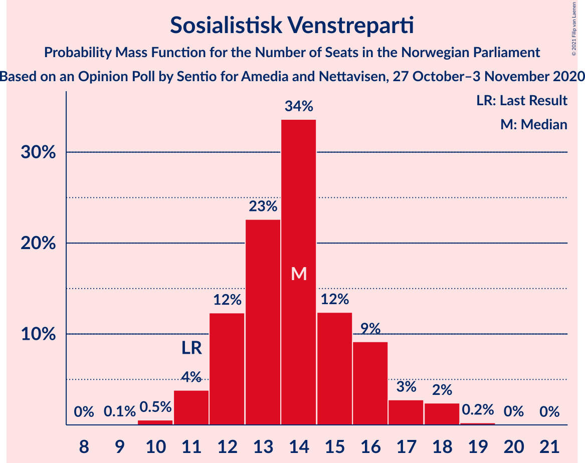

| Number of Seats | Probability | Accumulated | Special Marks |
|:---------------:|:-----------:|:-----------:|:-------------:|
| 9 | 0.1% | 100% |  |
| 10 | 0.5% | 99.9% |  |
| 11 | 4% | 99.4% | Last Result |
| 12 | 12% | 96% |  |
| 13 | 23% | 83% |  |
| 14 | 34% | 61% | Median |
| 15 | 12% | 27% |  |
| 16 | 9% | 15% |  |
| 17 | 3% | 5% |  |
| 18 | 2% | 3% |  |
| 19 | 0.2% | 0.3% |  |
| 20 | 0% | 0.1% |  |
| 21 | 0% | 0% |  |

### Kristelig Folkeparti

*For a full overview of the results for this party, see the [Kristelig Folkeparti](party-kristeligfolkeparti.html) page.*

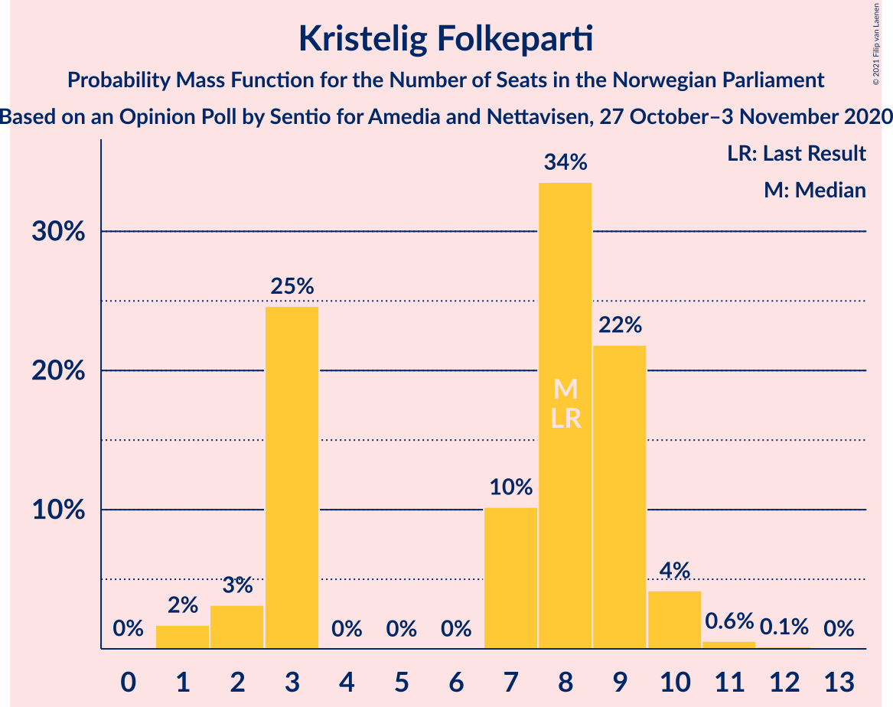

| Number of Seats | Probability | Accumulated | Special Marks |
|:---------------:|:-----------:|:-----------:|:-------------:|
| 1 | 2% | 100% |  |
| 2 | 3% | 98% |  |
| 3 | 25% | 95% |  |
| 4 | 0% | 70% |  |
| 5 | 0% | 70% |  |
| 6 | 0% | 70% |  |
| 7 | 10% | 70% |  |
| 8 | 34% | 60% | Last Result, Median |
| 9 | 22% | 27% |  |
| 10 | 4% | 5% |  |
| 11 | 0.6% | 0.7% |  |
| 12 | 0.1% | 0.2% |  |
| 13 | 0% | 0% |  |

### Miljøpartiet De Grønne

*For a full overview of the results for this party, see the [Miljøpartiet De Grønne](party-miljøpartietdegrønne.html) page.*

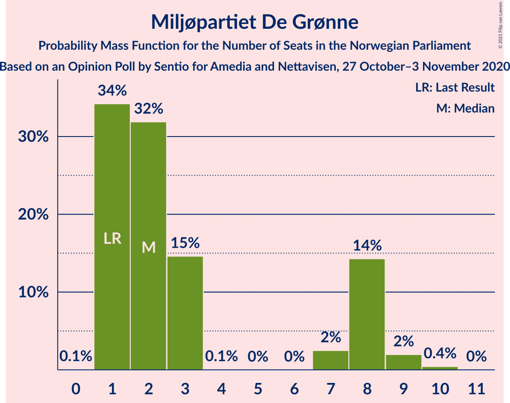

| Number of Seats | Probability | Accumulated | Special Marks |
|:---------------:|:-----------:|:-----------:|:-------------:|
| 0 | 0.1% | 100% |  |
| 1 | 34% | 99.9% | Last Result |
| 2 | 32% | 66% | Median |
| 3 | 15% | 34% |  |
| 4 | 0.1% | 19% |  |
| 5 | 0% | 19% |  |
| 6 | 0% | 19% |  |
| 7 | 2% | 19% |  |
| 8 | 14% | 17% |  |
| 9 | 2% | 2% |  |
| 10 | 0.4% | 0.4% |  |
| 11 | 0% | 0% |  |

### Rødt

*For a full overview of the results for this party, see the [Rødt](party-rødt.html) page.*

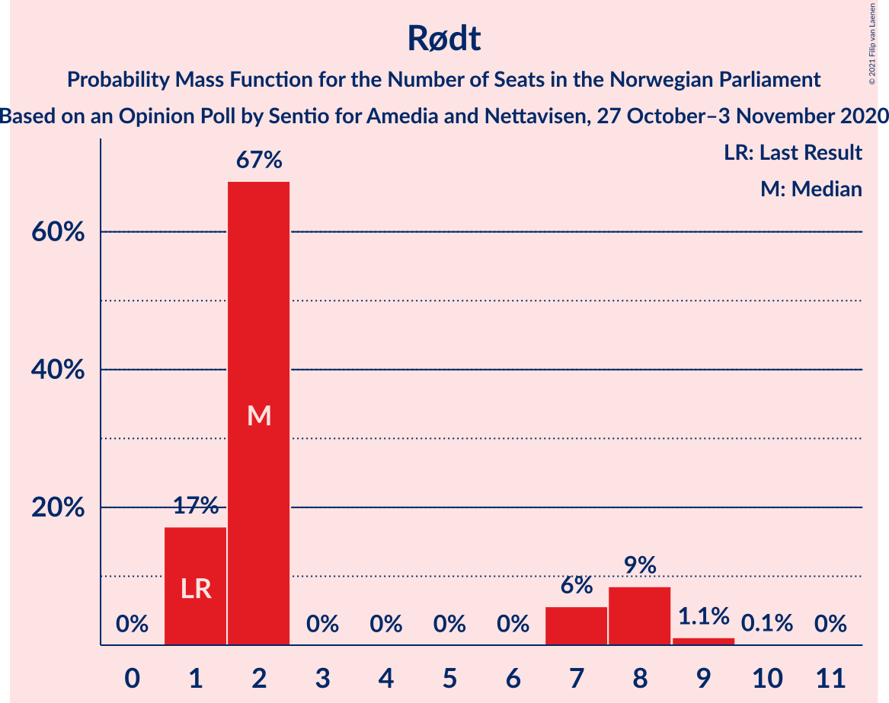

| Number of Seats | Probability | Accumulated | Special Marks |
|:---------------:|:-----------:|:-----------:|:-------------:|
| 1 | 17% | 100% | Last Result |
| 2 | 67% | 83% | Median |
| 3 | 0% | 15% |  |
| 4 | 0% | 15% |  |
| 5 | 0% | 15% |  |
| 6 | 0% | 15% |  |
| 7 | 6% | 15% |  |
| 8 | 9% | 10% |  |
| 9 | 1.1% | 1.3% |  |
| 10 | 0.1% | 0.1% |  |
| 11 | 0% | 0% |  |

### Venstre

*For a full overview of the results for this party, see the [Venstre](party-venstre.html) page.*

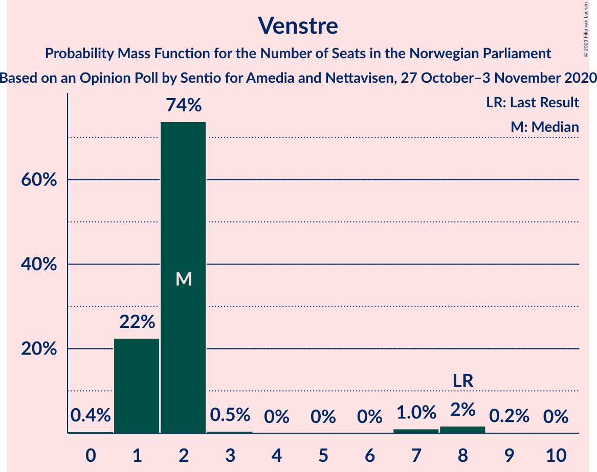

| Number of Seats | Probability | Accumulated | Special Marks |
|:---------------:|:-----------:|:-----------:|:-------------:|
| 0 | 0.4% | 100% |  |
| 1 | 22% | 99.6% |  |
| 2 | 74% | 77% | Median |
| 3 | 0.5% | 3% |  |
| 4 | 0% | 3% |  |
| 5 | 0% | 3% |  |
| 6 | 0% | 3% |  |
| 7 | 1.0% | 3% |  |
| 8 | 2% | 2% | Last Result |
| 9 | 0.2% | 0.2% |  |
| 10 | 0% | 0% |  |

## Coalitions

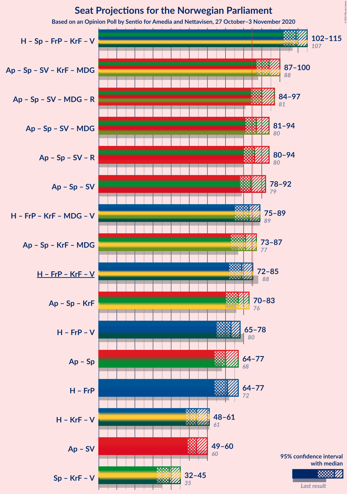

### Confidence Intervals

| Coalition | Last Result | Median | Majority? | 80% Confidence Interval | 90% Confidence Interval | 95% Confidence Interval | 99% Confidence Interval |
|:---------:|:-----------:|:------:|:---------:|:-----------------------:|:-----------------------:|:-----------------------:|:-----------------------:|
| Høyre – Senterpartiet – Fremskrittspartiet – Kristelig Folkeparti – Venstre | 107 | 109 | 100% | 104–113 | 103–115 | 102–115 | 99–117 |
| Arbeiderpartiet – Senterpartiet – Sosialistisk Venstreparti – Kristelig Folkeparti – Miljøpartiet De Grønne | 88 | 94 | 99.7% | 90–98 | 89–99 | 87–100 | 85–103 |
| Arbeiderpartiet – Senterpartiet – Sosialistisk Venstreparti – Miljøpartiet De Grønne – Rødt | 81 | 90 | 95% | 86–95 | 84–96 | 84–97 | 82–99 |
| Arbeiderpartiet – Senterpartiet – Sosialistisk Venstreparti – Miljøpartiet De Grønne | 80 | 87 | 83% | 83–91 | 82–93 | 81–94 | 78–97 |
| Arbeiderpartiet – Senterpartiet – Sosialistisk Venstreparti – Rødt | 80 | 86 | 77% | 83–92 | 81–94 | 80–94 | 78–96 |
| Arbeiderpartiet – Senterpartiet – Sosialistisk Venstreparti | 79 | 84 | 44% | 80–89 | 79–89 | 78–92 | 76–93 |
| Høyre – Fremskrittspartiet – Kristelig Folkeparti – Miljøpartiet De Grønne – Venstre | 89 | 83 | 23% | 77–86 | 75–88 | 75–89 | 73–91 |
| Arbeiderpartiet – Senterpartiet – Kristelig Folkeparti – Miljøpartiet De Grønne | 77 | 81 | 7% | 76–84 | 74–85 | 73–87 | 70–90 |
| Høyre – Fremskrittspartiet – Kristelig Folkeparti – Venstre | 88 | 79 | 5% | 74–83 | 73–85 | 72–85 | 70–87 |
| Arbeiderpartiet – Senterpartiet – Kristelig Folkeparti | 76 | 77 | 0.7% | 73–81 | 72–83 | 70–83 | 68–85 |
| Høyre – Fremskrittspartiet – Venstre | 80 | 73 | 0% | 69–76 | 67–78 | 65–78 | 64–80 |
| Arbeiderpartiet – Senterpartiet | 68 | 70 | 0% | 67–75 | 65–75 | 64–77 | 62–79 |
| Høyre – Fremskrittspartiet | 72 | 71 | 0% | 67–74 | 65–75 | 64–77 | 62–78 |
| Høyre – Kristelig Folkeparti – Venstre | 61 | 54 | 0% | 50–58 | 49–60 | 48–61 | 46–63 |
| Arbeiderpartiet – Sosialistisk Venstreparti | 60 | 54 | 0% | 51–58 | 50–59 | 49–60 | 48–61 |
| Senterpartiet – Kristelig Folkeparti – Venstre | 35 | 39 | 0% | 34–43 | 33–44 | 32–45 | 31–47 |

### Høyre – Senterpartiet – Fremskrittspartiet – Kristelig Folkeparti – Venstre

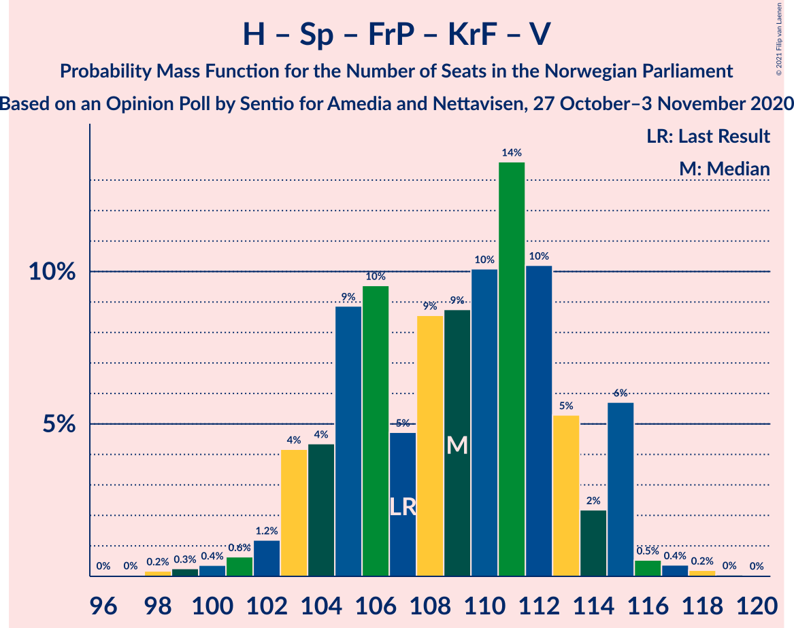

| Number of Seats | Probability | Accumulated | Special Marks |
|:---------------:|:-----------:|:-----------:|:-------------:|
| 96 | 0% | 100% |  |
| 97 | 0% | 99.9% |  |
| 98 | 0.2% | 99.9% |  |
| 99 | 0.3% | 99.7% |  |
| 100 | 0.4% | 99.5% |  |
| 101 | 0.6% | 99.1% |  |
| 102 | 1.2% | 98% |  |
| 103 | 4% | 97% |  |
| 104 | 4% | 93% |  |
| 105 | 9% | 89% |  |
| 106 | 10% | 80% |  |
| 107 | 5% | 70% | Last Result |
| 108 | 9% | 66% |  |
| 109 | 9% | 57% |  |
| 110 | 10% | 48% | Median |
| 111 | 14% | 38% |  |
| 112 | 10% | 25% |  |
| 113 | 5% | 14% |  |
| 114 | 2% | 9% |  |
| 115 | 6% | 7% |  |
| 116 | 0.5% | 1.2% |  |
| 117 | 0.4% | 0.7% |  |
| 118 | 0.2% | 0.3% |  |
| 119 | 0% | 0.1% |  |
| 120 | 0% | 0% |  |

### Arbeiderpartiet – Senterpartiet – Sosialistisk Venstreparti – Kristelig Folkeparti – Miljøpartiet De Grønne

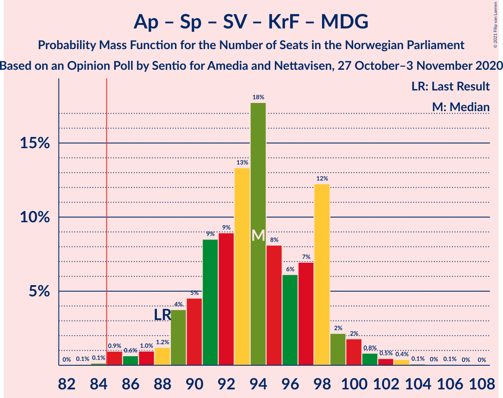

| Number of Seats | Probability | Accumulated | Special Marks |
|:---------------:|:-----------:|:-----------:|:-------------:|
| 83 | 0.1% | 100% |  |
| 84 | 0.1% | 99.9% |  |
| 85 | 0.9% | 99.7% | Majority |
| 86 | 0.6% | 98.8% |  |
| 87 | 1.0% | 98% |  |
| 88 | 1.2% | 97% | Last Result |
| 89 | 4% | 96% |  |
| 90 | 5% | 92% |  |
| 91 | 9% | 88% |  |
| 92 | 9% | 79% |  |
| 93 | 13% | 70% |  |
| 94 | 18% | 57% | Median |
| 95 | 8% | 39% |  |
| 96 | 6% | 31% |  |
| 97 | 7% | 25% |  |
| 98 | 12% | 18% |  |
| 99 | 2% | 6% |  |
| 100 | 2% | 4% |  |
| 101 | 0.8% | 2% |  |
| 102 | 0.5% | 1.0% |  |
| 103 | 0.4% | 0.6% |  |
| 104 | 0.1% | 0.2% |  |
| 105 | 0% | 0.1% |  |
| 106 | 0.1% | 0.1% |  |
| 107 | 0% | 0% |  |

### Arbeiderpartiet – Senterpartiet – Sosialistisk Venstreparti – Miljøpartiet De Grønne – Rødt

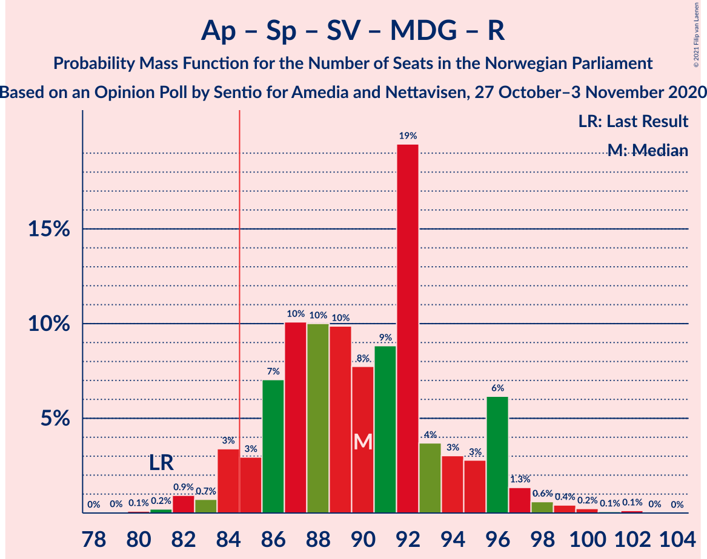

| Number of Seats | Probability | Accumulated | Special Marks |
|:---------------:|:-----------:|:-----------:|:-------------:|
| 79 | 0% | 100% |  |
| 80 | 0.1% | 99.9% |  |
| 81 | 0.2% | 99.8% | Last Result |
| 82 | 0.9% | 99.6% |  |
| 83 | 0.7% | 98.7% |  |
| 84 | 3% | 98% |  |
| 85 | 3% | 95% | Majority |
| 86 | 7% | 92% |  |
| 87 | 10% | 85% |  |
| 88 | 10% | 74% | Median |
| 89 | 10% | 64% |  |
| 90 | 8% | 55% |  |
| 91 | 9% | 47% |  |
| 92 | 19% | 38% |  |
| 93 | 4% | 19% |  |
| 94 | 3% | 15% |  |
| 95 | 3% | 12% |  |
| 96 | 6% | 9% |  |
| 97 | 1.3% | 3% |  |
| 98 | 0.6% | 2% |  |
| 99 | 0.4% | 0.9% |  |
| 100 | 0.2% | 0.5% |  |
| 101 | 0.1% | 0.3% |  |
| 102 | 0.1% | 0.2% |  |
| 103 | 0% | 0.1% |  |
| 104 | 0% | 0% |  |

### Arbeiderpartiet – Senterpartiet – Sosialistisk Venstreparti – Miljøpartiet De Grønne

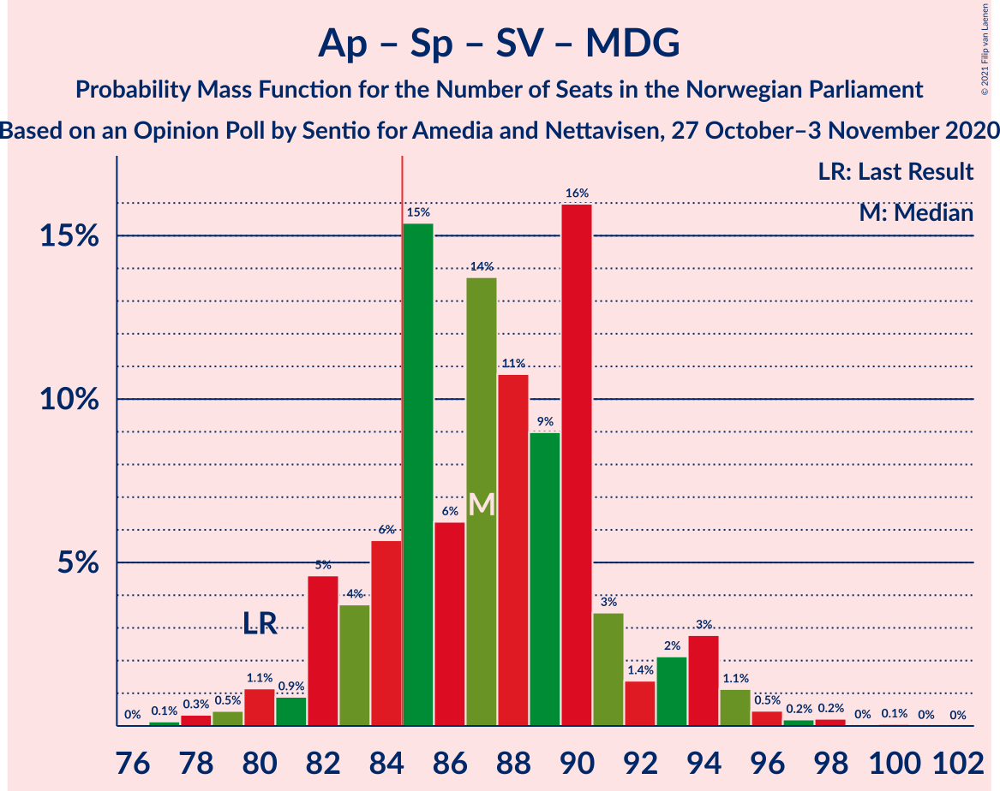

| Number of Seats | Probability | Accumulated | Special Marks |
|:---------------:|:-----------:|:-----------:|:-------------:|
| 76 | 0% | 100% |  |
| 77 | 0.1% | 99.9% |  |
| 78 | 0.3% | 99.8% |  |
| 79 | 0.5% | 99.5% |  |
| 80 | 1.1% | 99.0% | Last Result |
| 81 | 0.9% | 98% |  |
| 82 | 5% | 97% |  |
| 83 | 4% | 92% |  |
| 84 | 6% | 89% |  |
| 85 | 15% | 83% | Majority |
| 86 | 6% | 68% | Median |
| 87 | 14% | 61% |  |
| 88 | 11% | 48% |  |
| 89 | 9% | 37% |  |
| 90 | 16% | 28% |  |
| 91 | 3% | 12% |  |
| 92 | 1.4% | 8% |  |
| 93 | 2% | 7% |  |
| 94 | 3% | 5% |  |
| 95 | 1.1% | 2% |  |
| 96 | 0.5% | 1.0% |  |
| 97 | 0.2% | 0.5% |  |
| 98 | 0.2% | 0.3% |  |
| 99 | 0% | 0.1% |  |
| 100 | 0.1% | 0.1% |  |
| 101 | 0% | 0% |  |

### Arbeiderpartiet – Senterpartiet – Sosialistisk Venstreparti – Rødt

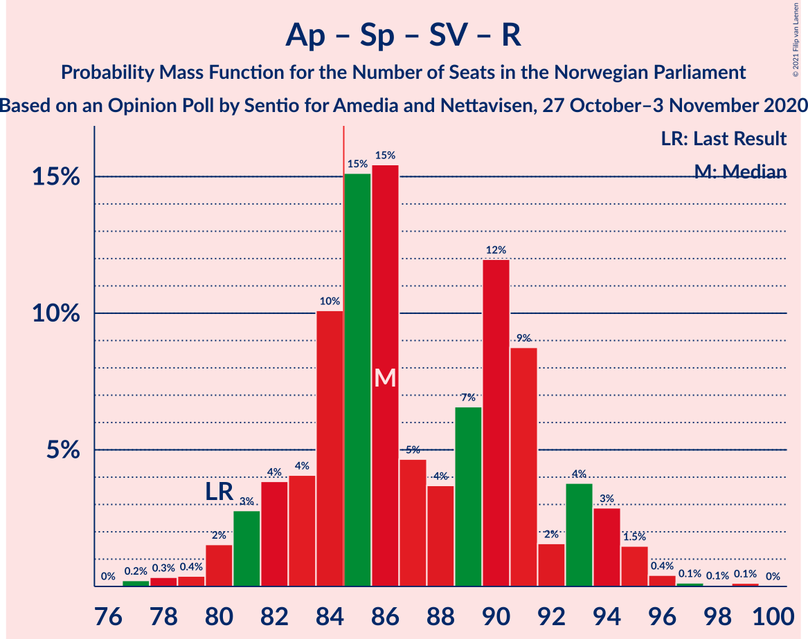

| Number of Seats | Probability | Accumulated | Special Marks |
|:---------------:|:-----------:|:-----------:|:-------------:|
| 76 | 0% | 100% |  |
| 77 | 0.2% | 99.9% |  |
| 78 | 0.3% | 99.7% |  |
| 79 | 0.4% | 99.4% |  |
| 80 | 2% | 99.0% | Last Result |
| 81 | 3% | 97% |  |
| 82 | 4% | 95% |  |
| 83 | 4% | 91% |  |
| 84 | 10% | 87% |  |
| 85 | 15% | 77% | Majority |
| 86 | 15% | 62% | Median |
| 87 | 5% | 46% |  |
| 88 | 4% | 41% |  |
| 89 | 7% | 38% |  |
| 90 | 12% | 31% |  |
| 91 | 9% | 19% |  |
| 92 | 2% | 10% |  |
| 93 | 4% | 9% |  |
| 94 | 3% | 5% |  |
| 95 | 1.5% | 2% |  |
| 96 | 0.4% | 0.7% |  |
| 97 | 0.1% | 0.3% |  |
| 98 | 0.1% | 0.2% |  |
| 99 | 0.1% | 0.2% |  |
| 100 | 0% | 0% |  |

### Arbeiderpartiet – Senterpartiet – Sosialistisk Venstreparti

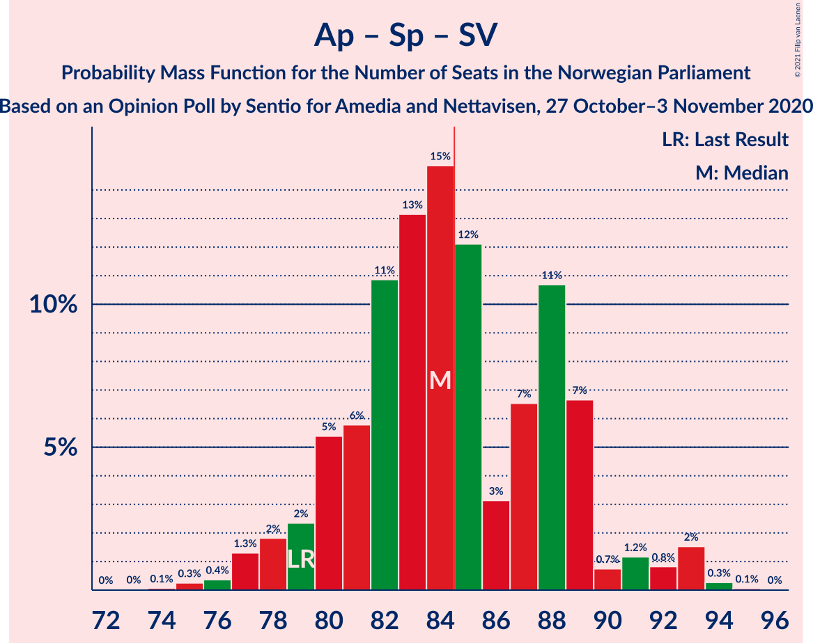

| Number of Seats | Probability | Accumulated | Special Marks |
|:---------------:|:-----------:|:-----------:|:-------------:|
| 73 | 0% | 100% |  |
| 74 | 0.1% | 99.9% |  |
| 75 | 0.3% | 99.9% |  |
| 76 | 0.4% | 99.6% |  |
| 77 | 1.3% | 99.3% |  |
| 78 | 2% | 98% |  |
| 79 | 2% | 96% | Last Result |
| 80 | 5% | 94% |  |
| 81 | 6% | 88% |  |
| 82 | 11% | 83% |  |
| 83 | 13% | 72% |  |
| 84 | 15% | 59% | Median |
| 85 | 12% | 44% | Majority |
| 86 | 3% | 32% |  |
| 87 | 7% | 29% |  |
| 88 | 11% | 22% |  |
| 89 | 7% | 11% |  |
| 90 | 0.7% | 5% |  |
| 91 | 1.2% | 4% |  |
| 92 | 0.8% | 3% |  |
| 93 | 2% | 2% |  |
| 94 | 0.3% | 0.4% |  |
| 95 | 0.1% | 0.1% |  |
| 96 | 0% | 0% |  |

### Høyre – Fremskrittspartiet – Kristelig Folkeparti – Miljøpartiet De Grønne – Venstre

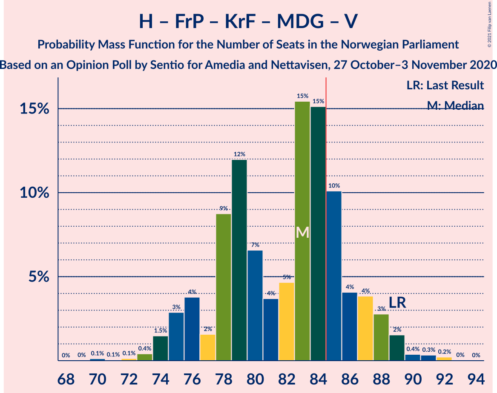

| Number of Seats | Probability | Accumulated | Special Marks |
|:---------------:|:-----------:|:-----------:|:-------------:|
| 70 | 0.1% | 100% |  |
| 71 | 0.1% | 99.8% |  |
| 72 | 0.1% | 99.8% |  |
| 73 | 0.4% | 99.7% |  |
| 74 | 1.5% | 99.3% |  |
| 75 | 3% | 98% |  |
| 76 | 4% | 95% |  |
| 77 | 2% | 91% |  |
| 78 | 9% | 90% |  |
| 79 | 12% | 81% |  |
| 80 | 7% | 69% |  |
| 81 | 4% | 62% |  |
| 82 | 5% | 59% | Median |
| 83 | 15% | 54% |  |
| 84 | 15% | 38% |  |
| 85 | 10% | 23% | Majority |
| 86 | 4% | 13% |  |
| 87 | 4% | 9% |  |
| 88 | 3% | 5% |  |
| 89 | 2% | 3% | Last Result |
| 90 | 0.4% | 1.0% |  |
| 91 | 0.3% | 0.6% |  |
| 92 | 0.2% | 0.3% |  |
| 93 | 0% | 0.1% |  |
| 94 | 0% | 0% |  |

### Arbeiderpartiet – Senterpartiet – Kristelig Folkeparti – Miljøpartiet De Grønne

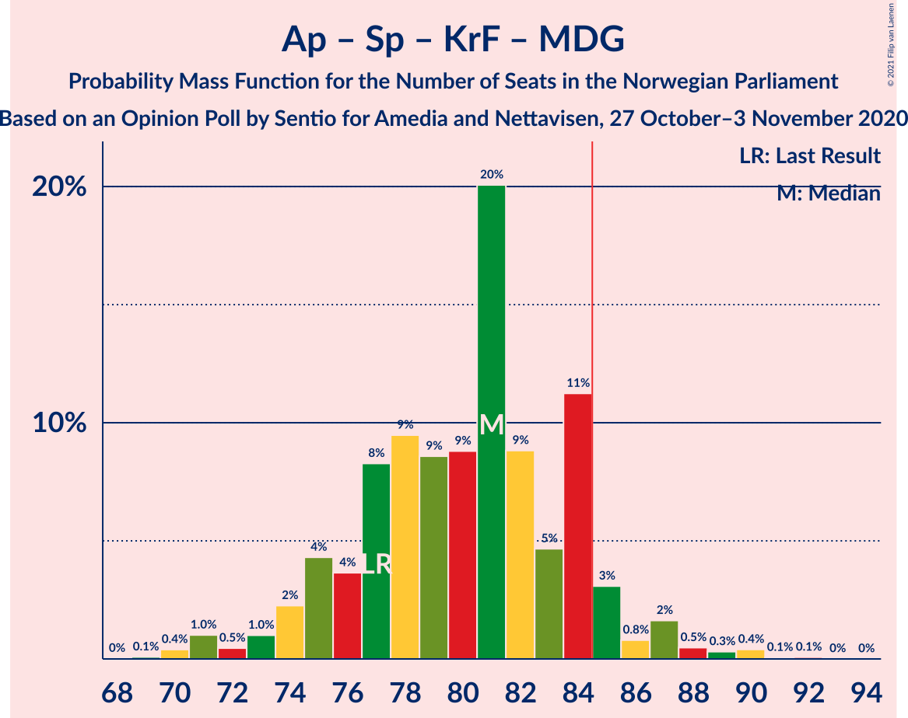

| Number of Seats | Probability | Accumulated | Special Marks |
|:---------------:|:-----------:|:-----------:|:-------------:|
| 69 | 0.1% | 100% |  |
| 70 | 0.4% | 99.9% |  |
| 71 | 1.0% | 99.5% |  |
| 72 | 0.5% | 98% |  |
| 73 | 1.0% | 98% |  |
| 74 | 2% | 97% |  |
| 75 | 4% | 95% |  |
| 76 | 4% | 90% |  |
| 77 | 8% | 87% | Last Result |
| 78 | 9% | 79% |  |
| 79 | 9% | 69% |  |
| 80 | 9% | 60% | Median |
| 81 | 20% | 52% |  |
| 82 | 9% | 32% |  |
| 83 | 5% | 23% |  |
| 84 | 11% | 18% |  |
| 85 | 3% | 7% | Majority |
| 86 | 0.8% | 4% |  |
| 87 | 2% | 3% |  |
| 88 | 0.5% | 1.4% |  |
| 89 | 0.3% | 0.9% |  |
| 90 | 0.4% | 0.6% |  |
| 91 | 0.1% | 0.2% |  |
| 92 | 0.1% | 0.1% |  |
| 93 | 0% | 0% |  |

### Høyre – Fremskrittspartiet – Kristelig Folkeparti – Venstre

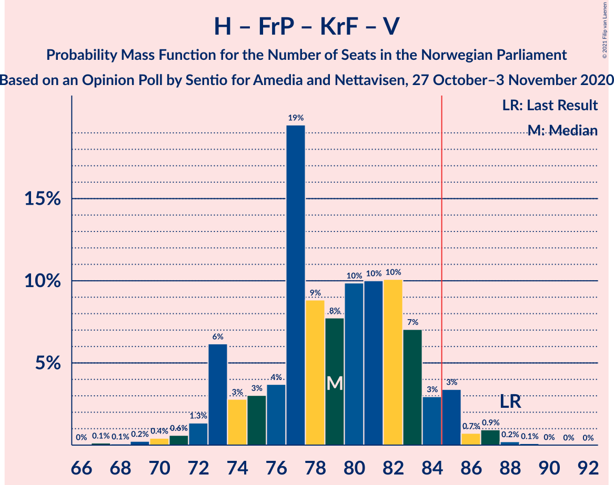

| Number of Seats | Probability | Accumulated | Special Marks |
|:---------------:|:-----------:|:-----------:|:-------------:|
| 66 | 0% | 100% |  |
| 67 | 0.1% | 99.9% |  |
| 68 | 0.1% | 99.8% |  |
| 69 | 0.2% | 99.7% |  |
| 70 | 0.4% | 99.5% |  |
| 71 | 0.6% | 99.1% |  |
| 72 | 1.3% | 98% |  |
| 73 | 6% | 97% |  |
| 74 | 3% | 91% |  |
| 75 | 3% | 88% |  |
| 76 | 4% | 85% |  |
| 77 | 19% | 81% |  |
| 78 | 9% | 62% |  |
| 79 | 8% | 53% |  |
| 80 | 10% | 45% | Median |
| 81 | 10% | 36% |  |
| 82 | 10% | 26% |  |
| 83 | 7% | 15% |  |
| 84 | 3% | 8% |  |
| 85 | 3% | 5% | Majority |
| 86 | 0.7% | 2% |  |
| 87 | 0.9% | 1.3% |  |
| 88 | 0.2% | 0.4% | Last Result |
| 89 | 0.1% | 0.2% |  |
| 90 | 0% | 0.1% |  |
| 91 | 0% | 0% |  |

### Arbeiderpartiet – Senterpartiet – Kristelig Folkeparti

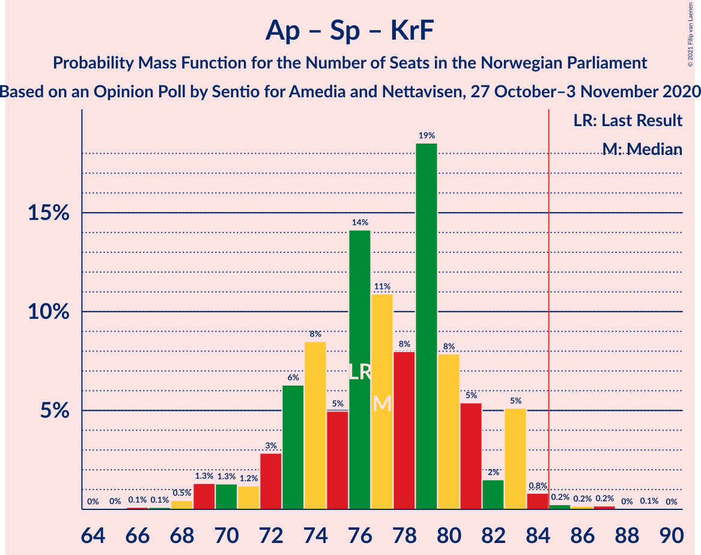

| Number of Seats | Probability | Accumulated | Special Marks |
|:---------------:|:-----------:|:-----------:|:-------------:|
| 65 | 0% | 100% |  |
| 66 | 0.1% | 99.9% |  |
| 67 | 0.1% | 99.8% |  |
| 68 | 0.5% | 99.7% |  |
| 69 | 1.3% | 99.3% |  |
| 70 | 1.3% | 98% |  |
| 71 | 1.2% | 97% |  |
| 72 | 3% | 95% |  |
| 73 | 6% | 93% |  |
| 74 | 8% | 86% |  |
| 75 | 5% | 78% |  |
| 76 | 14% | 73% | Last Result |
| 77 | 11% | 59% |  |
| 78 | 8% | 48% | Median |
| 79 | 19% | 40% |  |
| 80 | 8% | 21% |  |
| 81 | 5% | 13% |  |
| 82 | 2% | 8% |  |
| 83 | 5% | 7% |  |
| 84 | 0.8% | 1.5% |  |
| 85 | 0.2% | 0.7% | Majority |
| 86 | 0.2% | 0.4% |  |
| 87 | 0.2% | 0.3% |  |
| 88 | 0% | 0.1% |  |
| 89 | 0.1% | 0.1% |  |
| 90 | 0% | 0% |  |

### Høyre – Fremskrittspartiet – Venstre

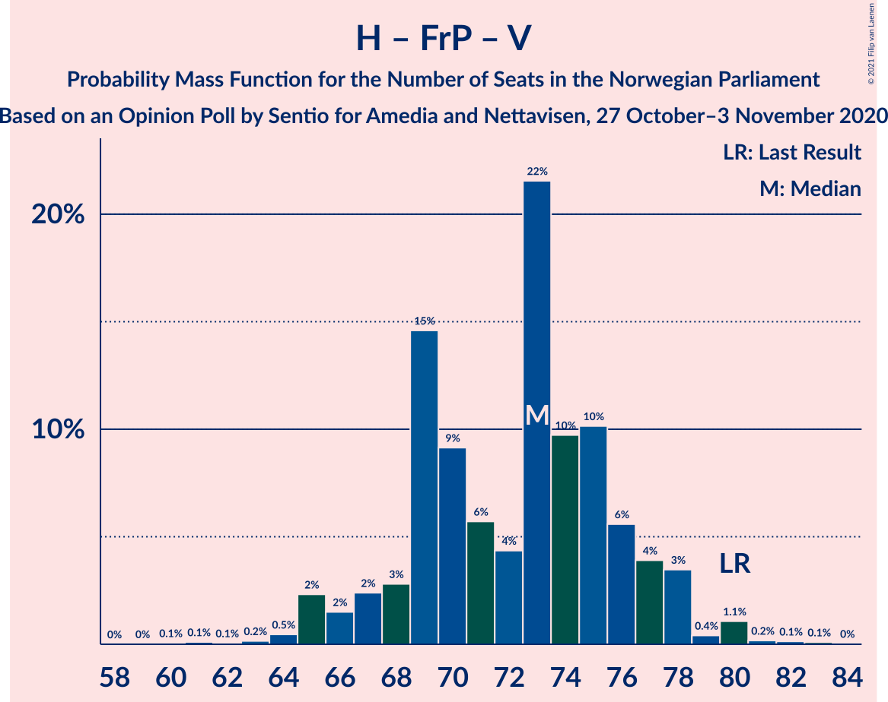

| Number of Seats | Probability | Accumulated | Special Marks |
|:---------------:|:-----------:|:-----------:|:-------------:|
| 60 | 0.1% | 100% |  |
| 61 | 0.1% | 99.9% |  |
| 62 | 0.1% | 99.8% |  |
| 63 | 0.2% | 99.8% |  |
| 64 | 0.5% | 99.6% |  |
| 65 | 2% | 99.1% |  |
| 66 | 2% | 97% |  |
| 67 | 2% | 95% |  |
| 68 | 3% | 93% |  |
| 69 | 15% | 90% |  |
| 70 | 9% | 76% |  |
| 71 | 6% | 66% |  |
| 72 | 4% | 61% | Median |
| 73 | 22% | 56% |  |
| 74 | 10% | 35% |  |
| 75 | 10% | 25% |  |
| 76 | 6% | 15% |  |
| 77 | 4% | 9% |  |
| 78 | 3% | 5% |  |
| 79 | 0.4% | 2% |  |
| 80 | 1.1% | 2% | Last Result |
| 81 | 0.2% | 0.4% |  |
| 82 | 0.1% | 0.3% |  |
| 83 | 0.1% | 0.1% |  |
| 84 | 0% | 0% |  |

### Arbeiderpartiet – Senterpartiet

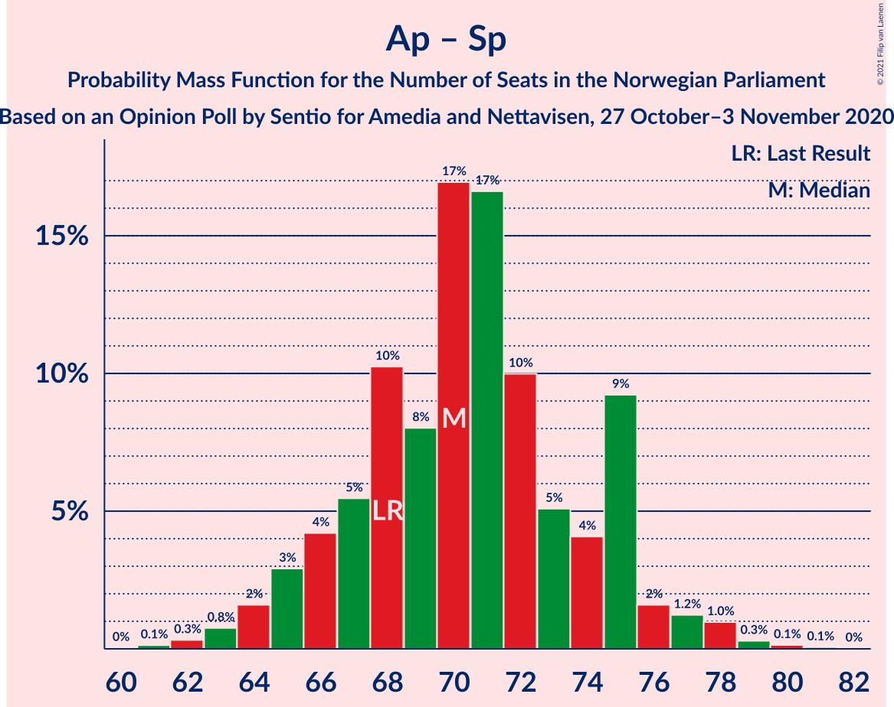

| Number of Seats | Probability | Accumulated | Special Marks |
|:---------------:|:-----------:|:-----------:|:-------------:|
| 60 | 0% | 100% |  |
| 61 | 0.1% | 99.9% |  |
| 62 | 0.3% | 99.8% |  |
| 63 | 0.8% | 99.5% |  |
| 64 | 2% | 98.7% |  |
| 65 | 3% | 97% |  |
| 66 | 4% | 94% |  |
| 67 | 5% | 90% |  |
| 68 | 10% | 85% | Last Result |
| 69 | 8% | 74% |  |
| 70 | 17% | 66% | Median |
| 71 | 17% | 49% |  |
| 72 | 10% | 33% |  |
| 73 | 5% | 23% |  |
| 74 | 4% | 18% |  |
| 75 | 9% | 14% |  |
| 76 | 2% | 4% |  |
| 77 | 1.2% | 3% |  |
| 78 | 1.0% | 1.5% |  |
| 79 | 0.3% | 0.5% |  |
| 80 | 0.1% | 0.2% |  |
| 81 | 0.1% | 0.1% |  |
| 82 | 0% | 0% |  |

### Høyre – Fremskrittspartiet

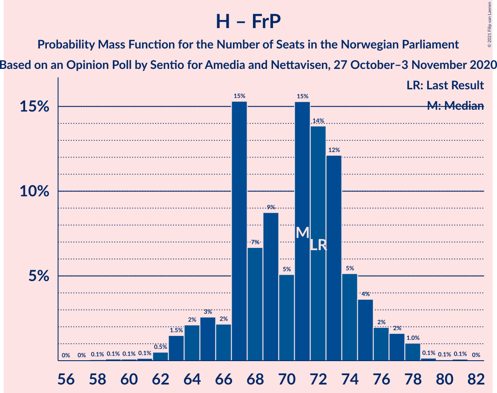

| Number of Seats | Probability | Accumulated | Special Marks |
|:---------------:|:-----------:|:-----------:|:-------------:|
| 58 | 0.1% | 100% |  |
| 59 | 0.1% | 99.9% |  |
| 60 | 0.1% | 99.8% |  |
| 61 | 0.1% | 99.7% |  |
| 62 | 0.5% | 99.6% |  |
| 63 | 1.5% | 99.1% |  |
| 64 | 2% | 98% |  |
| 65 | 3% | 95% |  |
| 66 | 2% | 93% |  |
| 67 | 15% | 91% |  |
| 68 | 7% | 75% |  |
| 69 | 9% | 69% |  |
| 70 | 5% | 60% | Median |
| 71 | 15% | 55% |  |
| 72 | 14% | 40% | Last Result |
| 73 | 12% | 26% |  |
| 74 | 5% | 14% |  |
| 75 | 4% | 9% |  |
| 76 | 2% | 5% |  |
| 77 | 2% | 3% |  |
| 78 | 1.0% | 1.4% |  |
| 79 | 0.1% | 0.3% |  |
| 80 | 0.1% | 0.2% |  |
| 81 | 0.1% | 0.1% |  |
| 82 | 0% | 0% |  |

### Høyre – Kristelig Folkeparti – Venstre

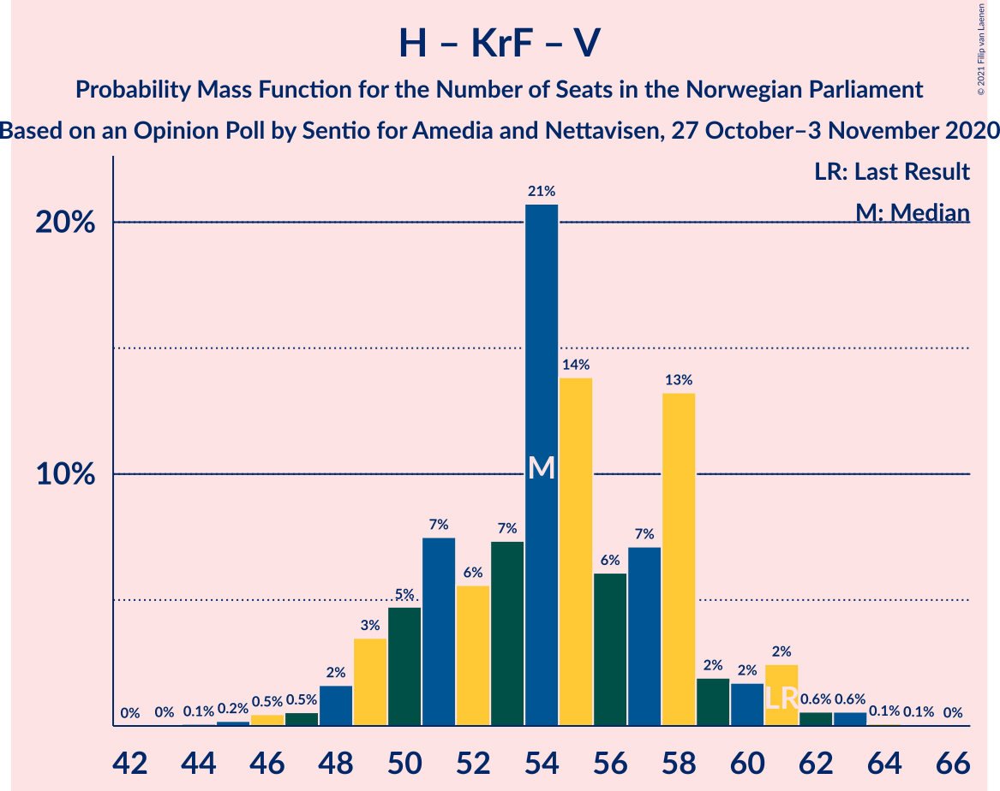

| Number of Seats | Probability | Accumulated | Special Marks |
|:---------------:|:-----------:|:-----------:|:-------------:|
| 43 | 0% | 100% |  |
| 44 | 0.1% | 99.9% |  |
| 45 | 0.2% | 99.9% |  |
| 46 | 0.5% | 99.7% |  |
| 47 | 0.5% | 99.2% |  |
| 48 | 2% | 98.7% |  |
| 49 | 3% | 97% |  |
| 50 | 5% | 94% |  |
| 51 | 7% | 89% |  |
| 52 | 6% | 81% |  |
| 53 | 7% | 76% |  |
| 54 | 21% | 68% |  |
| 55 | 14% | 48% |  |
| 56 | 6% | 34% | Median |
| 57 | 7% | 28% |  |
| 58 | 13% | 21% |  |
| 59 | 2% | 7% |  |
| 60 | 2% | 5% |  |
| 61 | 2% | 4% | Last Result |
| 62 | 0.6% | 1.3% |  |
| 63 | 0.6% | 0.7% |  |
| 64 | 0.1% | 0.2% |  |
| 65 | 0.1% | 0.1% |  |
| 66 | 0% | 0% |  |

### Arbeiderpartiet – Sosialistisk Venstreparti

| Number of Seats | Probability | Accumulated | Special Marks |
|:---------------:|:-----------:|:-----------:|:-------------:|
| 45 | 0% | 100% |  |
| 46 | 0.1% | 99.9% |  |
| 47 | 0.3% | 99.8% |  |
| 48 | 1.3% | 99.5% |  |
| 49 | 0.8% | 98% |  |
| 50 | 3% | 97% |  |
| 51 | 5% | 94% |  |
| 52 | 14% | 89% |  |
| 53 | 10% | 74% |  |
| 54 | 20% | 65% | Median |
| 55 | 13% | 45% |  |
| 56 | 9% | 31% |  |
| 57 | 9% | 23% |  |
| 58 | 8% | 14% |  |
| 59 | 2% | 6% |  |
| 60 | 2% | 4% | Last Result |
| 61 | 1.2% | 2% |  |
| 62 | 0.2% | 0.5% |  |
| 63 | 0.1% | 0.2% |  |
| 64 | 0.1% | 0.1% |  |
| 65 | 0% | 0% |  |

### Senterpartiet – Kristelig Folkeparti – Venstre

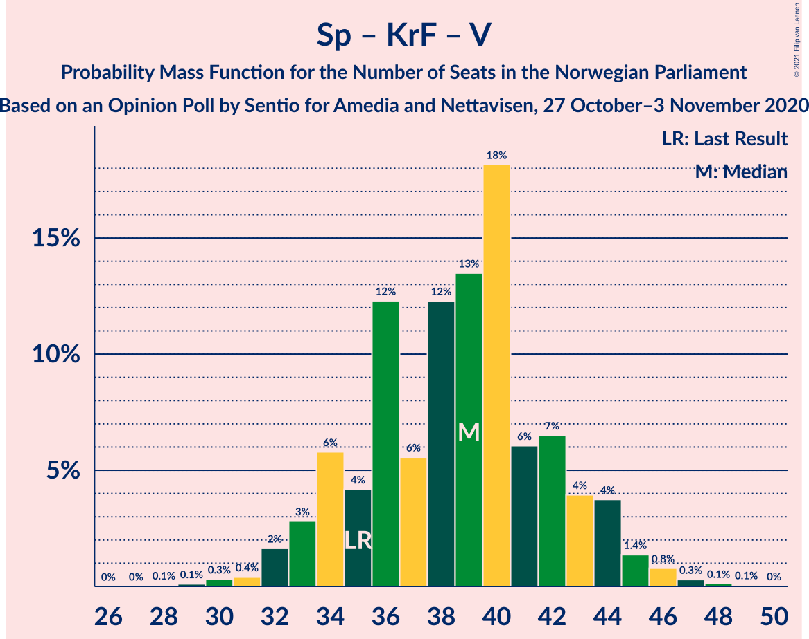

| Number of Seats | Probability | Accumulated | Special Marks |
|:---------------:|:-----------:|:-----------:|:-------------:|
| 28 | 0.1% | 100% |  |
| 29 | 0.1% | 99.9% |  |
| 30 | 0.3% | 99.8% |  |
| 31 | 0.4% | 99.5% |  |
| 32 | 2% | 99.1% |  |
| 33 | 3% | 97% |  |
| 34 | 6% | 95% |  |
| 35 | 4% | 89% | Last Result |
| 36 | 12% | 85% |  |
| 37 | 6% | 72% |  |
| 38 | 12% | 67% |  |
| 39 | 13% | 55% |  |
| 40 | 18% | 41% | Median |
| 41 | 6% | 23% |  |
| 42 | 7% | 17% |  |
| 43 | 4% | 10% |  |
| 44 | 4% | 6% |  |
| 45 | 1.4% | 3% |  |
| 46 | 0.8% | 1.3% |  |
| 47 | 0.3% | 0.5% |  |
| 48 | 0.1% | 0.2% |  |
| 49 | 0.1% | 0.1% |  |
| 50 | 0% | 0% |  |

## Technical Information

### Opinion Poll

+ **Polling firm:** Sentio
+ **Commissioner(s):** Amedia and Nettavisen
+ **Fieldwork period:** 27 October–3 November 2020

### Calculations

+ **Sample size:** 1000
+ **Simulations done:** 1,048,576
+ **Error estimate:** 1.52%

