# Opinion Poll by Norstat for Aftenposten and NRK, 9–15 November 2020

<a href="#voting-intentions">Voting Intentions</a> | <a href="#seats">Seats</a> | <a href="#coalitions">Coalitions</a> | <a href="#technical-information">Technical Information</a>

## Voting Intentions

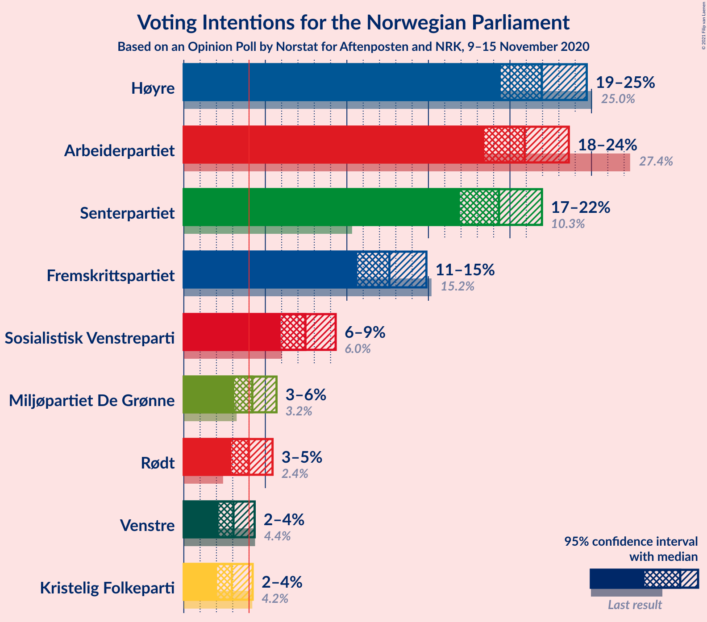

### Confidence Intervals

| Party | Last Result | Poll Result | 80% Confidence Interval | 90% Confidence Interval | 95% Confidence Interval | 99% Confidence Interval |
|:-----:|:-----------:|:-----------:|:-----------------------:|:-----------------------:|:-----------------------:|:-----------------------:|
| Høyre | 25.0% | 22.0% | 20.3–23.7% |19.8–24.3% |19.4–24.7% |18.7–25.6% |
| Arbeiderpartiet | 27.4% | 20.9% | 19.3–22.7% |18.8–23.2% |18.4–23.6% |17.7–24.5% |
| Senterpartiet | 10.3% | 19.3% | 17.8–21.0% |17.3–21.5% |16.9–22.0% |16.2–22.8% |
| Fremskrittspartiet | 15.2% | 12.6% | 11.3–14.1% |10.9–14.5% |10.6–14.9% |10.1–15.6% |
| Sosialistisk Venstreparti | 6.0% | 7.5% | 6.5–8.7% |6.2–9.0% |5.9–9.3% |5.5–9.9% |
| Miljøpartiet De Grønne | 3.2% | 4.2% | 3.5–5.2% |3.3–5.4% |3.1–5.7% |2.8–6.2% |
| Rødt | 2.4% | 4.0% | 3.3–4.9% |3.1–5.2% |2.9–5.4% |2.6–5.9% |
| Venstre | 4.4% | 3.0% | 2.4–3.9% |2.3–4.1% |2.1–4.3% |1.9–4.8% |
| Kristelig Folkeparti | 4.2% | 2.9% | 2.3–3.8% |2.2–4.0% |2.0–4.2% |1.8–4.7% |

*Note:* The poll result column reflects the actual value used in the calculations. Published results may vary slightly, and in addition be rounded to fewer digits.

## Seats

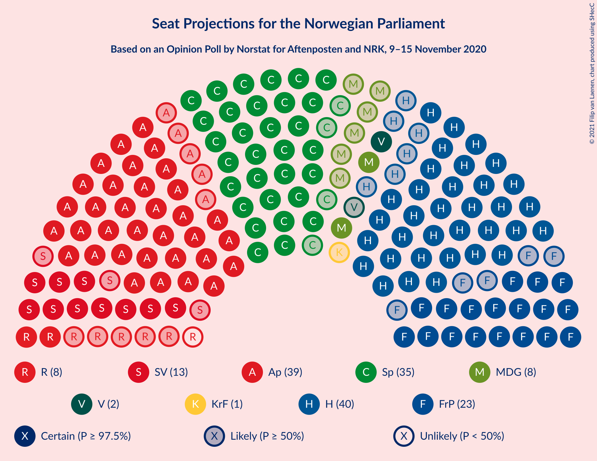

### Confidence Intervals

| Party | Last Result | Median | 80% Confidence Interval | 90% Confidence Interval | 95% Confidence Interval | 99% Confidence Interval |
|:-----:|:-----------:|:------:|:-----------------------:|:-----------------------:|:-----------------------:|:-----------------------:|
| <a href="#høyre">Høyre</a> | 45 | 40 | 37–44 |35–45 |34–46 |34–48 |
| <a href="#arbeiderpartiet">Arbeiderpartiet</a> | 49 | 39 | 35–43 |35–43 |34–44 |32–45 |
| <a href="#senterpartiet">Senterpartiet</a> | 19 | 35 | 33–39 |31–40 |31–42 |30–44 |
| <a href="#fremskrittspartiet">Fremskrittspartiet</a> | 27 | 23 | 20–26 |19–27 |18–28 |17–29 |
| <a href="#sosialistisk-venstreparti">Sosialistisk Venstreparti</a> | 11 | 13 | 11–16 |11–17 |10–17 |9–18 |
| <a href="#miljøpartiet-de-grønne">Miljøpartiet De Grønne</a> | 1 | 8 | 2–9 |2–10 |2–10 |1–11 |
| <a href="#rødt">Rødt</a> | 1 | 7 | 2–9 |2–9 |2–10 |1–11 |
| <a href="#venstre">Venstre</a> | 8 | 2 | 2–3 |1–7 |1–8 |1–8 |
| <a href="#kristelig-folkeparti">Kristelig Folkeparti</a> | 8 | 1 | 1–3 |0–3 |0–8 |0–8 |

### Høyre

*For a full overview of the results for this party, see the [Høyre](party-høyre.html) page.*

| Number of Seats | Probability | Accumulated | Special Marks |
|:---------------:|:-----------:|:-----------:|:-------------:|
| 32 | 0.1% | 100% |  |
| 33 | 0.4% | 99.9% |  |
| 34 | 2% | 99.5% |  |
| 35 | 3% | 97% |  |
| 36 | 4% | 94% |  |
| 37 | 6% | 91% |  |
| 38 | 13% | 84% |  |
| 39 | 11% | 71% |  |
| 40 | 16% | 60% | Median |
| 41 | 12% | 44% |  |
| 42 | 11% | 32% |  |
| 43 | 5% | 21% |  |
| 44 | 7% | 16% |  |
| 45 | 5% | 9% | Last Result |
| 46 | 2% | 3% |  |
| 47 | 0.4% | 2% |  |
| 48 | 0.9% | 1.1% |  |
| 49 | 0.1% | 0.2% |  |
| 50 | 0% | 0.1% |  |
| 51 | 0.1% | 0.1% |  |
| 52 | 0% | 0% |  |

### Arbeiderpartiet

*For a full overview of the results for this party, see the [Arbeiderpartiet](party-arbeiderpartiet.html) page.*

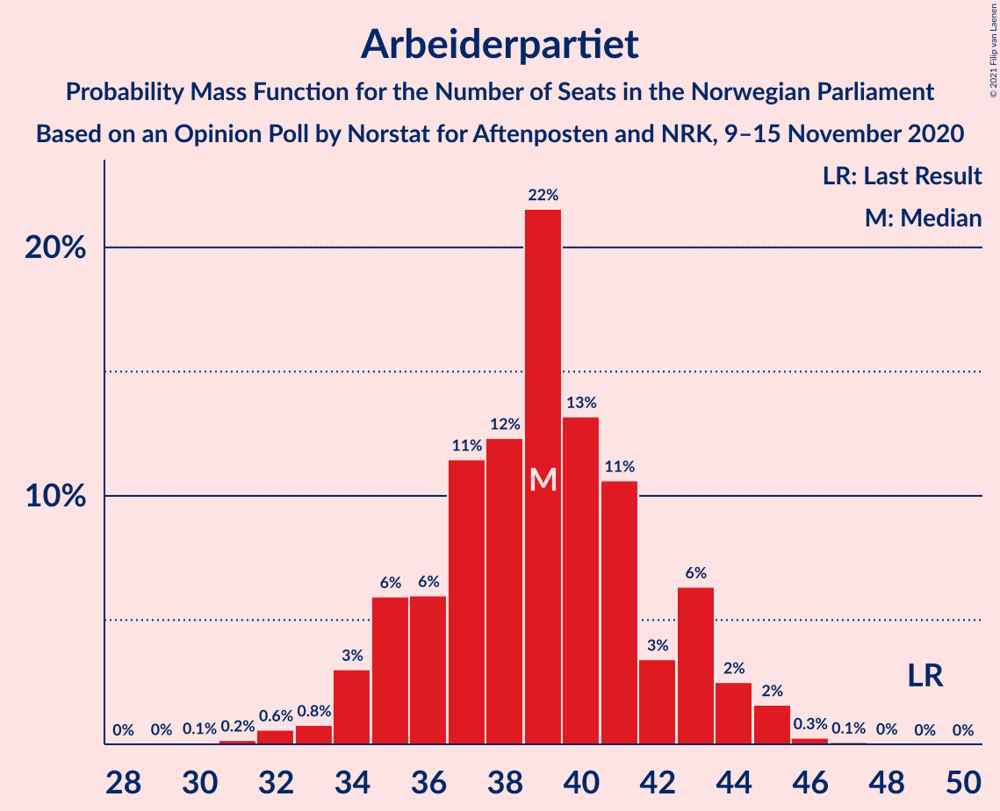

| Number of Seats | Probability | Accumulated | Special Marks |
|:---------------:|:-----------:|:-----------:|:-------------:|
| 30 | 0.1% | 100% |  |
| 31 | 0.2% | 99.9% |  |
| 32 | 0.6% | 99.7% |  |
| 33 | 0.8% | 99.1% |  |
| 34 | 3% | 98% |  |
| 35 | 6% | 95% |  |
| 36 | 6% | 89% |  |
| 37 | 11% | 83% |  |
| 38 | 12% | 72% |  |
| 39 | 22% | 60% | Median |
| 40 | 13% | 38% |  |
| 41 | 11% | 25% |  |
| 42 | 3% | 14% |  |
| 43 | 6% | 11% |  |
| 44 | 2% | 4% |  |
| 45 | 2% | 2% |  |
| 46 | 0.3% | 0.4% |  |
| 47 | 0.1% | 0.1% |  |
| 48 | 0% | 0.1% |  |
| 49 | 0% | 0% | Last Result |

### Senterpartiet

*For a full overview of the results for this party, see the [Senterpartiet](party-senterpartiet.html) page.*

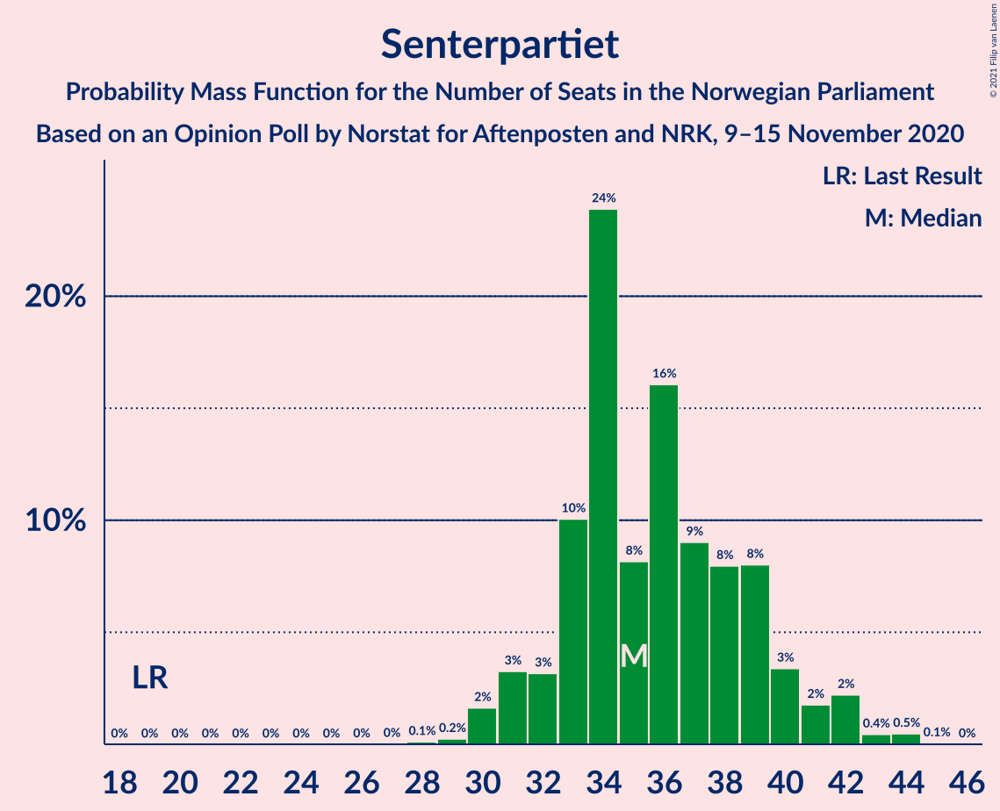

| Number of Seats | Probability | Accumulated | Special Marks |
|:---------------:|:-----------:|:-----------:|:-------------:|
| 19 | 0% | 100% | Last Result |
| 20 | 0% | 100% |  |
| 21 | 0% | 100% |  |
| 22 | 0% | 100% |  |
| 23 | 0% | 100% |  |
| 24 | 0% | 100% |  |
| 25 | 0% | 100% |  |
| 26 | 0% | 100% |  |
| 27 | 0% | 100% |  |
| 28 | 0.1% | 100% |  |
| 29 | 0.2% | 99.8% |  |
| 30 | 2% | 99.6% |  |
| 31 | 3% | 98% |  |
| 32 | 3% | 95% |  |
| 33 | 10% | 92% |  |
| 34 | 24% | 81% |  |
| 35 | 8% | 58% | Median |
| 36 | 16% | 49% |  |
| 37 | 9% | 33% |  |
| 38 | 8% | 24% |  |
| 39 | 8% | 16% |  |
| 40 | 3% | 8% |  |
| 41 | 2% | 5% |  |
| 42 | 2% | 3% |  |
| 43 | 0.4% | 1.0% |  |
| 44 | 0.5% | 0.5% |  |
| 45 | 0.1% | 0.1% |  |
| 46 | 0% | 0% |  |

### Fremskrittspartiet

*For a full overview of the results for this party, see the [Fremskrittspartiet](party-fremskrittspartiet.html) page.*

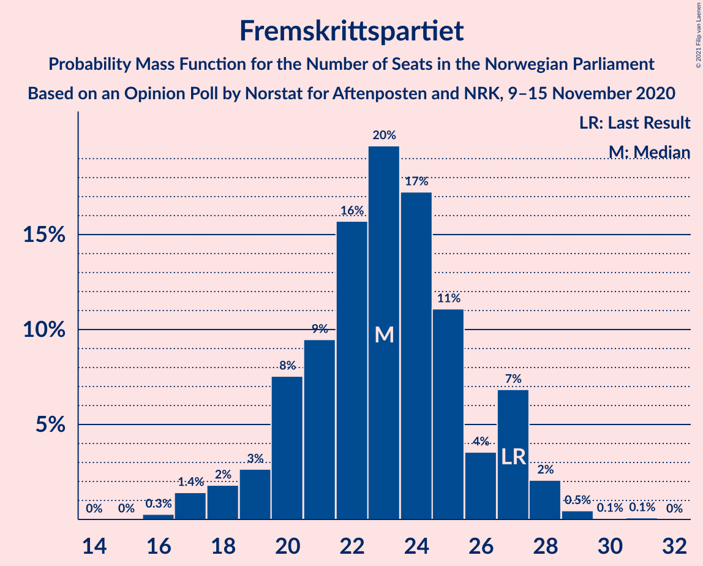

| Number of Seats | Probability | Accumulated | Special Marks |
|:---------------:|:-----------:|:-----------:|:-------------:|
| 16 | 0.3% | 100% |  |
| 17 | 1.4% | 99.7% |  |
| 18 | 2% | 98% |  |
| 19 | 3% | 96% |  |
| 20 | 8% | 94% |  |
| 21 | 9% | 86% |  |
| 22 | 16% | 77% |  |
| 23 | 20% | 61% | Median |
| 24 | 17% | 41% |  |
| 25 | 11% | 24% |  |
| 26 | 4% | 13% |  |
| 27 | 7% | 10% | Last Result |
| 28 | 2% | 3% |  |
| 29 | 0.5% | 0.6% |  |
| 30 | 0.1% | 0.2% |  |
| 31 | 0.1% | 0.1% |  |
| 32 | 0% | 0% |  |

### Sosialistisk Venstreparti

*For a full overview of the results for this party, see the [Sosialistisk Venstreparti](party-sosialistiskvenstreparti.html) page.*

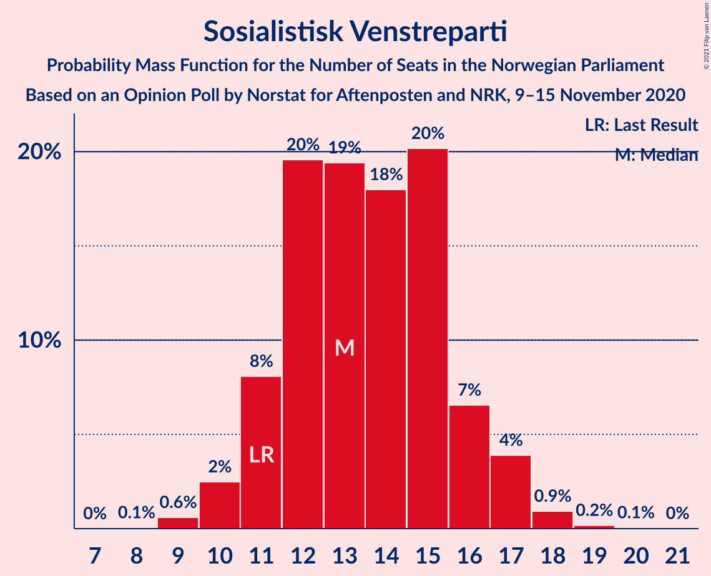

| Number of Seats | Probability | Accumulated | Special Marks |
|:---------------:|:-----------:|:-----------:|:-------------:|
| 8 | 0.1% | 100% |  |
| 9 | 0.6% | 99.9% |  |
| 10 | 2% | 99.3% |  |
| 11 | 8% | 97% | Last Result |
| 12 | 20% | 89% |  |
| 13 | 19% | 69% | Median |
| 14 | 18% | 50% |  |
| 15 | 20% | 32% |  |
| 16 | 7% | 12% |  |
| 17 | 4% | 5% |  |
| 18 | 0.9% | 1.2% |  |
| 19 | 0.2% | 0.2% |  |
| 20 | 0.1% | 0.1% |  |
| 21 | 0% | 0% |  |

### Miljøpartiet De Grønne

*For a full overview of the results for this party, see the [Miljøpartiet De Grønne](party-miljøpartietdegrønne.html) page.*

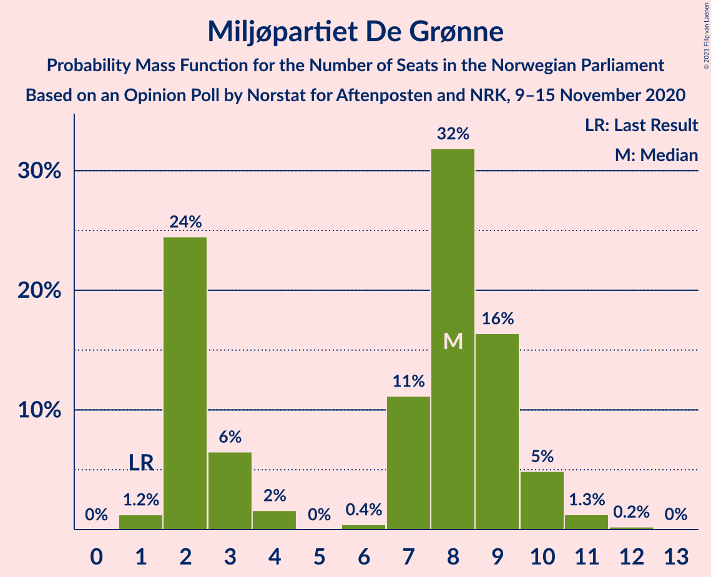

| Number of Seats | Probability | Accumulated | Special Marks |
|:---------------:|:-----------:|:-----------:|:-------------:|
| 1 | 1.2% | 100% | Last Result |
| 2 | 24% | 98.8% |  |
| 3 | 6% | 74% |  |
| 4 | 2% | 68% |  |
| 5 | 0% | 66% |  |
| 6 | 0.4% | 66% |  |
| 7 | 11% | 66% |  |
| 8 | 32% | 55% | Median |
| 9 | 16% | 23% |  |
| 10 | 5% | 6% |  |
| 11 | 1.3% | 2% |  |
| 12 | 0.2% | 0.3% |  |
| 13 | 0% | 0% |  |

### Rødt

*For a full overview of the results for this party, see the [Rødt](party-rødt.html) page.*

| Number of Seats | Probability | Accumulated | Special Marks |
|:---------------:|:-----------:|:-----------:|:-------------:|
| 1 | 1.3% | 100% | Last Result |
| 2 | 45% | 98.7% |  |
| 3 | 0.1% | 54% |  |
| 4 | 0% | 54% |  |
| 5 | 0% | 54% |  |
| 6 | 2% | 54% |  |
| 7 | 9% | 52% | Median |
| 8 | 30% | 43% |  |
| 9 | 9% | 13% |  |
| 10 | 3% | 4% |  |
| 11 | 0.8% | 0.8% |  |
| 12 | 0.1% | 0.1% |  |
| 13 | 0% | 0% |  |

### Venstre

*For a full overview of the results for this party, see the [Venstre](party-venstre.html) page.*

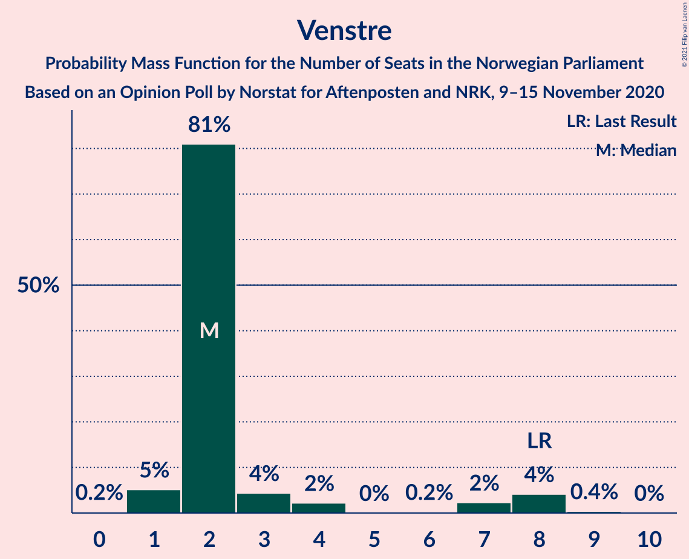

| Number of Seats | Probability | Accumulated | Special Marks |
|:---------------:|:-----------:|:-----------:|:-------------:|
| 0 | 0.2% | 100% |  |
| 1 | 5% | 99.8% |  |
| 2 | 81% | 95% | Median |
| 3 | 4% | 14% |  |
| 4 | 2% | 9% |  |
| 5 | 0% | 7% |  |
| 6 | 0.2% | 7% |  |
| 7 | 2% | 7% |  |
| 8 | 4% | 5% | Last Result |
| 9 | 0.4% | 0.4% |  |
| 10 | 0% | 0% |  |

### Kristelig Folkeparti

*For a full overview of the results for this party, see the [Kristelig Folkeparti](party-kristeligfolkeparti.html) page.*

| Number of Seats | Probability | Accumulated | Special Marks |
|:---------------:|:-----------:|:-----------:|:-------------:|
| 0 | 6% | 100% |  |
| 1 | 50% | 94% | Median |
| 2 | 33% | 45% |  |
| 3 | 8% | 12% |  |
| 4 | 0% | 4% |  |
| 5 | 0% | 4% |  |
| 6 | 0.2% | 4% |  |
| 7 | 1.3% | 4% |  |
| 8 | 2% | 3% | Last Result |
| 9 | 0.2% | 0.2% |  |
| 10 | 0% | 0% |  |

## Coalitions

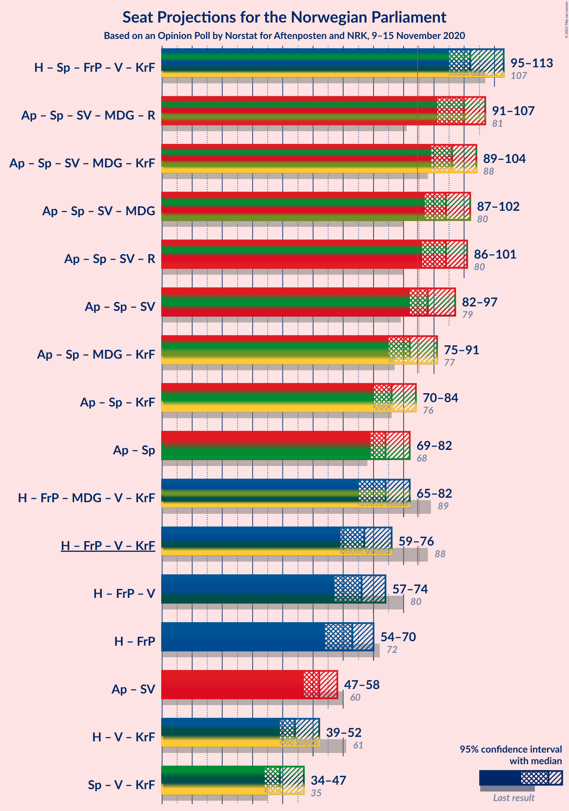

### Confidence Intervals

| Coalition | Last Result | Median | Majority? | 80% Confidence Interval | 90% Confidence Interval | 95% Confidence Interval | 99% Confidence Interval |
|:---------:|:-----------:|:------:|:---------:|:-----------------------:|:-----------------------:|:-----------------------:|:-----------------------:|
| Høyre – Senterpartiet – Fremskrittspartiet – Venstre – Kristelig Folkeparti | 107 | 102 | 100% | 98–109 | 96–111 | 95–113 | 92–114 |
| Arbeiderpartiet – Senterpartiet – Sosialistisk Venstreparti – Miljøpartiet De Grønne – Rødt | 81 | 100 | 100% | 95–105 | 93–106 | 91–107 | 89–109 |
| Arbeiderpartiet – Senterpartiet – Sosialistisk Venstreparti – Miljøpartiet De Grønne – Kristelig Folkeparti | 88 | 96 | 99.9% | 91–101 | 90–103 | 89–104 | 86–107 |
| Arbeiderpartiet – Senterpartiet – Sosialistisk Venstreparti – Miljøpartiet De Grønne | 80 | 94 | 99.3% | 89–100 | 88–101 | 87–102 | 84–106 |
| Arbeiderpartiet – Senterpartiet – Sosialistisk Venstreparti – Rødt | 80 | 94 | 98.9% | 88–98 | 87–100 | 86–101 | 83–104 |
| Arbeiderpartiet – Senterpartiet – Sosialistisk Venstreparti | 79 | 88 | 83% | 83–93 | 83–94 | 82–97 | 79–98 |
| Arbeiderpartiet – Senterpartiet – Miljøpartiet De Grønne – Kristelig Folkeparti | 77 | 82 | 30% | 77–88 | 76–89 | 75–91 | 73–92 |
| Arbeiderpartiet – Senterpartiet – Kristelig Folkeparti | 76 | 76 | 1.3% | 72–81 | 70–83 | 70–84 | 68–86 |
| Arbeiderpartiet – Senterpartiet | 68 | 74 | 0.1% | 70–79 | 69–80 | 69–82 | 66–83 |
| Høyre – Fremskrittspartiet – Miljøpartiet De Grønne – Venstre – Kristelig Folkeparti | 89 | 74 | 0.3% | 67–79 | 66–81 | 65–82 | 62–84 |
| Høyre – Fremskrittspartiet – Venstre – Kristelig Folkeparti | 88 | 67 | 0% | 62–73 | 61–74 | 59–76 | 57–78 |
| Høyre – Fremskrittspartiet – Venstre | 80 | 66 | 0% | 61–71 | 59–72 | 57–74 | 55–76 |
| Høyre – Fremskrittspartiet | 72 | 63 | 0% | 58–69 | 56–70 | 54–70 | 53–72 |
| Arbeiderpartiet – Sosialistisk Venstreparti | 60 | 52 | 0% | 49–57 | 48–58 | 47–58 | 44–60 |
| Høyre – Venstre – Kristelig Folkeparti | 61 | 44 | 0% | 41–48 | 39–50 | 39–52 | 37–54 |
| Senterpartiet – Venstre – Kristelig Folkeparti | 35 | 39 | 0% | 36–45 | 35–46 | 34–47 | 33–49 |

### Høyre – Senterpartiet – Fremskrittspartiet – Venstre – Kristelig Folkeparti

| Number of Seats | Probability | Accumulated | Special Marks |
|:---------------:|:-----------:|:-----------:|:-------------:|
| 90 | 0.1% | 100% |  |
| 91 | 0.3% | 99.9% |  |
| 92 | 0.1% | 99.6% |  |
| 93 | 0.4% | 99.5% |  |
| 94 | 0.5% | 99.1% |  |
| 95 | 1.3% | 98.6% |  |
| 96 | 3% | 97% |  |
| 97 | 3% | 94% |  |
| 98 | 7% | 91% |  |
| 99 | 7% | 84% |  |
| 100 | 4% | 77% |  |
| 101 | 13% | 73% | Median |
| 102 | 11% | 60% |  |
| 103 | 6% | 49% |  |
| 104 | 7% | 43% |  |
| 105 | 7% | 36% |  |
| 106 | 5% | 29% |  |
| 107 | 6% | 24% | Last Result |
| 108 | 6% | 18% |  |
| 109 | 3% | 12% |  |
| 110 | 1.5% | 9% |  |
| 111 | 4% | 7% |  |
| 112 | 1.0% | 4% |  |
| 113 | 2% | 3% |  |
| 114 | 0.3% | 0.7% |  |
| 115 | 0.1% | 0.4% |  |
| 116 | 0.2% | 0.2% |  |
| 117 | 0% | 0.1% |  |
| 118 | 0% | 0% |  |

### Arbeiderpartiet – Senterpartiet – Sosialistisk Venstreparti – Miljøpartiet De Grønne – Rødt

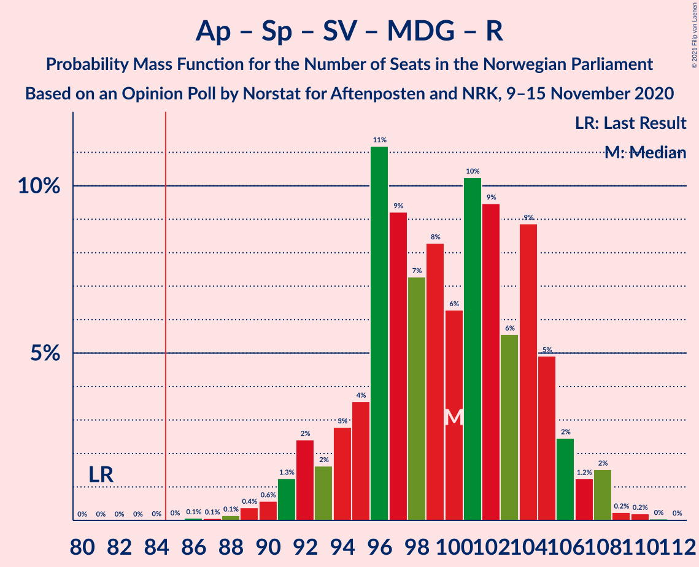

| Number of Seats | Probability | Accumulated | Special Marks |
|:---------------:|:-----------:|:-----------:|:-------------:|
| 81 | 0% | 100% | Last Result |
| 82 | 0% | 100% |  |
| 83 | 0% | 100% |  |
| 84 | 0% | 100% |  |
| 85 | 0% | 100% | Majority |
| 86 | 0.1% | 100% |  |
| 87 | 0.1% | 99.9% |  |
| 88 | 0.1% | 99.8% |  |
| 89 | 0.4% | 99.7% |  |
| 90 | 0.6% | 99.3% |  |
| 91 | 1.3% | 98.7% |  |
| 92 | 2% | 97% |  |
| 93 | 2% | 95% |  |
| 94 | 3% | 93% |  |
| 95 | 4% | 91% |  |
| 96 | 11% | 87% |  |
| 97 | 9% | 76% |  |
| 98 | 7% | 67% |  |
| 99 | 8% | 59% |  |
| 100 | 6% | 51% |  |
| 101 | 10% | 45% |  |
| 102 | 9% | 35% | Median |
| 103 | 6% | 25% |  |
| 104 | 9% | 20% |  |
| 105 | 5% | 11% |  |
| 106 | 2% | 6% |  |
| 107 | 1.2% | 3% |  |
| 108 | 2% | 2% |  |
| 109 | 0.2% | 0.5% |  |
| 110 | 0.2% | 0.3% |  |
| 111 | 0% | 0.1% |  |
| 112 | 0% | 0% |  |

### Arbeiderpartiet – Senterpartiet – Sosialistisk Venstreparti – Miljøpartiet De Grønne – Kristelig Folkeparti

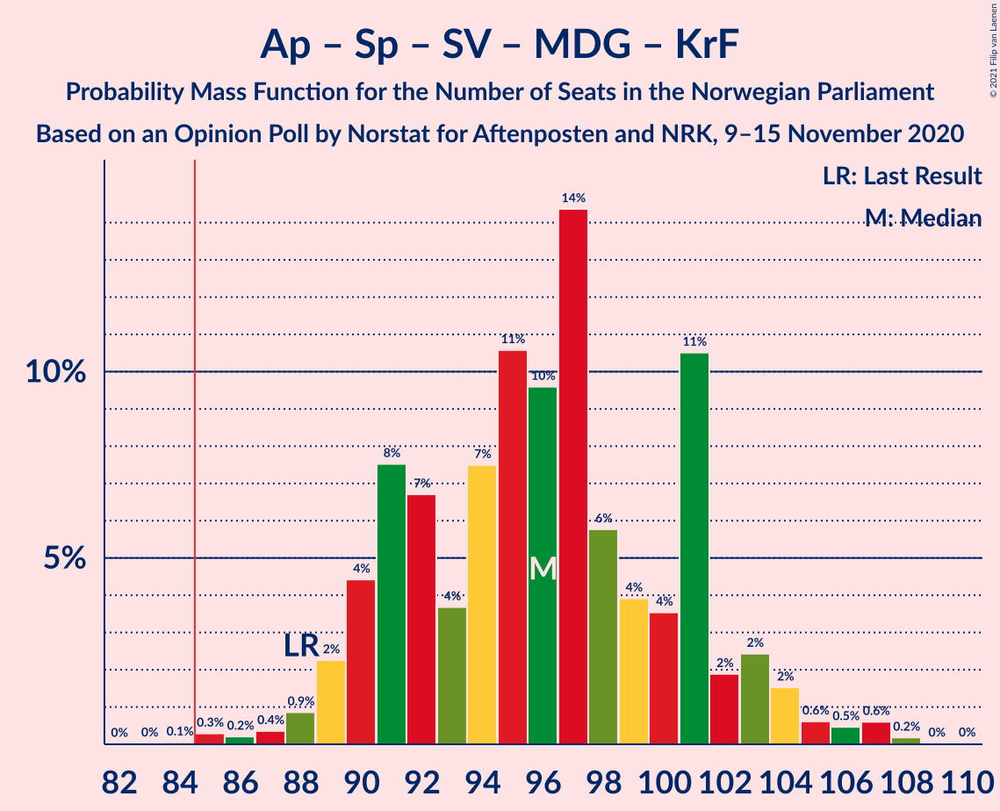

| Number of Seats | Probability | Accumulated | Special Marks |
|:---------------:|:-----------:|:-----------:|:-------------:|
| 83 | 0% | 100% |  |
| 84 | 0.1% | 99.9% |  |
| 85 | 0.3% | 99.9% | Majority |
| 86 | 0.2% | 99.6% |  |
| 87 | 0.4% | 99.4% |  |
| 88 | 0.9% | 99.0% | Last Result |
| 89 | 2% | 98% |  |
| 90 | 4% | 96% |  |
| 91 | 8% | 91% |  |
| 92 | 7% | 84% |  |
| 93 | 4% | 77% |  |
| 94 | 7% | 74% |  |
| 95 | 11% | 66% |  |
| 96 | 10% | 55% | Median |
| 97 | 14% | 46% |  |
| 98 | 6% | 32% |  |
| 99 | 4% | 26% |  |
| 100 | 4% | 22% |  |
| 101 | 11% | 18% |  |
| 102 | 2% | 8% |  |
| 103 | 2% | 6% |  |
| 104 | 2% | 3% |  |
| 105 | 0.6% | 2% |  |
| 106 | 0.5% | 1.3% |  |
| 107 | 0.6% | 0.8% |  |
| 108 | 0.2% | 0.2% |  |
| 109 | 0% | 0.1% |  |
| 110 | 0% | 0% |  |

### Arbeiderpartiet – Senterpartiet – Sosialistisk Venstreparti – Miljøpartiet De Grønne

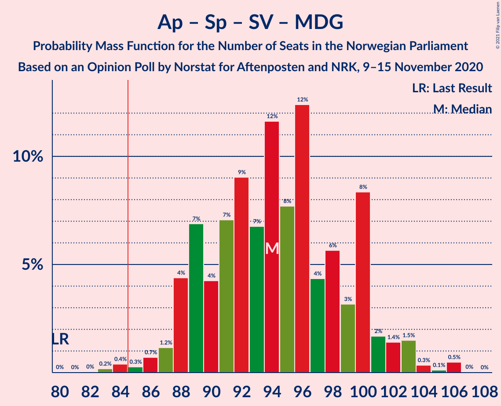

| Number of Seats | Probability | Accumulated | Special Marks |
|:---------------:|:-----------:|:-----------:|:-------------:|
| 80 | 0% | 100% | Last Result |
| 81 | 0% | 100% |  |
| 82 | 0% | 100% |  |
| 83 | 0.2% | 99.9% |  |
| 84 | 0.4% | 99.7% |  |
| 85 | 0.3% | 99.3% | Majority |
| 86 | 0.7% | 99.1% |  |
| 87 | 1.2% | 98% |  |
| 88 | 4% | 97% |  |
| 89 | 7% | 93% |  |
| 90 | 4% | 86% |  |
| 91 | 7% | 82% |  |
| 92 | 9% | 75% |  |
| 93 | 7% | 66% |  |
| 94 | 12% | 59% |  |
| 95 | 8% | 47% | Median |
| 96 | 12% | 39% |  |
| 97 | 4% | 27% |  |
| 98 | 6% | 23% |  |
| 99 | 3% | 17% |  |
| 100 | 8% | 14% |  |
| 101 | 2% | 6% |  |
| 102 | 1.4% | 4% |  |
| 103 | 1.5% | 2% |  |
| 104 | 0.3% | 1.0% |  |
| 105 | 0.1% | 0.6% |  |
| 106 | 0.5% | 0.5% |  |
| 107 | 0% | 0% |  |

### Arbeiderpartiet – Senterpartiet – Sosialistisk Venstreparti – Rødt

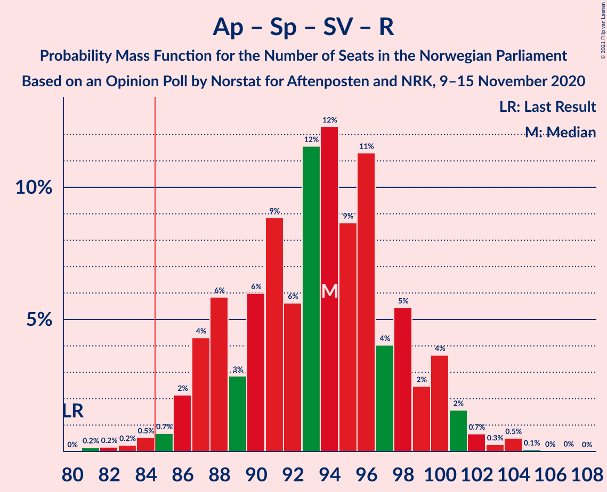

| Number of Seats | Probability | Accumulated | Special Marks |
|:---------------:|:-----------:|:-----------:|:-------------:|
| 80 | 0% | 100% | Last Result |
| 81 | 0.2% | 100% |  |
| 82 | 0.2% | 99.8% |  |
| 83 | 0.2% | 99.7% |  |
| 84 | 0.5% | 99.4% |  |
| 85 | 0.7% | 98.9% | Majority |
| 86 | 2% | 98% |  |
| 87 | 4% | 96% |  |
| 88 | 6% | 92% |  |
| 89 | 3% | 86% |  |
| 90 | 6% | 83% |  |
| 91 | 9% | 77% |  |
| 92 | 6% | 68% |  |
| 93 | 12% | 63% |  |
| 94 | 12% | 51% | Median |
| 95 | 9% | 39% |  |
| 96 | 11% | 30% |  |
| 97 | 4% | 19% |  |
| 98 | 5% | 15% |  |
| 99 | 2% | 9% |  |
| 100 | 4% | 7% |  |
| 101 | 2% | 3% |  |
| 102 | 0.7% | 2% |  |
| 103 | 0.3% | 0.9% |  |
| 104 | 0.5% | 0.6% |  |
| 105 | 0.1% | 0.1% |  |
| 106 | 0% | 0.1% |  |
| 107 | 0% | 0% |  |

### Arbeiderpartiet – Senterpartiet – Sosialistisk Venstreparti

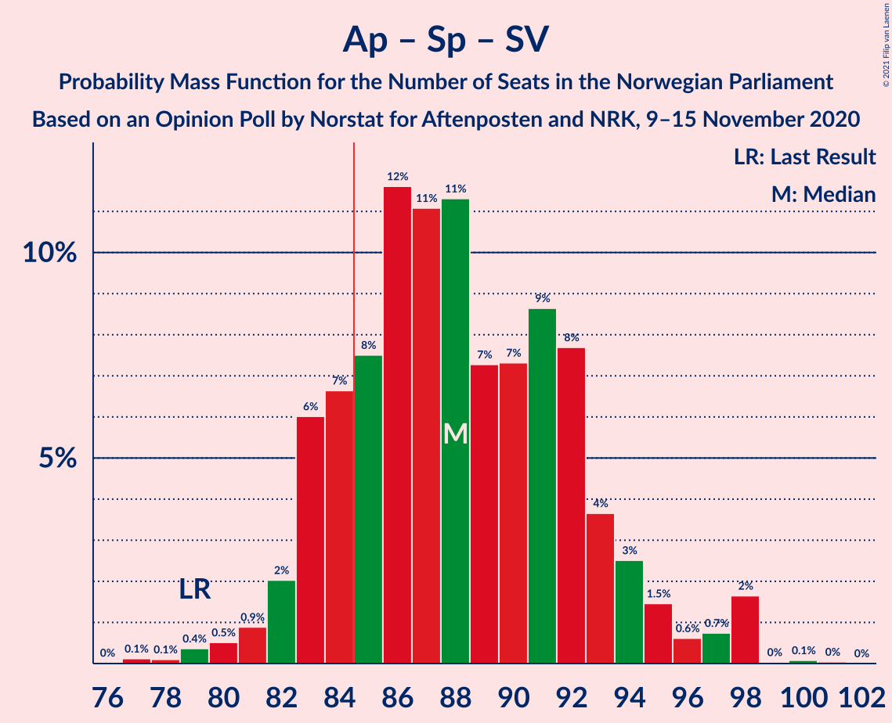

| Number of Seats | Probability | Accumulated | Special Marks |
|:---------------:|:-----------:|:-----------:|:-------------:|
| 77 | 0.1% | 100% |  |
| 78 | 0.1% | 99.8% |  |
| 79 | 0.4% | 99.7% | Last Result |
| 80 | 0.5% | 99.4% |  |
| 81 | 0.9% | 98.9% |  |
| 82 | 2% | 98% |  |
| 83 | 6% | 96% |  |
| 84 | 7% | 90% |  |
| 85 | 8% | 83% | Majority |
| 86 | 12% | 76% |  |
| 87 | 11% | 64% | Median |
| 88 | 11% | 53% |  |
| 89 | 7% | 42% |  |
| 90 | 7% | 34% |  |
| 91 | 9% | 27% |  |
| 92 | 8% | 19% |  |
| 93 | 4% | 11% |  |
| 94 | 3% | 7% |  |
| 95 | 1.5% | 5% |  |
| 96 | 0.6% | 3% |  |
| 97 | 0.7% | 3% |  |
| 98 | 2% | 2% |  |
| 99 | 0% | 0.2% |  |
| 100 | 0.1% | 0.1% |  |
| 101 | 0% | 0.1% |  |
| 102 | 0% | 0% |  |

### Arbeiderpartiet – Senterpartiet – Miljøpartiet De Grønne – Kristelig Folkeparti

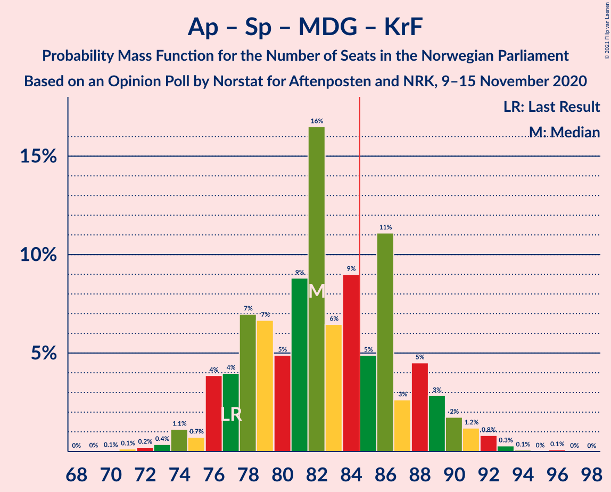

| Number of Seats | Probability | Accumulated | Special Marks |
|:---------------:|:-----------:|:-----------:|:-------------:|
| 70 | 0.1% | 100% |  |
| 71 | 0.1% | 99.9% |  |
| 72 | 0.2% | 99.8% |  |
| 73 | 0.4% | 99.6% |  |
| 74 | 1.1% | 99.2% |  |
| 75 | 0.7% | 98% |  |
| 76 | 4% | 97% |  |
| 77 | 4% | 93% | Last Result |
| 78 | 7% | 90% |  |
| 79 | 7% | 83% |  |
| 80 | 5% | 76% |  |
| 81 | 9% | 71% |  |
| 82 | 16% | 62% |  |
| 83 | 6% | 46% | Median |
| 84 | 9% | 39% |  |
| 85 | 5% | 30% | Majority |
| 86 | 11% | 25% |  |
| 87 | 3% | 14% |  |
| 88 | 5% | 12% |  |
| 89 | 3% | 7% |  |
| 90 | 2% | 4% |  |
| 91 | 1.2% | 3% |  |
| 92 | 0.8% | 1.3% |  |
| 93 | 0.3% | 0.5% |  |
| 94 | 0.1% | 0.2% |  |
| 95 | 0% | 0.1% |  |
| 96 | 0.1% | 0.1% |  |
| 97 | 0% | 0% |  |

### Arbeiderpartiet – Senterpartiet – Kristelig Folkeparti

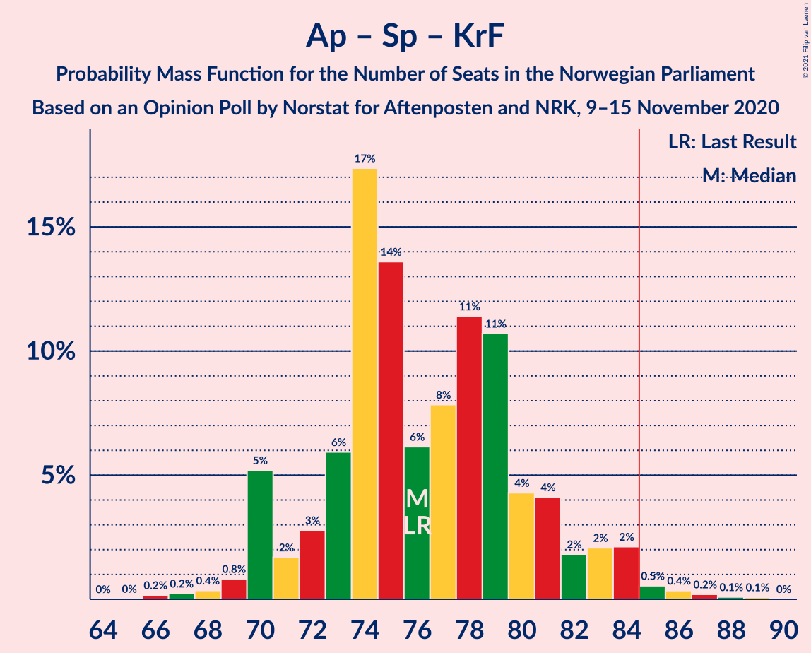

| Number of Seats | Probability | Accumulated | Special Marks |
|:---------------:|:-----------:|:-----------:|:-------------:|
| 66 | 0.2% | 100% |  |
| 67 | 0.2% | 99.8% |  |
| 68 | 0.4% | 99.6% |  |
| 69 | 0.8% | 99.2% |  |
| 70 | 5% | 98% |  |
| 71 | 2% | 93% |  |
| 72 | 3% | 91% |  |
| 73 | 6% | 89% |  |
| 74 | 17% | 83% |  |
| 75 | 14% | 65% | Median |
| 76 | 6% | 52% | Last Result |
| 77 | 8% | 46% |  |
| 78 | 11% | 38% |  |
| 79 | 11% | 26% |  |
| 80 | 4% | 16% |  |
| 81 | 4% | 11% |  |
| 82 | 2% | 7% |  |
| 83 | 2% | 5% |  |
| 84 | 2% | 3% |  |
| 85 | 0.5% | 1.3% | Majority |
| 86 | 0.4% | 0.7% |  |
| 87 | 0.2% | 0.4% |  |
| 88 | 0.1% | 0.2% |  |
| 89 | 0.1% | 0.1% |  |
| 90 | 0% | 0% |  |

### Arbeiderpartiet – Senterpartiet

| Number of Seats | Probability | Accumulated | Special Marks |
|:---------------:|:-----------:|:-----------:|:-------------:|
| 64 | 0.1% | 100% |  |
| 65 | 0.2% | 99.9% |  |
| 66 | 0.3% | 99.7% |  |
| 67 | 0.6% | 99.4% |  |
| 68 | 1.3% | 98.8% | Last Result |
| 69 | 5% | 98% |  |
| 70 | 3% | 92% |  |
| 71 | 4% | 89% |  |
| 72 | 11% | 85% |  |
| 73 | 19% | 74% |  |
| 74 | 7% | 55% | Median |
| 75 | 11% | 48% |  |
| 76 | 5% | 37% |  |
| 77 | 11% | 32% |  |
| 78 | 10% | 21% |  |
| 79 | 5% | 11% |  |
| 80 | 2% | 6% |  |
| 81 | 1.2% | 4% |  |
| 82 | 1.0% | 3% |  |
| 83 | 2% | 2% |  |
| 84 | 0.3% | 0.4% |  |
| 85 | 0% | 0.1% | Majority |
| 86 | 0.1% | 0.1% |  |
| 87 | 0% | 0% |  |

### Høyre – Fremskrittspartiet – Miljøpartiet De Grønne – Venstre – Kristelig Folkeparti

| Number of Seats | Probability | Accumulated | Special Marks |
|:---------------:|:-----------:|:-----------:|:-------------:|
| 60 | 0.1% | 100% |  |
| 61 | 0.2% | 99.9% |  |
| 62 | 0.4% | 99.7% |  |
| 63 | 0.2% | 99.4% |  |
| 64 | 0.9% | 99.1% |  |
| 65 | 1.0% | 98% |  |
| 66 | 3% | 97% |  |
| 67 | 5% | 95% |  |
| 68 | 3% | 89% |  |
| 69 | 5% | 86% |  |
| 70 | 4% | 81% |  |
| 71 | 8% | 77% |  |
| 72 | 5% | 69% |  |
| 73 | 11% | 65% |  |
| 74 | 8% | 54% | Median |
| 75 | 12% | 46% |  |
| 76 | 10% | 34% |  |
| 77 | 4% | 24% |  |
| 78 | 7% | 19% |  |
| 79 | 3% | 12% |  |
| 80 | 2% | 9% |  |
| 81 | 5% | 7% |  |
| 82 | 1.2% | 3% |  |
| 83 | 0.5% | 1.3% |  |
| 84 | 0.5% | 0.8% |  |
| 85 | 0.2% | 0.3% | Majority |
| 86 | 0.1% | 0.1% |  |
| 87 | 0% | 0% |  |
| 88 | 0% | 0% |  |
| 89 | 0% | 0% | Last Result |

### Høyre – Fremskrittspartiet – Venstre – Kristelig Folkeparti

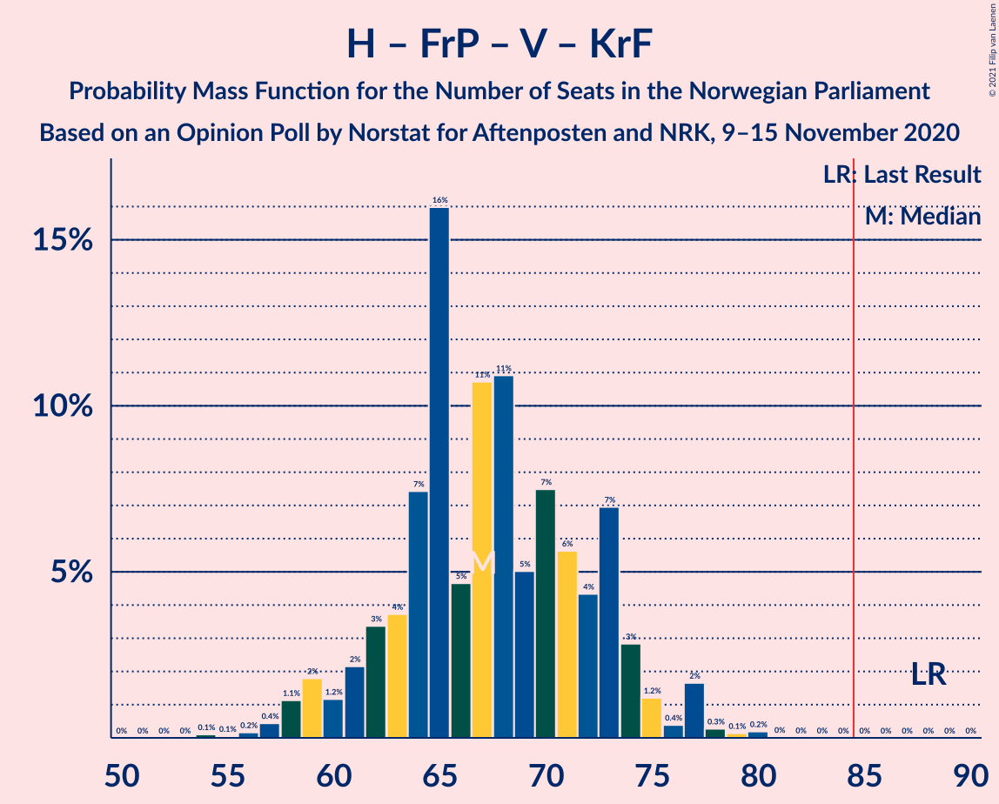

| Number of Seats | Probability | Accumulated | Special Marks |
|:---------------:|:-----------:|:-----------:|:-------------:|
| 54 | 0.1% | 100% |  |
| 55 | 0.1% | 99.9% |  |
| 56 | 0.2% | 99.8% |  |
| 57 | 0.4% | 99.7% |  |
| 58 | 1.1% | 99.2% |  |
| 59 | 2% | 98% |  |
| 60 | 1.2% | 96% |  |
| 61 | 2% | 95% |  |
| 62 | 3% | 93% |  |
| 63 | 4% | 90% |  |
| 64 | 7% | 86% |  |
| 65 | 16% | 78% |  |
| 66 | 5% | 62% | Median |
| 67 | 11% | 58% |  |
| 68 | 11% | 47% |  |
| 69 | 5% | 36% |  |
| 70 | 7% | 31% |  |
| 71 | 6% | 24% |  |
| 72 | 4% | 18% |  |
| 73 | 7% | 14% |  |
| 74 | 3% | 7% |  |
| 75 | 1.2% | 4% |  |
| 76 | 0.4% | 3% |  |
| 77 | 2% | 2% |  |
| 78 | 0.3% | 0.6% |  |
| 79 | 0.1% | 0.4% |  |
| 80 | 0.2% | 0.2% |  |
| 81 | 0% | 0% |  |
| 82 | 0% | 0% |  |
| 83 | 0% | 0% |  |
| 84 | 0% | 0% |  |
| 85 | 0% | 0% | Majority |
| 86 | 0% | 0% |  |
| 87 | 0% | 0% |  |
| 88 | 0% | 0% | Last Result |

### Høyre – Fremskrittspartiet – Venstre

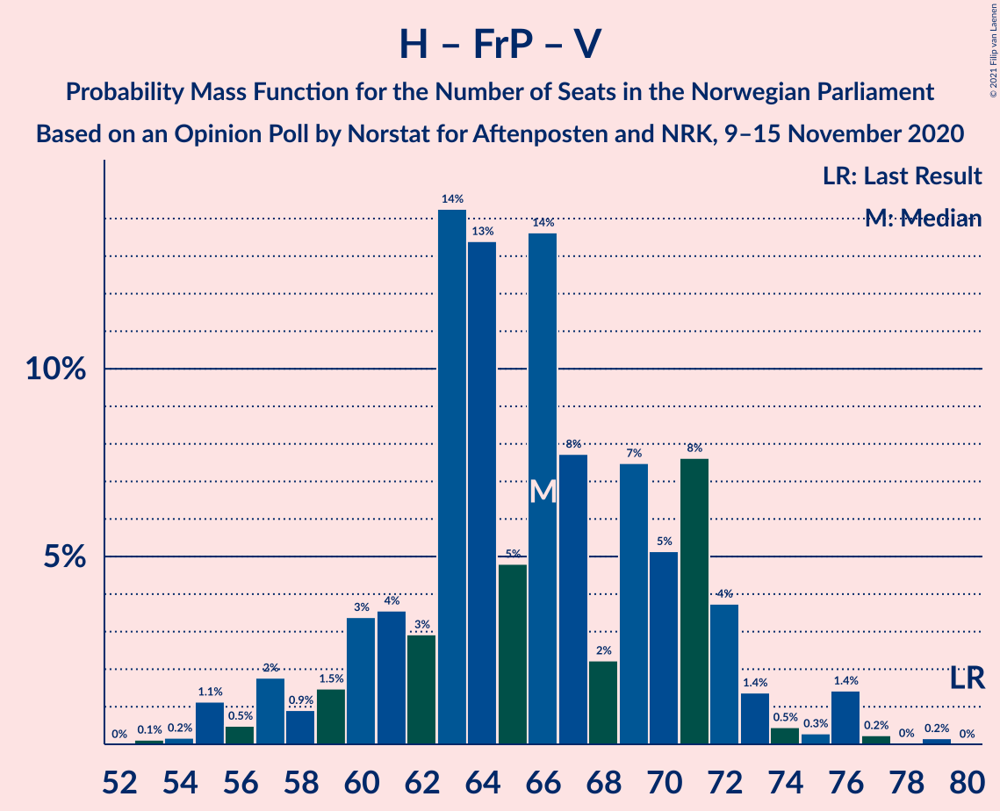

| Number of Seats | Probability | Accumulated | Special Marks |
|:---------------:|:-----------:|:-----------:|:-------------:|
| 53 | 0.1% | 100% |  |
| 54 | 0.2% | 99.9% |  |
| 55 | 1.1% | 99.7% |  |
| 56 | 0.5% | 98.6% |  |
| 57 | 2% | 98% |  |
| 58 | 0.9% | 96% |  |
| 59 | 1.5% | 95% |  |
| 60 | 3% | 94% |  |
| 61 | 4% | 91% |  |
| 62 | 3% | 87% |  |
| 63 | 14% | 84% |  |
| 64 | 13% | 70% |  |
| 65 | 5% | 56% | Median |
| 66 | 14% | 52% |  |
| 67 | 8% | 38% |  |
| 68 | 2% | 30% |  |
| 69 | 7% | 28% |  |
| 70 | 5% | 21% |  |
| 71 | 8% | 15% |  |
| 72 | 4% | 8% |  |
| 73 | 1.4% | 4% |  |
| 74 | 0.5% | 3% |  |
| 75 | 0.3% | 2% |  |
| 76 | 1.4% | 2% |  |
| 77 | 0.2% | 0.4% |  |
| 78 | 0% | 0.2% |  |
| 79 | 0.2% | 0.2% |  |
| 80 | 0% | 0% | Last Result |

### Høyre – Fremskrittspartiet

| Number of Seats | Probability | Accumulated | Special Marks |
|:---------------:|:-----------:|:-----------:|:-------------:|
| 51 | 0.1% | 100% |  |
| 52 | 0.2% | 99.9% |  |
| 53 | 1.2% | 99.7% |  |
| 54 | 1.4% | 98% |  |
| 55 | 1.0% | 97% |  |
| 56 | 1.2% | 96% |  |
| 57 | 2% | 95% |  |
| 58 | 3% | 93% |  |
| 59 | 4% | 89% |  |
| 60 | 3% | 85% |  |
| 61 | 15% | 82% |  |
| 62 | 14% | 67% |  |
| 63 | 6% | 54% | Median |
| 64 | 12% | 48% |  |
| 65 | 7% | 36% |  |
| 66 | 3% | 29% |  |
| 67 | 9% | 26% |  |
| 68 | 5% | 16% |  |
| 69 | 6% | 11% |  |
| 70 | 4% | 5% |  |
| 71 | 1.1% | 2% |  |
| 72 | 0.3% | 0.6% | Last Result |
| 73 | 0.1% | 0.3% |  |
| 74 | 0.1% | 0.2% |  |
| 75 | 0.1% | 0.1% |  |
| 76 | 0% | 0% |  |

### Arbeiderpartiet – Sosialistisk Venstreparti

| Number of Seats | Probability | Accumulated | Special Marks |
|:---------------:|:-----------:|:-----------:|:-------------:|
| 42 | 0.1% | 100% |  |
| 43 | 0.1% | 99.9% |  |
| 44 | 0.4% | 99.8% |  |
| 45 | 0.5% | 99.3% |  |
| 46 | 1.1% | 98.8% |  |
| 47 | 2% | 98% |  |
| 48 | 3% | 96% |  |
| 49 | 10% | 93% |  |
| 50 | 10% | 83% |  |
| 51 | 17% | 73% |  |
| 52 | 14% | 57% | Median |
| 53 | 4% | 43% |  |
| 54 | 11% | 39% |  |
| 55 | 10% | 28% |  |
| 56 | 7% | 18% |  |
| 57 | 3% | 10% |  |
| 58 | 5% | 7% |  |
| 59 | 0.8% | 2% |  |
| 60 | 1.0% | 1.3% | Last Result |
| 61 | 0.2% | 0.4% |  |
| 62 | 0.1% | 0.2% |  |
| 63 | 0.1% | 0.1% |  |
| 64 | 0% | 0% |  |

### Høyre – Venstre – Kristelig Folkeparti

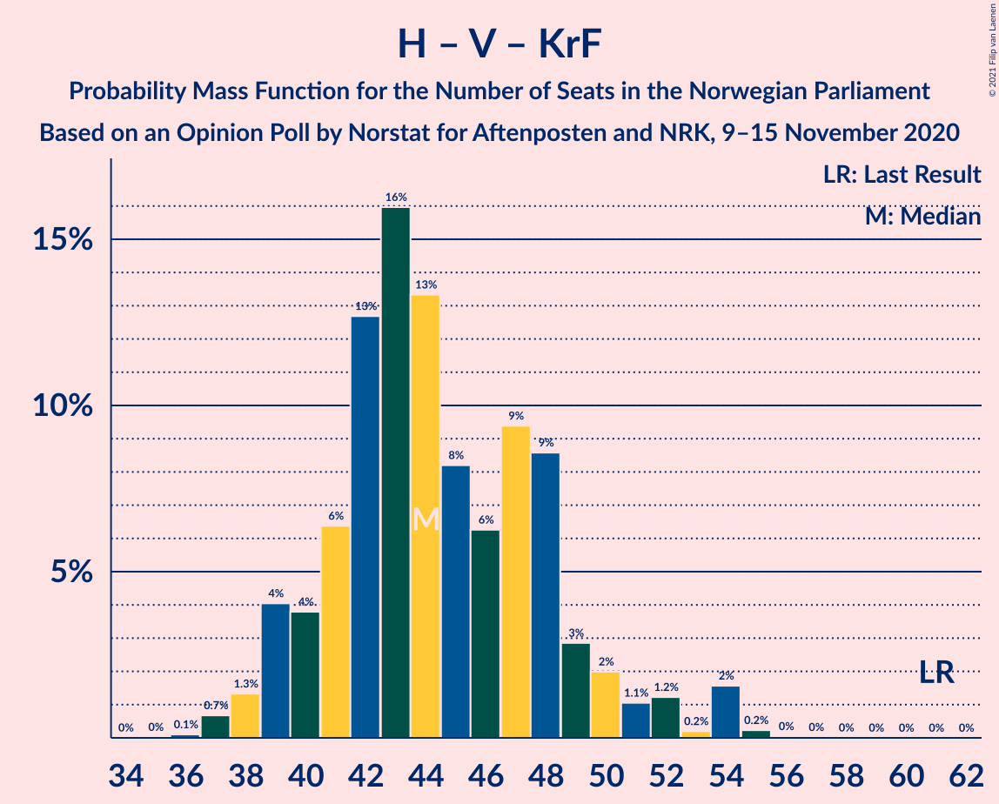

| Number of Seats | Probability | Accumulated | Special Marks |
|:---------------:|:-----------:|:-----------:|:-------------:|
| 36 | 0.1% | 100% |  |
| 37 | 0.7% | 99.9% |  |
| 38 | 1.3% | 99.2% |  |
| 39 | 4% | 98% |  |
| 40 | 4% | 94% |  |
| 41 | 6% | 90% |  |
| 42 | 13% | 84% |  |
| 43 | 16% | 71% | Median |
| 44 | 13% | 55% |  |
| 45 | 8% | 42% |  |
| 46 | 6% | 33% |  |
| 47 | 9% | 27% |  |
| 48 | 9% | 18% |  |
| 49 | 3% | 9% |  |
| 50 | 2% | 6% |  |
| 51 | 1.1% | 4% |  |
| 52 | 1.2% | 3% |  |
| 53 | 0.2% | 2% |  |
| 54 | 2% | 2% |  |
| 55 | 0.2% | 0.3% |  |
| 56 | 0% | 0.1% |  |
| 57 | 0% | 0% |  |
| 58 | 0% | 0% |  |
| 59 | 0% | 0% |  |
| 60 | 0% | 0% |  |
| 61 | 0% | 0% | Last Result |

### Senterpartiet – Venstre – Kristelig Folkeparti

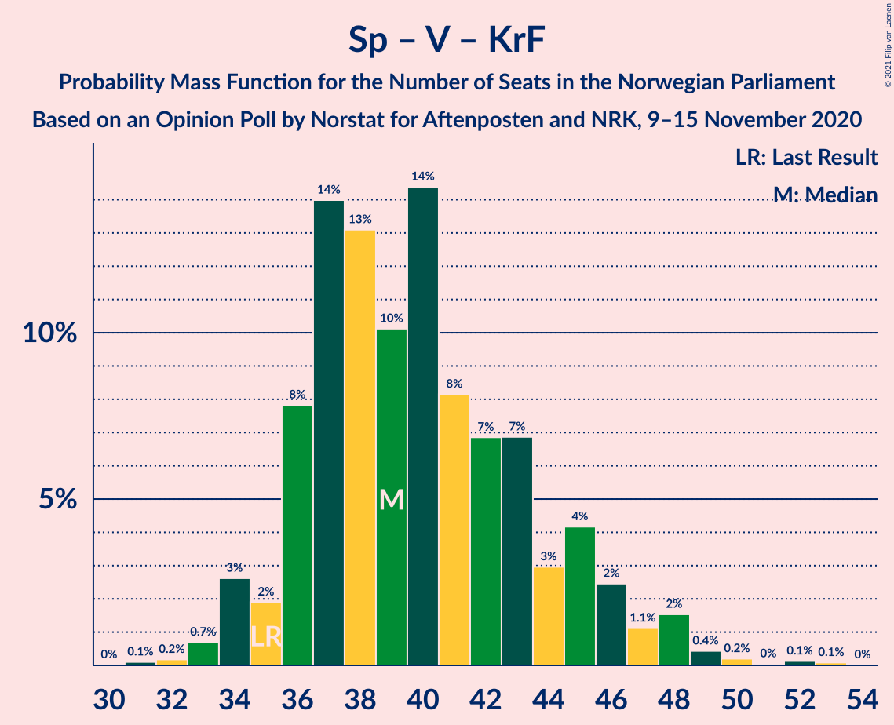

| Number of Seats | Probability | Accumulated | Special Marks |
|:---------------:|:-----------:|:-----------:|:-------------:|
| 31 | 0.1% | 100% |  |
| 32 | 0.2% | 99.9% |  |
| 33 | 0.7% | 99.7% |  |
| 34 | 3% | 99.0% |  |
| 35 | 2% | 96% | Last Result |
| 36 | 8% | 94% |  |
| 37 | 14% | 87% |  |
| 38 | 13% | 73% | Median |
| 39 | 10% | 60% |  |
| 40 | 14% | 49% |  |
| 41 | 8% | 35% |  |
| 42 | 7% | 27% |  |
| 43 | 7% | 20% |  |
| 44 | 3% | 13% |  |
| 45 | 4% | 10% |  |
| 46 | 2% | 6% |  |
| 47 | 1.1% | 4% |  |
| 48 | 2% | 2% |  |
| 49 | 0.4% | 0.9% |  |
| 50 | 0.2% | 0.5% |  |
| 51 | 0% | 0.3% |  |
| 52 | 0.1% | 0.2% |  |
| 53 | 0.1% | 0.1% |  |
| 54 | 0% | 0% |  |

## Technical Information

### Opinion Poll

+ **Polling firm:** Norstat
+ **Commissioner(s):** Aftenposten and NRK
+ **Fieldwork period:** 9–15 November 2020

### Calculations

+ **Sample size:** 952
+ **Simulations done:** 1,048,576
+ **Error estimate:** 2.70%

