# Opinion Poll by Ipsos MMI for Dagbladet, 16–18 November 2020

<a href="#voting-intentions">Voting Intentions</a> | <a href="#seats">Seats</a> | <a href="#coalitions">Coalitions</a> | <a href="#technical-information">Technical Information</a>

## Voting Intentions

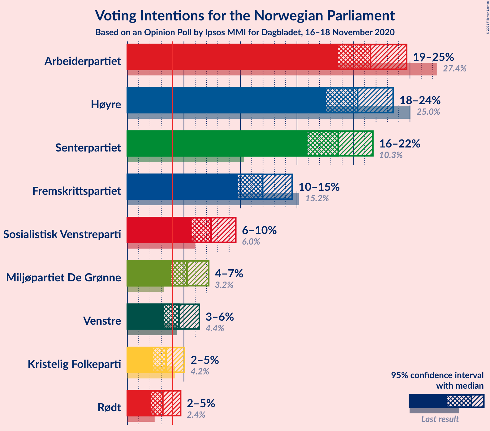

### Confidence Intervals

| Party | Last Result | Poll Result | 80% Confidence Interval | 90% Confidence Interval | 95% Confidence Interval | 99% Confidence Interval |
|:-----:|:-----------:|:-----------:|:-----------------------:|:-----------------------:|:-----------------------:|:-----------------------:|
| Arbeiderpartiet | 27.4% | 21.5% | 19.6–23.6% |19.1–24.2% |18.6–24.7% |17.7–25.7% |
| Høyre | 25.0% | 20.4% | 18.5–22.4% |18.0–23.0% |17.6–23.5% |16.7–24.5% |
| Senterpartiet | 10.3% | 18.7% | 16.9–20.7% |16.4–21.2% |15.9–21.7% |15.1–22.7% |
| Fremskrittspartiet | 15.2% | 12.0% | 10.5–13.7% |10.1–14.2% |9.8–14.6% |9.1–15.4% |
| Sosialistisk Venstreparti | 6.0% | 7.4% | 6.3–8.8% |6.0–9.2% |5.7–9.6% |5.2–10.3% |
| Miljøpartiet De Grønne | 3.2% | 5.3% | 4.3–6.5% |4.1–6.9% |3.8–7.2% |3.4–7.8% |
| Venstre | 4.4% | 4.6% | 3.7–5.7% |3.4–6.1% |3.2–6.4% |2.9–7.0% |
| Kristelig Folkeparti | 4.2% | 3.4% | 2.7–4.5% |2.5–4.8% |2.3–5.0% |2.0–5.6% |
| Rødt | 2.4% | 3.1% | 2.4–4.2% |2.2–4.5% |2.1–4.7% |1.8–5.2% |

*Note:* The poll result column reflects the actual value used in the calculations. Published results may vary slightly, and in addition be rounded to fewer digits.

## Seats

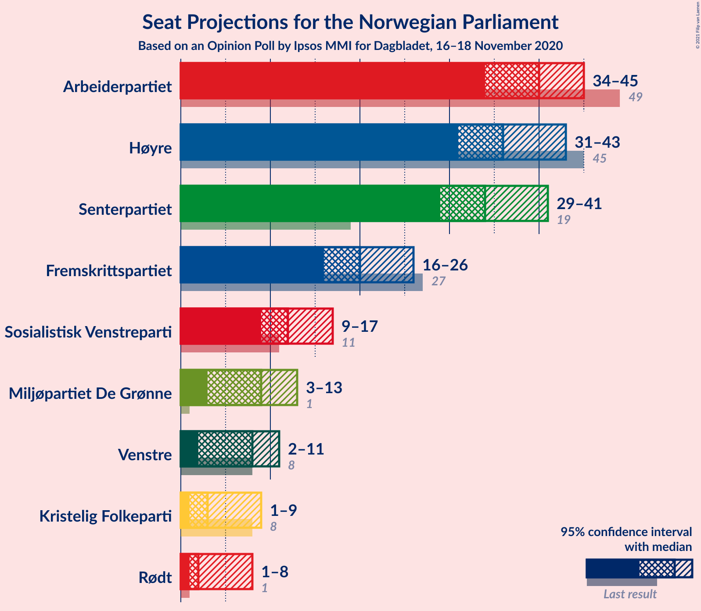

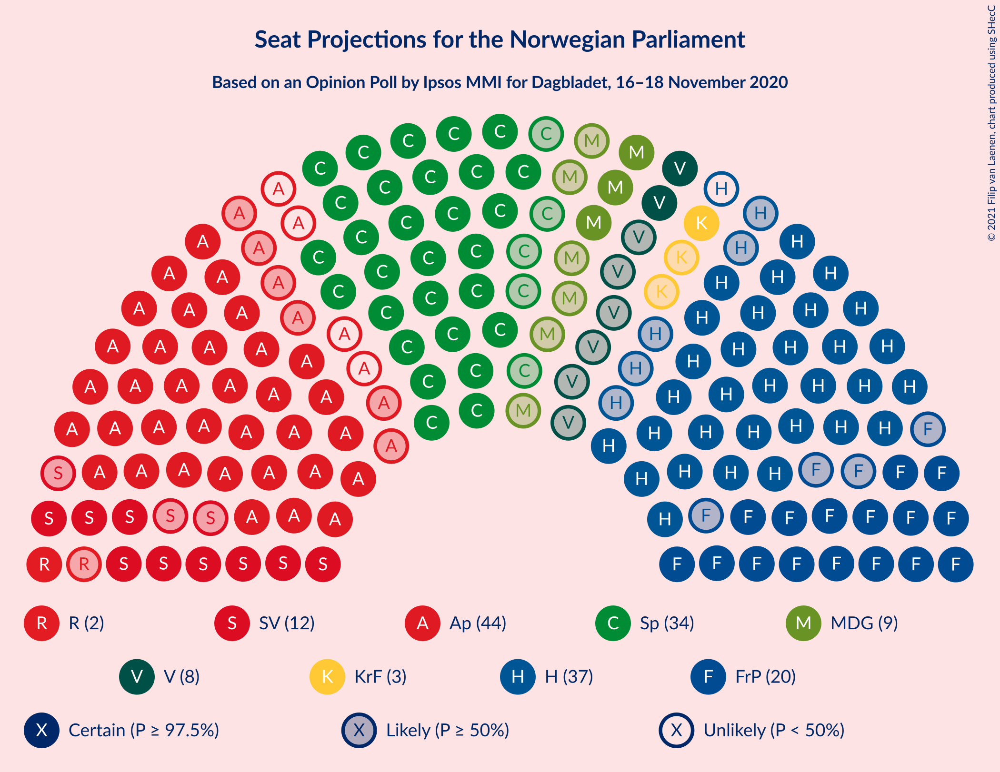

### Confidence Intervals

| Party | Last Result | Median | 80% Confidence Interval | 90% Confidence Interval | 95% Confidence Interval | 99% Confidence Interval |
|:-----:|:-----------:|:------:|:-----------------------:|:-----------------------:|:-----------------------:|:-----------------------:|
| <a href="#arbeiderpartiet">Arbeiderpartiet</a> | 49 | 40 | 36–44 |35–44 |34–45 |32–47 |
| <a href="#høyre">Høyre</a> | 45 | 36 | 33–41 |32–42 |31–43 |29–44 |
| <a href="#senterpartiet">Senterpartiet</a> | 19 | 34 | 31–39 |30–40 |29–41 |27–44 |
| <a href="#fremskrittspartiet">Fremskrittspartiet</a> | 27 | 20 | 17–23 |16–25 |16–26 |14–29 |
| <a href="#sosialistisk-venstreparti">Sosialistisk Venstreparti</a> | 11 | 12 | 10–15 |9–16 |9–17 |8–18 |
| <a href="#miljøpartiet-de-grønne">Miljøpartiet De Grønne</a> | 1 | 9 | 7–12 |7–12 |3–13 |2–14 |
| <a href="#venstre">Venstre</a> | 8 | 8 | 2–10 |2–11 |2–11 |2–12 |
| <a href="#kristelig-folkeparti">Kristelig Folkeparti</a> | 8 | 3 | 1–8 |1–8 |1–9 |0–10 |
| <a href="#rødt">Rødt</a> | 1 | 2 | 1–6 |1–7 |1–8 |1–9 |

### Arbeiderpartiet

*For a full overview of the results for this party, see the [Arbeiderpartiet](party-arbeiderpartiet.html) page.*

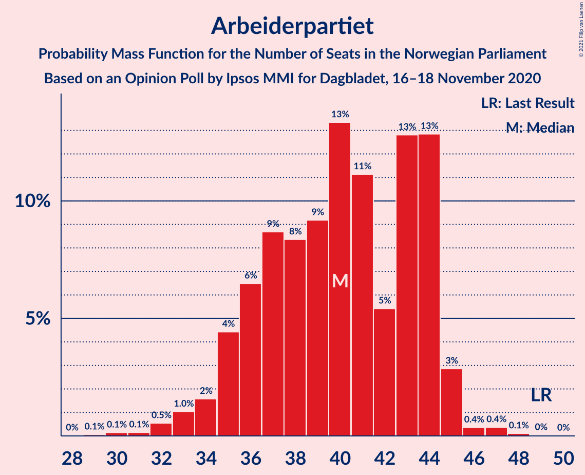

| Number of Seats | Probability | Accumulated | Special Marks |
|:---------------:|:-----------:|:-----------:|:-------------:|
| 29 | 0.1% | 100% |  |
| 30 | 0.1% | 99.9% |  |
| 31 | 0.1% | 99.8% |  |
| 32 | 0.5% | 99.6% |  |
| 33 | 1.0% | 99.1% |  |
| 34 | 2% | 98% |  |
| 35 | 4% | 96% |  |
| 36 | 6% | 92% |  |
| 37 | 9% | 86% |  |
| 38 | 8% | 77% |  |
| 39 | 9% | 69% |  |
| 40 | 13% | 59% | Median |
| 41 | 11% | 46% |  |
| 42 | 5% | 35% |  |
| 43 | 13% | 29% |  |
| 44 | 13% | 17% |  |
| 45 | 3% | 4% |  |
| 46 | 0.4% | 0.9% |  |
| 47 | 0.4% | 0.5% |  |
| 48 | 0.1% | 0.2% |  |
| 49 | 0% | 0.1% | Last Result |
| 50 | 0% | 0% |  |

### Høyre

*For a full overview of the results for this party, see the [Høyre](party-høyre.html) page.*

| Number of Seats | Probability | Accumulated | Special Marks |
|:---------------:|:-----------:|:-----------:|:-------------:|
| 26 | 0% | 100% |  |
| 27 | 0.1% | 99.9% |  |
| 28 | 0.2% | 99.9% |  |
| 29 | 0.5% | 99.7% |  |
| 30 | 0.7% | 99.2% |  |
| 31 | 2% | 98.5% |  |
| 32 | 4% | 97% |  |
| 33 | 11% | 93% |  |
| 34 | 13% | 83% |  |
| 35 | 11% | 70% |  |
| 36 | 10% | 59% | Median |
| 37 | 13% | 49% |  |
| 38 | 5% | 37% |  |
| 39 | 12% | 32% |  |
| 40 | 9% | 19% |  |
| 41 | 4% | 11% |  |
| 42 | 3% | 6% |  |
| 43 | 1.5% | 3% |  |
| 44 | 1.4% | 2% |  |
| 45 | 0.2% | 0.4% | Last Result |
| 46 | 0.1% | 0.2% |  |
| 47 | 0% | 0% |  |

### Senterpartiet

*For a full overview of the results for this party, see the [Senterpartiet](party-senterpartiet.html) page.*

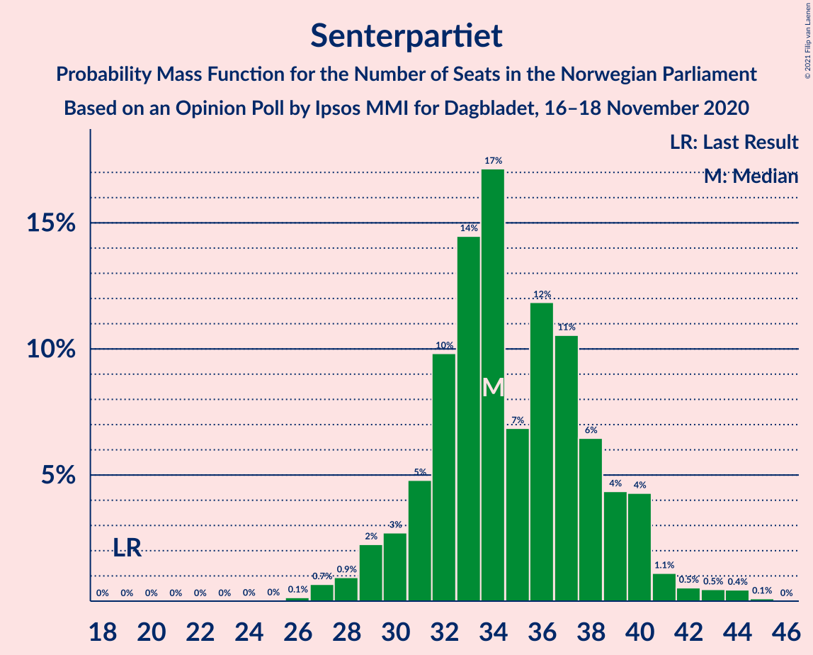

| Number of Seats | Probability | Accumulated | Special Marks |
|:---------------:|:-----------:|:-----------:|:-------------:|
| 19 | 0% | 100% | Last Result |
| 20 | 0% | 100% |  |
| 21 | 0% | 100% |  |
| 22 | 0% | 100% |  |
| 23 | 0% | 100% |  |
| 24 | 0% | 100% |  |
| 25 | 0% | 100% |  |
| 26 | 0.1% | 100% |  |
| 27 | 0.7% | 99.8% |  |
| 28 | 0.9% | 99.1% |  |
| 29 | 2% | 98% |  |
| 30 | 3% | 96% |  |
| 31 | 5% | 93% |  |
| 32 | 10% | 88% |  |
| 33 | 14% | 79% |  |
| 34 | 17% | 64% | Median |
| 35 | 7% | 47% |  |
| 36 | 12% | 40% |  |
| 37 | 11% | 28% |  |
| 38 | 6% | 18% |  |
| 39 | 4% | 11% |  |
| 40 | 4% | 7% |  |
| 41 | 1.1% | 3% |  |
| 42 | 0.5% | 2% |  |
| 43 | 0.5% | 1.0% |  |
| 44 | 0.4% | 0.6% |  |
| 45 | 0.1% | 0.1% |  |
| 46 | 0% | 0% |  |

### Fremskrittspartiet

*For a full overview of the results for this party, see the [Fremskrittspartiet](party-fremskrittspartiet.html) page.*

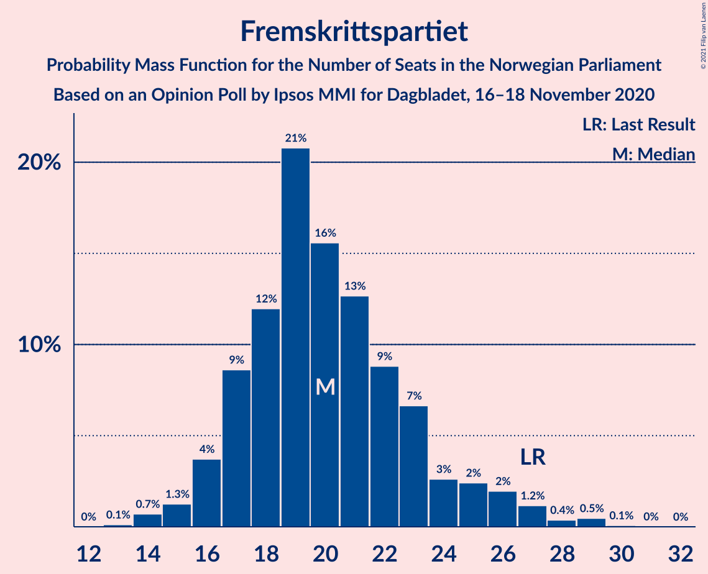

| Number of Seats | Probability | Accumulated | Special Marks |
|:---------------:|:-----------:|:-----------:|:-------------:|
| 13 | 0.1% | 100% |  |
| 14 | 0.7% | 99.9% |  |
| 15 | 1.3% | 99.2% |  |
| 16 | 4% | 98% |  |
| 17 | 9% | 94% |  |
| 18 | 12% | 86% |  |
| 19 | 21% | 74% |  |
| 20 | 16% | 53% | Median |
| 21 | 13% | 37% |  |
| 22 | 9% | 25% |  |
| 23 | 7% | 16% |  |
| 24 | 3% | 9% |  |
| 25 | 2% | 6% |  |
| 26 | 2% | 4% |  |
| 27 | 1.2% | 2% | Last Result |
| 28 | 0.4% | 0.9% |  |
| 29 | 0.5% | 0.6% |  |
| 30 | 0.1% | 0.1% |  |
| 31 | 0% | 0% |  |

### Sosialistisk Venstreparti

*For a full overview of the results for this party, see the [Sosialistisk Venstreparti](party-sosialistiskvenstreparti.html) page.*

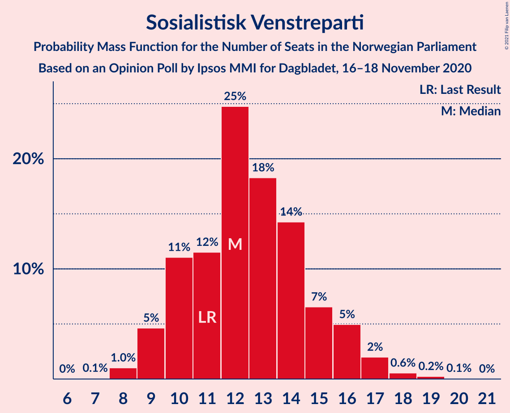

| Number of Seats | Probability | Accumulated | Special Marks |
|:---------------:|:-----------:|:-----------:|:-------------:|
| 7 | 0.1% | 100% |  |
| 8 | 1.0% | 99.9% |  |
| 9 | 5% | 98.9% |  |
| 10 | 11% | 94% |  |
| 11 | 12% | 83% | Last Result |
| 12 | 25% | 72% | Median |
| 13 | 18% | 47% |  |
| 14 | 14% | 29% |  |
| 15 | 7% | 14% |  |
| 16 | 5% | 8% |  |
| 17 | 2% | 3% |  |
| 18 | 0.6% | 0.9% |  |
| 19 | 0.2% | 0.3% |  |
| 20 | 0.1% | 0.1% |  |
| 21 | 0% | 0% |  |

### Miljøpartiet De Grønne

*For a full overview of the results for this party, see the [Miljøpartiet De Grønne](party-miljøpartietdegrønne.html) page.*

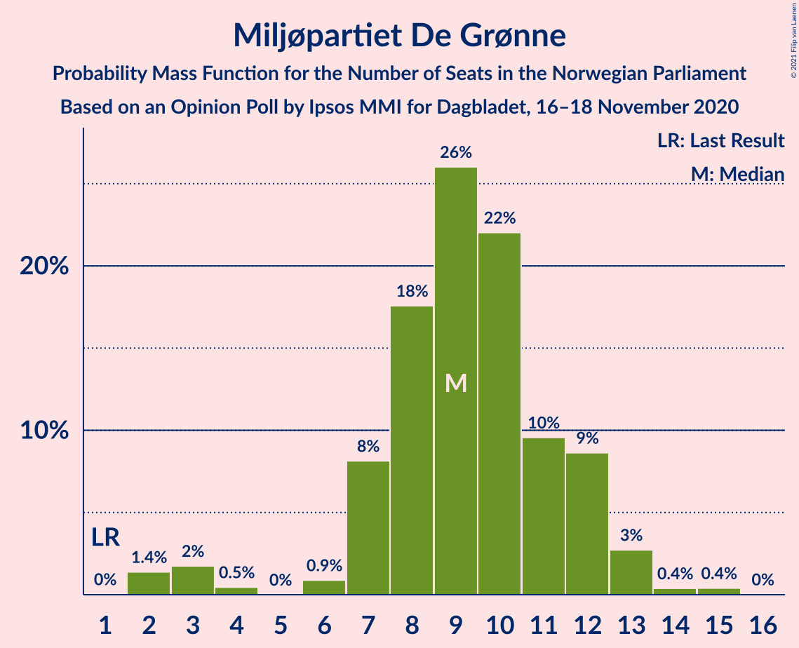

| Number of Seats | Probability | Accumulated | Special Marks |
|:---------------:|:-----------:|:-----------:|:-------------:|
| 1 | 0% | 100% | Last Result |
| 2 | 1.4% | 100% |  |
| 3 | 2% | 98.6% |  |
| 4 | 0.5% | 97% |  |
| 5 | 0% | 96% |  |
| 6 | 0.9% | 96% |  |
| 7 | 8% | 95% |  |
| 8 | 18% | 87% |  |
| 9 | 26% | 70% | Median |
| 10 | 22% | 44% |  |
| 11 | 10% | 22% |  |
| 12 | 9% | 12% |  |
| 13 | 3% | 4% |  |
| 14 | 0.4% | 0.8% |  |
| 15 | 0.4% | 0.4% |  |
| 16 | 0% | 0% |  |

### Venstre

*For a full overview of the results for this party, see the [Venstre](party-venstre.html) page.*

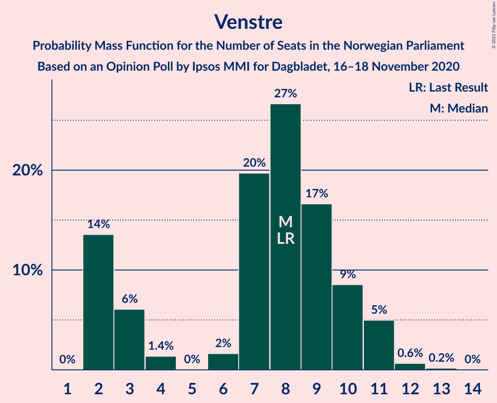

| Number of Seats | Probability | Accumulated | Special Marks |
|:---------------:|:-----------:|:-----------:|:-------------:|
| 2 | 14% | 100% |  |
| 3 | 6% | 86% |  |
| 4 | 1.4% | 80% |  |
| 5 | 0% | 79% |  |
| 6 | 2% | 79% |  |
| 7 | 20% | 77% |  |
| 8 | 27% | 58% | Last Result, Median |
| 9 | 17% | 31% |  |
| 10 | 9% | 14% |  |
| 11 | 5% | 6% |  |
| 12 | 0.6% | 0.8% |  |
| 13 | 0.2% | 0.2% |  |
| 14 | 0% | 0% |  |

### Kristelig Folkeparti

*For a full overview of the results for this party, see the [Kristelig Folkeparti](party-kristeligfolkeparti.html) page.*

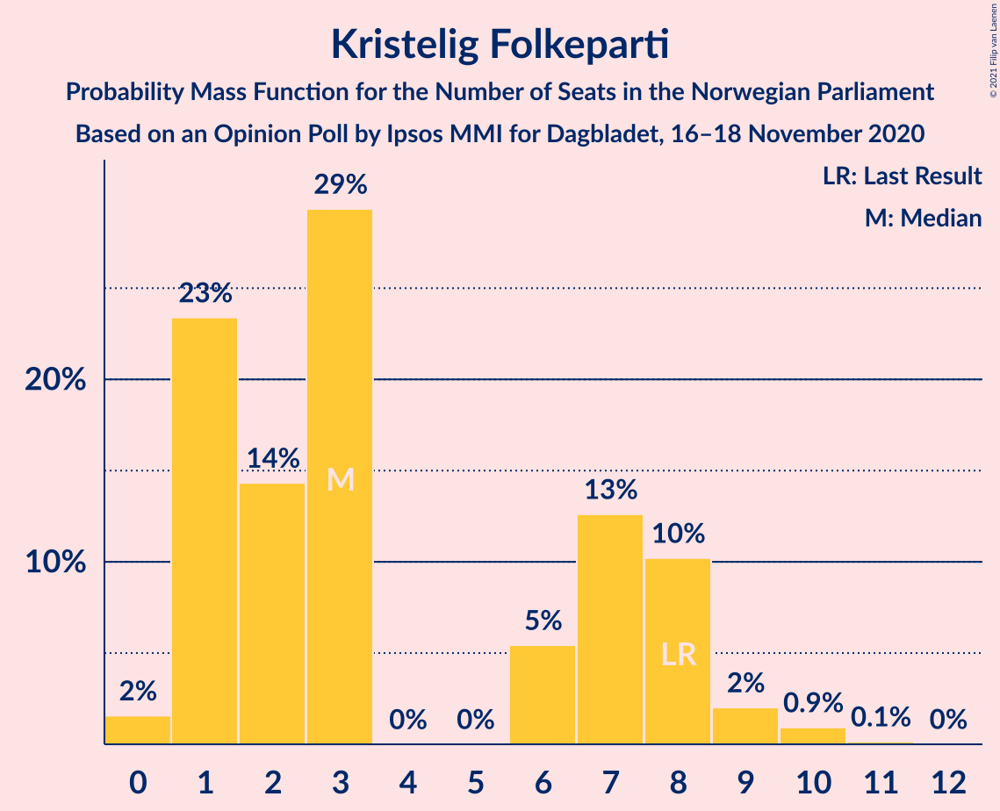

| Number of Seats | Probability | Accumulated | Special Marks |
|:---------------:|:-----------:|:-----------:|:-------------:|
| 0 | 2% | 100% |  |
| 1 | 23% | 98% |  |
| 2 | 14% | 75% |  |
| 3 | 29% | 61% | Median |
| 4 | 0% | 31% |  |
| 5 | 0% | 31% |  |
| 6 | 5% | 31% |  |
| 7 | 13% | 26% |  |
| 8 | 10% | 13% | Last Result |
| 9 | 2% | 3% |  |
| 10 | 0.9% | 1.1% |  |
| 11 | 0.1% | 0.2% |  |
| 12 | 0% | 0% |  |

### Rødt

*For a full overview of the results for this party, see the [Rødt](party-rødt.html) page.*

| Number of Seats | Probability | Accumulated | Special Marks |
|:---------------:|:-----------:|:-----------:|:-------------:|
| 1 | 30% | 100% | Last Result |
| 2 | 57% | 70% | Median |
| 3 | 0.2% | 12% |  |
| 4 | 0% | 12% |  |
| 5 | 0.1% | 12% |  |
| 6 | 2% | 12% |  |
| 7 | 7% | 10% |  |
| 8 | 2% | 3% |  |
| 9 | 0.6% | 0.8% |  |
| 10 | 0.1% | 0.2% |  |
| 11 | 0% | 0% |  |

## Coalitions

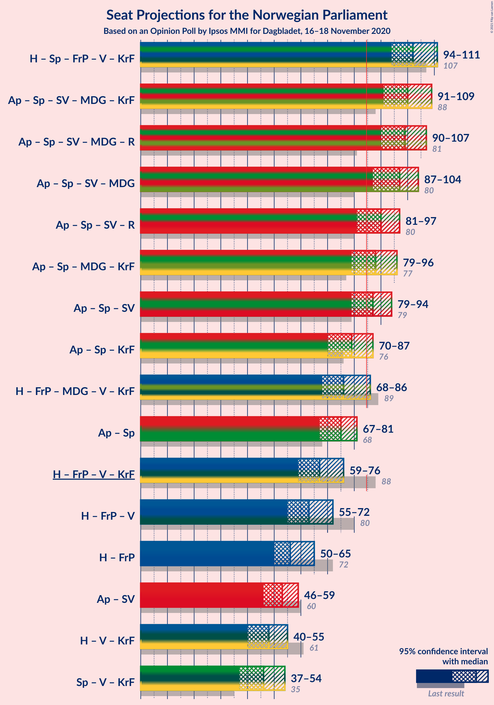

### Confidence Intervals

| Coalition | Last Result | Median | Majority? | 80% Confidence Interval | 90% Confidence Interval | 95% Confidence Interval | 99% Confidence Interval |
|:---------:|:-----------:|:------:|:---------:|:-----------------------:|:-----------------------:|:-----------------------:|:-----------------------:|
| Høyre – Senterpartiet – Fremskrittspartiet – Venstre – Kristelig Folkeparti | 107 | 102 | 100% | 96–108 | 95–110 | 94–111 | 91–113 |
| Arbeiderpartiet – Senterpartiet – Sosialistisk Venstreparti – Miljøpartiet De Grønne – Kristelig Folkeparti | 88 | 100 | 100% | 94–106 | 92–107 | 91–109 | 89–111 |
| Arbeiderpartiet – Senterpartiet – Sosialistisk Venstreparti – Miljøpartiet De Grønne – Rødt | 81 | 99 | 99.9% | 93–104 | 91–105 | 90–107 | 87–110 |
| Arbeiderpartiet – Senterpartiet – Sosialistisk Venstreparti – Miljøpartiet De Grønne | 80 | 97 | 99.8% | 91–102 | 89–103 | 87–104 | 85–107 |
| Arbeiderpartiet – Senterpartiet – Sosialistisk Venstreparti – Rødt | 80 | 90 | 88% | 84–95 | 83–96 | 81–97 | 79–100 |
| Arbeiderpartiet – Senterpartiet – Miljøpartiet De Grønne – Kristelig Folkeparti | 77 | 88 | 76% | 82–93 | 80–94 | 79–96 | 76–98 |
| Arbeiderpartiet – Senterpartiet – Sosialistisk Venstreparti | 79 | 87 | 79% | 82–92 | 81–93 | 79–94 | 77–97 |
| Arbeiderpartiet – Senterpartiet – Kristelig Folkeparti | 76 | 79 | 9% | 73–84 | 71–85 | 70–87 | 68–89 |
| Høyre – Fremskrittspartiet – Miljøpartiet De Grønne – Venstre – Kristelig Folkeparti | 89 | 76 | 5% | 71–83 | 69–85 | 68–86 | 66–88 |
| Arbeiderpartiet – Senterpartiet | 68 | 75 | 0.2% | 70–79 | 68–81 | 67–81 | 65–83 |
| Høyre – Fremskrittspartiet – Venstre – Kristelig Folkeparti | 88 | 67 | 0% | 62–73 | 60–75 | 59–76 | 57–79 |
| Høyre – Fremskrittspartiet – Venstre | 80 | 63 | 0% | 58–70 | 57–72 | 55–72 | 53–75 |
| Høyre – Fremskrittspartiet | 72 | 56 | 0% | 51–62 | 50–64 | 50–65 | 47–68 |
| Arbeiderpartiet – Sosialistisk Venstreparti | 60 | 53 | 0% | 48–57 | 47–58 | 46–59 | 43–61 |
| Høyre – Venstre – Kristelig Folkeparti | 61 | 48 | 0% | 42–52 | 42–53 | 40–55 | 37–57 |
| Senterpartiet – Venstre – Kristelig Folkeparti | 35 | 46 | 0% | 40–51 | 38–53 | 37–54 | 35–57 |

### Høyre – Senterpartiet – Fremskrittspartiet – Venstre – Kristelig Folkeparti

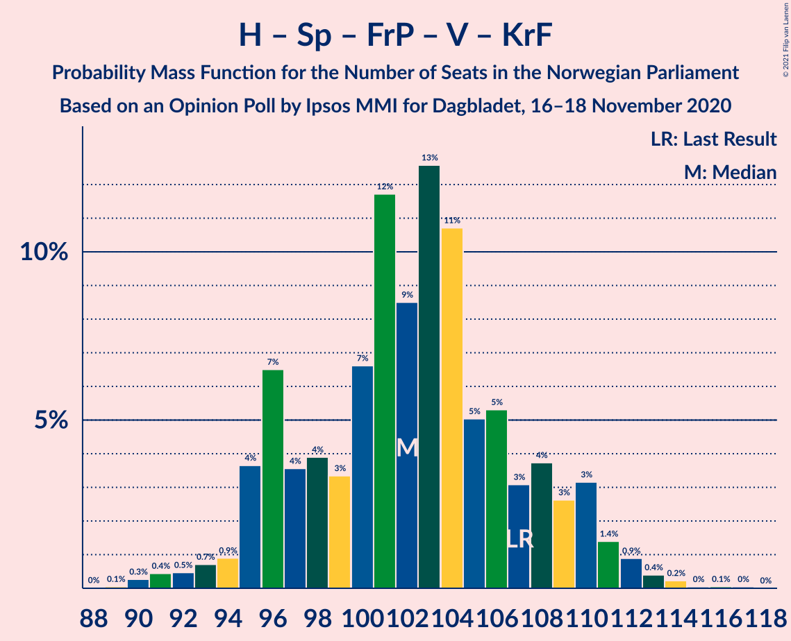

| Number of Seats | Probability | Accumulated | Special Marks |
|:---------------:|:-----------:|:-----------:|:-------------:|
| 89 | 0.1% | 100% |  |
| 90 | 0.3% | 99.9% |  |
| 91 | 0.4% | 99.6% |  |
| 92 | 0.5% | 99.2% |  |
| 93 | 0.7% | 98.7% |  |
| 94 | 0.9% | 98% |  |
| 95 | 4% | 97% |  |
| 96 | 7% | 93% |  |
| 97 | 4% | 87% |  |
| 98 | 4% | 83% |  |
| 99 | 3% | 80% |  |
| 100 | 7% | 76% |  |
| 101 | 12% | 70% | Median |
| 102 | 9% | 58% |  |
| 103 | 13% | 49% |  |
| 104 | 11% | 37% |  |
| 105 | 5% | 26% |  |
| 106 | 5% | 21% |  |
| 107 | 3% | 16% | Last Result |
| 108 | 4% | 13% |  |
| 109 | 3% | 9% |  |
| 110 | 3% | 6% |  |
| 111 | 1.4% | 3% |  |
| 112 | 0.9% | 2% |  |
| 113 | 0.4% | 0.8% |  |
| 114 | 0.2% | 0.4% |  |
| 115 | 0% | 0.2% |  |
| 116 | 0.1% | 0.1% |  |
| 117 | 0% | 0.1% |  |
| 118 | 0% | 0% |  |

### Arbeiderpartiet – Senterpartiet – Sosialistisk Venstreparti – Miljøpartiet De Grønne – Kristelig Folkeparti

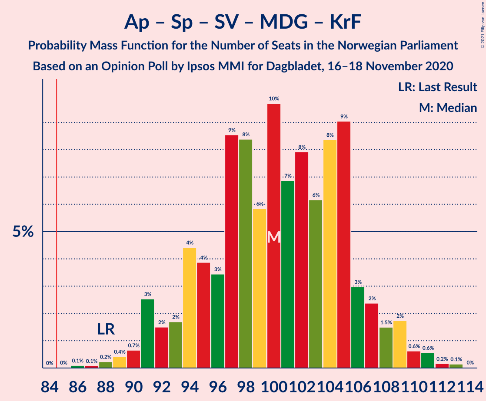

| Number of Seats | Probability | Accumulated | Special Marks |
|:---------------:|:-----------:|:-----------:|:-------------:|
| 86 | 0.1% | 100% |  |
| 87 | 0.1% | 99.9% |  |
| 88 | 0.2% | 99.8% | Last Result |
| 89 | 0.4% | 99.5% |  |
| 90 | 0.7% | 99.1% |  |
| 91 | 3% | 98% |  |
| 92 | 2% | 96% |  |
| 93 | 2% | 94% |  |
| 94 | 4% | 93% |  |
| 95 | 4% | 88% |  |
| 96 | 3% | 84% |  |
| 97 | 9% | 81% |  |
| 98 | 8% | 72% | Median |
| 99 | 6% | 64% |  |
| 100 | 10% | 58% |  |
| 101 | 7% | 49% |  |
| 102 | 8% | 42% |  |
| 103 | 6% | 34% |  |
| 104 | 8% | 28% |  |
| 105 | 9% | 19% |  |
| 106 | 3% | 10% |  |
| 107 | 2% | 7% |  |
| 108 | 1.5% | 5% |  |
| 109 | 2% | 3% |  |
| 110 | 0.6% | 2% |  |
| 111 | 0.6% | 0.9% |  |
| 112 | 0.2% | 0.4% |  |
| 113 | 0.1% | 0.2% |  |
| 114 | 0% | 0% |  |

### Arbeiderpartiet – Senterpartiet – Sosialistisk Venstreparti – Miljøpartiet De Grønne – Rødt

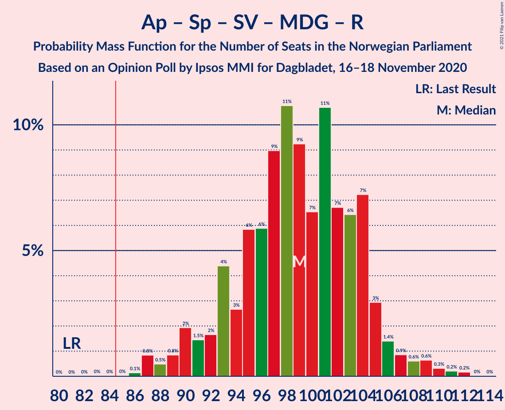

| Number of Seats | Probability | Accumulated | Special Marks |
|:---------------:|:-----------:|:-----------:|:-------------:|
| 81 | 0% | 100% | Last Result |
| 82 | 0% | 100% |  |
| 83 | 0% | 100% |  |
| 84 | 0% | 100% |  |
| 85 | 0% | 99.9% | Majority |
| 86 | 0.1% | 99.9% |  |
| 87 | 0.8% | 99.8% |  |
| 88 | 0.5% | 98.9% |  |
| 89 | 0.8% | 98% |  |
| 90 | 2% | 98% |  |
| 91 | 1.5% | 96% |  |
| 92 | 2% | 94% |  |
| 93 | 4% | 93% |  |
| 94 | 3% | 88% |  |
| 95 | 6% | 86% |  |
| 96 | 6% | 80% |  |
| 97 | 9% | 74% | Median |
| 98 | 11% | 65% |  |
| 99 | 9% | 54% |  |
| 100 | 7% | 45% |  |
| 101 | 11% | 38% |  |
| 102 | 7% | 28% |  |
| 103 | 6% | 21% |  |
| 104 | 7% | 14% |  |
| 105 | 3% | 7% |  |
| 106 | 1.4% | 4% |  |
| 107 | 0.9% | 3% |  |
| 108 | 0.6% | 2% |  |
| 109 | 0.6% | 1.4% |  |
| 110 | 0.3% | 0.7% |  |
| 111 | 0.2% | 0.4% |  |
| 112 | 0.2% | 0.2% |  |
| 113 | 0% | 0% |  |

### Arbeiderpartiet – Senterpartiet – Sosialistisk Venstreparti – Miljøpartiet De Grønne

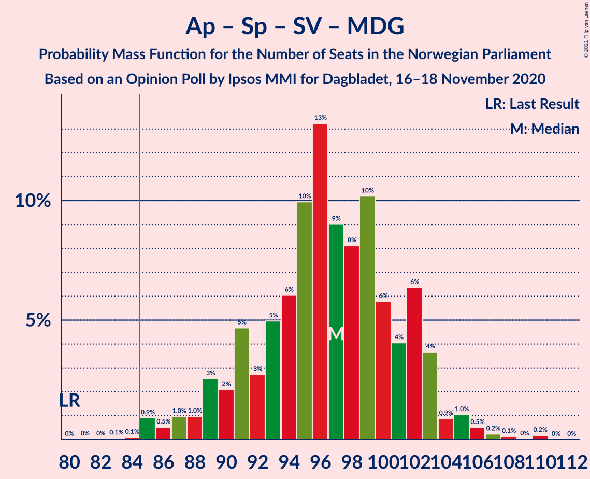

| Number of Seats | Probability | Accumulated | Special Marks |
|:---------------:|:-----------:|:-----------:|:-------------:|
| 80 | 0% | 100% | Last Result |
| 81 | 0% | 100% |  |
| 82 | 0% | 100% |  |
| 83 | 0.1% | 99.9% |  |
| 84 | 0.1% | 99.9% |  |
| 85 | 0.9% | 99.8% | Majority |
| 86 | 0.5% | 98.9% |  |
| 87 | 1.0% | 98% |  |
| 88 | 1.0% | 97% |  |
| 89 | 3% | 96% |  |
| 90 | 2% | 94% |  |
| 91 | 5% | 92% |  |
| 92 | 3% | 87% |  |
| 93 | 5% | 84% |  |
| 94 | 6% | 79% |  |
| 95 | 10% | 73% | Median |
| 96 | 13% | 63% |  |
| 97 | 9% | 50% |  |
| 98 | 8% | 41% |  |
| 99 | 10% | 33% |  |
| 100 | 6% | 23% |  |
| 101 | 4% | 17% |  |
| 102 | 6% | 13% |  |
| 103 | 4% | 7% |  |
| 104 | 0.9% | 3% |  |
| 105 | 1.0% | 2% |  |
| 106 | 0.5% | 1.1% |  |
| 107 | 0.2% | 0.6% |  |
| 108 | 0.1% | 0.3% |  |
| 109 | 0% | 0.2% |  |
| 110 | 0.2% | 0.2% |  |
| 111 | 0% | 0% |  |

### Arbeiderpartiet – Senterpartiet – Sosialistisk Venstreparti – Rødt

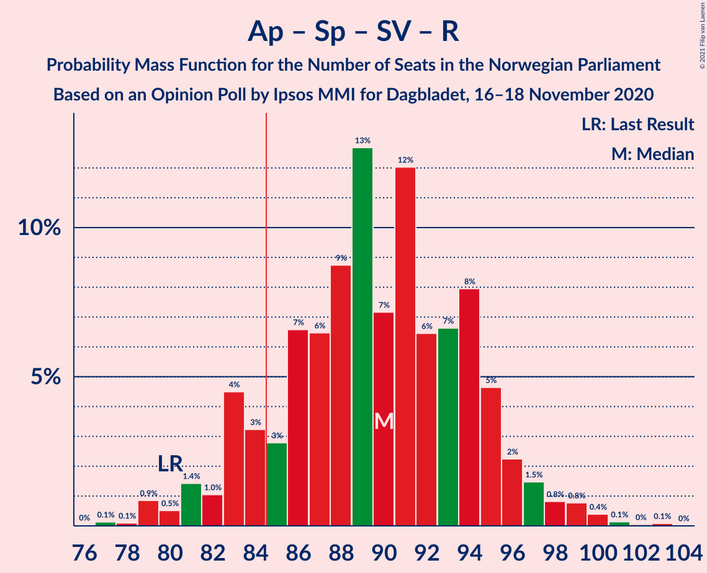

| Number of Seats | Probability | Accumulated | Special Marks |
|:---------------:|:-----------:|:-----------:|:-------------:|
| 76 | 0% | 100% |  |
| 77 | 0.1% | 99.9% |  |
| 78 | 0.1% | 99.8% |  |
| 79 | 0.9% | 99.7% |  |
| 80 | 0.5% | 98.9% | Last Result |
| 81 | 1.4% | 98% |  |
| 82 | 1.0% | 97% |  |
| 83 | 4% | 96% |  |
| 84 | 3% | 91% |  |
| 85 | 3% | 88% | Majority |
| 86 | 7% | 85% |  |
| 87 | 6% | 79% |  |
| 88 | 9% | 72% | Median |
| 89 | 13% | 64% |  |
| 90 | 7% | 51% |  |
| 91 | 12% | 44% |  |
| 92 | 6% | 32% |  |
| 93 | 7% | 25% |  |
| 94 | 8% | 19% |  |
| 95 | 5% | 11% |  |
| 96 | 2% | 6% |  |
| 97 | 1.5% | 4% |  |
| 98 | 0.8% | 2% |  |
| 99 | 0.8% | 1.5% |  |
| 100 | 0.4% | 0.7% |  |
| 101 | 0.1% | 0.3% |  |
| 102 | 0% | 0.2% |  |
| 103 | 0.1% | 0.1% |  |
| 104 | 0% | 0% |  |

### Arbeiderpartiet – Senterpartiet – Miljøpartiet De Grønne – Kristelig Folkeparti

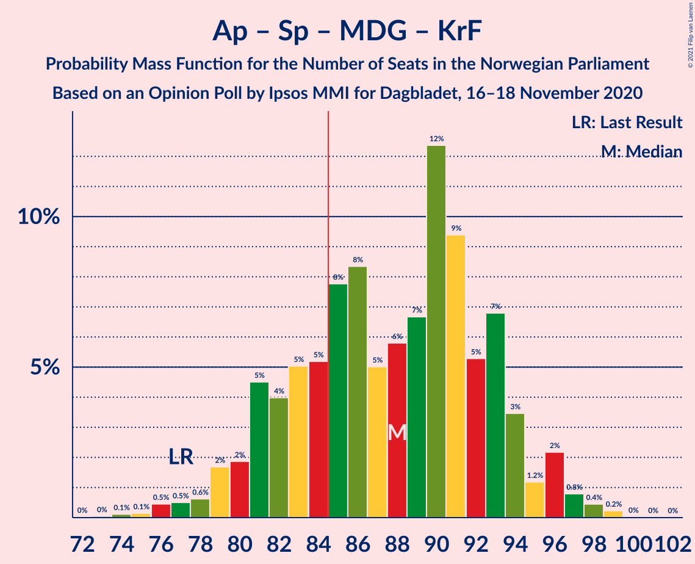

| Number of Seats | Probability | Accumulated | Special Marks |
|:---------------:|:-----------:|:-----------:|:-------------:|
| 73 | 0% | 100% |  |
| 74 | 0.1% | 99.9% |  |
| 75 | 0.1% | 99.8% |  |
| 76 | 0.5% | 99.6% |  |
| 77 | 0.5% | 99.2% | Last Result |
| 78 | 0.6% | 98.7% |  |
| 79 | 2% | 98% |  |
| 80 | 2% | 96% |  |
| 81 | 5% | 95% |  |
| 82 | 4% | 90% |  |
| 83 | 5% | 86% |  |
| 84 | 5% | 81% |  |
| 85 | 8% | 76% | Majority |
| 86 | 8% | 68% | Median |
| 87 | 5% | 60% |  |
| 88 | 6% | 55% |  |
| 89 | 7% | 49% |  |
| 90 | 12% | 42% |  |
| 91 | 9% | 30% |  |
| 92 | 5% | 20% |  |
| 93 | 7% | 15% |  |
| 94 | 3% | 8% |  |
| 95 | 1.2% | 5% |  |
| 96 | 2% | 4% |  |
| 97 | 0.8% | 2% |  |
| 98 | 0.4% | 0.7% |  |
| 99 | 0.2% | 0.3% |  |
| 100 | 0% | 0.1% |  |
| 101 | 0% | 0% |  |

### Arbeiderpartiet – Senterpartiet – Sosialistisk Venstreparti

| Number of Seats | Probability | Accumulated | Special Marks |
|:---------------:|:-----------:|:-----------:|:-------------:|
| 74 | 0% | 100% |  |
| 75 | 0.1% | 99.9% |  |
| 76 | 0.1% | 99.8% |  |
| 77 | 0.8% | 99.7% |  |
| 78 | 0.3% | 98.8% |  |
| 79 | 2% | 98% | Last Result |
| 80 | 1.3% | 97% |  |
| 81 | 3% | 96% |  |
| 82 | 4% | 92% |  |
| 83 | 3% | 88% |  |
| 84 | 6% | 85% |  |
| 85 | 6% | 79% | Majority |
| 86 | 10% | 73% | Median |
| 87 | 16% | 62% |  |
| 88 | 8% | 46% |  |
| 89 | 11% | 38% |  |
| 90 | 8% | 27% |  |
| 91 | 4% | 20% |  |
| 92 | 7% | 15% |  |
| 93 | 5% | 9% |  |
| 94 | 2% | 4% |  |
| 95 | 1.0% | 2% |  |
| 96 | 0.6% | 1.2% |  |
| 97 | 0.3% | 0.6% |  |
| 98 | 0.2% | 0.3% |  |
| 99 | 0.1% | 0.1% |  |
| 100 | 0% | 0% |  |

### Arbeiderpartiet – Senterpartiet – Kristelig Folkeparti

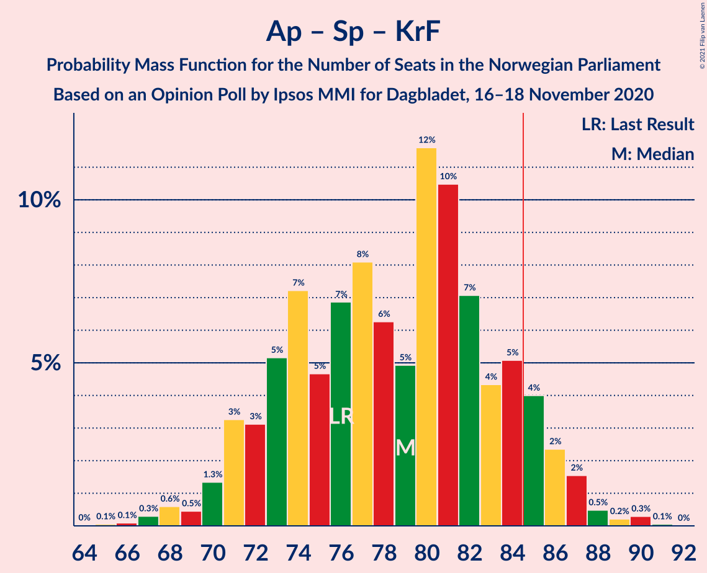

| Number of Seats | Probability | Accumulated | Special Marks |
|:---------------:|:-----------:|:-----------:|:-------------:|
| 65 | 0.1% | 100% |  |
| 66 | 0.1% | 99.9% |  |
| 67 | 0.3% | 99.8% |  |
| 68 | 0.6% | 99.5% |  |
| 69 | 0.5% | 98.9% |  |
| 70 | 1.3% | 98% |  |
| 71 | 3% | 97% |  |
| 72 | 3% | 94% |  |
| 73 | 5% | 91% |  |
| 74 | 7% | 86% |  |
| 75 | 5% | 78% |  |
| 76 | 7% | 74% | Last Result |
| 77 | 8% | 67% | Median |
| 78 | 6% | 59% |  |
| 79 | 5% | 52% |  |
| 80 | 12% | 48% |  |
| 81 | 10% | 36% |  |
| 82 | 7% | 25% |  |
| 83 | 4% | 18% |  |
| 84 | 5% | 14% |  |
| 85 | 4% | 9% | Majority |
| 86 | 2% | 5% |  |
| 87 | 2% | 3% |  |
| 88 | 0.5% | 1.1% |  |
| 89 | 0.2% | 0.6% |  |
| 90 | 0.3% | 0.4% |  |
| 91 | 0.1% | 0.1% |  |
| 92 | 0% | 0% |  |

### Høyre – Fremskrittspartiet – Miljøpartiet De Grønne – Venstre – Kristelig Folkeparti

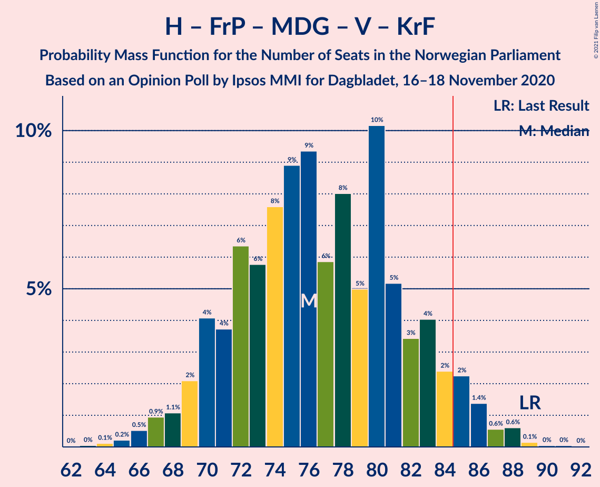

| Number of Seats | Probability | Accumulated | Special Marks |
|:---------------:|:-----------:|:-----------:|:-------------:|
| 63 | 0% | 100% |  |
| 64 | 0.1% | 99.9% |  |
| 65 | 0.2% | 99.8% |  |
| 66 | 0.5% | 99.6% |  |
| 67 | 0.9% | 99.1% |  |
| 68 | 1.1% | 98% |  |
| 69 | 2% | 97% |  |
| 70 | 4% | 95% |  |
| 71 | 4% | 91% |  |
| 72 | 6% | 87% |  |
| 73 | 6% | 81% |  |
| 74 | 8% | 75% |  |
| 75 | 9% | 67% |  |
| 76 | 9% | 58% | Median |
| 77 | 6% | 49% |  |
| 78 | 8% | 43% |  |
| 79 | 5% | 35% |  |
| 80 | 10% | 30% |  |
| 81 | 5% | 20% |  |
| 82 | 3% | 15% |  |
| 83 | 4% | 12% |  |
| 84 | 2% | 7% |  |
| 85 | 2% | 5% | Majority |
| 86 | 1.4% | 3% |  |
| 87 | 0.6% | 1.4% |  |
| 88 | 0.6% | 0.9% |  |
| 89 | 0.1% | 0.3% | Last Result |
| 90 | 0% | 0.1% |  |
| 91 | 0% | 0.1% |  |
| 92 | 0% | 0% |  |

### Arbeiderpartiet – Senterpartiet

| Number of Seats | Probability | Accumulated | Special Marks |
|:---------------:|:-----------:|:-----------:|:-------------:|
| 62 | 0% | 100% |  |
| 63 | 0.1% | 99.9% |  |
| 64 | 0.2% | 99.9% |  |
| 65 | 0.5% | 99.7% |  |
| 66 | 0.8% | 99.2% |  |
| 67 | 2% | 98% |  |
| 68 | 2% | 97% | Last Result |
| 69 | 3% | 94% |  |
| 70 | 4% | 91% |  |
| 71 | 4% | 87% |  |
| 72 | 6% | 83% |  |
| 73 | 12% | 77% |  |
| 74 | 10% | 64% | Median |
| 75 | 10% | 54% |  |
| 76 | 6% | 44% |  |
| 77 | 13% | 38% |  |
| 78 | 11% | 25% |  |
| 79 | 5% | 14% |  |
| 80 | 3% | 9% |  |
| 81 | 4% | 6% |  |
| 82 | 2% | 2% |  |
| 83 | 0.3% | 0.7% |  |
| 84 | 0.2% | 0.3% |  |
| 85 | 0.1% | 0.2% | Majority |
| 86 | 0% | 0.1% |  |
| 87 | 0% | 0% |  |

### Høyre – Fremskrittspartiet – Venstre – Kristelig Folkeparti

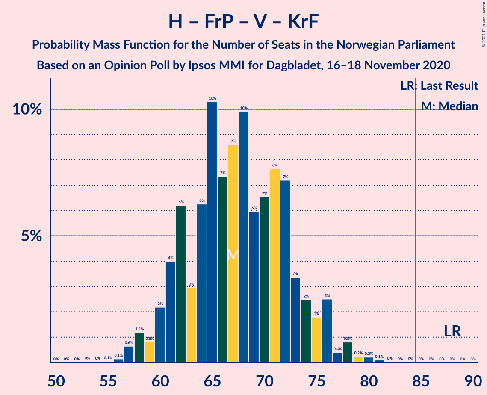

| Number of Seats | Probability | Accumulated | Special Marks |
|:---------------:|:-----------:|:-----------:|:-------------:|
| 53 | 0% | 100% |  |
| 54 | 0% | 99.9% |  |
| 55 | 0.1% | 99.9% |  |
| 56 | 0.1% | 99.9% |  |
| 57 | 0.6% | 99.7% |  |
| 58 | 1.2% | 99.1% |  |
| 59 | 0.8% | 98% |  |
| 60 | 2% | 97% |  |
| 61 | 4% | 95% |  |
| 62 | 6% | 91% |  |
| 63 | 3% | 85% |  |
| 64 | 6% | 82% |  |
| 65 | 10% | 75% |  |
| 66 | 7% | 65% |  |
| 67 | 9% | 58% | Median |
| 68 | 10% | 49% |  |
| 69 | 6% | 39% |  |
| 70 | 7% | 33% |  |
| 71 | 8% | 27% |  |
| 72 | 7% | 19% |  |
| 73 | 3% | 12% |  |
| 74 | 2% | 9% |  |
| 75 | 2% | 6% |  |
| 76 | 3% | 4% |  |
| 77 | 0.4% | 2% |  |
| 78 | 0.8% | 1.4% |  |
| 79 | 0.2% | 0.6% |  |
| 80 | 0.2% | 0.4% |  |
| 81 | 0.1% | 0.2% |  |
| 82 | 0% | 0.1% |  |
| 83 | 0% | 0% |  |
| 84 | 0% | 0% |  |
| 85 | 0% | 0% | Majority |
| 86 | 0% | 0% |  |
| 87 | 0% | 0% |  |
| 88 | 0% | 0% | Last Result |

### Høyre – Fremskrittspartiet – Venstre

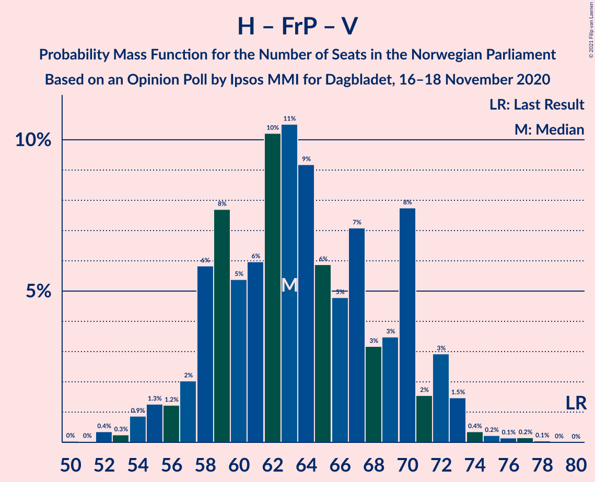

| Number of Seats | Probability | Accumulated | Special Marks |
|:---------------:|:-----------:|:-----------:|:-------------:|
| 50 | 0% | 100% |  |
| 51 | 0% | 99.9% |  |
| 52 | 0.4% | 99.9% |  |
| 53 | 0.3% | 99.5% |  |
| 54 | 0.9% | 99.3% |  |
| 55 | 1.3% | 98% |  |
| 56 | 1.2% | 97% |  |
| 57 | 2% | 96% |  |
| 58 | 6% | 94% |  |
| 59 | 8% | 88% |  |
| 60 | 5% | 80% |  |
| 61 | 6% | 75% |  |
| 62 | 10% | 69% |  |
| 63 | 11% | 59% |  |
| 64 | 9% | 48% | Median |
| 65 | 6% | 39% |  |
| 66 | 5% | 33% |  |
| 67 | 7% | 28% |  |
| 68 | 3% | 21% |  |
| 69 | 3% | 18% |  |
| 70 | 8% | 15% |  |
| 71 | 2% | 7% |  |
| 72 | 3% | 5% |  |
| 73 | 1.5% | 2% |  |
| 74 | 0.4% | 1.0% |  |
| 75 | 0.2% | 0.6% |  |
| 76 | 0.1% | 0.4% |  |
| 77 | 0.2% | 0.2% |  |
| 78 | 0.1% | 0.1% |  |
| 79 | 0% | 0% |  |
| 80 | 0% | 0% | Last Result |

### Høyre – Fremskrittspartiet

| Number of Seats | Probability | Accumulated | Special Marks |
|:---------------:|:-----------:|:-----------:|:-------------:|
| 45 | 0.1% | 100% |  |
| 46 | 0.2% | 99.9% |  |
| 47 | 0.3% | 99.7% |  |
| 48 | 0.6% | 99.4% |  |
| 49 | 1.2% | 98.8% |  |
| 50 | 6% | 98% |  |
| 51 | 4% | 92% |  |
| 52 | 4% | 87% |  |
| 53 | 8% | 84% |  |
| 54 | 8% | 75% |  |
| 55 | 7% | 67% |  |
| 56 | 12% | 60% | Median |
| 57 | 9% | 48% |  |
| 58 | 6% | 40% |  |
| 59 | 8% | 34% |  |
| 60 | 7% | 26% |  |
| 61 | 5% | 19% |  |
| 62 | 6% | 14% |  |
| 63 | 3% | 8% |  |
| 64 | 1.4% | 5% |  |
| 65 | 2% | 4% |  |
| 66 | 0.4% | 2% |  |
| 67 | 0.5% | 1.3% |  |
| 68 | 0.5% | 0.8% |  |
| 69 | 0.2% | 0.3% |  |
| 70 | 0.1% | 0.1% |  |
| 71 | 0% | 0% |  |
| 72 | 0% | 0% | Last Result |

### Arbeiderpartiet – Sosialistisk Venstreparti

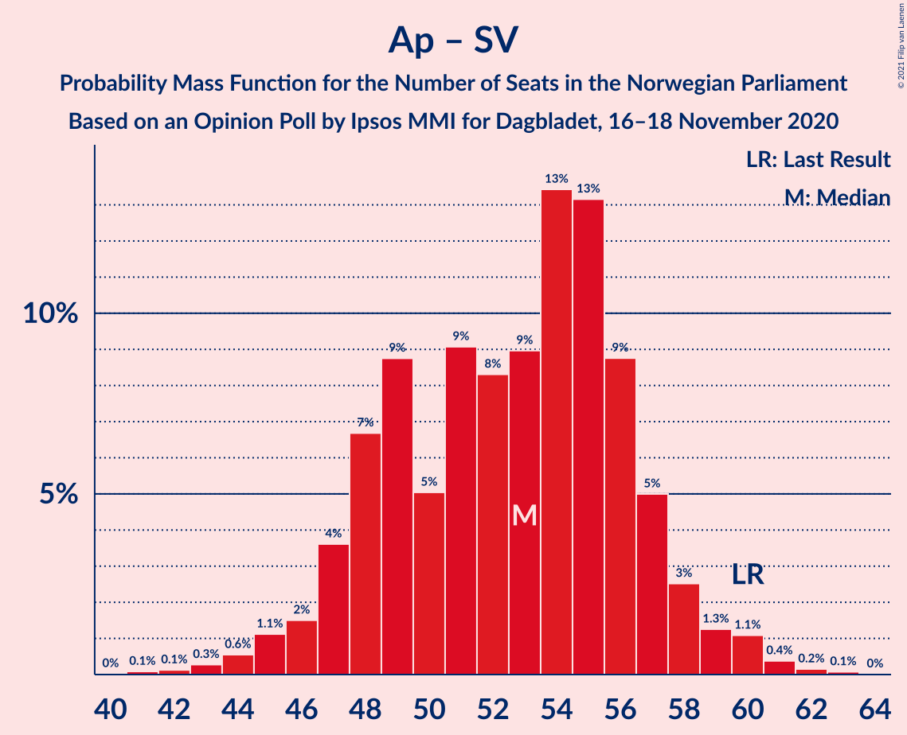

| Number of Seats | Probability | Accumulated | Special Marks |
|:---------------:|:-----------:|:-----------:|:-------------:|
| 41 | 0.1% | 100% |  |
| 42 | 0.1% | 99.9% |  |
| 43 | 0.3% | 99.7% |  |
| 44 | 0.6% | 99.5% |  |
| 45 | 1.1% | 98.9% |  |
| 46 | 2% | 98% |  |
| 47 | 4% | 96% |  |
| 48 | 7% | 93% |  |
| 49 | 9% | 86% |  |
| 50 | 5% | 77% |  |
| 51 | 9% | 72% |  |
| 52 | 8% | 63% | Median |
| 53 | 9% | 55% |  |
| 54 | 13% | 46% |  |
| 55 | 13% | 32% |  |
| 56 | 9% | 19% |  |
| 57 | 5% | 11% |  |
| 58 | 3% | 6% |  |
| 59 | 1.3% | 3% |  |
| 60 | 1.1% | 2% | Last Result |
| 61 | 0.4% | 0.6% |  |
| 62 | 0.2% | 0.3% |  |
| 63 | 0.1% | 0.1% |  |
| 64 | 0% | 0% |  |

### Høyre – Venstre – Kristelig Folkeparti

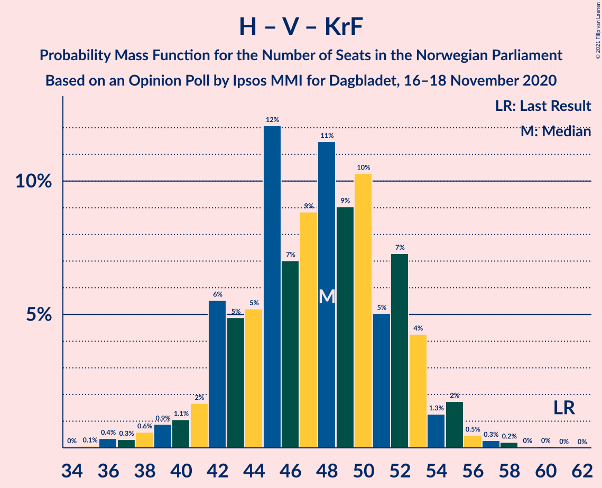

| Number of Seats | Probability | Accumulated | Special Marks |
|:---------------:|:-----------:|:-----------:|:-------------:|
| 34 | 0% | 100% |  |
| 35 | 0.1% | 99.9% |  |
| 36 | 0.4% | 99.9% |  |
| 37 | 0.3% | 99.5% |  |
| 38 | 0.6% | 99.2% |  |
| 39 | 0.9% | 98.6% |  |
| 40 | 1.1% | 98% |  |
| 41 | 2% | 97% |  |
| 42 | 6% | 95% |  |
| 43 | 5% | 89% |  |
| 44 | 5% | 85% |  |
| 45 | 12% | 79% |  |
| 46 | 7% | 67% |  |
| 47 | 9% | 60% | Median |
| 48 | 11% | 51% |  |
| 49 | 9% | 40% |  |
| 50 | 10% | 31% |  |
| 51 | 5% | 21% |  |
| 52 | 7% | 16% |  |
| 53 | 4% | 8% |  |
| 54 | 1.3% | 4% |  |
| 55 | 2% | 3% |  |
| 56 | 0.5% | 1.1% |  |
| 57 | 0.3% | 0.6% |  |
| 58 | 0.2% | 0.3% |  |
| 59 | 0% | 0.1% |  |
| 60 | 0% | 0.1% |  |
| 61 | 0% | 0% | Last Result |

### Senterpartiet – Venstre – Kristelig Folkeparti

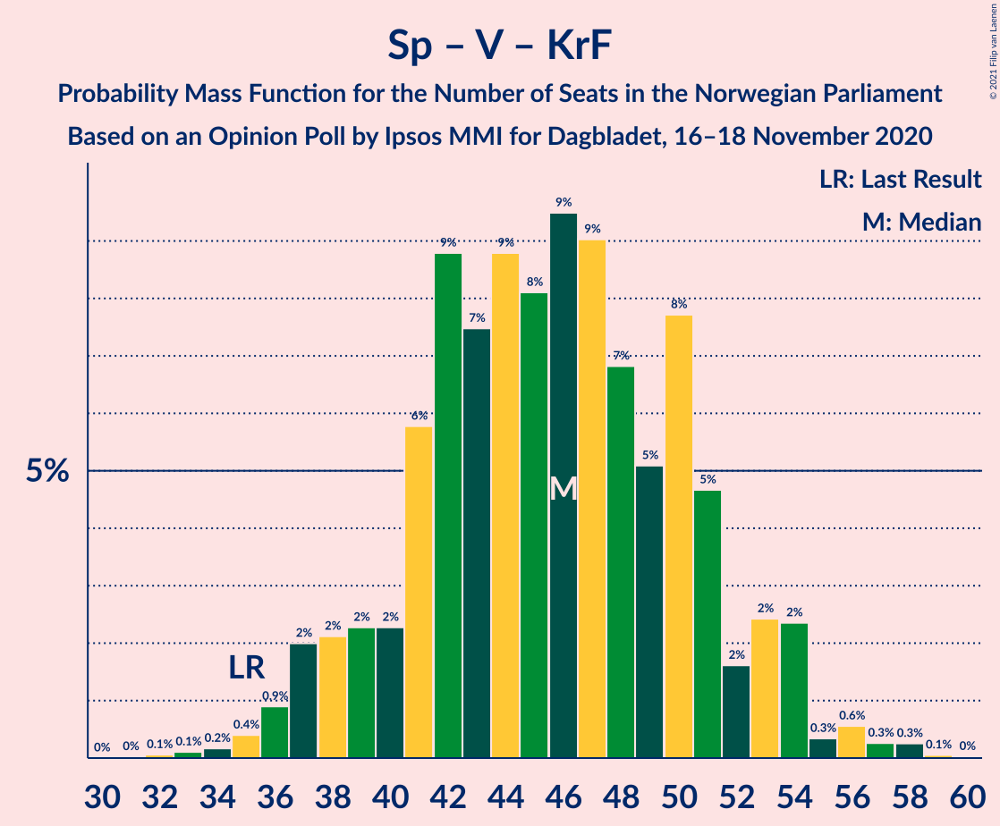

| Number of Seats | Probability | Accumulated | Special Marks |
|:---------------:|:-----------:|:-----------:|:-------------:|
| 32 | 0.1% | 100% |  |
| 33 | 0.1% | 99.9% |  |
| 34 | 0.2% | 99.8% |  |
| 35 | 0.4% | 99.6% | Last Result |
| 36 | 0.9% | 99.2% |  |
| 37 | 2% | 98% |  |
| 38 | 2% | 96% |  |
| 39 | 2% | 94% |  |
| 40 | 2% | 92% |  |
| 41 | 6% | 90% |  |
| 42 | 9% | 84% |  |
| 43 | 7% | 75% |  |
| 44 | 9% | 68% |  |
| 45 | 8% | 59% | Median |
| 46 | 9% | 51% |  |
| 47 | 9% | 41% |  |
| 48 | 7% | 32% |  |
| 49 | 5% | 25% |  |
| 50 | 8% | 20% |  |
| 51 | 5% | 13% |  |
| 52 | 2% | 8% |  |
| 53 | 2% | 6% |  |
| 54 | 2% | 4% |  |
| 55 | 0.3% | 2% |  |
| 56 | 0.6% | 1.2% |  |
| 57 | 0.3% | 0.6% |  |
| 58 | 0.3% | 0.3% |  |
| 59 | 0.1% | 0.1% |  |
| 60 | 0% | 0% |  |

## Technical Information

### Opinion Poll

+ **Polling firm:** Ipsos MMI
+ **Commissioner(s):** Dagbladet
+ **Fieldwork period:** 16–18 November 2020

### Calculations

+ **Sample size:** 702
+ **Simulations done:** 1,048,576
+ **Error estimate:** 2.36%

