# Opinion Poll by Kantar TNS for TV2, 24–30 November 2020

<a href="#voting-intentions">Voting Intentions</a> | <a href="#seats">Seats</a> | <a href="#coalitions">Coalitions</a> | <a href="#technical-information">Technical Information</a>

## Voting Intentions

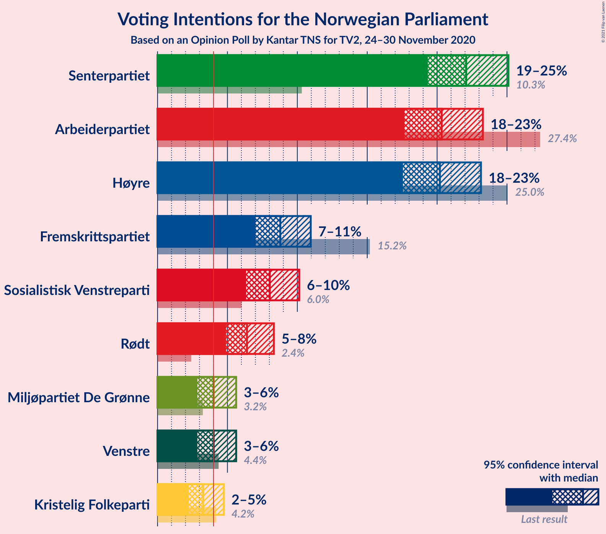

### Confidence Intervals

| Party | Last Result | Poll Result | 80% Confidence Interval | 90% Confidence Interval | 95% Confidence Interval | 99% Confidence Interval |
|:-----:|:-----------:|:-----------:|:-----------------------:|:-----------------------:|:-----------------------:|:-----------------------:|
| Senterpartiet | 10.3% | 22.1% | 20.3–24.1% |19.8–24.6% |19.3–25.1% |18.5–26.1% |
| Arbeiderpartiet | 27.4% | 20.3% | 18.6–22.3% |18.1–22.8% |17.7–23.3% |16.9–24.2% |
| Høyre | 25.0% | 20.2% | 18.5–22.1% |18.0–22.7% |17.6–23.1% |16.8–24.1% |
| Fremskrittspartiet | 15.2% | 8.8% | 7.6–10.2% |7.3–10.6% |7.0–11.0% |6.5–11.7% |
| Sosialistisk Venstreparti | 6.0% | 8.0% | 6.9–9.4% |6.6–9.8% |6.3–10.1% |5.8–10.8% |
| Rødt | 2.4% | 6.4% | 5.4–7.7% |5.1–8.0% |4.9–8.3% |4.5–9.0% |
| Miljøpartiet De Grønne | 3.2% | 4.0% | 3.2–5.1% |3.0–5.3% |2.9–5.6% |2.5–6.2% |
| Venstre | 4.4% | 4.0% | 3.2–5.1% |3.0–5.3% |2.9–5.6% |2.5–6.2% |
| Kristelig Folkeparti | 4.2% | 3.3% | 2.6–4.2% |2.4–4.5% |2.2–4.7% |2.0–5.2% |

*Note:* The poll result column reflects the actual value used in the calculations. Published results may vary slightly, and in addition be rounded to fewer digits.

## Seats

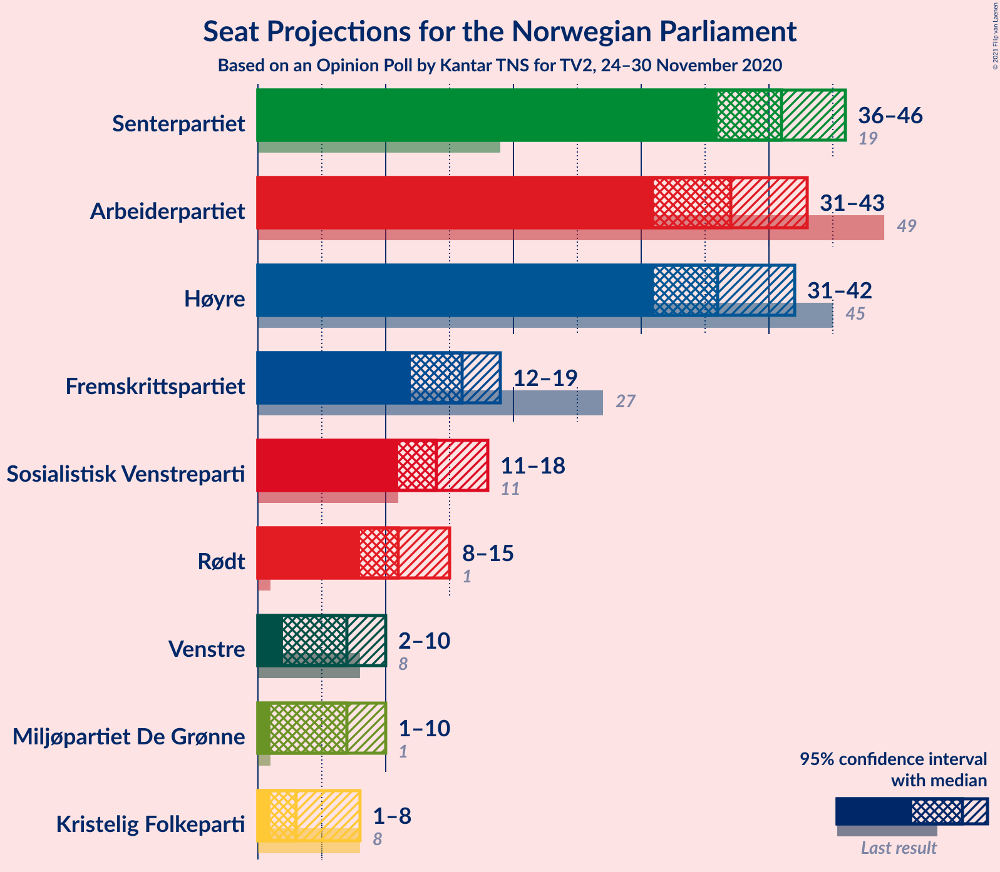

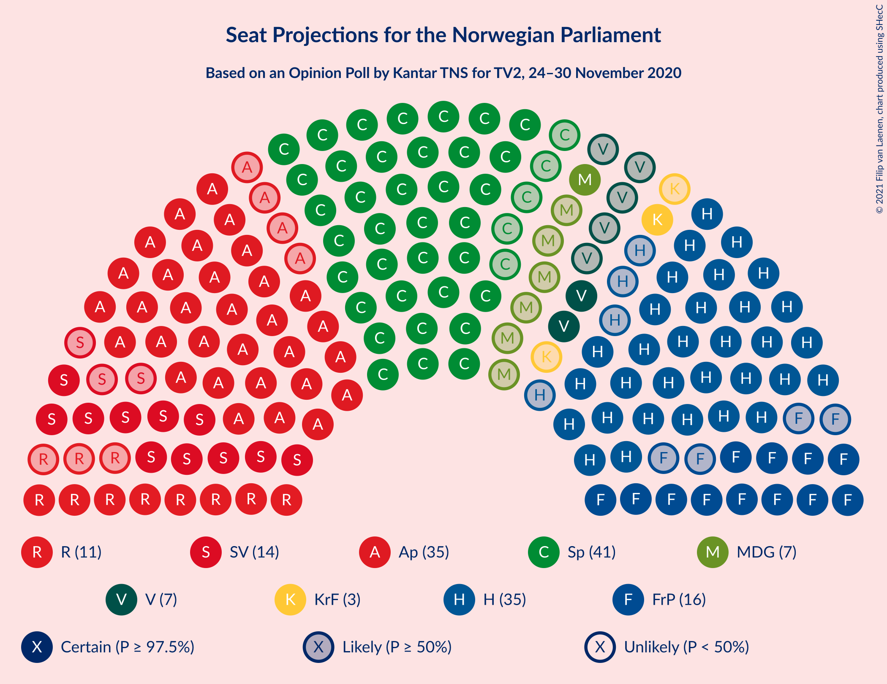

### Confidence Intervals

| Party | Last Result | Median | 80% Confidence Interval | 90% Confidence Interval | 95% Confidence Interval | 99% Confidence Interval |
|:-----:|:-----------:|:------:|:-----------------------:|:-----------------------:|:-----------------------:|:-----------------------:|
| <a href="#senterpartiet">Senterpartiet</a> | 19 | 41 | 37–45 |37–45 |36–46 |35–47 |
| <a href="#arbeiderpartiet">Arbeiderpartiet</a> | 49 | 37 | 33–41 |32–42 |31–43 |29–44 |
| <a href="#høyre">Høyre</a> | 45 | 36 | 33–39 |32–41 |31–42 |29–43 |
| <a href="#fremskrittspartiet">Fremskrittspartiet</a> | 27 | 16 | 13–18 |12–19 |12–19 |11–21 |
| <a href="#sosialistisk-venstreparti">Sosialistisk Venstreparti</a> | 11 | 14 | 12–17 |11–18 |11–18 |10–19 |
| <a href="#rødt">Rødt</a> | 1 | 11 | 9–14 |9–14 |8–15 |8–16 |
| <a href="#miljøpartiet-de-grønne">Miljøpartiet De Grønne</a> | 1 | 7 | 2–9 |2–9 |1–10 |1–11 |
| <a href="#venstre">Venstre</a> | 8 | 7 | 2–9 |2–9 |2–10 |2–11 |
| <a href="#kristelig-folkeparti">Kristelig Folkeparti</a> | 8 | 3 | 1–7 |1–7 |1–8 |0–9 |

### Senterpartiet

*For a full overview of the results for this party, see the [Senterpartiet](party-senterpartiet.html) page.*

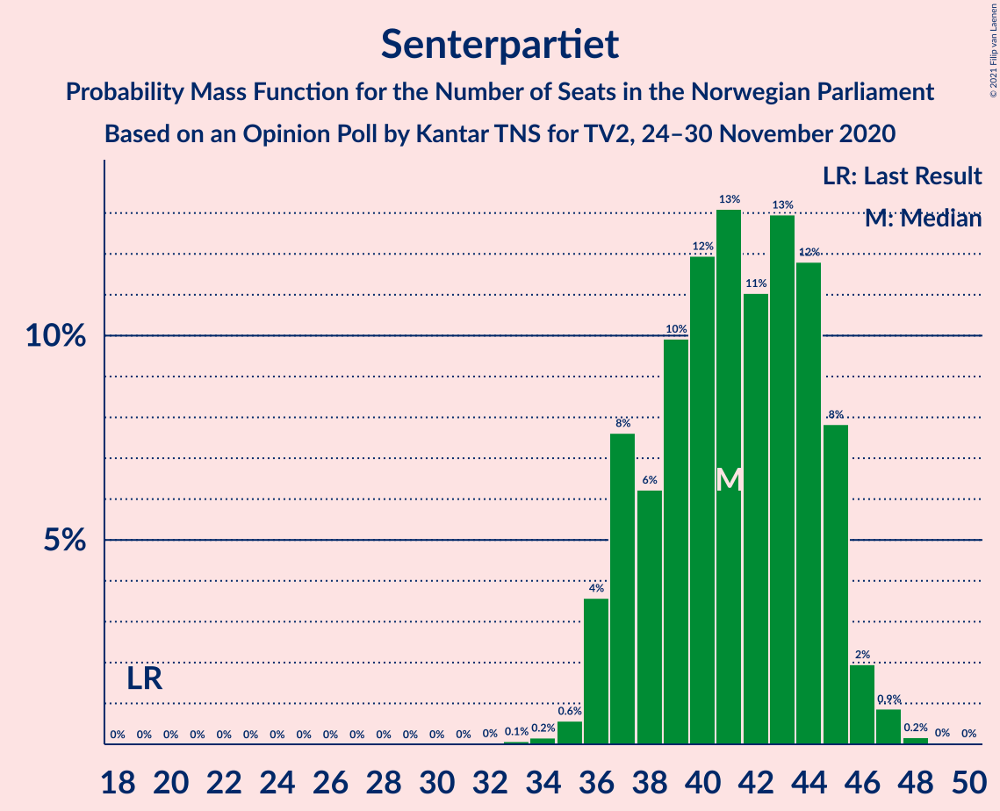

| Number of Seats | Probability | Accumulated | Special Marks |
|:---------------:|:-----------:|:-----------:|:-------------:|
| 19 | 0% | 100% | Last Result |
| 20 | 0% | 100% |  |
| 21 | 0% | 100% |  |
| 22 | 0% | 100% |  |
| 23 | 0% | 100% |  |
| 24 | 0% | 100% |  |
| 25 | 0% | 100% |  |
| 26 | 0% | 100% |  |
| 27 | 0% | 100% |  |
| 28 | 0% | 100% |  |
| 29 | 0% | 100% |  |
| 30 | 0% | 100% |  |
| 31 | 0% | 100% |  |
| 32 | 0% | 100% |  |
| 33 | 0.1% | 100% |  |
| 34 | 0.2% | 99.9% |  |
| 35 | 0.6% | 99.7% |  |
| 36 | 4% | 99.1% |  |
| 37 | 8% | 96% |  |
| 38 | 6% | 88% |  |
| 39 | 10% | 82% |  |
| 40 | 12% | 72% |  |
| 41 | 13% | 60% | Median |
| 42 | 11% | 47% |  |
| 43 | 13% | 36% |  |
| 44 | 12% | 23% |  |
| 45 | 8% | 11% |  |
| 46 | 2% | 3% |  |
| 47 | 0.9% | 1.1% |  |
| 48 | 0.2% | 0.3% |  |
| 49 | 0% | 0.1% |  |
| 50 | 0% | 0% |  |

### Arbeiderpartiet

*For a full overview of the results for this party, see the [Arbeiderpartiet](party-arbeiderpartiet.html) page.*

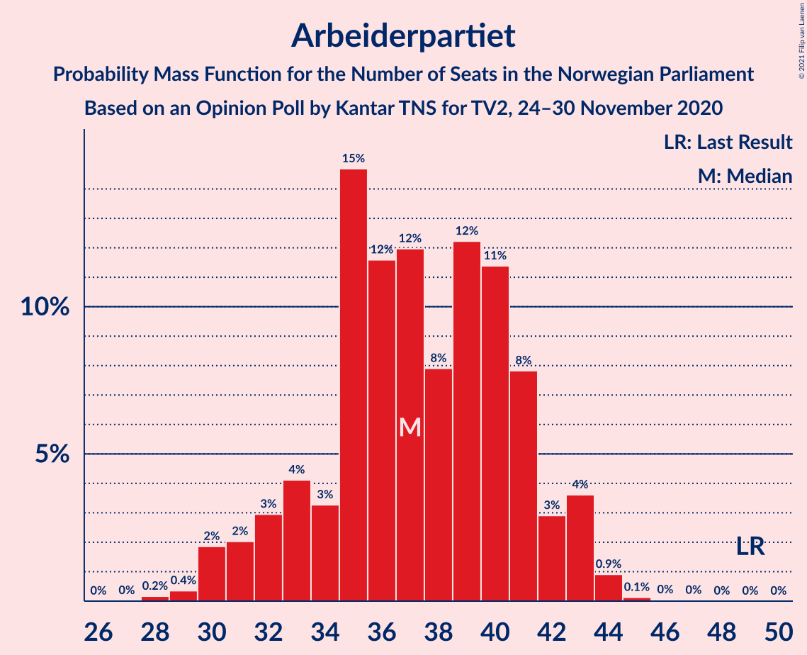

| Number of Seats | Probability | Accumulated | Special Marks |
|:---------------:|:-----------:|:-----------:|:-------------:|
| 28 | 0.2% | 100% |  |
| 29 | 0.4% | 99.8% |  |
| 30 | 2% | 99.5% |  |
| 31 | 2% | 98% |  |
| 32 | 3% | 96% |  |
| 33 | 4% | 93% |  |
| 34 | 3% | 89% |  |
| 35 | 15% | 85% |  |
| 36 | 12% | 71% |  |
| 37 | 12% | 59% | Median |
| 38 | 8% | 47% |  |
| 39 | 12% | 39% |  |
| 40 | 11% | 27% |  |
| 41 | 8% | 15% |  |
| 42 | 3% | 8% |  |
| 43 | 4% | 5% |  |
| 44 | 0.9% | 1.1% |  |
| 45 | 0.1% | 0.2% |  |
| 46 | 0% | 0.1% |  |
| 47 | 0% | 0% |  |
| 48 | 0% | 0% |  |
| 49 | 0% | 0% | Last Result |

### Høyre

*For a full overview of the results for this party, see the [Høyre](party-høyre.html) page.*

| Number of Seats | Probability | Accumulated | Special Marks |
|:---------------:|:-----------:|:-----------:|:-------------:|
| 27 | 0.1% | 100% |  |
| 28 | 0.2% | 99.9% |  |
| 29 | 0.5% | 99.7% |  |
| 30 | 0.7% | 99.2% |  |
| 31 | 2% | 98.5% |  |
| 32 | 4% | 97% |  |
| 33 | 7% | 93% |  |
| 34 | 14% | 86% |  |
| 35 | 21% | 72% |  |
| 36 | 17% | 51% | Median |
| 37 | 10% | 34% |  |
| 38 | 10% | 24% |  |
| 39 | 4% | 14% |  |
| 40 | 3% | 10% |  |
| 41 | 3% | 7% |  |
| 42 | 2% | 3% |  |
| 43 | 0.9% | 1.3% |  |
| 44 | 0.3% | 0.5% |  |
| 45 | 0.1% | 0.2% | Last Result |
| 46 | 0% | 0.1% |  |
| 47 | 0% | 0% |  |

### Fremskrittspartiet

*For a full overview of the results for this party, see the [Fremskrittspartiet](party-fremskrittspartiet.html) page.*

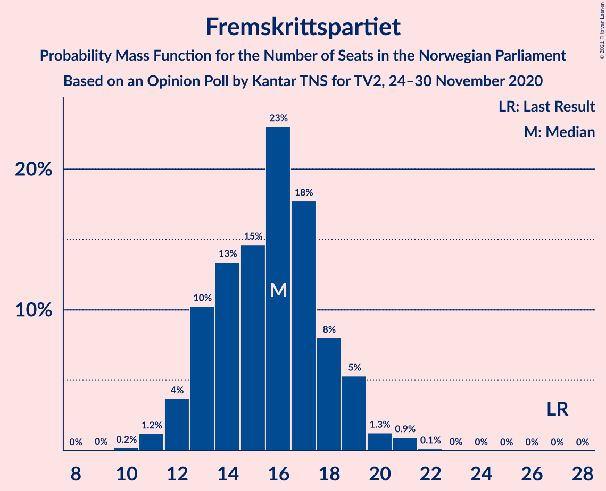

| Number of Seats | Probability | Accumulated | Special Marks |
|:---------------:|:-----------:|:-----------:|:-------------:|
| 9 | 0% | 100% |  |
| 10 | 0.2% | 99.9% |  |
| 11 | 1.2% | 99.7% |  |
| 12 | 4% | 98.5% |  |
| 13 | 10% | 95% |  |
| 14 | 13% | 85% |  |
| 15 | 15% | 71% |  |
| 16 | 23% | 57% | Median |
| 17 | 18% | 33% |  |
| 18 | 8% | 16% |  |
| 19 | 5% | 8% |  |
| 20 | 1.3% | 2% |  |
| 21 | 0.9% | 1.1% |  |
| 22 | 0.1% | 0.2% |  |
| 23 | 0% | 0% |  |
| 24 | 0% | 0% |  |
| 25 | 0% | 0% |  |
| 26 | 0% | 0% |  |
| 27 | 0% | 0% | Last Result |

### Sosialistisk Venstreparti

*For a full overview of the results for this party, see the [Sosialistisk Venstreparti](party-sosialistiskvenstreparti.html) page.*

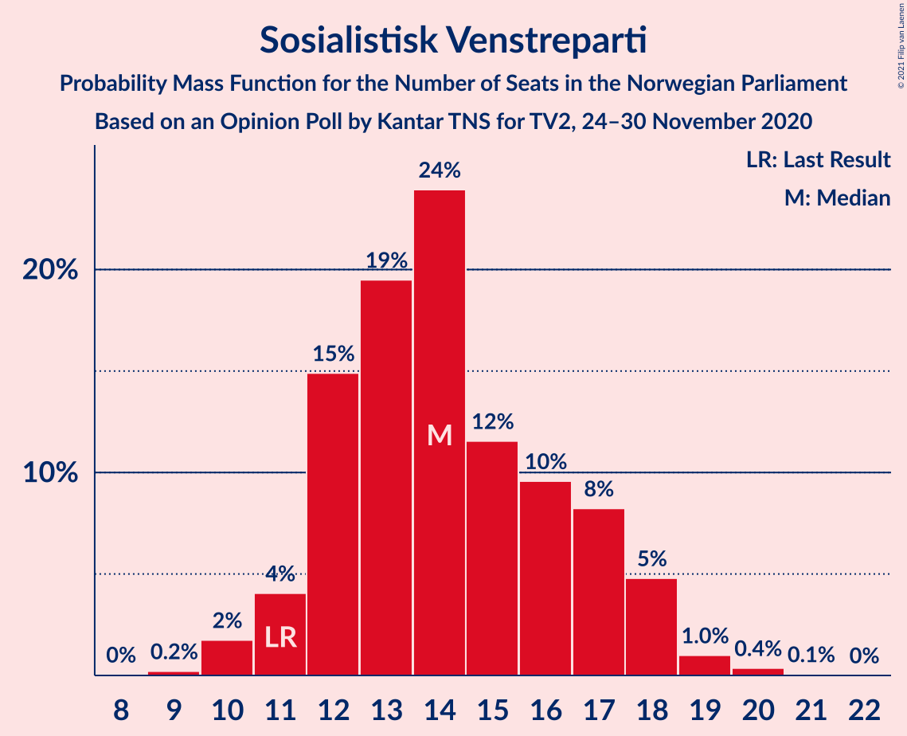

| Number of Seats | Probability | Accumulated | Special Marks |
|:---------------:|:-----------:|:-----------:|:-------------:|
| 9 | 0.2% | 100% |  |
| 10 | 2% | 99.7% |  |
| 11 | 4% | 98% | Last Result |
| 12 | 15% | 94% |  |
| 13 | 19% | 79% |  |
| 14 | 24% | 60% | Median |
| 15 | 12% | 36% |  |
| 16 | 10% | 24% |  |
| 17 | 8% | 14% |  |
| 18 | 5% | 6% |  |
| 19 | 1.0% | 1.4% |  |
| 20 | 0.4% | 0.4% |  |
| 21 | 0.1% | 0.1% |  |
| 22 | 0% | 0% |  |

### Rødt

*For a full overview of the results for this party, see the [Rødt](party-rødt.html) page.*

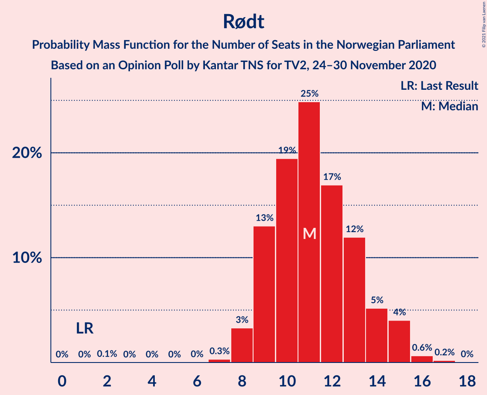

| Number of Seats | Probability | Accumulated | Special Marks |
|:---------------:|:-----------:|:-----------:|:-------------:|
| 1 | 0% | 100% | Last Result |
| 2 | 0.1% | 100% |  |
| 3 | 0% | 99.9% |  |
| 4 | 0% | 99.9% |  |
| 5 | 0% | 99.9% |  |
| 6 | 0% | 99.9% |  |
| 7 | 0.3% | 99.9% |  |
| 8 | 3% | 99.6% |  |
| 9 | 13% | 96% |  |
| 10 | 19% | 83% |  |
| 11 | 25% | 64% | Median |
| 12 | 17% | 39% |  |
| 13 | 12% | 22% |  |
| 14 | 5% | 10% |  |
| 15 | 4% | 5% |  |
| 16 | 0.6% | 0.9% |  |
| 17 | 0.2% | 0.2% |  |
| 18 | 0% | 0% |  |

### Miljøpartiet De Grønne

*For a full overview of the results for this party, see the [Miljøpartiet De Grønne](party-miljøpartietdegrønne.html) page.*

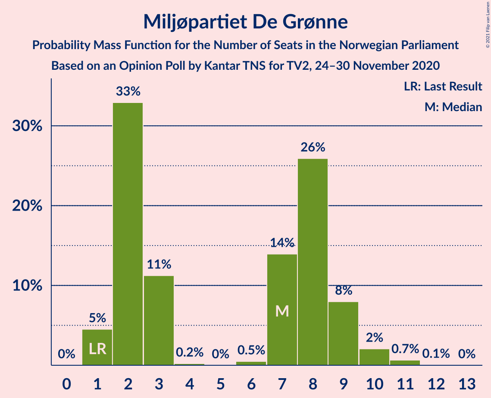

| Number of Seats | Probability | Accumulated | Special Marks |
|:---------------:|:-----------:|:-----------:|:-------------:|
| 1 | 5% | 100% | Last Result |
| 2 | 33% | 95% |  |
| 3 | 11% | 63% |  |
| 4 | 0.2% | 51% |  |
| 5 | 0% | 51% |  |
| 6 | 0.5% | 51% |  |
| 7 | 14% | 51% | Median |
| 8 | 26% | 37% |  |
| 9 | 8% | 11% |  |
| 10 | 2% | 3% |  |
| 11 | 0.7% | 0.7% |  |
| 12 | 0.1% | 0.1% |  |
| 13 | 0% | 0% |  |

### Venstre

*For a full overview of the results for this party, see the [Venstre](party-venstre.html) page.*

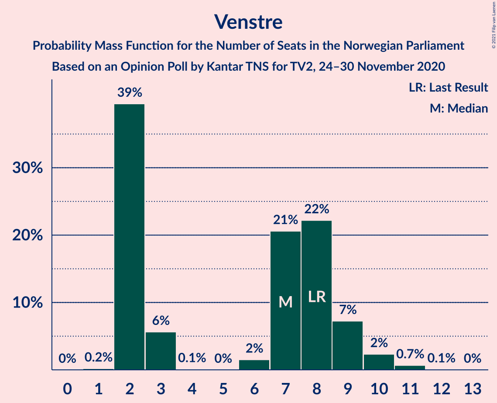

| Number of Seats | Probability | Accumulated | Special Marks |
|:---------------:|:-----------:|:-----------:|:-------------:|
| 1 | 0.2% | 100% |  |
| 2 | 39% | 99.8% |  |
| 3 | 6% | 60% |  |
| 4 | 0.1% | 55% |  |
| 5 | 0% | 55% |  |
| 6 | 2% | 55% |  |
| 7 | 21% | 53% | Median |
| 8 | 22% | 32% | Last Result |
| 9 | 7% | 10% |  |
| 10 | 2% | 3% |  |
| 11 | 0.7% | 0.7% |  |
| 12 | 0.1% | 0.1% |  |
| 13 | 0% | 0% |  |

### Kristelig Folkeparti

*For a full overview of the results for this party, see the [Kristelig Folkeparti](party-kristeligfolkeparti.html) page.*

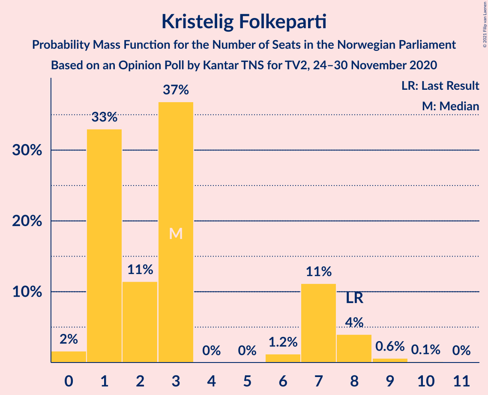

| Number of Seats | Probability | Accumulated | Special Marks |
|:---------------:|:-----------:|:-----------:|:-------------:|
| 0 | 2% | 100% |  |
| 1 | 33% | 98% |  |
| 2 | 11% | 65% |  |
| 3 | 37% | 54% | Median |
| 4 | 0% | 17% |  |
| 5 | 0% | 17% |  |
| 6 | 1.2% | 17% |  |
| 7 | 11% | 16% |  |
| 8 | 4% | 5% | Last Result |
| 9 | 0.6% | 0.8% |  |
| 10 | 0.1% | 0.2% |  |
| 11 | 0% | 0% |  |

## Coalitions

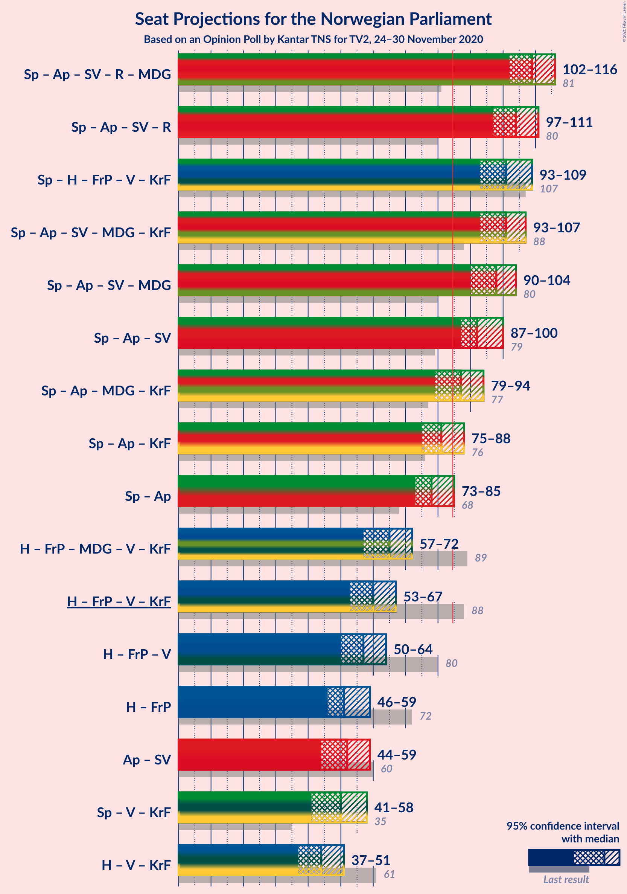

### Confidence Intervals

| Coalition | Last Result | Median | Majority? | 80% Confidence Interval | 90% Confidence Interval | 95% Confidence Interval | 99% Confidence Interval |
|:---------:|:-----------:|:------:|:---------:|:-----------------------:|:-----------------------:|:-----------------------:|:-----------------------:|
| Senterpartiet – Arbeiderpartiet – Sosialistisk Venstreparti – Rødt – Miljøpartiet De Grønne | 81 | 109 | 100% | 104–113 | 103–114 | 102–116 | 100–118 |
| Senterpartiet – Arbeiderpartiet – Sosialistisk Venstreparti – Rødt | 80 | 104 | 100% | 99–109 | 98–110 | 97–111 | 95–113 |
| Senterpartiet – Høyre – Fremskrittspartiet – Venstre – Kristelig Folkeparti | 107 | 101 | 100% | 96–106 | 94–108 | 93–109 | 90–111 |
| Senterpartiet – Arbeiderpartiet – Sosialistisk Venstreparti – Miljøpartiet De Grønne – Kristelig Folkeparti | 88 | 101 | 100% | 96–105 | 94–106 | 93–107 | 90–110 |
| Senterpartiet – Arbeiderpartiet – Sosialistisk Venstreparti – Miljøpartiet De Grønne | 80 | 98 | 100% | 93–102 | 92–103 | 90–104 | 88–107 |
| Senterpartiet – Arbeiderpartiet – Sosialistisk Venstreparti | 79 | 92 | 99.5% | 88–97 | 88–98 | 87–100 | 85–101 |
| Senterpartiet – Arbeiderpartiet – Miljøpartiet De Grønne – Kristelig Folkeparti | 77 | 87 | 70% | 81–92 | 80–93 | 79–94 | 76–96 |
| Senterpartiet – Arbeiderpartiet – Kristelig Folkeparti | 76 | 81 | 20% | 77–86 | 76–87 | 75–88 | 73–91 |
| Senterpartiet – Arbeiderpartiet | 68 | 78 | 3% | 75–82 | 74–84 | 73–85 | 71–86 |
| Høyre – Fremskrittspartiet – Miljøpartiet De Grønne – Venstre – Kristelig Folkeparti | 89 | 65 | 0% | 60–69 | 58–71 | 57–72 | 55–74 |
| Høyre – Fremskrittspartiet – Venstre – Kristelig Folkeparti | 88 | 60 | 0% | 55–64 | 54–65 | 53–67 | 50–69 |
| Høyre – Fremskrittspartiet – Venstre | 80 | 57 | 0% | 52–61 | 51–63 | 50–64 | 48–66 |
| Høyre – Fremskrittspartiet | 72 | 51 | 0% | 48–56 | 47–58 | 46–59 | 43–61 |
| Arbeiderpartiet – Sosialistisk Venstreparti | 60 | 52 | 0% | 47–56 | 45–57 | 44–59 | 43–61 |
| Senterpartiet – Venstre – Kristelig Folkeparti | 35 | 50 | 0% | 44–55 | 42–56 | 41–58 | 39–60 |
| Høyre – Venstre – Kristelig Folkeparti | 61 | 44 | 0% | 39–49 | 38–50 | 37–51 | 35–53 |

### Senterpartiet – Arbeiderpartiet – Sosialistisk Venstreparti – Rødt – Miljøpartiet De Grønne

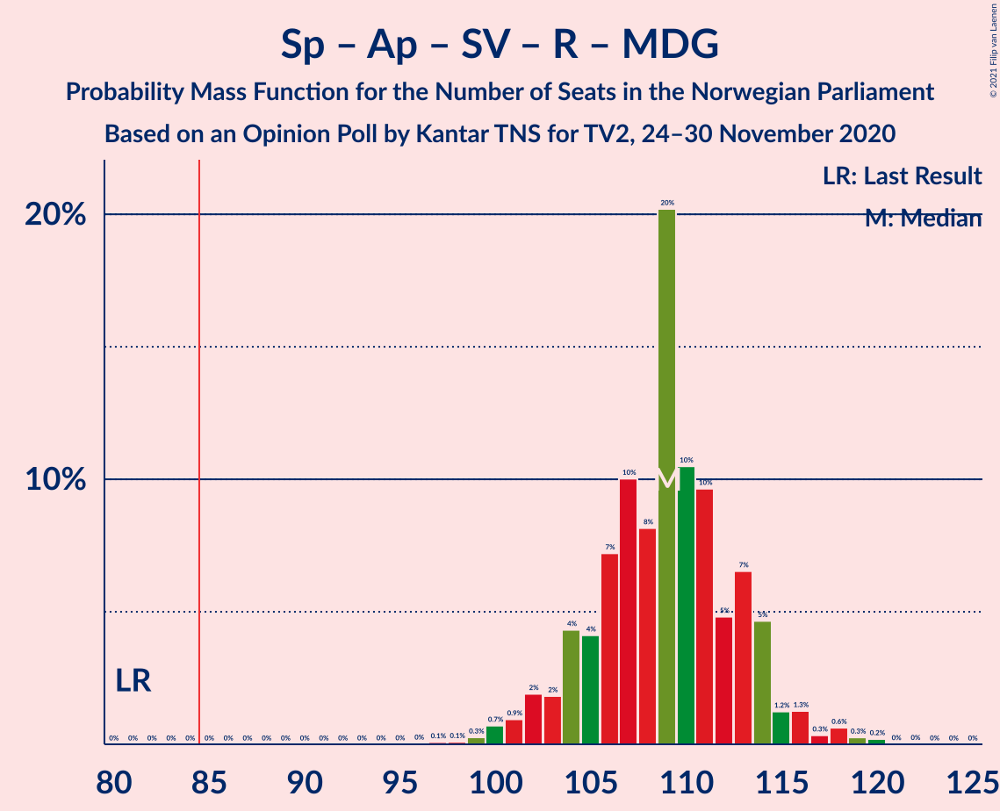

| Number of Seats | Probability | Accumulated | Special Marks |
|:---------------:|:-----------:|:-----------:|:-------------:|
| 81 | 0% | 100% | Last Result |
| 82 | 0% | 100% |  |
| 83 | 0% | 100% |  |
| 84 | 0% | 100% |  |
| 85 | 0% | 100% | Majority |
| 86 | 0% | 100% |  |
| 87 | 0% | 100% |  |
| 88 | 0% | 100% |  |
| 89 | 0% | 100% |  |
| 90 | 0% | 100% |  |
| 91 | 0% | 100% |  |
| 92 | 0% | 100% |  |
| 93 | 0% | 100% |  |
| 94 | 0% | 100% |  |
| 95 | 0% | 100% |  |
| 96 | 0% | 100% |  |
| 97 | 0.1% | 100% |  |
| 98 | 0.1% | 99.9% |  |
| 99 | 0.3% | 99.8% |  |
| 100 | 0.7% | 99.5% |  |
| 101 | 0.9% | 98.8% |  |
| 102 | 2% | 98% |  |
| 103 | 2% | 96% |  |
| 104 | 4% | 94% |  |
| 105 | 4% | 90% |  |
| 106 | 7% | 86% |  |
| 107 | 10% | 78% |  |
| 108 | 8% | 68% |  |
| 109 | 20% | 60% |  |
| 110 | 10% | 40% | Median |
| 111 | 10% | 30% |  |
| 112 | 5% | 20% |  |
| 113 | 7% | 15% |  |
| 114 | 5% | 9% |  |
| 115 | 1.2% | 4% |  |
| 116 | 1.3% | 3% |  |
| 117 | 0.3% | 1.5% |  |
| 118 | 0.6% | 1.1% |  |
| 119 | 0.3% | 0.5% |  |
| 120 | 0.2% | 0.2% |  |
| 121 | 0% | 0% |  |

### Senterpartiet – Arbeiderpartiet – Sosialistisk Venstreparti – Rødt

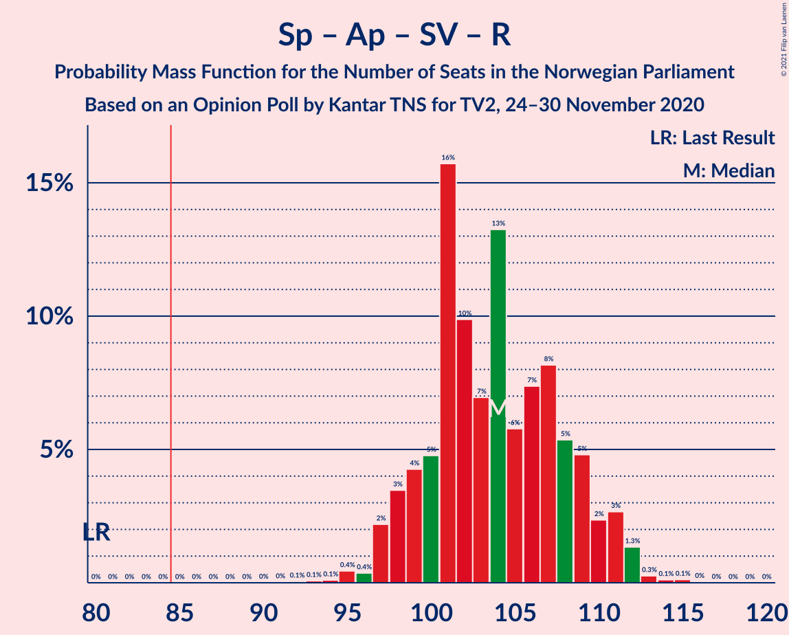

| Number of Seats | Probability | Accumulated | Special Marks |
|:---------------:|:-----------:|:-----------:|:-------------:|
| 80 | 0% | 100% | Last Result |
| 81 | 0% | 100% |  |
| 82 | 0% | 100% |  |
| 83 | 0% | 100% |  |
| 84 | 0% | 100% |  |
| 85 | 0% | 100% | Majority |
| 86 | 0% | 100% |  |
| 87 | 0% | 100% |  |
| 88 | 0% | 100% |  |
| 89 | 0% | 100% |  |
| 90 | 0% | 100% |  |
| 91 | 0% | 100% |  |
| 92 | 0.1% | 100% |  |
| 93 | 0.1% | 99.9% |  |
| 94 | 0.1% | 99.8% |  |
| 95 | 0.4% | 99.7% |  |
| 96 | 0.4% | 99.3% |  |
| 97 | 2% | 98.9% |  |
| 98 | 3% | 97% |  |
| 99 | 4% | 93% |  |
| 100 | 5% | 89% |  |
| 101 | 16% | 84% |  |
| 102 | 10% | 68% |  |
| 103 | 7% | 59% | Median |
| 104 | 13% | 52% |  |
| 105 | 6% | 38% |  |
| 106 | 7% | 33% |  |
| 107 | 8% | 25% |  |
| 108 | 5% | 17% |  |
| 109 | 5% | 12% |  |
| 110 | 2% | 7% |  |
| 111 | 3% | 5% |  |
| 112 | 1.3% | 2% |  |
| 113 | 0.3% | 0.5% |  |
| 114 | 0.1% | 0.3% |  |
| 115 | 0.1% | 0.2% |  |
| 116 | 0% | 0% |  |

### Senterpartiet – Høyre – Fremskrittspartiet – Venstre – Kristelig Folkeparti

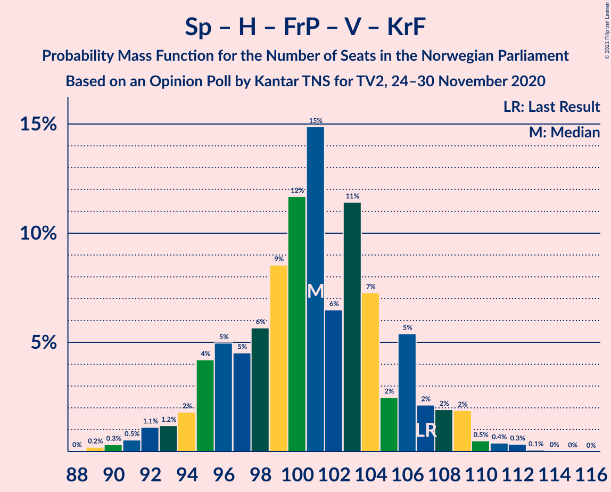

| Number of Seats | Probability | Accumulated | Special Marks |
|:---------------:|:-----------:|:-----------:|:-------------:|
| 89 | 0.2% | 100% |  |
| 90 | 0.3% | 99.8% |  |
| 91 | 0.5% | 99.4% |  |
| 92 | 1.1% | 98.9% |  |
| 93 | 1.2% | 98% |  |
| 94 | 2% | 97% |  |
| 95 | 4% | 95% |  |
| 96 | 5% | 91% |  |
| 97 | 5% | 86% |  |
| 98 | 6% | 81% |  |
| 99 | 9% | 75% |  |
| 100 | 12% | 67% |  |
| 101 | 15% | 55% |  |
| 102 | 6% | 40% |  |
| 103 | 11% | 34% | Median |
| 104 | 7% | 22% |  |
| 105 | 2% | 15% |  |
| 106 | 5% | 13% |  |
| 107 | 2% | 7% | Last Result |
| 108 | 2% | 5% |  |
| 109 | 2% | 3% |  |
| 110 | 0.5% | 1.3% |  |
| 111 | 0.4% | 0.8% |  |
| 112 | 0.3% | 0.5% |  |
| 113 | 0.1% | 0.1% |  |
| 114 | 0% | 0.1% |  |
| 115 | 0% | 0% |  |

### Senterpartiet – Arbeiderpartiet – Sosialistisk Venstreparti – Miljøpartiet De Grønne – Kristelig Folkeparti

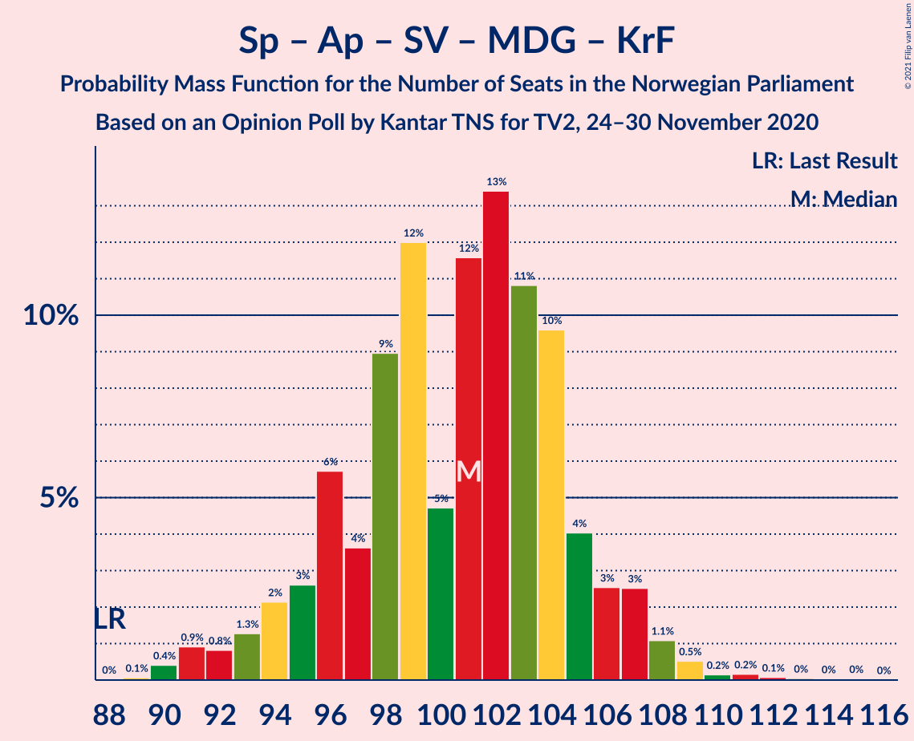

| Number of Seats | Probability | Accumulated | Special Marks |
|:---------------:|:-----------:|:-----------:|:-------------:|
| 88 | 0% | 100% | Last Result |
| 89 | 0.1% | 100% |  |
| 90 | 0.4% | 99.9% |  |
| 91 | 0.9% | 99.5% |  |
| 92 | 0.8% | 98.6% |  |
| 93 | 1.3% | 98% |  |
| 94 | 2% | 96% |  |
| 95 | 3% | 94% |  |
| 96 | 6% | 92% |  |
| 97 | 4% | 86% |  |
| 98 | 9% | 82% |  |
| 99 | 12% | 73% |  |
| 100 | 5% | 61% |  |
| 101 | 12% | 57% |  |
| 102 | 13% | 45% | Median |
| 103 | 11% | 32% |  |
| 104 | 10% | 21% |  |
| 105 | 4% | 11% |  |
| 106 | 3% | 7% |  |
| 107 | 3% | 5% |  |
| 108 | 1.1% | 2% |  |
| 109 | 0.5% | 1.0% |  |
| 110 | 0.2% | 0.5% |  |
| 111 | 0.2% | 0.4% |  |
| 112 | 0.1% | 0.2% |  |
| 113 | 0% | 0.1% |  |
| 114 | 0% | 0.1% |  |
| 115 | 0% | 0% |  |

### Senterpartiet – Arbeiderpartiet – Sosialistisk Venstreparti – Miljøpartiet De Grønne

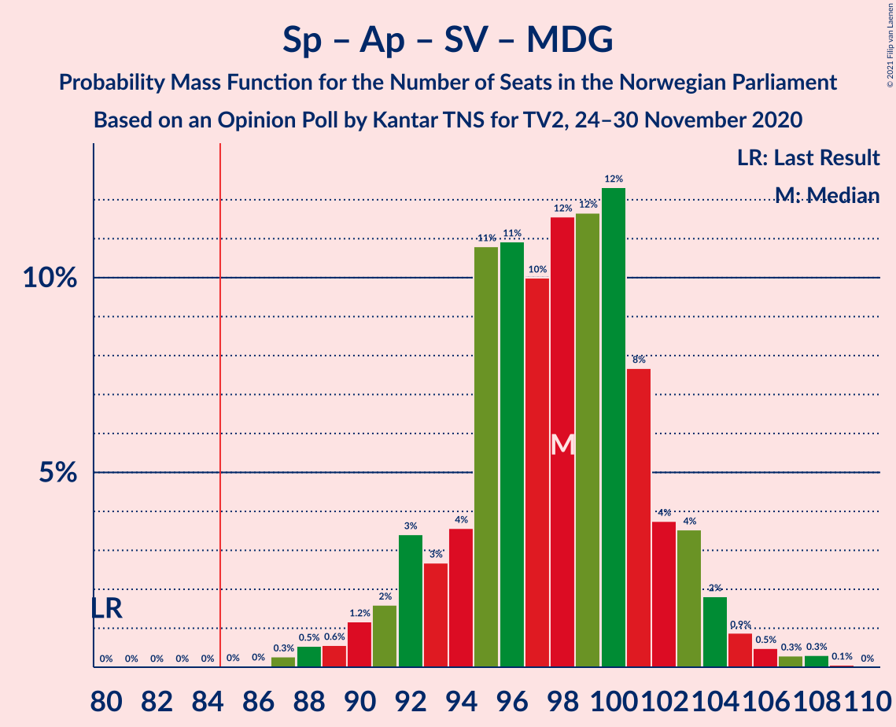

| Number of Seats | Probability | Accumulated | Special Marks |
|:---------------:|:-----------:|:-----------:|:-------------:|
| 80 | 0% | 100% | Last Result |
| 81 | 0% | 100% |  |
| 82 | 0% | 100% |  |
| 83 | 0% | 100% |  |
| 84 | 0% | 100% |  |
| 85 | 0% | 100% | Majority |
| 86 | 0% | 100% |  |
| 87 | 0.3% | 99.9% |  |
| 88 | 0.5% | 99.7% |  |
| 89 | 0.6% | 99.1% |  |
| 90 | 1.2% | 98.5% |  |
| 91 | 2% | 97% |  |
| 92 | 3% | 96% |  |
| 93 | 3% | 92% |  |
| 94 | 4% | 90% |  |
| 95 | 11% | 86% |  |
| 96 | 11% | 75% |  |
| 97 | 10% | 64% |  |
| 98 | 12% | 54% |  |
| 99 | 12% | 43% | Median |
| 100 | 12% | 31% |  |
| 101 | 8% | 19% |  |
| 102 | 4% | 11% |  |
| 103 | 4% | 7% |  |
| 104 | 2% | 4% |  |
| 105 | 0.9% | 2% |  |
| 106 | 0.5% | 1.2% |  |
| 107 | 0.3% | 0.7% |  |
| 108 | 0.3% | 0.4% |  |
| 109 | 0.1% | 0.1% |  |
| 110 | 0% | 0% |  |

### Senterpartiet – Arbeiderpartiet – Sosialistisk Venstreparti

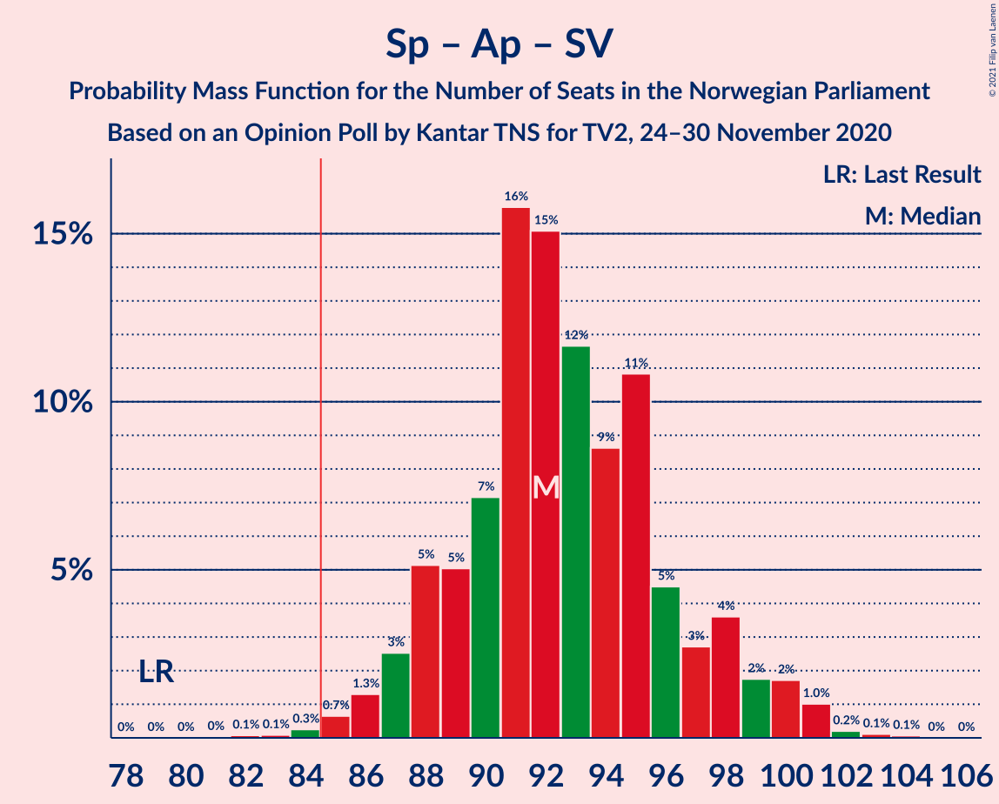

| Number of Seats | Probability | Accumulated | Special Marks |
|:---------------:|:-----------:|:-----------:|:-------------:|
| 79 | 0% | 100% | Last Result |
| 80 | 0% | 100% |  |
| 81 | 0% | 100% |  |
| 82 | 0.1% | 100% |  |
| 83 | 0.1% | 99.9% |  |
| 84 | 0.3% | 99.8% |  |
| 85 | 0.7% | 99.5% | Majority |
| 86 | 1.3% | 98.9% |  |
| 87 | 3% | 98% |  |
| 88 | 5% | 95% |  |
| 89 | 5% | 90% |  |
| 90 | 7% | 85% |  |
| 91 | 16% | 78% |  |
| 92 | 15% | 62% | Median |
| 93 | 12% | 47% |  |
| 94 | 9% | 35% |  |
| 95 | 11% | 27% |  |
| 96 | 5% | 16% |  |
| 97 | 3% | 11% |  |
| 98 | 4% | 8% |  |
| 99 | 2% | 5% |  |
| 100 | 2% | 3% |  |
| 101 | 1.0% | 1.4% |  |
| 102 | 0.2% | 0.4% |  |
| 103 | 0.1% | 0.2% |  |
| 104 | 0.1% | 0.1% |  |
| 105 | 0% | 0% |  |

### Senterpartiet – Arbeiderpartiet – Miljøpartiet De Grønne – Kristelig Folkeparti

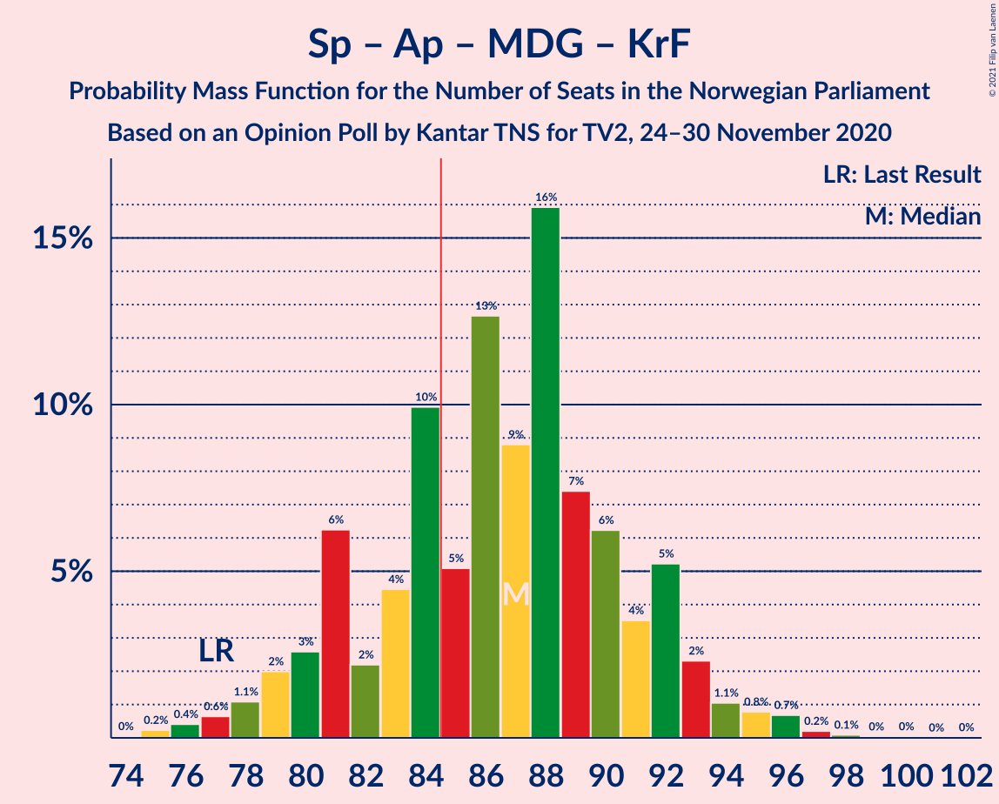

| Number of Seats | Probability | Accumulated | Special Marks |
|:---------------:|:-----------:|:-----------:|:-------------:|
| 74 | 0% | 100% |  |
| 75 | 0.2% | 99.9% |  |
| 76 | 0.4% | 99.7% |  |
| 77 | 0.6% | 99.3% | Last Result |
| 78 | 1.1% | 98.6% |  |
| 79 | 2% | 98% |  |
| 80 | 3% | 96% |  |
| 81 | 6% | 93% |  |
| 82 | 2% | 87% |  |
| 83 | 4% | 85% |  |
| 84 | 10% | 80% |  |
| 85 | 5% | 70% | Majority |
| 86 | 13% | 65% |  |
| 87 | 9% | 52% |  |
| 88 | 16% | 44% | Median |
| 89 | 7% | 28% |  |
| 90 | 6% | 20% |  |
| 91 | 4% | 14% |  |
| 92 | 5% | 10% |  |
| 93 | 2% | 5% |  |
| 94 | 1.1% | 3% |  |
| 95 | 0.8% | 2% |  |
| 96 | 0.7% | 1.1% |  |
| 97 | 0.2% | 0.4% |  |
| 98 | 0.1% | 0.2% |  |
| 99 | 0% | 0.1% |  |
| 100 | 0% | 0.1% |  |
| 101 | 0% | 0% |  |

### Senterpartiet – Arbeiderpartiet – Kristelig Folkeparti

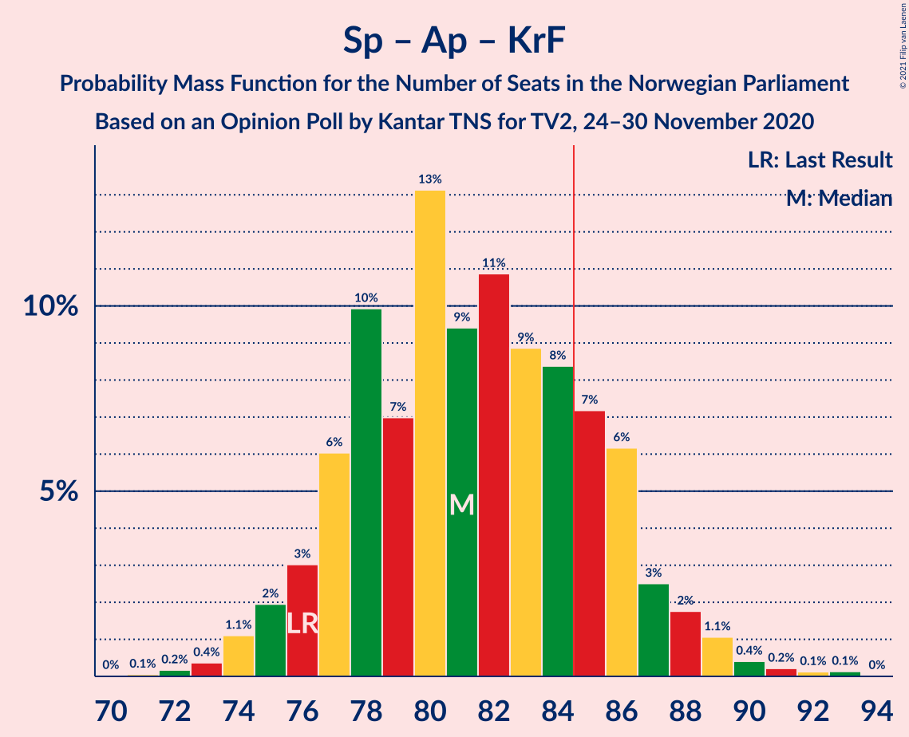

| Number of Seats | Probability | Accumulated | Special Marks |
|:---------------:|:-----------:|:-----------:|:-------------:|
| 70 | 0% | 100% |  |
| 71 | 0.1% | 99.9% |  |
| 72 | 0.2% | 99.9% |  |
| 73 | 0.4% | 99.7% |  |
| 74 | 1.1% | 99.3% |  |
| 75 | 2% | 98% |  |
| 76 | 3% | 96% | Last Result |
| 77 | 6% | 93% |  |
| 78 | 10% | 87% |  |
| 79 | 7% | 77% |  |
| 80 | 13% | 70% |  |
| 81 | 9% | 57% | Median |
| 82 | 11% | 48% |  |
| 83 | 9% | 37% |  |
| 84 | 8% | 28% |  |
| 85 | 7% | 20% | Majority |
| 86 | 6% | 12% |  |
| 87 | 3% | 6% |  |
| 88 | 2% | 4% |  |
| 89 | 1.1% | 2% |  |
| 90 | 0.4% | 0.9% |  |
| 91 | 0.2% | 0.5% |  |
| 92 | 0.1% | 0.3% |  |
| 93 | 0.1% | 0.2% |  |
| 94 | 0% | 0% |  |

### Senterpartiet – Arbeiderpartiet

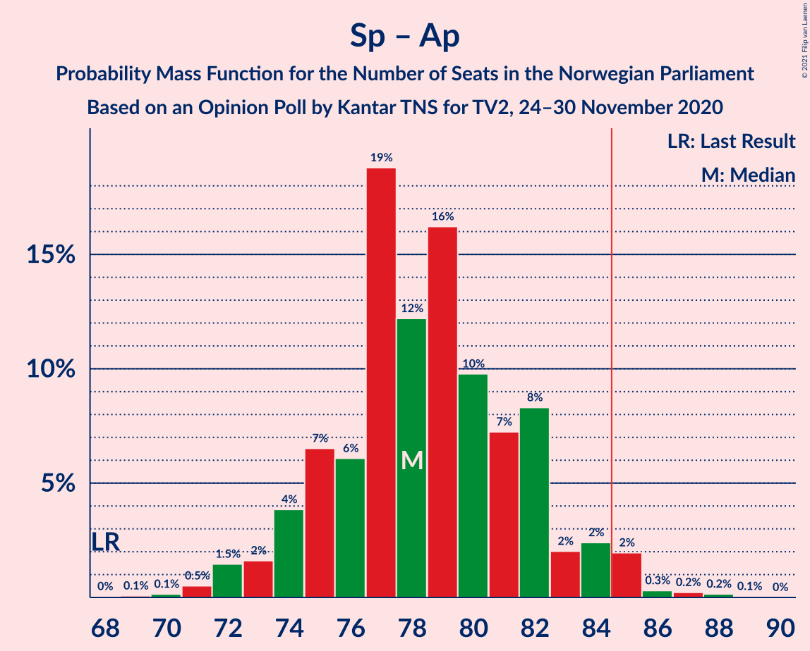

| Number of Seats | Probability | Accumulated | Special Marks |
|:---------------:|:-----------:|:-----------:|:-------------:|
| 68 | 0% | 100% | Last Result |
| 69 | 0.1% | 99.9% |  |
| 70 | 0.1% | 99.8% |  |
| 71 | 0.5% | 99.7% |  |
| 72 | 1.5% | 99.2% |  |
| 73 | 2% | 98% |  |
| 74 | 4% | 96% |  |
| 75 | 7% | 92% |  |
| 76 | 6% | 86% |  |
| 77 | 19% | 80% |  |
| 78 | 12% | 61% | Median |
| 79 | 16% | 49% |  |
| 80 | 10% | 32% |  |
| 81 | 7% | 23% |  |
| 82 | 8% | 15% |  |
| 83 | 2% | 7% |  |
| 84 | 2% | 5% |  |
| 85 | 2% | 3% | Majority |
| 86 | 0.3% | 0.7% |  |
| 87 | 0.2% | 0.4% |  |
| 88 | 0.2% | 0.2% |  |
| 89 | 0.1% | 0.1% |  |
| 90 | 0% | 0% |  |

### Høyre – Fremskrittspartiet – Miljøpartiet De Grønne – Venstre – Kristelig Folkeparti

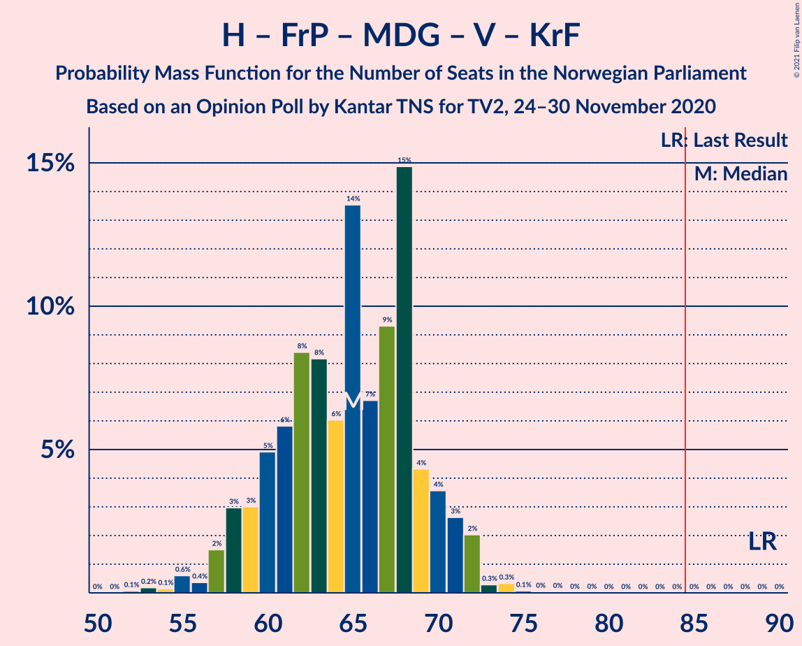

| Number of Seats | Probability | Accumulated | Special Marks |
|:---------------:|:-----------:|:-----------:|:-------------:|
| 52 | 0.1% | 100% |  |
| 53 | 0.2% | 99.9% |  |
| 54 | 0.1% | 99.7% |  |
| 55 | 0.6% | 99.6% |  |
| 56 | 0.4% | 99.0% |  |
| 57 | 2% | 98.6% |  |
| 58 | 3% | 97% |  |
| 59 | 3% | 94% |  |
| 60 | 5% | 91% |  |
| 61 | 6% | 86% |  |
| 62 | 8% | 80% |  |
| 63 | 8% | 72% |  |
| 64 | 6% | 64% |  |
| 65 | 14% | 58% |  |
| 66 | 7% | 44% |  |
| 67 | 9% | 38% |  |
| 68 | 15% | 28% |  |
| 69 | 4% | 13% | Median |
| 70 | 4% | 9% |  |
| 71 | 3% | 5% |  |
| 72 | 2% | 3% |  |
| 73 | 0.3% | 0.8% |  |
| 74 | 0.3% | 0.5% |  |
| 75 | 0.1% | 0.2% |  |
| 76 | 0% | 0.1% |  |
| 77 | 0% | 0.1% |  |
| 78 | 0% | 0% |  |
| 79 | 0% | 0% |  |
| 80 | 0% | 0% |  |
| 81 | 0% | 0% |  |
| 82 | 0% | 0% |  |
| 83 | 0% | 0% |  |
| 84 | 0% | 0% |  |
| 85 | 0% | 0% | Majority |
| 86 | 0% | 0% |  |
| 87 | 0% | 0% |  |
| 88 | 0% | 0% |  |
| 89 | 0% | 0% | Last Result |

### Høyre – Fremskrittspartiet – Venstre – Kristelig Folkeparti

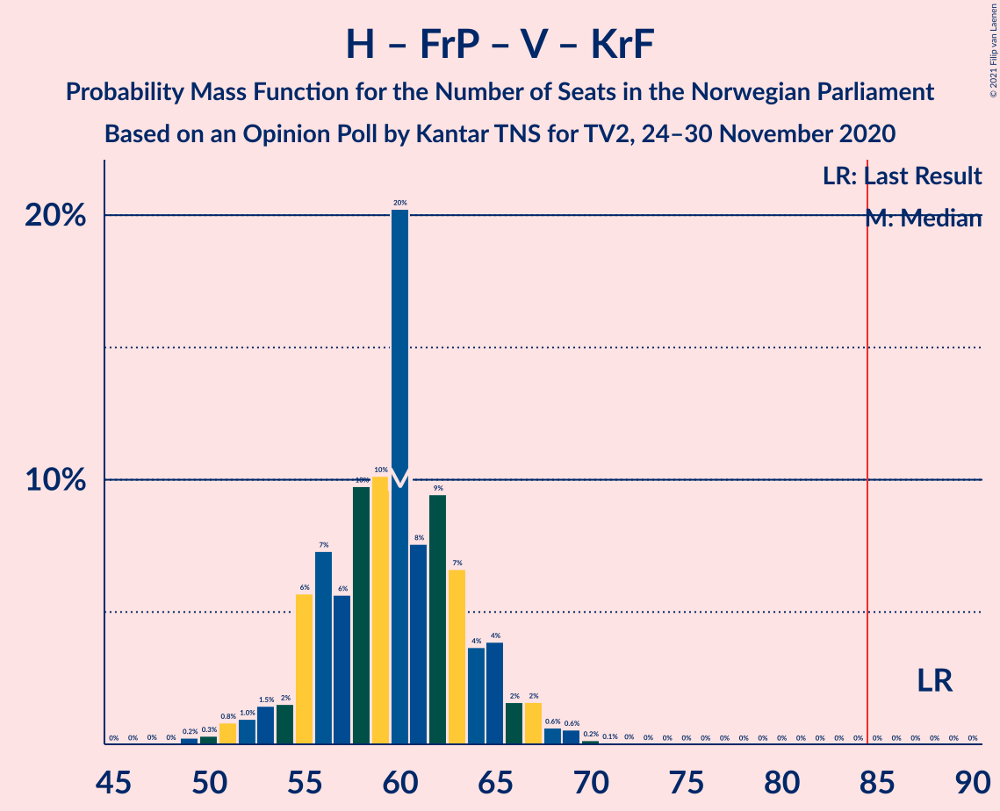

| Number of Seats | Probability | Accumulated | Special Marks |
|:---------------:|:-----------:|:-----------:|:-------------:|
| 48 | 0% | 100% |  |
| 49 | 0.2% | 99.9% |  |
| 50 | 0.3% | 99.7% |  |
| 51 | 0.8% | 99.4% |  |
| 52 | 1.0% | 98.6% |  |
| 53 | 1.5% | 98% |  |
| 54 | 2% | 96% |  |
| 55 | 6% | 95% |  |
| 56 | 7% | 89% |  |
| 57 | 6% | 82% |  |
| 58 | 10% | 76% |  |
| 59 | 10% | 66% |  |
| 60 | 20% | 56% |  |
| 61 | 8% | 36% |  |
| 62 | 9% | 28% | Median |
| 63 | 7% | 19% |  |
| 64 | 4% | 12% |  |
| 65 | 4% | 9% |  |
| 66 | 2% | 5% |  |
| 67 | 2% | 3% |  |
| 68 | 0.6% | 1.5% |  |
| 69 | 0.6% | 0.8% |  |
| 70 | 0.2% | 0.3% |  |
| 71 | 0.1% | 0.1% |  |
| 72 | 0% | 0.1% |  |
| 73 | 0% | 0% |  |
| 74 | 0% | 0% |  |
| 75 | 0% | 0% |  |
| 76 | 0% | 0% |  |
| 77 | 0% | 0% |  |
| 78 | 0% | 0% |  |
| 79 | 0% | 0% |  |
| 80 | 0% | 0% |  |
| 81 | 0% | 0% |  |
| 82 | 0% | 0% |  |
| 83 | 0% | 0% |  |
| 84 | 0% | 0% |  |
| 85 | 0% | 0% | Majority |
| 86 | 0% | 0% |  |
| 87 | 0% | 0% |  |
| 88 | 0% | 0% | Last Result |

### Høyre – Fremskrittspartiet – Venstre

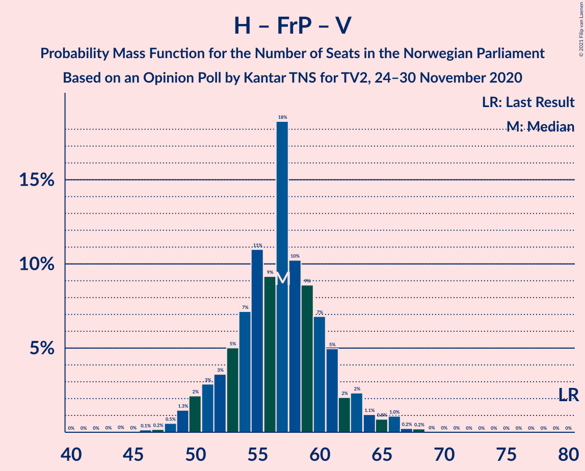

| Number of Seats | Probability | Accumulated | Special Marks |
|:---------------:|:-----------:|:-----------:|:-------------:|
| 44 | 0% | 100% |  |
| 45 | 0% | 99.9% |  |
| 46 | 0.1% | 99.9% |  |
| 47 | 0.2% | 99.8% |  |
| 48 | 0.5% | 99.6% |  |
| 49 | 1.3% | 99.1% |  |
| 50 | 2% | 98% |  |
| 51 | 3% | 96% |  |
| 52 | 3% | 93% |  |
| 53 | 5% | 89% |  |
| 54 | 7% | 84% |  |
| 55 | 11% | 77% |  |
| 56 | 9% | 66% |  |
| 57 | 18% | 57% |  |
| 58 | 10% | 38% |  |
| 59 | 9% | 28% | Median |
| 60 | 7% | 20% |  |
| 61 | 5% | 13% |  |
| 62 | 2% | 8% |  |
| 63 | 2% | 6% |  |
| 64 | 1.1% | 3% |  |
| 65 | 0.8% | 2% |  |
| 66 | 1.0% | 1.4% |  |
| 67 | 0.2% | 0.5% |  |
| 68 | 0.2% | 0.3% |  |
| 69 | 0% | 0.1% |  |
| 70 | 0% | 0% |  |
| 71 | 0% | 0% |  |
| 72 | 0% | 0% |  |
| 73 | 0% | 0% |  |
| 74 | 0% | 0% |  |
| 75 | 0% | 0% |  |
| 76 | 0% | 0% |  |
| 77 | 0% | 0% |  |
| 78 | 0% | 0% |  |
| 79 | 0% | 0% |  |
| 80 | 0% | 0% | Last Result |

### Høyre – Fremskrittspartiet

| Number of Seats | Probability | Accumulated | Special Marks |
|:---------------:|:-----------:|:-----------:|:-------------:|
| 40 | 0% | 100% |  |
| 41 | 0.1% | 99.9% |  |
| 42 | 0.1% | 99.9% |  |
| 43 | 0.3% | 99.7% |  |
| 44 | 0.4% | 99.5% |  |
| 45 | 0.9% | 99.1% |  |
| 46 | 2% | 98% |  |
| 47 | 5% | 96% |  |
| 48 | 8% | 92% |  |
| 49 | 10% | 84% |  |
| 50 | 14% | 74% |  |
| 51 | 13% | 60% |  |
| 52 | 13% | 47% | Median |
| 53 | 11% | 34% |  |
| 54 | 5% | 23% |  |
| 55 | 7% | 18% |  |
| 56 | 3% | 11% |  |
| 57 | 2% | 8% |  |
| 58 | 2% | 5% |  |
| 59 | 1.4% | 3% |  |
| 60 | 1.2% | 2% |  |
| 61 | 0.6% | 0.8% |  |
| 62 | 0.1% | 0.2% |  |
| 63 | 0% | 0.1% |  |
| 64 | 0% | 0.1% |  |
| 65 | 0% | 0% |  |
| 66 | 0% | 0% |  |
| 67 | 0% | 0% |  |
| 68 | 0% | 0% |  |
| 69 | 0% | 0% |  |
| 70 | 0% | 0% |  |
| 71 | 0% | 0% |  |
| 72 | 0% | 0% | Last Result |

### Arbeiderpartiet – Sosialistisk Venstreparti

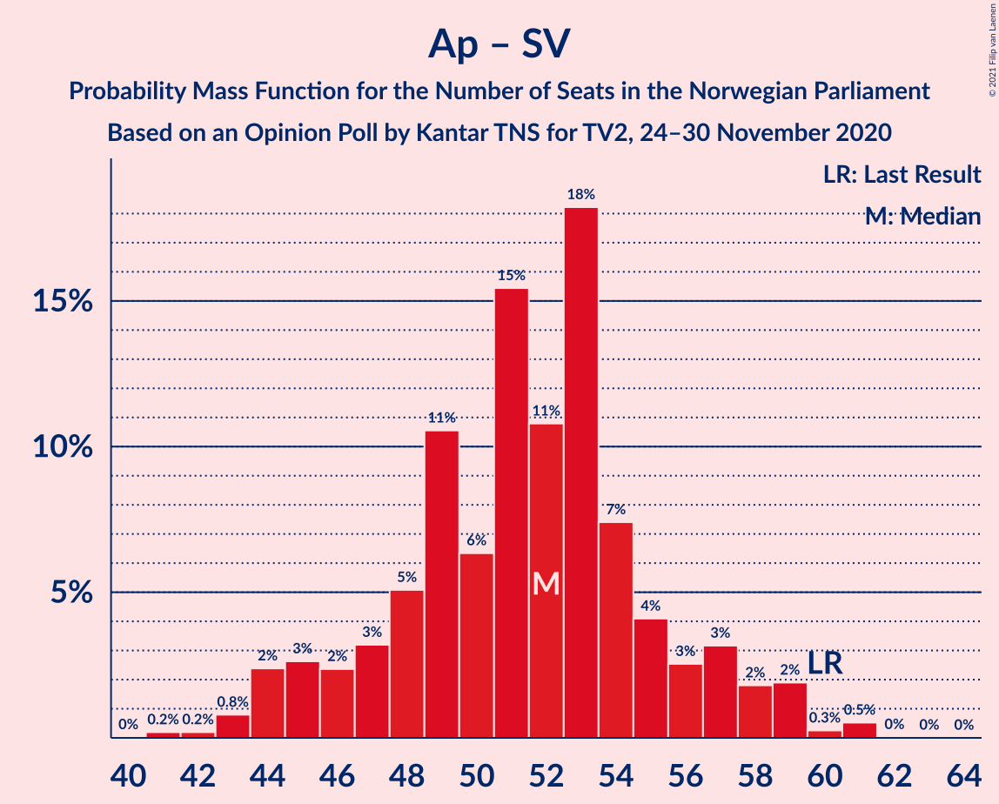

| Number of Seats | Probability | Accumulated | Special Marks |
|:---------------:|:-----------:|:-----------:|:-------------:|
| 40 | 0% | 100% |  |
| 41 | 0.2% | 99.9% |  |
| 42 | 0.2% | 99.7% |  |
| 43 | 0.8% | 99.6% |  |
| 44 | 2% | 98.8% |  |
| 45 | 3% | 96% |  |
| 46 | 2% | 94% |  |
| 47 | 3% | 91% |  |
| 48 | 5% | 88% |  |
| 49 | 11% | 83% |  |
| 50 | 6% | 73% |  |
| 51 | 15% | 66% | Median |
| 52 | 11% | 51% |  |
| 53 | 18% | 40% |  |
| 54 | 7% | 22% |  |
| 55 | 4% | 14% |  |
| 56 | 3% | 10% |  |
| 57 | 3% | 8% |  |
| 58 | 2% | 5% |  |
| 59 | 2% | 3% |  |
| 60 | 0.3% | 0.8% | Last Result |
| 61 | 0.5% | 0.6% |  |
| 62 | 0% | 0.1% |  |
| 63 | 0% | 0% |  |

### Senterpartiet – Venstre – Kristelig Folkeparti

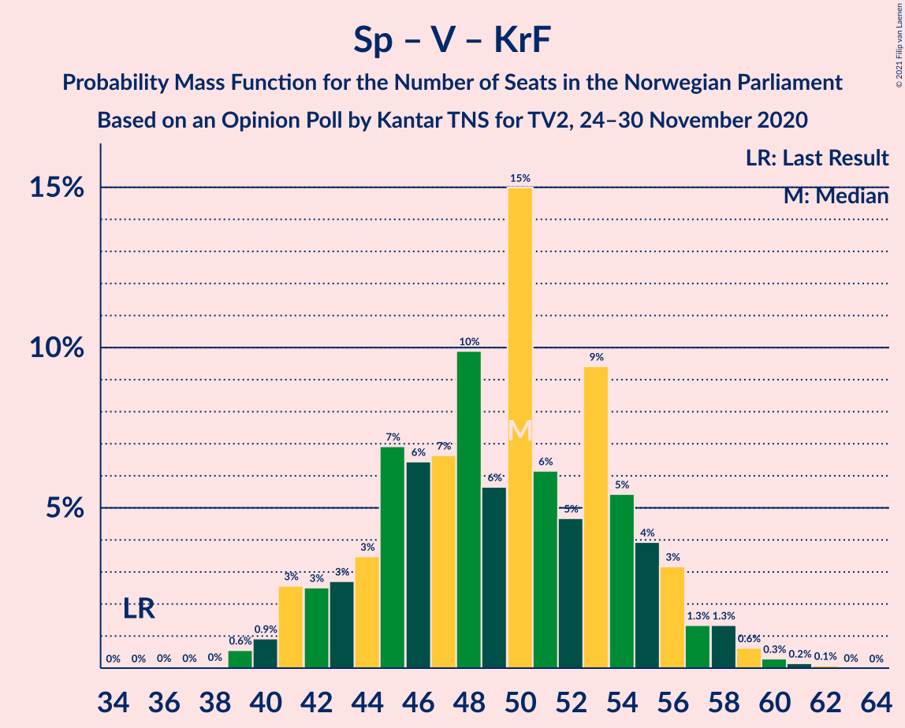

| Number of Seats | Probability | Accumulated | Special Marks |
|:---------------:|:-----------:|:-----------:|:-------------:|
| 35 | 0% | 100% | Last Result |
| 36 | 0% | 100% |  |
| 37 | 0% | 100% |  |
| 38 | 0% | 100% |  |
| 39 | 0.6% | 99.9% |  |
| 40 | 0.9% | 99.4% |  |
| 41 | 3% | 98% |  |
| 42 | 3% | 96% |  |
| 43 | 3% | 93% |  |
| 44 | 3% | 91% |  |
| 45 | 7% | 87% |  |
| 46 | 6% | 80% |  |
| 47 | 7% | 74% |  |
| 48 | 10% | 67% |  |
| 49 | 6% | 57% |  |
| 50 | 15% | 52% |  |
| 51 | 6% | 37% | Median |
| 52 | 5% | 30% |  |
| 53 | 9% | 26% |  |
| 54 | 5% | 16% |  |
| 55 | 4% | 11% |  |
| 56 | 3% | 7% |  |
| 57 | 1.3% | 4% |  |
| 58 | 1.3% | 3% |  |
| 59 | 0.6% | 1.2% |  |
| 60 | 0.3% | 0.5% |  |
| 61 | 0.2% | 0.3% |  |
| 62 | 0.1% | 0.1% |  |
| 63 | 0% | 0% |  |

### Høyre – Venstre – Kristelig Folkeparti

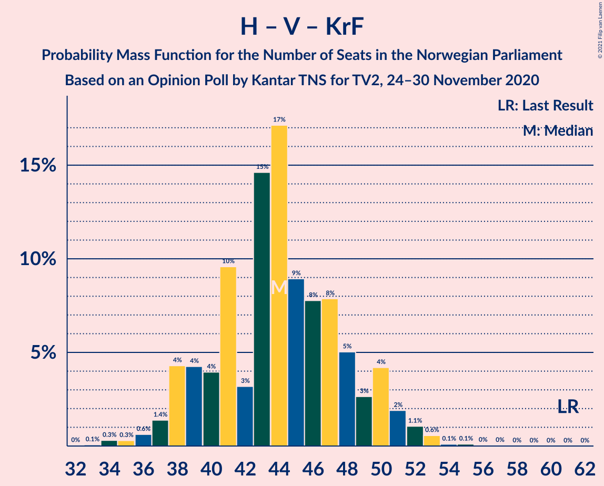

| Number of Seats | Probability | Accumulated | Special Marks |
|:---------------:|:-----------:|:-----------:|:-------------:|
| 33 | 0.1% | 100% |  |
| 34 | 0.3% | 99.9% |  |
| 35 | 0.3% | 99.6% |  |
| 36 | 0.6% | 99.3% |  |
| 37 | 1.4% | 98.7% |  |
| 38 | 4% | 97% |  |
| 39 | 4% | 93% |  |
| 40 | 4% | 89% |  |
| 41 | 10% | 85% |  |
| 42 | 3% | 75% |  |
| 43 | 15% | 72% |  |
| 44 | 17% | 57% |  |
| 45 | 9% | 40% |  |
| 46 | 8% | 31% | Median |
| 47 | 8% | 24% |  |
| 48 | 5% | 16% |  |
| 49 | 3% | 11% |  |
| 50 | 4% | 8% |  |
| 51 | 2% | 4% |  |
| 52 | 1.1% | 2% |  |
| 53 | 0.6% | 0.9% |  |
| 54 | 0.1% | 0.3% |  |
| 55 | 0.1% | 0.2% |  |
| 56 | 0% | 0.1% |  |
| 57 | 0% | 0.1% |  |
| 58 | 0% | 0% |  |
| 59 | 0% | 0% |  |
| 60 | 0% | 0% |  |
| 61 | 0% | 0% | Last Result |

## Technical Information

### Opinion Poll

+ **Polling firm:** Kantar TNS
+ **Commissioner(s):** TV2
+ **Fieldwork period:** 24–30 November 2020

### Calculations

+ **Sample size:** 797
+ **Simulations done:** 1,048,576
+ **Error estimate:** 1.72%

