# Opinion Poll by Respons Analyse for VG, 25–30 November 2020

<a href="#voting-intentions">Voting Intentions</a> | <a href="#seats">Seats</a> | <a href="#coalitions">Coalitions</a> | <a href="#technical-information">Technical Information</a>

## Voting Intentions

### Confidence Intervals

| Party | Last Result | Poll Result | 80% Confidence Interval | 90% Confidence Interval | 95% Confidence Interval | 99% Confidence Interval |
|:-----:|:-----------:|:-----------:|:-----------------------:|:-----------------------:|:-----------------------:|:-----------------------:|
| Høyre | 25.0% | 22.9% | 21.3–24.7% |20.8–25.2% |20.4–25.6% |19.6–26.5% |
| Senterpartiet | 10.3% | 20.5% | 18.9–22.2% |18.5–22.7% |18.1–23.1% |17.4–24.0% |
| Arbeiderpartiet | 27.4% | 20.3% | 18.7–22.0% |18.3–22.5% |17.9–22.9% |17.2–23.7% |
| Fremskrittspartiet | 15.2% | 10.9% | 9.7–12.3% |9.4–12.7% |9.1–13.0% |8.6–13.7% |
| Sosialistisk Venstreparti | 6.0% | 8.1% | 7.1–9.3% |6.8–9.7% |6.6–10.0% |6.1–10.6% |
| Miljøpartiet De Grønne | 3.2% | 4.5% | 3.8–5.5% |3.6–5.7% |3.4–6.0% |3.0–6.5% |
| Venstre | 4.4% | 4.1% | 3.4–5.0% |3.2–5.3% |3.0–5.5% |2.7–6.0% |
| Kristelig Folkeparti | 4.2% | 3.8% | 3.1–4.7% |2.9–5.0% |2.8–5.2% |2.5–5.6% |
| Rødt | 2.4% | 3.7% | 3.0–4.6% |2.9–4.8% |2.7–5.1% |2.4–5.5% |

*Note:* The poll result column reflects the actual value used in the calculations. Published results may vary slightly, and in addition be rounded to fewer digits.

## Seats

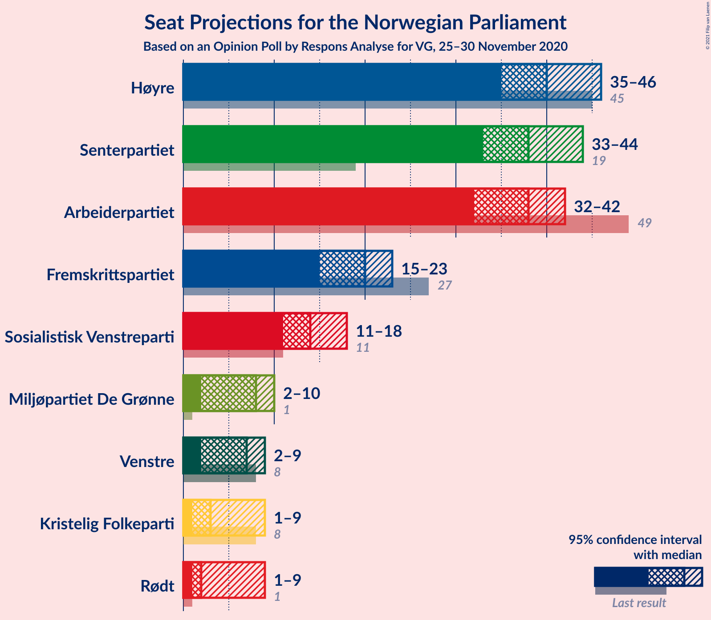

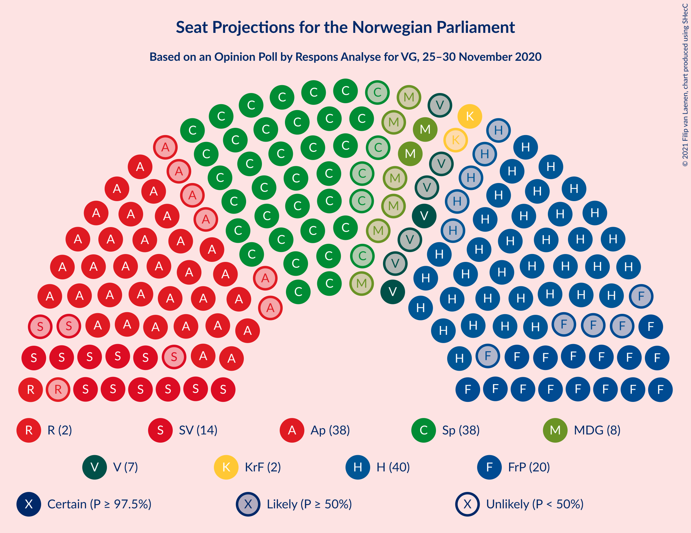

### Confidence Intervals

| Party | Last Result | Median | 80% Confidence Interval | 90% Confidence Interval | 95% Confidence Interval | 99% Confidence Interval |
|:-----:|:-----------:|:------:|:-----------------------:|:-----------------------:|:-----------------------:|:-----------------------:|
| <a href="#høyre">Høyre</a> | 45 | 40 | 37–45 |36–45 |35–46 |34–48 |
| <a href="#senterpartiet">Senterpartiet</a> | 19 | 38 | 34–41 |33–43 |33–44 |31–45 |
| <a href="#arbeiderpartiet">Arbeiderpartiet</a> | 49 | 38 | 33–41 |32–41 |32–42 |29–44 |
| <a href="#fremskrittspartiet">Fremskrittspartiet</a> | 27 | 20 | 16–22 |16–23 |15–23 |14–25 |
| <a href="#sosialistisk-venstreparti">Sosialistisk Venstreparti</a> | 11 | 14 | 12–16 |11–17 |11–18 |10–19 |
| <a href="#miljøpartiet-de-grønne">Miljøpartiet De Grønne</a> | 1 | 8 | 2–9 |2–10 |2–10 |2–12 |
| <a href="#venstre">Venstre</a> | 8 | 7 | 2–9 |2–9 |2–9 |2–10 |
| <a href="#kristelig-folkeparti">Kristelig Folkeparti</a> | 8 | 3 | 1–8 |1–8 |1–9 |1–10 |
| <a href="#rødt">Rødt</a> | 1 | 2 | 2–8 |1–8 |1–9 |1–10 |

### Høyre

*For a full overview of the results for this party, see the [Høyre](party-høyre.html) page.*

| Number of Seats | Probability | Accumulated | Special Marks |
|:---------------:|:-----------:|:-----------:|:-------------:|
| 33 | 0.4% | 100% |  |
| 34 | 2% | 99.6% |  |
| 35 | 2% | 98% |  |
| 36 | 5% | 96% |  |
| 37 | 7% | 91% |  |
| 38 | 12% | 84% |  |
| 39 | 10% | 72% |  |
| 40 | 18% | 62% | Median |
| 41 | 9% | 44% |  |
| 42 | 5% | 35% |  |
| 43 | 13% | 30% |  |
| 44 | 6% | 17% |  |
| 45 | 7% | 11% | Last Result |
| 46 | 2% | 4% |  |
| 47 | 1.2% | 2% |  |
| 48 | 0.6% | 1.0% |  |
| 49 | 0.3% | 0.4% |  |
| 50 | 0.1% | 0.1% |  |
| 51 | 0% | 0% |  |

### Senterpartiet

*For a full overview of the results for this party, see the [Senterpartiet](party-senterpartiet.html) page.*

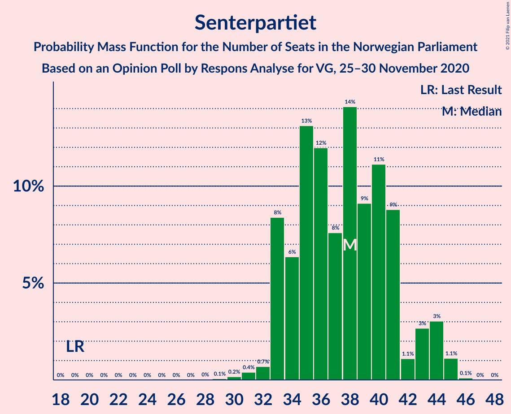

| Number of Seats | Probability | Accumulated | Special Marks |
|:---------------:|:-----------:|:-----------:|:-------------:|
| 19 | 0% | 100% | Last Result |
| 20 | 0% | 100% |  |
| 21 | 0% | 100% |  |
| 22 | 0% | 100% |  |
| 23 | 0% | 100% |  |
| 24 | 0% | 100% |  |
| 25 | 0% | 100% |  |
| 26 | 0% | 100% |  |
| 27 | 0% | 100% |  |
| 28 | 0% | 100% |  |
| 29 | 0.1% | 100% |  |
| 30 | 0.2% | 99.9% |  |
| 31 | 0.4% | 99.7% |  |
| 32 | 0.7% | 99.3% |  |
| 33 | 8% | 98.6% |  |
| 34 | 6% | 90% |  |
| 35 | 13% | 84% |  |
| 36 | 12% | 71% |  |
| 37 | 8% | 59% |  |
| 38 | 14% | 51% | Median |
| 39 | 9% | 37% |  |
| 40 | 11% | 28% |  |
| 41 | 9% | 17% |  |
| 42 | 1.1% | 8% |  |
| 43 | 3% | 7% |  |
| 44 | 3% | 4% |  |
| 45 | 1.1% | 1.2% |  |
| 46 | 0.1% | 0.1% |  |
| 47 | 0% | 0% |  |

### Arbeiderpartiet

*For a full overview of the results for this party, see the [Arbeiderpartiet](party-arbeiderpartiet.html) page.*

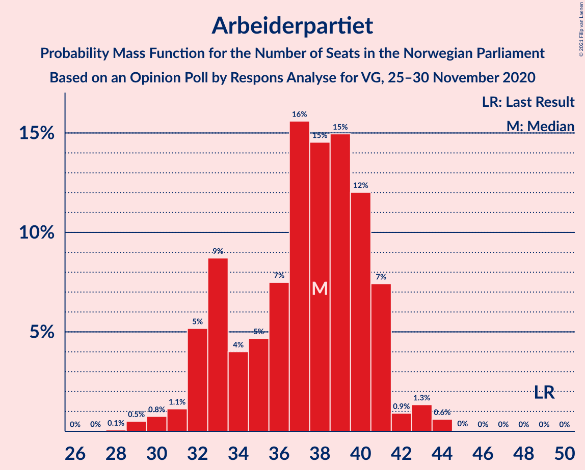

| Number of Seats | Probability | Accumulated | Special Marks |
|:---------------:|:-----------:|:-----------:|:-------------:|
| 28 | 0.1% | 100% |  |
| 29 | 0.5% | 99.9% |  |
| 30 | 0.8% | 99.4% |  |
| 31 | 1.1% | 98.7% |  |
| 32 | 5% | 98% |  |
| 33 | 9% | 92% |  |
| 34 | 4% | 84% |  |
| 35 | 5% | 80% |  |
| 36 | 7% | 75% |  |
| 37 | 16% | 67% |  |
| 38 | 15% | 52% | Median |
| 39 | 15% | 37% |  |
| 40 | 12% | 22% |  |
| 41 | 7% | 10% |  |
| 42 | 0.9% | 3% |  |
| 43 | 1.3% | 2% |  |
| 44 | 0.6% | 0.7% |  |
| 45 | 0% | 0.1% |  |
| 46 | 0% | 0% |  |
| 47 | 0% | 0% |  |
| 48 | 0% | 0% |  |
| 49 | 0% | 0% | Last Result |

### Fremskrittspartiet

*For a full overview of the results for this party, see the [Fremskrittspartiet](party-fremskrittspartiet.html) page.*

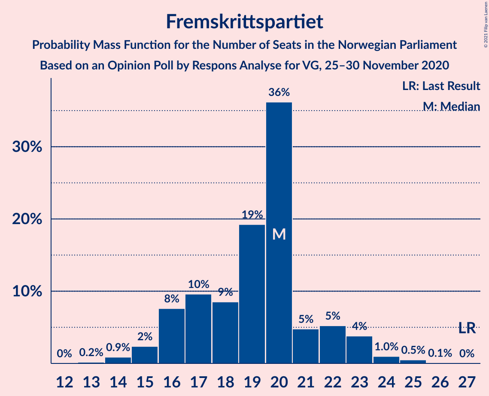

| Number of Seats | Probability | Accumulated | Special Marks |
|:---------------:|:-----------:|:-----------:|:-------------:|
| 13 | 0.2% | 100% |  |
| 14 | 0.9% | 99.8% |  |
| 15 | 2% | 98.9% |  |
| 16 | 8% | 97% |  |
| 17 | 10% | 89% |  |
| 18 | 9% | 79% |  |
| 19 | 19% | 71% |  |
| 20 | 36% | 52% | Median |
| 21 | 5% | 15% |  |
| 22 | 5% | 11% |  |
| 23 | 4% | 5% |  |
| 24 | 1.0% | 2% |  |
| 25 | 0.5% | 0.6% |  |
| 26 | 0.1% | 0.1% |  |
| 27 | 0% | 0% | Last Result |

### Sosialistisk Venstreparti

*For a full overview of the results for this party, see the [Sosialistisk Venstreparti](party-sosialistiskvenstreparti.html) page.*

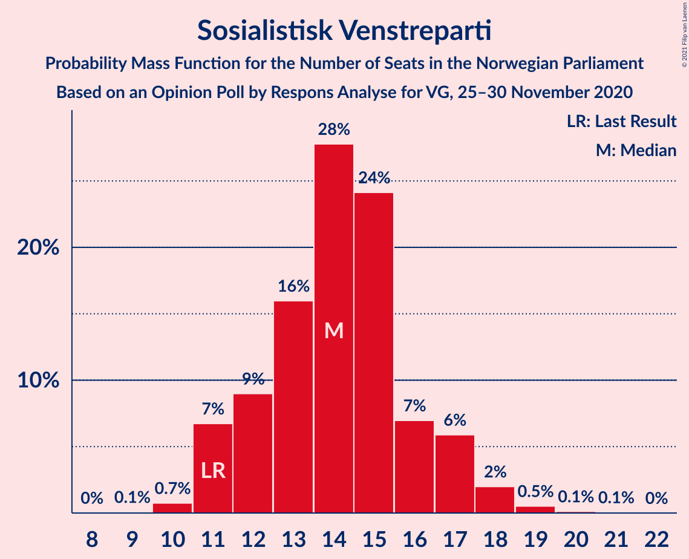

| Number of Seats | Probability | Accumulated | Special Marks |
|:---------------:|:-----------:|:-----------:|:-------------:|
| 9 | 0.1% | 100% |  |
| 10 | 0.7% | 99.9% |  |
| 11 | 7% | 99.2% | Last Result |
| 12 | 9% | 92% |  |
| 13 | 16% | 83% |  |
| 14 | 28% | 67% | Median |
| 15 | 24% | 40% |  |
| 16 | 7% | 16% |  |
| 17 | 6% | 9% |  |
| 18 | 2% | 3% |  |
| 19 | 0.5% | 0.7% |  |
| 20 | 0.1% | 0.2% |  |
| 21 | 0.1% | 0.1% |  |
| 22 | 0% | 0% |  |

### Miljøpartiet De Grønne

*For a full overview of the results for this party, see the [Miljøpartiet De Grønne](party-miljøpartietdegrønne.html) page.*

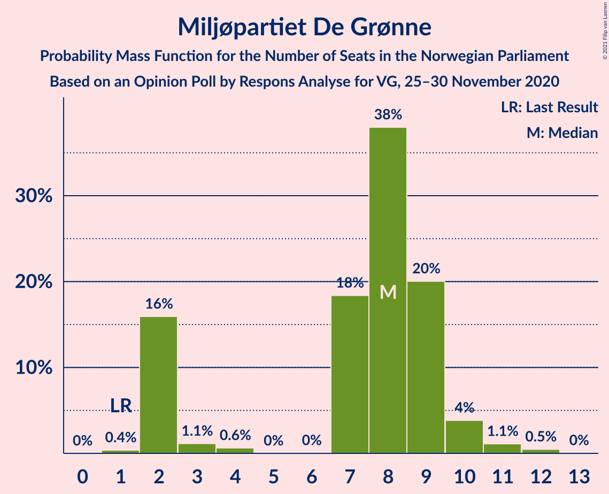

| Number of Seats | Probability | Accumulated | Special Marks |
|:---------------:|:-----------:|:-----------:|:-------------:|
| 1 | 0.4% | 100% | Last Result |
| 2 | 16% | 99.6% |  |
| 3 | 1.1% | 84% |  |
| 4 | 0.6% | 83% |  |
| 5 | 0% | 82% |  |
| 6 | 0% | 82% |  |
| 7 | 18% | 82% |  |
| 8 | 38% | 63% | Median |
| 9 | 20% | 26% |  |
| 10 | 4% | 5% |  |
| 11 | 1.1% | 2% |  |
| 12 | 0.5% | 0.5% |  |
| 13 | 0% | 0% |  |

### Venstre

*For a full overview of the results for this party, see the [Venstre](party-venstre.html) page.*

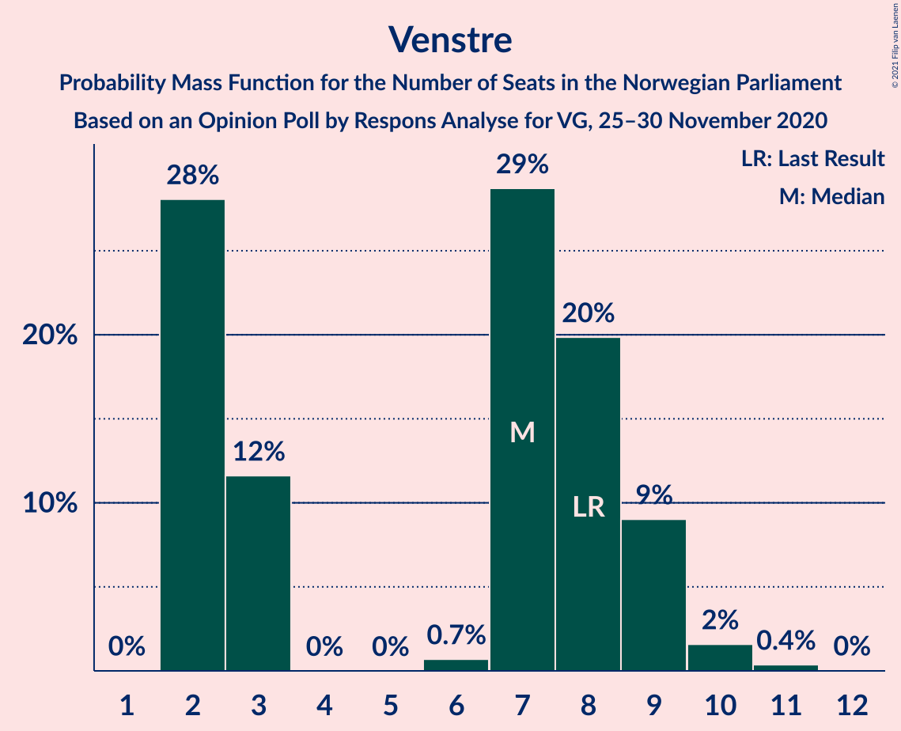

| Number of Seats | Probability | Accumulated | Special Marks |
|:---------------:|:-----------:|:-----------:|:-------------:|
| 2 | 28% | 100% |  |
| 3 | 12% | 72% |  |
| 4 | 0% | 60% |  |
| 5 | 0% | 60% |  |
| 6 | 0.7% | 60% |  |
| 7 | 29% | 60% | Median |
| 8 | 20% | 31% | Last Result |
| 9 | 9% | 11% |  |
| 10 | 2% | 2% |  |
| 11 | 0.4% | 0.4% |  |
| 12 | 0% | 0% |  |

### Kristelig Folkeparti

*For a full overview of the results for this party, see the [Kristelig Folkeparti](party-kristeligfolkeparti.html) page.*

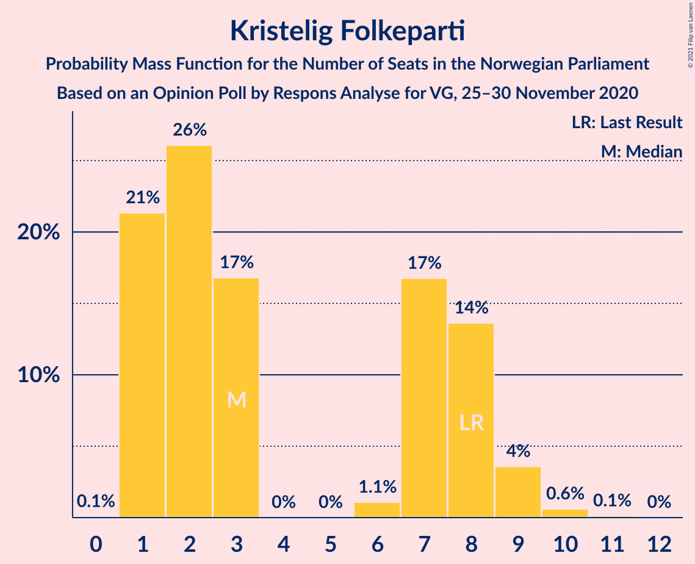

| Number of Seats | Probability | Accumulated | Special Marks |
|:---------------:|:-----------:|:-----------:|:-------------:|
| 0 | 0.1% | 100% |  |
| 1 | 21% | 99.9% |  |
| 2 | 26% | 79% |  |
| 3 | 17% | 53% | Median |
| 4 | 0% | 36% |  |
| 5 | 0% | 36% |  |
| 6 | 1.1% | 36% |  |
| 7 | 17% | 35% |  |
| 8 | 14% | 18% | Last Result |
| 9 | 4% | 4% |  |
| 10 | 0.6% | 0.7% |  |
| 11 | 0.1% | 0.1% |  |
| 12 | 0% | 0% |  |

### Rødt

*For a full overview of the results for this party, see the [Rødt](party-rødt.html) page.*

| Number of Seats | Probability | Accumulated | Special Marks |
|:---------------:|:-----------:|:-----------:|:-------------:|
| 1 | 7% | 100% | Last Result |
| 2 | 56% | 93% | Median |
| 3 | 0% | 36% |  |
| 4 | 0% | 36% |  |
| 5 | 0% | 36% |  |
| 6 | 0.8% | 36% |  |
| 7 | 24% | 35% |  |
| 8 | 8% | 11% |  |
| 9 | 2% | 3% |  |
| 10 | 0.5% | 0.6% |  |
| 11 | 0% | 0% |  |

## Coalitions

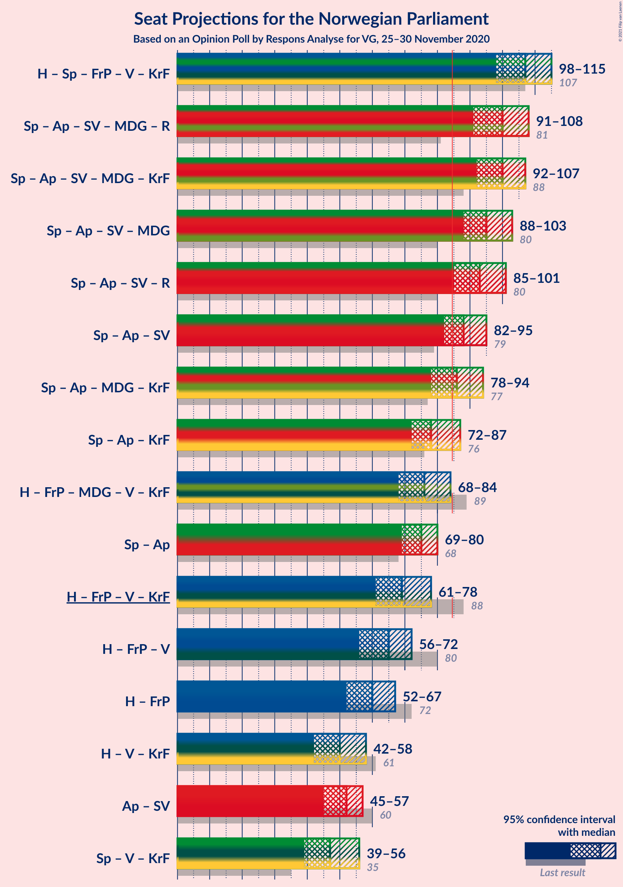

### Confidence Intervals

| Coalition | Last Result | Median | Majority? | 80% Confidence Interval | 90% Confidence Interval | 95% Confidence Interval | 99% Confidence Interval |
|:---------:|:-----------:|:------:|:---------:|:-----------------------:|:-----------------------:|:-----------------------:|:-----------------------:|
| Høyre – Senterpartiet – Fremskrittspartiet – Venstre – Kristelig Folkeparti | 107 | 107 | 100% | 101–112 | 100–113 | 98–115 | 97–118 |
| Senterpartiet – Arbeiderpartiet – Sosialistisk Venstreparti – Miljøpartiet De Grønne – Rødt | 81 | 100 | 100% | 94–105 | 93–107 | 91–108 | 90–110 |
| Senterpartiet – Arbeiderpartiet – Sosialistisk Venstreparti – Miljøpartiet De Grønne – Kristelig Folkeparti | 88 | 100 | 100% | 95–105 | 93–106 | 92–107 | 89–110 |
| Senterpartiet – Arbeiderpartiet – Sosialistisk Venstreparti – Miljøpartiet De Grønne | 80 | 95 | 99.5% | 91–102 | 90–102 | 88–103 | 84–105 |
| Senterpartiet – Arbeiderpartiet – Sosialistisk Venstreparti – Rødt | 80 | 93 | 98.7% | 87–99 | 85–99 | 85–101 | 83–103 |
| Senterpartiet – Arbeiderpartiet – Sosialistisk Venstreparti | 79 | 88 | 89% | 84–94 | 83–94 | 82–95 | 79–98 |
| Senterpartiet – Arbeiderpartiet – Miljøpartiet De Grønne – Kristelig Folkeparti | 77 | 86 | 61% | 81–91 | 79–92 | 78–94 | 75–96 |
| Senterpartiet – Arbeiderpartiet – Kristelig Folkeparti | 76 | 78 | 7% | 73–84 | 73–85 | 72–87 | 69–88 |
| Høyre – Fremskrittspartiet – Miljøpartiet De Grønne – Venstre – Kristelig Folkeparti | 89 | 76 | 1.3% | 70–82 | 70–84 | 68–84 | 66–86 |
| Senterpartiet – Arbeiderpartiet | 68 | 75 | 0.1% | 70–79 | 69–79 | 69–80 | 66–82 |
| Høyre – Fremskrittspartiet – Venstre – Kristelig Folkeparti | 88 | 69 | 0% | 64–75 | 62–76 | 61–78 | 59–79 |
| Høyre – Fremskrittspartiet – Venstre | 80 | 65 | 0% | 60–70 | 58–72 | 56–72 | 55–76 |
| Høyre – Fremskrittspartiet | 72 | 60 | 0% | 54–65 | 53–66 | 52–67 | 51–69 |
| Høyre – Venstre – Kristelig Folkeparti | 61 | 50 | 0% | 45–56 | 44–57 | 42–58 | 41–59 |
| Arbeiderpartiet – Sosialistisk Venstreparti | 60 | 52 | 0% | 47–55 | 46–56 | 45–57 | 42–59 |
| Senterpartiet – Venstre – Kristelig Folkeparti | 35 | 47 | 0% | 41–54 | 40–54 | 39–56 | 38–58 |

### Høyre – Senterpartiet – Fremskrittspartiet – Venstre – Kristelig Folkeparti

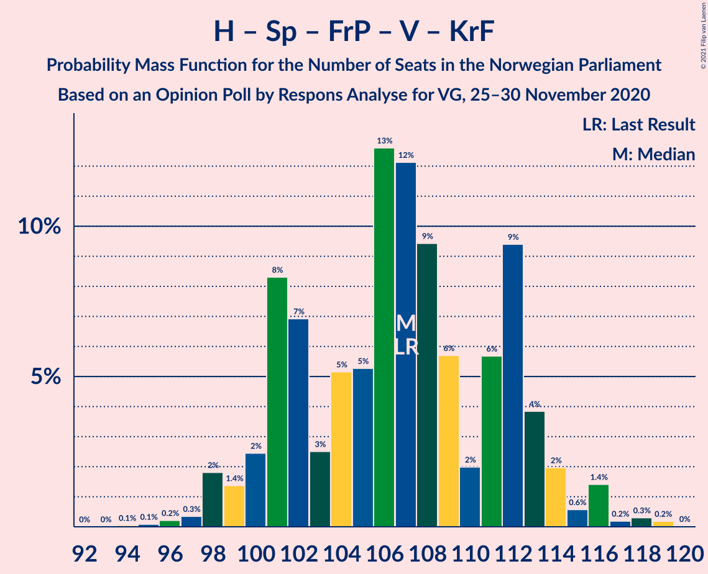

| Number of Seats | Probability | Accumulated | Special Marks |
|:---------------:|:-----------:|:-----------:|:-------------:|
| 94 | 0.1% | 100% |  |
| 95 | 0.1% | 99.9% |  |
| 96 | 0.2% | 99.9% |  |
| 97 | 0.3% | 99.6% |  |
| 98 | 2% | 99.3% |  |
| 99 | 1.4% | 97% |  |
| 100 | 2% | 96% |  |
| 101 | 8% | 94% |  |
| 102 | 7% | 85% |  |
| 103 | 3% | 78% |  |
| 104 | 5% | 76% |  |
| 105 | 5% | 71% |  |
| 106 | 13% | 65% |  |
| 107 | 12% | 53% | Last Result |
| 108 | 9% | 41% | Median |
| 109 | 6% | 31% |  |
| 110 | 2% | 26% |  |
| 111 | 6% | 24% |  |
| 112 | 9% | 18% |  |
| 113 | 4% | 9% |  |
| 114 | 2% | 5% |  |
| 115 | 0.6% | 3% |  |
| 116 | 1.4% | 2% |  |
| 117 | 0.2% | 0.7% |  |
| 118 | 0.3% | 0.5% |  |
| 119 | 0.2% | 0.2% |  |
| 120 | 0% | 0% |  |

### Senterpartiet – Arbeiderpartiet – Sosialistisk Venstreparti – Miljøpartiet De Grønne – Rødt

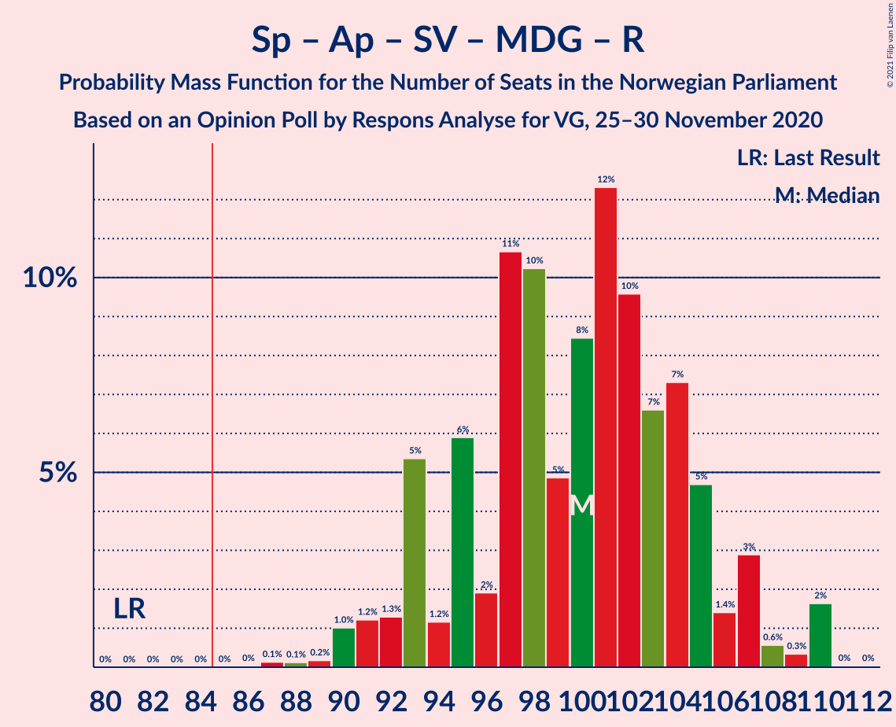

| Number of Seats | Probability | Accumulated | Special Marks |
|:---------------:|:-----------:|:-----------:|:-------------:|
| 81 | 0% | 100% | Last Result |
| 82 | 0% | 100% |  |
| 83 | 0% | 100% |  |
| 84 | 0% | 100% |  |
| 85 | 0% | 100% | Majority |
| 86 | 0% | 100% |  |
| 87 | 0.1% | 100% |  |
| 88 | 0.1% | 99.8% |  |
| 89 | 0.2% | 99.7% |  |
| 90 | 1.0% | 99.5% |  |
| 91 | 1.2% | 98.5% |  |
| 92 | 1.3% | 97% |  |
| 93 | 5% | 96% |  |
| 94 | 1.2% | 91% |  |
| 95 | 6% | 89% |  |
| 96 | 2% | 84% |  |
| 97 | 11% | 82% |  |
| 98 | 10% | 71% |  |
| 99 | 5% | 61% |  |
| 100 | 8% | 56% | Median |
| 101 | 12% | 47% |  |
| 102 | 10% | 35% |  |
| 103 | 7% | 26% |  |
| 104 | 7% | 19% |  |
| 105 | 5% | 12% |  |
| 106 | 1.4% | 7% |  |
| 107 | 3% | 6% |  |
| 108 | 0.6% | 3% |  |
| 109 | 0.3% | 2% |  |
| 110 | 2% | 2% |  |
| 111 | 0% | 0.1% |  |
| 112 | 0% | 0% |  |

### Senterpartiet – Arbeiderpartiet – Sosialistisk Venstreparti – Miljøpartiet De Grønne – Kristelig Folkeparti

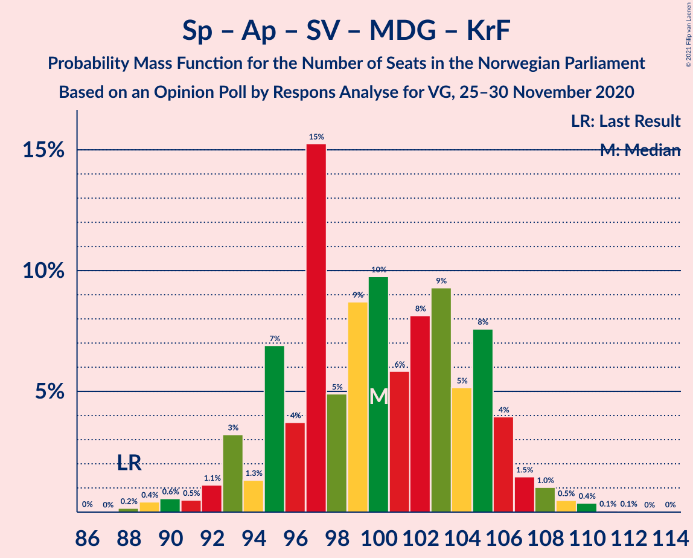

| Number of Seats | Probability | Accumulated | Special Marks |
|:---------------:|:-----------:|:-----------:|:-------------:|
| 87 | 0% | 100% |  |
| 88 | 0.2% | 99.9% | Last Result |
| 89 | 0.4% | 99.8% |  |
| 90 | 0.6% | 99.4% |  |
| 91 | 0.5% | 98.8% |  |
| 92 | 1.1% | 98% |  |
| 93 | 3% | 97% |  |
| 94 | 1.3% | 94% |  |
| 95 | 7% | 93% |  |
| 96 | 4% | 86% |  |
| 97 | 15% | 82% |  |
| 98 | 5% | 67% |  |
| 99 | 9% | 62% |  |
| 100 | 10% | 53% |  |
| 101 | 6% | 43% | Median |
| 102 | 8% | 38% |  |
| 103 | 9% | 29% |  |
| 104 | 5% | 20% |  |
| 105 | 8% | 15% |  |
| 106 | 4% | 7% |  |
| 107 | 1.5% | 3% |  |
| 108 | 1.0% | 2% |  |
| 109 | 0.5% | 1.0% |  |
| 110 | 0.4% | 0.5% |  |
| 111 | 0.1% | 0.1% |  |
| 112 | 0.1% | 0.1% |  |
| 113 | 0% | 0% |  |

### Senterpartiet – Arbeiderpartiet – Sosialistisk Venstreparti – Miljøpartiet De Grønne

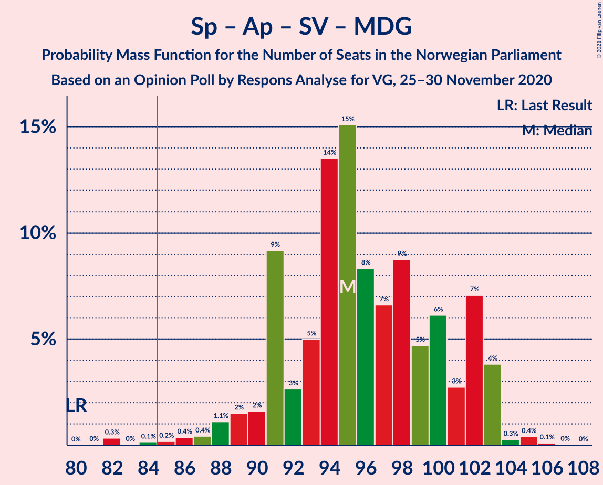

| Number of Seats | Probability | Accumulated | Special Marks |
|:---------------:|:-----------:|:-----------:|:-------------:|
| 80 | 0% | 100% | Last Result |
| 81 | 0% | 100% |  |
| 82 | 0.3% | 100% |  |
| 83 | 0% | 99.6% |  |
| 84 | 0.1% | 99.6% |  |
| 85 | 0.2% | 99.5% | Majority |
| 86 | 0.4% | 99.3% |  |
| 87 | 0.4% | 98.9% |  |
| 88 | 1.1% | 98.5% |  |
| 89 | 2% | 97% |  |
| 90 | 2% | 96% |  |
| 91 | 9% | 94% |  |
| 92 | 3% | 85% |  |
| 93 | 5% | 82% |  |
| 94 | 14% | 78% |  |
| 95 | 15% | 64% |  |
| 96 | 8% | 49% |  |
| 97 | 7% | 41% |  |
| 98 | 9% | 34% | Median |
| 99 | 5% | 25% |  |
| 100 | 6% | 21% |  |
| 101 | 3% | 14% |  |
| 102 | 7% | 12% |  |
| 103 | 4% | 5% |  |
| 104 | 0.3% | 0.8% |  |
| 105 | 0.4% | 0.5% |  |
| 106 | 0.1% | 0.1% |  |
| 107 | 0% | 0% |  |

### Senterpartiet – Arbeiderpartiet – Sosialistisk Venstreparti – Rødt

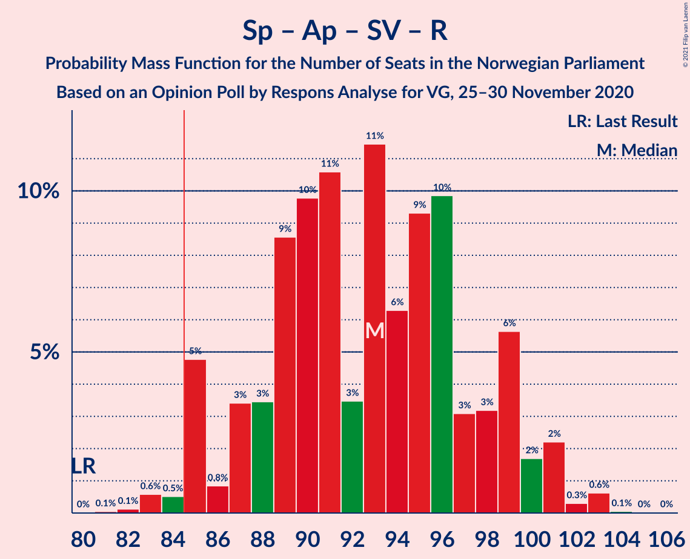

| Number of Seats | Probability | Accumulated | Special Marks |
|:---------------:|:-----------:|:-----------:|:-------------:|
| 80 | 0% | 100% | Last Result |
| 81 | 0.1% | 100% |  |
| 82 | 0.1% | 99.9% |  |
| 83 | 0.6% | 99.8% |  |
| 84 | 0.5% | 99.2% |  |
| 85 | 5% | 98.7% | Majority |
| 86 | 0.8% | 94% |  |
| 87 | 3% | 93% |  |
| 88 | 3% | 90% |  |
| 89 | 9% | 86% |  |
| 90 | 10% | 78% |  |
| 91 | 11% | 68% |  |
| 92 | 3% | 57% | Median |
| 93 | 11% | 54% |  |
| 94 | 6% | 42% |  |
| 95 | 9% | 36% |  |
| 96 | 10% | 27% |  |
| 97 | 3% | 17% |  |
| 98 | 3% | 14% |  |
| 99 | 6% | 11% |  |
| 100 | 2% | 5% |  |
| 101 | 2% | 3% |  |
| 102 | 0.3% | 1.0% |  |
| 103 | 0.6% | 0.7% |  |
| 104 | 0.1% | 0.1% |  |
| 105 | 0% | 0% |  |

### Senterpartiet – Arbeiderpartiet – Sosialistisk Venstreparti

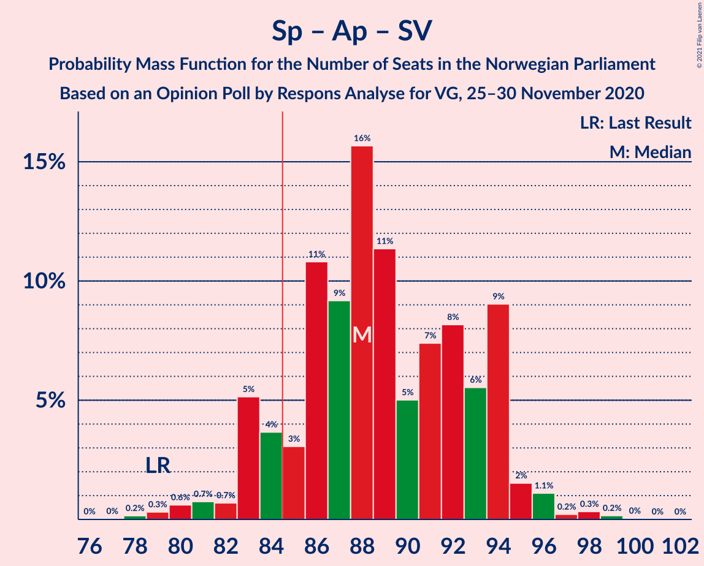

| Number of Seats | Probability | Accumulated | Special Marks |
|:---------------:|:-----------:|:-----------:|:-------------:|
| 77 | 0% | 100% |  |
| 78 | 0.2% | 99.9% |  |
| 79 | 0.3% | 99.8% | Last Result |
| 80 | 0.6% | 99.5% |  |
| 81 | 0.7% | 98.9% |  |
| 82 | 0.7% | 98% |  |
| 83 | 5% | 97% |  |
| 84 | 4% | 92% |  |
| 85 | 3% | 89% | Majority |
| 86 | 11% | 86% |  |
| 87 | 9% | 75% |  |
| 88 | 16% | 66% |  |
| 89 | 11% | 50% |  |
| 90 | 5% | 39% | Median |
| 91 | 7% | 34% |  |
| 92 | 8% | 26% |  |
| 93 | 6% | 18% |  |
| 94 | 9% | 12% |  |
| 95 | 2% | 3% |  |
| 96 | 1.1% | 2% |  |
| 97 | 0.2% | 0.8% |  |
| 98 | 0.3% | 0.6% |  |
| 99 | 0.2% | 0.2% |  |
| 100 | 0% | 0.1% |  |
| 101 | 0% | 0% |  |

### Senterpartiet – Arbeiderpartiet – Miljøpartiet De Grønne – Kristelig Folkeparti

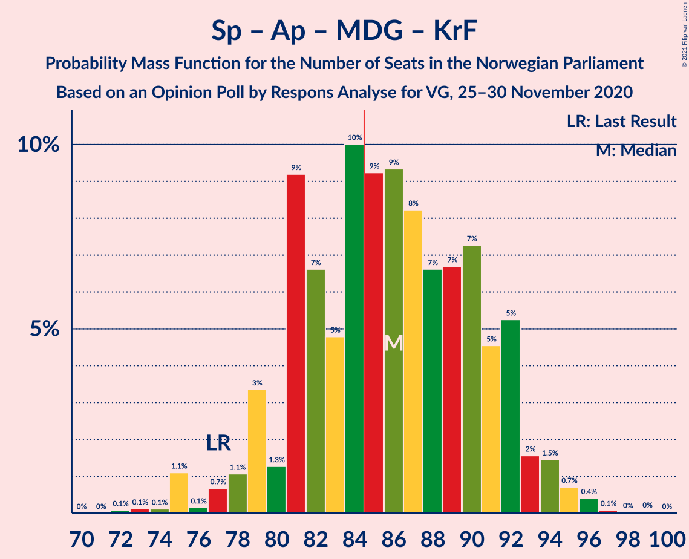

| Number of Seats | Probability | Accumulated | Special Marks |
|:---------------:|:-----------:|:-----------:|:-------------:|
| 72 | 0.1% | 100% |  |
| 73 | 0.1% | 99.9% |  |
| 74 | 0.1% | 99.8% |  |
| 75 | 1.1% | 99.7% |  |
| 76 | 0.1% | 98.6% |  |
| 77 | 0.7% | 98% | Last Result |
| 78 | 1.1% | 98% |  |
| 79 | 3% | 97% |  |
| 80 | 1.3% | 93% |  |
| 81 | 9% | 92% |  |
| 82 | 7% | 83% |  |
| 83 | 5% | 76% |  |
| 84 | 10% | 71% |  |
| 85 | 9% | 61% | Majority |
| 86 | 9% | 52% |  |
| 87 | 8% | 43% | Median |
| 88 | 7% | 35% |  |
| 89 | 7% | 28% |  |
| 90 | 7% | 21% |  |
| 91 | 5% | 14% |  |
| 92 | 5% | 10% |  |
| 93 | 2% | 4% |  |
| 94 | 1.5% | 3% |  |
| 95 | 0.7% | 1.3% |  |
| 96 | 0.4% | 0.6% |  |
| 97 | 0.1% | 0.2% |  |
| 98 | 0% | 0.1% |  |
| 99 | 0% | 0% |  |

### Senterpartiet – Arbeiderpartiet – Kristelig Folkeparti

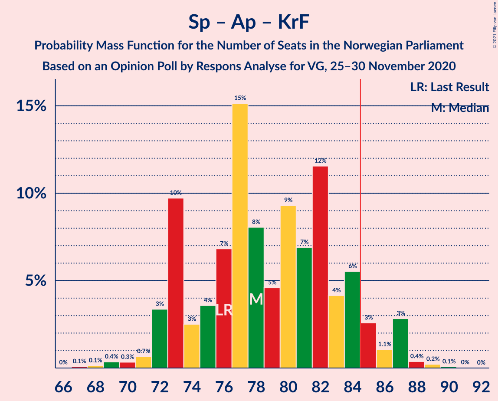

| Number of Seats | Probability | Accumulated | Special Marks |
|:---------------:|:-----------:|:-----------:|:-------------:|
| 67 | 0.1% | 100% |  |
| 68 | 0.1% | 99.9% |  |
| 69 | 0.4% | 99.7% |  |
| 70 | 0.3% | 99.4% |  |
| 71 | 0.7% | 99.1% |  |
| 72 | 3% | 98% |  |
| 73 | 10% | 95% |  |
| 74 | 3% | 85% |  |
| 75 | 4% | 83% |  |
| 76 | 7% | 79% | Last Result |
| 77 | 15% | 72% |  |
| 78 | 8% | 57% |  |
| 79 | 5% | 49% | Median |
| 80 | 9% | 45% |  |
| 81 | 7% | 35% |  |
| 82 | 12% | 28% |  |
| 83 | 4% | 17% |  |
| 84 | 6% | 13% |  |
| 85 | 3% | 7% | Majority |
| 86 | 1.1% | 5% |  |
| 87 | 3% | 4% |  |
| 88 | 0.4% | 0.7% |  |
| 89 | 0.2% | 0.3% |  |
| 90 | 0.1% | 0.1% |  |
| 91 | 0% | 0% |  |

### Høyre – Fremskrittspartiet – Miljøpartiet De Grønne – Venstre – Kristelig Folkeparti

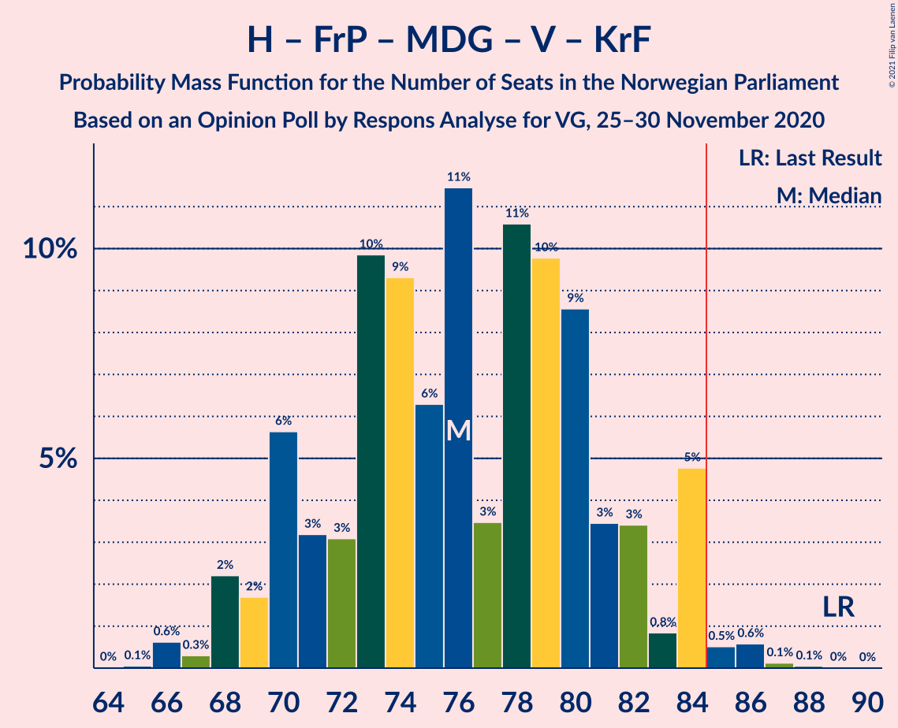

| Number of Seats | Probability | Accumulated | Special Marks |
|:---------------:|:-----------:|:-----------:|:-------------:|
| 65 | 0.1% | 100% |  |
| 66 | 0.6% | 99.9% |  |
| 67 | 0.3% | 99.3% |  |
| 68 | 2% | 99.0% |  |
| 69 | 2% | 97% |  |
| 70 | 6% | 95% |  |
| 71 | 3% | 89% |  |
| 72 | 3% | 86% |  |
| 73 | 10% | 83% |  |
| 74 | 9% | 73% |  |
| 75 | 6% | 64% |  |
| 76 | 11% | 58% |  |
| 77 | 3% | 46% |  |
| 78 | 11% | 43% | Median |
| 79 | 10% | 32% |  |
| 80 | 9% | 22% |  |
| 81 | 3% | 14% |  |
| 82 | 3% | 10% |  |
| 83 | 0.8% | 7% |  |
| 84 | 5% | 6% |  |
| 85 | 0.5% | 1.3% | Majority |
| 86 | 0.6% | 0.8% |  |
| 87 | 0.1% | 0.2% |  |
| 88 | 0.1% | 0.1% |  |
| 89 | 0% | 0% | Last Result |

### Senterpartiet – Arbeiderpartiet

| Number of Seats | Probability | Accumulated | Special Marks |
|:---------------:|:-----------:|:-----------:|:-------------:|
| 63 | 0% | 100% |  |
| 64 | 0.1% | 99.9% |  |
| 65 | 0.1% | 99.8% |  |
| 66 | 0.8% | 99.7% |  |
| 67 | 0.5% | 98.9% |  |
| 68 | 0.8% | 98% | Last Result |
| 69 | 6% | 98% |  |
| 70 | 3% | 92% |  |
| 71 | 6% | 89% |  |
| 72 | 9% | 83% |  |
| 73 | 4% | 74% |  |
| 74 | 12% | 69% |  |
| 75 | 16% | 57% |  |
| 76 | 8% | 41% | Median |
| 77 | 12% | 33% |  |
| 78 | 6% | 21% |  |
| 79 | 10% | 15% |  |
| 80 | 3% | 5% |  |
| 81 | 0.4% | 2% |  |
| 82 | 0.8% | 1.1% |  |
| 83 | 0.2% | 0.3% |  |
| 84 | 0% | 0.2% |  |
| 85 | 0.1% | 0.1% | Majority |
| 86 | 0% | 0% |  |

### Høyre – Fremskrittspartiet – Venstre – Kristelig Folkeparti

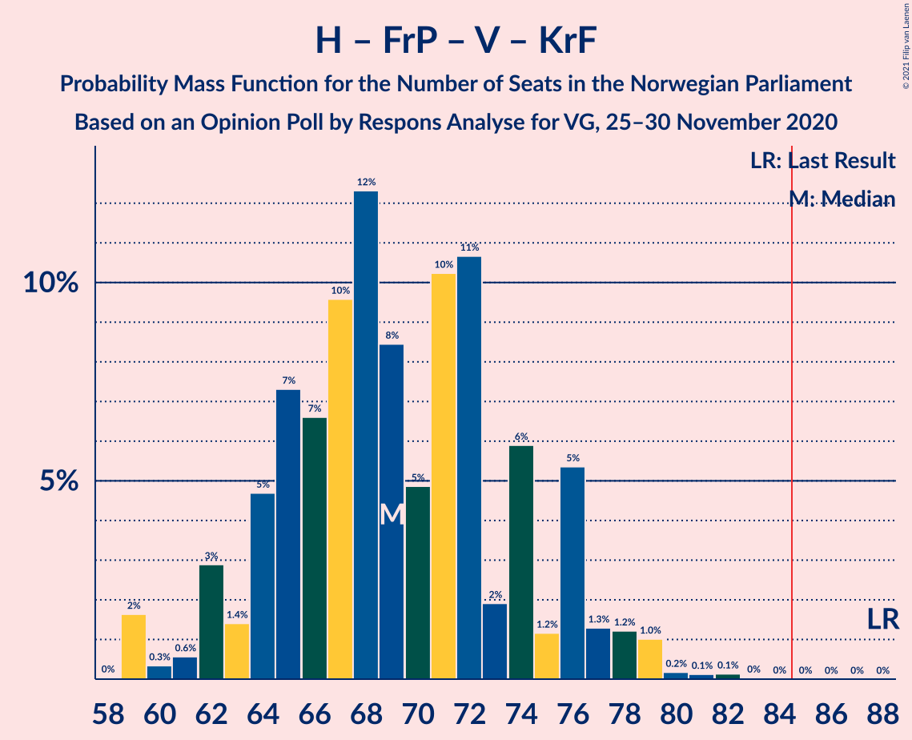

| Number of Seats | Probability | Accumulated | Special Marks |
|:---------------:|:-----------:|:-----------:|:-------------:|
| 58 | 0% | 100% |  |
| 59 | 2% | 99.9% |  |
| 60 | 0.3% | 98% |  |
| 61 | 0.6% | 98% |  |
| 62 | 3% | 97% |  |
| 63 | 1.4% | 94% |  |
| 64 | 5% | 93% |  |
| 65 | 7% | 88% |  |
| 66 | 7% | 81% |  |
| 67 | 10% | 74% |  |
| 68 | 12% | 65% |  |
| 69 | 8% | 53% |  |
| 70 | 5% | 44% | Median |
| 71 | 10% | 39% |  |
| 72 | 11% | 29% |  |
| 73 | 2% | 18% |  |
| 74 | 6% | 16% |  |
| 75 | 1.2% | 11% |  |
| 76 | 5% | 9% |  |
| 77 | 1.3% | 4% |  |
| 78 | 1.2% | 3% |  |
| 79 | 1.0% | 1.5% |  |
| 80 | 0.2% | 0.5% |  |
| 81 | 0.1% | 0.3% |  |
| 82 | 0.1% | 0.2% |  |
| 83 | 0% | 0% |  |
| 84 | 0% | 0% |  |
| 85 | 0% | 0% | Majority |
| 86 | 0% | 0% |  |
| 87 | 0% | 0% |  |
| 88 | 0% | 0% | Last Result |

### Høyre – Fremskrittspartiet – Venstre

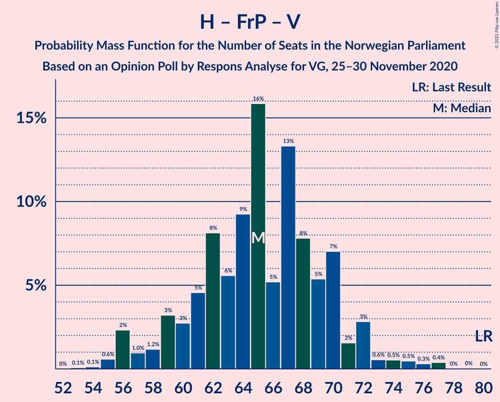

| Number of Seats | Probability | Accumulated | Special Marks |
|:---------------:|:-----------:|:-----------:|:-------------:|
| 53 | 0.1% | 100% |  |
| 54 | 0.1% | 99.9% |  |
| 55 | 0.6% | 99.8% |  |
| 56 | 2% | 99.2% |  |
| 57 | 1.0% | 97% |  |
| 58 | 1.2% | 96% |  |
| 59 | 3% | 95% |  |
| 60 | 3% | 92% |  |
| 61 | 5% | 89% |  |
| 62 | 8% | 84% |  |
| 63 | 6% | 76% |  |
| 64 | 9% | 71% |  |
| 65 | 16% | 61% |  |
| 66 | 5% | 45% |  |
| 67 | 13% | 40% | Median |
| 68 | 8% | 27% |  |
| 69 | 5% | 19% |  |
| 70 | 7% | 14% |  |
| 71 | 2% | 7% |  |
| 72 | 3% | 5% |  |
| 73 | 0.6% | 2% |  |
| 74 | 0.5% | 2% |  |
| 75 | 0.5% | 1.2% |  |
| 76 | 0.3% | 0.8% |  |
| 77 | 0.4% | 0.4% |  |
| 78 | 0% | 0.1% |  |
| 79 | 0% | 0% |  |
| 80 | 0% | 0% | Last Result |

### Høyre – Fremskrittspartiet

| Number of Seats | Probability | Accumulated | Special Marks |
|:---------------:|:-----------:|:-----------:|:-------------:|
| 49 | 0.1% | 100% |  |
| 50 | 0.4% | 99.9% |  |
| 51 | 0.5% | 99.5% |  |
| 52 | 2% | 99.0% |  |
| 53 | 3% | 97% |  |
| 54 | 4% | 94% |  |
| 55 | 2% | 90% |  |
| 56 | 4% | 87% |  |
| 57 | 11% | 83% |  |
| 58 | 12% | 72% |  |
| 59 | 6% | 60% |  |
| 60 | 16% | 54% | Median |
| 61 | 7% | 38% |  |
| 62 | 9% | 32% |  |
| 63 | 8% | 23% |  |
| 64 | 3% | 15% |  |
| 65 | 6% | 12% |  |
| 66 | 2% | 5% |  |
| 67 | 2% | 3% |  |
| 68 | 0.3% | 1.2% |  |
| 69 | 0.6% | 0.9% |  |
| 70 | 0.1% | 0.3% |  |
| 71 | 0.2% | 0.2% |  |
| 72 | 0% | 0% | Last Result |

### Høyre – Venstre – Kristelig Folkeparti

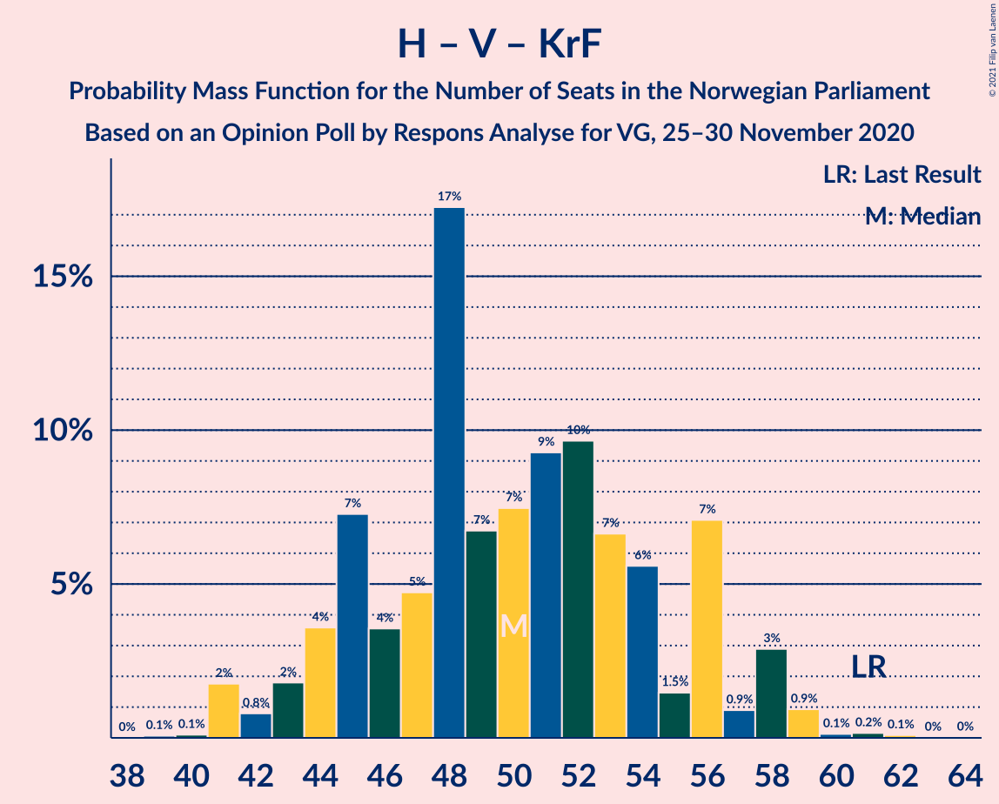

| Number of Seats | Probability | Accumulated | Special Marks |
|:---------------:|:-----------:|:-----------:|:-------------:|
| 39 | 0.1% | 100% |  |
| 40 | 0.1% | 99.9% |  |
| 41 | 2% | 99.8% |  |
| 42 | 0.8% | 98% |  |
| 43 | 2% | 97% |  |
| 44 | 4% | 95% |  |
| 45 | 7% | 92% |  |
| 46 | 4% | 85% |  |
| 47 | 5% | 81% |  |
| 48 | 17% | 76% |  |
| 49 | 7% | 59% |  |
| 50 | 7% | 52% | Median |
| 51 | 9% | 45% |  |
| 52 | 10% | 36% |  |
| 53 | 7% | 26% |  |
| 54 | 6% | 19% |  |
| 55 | 1.5% | 14% |  |
| 56 | 7% | 12% |  |
| 57 | 0.9% | 5% |  |
| 58 | 3% | 4% |  |
| 59 | 0.9% | 1.4% |  |
| 60 | 0.1% | 0.4% |  |
| 61 | 0.2% | 0.3% | Last Result |
| 62 | 0.1% | 0.1% |  |
| 63 | 0% | 0% |  |

### Arbeiderpartiet – Sosialistisk Venstreparti

| Number of Seats | Probability | Accumulated | Special Marks |
|:---------------:|:-----------:|:-----------:|:-------------:|
| 41 | 0.1% | 100% |  |
| 42 | 0.4% | 99.8% |  |
| 43 | 0.5% | 99.4% |  |
| 44 | 0.5% | 98.9% |  |
| 45 | 1.1% | 98% |  |
| 46 | 5% | 97% |  |
| 47 | 10% | 93% |  |
| 48 | 8% | 83% |  |
| 49 | 4% | 75% |  |
| 50 | 5% | 72% |  |
| 51 | 8% | 66% |  |
| 52 | 17% | 59% | Median |
| 53 | 20% | 42% |  |
| 54 | 9% | 21% |  |
| 55 | 5% | 13% |  |
| 56 | 3% | 7% |  |
| 57 | 3% | 5% |  |
| 58 | 0.8% | 1.4% |  |
| 59 | 0.5% | 0.7% |  |
| 60 | 0.1% | 0.2% | Last Result |
| 61 | 0.1% | 0.1% |  |
| 62 | 0% | 0% |  |

### Senterpartiet – Venstre – Kristelig Folkeparti

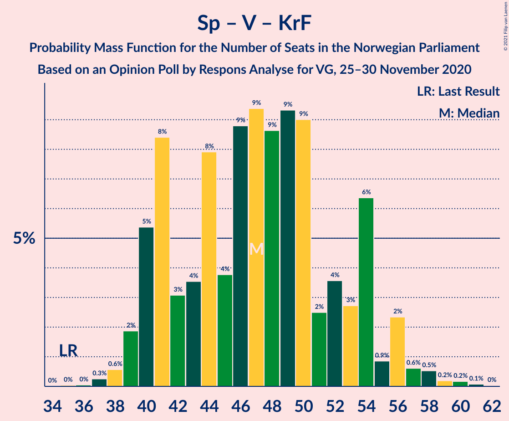

| Number of Seats | Probability | Accumulated | Special Marks |
|:---------------:|:-----------:|:-----------:|:-------------:|
| 35 | 0% | 100% | Last Result |
| 36 | 0% | 99.9% |  |
| 37 | 0.3% | 99.9% |  |
| 38 | 0.6% | 99.6% |  |
| 39 | 2% | 99.1% |  |
| 40 | 5% | 97% |  |
| 41 | 8% | 92% |  |
| 42 | 3% | 83% |  |
| 43 | 4% | 80% |  |
| 44 | 8% | 77% |  |
| 45 | 4% | 69% |  |
| 46 | 9% | 65% |  |
| 47 | 9% | 56% |  |
| 48 | 9% | 47% | Median |
| 49 | 9% | 38% |  |
| 50 | 9% | 29% |  |
| 51 | 2% | 20% |  |
| 52 | 4% | 17% |  |
| 53 | 3% | 14% |  |
| 54 | 6% | 11% |  |
| 55 | 0.9% | 5% |  |
| 56 | 2% | 4% |  |
| 57 | 0.6% | 2% |  |
| 58 | 0.5% | 1.0% |  |
| 59 | 0.2% | 0.5% |  |
| 60 | 0.2% | 0.3% |  |
| 61 | 0.1% | 0.1% |  |
| 62 | 0% | 0% |  |

## Technical Information

### Opinion Poll

+ **Polling firm:** Respons Analyse
+ **Commissioner(s):** VG
+ **Fieldwork period:** 25–30 November 2020

### Calculations

+ **Sample size:** 1000
+ **Simulations done:** 1,048,576
+ **Error estimate:** 2.18%

