# Opinion Poll by Opinion Perduco for Avisenes Nyhetsbyrå, Dagsavisen and FriFagbevegelse, 1–7 December 2020

<a href="#voting-intentions">Voting Intentions</a> | <a href="#seats">Seats</a> | <a href="#coalitions">Coalitions</a> | <a href="#technical-information">Technical Information</a>

## Voting Intentions

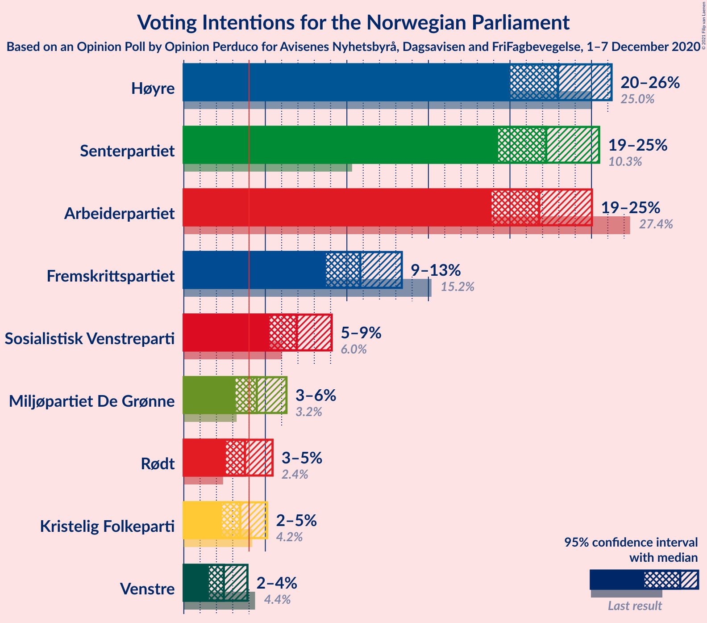

### Confidence Intervals

| Party | Last Result | Poll Result | 80% Confidence Interval | 90% Confidence Interval | 95% Confidence Interval | 99% Confidence Interval |
|:-----:|:-----------:|:-----------:|:-----------------------:|:-----------------------:|:-----------------------:|:-----------------------:|
| Høyre | 25.0% | 22.9% | 21.0–25.1% |20.4–25.7% |20.0–26.2% |19.1–27.3% |
| Senterpartiet | 10.3% | 22.2% | 20.3–24.4% |19.7–25.0% |19.3–25.5% |18.4–26.5% |
| Arbeiderpartiet | 27.4% | 21.8% | 19.9–23.9% |19.3–24.5% |18.9–25.0% |18.0–26.1% |
| Fremskrittspartiet | 15.2% | 10.8% | 9.4–12.5% |9.1–13.0% |8.7–13.4% |8.1–14.2% |
| Sosialistisk Venstreparti | 6.0% | 6.9% | 5.8–8.3% |5.5–8.7% |5.3–9.1% |4.8–9.8% |
| Miljøpartiet De Grønne | 3.2% | 4.5% | 3.6–5.7% |3.4–6.0% |3.2–6.3% |2.8–6.9% |
| Rødt | 2.4% | 3.8% | 3.0–4.9% |2.8–5.2% |2.6–5.4% |2.2–6.0% |
| Kristelig Folkeparti | 4.2% | 3.5% | 2.7–4.5% |2.5–4.8% |2.3–5.1% |2.0–5.7% |
| Venstre | 4.4% | 2.5% | 1.8–3.4% |1.7–3.7% |1.5–3.9% |1.3–4.4% |

*Note:* The poll result column reflects the actual value used in the calculations. Published results may vary slightly, and in addition be rounded to fewer digits.

## Seats

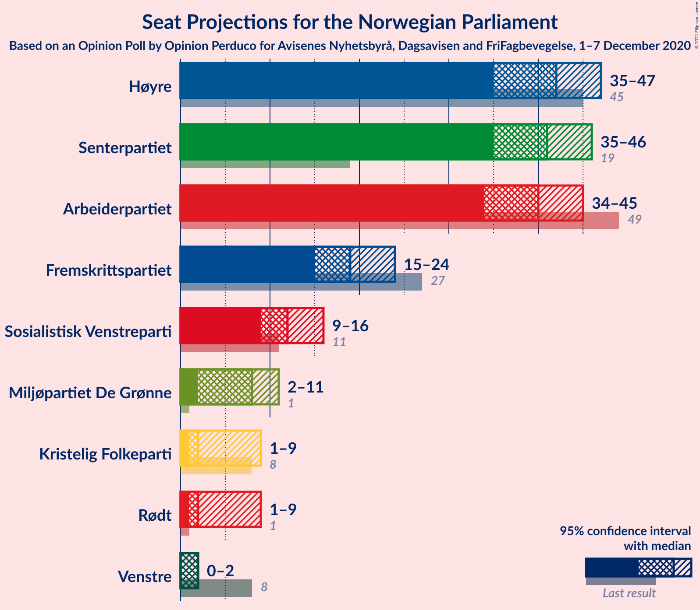

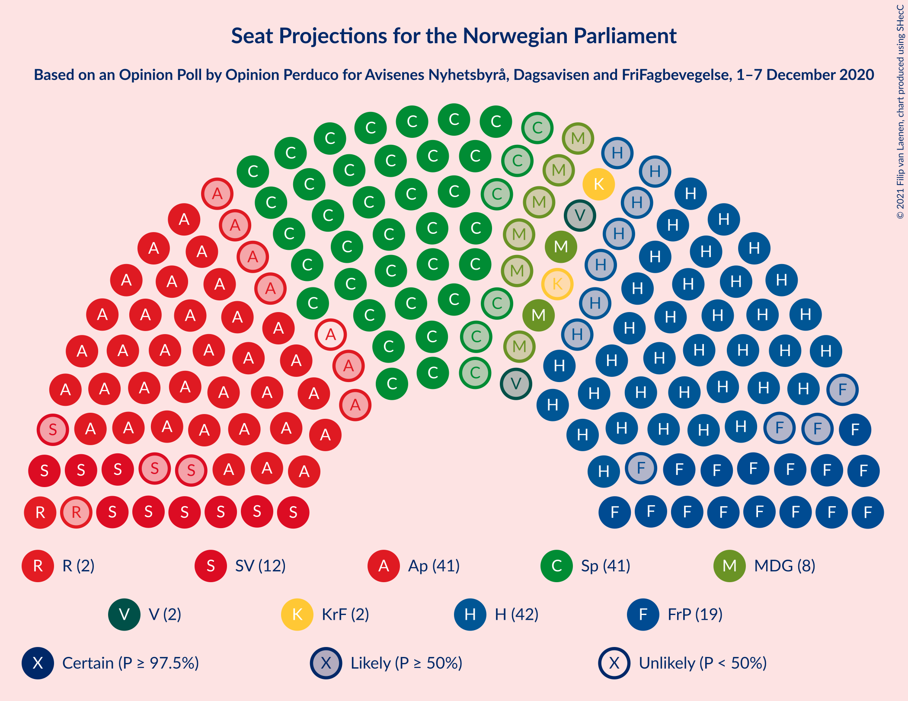

### Confidence Intervals

| Party | Last Result | Median | 80% Confidence Interval | 90% Confidence Interval | 95% Confidence Interval | 99% Confidence Interval |
|:-----:|:-----------:|:------:|:-----------------------:|:-----------------------:|:-----------------------:|:-----------------------:|
| <a href="#høyre">Høyre</a> | 45 | 42 | 38–45 |36–46 |35–47 |34–49 |
| <a href="#senterpartiet">Senterpartiet</a> | 19 | 41 | 36–44 |36–45 |35–46 |34–47 |
| <a href="#arbeiderpartiet">Arbeiderpartiet</a> | 49 | 40 | 35–43 |34–44 |34–45 |32–46 |
| <a href="#fremskrittspartiet">Fremskrittspartiet</a> | 27 | 19 | 16–22 |15–23 |15–24 |14–26 |
| <a href="#sosialistisk-venstreparti">Sosialistisk Venstreparti</a> | 11 | 12 | 10–15 |10–16 |9–16 |9–17 |
| <a href="#miljøpartiet-de-grønne">Miljøpartiet De Grønne</a> | 1 | 8 | 2–10 |2–11 |2–11 |1–12 |
| <a href="#rødt">Rødt</a> | 1 | 2 | 2–8 |2–9 |1–9 |1–10 |
| <a href="#kristelig-folkeparti">Kristelig Folkeparti</a> | 8 | 2 | 1–8 |1–8 |1–9 |0–10 |
| <a href="#venstre">Venstre</a> | 8 | 2 | 1–2 |0–2 |0–2 |0–7 |

### Høyre

*For a full overview of the results for this party, see the [Høyre](party-høyre.html) page.*

| Number of Seats | Probability | Accumulated | Special Marks |
|:---------------:|:-----------:|:-----------:|:-------------:|
| 31 | 0% | 100% |  |
| 32 | 0.1% | 99.9% |  |
| 33 | 0.2% | 99.8% |  |
| 34 | 0.6% | 99.6% |  |
| 35 | 2% | 99.0% |  |
| 36 | 2% | 97% |  |
| 37 | 5% | 95% |  |
| 38 | 7% | 90% |  |
| 39 | 9% | 83% |  |
| 40 | 11% | 74% |  |
| 41 | 11% | 62% |  |
| 42 | 16% | 51% | Median |
| 43 | 15% | 34% |  |
| 44 | 9% | 20% |  |
| 45 | 5% | 11% | Last Result |
| 46 | 1.3% | 6% |  |
| 47 | 3% | 5% |  |
| 48 | 0.8% | 2% |  |
| 49 | 0.5% | 0.8% |  |
| 50 | 0.1% | 0.2% |  |
| 51 | 0.1% | 0.2% |  |
| 52 | 0% | 0.1% |  |
| 53 | 0% | 0% |  |

### Senterpartiet

*For a full overview of the results for this party, see the [Senterpartiet](party-senterpartiet.html) page.*

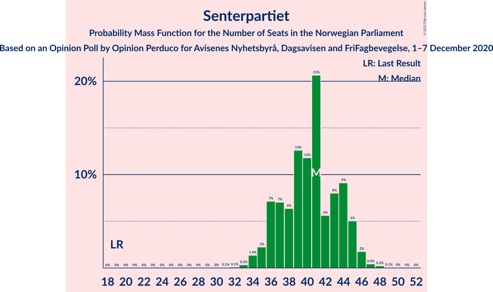

| Number of Seats | Probability | Accumulated | Special Marks |
|:---------------:|:-----------:|:-----------:|:-------------:|
| 19 | 0% | 100% | Last Result |
| 20 | 0% | 100% |  |
| 21 | 0% | 100% |  |
| 22 | 0% | 100% |  |
| 23 | 0% | 100% |  |
| 24 | 0% | 100% |  |
| 25 | 0% | 100% |  |
| 26 | 0% | 100% |  |
| 27 | 0% | 100% |  |
| 28 | 0% | 100% |  |
| 29 | 0% | 100% |  |
| 30 | 0% | 100% |  |
| 31 | 0.1% | 100% |  |
| 32 | 0.1% | 99.9% |  |
| 33 | 0.3% | 99.8% |  |
| 34 | 1.4% | 99.5% |  |
| 35 | 2% | 98% |  |
| 36 | 7% | 96% |  |
| 37 | 7% | 89% |  |
| 38 | 6% | 82% |  |
| 39 | 13% | 75% |  |
| 40 | 12% | 63% |  |
| 41 | 21% | 51% | Median |
| 42 | 6% | 30% |  |
| 43 | 8% | 25% |  |
| 44 | 9% | 17% |  |
| 45 | 5% | 8% |  |
| 46 | 2% | 3% |  |
| 47 | 0.4% | 0.8% |  |
| 48 | 0.2% | 0.3% |  |
| 49 | 0.1% | 0.1% |  |
| 50 | 0% | 0.1% |  |
| 51 | 0% | 0% |  |

### Arbeiderpartiet

*For a full overview of the results for this party, see the [Arbeiderpartiet](party-arbeiderpartiet.html) page.*

| Number of Seats | Probability | Accumulated | Special Marks |
|:---------------:|:-----------:|:-----------:|:-------------:|
| 30 | 0.1% | 100% |  |
| 31 | 0.1% | 99.8% |  |
| 32 | 0.7% | 99.7% |  |
| 33 | 1.5% | 99.0% |  |
| 34 | 3% | 98% |  |
| 35 | 5% | 94% |  |
| 36 | 5% | 89% |  |
| 37 | 5% | 84% |  |
| 38 | 15% | 79% |  |
| 39 | 10% | 65% |  |
| 40 | 13% | 54% | Median |
| 41 | 16% | 42% |  |
| 42 | 4% | 26% |  |
| 43 | 14% | 22% |  |
| 44 | 5% | 7% |  |
| 45 | 1.0% | 3% |  |
| 46 | 1.3% | 2% |  |
| 47 | 0.3% | 0.4% |  |
| 48 | 0.1% | 0.1% |  |
| 49 | 0% | 0% | Last Result |

### Fremskrittspartiet

*For a full overview of the results for this party, see the [Fremskrittspartiet](party-fremskrittspartiet.html) page.*

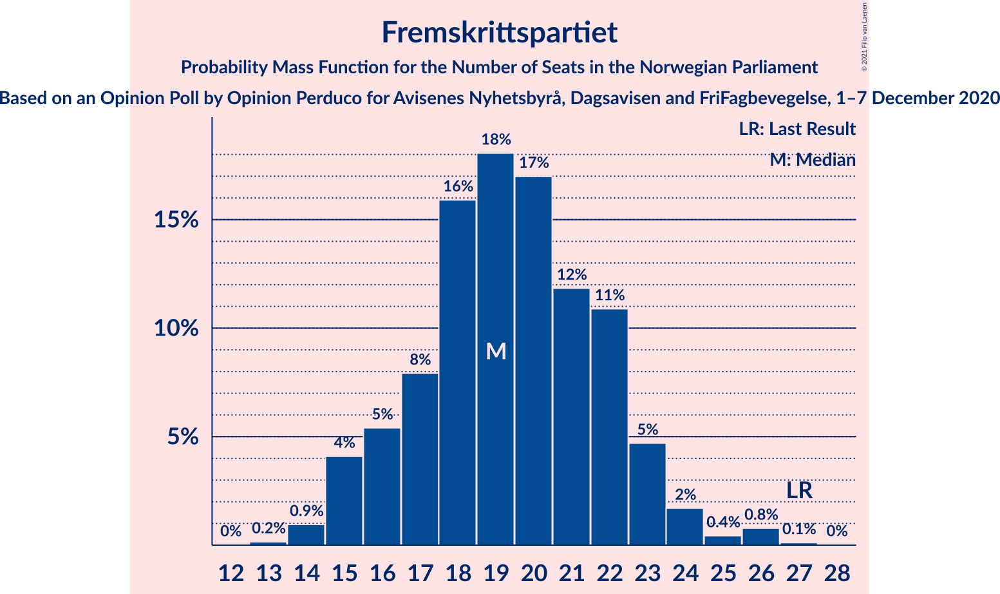

| Number of Seats | Probability | Accumulated | Special Marks |
|:---------------:|:-----------:|:-----------:|:-------------:|
| 13 | 0.2% | 100% |  |
| 14 | 0.9% | 99.8% |  |
| 15 | 4% | 98.9% |  |
| 16 | 5% | 95% |  |
| 17 | 8% | 89% |  |
| 18 | 16% | 81% |  |
| 19 | 18% | 66% | Median |
| 20 | 17% | 47% |  |
| 21 | 12% | 30% |  |
| 22 | 11% | 19% |  |
| 23 | 5% | 8% |  |
| 24 | 2% | 3% |  |
| 25 | 0.4% | 1.4% |  |
| 26 | 0.8% | 0.9% |  |
| 27 | 0.1% | 0.1% | Last Result |
| 28 | 0% | 0% |  |

### Sosialistisk Venstreparti

*For a full overview of the results for this party, see the [Sosialistisk Venstreparti](party-sosialistiskvenstreparti.html) page.*

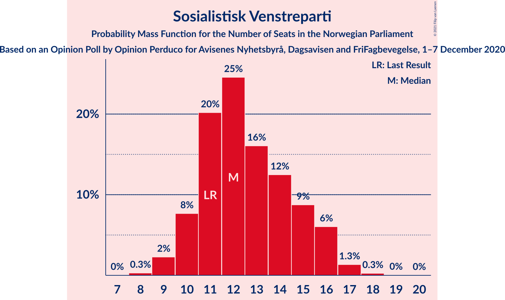

| Number of Seats | Probability | Accumulated | Special Marks |
|:---------------:|:-----------:|:-----------:|:-------------:|
| 8 | 0.3% | 100% |  |
| 9 | 2% | 99.7% |  |
| 10 | 8% | 97% |  |
| 11 | 20% | 90% | Last Result |
| 12 | 25% | 70% | Median |
| 13 | 16% | 45% |  |
| 14 | 12% | 29% |  |
| 15 | 9% | 16% |  |
| 16 | 6% | 8% |  |
| 17 | 1.3% | 2% |  |
| 18 | 0.3% | 0.3% |  |
| 19 | 0% | 0.1% |  |
| 20 | 0% | 0% |  |

### Miljøpartiet De Grønne

*For a full overview of the results for this party, see the [Miljøpartiet De Grønne](party-miljøpartietdegrønne.html) page.*

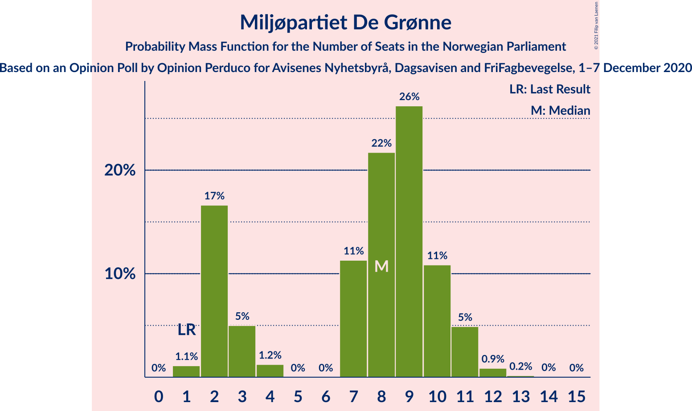

| Number of Seats | Probability | Accumulated | Special Marks |
|:---------------:|:-----------:|:-----------:|:-------------:|
| 1 | 1.1% | 100% | Last Result |
| 2 | 17% | 98.9% |  |
| 3 | 5% | 82% |  |
| 4 | 1.2% | 77% |  |
| 5 | 0% | 76% |  |
| 6 | 0% | 76% |  |
| 7 | 11% | 76% |  |
| 8 | 22% | 65% | Median |
| 9 | 26% | 43% |  |
| 10 | 11% | 17% |  |
| 11 | 5% | 6% |  |
| 12 | 0.9% | 1.1% |  |
| 13 | 0.2% | 0.2% |  |
| 14 | 0% | 0.1% |  |
| 15 | 0% | 0% |  |

### Rødt

*For a full overview of the results for this party, see the [Rødt](party-rødt.html) page.*

| Number of Seats | Probability | Accumulated | Special Marks |
|:---------------:|:-----------:|:-----------:|:-------------:|
| 1 | 3% | 100% | Last Result |
| 2 | 65% | 97% | Median |
| 3 | 0% | 32% |  |
| 4 | 0% | 32% |  |
| 5 | 0% | 32% |  |
| 6 | 0.1% | 32% |  |
| 7 | 11% | 32% |  |
| 8 | 15% | 21% |  |
| 9 | 4% | 6% |  |
| 10 | 1.2% | 2% |  |
| 11 | 0.2% | 0.3% |  |
| 12 | 0.1% | 0.1% |  |
| 13 | 0% | 0% |  |

### Kristelig Folkeparti

*For a full overview of the results for this party, see the [Kristelig Folkeparti](party-kristeligfolkeparti.html) page.*

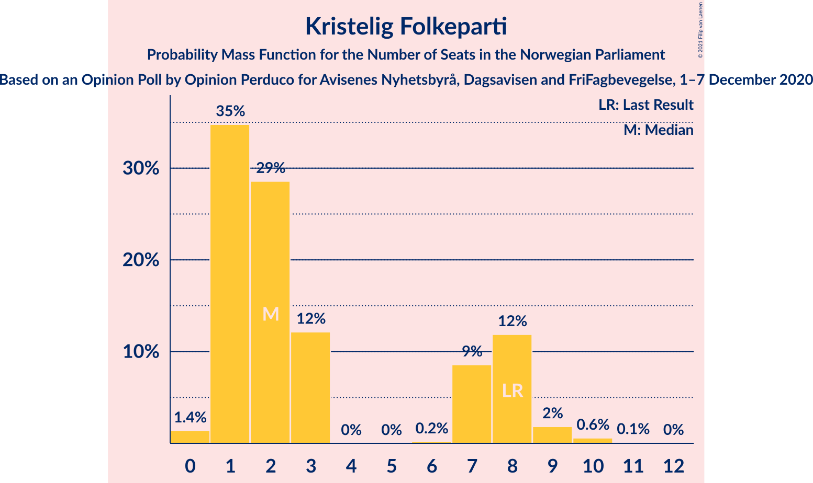

| Number of Seats | Probability | Accumulated | Special Marks |
|:---------------:|:-----------:|:-----------:|:-------------:|
| 0 | 1.4% | 100% |  |
| 1 | 35% | 98.6% |  |
| 2 | 29% | 64% | Median |
| 3 | 12% | 35% |  |
| 4 | 0% | 23% |  |
| 5 | 0% | 23% |  |
| 6 | 0.2% | 23% |  |
| 7 | 9% | 23% |  |
| 8 | 12% | 14% | Last Result |
| 9 | 2% | 3% |  |
| 10 | 0.6% | 0.7% |  |
| 11 | 0.1% | 0.1% |  |
| 12 | 0% | 0% |  |

### Venstre

*For a full overview of the results for this party, see the [Venstre](party-venstre.html) page.*

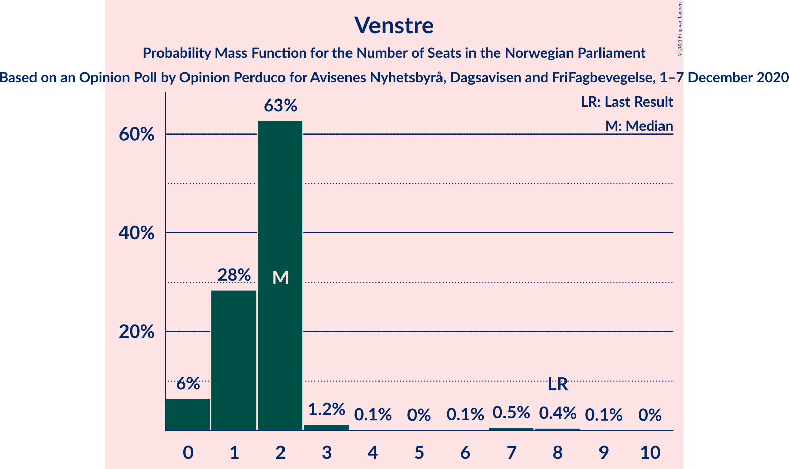

| Number of Seats | Probability | Accumulated | Special Marks |
|:---------------:|:-----------:|:-----------:|:-------------:|
| 0 | 6% | 100% |  |
| 1 | 28% | 94% |  |
| 2 | 63% | 65% | Median |
| 3 | 1.2% | 2% |  |
| 4 | 0.1% | 1.3% |  |
| 5 | 0% | 1.2% |  |
| 6 | 0.1% | 1.2% |  |
| 7 | 0.5% | 1.0% |  |
| 8 | 0.4% | 0.5% | Last Result |
| 9 | 0.1% | 0.1% |  |
| 10 | 0% | 0% |  |

## Coalitions

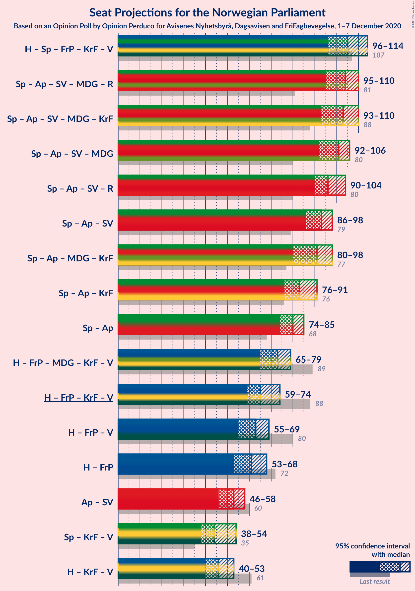

### Confidence Intervals

| Coalition | Last Result | Median | Majority? | 80% Confidence Interval | 90% Confidence Interval | 95% Confidence Interval | 99% Confidence Interval |
|:---------:|:-----------:|:------:|:---------:|:-----------------------:|:-----------------------:|:-----------------------:|:-----------------------:|
| Høyre – Senterpartiet – Fremskrittspartiet – Kristelig Folkeparti – Venstre | 107 | 105 | 100% | 100–111 | 98–113 | 96–114 | 95–116 |
| Senterpartiet – Arbeiderpartiet – Sosialistisk Venstreparti – Miljøpartiet De Grønne – Rødt | 81 | 104 | 100% | 99–109 | 97–110 | 95–110 | 94–113 |
| Senterpartiet – Arbeiderpartiet – Sosialistisk Venstreparti – Miljøpartiet De Grønne – Kristelig Folkeparti | 88 | 103 | 100% | 97–108 | 95–109 | 93–110 | 93–112 |
| Senterpartiet – Arbeiderpartiet – Sosialistisk Venstreparti – Miljøpartiet De Grønne | 80 | 101 | 100% | 94–104 | 92–105 | 92–106 | 89–108 |
| Senterpartiet – Arbeiderpartiet – Sosialistisk Venstreparti – Rødt | 80 | 96 | 99.9% | 92–101 | 91–102 | 90–104 | 88–106 |
| Senterpartiet – Arbeiderpartiet – Sosialistisk Venstreparti | 79 | 93 | 98.6% | 89–96 | 87–97 | 86–98 | 83–101 |
| Senterpartiet – Arbeiderpartiet – Miljøpartiet De Grønne – Kristelig Folkeparti | 77 | 91 | 88% | 84–95 | 83–97 | 80–98 | 79–100 |
| Senterpartiet – Arbeiderpartiet – Kristelig Folkeparti | 76 | 83 | 32% | 79–88 | 77–89 | 76–91 | 74–93 |
| Senterpartiet – Arbeiderpartiet | 68 | 80 | 4% | 76–84 | 75–84 | 74–85 | 71–88 |
| Høyre – Fremskrittspartiet – Miljøpartiet De Grønne – Kristelig Folkeparti – Venstre | 89 | 73 | 0.1% | 68–77 | 67–78 | 65–79 | 63–81 |
| Høyre – Fremskrittspartiet – Kristelig Folkeparti – Venstre | 88 | 65 | 0% | 60–70 | 59–72 | 59–74 | 56–75 |
| Høyre – Fremskrittspartiet – Venstre | 80 | 63 | 0% | 57–67 | 56–68 | 55–69 | 53–72 |
| Høyre – Fremskrittspartiet | 72 | 61 | 0% | 56–65 | 55–66 | 53–68 | 52–70 |
| Arbeiderpartiet – Sosialistisk Venstreparti | 60 | 53 | 0% | 48–56 | 47–58 | 46–58 | 43–60 |
| Senterpartiet – Kristelig Folkeparti – Venstre | 35 | 44 | 0% | 40–50 | 40–53 | 38–54 | 37–55 |
| Høyre – Kristelig Folkeparti – Venstre | 61 | 46 | 0% | 42–51 | 40–52 | 40–53 | 38–55 |

### Høyre – Senterpartiet – Fremskrittspartiet – Kristelig Folkeparti – Venstre

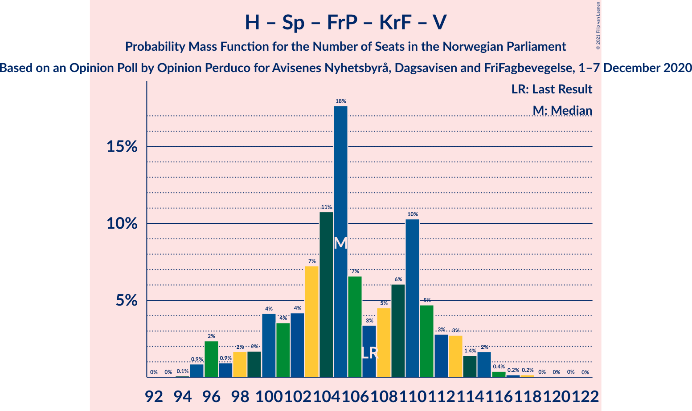

| Number of Seats | Probability | Accumulated | Special Marks |
|:---------------:|:-----------:|:-----------:|:-------------:|
| 93 | 0% | 100% |  |
| 94 | 0.1% | 99.9% |  |
| 95 | 0.9% | 99.9% |  |
| 96 | 2% | 99.0% |  |
| 97 | 0.9% | 97% |  |
| 98 | 2% | 96% |  |
| 99 | 2% | 94% |  |
| 100 | 4% | 92% |  |
| 101 | 4% | 88% |  |
| 102 | 4% | 85% |  |
| 103 | 7% | 81% |  |
| 104 | 11% | 73% |  |
| 105 | 18% | 63% |  |
| 106 | 7% | 45% | Median |
| 107 | 3% | 38% | Last Result |
| 108 | 5% | 35% |  |
| 109 | 6% | 30% |  |
| 110 | 10% | 24% |  |
| 111 | 5% | 14% |  |
| 112 | 3% | 9% |  |
| 113 | 3% | 7% |  |
| 114 | 1.4% | 4% |  |
| 115 | 2% | 2% |  |
| 116 | 0.4% | 0.8% |  |
| 117 | 0.2% | 0.4% |  |
| 118 | 0.2% | 0.2% |  |
| 119 | 0% | 0.1% |  |
| 120 | 0% | 0.1% |  |
| 121 | 0% | 0% |  |

### Senterpartiet – Arbeiderpartiet – Sosialistisk Venstreparti – Miljøpartiet De Grønne – Rødt

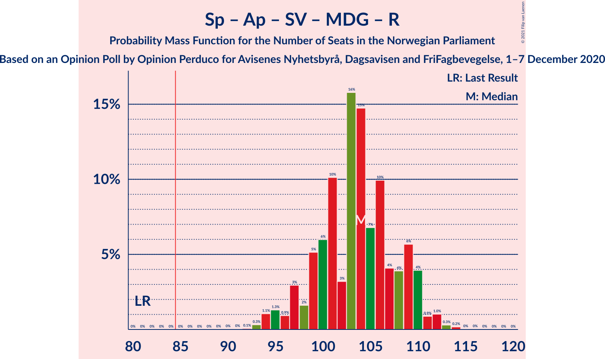

| Number of Seats | Probability | Accumulated | Special Marks |
|:---------------:|:-----------:|:-----------:|:-------------:|
| 81 | 0% | 100% | Last Result |
| 82 | 0% | 100% |  |
| 83 | 0% | 100% |  |
| 84 | 0% | 100% |  |
| 85 | 0% | 100% | Majority |
| 86 | 0% | 100% |  |
| 87 | 0% | 100% |  |
| 88 | 0% | 100% |  |
| 89 | 0% | 100% |  |
| 90 | 0% | 100% |  |
| 91 | 0% | 100% |  |
| 92 | 0.1% | 99.9% |  |
| 93 | 0.3% | 99.9% |  |
| 94 | 1.1% | 99.5% |  |
| 95 | 1.3% | 98% |  |
| 96 | 0.9% | 97% |  |
| 97 | 3% | 96% |  |
| 98 | 2% | 93% |  |
| 99 | 5% | 92% |  |
| 100 | 6% | 87% |  |
| 101 | 10% | 81% |  |
| 102 | 3% | 70% |  |
| 103 | 16% | 67% | Median |
| 104 | 15% | 51% |  |
| 105 | 7% | 37% |  |
| 106 | 10% | 30% |  |
| 107 | 4% | 20% |  |
| 108 | 4% | 16% |  |
| 109 | 6% | 12% |  |
| 110 | 4% | 6% |  |
| 111 | 0.9% | 2% |  |
| 112 | 1.0% | 2% |  |
| 113 | 0.3% | 0.5% |  |
| 114 | 0.2% | 0.2% |  |
| 115 | 0% | 0.1% |  |
| 116 | 0% | 0% |  |

### Senterpartiet – Arbeiderpartiet – Sosialistisk Venstreparti – Miljøpartiet De Grønne – Kristelig Folkeparti

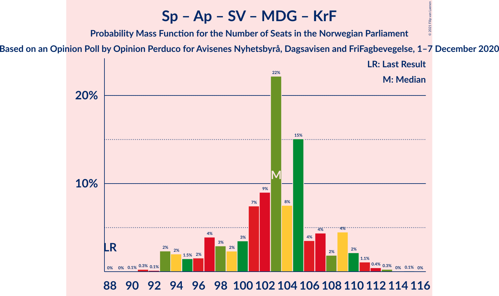

| Number of Seats | Probability | Accumulated | Special Marks |
|:---------------:|:-----------:|:-----------:|:-------------:|
| 88 | 0% | 100% | Last Result |
| 89 | 0% | 100% |  |
| 90 | 0.1% | 100% |  |
| 91 | 0.3% | 99.9% |  |
| 92 | 0.1% | 99.7% |  |
| 93 | 2% | 99.5% |  |
| 94 | 2% | 97% |  |
| 95 | 1.5% | 95% |  |
| 96 | 2% | 94% |  |
| 97 | 4% | 92% |  |
| 98 | 3% | 88% |  |
| 99 | 2% | 85% |  |
| 100 | 3% | 83% |  |
| 101 | 7% | 80% |  |
| 102 | 9% | 72% |  |
| 103 | 22% | 63% | Median |
| 104 | 8% | 41% |  |
| 105 | 15% | 33% |  |
| 106 | 4% | 18% |  |
| 107 | 4% | 15% |  |
| 108 | 2% | 10% |  |
| 109 | 4% | 9% |  |
| 110 | 2% | 4% |  |
| 111 | 1.1% | 2% |  |
| 112 | 0.4% | 0.8% |  |
| 113 | 0.3% | 0.4% |  |
| 114 | 0% | 0.1% |  |
| 115 | 0.1% | 0.1% |  |
| 116 | 0% | 0% |  |

### Senterpartiet – Arbeiderpartiet – Sosialistisk Venstreparti – Miljøpartiet De Grønne

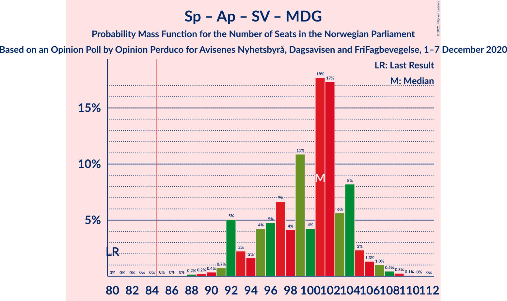

| Number of Seats | Probability | Accumulated | Special Marks |
|:---------------:|:-----------:|:-----------:|:-------------:|
| 80 | 0% | 100% | Last Result |
| 81 | 0% | 100% |  |
| 82 | 0% | 100% |  |
| 83 | 0% | 100% |  |
| 84 | 0% | 100% |  |
| 85 | 0% | 100% | Majority |
| 86 | 0% | 100% |  |
| 87 | 0% | 99.9% |  |
| 88 | 0.2% | 99.9% |  |
| 89 | 0.2% | 99.7% |  |
| 90 | 0.4% | 99.5% |  |
| 91 | 0.7% | 99.1% |  |
| 92 | 5% | 98% |  |
| 93 | 2% | 93% |  |
| 94 | 2% | 91% |  |
| 95 | 4% | 89% |  |
| 96 | 5% | 85% |  |
| 97 | 7% | 80% |  |
| 98 | 4% | 74% |  |
| 99 | 11% | 70% |  |
| 100 | 4% | 59% |  |
| 101 | 18% | 54% | Median |
| 102 | 17% | 37% |  |
| 103 | 6% | 19% |  |
| 104 | 8% | 14% |  |
| 105 | 2% | 6% |  |
| 106 | 1.3% | 3% |  |
| 107 | 1.0% | 2% |  |
| 108 | 0.5% | 0.8% |  |
| 109 | 0.3% | 0.4% |  |
| 110 | 0.1% | 0.1% |  |
| 111 | 0% | 0.1% |  |
| 112 | 0% | 0% |  |

### Senterpartiet – Arbeiderpartiet – Sosialistisk Venstreparti – Rødt

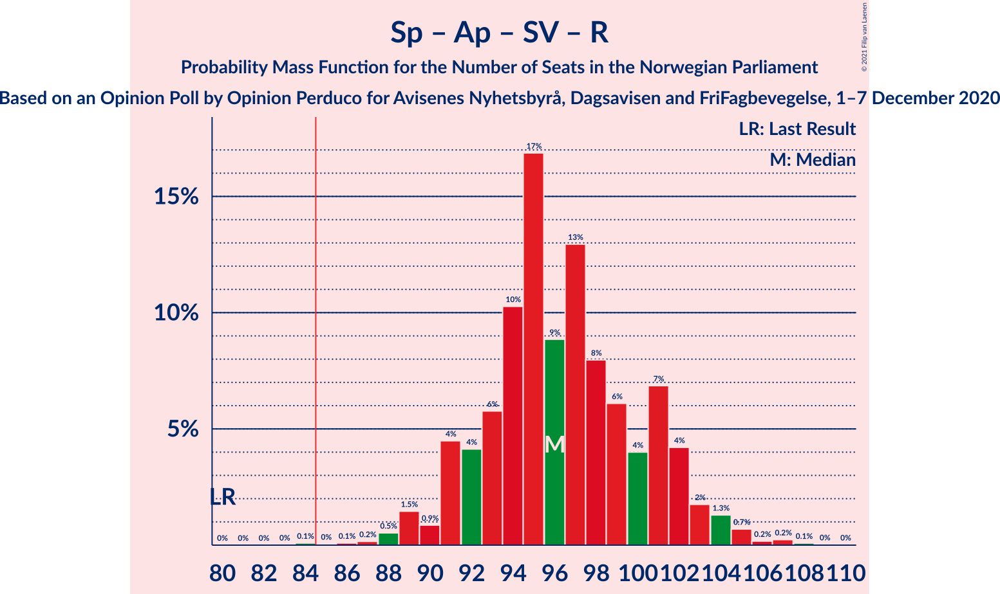

| Number of Seats | Probability | Accumulated | Special Marks |
|:---------------:|:-----------:|:-----------:|:-------------:|
| 80 | 0% | 100% | Last Result |
| 81 | 0% | 100% |  |
| 82 | 0% | 100% |  |
| 83 | 0% | 100% |  |
| 84 | 0.1% | 100% |  |
| 85 | 0% | 99.9% | Majority |
| 86 | 0.1% | 99.8% |  |
| 87 | 0.2% | 99.7% |  |
| 88 | 0.5% | 99.6% |  |
| 89 | 1.5% | 99.1% |  |
| 90 | 0.9% | 98% |  |
| 91 | 4% | 97% |  |
| 92 | 4% | 92% |  |
| 93 | 6% | 88% |  |
| 94 | 10% | 82% |  |
| 95 | 17% | 72% | Median |
| 96 | 9% | 55% |  |
| 97 | 13% | 46% |  |
| 98 | 8% | 33% |  |
| 99 | 6% | 25% |  |
| 100 | 4% | 19% |  |
| 101 | 7% | 15% |  |
| 102 | 4% | 8% |  |
| 103 | 2% | 4% |  |
| 104 | 1.3% | 3% |  |
| 105 | 0.7% | 1.2% |  |
| 106 | 0.2% | 0.5% |  |
| 107 | 0.2% | 0.4% |  |
| 108 | 0.1% | 0.1% |  |
| 109 | 0% | 0% |  |

### Senterpartiet – Arbeiderpartiet – Sosialistisk Venstreparti

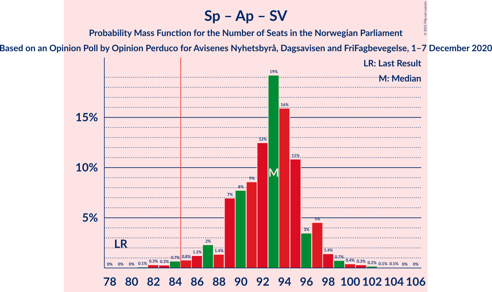

| Number of Seats | Probability | Accumulated | Special Marks |
|:---------------:|:-----------:|:-----------:|:-------------:|
| 79 | 0% | 100% | Last Result |
| 80 | 0% | 100% |  |
| 81 | 0.1% | 99.9% |  |
| 82 | 0.3% | 99.8% |  |
| 83 | 0.3% | 99.5% |  |
| 84 | 0.7% | 99.3% |  |
| 85 | 0.8% | 98.6% | Majority |
| 86 | 1.2% | 98% |  |
| 87 | 2% | 97% |  |
| 88 | 1.4% | 94% |  |
| 89 | 7% | 93% |  |
| 90 | 8% | 86% |  |
| 91 | 9% | 78% |  |
| 92 | 12% | 70% |  |
| 93 | 19% | 57% | Median |
| 94 | 16% | 38% |  |
| 95 | 11% | 22% |  |
| 96 | 3% | 11% |  |
| 97 | 5% | 8% |  |
| 98 | 1.4% | 3% |  |
| 99 | 0.7% | 2% |  |
| 100 | 0.4% | 1.1% |  |
| 101 | 0.3% | 0.6% |  |
| 102 | 0.2% | 0.3% |  |
| 103 | 0.1% | 0.2% |  |
| 104 | 0.1% | 0.1% |  |
| 105 | 0% | 0% |  |

### Senterpartiet – Arbeiderpartiet – Miljøpartiet De Grønne – Kristelig Folkeparti

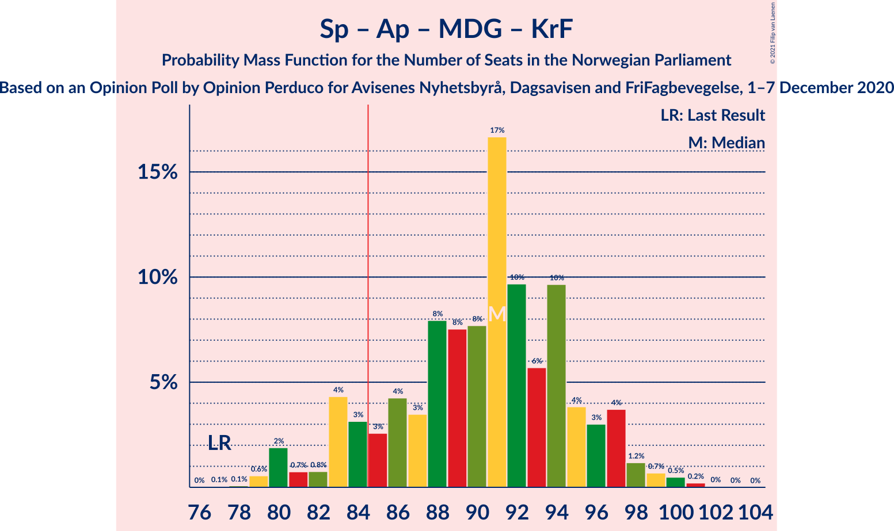

| Number of Seats | Probability | Accumulated | Special Marks |
|:---------------:|:-----------:|:-----------:|:-------------:|
| 77 | 0.1% | 100% | Last Result |
| 78 | 0.1% | 99.9% |  |
| 79 | 0.6% | 99.8% |  |
| 80 | 2% | 99.3% |  |
| 81 | 0.7% | 97% |  |
| 82 | 0.8% | 97% |  |
| 83 | 4% | 96% |  |
| 84 | 3% | 92% |  |
| 85 | 3% | 88% | Majority |
| 86 | 4% | 86% |  |
| 87 | 3% | 82% |  |
| 88 | 8% | 78% |  |
| 89 | 8% | 70% |  |
| 90 | 8% | 63% |  |
| 91 | 17% | 55% | Median |
| 92 | 10% | 38% |  |
| 93 | 6% | 29% |  |
| 94 | 10% | 23% |  |
| 95 | 4% | 13% |  |
| 96 | 3% | 9% |  |
| 97 | 4% | 6% |  |
| 98 | 1.2% | 3% |  |
| 99 | 0.7% | 1.5% |  |
| 100 | 0.5% | 0.8% |  |
| 101 | 0.2% | 0.3% |  |
| 102 | 0% | 0.1% |  |
| 103 | 0% | 0% |  |

### Senterpartiet – Arbeiderpartiet – Kristelig Folkeparti

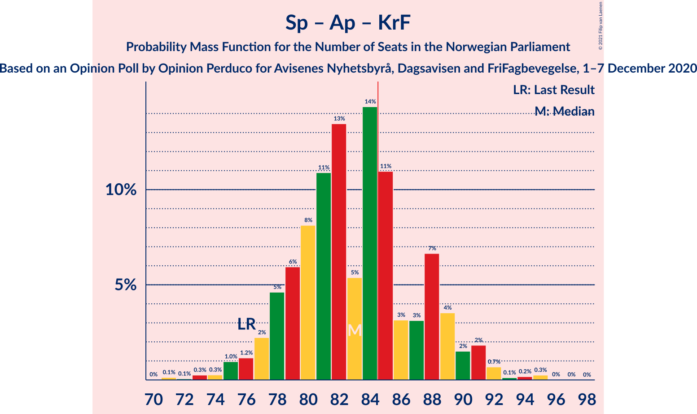

| Number of Seats | Probability | Accumulated | Special Marks |
|:---------------:|:-----------:|:-----------:|:-------------:|
| 71 | 0.1% | 100% |  |
| 72 | 0.1% | 99.8% |  |
| 73 | 0.3% | 99.8% |  |
| 74 | 0.3% | 99.5% |  |
| 75 | 1.0% | 99.2% |  |
| 76 | 1.2% | 98% | Last Result |
| 77 | 2% | 97% |  |
| 78 | 5% | 95% |  |
| 79 | 6% | 90% |  |
| 80 | 8% | 84% |  |
| 81 | 11% | 76% |  |
| 82 | 13% | 65% |  |
| 83 | 5% | 52% | Median |
| 84 | 14% | 46% |  |
| 85 | 11% | 32% | Majority |
| 86 | 3% | 21% |  |
| 87 | 3% | 18% |  |
| 88 | 7% | 15% |  |
| 89 | 4% | 8% |  |
| 90 | 2% | 5% |  |
| 91 | 2% | 3% |  |
| 92 | 0.7% | 1.3% |  |
| 93 | 0.1% | 0.6% |  |
| 94 | 0.2% | 0.5% |  |
| 95 | 0.3% | 0.3% |  |
| 96 | 0% | 0.1% |  |
| 97 | 0% | 0% |  |

### Senterpartiet – Arbeiderpartiet

| Number of Seats | Probability | Accumulated | Special Marks |
|:---------------:|:-----------:|:-----------:|:-------------:|
| 68 | 0% | 100% | Last Result |
| 69 | 0.1% | 100% |  |
| 70 | 0.3% | 99.9% |  |
| 71 | 0.2% | 99.6% |  |
| 72 | 0.5% | 99.4% |  |
| 73 | 0.8% | 98.9% |  |
| 74 | 2% | 98% |  |
| 75 | 2% | 96% |  |
| 76 | 5% | 94% |  |
| 77 | 5% | 88% |  |
| 78 | 12% | 83% |  |
| 79 | 11% | 72% |  |
| 80 | 16% | 61% |  |
| 81 | 17% | 45% | Median |
| 82 | 12% | 28% |  |
| 83 | 4% | 16% |  |
| 84 | 8% | 12% |  |
| 85 | 2% | 4% | Majority |
| 86 | 1.2% | 2% |  |
| 87 | 0.7% | 1.3% |  |
| 88 | 0.3% | 0.6% |  |
| 89 | 0.1% | 0.2% |  |
| 90 | 0% | 0.2% |  |
| 91 | 0.1% | 0.1% |  |
| 92 | 0% | 0% |  |

### Høyre – Fremskrittspartiet – Miljøpartiet De Grønne – Kristelig Folkeparti – Venstre

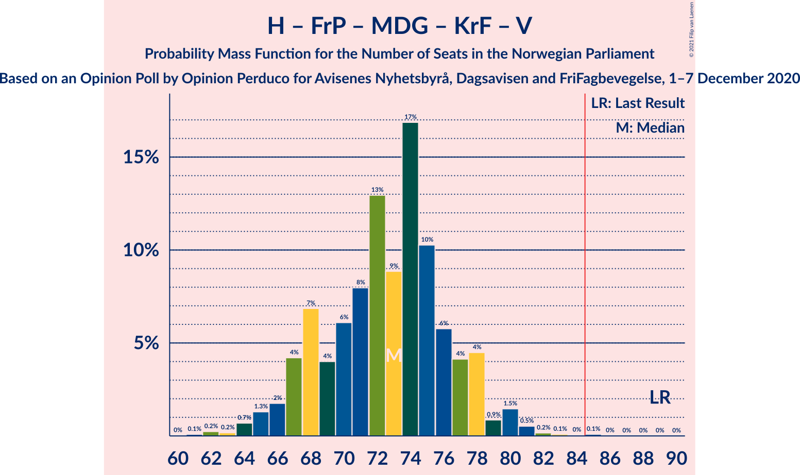

| Number of Seats | Probability | Accumulated | Special Marks |
|:---------------:|:-----------:|:-----------:|:-------------:|
| 61 | 0.1% | 100% |  |
| 62 | 0.2% | 99.9% |  |
| 63 | 0.2% | 99.6% |  |
| 64 | 0.7% | 99.5% |  |
| 65 | 1.3% | 98.8% |  |
| 66 | 2% | 97% |  |
| 67 | 4% | 96% |  |
| 68 | 7% | 92% |  |
| 69 | 4% | 85% |  |
| 70 | 6% | 81% |  |
| 71 | 8% | 75% |  |
| 72 | 13% | 67% |  |
| 73 | 9% | 54% | Median |
| 74 | 17% | 45% |  |
| 75 | 10% | 28% |  |
| 76 | 6% | 18% |  |
| 77 | 4% | 12% |  |
| 78 | 4% | 8% |  |
| 79 | 0.9% | 3% |  |
| 80 | 1.5% | 2% |  |
| 81 | 0.5% | 0.9% |  |
| 82 | 0.2% | 0.4% |  |
| 83 | 0.1% | 0.3% |  |
| 84 | 0% | 0.2% |  |
| 85 | 0.1% | 0.1% | Majority |
| 86 | 0% | 0% |  |
| 87 | 0% | 0% |  |
| 88 | 0% | 0% |  |
| 89 | 0% | 0% | Last Result |

### Høyre – Fremskrittspartiet – Kristelig Folkeparti – Venstre

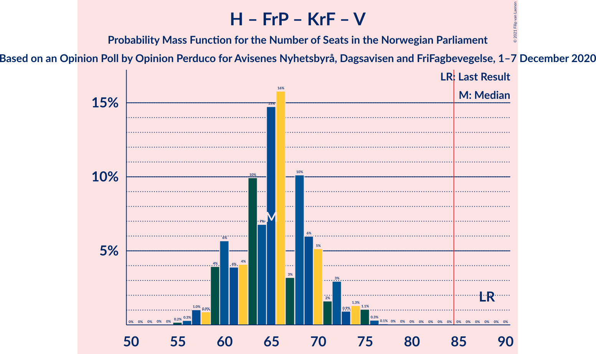

| Number of Seats | Probability | Accumulated | Special Marks |
|:---------------:|:-----------:|:-----------:|:-------------:|
| 54 | 0% | 100% |  |
| 55 | 0.2% | 99.9% |  |
| 56 | 0.3% | 99.8% |  |
| 57 | 1.0% | 99.5% |  |
| 58 | 0.9% | 98% |  |
| 59 | 4% | 98% |  |
| 60 | 6% | 94% |  |
| 61 | 4% | 88% |  |
| 62 | 4% | 84% |  |
| 63 | 10% | 80% |  |
| 64 | 7% | 70% |  |
| 65 | 15% | 63% | Median |
| 66 | 16% | 49% |  |
| 67 | 3% | 33% |  |
| 68 | 10% | 30% |  |
| 69 | 6% | 19% |  |
| 70 | 5% | 13% |  |
| 71 | 2% | 8% |  |
| 72 | 3% | 7% |  |
| 73 | 0.9% | 4% |  |
| 74 | 1.3% | 3% |  |
| 75 | 1.1% | 2% |  |
| 76 | 0.3% | 0.5% |  |
| 77 | 0.1% | 0.1% |  |
| 78 | 0% | 0.1% |  |
| 79 | 0% | 0% |  |
| 80 | 0% | 0% |  |
| 81 | 0% | 0% |  |
| 82 | 0% | 0% |  |
| 83 | 0% | 0% |  |
| 84 | 0% | 0% |  |
| 85 | 0% | 0% | Majority |
| 86 | 0% | 0% |  |
| 87 | 0% | 0% |  |
| 88 | 0% | 0% | Last Result |

### Høyre – Fremskrittspartiet – Venstre

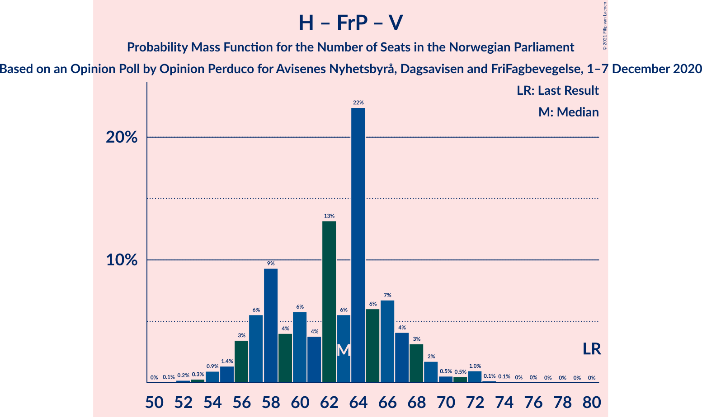

| Number of Seats | Probability | Accumulated | Special Marks |
|:---------------:|:-----------:|:-----------:|:-------------:|
| 51 | 0.1% | 100% |  |
| 52 | 0.2% | 99.9% |  |
| 53 | 0.3% | 99.7% |  |
| 54 | 0.9% | 99.4% |  |
| 55 | 1.4% | 98% |  |
| 56 | 3% | 97% |  |
| 57 | 6% | 94% |  |
| 58 | 9% | 88% |  |
| 59 | 4% | 79% |  |
| 60 | 6% | 75% |  |
| 61 | 4% | 69% |  |
| 62 | 13% | 65% |  |
| 63 | 6% | 52% | Median |
| 64 | 22% | 47% |  |
| 65 | 6% | 24% |  |
| 66 | 7% | 18% |  |
| 67 | 4% | 11% |  |
| 68 | 3% | 7% |  |
| 69 | 2% | 4% |  |
| 70 | 0.5% | 2% |  |
| 71 | 0.5% | 2% |  |
| 72 | 1.0% | 1.3% |  |
| 73 | 0.1% | 0.3% |  |
| 74 | 0.1% | 0.2% |  |
| 75 | 0% | 0.1% |  |
| 76 | 0% | 0% |  |
| 77 | 0% | 0% |  |
| 78 | 0% | 0% |  |
| 79 | 0% | 0% |  |
| 80 | 0% | 0% | Last Result |

### Høyre – Fremskrittspartiet

| Number of Seats | Probability | Accumulated | Special Marks |
|:---------------:|:-----------:|:-----------:|:-------------:|
| 49 | 0.1% | 100% |  |
| 50 | 0.1% | 99.9% |  |
| 51 | 0.2% | 99.8% |  |
| 52 | 0.6% | 99.6% |  |
| 53 | 2% | 99.0% |  |
| 54 | 2% | 97% |  |
| 55 | 3% | 96% |  |
| 56 | 11% | 92% |  |
| 57 | 4% | 81% |  |
| 58 | 4% | 76% |  |
| 59 | 7% | 72% |  |
| 60 | 2% | 65% |  |
| 61 | 15% | 63% | Median |
| 62 | 22% | 48% |  |
| 63 | 7% | 26% |  |
| 64 | 6% | 19% |  |
| 65 | 5% | 13% |  |
| 66 | 4% | 8% |  |
| 67 | 2% | 5% |  |
| 68 | 1.1% | 3% |  |
| 69 | 0.4% | 2% |  |
| 70 | 1.3% | 2% |  |
| 71 | 0.1% | 0.3% |  |
| 72 | 0.1% | 0.2% | Last Result |
| 73 | 0% | 0.1% |  |
| 74 | 0% | 0% |  |

### Arbeiderpartiet – Sosialistisk Venstreparti

| Number of Seats | Probability | Accumulated | Special Marks |
|:---------------:|:-----------:|:-----------:|:-------------:|
| 40 | 0% | 100% |  |
| 41 | 0.1% | 99.9% |  |
| 42 | 0.1% | 99.9% |  |
| 43 | 0.3% | 99.7% |  |
| 44 | 0.5% | 99.5% |  |
| 45 | 0.9% | 99.0% |  |
| 46 | 3% | 98% |  |
| 47 | 3% | 95% |  |
| 48 | 6% | 93% |  |
| 49 | 5% | 87% |  |
| 50 | 12% | 82% |  |
| 51 | 12% | 69% |  |
| 52 | 5% | 58% | Median |
| 53 | 15% | 53% |  |
| 54 | 17% | 37% |  |
| 55 | 5% | 20% |  |
| 56 | 7% | 15% |  |
| 57 | 2% | 8% |  |
| 58 | 3% | 5% |  |
| 59 | 0.8% | 2% |  |
| 60 | 0.9% | 1.1% | Last Result |
| 61 | 0.1% | 0.2% |  |
| 62 | 0% | 0.1% |  |
| 63 | 0% | 0% |  |

### Senterpartiet – Kristelig Folkeparti – Venstre

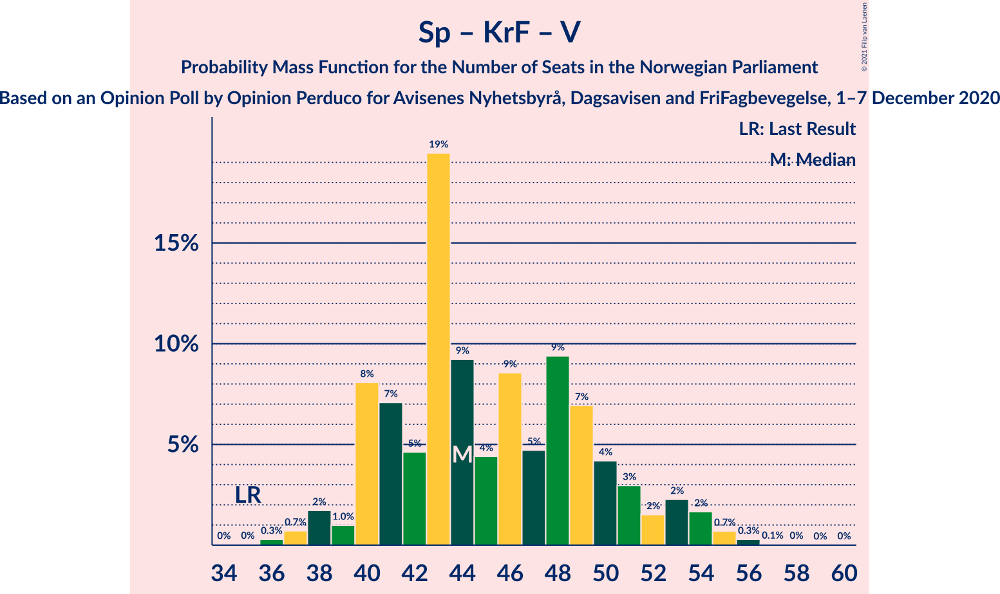

| Number of Seats | Probability | Accumulated | Special Marks |
|:---------------:|:-----------:|:-----------:|:-------------:|
| 35 | 0% | 100% | Last Result |
| 36 | 0.3% | 99.9% |  |
| 37 | 0.7% | 99.6% |  |
| 38 | 2% | 98.9% |  |
| 39 | 1.0% | 97% |  |
| 40 | 8% | 96% |  |
| 41 | 7% | 88% |  |
| 42 | 5% | 81% |  |
| 43 | 19% | 76% |  |
| 44 | 9% | 57% |  |
| 45 | 4% | 48% | Median |
| 46 | 9% | 43% |  |
| 47 | 5% | 35% |  |
| 48 | 9% | 30% |  |
| 49 | 7% | 21% |  |
| 50 | 4% | 14% |  |
| 51 | 3% | 10% |  |
| 52 | 2% | 7% |  |
| 53 | 2% | 5% |  |
| 54 | 2% | 3% |  |
| 55 | 0.7% | 1.1% |  |
| 56 | 0.3% | 0.4% |  |
| 57 | 0.1% | 0.1% |  |
| 58 | 0% | 0.1% |  |
| 59 | 0% | 0% |  |

### Høyre – Kristelig Folkeparti – Venstre

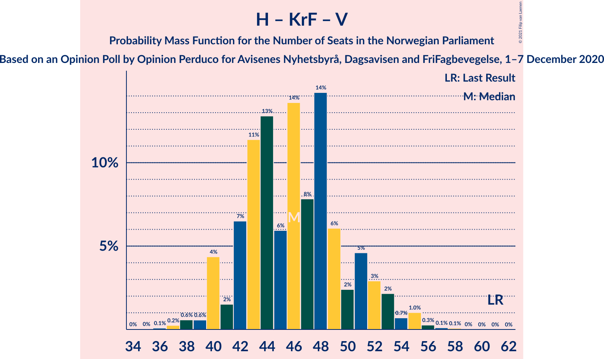

| Number of Seats | Probability | Accumulated | Special Marks |
|:---------------:|:-----------:|:-----------:|:-------------:|
| 36 | 0.1% | 100% |  |
| 37 | 0.2% | 99.9% |  |
| 38 | 0.6% | 99.6% |  |
| 39 | 0.6% | 99.0% |  |
| 40 | 4% | 98% |  |
| 41 | 2% | 94% |  |
| 42 | 7% | 93% |  |
| 43 | 11% | 86% |  |
| 44 | 13% | 75% |  |
| 45 | 6% | 62% |  |
| 46 | 14% | 56% | Median |
| 47 | 8% | 42% |  |
| 48 | 14% | 35% |  |
| 49 | 6% | 20% |  |
| 50 | 2% | 14% |  |
| 51 | 5% | 12% |  |
| 52 | 3% | 7% |  |
| 53 | 2% | 4% |  |
| 54 | 0.7% | 2% |  |
| 55 | 1.0% | 1.5% |  |
| 56 | 0.3% | 0.5% |  |
| 57 | 0.1% | 0.2% |  |
| 58 | 0.1% | 0.1% |  |
| 59 | 0% | 0% |  |
| 60 | 0% | 0% |  |
| 61 | 0% | 0% | Last Result |

## Technical Information

### Opinion Poll

+ **Polling firm:** Opinion Perduco
+ **Commissioner(s):** Avisenes Nyhetsbyrå, Dagsavisen and FriFagbevegelse
+ **Fieldwork period:** 1–7 December 2020

### Calculations

+ **Sample size:** 693
+ **Simulations done:** 1,048,576
+ **Error estimate:** 2.27%

