# Opinion Poll by Norstat for Aftenposten and NRK, 7–13 December 2020

<a href="#voting-intentions">Voting Intentions</a> | <a href="#seats">Seats</a> | <a href="#coalitions">Coalitions</a> | <a href="#technical-information">Technical Information</a>

## Voting Intentions

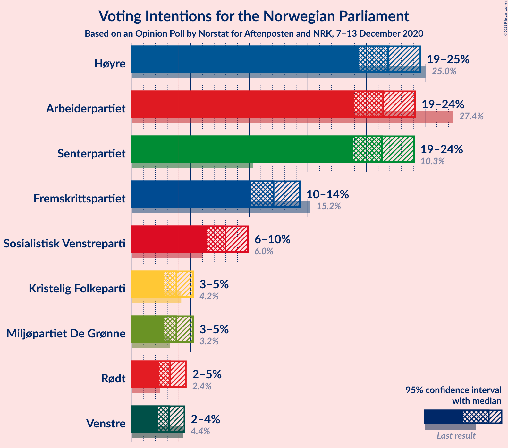

### Confidence Intervals

| Party | Last Result | Poll Result | 80% Confidence Interval | 90% Confidence Interval | 95% Confidence Interval | 99% Confidence Interval |
|:-----:|:-----------:|:-----------:|:-----------------------:|:-----------------------:|:-----------------------:|:-----------------------:|
| Høyre | 25.0% | 21.8% | 20.2–23.6% |19.7–24.1% |19.3–24.6% |18.6–25.5% |
| Arbeiderpartiet | 27.4% | 21.4% | 19.8–23.2% |19.3–23.7% |18.9–24.2% |18.2–25.0% |
| Senterpartiet | 10.3% | 21.3% | 19.7–23.1% |19.2–23.6% |18.8–24.1% |18.1–24.9% |
| Fremskrittspartiet | 15.2% | 12.1% | 10.8–13.5% |10.5–13.9% |10.2–14.3% |9.6–15.0% |
| Sosialistisk Venstreparti | 6.0% | 8.0% | 7.0–9.2% |6.7–9.6% |6.4–9.9% |6.0–10.5% |
| Miljøpartiet De Grønne | 3.2% | 3.8% | 3.1–4.7% |2.9–5.0% |2.7–5.2% |2.4–5.7% |
| Kristelig Folkeparti | 4.2% | 3.8% | 3.1–4.7% |2.9–5.0% |2.7–5.2% |2.4–5.7% |
| Rødt | 2.4% | 3.3% | 2.6–4.1% |2.5–4.4% |2.3–4.6% |2.0–5.0% |
| Venstre | 4.4% | 3.2% | 2.5–4.0% |2.4–4.3% |2.2–4.5% |2.0–4.9% |

*Note:* The poll result column reflects the actual value used in the calculations. Published results may vary slightly, and in addition be rounded to fewer digits.

## Seats

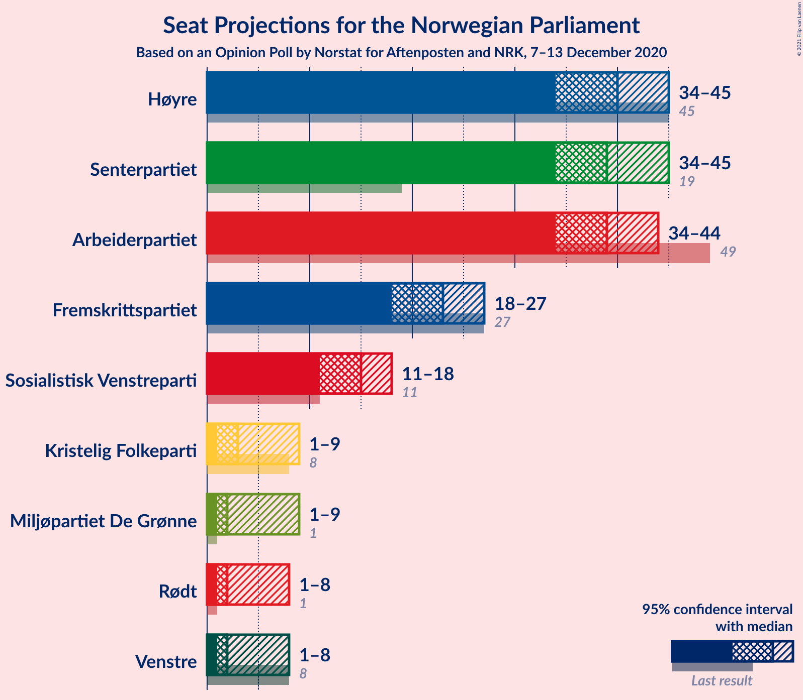

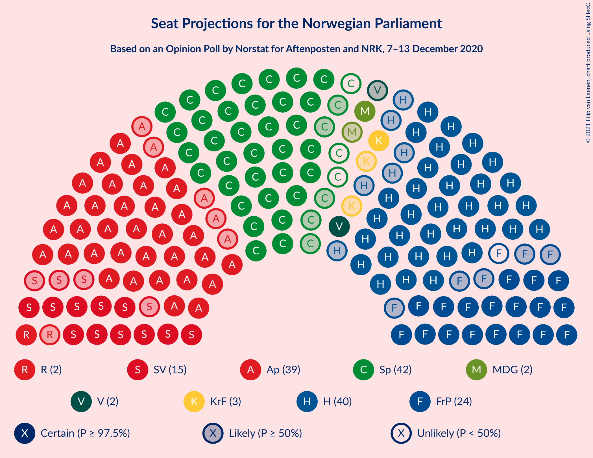

### Confidence Intervals

| Party | Last Result | Median | 80% Confidence Interval | 90% Confidence Interval | 95% Confidence Interval | 99% Confidence Interval |
|:-----:|:-----------:|:------:|:-----------------------:|:-----------------------:|:-----------------------:|:-----------------------:|
| <a href="#høyre">Høyre</a> | 45 | 40 | 36–44 |35–45 |34–45 |33–47 |
| <a href="#arbeiderpartiet">Arbeiderpartiet</a> | 49 | 39 | 36–43 |35–44 |34–44 |32–46 |
| <a href="#senterpartiet">Senterpartiet</a> | 19 | 39 | 36–43 |35–44 |34–45 |32–46 |
| <a href="#fremskrittspartiet">Fremskrittspartiet</a> | 27 | 23 | 19–25 |19–26 |18–27 |17–27 |
| <a href="#sosialistisk-venstreparti">Sosialistisk Venstreparti</a> | 11 | 15 | 12–17 |12–17 |11–18 |10–19 |
| <a href="#miljøpartiet-de-grønne">Miljøpartiet De Grønne</a> | 1 | 2 | 1–8 |1–9 |1–9 |1–10 |
| <a href="#kristelig-folkeparti">Kristelig Folkeparti</a> | 8 | 3 | 1–8 |1–9 |1–9 |1–10 |
| <a href="#rødt">Rødt</a> | 1 | 2 | 1–7 |1–8 |1–8 |1–9 |
| <a href="#venstre">Venstre</a> | 8 | 2 | 2–3 |2–7 |1–8 |1–9 |

### Høyre

*For a full overview of the results for this party, see the [Høyre](party-høyre.html) page.*

| Number of Seats | Probability | Accumulated | Special Marks |
|:---------------:|:-----------:|:-----------:|:-------------:|
| 31 | 0.1% | 100% |  |
| 32 | 0.2% | 99.9% |  |
| 33 | 0.6% | 99.8% |  |
| 34 | 2% | 99.1% |  |
| 35 | 4% | 97% |  |
| 36 | 4% | 94% |  |
| 37 | 12% | 90% |  |
| 38 | 12% | 78% |  |
| 39 | 12% | 66% |  |
| 40 | 14% | 55% | Median |
| 41 | 16% | 41% |  |
| 42 | 10% | 26% |  |
| 43 | 6% | 16% |  |
| 44 | 2% | 10% |  |
| 45 | 6% | 8% | Last Result |
| 46 | 0.9% | 2% |  |
| 47 | 0.3% | 0.6% |  |
| 48 | 0.2% | 0.3% |  |
| 49 | 0% | 0.1% |  |
| 50 | 0% | 0% |  |

### Arbeiderpartiet

*For a full overview of the results for this party, see the [Arbeiderpartiet](party-arbeiderpartiet.html) page.*

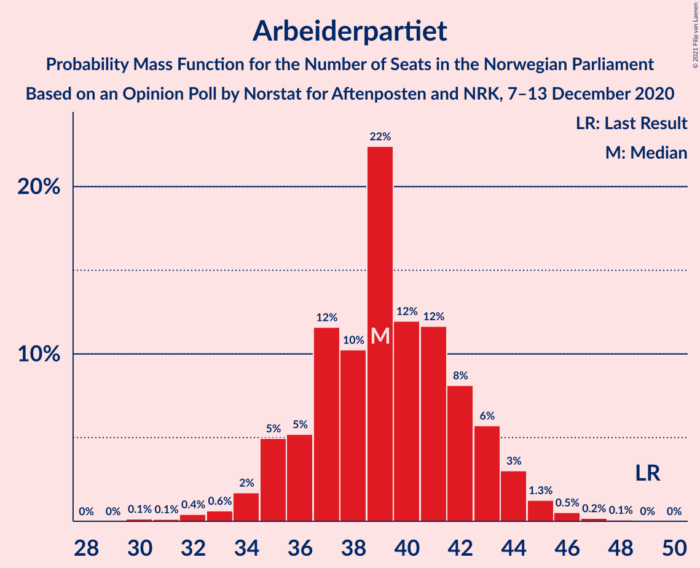

| Number of Seats | Probability | Accumulated | Special Marks |
|:---------------:|:-----------:|:-----------:|:-------------:|
| 30 | 0.1% | 100% |  |
| 31 | 0.1% | 99.9% |  |
| 32 | 0.4% | 99.7% |  |
| 33 | 0.6% | 99.3% |  |
| 34 | 2% | 98.7% |  |
| 35 | 5% | 97% |  |
| 36 | 5% | 92% |  |
| 37 | 12% | 87% |  |
| 38 | 10% | 75% |  |
| 39 | 22% | 65% | Median |
| 40 | 12% | 43% |  |
| 41 | 12% | 31% |  |
| 42 | 8% | 19% |  |
| 43 | 6% | 11% |  |
| 44 | 3% | 5% |  |
| 45 | 1.3% | 2% |  |
| 46 | 0.5% | 0.8% |  |
| 47 | 0.2% | 0.3% |  |
| 48 | 0.1% | 0.1% |  |
| 49 | 0% | 0% | Last Result |

### Senterpartiet

*For a full overview of the results for this party, see the [Senterpartiet](party-senterpartiet.html) page.*

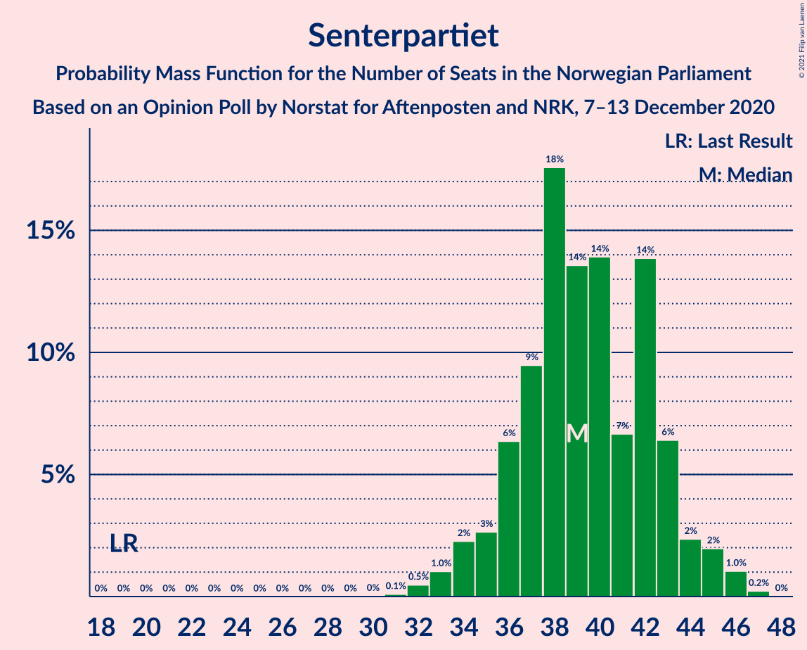

| Number of Seats | Probability | Accumulated | Special Marks |
|:---------------:|:-----------:|:-----------:|:-------------:|
| 19 | 0% | 100% | Last Result |
| 20 | 0% | 100% |  |
| 21 | 0% | 100% |  |
| 22 | 0% | 100% |  |
| 23 | 0% | 100% |  |
| 24 | 0% | 100% |  |
| 25 | 0% | 100% |  |
| 26 | 0% | 100% |  |
| 27 | 0% | 100% |  |
| 28 | 0% | 100% |  |
| 29 | 0% | 100% |  |
| 30 | 0% | 100% |  |
| 31 | 0.1% | 100% |  |
| 32 | 0.5% | 99.9% |  |
| 33 | 1.0% | 99.4% |  |
| 34 | 2% | 98% |  |
| 35 | 3% | 96% |  |
| 36 | 6% | 93% |  |
| 37 | 9% | 87% |  |
| 38 | 18% | 78% |  |
| 39 | 14% | 60% | Median |
| 40 | 14% | 46% |  |
| 41 | 7% | 33% |  |
| 42 | 14% | 26% |  |
| 43 | 6% | 12% |  |
| 44 | 2% | 6% |  |
| 45 | 2% | 3% |  |
| 46 | 1.0% | 1.3% |  |
| 47 | 0.2% | 0.3% |  |
| 48 | 0% | 0% |  |

### Fremskrittspartiet

*For a full overview of the results for this party, see the [Fremskrittspartiet](party-fremskrittspartiet.html) page.*

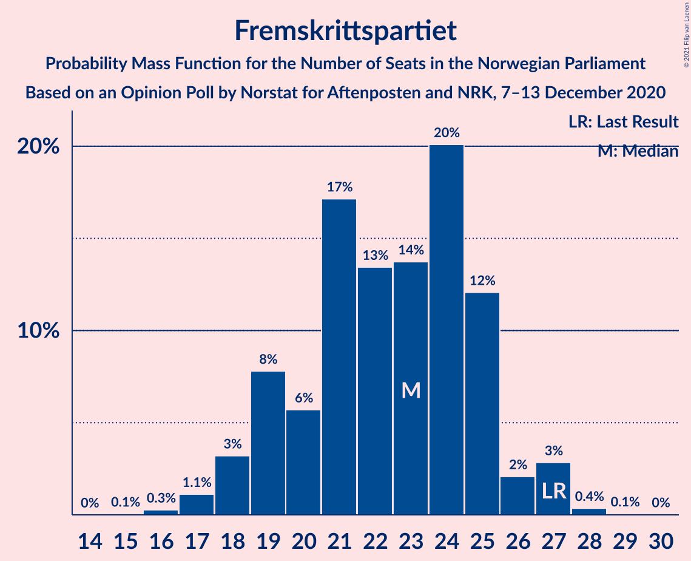

| Number of Seats | Probability | Accumulated | Special Marks |
|:---------------:|:-----------:|:-----------:|:-------------:|
| 15 | 0.1% | 100% |  |
| 16 | 0.3% | 99.9% |  |
| 17 | 1.1% | 99.7% |  |
| 18 | 3% | 98.6% |  |
| 19 | 8% | 95% |  |
| 20 | 6% | 88% |  |
| 21 | 17% | 82% |  |
| 22 | 13% | 65% |  |
| 23 | 14% | 51% | Median |
| 24 | 20% | 38% |  |
| 25 | 12% | 17% |  |
| 26 | 2% | 5% |  |
| 27 | 3% | 3% | Last Result |
| 28 | 0.4% | 0.4% |  |
| 29 | 0.1% | 0.1% |  |
| 30 | 0% | 0% |  |

### Sosialistisk Venstreparti

*For a full overview of the results for this party, see the [Sosialistisk Venstreparti](party-sosialistiskvenstreparti.html) page.*

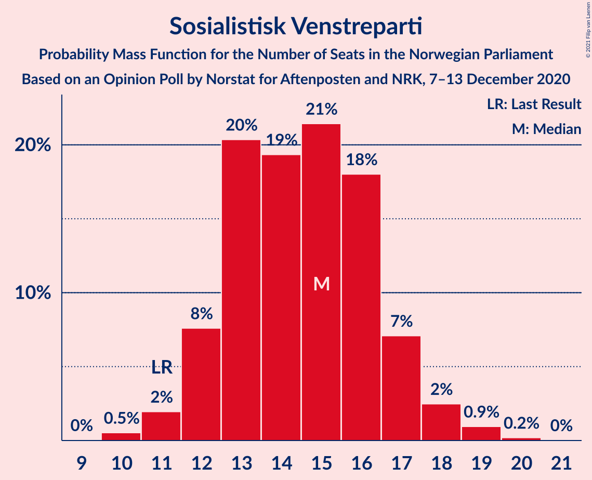

| Number of Seats | Probability | Accumulated | Special Marks |
|:---------------:|:-----------:|:-----------:|:-------------:|
| 10 | 0.5% | 100% |  |
| 11 | 2% | 99.4% | Last Result |
| 12 | 8% | 97% |  |
| 13 | 20% | 90% |  |
| 14 | 19% | 70% |  |
| 15 | 21% | 50% | Median |
| 16 | 18% | 29% |  |
| 17 | 7% | 11% |  |
| 18 | 2% | 4% |  |
| 19 | 0.9% | 1.2% |  |
| 20 | 0.2% | 0.2% |  |
| 21 | 0% | 0% |  |

### Miljøpartiet De Grønne

*For a full overview of the results for this party, see the [Miljøpartiet De Grønne](party-miljøpartietdegrønne.html) page.*

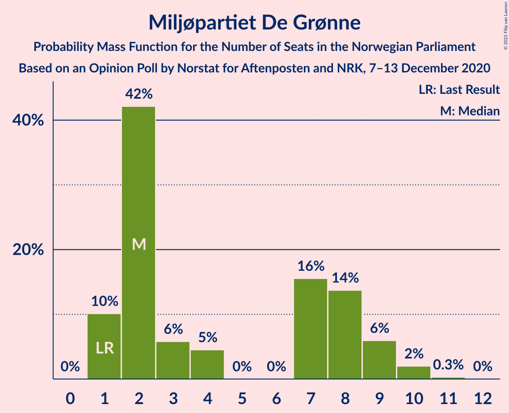

| Number of Seats | Probability | Accumulated | Special Marks |
|:---------------:|:-----------:|:-----------:|:-------------:|
| 1 | 10% | 100% | Last Result |
| 2 | 42% | 90% | Median |
| 3 | 6% | 48% |  |
| 4 | 5% | 42% |  |
| 5 | 0% | 37% |  |
| 6 | 0% | 37% |  |
| 7 | 16% | 37% |  |
| 8 | 14% | 22% |  |
| 9 | 6% | 8% |  |
| 10 | 2% | 2% |  |
| 11 | 0.3% | 0.3% |  |
| 12 | 0% | 0% |  |

### Kristelig Folkeparti

*For a full overview of the results for this party, see the [Kristelig Folkeparti](party-kristeligfolkeparti.html) page.*

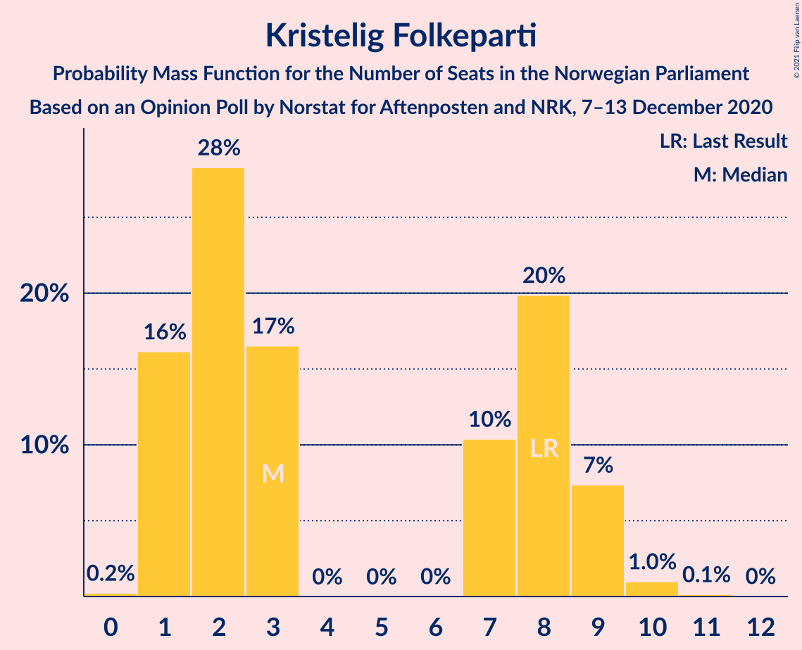

| Number of Seats | Probability | Accumulated | Special Marks |
|:---------------:|:-----------:|:-----------:|:-------------:|
| 0 | 0.2% | 100% |  |
| 1 | 16% | 99.8% |  |
| 2 | 28% | 84% |  |
| 3 | 17% | 55% | Median |
| 4 | 0% | 39% |  |
| 5 | 0% | 39% |  |
| 6 | 0% | 39% |  |
| 7 | 10% | 39% |  |
| 8 | 20% | 28% | Last Result |
| 9 | 7% | 9% |  |
| 10 | 1.0% | 1.2% |  |
| 11 | 0.1% | 0.2% |  |
| 12 | 0% | 0% |  |

### Rødt

*For a full overview of the results for this party, see the [Rødt](party-rødt.html) page.*

| Number of Seats | Probability | Accumulated | Special Marks |
|:---------------:|:-----------:|:-----------:|:-------------:|
| 1 | 13% | 100% | Last Result |
| 2 | 75% | 87% | Median |
| 3 | 0% | 12% |  |
| 4 | 0% | 12% |  |
| 5 | 0% | 12% |  |
| 6 | 0% | 12% |  |
| 7 | 4% | 12% |  |
| 8 | 6% | 8% |  |
| 9 | 2% | 2% |  |
| 10 | 0.2% | 0.2% |  |
| 11 | 0% | 0% |  |

### Venstre

*For a full overview of the results for this party, see the [Venstre](party-venstre.html) page.*

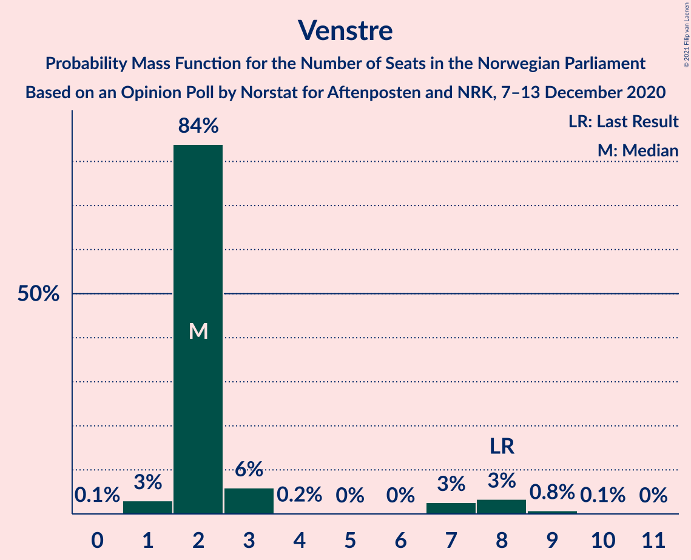

| Number of Seats | Probability | Accumulated | Special Marks |
|:---------------:|:-----------:|:-----------:|:-------------:|
| 0 | 0.1% | 100% |  |
| 1 | 3% | 99.9% |  |
| 2 | 84% | 97% | Median |
| 3 | 6% | 13% |  |
| 4 | 0.2% | 7% |  |
| 5 | 0% | 7% |  |
| 6 | 0% | 7% |  |
| 7 | 3% | 7% |  |
| 8 | 3% | 4% | Last Result |
| 9 | 0.8% | 0.9% |  |
| 10 | 0.1% | 0.1% |  |
| 11 | 0% | 0% |  |

## Coalitions

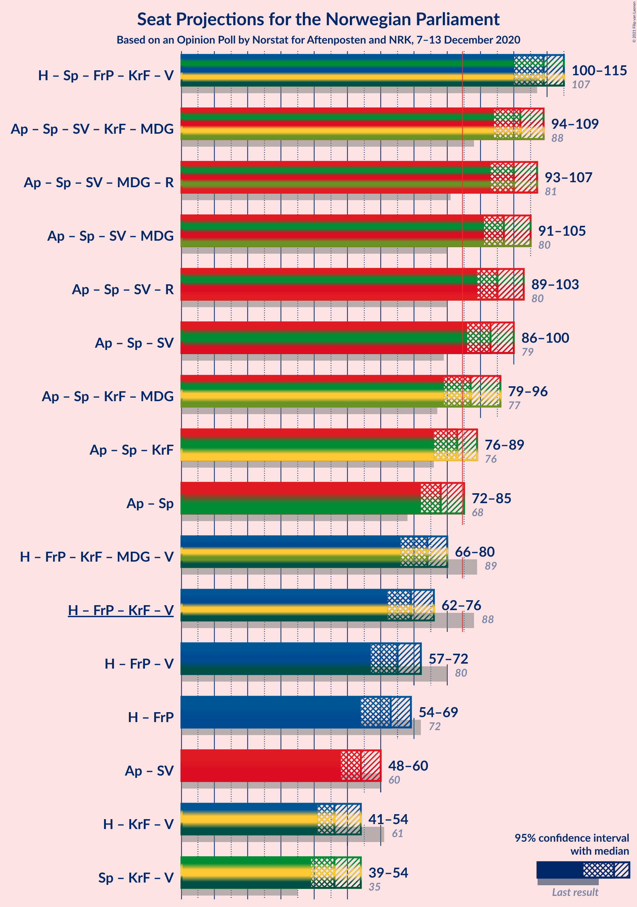

### Confidence Intervals

| Coalition | Last Result | Median | Majority? | 80% Confidence Interval | 90% Confidence Interval | 95% Confidence Interval | 99% Confidence Interval |
|:---------:|:-----------:|:------:|:---------:|:-----------------------:|:-----------------------:|:-----------------------:|:-----------------------:|
| Høyre – Senterpartiet – Fremskrittspartiet – Kristelig Folkeparti – Venstre | 107 | 109 | 100% | 102–113 | 101–114 | 100–115 | 99–117 |
| Arbeiderpartiet – Senterpartiet – Sosialistisk Venstreparti – Kristelig Folkeparti – Miljøpartiet De Grønne | 88 | 102 | 100% | 96–106 | 96–108 | 94–109 | 92–111 |
| Arbeiderpartiet – Senterpartiet – Sosialistisk Venstreparti – Miljøpartiet De Grønne – Rødt | 81 | 100 | 100% | 95–105 | 94–106 | 93–107 | 91–109 |
| Arbeiderpartiet – Senterpartiet – Sosialistisk Venstreparti – Miljøpartiet De Grønne | 80 | 97 | 100% | 93–102 | 92–104 | 91–105 | 88–106 |
| Arbeiderpartiet – Senterpartiet – Sosialistisk Venstreparti – Rødt | 80 | 95 | 99.9% | 92–101 | 91–101 | 89–103 | 87–105 |
| Arbeiderpartiet – Senterpartiet – Sosialistisk Venstreparti | 79 | 93 | 99.3% | 90–98 | 88–99 | 86–100 | 84–102 |
| Arbeiderpartiet – Senterpartiet – Kristelig Folkeparti – Miljøpartiet De Grønne | 77 | 87 | 79% | 81–92 | 81–94 | 79–96 | 77–97 |
| Arbeiderpartiet – Senterpartiet – Kristelig Folkeparti | 76 | 83 | 45% | 79–88 | 77–88 | 76–89 | 73–92 |
| Arbeiderpartiet – Senterpartiet | 68 | 78 | 4% | 75–84 | 74–84 | 72–85 | 70–87 |
| Høyre – Fremskrittspartiet – Kristelig Folkeparti – Miljøpartiet De Grønne – Venstre | 89 | 74 | 0.1% | 68–77 | 68–78 | 66–80 | 64–82 |
| Høyre – Fremskrittspartiet – Kristelig Folkeparti – Venstre | 88 | 69 | 0% | 64–74 | 63–75 | 62–76 | 60–78 |
| Høyre – Fremskrittspartiet – Venstre | 80 | 65 | 0% | 60–69 | 59–71 | 57–72 | 55–75 |
| Høyre – Fremskrittspartiet | 72 | 63 | 0% | 57–67 | 56–69 | 54–69 | 53–71 |
| Arbeiderpartiet – Sosialistisk Venstreparti | 60 | 54 | 0% | 50–57 | 48–59 | 48–60 | 46–61 |
| Høyre – Kristelig Folkeparti – Venstre | 61 | 46 | 0% | 42–52 | 41–52 | 41–54 | 39–56 |
| Senterpartiet – Kristelig Folkeparti – Venstre | 35 | 46 | 0% | 41–51 | 40–52 | 39–54 | 38–57 |

### Høyre – Senterpartiet – Fremskrittspartiet – Kristelig Folkeparti – Venstre

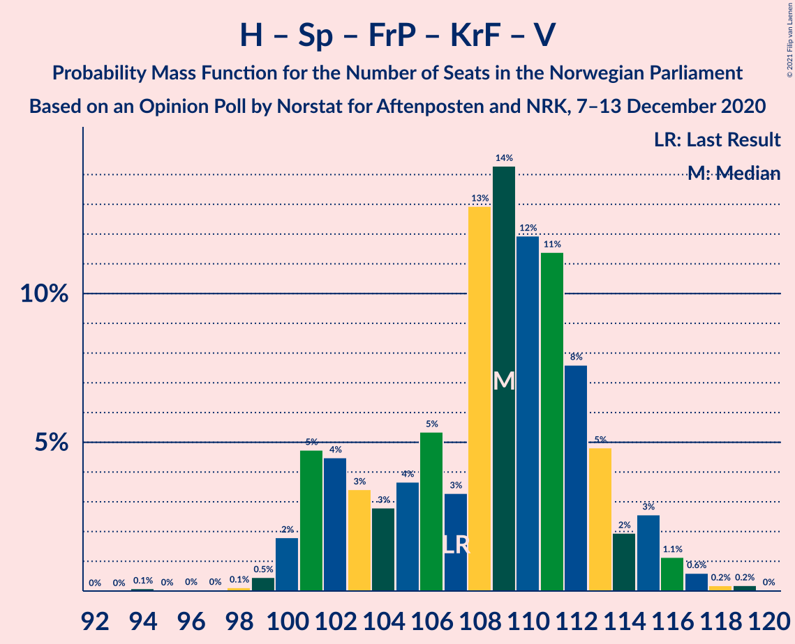

| Number of Seats | Probability | Accumulated | Special Marks |
|:---------------:|:-----------:|:-----------:|:-------------:|
| 94 | 0.1% | 100% |  |
| 95 | 0% | 99.9% |  |
| 96 | 0% | 99.9% |  |
| 97 | 0% | 99.8% |  |
| 98 | 0.1% | 99.8% |  |
| 99 | 0.5% | 99.7% |  |
| 100 | 2% | 99.2% |  |
| 101 | 5% | 97% |  |
| 102 | 4% | 93% |  |
| 103 | 3% | 88% |  |
| 104 | 3% | 85% |  |
| 105 | 4% | 82% |  |
| 106 | 5% | 78% |  |
| 107 | 3% | 73% | Last Result, Median |
| 108 | 13% | 70% |  |
| 109 | 14% | 57% |  |
| 110 | 12% | 42% |  |
| 111 | 11% | 30% |  |
| 112 | 8% | 19% |  |
| 113 | 5% | 11% |  |
| 114 | 2% | 7% |  |
| 115 | 3% | 5% |  |
| 116 | 1.1% | 2% |  |
| 117 | 0.6% | 1.0% |  |
| 118 | 0.2% | 0.4% |  |
| 119 | 0.2% | 0.2% |  |
| 120 | 0% | 0% |  |

### Arbeiderpartiet – Senterpartiet – Sosialistisk Venstreparti – Kristelig Folkeparti – Miljøpartiet De Grønne

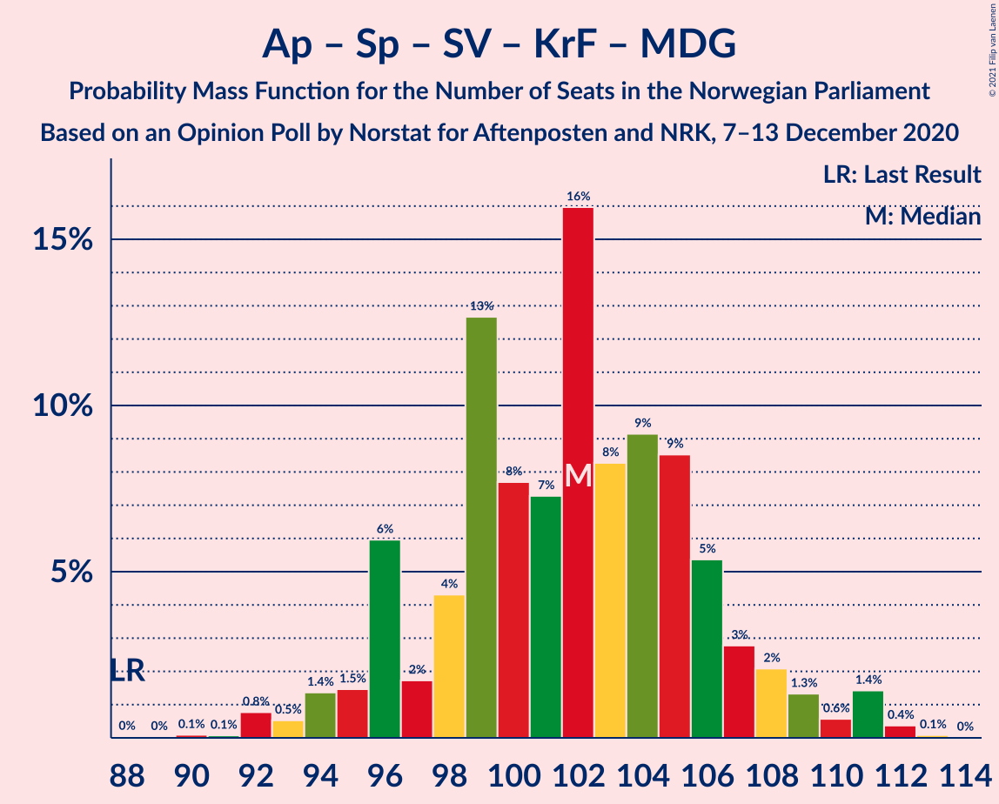

| Number of Seats | Probability | Accumulated | Special Marks |
|:---------------:|:-----------:|:-----------:|:-------------:|
| 88 | 0% | 100% | Last Result |
| 89 | 0% | 100% |  |
| 90 | 0.1% | 99.9% |  |
| 91 | 0.1% | 99.8% |  |
| 92 | 0.8% | 99.7% |  |
| 93 | 0.5% | 99.0% |  |
| 94 | 1.4% | 98% |  |
| 95 | 1.5% | 97% |  |
| 96 | 6% | 96% |  |
| 97 | 2% | 90% |  |
| 98 | 4% | 88% | Median |
| 99 | 13% | 84% |  |
| 100 | 8% | 71% |  |
| 101 | 7% | 63% |  |
| 102 | 16% | 56% |  |
| 103 | 8% | 40% |  |
| 104 | 9% | 32% |  |
| 105 | 9% | 23% |  |
| 106 | 5% | 14% |  |
| 107 | 3% | 9% |  |
| 108 | 2% | 6% |  |
| 109 | 1.3% | 4% |  |
| 110 | 0.6% | 2% |  |
| 111 | 1.4% | 2% |  |
| 112 | 0.4% | 0.5% |  |
| 113 | 0.1% | 0.1% |  |
| 114 | 0% | 0% |  |

### Arbeiderpartiet – Senterpartiet – Sosialistisk Venstreparti – Miljøpartiet De Grønne – Rødt

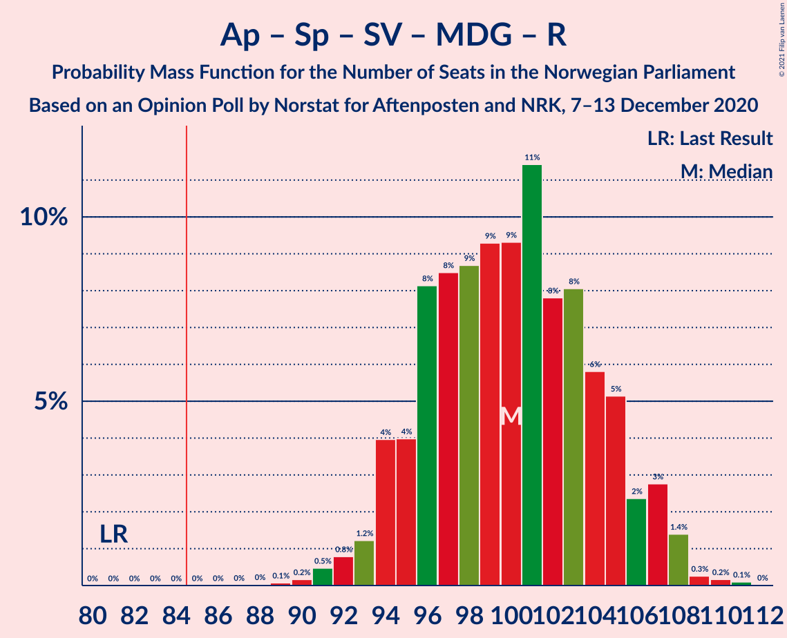

| Number of Seats | Probability | Accumulated | Special Marks |
|:---------------:|:-----------:|:-----------:|:-------------:|
| 81 | 0% | 100% | Last Result |
| 82 | 0% | 100% |  |
| 83 | 0% | 100% |  |
| 84 | 0% | 100% |  |
| 85 | 0% | 100% | Majority |
| 86 | 0% | 100% |  |
| 87 | 0% | 100% |  |
| 88 | 0% | 100% |  |
| 89 | 0.1% | 99.9% |  |
| 90 | 0.2% | 99.9% |  |
| 91 | 0.5% | 99.7% |  |
| 92 | 0.8% | 99.2% |  |
| 93 | 1.2% | 98% |  |
| 94 | 4% | 97% |  |
| 95 | 4% | 93% |  |
| 96 | 8% | 89% |  |
| 97 | 8% | 81% | Median |
| 98 | 9% | 73% |  |
| 99 | 9% | 64% |  |
| 100 | 9% | 55% |  |
| 101 | 11% | 45% |  |
| 102 | 8% | 34% |  |
| 103 | 8% | 26% |  |
| 104 | 6% | 18% |  |
| 105 | 5% | 12% |  |
| 106 | 2% | 7% |  |
| 107 | 3% | 5% |  |
| 108 | 1.4% | 2% |  |
| 109 | 0.3% | 0.6% |  |
| 110 | 0.2% | 0.3% |  |
| 111 | 0.1% | 0.1% |  |
| 112 | 0% | 0% |  |

### Arbeiderpartiet – Senterpartiet – Sosialistisk Venstreparti – Miljøpartiet De Grønne

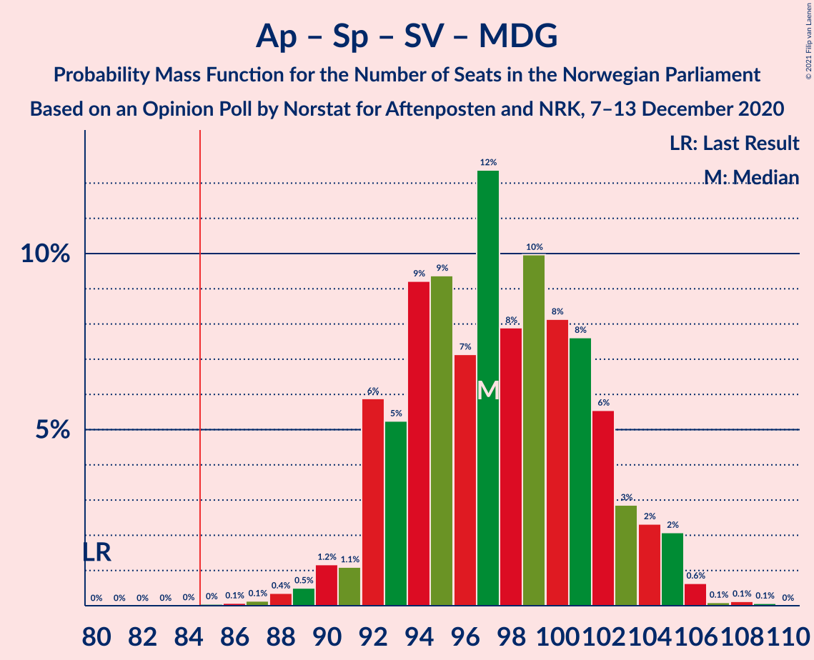

| Number of Seats | Probability | Accumulated | Special Marks |
|:---------------:|:-----------:|:-----------:|:-------------:|
| 80 | 0% | 100% | Last Result |
| 81 | 0% | 100% |  |
| 82 | 0% | 100% |  |
| 83 | 0% | 100% |  |
| 84 | 0% | 100% |  |
| 85 | 0% | 100% | Majority |
| 86 | 0.1% | 99.9% |  |
| 87 | 0.1% | 99.9% |  |
| 88 | 0.4% | 99.7% |  |
| 89 | 0.5% | 99.4% |  |
| 90 | 1.2% | 98.9% |  |
| 91 | 1.1% | 98% |  |
| 92 | 6% | 97% |  |
| 93 | 5% | 91% |  |
| 94 | 9% | 85% |  |
| 95 | 9% | 76% | Median |
| 96 | 7% | 67% |  |
| 97 | 12% | 60% |  |
| 98 | 8% | 47% |  |
| 99 | 10% | 39% |  |
| 100 | 8% | 29% |  |
| 101 | 8% | 21% |  |
| 102 | 6% | 14% |  |
| 103 | 3% | 8% |  |
| 104 | 2% | 5% |  |
| 105 | 2% | 3% |  |
| 106 | 0.6% | 0.9% |  |
| 107 | 0.1% | 0.3% |  |
| 108 | 0.1% | 0.2% |  |
| 109 | 0.1% | 0.1% |  |
| 110 | 0% | 0% |  |

### Arbeiderpartiet – Senterpartiet – Sosialistisk Venstreparti – Rødt

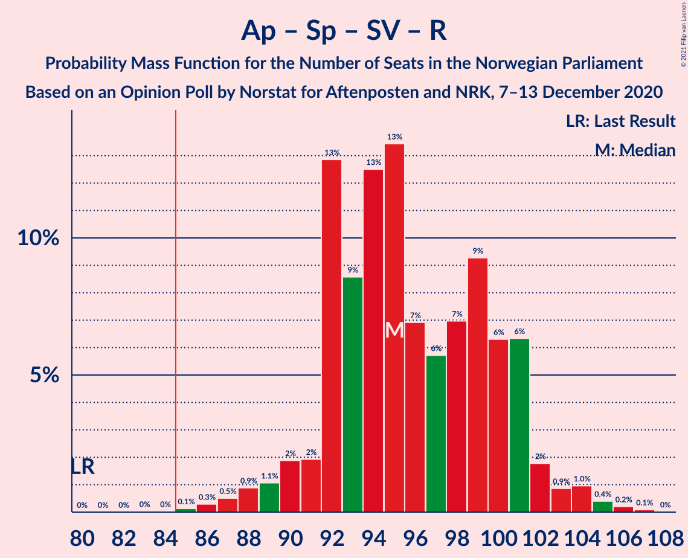

| Number of Seats | Probability | Accumulated | Special Marks |
|:---------------:|:-----------:|:-----------:|:-------------:|
| 80 | 0% | 100% | Last Result |
| 81 | 0% | 100% |  |
| 82 | 0% | 100% |  |
| 83 | 0% | 100% |  |
| 84 | 0% | 100% |  |
| 85 | 0.1% | 99.9% | Majority |
| 86 | 0.3% | 99.8% |  |
| 87 | 0.5% | 99.5% |  |
| 88 | 0.9% | 99.0% |  |
| 89 | 1.1% | 98% |  |
| 90 | 2% | 97% |  |
| 91 | 2% | 95% |  |
| 92 | 13% | 93% |  |
| 93 | 9% | 80% |  |
| 94 | 13% | 72% |  |
| 95 | 13% | 59% | Median |
| 96 | 7% | 46% |  |
| 97 | 6% | 39% |  |
| 98 | 7% | 33% |  |
| 99 | 9% | 26% |  |
| 100 | 6% | 17% |  |
| 101 | 6% | 11% |  |
| 102 | 2% | 4% |  |
| 103 | 0.9% | 3% |  |
| 104 | 1.0% | 2% |  |
| 105 | 0.4% | 0.7% |  |
| 106 | 0.2% | 0.3% |  |
| 107 | 0.1% | 0.1% |  |
| 108 | 0% | 0% |  |

### Arbeiderpartiet – Senterpartiet – Sosialistisk Venstreparti

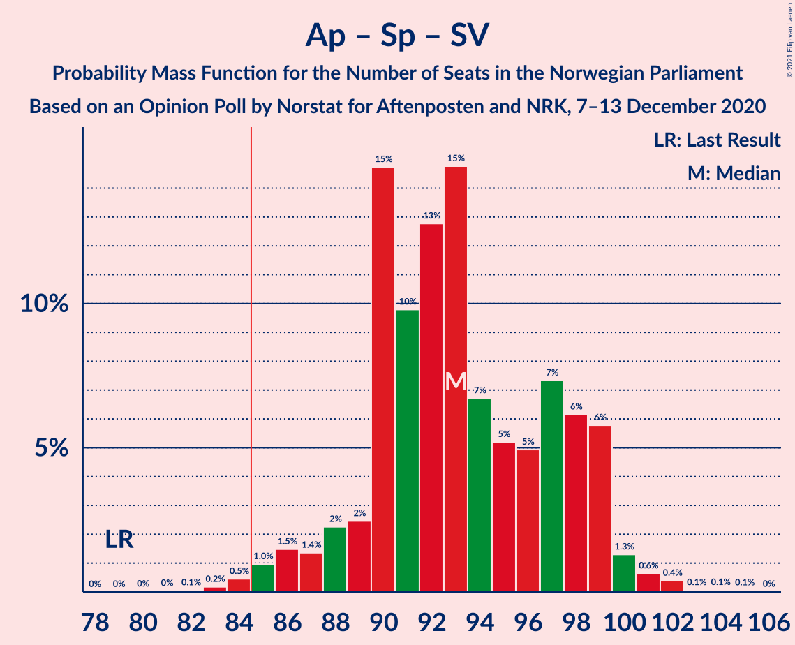

| Number of Seats | Probability | Accumulated | Special Marks |
|:---------------:|:-----------:|:-----------:|:-------------:|
| 79 | 0% | 100% | Last Result |
| 80 | 0% | 100% |  |
| 81 | 0% | 100% |  |
| 82 | 0.1% | 99.9% |  |
| 83 | 0.2% | 99.9% |  |
| 84 | 0.5% | 99.7% |  |
| 85 | 1.0% | 99.3% | Majority |
| 86 | 1.5% | 98% |  |
| 87 | 1.4% | 97% |  |
| 88 | 2% | 95% |  |
| 89 | 2% | 93% |  |
| 90 | 15% | 91% |  |
| 91 | 10% | 76% |  |
| 92 | 13% | 66% |  |
| 93 | 15% | 53% | Median |
| 94 | 7% | 39% |  |
| 95 | 5% | 32% |  |
| 96 | 5% | 27% |  |
| 97 | 7% | 22% |  |
| 98 | 6% | 14% |  |
| 99 | 6% | 8% |  |
| 100 | 1.3% | 3% |  |
| 101 | 0.6% | 1.2% |  |
| 102 | 0.4% | 0.6% |  |
| 103 | 0.1% | 0.2% |  |
| 104 | 0.1% | 0.1% |  |
| 105 | 0.1% | 0.1% |  |
| 106 | 0% | 0% |  |

### Arbeiderpartiet – Senterpartiet – Kristelig Folkeparti – Miljøpartiet De Grønne

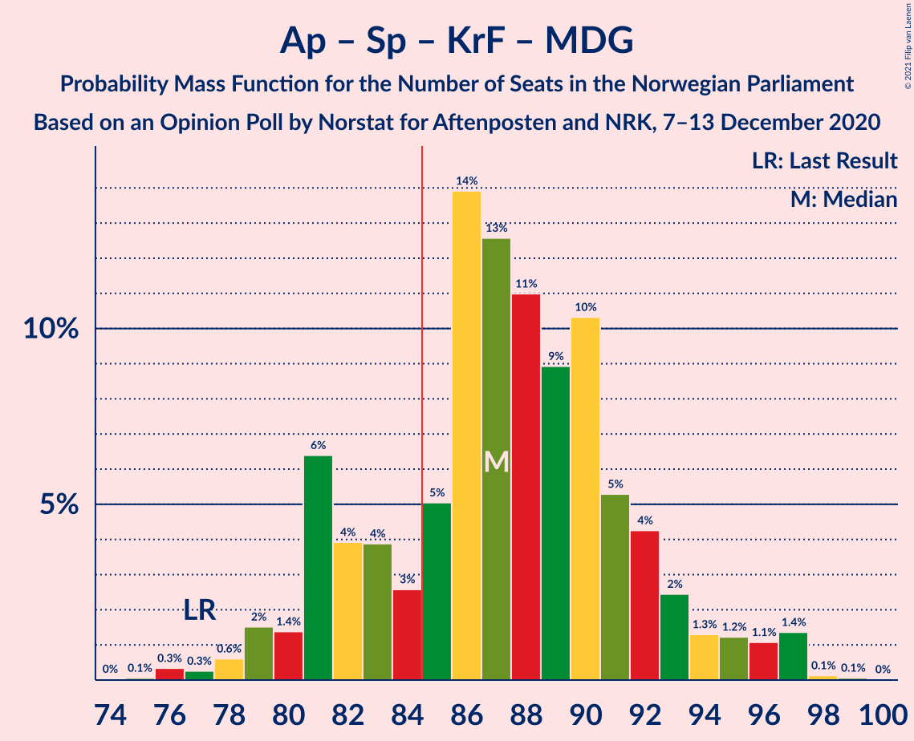

| Number of Seats | Probability | Accumulated | Special Marks |
|:---------------:|:-----------:|:-----------:|:-------------:|
| 74 | 0% | 100% |  |
| 75 | 0.1% | 99.9% |  |
| 76 | 0.3% | 99.9% |  |
| 77 | 0.3% | 99.5% | Last Result |
| 78 | 0.6% | 99.3% |  |
| 79 | 2% | 98.7% |  |
| 80 | 1.4% | 97% |  |
| 81 | 6% | 96% |  |
| 82 | 4% | 89% |  |
| 83 | 4% | 85% | Median |
| 84 | 3% | 82% |  |
| 85 | 5% | 79% | Majority |
| 86 | 14% | 74% |  |
| 87 | 13% | 60% |  |
| 88 | 11% | 47% |  |
| 89 | 9% | 36% |  |
| 90 | 10% | 28% |  |
| 91 | 5% | 17% |  |
| 92 | 4% | 12% |  |
| 93 | 2% | 8% |  |
| 94 | 1.3% | 5% |  |
| 95 | 1.2% | 4% |  |
| 96 | 1.1% | 3% |  |
| 97 | 1.4% | 2% |  |
| 98 | 0.1% | 0.2% |  |
| 99 | 0.1% | 0.1% |  |
| 100 | 0% | 0% |  |

### Arbeiderpartiet – Senterpartiet – Kristelig Folkeparti

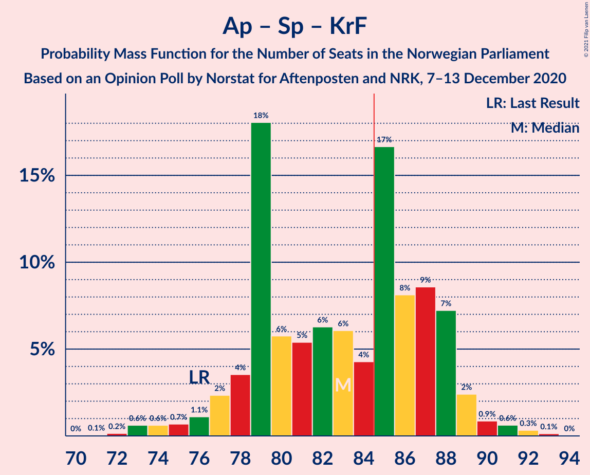

| Number of Seats | Probability | Accumulated | Special Marks |
|:---------------:|:-----------:|:-----------:|:-------------:|
| 71 | 0.1% | 100% |  |
| 72 | 0.2% | 99.9% |  |
| 73 | 0.6% | 99.8% |  |
| 74 | 0.6% | 99.1% |  |
| 75 | 0.7% | 98.5% |  |
| 76 | 1.1% | 98% | Last Result |
| 77 | 2% | 97% |  |
| 78 | 4% | 94% |  |
| 79 | 18% | 91% |  |
| 80 | 6% | 73% |  |
| 81 | 5% | 67% | Median |
| 82 | 6% | 62% |  |
| 83 | 6% | 55% |  |
| 84 | 4% | 49% |  |
| 85 | 17% | 45% | Majority |
| 86 | 8% | 28% |  |
| 87 | 9% | 20% |  |
| 88 | 7% | 12% |  |
| 89 | 2% | 4% |  |
| 90 | 0.9% | 2% |  |
| 91 | 0.6% | 1.1% |  |
| 92 | 0.3% | 0.5% |  |
| 93 | 0.1% | 0.2% |  |
| 94 | 0% | 0% |  |

### Arbeiderpartiet – Senterpartiet

| Number of Seats | Probability | Accumulated | Special Marks |
|:---------------:|:-----------:|:-----------:|:-------------:|
| 67 | 0% | 100% |  |
| 68 | 0% | 99.9% | Last Result |
| 69 | 0.2% | 99.9% |  |
| 70 | 0.3% | 99.7% |  |
| 71 | 1.2% | 99.4% |  |
| 72 | 1.5% | 98% |  |
| 73 | 2% | 97% |  |
| 74 | 3% | 95% |  |
| 75 | 4% | 92% |  |
| 76 | 4% | 87% |  |
| 77 | 25% | 83% |  |
| 78 | 17% | 59% | Median |
| 79 | 7% | 41% |  |
| 80 | 8% | 35% |  |
| 81 | 8% | 27% |  |
| 82 | 4% | 19% |  |
| 83 | 4% | 15% |  |
| 84 | 8% | 11% |  |
| 85 | 2% | 4% | Majority |
| 86 | 0.6% | 2% |  |
| 87 | 1.1% | 1.2% |  |
| 88 | 0.1% | 0.1% |  |
| 89 | 0% | 0.1% |  |
| 90 | 0% | 0% |  |

### Høyre – Fremskrittspartiet – Kristelig Folkeparti – Miljøpartiet De Grønne – Venstre

| Number of Seats | Probability | Accumulated | Special Marks |
|:---------------:|:-----------:|:-----------:|:-------------:|
| 62 | 0.1% | 100% |  |
| 63 | 0.2% | 99.9% |  |
| 64 | 0.4% | 99.7% |  |
| 65 | 1.0% | 99.3% |  |
| 66 | 0.9% | 98% |  |
| 67 | 2% | 97% |  |
| 68 | 6% | 96% |  |
| 69 | 6% | 89% |  |
| 70 | 9% | 83% | Median |
| 71 | 7% | 74% |  |
| 72 | 6% | 67% |  |
| 73 | 7% | 61% |  |
| 74 | 13% | 54% |  |
| 75 | 13% | 41% |  |
| 76 | 9% | 28% |  |
| 77 | 13% | 20% |  |
| 78 | 2% | 7% |  |
| 79 | 2% | 5% |  |
| 80 | 1.1% | 3% |  |
| 81 | 0.9% | 2% |  |
| 82 | 0.5% | 1.0% |  |
| 83 | 0.3% | 0.5% |  |
| 84 | 0.1% | 0.2% |  |
| 85 | 0% | 0.1% | Majority |
| 86 | 0% | 0% |  |
| 87 | 0% | 0% |  |
| 88 | 0% | 0% |  |
| 89 | 0% | 0% | Last Result |

### Høyre – Fremskrittspartiet – Kristelig Folkeparti – Venstre

| Number of Seats | Probability | Accumulated | Special Marks |
|:---------------:|:-----------:|:-----------:|:-------------:|
| 58 | 0.1% | 100% |  |
| 59 | 0.2% | 99.9% |  |
| 60 | 0.3% | 99.7% |  |
| 61 | 1.4% | 99.4% |  |
| 62 | 3% | 98% |  |
| 63 | 2% | 95% |  |
| 64 | 5% | 93% |  |
| 65 | 6% | 88% |  |
| 66 | 8% | 82% |  |
| 67 | 8% | 74% |  |
| 68 | 11% | 66% | Median |
| 69 | 9% | 55% |  |
| 70 | 9% | 45% |  |
| 71 | 9% | 36% |  |
| 72 | 8% | 27% |  |
| 73 | 8% | 19% |  |
| 74 | 4% | 11% |  |
| 75 | 4% | 7% |  |
| 76 | 1.2% | 3% |  |
| 77 | 0.8% | 2% |  |
| 78 | 0.5% | 0.8% |  |
| 79 | 0.2% | 0.3% |  |
| 80 | 0.1% | 0.1% |  |
| 81 | 0% | 0.1% |  |
| 82 | 0% | 0% |  |
| 83 | 0% | 0% |  |
| 84 | 0% | 0% |  |
| 85 | 0% | 0% | Majority |
| 86 | 0% | 0% |  |
| 87 | 0% | 0% |  |
| 88 | 0% | 0% | Last Result |

### Høyre – Fremskrittspartiet – Venstre

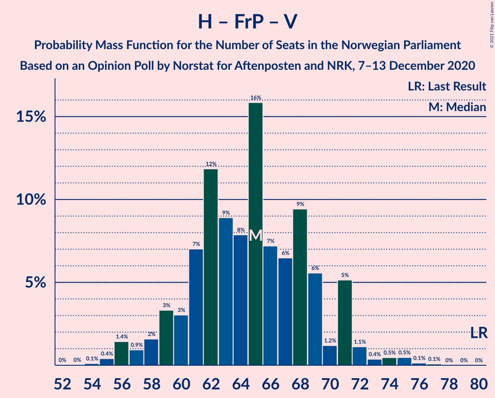

| Number of Seats | Probability | Accumulated | Special Marks |
|:---------------:|:-----------:|:-----------:|:-------------:|
| 54 | 0.1% | 100% |  |
| 55 | 0.4% | 99.8% |  |
| 56 | 1.4% | 99.4% |  |
| 57 | 0.9% | 98% |  |
| 58 | 2% | 97% |  |
| 59 | 3% | 95% |  |
| 60 | 3% | 92% |  |
| 61 | 7% | 89% |  |
| 62 | 12% | 82% |  |
| 63 | 9% | 70% |  |
| 64 | 8% | 61% |  |
| 65 | 16% | 54% | Median |
| 66 | 7% | 38% |  |
| 67 | 6% | 30% |  |
| 68 | 9% | 24% |  |
| 69 | 6% | 15% |  |
| 70 | 1.2% | 9% |  |
| 71 | 5% | 8% |  |
| 72 | 1.1% | 3% |  |
| 73 | 0.4% | 2% |  |
| 74 | 0.5% | 1.2% |  |
| 75 | 0.5% | 0.7% |  |
| 76 | 0.1% | 0.2% |  |
| 77 | 0.1% | 0.1% |  |
| 78 | 0% | 0% |  |
| 79 | 0% | 0% |  |
| 80 | 0% | 0% | Last Result |

### Høyre – Fremskrittspartiet

| Number of Seats | Probability | Accumulated | Special Marks |
|:---------------:|:-----------:|:-----------:|:-------------:|
| 50 | 0% | 100% |  |
| 51 | 0.1% | 99.9% |  |
| 52 | 0.3% | 99.9% |  |
| 53 | 0.6% | 99.6% |  |
| 54 | 2% | 99.0% |  |
| 55 | 1.2% | 97% |  |
| 56 | 2% | 96% |  |
| 57 | 4% | 94% |  |
| 58 | 4% | 90% |  |
| 59 | 7% | 86% |  |
| 60 | 13% | 79% |  |
| 61 | 9% | 66% |  |
| 62 | 7% | 58% |  |
| 63 | 15% | 50% | Median |
| 64 | 9% | 35% |  |
| 65 | 5% | 26% |  |
| 66 | 9% | 22% |  |
| 67 | 5% | 13% |  |
| 68 | 1.5% | 7% |  |
| 69 | 5% | 6% |  |
| 70 | 0.6% | 1.2% |  |
| 71 | 0.3% | 0.5% |  |
| 72 | 0.2% | 0.2% | Last Result |
| 73 | 0% | 0.1% |  |
| 74 | 0% | 0% |  |

### Arbeiderpartiet – Sosialistisk Venstreparti

| Number of Seats | Probability | Accumulated | Special Marks |
|:---------------:|:-----------:|:-----------:|:-------------:|
| 43 | 0.1% | 100% |  |
| 44 | 0.1% | 99.9% |  |
| 45 | 0.3% | 99.8% |  |
| 46 | 1.0% | 99.6% |  |
| 47 | 0.8% | 98.5% |  |
| 48 | 3% | 98% |  |
| 49 | 3% | 95% |  |
| 50 | 4% | 91% |  |
| 51 | 4% | 87% |  |
| 52 | 19% | 83% |  |
| 53 | 11% | 64% |  |
| 54 | 10% | 53% | Median |
| 55 | 15% | 43% |  |
| 56 | 12% | 28% |  |
| 57 | 7% | 17% |  |
| 58 | 4% | 9% |  |
| 59 | 2% | 5% |  |
| 60 | 2% | 3% | Last Result |
| 61 | 0.8% | 1.2% |  |
| 62 | 0.2% | 0.4% |  |
| 63 | 0.1% | 0.3% |  |
| 64 | 0.1% | 0.1% |  |
| 65 | 0% | 0.1% |  |
| 66 | 0% | 0% |  |

### Høyre – Kristelig Folkeparti – Venstre

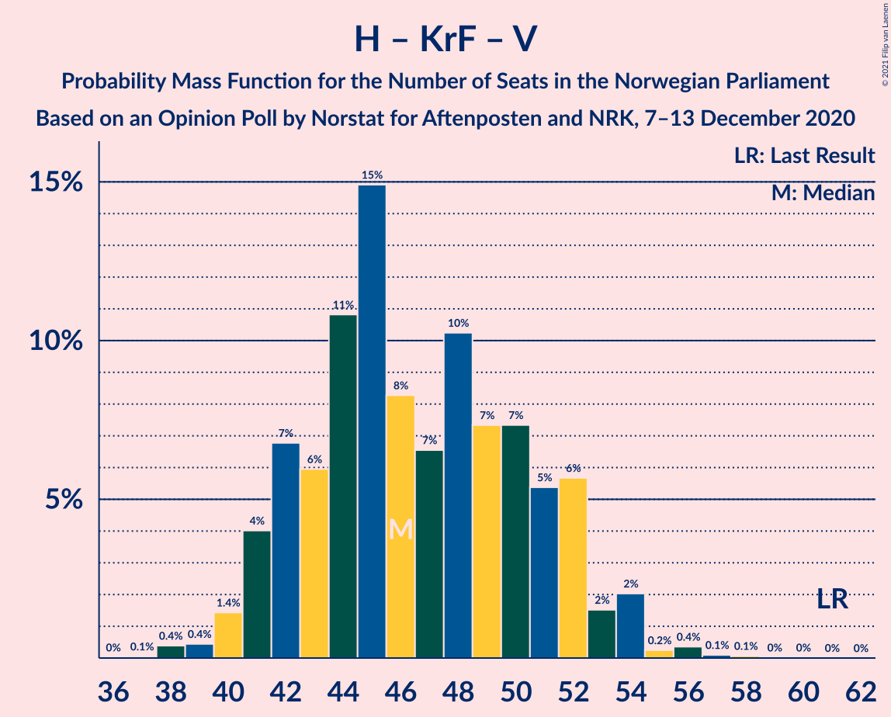

| Number of Seats | Probability | Accumulated | Special Marks |
|:---------------:|:-----------:|:-----------:|:-------------:|
| 37 | 0.1% | 100% |  |
| 38 | 0.4% | 99.9% |  |
| 39 | 0.4% | 99.5% |  |
| 40 | 1.4% | 99.1% |  |
| 41 | 4% | 98% |  |
| 42 | 7% | 94% |  |
| 43 | 6% | 87% |  |
| 44 | 11% | 81% |  |
| 45 | 15% | 70% | Median |
| 46 | 8% | 55% |  |
| 47 | 7% | 47% |  |
| 48 | 10% | 40% |  |
| 49 | 7% | 30% |  |
| 50 | 7% | 23% |  |
| 51 | 5% | 15% |  |
| 52 | 6% | 10% |  |
| 53 | 2% | 4% |  |
| 54 | 2% | 3% |  |
| 55 | 0.2% | 0.8% |  |
| 56 | 0.4% | 0.6% |  |
| 57 | 0.1% | 0.2% |  |
| 58 | 0.1% | 0.1% |  |
| 59 | 0% | 0% |  |
| 60 | 0% | 0% |  |
| 61 | 0% | 0% | Last Result |

### Senterpartiet – Kristelig Folkeparti – Venstre

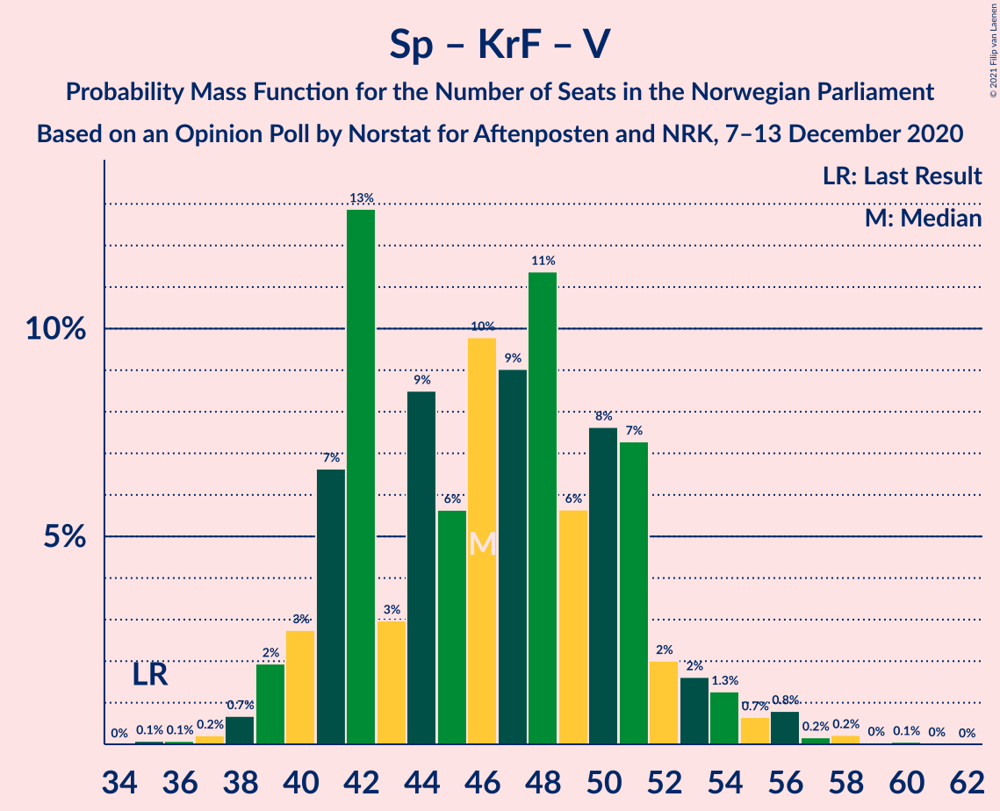

| Number of Seats | Probability | Accumulated | Special Marks |
|:---------------:|:-----------:|:-----------:|:-------------:|
| 35 | 0.1% | 100% | Last Result |
| 36 | 0.1% | 99.9% |  |
| 37 | 0.2% | 99.8% |  |
| 38 | 0.7% | 99.6% |  |
| 39 | 2% | 98.9% |  |
| 40 | 3% | 97% |  |
| 41 | 7% | 94% |  |
| 42 | 13% | 88% |  |
| 43 | 3% | 75% |  |
| 44 | 9% | 72% | Median |
| 45 | 6% | 63% |  |
| 46 | 10% | 58% |  |
| 47 | 9% | 48% |  |
| 48 | 11% | 39% |  |
| 49 | 6% | 27% |  |
| 50 | 8% | 22% |  |
| 51 | 7% | 14% |  |
| 52 | 2% | 7% |  |
| 53 | 2% | 5% |  |
| 54 | 1.3% | 3% |  |
| 55 | 0.7% | 2% |  |
| 56 | 0.8% | 1.3% |  |
| 57 | 0.2% | 0.5% |  |
| 58 | 0.2% | 0.4% |  |
| 59 | 0% | 0.1% |  |
| 60 | 0.1% | 0.1% |  |
| 61 | 0% | 0% |  |

## Technical Information

### Opinion Poll

+ **Polling firm:** Norstat
+ **Commissioner(s):** Aftenposten and NRK
+ **Fieldwork period:** 7–13 December 2020

### Calculations

+ **Sample size:** 952
+ **Simulations done:** 1,048,576
+ **Error estimate:** 1.94%

